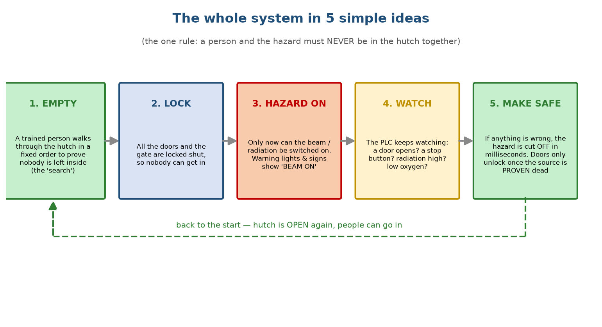
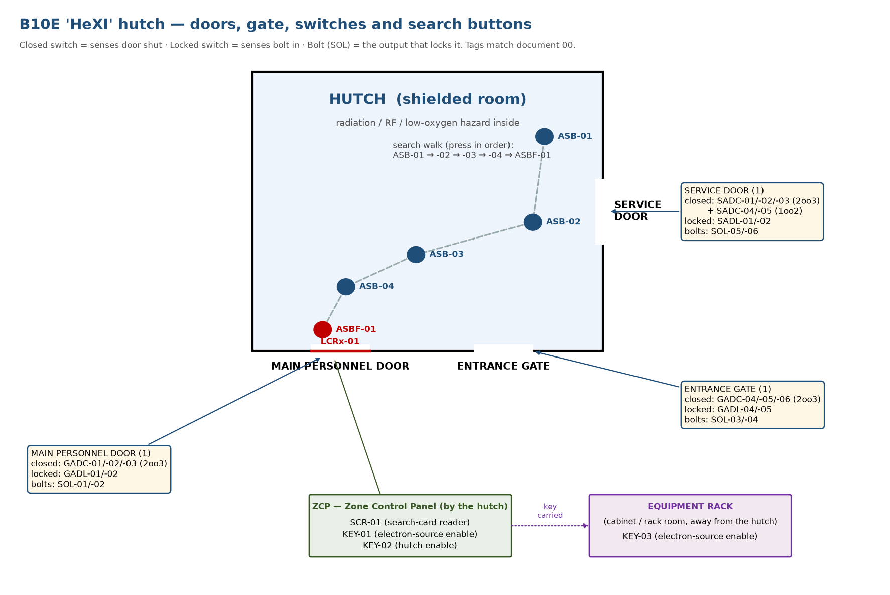
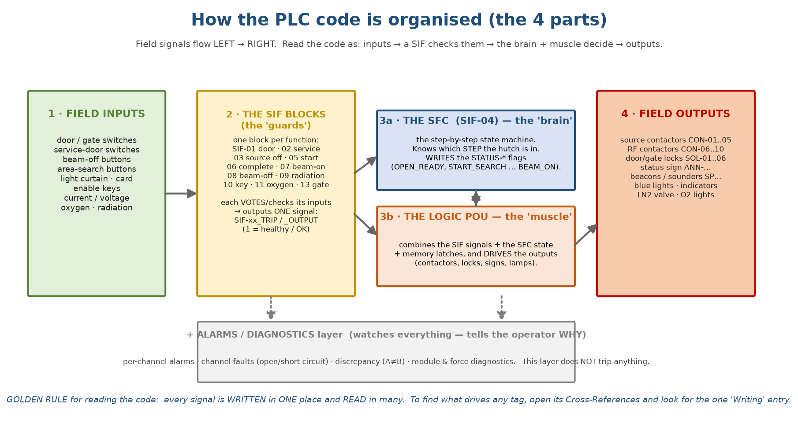

# START HERE — understand the B10E PSS (system · code · simulation)

*Written for a junior technical‑support engineer, by way of a functional‑safety
mentor. **This is the one document to read first.** It takes you from zero to
understanding the whole system, how the PLC code is built, and how to prove it to
yourself in SILworX offline simulation. The other documents (00 glossary, 03
program reference, 04 full test procedure) are deep reference — open them only when
you want more detail on one point.*

> Everything in this system rests on **one rule:**
> **a person and the hazard must never be in the hutch at the same time.**
> Every line of the PLC code exists to enforce that one rule. Keep it in mind and
> the rest falls into place.

**How to use this guide.** Work through the 6 short modules in order. Each has:
**Learn** (the idea), **See it** (where to look in SILworX), and **Try it** (a small
thing to force and watch in offline simulation). Do the *Try it* steps as you read —
you will understand far more by **driving** the code than by reading about it.

---

## Module 1 — The whole system in one picture

**Learn.** B10E "HeXI" is a beamline. Part of it is a shielded room — the **hutch** —
that can hold radiation, RF and low‑oxygen hazards. The PSS is an independent **HIMax
safety PLC** that runs continuously and enforces the one rule. It works as a loop:



There are **three ways into the hutch** — a **main personnel door**, an **entrance
gate**, and a **service door** — each with switches the PLC watches:



**See it.** In SILworX open the **Hardware** view: the whole plant is just **1
analogue‑input card, 3 digital‑input cards, 4 digital‑output cards** — a few dozen
switches in, a few dozen contactors and lamps out. That's it.

---

## Module 2 — How the PLC code is organised (the part most people miss)

**Learn.** The program *looks* huge (713 pages), but it is only **4 kinds of block**:



1. **The SIF blocks — the "guards."** One small block per safety function (`SIF‑01`
   … `SIF‑13`). Each takes a few inputs, applies **voting**, and produces **one**
   output (`SIF‑xx_TRIP` / `_OUTPUT` / `_START`) meaning *"this function is healthy."*
2. **The SFC — `SIF‑04` — the "brain."** A **state machine**: it sits in exactly one
   **step** at a time (OPEN_READY, START_SEARCH … BEAM_ON) and moves on
   **transitions**. It **writes** the `STATUS‑*` flags.
3. **The Logic POU — the "muscle."** It combines the SIF signals + the SFC state +
   memory latches and **drives the physical outputs** (contactors, locks, lamps).
4. **The Alarms / Diagnostics layer.** Watches everything and tells the operator
   *why* — it does **not** trip anything. Ignore it while you learn the safety logic.

> **The rule that makes 713 pages readable:** every signal is **written in exactly
> one place** and **read in many**. So to answer *"what drives this tag?"* you never
> read the whole program — you **right‑click the tag → Cross‑References → find the one
> `Writing` entry.** That single entry is the block that drives it.

**Try it.** Cross‑reference **`STATUS-OPEN_READY`**. You'll see many "Reading" entries
and exactly **one "Writing"** — in `B10E‑SIF‑04` (the SFC). Instantly you know the SFC
owns it.

---

## Module 3 — Read ONE function end‑to‑end (the technique you'll reuse)

Learn the method on **`SIF‑05` (Search Start)** — the permission that begins a search.

**See it.** Open `Library/SIF/B10E‑SIF‑05`. It is a **single AND gate**:

```
        ┌─ NOT( SCR-01 )            (search card)
        ├─ KEY-01                   (electron-source enable key)
        ├─ KEY-02                   (hutch enable key)
  AND ──┼─ SADC-04 , SADC-05        (service door, 1oo2 pair)
        ├─ 2oo3( SADC-01/02/03 )    (service door, 2oo3 set)
        └─ SIF-08_TRIP              (no beam-off button latched)
                     │
                     ▼
              BL10E-SIF-05_START
```

Read it simply: **all inputs true → output true.** Notice the small **circle (NOT)**
on `SCR‑01` — it inverts that one input.

> **Key lesson (and a correction to my earlier docs):** because of that inverter,
> **`SCR-01 = 0` means *card present*** (the active state), and `SCR-01 = 1` means *no
> card*. The card‑reader input rests at `1` and goes to `0` when a valid card is read.

**Follow the output.** Cross‑reference `BL10E‑SIF‑05_START`: its one use is the SFC
transition **`T_1`** (OPEN_READY → START_SEARCH). So this single gate **is** "the
permission to start a search."

**That's the whole technique:** open a SIF page → inputs → gate → one output →
cross‑reference the output to see where it's used. Repeat for any function.

---

## Module 4 — The behaviour: the states and how they move

**Learn.** The hutch is always in one **state** (one SFC step). **At power‑up it sits
in `OPEN_READY` and waits.**

| Step (the `STATUS‑*` flag) | Meaning | Value at power‑up |
|---|---|---|
| **`OPEN_READY`** | idle, ready to start a search | **TRUE** ← it starts here |
| `START_SEARCH` | a search has begun; service doors lock | FALSE |
| `HUTCH_ENTERED` | searcher passed the light curtain | FALSE |
| `ASB1 … ASB4` | the 4 area‑search buttons pressed in order | FALSE |
| `STANDBY` | search done, all doors locked, 180 s warning | FALSE |
| `BEAM_ON` | the hazard is live | FALSE |
| `OPEN` | end‑of‑cycle state (after beam‑off / source proven dead) | FALSE |

> **Correction:** the **first** step is `OPEN_READY`, **not** `OPEN`. `OPEN` is only a
> brief end‑of‑cycle step that loops back to `OPEN_READY`.

**Two timers police the search:** the whole search must finish within **180 s**, and
each step must take **5–60 s** (not too fast, not too slow). Break either, press a
wrong button, open a door, or hit a beam‑off → the search **aborts** to the start.

**See it.** Open the SFC pages of `SIF‑04`: each step is a box whose action sets its
`STATUS‑*` flag, and between boxes are the transitions (`T_1 … T_9`) with their
conditions.

---

## Module 5 — Do it yourself: one clean simulation run

Start your **offline simulation** and open a **Watch page** with the `STATUS‑*` flags
and the contactors `CON‑0x:EN`. Then:

**A. Healthy idle — should rest at `OPEN_READY`.** Force:

| Force | To | meaning |
|---|---|---|
| `GADC-01..06`, `SADC-01..05` | **1** | all doors/gate shut |
| `KEY-01`, `KEY-02`, `KEY-03` | **1** | keys in |
| `BOB-01..08 :A` and `:B` | **1** | no stop button pressed |
| `LCRx-01` | **1** | light curtain clear |
| **`SCR-01`** | **1** | **no card** *(this is the corrected polarity)* |
| `IT-01..03_TRIP`, `VT-01..03_TRIP`, `OXMON-01..04_TRIP` | **0** | analogue healthy — force the **trip flags** (the set‑points are fixed constants) |

Pulse `IOC-01-BOB:RESET`, `…-RDMN:RESET`, `…-GAS:RESET` once.
**Expect:** `STATUS-OPEN_READY = 1`, every other `STATUS‑* = 0`, all `CON‑0x:EN = 0`.

**B. Start a search.** Force **`SCR-01 = 0`** (present the card).
**Expect:** `STATUS-OPEN_READY → 0`, `STATUS-START_SEARCH → 1`; service locks
`SOL-05/06 → 1`.

**C. Walk the search** (wait ≥ 5 s between each):
- pulse `LCRx-01: 1→0→1` → `HUTCH_ENTERED`
- pulse `ASB-01` → `ASB1`; then `ASB-02`, `ASB-03`, `ASB-04`
- force the lock feedback `GADL-01/02/04/05` and `SADL-01/02 = 1`, then pulse
  `ASBF-01` → `STANDBY` (`SEARCHED_AND_LOCKED → 1`).

**D. Beam on.** Wait the 180 s beam delay with the operator enable.
**Expect:** `STATUS-BEAM_ON = 1`; `CON‑01..10:EN = 1` (hazard live).

**E. Trip it.** Force `GADC-01 = 0` then `GADC-02 = 0` (door open, 2oo3).
**Expect:** `CON‑01/02/03:EN → 0` instantly; `SEARCHED_AND_LOCKED → 0`. You must run a
**whole new search** to recover.

That single run exercises the **brain** (SFC), the **guards** (SIFs) and the **muscle**
(Logic). The full per‑function test set is document 04.

---

## Module 6 — The 7 things that will trip YOU up

Memorise these — they cause most of the confusion:

1. **OFF = SAFE** ("de‑energise to trip"): an output at `0` is the safe state
   (contactor open, door unlocked, valve closed).
2. **`_TRIP` / `_OUTPUT` signals are *permissives*** — `1` means **healthy/OK**, they
   drop to `0` to trip. (The word "TRIP" in the name is misleading.)
3. **`SCR-01` is inverted:** `0` = card present, `1` = no card.
4. **The system starts in `OPEN_READY` (TRUE at power‑up)**, not `OPEN`.
5. **`STATUS‑*` flags are written by the SFC** — to find what drives any tag, use
   **Cross‑References → the one `Writing` entry**.
6. **The analogue set‑points are fixed constants** (can't be forced) — in simulation,
   force the **`…_TRIP` flags** instead.
7. **Two timing layers** police the search: overall **180 s**, and **5–60 s** per step.

---

## Where to go when you want more depth
- exact meaning of any tag → **document 00 (glossary)**
- exact PLC logic, page by page → **document 03 (program reference)**
- full test of every safety function → **document 04 (SILworX test procedure)**

For *understanding the system and the code*, this one document is enough. Come back to
it whenever you lose the thread.
