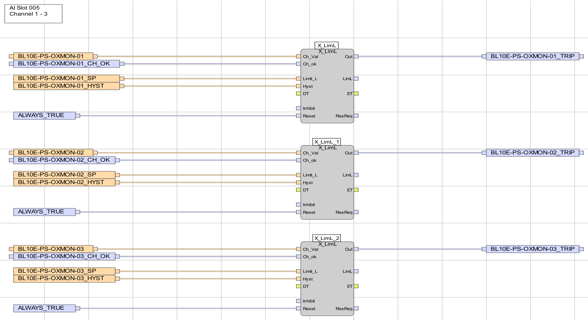
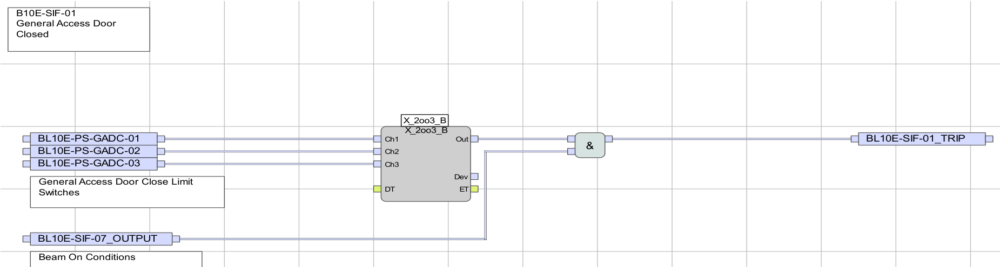
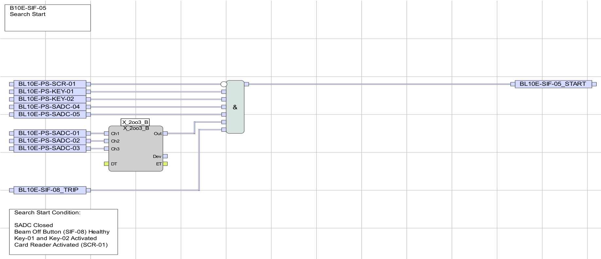
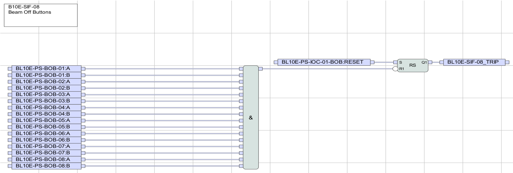
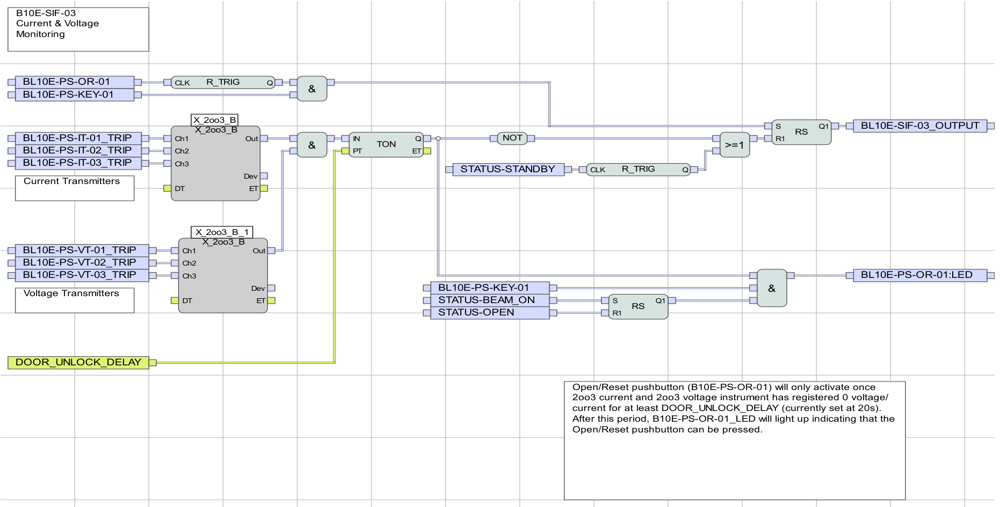
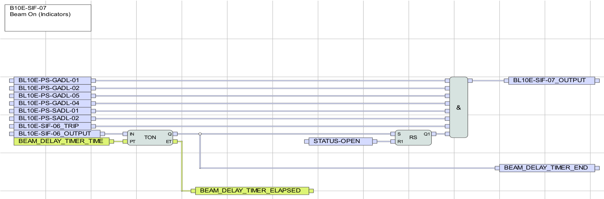
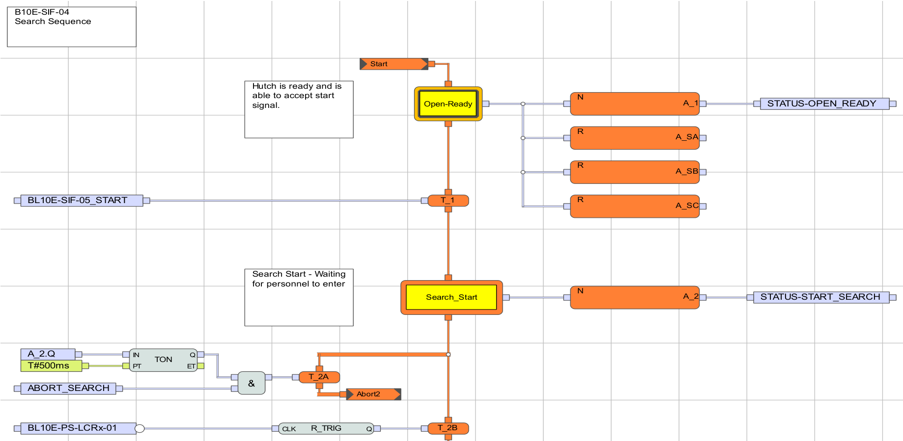
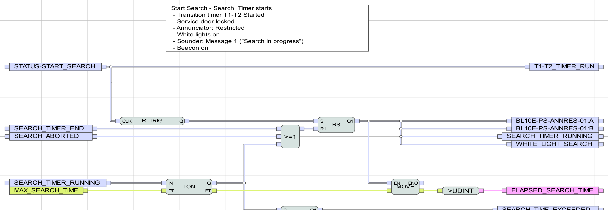
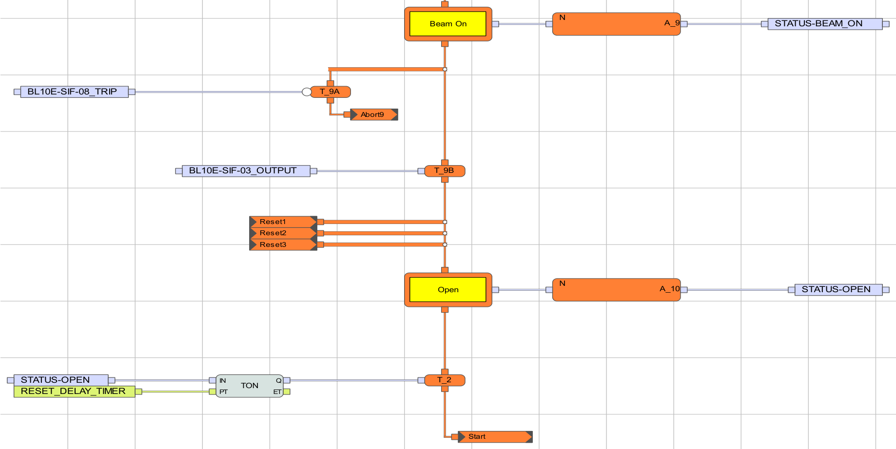
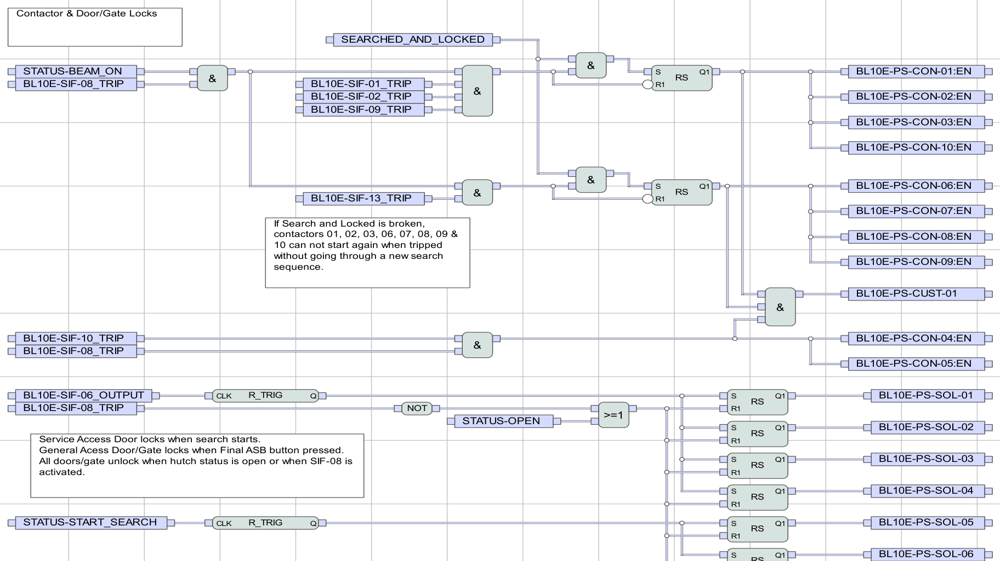

# 05 · Code walkthrough — the real PLC pages, explained one at a time

*This document shows the **actual SILworX logic pages** (taken straight from
`program.pdf`) with a plain explanation under each: **how that piece of code
works.** The picture *is* the code; the words under it tell you what it does. Read
it after `00_START_HERE` (the big picture); use `00_TAG_GLOSSARY` for any tag.*

**Three reminders — they apply to every page:**
1. **OFF = safe** (outputs are de‑energise‑to‑trip).
2. **A `_TRIP` / `_OUTPUT` signal is a *permissive*** — `1` = healthy/OK, it drops
   to `0` to trip.
3. **Read each page left → right:** inputs on the left → block(s) in the middle →
   the one output on the right.

**The handful of blocks you'll keep seeing** (you don't need to memorise them):

| Block | What it does |
|---|---|
| `X_LimL` / `X_LimH` | analogue **low / high limit** trip |
| `X_2oo3_B` | **2‑out‑of‑3 voter** |
| `&` | **AND** (all inputs `1` → output `1`) |
| `>=1` | **OR** (any input `1` → output `1`) |
| a small **○** on a wire | **NOT** (invert that signal) |
| `RS` / `SR` | **memory latch** (a trip "sticks" until reset) |
| `TON` / `TP` | **on‑delay / pulse timer** |
| `R_TRIG` | **rising‑edge** detector (acts on a 0→1 change) |

---

## A · The building blocks

### A1 — An analogue sensor becomes a trip flag · *Analogue Inputs (p.184)*

**How it works.** A 4–20 mA sensor is turned into a simple `0/1` **trip flag** by a
**limit block**. Here each oxygen monitor feeds an **`X_LimL`** ("trip when the
value goes **below** the limit"):
- `Ch_Val` ← the live reading `BL10E-PS-OXMON-0x`
- `Limit_L` ← the set‑point `…_SP`; `Hyst` ← the dead‑band `…_HYST`
- `Ch_ok` ← the channel‑health flag `…_CH_OK`; `Reset` ← `ALWAYS_TRUE`
- `Out` → the trip flag **`BL10E-PS-OXMON-0x_TRIP`**

So `OXMON-0x_TRIP` goes `1` when the oxygen reading drops below its set‑point. The
current/voltage channels are identical but use `X_LimH` ("trip when **above**").
The `_SP`/`_HYST` values are fixed constants — that's why, in simulation, you force
the **`_TRIP`** flag rather than the raw value.

---

## B · The guards — the SIF blocks

### B1 — Voting + permit · `SIF‑01` General Access Door (p.291)

**How it works.** Three independent door switches go into one **2‑out‑of‑3 voter**
(`X_2oo3_B`):
- `Ch1/Ch2/Ch3` ← `GADC-01 / -02 / -03`; the voter `Out` = `1` while **at least 2 of
  3** say "shut."
- `Out` is AND‑ed (`&`) with **`SIF-07_OUTPUT`** ("Beam On Conditions") →
  **`SIF-01_TRIP`**.

So the permissive `SIF-01_TRIP` is `1` only when the door is voted‑shut **and** the
beam‑on conditions hold. Open **2 of the 3** switches → `Out` → `0` → `SIF-01_TRIP`
→ `0` → the Logic POU drops the contactors. **This exact shape (3 switches → voter →
AND with `SIF‑07` → `SIF‑xx_TRIP`) is reused for the gate (`SIF‑13`) and the service
door (`SIF‑02`).**

### B2 — An AND‑gate permit (and the inverter!) · `SIF‑05` Search Start (p.344)

**How it works.** One **AND gate** decides whether a search may begin. Its output
`BL10E-SIF-05_START` is `1` only when **all** inputs are `1`:
`KEY-01`, `KEY-02` (keys on), `SADC-04`, `SADC-05` and the 2oo3 voter of
`SADC-01/02/03` (service door shut), `SIF-08_TRIP` (no beam‑off), and
**`NOT(SCR-01)`**.

> **Look at the small circle on the `SCR-01` line** — that is a **NOT**. So the card
> input is **inverted**: **`SCR-01 = 0` means *card present*** (and `1` = no card).
> This is the polarity that catches everyone out.

This single output is the transition `T_1` that steps the SFC from `OPEN_READY` →
`START_SEARCH` (see **C1**).

### B3 — A latched trip · `SIF‑08` Beam‑Off Buttons (p.363)

**How it works.** Each of the 8 buttons has two channels (`:A` and `:B`) AND‑ed
together; any button drives an **`RS` memory latch**:
- press → the latch flips → **`SIF-08_TRIP` → 0** (trip) — and it **stays** there
  even after you let go of the button;
- the only way back is the reset `…-BOB:RESET`.

That "stickiness" is a **latch**: a trip holds until an explicit reset — exactly what
an emergency stop must do. `SIF‑09` (radiation) and `SIF‑11` (oxygen) use the same
RS‑latch pattern, each with its own reset.

### B4 — Latch + timer + manual reset · `SIF‑03` "is the source really off?" (p.303)

**How it works.** This page proves the source is dead before doors may unlock.
Inside it you can pick out:
- **two 2oo3 voters** — current `IT‑01/02/03_TRIP` and voltage `VT‑01/02/03_TRIP`;
- a **`TON`** on‑delay timer set to `DOOR_UNLOCK_DELAY` (**20 s**);
- an **`R_TRIG`** on the Open/Reset button `OR-01`, and an **`RS`** latch.

So the unlock permit `SIF-03_OUTPUT` only appears after **both** current **and**
voltage have read ~zero **for 20 s**, the "press me now" lamp `OR-01:LED` lights, and
the operator actually presses `OR-01`. This is where the *command* (key/button) and
the *proof* (the transmitters) meet.

### B5 — Permit + dwell timer · `SIF‑07` Beam‑On (p.356)

**How it works.** The master beam‑on permit. The lock‑**confirmation** switches
(`GADL-…`, `SADL-…`) and `SIF-06` feed a **`TON`** timer set to `BEAM_DELAY_TIMER`
(**180 s**) and an `RS` latch → **`SIF-07_OUTPUT`**. So beam is only permitted once
**every lock is physically confirmed** *and* the **180 s "radiation imminent"**
warning has elapsed. (Note: it watches the lock *feedback*, not the lock *command* —
command ≠ confirmation.)

---

## C · The brain — the SFC (`SIF‑04`)

### C1 — The state machine: steps & transitions (p.326)

**How it works.** This is the **SFC** (the state machine). Read it top‑to‑bottom:
- Each **rounded box is a step** (`Open-Ready`, `Search_Start`, …). The **bold box
  `Open-Ready` is the *initial* step** — where the program sits at power‑up.
- Each step has an **action** (`N` = active while the step is active) that **writes a
  `STATUS‑*` flag** — e.g. `Open-Ready → A_1 → STATUS-OPEN_READY`.
- Between two steps is a **transition** (the small orange bar) with a **condition**.
  `T_1`'s condition is **`BL10E-SIF-05_START`** (from B2): when it's `1`, the SFC
  steps from `Open-Ready` to `Search_Start`.
- The `A_SA / A_SB / A_SC` boxes are the **abort** branches.

This single chart is **why only one `STATUS‑*` flag is true at a time**, and it is
the **one place those flags are written**.

### C2 — What a step does: Search Start effects (p.327)

**How it works.** Each step has a partner page that performs its **effects**. While
`STATUS-START_SEARCH` is active, this page locks the service doors, lights the
**RESTRICTED** annunciator (`ANNRES`), sounds speaker message 1, turns the white
lights on, and starts the **180 s search timer** (`SEARCH_TIMER_RUNNING`). The `RS`
latches hold those outputs for as long as the step is active.

### C3 — End of the cycle: Beam On → Open (p.336)

**How it works.** The tail of the chart. From the **`Beam On`** step, transition
`T_9A` (`SIF-08_TRIP`, a beam‑off) **or** `T_9B` (`SIF-03_OUTPUT`, source proven
dead) moves to the **`Open`** step. `Open` runs a `TON` set to `RESET_DELAY_TIMER`
(**60 s**), then loops back to `Start` — i.e. back to `Open-Ready`. So
`STATUS-OPEN` is true only **briefly at the end of a cycle**; the resting state is
`OPEN_READY`.

---

## D · The muscle — the Logic POU

### D1 — Driving the contactors: "no silent restart" (p.267)

**How it works.** This is where the SIF permissives + the SFC state actually
**switch the physical outputs**. Each contactor group is built from an **`RS` latch**
set by `SEARCHED_AND_LOCKED & STATUS-BEAM_ON` together with the relevant SIF
permissives:
- **source group `CON-01/02/03/10`** ← `SIF-08 & SIF-01 & SIF-02 & SIF-09`
- **gate/RF group `CON-06/07/08/09`** ← `SIF-13`
- **key group `CON-04/05`** ← `SIF-10 & SIF-08`

The on‑page note says it in plain words:

> *"If Search and Locked is broken, contactors 01, 02, 03, 06, 07, 08, 09 & 10 can
> not start again when tripped without going through a new search sequence."*

That latch is the **master safety property**: once a trip breaks
`SEARCHED_AND_LOCKED`, the hazard can **never** silently come back — only a complete
new search re‑arms it.

---

## How to use these pages in your own SILworX
1. Open the **same page** (its name/number is in the top‑left and bottom‑right of
   each picture — e.g. `B10E‑SIF‑05`) in your project.
2. Start **offline simulation**, **force an input**, and watch the **wire colours**
   change through the blocks to the output — you literally *see* the logic work.
3. To find what drives any signal, right‑click it → **Cross‑References** → the one
   **`Writing`** entry.

That's the whole code, in ten pictures.
