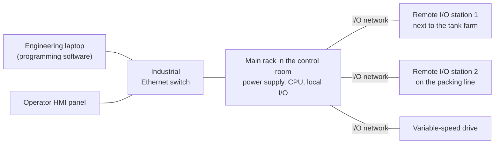
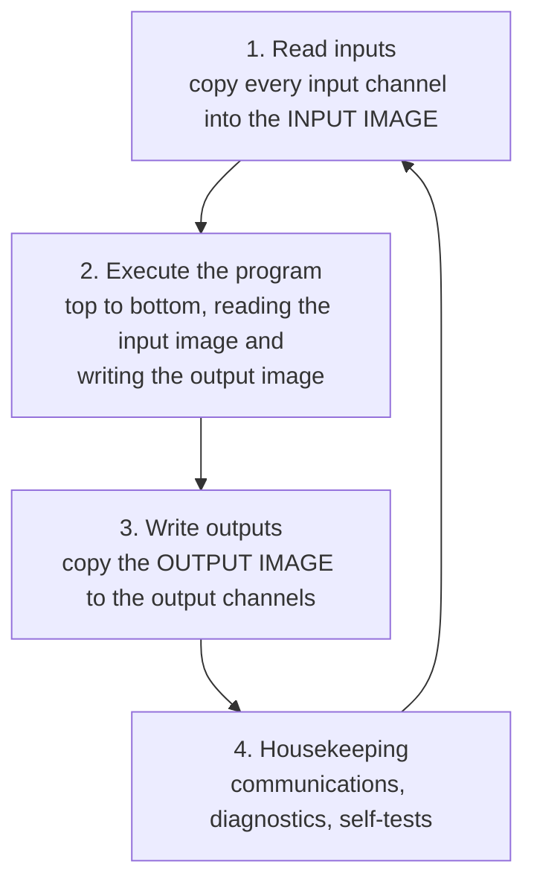
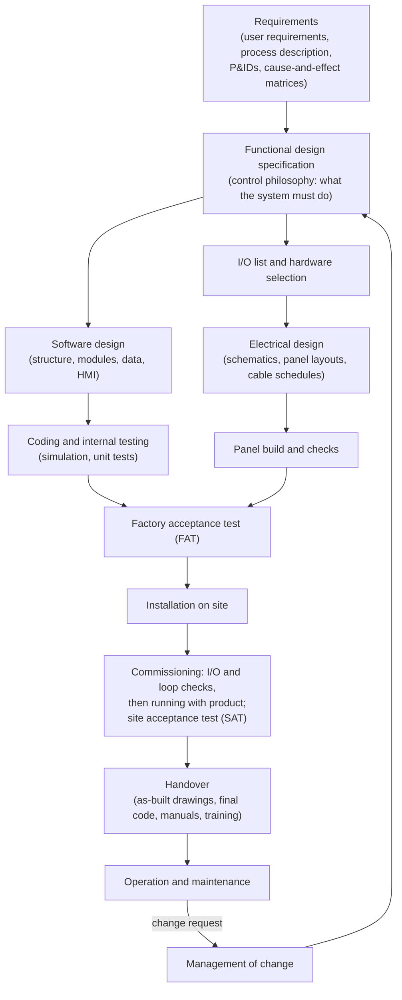

# 01 — What Is a PLC?

> **Level:** 1 — Foundations · **Time:** ~6–8 hours · **Prerequisites:** [Module 00](../00-start-here/)

A programmable logic controller (PLC) is an industrial computer that reads signals from the
plant (push-buttons, limit switches, level switches, 4–20 mA transmitters), runs a program
that decides what should happen, and drives outputs (contactors, solenoid valves, lamps,
control valves). Almost every machine and process plant built in the last few decades has one
or more of them.

This module explains where PLCs came from, what is inside one, and above all **how a PLC
runs its program: the scan cycle**. Nearly every "strange" PLC behaviour you will meet has
its roots in the scan cycle: a short pulse that never registered, a lamp that lags by one
scan, an output that refuses to switch on because a later rung switched it off again. The
module ends with the PLC landscape (other controller types, the main vendors, the IEC 61131-3
languages) and how a real PLC project runs from specification to maintenance. The two labs
practise Boolean logic and a classic bug that follows directly from the scan cycle.

## Learning objectives

By the end of this module you should be able to:

- Explain the problems of hard-wired relay control that led to the PLC, and summarise its
  origin in a few sentences.
- Identify the parts of a PLC system (power supply, CPU, memory, I/O and specialty modules,
  backplane, remote I/O, communication ports) and choose a suitable form factor for a job.
- Describe the four steps of the scan cycle and draw a timing diagram showing when an input
  change is seen and when an output changes.
- Calculate the chance of missing a short pulse and the worst-case response time of a PLC,
  and name ways to handle fast signals.
- Recognise, explain and fix a "last write wins" bug (an output written in two places).
- Compare a PLC with a relay panel, a microcontroller board, a PC, a DCS and a safety PLC.
- Name the main PLC vendors and their software, write the same small logic function in LD,
  FBD, ST and IL, and choose a suitable IEC 61131-3 language for a task.
- Describe the phases of a PLC project, the documents each produces, and who does what.

## 1. The problem PLCs solve

### Relay logic

Before PLCs, machine and plant control logic was built from **relays**: electromagnetic
switches whose coil, when energised, opens or closes a set of contacts. Chain enough relay
contacts together and you can build any on/off logic. AND is contacts in series, OR is
contacts in parallel, and a relay's own contact in parallel with its start button makes it
"remember" (the seal-in circuit from Lab 00-1). Timing relays add delays. A large machine
could need hundreds of relays, all wired to each other inside a big panel.

Here is a hard-wired start/stop circuit as an **electrical schematic**. It is not a PLC
program. The symbols show physical contacts, so the stop button's normally-closed contact is
drawn as an NC contact:

```text
 +24 V                                                              0 V
   |     S1 Stop        S2 Start                          K1         |
   |-------]/[--------+-----] [------+--------------------( )--------|
   |    (NC contact)  |   (NO)       |                  (relay coil)
   |                  |     K1       |
   |                  +-----] [------+
   |                   (K1's own NO contact: the seal-in)
```

This works, and relay logic is still used for small, simple jobs and inside safety circuits.
For anything bigger, it has serious drawbacks:

| Problem | What it meant in practice |
|---|---|
| **Every change is rewiring** | Adding one interlock meant new wires, maybe new relays and space for them, updated drawings, and downtime while it was done. A model change on a production line could mean rebuilding panels. |
| **Drawings drift from reality** | Quick fixes were often not put back on the drawings, so the next person fault-finding was working from wrong information. |
| **Troubleshooting is slow** | Finding a faulty contact among hundreds meant working through the circuit with a meter, line by line, often with the panel live. |
| **Size, heat and power** | Hundreds of relay coils take a lot of panel space and generate heat, and every coil draws current all the time it is energised. |
| **Wear** | Contacts and coils wear out and eventually fail, typically at the worst moment. |
| **Limited functions** | Counting, arithmetic, recording data and talking to other systems are clumsy or impossible with relays. |

### Where the PLC came from

The usual account runs like this. In 1968 engineers at General Motors' Hydra-Matic
(automatic transmission) division asked for a solid-state replacement for the relay panels on
their production lines: something that could be reprogrammed instead of rewired, would
survive the factory environment, and could be maintained by plant electricians and
engineers. Several companies responded. The design from Bedford Associates in Massachusetts,
the **Modicon 084** (its 84th project; "Modicon" comes from *modular digital controller*), is
widely credited as the first PLC, and **Dick Morley** is often called the father of the PLC.
Other manufacturers, including Allen-Bradley, followed within a few years.

One early decision still shapes PLCs today: the programs were drawn as **ladder diagrams**,
deliberately looking like the relay schematics that electricians already read. That is why
Ladder Diagram (LD) is still one of the most widely used PLC languages, and the dominant one
in North America (Module 04).

### So what is a PLC?

A PLC is a computer built for the plant floor. Compared with an office computer it:

- has **inputs and outputs designed for plant signals**: 24 V DC and mains-voltage digital
  signals, 4–20 mA and 0–10 V analog signals, thermocouples and RTDs;
- is built to survive **electrical noise, temperature, vibration and dust** in a control
  panel, and to run for years without a restart;
- runs one job, **repeatedly and predictably**: read inputs, run the program, write outputs,
  and again, typically every few milliseconds (the **scan cycle**, section 3);
- is programmed in **languages designed for control engineers and electricians**, above all
  those of the international standard IEC 61131-3 (section 6);
- can be **monitored online**: you can watch the program run, with live values on every
  contact and variable, which makes fault-finding much quicker than with relays;
- is supported for a **long time**, with spare parts and migration paths over decades.

## 2. Hardware anatomy

A typical modular PLC is a row of modules on a rail or in a rack:

```text
 +--------+--------+--------+--------+--------+--------+--------+
 | POWER  |  CPU   |   DI   |   DO   |   AI   |   AO   |  COMM  |
 | SUPPLY |        | 16 ch  | 16 ch  |  8 ch  |  4 ch  | module |
 |        | [RUN]  | 24 V DC| 24 V DC| 4-20mA | 4-20mA |        |
 |        | [ERR]  | ###### | ###### |        |        |        |
 |        | ETH    |        |        |        |        |        |
 +--------+--------+--------+--------+--------+--------+--------+
 |=================== backplane (data + power) ==================|
      |        |          |        |        |        |
   supply   network    field    field    field    field
   in       cable      wiring   wiring   wiring   wiring
```

### Power supply

The power supply module (or an external DIN-rail supply) converts the incoming supply
(for example 230 V AC or 120 V AC) into the low-voltage DC the CPU and modules need, often
24 V DC. Many designs use **separate 24 V supplies** for the PLC electronics and for the field
devices, so that a short circuit in a field cable cannot take the CPU down with it. Module 02
covers power supplies, fusing and the 0 V reference.

### The CPU

The CPU module (Siemens and others say CPU; Rockwell says *controller*) contains:

- **The processor**, which runs the operating system and your program.
- **Program memory**, holding your compiled program.
- **Data memory**, holding variables, timers, counters and the I/O images (section 3).
- **Retentive memory**: data that must survive a power cut, such as production totals,
  recipe values, or the fact that a machine was mid-cycle. What is retentive and how it is
  selected differs between platforms (Module 03).
- **Firmware**: the PLC's own operating system. Firmware versions matter: the programming
  software must support the version in the CPU, and firmware upgrades are planned changes,
  not something to do casually on a running plant.
- **Non-volatile storage**. Older PLCs kept their program and data in RAM backed by a
  battery, and a flat battery plus a power cut meant a lost program. Many current PLCs store
  the program in flash memory or on a memory card and use a capacitor or small energy store to
  save retentive data at power loss. Some still use a battery for the clock or retentive
  data. Siemens S7-1500 CPUs need a SIMATIC Memory Card inserted to run, for example, while
  Rockwell Logix controllers can keep a copy of the project on an SD card. Always know where
  the current program lives and keep a backup (Module 22).
- **Status LEDs** (RUN, STOP, ERROR, FORCE, communications) and often a **mode switch**
  (RUN/STOP, or Rockwell's RUN/REM/PROG).
- **Communication ports** (see below).

### I/O modules

I/O (input/output) modules connect the field wiring to the CPU. Each **channel** (also called
a point) handles one signal.

| Module type | Typical signals | Examples of field devices |
|---|---|---|
| Digital input (DI) | 24 V DC (most common), 120/230 V AC | push-buttons, limit switches, proximity sensors, level and pressure switches, auxiliary contacts |
| Digital output (DO) | transistor 24 V DC, relay contacts, triac (AC) | contactor coils, solenoid valves, pilot lamps, horns, interposing relays |
| Analog input (AI) | 4–20 mA, 0–10 V, RTD (Pt100), thermocouple | pressure, level, flow and temperature transmitters |
| Analog output (AO) | 4–20 mA, 0–10 V | control valve positioners, variable-speed drive speed references |

Modules differ in channel count (8, 16 and 32 channels are common for digital), isolation
between channels or groups, and diagnostics (for example wire-break detection). Module 02
covers the electrical side of I/O (sinking/sourcing, 2-wire and 3-wire sensors, relay versus
transistor outputs), and Module 14 covers analog signals in the PLC.

### Specialty modules

Some jobs are too fast or too specialised for ordinary I/O and the scan cycle:

- **High-speed counter (HSC) modules** count pulses from encoders and flow meters in
  hardware, at rates far above what the scan can see (Modules 08 and 19).
- **Motion and positioning modules** control servo drives and stepper motors (Module 19).
- **Communication modules** add networks the CPU does not have built in: serial Modbus,
  PROFIBUS, a second Ethernet network, and others (Module 17).
- Others exist for weighing, temperature control, energy measurement, and more.

### Backplane, racks and remote I/O

The **backplane** carries data and power between modules. Older and large systems use a
**rack** (chassis) with fixed slots. Many newer ones clip modules side by side on a DIN rail
with bus connectors between them.

I/O does not have to sit next to the CPU. **Remote (distributed) I/O** stations are placed
near the plant and connect to the CPU over a network such as PROFINET, EtherNet/IP, EtherCAT
or Modbus TCP. That saves long multi-core cables back to the control room. The cost is a
network delay, which adds to the response time (section 3).



### Communication ports

Most current CPUs have at least one **Ethernet** port for programming, HMI/SCADA connections
and PLC-to-PLC data, and often a second one or a built-in fieldbus for I/O. Many also have
**serial** ports (RS-232 or RS-485, typically for Modbus RTU), **USB** for programming, or a
memory-card slot. Module 17 covers industrial networks and Module 18 covers HMI and SCADA.

### Form factors

| Form factor | What it is | Typical examples | Where it fits |
|---|---|---|---|
| **Smart relay / nano PLC** | Very small controller with built-in I/O, a small display and keys, simple function-block programming | Siemens LOGO!, Schneider Zelio Logic | Lighting, pumps, gates, small machines |
| **Compact ("brick", micro PLC)** | CPU, power supply and a fixed set of I/O in one housing, sometimes with a few expansion modules | Siemens S7-1200, Allen-Bradley Micro800, Mitsubishi iQ-F (FX5), AutomationDirect CLICK | Small machines, skids, packaged units |
| **Modular** | CPU plus separate I/O modules added as needed, usually on a DIN rail | Siemens S7-1500, Allen-Bradley CompactLogix | Most machines and medium-sized plants |
| **Rack-based** | Modules plug into a chassis with a backplane, often with hot-swap and redundancy options | Allen-Bradley ControlLogix, Schneider Modicon M580 | Large machines, process plants, utilities |
| **Soft PLC / industrial PC** | PLC runtime software on an industrial PC with a real-time kernel, I/O over a fieldbus | Beckhoff TwinCAT, CODESYS Control, Siemens software controllers | High-performance machines, motion, lots of data handling |
| **PAC** (programmable automation controller) | A marketing term from the early 2000s for controllers combining PLC logic with motion, process control and PC-like data handling. Today the line between "PLC" and "PAC" is blurred. | Rockwell calls ControlLogix a PAC | — |
| **Safety PLC** | Controller certified for safety functions, with redundant processors, self-diagnostics and special safety I/O | Allen-Bradley GuardLogix, Siemens F-CPUs, Pilz, HIMA, Triconex | Machine safety, process safety instrumented systems (Module 20) |
| **Redundant (hot-standby)** | Two CPUs: one runs the plant, the other tracks it and takes over without stopping the process if the first fails | ControlLogix redundancy, Siemens S7-1500R/H, Modicon M580 Hot Standby | Plants where a controller failure is very costly: utilities, oil and gas, continuous processes |

Note that **redundancy is about availability, not safety**. A redundant PLC keeps the plant
running when a CPU fails. A safety PLC makes sure a dangerous situation is detected and acted
on. Some systems are both, but these are separate requirements.

## 3. The scan cycle

This is the most important section of the module. A PLC does not respond to its inputs
continuously, the way a relay coil does. It runs its program over and over in a loop called
the **scan cycle** (Siemens: *program cycle*). Each pass through the loop is one **scan**.

### The four steps



1. **Read inputs.** The CPU reads every input channel and stores the values in an area of
   memory called the **input image** (also *process image input*, PII, in Siemens terms, or
   the input image table in older Allen-Bradley PLCs). From now until the next scan, the
   program sees these stored values, however the real signals change.
2. **Execute the program.** The CPU runs the user program **from top to bottom**: rung 1,
   rung 2, and so on in Ladder, or statement by statement in Structured Text. Every
   instruction reads from the input image and from internal memory, and writes its results
   to internal memory and to the **output image** (*process image output*, PIQ). Writing an
   output in the program changes only the output image, not the terminal.
3. **Write outputs.** When the program has finished, the CPU copies the output image to the
   output modules. Only now do the output terminals change.
4. **Housekeeping.** The CPU serves communications (the programming laptop, HMIs, other
   PLCs), updates diagnostics, runs self-tests, and then starts the next scan.

Here is one scan on a time line:

```text
          |<------------------- one scan (for example 10 ms) ------------------->|
   -------+-------+-----------------------------------+---------+----------------+-------+---
     ...  | read  |       execute the program         |  write  |  housekeeping  | read  | ...
          |inputs | rung 1, rung 2, ... rung N        | outputs | comms, diags   |inputs |
   -------+-------+-----------------------------------+---------+----------------+-------+---
          ^                                           ^
          input image is frozen here                  output terminals change here
```

The **scan time** (cycle time) is the time for one complete pass. It depends on how long the
program is, what it does (floating-point maths and communication instructions take longer
than a contact), the speed of the CPU, and how much communication the CPU is handling.

### Why a process image?

Freezing the inputs for the whole scan makes the program **consistent**. If an input could
change between rung 10 and rung 20, two rungs could see different values of the same input
in the same scan, and logic that looked correct on paper could misbehave now and then. With a
process image, every rung in a scan sees the same snapshot of the plant.

Not every PLC works exactly like this. Some platforms update I/O asynchronously to the
program, and most offer ways to bypass the image for particular signals (see *Vendor notes*).
The four-step model is still the right mental model to start with, and it is exactly what the
course's `plctest` runner and the OpenPLC Runtime do.

### Consequence 1: inputs are sampled once per scan

The PLC sees each input only at the moment it is read. A change that happens just after
the read has to wait for the next scan. The program never sees what happens *between* reads.

### Consequence 2: a pulse shorter than one scan can be missed

Suppose a photo-eye gives a 3 ms pulse and the PLC scans every 10 ms (one character below is
1 ms; `R` marks each input read):

```text
 time (ms)        0         10        20        30        40
                  |         |         |         |         |
 input read       R         R         R         R         R    R = input image updated
                                __
 field input      _____________|  |__________________________  3 ms pulse, 13-16 ms
 input image      ___________________________________________  never TRUE: pulse missed
```

The pulse starts after the read at 10 ms and is over before the read at 20 ms, so the input
image never sees it. With a different timing the same pulse **is** caught:

```text
 time (ms)        0         10        20        30        40
                  |         |         |         |         |
 input read       R         R         R         R         R    R = input image updated
 output write             W         W         W         W      W = output image sent to the modules
                                     __
 field input      __________________|  |_____________________  3 ms pulse, 18-21 ms
                                       _________
 input image      ____________________|         |____________  TRUE for exactly one scan
                                               _________
 lamp output      ____________________________|         |____  Lamp := input: on 28-38 ms
```

Two lessons are hidden here. Whether a short pulse is seen is a matter of **luck**: it
depends on where the pulse falls relative to the reads (Worked example 1 calculates the odds).
And when a short pulse *is* caught, the program sees it for exactly one scan. The PLC
effectively stretches it to one scan time.

### Consequence 3: outputs change only at the end of the scan

```text
 time (ms)        0         10        20        30        40
                  |         |         |         |         |
 input read       R         R         R         R         R
 output write             W         W         W         W
                      _______________________________________
 start switch     ___|                                         closes at 3 ms
                             ________________________________
 input image      __________|                                  updated at 10 ms
                                 ____________________________
 Motor (memory)   ______________|                              rung solved at ~14 ms
                                     ________________________
 output terminal  __________________|                          changes at 18 ms
```

The switch closed at 3 ms. The PLC noticed at 10 ms, the program set `Motor` at about 14 ms,
but the output terminal did not change until the outputs were written at 18 ms. The
**response time** of a PLC is therefore always more than the time to solve one rung (Worked
example 3).

### Consequence 4: last write wins

Because only the **final** value in the output image reaches the terminal, an output written
in two places in the program ends up with whatever the **last** write put there. The earlier
write is lost, even though the variable briefly held that value in memory. This is the
"double coil" bug of Ladder and one of the most common errors in real PLC programs, usually
introduced when someone adds a new condition at the bottom of an old program instead of
editing the existing rung. Worked example 2 walks through it, and Lab 01-2 has you fix one.

The rule that avoids it: **each output (and each internal variable that acts like one) should
be written in one place**. Build the conditions first, then combine them into a single
assignment. Some patterns write a variable more than once on purpose (set/reset coils in
Module 04, or "default value first, then override" in Structured Text). They work because the
programmer knows the last write wins and uses that deliberately.

### Consequence 5: state carries over from scan to scan

Variables keep their values from one scan to the next unless the program changes them. That
is what makes the seal-in circuit work: in each scan, `Motor := (StartPB OR Motor) AND
StopPB_NC` reads the value of `Motor` left by the *previous* scan (Worked example 4).

It also means that **the order of the program matters**. If a rung reads a variable that is
written further down, it gets last scan's value:

```iecst
RunLamp := Motor;     (* rung 1: reads Motor as the PREVIOUS scan left it *)
Motor   := StartPB;   (* rung 2: updates Motor for this scan              *)
```

When `StartPB` goes TRUE, `Motor` becomes TRUE in that scan, but `RunLamp` follows one scan
later. For a lamp nobody will notice a 10 ms lag. In logic where two values must be
consistent, such as edge detection, sequences and handshakes with other systems, a one-scan
lag causes real bugs. The habit that avoids them is to **write the program in the order the
data flows**: read and condition inputs, then work out internal logic, then write outputs.

### How long is a scan?

Scan times vary widely. A small program on a modern compact PLC often scans in a millisecond
or less, and large programs on big controllers can take tens of milliseconds. Older PLCs were
slower. Communication load, heavy maths and long loops all add time. Every PLC reports its
scan time in its online diagnostics, usually as last, minimum and maximum values. Look at
these on any system you work on, because they tell you how fast the plant can be controlled.

### The scan-time watchdog

If a scan ever takes too long, something is wrong: typically an endless loop, or a loop that
runs far more times than intended (Module 10). The CPU therefore has a **scan-time
watchdog**, a maximum cycle time set in the CPU or task configuration. If a scan exceeds it,
the CPU raises a fault. Depending on the platform and how it is configured, that may call an
error-handling routine or stop the CPU. A CPU that stops puts its outputs into their
configured safe state, which usually means off.

The watchdog is a **protection against a hung program**, not a way to meet timing
requirements. A program that runs at 140 ms with a 150 ms watchdog is legal, but it is
probably too slow for the machine.

### Cyclic versus free-running execution

There are two ways to decide when the next scan starts:

- **Free-running (continuous)**: the next scan starts as soon as the previous one (plus
  housekeeping) has finished. The scan time varies from scan to scan as the program takes
  different paths. Siemens' main program cycle (OB1) and a Rockwell *continuous task* work
  this way.
- **Cyclic (periodic)**: scans start at a fixed interval, for example every 10 ms, and the CPU
  is idle or does other work in between. Sampling at an exact, constant rate matters for PID
  control (Module 15), filters and rate-of-change calculations. Siemens cyclic interrupt OBs,
  Rockwell *periodic tasks*, CODESYS cyclic tasks and the OpenPLC Runtime work this way. All
  the labs in this course use a cyclic task with a 10 ms interval.

If a cyclic task has not finished when its next start is due, that is an **overrun**. Most
PLCs count or report overruns, and repeated overruns point to a program that is too heavy for
its interval.

### Interrupts and multiple tasks (a preview of Module 11)

A PLC can run more than one **task**. A fast periodic task might handle a critical conveyor
tracking function every 2 ms while a slower one handles the HMI data every 100 ms. **Event
or interrupt tasks** run when something happens: a hardware interrupt input, a
communication event, a fault. Tasks have **priorities**, so a higher-priority task interrupts
a lower one. This is powerful but brings its own traps (data shared between tasks can change
in the middle of a scan), so Module 11 treats it properly. Until then, think of every
program as running in one cyclic task, as in the labs.

### Operating modes and start-up

- In **RUN** the CPU executes the scan cycle. In **STOP** (or PROGRAM) it does not run your
  program, and the outputs go to a defined state, usually off. Many output modules can be
  configured to hold their last value or go to a substitute value instead. Know what yours
  do before you stop a CPU on a running plant.
- At **start-up** the CPU initialises non-retentive variables, keeps retentive ones, and can
  run a special first-scan or start-up routine (Modules 03 and 06). "What happens when the
  power comes back?" is a design question you must answer for every machine. The usual answer
  is that nothing starts by itself (Module 02).

### How `plctest` models the scan

The lab runner uses exactly the four-step model. Each `scan` in a `.test` file advances the
PLC clock by the task interval (10 ms), runs your program once from top to bottom, and then
the `expect` lines look at the values your program left behind, which is what an output
module would receive. A `set` changes an input between scans, just as a real signal would
change between two input reads. Every scenario starts with a fresh PLC, all variables at
their initial values: a cold start.

## 4. The PLC compared with other controllers

PLCs are not the only way to control things. This comparison is about typical products in
each category. There are industrial-grade exceptions in almost every column.

| | Relay panel | Microcontroller board (e.g. Arduino) | Office PC | PLC | DCS | Safety PLC |
|---|---|---|---|---|---|---|
| **Ruggedness** | Good: industrial relays and terminals | Low for hobby boards; needs an industrial enclosure, supply and protection | Low (industrial PCs exist) | High: designed and tested for control panels | High | High |
| **Determinism** (predictable timing) | Parallel and immediate, limited by relay operate times | Possible, but entirely up to the programmer | Poor with a normal operating system; soft PLCs add a real-time kernel | Good: cyclic tasks, scan-time watchdog | Good: fixed-period control execution | Good, plus extensive self-diagnostics |
| **I/O** | One set of contacts per function | 3.3 V or 5 V logic pins; 24 V and 4–20 mA need interface circuits | None without add-on hardware | Plant signals directly: 24 V DC, mains AC, 4–20 mA, RTD, thermocouple | Large, often redundant I/O; intrinsically safe options | Certified safety I/O with wiring diagnostics |
| **Maintainable by plant electricians** | Yes, with drawings and a meter | Rarely: needs a software developer | No | Yes: Ladder with live values, status LEDs, standard tools | Usually by trained instrument/control technicians and engineers | Restricted on purpose: changes are controlled and re-validated |
| **Online changes** | Rewiring, usually with the plant stopped | Reflash and restart | Depends on the application | Often possible while running (with care, Module 23) | Yes, designed for continuous processes | Limited and controlled |
| **Lifecycle and spares** | Simple parts, available for decades | Boards change quickly | Models change every year or two | Long product lives with migration paths | Long; vendor support agreements | Long, with certification maintained |
| **Certifications** | Component standards | Usually none for industrial control | None for control | Industrial standards (for example IEC 61131-2), CE/UL; hazardous-area and marine versions exist | As PLC, plus process-industry options | Certified to functional-safety standards (IEC 61508, ISO 13849) by an independent body |
| **Typical use** | Very small circuits, and hard-wired safety circuits | Prototypes, hobby projects, some OEM products | Data, reporting, HMI/SCADA servers | Machines, packaged units, many process plants | Large continuous and batch process plants | Safety functions: e-stops, guards, burner management, process trips |

A **DCS** (distributed control system) is a plant-wide system built around process control:
controllers, I/O, operator stations, alarm management and a historian are engineered from one
database. Examples include Emerson DeltaV, Honeywell Experion PKS, Yokogawa CENTUM, ABB
800xA and Siemens PCS 7. The line between large PLC systems and DCSs has blurred, but DCSs
remain the usual choice for large continuous process plants. PLCs dominate machines.

A **safety PLC** is not simply a reliable PLC. It is designed and certified so that its own
failures are detected and lead to a safe state, and it is used under a functional-safety
lifecycle. A standard PLC must not be relied on for a safety function (Module 20).

## 5. The vendor landscape

Many companies make PLCs, and each has its own engineering software. The ideas in this
course carry over to all of them.

| Vendor | Controller families (examples) | Engineering software | Notes |
|---|---|---|---|
| **Siemens** | LOGO!, S7-1200, S7-1500, ET 200SP CPUs; older S7-300/S7-400 | TIA Portal (STEP 7); older STEP 7 (SIMATIC Manager); LOGO!Soft Comfort | ST is called **SCL**. Very widely used in Europe and many other regions. |
| **Rockwell Automation (Allen-Bradley)** | Micro800 (e.g. Micro820/850); CompactLogix and ControlLogix; older PLC-5, SLC 500, MicroLogix | Connected Components Workbench (Micro800); Studio 5000 Logix Designer (Logix); RSLogix 5/500 for the older families | Tag-based addressing (Module 03). The market leader in North America. |
| **Schneider Electric** | Modicon M221, M241, M251, M262 (machines); M340, M580 (process, infrastructure) | EcoStruxure Machine Expert (CODESYS-based), Machine Expert – Basic (M221); EcoStruxure Control Expert (formerly Unity Pro) for M340/M580 | Modicon is the brand of the first PLC, and Modbus came from Modicon. |
| **Mitsubishi Electric** | MELSEC iQ-F (FX5), iQ-R, Q and L series | GX Works2, GX Works3 | Strong in Asia. |
| **Omron** | CP1 series, NJ/NX series | CX-Programmer (CP), Sysmac Studio (NJ/NX) | NJ/NX are programmed in IEC 61131-3 languages. |
| **Beckhoff** | Industrial PCs and embedded PCs with EtherCAT I/O | TwinCAT | PC-based control. TwinCAT's PLC part is closely related to CODESYS. |
| **CODESYS-based brands** | WAGO, ifm, Festo, Eaton, Bosch Rexroth and many others | CODESYS or a vendor-branded version of it | Learn CODESYS once and you can program hundreds of brands. |
| **ABB** | AC500 | Automation Builder | ABB also makes DCSs (800xA) and owns B&R (Automation Studio). |
| **AutomationDirect** | CLICK, Productivity, BRX | Free software for each family | Low-cost PLCs, mainly in North America. |
| **OpenPLC** | Runs on PCs, Raspberry Pi and some microcontroller boards | OpenPLC Editor and Runtime | Open source. It uses MATIEC, the compiler behind `plctest`. |

Which vendor you meet depends heavily on country, industry and the company's history, so
treat any "market share" statement with caution. As a rough guide only: Siemens is very
common in Europe and many other regions, Rockwell dominates in North America, Mitsubishi and
Omron are strong in Asia, and CODESYS-based controllers appear everywhere. Product names,
software and licensing change often, so check the vendor's website for the current range.

## 6. IEC 61131 and the five languages

### The IEC 61131 family

**IEC 61131** is the international standard series for programmable controllers. The part
that matters most to programmers is **IEC 61131-3: Programming languages**. It defines the
data types, variables, program organisation units (programs, function blocks, functions), the
standard function blocks such as timers and counters, and the languages. Other parts cover
the general definitions (part 1) and the equipment's electrical and environmental
requirements and tests (part 2, which defines, among other things, the behaviour of standard
digital inputs). Part 9 defines the single-drop sensor interface better known as IO-Link
(Module 17).

IEC 61131-3 has been revised several times. Edition 2 (2003) is what the MATIEC compiler,
and therefore `plctest`, implements. Edition 3 (2013) added object-oriented programming
(methods, interfaces, inheritance) and other features, and marked Instruction List as
deprecated. No vendor implements the standard exactly: each has extensions and gaps, but
the core is shared, which is why this course can be vendor-neutral.

### The same logic in four languages

To compare the languages, take one small function: *the lamp is on when A and B are both
on, or when C is on*. As a Boolean expression: `Lamp = (A AND B) OR C`.

**Ladder Diagram (LD)**: contacts and coils between two power rails, read like a relay
schematic. Series contacts are AND, parallel branches are OR (Module 04).

```text
        A           B                           Lamp
 |-----] [---------] [--------+-----------------( )-----|
 |                            |
 |      C                     |
 |-----] [--------------------+
```

**Function Block Diagram (FBD)**: signals flow from left to right through boxes (Module 05).

```text
            +-------+
  A --------|  AND  |
            |       |------+       +-------+
  B --------|       |      +-------|  OR   |
            +-------+              |       |------- Lamp
  C -------------------------------|       |
                                   +-------+
```

**Structured Text (ST)**: a high-level text language with a Pascal-like syntax (Module 10),
the language of the course labs.

```iecst
Lamp := (A AND B) OR C;
```

**Instruction List (IL)**: a low-level language similar to assembler, working on a single
accumulator (the "current result"). Deprecated in edition 3, but you will still find it in
older programs and in Siemens STL (statement list), which is similar.

```iecst
LD   A      (* load A into the accumulator         *)
AND  B      (* accumulator := accumulator AND B    *)
OR   C      (* accumulator := accumulator OR C     *)
ST   Lamp   (* store the accumulator in Lamp       *)
```

The **fifth language, Sequential Function Chart (SFC)**, is different in kind. It does not
describe a Boolean function. It describes a **sequence**: steps (the machine is *filling*,
*heating*, *draining*) joined by transitions (conditions such as *level high* or *timer
done*), with actions attached to each step. Only the active steps run their actions:

```text
        +=========+
        ||  Idle ||          initial step (double border)
        +=========+
             |
           --+--  Start pressed
             |
        +---------+
        |  Fill   |---- action: open the inlet valve
        +---------+
             |
           --+--  Level high
             |
        +---------+
        |  Heat   |---- action: heater on
        +---------+
             |
           --+--  Temperature reached
             |
          (back to Idle)
```

SFC, and state machines written in ST that do the same job, are the subject of Module 13.

### Which language for which job?

| Language | Best for | Less good for |
|---|---|---|
| **LD** | Discrete on/off logic, interlocks, motor control; anything electricians must troubleshoot at 3 a.m. with the program online | Maths, data handling, loops |
| **FBD** | Signal-flow and process logic: analog processing, PID loops, interlock logic drawn as gates; widely used in process industries and DCSs | Long sequences, complex data handling |
| **ST** | Calculations, data handling, arrays, loops, string handling, state machines, reusable function blocks | Very simple relay-style logic that maintenance staff must read online |
| **SFC** | Sequences: machine cycles, batch phases, start-up and shutdown procedures | Plain combinational logic |
| **IL** | Legacy only. Avoid in new work. | Everything new |

Real projects mix languages: a program might use ST inside reusable function blocks, LD for
the motor interlocks the maintenance team checks, and SFC for the batch sequence.

### Vendor dialects

The same languages go by different names in vendor tools:

| IEC 61131-3 | Siemens (TIA Portal) | Rockwell (Studio 5000 / CCW) | CODESYS / OpenPLC |
|---|---|---|---|
| Ladder Diagram (LD) | LAD | Ladder Diagram (RLL) | LD |
| Function Block Diagram (FBD) | FBD | Function Block Diagram | FBD (CODESYS also has CFC, a free-form variant) |
| Structured Text (ST) | SCL | Structured Text | ST |
| Sequential Function Chart (SFC) | GRAPH | Sequential Function Chart | SFC (CODESYS; the current OpenPLC Editor does not offer it, see Module 00) |
| Instruction List (IL) | STL (similar, not identical) | not available | IL |

Which languages you can use depends on the controller family, and sometimes on the software
licence. Rockwell's Micro800 and CCW, for example, offer LD, FBD and ST.

## 7. How a PLC project flows

A PLC program is never written in isolation. It is one deliverable of a project that runs
from an idea to years of operation and change. The names of the documents vary between
companies and industries, but the flow is broadly the same everywhere:



| Phase | What happens | Typical output |
|---|---|---|
| **Requirements** | The customer or process engineers define what the plant must do, including safety requirements. | User requirement specification, P&IDs, cause-and-effect matrices |
| **Functional design** | The controls engineer describes, in plain language, how every part of the plant is controlled: modes, sequences, interlocks, alarms. | Functional design specification (FDS), also called control philosophy or control narrative |
| **I/O list and hardware** | Every field signal is listed with its type and range, and the PLC hardware is sized from it, with spare capacity for future changes. | I/O list, hardware bill of materials |
| **Electrical design** | Power distribution, control circuits, panel layouts, terminal and cable schedules (Module 02). | Electrical schematics, loop drawings |
| **Software design** | Program structure, reusable function blocks, data structures, naming standards, HMI screens (Modules 11, 12, 18, 22). | Software design specification |
| **Coding and testing** | Writing the code and testing it against simulated I/O, as you do with `plctest`. | Tested program under version control |
| **FAT** | The customer witnesses the system working at the supplier's workshop, with I/O simulated or wired to test switches. | Signed FAT record, list of open points |
| **Installation** | Panels are installed and field cables pulled and terminated on site. | Installation records |
| **Commissioning and SAT** | Every I/O point is checked from the field device to the PLC and HMI (I/O checks and loop checks), then the plant is run, first without and then with product. The site acceptance test proves the system to the customer. | Signed I/O check sheets and loop sheets, SAT record (Module 23) |
| **Handover** | As-built drawings, the final program, backups, manuals and training go to the owner. | Handover dossier |
| **Maintenance and management of change** | The system is kept running. Every change is requested, assessed for risk, approved, implemented, tested and documented, and the drawings and program are kept in step with the plant. | Change records, updated documents and program versions (Module 22) |

Two points are easy to underestimate as a beginner. **Testing** takes as long as coding, often
longer: a large part of a controls engineer's job is proving that the system does what the
FDS says. And **management of change** is where many incidents start. A "quick" online edit
that bypasses review is exactly how a well-tested system ends up with an untested
modification in it.

### Who does what

| Role | Typical responsibilities |
|---|---|
| Process or mechanical engineer | Defines what the plant must do: process design, P&IDs, operating limits |
| Controls (automation) engineer | FDS, I/O list, software design, programming, testing, FAT, commissioning |
| Electrical engineer or designer | Power distribution, panel design, schematics, cable schedules |
| Instrument engineer and technicians | Instrument selection and data sheets, loop drawings, calibration, loop checks |
| Electricians and electrical technicians | Panel build, installation, termination, continuity and insulation checks |
| Safety engineer | Hazard studies, safety requirements, validation of safety functions (Module 20) |
| Operators | Run the plant from the HMI, give feedback, often witness the SAT |
| Maintenance technicians | Fault-finding, spares, program backups, first-line changes under management of change |
| OT/IT security | Network design, access control, patching (Module 22) |

On a small project one person may do several of these jobs. On a large one, each is a team.

### Careers in PLC programming

People reach PLC work from several directions: electricians and instrument technicians who
move into controls, engineering graduates (electrical, mechatronics, chemical, mechanical),
and software developers who move into industry. Common employers are **system integrators**
(who design and build control systems for others), **machine builders** (OEMs, who ship a
PLC inside every machine), and **end users** (plants that run and modify their own systems).
Roles range from controls technician through controls or automation engineer to lead engineer
and functional-safety specialist.

What employers look for is remarkably consistent: solid Ladder and Structured Text, reading
electrical drawings and P&IDs, one or two major vendor platforms, networks, HMI, and above
all a methodical approach to testing and fault-finding. The capstone projects in Module 24
are designed to give you something to show. Appendix D lists training and certification
routes.

## Worked examples

### Worked example 1: a 3 ms pulse and a 10 ms scan

*A product-detect photo-eye on a fast conveyor gives a 3 ms pulse. The PLC scans every
10 ms. Will the PLC see every product?*

The input is read once every 10 ms, and the reading is an instant snapshot. The pulse is
seen only if a read happens while the pulse is TRUE. If the pulses arrive at random times
relative to the scan, the chance of a read landing inside a 3 ms window is

```text
  P(seen) = pulse width / scan period = 3 ms / 10 ms = 0.3
```

So about **30 %** of products are seen and about **70 % are missed**. On a line running
thousands of products an hour, that is a disaster, and it is intermittent: the logic is
"correct" and passes a slow bench test.

It can be worse. Digital input modules usually **filter** their inputs to reject contact
bounce and electrical noise: the signal must be stable for a certain time, often a few
milliseconds and often configurable, before the module passes it on. A filter longer than
3 ms removes the pulse completely, and the PLC then sees none of the products.

**Rules of thumb.** To be *sure* of seeing a pulse, it must be longer than one scan period
and longer than the input filter time. A simple, safe rule is to make it longer than the scan
period plus the filter time. To count pulses, the gap between pulses must meet the same rule,
or two pulses merge into one. For this photo-eye, the options are:

- make the pulse longer: a sensor with an adjustable off-delay (pulse stretching), or a
  longer target;
- use a **high-speed counter** input or module, which counts in hardware whatever the scan
  (Module 08);
- use a **hardware interrupt** input that runs a small routine the moment the edge arrives
  (Module 11);
- use an input with a "pulse catch" or latching feature, which some compact PLCs offer, or
  reduce the input filter time if the signal is clean enough;
- run the logic in a faster periodic task, if the pulse is only slightly short.

### Worked example 2: an output written twice in one scan

*A pump house has one alarm horn. The original program sounded it on high pressure. Years
later someone added high temperature by appending a new rung at the end of the program:*

```iecst
(* Rung 1 - original *)
Horn := HighPressure;

(* ... 200 other rungs ... *)

(* Rung 202 - added later *)
Horn := HighTemperature;
```

Trace one scan with high pressure present and the temperature normal:

| Point in the scan | `HighPressure` | `HighTemperature` | `Horn` in memory |
|---|---|---|---|
| Start of scan (from last scan) | TRUE | FALSE | FALSE |
| After rung 1 | TRUE | FALSE | **TRUE** |
| Rungs 2 to 201 | TRUE | FALSE | TRUE (any rung here that reads `Horn` sees TRUE) |
| After rung 202 | TRUE | FALSE | **FALSE** |
| Output write | | | FALSE: **the horn stays silent** |

High pressure never sounds the horn. The modification broke the original function, and a
test of only the new condition would pass. Worse, rungs 2 to 201 see `Horn` as TRUE, so any
logic that reads it behaves as if the horn were sounding when it is not.

The fix is one assignment that combines both conditions:

```iecst
Horn := HighPressure OR HighTemperature;
```

In Ladder, the fix is one rung with the two contacts in parallel driving one coil. Some
programming tools warn about the same output coil being used twice (Rockwell's verifier calls
it a *duplicate destructive bit reference*, for example), but many don't. In Structured Text,
where writing a variable more than once is often deliberate, compilers normally say nothing.
Static-analysis add-ons (CODESYS Static Analysis is one) can be set to flag an output written
in several places, and the cross-reference view in the major programming tools lists each
place a variable is written. The discipline is yours: **search for every place a variable is written
before you add another.** Lab 01-2 is exactly this bug.

### Worked example 3: response time

*How long after a push-button closes can the PLC's output change?*

Add up the delays in the chain:

1. **Input filter delay** in the input module (assume 3 ms here).
2. **Waiting for the next input read**: between almost zero (the signal arrives just before
   a read) and almost one full scan (it arrives just after one).
3. **Solving the program and writing the outputs**: up to about one more scan.
4. **Output delay**: the time for the output module to switch. Transistor outputs switch in
   well under a millisecond. Relay outputs take a few to around ten milliseconds.

Then the field device has its own delay, for example the tens of milliseconds a contactor
needs to pull in.

With a 10 ms scan, a 3 ms filter and a relay output that needs about 10 ms:

```text
  worst case ~ 3 ms       + 10 ms              + 10 ms             + 10 ms   = 33 ms
               (filter)     (wait for a read)    (solve and write)   (relay)
```

The best case, when the signal arrives just before an input read, is up to one scan
shorter: about 23 ms here, or less if the program itself runs quickly. Design with the worst
case. The usual summary is: **a PLC's response time is up to about two scan times, plus the input
filter and output delays.** If the I/O is remote, add the I/O network's update time in each
direction. For most machines, tens of milliseconds are fine. Where they are not, use faster
tasks, interrupts, high-speed modules, or hard-wired logic.

This is also why safety functions have their response time calculated and verified: a
guard-door switch acting through a PLC, a network and a drive has a total stopping time that
determines how far from the hazard the guard must be. Module 20 covers this properly.

### Worked example 4: the seal-in circuit, scan by scan

The Lab 00-1 logic, `Motor := (StartPB OR Motor) AND StopPB_NC;`, traced through five
scans. "Motor before" is the value left by the previous scan.

| Scan | `StartPB` | `StopPB_NC` | `Motor` before | `(StartPB OR Motor) AND StopPB_NC` | `Motor` after |
|---|---|---|---|---|---|
| 1 | FALSE | TRUE | FALSE | (F OR F) AND T = F | FALSE |
| 2 | **TRUE** (pressed) | TRUE | FALSE | (T OR F) AND T = T | **TRUE** |
| 3 | FALSE (released) | TRUE | TRUE | (F OR T) AND T = T | TRUE: holds itself on |
| 4 | FALSE | **FALSE** (Stop pressed) | TRUE | (F OR T) AND F = F | **FALSE** |
| 5 | FALSE | TRUE (released) | FALSE | (F OR F) AND T = F | FALSE: stays off |

Scan 3 is the key: `StartPB` is gone, but `Motor` is still TRUE from scan 2 and holds itself
on. That memory from one scan to the next is what makes a PLC more than a set of gates.

## Common mistakes and how to avoid them

| Mistake | Why it happens | How to avoid it |
|---|---|---|
| Writing an output in two places | Adding a new condition as a new rung at the bottom instead of editing the existing one | One output, one assignment. Search for every write of a variable before adding one. Use internal variables for conditions and combine them once. |
| Expecting the PLC to see a very short pulse | Thinking of the PLC as continuous, like a relay | Compare pulse widths with scan time plus filter time. Use HSC or interrupt inputs for fast signals. |
| Assuming an output changes the instant its rung is solved | Not knowing about the output image | Outputs change at the end of the scan. Rungs later in the same scan see the new value in memory, but the terminal doesn't change until the write. |
| Reading a variable before it has been written in this scan | Program order that does not follow the data flow | Order the program: inputs, then logic, then outputs. Watch for one-scan lags in handshakes and edge logic. |
| Long or endless loops in the program | Using `WHILE` to wait for an input, which can never change during a scan | Never wait inside a scan. Let the scan finish and check again next time (Module 10). |
| Believing a standard PLC is a safety device | Its outputs switch the motor, so it feels "in control" | Safety functions need safety-rated devices and a safety lifecycle (Module 20). A PLC output is never an isolation point (Module 02). |
| Stopping a CPU without knowing what the outputs do | Assuming "stop" means "safe" | Check the module's configured STOP behaviour (off, hold last value, substitute value) and the plant's reaction before stopping a CPU. |
| Treating the program in the CPU as the master copy without a backup | A single "live" copy with changes made online | Keep versioned backups and compare them with the CPU regularly (Module 22). |

## Vendor notes

**Siemens (TIA Portal, S7-1200/S7-1500).** The main program runs in organisation block
**OB1**, which is free-running. Additional **cyclic interrupt OBs** run at fixed intervals
(use them for PID control), and a **startup OB** runs once when the CPU goes to RUN. Inputs
and outputs normally go through the **process image**, which the CPU updates between one OB1
cycle and the next. Siemens describes the order as: write the output image to the modules,
read the inputs into the input image, then run OB1. That is the same four-step loop, just
drawn starting from a different point. You can read or write a channel directly, bypassing
the image, by adding `:P` to its address (for example `%I0.0:P`). The maximum cycle time (the watchdog) is set in the CPU
properties, and *Online & diagnostics* shows the shortest, current and longest cycle time.
Output modules have a configurable reaction to CPU STOP (for example switch off, keep last
value, or output a substitute value), depending on the module.

**Rockwell (Studio 5000, ControlLogix/CompactLogix).** Programs are organised into **tasks**:
at most one **continuous** task (free-running), plus **periodic** tasks that run at a fixed
rate and **event** tasks. Each task has a watchdog time. Unlike the classic process-image
model, Logix controllers update I/O data **asynchronously** to the program scan, at each
module's requested packet interval (RPI). An input tag can therefore change between two rungs
of the same scan. The common defence is to copy inputs to internal tags at the start of the
routine and use the copies ("buffering"). Output modules can be configured to switch off,
switch on or hold their last state when the controller goes to Program mode or faults. The
Micro800 family with CCW uses a more classic scan.

**CODESYS.** The *Task configuration* defines cyclic, freewheeling, event and other task
types, with priorities and a watchdog per task. By default the I/O used by a task is read at
the start of that task and written at its end. The task's *Monitor* view shows cycle times
while online.

**OpenPLC.** The Runtime executes the program at the interval set by the `TASK` in the
configuration (the labs use `T#10ms`) and exchanges I/O with the hardware each cycle,
following the classic read, execute, write model. The course labs use the `Config0`/`Res0`
layout the Runtime expects, so you can load a lab solution onto a Raspberry Pi running
OpenPLC and watch it work.

## Labs

### Lab 01-1: Lamps and switches

**Goal:** practise Boolean logic (NOT, AND, OR) and the lab workflow from Module 00:
starter, test, fix, compare.

A training panel has two toggle switches, a lamp-test push-button and four pilot lamps.
Lamp test is a real feature of plant control panels: pressing it lights every lamp so that
the operator can spot a failed bulb before it matters.

**Interface** (use these names exactly):

| Tag | Address | Type | Description |
|---|---|---|---|
| `SwitchA` | `%IX0.0` | BOOL | Toggle switch A: TRUE when switched on |
| `SwitchB` | `%IX0.1` | BOOL | Toggle switch B: TRUE when switched on |
| `LampTestPB` | `%IX0.2` | BOOL | Lamp-test push-button, NO: TRUE while pressed |
| `LampFollow` | `%QX0.0` | BOOL | Follows switch A |
| `LampInverse` | `%QX0.1` | BOOL | The inverse of switch A |
| `LampBoth` | `%QX0.2` | BOOL | On when A and B are both on |
| `LampEither` | `%QX0.3` | BOOL | On when A or B (or both) is on |

**Requirements:**

1. `LampFollow` is on exactly when switch A is on.
2. `LampInverse` is on exactly when switch A is off.
3. `LampBoth` is on only when switches A and B are both on.
4. `LampEither` is on when switch A or switch B is on, including when both are.
5. While `LampTestPB` is pressed, all four lamps are on, whatever the switches say. When it
   is released, every lamp returns to the state set by requirements 1–4.
6. The lamps have no memory: each depends only on the present positions of the switches and
   the lamp-test button. Nothing latches.

Before you write any code, fill in this truth table (lamp test released):

| A | B | Follow | Inverse | Both | Either |
|---|---|---|---|---|---|
| 0 | 0 | | | | |
| 0 | 1 | | | | |
| 1 | 0 | | | | |
| 1 | 1 | | | | |

**Run the test:**

```bash
python3 tools/plctest.py 01-what-is-a-plc/labs/starter/01-1-lamps-and-switches.st   # watch it fail
mkdir -p my-work && cp 01-what-is-a-plc/labs/starter/01-1-lamps-and-switches.st my-work/
python3 tools/plctest.py my-work/01-1-lamps-and-switches.st 01-what-is-a-plc/labs/01-1-lamps-and-switches.test
```

*Stretch (not tested):* a staircase light can be switched from the top or the bottom of the
stairs: flipping either switch changes the state of the lamp. Which operator gives that
behaviour? Add a fifth, unlocated variable for it and check it with your own `.test` file.

<details>
<summary>Hint (open only if stuck)</summary>

Each lamp is one line: `LampX := <expression for the switches> OR LampTestPB;`. Use
brackets to make your intention obvious. `NOT SwitchA OR LampTestPB` is correct because `NOT`
binds most tightly, but `(NOT SwitchA) OR LampTestPB` is easier to read. For the stretch
question, look up `XOR`.
</details>

### Lab 01-2: Last write wins

**Goal:** find and fix a bug caused directly by the scan cycle: outputs written in two
places.

A drainage sump has one pump, controlled by a HAND-OFF-AUTO selector switch. In AUTO the
pump runs while a float switch (LSH, level switch high) says the level is high. In HAND the
operator runs the pump manually. A red alarm lamp warns of a high-high level (LSHH) or a
tripped pump overload. The original program handled AUTO and the high-high alarm. During a
later modification, HAND mode and the overload alarm were added as new rungs at the bottom
of the program. Since then the operators report that **the pump never runs in AUTO** and
that the **high-high alarm never lights**, although the switches test fine.

The **starter file is the plant's current program**. It compiles, and it fails the tests.
Your job is to find out why, and restructure it.

**Interface** (use these names exactly):

| Tag | Address | Type | Description |
|---|---|---|---|
| `HandSel` | `%IX0.0` | BOOL | Selector switch contact: TRUE in HAND |
| `AutoSel` | `%IX0.1` | BOOL | Selector switch contact: TRUE in AUTO (OFF = both FALSE) |
| `LevelHigh` | `%IX0.2` | BOOL | LSH float switch: TRUE while the level is above it |
| `LevelHH_NC` | `%IX0.3` | BOOL | LSHH switch, NC: TRUE while the level is **not** high-high (FALSE on high-high or a broken wire) |
| `OverloadOK_NC` | `%IX0.4` | BOOL | Pump overload relay contact, NC: TRUE while healthy (FALSE when tripped or a broken wire) |
| `Pump` | `%QX0.0` | BOOL | Pump motor contactor coil |
| `AlarmLamp` | `%QX0.1` | BOOL | Red common alarm lamp |

**Requirements:**

1. In OFF (neither `HandSel` nor `AutoSel`), the pump never runs, whatever the level.
2. In AUTO, the pump runs while `LevelHigh` is TRUE and stops when it goes FALSE.
3. In HAND, the pump runs whatever the level.
4. A tripped overload (`OverloadOK_NC` FALSE) stops the pump, and prevents it from running,
   in both HAND and AUTO.
5. `AlarmLamp` is on while there is a high-high level **or** a tripped overload (or both),
   in any selector position. A broken wire on either NC input must light it too.
6. The high-high alarm does **not** stop the pump. With the sump overfilling, the pump is
   exactly what you want running.
7. Keep the interface exactly as given.

**Run the test** against the untouched starter first, and read which checks fail and at which
lines of the `.test` file:

```bash
python3 tools/plctest.py 01-what-is-a-plc/labs/starter/01-2-last-write-wins.st
```

Then copy it to `my-work/`, fix it, and test your copy against
`01-what-is-a-plc/labs/01-2-last-write-wins.test`.

This lab is a simplified training exercise. A real sump would usually start the pump at a
high level and stop it at a low level (a seal-in between two switches), and it might keep a
dry-run protection active in HAND too. High-high level protection that matters for safety or
the environment would be engineered separately (Module 20).

<details>
<summary>Hint (open only if stuck)</summary>

Trace one scan by hand with the selector in AUTO and `LevelHigh` TRUE. What does `Pump` hold
after rung 1? After rung 3? Which value reaches the output? Now do the same for
`AlarmLamp` with only the high-high switch active. To fix it, write each condition on its own
line (`AutoRun := ...;`, `HandRun := ...;`), then write each output **once**. Watch the
operator precedence: `AND` binds more tightly than `OR`, so
`HandSel OR AutoSel AND LevelHigh AND OverloadOK_NC` does not stop the pump on an overload
in HAND.
</details>

## Check your understanding

1. Give three problems of hard-wired relay control that the PLC was invented to solve.
2. List the four steps of the scan cycle in order. At which step do the output terminals
   change?
3. A proximity sensor on a cam produces a 4 ms pulse. The PLC scan time is 12 ms and the input
   filter is set to 1 ms. Roughly how often will the PLC miss the pulse, and what are two
   ways to fix it?
4. A program contains `Valve := Manual;` near the top and `Valve := AutoDemand;` near the
   bottom. With `Manual` TRUE and `AutoDemand` FALSE, what does the valve do? Write the
   corrected code.
5. The program below runs every 10 ms. `StartPB` goes TRUE just before the input read of a
   scan. In which scan does `Motor` become TRUE, and in which does `RunLamp`?
   ```iecst
   RunLamp := Motor;
   Motor   := StartPB;
   ```
6. A system has a 5 ms input filter, an 8 ms scan and relay outputs that take up to 10 ms to
   switch. Estimate the worst-case time from a button closing to the output contact closing.
7. Which IEC 61131-3 language would you choose for (a) motor interlocks that electricians
   troubleshoot online, (b) a twelve-step clean-in-place sequence, (c) a function that
   averages the last 60 readings stored in an array? Give a reason for each.
8. Translate this rung into one line of Structured Text:
   ```text
         Run         Fault                      Lamp
    |----] [----+----]/[----------------------( )----|
    |           |
    |    Test   |
    |----] [----+
   ```
9. What does the scan-time watchdog protect against? Give an example of code that would trip
   it.
10. For each application, would you normally choose a PLC, a DCS or a safety PLC: (a) a
    packaging machine, (b) a refinery crude unit with hundreds of control loops, (c) the
    burner management trips on a boiler? Why?

<details>
<summary>Answers</summary>

1. Any three of: every change means rewiring (downtime and cost); drawings drift from the
   real wiring; troubleshooting hundreds of contacts is slow; panels are large, hot and power
   hungry; relays wear out; counting, maths and communication are impractical with relays.
2. Read inputs into the input image; execute the program top to bottom; write the output image
   to the outputs; housekeeping (communications, diagnostics). The output terminals change at
   step 3, the output write, not when the rung is solved.
3. The pulse survives the 1 ms filter as roughly a 3–4 ms pulse. It is seen only if an input
   read falls inside it: a chance of roughly 3–4 ms / 12 ms, about 25–35 %. So it is missed
   roughly two times out of three. Fixes: a high-speed counter or interrupt input, a sensor
   with a pulse-stretch (off-delay) setting, a longer cam, a pulse-catch input, or a faster
   task if the scan can be brought well below the pulse width.
4. `Valve` is TRUE after the first line and FALSE after the last, so the output image holds
   FALSE and the valve stays closed. Manual mode doesn't work. The fix is
   `Valve := Manual OR AutoDemand;` (or conditions on separate lines combined in one
   assignment).
5. `Motor` becomes TRUE in the first scan that reads `StartPB` as TRUE (call it scan *n*).
   `RunLamp` was already solved earlier in scan *n* using the old `Motor` (FALSE), so it
   becomes TRUE in scan *n+1*, one scan (10 ms) later. Swapping the two lines removes the
   lag.
6. About 5 ms + 2 × 8 ms + 10 ms = 31 ms: filter, up to two scans (waiting for the read,
   then solving and writing), and the relay output. The contactor or device it drives adds
   its own time.
7. (a) LD: it is readable by electricians and shows live power flow online. (b) SFC (or a
   state machine in ST): the sequence is the structure. (c) ST: loops and arrays are natural
   in ST and clumsy in LD.
8. `Lamp := (Run OR Test) AND NOT Fault;` The OR branch comes first, so it needs brackets.
   Without them, `Run OR Test AND NOT Fault` would mean `Run OR (Test AND NOT Fault)`.
9. A scan that takes too long, usually because of a program error such as an endless loop.
   Example: `WHILE NOT LevelHigh DO Waiting := TRUE; END_WHILE;` waits for an input that
   cannot change during the scan, because with a process image inputs are only read between
   scans. (Even where inputs update asynchronously, the loop blocks the whole program.) If
   `LevelHigh` is FALSE when the loop starts, it never ends and the watchdog trips. The fix
   is to let the scan finish and test the input again in the next scan (Module 10).
10. (a) A PLC: discrete, fast machine logic, maintained by the machine builder and site
    electricians. (b) A DCS: many interacting loops, one engineering database, integrated
    operator interface, historian and alarm management. (c) A safety PLC (or another
    certified safety system): a safety function needs certified hardware and a
    functional-safety lifecycle (IEC 61511 in process plants), separate from the basic
    control system.
</details>

## Further reading

- PLCopen (plcopen.org): the organisation that promotes IEC 61131-3, with free material on
  the languages, motion control function blocks and the XML exchange format.
- Your chosen vendor's system manual for its CPU: look up its scan cycle, process image and
  watchdog settings, and compare them with this module.
- The *Vendor notes* sections throughout this course, and
  [Appendix A](../appendices/A-vendor-cross-reference.md) for a side-by-side cross-reference.

---
Previous: [00 — Start Here: How This Course Works and Setting Up Your Lab](../00-start-here/) · Next: [02 — Electrical Fundamentals and Field Devices](../02-electrical-and-field-devices/)
