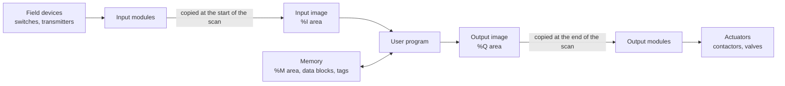
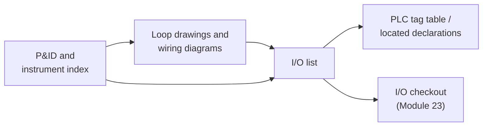

# 03 — Numbers, Data Types and Addressing

> **Level:** 1 — Foundations · **Time:** ~8–10 hours · **Prerequisites:** [Module 01](../01-what-is-a-plc/)

A PLC stores nothing but bits. A 4–20 mA level signal, a pump's running contact, a batch
counter, a recipe name and the time of day all end up as patterns of 0s and 1s in the
controller's memory, and the program decides what each pattern means. Many plant faults
come from the pattern and the meaning getting out of step. A SCADA screen shows −32,768 where
it should show a status. A flow totaliser quietly stops counting after a few weeks. A
temperature reads 2.36 × 10⁻⁴¹ °C because two registers arrived in the wrong order. A
thumbwheel set to 250 litres gives a batch of 592.

This module covers what lies underneath: binary, hexadecimal and BCD numbers; how integers
and floating-point numbers are stored and where they break; the IEC 61131-3 data types and
how to write their values; and how PLCs address memory. That includes the IEC `%I/%Q/%M`
form, the Siemens, Rockwell and Modbus conventions, and the I/O list that connects your
drawings to your code. In the labs you will pack status bits into a word for SCADA, convert
to and from BCD for old panel hardware, and handle a temperature sent in tenths of a degree.

## Learning objectives

By the end of this module you will be able to:

- Convert numbers by hand between decimal, binary, hexadecimal and BCD, and read octal I/O
  numbering.
- Explain two's complement, state the range of each IEC integer type, and predict what
  happens when a calculation overflows.
- Explain why `REAL` values are approximate, and choose between `REAL`, `LREAL` and integers
  for measurements, totals and comparisons.
- Choose a suitable IEC 61131-3 elementary data type for a signal, and write literals of
  every type correctly.
- Read and write IEC direct addresses (`%IX0.3`, `%IW2`, `%MW10`) and relate them to Siemens,
  Rockwell and Modbus addressing.
- Explain how bit, byte and word addresses overlap, and how byte order affects words and
  values spread over several registers.
- Decide which data should be retentive, and predict what a warm or cold restart does to it.
- Pack and unpack bits in a `WORD` with shifts and masks, and convert between binary and BCD
  in Structured Text.

## 1. Bits, bytes and words

A **bit** is one binary digit: 0 or 1, FALSE or TRUE. A digital input is one bit, because
the 24 V DC signal is either present or not ([Module 02](../02-electrical-and-field-devices/)).
Bits are grouped into larger units:

| Name | Bits | IEC bit-string type | Unsigned range | Typical use |
|---|---|---|---|---|
| Bit | 1 | `BOOL` | 0–1 | A contact, a coil, a flag |
| Nibble | 4 | (none) | 0–15 | One hexadecimal digit, one BCD digit |
| Byte | 8 | `BYTE` | 0–255 | Eight digital inputs, one text character |
| Word | 16 | `WORD` | 0–65,535 | An analog value, a Modbus register, a status word |
| Double word | 32 | `DWORD` | 0–4,294,967,295 | A `DINT` or `REAL`, two Modbus registers |
| Long word | 64 | `LWORD` | 0–18,446,744,073,709,551,615 | An `LINT` or `LREAL` |

Bits are numbered from **0 on the right**. Bit 0 is the **least significant bit (LSB)**,
worth 1. In a word, bit 15 is the **most significant bit (MSB)**, worth 32,768. Bit *n* is
worth 2ⁿ. Bits 0–7 form the **low byte** and bits 8–15 the **high byte**.

```text
 bit number    15 14 13 12   11 10  9  8    7  6  5  4    3  2  1  0
             +-------------+-------------+-------------+-------------+
 value 4660  |  0  0  0  1 |  0  0  1  0 |  0  0  1  1 |  0  1  0  0 |
             +-------------+-------------+-------------+-------------+
 hex digit          1             2             3             4         = 16#1234
             |<------- high byte ------->|<------- low byte -------->|
              MSB (bit 15)                                LSB (bit 0)
```

"MSB" can mean the most significant *bit* or the most significant *byte*. Documents often
don't say which, so check the context.

## 2. Number systems

### 2.1 Positional notation

In decimal, each position is worth ten times the one to its right:
4,097 = 4 × 1000 + 0 × 100 + 9 × 10 + 7 × 1. Binary works the same way with powers of two:

| Bit | 15 | 14 | 13 | 12 | 11 | 10 | 9 | 8 | 7 | 6 | 5 | 4 | 3 | 2 | 1 | 0 |
|---|---|---|---|---|---|---|---|---|---|---|---|---|---|---|---|---|
| Weight | 32768 | 16384 | 8192 | 4096 | 2048 | 1024 | 512 | 256 | 128 | 64 | 32 | 16 | 8 | 4 | 2 | 1 |

This course writes numbers the IEC 61131-3 way. `2#1011_0110` is binary, `8#17` is octal,
`16#B6` is hexadecimal, and a plain number is decimal. Underscores only make long numbers
easier to read. Elsewhere you will see `0xB6` (C and many manuals), `B6h`, or the classic
Siemens forms `B#16#B6`, `W#16#00B6` and `DW#16#000000B6`.

### 2.2 Binary to decimal

Add up the weights of the bits that are 1.

**Example:** `2#1011_0110`

```text
 bit      7    6    5    4    3    2    1    0
 value    1    0    1    1    0    1    1    0
 weight  128   64   32   16    8    4    2    1
 sum     128 +      32 + 16 +      4 +  2       = 182
```

### 2.3 Decimal to binary

**Method 1: repeated division by 2.** Divide by 2 and write down each remainder. The
remainders, read from the **last to the first**, are the bits.

```text
 200 / 2 = 100  remainder 0   <- bit 0
 100 / 2 =  50  remainder 0
  50 / 2 =  25  remainder 0
  25 / 2 =  12  remainder 1
  12 / 2 =   6  remainder 0
   6 / 2 =   3  remainder 0
   3 / 2 =   1  remainder 1
   1 / 2 =   0  remainder 1   <- bit 7
 200 = 2#1100_1000     check: 128 + 64 + 8 = 200
```

**Method 2: subtract powers of two.** Take away the largest weight that fits, then repeat.
1000 = 512 + 256 + 128 + 64 + 32 + 8, so bits 9, 8, 7, 6, 5 and 3 are set:
1000 = `2#11_1110_1000`.

### 2.4 Hexadecimal

One hexadecimal ("hex") digit stands for exactly four bits, so hex is a compact way to
write bit patterns. This is why PLC engineers use it: `16#8000` is obviously "bit 15 only",
and 32768 is not.

| Hex | 0 | 1 | 2 | 3 | 4 | 5 | 6 | 7 | 8 | 9 | A | B | C | D | E | F |
|---|---|---|---|---|---|---|---|---|---|---|---|---|---|---|---|---|
| Decimal | 0 | 1 | 2 | 3 | 4 | 5 | 6 | 7 | 8 | 9 | 10 | 11 | 12 | 13 | 14 | 15 |
| Binary | 0000 | 0001 | 0010 | 0011 | 0100 | 0101 | 0110 | 0111 | 1000 | 1001 | 1010 | 1011 | 1100 | 1101 | 1110 | 1111 |

**Hex to binary:** replace each digit by its four bits.
`16#A5C3` = `2#1010_0101_1100_0011`.

**Hex to decimal:** the weights are powers of 16 (4096, 256, 16, 1).
`16#A5C3` = 10 × 4096 + 5 × 256 + 12 × 16 + 3 = 40,960 + 1,280 + 192 + 3 = **42,435**.

**Decimal to hex:** divide by 16 repeatedly.

```text
 500 / 16 = 31  remainder 4    <- last digit
  31 / 16 =  1  remainder 15 (F)
   1 / 16 =  0  remainder 1    <- first digit
 500 = 16#1F4 = 16#01F4 as a WORD     check: 256 + 15 x 16 + 4 = 500
```

**Binary to hex:** group the bits in fours from the right. `2#11_1110_1000` becomes
`0011 1110 1000` = `16#3E8` (= 1000).

### 2.5 Octal (legacy)

Octal uses the digits 0–7, and each digit stands for three bits. `8#17` = 1 × 8 + 7 = 15 and
`8#777` = 511. You rarely calculate in octal today, but some PLC families **number their I/O
in octal**. Allen-Bradley PLC-5 I/O, Mitsubishi FX inputs and outputs (X0–X7, then
X10–X17, and the same for the Y outputs) and AutomationDirect DirectLOGIC are examples. On
those systems there is no input X8 or X9: the ninth input is X10. If a drawing jumps from 7
to 10, it is not a mistake. All addresses in this course's labs are decimal.

### 2.6 Binary-coded decimal (BCD)

**BCD** stores each *decimal* digit in its own nibble. The number 1234 in BCD is `16#1234`:

```text
 decimal digits        1        2        3        4
 BCD nibbles        0001     0010     0011     0100     = 16#1234 (a WORD)
 the same value
 in plain binary    0000     0100     1101     0010     = 16#04D2 = 1234
```

Nibble values 10–15 (`16#A`–`16#F`) never occur in valid BCD. A 16-bit word holds four BCD
digits, 0–9999, whereas the same word in binary holds 0–65,535.

You meet BCD at the edges of older plant:

- **Thumbwheel switches**, where each decade gives out four wires for one digit.
- **Seven-segment displays** driven through BCD decoder chips.
- Some real-time clocks, date and time formats, weighing indicators and instruments with
  parallel BCD outputs.
- Older vendor timer formats. The Siemens `S5TIME` format, for example, stores its preset
  as three BCD digits plus a time base.

**The classic BCD bug** is to read BCD as if it were binary. A thumbwheel set to 0250 puts
`16#0250` on sixteen inputs. Read as a plain binary number that is 2 × 256 + 5 × 16 = **592**,
not 250.

**Converting by hand.** Binary to BCD: write the decimal digits into nibbles
(4096 → `16#4096`). BCD to binary: multiply each nibble by its decimal weight
(`16#4096` → 4 × 1000 + 0 × 100 + 9 × 10 + 6 = 4096).

**Converting in code.** The digits of a number come from integer division and remainder
(`MOD`): units = *v* `MOD 10`, tens = (*v* / 10) `MOD 10`, and so on. `SHL` then moves a
digit into its nibble, and `SHR` with a mask of `16#000F` brings a nibble back down:

```iecst
(* Two-digit BCD for a value already checked to be 0..99: 47 becomes 16#47 *)
Bcd2 := SHL(INT_TO_WORD(Value / 10), 4) OR INT_TO_WORD(Value MOD 10);

(* The tens digit of a BCD word: shift it down to bits 3..0, then mask off the rest *)
TensDigit := WORD_TO_INT(SHR(BcdIn, 4) AND 16#000F);
```

Most platforms also have conversion instructions: `CONV` with BCD data types in TIA Portal,
`TOD` (to BCD) and `FRD` (from BCD) in Logix, and `UINT_TO_BCD_WORD` and `WORD_BCD_TO_UINT`
in MATIEC. They still leave you to decide what happens with values that don't fit or digits
that are invalid. Lab 03-2 makes you decide.

### 2.7 One value, five notations

| Decimal | Binary | Hex | BCD | Octal |
|---|---|---|---|---|
| 9 | `2#1001` | `16#9` | `16#9` | `8#11` |
| 10 | `2#1010` | `16#A` | `16#10` | `8#12` |
| 15 | `2#1111` | `16#F` | `16#15` | `8#17` |
| 100 | `2#0110_0100` | `16#64` | `16#100` | `8#144` |
| 255 | `2#1111_1111` | `16#FF` | `16#255` | `8#377` |
| 1234 | `2#0100_1101_0010` | `16#4D2` | `16#1234` | `8#2322` |

## 3. Signed integers and two's complement

### 3.1 A negative weight for the top bit

Practically every PLC in use today, like every modern computer, stores signed integers in
**two's complement**. The rule is simple: in a signed type, the most significant bit has a
**negative** weight. In an `INT`, bit 15 is worth −32,768 instead of +32,768, and every
other bit keeps its normal weight.

- `16#7FFF` = 0111 1111 1111 1111 = +32,767, the largest `INT`.
- `16#8000` = 1000 0000 0000 0000 = −32,768, the smallest `INT`.
- `16#FFFF` = −32,768 + 32,767 = **−1**.

```text
 bit pattern      16#0000 ... 16#7FFF   16#8000 ... 16#FFFF
 as UINT / WORD         0 ... 32767       32768 ... 65535
 as INT                 0 ... 32767      -32768 ... -1
```

Positive numbers look the same in both types. A pattern with the top bit set is a large
positive number to an unsigned type and a negative number to a signed one.

### 3.2 Negating by hand: invert and add one

To find the pattern for −*x*, invert every bit of +*x* and add 1.

**Example:** −5 as an `INT`

```text
 +5            0000 0000 0000 0101   16#0005
 invert        1111 1111 1111 1010   16#FFFA
 add 1         1111 1111 1111 1011   16#FFFB   = -5
```

**Example:** what is `16#FF38` as an `INT`? Bit 15 is set, so the value is negative. Invert
(`16#00C7` = 199) and add 1: 200. The value is **−200**. A quicker route: when bit 15 is
set, subtract 65,536 from the unsigned value (65,336 − 65,536 = −200).

### 3.3 Integer ranges

| Type | Bits | Range |
|---|---|---|
| `SINT` | 8 | −128 … 127 |
| `INT` | 16 | −32,768 … 32,767 |
| `DINT` | 32 | −2,147,483,648 … 2,147,483,647 |
| `LINT` | 64 | −9,223,372,036,854,775,808 … 9,223,372,036,854,775,807 |
| `USINT` | 8 | 0 … 255 |
| `UINT` | 16 | 0 … 65,535 |
| `UDINT` | 32 | 0 … 4,294,967,295 |
| `ULINT` | 64 | 0 … 18,446,744,073,709,551,615 |

The signed ranges have **one more negative value than positive**. So −32,768 has no
positive partner in an `INT`. In MATIEC, `ABS(-32768)` and `-(-32768)` both give −32,768.

### 3.4 Same bits, different meaning

The data type, and nothing else, decides how a bit pattern is read.
`WORD_TO_INT(16#FFFF)` copies the bits unchanged and gives −1. `INT_TO_WORD(-2)` gives
`16#FFFE` (65,534). Two real consequences:

- A status word with bit 15 set shows up on a SCADA screen as a **negative number** if the
  SCADA tag is configured as a signed integer. `16#8003` appears as −32,765. The data is
  fine. Only the display type is wrong.
- A transmitter sends −20.0 °C in tenths of a degree, as −200 (`16#FF38`), in a Modbus
  register. If the receiving tag is unsigned, it reads 65,336 and shows 6,533.6 °C.

### 3.5 Widening: sign extension versus zero extension

Converting a signed value to a bigger signed type copies the sign bit into all the new bits
(**sign extension**). The `INT` −1 (`16#FFFF`) becomes the `DINT` −1 (`16#FFFF_FFFF`).
Widening an unsigned value fills the new bits with zeros: the `WORD` `16#FFFF` becomes the
`DWORD` `16#0000_FFFF` (65,535). `INT_TO_DINT` always does the right thing. Trouble starts
when a signed value travels as a `WORD` (over a network, say) and is then widened as if it
were unsigned.

### 3.6 Overflow and wrap-around

An integer **overflows** when a result doesn't fit in its type. Picture a car's mileage
counter that rolls over from 99,999 to 00,000. Integers roll over the same way, except that
signed ones jump from the largest positive value to the most negative one:

| Operation | Result in MATIEC / OpenPLC |
|---|---|
| `INT` 32,767 + 1 | −32,768 |
| `SINT` 127 + 1 | −128 |
| `UINT` 0 − 1 | 65,535 |
| `DINT` 2,147,483,647 + 1 | −2,147,483,648 |
| `DINT_TO_INT(40000)` | −25,536 (only the low 16 bits are kept) |

All of these were checked with this course's compiler. MATIEC generates C code, and the
**wrap happens when the result is stored**. An expression such as `a * 9 / 5` is worked out
in 32 bits even when `a` is an `INT`, and only the final result is squeezed back into 16
bits. Other platforms may overflow halfway through the expression instead. Don't write code
that depends on either behaviour.

Other PLCs react to overflow in different ways, and IEC 61131-3 doesn't make them all
behave the same. Some examples (always check your own platform's manual):

- **CODESYS** generally wraps around silently, as MATIEC does.
- **Siemens S7-1200/1500:** in LAD/FBD the maths box sets its `ENO` output FALSE when the
  result is out of range.
- **Rockwell Logix** sets the arithmetic overflow status flag (`S:V`) and can log a minor
  fault.
- **Allen-Bradley SLC 500:** an overflow sets a minor error bit. If the program doesn't clear
  that bit by the end of the scan, the processor stops with a major fault.

So on one platform a wrapped counter gives wrong numbers, and on another it stops the plant.
**Size your variables so that overflow cannot happen** in the life of the plant:

| Pump running time counted in seconds | Overflows after |
|---|---|
| `INT` | 32,767 s ≈ 9 h 6 min |
| `UINT` | 65,535 s ≈ 18 h 12 min |
| `DINT` | 2,147,483,647 s ≈ 68 years |

Other common cases: a production counter kept in an `INT` that shows −32,768 after the
32,768th carton, and an average `(A + B) / 2` of two large `INT`s whose sum doesn't fit.
[Module 09](../09-math-and-data-handling/) covers safe arithmetic in detail.

## 4. Floating point: `REAL` and `LREAL`

### 4.1 How a `REAL` is stored

Integers can't hold 23.5 °C or 0.37 bar. For fractional values, PLCs use **floating
point**: binary scientific notation, standardised as **IEEE 754**. A `REAL` is IEEE 754
single precision (32 bits). An `LREAL` is double precision (64 bits).

```text
 REAL, 32 bits
   31   30 ........... 23   22 ...................................... 0
 +----+------------------+------------------------------------------+
 | S  |  exponent (8)    |               fraction (23)              |
 +----+------------------+------------------------------------------+
 value = (-1)^S  x  1.fraction (binary)  x  2^(exponent - 127)

 LREAL, 64 bits: 1 sign bit, 11 exponent bits (offset 1023), 52 fraction bits
```

**Worked example:** decode `16#41BC_0000`.

```text
 hex        4    1    B    C    0    0    0    0
 binary   0100 0001 1011 1100 0000 0000 0000 0000
          S = 0                             -> positive
          exponent = 1000 0011 = 131        -> 131 - 127 = 4
          fraction = .011 1100 0000 ...     -> 0.25 + 0.125 + 0.0625 + 0.03125 = 0.46875
 value = +1.46875 x 2^4 = 23.5
```

You won't decode floats by hand very often. The layout matters when REAL values travel over
networks in pairs of 16-bit registers (section 8).

### 4.2 Precision: about 7 digits versus 15–16

A `REAL` keeps 24 significant bits, which is about **7 significant decimal digits**. An
`LREAL` keeps 53 bits, about **15–16 digits**. Anything beyond that is rounded. Stored in a
`REAL`, 123,456,789.0 becomes 123,456,792.0.

Floating-point numbers are not evenly spaced. The gap between neighbouring `REAL` values
grows with their size:

| Value around | Gap to the next `REAL` |
|---|---|
| 1.0 | 0.000 000 12 |
| 1,000 | 0.000 061 |
| 65,536 | 0.0078 |
| 1,000,000 | 0.0625 |
| 16,777,216 | 2 |

For a level of 0–5 m or a pressure of 0–10 bar, seven digits is far better than any
instrument, so `REAL` is the normal choice for process values. Problems come from **large
numbers** and from **many small additions**.

### 4.3 The 16,777,216 problem: totalisers

Every whole number up to 2²⁴ = 16,777,216 can be stored exactly in a `REAL`. Above that the
gap is 2, so:

```text
 REAL   16777216.0 + 1.0 = 16777216.0      (the 1.0 is lost)
 LREAL  16777216.0 + 1.0 = 16777217.0
```

(Both checked with MATIEC.) The loss starts long before 16,777,216 when the amount you add is
small. Every addition is rounded to the nearest `REAL`. Take a flow totaliser that adds
0.01 m³ on each scan. The table shows what 1,000 of those additions really add (they should
add 10 m³) depending on the running total:

| Running total (m³) | Amount added by 1,000 × 0.01 | Error |
|---|---|---|
| 1,000 | 10.0098 | +0.1 % |
| 16,384 | 9.7656 | −2.3 % |
| 32,768 | 11.7188 | +17 % |
| 65,536 | 7.8125 | −22 % |
| 131,072 | 15.625 | +56 % |
| 262,144 and above | 0 | The total stops increasing |

A `REAL` totaliser can look fine at commissioning and be badly wrong a few months later,
with no alarm and no fault. The usual fixes, covered in [Module 09](../09-math-and-data-handling/):

- Total in `LREAL`. That is the simplest fix where the platform supports it.
- Count whole units in an integer (`DINT` or `LINT` litres, or meter pulses) and convert only
  for display.
- Keep the whole units in a `DINT` and the fraction in a `REAL`, carrying over each time the
  fraction passes 1.
- Keep period totals (per hour, per day) that reset, instead of one ever-growing total.

### 4.4 0.1 is not exact

Most decimal fractions have no exact binary form, just as 1/3 has no exact decimal form.
The `REAL` closest to 0.1 is 0.100000001490116…. Add it to itself ten times and the result is
1.0000001, not 1.0, so the test `Sum = 1.0` is **FALSE**. In `LREAL` the error is smaller,
but the test still fails.

**Never compare `REAL` values with `=` or `<>`.** Use a tolerance, or a one-sided comparison:

```iecst
AtSetpoint := ABS(Level - Setpoint) <= 0.01;  (* within 10 mm is close enough *)
TankFull   := Level >= FullLevel;              (* not: Level = FullLevel *)
```

Don't use a `REAL` as a loop counter or as a step number for the same reason.

### 4.5 Infinity and NaN

IEEE 754 has special values. Dividing a non-zero number by 0.0 gives **+Inf** or **−Inf**.
Undefined results such as 0.0 / 0.0 or the square root of a negative number give **NaN**
("not a number"). Any arithmetic with a NaN gives NaN again, and **every comparison with NaN
is FALSE** except `<>`:

| Expression, with `X` = NaN | Result |
|---|---|
| `X > 100.0` | FALSE |
| `X < 100.0` | FALSE |
| `X = X` | FALSE |
| `X <> X` | TRUE (the usual NaN test) |

This matters for alarms and trips. A NaN can come from a scaling calculation with a span of
zero, from a bad value received over a network (section 8), or from a faulty device. When it
does, a high-level trip written in the obvious way **never trips**:

```iecst
(* Risky: if Level is NaN, the comparison is FALSE and the trip never happens *)
HighTrip := Level > HighLimit;

(* Better: state the healthy condition, and trip whenever it is not proven *)
LevelHealthy := Level < HighLimit;   (* NaN makes this FALSE ... *)
HighTrip     := NOT LevelHealthy;    (* ... so the trip happens *)
LevelIsNaN   := Level <> Level;      (* TRUE only for NaN: raise a diagnostic alarm *)
```

This is the same fail-safe thinking as wiring stop buttons normally-closed: an invalid
signal should end up on the safe side. This is a training illustration only. Real process
trips belong in a safety instrumented system designed under IEC 61511
([Module 20](../20-functional-safety/)). Signal validation is covered in
[Module 14](../14-analog-and-process-io/).

MATIEC follows IEEE 754 and carries on with Inf and NaN. Some other platforms set a status
flag or log a fault on an invalid floating-point result. Integer division by zero is a
different case, and platforms handle it differently. Check divisors before dividing
([Module 09](../09-math-and-data-handling/)).

### 4.6 Choosing a numeric type

| Quantity | Good choice | Why |
|---|---|---|
| On/off signals | `BOOL` | One bit of meaning |
| Raw analog input counts | `INT` (sometimes `WORD` or `UINT`) | Analog cards deliver 16-bit counts |
| Engineering values: bar, m, °C, % | `REAL` | Fractions, wide range, 7 digits is plenty |
| Counters, running hours, starts | `DINT` or `UDINT` | Won't overflow in the life of the plant |
| Large totals: m³, kWh, tonnes | `LREAL`, or integer units | A `REAL` loses small increments |
| Durations, delays | `TIME` | Built for timers |
| Status and command words for SCADA | `WORD` | A pattern of bits, not a number |
| Fixed-point values over a network | `INT` with a documented scale | For example tenths of a degree (Lab 03-3) |

## 5. IEC 61131-3 elementary data types

IEC 61131-3 defines the **elementary** (built-in) types below. Edition 2 (2003), which
MATIEC implements, has all of them. Edition 3 (2013) added more, including `LTIME`, `LDATE`,
`LTOD`, `LDT`, `CHAR` and `WCHAR`.

| Type | Bits | Range or content | Typical use |
|---|---|---|---|
| `BOOL` | 1 (usually stored in a byte) | `FALSE`, `TRUE` | Digital I/O, flags |
| `BYTE` | 8 | `16#00` … `16#FF` | Eight bits handled together |
| `WORD` | 16 | `16#0000` … `16#FFFF` | Status and command words, registers |
| `DWORD` | 32 | `16#0000_0000` … `16#FFFF_FFFF` | 32-bit patterns |
| `LWORD` | 64 | 64-bit pattern | 64-bit patterns |
| `SINT` / `USINT` | 8 | −128 … 127 / 0 … 255 | Small values |
| `INT` / `UINT` | 16 | −32,768 … 32,767 / 0 … 65,535 | Analog counts, small values |
| `DINT` / `UDINT` | 32 | about ±2.1 × 10⁹ / 0 … 4.29 × 10⁹ | Counters, general integers |
| `LINT` / `ULINT` | 64 | about ±9.2 × 10¹⁸ / 0 … 1.8 × 10¹⁹ | Very large counts, time stamps |
| `REAL` | 32 | about ±3.4 × 10³⁸, ~7 significant digits | Measurements, engineering values |
| `LREAL` | 64 | about ±1.8 × 10³⁰⁸, ~15–16 significant digits | Totals, precise calculations |
| `TIME` | Platform-dependent | A duration, such as `T#1m30s` | Timer presets and elapsed times |
| `DATE` | Platform-dependent | A calendar date | Production dates |
| `TIME_OF_DAY` (`TOD`) | Platform-dependent | A time of day | Shift changes, schedules |
| `DATE_AND_TIME` (`DT`) | Platform-dependent | A date and a time of day | Time stamps |
| `STRING` | Variable | Single-byte characters | Tag names, messages, recipe names |
| `WSTRING` | Variable | Double-byte (wide) characters | Text in any language |

Some points to note:

- **Bit strings are not numbers.** `BYTE`, `WORD`, `DWORD` and `LWORD` are for bit
  patterns. The standard defines no arithmetic on them. MATIEC rejects `MyWord + 1`, so
  convert to an integer type first. Some tools are more relaxed.
- **`TIME` and dates vary by platform.** Siemens `TIME` is a signed 32-bit count of
  milliseconds (about ±24 days 20 hours). CODESYS `TIME` is an unsigned 32-bit count of
  milliseconds (up to about 49 days 17 hours), and edition-3 `LTIME` is 64-bit nanoseconds.
  MATIEC stores seconds and nanoseconds. Don't assume a long `TIME` fits everywhere.
- **`STRING` length is platform-dependent.** The default maximum is 80 characters in
  CODESYS, up to 254 in Siemens and 82 in a Logix `STRING`. MATIEC's plain `STRING` holds up
  to 126. Declaring a length (`STRING[20]` in TIA Portal, `STRING(20)` in CODESYS) is common
  but not accepted by MATIEC.
- **Generic types** such as `ANY_NUM`, `ANY_INT`, `ANY_REAL`, `ANY_BIT` and `ANY_DATE`
  describe which types a function accepts. For example, `ADD` takes any `ANY_NUM`, and `SHL`
  takes any `ANY_BIT`. You normally cannot declare variables of these types.

### 5.1 Literals: writing values in code

| Kind | Examples | Notes |
|---|---|---|
| Decimal integer | `42`, `-7`, `1_000_000` | Underscores are ignored |
| Based integer | `2#1010_0101` (165), `8#17` (15), `16#FF` (255) | No sign of their own: MATIEC rejects `-16#10` as an initial value; write `-16` |
| Typed literal | `INT#5`, `SINT#-16`, `UINT#65535`, `WORD#16#00FF`, `LREAL#1.0` | Fixes the type of the constant |
| Real | `1.0`, `-0.5`, `1.5E3`, `2.0e-3` | Needs a digit on both sides of the point: `0.5`, not `.5` |
| Boolean | `TRUE`, `FALSE`, `BOOL#1`, `BOOL#0` | |
| Duration | `T#1m30s`, `TIME#90s`, `T#250ms`, `T#1.5s`, `T#1d2h3m4s5ms`, `T#-5s` | Units `d h m s ms`; edition 3 adds `us ns` |
| Date | `D#2024-03-15`, `DATE#2024-03-15` | |
| Time of day | `TOD#14:30:00`, `TIME_OF_DAY#06:00:00.5` | |
| Date and time | `DT#2024-03-15-14:30:00`, `DATE_AND_TIME#2024-03-15-14:30:00` | |
| String | `'Pump P-101'`, `''` (empty) | Single quotes |
| Wide string | `"Pumpe"` | Double quotes |

Inside strings, the **dollar sign** starts an escape sequence:

| Escape | Meaning |
|---|---|
| `$$` | A dollar sign |
| `$'` | A single quote inside a `STRING` (`'It$'s'`) |
| `$"` | A double quote inside a `WSTRING` |
| `$L` or `$l` | Line feed |
| `$N` or `$n` | Newline |
| `$R` or `$r` | Carriage return |
| `$T` or `$t` | Tab |
| `$P` or `$p` | Form feed (new page) |
| `$hh` | The character with hex code *hh* (`$0D` = carriage return); four hex digits in a `WSTRING` |

MATIEC handles `$$` and `$'` correctly, but not all the control-character escapes, so the
labs don't use them.

### 5.2 Just enough Structured Text for this module

Structured Text (ST) gets its own module ([Module 10](../10-structured-text/)). The labs here
need only this much:

```iecst
Alarm := Level > HighLimit;              (* assignment: target := expression;  *)
IF Level > 2.5 THEN                      (* IF / ELSIF / ELSE / END_IF;        *)
  Pump := TRUE;
ELSIF Level < 1.0 THEN
  Pump := FALSE;
END_IF;
Mask  := SHL(WORD#16#0001, 3);           (* shift left 3 places: 16#0008       *)
Bit3  := (Status AND 16#0008) <> 0;      (* test one bit of a WORD             *)
Tens  := (Value / 10) MOD 10;            (* integer division and remainder     *)
Level := INT_TO_REAL(Raw) / 100.0;       (* convert first, then divide         *)
```

`AND`, `OR`, `XOR` and `NOT` work bit by bit on `WORD` values and logically on `BOOL`s.
`SHL(x, n)` shifts left and fills with zeros, `SHR(x, n)` shifts right, and `ROL` and `ROR`
rotate.

Variables are declared between `VAR` and `END_VAR`, optionally with an initial value:

```iecst
PROGRAM TypesDemo
  VAR (* I/O: located variables in their own block *)
    LevelRaw   AT %IW0   : INT;    (* raw counts from the level transmitter's input card *)
    PumpRunFbk AT %IX0.0 : BOOL;   (* contactor auxiliary contact *)
  END_VAR
  VAR
    Level_m      : REAL;                       (* engineering value in metres *)
    PumpStarts   : DINT;                       (* will not overflow in the plant's life *)
    FlowTotal_m3 : LREAL;                      (* keeps small increments when large *)
    StatusWord   : WORD := 16#0000;            (* a bit pattern for SCADA *)
    FillTimeout  : TIME := T#2m30s;
    ShiftStart   : TIME_OF_DAY := TOD#06:00:00;
    TagName      : STRING := 'P-101';
  END_VAR
  VAR CONSTANT
    MAX_STARTS_PER_HOUR : INT := 6;            (* cannot be changed by the program *)
  END_VAR
  VAR RETAIN
    RunHours : DINT;                           (* survives a warm restart (section 7) *)
  END_VAR

  IF PumpRunFbk THEN
    StatusWord := 16#0001;
  ELSE
    StatusWord := 16#0000;
  END_IF;
END_PROGRAM
```

### 5.3 Converting between types

IEC 61131-3 is **strongly typed**. `MyReal := MyInt;` is a compile error in MATIEC
("Incompatible data types"). Say what you mean with a conversion function:

| Conversion | What it does |
|---|---|
| `INT_TO_REAL(x)` | Exact for every `INT` |
| `REAL_TO_INT(x)` | Rounds to the nearest integer. Exact halves differ between platforms (MATIEC rounds 2.5 to 2 and 3.5 to 4). Check the range first, because a value that doesn't fit gives an undefined result |
| `TRUNC(x)` | Cuts off the fraction, toward zero: `TRUNC(-2.7)` = −2 |
| `INT_TO_DINT(x)` | Sign-extends, so it is always safe |
| `DINT_TO_INT(x)` | Keeps only the low 16 bits: 40,000 becomes −25,536 |
| `WORD_TO_INT(x)`, `INT_TO_WORD(x)` | Copy the bit pattern: `16#FFFF` ↔ −1 |
| `BOOL_TO_WORD(b)` | `16#0000` or `16#0001` |
| `WORD_TO_BOOL(w)` | In MATIEC, TRUE if *any* bit is set. To test one bit, mask it first |

Some tools convert some types without being asked. CODESYS does, and TIA Portal does too,
more freely when its *IEC check* option is off than when it is on. Code with explicit
conversions works everywhere and shows the reader exactly where a value might be rounded or
cut off.

### 5.4 Derived types (preview)

You can build your own types from the elementary ones in a `TYPE … END_TYPE` block. This
is the subject of [Module 12](../12-data-structures/):

```iecst
TYPE
  T_Percent    : INT(0..100);                               (* subrange *)
  E_ValveState : (Closed, Opening, Open, Closing, Faulted); (* enumeration *)
  ST_Pump : STRUCT                                          (* structure (UDT) *)
    Running : BOOL;
    Speed   : REAL;
    Starts  : DINT;
  END_STRUCT;
  T_Levels : ARRAY[1..4] OF REAL;                           (* array *)
END_TYPE
```

## 6. Memory areas and addressing

### 6.1 Where data lives

[Module 01](../01-what-is-a-plc/) introduced the scan cycle. At the start of each scan the
PLC copies its input modules into the **input image**, the program runs, and at the end the
**output image** is copied to the output modules. Beside these two areas there is general
**memory** for internal values, plus system and status data.



There are two ways to refer to data. An **absolute address** names a memory location
(`%IX0.3`, `I0.3`, `N7:0`). A **symbol** or **tag** is a name (`PumpRunFbk`). Every modern
platform lets you program with names only, but addresses still appear in tag tables,
network maps, I/O lists, legacy code, and on the LEDs of an input card during fault-finding.
You need to read both.

### 6.2 IEC 61131-3 direct addresses

An IEC direct address has four parts:

```text
   %  I  X  0.3
   |  |  |  |
   |  |  |  +-- position: numbers separated by dots, meaning set by the platform
   |  |  +----- size: X bit (may be left out), B byte, W word (16), D double word (32), L long word (64)
   |  +-------- location: I input, Q output, M memory
   +----------- "this is a direct address"
```

| Address | Meaning |
|---|---|
| `%IX0.3` or `%I0.3` | Input bit 3 of byte 0 |
| `%QX1.0` | Output bit 0 of byte 1 |
| `%IB2` | Input byte 2 |
| `%IW4` | Input word 4, typically an analog input channel |
| `%QW0` | Output word 0, typically an analog output channel |
| `%MW10` | Memory word 10 |
| `%MD20` | Memory double word 20 |
| `%ML0` | Memory long word 0 |

In a program, the keyword `AT` ties a named variable to an address:
`LevelRaw AT %IW0 : INT;`. The data type must suit the size: `BOOL` for `X`, a 16-bit type
(`INT`, `UINT`, `WORD`) for `W`, and so on. Write the address once, in the declaration, and
use the name everywhere else. If the wiring changes, you change one line.

### 6.3 How bit, byte and word addresses relate

The standard does not say whether `%IX0.0`, `%IB0` and `%IW0` share memory. Platforms use
one of two models.

**One byte-addressed memory, where the sizes overlap.** Siemens works this way, and so do
many CODESYS devices. `%IX4.0` … `%IX4.7` are the eight bits of `%IB4`, and a word is two
consecutive bytes. In Siemens notation:

```text
 byte         MB10          MB11          MB12          MB13
          +-------------+-------------+-------------+-------------+
 bits     | M10.7..M10.0| M11.7..M11.0| M12.7..M12.0| M13.7..M13.0|
          +-------------+-------------+-------------+-------------+
 MW10     |  high byte  |  low byte   |
 MW11                   |  high byte  |  low byte   |        <- overlaps MW10 and MW12
 MW12                                 |  high byte  |  low byte   |
 MD10     |<------------------- all four bytes ------------------>|
```

This brings two traps.

1. **Overlap.** `MW10` and `MW11` share `MB11`, so writing one changes the other. Space word
   addresses 2 apart (`MW10`, `MW12`, `MW14`) and double-word addresses 4 apart (`MD20`,
   `MD24`).
2. **Byte order.** Siemens is **big-endian**: the byte with the *lower* address is the
   *high* byte. So `M10.0` is **bit 8** of `MW10`, and bit 0 of `MW10` is `M11.0`:

   ```text
    MW10 bit    15   14   13   12   11   10    9    8  |    7    6    5    4    3    2    1    0
    address  M10.7                              M10.0  |M11.7                              M11.0
   ```

   On a little-endian CODESYS target it is the other way round: `%MB0` is the *low* byte of
   `%MW0`. Also, the number after `W` or `D` does not always count bytes. The CODESYS help
   says the numbering depends on the device: on some devices `%MW1` starts at byte 1, on
   others at byte 2. Check before you rely on overlaps.

**Separate areas for each size.** The OpenPLC Runtime keeps bits, words, double words and
long words in separate tables. `%IX0.0` … `%IX0.7` are *not* part of `%IW0`, and `%MD0` is
not built from `%MW0` and `%MW1`. You can see this in the Modbus map below, where they sit
at different register numbers. In `plctest`, too, every located variable is its own piece
of memory.

The safe habit on any platform: **never make two declarations share memory by accident**,
and don't write code that only works because of an overlap. If you need a word's bits,
extract them with masks (Lab 03-1).

### 6.4 OpenPLC address ranges

The OpenPLC Runtime (on Linux or Windows) uses these areas. It also serves them to SCADA
over Modbus TCP:

| Area | IEC addresses | Modbus table (0-based addresses) |
|---|---|---|
| Digital inputs | `%IX0.0` … `%IX99.7` | Discrete inputs 0–799 |
| Digital outputs | `%QX0.0` … `%QX99.7` | Coils 0–799 |
| Word inputs (analog in) | `%IW0` … `%IW1023` | Input registers 0–1023 |
| Word outputs (analog out) | `%QW0` … `%QW1023` | Holding registers 0–1023 |
| Memory words | `%MW0` … `%MW1023` | Holding registers from 1024 |
| Memory double words | `%MD0` … `%MD1023` | Holding registers from 2048, two per value |
| Memory long words | `%ML0` … `%ML1023` | Holding registers from 4096, four per value |

Bits are numbered as byte × 8 + bit, so `%IX2.5` is discrete input 21. Which addresses
connect to real terminals depends on the hardware the Runtime runs on. Microcontroller
boards support smaller ranges. I/O from Modbus slave devices is mapped from `%IX100.0` and
`%QX100.0` upwards. Newer OpenPLC releases have changed parts of this scheme, so check the
documentation for the version you use.

### 6.5 Siemens S7 addressing

| Area | Bit | Byte | Word | Double word | Notes |
|---|---|---|---|---|---|
| Inputs (`I`, German `E`) | `I0.0` | `IB0` | `IW64` | `ID0` | Process image of the inputs |
| Outputs (`Q`, German `A`) | `Q4.2` | `QB4` | `QW80` | `QD4` | Process image of the outputs |
| Bit memory (`M`, "markers" or "flags") | `M10.0` | `MB10` | `MW20` | `MD24` | General-purpose memory |
| Data block (`DB`) | `DB1.DBX0.0` | `DB1.DBB0` | `DB1.DBW2` | `DB1.DBD4` | Only in standard-access DBs |

- TIA Portal displays absolute addresses with a `%` in front (`%I0.0`, `%MW20`). The
  German mnemonics (`E` for Eingang, input; `A` for Ausgang, output) appear in older
  programs and German-language settings.
- I/O addresses are assigned in the device configuration. On an S7-1200 the built-in
  digital inputs usually start at `I0.0`, and the built-in analog inputs are usually at
  `IW64` and `IW66`. Appending `:P` (`IW64:P`) reads the module directly instead of the
  process image.
- **Symbolic tags** are defined in the PLC tag table (`"Pump1_Running"` at `%I0.0`). In SCL,
  global names appear in double quotes (`"Pump1_Running"`) and local names start with `#`
  (`#Count`). Data block members are written `"Pump1".Speed`.
- **Optimised versus standard data blocks.** On S7-1200/1500, new blocks use *optimized
  block access* by default. The CPU arranges their contents as it likes, so a member has no
  fixed offset and `DB1.DBW2` has no meaning. You must use the symbolic name. Absolute access
  such as `DB1.DBX0.0` works only in blocks set to *standard* access. Some communication
  setups need those fixed offsets.

### 6.6 Rockwell addressing

**Logix (ControlLogix, CompactLogix; Studio 5000).** Logix is **tag-based**, with no
user-visible memory addresses. You create tags with names and types, in *controller scope*
(visible everywhere) or *program scope* (visible in one program). I/O modules create their
own tags when you add them to the I/O configuration:

```text
 Local:1:I.Data.0     slot 1 in the local chassis, Input data, bit 0
 Local:2:O.Data.3     slot 2, Output data, bit 3
```

The exact member names come from each module's profile, and newer module families use
names such as `Local:1:I.Pt00.Data`. Programs normally use **alias tags**, such as `StartPB`
as an alias for `Local:1:I.Data.0`, so that the logic reads well and the I/O mapping sits in
one place. Individual bits of an integer are addressed with a dot: `StatusBits.5`.

**SLC 500, MicroLogix and PLC-5 (legacy, RSLogix 500/5).** Data lives in numbered **data
files**, and each address names a file, an element (word) and optionally a bit:

| File | Type | Example addresses |
|---|---|---|
| O0 | Outputs | `O:2/5` (slot 2, bit 5) |
| I1 | Inputs | `I:1/0` (slot 1, bit 0), `I:1.0/0` (word 0 of slot 1, bit 0) |
| S2 | Status | `S:1/15` (first-scan bit) |
| B3 | Bits | `B3:0/0` = `B3/0`; `B3/16` = `B3:1/0` |
| T4 | Timers | `T4:0.ACC`, `T4:0.PRE`, `T4:0/DN` |
| C5 | Counters | `C5:0.ACC`, `C5:0/DN` |
| R6 | Control | `R6:0.POS` |
| N7 | Integers | `N7:0`, `N7:0/3` (bit 3 of `N7:0`) |
| F8 | Floats | `F8:0` |
| 9–255 | User-created files | `N10:5`, `F20:0` |

PLC-5 I/O addresses use octal bit numbers. You will meet these addresses when you maintain
or migrate older plant.

### 6.7 Modicon and Modbus register numbers (preview)

Modbus, one of the most widely used industrial protocols, has four data tables. The old Modicon
convention gives each table a leading digit:

| Convention | Table | Access | Read / write function codes |
|---|---|---|---|
| 0xxxx (00001…) | Coils | Read/write bits | 1 / 5, 15 |
| 1xxxx (10001…) | Discrete inputs | Read-only bits | 2 |
| 3xxxx (30001…) | Input registers | Read-only 16-bit words | 4 |
| 4xxxx (40001…) | Holding registers | Read/write 16-bit words | 3 / 6, 16 |

The leading digit is **not** sent over the network: the function code says which table. The
register numbers in this convention **start at 1**, but the address in the message
**starts at 0**. So "40001" is holding register address 0, and "40010" is address 9. That
off-by-one is the most common Modbus commissioning fault. Some documents use six digits
(400001) to reach higher addresses. [Module 17](../17-industrial-communications/) covers
Modbus in depth.

### 6.8 From drawings to code: the I/O list

The **I/O list** (or I/O schedule) connects the instrument and electrical drawings to the
program. Each physical signal gets one row. The row gives the instrument or equipment tag
from the P&ID, what the signal does, its electrical type and range, where it lands (card
and channel), its PLC address, and the PLC tag name. An extract for a small pump station:

| Tag (P&ID) | Service | Signal | Range / states | Card / ch | Address | PLC tag | Notes |
|---|---|---|---|---|---|---|---|
| LT-101 | Sump level | AI 4–20 mA, 2-wire | 0–3.00 m | AI1 / 0 | `%IW0` | `LT101_Raw` | Loop-powered, scaled in the PLC (Module 14) |
| PT-102 | Discharge pressure | AI 4–20 mA, 2-wire | 0–10.0 bar | AI1 / 1 | `%IW1` | `PT102_Raw` | |
| P-101 | Pump running | DI 24 V DC | 1 = running | DI1 / 0 | `%IX0.0` | `P101_RunFbk` | Contactor auxiliary contact, NO |
| P-101 | Overload healthy | DI 24 V DC | 1 = healthy | DI1 / 1 | `%IX0.1` | `P101_OL_OK_NC` | NC: 0 = tripped *or* wire broken |
| LSHH-103 | Sump level high-high | DI 24 V DC | 1 = normal | DI1 / 2 | `%IX0.2` | `LSHH103_NC` | Fail-safe NC switch |
| P-101 | Run command | DO 24 V DC | 1 = run | DO1 / 0 | `%QX0.0` | `P101_RunCmd` | Via an interposing relay to the contactor |
| XV-104 | Discharge valve | DO 24 V DC | 1 = open | DO1 / 1 | `%QX0.1` | `XV104_OpenCmd` | Spring return: closes on loss of power |
| P-101 | Speed reference | AO 4–20 mA | 0–50 Hz | AO1 / 0 | `%QW0` | `P101_SpeedRef` | To the VFD's analog input |



The I/O list is where a 4–20 mA loop from the loop drawing (with its barrier and burden
resistor, [Module 02](../02-electrical-and-field-devices/)) becomes `%IW0` in the PLC. The
data type and scaling in the code must match the range column, and the fail-safe state
(NC, spring return) must match the logic. During commissioning, the I/O checkout goes
through this list row by row.

## 7. Retentive memory, restarts and initial values

**Initial values.** Every variable starts with a defined value: the one you give in the
declaration, or otherwise the type's default (0, 0.0, FALSE, an empty string, `T#0s`).

**Retentive and non-retentive memory.** Normal variables go back to their initial values
when the PLC restarts. **Retentive** variables keep their last value through a power
failure, stored in battery-backed or non-volatile memory. In IEC 61131-3 you declare them
with `VAR RETAIN` (and can mark others `VAR NON_RETAIN`). The standard distinguishes two
kinds of restart:

| Restart | Non-retentive variables | `RETAIN` variables |
|---|---|---|
| **Cold restart** (first start, or a reset chosen by the user) | Initial values | Initial values |
| **Warm restart** (for example when power returns) | Initial values | Keep their last values |

**What to make retentive:** totalisers, running-hour and start counters, production counts,
and operator settings that have no other home. **What not to make retentive:** anything that
would make equipment move by itself when power returns. A pump's run request that survives a
power failure could restart the pump the moment power is back, with nobody near it.
Machinery standards such as IEC 60204-1 require that a machine does not restart
automatically after a power failure where that could cause a hazard. Restarts should be
deliberate, and sequences should re-check the plant before continuing
([Module 13](../13-sequential-control/)).

Retentive memory is limited on most PLCs, and downloading a changed program can
reinitialise it on some platforms. Back up recipes and totals before a download.

How the platforms do it:

- **CODESYS:** `VAR RETAIN`, plus `PERSISTENT` variables kept in a special persistent
  variable list. These survive more kinds of reset, and generally survive a new download.
  The IDE offers *reset warm*, *reset cold* and *reset origin* commands.
- **Siemens S7-1200/1500:** a startup keeps retentive data and initialises the rest. You mark
  a range of `M` memory as retentive in the PLC tag table, and tick *Retain* for individual
  members of optimised data blocks.
- **Rockwell Logix:** tag values are kept through a power cycle. When the controller enters
  Run mode, a *prescan* resets non-retentive instructions, for example clearing `OTE` output
  coils and resetting `TON` timers.
- **OpenPLC / MATIEC:** `VAR RETAIN` compiles. The OpenPLC Runtime has a persistent-storage
  option in its settings; check its documentation for what it saves. In `plctest`, **every
  scenario is a cold start**.

## 8. Byte order (endianness): an introduction

A `WORD` needs two bytes of memory and a `REAL` needs four. **Byte order**, or
**endianness**, is the order in which they are stored or sent:

- **Big-endian:** most significant byte first, at the lowest address. Siemens S7 works this
  way, and so do the contents of a Modbus register.
- **Little-endian:** least significant byte first. x86 PCs and most ARM processors work
  this way, including many CODESYS and PC-based controllers.

```text
 WORD 16#1234 at byte addresses n, n+1          REAL 23.5 = 16#41BC_0000 at n .. n+3
                 n       n+1                                     n      n+1    n+2    n+3
 big-endian     16#12   16#34                    big-endian     16#41  16#BC  16#00  16#00
 little-endian  16#34   16#12                    little-endian  16#00  16#00  16#BC  16#41
```

Inside one PLC this never matters, because the CPU always reads its own memory consistently.
It matters when data **crosses a boundary**: a network, a file, or two devices from
different makers. Modbus defines 16-bit registers and sends each one high byte first. It
does not say in which order the two registers of a 32-bit value go, so manufacturers choose
differently. Here are the four orders you meet, for the `REAL` 23.5 (bytes A B C D =
`41 BC 00 00`) read by a device that expects A B C D:

| Order the sender used | Registers on the wire | Value the receiver sees |
|---|---|---|
| ABCD ("high word first") | `16#41BC`, `16#0000` | 23.5 |
| CDAB (words swapped) | `16#0000`, `16#41BC` | 2.36 × 10⁻⁴¹ |
| BADC (bytes swapped in each word) | `16#BC41`, `16#0000` | −0.0118 |
| DCBA (fully reversed) | `16#0000`, `16#BC41` | 6.75 × 10⁻⁴¹ |

A value that is absurdly tiny, huge, negative or NaN is the fingerprint of a byte-order
mismatch. The same happens to a `DINT`: 100,000 sent with the words swapped arrives as
−2,036,334,591. The fix is a word-swap or byte-swap setting in the communication driver, or a
few lines of swapping code. [Module 17](../17-industrial-communications/) covers this in
detail.

## Worked examples

### Worked example 1: a mysterious value on the SCADA screen

A motorised valve controller sends a 16-bit status register to SCADA with this layout:

| Bit | Meaning |
|---|---|
| 0 | Open command active |
| 1 | Open limit switch (ZSO) made |
| 2 | Closed limit switch (ZSC) made |
| 3 | Selector in LOCAL |
| 4–14 | Spare (0) |
| 15 | Fault present |

The SCADA screen shows the value **−32,765**. What is the valve doing?

1. The value is negative, so the SCADA tag is signed and bit 15 is set.
2. Convert to the unsigned pattern: −32,765 + 65,536 = 32,771.
3. Convert to hex: 32,771 = 32,768 + 3 = `16#8003` = `2#1000_0000_0000_0011`.
4. Bits 15, 1 and 0 are set. The valve is commanded open and its open limit switch is made,
   so it is open as commanded, but a **fault is active**.

Fix the display by making the SCADA tag unsigned (or better, reading the bits
individually), and investigate the fault.

### Worked example 2: packing and unpacking bits in Structured Text

The same valve, now on the PLC side. The PLC builds the status word from its signals and
unpacks a command word written by SCADA. MATIEC has no `.n` bit access, so the program uses
shifts and masks:

```iecst
PROGRAM ValveWords
  VAR (* I/O *)
    OpenLS   AT %IX0.0 : BOOL;  (* ZSO: open limit switch *)
    ClosedLS AT %IX0.1 : BOOL;  (* ZSC: closed limit switch *)
    LocalSel AT %IX0.2 : BOOL;  (* Local/Remote selector in LOCAL *)
    OpenCmd  AT %QX0.0 : BOOL;  (* solenoid: open the valve (set by the valve logic, not shown) *)
  END_VAR
  VAR
    Fault      : BOOL;          (* from the valve's fault logic, not shown *)
    StatusWord : WORD;          (* PLC -> SCADA *)
    CmdWord    : WORD;          (* SCADA -> PLC *)
    CmdOpen    : BOOL;
    CmdClose   : BOOL;
    CmdReset   : BOOL;
  END_VAR

  (* Pack: BOOL_TO_WORD gives 16#0000 or 16#0001, and SHL moves it to bit n.
     The word is built from nothing every scan, so a bit clears when its signal does. *)
  StatusWord := BOOL_TO_WORD(OpenCmd)               (* bit 0  *)
             OR SHL(BOOL_TO_WORD(OpenLS), 1)        (* bit 1  *)
             OR SHL(BOOL_TO_WORD(ClosedLS), 2)      (* bit 2  *)
             OR SHL(BOOL_TO_WORD(LocalSel), 3)      (* bit 3  *)
             OR SHL(BOOL_TO_WORD(Fault), 15);       (* bit 15 *)

  (* Unpack: AND with a mask keeps one bit, and "<> 0" turns it into a BOOL *)
  CmdOpen  := (CmdWord AND 16#0001) <> 0;           (* bit 0 *)
  CmdClose := (CmdWord AND 16#0002) <> 0;           (* bit 1 *)
  CmdReset := (SHR(CmdWord, 2) AND 16#0001) <> 0;   (* bit 2, shifting down first *)
END_PROGRAM
```

Two equally good ways to pack, and one common bug:

```iecst
(* Also correct: start from zero, then OR in each bit that is set *)
StatusWord := 16#0000;
IF OpenLS THEN
  StatusWord := StatusWord OR 16#0002;
END_IF;

(* BUG: never cleared, so once a bit is set it stays set for ever *)
StatusWord := StatusWord OR SHL(BOOL_TO_WORD(OpenLS), 1);
```

On other platforms you can write bits directly: `CmdWord.2` in CODESYS, `#CmdWord.%X2` in
TIA Portal SCL, and `CmdWord.2` on a `DINT` in Logix. Masks and shifts work everywhere, and
they are still what you use to test several bits at once. For example,
`(CmdWord AND 16#FF00) <> 0` means "any of bits 8–15 set".

### Worked example 3: choosing data types for a pump station

| Signal or value | Type | Reasoning |
|---|---|---|
| `LT101_Raw`, raw level counts | `INT` | The card delivers 16-bit counts |
| `LT101_Level_m`, level in metres | `REAL` | Fractional. 7 digits is ample for 0–3 m |
| `P101_Starts`, number of starts | `DINT` | An `INT` could reach 32,767 within the plant's life |
| `P101_RunSeconds`, running time | `DINT` (retentive) | An `INT` overflows after about 9 hours |
| `FlowTotal_m3`, station total | `LREAL` (retentive) | A `REAL` stops counting small increments |
| `P101_StatusWord` for SCADA | `WORD` | A bit pattern. Keep it unsigned end to end |
| `FillTimeout` | `TIME` | A duration |
| `DutyPump`, which pump leads | `INT` or an enumeration | A small whole number, or better a named state (Module 12) |
| `AlarmText` | `STRING` | Text for the HMI |

## Common mistakes and how to avoid them

1. **Reading BCD as binary.** Thumbwheel 0250 becomes 592. Know which signals are BCD
   (the I/O list should say so) and convert them.
2. **Dividing before converting.** `INT_TO_REAL(Raw / 10)` does an integer division first
   and throws the tenths away. Convert first: `INT_TO_REAL(Raw) / 10.0`.
3. **Integer types that are too small.** Counters and timers in seconds overflow `INT`
   within hours. Intermediate results such as `Raw * 9` can overflow even when the final
   answer fits. Use `DINT`, or `REAL` for the calculation.
4. **Comparing `REAL`s with `=`.** Use a tolerance, or `>=` and `<=`.
5. **Totalising in `REAL`.** The total stops increasing, or drifts, once it is large
   compared with each increment. Use `LREAL` or integer units.
6. **Siemens word overlap and byte order.** `MW10` and `MW11` share a byte, and `M10.0` is
   bit 8 of `MW10`, not bit 0. Space words 2 bytes apart, and never pack bits by relying on
   overlaps.
7. **The Modbus off-by-one.** "40001" is address 0 in the message. When a value arrives in
   the neighbouring register, suspect this first.
8. **Word order of 32-bit values.** Absurd values (such as 2.36 × 10⁻⁴¹) mean the two
   registers are in the wrong order. Fix it in the driver settings, not with scaling tricks.
9. **Signed/unsigned mix-ups.** A status word shows a negative number, or −200 shows as
   65,336. Keep bit patterns in `WORD`/`UINT` tags and signed values in `INT` tags, end to
   end.
10. **Packing bits without clearing them.** `StatusWord := StatusWord OR …` never clears a
    bit. Rebuild the word from zero every scan.
11. **Forgetting octal I/O numbering.** There is no X8 or X9 on an octal-numbered PLC.
12. **Letting NaN defeat a trip.** `Trip := Level > Limit` is FALSE for NaN. Write the
    healthy condition and trip when it is not true.
13. **Making run commands retentive.** Equipment restarts by itself when power returns.
    Retain totals and settings, not commands.
14. **Absolute addresses all through the code.** Declare each address once and program with
    names.

## Vendor notes

**Siemens (TIA Portal, S7-1200/1500).** Siemens offers the IEC types plus its own, such as
`DTL` (a date-and-time structure) and the legacy `S5TIME`. Some 64-bit types are only
available on the S7-1500. Hex constants can be written `16#00FF` or, in classic notation,
`W#16#00FF`. Addresses are byte-based with overlapping sizes, stored **big-endian**, and
shown with `%` in TIA Portal. Use symbolic names. Optimised blocks allow nothing else, and
absolute DB addresses work only in standard-access blocks. Bit, byte and word "slice access"
is written `#MyWord.%X3`, `#MyDWord.%B0` and `#MyDWord.%W1`. BCD conversions use `CONV` with
the BCD16/BCD32 types (`BCD_I`/`I_BCD` and similar in classic STEP 7). Retentive memory is
set for a range of M memory, per member in optimised data blocks, and per block in
standard ones. Analog inputs deliver nominal counts of 0–27,648 (Module 14).

**Rockwell (Studio 5000 Logix Designer, CCW).** Logix has traditionally used `BOOL`,
`SINT`, `INT`, `DINT`, `REAL` and `STRING` (82 characters), with **`DINT` as the natural
size**: `SINT` and `INT` values are converted to `DINT` for maths, so `DINT` is usually the
best choice. Newer firmware adds further types, so check what your controller supports.
Addressing is tag-based. I/O appears as module tags (`Local:1:I.Data.0`) that you alias to
meaningful names. Bits of an integer are written `MyDint.5`. BCD conversion uses `TOD` and
`FRD`. Arithmetic overflow sets the `S:V` flag. Tag values are kept through power cycles,
and the prescan resets output coils and timers. The legacy SLC 500, MicroLogix and PLC-5
families use data-file addresses (`N7:0`, `B3:0/0`, `T4:0/DN`), and PLC-5 I/O is octal.
Micro800 controllers (CCW) are programmed in IEC 61131-3 languages with named variables.

**CODESYS (and Beckhoff TwinCAT, WAGO, Schneider Machine Expert and others).** CODESYS has
all the edition-2 types, including `WSTRING` and the 64-bit types, plus edition-3 additions
such as `LTIME`, and allows direct bit access (`MyWord.3`). Located variables use IEC
addresses (`AT %IW0`, `AT %MW10`), but most projects map I/O to named variables in the
device's I/O mapping dialog instead.
How `%MW`/`%MD` numbers map to bytes depends on the device. Byte order follows the CPU,
which on x86 and most ARM targets is little-endian. CODESYS allows some implicit
conversions. `RETAIN` and `PERSISTENT` variables are available. BCD conversion functions
come in a utility library.

**OpenPLC and MATIEC (this course).** MATIEC implements the edition-2 types. It has typed
conversions only, no bit access, no arithmetic on `WORD`, and no `LTIME`. The MATIEC build
used by `plctest` stops with an internal compiler error on `WSTRING` variables, so the labs
use `STRING` only. Integers wrap when stored, and `REAL` follows IEEE 754 including Inf and
NaN. `UINT_TO_BCD_WORD` and `WORD_BCD_TO_UINT` are built in. For an invalid BCD digit,
`WORD_BCD_TO_UINT` returns 0 and sets its `ENO` output FALSE. In the OpenPLC Runtime the I/O
and memory areas are separate tables, served over Modbus as in section 6.4.
[Appendix E](../appendices/E-matiec-openplc-notes.md) lists all the MATIEC restrictions.

## Labs

Every lab has a starter file (declarations done, logic missing), an acceptance test, and a
reference solution. Follow the [lab workflow](../00-start-here/README.md#the-lab-workflow):
copy the starter to your own folder, write the logic, and run the test until it passes.

### Lab 03-1: Status word and command word

**Goal:** pack eight BOOLs into a `WORD`, and unpack a `WORD` into BOOLs, with shifts and
masks.

A pump station PLC talks to SCADA through two 16-bit registers. SCADA reads a **status
word** in which each bit is one condition of the duty pump. SCADA writes a **command word**
in which each bit is one operator command. The OpenPLC Runtime serves `%MW0` and `%MW1` to
Modbus clients as holding registers 1024 and 1025 (41025 and 41026 in 5-digit Modicon
numbering). Because this is a bit-mapped interface, the reserved bits must be zero. A word
with a reserved bit set is not a valid command word. It most likely comes from a SCADA
mapping error that writes some other value, a level perhaps, into the wrong register. None
of it may be acted on.

The status inputs happen to be one byte of a digital input card (`%IX0.0`–`%IX0.7`). In a
real panel some of them would be wired normally-closed and inverted before packing
([Module 02](../02-electrical-and-field-devices/)). Here each input is already TRUE when
its condition is present.

**Bit layout:**

| Bit | `StatusWord` (PLC → SCADA) | `CmdWord` (SCADA → PLC) |
|---|---|---|
| 0 | `Running` | `CmdStart` |
| 1 | `InAuto` | `CmdStop` |
| 2 | `Tripped` | `CmdReset` |
| 3 | `SuctionLow` | `CmdAuto` |
| 4 | `DischargeHigh` | `CmdManual` |
| 5 | `SealLeak` | `CmdInhibit` |
| 6 | `SumpHigh` | `CmdLampTest` |
| 7 | `PanelDoorOpen` | `CmdSilence` |
| 8–14 | Always 0 | Reserved, must be 0 |
| 15 | `CmdRejected` | Reserved, must be 0 |

**Interface** (use these names exactly):

| Tag | Address | Type | Description |
|---|---|---|---|
| `Running` | `%IX0.0` | BOOL | Status bit 0: pump running (contactor auxiliary contact) |
| `InAuto` | `%IX0.1` | BOOL | Status bit 1: Hand-Off-Auto selector in AUTO |
| `Tripped` | `%IX0.2` | BOOL | Status bit 2: motor protection relay tripped |
| `SuctionLow` | `%IX0.3` | BOOL | Status bit 3: suction pressure low |
| `DischargeHigh` | `%IX0.4` | BOOL | Status bit 4: discharge pressure high |
| `SealLeak` | `%IX0.5` | BOOL | Status bit 5: mechanical seal leak detected |
| `SumpHigh` | `%IX0.6` | BOOL | Status bit 6: sump level high |
| `PanelDoorOpen` | `%IX0.7` | BOOL | Status bit 7: control panel door open |
| `StatusWord` | `%MW0` | WORD | Status word, PLC → SCADA |
| `CmdWord` | `%MW1` | WORD | Command word, SCADA → PLC |
| `CmdStart` | — | BOOL | Command bit 0: start the pump |
| `CmdStop` | — | BOOL | Command bit 1: stop the pump |
| `CmdReset` | — | BOOL | Command bit 2: reset faults |
| `CmdAuto` | — | BOOL | Command bit 3: select automatic mode |
| `CmdManual` | — | BOOL | Command bit 4: select manual mode |
| `CmdInhibit` | — | BOOL | Command bit 5: inhibit the pump |
| `CmdLampTest` | — | BOOL | Command bit 6: panel lamp test |
| `CmdSilence` | — | BOOL | Command bit 7: silence the horn |
| `CmdRejected` | — | BOOL | TRUE while `CmdWord` has any of bits 8–15 set |

**Requirements:**

1. Bit *n* of `StatusWord` equals status input *n*, for *n* = 0 … 7.
2. Bits 8–14 of `StatusWord` are always 0. Bit 15 equals `CmdRejected`.
3. `StatusWord` is correct on every scan: when an input goes FALSE, its bit clears.
4. `CmdRejected` is TRUE whenever any of bits 8–15 of `CmdWord` is 1, and FALSE otherwise.
5. When `CmdWord` is not rejected, each command BOOL equals its bit of `CmdWord`.
6. When `CmdWord` is rejected, all eight command BOOLs are FALSE, including any whose bit
   is set. Commands that were TRUE before the bad word arrived are forced FALSE too, not
   held at their last value.
7. The commands follow the word: when SCADA clears a bit, the BOOL goes FALSE. Pulsed
   commands and handshakes come in [Module 18](../18-hmi-and-scada/).

**Run the test:**

```bash
python3 tools/plctest.py 03-data-types-and-addressing/labs/starter/03-1-status-and-command-words.st
cp 03-data-types-and-addressing/labs/starter/03-1-status-and-command-words.st my-work/
python3 tools/plctest.py my-work/03-1-status-and-command-words.st 03-data-types-and-addressing/labs/03-1-status-and-command-words.test
```

<details>
<summary>Hint (open only if stuck)</summary>

Build the status word from nothing every scan, as in worked example 2:
`StatusWord := BOOL_TO_WORD(Running) OR SHL(BOOL_TO_WORD(InAuto), 1) OR …`. For the reserved
bits, one mask covers bits 8–15 at once. Which hex value has exactly those bits set? Work
out `CmdRejected` before you unpack the commands, and use an `IF … ELSE` to choose between
"all FALSE" and "copy each bit".
</details>

### Lab 03-2: BCD display and thumbwheel

**Goal:** convert between binary integers and 4-digit BCD, including range and validity
checks.

An older batching skid has a local panel with a **4-digit BCD display**, driven by 16
digital outputs, and a **4-decade thumbwheel switch** for the batch size in litres, read on
16 digital inputs. In both, each decimal digit uses one nibble: thousands in bits 15–12,
hundreds in 11–8, tens in 7–4 and units in 3–0. A display can only show 0–9999, so a value
outside that range must be clamped *and* flagged, so that the operator knows the number is
a limit. A thumbwheel reading containing a nibble of 10–15 comes from a wiring fault or a
damaged switch. It must never become a batch size.

In this lab the 16 bits arrive already assembled into the words `%IW0` and `%QW0`. On a
Siemens or byte-addressed CODESYS PLC you can read the 16 inputs of a card directly as one
input word, such as `IW4`. Then check which input byte ends up as the high byte
(section 6.3). On the OpenPLC Runtime, digital inputs (`%IX`) and words (`%IW`) are separate
areas, so a real panel would first need its 16 input bits packed into a word, as in
Lab 03-1.

**Interface** (use these names exactly):

| Tag | Address | Type | Description |
|---|---|---|---|
| `DisplayValue` | — | INT | The value to show, written by other logic (for example a batch count) |
| `DisplayBCD` | `%QW0` | WORD | 16 outputs to the display: four BCD digits, thousands in bits 15–12 |
| `DisplayOverRange` | `%QX0.0` | BOOL | Lamp: `DisplayValue` is outside 0–9999 |
| `ThumbwheelBCD` | `%IW0` | WORD | 16 inputs from the thumbwheel: four BCD digits, thousands in bits 15–12 |
| `BatchSize` | — | INT | The decoded thumbwheel setting, 0–9999 |
| `ThumbwheelFault` | `%QX0.1` | BOOL | Lamp: the thumbwheel reading contains an invalid digit |

**Requirements:**

1. For `DisplayValue` 0–9999, `DisplayBCD` holds its four decimal digits, one per nibble
   (1234 gives `16#1234`), and `DisplayOverRange` is FALSE.
2. Above 9999, `DisplayBCD` is `16#9999`. Below 0, `DisplayBCD` is `16#0000`. In both cases
   `DisplayOverRange` is TRUE.
3. If all four nibbles of `ThumbwheelBCD` are 0–9, `BatchSize` is the decimal value
   (`16#0250` gives 250) and `ThumbwheelFault` is FALSE.
4. If any nibble is 10–15, `ThumbwheelFault` is TRUE and `BatchSize` keeps its last good
   value (0 after power-up).
5. The fault clears by itself as soon as the reading is valid again.

**Run the test:**

```bash
python3 tools/plctest.py 03-data-types-and-addressing/labs/starter/03-2-bcd-display-and-thumbwheel.st
cp 03-data-types-and-addressing/labs/starter/03-2-bcd-display-and-thumbwheel.st my-work/
python3 tools/plctest.py my-work/03-2-bcd-display-and-thumbwheel.st 03-data-types-and-addressing/labs/03-2-bcd-display-and-thumbwheel.test
```

<details>
<summary>Hint (open only if stuck)</summary>

Clamp first with an `IF … ELSIF … ELSE`, into a helper variable. Then extract the digits:
units = `v MOD 10`, tens = `(v / 10) MOD 10`, hundreds = `(v / 100) MOD 10`,
thousands = `v / 1000`. Put digit *k* in place with `SHL(INT_TO_WORD(digit), 4 * k)` and
combine the four with `OR`. To decode, bring nibble *k* down with
`SHR(ThumbwheelBCD, 4 * k) AND 16#000F`, convert it with `WORD_TO_INT`, and check it before
you use it. Update `BatchSize` only when all four digits are valid.
</details>

### Lab 03-3: Temperature in tenths (integer versus REAL maths)

**Goal:** convert a fixed-point integer to engineering units without losing precision,
rounding wrongly, or overflowing.

A temperature transmitter with a Pt100 sensor sends its reading over a network, through a
gateway that places it in `%IW0`, as an `INT` in **tenths of a degree Celsius**: 235 means
23.5 °C. This is a very common convention on Modbus devices, because a 16-bit register
cannot carry a fraction. The HMI wants °C and °F as `REAL`s. An
old SCADA system, which stores everything as integer tenths of °F, wants a rounded `INT`.
The transmitter measures from −200.0 °C to +850.0 °C, the standard Pt100 range. It reports a
broken sensor by sending a value outside that range, such as 32767.

**Interface** (use these names exactly):

| Tag | Address | Type | Description |
|---|---|---|---|
| `RawTenths` | `%IW0` | INT | Temperature in tenths of °C (235 = 23.5 °C). Valid range −2000 … 8500 |
| `TempC` | — | REAL | Temperature in °C, for the HMI |
| `TempF` | — | REAL | Temperature in °F, for the HMI |
| `TempF_x10` | `%QW0` | INT | Temperature in tenths of °F, rounded to the nearest tenth, for SCADA |
| `SensorFault` | `%QX0.0` | BOOL | TRUE while `RawTenths` is outside −2000 … 8500 |

**Requirements:**

1. `TempC` = `RawTenths` / 10, keeping the tenths (235 gives 23.5, not 23.0).
2. `TempF` = `TempC` × 9/5 + 32.
3. `TempF_x10` is `TempF` × 10 rounded to the nearest whole number (23.7 °C = 74.66 °F
   gives 747). It must be correct over the whole range, including negative temperatures
   (−0.1 °C gives 318) and the top of the range (850.0 °C gives 15620).
4. `SensorFault` is TRUE when `RawTenths` < −2000 or `RawTenths` > 8500. Both limits
   themselves are valid readings.
5. While `SensorFault` is TRUE, `TempC`, `TempF` and `TempF_x10` keep their last good
   values.

The test checks `REAL` values to within ±0.01. Holding the last value is acceptable here
only because `SensorFault` is raised at the same time. Anything that uses the temperature
for control or alarms must check `SensorFault` ([Module 14](../14-analog-and-process-io/),
[Module 16](../16-alarms-and-diagnostics/)).

A note on overflow: `RawTenths * 9` does not fit in an `INT` above 3640. MATIEC evaluates a
one-line expression such as `RawTenths * 9 / 5 + 320` in 32 bits, so that line happens not
to overflow here, although it can on other PLCs. Don't rely on it. The test *will* catch an
`INT` variable used to hold the intermediate result.

**Run the test:**

```bash
python3 tools/plctest.py 03-data-types-and-addressing/labs/starter/03-3-temperature-tenths.st
cp 03-data-types-and-addressing/labs/starter/03-3-temperature-tenths.st my-work/
python3 tools/plctest.py my-work/03-3-temperature-tenths.st 03-data-types-and-addressing/labs/03-3-temperature-tenths.test
```

<details>
<summary>Hint (open only if stuck)</summary>

Convert to `REAL` *before* dividing: `INT_TO_REAL(RawTenths) / 10.0`. For the tenths of °F,
`REAL_TO_INT(TempF * 10.0)` rounds to the nearest integer for you. The fractional part is
always .0, .2, .4, .6 or .8, so there are never exact halves to worry about. If you prefer
integer maths, work in `DINT`, and think about what truncation toward zero does to negative
numbers. Put all the conversions inside `IF NOT SensorFault THEN … END_IF;` so that the old
values stay put on a fault.
</details>

## Check your understanding

1. Convert `2#1100_1010` to decimal and to hexadecimal.
2. An `INT` holds `16#FF9C`. What is its value? What would the same bits mean as a `UINT`?
3. A 4-decade thumbwheel is set to 0739. The program reads its 16 inputs as an `INT`
   without any conversion. What value does it get, and why?
4. A pump's running time is counted in seconds in an `INT`. When does this go wrong, what
   does the counter show, and what type would you use instead?
5. A sequence step waits for `Level = FillSetpoint`, both `REAL`s. The tank overfills.
   Explain why, and rewrite the condition.
6. A flow totaliser in a `REAL` adds a small volume every scan. After several months it has
   stopped increasing, although the flowmeter reads a steady flow. Explain, and give two
   fixes.
7. On a Siemens PLC, `MW20` holds `16#1234`. What are `MB20` and `MB21`? Which bit of `MW20`
   is `M20.0`? What else changes if the program writes to `MW21`?
8. A SCADA package is set up to read holding register 40010 from an OpenPLC. Which register
   address travels in the Modbus message, and which OpenPLC variable does it read?
9. A REAL level of 23.5 read over Modbus appears on the HMI as 2.36 × 10⁻⁴¹. What is the
   most likely cause, and where would you fix it?
10. For a pump station, decide which of these should be retentive: the flow total, the
    pump's run request from the auto sequence, the running hours, the HMI high-level
    setpoint, and the current sequence step. Justify each.

<details>
<summary>Answers</summary>

1. 128 + 64 + 8 + 2 = **202** = `16#CA` (1100 = C, 1010 = A).
2. Bit 15 is set, so as an `INT` it is negative: 65,436 − 65,536 = **−100**. Check: +100 =
   `16#0064`; inverting gives `16#FF9B`; adding 1 gives `16#FF9C`. As a `UINT` the same bits
   are **65,436**.
3. The inputs hold `16#0739`. Read as binary that is 7 × 256 + 3 × 16 + 9 = **1849**. BCD
   stores each decimal digit in its own nibble, so the nibbles must be weighted 1000, 100,
   10 and 1, not 4096, 256, 16 and 1. Decode it (and check each digit is 0–9) to get 739.
4. After 32,767 s (about 9 hours 6 minutes) the next increment wraps it to **−32,768** on
   MATIEC and many other platforms. Some PLCs set an overflow flag or fault instead. Use a
   `DINT` (about 68 years of seconds) or `UDINT`, or count hours in one variable and seconds
   in another.
5. A `REAL` is rarely *exactly* equal to another. The level rises in steps that skip over
   the exact setpoint value, so the equality is never TRUE and the step never ends. Use
   `Level >= FillSetpoint`, and in a real system add a timeout and an independent high-level
   alarm.
6. A `REAL` has about 7 significant digits. Once the total is large, each small increment
   is less than half the gap between neighbouring `REAL` values and is rounded away (the
   total stops completely from 262,144 when adding 0.01). Before that point the increments
   are rounded up or down, so the total drifts. Fixes: total in `LREAL`; count whole units
   in a `DINT`/`LINT`; keep whole units and the fraction separately; or keep period totals
   that reset.
7. Siemens is big-endian: `MB20` = `16#12` (the high byte) and `MB21` = `16#34`. `M20.0` is
   **bit 8** of `MW20` (it holds 0 here, because `16#12` = `2#0001_0010`). `MW21` is made of
   `MB21` and `MB22`, so writing `MW21` changes the low byte of `MW20` as well.
8. Modicon numbering starts at 40001 for address 0, so 40010 is **address 9** in the
   message (function code 3 to read it). OpenPLC serves holding registers 0–1023 from
   `%QW0`–`%QW1023`, so it reads **`%QW9`**.
9. The two 16-bit registers of the `REAL` arrive in the opposite order to what the HMI
   expects (word swap: `16#41BC_0000` read as `16#0000_41BC`). Fix it with the word-order or
   swap setting in the HMI's or the gateway's communication driver (Module 17), not by
   scaling.
10. **Flow total:** retentive, because losing it on every power cut defeats its purpose.
    **Run request:** *not* retentive. If it survived a power failure the pump could restart
    by itself when power returns; the sequence should decide again from the plant's actual
    state. **Running hours:** retentive (maintenance planning). **HMI setpoint:** retentive,
    or stored in a recipe or the HMI, so that it doesn't revert to a default after a power
    cut. **Sequence step:** normally *not* retentive. On a restart, sequences usually return
    to a safe initial step and re-check the plant ([Module 13](../13-sequential-control/)).
    Where a process really must resume mid-sequence, that is a deliberate, reviewed design
    with its own checks.
</details>

## Further reading

- IEC 61131-3, *Programmable controllers — Part 3: Programming languages*: the source of
  this module's elementary data types, literals and direct addresses.
- IEEE 754, *Standard for Floating-Point Arithmetic*. For a readable explanation, David
  Goldberg's paper *What Every Computer Scientist Should Know About Floating-Point
  Arithmetic* (1991) is the classic, though it is mathematical in places.
- The Modbus Organization's *Modbus Application Protocol Specification* (free from
  modbus.org) defines the data tables and function codes.
- Your vendor's manual sections on data types, memory areas and retentivity. These are
  exactly where platforms differ.
- The OpenPLC documentation pages on physical addressing and Modbus addressing.

---

Previous: [02 — Electrical Fundamentals and Field Devices](../02-electrical-and-field-devices/) · Next: [04 — Ladder Logic Fundamentals](../04-ladder-logic/)
