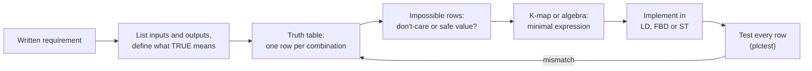

# 05 — Boolean Logic, Truth Tables and Function Block Diagram

> **Level:** 2 — Core programming · **Time:** ~8 hours (about a third of it on the labs) · **Prerequisites:** [Module 04](../04-ladder-logic/)

Almost every line of a PLC program makes a TRUE/FALSE decision. May this pump start? Must this
valve close? Should the horn sound? Is this trip genuine, or is a transmitter faulty? In Module
04 you wrote such decisions as ladder rungs. This module gives you the mathematics underneath them, Boolean
algebra, and the tools that turn a written requirement into logic that is correct, as simple as
it can be, and easy to check: truth tables and Karnaugh maps.

It also introduces the second graphical language of IEC 61131-3, **Function Block Diagram
(FBD)**. FBD looks like the logic diagrams and DCS configuration sheets that instrument and
process-safety engineers already know. You will learn how an FBD network executes, why that
matters, and when FBD is the natural choice. The module ends with plant logic: permissives,
interlocks and trips, two-out-of-three voting, the everyday uses of exclusive-OR, and the
difference between logic with memory and logic without it.

## Learning objectives

By the end of this module you will be able to:

- **Write** the truth table of NOT, AND, OR, XOR, NAND and NOR, and implement each one in
  Ladder (LD), FBD and Structured Text (ST).
- **Predict** how ST evaluates a Boolean expression from operator precedence (NOT, AND, XOR,
  OR), and use parentheses to make the intent unmistakable.
- **Apply** the laws of Boolean algebra and De Morgan's theorems to simplify logic, and
  translate each step into its ladder equivalent.
- **Build** a truth table from a written requirement, and reduce it to a minimal expression
  with a Karnaugh map of two, three or four variables, using don't-care terms responsibly.
- **Read and draw** FBD networks, explain how they execute (data flow, network order,
  feedback variables), and choose between LD, FBD and ST for a given job.
- **Distinguish** permissives, interlocks and trips, and turn a cause-and-effect matrix into
  logic.
- **Implement** two-out-of-three voting with discrepancy detection, and explain what 1oo2, 2oo2
  and 2oo3 trade off.
- **Tell** combinational logic from sequential logic, and recognise the feedback that creates
  memory.

## 1. Logic is the heart of a PLC program

### 1.1 TRUE, FALSE and what they mean on your plant

A Boolean value (IEC type `BOOL`) has only two states. The same two states go by many names:

| Logic | Electrical (24 V DC input) | NO contact `--] [--` on the bit | Everyday |
|---|---|---|---|
| TRUE, 1 | Voltage present, input energised | Passes power | On, yes, made |
| FALSE, 0 | No voltage, input de-energised | Blocks power | Off, no, broken |

The logic only works if you know what TRUE *means* for every signal. A pressed push-button, a
healthy stop button, a closed valve and a tripped overload can all be TRUE, depending on how
they are wired and which contact is used. [Module 02](../02-electrical-and-field-devices/)
explained why safety-related devices are wired normally-closed (fail-safe), and Module 04 showed
the confusion this causes. In this course the tag name says what TRUE means:

| Tag | Device and wiring | TRUE means |
|---|---|---|
| `StartPB` | NO push-button | Pressed |
| `StopPB_NC` | NC push-button | **Not** pressed, and the wire is intact |
| `LSL101_NC` | Low-level switch LSL-101, NC, fail-safe | Level **above** the switch (healthy) |
| `MotorFault` | Fault contact of a motor protection relay, NO | Protection has tripped |
| `SDVSolenoid` (output) | Solenoid of shutdown valve SDV-100, de-energise to trip | Energised: valve held open |

Before you write any logic, write this table for your signals. Most "logic" bugs on site are
really *meaning* bugs: someone inverted a signal that was already inverted.

### 1.2 Two kinds of logic

**Combinational logic** has no memory: its outputs depend only on the inputs *now*. "The
permissive lamp is on when the suction valve is open AND the level is not low AND there is no
fault" is combinational. A truth table describes it completely.

**Sequential logic** has memory: its outputs also depend on what happened before. A seal-in
(Module 04) is sequential. Press Start and release it, and the inputs are the same as before
you pressed it, yet the motor is now running. Timers, counters, edge detectors and state
machines are all sequential.

Sections 2 to 11 are about combinational logic, the building material for everything else.
Section 12 shows exactly where memory comes from.

### 1.3 A little history

George Boole worked out his algebra of logic in the middle of the nineteenth century, long
before anyone built a machine that could use it. In 1938 Claude Shannon showed that the same
algebra describes relay switching circuits: contacts in series behave like AND, contacts in
parallel like OR. Relay control panels,
and the ladder diagrams that PLCs copied from them, are Boolean algebra drawn in copper. That is
why every law in this module has a ladder picture.

## 2. The basic operations

For each operation you get the truth table, the ladder rung, the FBD box and the ST expression.
The FBD drawings use this course's ASCII conventions, which are explained fully in section 8.3.
A small `o` where a line meets a box means that pin is **negated** (inverted).

### 2.1 NOT (inversion, complement)

The output is the opposite of the input.

| A | NOT A |
|---|---|
| 0 | 1 |
| 1 | 0 |

```text
        A                                                  Y
 |-----]/[-------------------------------------------------( )-----|
```

```text
          +-------+
 A -------|  NOT  |------- Y
          +-------+
```

```iecst
Y := NOT A;
```

In ladder, NOT of a single bit is simply the NC contact `--]/[--`. The contact symbol says
nothing about how the field device is wired: it inverts the bit in the program, nothing else.

### 2.2 AND (conjunction)

The output is TRUE only when **all** inputs are TRUE. In ladder: contacts in **series**.

| A | B | A AND B |
|---|---|---|
| 0 | 0 | 0 |
| 0 | 1 | 0 |
| 1 | 0 | 0 |
| 1 | 1 | 1 |

```text
        A             B                                    Y
 |-----] [-----------] [-----------------------------------( )-----|
```

```text
          +-------+
 A -------|  AND  |
          |       |------- Y
 B -------|       |
          +-------+
```

```iecst
Y := A AND B;      (* IEC also allows the symbol &:  Y := A & B; *)
```

Plant reading: "the pump may run if the suction valve is open **and** the tank is not low".

### 2.3 OR (disjunction)

The output is TRUE when **at least one** input is TRUE. In ladder: contacts in **parallel**.

| A | B | A OR B |
|---|---|---|
| 0 | 0 | 0 |
| 0 | 1 | 1 |
| 1 | 0 | 1 |
| 1 | 1 | 1 |

```text
        A                                                  Y
 |-----] [-----+-------------------------------------------( )-----|
 |             |
 |      B      |
 |-----] [-----+
```

```text
          +-------+
 A -------|  OR   |
          |       |------- Y
 B -------|       |
          +-------+
```

```iecst
Y := A OR B;
```

This is the *inclusive* OR: both TRUE also gives TRUE. "Sound the horn if the temperature is
high **or** the pressure is high" should certainly sound when both are.

### 2.4 XOR (exclusive OR) and XNOR (equivalence)

XOR is TRUE when the inputs **differ**. XNOR, its inverse, is TRUE when they are **equal**.

| A | B | A XOR B | A XNOR B |
|---|---|---|---|
| 0 | 0 | 0 | 1 |
| 0 | 1 | 1 | 0 |
| 1 | 0 | 1 | 0 |
| 1 | 1 | 0 | 1 |

Ladder has no XOR contact, so you build it from its definition, "A and not B, or not A and B":

```text
        A             B                                    Y
 |-----] [-----------]/[-----+-----------------------------( )-----|
 |                           |
 |      A             B      |
 |-----]/[-----------] [-----+
```

```text
          +-------+
 A -------|  XOR  |
          |       |------- Y
 B -------|       |
          +-------+
```

```iecst
Y := A XOR B;          (* TRUE when A and B differ *)
Z := NOT (A XOR B);    (* XNOR: TRUE when A and B are equal *)
```

The classic XOR circuit is the stair light with a switch at the top and another at the bottom:
flipping either switch changes the light. Section 11 shows the plant uses: position checks,
channel discrepancy, change detection and parity.

### 2.5 NAND and NOR

NAND is NOT-AND and NOR is NOT-OR: the output of AND or OR, inverted.

| A | B | A NAND B | A NOR B |
|---|---|---|---|
| 0 | 0 | 1 | 1 |
| 0 | 1 | 1 | 0 |
| 1 | 0 | 1 | 0 |
| 1 | 1 | 0 | 0 |

IEC 61131-3 has no `NAND` or `NOR` operator. In ST you write `NOT (A AND B)` and
`NOT (A OR B)`. In FBD you negate the output pin of an AND or OR box:

```text
          +-------+                           +-------+
 A -------|  AND  |                  A -------|  OR   |
          |       |o------ Y (NAND)           |       |o------ Y (NOR)
 B -------|       |                  B -------|       |
          +-------+                           +-------+
```

In ladder you have two choices. IEC 61131-3 defines a **negated coil** `--(/)--`, which writes
the inverse of the rung result to its variable. Or you use De Morgan's theorem (section 4.4) and
rearrange the contacts, which works on every platform:

```text
    NAND: NOT (A AND B) = (NOT A) OR (NOT B)      NOR: NOT (A OR B) = (NOT A) AND (NOT B)

        A                              Y                A             B              Y
 |-----]/[-----+-----------------------( )---|   |-----]/[-----------]/[-----------( )---|
 |             |
 |      B      |
 |-----]/[-----+
```

NOR is exactly what a string of stop buttons does: the machine may run only if **neither** stop
is pressed. NAND and NOR are "universal" (any logic can be built from NAND gates alone, or NOR
gates alone), which matters to chip designers. In a PLC you simply use whichever form reads
best.

### 2.6 All six at a glance

| A | B | NOT A | AND | OR | XOR | NAND | NOR | XNOR |
|---|---|---|---|---|---|---|---|---|
| 0 | 0 | 1 | 0 | 0 | 0 | 1 | 1 | 1 |
| 0 | 1 | 1 | 0 | 1 | 1 | 1 | 0 | 0 |
| 1 | 0 | 0 | 0 | 1 | 1 | 1 | 0 | 0 |
| 1 | 1 | 0 | 1 | 1 | 0 | 0 | 0 | 1 |

| Operation | Ladder | FBD | ST |
|---|---|---|---|
| NOT | NC contact `--]/[--` | `NOT` box, or a negated pin `o` | `NOT A` |
| AND | Contacts in series | `AND` box (`&`) | `A AND B`, `A & B` |
| OR | Contacts in parallel | `OR` box (`>=1`) | `A OR B` |
| XOR | Two branches: `A·B'` parallel with `A'·B` | `XOR` box | `A XOR B`, or `A <> B` |
| NAND | Parallel NC contacts, or a negated coil | `AND` with negated output | `NOT (A AND B)` |
| NOR | Series NC contacts, or a negated coil | `OR` with negated output | `NOT (A OR B)` |
| XNOR | Two branches: `A·B` parallel with `A'·B'` | `XOR` with negated output | `NOT (A XOR B)`, or `A = B` |

### 2.7 More than two inputs

AND and OR extend naturally. With any number of inputs, AND is TRUE when **all** of them are
TRUE and OR when **any** is. IEC 61131-3 also lets you call them as functions with many inputs,
which is exactly what an FBD box with extra input pins is:

```iecst
AllHealthy := AND(SuctionOpenLS, LSL101_NC, NOT MotorFault);
AnyAlarm   := OR(HighTemp, HighPress, LowFlow, LowLevel);
```

XOR is the trap. A multi-input XOR, such as `XOR(A, B, C)` in ST or an XOR box with three
pins, is TRUE when an **odd number** of inputs are TRUE. It is a parity check, **not** "exactly
one". With all three inputs TRUE it gives TRUE (verified with `plctest`). Check your
platform's help before you rely on a multi-input XOR box. If you mean "exactly one of three",
write it out:

```iecst
ExactlyOne := (A AND NOT B AND NOT C) OR (NOT A AND B AND NOT C) OR (NOT A AND NOT B AND C);
```

## 3. Operator precedence in Structured Text

### 3.1 The order

When an ST expression mixes operators, **precedence** decides which is applied first, just as
multiplication comes before addition in arithmetic. The full table is in
[Module 10](../10-structured-text/). For Boolean logic, the part that matters is:

| Precedence | Operators | Binds |
|---|---|---|
| Highest | `( ... )` | Parentheses first, always |
| | `NOT` | Applies to the **next operand only** |
| | Comparisons `<` `>` `<=` `>=`, then `=` `<>` | Tighter than any Boolean operator |
| | `AND`, `&` | |
| | `XOR` | |
| Lowest | `OR` | |

So `NOT` before `AND` before `XOR` before `OR`. Operators of equal precedence are applied left
to right. All of the following were checked with the course compiler:

| You write | The compiler reads | Why |
|---|---|---|
| `A OR B AND C` | `A OR (B AND C)` | AND before OR |
| `NOT A AND B` | `(NOT A) AND B` | NOT takes only the next operand |
| `A OR B XOR C` | `A OR (B XOR C)` | XOR before OR |
| `A XOR B AND C` | `A XOR (B AND C)` | AND before XOR |
| `Level > 80.0 AND Running` | `(Level > 80.0) AND Running` | Comparisons first |
| `A = B AND C` | `(A = B) AND C` | `=` is a comparison, so it binds tighter than AND |

### 3.2 How precedence bites

Here is a real class of bug. The specification says: "the pump may run if the permissive is OK
and either (Auto and Demand) or (Manual and Start)". Someone types:

```iecst
Pump := PermissiveOK AND AutoMode AND Demand OR ManualMode AND StartCmd;
```

Because AND binds tighter than OR, the compiler reads it as:

```iecst
Pump := (PermissiveOK AND AutoMode AND Demand) OR (ManualMode AND StartCmd);
```

The permissive now protects only Auto. In Manual the pump starts with the suction valve shut.
It compiles, it looks reasonable, and it works in every test done in Auto. The correct version
states the grouping:

```iecst
Pump := PermissiveOK AND ((AutoMode AND Demand) OR (ManualMode AND StartCmd));
```

A second classic: `Healthy := NOT Fault1 OR Fault2;` means `(NOT Fault1) OR Fault2`, which is
TRUE when Fault2 is present. The writer almost certainly meant `NOT (Fault1 OR Fault2)`.

### 3.3 Rules of thumb

- **Whenever a line mixes AND with OR (or XOR), write the parentheses**, even where precedence
  would give the right answer. They cost nothing and tell the next reader what you meant.
- **Put `NOT` directly in front of what it inverts**, with parentheses if that is more than one
  signal: `NOT (A OR B)`.
- **Break long expressions into named intermediate variables** (`PermissiveOK`, `RunRequest`).
  Each one can be shown on the HMI and watched online. This is the single best habit for
  readable logic.
- For two BOOLs, `A = B` is XNOR and `A <> B` is XOR. They are handy, but remember they are
  comparisons and bind tighter than AND: write `(ChA = ChB) AND Enable`.
- IEC 61131-3 does not require short-circuit evaluation of `AND`/`OR`. Don't hide function block
  calls or other side effects inside Boolean expressions ([Module 10](../10-structured-text/)).

## 4. Boolean algebra

### 4.1 Notation

Boolean algebra is written more compactly than ST. This module uses:

| Algebra | Meaning | ST |
|---|---|---|
| `A·B` or `AB` | A AND B | `A AND B` |
| `A + B` | A OR B | `A OR B` |
| `A'` | NOT A (other books draw a bar over the letter, or write ¬A) | `NOT A` |
| `A ⊕ B` | A XOR B | `A XOR B` |
| `1`, `0` | TRUE, FALSE | `TRUE`, `FALSE` |

`+` here is OR, not addition: `1 + 1 = 1`. Precedence is the same as in ST: NOT, then AND, then
OR, so `A + B·C'` means `A + (B·(C'))`.

### 4.2 The laws

Each law has a ladder meaning. Once you see it, you will spot redundant contacts on every
drawing you read.

| Law | AND form | OR form | What it means in ladder |
|---|---|---|---|
| Identity | `A·1 = A` | `A + 0 = A` | A contact that is always made, in series, changes nothing. An open branch in parallel changes nothing. |
| Null (annulment) | `A·0 = 0` | `A + 1 = 1` | An always-open contact in series kills the rung. A jumper in parallel makes it always TRUE. |
| Idempotent | `A·A = A` | `A + A = A` | The same contact twice in series (or twice in parallel) adds nothing. |
| Complement | `A·A' = 0` | `A + A' = 1` | NO and NC contacts of the same bit in series: the rung can **never** be TRUE. In parallel: **always** TRUE. |
| Double negation | `(A')' = A` | | An NC contact on an inverted copy of a bit is an NO contact on the bit. |
| Commutative | `A·B = B·A` | `A + B = B + A` | The order of series contacts, or of parallel branches, does not change the result. |
| Associative | `(A·B)·C = A·(B·C)` | `(A + B) + C = A + (B + C)` | Grouping of series or parallel contacts does not matter. |
| Distributive | `A·(B + C) = A·B + A·C` | `A + B·C = (A + B)·(A + C)` | A contact common to several parallel branches can be moved out in front of them. |
| Absorption | `A·(A + B) = A` | `A + A·B = A` | A parallel branch that repeats the main branch plus extra contacts is redundant. |
| Redundancy | `A·(A' + B) = A·B` | `A + A'·B = A + B` | In a branch parallel to contact `A`, an NC contact of `A` is redundant: it only excludes a case the other branch already covers. |
| De Morgan | `(A·B)' = A' + B'` | `(A + B)' = A'·B'` | Section 4.4. |

Three remarks. First, the laws come in pairs: swap AND with OR and 1 with 0 and you get the
partner law (this is called **duality**). Second, the OR form of the distributive law has no
equivalent in ordinary arithmetic, so check it with the truth table below if it looks wrong.
Third, "commutative" is about the logical result. When a contact is an edge detector or an ST
operand calls a function block, order can matter ([Module 06](../06-edges-and-one-shots/)).

### 4.3 Proving a law with a truth table

Any Boolean identity can be proved by checking every combination of inputs. With three
variables that is eight rows. Here is the surprising distributive law,
`A + B·C = (A + B)·(A + C)`:

| A | B | C | B·C | **A + B·C** | A + B | A + C | **(A + B)·(A + C)** |
|---|---|---|---|---|---|---|---|
| 0 | 0 | 0 | 0 | **0** | 0 | 0 | **0** |
| 0 | 0 | 1 | 0 | **0** | 0 | 1 | **0** |
| 0 | 1 | 0 | 0 | **0** | 1 | 0 | **0** |
| 0 | 1 | 1 | 1 | **1** | 1 | 1 | **1** |
| 1 | 0 | 0 | 0 | **1** | 1 | 1 | **1** |
| 1 | 0 | 1 | 0 | **1** | 1 | 1 | **1** |
| 1 | 1 | 0 | 0 | **1** | 1 | 1 | **1** |
| 1 | 1 | 1 | 1 | **1** | 1 | 1 | **1** |

The two bold columns are identical, so the expressions are equal. This is also how you prove
that a "tidied up" rung still does what the old one did, and the labs do exactly that: the
`.test` files check every row.

### 4.4 De Morgan's theorems

Augustus De Morgan's two theorems tell you how to invert an AND or an OR:

```text
   NOT (A AND B)  =  (NOT A) OR  (NOT B)          (A·B)' = A' + B'
   NOT (A OR  B)  =  (NOT A) AND (NOT B)          (A + B)' = A'·B'
```

The memory aid is **"break the bar, change the sign"**: when you push a NOT through a
bracket, every signal inside gets inverted and every AND becomes OR (and OR becomes AND). It
works for any number of signals: `NOT (A OR B OR C) = (NOT A) AND (NOT B) AND (NOT C)`.

In ladder, De Morgan turns a rung that needs an inversion of a whole condition into one that
only needs NC contacts:

```text
  Version 1: compute A AND B, then invert it (needs an extra bit)

        A             B                                    AB
 |-----] [-----------] [-----------------------------------( )-----|
 |
 |      AB                                                 Y
 |-----]/[-------------------------------------------------( )-----|

  Version 2: De Morgan, the same result in one rung

        A                                                  Y
 |-----]/[-----+-------------------------------------------( )-----|
 |             |
 |      B      |
 |-----]/[-----+
```

**De Morgan in the field wiring.** A cooling tower has three fans. The NC auxiliary contacts of
their three thermal overload relays are wired in series into one input, `FanOverloads_NC`. The
input is TRUE only if overload 1 has not tripped AND overload 2 has not tripped AND overload 3
has not tripped: `FanOverloads_NC = T1'·T2'·T3'`. By De Morgan that is `(T1 + T2 + T3)'`, "NOT
(any overload tripped)". The series string of NC contacts is a NOR gate built in copper. It is
fail-safe, because a broken wire anywhere reads the same as a trip. It also saves two inputs, at
a price: the PLC cannot tell *which* fan tripped. Where diagnostics matter, give each device its
own input and do the AND in the program.

**De Morgan in cause-and-effect logic.** Process trips are usually written as "stop the pump if
any of these causes is present": `Stop = C1 + C2 + C3`. With fail-safe wiring the PLC receives
the healthy signals `H1 = C1'`, `H2 = C2'`, `H3 = C3'`. So the pump may run when
`Stop' = (C1 + C2 + C3)' = H1·H2·H3`, which is a plain AND of the healthy signals: series NO
contacts on `_NC` inputs. Section 9.4 builds on this.

### 4.5 Simplification: worked examples

**Example 1: a branch that doesn't care.** `Y = A·B + A·B'`

```text
  Y = A·B + A·B'
    = A·(B + B')      distributive: take A out of both terms
    = A·1             complement: B + B' = 1
    = A               identity
```

In ladder: two branches, one with `A` and `B` NO, one with `A` NO and `B` NC, become one NO
contact `A`. Whatever `B` does, one of the branches passes, so `B` is irrelevant.

**Example 2: the distributive law in reverse.** `Y = (A + B)·(A + C)`

```text
  Y = (A + B)·(A + C)
    = A + B·C         distributive (OR form)
```

In ladder: two parallel pairs in series (four contacts, two of them `A`) become `A` in parallel
with `B`-in-series-with-`C` (three contacts).

**Example 3: absorption.** `Y = A·B + A·B·C + A'·B`

```text
  Y = A·B + A·B·C + A'·B
    = A·B + A'·B      absorption: A·B + (A·B)·C = A·B
    = (A + A')·B      distributive
    = B               complement, then identity
```

The whole rung is a single contact `B`. Rungs like this grow in real programs as conditions
are added over the years. The absorbed term `A·B·C` is often the fossil of a requirement that
changed.

**Example 4: redundancy.** A lamp-test circuit was written as
`Lamp := LampTest OR (NOT LampTest AND Alarm);`

```text
  Lamp = T + T'·A
       = (T + T')·(T + A)   distributive (OR form)
       = T + A              complement, identity
```

So `Lamp := LampTest OR Alarm;`. The `NOT LampTest` adds nothing: if the test button is pressed
the lamp is on anyway. Look out for NC contacts that "exclude" a case already covered by
another branch.

**Example 5: De Morgan to remove a double negative.**
`AllOK := NOT (NOT PumpOK_NC OR NOT ValveOK_NC);`

```text
  AllOK = (P' + V')'
        = P''·V''        De Morgan
        = P·V            double negation
```

So `AllOK := PumpOK_NC AND ValveOK_NC;`. Double negatives creep in when someone writes "fault"
logic on signals that are already "healthy" signals. Simplify them away, because every NOT is a
chance for a reader to get lost.

### 4.6 Simplest is not always best

Minimal logic is easier to check, but it is not the only goal:

- **Keep the intermediate bits the operator needs.** If the HMI must show *which* permissive is
  missing ([Module 18](../18-hmi-and-scada/)), keep `SuctionOK`, `LevelOK` and `MotorOK` as
  separate named bits, even though the pump logic could be written in one line.
- **Keep the structure of the specification.** If the cause-and-effect matrix has five causes
  for an effect, five visible terms are easier to verify against it than a clever factored form.
- **Don't delete an "impossible" term without asking why it is there.** It may be dead, or it
  may point to a requirement that someone half-implemented.
- **Hazards do not apply to a scanned program the way they do to relays.** In relay and
  electronic logic, a term that looks redundant (a *consensus* term such as `B·C` in
  `A·B + A'·C + B·C`) is sometimes kept on purpose to stop a brief glitch while an input
  changes. A PLC evaluates the whole expression from one snapshot of the input image, so there
  is no glitch between two terms of the same expression. The exception is a platform whose input
  tags can update in the middle of a scan (Rockwell Logix, for example). There you should copy
  the inputs to internal tags once at the start of the routine.

## 5. Truth tables and canonical forms

### 5.1 Building a truth table

A truth table lists every combination of the inputs, one per row, and the output for each.

1. List the inputs in a fixed order. The first column is the most significant bit.
2. With n inputs there are 2ⁿ rows. Count in binary: `000, 001, 010, …`. The row number is then
   the binary value of the inputs (row 5 of a three-input table is `101`).
3. Fill in the output for each row from the requirement. Where the requirement is silent, stop
   and ask. A silent requirement is a design decision that somebody has to make.

| Inputs | Rows | Practical? |
|---|---|---|
| 2 | 4 | Always |
| 3 | 8 | Always |
| 4 | 16 | Yes: the limit for comfortable Karnaugh maps |
| 5 | 32 | With care |
| 7 | 128 | Only by splitting the problem |
| 10 | 1024 | No: split the problem into independent parts |

Lab 05-1 has seven inputs. Nobody draws 128 rows. Instead the logic splits into a permissive
part (three inputs, 8 rows) and a mode part (four inputs, 16 rows), each small enough to reason
about and test exhaustively.

### 5.2 Sum of products (SOP): reading logic off the 1-rows

Every truth table can be written as an OR of AND terms, one term per row that has output 1:

1. For each row where the output is 1, write an AND term with every input: the plain input if
   it is 1 in that row, the inverted input if it is 0. This term is called a **minterm**. It is
   TRUE for that row and for no other.
2. OR all the minterms together.

Take the 2-out-of-3 majority function (TRUE when at least two of A, B, C are TRUE):

| Row | A | B | C | Y | Minterm |
|---|---|---|---|---|---|
| 0 | 0 | 0 | 0 | 0 | |
| 1 | 0 | 0 | 1 | 0 | |
| 2 | 0 | 1 | 0 | 0 | |
| 3 | 0 | 1 | 1 | 1 | `A'·B·C` |
| 4 | 1 | 0 | 0 | 0 | |
| 5 | 1 | 0 | 1 | 1 | `A·B'·C` |
| 6 | 1 | 1 | 0 | 1 | `A·B·C'` |
| 7 | 1 | 1 | 1 | 1 | `A·B·C` |

`Y = A'·B·C + A·B'·C + A·B·C' + A·B·C`. That is correct but not minimal. Section 10.2
simplifies it to `A·B + B·C + A·C`.

**SOP is ladder.** Each product term is one branch of series contacts, and the sum is those
branches in parallel. A sum of products always maps directly onto a rung, which is one reason
ladder programmers think in SOP.

### 5.3 Product of sums (POS): reading logic off the 0-rows

The dual method uses the rows where the output is 0. For each 0-row write an OR term that is
FALSE only in that row (the inverted input if it is 1, the plain input if it is 0), then AND the
terms. POS is shorter when there are few zeros. If a fan must run in every case except "all three
inputs FALSE" (row 0), POS gives one term straight away: `Y = A + B + C`. In ladder a POS is a
series chain of parallel groups.

### 5.4 Shorthand

Writing out minterms gets tedious, so textbooks list the row numbers: the majority function is
`Y = Σm(3, 5, 6, 7)`, "the sum of minterms 3, 5, 6 and 7". Rows whose output doesn't matter
(section 6.6) are listed separately as `d(...)`.

## 6. Karnaugh maps

Algebra works, but it is easy to miss a simplification. A **Karnaugh map** (K-map), described by
Maurice Karnaugh in 1953, lays the truth table out so that the simplifications become visible as
rectangles.

### 6.1 The idea

In section 4.5, Example 1 showed that `A·B + A·B' = A`: two minterms that differ in exactly one
variable combine, and that variable disappears. A K-map is a grid arranged so that **cells next
to each other differ in exactly one variable**. To make that true, the rows and columns are
labelled in **Gray code** order, `00, 01, 11, 10`, not in binary order. Between any two
neighbours, including from the last column back round to the first, only one bit changes.

Cell numbers (the truth-table row for each cell):

```text
  2 variables              3 variables                      4 variables

         B=0  B=1                 BC=00 BC=01 BC=11 BC=10            CD=00 CD=01 CD=11 CD=10
  A=0     0    1           A=0      0     1     3     2      AB=00     0     1     3     2
  A=1     2    3           A=1      4     5     7     6      AB=01     4     5     7     6
                                                             AB=11    12    13    15    14
                                                             AB=10     8     9    11    10
```

Notice that columns 3 and 2, and rows 12 and 8, are "out of order". That is the Gray code at
work, and it is the most common place to make a mistake when copying a truth table into a map.

### 6.2 Grouping rules

1. Copy each output value into its cell (use the cell-number grid above).
2. Circle groups of 1s. A group must be a **rectangle** of 1, 2, 4, 8 or 16 cells (a power of
   two). No L-shapes, no diagonals, no groups of 3 or 6.
3. Make each group **as large as possible**, and use **as few groups as possible**.
4. Groups may **overlap**. A 1 can belong to several groups if that makes the groups bigger.
5. The map **wraps round**: the left and right edges are neighbours, and so are the top and
   bottom edges. On a 4-variable map the four corner cells form a group of four.
6. Every 1 must be in at least one group. A 0 must never be in a group.
7. Read each group as one AND term: keep the variables that are the **same** in every cell of
   the group (plain if 1, inverted if 0). Drop the variables that change. A pair drops one
   variable, a quad drops two, an octet drops three.
8. OR the terms together. The result is a minimal sum of products: the fewest terms, and the
   fewest **literals**. A literal is one appearance of a variable, plain or inverted, which is
   one contact in ladder.

In the maps below, the group each cell belongs to is marked with a letter, and `.` is a 0.

### 6.3 Two variables: alarm lamp with lamp test

An alarm lamp `Lamp` lights when the alarm `A` is active or the lamp-test button `T` is pressed.

| A | T | Lamp |
|---|---|---|
| 0 | 0 | 0 |
| 0 | 1 | 1 |
| 1 | 0 | 1 |
| 1 | 1 | 1 |

```text
  Values                Groups
         T=0  T=1              T=0  T=1
  A=0     0    1        A=0     .    y           x = row A=1          -> A
  A=1     1    1        A=1     x   xy          y = column T=1       -> T
```

`Lamp = A + T`. The cell `A=1, T=1` is in both groups. Overlapping made both groups pairs
instead of one pair and a lonely single cell (`A + A'·T`, the redundant form from Example 4).

### 6.4 Three variables: wrap-around

`Y = Σm(0, 2, 3, 4, 6)`. This example has no story, so that you can concentrate on the method.

```text
 Values                                Groups
        BC=00 BC=01 BC=11 BC=10               BC=00 BC=01 BC=11 BC=10
 A=0      1     0     1     1          A=0      x     .     y    xy
 A=1      1     0     0     1          A=1      x     .     .     x
```

- **Group x** is the four cells in columns `00` and `10`, top and bottom. Columns `00` and `10`
  look far apart, but they are neighbours because the map wraps round from the right edge to the
  left. In all four cells C = 0, while A and B both change. The term is `C'`.
- **Group y** is the pair in row `A=0`, columns `11` and `10`: A = 0 and B = 1 in both, and C
  changes. The term is `A'·B`.

`Y = C' + A'·B`. Compare that with the five three-letter minterms you started with.

### 6.5 Four variables: corners, and more than one right answer

`Y = Σm(0, 2, 3, 5, 7, 8, 10, 11, 13, 15)`.

```text
 Values                                  Groups
          CD=00 CD=01 CD=11 CD=10                 CD=00 CD=01 CD=11 CD=10
 AB=00      1     0     1     1          AB=00      x     .     z     x
 AB=01      0     1     1     0          AB=01      .     y    yz     .
 AB=11      0     1     1     0          AB=11      .     y    yz     .
 AB=10      1     0     1     1          AB=10      x     .     z     x
```

- **Group x, the four corners** (cells 0, 2, 8, 10). The map wraps both ways, so the corners
  touch. In all four, B = 0 and D = 0: `B'·D'`.
- **Group y, the centre square** (cells 5, 7, 13, 15). B = 1 and D = 1: `B·D`.
- Cells 3 and 11 are still uncovered. **Group z** here is the column `CD=11` (cells 3, 7, 15,
  11): `C·D`. But the block of cells 2, 3, 10 and 11 (`B'·C`) would cover them equally well.

So there are **two** minimal answers, `Y = B'·D' + B·D + C·D` and `Y = B'·D' + B·D + B'·C`, both
three terms of two variables each. Minimal answers are not always unique, and that is fine: any
correct answer passes a test that checks every row. Notice also that `B'·D' + B·D` is
`NOT (B XOR D)`. Section 6.7 explains how to spot that.

### 6.6 Don't-care terms, and why they need care on a plant

Sometimes an input combination **cannot happen**, or the output doesn't matter when it does.
Those rows are **don't-cares**, marked `X` in the table and the map. You may count an `X` as 1
if that makes a group bigger, or as 0 if it doesn't help. You never *have* to cover it.

**Example: a Hand-Off-Auto selector.** A three-position selector switch has two contacts, `H`
(Hand) and `A` (Auto). In Off neither is made. The pump runs in Hand, or in Auto when there is
demand `D`. A healthy selector can never make both contacts, so rows 6 and 7 are don't-cares.

| Row | H | A | D | Run |
|---|---|---|---|---|
| 0 | 0 | 0 | 0 | 0 |
| 1 | 0 | 0 | 1 | 0 |
| 2 | 0 | 1 | 0 | 0 |
| 3 | 0 | 1 | 1 | 1 |
| 4 | 1 | 0 | 0 | 1 |
| 5 | 1 | 0 | 1 | 1 |
| 6 | 1 | 1 | 0 | X |
| 7 | 1 | 1 | 1 | X |

```text
 Values                                Groups
        AD=00 AD=01 AD=11 AD=10               AD=00 AD=01 AD=11 AD=10
 H=0      0     0     1     0          H=0      .     .     y     .
 H=1      1     1     X     X          H=1      x     x    xy     x
```

Using both X cells as 1s gives `Run = H + A·D`. Treating them as 0s gives
`Run = H·A' + H'·A·D`, which needs five contacts instead of three.

**Now the engineering question.** "Cannot happen" really means "cannot happen *while everything
is healthy*". Selector contacts weld, wires short together, and someone may replace the switch
with the wrong type. With the minimal logic, a selector showing both contacts runs the pump in
Hand, ignoring the demand. Is that acceptable? For a drainage pump, perhaps. For a dosing pump,
certainly not. Every don't-care is a decision about what the plant does when something fails:

- Decide it on purpose and write it down.
- If the "impossible" combination is detectable, it is usually worth an alarm:
  `SelectorFault := H AND A;` (Lab 05-1 does exactly this).
- Choose the safe value for the output in that row rather than the value that gives the
  prettiest map. If the safe value is 0, the row is no longer a don't-care.

**Example: a coded pallet.** Four proximity sensors read holes in a pallet, giving a product
code from 0 to 9 (`A` is the 8s bit, `D` the 1s bit). Codes 10 to 15 are never issued. Pallets
with codes 4 to 9 go to line B.

```text
 Values                                  Groups
          CD=00 CD=01 CD=11 CD=10                 CD=00 CD=01 CD=11 CD=10
 AB=00      0     0     0     0          AB=00      .     .     .     .
 AB=01      1     1     1     1          AB=01      y     y     y     y
 AB=11      X     X     X     X          AB=11     xy    xy    xy    xy
 AB=10      1     1     X     X          AB=10      x     x     x     x
```

With the don't-cares, `ToLineB = A + B`: two contacts. Without them, `A'·B + A·B'·C'`. But a
damaged pallet or a failed sensor can produce code 12, and the minimal logic sends it to line B
without complaint. The better design keeps the minimal routing **and** flags the invalid codes:
`InvalidCode := A AND (B OR C);` (codes 10 to 15), which stops the diverter and calls an
operator.

### 6.7 Spotting XOR in a map

A group can't be diagonal, so XOR and XNOR show up as a **checkerboard**: 1s that touch only at
their corners. In section 6.5, cells 0, 2, 8, 10 and 5, 7, 13, 15 form a checkerboard in B and D,
which is why two groups combined into `NOT (B XOR D)`. When you see a checkerboard, try
factoring out an XOR. The SOP from the map is still correct, but the XOR form is usually shorter
and says what the logic *means*. Worked example 1 shows a valve line-up check where the XOR form
is the natural one.

### 6.8 Limits

K-maps are practical up to four variables, bearable at five (two 4-variable maps side by
side), and useless beyond six. Logic-synthesis software uses algorithms such as Quine–McCluskey
instead. In PLC work you rarely need them: split the problem into parts with few inputs (the
permissives, the mode, the alarms) and simplify each part. A K-map is also a good *check*. Draw
the map of the rung you already have, and missing or redundant cases jump out.

## 7. From a word problem to working logic

Requirements arrive as sentences, and sentences are ambiguous. This method turns them into
logic you can prove correct:



1. **Inputs and outputs.** List every signal and write down what TRUE means (section 1.1).
   Convert fail-safe inputs into "healthy" or "demand" terms explicitly.
2. **Truth table.** Fill in every row. Where the text is silent, ask the person who wrote it.
   The rows that nobody thought about are where the incidents come from.
3. **Impossible rows.** Decide deliberately (section 6.6).
4. **Minimise** with a K-map or algebra, and look for XOR patterns.
5. **Implement** in the language that suits the job (section 8.9).
6. **Test every row.** For up to about five inputs, test them all. Above that, split the logic
   and test each part exhaustively, plus the interactions between the parts. The lab `.test`
   files show how.

Worked example 1 follows this method from start to finish.

## 8. Function Block Diagram (FBD)

### 8.1 What FBD is

FBD is one of the two graphical languages of IEC 61131-3 (the other is Ladder). A program is a
set of **networks**. Each network is a diagram of **blocks** connected by lines, with signals
flowing **from left to right**: inputs enter on the left, results leave on the right. It looks
like an electronic logic diagram, and like the binary logic diagrams of ANSI/ISA-5.2 that you
may know from interlock documentation. It is also close to the function-block configuration used
by most DCS platforms. If you have read a DCS control-module sheet, you can read FBD.

Unlike ladder, FBD handles numbers as naturally as bits. A comparison, a scaling calculation or
a PID block sits in the same network as the AND gates that use its result.

### 8.2 The elements of a network

| Element | What it is | Example |
|---|---|---|
| **Variable** | An input read on the left or an output written on the right | `LSL101_NC`, `Pump` |
| **Literal** | A constant wired to a pin | `90.0`, `T#5s`, `TRUE` |
| **Function** | A block with no memory: same inputs, same output, every time | `AND`, `OR`, `GT`, `ADD`, `SEL`, `LIMIT` |
| **Function block (FB)** | A block with memory, an **instance** with its own data | `TON`, `SR`, `R_TRIG`, `CTU` |
| **Connection** | A line carrying a value from an output pin to one or more input pins | |
| **Negation** | A small circle on a Boolean input or output pin, meaning NOT | `o` in the drawings |
| **EN / ENO** | Optional "enable" input and "enable out" output. If EN is FALSE the block does not execute and ENO is FALSE | Conditional maths |
| **Connector** | A named off-page link, used when a network is too wide to draw in one piece. The standard writes it `>NAME>` | |
| **Feedback path** | A connection from an output back to an earlier input (section 8.5) | Seal-in |

A function block is drawn with its **instance name above the box** and its type inside. A
function has no instance name, because it has no memory to name.

### 8.3 Drawing FBD in this course

Graphical languages have to be drawn with characters in these lessons, so the conventions are:

```text
                         Instance (FBs only)
          +-------+          PumpStart
 A -------|  AND  |        +-----------+
          |       |o-- Y   |    TON    |
 B ------o|       |   X ---|IN        Q|--- Done
          +-------+   T#5s-|PT       ET|--- Elapsed
                           +-----------+
```

- The block type is written in the box, and pin names are written inside the box edge where
  they matter (`IN`, `PT`, `Q`, `ET`). Plain Boolean functions don't need pin names.
- A line ending at `|` is a connection to that pin. A line may split (`+`) to feed several pins.
- `o` touching the box edge is a negated pin. Above, `Y := NOT (A AND NOT B)`.
- A variable name at the left end of a line is read. One at the right end is written.

### 8.4 How an FBD network executes

A graphical network looks as if everything happens at once, like a wired circuit. It doesn't.
The PLC executes the blocks **one at a time, in an order worked out from the connections**. The
first three points below paraphrase the standard's rules for evaluating a network. The fourth is
how the common tools order networks:

1. A block is evaluated only when **all its inputs are available**. If block B uses the output
   of block A, A runs first. This is called **data-flow** order.
2. A block's evaluation is complete only when **all its outputs** have been produced.
3. A network's evaluation is complete only when **every block in it** has been evaluated.
4. **Networks are executed in order, top to bottom**, like ladder rungs, unless a jump changes
   the order. The standard itself does not fix the order of networks, but this is what the
   common tools do. Within one network the data flow decides, not the position on the screen.

For example:

```text
 Network 1
               +-------+
 LT301 --------|  GT   |           (1)             +-------+
 90.0 ---------|       |--------------------------o|  AND  |
               +-------+                           |       |------ XV301_Open
 FillCmd ------------------------------------------|       |   (2)
 LSHH301_NC ---------------------------------------|       |
                                                   +-------+
```

The `GT` block must run before the `AND`, because the `AND` needs its result. The numbers (1)
and (2) are the execution order. Many tools can display this order.

### 8.5 Feedback variables

What about a loop, where a block's output is wired back to an input of an earlier block? The
seal-in is the classic case:

```text
  (a) Drawn with an explicit feedback line

               +-------+        +-------+
 StartPB ------|  OR   |--------|  AND  |
          +----|       |        |       |----+----- Motor
          |    +-------+        |       |    |
          |    StopPB_NC -------|       |    |
          |                     +-------+    |
          +----------------------------------+

  (b) Drawn the usual way: the variable is read on the left and written on the right

               +-------+        +-------+
 StartPB ------|  OR   |--------|  AND  |
 Motor --------|       |        |       |------- Motor
               +-------+        |       |
 StopPB_NC ---------------------|       |
                                +-------+
```

Rule 1 says that no block may run until its inputs are available, so a loop needs a starting
point. The loop is broken at a **feedback variable**: the block at the start of the loop reads
the value that variable had at the **end of the previous evaluation**, which in practice means
the previous scan. On the very first scan it reads the variable's initial value. That is exactly
what the ST `Motor := (StartPB OR Motor) AND StopPB_NC;` does: the `Motor` on the right-hand side
is last scan's value.

Tools differ in how you show where the loop is broken. Form (b), with a named variable, is
clearest and works everywhere. Rockwell Logix FBD asks you to mark the feedback wire with an
**Assume Data Available** indicator. When a loop passes through two or more blocks, as in form
(a), the editor cannot work out an execution order until one wire of the loop is marked.

### 8.6 Execution-order pitfalls

**Using a value before it is calculated.** Suppose network 1 uses `PumpOK` and network 2, below
it, calculates it:

```text
 Network 1                                  Network 2
            +-------+                                         +-------+
 Demand ----|  AND  |                       SuctionOpenLS ----|  AND  |
            |       |---- Pump              LSL101_NC --------|       |---- PumpOK
 PumpOK ----|       |                       MotorFault ------o|       |
            +-------+                                         +-------+
```

Network 1 reads last scan's `PumpOK`, so the pump reacts one scan late. For a pump that
hardly matters. For a one-scan pulse it can mean the pulse is **missed completely**, and for a
trip it adds a scan of delay. Calculate values before you use them: order networks from inputs
through intermediate logic to outputs, just as you order rungs.

**Writing the same output in two networks.** The last network to write wins, exactly like the
double-coil bug in Module 04. Give each output one writer.

**Calling a function block in a network that is jumped over.** If a jump skips the network, the
FB instance is not called that scan. A timer stops timing and an edge detector misses the edge
(the "conditional call" trap in [Module 06](../06-edges-and-one-shots/)). Call FBs every scan.

### 8.7 Standard blocks you will meet in FBD

| Group | Blocks | Covered in |
|---|---|---|
| Boolean | `AND`, `OR`, `XOR`, `NOT` (AND, OR and XOR accept extra inputs) | This module |
| Comparison | `GT`, `GE`, `EQ`, `NE`, `LE`, `LT` | [Module 09](../09-math-and-data-handling/) |
| Selection | `SEL`, `MUX`, `MAX`, `MIN`, `LIMIT` | [Module 09](../09-math-and-data-handling/) |
| Arithmetic | `ADD`, `SUB`, `MUL`, `DIV`, `MOVE` | [Module 09](../09-math-and-data-handling/) |
| Bistables | `SR` (set dominant), `RS` (reset dominant) | [Module 04](../04-ladder-logic/) section 4.5, and section 12 here |
| Edges | `R_TRIG`, `F_TRIG` | [Module 06](../06-edges-and-one-shots/) |
| Timers, counters | `TON`, `TOF`, `TP`, `CTU`, `CTD`, `CTUD` | [Modules 07](../07-timers/) and [08](../08-counters/) |
| Process (vendor) | PID, alarm and scaling blocks | [Modules 14](../14-analog-and-process-io/) and [15](../15-pid-control/) |

### 8.8 Reading FBD: translate it

To understand an unfamiliar FBD network, translate it into one ST expression, working **from the
output back to the inputs**:

1. Start at the output variable on the right. Write `Output :=`.
2. Write the block that drives it, with an empty bracket for each input: `AND( , , )`.
3. Fill each input with whatever drives it: a variable, or another block (recurse).
4. Apply the negation circles as `NOT`.
5. Rewrite the nested functions as operators with parentheses.

For the network in section 8.4: `XV301_Open := AND(NOT GT(LT301, 90.0), FillCmd, LSHH301_NC)`,
which becomes `XV301_Open := NOT (LT301 > 90.0) AND FillCmd AND LSHH301_NC;`.

To **draw** FBD from ST, work the other way. Draw the innermost parentheses as the left-most
blocks and the outermost operator as the right-most block. Keep one output per network where
you can, avoid crossing lines, and give meaningful names to intermediate signals you will want
to watch online.

### 8.9 When FBD is the natural choice

| Job | Natural language | Why |
|---|---|---|
| Process interlocks and permissives | **FBD** | Reads like the interlock logic diagram or C&E it came from. Analog comparisons sit next to the gates. |
| Continuous control: scaling, filtering, PID, ratio, selection | **FBD** | Signal flow is the whole story. This is how DCS platforms configure control. |
| Discrete machine logic: motors, solenoids, seal-ins | **LD** | Electricians can follow it, and online power-flow display makes fault-finding fast. |
| Calculations, loops, arrays, string handling, state machines | **ST** | Too awkward to draw. |
| Step sequences | **SFC** | [Module 13](../13-sequential-control/) |

FBD is weaker for long chains of sequential logic (latches, step logic) and for anything with
loops or arrays. Many plants mix languages: FBD for the interlocks and control loops, LD for the
drives, ST for the calculations. Pick one convention per job and stick to it across the project
([Module 22](../22-software-engineering/)).

## 9. Permissives, interlocks and trips

### 9.1 The terms

On process plants these three words have specific meanings. Many sites define them in their
control philosophy, and the exact usage varies, so check the functional design specification
for your project. A common set of definitions:

| Term | Acts on | Typical behaviour | Example |
|---|---|---|---|
| **Permissive** | **Starting**, or allowing an action | Must be TRUE before the action is allowed. Losing it after the start does not necessarily stop the equipment | Lube-oil pressure healthy before a compressor may start. Suction valve open before a pump may start |
| **Interlock** | **Running** equipment, continuously | Stops, closes or prevents an action for as long as the condition is present, in every mode | Close the tank inlet valve while the high-level switch is active. Stop the pump while the suction pressure is low |
| **Trip** | The process or equipment, to reach a safe state | A protective action that shuts something down and **latches**: it stays tripped until the cause has cleared **and** someone resets it | High-high pressure closes the shutdown valve and stops the compressor |

The phrases "start interlock" (for a permissive) and "running interlock" are also common. What
matters is that the behaviour is specified: does the condition prevent a start, stop running
equipment, or both? Does it latch? Can it be bypassed, and by whom?

In the basic process control system (BPCS), interlocks and trips protect equipment and product.
Trips that reduce the risk of harm to people or the environment are **safety instrumented
functions** and belong in a safety instrumented system designed to IEC 61511
([Module 20](../20-functional-safety/)). The logic looks the same, but the engineering, the
hardware and the management of change are very different.

### 9.2 The logic structure

Permissives and interlocks are combinational. The memory lives in the start/stop seal-in and in
the trip latch. A typical pump has this shape (the seal-in is from Module 04):

```iecst
(* Permissives: needed to START *)
StartPermissive := SuctionOpenLS AND LSL101_NC;

(* Running interlocks: must stay healthy while RUNNING, otherwise the pump stops.
   A motor fault belongs here, not in the permissives: as a start-only condition it
   would leave Pump sealed in after a trip, ready to restart when the relay resets. *)
RunInterlocksOK := LSLL101_NC AND NOT DischargeHighHigh AND NOT MotorFault;

(* Start/stop seal-in: a start is accepted only if permitted; interlocks stop it *)
Pump := ((StartPB AND StartPermissive) OR Pump) AND StopPB_NC AND RunInterlocksOK;
```

Read the last line carefully. `StartPermissive` sits in series with `StartPB` **only**, so it
gates the start, and once the seal-in holds, losing it doesn't stop the pump. `RunInterlocksOK`
is outside the seal-in branch, so it stops the pump at any time. Moving one bracket moves a
condition from one category to the other, which is why the categories must be written in the
specification.

### 9.3 De-energise to trip and healthy-TRUE signals

Protective systems are normally designed **de-energise to trip**: in the healthy state the
sensor contact is closed, the input is energised, the output is energised and the valve is
held open. A trip, a broken wire, a blown fuse or a power loss all remove energy, and all lead to
the safe state. The logic follows the energy:

- Inputs are "healthy" signals, TRUE when all is well (`PSHH101_NC`, `LSLL101_NC`).
- The output is TRUE to **run** or **hold open** and FALSE to trip (`SDVSolenoid`).
- The trip logic is then an AND of healthy signals: `SDVSolenoid := H1 AND H2 AND H3;` It has no
  inversions at all, which makes it easy to check against the drawings.

Occasionally a function is designed **energise to trip**, for example where a spurious trip
would itself be dangerous. Such designs need line monitoring to detect broken wires. Both cases
are covered in Module 20.

### 9.4 From a cause-and-effect matrix to logic

A cause-and-effect matrix (C&E) lists causes as rows and effects as columns. An X means "this
cause triggers this effect".

| Cause | Tag | Close SDV-100 | Stop P-101 | Stop P-102 |
|---|---|---|---|---|
| Separator pressure high-high | PSHH-101 | X | X | |
| Separator level low-low | LSLL-102 | | X | X |
| Emergency stop pushed | HS-100 | X | X | X |

Each **column** is an OR of the causes marked in it:
`StopP101 = PSHH101 + LSLL102 + HS100`. With fail-safe wiring the PLC sees healthy signals,
and De Morgan (section 4.4) turns each column into an AND of them:

```iecst
(* One line per effect column. Inputs are fail-safe: TRUE = healthy (no cause present). *)
SDV100_Hold := PSHH101_NC AND HS100_NC;
P101_RunOK  := PSHH101_NC AND LSLL102_NC AND HS100_NC;
P102_RunOK  := LSLL102_NC AND HS100_NC;
```

Check every column against its code, and check the **blanks** too: an effect that responds to a
cause it shouldn't is as wrong as one that ignores a cause it should respond to. Each row of the
matrix becomes a test scenario ([Module 22](../22-software-engineering/)). A real
implementation also latches each trip and resets it deliberately
([Module 16](../16-alarms-and-diagnostics/)). On a real plant, rows like the high-high pressure
and the emergency stop usually protect people or the environment. They are then implemented in
the safety instrumented system or in hard-wired circuits, not in the BPCS (section 9.1). The
Boolean method is the same.

### 9.5 Bypasses

Sometimes an interlock must be overridden, for example to start up against a low-flow trip, or
during maintenance. A bypass is an OR in parallel with the healthy signal:
`FlowOK_OrBypassed := FlowOK OR FlowBypass;`. That one line defeats a protection, so real
systems surround it with rules: authorisation, alarms and display while any bypass is active,
time limits and a register of active bypasses. Module 20 covers bypass management. In this
module, notice only that a bypass is logically trivial, and that this is exactly why it has to
be controlled.

## 10. Voting: 1oo2, 2oo2 and 2oo3

### 10.1 MooN

Important trips often use more than one sensor. **MooN** ("M out of N") means N channels are
installed and M of them must demand a trip for the trip to happen.

| Arrangement | Trips when | One channel fails "dangerous" (stuck healthy) | One channel fails "safe" (false demand) |
|---|---|---|---|
| **1oo1** | The single channel demands | Trip is lost | Spurious trip |
| **1oo2** | **Either** channel demands (OR) | Still trips on the other | Spurious trip |
| **2oo2** | **Both** channels demand (AND) | Trip is lost | No trip |
| **2oo3** | **Any two** of three demand (majority) | Still trips on the other two | No trip |

1oo2 favours safety, 2oo2 favours availability, and 2oo3 tolerates one failure of either kind,
at the price of a third sensor. The failure rates, diagnostics and test intervals that go with
each architecture are part of safety engineering under IEC 61508 and IEC 61511
([Module 20](../20-functional-safety/)). Here the subject is the logic.

### 10.2 2oo3 logic

Let A, B, C be the **trip demands** of the three channels (TRUE = this channel says trip). With
fail-safe inputs, `A := NOT PSHH_A_NC;` and so on. The truth table is the majority function from
section 5.2: TRUE in rows 3, 5, 6 and 7.

On a K-map:

```text
 Values                                Groups
        BC=00 BC=01 BC=11 BC=10               BC=00 BC=01 BC=11 BC=10
 A=0      0     0     1     0          A=0      .     .     y     .
 A=1      0     1     1     1          A=1      .     x    xyz    z
```

`x = A·C`, `y = B·C`, `z = A·B`, so `Trip = A·B + B·C + A·C`. Cell 7 (all three demanding) is in
all three groups.

The same result by algebra shows a useful trick. The idempotent law lets you use a term as often
as you like (`ABC = ABC + ABC + ABC`), so pair it with each of the other minterms:

```text
  Trip = A'BC + AB'C + ABC' + ABC
       = (A'BC + ABC) + (AB'C + ABC) + (ABC' + ABC)     idempotent: ABC used three times
       = BC(A' + A) + AC(B' + B) + AB(C' + C)           distributive
       = BC + AC + AB                                   complement, identity
```

In ST, with healthy-TRUE inputs:

```iecst
DemA := NOT PSHH_A_NC;
DemB := NOT PSHH_B_NC;
DemC := NOT PSHH_C_NC;
Vote2oo3 := (DemA AND DemB) OR (DemB AND DemC) OR (DemA AND DemC);
```

and in ladder, as three parallel branches of two series contacts each:

```text
      DemA          DemB                                   Vote2oo3
 |-----] [-----------] [-----------+-----------------------( )-----|
 |                                 |
 |      DemB          DemC         |
 |-----] [-----------] [-----------+
 |                                 |
 |      DemA          DemC         |
 |-----] [-----------] [-----------+
```

You could also skip the `Dem` bits and vote directly on the healthy signals: "the plant stays
up while at least two channels are healthy". With three channels, "at most one demand" is the
same as "at least two healthy", so this is correct too:

```iecst
SDVSolenoid := (PSHH_A_NC AND PSHH_B_NC) OR (PSHH_B_NC AND PSHH_C_NC) OR (PSHH_A_NC AND PSHH_C_NC);
```

Both forms are right. Pick one convention for the project and state it.

### 10.3 Discrepancy

If the three channels do not all agree, one of them may be faulty, and the operators should know
before a real demand arrives. With three two-state channels there are only two possibilities:
all three agree, or two agree and **exactly one** is the odd one out. There is no other split. So:

```iecst
Discrepancy := (DemA XOR DemB) OR (DemB XOR DemC);   (* not all equal *)
DiscA := (DemA XOR DemB) AND (DemA XOR DemC);         (* A differs from both others *)
```

XOR also doesn't care whether you feed it demands or healthy signals: inverting both inputs
leaves the output unchanged, so `PSHH_A_NC XOR PSHH_B_NC` gives the same answer. The tempting
shortcut `DemA XOR DemB XOR DemC` is **wrong**. It is a parity check (section 2.7): TRUE when
one channel demands, FALSE when two demand (a real discrepancy), and TRUE when all three demand
(no discrepancy).

### 10.4 What real voting systems add

Lab 05-2 implements the pure logic. A real voting system adds, at least:

- **A discrepancy delay.** Three switches never change at exactly the same instant, so the
  discrepancy alarm waits a few seconds before it is raised ([Module 07](../07-timers/)).
- **Trip latching and reset** ([Module 16](../16-alarms-and-diagnostics/)).
- **Degraded voting.** When a channel is in bypass or known to be faulty, the vote is
  reconfigured, for example to 1oo2 on the remaining two (favouring safety) or 2oo2 (favouring
  availability). The safety requirements specification says which.
- **Analog voting.** With three transmitters instead of switches, the usual approach is to take
  the **middle** value (median select) and compare it with the trip point, plus deviation alarms
  between channels ([Module 14](../14-analog-and-process-io/)).
- **A safety-rated logic solver** with certified function blocks, where the function is a
  safety instrumented function ([Module 20](../20-functional-safety/)).

## 11. XOR at work

XOR is the operation beginners use least and experienced engineers use constantly. It answers
the question "are these two different?"

| Use | Logic | Where |
|---|---|---|
| Two-way switching | `Light := SwitchTop XOR SwitchBottom;` | Stairs, long corridors, walkways |
| **Valve position check** | See below | Every on/off valve with two limit switches |
| Channel discrepancy | `ChA XOR ChB` | Redundant sensors (section 10.3) |
| Change detection | `Changed := Input XOR InputLast;` | [Module 06](../06-edges-and-one-shots/) |
| Toggle | `Lamp := Lamp XOR PressPulse;` | Push-on/push-off, Module 06 |
| Parity | XOR of all data bits | Serial communications ([Module 17](../17-industrial-communications/)) |
| Bit-wise changes in a word | `Diff := StatusWord XOR StatusLast;` | [Module 09](../09-math-and-data-handling/) |

**Valve position from two limit switches.** An on/off valve XV-100 has an open limit switch
(ZSO) and a closed limit switch (ZSC). Exactly one should be made at rest:

| ZSO | ZSC | Meaning |
|---|---|---|
| 0 | 0 | Travelling, or a switch or wire has failed |
| 0 | 1 | Closed |
| 1 | 0 | Open |
| 1 | 1 | Fault: both switches cannot be made at once |

```iecst
PositionValid := XV100_ZSO XOR XV100_ZSC;     (* at one end or the other *)
BothMade      := XV100_ZSO AND XV100_ZSC;      (* always a fault *)
NeitherMade   := NOT (XV100_ZSO OR XV100_ZSC); (* travelling - a fault only if it lasts *)
```

"Neither made" is normal for the few seconds of travel, so deciding whether it is a fault needs a
timer. That is the feedback-timeout pattern of Module 07. `Closed` should be
`XV100_ZSC AND NOT XV100_ZSO`, not just `XV100_ZSC`, so that a jammed closed switch cannot report
a valve as closed while the open switch says otherwise.

**Parity.** A parity bit makes the number of 1s in a transmitted character even (or odd). For
even parity the sender computes it as the XOR of the data bits (for odd parity, its inverse).
The receiver XORs all the bits it received, parity bit included, and for even parity expects 0. One flipped bit makes the result 1, which
reveals the error. Two flipped bits cancel out and go unnoticed, which is why parity is only a
weak check and protocols such as Modbus RTU add a CRC as well.

## 12. Combinational versus sequential logic

### 12.1 The test

Ask: **can I write the output as a function of the present inputs only?** If yes, the logic is
combinational, a truth table describes it completely, and the order in which the inputs arrived
doesn't matter. If the answer depends on what happened before, the logic is sequential.

### 12.2 Feedback creates memory

Look at the seal-in again: `Motor := (StartPB OR Motor) AND StopPB_NC;`. `Motor` appears on both
sides. Its truth table needs an extra input column, the **previous** value of the output:

| StartPB | StopPB_NC | Motor (before) | Motor (after) | |
|---|---|---|---|---|
| 0 | 0 | 0 | 0 | Stop pressed |
| 0 | 0 | 1 | 0 | Stop pressed: drops out |
| 0 | 1 | 0 | 0 | Idle |
| 0 | 1 | 1 | 1 | **Holds**: the memory |
| 1 | 0 | 0 | 0 | Both pressed: stop wins |
| 1 | 0 | 1 | 0 | Both pressed: stop wins |
| 1 | 1 | 0 | 1 | Starts |
| 1 | 1 | 1 | 1 | Keeps running |

Rows `0 1 0` and `0 1 1` have the **same present inputs** and different outputs. That is the
signature of memory. A table like this, with the previous state as an input, is called a
**state table** or **characteristic table**. Every feedback path through logic (in ST, a
variable read before it is written, in FBD a feedback variable, in ladder a coil's own contact)
creates memory.

### 12.3 The standard bistables

The IEC bistables are the same idea packaged as function blocks (Module 04 covers their use):

| Block | Equation | When set and reset are both TRUE |
|---|---|---|
| `SR` | `Q1 := S1 OR (NOT R AND Q1);` | Set wins (set dominant) |
| `RS` | `Q1 := NOT R1 AND (S OR Q1);` | Reset wins (reset dominant) |

Which one you want depends on what the set and reset inputs mean. For a **run command**, where
the reset is Stop, you want **reset dominant** behaviour, so that the stop wins, exactly as in
the seal-in above. For a **trip or fault memory** it is the other way round: the trip is the set
input, and it must win over a Reset button that is held down while the fault is still present,
so that latch is **set dominant** ([Module 04](../04-ladder-logic/), section 4.6).

### 12.4 What comes next

Almost everything after this module is sequential logic built on the combinational logic you
have learned here: edge detectors remember the last value
([Module 06](../06-edges-and-one-shots/)), timers remember when something started
([Module 07](../07-timers/)), counters remember how many ([Module 08](../08-counters/)), and state
machines remember which step the process is in ([Module 13](../13-sequential-control/)).
Keep the two kinds of logic separate in your programs. Calculate the combinational conditions
(permissives, interlocks, votes) as named bits, then feed them into the memory elements.
Programs written that way are much easier to test.

## Worked examples

### Worked example 1: valve line-up check, from words to LD, FBD and ST

**Requirement.** Transfer pump P-201 can take liquid from tank T-201 (outlet valve XV-201) or
tank T-202 (outlet valve XV-202). It must never take from both at once, because mixing the
products spoils both batches, and never from neither, because it would run dry. Its discharge
must have somewhere to go: to the process through XV-203, back to the tanks through the
recirculation valve XV-204, or both. Provide a bit `LineupOK` for the pump's start permissive.

**Step 1: signals.** Each valve has an open limit switch, TRUE when the valve is fully open:
`XV201_ZSO`, `XV202_ZSO`, `XV203_ZSO`, `XV204_ZSO`. Call them V1, V2, VD and VR.

**Step 2: truth table.** 16 rows. The output is 1 only when exactly one of V1 and V2 is open
and at least one of VD and VR is open:

| Row | V1 | V2 | VD | VR | LineupOK | | Row | V1 | V2 | VD | VR | LineupOK |
|---|---|---|---|---|---|---|---|---|---|---|---|---|
| 0 | 0 | 0 | 0 | 0 | 0 | | 8 | 1 | 0 | 0 | 0 | 0 |
| 1 | 0 | 0 | 0 | 1 | 0 | | 9 | 1 | 0 | 0 | 1 | **1** |
| 2 | 0 | 0 | 1 | 0 | 0 | | 10 | 1 | 0 | 1 | 0 | **1** |
| 3 | 0 | 0 | 1 | 1 | 0 | | 11 | 1 | 0 | 1 | 1 | **1** |
| 4 | 0 | 1 | 0 | 0 | 0 | | 12 | 1 | 1 | 0 | 0 | 0 |
| 5 | 0 | 1 | 0 | 1 | **1** | | 13 | 1 | 1 | 0 | 1 | 0 |
| 6 | 0 | 1 | 1 | 0 | **1** | | 14 | 1 | 1 | 1 | 0 | 0 |
| 7 | 0 | 1 | 1 | 1 | **1** | | 15 | 1 | 1 | 1 | 1 | 0 |

**Step 3: impossible rows.** None: every combination of valve positions can occur. No
don't-cares.

**Step 4: K-map.**

```text
 Values                                   Groups
          VD VR:  00   01   11   10                VD VR:  00   01   11   10
 V1 V2 = 00        0    0    0    0       V1 V2 = 00        .    .    .    .
 V1 V2 = 01        0    1    1    1       V1 V2 = 01        .    a   ab    b
 V1 V2 = 11        0    0    0    0       V1 V2 = 11        .    .    .    .
 V1 V2 = 10        0    1    1    1       V1 V2 = 10        .    c   cd    d
```

Rows `01` and `10` are **not** neighbours (in Gray order `11` lies between them, and `10` wraps
round to `00`), so the four pairs cannot merge:

```text
  LineupOK = V1'·V2·VR + V1'·V2·VD + V1·V2'·VR + V1·V2'·VD      (4 terms, 12 literals)
```

That is the minimal sum of products, but the two identical rows separated by a row of zeros are
the checkerboard hint from section 6.7. Factor:

```text
  LineupOK = (V1'·V2 + V1·V2')·(VD + VR)
           = (V1 XOR V2)·(VD + VR)
```

This is shorter and reads exactly like the requirement: "exactly one source, and at least one
destination".

**Step 5: implement.** Structured Text, with named intermediate bits that the HMI can show in
the pump's "why won't it start?" pop-up:

```iecst
OneSource := XV201_ZSO XOR XV202_ZSO;   (* exactly one tank outlet open *)
FlowPath  := XV203_ZSO OR XV204_ZSO;    (* discharge or recirculation open *)
LineupOK  := OneSource AND FlowPath;
```

Ladder, with the XOR as two branches followed by the OR as two branches:

```text
     XV201_ZSO      XV202_ZSO         XV203_ZSO                   LineupOK
 |-----] [------------]/[--------+-------] [-------+----------------( )-----|
 |                               |                 |
 |   XV201_ZSO      XV202_ZSO    |    XV204_ZSO    |
 |-----]/[------------] [--------+-------] [-------+
```

FBD:

```text
              +-------+
 XV201_ZSO ---|  XOR  |
              |       |------+
 XV202_ZSO ---|       |      |     +-------+
              +-------+      +-----|  AND  |
                                   |       |------ LineupOK
              +-------+      +-----|       |
 XV203_ZSO ---|  OR   |      |     +-------+
              |       |------+
 XV204_ZSO ---|       |
              +-------+
```

**Step 6: test every row.** Sixteen rows, sixteen checks, exactly as the Lab 05-3 test does. A
reviewer will also ask what the pump does if a valve moves **while it is running**. That is a
running interlock and needs its own requirement (section 9.1).

### Worked example 2: cleaning up a legacy agitator rung

An old program contains this rung for a mixing-vessel agitator:

```text
    LevelAboveBlade  LidClosed    AutoMode     BatchActive                        Agitator
 |-----] [-----------] [----------] [----------] [--------------------------+------( )-----|
 |                                                                          |
 |  LevelAboveBlade  LidClosed    AutoMode     JogPB                        |
 |-----] [-----------] [----------]/[----------] [--------------------------+
 |                                                                          |
 |  LevelAboveBlade  LidClosed    AutoMode     BatchActive   HighSpeedSel   |
 |-----] [-----------] [----------] [----------] [-----------] [------------+
```

In algebra, with L = LevelAboveBlade, C = LidClosed, A = AutoMode, B = BatchActive,
J = JogPB and H = HighSpeedSel:

```text
  Agitator = L·C·A·B + L·C·A'·J + L·C·A·B·H
           = L·C·A·B + L·C·A'·J                absorption: X + X·H = X, with X = L·C·A·B
           = L·C·(A·B + A'·J)                  distributive: take out L·C
```

The third branch was dead: whenever it is TRUE, the first branch is TRUE too. `HighSpeedSel` is
probably a leftover from a copy of the speed-selection rung. Before deleting it, check with the
process engineer whether a high-speed requirement was lost somewhere else.

The clean version:

```iecst
(* Agitator may run only with the blade covered and the lid closed.
   Auto: runs while a batch is active. Manual: runs while Jog is held. *)
AgitatorSafe := LevelAboveBlade AND LidClosed;
Agitator := AgitatorSafe AND ((AutoMode AND BatchActive) OR (NOT AutoMode AND JogPB));
```

```text
   LevelAboveBlade  LidClosed          AutoMode   BatchActive               Agitator
 |-----] [-----------] [-----------+-----] [---------] [--------+-----------( )-----|
 |                                 |                            |
 |                                 |   AutoMode   JogPB         |
 |                                 +-----]/[---------] [--------+
```

Six contacts instead of thirteen, and the protective conditions `LevelAboveBlade` and
`LidClosed` now appear once, in front of everything, where a reviewer can see that they apply
in both modes. (If the lid switch protects people from the blade, it must also act through a
safety-rated circuit, not only through this rung. See [Module 20](../20-functional-safety/).)
To prove the change is safe, compare the old and new expressions for all 64 input
combinations: a six-input truth table, or a `plctest` scenario that walks through it.

### Worked example 3: reading an FBD interlock sheet

A buffer tank T-301 is filled through inlet valve XV-301. The interlock sheet shows:

```text
               +-------+
 LT301 --------|  GT   |
 90.0 ---------|       |------------------------+
               +-------+                        |     +-------+
                                                +----o|  AND  |
 LSHH301_NC ------------------------------------------|       |------ XV301_Open
 FillCmd ---------------------------------------------|       |
                                                      +-------+
```

Where `LT301` is the level from transmitter LT-301 in %, `LSHH301_NC` is an independent
high-high level switch (fail-safe, TRUE = healthy) and `FillCmd` is the fill request from the
batch logic.

**Translate** (section 8.8), from the output back:

```iecst
XV301_Open := NOT (LT301 > 90.0) AND LSHH301_NC AND FillCmd;
```

**Read it back as a sentence:** "open the inlet valve when filling is requested, the measured
level is not above 90 %, and the high-high switch is healthy". The transmitter gives the normal
high-level interlock, and the switch is an independent backup that still works if the
transmitter freezes at a low reading.

**Execution order:** `GT` first, then `AND`, then the output is written. If a later network
used `XV301_Open`, it would see this scan's value.

**Critique.** A reviewer would raise two points. First, a level hovering around 90.0 % makes the
comparison flicker, so the valve chatters open and shut. The interlock needs hysteresis (close
above 90 %, allow opening again below, say, 85 %). That is sequential logic, covered in
[Module 14](../14-analog-and-process-io/). Second, what happens when the transmitter fails? A
wire break on a 4–20 mA loop reads low, which would make the `GT` block say "not high". The
switch covers that case, which is exactly why it is there. Module 14 also adds signal-fault
detection.

## Common mistakes and how to avoid them

| Mistake | Symptom | Fix |
|---|---|---|
| Mixing AND and OR without parentheses | A condition protects only one mode or one branch | Parenthesise every mixed expression; use named intermediate bits |
| `NOT A AND B` written for "not (A and B)" | Logic TRUE in cases nobody expected | `NOT (A AND B)`; apply De Morgan consciously |
| Inverting a signal that is already "healthy" (`NOT StopPB_NC`, XIO on an NC-wired input) | Machine runs only while Stop is pressed, or trips when healthy | Write down what TRUE means for every tag (section 1.1); see Module 04 |
| Using a multi-input XOR for "exactly one" | Wrong result when three inputs are TRUE | Multi-input XOR is parity; write "exactly one" out in full |
| `A XOR B XOR C` as a 3-channel discrepancy | Misses the case where two are TRUE and one FALSE, and alarms when all three are TRUE | `(A XOR B) OR (B XOR C)` |
| NO and NC contacts of the same bit in series | Rung can never be TRUE | Complement law: rethink the logic |
| Don't-cares chosen for the prettiest map | "Impossible" fault states drive outputs the wrong way | Decide the output for faulty combinations deliberately; alarm them |
| K-map copied in binary order (00, 01, 10, 11) | Groups that look valid but give wrong terms | Gray order: 00, 01, 11, 10 on both axes |
| Diagonal or L-shaped groups | Wrong expression | Rectangles of 1, 2, 4, 8 or 16 cells only |
| Forgetting wrap-around | Expression correct but not minimal | Check edges and corners |
| Simplifying away the bits the HMI needs | Operators can't see why the pump won't start | Keep named permissive bits (section 4.6) |
| Using a value in FBD/LD before the network that calculates it | One-scan lag, missed pulses | Order networks inputs → logic → outputs |
| Same output written in two networks | Last writer wins; earlier logic ignored | One writer per output |
| Permissive placed outside the seal-in (or interlock inside it) | Running pump stops on a start-only condition, or keeps running when it should stop | Put permissives in series with Start only, interlocks outside the seal-in (section 9.2) |
| 2oo3 implemented as OR or as AND | 1oo3 spurious trips or 3oo3 lost trips | Majority: `AB + BC + AC` |

## Vendor notes

| Need | IEC 61131-3 | Siemens TIA Portal | Rockwell Studio 5000 (Logix) | CODESYS / OpenPLC |
|---|---|---|---|---|
| NOT of a bit in LD | NC contact `--]/[--` | `-\|/\|-` | `XIO` | NC contact |
| NOT of a whole rung condition | Negated coil `--(/)--` | `-\|NOT\|-` (invert RLO) contact; negated assignment coil `-( / )-` | No instruction that inverts the rung condition: use an internal bit and `XIO`, or rearrange by De Morgan | Negated coil |
| Boolean boxes in FBD | `AND`, `OR`, `XOR`, `NOT`; negation circle on pins | `&`, `>=1` and an exclusive-OR box; negation circle on pins | `BAND`, `BOR`, `BXOR`, `BNOT` | `AND`, `OR`, `XOR`, `NOT`; negated pins |
| ST operators | `NOT`, `AND`/`&`, `XOR`, `OR` | Same (SCL) | Same in Logix ST | Same; CODESYS adds `AND_THEN`/`OR_ELSE` |
| FBD execution order | Data flow within a network; networks top to bottom | Networks top to bottom | Data flow; mark feedback with **Assume Data Available** | Networks top to bottom; CODESYS CFC shows explicit execution-order numbers |

- **Siemens TIA Portal.** The English interface calls the language FBD, and German
  documentation calls it FUP. LAD and FBD are close relatives: a block can usually be switched
  between the two views. SCL is Siemens' Structured Text and uses the same Boolean operators as
  IEC ST. Siemens' FBD documentation describes the exclusive-OR with more than two inputs as
  giving 1 when an odd number of inputs are 1, the parity behaviour of section 2.7. Check the
  help for your CPU family before you rely on it.
- **Rockwell Studio 5000 Logix Designer.** Ladder has `XIC` (NO) and `XIO` (NC), and branches
  for OR, but no instruction that inverts a whole rung condition. FBD routines are laid out on
  sheets and use `BAND`, `BOR`, `BXOR` and `BNOT` for Boolean logic. Tags are read from and
  written to the diagram with input and output reference elements. Logix works out the execution
  order from the wiring, and a loop through two or more blocks needs the **Assume Data
  Available** indicator on one of its wires. Because Logix I/O updates asynchronously to the logic scan, buffer inputs you use in
  several places into internal tags at the start of the routine.
- **CODESYS.** FBD, LD and IL share one editor, and many networks can be switched between the
  views. CODESYS also offers **CFC** (Continuous Function Chart), a free-placement variant of
  FBD with explicit execution-order numbers that you can change. CFC is a CODESYS addition, not
  one of the IEC 61131-3 languages. Siemens process-control engineering uses a tool called CFC
  too, and it is used much like a DCS configuration sheet.
- **OpenPLC / MATIEC (this course's tools).** OpenPLC Editor supports FBD as well as LD, ST, IL
  and SFC. When you build the project, graphical code is translated into ST, so you can draw a
  lab in FBD and test the generated file with `plctest` exactly as you would a ladder solution
  ([Module 00](../00-start-here/)). MATIEC accepts `&` as AND, multi-input `AND(...)`, `OR(...)`
  and `XOR(...)` calls, and `=`/`<>` between BOOLs. All of these were checked with `plctest` for
  this module.

## Labs

Run each lab from the `plc-course` folder. Copy the starter to your own folder first, as
described in [Module 00](../00-start-here/). Each starter compiles and fails its test until you
write the logic. All three labs are **combinational**: no seal-ins, latches or timers are needed,
and the tests check that every output follows the present inputs, with no memory.

### Lab 05-1: Transfer pump start permissive

**Goal:** turn a written specification into clean, parenthesised logic, with inputs of both
polarities and a selector that can fail.

**Story.** Transfer pump P-101 draws from storage tank T-101 through suction valve XV-100. Before
it may run, the suction valve must be proven fully open, the tank must not be at low level
(low-level switch LSL-101, wired fail-safe), and the motor protection relay must not have
tripped. A white "Ready" lamp on the local panel shows when all three are healthy. A
MAN–OFF–AUTO selector with two contacts chooses the mode. In AUTO the pump runs on the demand
signal from the process. In MAN it runs on a maintained manual run command (a two-position
Run/Stop switch at the pump). The three conditions must be healthy for the pump to start **and**
to keep running: if one is lost, the pump stops immediately. In the terms of section 9.1 they
are therefore start permissives *and* running interlocks. With no seal-in there is only one
place to put them, so they do both jobs. The plant still calls them "the permissives", and the
lamp and tag names follow that usage.

**Interface** (use these names exactly):

| Tag | Address | Type | Description |
|---|---|---|---|
| `SuctionOpenLS` | `%IX0.0` | BOOL | Suction valve XV-100 open limit switch (ZSO-100): TRUE = fully open |
| `LSL101_NC` | `%IX0.1` | BOOL | Tank low-level switch LSL-101, **NC**, fail-safe: TRUE = level above the switch; FALSE = level low **or** wire broken |
| `MotorFault` | `%IX0.2` | BOOL | Motor protection relay fault contact, **NO**: TRUE = protection tripped |
| `ManualSel` | `%IX0.3` | BOOL | MAN–OFF–AUTO selector, MAN contact |
| `AutoSel` | `%IX0.4` | BOOL | MAN–OFF–AUTO selector, AUTO contact (OFF = neither contact made) |
| `Demand` | `%IX0.5` | BOOL | Auto demand from the process: TRUE = liquid wanted |
| `ManualRunCmd` | `%IX0.6` | BOOL | Manual run command, maintained: TRUE = run |
| `Pump` | `%QX0.0` | BOOL | P-101 motor starter: TRUE = run |
| `PermissiveOK` | `%QX0.1` | BOOL | "Ready" lamp: all three permissives healthy |
| `SelectorFault` | `%QX0.2` | BOOL | TRUE when both selector contacts are made at once |

**Requirements:**

1. `PermissiveOK` is TRUE exactly when the suction valve is open, the level is not low and there
   is no motor fault. It does not depend on the selector, the demand or the run command.
2. In AUTO (only `AutoSel` made), the pump runs when `PermissiveOK` and `Demand` are both TRUE.
   `ManualRunCmd` is ignored.
3. In MAN (only `ManualSel` made), the pump runs when `PermissiveOK` and `ManualRunCmd` are both
   TRUE. `Demand` is ignored.
4. In OFF (neither contact made), the pump does not run.
5. If both selector contacts are made at once, `SelectorFault` is TRUE and the pump does not run,
   whatever else is TRUE. Otherwise `SelectorFault` is FALSE.
6. The permissives apply in **both** modes, and losing any one of them stops a running pump in
   the same scan.
7. Every output depends only on the present inputs. Because there is no memory, the pump starts
   again by itself when a lost permissive returns while the demand or run command is still
   present. (Real designs usually latch a fault and require a reset. Module 16 covers that.)

**Run the test:**

```bash
python3 tools/plctest.py 05-boolean-logic-and-fbd/labs/starter/05-1-pump-permissive.st
python3 tools/plctest.py my-work/05-1-pump-permissive.st 05-boolean-logic-and-fbd/labs/05-1-pump-permissive.test
```

The test checks all 8 permissive combinations in each mode and with a selector fault, all 16
combinations of the four mode inputs with the permissives healthy, and what happens when inputs
change while the pump runs.

<details>
<summary>Hint (open only if stuck)</summary>

Split the problem, as section 5.1 suggests. Write `PermissiveOK` first: only one of the three
inputs needs a `NOT`. Which one, and why? Then derive two clean mode bits, one for AUTO and one
for MAN, each TRUE only when **its** contact is made and the other one isn't. Build the run
request from them with explicit parentheses, and put `PermissiveOK` **outside** the OR so that
it applies to both modes. Section 3.2 shows the bug you are avoiding.
</details>

*Try this:* draw your solution in FBD in OpenPLC Editor, with one network per intermediate bit,
and run the same test against the generated ST.

### Lab 05-2: Two-out-of-three pressure trip vote

> **Training exercise only.** This lab shows the Boolean logic of voting. It is **not** a
> design for a real safety function: real trips are engineered to IEC 61511 in a safety-rated
> system, and they latch until reset (Module 20).

**Goal:** implement 2oo3 voting on fail-safe inputs, de-energise-to-trip output logic, and
discrepancy detection that identifies the odd channel out.

**Story.** A separator is protected against overpressure by three pressure switches, PSHH-101A,
B and C. Each has an NC contact that opens when the pressure rises above the trip setting (and a
broken wire looks the same). When at least two of the three demand a trip, the shutdown valve
SDV-100 must close. Its solenoid is energised to hold the valve open, so the valve closes when
the solenoid is de-energised. The operators also want to know when the channels disagree, and
which channel is the odd one out, so that a failed switch is found before it matters.

**Interface** (use these names exactly):

| Tag | Address | Type | Description |
|---|---|---|---|
| `PSHH_A_NC` | `%IX0.0` | BOOL | PSHH-101A, **NC**: TRUE = pressure below trip setting (healthy); FALSE = trip demand or broken wire |
| `PSHH_B_NC` | `%IX0.1` | BOOL | PSHH-101B, as above |
| `PSHH_C_NC` | `%IX0.2` | BOOL | PSHH-101C, as above |
| `Trip` | `%QX0.0` | BOOL | TRUE = at least two channels demand a trip |
| `SDVSolenoid` | `%QX0.1` | BOOL | SDV-100 solenoid: TRUE = energised, valve held open; FALSE = valve closes |
| `Discrepancy` | `%QX0.2` | BOOL | TRUE = the three channels do not all agree |
| `DiscA` | `%QX0.3` | BOOL | TRUE = channel A disagrees with both B and C |
| `DiscB` | `%QX0.4` | BOOL | TRUE = channel B disagrees with both A and C |
| `DiscC` | `%QX0.5` | BOOL | TRUE = channel C disagrees with both A and B |

**Requirements:**

1. A channel **demands a trip** when its input is FALSE (high pressure or broken wire).
2. `Trip` is TRUE when two or three channels demand a trip, and FALSE when none or one does.
3. `SDVSolenoid` is TRUE exactly when `Trip` is FALSE (de-energise to trip).
4. `Discrepancy` is TRUE when the channels do not all agree, whether one channel demands and two
   are healthy, or two demand and one is healthy.
5. `DiscA`, `DiscB` and `DiscC` show which channel is the odd one out. At most one of them is
   TRUE at a time, and all three are FALSE when the channels agree.
6. There is no memory: the outputs follow the present inputs (no latch, no delay).

**Run the test:**

```bash
python3 tools/plctest.py 05-boolean-logic-and-fbd/labs/starter/05-2-two-out-of-three-vote.st
python3 tools/plctest.py my-work/05-2-two-out-of-three-vote.st 05-boolean-logic-and-fbd/labs/05-2-two-out-of-three-vote.test
```

<details>
<summary>Hint (open only if stuck)</summary>

Start by converting each input into a demand bit with `NOT`. The rest is then the logic from
sections 10.2 and 10.3. A channel is the odd one out when it differs from **both** of the others,
which is two XORs and an AND. Check your `Discrepancy` against the row where all three channels
demand: if it is TRUE there, you have written a parity check.
</details>

*Try this:* after passing, compute `SDVSolenoid` with the vote on the healthy signals from
section 10.2 ("at least two healthy"), set `Trip := NOT SDVSolenoid;`, and confirm that the test
still passes. Then write down how you would add
a 3-second discrepancy delay once you have done Module 07.

### Lab 05-3: From truth table to minimal logic: wet-well alarm horn

**Goal:** reduce a four-input truth table to minimal logic with a Karnaugh map, implement it, and
then work out what the logic *means*.

**Story.** A sewage pumping station has a wet well with two pumps and two float switches. Its old
relay control panel is being replaced by a PLC. The panel drawings have been lost, but the
commissioning engineer's test sheet records what the alarm horn did for every combination of
the four signals it used. The float relays are energised when their float is "active": the high
float when the level is high, the low float when the level is low. (A new design would wire
the floats fail-safe, as in Module 02, and invert them in the PLC. Here the signals are kept as
the old panel had them, so that the table stays exactly as recorded.) Your job is to reproduce
the horn exactly, with the smallest correct logic.

**Interface** (use these names exactly):

| Tag | Address | Type | Description |
|---|---|---|---|
| `HighLevel` | `%IX0.0` | BOOL | High-level float relay: TRUE = level high |
| `LowLevel` | `%IX0.1` | BOOL | Low-level float relay: TRUE = level low |
| `Pump1Run` | `%IX0.2` | BOOL | Pump 1 running (contactor auxiliary contact) |
| `Pump2Run` | `%IX0.3` | BOOL | Pump 2 running (contactor auxiliary contact) |
| `Horn` | `%QX0.0` | BOOL | Wet-well alarm horn |

**The recorded truth table:**

| Row | `HighLevel` | `LowLevel` | `Pump1Run` | `Pump2Run` | `Horn` |
|---|---|---|---|---|---|
| 0 | 0 | 0 | 0 | 0 | 0 |
| 1 | 0 | 0 | 0 | 1 | 0 |
| 2 | 0 | 0 | 1 | 0 | 0 |
| 3 | 0 | 0 | 1 | 1 | 0 |
| 4 | 0 | 1 | 0 | 0 | 0 |
| 5 | 0 | 1 | 0 | 1 | 1 |
| 6 | 0 | 1 | 1 | 0 | 1 |
| 7 | 0 | 1 | 1 | 1 | 1 |
| 8 | 1 | 0 | 0 | 0 | 1 |
| 9 | 1 | 0 | 0 | 1 | 0 |
| 10 | 1 | 0 | 1 | 0 | 0 |
| 11 | 1 | 0 | 1 | 1 | 0 |
| 12 | 1 | 1 | 0 | 0 | 1 |
| 13 | 1 | 1 | 0 | 1 | 1 |
| 14 | 1 | 1 | 1 | 0 | 1 |
| 15 | 1 | 1 | 1 | 1 | 1 |

Rows 12 to 15, with both floats active, should be impossible in a healthy well, but the
engineer tested them by jumpering the float relays and recorded what the panel did. They are
part of the specification: they are **not** don't-cares.

**Requirements:**

1. `Horn` must match the table in all 16 rows.
2. Draw the 4-variable K-map on paper first and find a minimal sum of products. Write it as a
   comment in your file. (The minimal answer has three terms and seven literals. Any correct
   logic passes the test, but try to reach the minimum.)
3. Implement it in one ST assignment, with parentheses around every AND term.
4. No memory: the horn depends only on the present inputs. (Silencing and acknowledgement come
   in [Module 16](../16-alarms-and-diagnostics/).)
5. When the test passes, write one sentence per term explaining in plant language what the old
   panel was alarming.

**Run the test:**

```bash
python3 tools/plctest.py 05-boolean-logic-and-fbd/labs/starter/05-3-horn-truth-table.st
python3 tools/plctest.py my-work/05-3-horn-truth-table.st 05-boolean-logic-and-fbd/labs/05-3-horn-truth-table.test
```

The test has one scenario per row, then walks through all 16 rows in Gray-code order in a single
run.

<details>
<summary>Hint (open only if stuck)</summary>

Use `HighLevel`, `LowLevel` as the row variables and `Pump1Run`, `Pump2Run` as the column
variables, both in Gray order (00, 01, 11, 10), and copy the rows carefully: truth-table rows
12 to 15 go in the **third** row of the map and rows 8 to 11 in the fourth. You should find two
quads in the half of the map where `LowLevel = 1`, and a pair in the column where no pump runs.
Then look at rows 12 to 15: do they need a term of their own?
</details>

*Try this:* the minimal expression can be factored into "if any pump is running, the horn
follows one float; otherwise it follows the other". Write that version with an `IF` and confirm
it passes the same test. That form is sometimes called a **multiplexer**: `AnyPump` selects which
float drives the horn.

## Check your understanding

1. Complete the truth table of `Y = NOT (A OR B)` and name the operation. Draw it as a single
   ladder rung without a negated coil.
2. What does the compiler do with `Alarm := HighTemp OR HighPress AND NOT Bypass;`? Rewrite it so
   that the bypass suppresses both alarms.
3. A colleague has written `Healthy := NOT (Fault1 OR Fault2 OR Fault3);`. Write an equivalent
   expression with a `NOT` on each fault and no `NOT` outside, and draw it as a ladder rung. Which
   law did you use?
4. Simplify `Y = A·B + A·B'·C` with Boolean algebra, naming each law.
5. Use a K-map to find the minimal sum of products of `Y = Σm(0, 1, 4, 5, 6)` (three variables A,
   B, C, with A the most significant).
6. A valve has open and closed limit switches. An engineer treats "both made" as a don't-care,
   and the minimal logic for `ValveOpen` then reports the valve as open when both switches are
   made. What could go wrong on the plant, and what would you do instead?
7. An FBD program has network 1: `Lamp := Motor;` and network 2, below it, which calculates
   `Motor`. The operator presses Start. When does the lamp come on, relative to the motor
   output? What would you change?
8. Classify each as a permissive, an interlock or a trip, and say whether it latches:
   (a) a compressor may start only when lube-oil pressure is healthy; (b) the tank inlet valve is
   held shut while the high-level switch is active; (c) high-high discharge pressure stops the
   pump, which cannot restart until the pressure is normal and an operator presses Reset.
9. In the 2oo3 system of Lab 05-2, channel B's wire is broken, and channel A's switch has
   seized so that it never opens. Pressure rises past the trip point. Does the valve close? What
   did the operators see before the event?
10. Which of these are combinational: (a) `Y := A AND NOT B;` (b) `Lamp := Lamp XOR Pulse;`
    (c) `Motor := (Start OR Motor) AND Stop_NC;` (d) `Horn := Alarm AND NOT Silenced;` where
    `Silenced` is a latched bit set elsewhere? Explain (d) carefully.

<details>
<summary>Answers</summary>

1. Rows `00 → 1`, `01 → 0`, `10 → 0`, `11 → 0`: NOR. By De Morgan, `NOT (A OR B)` is
   `(NOT A) AND (NOT B)`, so the rung is NC contacts of A and B **in series** driving `Y`.
2. AND binds tighter than OR, so it is `HighTemp OR (HighPress AND NOT Bypass)`: the bypass
   suppresses only the pressure alarm. Correct:
   `Alarm := (HighTemp OR HighPress) AND NOT Bypass;`.
3. De Morgan: `Healthy := NOT Fault1 AND NOT Fault2 AND NOT Fault3;`. In ladder: three NC
   contacts in series driving `Healthy`. This is the same structure as a string of fail-safe
   field contacts wired in series.
4. `A·B + A·B'·C = A·(B + B'·C)` (distributive) `= A·(B + C)` (redundancy: `B + B'·C = B + C`)
   `= A·B + A·C` if you want it as a sum of products. In words: A and (B or C).
5. Ones in cells 0, 1, 4, 5 (the whole of columns `BC=00` and `BC=01`) form a quad: `B'`. Cell 6
   (`A=1, BC=10`) pairs with cell 4 (`A=1, BC=00`) by wrap-around: `A·C'`. So `Y = B' + A·C'`.
6. "Both made" means a switch has failed (stuck, shorted, or out of adjustment). Reporting the
   valve as open may start a pump against a closed valve or skip a line-up check. Don't treat it
   as a don't-care. Define `ValveOpen := ZSO AND NOT ZSC;` and raise a position-fault alarm on
   `ZSO AND ZSC` (and, with a timer, on "neither made" for too long).
7. Network 1 runs first and copies the **old** value of `Motor`. The motor output comes on in
   the scan where Start is seen, and the lamp one scan later. It goes off one scan late too.
   Move the lamp network below the motor network, so that values are calculated before they are
   used.
8. (a) Permissive, no latch: it gates the start only. (b) Interlock, no latch: it acts for as
   long as the condition lasts, in any mode. (c) Trip: it acts on running equipment and latches
   until the cause has cleared and it has been reset.
9. Yes. The broken wire makes channel B read "demand" permanently, so B counts as a trip vote,
   which is the fail-safe design at work. When C opens on high pressure, B and C make two
   demands and the valve closes, even though A has seized. Before the event, the operators saw
   `Discrepancy` with `DiscB`, from the moment the wire broke. The seized switch A was **not**
   visible, because A still agreed with healthy C. That is why switches are proof-tested
   periodically: some failures can only be found by testing.
10. (a) Combinational. (b) Sequential: `Lamp` depends on its own previous value (it is a
    toggle). (c) Sequential: the seal-in. (d) The line itself is combinational, since `Horn`
    is a function of the present values of `Alarm` and `Silenced`. But `Silenced` is a memory
    bit, so the horn **system** is sequential. This is the recommended structure: memory kept in
    clearly named bits, and plain combinational logic that uses them.
</details>

## Further reading

- IEC 61131-3, *Programmable controllers — Part 3: Programming languages*: the FBD and LD
  graphical elements, network evaluation rules, and the standard Boolean functions.
- ANSI/ISA-5.2, *Binary Logic Diagrams for Process Operations*: the logic-diagram notation used
  on many interlock drawings. It maps closely onto FBD.
- Any introductory digital electronics textbook covers Boolean algebra, canonical forms and
  Karnaugh maps in more depth, including five- and six-variable maps and the Quine–McCluskey
  method.
- Rockwell Automation, *Logix 5000 Controllers Function Block Diagram* programming manual:
  execution order, feedback loops and the Assume Data Available indicator.
- [Module 20](../20-functional-safety/) for voting architectures, safety instrumented functions
  and bypass management, and [Appendix A](../appendices/A-vendor-cross-reference.md) for the
  vendor cross-reference.

---

Previous: [04 — Ladder Logic Fundamentals](../04-ladder-logic/) · Next: [06 — Edge Detection, One-Shots and Latching Patterns](../06-edges-and-one-shots/)
