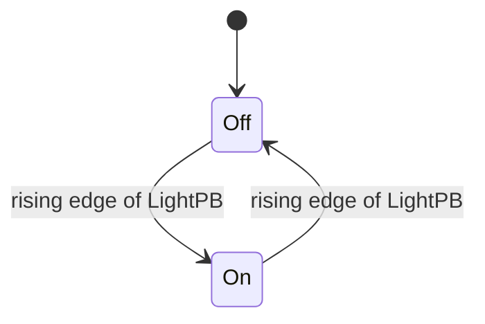
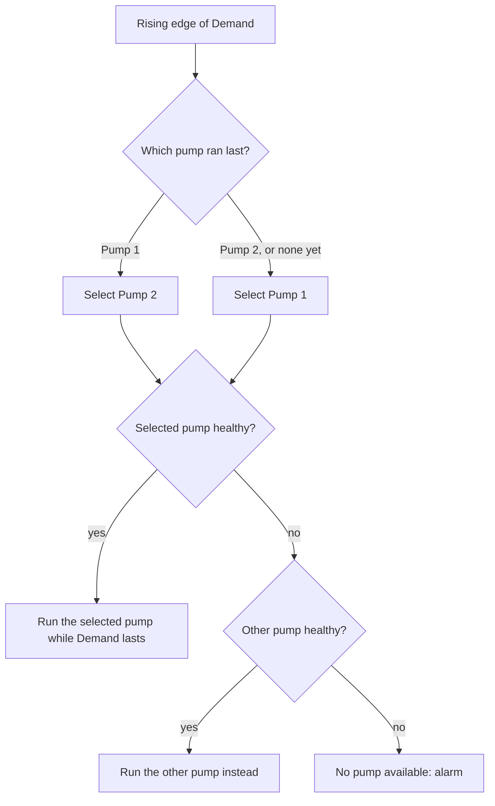

# 06 — Edge Detection, One-Shots and Latching Patterns

> **Level:** 2 — Core programming · **Time:** ~7 hours (about half of it on the labs) · **Prerequisites:** [Module 04](../04-ladder-logic/), [Module 05](../05-boolean-logic-and-fbd/)

A PLC runs its program over and over, often a hundred times a second or more, while the plant
around it changes slowly. Most of your logic asks **level** questions: *is* the pump running,
*is* the stop button pressed, *is* the level high? Some logic has to ask **event** questions:
has the operator *just* pressed Start, has a carton *just* arrived, has the alarm *just* come
in? If you answer an
event question with level logic, a counter counts scans instead of cartons, a push-button
toggle flickers, an alarm is logged a thousand times, and a duty/standby selector swaps pumps
on every scan and chatters both contactors.

This module teaches you to turn levels into events (edge detection, also called one-shots) and
to do it reliably, the way it is done in every vendor's tools. You will also learn the classic
bugs that catch experienced engineers and the patterns built on edges: push-on/push-off,
change-of-value detection, event counting, duty/standby alternation, and latches that set and
reset on events.

## Learning objectives

By the end of this module you will be able to:

- **Explain** the difference between level and edge signals, why the scan cycle makes edges
  necessary, and draw a scan-by-scan timing diagram of a rising and a falling edge.
- **Write** rising-edge, falling-edge and change-of-value detection by hand with a "previous
  value" variable, and explain why the update must come last.
- **Use** the IEC `R_TRIG` and `F_TRIG` function blocks correctly: one instance per signal,
  called on every scan.
- **Translate** between IEC P/N contacts, Rockwell `ONS`/`OSR`/`OSF`, Siemens `-|P|-`,
  `P_TRIG` and `R_TRIG`, and state exactly what each one detects.
- **Create** a first-scan flag, and name the Siemens and Rockwell equivalents.
- **Recognise and fix** the classic edge bugs: conditional calls, shared instances, flickering
  toggles, HMI-written bits, first-call behaviour and one-scan pulses that other code never sees.
- **Build** a push-on/push-off toggle, an event counter, a change detector, a duty/standby
  alternator, and a trip latch with an edge-triggered reset.
- **Estimate** the shortest pulse a scanned program can reliably see.

## 1. Level versus edge

### 1.1 Two kinds of question

| Level question ("is it…?") | Edge question ("has it just…?") | Typical use of the edge |
|---|---|---|
| Is the photo-eye blocked? | Has a carton just arrived? | Count cartons |
| Is the Start button pressed? | Has Start just been pressed? | Toggle, start command, step a sequence |
| Is the pump running? | Has the pump just started? Just stopped? | Count starts (large motors have a maximum number of starts per hour) |
| Is the high-level alarm active? | Has the alarm just come in? | Log it, sound the horn, count occurrences |
| Is the valve off its closed limit? | Has the valve just left its closed limit? | Start a travel-time check |
| Which product is selected? | Has the operator just changed the product? | Audit trail, reload a recipe |

Level logic is right when the output should last exactly as long as a condition: a motor runs
while its permissives are healthy, and an interlock holds a valve shut for as long as the level
is high. Interlocks and trips are always level logic, because they must act for as long as the
dangerous condition lasts. Edge logic is right when something must happen **once per event**,
no matter how long the event lasts.

### 1.2 Why the scan cycle makes edges matter

[Module 01](../01-what-is-a-plc/) showed the scan cycle: read all inputs into the input image,
execute the program top to bottom, write the outputs, repeat. Typical scan times range from well
under a millisecond to a few tens of milliseconds. A quick jab at a push-button still lasts
around a tenth of a second, so the program sees the button TRUE on many consecutive scans:

| Press duration | Scan time | Scans that see the button TRUE |
|---|---|---|
| 0.1 s | 10 ms | 10 |
| 0.3 s | 10 ms | 30 |
| 0.3 s | 2 ms | 150 |

This code therefore adds somewhere between 10 and 150 per press, depending on the operator's
thumb and the CPU load. The result is meaningless:

```iecst
IF StartPB THEN                  (* WRONG for counting: true on every scan while held *)
  PressCount := PressCount + 1;
END_IF;
```

What you want is "TRUE on the first scan in which the button is pressed, and never again until
it has been released and pressed again". That one-scan signal is called a **rising edge**,
**positive transition** or **one-shot**. Its mirror image, TRUE on the first scan after
release, is a **falling edge** or **negative transition**.

### 1.3 Edges over scans

The program never sees a continuous signal. It sees one sample per scan, the value copied into
the input image at the start of that scan. Here is a button pressed during scans 3 to 6 of a
10 ms task:

```text
Scan                1    2    3    4    5    6    7    8    9    10
                            +-------------------+
StartPB (level)   ----------+                   +--------------------
                            +----+
Rising edge       ----------+    +-----------------------------------
                                                +----+
Falling edge      ------------------------------+    +---------------
```

- The **rising edge** is TRUE in scan 3 only. That is the first scan in which `StartPB` is
  TRUE after being FALSE on the scan before.
- The **falling edge** is TRUE in scan 7 only. That is the first scan in which `StartPB` is
  FALSE after being TRUE on the scan before.
- In all other scans both are FALSE, however long the button is held.

Each edge lasts one scan: 10 ms here. The rest of the program sees it for exactly that one
execution and must act on it then.

### 1.4 How fast can a scanned program see?

Because the inputs are sampled once per scan, a pulse that starts and ends between two input
reads is never seen at all:

```text
                        read      read      read      read
                         v         v         v         v
Scan starts              | scan 1  | scan 2  | scan 3  | scan 4  |
                            +--+
3 ms pulse           -------+  +---------------------------   never read as TRUE: missed
                                       +-------------+
14 ms pulse          ------------------+             +-----   read as TRUE once (scan 3)
```

(One character is 1 ms and the scan is 10 ms.) To be seen reliably, a signal must stay TRUE for
**longer than one scan**, plus the input module's filter delay, with a margin for scan-time
variation. Between pulses it must stay FALSE for the same time, or the PLC never sees it go
low and two cartons merge into one. With a 10 ms scan the absolute ceiling is one pulse every
two scans, 50 pulses per second, and a sensible design stays well below that.

Digital input modules usually have a configurable **input filter** (input delay) of a few
milliseconds. It rejects contact bounce and electrical noise, but it also swallows pulses
shorter than the filter time. For faster signals such as encoders, flow-meter pulses or
fast-moving parts, use **high-speed counter** inputs that count in hardware independently of
the scan ([Module 08](../08-counters/)), a faster task
([Module 11](../11-program-organization/)), or ask the sending device to stretch its pulse.

## 2. Building a one-shot yourself: the "previous value" bit

### 2.1 The idea

To know whether something *changed*, you must remember what it was *last scan*. Keep a BOOL
that stores the input's value from the previous scan, compare, then update it:

```iecst
StartRise := StartPB AND NOT StartPrev;   (* TRUE for one scan when pressed *)
StartFall := NOT StartPB AND StartPrev;   (* TRUE for one scan when released *)
StartChange := StartPB XOR StartPrev;     (* TRUE for one scan on either edge *)
StartPrev := StartPB;                     (* remember for the next scan: always LAST *)
```

The same button as in section 1.3, scan by scan:

```text
Scan                         1   2   3   4   5   6   7   8   9  10
StartPB (this scan)          0   0   1   1   1   1   0   0   0   0
Prev (from last scan)        0   0   0   1   1   1   1   0   0   0
Rise = PB AND NOT Prev       0   0   1   0   0   0   0   0   0   0
Fall = NOT PB AND Prev       0   0   0   0   0   0   1   0   0   0
Change = PB XOR Prev         0   0   1   0   0   0   1   0   0   0
```

That is all an edge detector is: one bit of memory and one AND gate.

### 2.2 Order matters

`StartPrev := StartPB;` must run **after** every line that uses `StartPrev` to detect the edge.
If you update it first, `StartPrev` always equals `StartPB` by the time you compare them, and
the edge never appears:

```iecst
StartPrev := StartPB;                     (* WRONG ORDER *)
StartRise := StartPB AND NOT StartPrev;   (* always FALSE *)
```

### 2.3 Where the memory must live

The previous-value bit must keep its value from one scan to the next. That means:

- Declare it in a normal `VAR` block of a `PROGRAM` or `FUNCTION_BLOCK`. Those variables are
  static, so they keep their value between calls.
- **Not** in `VAR_TEMP`. Temporary variables are re-initialised on every call, so `StartPrev`
  would be FALSE at the start of every scan and "rising edge" would be TRUE on every scan the
  button is held. (Verified with `plctest`: a held input produced an "edge" on all 10 of 10
  scans.) In Siemens terms: never use a *Temp* variable as edge memory.
- Not inside a `FUNCTION`. Functions have no memory between calls, which is why `R_TRIG` is a
  function *block*.
- Use one memory bit per signal, and never write it anywhere else.

### 2.4 The same thing in ladder

```text
      StartPB       StartPrev                               StartRise
 |-----] [-----------]/[--------------------------------------( )-----|
 |
 |      StartPB                                              StartPrev
 |-----] [----------------------------------------------------( )-----|
```

Rungs are solved top to bottom, so the second rung must come *after* the first. Any rung that
uses `StartRise` should also come after the first rung. If it sits above it, it sees last
scan's `StartRise` and acts one scan late (see section 7.5).

## 3. The IEC edge detectors: R_TRIG and F_TRIG

### 3.1 What they are

IEC 61131-3 defines two standard function blocks for edge detection:

| Block | Input | Output | Q is TRUE for one execution when… |
|---|---|---|---|
| `R_TRIG` | `CLK : BOOL` | `Q : BOOL` | `CLK` has gone FALSE → TRUE since the previous call |
| `F_TRIG` | `CLK : BOOL` | `Q : BOOL` | `CLK` has gone TRUE → FALSE since the previous call |

Inside they are exactly the previous-value bit from section 2. This is the reference code, as
used unchanged by the MATIEC compiler behind OpenPLC and `plctest` (renamed here so it doesn't
clash with the real blocks if you compile it):

```iecst
FUNCTION_BLOCK FB_RTrig            (* behaves like R_TRIG *)
  VAR_INPUT  CLK : BOOL; END_VAR
  VAR_OUTPUT Q   : BOOL; END_VAR
  VAR        M   : BOOL; END_VAR   (* memory: CLK on the previous call *)
  Q := CLK AND NOT M;
  M := CLK;
END_FUNCTION_BLOCK

FUNCTION_BLOCK FB_FTrig            (* behaves like F_TRIG *)
  VAR_INPUT  CLK : BOOL; END_VAR
  VAR_OUTPUT Q   : BOOL; END_VAR
  VAR        M   : BOOL; END_VAR   (* memory: NOT CLK on the previous call *)
  Q := NOT CLK AND NOT M;
  M := NOT CLK;
END_FUNCTION_BLOCK
```

Look at `F_TRIG`'s memory. It stores the *inverse* of `CLK` and starts at FALSE, which means
"CLK was TRUE last time". So on its very first call with `CLK` FALSE it reports a falling edge
that never happened. Section 6.3 comes back to this.

### 3.2 Using them in Structured Text

Because they have memory, `R_TRIG` and `F_TRIG` are **function blocks**. You declare an
**instance** (a named copy with its own memory, [Module 11](../11-program-organization/)),
call the instance, then read its output:

```iecst
VAR
  StartEdge : R_TRIG;    (* one instance per signal *)
  DoorOpened : F_TRIG;   (* door closed-switch going FALSE = door opened *)
END_VAR

StartEdge(CLK := StartPB);             (* call it on EVERY scan *)
IF StartEdge.Q THEN
  BatchCount := BatchCount + 1;
END_IF;

DoorOpened(CLK := DoorClosedLS);
IF DoorOpened.Q THEN
  DoorOpenings := DoorOpenings + 1;
END_IF;
```

You can also copy the output into a variable in the call with `=>`:
`StartEdge(CLK := StartPB, Q => StartPulse);`. You cannot write `IF R_TRIG(StartPB) THEN`,
because a function block is not called like a function.

**"Q is TRUE for exactly one execution"** is the precise rule. "One scan" is shorthand that is
only true when the instance is called once per scan:

- In a 10 ms task, `Q` is TRUE for 10 ms. In a 100 ms task, it is TRUE for 100 ms.
- If you call the same instance twice in one scan with the same input, the second call returns
  FALSE: the first call has already updated `M`.
- If you skip the call, `Q` keeps its last value and `M` is not updated. Section 7.1 shows why
  that is dangerous.

### 3.3 In Function Block Diagram

```text
             StartEdge
           +-----------+
           |  R_TRIG   |
 StartPB --|CLK       Q|-- StartPulse
           +-----------+
```

The instance name goes above the box, as for every function block in FBD
([Module 05](../05-boolean-logic-and-fbd/)).

### 3.4 In Ladder: transition-sensing contacts and coils

IEC 61131-3 Ladder has edge versions of the contact and the coil:

| Symbol | Name | Behaviour |
|---|---|---|
| `--]P[--` | positive transition-sensing contact | Passes power for one evaluation when its variable goes FALSE → TRUE, provided the power to its left is on |
| `--]N[--` | negative transition-sensing contact | Same, for TRUE → FALSE |
| `--(P)--` | positive transition-sensing coil | Its variable is TRUE for one evaluation when the power flowing into the coil goes FALSE → TRUE |
| `--(N)--` | negative transition-sensing coil | Same, when the power flow goes TRUE → FALSE |

The compiler creates the hidden memory bit for you. A start command that needs Auto mode and a
fresh press of Start:

```text
      Auto          StartPB                                  SeqStart
 |-----] [-----------]P[----------------------------------------(S)-----|
```

In ST: `StartEdge(CLK := StartPB); IF Auto AND StartEdge.Q THEN SeqStart := TRUE; END_IF;`

IEC 61131-3 also lets a function block declare an input as edge-triggered: `CU : BOOL R_EDGE;`.
The standard's up-counter `CTU` is described this way ([Module 08](../08-counters/)). Tool
support varies, and the MATIEC compiler used by `plctest` rejects code that reads such an input
(verified), so this course always uses explicit `R_TRIG` instances.

## 4. What exactly is being detected?

This is where vendors differ, and it matters every time you translate a rung. There are two
families:

| Detects the edge of… | Instructions |
|---|---|
| **one variable**, ANDed with the rest of the rung | IEC `--]P[--` / `--]N[--` contact; Siemens `-\|P\|-` / `-\|N\|-` contact |
| **the whole rung condition** to its left (the power flow; Siemens calls it the RLO, *result of logic operation*) | Rockwell `ONS`, `OSR`, `OSF`; Siemens `P_TRIG` / `N_TRIG` boxes and `-(P)-` / `-(N)-` coils; IEC `--(P)--` / `--(N)--` coils |

Take a rung with `Auto` and `StartPB` in series, followed by an edge instruction:

| What happens | Edge of `StartPB` only (P contact) | Edge of `Auto AND StartPB` (ONS after both) |
|---|---|---|
| `Auto` is on, operator presses Start | fires | fires |
| Operator is already holding Start, then `Auto` is switched on | **does not fire** (StartPB did not change) | **fires** (the rung condition rose) |

Neither is "wrong", but they do different things. The worked example in the Worked examples
section shows how to get each behaviour on each platform.

## 5. Vendor one-shots

### 5.1 Rockwell (Studio 5000 Logix Designer: ControlLogix, CompactLogix)

Rockwell ladder has three one-shot instructions. Each needs a **storage bit**, a BOOL tag (or
a bit of a DINT) that remembers the rung condition from the previous scan.

- **`ONS` (One Shot)** is an *input* instruction placed in the rung. When the rung condition to
  its left goes false → true, the rest of the rung (to its right) is true for one scan.
  Rung text: `XIC(StartPB)ONS(StartPB_ONS)OTL(SeqStart);`
- **`OSR` (One Shot Rising)** is an *output* instruction with a storage bit and an **output
  bit**. The output bit is TRUE for one scan when the rung condition goes false → true, and
  other rungs use the output bit: `XIC(PartPE)OSR(PartPE_Stor,PartPE_Pulse);`
- **`OSF` (One Shot Falling)** is the same for a true → false transition of the rung condition.
- In Structured Text and FBD, Logix uses the **`OSRI`** and **`OSFI`** instructions (one-shot
  rising/falling *with input*; they are not available in ladder). Each needs its own tag of
  type `FBD_ONESHOT`: you write its `InputBit`, execute the instruction, and read its
  `OutputBit`, which is TRUE for one execution after the input rises (or falls).
- Micro800 controllers (Connected Components Workbench) use IEC-style `R_TRIG` and `F_TRIG`
  blocks.

Two Rockwell habits worth knowing. First, **every one-shot needs its own storage bit**.
Copying a rung and forgetting to rename the storage bit is a classic bug (section 7.2).
Second, when the controller goes to Run it runs a *prescan*. In Logix controllers the prescan
**sets** the `ONS` and `OSR` storage bits and **clears** the `OSF` storage bit (Rockwell's
instruction reference says this is "to prevent an invalid trigger during the first scan"). A
rung that is already true at start-up therefore does *not* produce a rising one-shot, and a
rung that is false at start-up does not produce a falling one. An IEC `R_TRIG` whose `CLK` is
already TRUE on its first call *does* fire. This is one of several first-scan differences
between platforms (section 6).

### 5.2 Siemens (TIA Portal: S7-1200, S7-1500)

- **`-|P|-` and `-|N|-` contacts** ("scan operand for positive/negative signal edge"): the
  operand (for example `"StartPB"`) is written above the contact and an **edge memory bit**
  below it. They detect the edge of that one operand, like the IEC P/N contacts.
- **`-(P)-` and `-(N)-` coils** ("set operand on positive/negative signal edge"): the operand
  is TRUE for one cycle when the power flow into the coil rises (or falls). They also need an
  edge memory bit.
- **`P_TRIG` and `N_TRIG` boxes** ("scan RLO for positive/negative signal edge"): they detect
  the edge of the logic in front of them, with an edge memory bit and a `Q` output. They behave
  like Rockwell's `ONS`.
- **`R_TRIG` and `F_TRIG`**: the IEC function blocks, used in LAD, FBD and SCL (Siemens'
  Structured Text). As with `TON`, each call needs an **instance**: a single-instance data
  block, or a multi-instance declared as a *Static* variable inside your own FB. In SCL:
  `#StartEdge(CLK := "StartPB"); IF #StartEdge.Q THEN ... END_IF;`
- Edge memory bits must keep their value between cycles, so use a bit memory (M) address or a
  static variable in a data block. **Never use a Temp variable**, which is not kept between
  calls. Each edge instruction needs its own bit, and nothing else may write it.
- In classic STEP 7 statement list (S7-300/400), `FP` and `FN` detect a rising or falling
  edge of the RLO, again with an edge memory bit.

## 6. First-scan flags

### 6.1 Why you need one

Some things must happen exactly once, when the PLC starts running:

- Load default values or clear working data that must not survive a restart.
- Put a sequence into its initial state ([Module 13](../13-sequential-control/)).
- **Stop start-up values from looking like events.** At power-up every previous-value variable
  holds its initial value (FALSE or 0). If the product selector is on position 3, `3 <> 0`
  looks like a change. If a carton is already blocking the photo-eye, `TRUE AND NOT FALSE`
  looks like a new arrival.

A **first-scan flag** is TRUE during the first scan after the PLC starts running and FALSE
afterwards. It is itself a one-shot of "the PLC is running".

### 6.2 Rolling your own in IEC 61131-3

IEC 61131-3 does not define a first-scan bit, so write one:

```iecst
VAR
  Started   : BOOL;   (* NOT retentive: FALSE after every power-up *)
  FirstScan : BOOL;   (* TRUE during the first scan only *)
END_VAR

FirstScan := NOT Started;    (* put these two lines at the very top of the program *)
Started := TRUE;

IF FirstScan THEN
  SelPrev := ProductSel;     (* the power-up position is the starting point, not a change *)
END_IF;
```

`Started` must **not** be `RETAIN`. A retentive variable keeps its value through a warm
restart ([Module 03](../03-data-types-and-addressing/)), so it would already be TRUE after a
power cut and `FirstScan` would never happen. If several programs need the flag, give each
program its own, or make sure the program that computes it runs first.

There are two ways to stop start-up values looking like events:

1. **Preload** the previous-value variables on the first scan, as above. Then the first
   comparison finds no difference.
2. **Mask** the event on the first scan: `IF PartArrived.Q AND NOT FirstScan THEN …`. This is
   the only option with `R_TRIG`/`F_TRIG`, whose memory you cannot preload.

### 6.3 Don't rely on what an edge detector does on its first call

Implementations disagree about the very first call:

| Platform | Rising-edge detector, input already TRUE at start-up | Falling-edge detector, input FALSE at start-up |
|---|---|---|
| Reference code (section 3.1), as in MATIEC, the compiler behind OpenPLC and `plctest` (verified in `plctest`) | `R_TRIG` fires: Q = TRUE | `F_TRIG` fires: Q = TRUE, a falling edge that never happened |
| Rockwell Logix ladder `ONS` / `OSR` / `OSF` | `ONS`/`OSR`: no one-shot, because the prescan sets the storage bit | `OSF`: no one-shot, because the prescan clears the storage bit |
| Other IEC tools | Not guaranteed: check or test it | Not guaranteed: depends on how the memory is initialised |

So when start-up behaviour matters, **decide it explicitly** with a first-scan flag. Don't
inherit it from whichever edge detector the platform happens to provide. Worked example 1
shows an `F_TRIG` that counts a "return to normal" at power-up unless it is masked.

### 6.4 Vendor first-scan bits

- **Siemens S7-1200/1500:** enable the *system memory byte* in the CPU properties. It provides
  a `FirstScan` bit (default address `%M1.0`) that is TRUE for the first cycle after the CPU
  goes to RUN. Alternatively, put start-up code in a **startup OB** (OB 100), which runs once
  before the cyclic program in OB 1.
- **Rockwell Logix:** the status flag `S:FS` (first scan) is TRUE on the first scan after the
  controller goes into Run mode. Micro800 controllers (CCW) have a first-scan system variable,
  `__SYSVA_FIRST_SCAN`. Some printed manuals show it with a single leading underscore, so
  pick it from CCW's system-variable list rather than typing it.
- **CODESYS, OpenPLC, MATIEC:** roll your own as in section 6.2. Some runtimes and libraries
  also provide a first-cycle flag. Check yours.

## 7. The classic edge bugs

### 7.1 Calling an edge detector conditionally

An edge detector only sees the scans in which it is **called**. If you put the call inside an
`IF`, a `CASE` branch, a subroutine that is not called every scan, or a program that can be
disabled, its memory freezes while it is skipped. The next time it runs, it compares against a
stale value.

```iecst
IF Auto THEN                        (* WRONG: the detector is skipped in Manual *)
  StartEdge(CLK := StartPB);
  IF StartEdge.Q THEN
    SeqStart := TRUE;
  END_IF;
END_IF;
```

Scan by scan, with the operator pressing Start in Manual (scan 4) and still holding it when
Auto is selected (scan 6):

```text
Scan                         1   2   3   4   5   6   7   8   9
Auto                         1   1   0   0   0   1   1   1   1
StartPB                      0   0   0   1   1   1   1   0   0
Called? (IF version)       yes yes  no  no  no yes yes yes yes
M before call (IF version)   0   0   0   0   0   0   1   1   0
Trig.Q (called in IF)        0   0   0   0   0   1   0   0   0
Trig.Q (called always)       0   0   0   1   0   0   0   0   0
Trig.Q AND Auto              0   0   0   0   0   0   0   0   0
```

In scan 6 the conditional version sees `CLK` TRUE and its stale `M` FALSE, and fires: the
sequence starts the instant someone switches to Auto, without a fresh press. This is a
**phantom edge**. The opposite also happens: a detector that is skipped on some scans (in a
subroutine that is only called every other scan, say, or in a slow task) never sees a press that
starts and ends between two of its calls. That press is **missed**.

The fix is always the same. **Call the edge detector unconditionally, every scan, and put the
condition on its output:**

```iecst
StartEdge(CLK := StartPB);          (* always called *)
IF Auto AND StartEdge.Q THEN
  SeqStart := TRUE;
END_IF;
```

The same applies to your own previous-value bits: update them on every scan, outside any `IF`.
Labs 06-1 and 06-2 test this.

### 7.2 Reusing one instance (or storage bit) for two signals

```iecst
Edge(CLK := StartPB);               (* WRONG: one instance, two signals *)
IF Edge.Q THEN StartCount := StartCount + 1; END_IF;
Edge(CLK := ResetPB);
IF Edge.Q THEN ResetCount := ResetCount + 1; END_IF;
```

Each call overwrites the memory the other one needs. While `StartPB` is held and `ResetPB` is
not pressed, the second call writes `M := FALSE` on every scan, so the first call sees a
"rising edge" on every scan:

```text
Scan                         1   2   3   4   5   6   7   8
StartPB                      0   1   1   1   1   1   0   0
ResetPB                      0   0   0   0   0   0   0   0
M before 1st call            0   0   0   0   0   0   0   0
Q after 1st call (Start)     0   1   1   1   1   1   0   0
```

`StartCount` climbs by one per scan, exactly the bug the edge detector was supposed to prevent.
Rockwell has the same problem when two `ONS` instructions share a storage bit. **One instance
(one storage bit, one edge memory bit) per signal, and per place where it is used.**

### 7.3 Edge detection on HMI-written bits

A button on an HMI or SCADA screen is not wired to an input. The HMI writes TRUE to a PLC tag
when the button is pressed and FALSE when it is released, over the network. That causes three
problems:

1. **The writes are not synchronised with the scan.** In some controllers (Logix, for example)
   a tag written by communications can change in the middle of a program scan, so two rungs can
   see different values in the same scan. Copy each HMI command into an internal variable
   **once**, at the top of the routine, and edge-detect the copy.
2. **The release can get lost.** If the network drops, the HMI crashes or the operator slides a
   finger off the button, the FALSE write may never arrive and the bit stays TRUE. Level logic
   then keeps doing whatever the button asked for. Edge logic does it once, but every later
   press is invisible because the bit never goes FALSE.
3. **A very short press can be missed** if both writes arrive between two executions of the
   code, which becomes more likely in a slow task.

The robust pattern avoids the edge detector altogether. **The HMI only ever sets the command
bit, and the PLC clears it** after acting on it:

```iecst
IF HmiStartCmd THEN        (* written TRUE by the HMI, never FALSE *)
  SeqStart := TRUE;
  HmiStartCmd := FALSE;    (* the PLC consumes the command: exactly one action per press *)
END_IF;
```

[Module 18](../18-hmi-and-scada/) builds this into a full command/status handshake. Never use
HMI buttons for anything safety-related, such as emergency stops or hold-to-run jogging of
dangerous motion.

### 7.4 Relying on first-call behaviour

See section 6.3. If a test only passes because `F_TRIG` fired (or didn't fire) on its first
call, it will behave differently on another platform. Mask or preload explicitly.

### 7.5 One-shots and multiple things in one scan

A one-shot pulse exists for one execution only. That has several consequences:

- **Program order.** Code *above* the edge detector in the scan sees the pulse one scan late,
  on the next scan. That usually works, but it is confusing. Detect edges near the top.
- **Other tasks.** A pulse made in a 10 ms task can be missed completely by a 100 ms task,
  because it is gone before the slow task runs. Detect the edge in the task that uses it, or
  latch the event (section 8.6).
- **The HMI never sees it.** HMIs poll tags every few hundred milliseconds, so a 10 ms pulse is
  almost always invisible. Latch or stretch it if a human needs to see it.
- **Several events in the same scan.** Two photo-eyes can fire in the same scan. Handle
  independent events with independent `IF`s, not `ELSIF`, which silently drops the second:

  ```iecst
  IF Eye1Edge.Q THEN Count := Count + 1; END_IF;   (* both can happen in one scan *)
  IF Eye2Edge.Q THEN Count := Count + 1; END_IF;
  ```

- **Two one-shot actions on the same variable** in one scan: the second can undo the first.
  The broken toggle in section 8.1 is the classic example.
- **Edge of a pulse.** An `R_TRIG` on a signal that is already a one-scan pulse only fires if
  the pulse had a FALSE scan before it. Two pulses on consecutive scans look like one long TRUE
  and count once. Lab 06-2 has exactly this trap.
- **One instance called twice per scan**, for example an FB containing an `R_TRIG` that is
  called from two places. With the same input, the second call never sees an edge. With
  different inputs, it is the shared-instance bug of section 7.2.

### 7.6 Other traps (summary)

- Updating the previous-value bit before using it (section 2.2).
- Previous-value bit in `VAR_TEMP` or a Siemens Temp (section 2.3).
- Pulses shorter than a scan (section 1.4).
- Contact bounce: if an input filter does not hide it, one press can produce several edges.
  Debounce with a timer ([Module 07](../07-timers/)).

## 8. Patterns built on edges

### 8.1 Push-on/push-off (toggle)

One push-button: press once for on, press again for off. It is simple to describe and easy to
get wrong.

**Broken version 1: toggling on the level.**

```iecst
IF LightPB THEN                  (* WRONG: toggles on every scan while held *)
  Lamp := NOT Lamp;
END_IF;
```

```text
Scan                1    2    3    4    5    6    7    8    9    10
                            +-----------------------------+
LightPB           ----------+                             +----------
                            +----+    +----+    +----+
Lamp, level (bad) ----------+    +----+    +----+    +---------------
                            +----+
Rising edge       ----------+    +-----------------------------------
                            +----------------------------------------
Lamp, edge (good) ----------+
```

The level version flips on every scan while the button is held. At 10 ms per scan it flickers
at 50 Hz, too fast to see, and it ends up on or off depending on whether the press lasted an
odd or even number of scans: effectively a coin toss. `Lamp := Lamp XOR LightPB;` is the same
bug in one line.

**Broken version 2: set and reset on the same one-shot, in two separate statements.**

```iecst
PressEdge(CLK := LightPB);
IF PressEdge.Q AND NOT Lamp THEN   (* sets the lamp... *)
  Lamp := TRUE;
END_IF;
IF PressEdge.Q AND Lamp THEN       (* ...and this sees Lamp TRUE in the SAME scan: resets it *)
  Lamp := FALSE;
END_IF;
```

The first `IF` switches the lamp on. The second `IF` runs a moment later in the same scan,
still sees the pulse, sees the lamp on and switches it off again. The lamp never comes on. The
ladder version, a `(S)` rung followed by an `(R)` rung that both use the one-shot, has the
same bug.

**Correct versions.** Act only on the edge, and make the decision once:

```iecst
PressEdge(CLK := LightPB);         (* 1. detect the press, every scan *)
IF PressEdge.Q THEN                (* 2. one decision per press *)
  Lamp := NOT Lamp;
END_IF;
```

Or as a single expression: `Lamp := Lamp XOR PressEdge.Q;`. In ladder, the one-shot drives an
exclusive-OR made of two branches ([Module 05](../05-boolean-logic-and-fbd/)):

```text
      LightPB      LightPrev                                LightOS
 |-----] [-----------]/[--------------------------------------( )-----|
 |
 |      LightPB                                              LightPrev
 |-----] [----------------------------------------------------( )-----|
 |
 |      LightOS       Lamp                                     Lamp
 |-----] [-----------]/[-----------+--------------------------( )-----|
 |                                 |
 |      LightOS       Lamp         |
 |-----]/[-----------] [-----------+
```

Read the last rung as: "the lamp is on if (this is a press AND it was off) OR (this is not a
press AND it was on)". On a press the lamp inverts, and on every other scan it holds itself.



Lab 06-1 adds an enable switch, which brings in the conditional-call trap from section 7.1.

### 8.2 Change-of-value detection

The previous-value idea works for any data type:

| Signal | "Changed" test | Notes |
|---|---|---|
| BOOL | `X XOR XPrev` (or `X <> XPrev`) | Both edges |
| INT / DINT / enumeration | `X <> XPrev` | Selector position, recipe number, step number |
| WORD of status bits | `(X XOR XPrev) <> 0` | `X XOR XPrev` also tells you *which* bits changed |
| REAL | `ABS(X - XLast) >= Deadband` | Never compare REALs for exact equality ([Module 09](../09-math-and-data-handling/)) |

```iecst
SelChanged := ProductSel <> SelPrev;   (* TRUE for one scan per change *)
SelPrev := ProductSel;                 (* always updated, always last *)
```

A jump from position 2 to position 4 in one scan is **one** change. Changes on two consecutive
scans are **two** changes, and `SelChanged` stays TRUE for both scans. Don't put an `R_TRIG` on
it, or you will count them as one (section 7.5).

For REAL values, compare against the value *at the last reported change*, not the previous
scan. Otherwise a slow drift of 0.01 per scan never triggers:

```iecst
IF ABS(Level - LevelReported) >= 0.5 THEN   (* changed by 0.5 % or more *)
  LevelReported := Level;
  LevelChanged := TRUE;
ELSE
  LevelChanged := FALSE;
END_IF;
```

This is the idea behind *report by exception* in SCADA, historians and MQTT
([Module 17](../17-industrial-communications/)).

### 8.3 Event counting

Count edges, never levels. A rising edge counts arrivals and a falling edge counts departures.
Counting both would give two counts per carton. The IEC counters (`CTU`, `CTD`, `CTUD`, see
[Module 08](../08-counters/)) contain an edge detector on their count input, but the rules in
this module still apply: call the counter every scan, and decide what start-up means.

Counting occurrences instead of time is common in process plant. Alarm-management practice
(ISA-18.2, EEMUA 191, [Module 16](../16-alarms-and-diagnostics/)) counts how often each alarm
occurs in order to find "chattering" alarms. Maintenance counts pump starts and valve strokes.
Batch systems count completed batches. Each of these is a rising-edge counter, sometimes with a
first-scan mask. Worked example 1 is one.

### 8.4 Alternation: duty/standby selection

Many plant items come in pairs (pumps, fans, compressors, filters) where one is enough and the
other is standby. **Alternation** gives the duty to each unit in turn:

- **Equal wear.** Run hours and starts are shared between the two.
- **Hidden failures are found early.** A standby pump that has not run for six months may be
  seized, or its contactor may have failed, and you would only find out when you need it.
  Running each pump regularly reveals these faults, much as proof testing reveals hidden
  failures in safety instruments ([Module 20](../20-functional-safety/)).

The simplest rule is **"each new demand starts the pump that did not run last time"**. The key
word is *new*: the alternation happens on the **rising edge** of the demand. Choosing on the
level would swap pumps on every scan while the demand lasts, and both contactors would chatter.



Design points to decide and write down:

- **What counts as "ran last"?** Use the pump that *actually ran*, not the one that was
  selected. If Pump 1 was selected but faulted and Pump 2 ran, then Pump 2 ran last.
- **Faults.** A faulted pump is never started. If the duty pump trips mid-run, the standby
  takes over. Once it has taken over, don't switch back when the fault clears, because swapping
  pumps mid-demand wears contactors and causes pressure surges.
- **When the decision is made.** Decide on the edge of the demand, using the fault status at
  that moment. Something that happens while idle, such as a fault that comes and goes, must not
  change which pump gets the next demand.
- **Retention.** On a real plant, "which pump ran last" should be retentive
  ([Module 03](../03-data-types-and-addressing/)) so alternation survives a power cut.
- **Chattering demand.** If the demand signal chatters (a level switch on a rippling surface),
  every chatter is a "new demand" and a swap. Fix the demand with hysteresis
  ([Module 14](../14-analog-and-process-io/)) and minimum run/stop times
  ([Module 07](../07-timers/)).
- **Other schemes.** You can also alternate on each stop, by run hours, or on a weekly
  schedule, with manual duty selection or duty/assist operation where the standby joins in at
  high-high level. They are all variations on the same edge-driven decision.

Lab 06-3 is exactly this pattern.

### 8.5 Latching on events: trips, resets and acknowledgements

[Module 04](../04-ladder-logic/) introduced set/reset latches and set- versus reset-dominance.
Edges make latches safer and more predictable:

- **Latch an event until someone deals with it.** Set the latch on the event, and reset it on
  an acknowledgement.
- **Make trips set-dominant.** While the trip condition is still present, reset has no effect.
- **Reset on the edge of the reset button, not its level.** With a level reset, a jammed or
  tied-down reset button keeps clearing the latch, and new trips are wiped out as soon as they
  are set. With an edge reset, a stuck button resets once, and every later trip stays latched
  until the button is released and pressed again. For the same reason, many safety relays act
  only on a complete press-and-release of their reset button.
- **Reset must not restart.** Clearing a trip only makes it *possible* to start again, and a
  new start command is still needed. Machinery safety standards require this for safety
  functions: for example, resetting an emergency stop must not by itself restart the machine
  (IEC 60204-1, ISO 13850), and a manual reset must not by itself start hazardous motion
  (ISO 13849-1). Good practice applies it everywhere.

Worked example 3 puts these together. [Module 16](../16-alarms-and-diagnostics/) extends them
into alarm acknowledgement and first-out annunciation.

### 8.6 Pulse stretching (preview)

A one-scan pulse is too short for an HMI, a slow task or a human. There are two ways to make an
event last:

```iecst
(* 1. Latch until acknowledged: the event stays visible until someone reacts *)
IF JamEdge.Q THEN
  JamSeen := TRUE;
END_IF;
IF AckEdge.Q THEN
  JamSeen := FALSE;
END_IF;

(* 2. Stretch to a fixed time with a pulse timer (Module 07) *)
JamPulse(IN := JamEdge.Q, PT := T#2s);   (* JamPulse is a TP instance *)
JamLamp := JamPulse.Q;                   (* on for 2 s after each jam *)
```

[Module 07](../07-timers/) covers `TP`, `TON` and `TOF`, and the timing details of stretching
and debouncing.

## Worked examples

### Worked example 1: counting high-level occurrences in a sump

A drainage sump has a high-level switch, LSH-101, wired normally-closed so that a broken wire
reads the same as "level high" ([Module 02](../02-electrical-and-field-devices/)). Maintenance
wants to know **how often** the level goes high, not for how long. For comparison, the program
also counts scans spent high, to show why levels must not be counted.

```iecst
PROGRAM SumpHighLog
  VAR (* I/O *)
    LSH101_NC AT %IX0.0 : BOOL;  (* Sump high-level switch LSH-101, NC: TRUE = level normal *)
    HighLamp  AT %QX0.0 : BOOL;  (* "Sump high" lamp on the panel *)
  END_VAR
  VAR
    Started     : BOOL;      (* not RETAIN: FALSE after every power-up *)
    FirstScan   : BOOL;      (* TRUE during the first scan only *)
    HighLevel   : BOOL;      (* level high - or the switch wiring broken *)
    HighIn      : R_TRIG;    (* the high level has just come in *)
    HighOut     : F_TRIG;    (* the high level has just cleared *)
    HighEvents  : INT;       (* how many times the level has gone high *)
    ClearEvents : INT;       (* how many times it has returned to normal *)
    HighScans   : DINT;      (* for comparison: scans spent high - NOT an event count *)
  END_VAR

  FirstScan := NOT Started;
  Started := TRUE;

  HighLevel := NOT LSH101_NC;
  HighLamp := HighLevel;                  (* level logic: lamp on for as long as it is high *)

  HighIn(CLK := HighLevel);               (* both detectors are called on every scan *)
  HighOut(CLK := HighLevel);

  IF HighIn.Q THEN
    HighEvents := HighEvents + 1;         (* once per occurrence *)
  END_IF;
  IF HighOut.Q AND NOT FirstScan THEN     (* some F_TRIGs fire on their first call *)
    ClearEvents := ClearEvents + 1;
  END_IF;
  IF HighLevel THEN
    HighScans := HighScans + 1;           (* +1 on EVERY scan while high *)
  END_IF;
END_PROGRAM
```

What happens, in a 10 ms task (checked with `plctest`):

- **Power-up with the level normal.** `HighLevel` is FALSE. `HighOut` (an `F_TRIG`) reports
  Q = TRUE on its first call in MATIEC/OpenPLC, a "return to normal" that never happened. The
  `NOT FirstScan` mask stops it being counted, so `ClearEvents` stays 0.
- **The level stays high for 30 s.** `HighEvents` becomes 1. `HighScans` becomes 3000, which
  would be the "count" if you counted the level.
- **The level returns to normal.** `ClearEvents` becomes 1 on that scan.
- **The switch chatters** (high, normal, high, normal, 20 ms each). `HighEvents` goes up by
  two, which is exactly the information that exposes a chattering switch.
- **Power-up with the level already high.** `HighIn` fires on its first call and counts one
  occurrence. Here that is what we want, because an occurrence is in progress. If you did not
  want it, you would mask it with `FirstScan` too. Either way it is a deliberate decision.

### Worked example 2: translating one-shot rungs between platforms

A sequence must start when the operator presses Start in Auto. Here is the rung as a Rockwell
programmer might write it:

```text
                                   StartOS_Stor
      Auto          StartPB           +-----+                SeqStart
 |-----] [-----------] [--------------| ONS |------------------(S)-----|
                                      +-----+
```

Rung text: `XIC(Auto)XIC(StartPB)ONS(StartOS_Stor)OTL(SeqStart);`

The `ONS` sees everything to its left, so it detects the edge of `Auto AND StartPB`. The
faithful ST translation puts that whole expression into the detector:

```iecst
StartOS(CLK := Auto AND StartPB);   (* edge of the whole rung condition *)
IF StartOS.Q THEN
  SeqStart := TRUE;
END_IF;
```

With this rung, an operator who is already holding Start when someone selects Auto starts the
sequence (verified: the one-shot fires). Usually you want a *fresh press in Auto*. To get
that, detect the edge of `StartPB` alone:

| Platform | Edge of StartPB only, ANDed with Auto |
|---|---|
| IEC LD | NO contact `Auto`, then a `--]P[--` contact on `StartPB`, then `--(S)--` on `SeqStart` (the rung in section 3.4) |
| Siemens LAD | `"Auto"` NO contact, then a `-\|P\|-` contact on `"StartPB"` with its own edge memory bit |
| Rockwell | Move the ONS directly after StartPB, before Auto: `XIC(StartPB)ONS(StartOS_Stor)XIC(Auto)OTL(SeqStart);` |
| ST | `StartEdge(CLK := StartPB); IF Auto AND StartEdge.Q THEN SeqStart := TRUE; END_IF;` |

The rule to remember: in Rockwell, **the position of the ONS in the rung decides what it
detects**. It sees everything to its left. In IEC LD and Siemens LAD, choose between a P
contact (one operand) and something that sees the whole rung: a `(P)` coil, or in Siemens also
the `P_TRIG` box.

### Worked example 3: a pump trip latch with an edge-triggered reset

*Training example only. A trip that protects people, the environment or major plant from
serious harm is a safety function and belongs in a safety system designed to IEC 61511 or
IEC 62061/ISO 13849 ([Module 20](../20-functional-safety/)).*

A transfer pump must trip if its discharge pressure is too high (PSH-201, NC). The trip stays
latched until the pressure is normal **and** an operator presses Reset. Reset must not restart
the pump.

```iecst
PROGRAM PumpTripLatch
  VAR (* I/O *)
    StartPB       AT %IX0.0 : BOOL;  (* Start push-button, NO *)
    StopPB_NC     AT %IX0.1 : BOOL;  (* Stop push-button, NC: TRUE while not pressed *)
    ResetPB       AT %IX0.2 : BOOL;  (* Trip reset push-button, NO *)
    PressureOK_NC AT %IX0.3 : BOOL;  (* PSH-201 high-pressure switch, NC: TRUE = pressure normal *)
    Pump          AT %QX0.0 : BOOL;  (* Pump contactor *)
    TripLamp      AT %QX0.1 : BOOL;  (* "Pump tripped" lamp *)
  END_VAR
  VAR
    ResetEdge : R_TRIG;   (* one-shot on the reset button *)
    Tripped   : BOOL;     (* trip memory: stays TRUE until a valid reset *)
  END_VAR

  ResetEdge(CLK := ResetPB);

  (* The trip condition wins over reset (set-dominant latch). Reset acts on
     the PRESS of the button, so a jammed or tied-down reset button cannot
     keep clearing new trips. *)
  IF NOT PressureOK_NC THEN
    Tripped := TRUE;
  ELSIF ResetEdge.Q THEN
    Tripped := FALSE;
  END_IF;

  (* Seal-in start/stop. A trip drops the seal-in, so a reset never restarts
     the pump by itself: the operator has to press Start again. *)
  Pump := (StartPB OR Pump) AND StopPB_NC AND NOT Tripped;
  TripLamp := Tripped;
END_PROGRAM
```

What happens (checked with `plctest`):

- **Normal trip.** The pressure goes high, so `Tripped` is set and the pump stops. Pressing
  Reset while the pressure is still high does nothing (set-dominant). When the pressure is
  normal and Reset is pressed, the lamp goes out, but the pump stays off until Start is pressed.
- **Jammed reset button.** Reset is stuck pressed from power-up. The pump is started and the
  pressure goes high, so it trips. The pressure returns to normal and the trip *stays latched*,
  because a held button produces no new edge. The operator must release Reset and press it
  again.
- **Compare the "obvious" version** with a level reset written after the set:
  `IF NOT PressureOK_NC THEN Tripped := TRUE; END_IF; IF ResetPB THEN Tripped := FALSE; END_IF;`.
  With the reset button jammed, `Tripped` is set and immediately cleared in the same scan, so
  **the pump keeps running with the pressure high** (verified with `plctest`). Order,
  dominance and edges all matter.

## Common mistakes and how to avoid them

| Mistake | Symptom | Fix |
|---|---|---|
| Acting on a level where an event is meant | Counter counts scans; toggle flickers; alarm logged repeatedly | Detect the edge first, then act on the pulse |
| Edge detector (or previous-value update) inside an `IF`/`CASE` branch | Phantom edges when the branch becomes active; missed presses | Call it unconditionally every scan; put conditions on `Q` |
| One `R_TRIG` instance, `ONS` storage bit or Siemens edge bit shared by two signals | One-shot fires every scan, or never | One instance/bit per signal and per use; check after copy-paste |
| Previous value updated before it is compared | Edge never appears | Update last |
| Edge memory in `VAR_TEMP` or a Siemens Temp | "Edge" every scan | Static memory: `VAR`, an M bit, or a static DB variable |
| Set and reset from the same pulse in two separate `IF`s | Toggle never turns on | One decision: `Lamp := NOT Lamp` inside a single `IF`, or `XOR` |
| Relying on the first call of `R_TRIG`/`F_TRIG`/`ONS` | Different start-up behaviour on another platform | First-scan flag: preload or mask explicitly |
| Retentive first-scan memory | Initialisation skipped after a power cut | Keep the `Started` flag non-retentive |
| One-scan pulse consumed by the HMI or another task | Event "never happens" | Latch until acknowledged, or stretch with `TP` |
| `ELSIF` between independent events | One of two simultaneous events lost | Separate `IF`s |
| `R_TRIG` on a change pulse | Consecutive changes counted once | Use the change signal directly |
| Momentary HMI buttons with edge detection | Missed or stuck commands | HMI sets, PLC clears (Module 18) |
| Level reset on a trip latch | A jammed reset button hides trips | Set-dominant latch, edge-triggered reset |
| Signal shorter than a scan | Missed counts | Faster task, high-speed counter, or longer pulse |

## Vendor notes

| Need | IEC 61131-3 | Siemens TIA Portal | Rockwell Studio 5000 (Logix) | CODESYS / OpenPLC |
|---|---|---|---|---|
| Edge of one variable in LD | `--]P[--`, `--]N[--` | `-\|P\|-`, `-\|N\|-` contacts + edge memory bit | That contact first on the rung, `ONS` directly after it, other conditions after the `ONS` | `R_TRIG`/`F_TRIG`; OpenPLC Editor contacts have rising/falling-edge options |
| Edge of the rung condition | `--(P)--`, `--(N)--` coils | `P_TRIG`/`N_TRIG`, `-(P)-`/`-(N)-` | `ONS`, `OSR`, `OSF` | `R_TRIG` on the combined condition |
| Edge in ST | `R_TRIG`, `F_TRIG` instances | `R_TRIG`, `F_TRIG` (single or multi-instance), or a static BOOL | `OSRI`, `OSFI`, or a BOOL tag compare | `R_TRIG`, `F_TRIG` |
| Edge memory | Hidden (LD) or FB instance | Edge memory bit (M or static) / instance DB | Storage bit (unique BOOL) | FB instance |
| First scan | Not defined: roll your own | `FirstScan` system memory bit (default `%M1.0`) or startup OB 100 | `S:FS`; Micro800: first-scan system variable | Roll your own (some runtimes offer a flag) |

- **Siemens TIA Portal.** Dragging `R_TRIG` into a block asks you for an instance: a
  single-instance DB, or a multi-instance if you are inside an FB, which keeps each FB self-
  contained ([Module 11](../11-program-organization/)). Edge memory bits for `-|P|-`, `P_TRIG`
  and the rest must be unique and static. A common convention is a dedicated M-byte range or a
  static `Edge...` variable per detector.
- **Rockwell Studio 5000.** Name storage bits after the signal (`StartPB_ONS`) so that
  copy-paste errors show up in review. Logix I/O and communications update tags asynchronously
  to the program scan, so buffer inputs that several rungs edge-detect. Remember the prescan
  behaviour from section 5.1 when you compare Logix start-up with IEC tools.
- **CODESYS / TwinCAT.** `R_TRIG` and `F_TRIG` are in the standard library and are used
  exactly as in section 3.2. Check the first-call behaviour on your runtime, as for any
  platform. There is no standard first-scan bit, so roll your own or use your runtime's.
  Using `VAR_TEMP` as edge memory is the same bug as a Siemens Temp.
- **OpenPLC / MATIEC (this course's tools).** `R_TRIG` and `F_TRIG` follow the reference code
  literally. `F_TRIG` gives Q = TRUE on its first call if CLK is FALSE, and `R_TRIG` gives
  Q = TRUE on its first call if CLK is already TRUE (both verified with `plctest`). Code that
  reads a function-block input declared `R_EDGE` is rejected, so use explicit instances. Ladder
  you draw in OpenPLC Editor, edge contacts included, is translated to ST when the program is
  built, so you can test it with the lab `.test` files (see [Module 00](../00-start-here/)).

## Labs

Run each lab from the `plc-course` folder. Copy the starter to your own folder first, as
described in [Module 00](../00-start-here/). Each starter compiles and fails its test until you
write the logic.

### Lab 06-1: One-button floodlight toggle

**Goal:** a push-on/push-off toggle that never flickers, plus an enable that exposes the
conditional-call trap.

**Story.** A loading bay has one floodlight and one illuminated push-button at the door. Each
press switches the light on or off. A key switch in the gatehouse enables the bay lighting.
When it is switched off the floodlight goes off, and the door button does nothing until it is
switched on again.

**Interface** (use these names exactly):

| Tag | Address | Type | Description |
|---|---|---|---|
| `LightPB` | `%IX0.0` | BOOL | Floodlight push-button, **NO**: TRUE while pressed |
| `LightsEnable` | `%IX0.1` | BOOL | Gatehouse key switch: TRUE = bay lighting enabled |
| `Floodlight` | `%QX0.0` | BOOL | Floodlight contactor coil |

**Requirements:**

1. At power-up the floodlight is off.
2. Each press of `LightPB` toggles the floodlight. The change happens on the **press** (in the
   same scan), not on the release.
3. Holding the button does nothing more. However long it is held, the light must not change
   again (no flicker). Releasing it does nothing.
4. A press that lasts only one scan must still work, and every press counts.
5. While `LightsEnable` is FALSE the floodlight is off and presses are ignored.
6. When `LightsEnable` comes back on, the floodlight stays off until the next **fresh** press.
   A button that is already being held at that moment does **not** count as a press.
7. Contact bounce can be ignored (debouncing is in Module 07).

**Run the test:**

```bash
python3 tools/plctest.py 06-edges-and-one-shots/labs/starter/06-1-toggle-lamp.st
python3 tools/plctest.py my-work/06-1-toggle-lamp.st 06-edges-and-one-shots/labs/06-1-toggle-lamp.test
```

<details>
<summary>Hint (open only if stuck)</summary>

Declare an `R_TRIG` instance and call it on **every** scan, before any `IF`. Then use one
`IF … ELSIF …`: if not enabled, switch off; otherwise, if the edge output is TRUE, invert the
light. Requirement 6 fails if the edge detector is called only while enabled, or if its `CLK`
is `LightPB AND LightsEnable`. Work out why with a scan-by-scan table like the one in
section 7.1.
</details>

*Try this:* draw the same logic in Ladder in OpenPLC Editor using a rising-edge contact and the
XOR rung from section 8.1, then run the same test against the generated ST.

### Lab 06-2: Carton and product-change counter

**Goal:** count events (rising edges) and changes of value, with correct start-up and reset
behaviour.

**Story.** On a packing line a photo-eye sees each carton that passes. The line supervisor
wants a carton count. The quality department wants to know how many times the operator changed
the product selection on the HMI during the shift, because every product change must be
recorded. One reset button clears both counts at the start of a shift.

**Interface** (use these names exactly):

| Tag | Address | Type | Description |
|---|---|---|---|
| `PartPE` | `%IX0.0` | BOOL | Photo-eye: TRUE while a carton blocks the beam |
| `ResetPB` | `%IX0.1` | BOOL | Count reset push-button, **NO**: TRUE while pressed |
| `ProductSel` | — | INT | Product number selected on the HMI, 1 to 4 (the test writes it) |
| `PartCount` | — | DINT | Cartons counted since the last reset |
| `SelChanges` | — | INT | Changes of `ProductSel` since the last reset |

**Requirements:**

1. `PartCount` increases by exactly 1 when a carton **arrives** (the beam becomes blocked), in
   the same scan. A carton that stays in the beam is still one carton, and a carton leaving is
   not counted.
2. `SelChanges` increases by 1 for **every change** of `ProductSel`. A jump of several
   positions in one scan is one change. Changes on consecutive scans are each counted.
3. **The values present at power-up are not events.** The selector's power-up value is not a
   change, and a carton already blocking the beam at power-up is not counted (it arrived before
   the PLC was watching). Both counts start at 0.
4. While `ResetPB` is held, both counts are 0 and nothing is counted. Events during the reset
   are discarded. Releasing the reset must not count anything "late": a carton still in the
   beam, or a selector moved during the reset, is not counted.
5. The counts must not depend on how long signals last or on the scan time.

**Run the test:**

```bash
python3 tools/plctest.py 06-edges-and-one-shots/labs/starter/06-2-event-counter.st
python3 tools/plctest.py my-work/06-2-event-counter.st 06-edges-and-one-shots/labs/06-2-event-counter.test
```

<details>
<summary>Hint (open only if stuck)</summary>

You need three things: an `R_TRIG` (or your own previous-value bit) for the photo-eye, an
`INT` holding last scan's `ProductSel`, and a first-scan flag (section 6.2). Update the edge
detector and the previous value on **every** scan, including while reset is held. Only the
*counting* goes inside `IF ResetPB THEN … ELSE … END_IF`. For requirement 3, either preload the
previous values on the first scan or mask the first scan's events. Don't feed the "selector
changed" signal into an `R_TRIG`.
</details>

*Try this:* replace your hand-written carton counting with a `CTU_DINT`. Which of the
requirements does the counter handle for you, and which do you still need to handle yourself?

### Lab 06-3: Duty-standby pump alternation

**Goal:** an alternation that flips on each new demand (an edge), with fault fallback.

*Training exercise only: a real pump station also needs level alarms, run feedback, start
delays and a design review (Modules 07, 14, 16).*

**Story.** Two identical pumps empty a drainage sump. The sump's level control (not part of
this lab) produces one signal, `Demand`, which is TRUE while pumping is needed. One pump is
enough. To share wear and to prove the standby pump works, the pumps alternate: **each new
demand starts the pump that did not run last time**. Each pump has a healthy signal from its
motor protection, wired normally-closed.

**Interface** (use these names exactly):

| Tag | Address | Type | Description |
|---|---|---|---|
| `Demand` | `%IX0.0` | BOOL | Pumping demand from the sump level control: TRUE = pump needed |
| `Pump1OK_NC` | `%IX0.1` | BOOL | Pump 1 healthy (overload relay and motor protection), **NC**: TRUE when healthy, FALSE when tripped or the wire is broken |
| `Pump2OK_NC` | `%IX0.2` | BOOL | Pump 2 healthy, **NC** |
| `Pump1` | `%QX0.0` | BOOL | Pump 1 contactor |
| `Pump2` | `%QX0.1` | BOOL | Pump 2 contactor |

**Requirements:**

1. A pump runs only while `Demand` is TRUE. When `Demand` goes FALSE, both pumps stop.
2. **Never both pumps at once.**
3. Each **new** demand (rising edge) starts the pump that did **not** run last time. The pump
   that ran last must not be switched on, not even for one scan. After power-up, the first
   demand starts Pump 1. A demand already present at power-up also starts Pump 1.
4. A long demand never swaps pumps: the running pump runs steadily until the demand ends. The
   only exception is a trip (requirement 6).
5. A faulted pump (its `_NC` input FALSE) is never started. If the pump selected for a new
   demand is faulted, start the other one instead, if it is healthy.
6. If the running pump trips during a demand, it stops at once and the other pump takes over,
   if it is healthy, within 100 ms.
7. **No bumping back.** A pump that has taken over, or that started because the selected pump
   was faulted, keeps running until the demand ends, even if the other pump's fault clears.
8. "Ran last" means the pump that **actually ran** most recently. After a takeover, the next
   demand goes to the other pump. A fault that comes and goes while no demand is present does
   not change the alternation, and neither does a demand in which no pump could run.
9. If neither pump is healthy, neither runs. As soon as one becomes healthy while the demand is
   still present, start it.

**Run the test:**

```bash
python3 tools/plctest.py 06-edges-and-one-shots/labs/starter/06-3-duty-standby.st
python3 tools/plctest.py my-work/06-3-duty-standby.st 06-edges-and-one-shots/labs/06-3-duty-standby.test
```

<details>
<summary>Hint (open only if stuck)</summary>

Keep two BOOLs: which pump is *selected* for this demand, and which pump *ran last*. Choose
the default values so that "nothing has run yet" selects Pump 1. On the rising edge of
`Demand`, select the pump that did not run last. Then, on every scan, if the selected pump is
faulted and the other is healthy, move the selection to the other pump, and never move it
back. Drive the outputs from `Demand AND selection AND healthy`, and finally update "ran last"
from the outputs. Keep that order, so the outputs never use last scan's selection. Don't use
an `F_TRIG` on its first call to decide anything (section 6.3).
</details>

*Try this:* add a `NoPumpAlarm` output that is TRUE while there is a demand but no healthy
pump, and a retentive "ran last" bit. Then think about what a chattering `Demand` would do to
this design.

## Check your understanding

1. For each of these, say whether it needs level logic or edge logic: (a) run the agitator
   while the tank level is above 20 %; (b) add one to the batch counter when a batch
   completes; (c) sound the horn when a new alarm arrives; (d) keep the inlet valve shut while
   the high-level switch is active.
2. An operator holds a button for 0.3 s. The scan time is 6 ms. How much does
   `IF CountPB THEN N := N + 1; END_IF;` add? What would an edge-based counter add?
3. Write rising-edge and falling-edge detection for `DoorClosedLS` using one previous-value
   variable. What goes wrong if the line that updates the previous value is moved to the top?
4. A colleague wrote the code below. What happens while an operator holds `StartPB`, with
   `ResetPB` not pressed?
   ```iecst
   Edge(CLK := StartPB);
   IF Edge.Q THEN StartCount := StartCount + 1; END_IF;
   Edge(CLK := ResetPB);
   IF Edge.Q THEN ResetCount := ResetCount + 1; END_IF;
   ```
5. An `R_TRIG` for the "Next step" button is called only inside `CASE Step OF 20:` of a
   sequence. Operators report that the sequence sometimes skips straight through step 20.
   Explain why, and fix it.
6. Rockwell rung: `XIC(Auto)XIC(StartPB)ONS(Start_ONS)OTL(SeqStart);`. Someone is holding
   Start when Auto is selected. Does `SeqStart` get set? How would you change the rung so that
   a fresh press in Auto is needed?
7. Why must the `Started` flag behind a home-made first-scan bit **not** be `RETAIN`? And a
   counter of valve closings uses an `F_TRIG` on the valve's open limit switch `ValveOpenLS`
   (the valve leaving its open position counts as a closing). The valve is closed at power-up.
   Why does the counter show 1 immediately after power-up in `plctest`?
8. A conveyor carries up to 15 cartons per second past a photo-eye. Each carton blocks the
   beam for about 20 ms. The PLC task runs every 40 ms. Will the count be right? What are your
   options?
9. An HMI "Start" button writes TRUE on press and FALSE on release, and the PLC detects the
   rising edge. Give two ways this can go wrong, and a more robust pattern.
10. In a duty/standby system, why must the alternation happen on the edge of the demand and
    not on its level? And why should "ran last" come from the pump that actually ran, not the
    one that was selected?

<details>
<summary>Answers</summary>

1. (a) Level: the agitator runs for as long as the condition holds. (b) Edge: once per batch.
   (c) Edge to start the horn, usually followed by a latch until the horn is silenced. (d)
   Level: an interlock must act for as long as the condition lasts.
2. About 0.3 / 0.006 = 50 scans see the button pressed, so about 50 is added, and a different
   press or scan time gives a different number. An edge-based counter adds exactly 1.
3. ```iecst
   DoorClosing := DoorClosedLS AND NOT DoorPrev;   (* rising: door has just closed *)
   DoorOpening := NOT DoorClosedLS AND DoorPrev;   (* falling: door has just opened *)
   DoorPrev := DoorClosedLS;                       (* last *)
   ```
   If `DoorPrev := DoorClosedLS;` runs first, `DoorPrev` always equals the input when compared,
   so neither edge is ever TRUE.
4. The second call writes `M := FALSE` on every scan, because `ResetPB` is FALSE. So on every
   scan the first call sees `CLK` TRUE with `M` FALSE and reports a rising edge. `StartCount`
   increases by one per scan for as long as Start is held. Use two instances.
5. The detector is only called in step 20, so its memory holds whatever it saw when it was last
   called: FALSE on the first visit after power-up, or if step 20 was last left by some other
   transition (a timeout or an abort, say). If an operator pressed the button (to leave an
   earlier step, or by habit) and is still holding it when the sequence enters step 20, the
   first call sees `CLK` TRUE with that stale `M` FALSE. That is a phantom edge, and the step
   is left immediately. Fix: call
   `NextEdge(CLK := NextPB);` on every scan outside the `CASE`, and use `NextEdge.Q` inside
   step 20. (If the operator really is still holding the button, this still correctly waits
   for a fresh press.)
6. Yes. The `ONS` detects the edge of everything to its left, `Auto AND StartPB`, and that
   condition rises when Auto is selected. Move the `ONS` directly after `StartPB`:
   `XIC(StartPB)ONS(Start_ONS)XIC(Auto)OTL(SeqStart);`. It now sees only the button, and
   `Auto` is checked afterwards. (IEC/Siemens: `Auto` contact followed by a P contact on
   `StartPB`.)
7. A retentive `Started` would still be TRUE after a warm restart or power cut, so `FirstScan`
   would never be TRUE again and the initialisation would be skipped. `F_TRIG` stores
   `NOT CLK` in its memory, which starts at FALSE, meaning "CLK was TRUE". The valve is closed,
   so `ValveOpenLS` is FALSE on the first call, and `F_TRIG` reports a falling edge (Q = TRUE).
   The counter counts one "closing" that never happened. Mask it with a first-scan flag, and
   don't rely on first-call behaviour, which differs between platforms.
8. No. A 20 ms pulse is shorter than the 40 ms scan, so many cartons will be blocked and
   cleared again between two input reads and never seen. The carton period is also only about
   67 ms, less than two scans. Options: count with a high-speed counter input; run this logic
   in a faster task (a 5 ms task would see a 20 ms pulse on several scans); increase the time
   in the beam (a different sensor position or reflector geometry); and check the input filter
   setting. Aim for each state (blocked and clear) to last several scans.
9. (a) The release write is lost (comms drop, HMI crash, finger slides off), so the bit stays
   TRUE and every later press is invisible to the edge detector. (b) A short press can have both
   writes arrive between two executions and be missed completely. (c) In controllers that update
   tags asynchronously, the bit can change mid-scan. More robust: the HMI only ever writes TRUE,
   and the PLC acts on the command and clears it. That gives exactly one action per press with
   no edge detector (Module 18).
10. On the level, the selection would flip on every scan while the demand lasts, swapping the
    pumps at the scan rate and chattering both contactors. On the edge it flips once per
    demand. If "ran last" came from the original selection, then after a fault fallback
    (Pump 1 selected but faulted, Pump 2 ran) the next demand would select Pump 2 again. Pump 2
    would run twice in a row while the repaired Pump 1 misses its turn. That defeats the
    purpose of alternation: wear is no longer shared, and Pump 1 stays unproven for longer.
    The same goes for a demand in which no pump could run at all: nothing ran, so "ran last"
    must not change.
</details>

## Further reading

- IEC 61131-3, *Programmable controllers — Part 3: Programming languages*: the standard
  function blocks (`R_TRIG`, `F_TRIG`, counters) and the Ladder transition-sensing contacts and
  coils.
- Rockwell Automation, *Logix 5000 Controllers General Instructions* reference manual: `ONS`,
  `OSR`, `OSF`, `OSRI`, `OSFI`, including prescan behaviour.
- Siemens TIA Portal online help / S7-1200 and S7-1500 system manuals: bit logic operations
  (edge instructions) and the system memory byte.
- [Appendix A](../appendices/A-vendor-cross-reference.md) (vendor cross-reference) and
  [Appendix E](../appendices/E-matiec-openplc-notes.md) (MATIEC/OpenPLC notes).

---

Previous: [05 — Boolean Logic, Truth Tables and Function Block Diagram](../05-boolean-logic-and-fbd/) · Next: [07 — Timers](../07-timers/)
