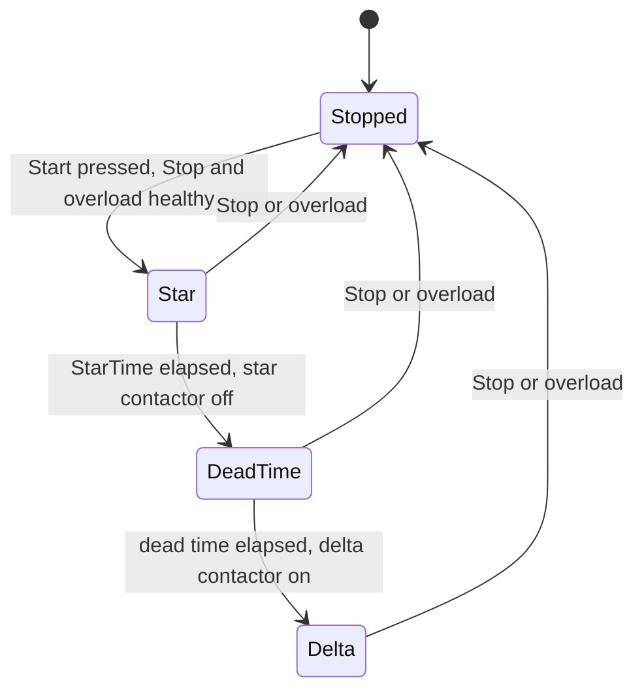
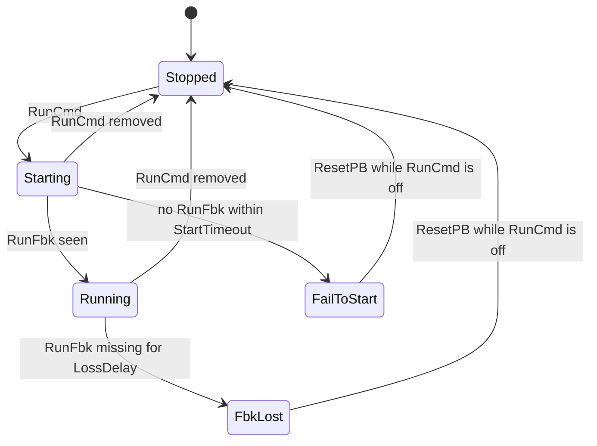

# 07 — Timers

> **Level:** 2 — Core programming · **Time:** ~10 hours · **Prerequisites:** [04 — Ladder Logic Fundamentals](../04-ladder-logic/), [06 — Edge Detection, One-Shots and Latching Patterns](../06-edges-and-one-shots/)

Almost every real control program measures time. A sump pump waits until the high level has
been present for a few seconds before it starts, so that a wave does not start it. A cooling
fan runs on for five minutes after a heater switches off. A valve that has not reached its
open limit switch 15 s after being told to open raises a "failed to open" alarm. A large
motor starts in star and switches to delta a few seconds later. In a relay panel each of
these was a separate timing relay on the DIN rail. In a PLC each one is a **timer function
block**: a few lines of code that you can copy, monitor and change from an HMI.

PLC timers look simple, and that is why they cause so many subtle bugs. A PLC timer is only
as accurate as the scan. It only updates when your program calls it. It forgets everything
if it is reset at the wrong moment, and it freezes if it is skipped. This module teaches the
three IEC 61131-3 timers (TON, TOF and TP) precisely, including their corner cases. It then
covers how timers interact with the scan cycle, how the Rockwell and Siemens timers map onto
them, how to build a retentive (accumulating) timer, and a toolbox of timer patterns used on
real plant. The five labs build a star-delta starter, a flasher, a motor with feedback
supervision, a run-hours meter and a two-hand control timing circuit.

## Learning objectives

After this module you will be able to:

- Describe the pins of TON, TOF and TP and draw their timing diagrams, including what happens
  when IN drops early, when TP is re-triggered, and what ET shows after the timer is done.
- Write TIME literals correctly and explain why the range of TIME matters for long durations.
- Estimate the real accuracy of a timer from the scan time, and explain why a timer only
  updates when it is called.
- Apply the three timer rules: one instance per job, call every timer once per scan
  unconditionally, and reset a TON by giving it IN = FALSE for a scan.
- Translate between IEC timers, Rockwell TON/TOF/RTO (`.EN .TT .DN .ACC .PRE`) and Siemens
  TP/TON/TOF/TONR.
- Build a retentive timer and a run-hours meter that neither drifts nor overflows.
- Implement the standard timer patterns: delay-on, run-on, flasher, debounce, feedback
  timeout, cascaded start, minimum on/off time, watchdog, star-delta and two-hand timing.
- Test timing logic with `plctest`, checking just before and just after each preset.

## 1. From timing relays to timer function blocks

Before PLCs, time delays in control panels came from **timing relays**. An *on-delay*
relay (delay on energisation) changes over its contacts a set time after its coil is
energised and releases them as soon as the coil is de-energised. An *off-delay* relay (delay
on de-energisation) operates at once and releases a set time after the coil drops out
(electronic versions usually have a separate control input for this). A *single-shot* (pulse)
relay closes its contact for a fixed time when triggered, whatever the trigger does
afterwards.

IEC 61131-3 defines the same three behaviours as standard function blocks:

| Timing relay in a panel | IEC 61131-3 | Rockwell Logix (ladder) | Siemens S7-1200/1500 |
|---|---|---|---|
| On-delay | `TON` | `TON` | `TON` |
| Off-delay | `TOF` | `TOF` | `TOF` |
| Single-shot pulse | `TP` | (build it, see [section 4.3](#43-tp-pulse-timer)) | `TP` |
| Accumulating (retentive) | not in the base standard | `RTO` | `TONR` |

The big difference from a relay is that a PLC timer is an **instance of a function block**.
A function block is a piece of code with its own memory (Module 11 covers them fully). When
you declare `PumpDelay : TON;`, the PLC reserves a small data area for *that* timer: its
inputs, outputs, the time at which it started and its internal state. Your program then
*calls* the instance every scan, and the timer code compares the current PLC clock with the
start time it remembered. A program can hold hundreds of timer instances, each doing its own
job, and every one of them can be watched online and adjusted from an HMI.

### 1.1 The pins

All three IEC timers have the same four pins:

| Pin | Direction | Type | Meaning |
|---|---|---|---|
| `IN` | input | BOOL | The signal being timed. What starts, stops and resets the timer depends on the type. |
| `PT` | input | TIME | **Preset time**: how long to time. |
| `Q` | output | BOOL | The timer output. |
| `ET` | output | TIME | **Elapsed time**: how far the timer has got. It never goes above `PT`. |

### 1.2 Declaring and calling a timer in Structured Text

```iecst
VAR
  LevelHigh : BOOL;          (* from the high-level switch *)
  PumpRun   : BOOL;          (* pump contactor *)
  PumpDelay : TON;           (* one instance, named after its job *)
END_VAR

PumpDelay(IN := LevelHigh, PT := T#5s);   (* call it: every scan *)
PumpRun := PumpDelay.Q;                   (* read its outputs with a dot *)
```

You can also bind the outputs in the call with `=>`:

```iecst
PumpDelay(IN := LevelHigh, PT := T#5s, Q => PumpRun, ET => DelayElapsed);
```

The outputs keep their values between calls, so `PumpDelay.Q` and `PumpDelay.ET` can be read
anywhere in the program. They show the result of the most recent call.

### 1.3 The same timer in Ladder and FBD

In Ladder the timer is a box on the rung. The rung condition drives `IN`, and `Q` powers the
rest of the rung. The instance name is written above the box:

```text
      LevelHigh          PumpDelay                                PumpRun
 |-------] [----------+-------------+
 |                    |     TON     |
 |                    |IN          Q|-----------------------------( )-----|
 |             T#5s --|PT         ET|--
 |                    +-------------+
```

In Function Block Diagram (Module 05) it is exactly the same box without the power rails.
Whatever the language, the instance, its pins and its behaviour are identical.

Timers need memory, so they live in a `PROGRAM` or a `FUNCTION_BLOCK`, never in a
`FUNCTION`, which keeps nothing from one call to the next (Module 11). MATIEC refuses to
compile a timer declared inside a `FUNCTION`.

## 2. TIME values

### 2.1 TIME literals

A duration is written with the prefix `T#` (or the long form `TIME#`) followed by one or more
units, largest first:

| Literal | Meaning |
|---|---|
| `T#250ms` | 250 milliseconds |
| `T#5s`, `TIME#5s`, `t#5s` | 5 seconds (prefix and units are not case-sensitive) |
| `T#1m30s` | 1 minute 30 seconds |
| `T#2h`, `T#1d` | 2 hours, 1 day |
| `T#1h_30m` | 1 hour 30 minutes (underscores may separate the parts) |
| `T#2.5s` | 2.5 seconds (a fraction is allowed in the last unit) |
| `T#1d2h3m4s5ms` | every unit at once |
| `T#-5s` | a negative duration: legal as a value (the result of a subtraction), meaningless as a preset |

The units are `d`, `h`, `m`, `s` and `ms` (edition 3 of the standard adds `us` and `ns`,
mainly for `LTIME`). Watch the difference between `m` (minutes) and
`ms` (milliseconds): `T#5m` is 60,000 times longer than `T#5ms`, and a missing `s` is an easy
slip to make and a hard one to spot.

### 2.2 The range of TIME

The standard leaves the size of TIME to the implementation. On many PLCs it is a **32-bit
count of milliseconds**. Siemens S7-1200/1500 TIME, for example, is a signed 32-bit number of
milliseconds, so its largest value is `T#24d20h31m23s647ms`, about 24.8 days. Rockwell Logix
timers hold their preset and accumulator in DINTs of milliseconds, which gives the same
limit. That is plenty for a delay, but it is too small for anything that accumulates over
months, such as the running hours of a pump. For those, count whole seconds, minutes or hours
in an integer (Lab 07-4). Some platforms also offer `LTIME`, a 64-bit duration with
nanosecond resolution (for example CODESYS and S7-1500). MATIEC does not support `LTIME`.

### 2.3 Arithmetic and comparisons

IEC 61131-3 lets you add and subtract durations (`T#1s + T#500ms`), multiply or divide a
duration by a number, and compare durations with `=`, `<>`, `<`, `>`, `<=` and `>=`. A common
use is an HMI countdown: remaining time = `PT - ET`.

The standard also names these operations as functions: `ADD_TIME(a, b)` and
`SUB_TIME(a, b)`, plus `MULTIME(t, n)` and `DIVTIME(t, n)` in edition 2 (edition 3 renamed the
last two `MUL_TIME` and `DIV_TIME`). You will meet both styles in other people's code.

> **plctest/OpenPLC note.** Infix `+ - * /` on TIME values and `ADD_TIME`, `SUB_TIME`,
> `MULTIME` and `DIVTIME` all work in `plctest` and OpenPLC. The edition 3 names `MUL_TIME`
> and `DIV_TIME` are not recognised. (Upstream MATIEC has a code-generation bug in TIME
> arithmetic that `plctest` works around for you; OpenPLC's own compiler does not have it.)
> One quirk remains in the MATIEC runtime library: a TIME produced by an addition can
> compare as *less* than an equal value, so `T#4500ms + T#500ms >= T#5s` is FALSE. Section
> 6.1 shows how to design around it.

Converting a TIME to a number is not portable. In CODESYS and TIA Portal,
`TIME_TO_DINT(T#1500ms)` gives 1500 (milliseconds). In MATIEC and OpenPLC it gives 1 (whole
seconds). If you need to decide something about a duration, **compare TIME values**
(`ET >= T#1s`) rather than converting them to integers.

## 3. How to read the timing diagrams

The diagrams in this module are drawn in plain text. Digital signals use two rows: a line on
the upper row means TRUE, a line on the lower row means FALSE, and `|` marks a change. The
elapsed time `ET` is drawn as a ramp (`/`) that rises from 0 to `PT`, a flat line where it
holds, and a `|` where it drops back. Each character is a quarter of a second and the scan
time is taken as negligibly small. `PT` is 3 s in every example.

## 4. The three IEC timers in detail

### 4.1 TON: on-delay timer

**Rule:** `Q` goes TRUE when `IN` has been TRUE *continuously* for `PT`. It goes FALSE the
moment `IN` goes FALSE.

```text
              ___________________         _____
IN       ____|                   |_______|     |__________

                          _______
Q        ________________|       |________________________

     PT                 /--------|
                   /             |
ET              /                |          /  |
      0  _____                   _________     ___________

         |   |   |   |   |   |   |   |   |   |   |   |   |
t (s)    0   1   2   3   4   5   6   7   8   9   10  11  12
```

- **t = 1 s:** `IN` rises. `ET` starts counting up from 0. `Q` stays FALSE.
- **t = 4 s:** `ET` reaches `PT` (3 s). `Q` goes TRUE and **`ET` stops at `PT`**. It does not
  keep counting. While `IN` stays TRUE, the timer just holds `Q` TRUE and `ET = PT`.
- **t = 6 s:** `IN` falls. `Q` goes FALSE and `ET` returns to 0 **in the same call**.
- **t = 8 to 9.5 s:** `IN` is TRUE for only 1.5 s, less than `PT`. `ET` climbs to 1.5 s and
  then drops to 0. `Q` never comes on. The time is **not remembered**: the next time `IN`
  rises, the timer starts from zero again.

That last point is the whole idea of an on-delay: it *confirms* that a condition has lasted.
A level switch that flickers for half a second never gets through a 3 s TON.

Typical uses: start delays, "condition must persist" confirmation, feedback timeouts,
star time in a star-delta starter, alarm on-delays (Module 14).

### 4.2 TOF: off-delay timer

**Rule:** `Q` goes TRUE the moment `IN` goes TRUE. It goes FALSE when `IN` has been FALSE
*continuously* for `PT`.

```text
              _______       _____
IN       ____|       |_____|     |________________________

              _______________________________
Q        ____|                               |____________

     PT                                     /-------------
                                       /
ET                      /  |        /
      0  _____________     _______

         |   |   |   |   |   |   |   |   |   |   |   |   |
t (s)    0   1   2   3   4   5   6   7   8   9   10  11  12
```

- **t = 1 s:** `IN` rises, `Q` rises at once. `ET` stays 0 while `IN` is TRUE.
- **t = 3 s:** `IN` falls and the off-delay starts. `Q` stays TRUE.
- **t = 4.5 s:** `IN` comes back after only 1.5 s. `ET` resets to 0 and `Q` simply stays
  TRUE. The short gap has no effect on the output.
- **t = 6 s:** `IN` falls again. This time it stays FALSE, so at **t = 9 s** `Q` goes FALSE.
- **After 9 s:** `ET` **holds at `PT`** until `IN` next goes TRUE, when it returns to 0.

Two practical details:

- **At power-up** a TOF whose `IN` is FALSE starts with `Q` FALSE. The off-delay only starts
  when `IN` *falls*, and at power-up it has not fallen. So a run-on fan does not start
  running on by itself after a power cut.
- **You cannot cut a run-on short by "resetting" a TOF.** Giving it `IN = TRUE` turns `Q` on,
  not off. If an operator or an interlock must be able to stop the run-on, gate the output:
  `Fan := FanRunOn.Q AND NOT FanStopRequest;`.

Typical uses: run-on (cooling fans, lube pumps, conveyor clearing), holding a signal over a
short drop-out, and "last seen within" monitoring (the watchdog in [section 7.8](#78-watchdogs-and-heartbeats)).

### 4.3 TP: pulse timer

**Rule:** a rising edge on `IN` makes `Q` TRUE for exactly `PT`, whatever `IN` does
afterwards.

```text
              ___     _           ___________________
IN       ____|   |___| |_________|                   |____

              ___________         ___________
Q        ____|           |_______|           |____________

     PT                 /|                  /--------|
                   /     |             /             |
ET              /        |          /                |
      0  _____           _________                   _____

         |   |   |   |   |   |   |   |   |   |   |   |   |
t (s)    0   1   2   3   4   5   6   7   8   9   10  11  12
```

- **t = 1 s:** a short pulse on `IN` (1 s long) starts a 3 s pulse on `Q`. Dropping `IN` at
  2 s does **not** shorten the pulse.
- **t = 3 s:** another rising edge arrives *during* the pulse. It is **ignored and not
  remembered**. The standard TP is **not retriggerable**: the pulse still ends at 4 s.
- **t = 4 s:** the pulse ends. `IN` is already FALSE, so `ET` returns to 0 straight away.
- **t = 6 s:** `IN` rises and stays TRUE for 5 s. `Q` is still only a 3 s pulse (6 s to 9 s):
  holding `IN` does **not** stretch it. `ET` holds at `PT` from 9 s until `IN` falls at 11 s.
  A new pulse needs `IN` to go FALSE and then TRUE again.

Typical uses: a fixed-length output pulse (a 2 s horn blast, a 500 ms solenoid kick, a
fixed-duration dosing pulse), and turning a long or short command into a pulse of known
length.

**Retriggerable pulse.** Sometimes you want the opposite: each new trigger *restarts* the
time, like a stairwell light that stays on until nobody has pressed the button for two
minutes. Build it from a TOF fed by a one-shot (Module 06): each edge makes `IN` TRUE for
one scan, which restarts the off-delay.

```iecst
TriggerEdge(CLK := LightButton);               (* R_TRIG: TRUE for one scan per press *)
StairLight(IN := TriggerEdge.Q, PT := T#2m);   (* TOF: restarted by every press *)
Lamp := StairLight.Q;
```

Rockwell Logix ladder has no pulse timer. A TON plus a one-shot, or the TOF trick above, does
the job.

### 4.4 Summary

| | TON (on-delay) | TOF (off-delay) | TP (pulse) |
|---|---|---|---|
| `Q` goes TRUE | `PT` after `IN` rises, if `IN` stays TRUE | at once when `IN` rises | at once on a rising edge of `IN` |
| `Q` goes FALSE | at once when `IN` falls | `PT` after `IN` falls, if `IN` stays FALSE | `PT` after the edge, whatever `IN` does |
| `ET` counts while | `IN` is TRUE and the timer is not done | `IN` is FALSE and the timer is not done | the pulse is running |
| `ET` when done | holds `PT` while `IN` is TRUE, 0 when `IN` falls | holds `PT` while `IN` is FALSE, 0 when `IN` rises | holds `PT` while `IN` is TRUE, 0 once `IN` is FALSE |
| A short `IN` pulse | is ignored | keeps `Q` on until `PT` after the pulse ends | gives a full `PT` pulse |
| Typical use | start delay, confirmation, timeout | run-on, drop-out bridging | fixed-length pulse |

## 5. Timers and the scan cycle

A timer is not a little clock running on its own. It is code that looks at the PLC clock
**when you call it**. That single fact explains all the rules in this section.

### 5.1 Resolution and accuracy

On each call, a TON compares "now" with the time stored when `IN` rose. `Q` can only change
during a call, and the output module is only updated at the end of the scan. The chain from a
real input changing to a real output changing looks like this:

```text
 scan n             scan n+1                        scan n+k
 |read|logic|write| |read|logic|write| ... ... ... |read|logic|write|
     ^                   ^                                ^      ^
     input changes       timer sees IN = TRUE and         timer  output
     just after the      stores the start time            finds  module
     inputs were read                                     ET>=PT switches
```

So on top of `PT` you get:

- up to one scan before the program even sees the input (plus the input module's filter
  time, which many modules let you configure),
- up to one scan after `PT` has expired before the timer is next called and notices,
- the output update at the end of the scan, plus the output device's own delay (a relay or
  contactor adds milliseconds of its own).

**Worked numbers.** With a 10 ms cyclic task and `PT := T#100ms`, the timer turns on 100 to
110 ms after the scan that saw `IN`, and 100 to 120 ms after the physical input changed,
before counting filters and relays. An error of up to 20 % is fine for a lamp and useless for
a measurement. With `PT := T#5s` the same 20 ms is 0.4 % and does not matter.

Rules of thumb:

- Keep presets well above the scan time. The error can be up to two scans, so if the timing
  matters to within 10 %, make `PT` at least twenty times the task interval.
- A preset shorter than the scan (`T#5ms` on a 10 ms task) is meaningless: the timer can only
  ever finish on a scan boundary.
- A *cyclic* task (fixed interval) gives more regular timing than a free-running scan whose
  length varies with the work done. Module 11 covers tasks.
- For timing well below the scan time, use hardware: high-speed counter inputs, timestamped
  inputs, hardware-timed or interrupt tasks, or pulse outputs (Module 19).

### 5.2 Call every timer once per scan, unconditionally

Because a timer only updates when called, **a timer that is not called freezes**. Its `Q` and
`ET` keep whatever values they had at the last call. This is a classic bug:

```iecst
(* WRONG: the timer is only called while PumpSelected is TRUE *)
IF PumpSelected THEN
  RunDelay(IN := StartReq, PT := T#10s);
END_IF;
Pump := RunDelay.Q;
```

Suppose the pump is selected, `StartReq` is TRUE, and after 10 s the timer is done and the
pump runs. Now the operator deselects the pump and `StartReq` goes FALSE in the same moment.
The `IF` skips the call, so the timer never sees `IN` go FALSE: **`Q` stays TRUE and the pump
keeps running.** When the pump is selected again later, the timer carries on from its stale
state. (Running this in `plctest` shows exactly that: `Pump` stays TRUE with `ET` frozen at
10 s for as long as the pump is deselected.)

Lab 07-1 shows a quieter version of the same bug. If the star timer of a star-delta starter
is called only inside `IF MainK THEN ... END_IF`, a stop never resets it. On the next start
the frozen timer finds that its start time is long past and finishes on the first scan, so
the motor gets no star period at all.

**The fix: put the condition into `IN` and call the timer every scan.**

```iecst
RunDelay(IN := PumpSelected AND StartReq, PT := T#10s);
Pump := RunDelay.Q;
```

The same applies in Ladder. A timer on a rung skipped by a jump (`JMP`/`LBL`), or in a
subroutine or section that is not executed this scan, is frozen in the same way. In IEC-style
ladder and FBD editors such as CODESYS and OpenPLC, watch the box's optional `EN` input as
well: if the rung condition is wired to `EN` instead of `IN`, a FALSE rung *skips the call*,
exactly like the `IF` above. Wire the condition to `IN`. Rockwell's ladder timers have no such
trap: a Logix `TON` on a FALSE rung is still executed, sees the FALSE rung and resets. When you
genuinely want a timer to pause and resume, that is a *retentive* timer: say so explicitly
([section 6](#6-retentive-accumulating-timers)).

> **Siemens detail.** On S7-1200/1500 the IEC timers also refresh `Q` and `ET` whenever your
> program reads them, even if the timer is not called in that scan. `IN` is still only read
> when the instruction is called, so the bug above is the same: a timer that is not called
> never sees `IN` go FALSE.

### 5.3 Never share one instance

Each timer instance must do exactly one job and be called in exactly one place.

```iecst
(* WRONG: one instance shared by two pumps *)
Delay(IN := PumpA_Req, PT := T#5s);
PumpA := Delay.Q;
Delay(IN := PumpB_Req, PT := T#5s);
PumpB := Delay.Q;
```

If pump A is requested and pump B is not, the first call sees `IN = TRUE` and starts timing,
and the second call sees `IN = FALSE` and resets the timer. Next scan the first call sees a
new rising edge and starts again. The timer never gets anywhere, so while B is not
requested pump A never starts. It starts only once pump B is requested as well, 5 s after
B's request, and when B's request goes away the second call resets the shared timer and pump
A stops too. (Running this in `plctest` shows exactly that.) The ladder version is the same
timer tag used on two rungs, the timer equivalent of the double-coil bug from Module 04.
Declare one instance per job, named after the job: `PumpA_StartDelay`, `PumpB_StartDelay`.

### 5.4 Resetting a timer

IEC timers have no reset input. To reset a TON, **call it with `IN = FALSE`** at least
once. The usual way is to add the reset condition to `IN`:

```iecst
StepTimer(IN := StepActive AND NOT ResetTimer, PT := T#30s);
```

Three traps:

- Setting a variable FALSE and then TRUE again *before* the timer is called does nothing.
  The timer only sees the value of `IN` at the moment of each call.
- To restart a TON that is already running, `IN` must be FALSE for a call and then TRUE for a
  later call. A restart therefore costs at least one scan. (Calling the same instance twice in
  one scan, once with `IN := FALSE` and once with `IN := TRUE`, is possible but breaks the
  once-per-scan rule. If you ever do it, comment it clearly.)
- **A running TP cannot be reset at all.** Once triggered, its pulse lasts the full `PT`
  whatever `IN` does; `IN = FALSE` only re-arms it (and zeroes `ET`) after the pulse has ended.
  If a pulse must be cut short, gate its output: `Horn := HornPulse.Q AND NOT Silence;`.
  A TOF cannot be cut short by its `IN` either ([section 4.2](#42-tof-off-delay-timer)).

Rockwell timers have a `RES` (reset) instruction and Siemens has a reset-timer instruction
and the `R` input of `TONR`: see [Vendor notes](#vendor-notes).

### 5.5 Changing PT on the fly

What happens when a preset written from an HMI changes while a timer is running depends on
the platform:

- **MATIEC (`plctest`, OpenPLC), CODESYS and Rockwell Logix** compare the elapsed time with
  the *current* preset on every call. While timing, a larger `PT` extends the delay, and a `PT`
  smaller than the current `ET` makes `Q` come on at the next call.
- **Siemens S7-1200/1500** IEC timers copy `PT` into their instance data only when `IN`
  changes, so a new preset takes effect from the next start.
- **After the timer is done** behaviour varies again. In MATIEC, a TON that is done stays done
  (`Q` TRUE, `ET` at the old `PT`) even if `PT` is increased.

Don't rely on any of these: if a new preset must apply, restart the timer, or only accept a
new preset while the timer is idle. Two more points about presets:

- **Zero and negative presets.** `PT := T#0s` makes the delay as short as the platform
  allows. In MATIEC a TON with `PT = 0` turns `Q` on at the call *after* `IN` rises, one scan
  late, and other platforms may turn it on at once. A negative `PT` (for example from a
  subtraction) is meaningless.
- **Clamp operator entries.** Never trust a preset typed on an HMI:

```iecst
Delay(IN := Request, PT := LIMIT(T#1s, HmiDelay, T#60s));
```

### 5.6 Self-resetting timers lose time

A TON that resets itself is the simplest oscillator:

```iecst
Tick(IN := NOT Tick.Q, PT := T#1s);   (* Tick.Q is TRUE for one scan every "second" *)
```

Trace it: the scan in which `ET` reaches 1 s sets `Q`. On the next scan `IN := NOT Q` is
FALSE, so the timer resets. On the scan after that `IN` is TRUE again and timing restarts.
Each cycle therefore lasts `PT` **plus two scans**. With a 10 ms task that is 1.020 s, and
`plctest` counts 58 pulses per minute instead of 60. Resetting in the same scan (calling the
timer again with `IN := FALSE` when `Q` is seen) still costs one scan per cycle: 1.010 s, or
59 pulses a minute.

That error is harmless for a flashing lamp. It is serious for anything that **counts time**:
a totaliser or run-hours meter built on a 1 s self-resetting timer runs about 1 to 2 % slow,
which is roughly 15 to 30 minutes a day. Section 6.3 and Lab 07-4 show accurate designs.

## 6. Retentive (accumulating) timers

A **retentive** timer adds up time over several periods. When `IN` goes FALSE it *keeps* its
elapsed time instead of resetting, and carries on from there when `IN` returns. Only an
explicit reset clears it. Use it for anything that accumulates: running hours for
maintenance, total time a heater has been on, cumulative time a batch has spent above a
temperature.

```text
              _______         _______
IN       ____|       |_______|       |____________________

                                              _
R        ____________________________________| |__________

                                  ___________
Q        ________________________|           |____________

     PT                         /------------|
                   /----------               |
ET              /                            |
      0  _____                               _____________

         |   |   |   |   |   |   |   |   |   |   |   |   |
t (s)    0   1   2   3   4   5   6   7   8   9   10  11  12
```

`IN` is TRUE from 1 to 3 s: `ET` climbs to 2 s and then **holds** while `IN` is FALSE. When
`IN` returns at 5 s, `ET` carries on from 2 s and reaches `PT` (3 s) at 6 s, so `Q` comes on.
`Q` and `ET` stay put when `IN` falls at 7 s. Only the reset `R` at 9 s clears them.

### 6.1 IEC has no retentive timer, so build one

The base IEC 61131-3 standard defines only TP, TON and TOF. Vendors add their own retentive
timers (Rockwell `RTO`, Siemens `TONR`), and OpenPLC has none. Here is one built from a TON,
written as a function block (Module 11 explains FBs; for now, read it as a reusable timer
type with inputs `IN`, `PT`, `R` and outputs `Q`, `ET`):

```iecst
FUNCTION_BLOCK FB_RTO
  VAR_INPUT
    IN : BOOL;     (* accumulate time while TRUE *)
    PT : TIME;     (* preset *)
    R  : BOOL;     (* reset: clears the accumulated time and Q *)
  END_VAR
  VAR_OUTPUT
    Q  : BOOL;     (* accumulated time has reached PT *)
    ET : TIME;     (* accumulated time *)
  END_VAR
  VAR
    Segment : TON;   (* times the current period while IN is TRUE *)
    Banked  : TIME;  (* total of the earlier, finished periods *)
  END_VAR

  (* Bank a period that has just ended. Segment.ET still holds the value
     from the last call, when IN was TRUE; on later scans it is zero. *)
  IF R THEN
    Banked := T#0s;
  ELSIF NOT IN THEN
    Banked := Banked + Segment.ET;
  END_IF;

  (* Time the current period against what is left of the preset. *)
  Segment(IN := IN AND NOT R, PT := PT - Banked);

  ET := Banked + Segment.ET;
  Q := (Q OR Segment.Q) AND NOT R;     (* done stays done until reset *)
END_FUNCTION_BLOCK
```

How it works:

- `Segment` is an ordinary TON that times the *current* period while `IN` is TRUE.
- On the first scan after `IN` falls, `Segment.ET` still shows the length of the period that
  has just ended, because the timer has not yet been called this scan. The FB adds it to
  `Banked` *before* calling `Segment` with `IN = FALSE`, which zeroes it. On later scans
  `Segment.ET` is 0, so adding it changes nothing.
- The segment's preset is whatever is left: `PT - Banked`. So `Segment.Q` comes on exactly
  when the total reaches `PT`, and `ET` never goes past `PT`.
- `Q` is latched, so it stays TRUE when `IN` falls, like a Rockwell RTO's `.DN` bit.
  (Taking `Q` from the TON rather than comparing `ET >= PT` also avoids the MATIEC quirk from
  [section 2.3](#23-arithmetic-and-comparisons): `Banked + Segment.ET` can compare as less
  than an equal `PT`.)

In older code you may see `ADD_TIME(Banked, Segment.ET)` and `SUB_TIME(PT, Banked)`, which
mean the same. The FB is called like any timer:
`HeaterHours(IN := HeaterOn, PT := T#10h, R := ResetPB);`.

### 6.2 Surviving a power cut

"Retentive" has a second meaning in PLCs: memory that survives a power cycle (Module 03).
A run-hours total that goes back to zero whenever the PLC restarts is useless, so declare
the accumulated values `RETAIN`:

```iecst
VAR RETAIN
  TotalSeconds : DINT;   (* kept through a power cut on a real PLC *)
END_VAR
```

The TON inside `FB_RTO` is not retentive, so the period that was running when the power
failed is lost. If that matters, bank the time regularly (every minute, for example) rather
than only when `IN` falls.

### 6.3 Run-hours meters

A run-hours meter is a retentive timer with four extra demands:

1. **It must not overflow.** A pump that runs for three years has run for about 26,000 hours,
   far beyond the 24.8 days a 32-bit TIME can hold. Keep the total in an integer: a DINT of
   seconds lasts about 68 years.
2. **It must not drift.** As section 5.6 showed, counting the pulses of a 1 s self-resetting
   timer loses one or two scans every second. Either carry time over less often (a retentive
   timer with a one-minute preset loses one or two scans a *minute*, about 0.03 %), or
   measure how much time has really passed, as in Lab 07-4.
3. **It must keep part-periods.** If the motor runs for 40 s ten times a day, a meter that
   counts only complete minutes of *each run* never counts anything. The part-period must be
   carried over, which is exactly what a retentive timer does.
4. **It must survive power cuts** (`RETAIN`, above) and must only be reset deliberately.

For example, with `FB_RTO`, one-minute carries into a retentive counter look like this:

```iecst
MinuteRTO(IN := Running, PT := T#1m, R := MinuteRTO.Q OR ResetPB);
IF MinuteRTO.Q THEN
  TotalMinutes := TotalMinutes + 1;   (* Q is TRUE for one scan: the R above clears it next scan *)
END_IF;
```

Siemens `TONR` and Rockwell `RTO` can be used in the same way, with the same care about the
32-bit limit of their elapsed time.

## 7. Timer patterns

This section is a toolbox. Every pattern here appears again in later modules.

### 7.1 Delay-on: start delays and confirmation

"Do X when condition C has been true for T." A TON with `IN := C`. Examples: start the
sump pump when the high level has been present for 5 s; declare a flow "established" when
the flow switch has been made for 10 s; restart a compressor only after the suction pressure
has been healthy for 30 s. The confirmation also filters out momentary signals.

Be careful with delays on **trips and alarms**. A delay makes the system slower to react.
On a protective function, the delay is part of the response time and must fit within the
process safety time (Module 20). Never add a delay to a safety trip just because it
"nuisance trips": find out why.

### 7.2 Delay-off: run-on

"Keep X going for T after C goes away." A TOF. Examples: a burner's combustion-air fan
purges the furnace for a set time after the flame goes out (post-purge), a cooling fan runs
on after a heater stops, a conveyor keeps running for 20 s after the last product so the belt
is cleared, a lube-oil pump runs on after the main machine stops.

```text
      HeaterOn           FanRunOn                                 Fan
 |-------] [----------+-------------+
 |                    |     TOF     |
 |                    |IN          Q|-----------------------------( )-----|
 |             T#5m --|PT         ET|--
 |                    +-------------+
```

```iecst
FanRunOn(IN := HeaterOn, PT := T#5m);
Fan := FanRunOn.Q;
```

### 7.3 Oscillators and flashers

Flashing lamps and beacons, a horn that sounds in bursts, a "heartbeat" bit: all need an
oscillator. Two common designs:

**Self-resetting TON plus a toggle** (50 % duty cycle):

```iecst
Tick(IN := NOT Tick.Q, PT := T#500ms);   (* one-scan pulse roughly every 500 ms *)
IF Tick.Q THEN
  Blink := NOT Blink;                    (* toggle: 1 s period *)
END_IF;
```

**Two timers that reset each other** (separate on and off times). One timer times the ON
phase. When it is done, it starts the second timer, which times the OFF phase. When the
second timer is done, it removes the first timer's `IN` for a scan, which resets both and
starts the cycle again:

```text
      OffTimer.Q          OnTimer
 |-------]/[----------+-------------+
 |                    |     TON     |
 |                    |IN          Q|--
 |          OnTime  --|PT         ET|--
 |                    +-------------+
 |
 |      OnTimer.Q         OffTimer
 |-------] [----------+-------------+
 |                    |     TON     |
 |                    |IN          Q|--
 |          OffTime --|PT         ET|--
 |                    +-------------+
```

With an ON time of 1 s and an OFF time of 1.5 s, the lamp driven by `NOT OnTimer.Q`, and the
whole oscillator (timers and lamp) switched on and off by an `Enable` signal:

```text
              _____________________________
Enable     __|                             |____

                  _____     _____     _____
OnTimer.Q  ______|     |___|     |___|     |____

              ___       ___       ___
Beacon     __|   |_____|   |_____|   |__________

           |   |   |   |   |   |   |   |   |   |
t (s)      0   1   2   3   4   5   6   7   8   9
```

`OffTimer.Q` is TRUE for a single scan at the end of each OFF phase (at 3 s and 5.5 s), too
short to show here. Lab 07-2 asks you to add an enable to this and make every enable start
with a full ON phase. Many platforms also provide a ready-made flasher, such as `BLINK` in
the CODESYS Util library, and Siemens CPUs can provide clock-memory bits that toggle at fixed
frequencies. Because both designs above restart a timer each cycle, each phase is a scan or
two longer than set: fine for a lamp (section 5.6).

### 7.4 Debounce and signal confirmation

Mechanical contacts bounce for a few milliseconds when they close, and the input module's
filter usually hides that. PLC-level debouncing deals with slower effects: a float switch in a
turbulent tank, a proximity switch on a vibrating machine, a photo-eye flickering on a shiny
product. The robust version confirms both the ON and the OFF state:

```iecst
DebounceOn(IN := FloatSwitch, PT := T#2s);        (* TRUE for 2 s: accept ON *)
DebounceOff(IN := NOT FloatSwitch, PT := T#2s);   (* FALSE for 2 s: accept OFF *)
IF DebounceOn.Q THEN
  LevelHigh := TRUE;
ELSIF DebounceOff.Q THEN
  LevelHigh := FALSE;
END_IF;
```

`LevelHigh` changes only when the raw signal has held its new state for 2 s, and in between
it keeps its last value. A single TON gives an ON-delay only, which is often what you want
for starting something and wrong for stopping it. As with any delay on a trip, a debounce
time on a protective input adds to its response time.

### 7.5 Feedback timeout (discrepancy) monitoring

Whenever a PLC commands a device that reports back (a motor with a running contact, a valve
with limit switches, a drive with a "running" bit), it should check that the feedback
arrives. The pattern is a TON that runs while **command and feedback disagree**:

```iecst
StartTimer(IN := MotorRun AND NOT RunFbk, PT := T#3s);
IF StartTimer.Q THEN
  FailToStart := TRUE;          (* latched until a deliberate reset *)
END_IF;
```

Pick the time from the real device: the valve's measured stroke time plus a margin, or the
time a drive takes to report "running". The fault must be **latched**. If it were not, the
fault would stop the motor, the stopped motor would clear the disagreement, the fault would
clear, the motor would restart, and so on for ever. How the latch is reset matters as well:
a reset must never restart equipment by surprise. Lab 07-3 builds the complete version with
separate start and running supervision, and the [worked example](#worked-example-2-valve-travel-monitoring)
below does the same for a valve.

### 7.6 Cascading timers

Timers can drive each other: the `Q` of one starts the next. This is how you build simple
time sequences, such as starting a line of conveyors downstream first so that nothing is fed
onto a stopped belt, or staggering the restart of large motors after a power failure so that
their starting currents do not add up. See [Worked example 3](#worked-example-3-staggered-conveyor-start).

Two cautions. Start the next timer from the **feedback** of the previous device (it is really
running) rather than from its command when you can. And a chain of more than a few timers is
really a sequence: write it as a state machine instead (Module 13), where each step has one
timer and it is obvious what happens on a stop.

For very long times (days, weeks), cascade a timer into a **counter** (Module 08), or use the
PLC's real-time clock, rather than a single timer with a huge preset.

### 7.7 Minimum on and off times

Refrigeration compressors, large motors and some burners must not be started and stopped too
often. Motor manufacturers limit the number of starts per hour because each start heats the
windings, and short-cycling wears contactors. The fix is a minimum run time and a minimum off
time:

```iecst
RunTime(IN := Compressor, PT := MinOnTime);          (* how long it has been running *)
StopTime(IN := NOT Compressor, PT := MinOffTime);    (* how long it has been stopped *)
IF Compressor THEN
  IF NOT Demand AND RunTime.Q THEN
    Compressor := FALSE;       (* stop only after the minimum run time *)
  END_IF;
ELSIF Demand AND StopTime.Q THEN
  Compressor := TRUE;          (* start only after the minimum off time *)
END_IF;
IF NOT Healthy THEN
  Compressor := FALSE;         (* trips and stops always win over minimum run time *)
END_IF;
```

The last `IF` matters: a minimum run time must never hold a machine on against a trip, an
emergency stop or an operator's stop. Note also that at power-up `Compressor` is FALSE, so
`StopTime` must run for `MinOffTime` before the first start. That is usually what you want:
it doubles as a restart delay after a power failure.

### 7.8 Watchdogs and heartbeats

A TOF makes a neat "last seen within" monitor. Suppose a remote PLC toggles a heartbeat bit
every second over a network (Module 17). If the bit stops changing for 3 s, the link or the
remote PLC has failed:

```iecst
HeartbeatSeen(IN := RemoteHeartbeat <> LastHeartbeat, PT := T#3s);  (* TOF *)
LastHeartbeat := RemoteHeartbeat;
CommFault := NOT HeartbeatSeen.Q;
```

Each change makes `IN` TRUE for one scan and restarts the off-delay, so `HeartbeatSeen.Q`
stays TRUE while changes keep arriving. The design is fail-safe: at power-up there has been
no change yet, so `CommFault` starts TRUE until the first heartbeat arrives. Module 16
develops watchdogs and heartbeats further.

### 7.9 Star-delta starting

A three-phase induction motor started direct-on-line draws several times its full-load
current. A **star-delta** (wye-delta) starter reduces this. The motor is started with its
windings connected in **star**, so each winding sees the line voltage divided by √3 (about
58 %). The starting current and torque drop to about **one third** of their direct-on-line
values. When the motor is near full speed, the starter reconnects the windings in **delta**
for normal running. The motor must be one designed to run in delta at the supply voltage
(for example a motor marked 400 V delta / 690 V star on a 400 V supply), with all six winding
ends brought out to the terminal box.

The starter has three contactors: the **main** (line) contactor, the **star** contactor that
joins the winding ends to form the star point, and the **delta** contactor.

```text
               |<----------- StarTime ------------>|<--->| 100 ms dead time (not to scale)
                _
StartPB    ____| |______________________________________________________

                ________________________________________________________
MainK      ____|

                ___________________________________
StarK      ____|                                   |____________________

                                                          ______________
DeltaK     ______________________________________________|
```



The timing is the point of this example:

- **Star time.** Long enough for the motor to approach full speed, which depends on the load
  inertia. It is set during commissioning, typically a few seconds up to a few tens of seconds
  for heavy loads. Too short and the change to delta causes a current surge close to a
  direct-on-line start. Too long and the motor labours in star under load. That is why the
  labs make it adjustable.
- **Dead time.** Star and delta closed together would short-circuit the supply: the delta
  contactor connects the winding ends to the line phases, and the star contactor ties those
  same ends together, so the phases are shorted through the two contactors. The star
  contactor must have **opened and its arc cleared** before delta closes, so there is a short
  dead time with both off. Dedicated star-delta timing relays use a changeover time of the
  order of tens of milliseconds. Too long a dead time lets the motor slow down and
  increases the surge when delta closes. (Lab 07-1 uses 100 ms so the test can check it
  comfortably above the 10 ms scan.)
- **Interlocks.** The PLC's software interlock (delta only when star is off) is the *second*
  line of defence. The first is hard-wired: each contactor's NC auxiliary contact in the
  other's coil circuit, and usually a mechanical interlock between the two contactors.

On the electrical side, the thermal overload relay is normally placed in the winding circuit,
where it carries the phase current (about 58 % of the line current), and is set accordingly.
Module 02 covers contactors and overload relays.

The same dead-time idea protects a **reversing starter** (Module 04): after one direction
drops out, wait a short time, or until the motor has stopped, before the other direction may
start. A TON that runs while both contactors are off does it, and its `Q` becomes a start
permissive for either direction:

```iecst
ChangeoverDelay(IN := NOT FwdK AND NOT RevK, PT := T#500ms);   (* both off for 0.5 s *)
StartAllowed := ChangeoverDelay.Q;
```

### 7.10 Two-hand control timing

On presses and similar machines, a **two-hand control device** keeps both of the operator's
hands on the controls, away from the danger zone, while the hazardous motion takes place. The
international standard is ISO 13851 (formerly EN 574). It defines types I, II and III of
increasing rigour. The timing rules you can express in logic are:

- the output is given only while **both** buttons are held, and stops as soon as **either**
  is released (all types);
- a new cycle needs **both** buttons to be released first, so taping one button down and
  cycling with the other hand does not work (types II and III);
- for type III, the two buttons must also be pressed **synchronously**, which the standard
  defines as within **0.5 s** of each other.

```text
              _____________       _______________     _______________
LeftPB     __|             |_____|               |___|               |__

                 ____________            ______       _____   _____
RightPB    _____|            |__________|      |_____|     |_|     |____

                 __________                           _____
PressDown  _____|          |_________________________|     |____________

           |         |         |         |         |         |         |
t (s)      0         1         2         3         4         5         6
```

- **0 to 2 s:** Right follows Left after 0.3 s, inside the window: the stroke runs, and stops
  the moment Left is released.
- **2 to 4 s:** Right follows Left after 0.7 s: too late, no stroke.
- **4 to 6 s:** both pressed together: stroke. Right is released, so the stroke stops.
  Right pressed again while Left is still held: no stroke, because the buttons were not both
  released first.

> **Safety.** This is only the *timing*. A real two-hand control device is a safety function.
> It uses safety-rated buttons (usually one NO and one NC contact each, so that faults are
> detected), a safety relay or safety PLC designed to the functional-safety standards, and it
> must be mounted far enough from the hazard that a hand cannot reach it before the motion
> stops (ISO 13855). Never implement it in standard PLC logic. Lab 07-5 is a timing exercise
> only. See Module 20.

## Worked examples

### Worked example 1: conveyor start-up warning

**Specification.** On a long conveyor that people can walk beside, pressing Start sounds a
horn for 5 s *before* the belt moves. Stop cancels everything at any time, including during
the warning.

```text
      StartPB       StopPB_NC                                  StartReq
 |-------] [-----+-------] [-----------------------------------( )-----|
 |               |
 |    StartReq   |
 |-------] [-----+
 |
 |    StartReq           WarnTimer
 |-------] [----------+-------------+
 |                    |     TON     |
 |                    |IN          Q|--
 |             T#5s --|PT         ET|--
 |                    +-------------+
 |
 |    StartReq     WarnTimer.Q                                   Horn
 |-------] [----------]/[--------------------------------------( )-----|
 |
 |    StartReq     WarnTimer.Q                                 Conveyor
 |-------] [----------] [--------------------------------------( )-----|
```

```iecst
PROGRAM ConveyorWarning
  VAR
    StartPB   : BOOL;   (* start push-button, NO *)
    StopPB_NC : BOOL;   (* stop push-button, NC: TRUE while not pressed *)
    Horn      : BOOL;   (* start-up warning horn *)
    Conveyor  : BOOL;   (* conveyor motor contactor *)
    StartReq  : BOOL;   (* start requested and not stopped *)
    WarnTimer : TON;    (* 5 s warning before the conveyor moves *)
  END_VAR

  StartReq := (StartPB OR StartReq) AND StopPB_NC;
  WarnTimer(IN := StartReq, PT := T#5s);
  Horn := StartReq AND NOT WarnTimer.Q;
  Conveyor := StartReq AND WarnTimer.Q;
END_PROGRAM
```

**Scan by scan** (10 ms task, Start pressed in the scan at t = 1.000 s):

| Time | StartReq | WarnTimer.ET | WarnTimer.Q | Horn | Conveyor | What happens |
|---|---|---|---|---|---|---|
| 0.990 s | FALSE | 0 | FALSE | FALSE | FALSE | idle |
| 1.000 s | TRUE | 0 | FALSE | TRUE | FALSE | seal-in made, timer stores its start time, horn on |
| 1.010 s | TRUE | 10 ms | FALSE | TRUE | FALSE | timing |
| 5.990 s | TRUE | 4.99 s | FALSE | TRUE | FALSE | still warning |
| 6.000 s | TRUE | 5 s | TRUE | FALSE | TRUE | horn off, belt starts, in the same scan |
| later, Stop | FALSE | 0 | FALSE | FALSE | FALSE | seal broken; the timer resets, so the next start warns again |

Because the timer's `IN` is the run request itself, a stop resets it and every start gets
the full warning. The horn and the conveyor come from the same timer output, so they can
never be on together.

### Worked example 2: valve travel monitoring

**Specification.** On/off valve XV-101 has a solenoid (`OpenCmd`) and two limit switches:
`ZSO` (open) and `ZSC` (closed), tagged in the usual ISA-5.1 style. Its measured stroke
time is 10 s. Raise a latched alarm if the valve is not at the commanded end within 15 s of
the command, *or* if it later drifts away from that end. A reset clears an alarm only when
its cause has gone.

```iecst
PROGRAM ValveMonitor
  VAR
    OpenCmd    : BOOL;            (* command to the solenoid valve: TRUE = open *)
    ZSO        : BOOL;            (* open limit switch *)
    ZSC        : BOOL;            (* closed limit switch *)
    AlarmReset : BOOL;            (* operator reset *)
    FailOpen   : BOOL;            (* commanded open, not open in time *)
    FailClose  : BOOL;            (* commanded closed, not closed in time *)
    TravelTime : TIME := T#15s;   (* measured stroke time plus a margin *)
    OpenTimer  : TON;
    CloseTimer : TON;
  END_VAR

  (* Each timer runs while the valve is NOT where it was told to be. *)
  OpenTimer(IN := OpenCmd AND NOT ZSO, PT := TravelTime);
  CloseTimer(IN := NOT OpenCmd AND NOT ZSC, PT := TravelTime);

  IF OpenTimer.Q THEN
    FailOpen := TRUE;
  END_IF;
  IF CloseTimer.Q THEN
    FailClose := TRUE;
  END_IF;

  (* A reset clears an alarm only when its cause has gone. *)
  IF AlarmReset THEN
    FailOpen := FailOpen AND OpenTimer.Q;
    FailClose := FailClose AND CloseTimer.Q;
  END_IF;
END_PROGRAM
```

Walk through it:

- Valve closed and not commanded: `ZSC` is TRUE, so `CloseTimer.IN` is FALSE. Quiet.
- `OpenCmd` goes TRUE: `OpenTimer` starts at once, because `ZSO` is not yet made. The valve
  takes 10 s, `ZSO` makes, `OpenTimer.IN` goes FALSE and the timer resets. No alarm.
- A sticking valve that has not reached `ZSO` after 15 s: `FailOpen` latches.
- An open valve whose `ZSO` drops out (the valve has drifted, or the switch has failed) for
  15 s: `FailOpen` latches too. One timer covers both "did not get there" and "did not stay
  there".
- The reset: `FailOpen AND OpenTimer.Q` keeps the alarm while the cause is still present.

A natural extension is a switch-fault alarm when `ZSO` and `ZSC` are both TRUE. In a
process-safety context, the same timers give the data for valve diagnostics such as stroke
times. A shutdown valve's proof testing is covered in Module 20.

### Worked example 3: staggered conveyor start

**Specification.** Three conveyors feed each other: 1 feeds 2, which feeds 3. On a run
request start conveyor 3 (furthest downstream) at once, conveyor 2 after 3 s and conveyor 1
after another 3 s, so nothing is fed onto a stopped belt. When the request goes, stop all
three at once.

```iecst
PROGRAM StaggeredStart
  VAR
    RunReq  : BOOL;               (* all three conveyors requested *)
    Conv3, Conv2, Conv1 : BOOL;   (* contactors; conveyor 3 is furthest downstream *)
    Delay2  : TON;
    Delay1  : TON;
  END_VAR

  Conv3 := RunReq;
  Delay2(IN := Conv3, PT := T#3s);
  Conv2 := Delay2.Q;
  Delay1(IN := Conv2, PT := T#3s);
  Conv1 := Delay1.Q;
END_PROGRAM
```

Each timer's `IN` is the previous conveyor, so removing `RunReq` drops `Conv3` and resets
`Delay2` in the same scan. That drops `Conv2`, which resets `Delay1` and drops `Conv1`. All
three stop in one scan, and the next start goes through the full sequence again. In a real
line, drive each timer from the previous conveyor's *running feedback* and add feedback
supervision (section 7.5), so that a conveyor that trips stops everything upstream of it.

## Common mistakes and how to avoid them

1. **Calling a timer inside an `IF` (or a skipped rung, jump or subroutine).** The timer
   freezes with stale outputs. Call every timer once per scan and put the condition in `IN`.
2. **Sharing one instance between two jobs.** The calls fight each other and the timer never
   completes. One instance per job, named after the job.
3. **Expecting a TON to remember time.** A TON starts from zero at every rising edge of `IN`.
   If time must accumulate over interruptions, you need a retentive timer.
4. **Using TON where TOF is needed (and the other way round).** Ask: is the delay on the way
   *in* (TON) or on the way *out* (TOF)? Draw the timing diagram before you write the code.
5. **Counting time with a self-resetting timer.** It runs slow by one or two scans per cycle.
   Fine for a lamp; wrong for totals and run hours.
6. **Presets close to the scan time.** A 20 ms timer on a 10 ms scan can be out by 50 % or
   more.
   Keep presets much longer than the scan, or use hardware timing.
7. **Unlimited HMI presets.** An operator enters 0 or 99 hours. Clamp every adjustable preset
   with `LIMIT`, and decide what a change while timing should do.
8. **Long durations in TIME.** A 32-bit TIME overflows at about 24.8 days. Use integer
   counters for hours and days.
9. **Converting TIME to integers.** `TIME_TO_DINT` gives milliseconds in CODESYS and TIA
   Portal but whole seconds in MATIEC and OpenPLC. Compare TIME values directly instead.
10. **Unlatched timeout faults.** A timeout that stops the equipment clears itself and the
    equipment restarts: a start/stop oscillation. Latch faults and reset them deliberately.
11. **Resets that restart equipment.** Resetting a fault while the run command is still
    present restarts the motor under the operator's hands. Only accept a reset when it is
    safe (Lab 07-3).
12. **Delays on protective functions.** Every confirmation or debounce delay adds to the
    response time of a trip. Account for it (Module 20) and never add one just to silence
    nuisance trips.
13. **Using a PLC timer for safety timing.** Two-hand control, safety door locking delays and
    safe-stop timing belong in safety-rated devices.

## Vendor notes

### Rockwell Automation (Studio 5000 Logix Designer, ControlLogix / CompactLogix)

In Logix ladder, a timer is a tag of type **TIMER**, a structure with these members:

| Member | Type | Meaning |
|---|---|---|
| `.PRE` | DINT | preset, in **milliseconds** (the time base is always 1 ms) |
| `.ACC` | DINT | accumulated time in milliseconds (the IEC `ET`) |
| `.EN` | BOOL | enable: follows the rung condition |
| `.TT` | BOOL | timer timing |
| `.DN` | BOOL | done |

The instructions are `TON`, `TOF` and `RTO`, plus `RES` to reset a timer. The status bits
behave like this:

| Instruction | While the rung is TRUE | While the rung is FALSE |
|---|---|---|
| `TON` | `.EN` = 1; `.TT` = 1 and `.ACC` counts until `.ACC` = `.PRE`, then `.TT` = 0, `.DN` = 1 and `.ACC` stops at `.PRE` | all bits 0, `.ACC` = 0 |
| `TOF` | `.EN` = 1, `.DN` = 1, `.TT` = 0, `.ACC` = 0 | `.EN` = 0; `.TT` = 1 and `.ACC` counts; `.DN` stays 1 until `.ACC` reaches `.PRE`, then `.DN` = 0 and `.TT` = 0 |
| `RTO` | as `TON` | `.EN` = 0, `.TT` = 0; **`.ACC` and `.DN` are kept** |

So `TON.DN` is the IEC `Q` of a TON, and `TOF.DN` is the IEC `Q` of a TOF. The `RTO` is only
cleared by a `RES` instruction on the same tag, typically on a separate rung driven by a reset
button. `RES` also works on a TON. The 1 ms DINT gives the same 24.8-day maximum preset as a
32-bit TIME.

In Logix **Structured Text and Function Block Diagram**, the timers are `TONR`, `TOFR` and
`RTOR`, which use the `FBD_TIMER` data type and have an explicit `Reset` input. The older
SLC 500 and PLC-5 families had selectable time bases (such as 1 s and 0.01 s) instead of the
fixed 1 ms. The Micro800 controllers programmed with Connected Components Workbench use
IEC-style timer function blocks with `IN`, `PT`, `Q` and `ET` pins.

### Siemens (TIA Portal, S7-1200 / S7-1500)

S7-1200/1500 use **IEC timers**: `TP`, `TON`, `TOF` and `TONR`. `TONR` is the retentive
on-delay: inputs `IN`, `R` (reset) and `PT`, outputs `Q` and `ET`. Each timer call needs its
own instance data, which you can provide as:

- a **single-instance DB**: when you place a timer, TIA Portal offers to create a data
  block for it (named like `IEC_Timer_0_DB` by default);
- a **multi-instance**: a static variable inside your own function block, so the timer's
  data lives in that FB's instance DB. This is the tidy choice for reusable device blocks
  (Module 11). In SCL it is called with the `#` prefix: `#PumpDelay(IN := #LevelHigh, PT := T#5s);`.

Ladder also has coil forms of the timers (`-(TP)-`, `-(TON)-`, `-(TOF)-`, `-(TONR)-`) and
instructions to reset a timer and to load a new preset. `TIME` is a signed 32-bit
millisecond value. The S7-1500 also offers `LTIME` and matching timer versions.

Two S7-1200/1500 details differ from the plain IEC model used in this module. A timer copies
`PT` into its instance data only when `IN` changes, so a preset changed while it is running
applies from the next start ([section 5.5](#55-changing-pt-on-the-fly)). And `Q` and `ET` are
also refreshed whenever the program reads them, not only when the timer is called
([section 5.2](#52-call-every-timer-once-per-scan-unconditionally)).

**Legacy S5 timers.** S7-300/400 programs (and older code migrated to newer CPUs) often
use the SIMATIC timers `S_PULSE`, `S_PEXT`, `S_ODT`, `S_ODTS` and `S_OFFDT`, addressed as
`T0`, `T1`, and so on. They use the `S5TIME` format, a three-digit BCD value with a time base
of 10 ms, 100 ms, 1 s or 10 s, so the longest preset is `S5T#2H46M30S`. `S_ODTS` is the
retentive on-delay and `S_PEXT` an extended (retriggerable) pulse. Recognise them when you
maintain old code. New projects use the IEC timers.

### CODESYS (and CODESYS-based platforms, TwinCAT)

The **Standard** library provides `TON`, `TOF` and `TP` with the IEC pins, and `RTC`. `TIME`
is a 32-bit millisecond value and `LTIME` a 64-bit nanosecond value. The **Util** library
adds ready-made helpers such as `BLINK` (inputs `ENABLE`, `TIMELOW`, `TIMEHIGH`; output
`OUT`). TIME arithmetic with `+` and `-` works directly, and `TIME_TO_DINT` returns
milliseconds. The Standard library has no retentive timer, so the `FB_RTO` above is useful
here too. Beckhoff TwinCAT follows the same pattern.

### OpenPLC / MATIEC (and `plctest`)

MATIEC provides the IEC `TON`, `TOF` and `TP` and the extras `RTC`, `PID`, `HYSTERESIS` and
others. OpenPLC Editor shows the same blocks in its LD and FBD libraries. There is **no
retentive timer**, so build one. Points to remember, all verified with this course's
toolchain:

- TIME arithmetic works with `+ - * /` and with `ADD_TIME`, `SUB_TIME`, `MULTIME` and
  `DIVTIME`. A sum can compare as less than an equal value (section 2.3).
- `TIME_TO_DINT` returns **seconds**, not milliseconds.
- A TON with `PT = T#0s` turns `Q` on one call after `IN` rises.
- A TON that is done stays done if `PT` is later increased.
- A timer cannot be declared inside a `FUNCTION`.

[Appendix E](../appendices/E-matiec-openplc-notes.md) lists MATIEC's limitations in one place.

## Labs

Run each lab against its test from the `plc-course` folder, for example:

```bash
python3 tools/plctest.py 07-timers/labs/starter/07-1-star-delta.st      # the starter: fails
mkdir -p my-work
cp 07-timers/labs/starter/07-1-star-delta.st my-work/
python3 tools/plctest.py my-work/07-1-star-delta.st 07-timers/labs/07-1-star-delta.test
```

The tests check timing with margins of at least ±30 ms: an output must *not* have changed just
before its preset and *must* have changed just after it. Any correct design passes, whatever
its internal structure. The labs use a 10 ms task.

### Lab 07-1: Star-delta starter

**Goal:** sequence three contactors with two timers, with a dead time that guarantees star
and delta are never on together.

**Story.** A 55 kW cooling-water pump starts star-delta. Pressing Start closes the main and
star contactors. After the star time the star contactor opens, and after a 100 ms dead time
the delta contactor closes. Stop or an overload trip drops everything at once. Read
[section 7.9](#79-star-delta-starting) first.

**Interface** (use these names exactly):

| Tag | Address | Type | Description |
|---|---|---|---|
| `StartPB` | `%IX0.0` | BOOL | Start push-button, **NO**: TRUE while pressed |
| `StopPB_NC` | `%IX0.1` | BOOL | Stop push-button, **NC**: TRUE while not pressed |
| `OverloadOK_NC` | `%IX0.2` | BOOL | Overload relay auxiliary contact, **NC**: TRUE while healthy, FALSE when tripped (or wire broken) |
| `MainK` | `%QX0.0` | BOOL | Main (line) contactor |
| `StarK` | `%QX0.1` | BOOL | Star contactor |
| `DeltaK` | `%QX0.2` | BOOL | Delta contactor |
| `StarTime` | — | TIME, initial `T#5s` | Star period, adjustable (for example from an HMI) |

**Requirements:**

1. At power-up all three contactors are off.
2. Pressing Start (with Stop and the overload healthy) switches on `MainK` and `StarK`
   together. `DeltaK` stays off. The motor keeps running after Start is released.
3. `StarK` stays on for `StarTime`, measured from the start, then switches off.
4. `DeltaK` switches on **100 ms** after `StarK` has switched off. During that dead time
   both are off.
5. `StarK` and `DeltaK` are never on at the same time.
6. Stop, or an overload trip, switches all three off at once, in any phase.
7. Nothing restarts on its own: not when Stop is released, and not when the overload relay
   is reset. A new start always begins with a full star period, even when it comes only
   moments after a stop.
8. Start is ignored while Stop is pressed or the overload is tripped, and it is not
   remembered. Pressing Start again while running changes nothing.
9. A new `StarTime` value applies from the next start.

<details>
<summary>Hint (open only if stuck)</summary>

Make `MainK` a seal-in that Stop and the overload both break. Drive the star timer with
`IN := MainK`, so a stop resets it. The star contactor is `MainK AND NOT StarTimer.Q`. The
dead-time timer can be driven by `StarTimer.Q`, which is TRUE from the scan in which star
drops out. Delta needs that second timer's `Q`, and `NOT StarK` as a software interlock.
Call both timers every scan.
</details>

### Lab 07-2: Flasher beacon

**Goal:** build an oscillator with separate on and off times and an enable.

**Story.** A beacon on a mobile machine flashes while the machine is about to move. The
customer wants short, bright flashes with longer gaps, adjustable from the HMI.

**Interface:**

| Tag | Address | Type | Description |
|---|---|---|---|
| `Enable` | `%IX0.0` | BOOL | Flash request |
| `Beacon` | `%QX0.0` | BOOL | Beacon lamp |
| `OnTime` | — | TIME, initial `T#500ms` | Lamp on time |
| `OffTime` | — | TIME, initial `T#1s` | Lamp off time |

**Requirements:**

1. While `Enable` is FALSE the beacon is off.
2. When `Enable` goes TRUE the beacon lights **in the same scan**: every flash sequence
   starts with an ON phase.
3. The beacon is on for `OnTime`, then off for `OffTime`, repeating for as long as `Enable`
   is TRUE. Each phase must be within ±40 ms of its setting.
4. When `Enable` goes FALSE the beacon goes off in the same scan, and the next enable starts
   again with a full ON phase, wherever the cycle had got to.
5. New `OnTime` and `OffTime` values are used from the next phase at the latest.

<details>
<summary>Hint (open only if stuck)</summary>

Use the two-timer oscillator from [section 7.3](#73-oscillators-and-flashers) and add
`Enable` to the first timer's `IN`, so that removing it resets both timers. Which timer
output is FALSE during the ON phase? Remember to gate the lamp with `Enable` too.
Alternatively, one timer with `PT := OnTime + OffTime` can drive the lamp by comparing its
`ET` with `OnTime`.
</details>

### Lab 07-3: Motor with run-feedback monitoring

**Goal:** supervise a motor with feedback timeouts, latch faults, and reset them safely.

**Story.** A conveyor motor is started by the process logic (`RunCmd`) and reports back
through an auxiliary contact on its contactor (`RunFbk`). If the contactor does not pull in,
or the motor trips on its own overload, the PLC must notice, stop commanding it and tell the
operator.



**Interface:**

| Tag | Address | Type | Description |
|---|---|---|---|
| `RunCmd` | `%IX0.0` | BOOL | Run request (maintained): TRUE = run |
| `RunFbk` | `%IX0.1` | BOOL | Running feedback: contactor auxiliary contact or drive "running" |
| `ResetPB` | `%IX0.2` | BOOL | Fault reset push-button, NO |
| `MotorRun` | `%QX0.0` | BOOL | Contactor coil / drive run command |
| `FaultLamp` | `%QX0.1` | BOOL | On while any fault is latched |
| `FailToStart` | — | BOOL | Latched alarm: no feedback after starting |
| `FbkLost` | — | BOOL | Latched alarm: feedback lost while running |
| `StartTimeout` | — | TIME, initial `T#3s` | Time allowed for feedback after a start |
| `LossDelay` | — | TIME, initial `T#500ms` | Feedback drop-out tolerated while running |

**Requirements:**

1. `MotorRun` follows `RunCmd` while no fault is latched.
2. **Fail to start:** if `RunFbk` has not been seen within `StartTimeout` of the start,
   `FailToStart` latches.
3. **Feedback lost:** once `RunFbk` has been seen during the current run, if it is missing
   for `LossDelay` continuously while `MotorRun` is TRUE, `FbkLost` latches. Shorter
   drop-outs are ignored. A loss is always reported as `FbkLost`, never as `FailToStart`,
   even when `LossDelay` is set longer than `StartTimeout`.
4. Either fault switches `MotorRun` off and lights `FaultLamp`. Faults stay latched when the
   feedback returns and when `RunCmd` is removed.
5. `ResetPB` clears the faults **only while `RunCmd` is FALSE**, so a reset can never restart
   the motor by surprise. After a reset, the motor starts only when `RunCmd` next goes TRUE.
6. Every start is supervised afresh: time from an earlier, interrupted start does not carry
   over, and after a normal stop the next start is supervised as a start (not as a loss of
   feedback).
7. No fault is raised while the motor is not commanded (`MotorRun` FALSE): for example when
   the feedback is slow to drop after a stop, or comes and goes after a trip.

<details>
<summary>Hint (open only if stuck)</summary>

Keep a BOOL "feedback proven during this run", cleared whenever `MotorRun` is FALSE and set
when `RunFbk` is seen while running. Then use two TONs: one runs while `MotorRun AND NOT
proven`, the other while `MotorRun AND proven AND NOT RunFbk`. Latch each fault with an `IF`,
clear both with `IF ResetPB AND NOT RunCmd`, and compute `MotorRun` last. Using last scan's
`MotorRun` in the timers is fine.
</details>

### Lab 07-4: Accumulating run-hours meter

**Goal:** build a retentive timer that neither drifts nor overflows.

**Story.** Maintenance wants the running hours of a pump on the HMI, with a "service due"
lamp every `ServiceHours`, and a reset for after an overhaul. The pump starts and stops many
times a day, often for less than a minute.

**Interface:**

| Tag | Address | Type | Description |
|---|---|---|---|
| `Running` | `%IX0.0` | BOOL | Pump running feedback |
| `ResetPB` | `%IX0.1` | BOOL | Reset the meter (NO), used after an overhaul |
| `ServiceDue` | `%QX0.0` | BOOL | Service-due lamp |
| `TotalSeconds` | — | DINT, `RETAIN` | Total running time in whole seconds |
| `Hours` | — | DINT | Whole hours of running time |
| `Minutes` | — | DINT | Minutes past the whole hour (0 to 59) |
| `ServiceHours` | — | DINT, initial 1000 | Service interval in running hours |

**Requirements:**

1. Time is counted only while `Running` is TRUE.
2. The total is kept when the pump stops and continues from there on the next run,
   **including part-seconds**: ten runs of 0.7 s must add up to about 7 s.
3. **Accuracy:** better than 0.1 % over long runs (under 3.6 s per hour). A 1 s
   self-resetting timer is not accurate enough: see [section 5.6](#56-self-resetting-timers-lose-time).
4. `Hours` = whole hours, `Minutes` = minutes past the whole hour, both derived from the
   total.
5. While `ResetPB` is TRUE, the total and any part-second are cleared and held at zero.
   Counting resumes from zero after the button is released (if the pump is running).
6. `ServiceDue` is TRUE while `Hours >= ServiceHours`, so a reset clears it.
7. Keep the total in integers, not in a TIME, so that years of running cannot overflow it.
   Declare the accumulated values `RETAIN` so a real PLC keeps them through a power cut.
   (`plctest` cannot test retention: every scenario starts from a fresh PLC.)

Measure time with a timer. Don't add a fixed amount per scan (`+ T#10ms` because the task is
10 ms): on a real PLC the scan time varies, and that meter would drift. The long-run test
simulates over an hour of running, which takes about a second.

<details>
<summary>Hint (open only if stuck)</summary>

Use a TON purely as a stopwatch while `Running` is TRUE (give it a long preset such as
`T#1h`, and let it restart itself when done). Each scan, add the amount its `ET` has grown
since the previous scan to a small TIME "fraction". Whenever the fraction reaches 1 s, add 1
to `TotalSeconds` and subtract 1 s from the fraction. The reset must clear the fraction as
well as the total.

Another route is `FB_RTO` from [section 6.1](#61-iec-has-no-retentive-timer-so-build-one)
with a one-minute preset, reset by its own `Q`, counting minutes in a DINT. You then need the
seconds of the current minute from its `ET`, which means converting a TIME to a number:
remember that `TIME_TO_DINT` gives seconds in MATIEC and OpenPLC but milliseconds in most
other tools.
</details>

### Lab 07-5: Two-hand control timing (optional)

**Goal:** combine a timing window with "release both before re-cycling" logic.

**Story.** A small pneumatic press closes while the operator holds two palm buttons. Read
[section 7.10](#710-two-hand-control-timing) first, including the safety note: this lab is a
timing exercise, not a safety design.

**Interface:**

| Tag | Address | Type | Description |
|---|---|---|---|
| `LeftPB` | `%IX0.0` | BOOL | Left palm button, NO: TRUE while pressed |
| `RightPB` | `%IX0.1` | BOOL | Right palm button, NO: TRUE while pressed |
| `PressDown` | `%QX0.0` | BOOL | Press stroke valve |

**Requirements:**

1. `PressDown` is TRUE only while **both** buttons are held.
2. The second button must be pressed within **500 ms** of the first, in either order.
   If it comes later, there is no stroke. Each new attempt (after both buttons have been
   released) gets its own 500 ms window, timed from its own first press.
3. Releasing either button switches `PressDown` off at once.
4. After any release, and after a missed window, **both** buttons must be released before a
   new stroke can start. Re-pressing just one button never restarts the stroke.
5. Buttons already held when the PLC starts (for example one tied down) cannot start a
   stroke until both have been released.
6. While both are held after a valid start, `PressDown` stays on however long they are held.

<details>
<summary>Hint (open only if stuck)</summary>

One TON with `IN := LeftPB OR RightPB` measures the time since the *first* button was
pressed. A BOOL "ready" is set when both buttons are released (it starts FALSE) and cleared
when a stroke starts. Then:
`PressDown := LeftPB AND RightPB AND (PressDown OR (Ready AND NOT Window.Q));`
</details>

## Check your understanding

1. A TON has `PT := T#5s`. Its `IN` is TRUE from 0 to 3 s, FALSE from 3 to 4 s and TRUE again
   from 4 s onwards. When does `Q` come on?
2. A TP has `PT := T#2s`. `IN` gets three 100 ms pulses, starting at 0 s, 1.5 s and 3 s. Draw
   `Q`.
3. What does `ET` show for (a) a TON that has timed out while `IN` is still TRUE, (b) a TOF
   that timed out a minute ago, (c) a TP whose pulse has ended while `IN` is still TRUE?
4. A lube-oil pump must run for 30 s before a large fan may start (pre-lube) and keep running
   for 2 min after the fan stops (post-lube). Which timer types do you use, and what drives
   each timer's `IN`?
5. A colleague's pump sometimes keeps running after its selector switch is turned to OFF. The
   code contains `IF Selected THEN StartDelay(IN := Request, PT := T#10s); END_IF; Pump :=
   StartDelay.Q;`. Explain the bug and fix it.
6. A debounce timer has `PT := T#50ms` on a PLC with a fixed 20 ms task. Roughly how long after
   the physical input changes does the filtered signal change?
7. A totaliser adds 1 to a counter every time `Tick(IN := NOT Tick.Q, PT := T#1s)` fires, on a
   10 ms task. How far wrong is it after 24 hours?
8. In a Rockwell `TOF`, what do `.EN`, `.TT` and `.DN` do when the rung goes FALSE?
9. In Lab 07-3, why is a fault reset accepted only while the run command is off?
10. Why should a run-hours meter not keep its total in a TIME variable, and what should it use
    instead?

<details>
<summary>Answers</summary>

1. At **9 s**. The TON reset at 3 s when `IN` fell, so the 3 s already timed are lost. It
   starts again from zero at 4 s and needs `IN` TRUE continuously for 5 s.
2. `Q` is TRUE from 0 to 2 s: the edge at 1.5 s arrives during the pulse and is ignored.
   Then `Q` is TRUE again from 3 s to 5 s. TP is not retriggerable.
3. (a) `ET = PT`: it stops counting when done. (b) `ET = PT` as well: a done TOF holds `ET`
   at `PT` until `IN` next goes TRUE. (c) `ET = PT` until `IN` goes FALSE, then 0.
4. Pre-lube: a **TON** whose `IN` is the lube pump's *running feedback* (not just its
   command); its `Q` is a start permissive for the fan. Post-lube: a **TOF** whose `IN` is the
   fan's running feedback; the lube pump runs while `TOF.Q` is TRUE (or while the lube pump is
   otherwise requested).
5. When `Selected` goes FALSE the timer is no longer called, so `StartDelay.Q` freezes at
   TRUE and the pump keeps running. Call the timer every scan and move the condition into
   `IN`: `StartDelay(IN := Selected AND Request, PT := T#10s); Pump := StartDelay.Q;`.
6. About **60 to 80 ms**, not 50. The program sees the change up to one scan (20 ms) late. The
   timer is then checked every 20 ms and first finds `ET >= 50 ms` at 60 ms. The input filter
   and output update add a little more.
7. Each cycle lasts 1 s plus two scans (1.020 s). In 24 h (86,400 s) it counts about 84,706
   pulses: about 1,700 s, or **28 minutes**, short (about 2 %).
8. `.EN` goes FALSE, `.TT` goes TRUE while `.ACC` counts up, and `.DN` stays TRUE until
   `.ACC` reaches `.PRE`, when `.DN` and `.TT` go FALSE.
9. If the reset were accepted while `RunCmd` is still TRUE, clearing the fault would re-enable
   `MotorRun` and the motor would start immediately, possibly while a technician is looking
   at it. Requiring the command to be removed makes restarting a deliberate act.
10. TIME is commonly a 32-bit millisecond count that overflows after about 24.8 days, far less
    than a motor's life. Keep the total in an integer (for example a DINT of seconds, good for
    about 68 years), declared `RETAIN`, and carry time into it without drifting.
</details>

## Further reading

- IEC 61131-3, the section on standard function blocks (timers TP, TON, TOF).
- Rockwell Automation, *Logix 5000 Controllers General Instructions* reference manual: timer
  and counter instructions.
- Siemens TIA Portal information system: "Timer operations" for S7-1200/1500.
- CODESYS online help: the Standard and Util libraries.
- ISO 13851 (two-hand control devices) and ISO 13855 (positioning of safeguards), for the
  real requirements behind Lab 07-5.

---
Previous: [06 — Edge Detection, One-Shots and Latching Patterns](../06-edges-and-one-shots/) · Next: [08 — Counters](../08-counters/)
