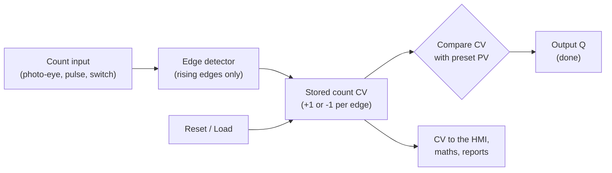

# 08 — Counters

> **Level:** 2 — Core programming · **Time:** ~7 hours (about half of it on the labs) · **Prerequisites:** [Module 06](../06-edges-and-one-shots/), [Module 07](../07-timers/)

Timers measure *how long*. Counters measure *how many*: bottles into a case, cars into a car
park, batches through a reactor, strokes of a valve, starts of a pump motor, pulses from a flow
meter, good and rejected packs in a shift. Some counts control the plant directly: stop the
infeed at 12 bottles, close the fill valve when 500 litres have gone through. Others are
information: production reports, yield, maintenance intervals. Either way somebody relies on
the number. A count that is out by one, restarts from zero after a power cut, or turns into a
negative number after three weeks is a real fault, and it is often found months later in a
report that does not add up.

This module covers the three IEC 61131-3 counters (`CTU`, `CTD`, `CTUD`) in detail, including
exactly what each input does and the limits the standard leaves to each vendor. It shows how
Rockwell and Siemens counters differ from the IEC ones. It then covers counting with plain
arithmetic, overflow and wrap-around, retentive counts, batch and shift totals, rates, and why
a scanned program cannot count fast pulses, which is where high-speed counter hardware comes in.

## Learning objectives

By the end of this module you will be able to:

- **Explain** what is inside every counter (an edge detector, a stored count and a comparison)
  and **draw** a scan-by-scan timing diagram of `CTU`, `CTD` and `CTUD`.
- **Use** `CTU`, `CTD` and `CTUD` correctly: choose between reset and load, and state what
  happens at the preset, at zero, and when two inputs act in the same scan.
- **Choose** a counter data type from the count rate and the required life, and **handle**
  overflow by saturating or by wrap-safe subtraction.
- **Write** a counter with `ADD` and an edge detector when a counter block is the wrong tool.
- **Design** batch counts, shift counts and lifetime totals: what resets them, what is retained,
  and how to take a snapshot of a shift before clearing it.
- **Calculate** a rate (items per minute) from a count, and explain the trade-off between
  resolution and response time.
- **Translate** counters between IEC, Rockwell (`CTU`/`CTD`/`RES`, `.ACC .PRE .DN .OV .UN`) and
  Siemens (IEC counters with instance data blocks).
- **Explain** why a scanned input cannot count fast pulses, and what a high-speed counter does
  instead.

## 1. What a counter is

### 1.1 Three parts

Every counter, in every PLC, is built from three simple parts:



1. **An edge detector** ([Module 06](../06-edges-and-one-shots/)). The counter reacts to the
   *moment* the input becomes TRUE, not to how long it stays TRUE. A carton that stops in front
   of the photo-eye for a minute is still one carton.
2. **A stored count**, the **current value** `CV` (Rockwell calls it the accumulated value,
   `.ACC`). It is an integer that keeps its value from one scan to the next and, if you make it
   retentive, through a power cut.
3. **A comparison** of the count with a **preset value** `PV` (Rockwell `.PRE`). The result is
   a BOOL output: `Q` in IEC, the done bit `.DN` in Rockwell.

That is all there is to it. The rest of this module is about the details that decide whether a
count can be trusted: which input wins, what happens at the limits, how big the integer is, what
happens at power-up, and how fast the pulses may come.

### 1.2 Counters on a real plant

| What is counted | Signal | What the count is used for |
|---|---|---|
| Bottles into a case, cartons onto a pallet | Photo-eye | Stop the infeed at the case size and index the case (Lab 08-1) |
| Cars in a car park, parts in a buffer | Detectors at the way in and the way out | Up/down count: "FULL" sign, stop the upstream machine (Lab 08-2, worked example 2) |
| Good and rejected packs | Photo-eyes after a checkweigher | Yield and the shift report (Lab 08-3) |
| Litres through a flow meter | Pulse output, for example one pulse per litre | Deliver a batch, keep a total (worked example 1) |
| Valve strokes, pump starts, breaker operations | Limit switch, run feedback | Maintenance intervals (worked example 3). Large motors also have a maximum number of starts per hour |
| Completed batches | A step of the batch sequence | Batch number, campaign count ([Module 13](../13-sequential-control/)) |
| Alarm occurrences | The alarm's rising edge | Finding "chattering" alarms ([Module 16](../16-alarms-and-diagnostics/)) |
| Encoder pulses | Two pulse channels, A and B | Position and speed. Needs a high-speed counter (section 14, [Module 19](../19-motion-and-drives/)) |

### 1.3 Counters and timers

Counters and timers look alike: both have a preset, a current value and a done output, and in
Rockwell ladder the `COUNTER` and `TIMER` data types even share the names `.PRE`, `.ACC` and
`.DN`. The difference is what makes the value change. A timer's value grows with time on every
scan while its input is on. A counter's value changes only when an **event** happens.

## 2. The up counter: CTU

### 2.1 Inputs and outputs

| Pin | Direction and type | Meaning |
|---|---|---|
| `CU` | input, BOOL | **Count up.** `CV` goes up by 1 on each rising edge of `CU` |
| `R` | input, BOOL | **Reset.** While `R` is TRUE, `CV` is 0. Level-sensitive, and it wins over `CU` |
| `PV` | input, INT | **Preset value**: the count at which `Q` comes on |
| `Q` | output, BOOL | TRUE while `CV >= PV` |
| `CV` | output, INT | **Current value**: the count |

A pallet takes 24 cartons. The photo-eye `CartonPE` sees each carton go onto the pallet, and the
operator presses `NewPalletPB` after putting an empty pallet in place:

```iecst
VAR
  PalletCtr : CTU;          (* an instance: this counter's own memory *)
END_VAR

PalletCtr(CU := CartonPE, R := NewPalletPB, PV := 24);   (* call it on EVERY scan *)
PalletFull := PalletCtr.Q;
CartonCount := PalletCtr.CV;
```

In Ladder or FBD the counter is a box. The instance name goes above it, and contacts from the
left rail feed its BOOL inputs:

```text
                     PalletCtr
                   +-----------+
      CartonPE     |    CTU    |                           PalletFull
 |-----] [---------|CU        Q|---------------------------( )-----|
 |                 |           |
 |    NewPalletPB  |           |
 |-----] [---------|R          |
 |                 |           |
 |            24 --|PV       CV|-- CartonCount
 |                 +-----------+
```

### 2.2 What it does, exactly

IEC 61131-3 defines `CTU` with a short piece of Structured Text. Here it is as an ordinary
function block that you can compile and study (renamed so that it does not clash with the real
`CTU`):

```iecst
FUNCTION_BLOCK FB_CountUp              (* behaves like the standard's CTU *)
  VAR_INPUT
    CU : BOOL;                         (* count input: counts on its rising edge *)
    R  : BOOL;                         (* reset: level-sensitive, wins over CU *)
    PV : INT;                          (* preset value *)
  END_VAR
  VAR_OUTPUT
    Q  : BOOL;                         (* TRUE while CV >= PV *)
    CV : INT;                          (* current value: the count *)
  END_VAR
  VAR
    CU_Edge : R_TRIG;                  (* every counter contains an edge detector *)
  END_VAR
  VAR CONSTANT
    PVmax : INT := 32767;              (* upper limit; its value is left to the implementation *)
  END_VAR

  CU_Edge(CLK := CU);                  (* called on every call, reset or not *)
  IF R THEN
    CV := 0;
  ELSIF CU_Edge.Q AND (CV < PVmax) THEN
    CV := CV + 1;
  END_IF;
  Q := (CV >= PV);
END_FUNCTION_BLOCK
```

Read it line by line, because each line is a rule you will rely on:

1. **Edge-triggered.** The standard declares `CU` as `CU : BOOL R_EDGE`, which means an edge
   detector is built in, shown here as `CU_Edge`. One count per FALSE → TRUE change of `CU`.
2. **The edge detector runs whether or not the counter is being reset.** While `R` is TRUE the
   edge memory still follows `CU`. So a carton that is standing in the beam when `R` is released
   is *not* counted as a new carton. That is usually exactly what you want.
3. **Reset wins.** `IF R ... ELSIF` means an edge that arrives in a scan in which `R` is TRUE is
   thrown away. While `R` is held, nothing is counted at all.
4. **`PV` only affects `Q`.** It does not stop the counting. In the standard, `CV` keeps
   counting past `PV` up to a limit that the standard calls `PVmax` and leaves to the
   implementation. Section 6 shows that platforms really do differ here.
5. **`Q` is a level, not a pulse.** It stays TRUE for as long as `CV >= PV`, until a reset.
   It is recalculated on every call, so changing `PV` changes `Q` at once.
6. **You cannot write `CV` from outside.** The only ways to change the count are counting and
   `R`. If you need to load a number, use `CTD` or `CTUD`, which have a load input.

The MATIEC library behind OpenPLC and `plctest` implements this code with one difference: it
writes `CV < PV` where the standard has `CV < PVmax`, so its `CTU` stops at `PV`.

### 2.3 Timing diagram

A `CTU` with `PV = 3` in a 10 ms task. Each column is one scan:

```text
Scan            1   2   3   4   5   6   7   8   9   10  11  12  13  14  15
                    +-------+   +---+   +---+   +---+       +-----------+
CU              ----+       +---+   +---+   +---+   +-------+           +---
                                                        +-------+
R               ----------------------------------------+       +-----------
                                        +---------------+
Q (CV >= 3)     ------------------------+               +-------------------
CV counts on    0   1   1   1   2   2   3   3   4   4   0   0   0   0   0
CV MATIEC       0   1   1   1   2   2   3   3   3   3   0   0   0   0   0
```

(Verified with `plctest`. The "counts on" row is the standard's behaviour with a large
`PVmax`, as on Siemens.)

- **Scans 2, 5, 7 and 9:** rising edges of `CU`, one count each. Scan 3 adds nothing because
  `CU` is still TRUE.
- **Scan 7:** `CV` reaches 3 and `Q` comes on in the same scan.
- **Scan 9:** a fourth edge. A counter that counts on goes to 4. MATIEC's stays at 3. `Q` is TRUE
  either way.
- **Scan 11:** `R` is TRUE, so `CV` is 0 and `Q` goes off.
- **Scan 12:** `CU` rises while `R` is still TRUE. The edge is thrown away.
- **Scan 13:** `R` has gone, but `CU` is still TRUE. There is no new edge, so there is no count.

## 3. The down counter: CTD

### 3.1 Inputs and outputs

| Pin | Direction and type | Meaning |
|---|---|---|
| `CD` | input, BOOL | **Count down.** `CV` goes down by 1 on each rising edge |
| `LD` | input, BOOL | **Load.** While `LD` is TRUE, `CV` is `PV`. Level-sensitive, and it wins over `CD` |
| `PV` | input, INT | **Preset value**: the number loaded by `LD` |
| `Q` | output, BOOL | TRUE while `CV <= 0` |
| `CV` | output, INT | Current value |

A down counter answers "how many are still to come?". You load the number you want, each event
takes one off, and `Q` comes on at zero. The standard's code is the mirror image of `CTU`:

```iecst
CD_Edge(CLK := CD);
IF LD THEN
  CV := PV;
ELSIF CD_Edge.Q AND (CV > PVmin) THEN   (* PVmin: left to the implementation *)
  CV := CV - 1;
END_IF;
Q := (CV <= 0);
```

### 3.2 Timing diagram

`PV = 3`:

```text
Scan               1   2   3   4   5   6   7   8   9  10  11
CD                 0   0   0   1   0   1   0   1   0   1   0
LD                 0   1   0   0   0   0   0   0   0   0   0
CV (counts on)     0   3   3   2   2   1   1   0   0  -1  -1
CV (MATIEC)        0   3   3   2   2   1   1   0   0   0   0
Q  (CV <= 0)       1   0   0   0   0   0   0   1   1   1   1
```

Three things to notice:

- **`Q` is TRUE at power-up.** Before the first load, `CV` is 0, so `Q` = `CV <= 0` is TRUE. If
  `Q` means "batch complete", the batch is complete before it has started. Worked example 1
  shows how to avoid this.
- **`PV` is read only while `LD` is TRUE.** Changing `PV` afterwards does not change `CV`
  (verified). That is useful, because an operator who edits the batch size in the middle of a
  batch does not upset the batch in progress.
- **Below zero** (scan 10), implementations differ again: MATIEC stops at 0, while Siemens
  counts on down to the lowest value of the data type, so a signed counter goes negative.
  `Q` is TRUE in both cases.

## 4. The up/down counter: CTUD

### 4.1 Inputs and outputs

| Pin | Direction and type | Meaning |
|---|---|---|
| `CU` | input, BOOL | Count up on each rising edge |
| `CD` | input, BOOL | Count down on each rising edge |
| `R` | input, BOOL | Reset: `CV` is 0 while TRUE. Wins over everything else |
| `LD` | input, BOOL | Load: `CV` is `PV` while TRUE. Wins over counting |
| `PV` | input, INT | The comparison value for `QU` **and** the value that `LD` loads |
| `QU` | output, BOOL | TRUE while `CV >= PV` |
| `QD` | output, BOOL | TRUE while `CV <= 0` |
| `CV` | output, INT | Current value |

Use it wherever things go in and come out: parts in a buffer, cartons in a magazine, vehicles in
a car park, jobs in a queue. The standard's code, with both edge detectors called on every scan
before this:

```iecst
IF R THEN
  CV := 0;
ELSIF LD THEN
  CV := PV;
ELSE
  IF NOT (CU_Edge.Q AND CD_Edge.Q) THEN     (* one in and one out: no change *)
    IF CU_Edge.Q AND (CV < PVmax) THEN
      CV := CV + 1;
    ELSIF CD_Edge.Q AND (CV > PVmin) THEN
      CV := CV - 1;
    END_IF;
  END_IF;
END_IF;
QU := (CV >= PV);
QD := (CV <= 0);
```

- **Priority:** `R` first, then `LD`, then counting.
- **Simultaneous edges:** an up edge and a down edge in the same scan cancel out. For "one in,
  one out" that is the right answer.
- **`PV` does two jobs**: it is the comparison value for `QU` and the number `LD` loads. That is
  awkward when you want to load a hand count but compare with a capacity. Section 6.3 shows the
  way round it.

### 4.2 Timing diagram

A small buffer with `PV = 2` (`QU` = "buffer full"):

```text
Scan               1   2   3   4   5   6   7   8   9  10  11  12
CU (part in)       0   1   0   1   0   1   0   0   1   0   0   0
CD (part out)      0   0   0   0   0   0   1   0   1   0   1   0
CV (counts on)     0   1   1   2   2   3   2   2   2   2   1   1
QU (counts on)     0   0   0   1   1   1   1   1   1   1   0   0
CV (MATIEC)        0   1   1   2   2   2   1   1   1   1   0   0
QU (MATIEC)        0   0   0   1   1   1   0   0   0   0   0   0
QD (MATIEC)        1   0   0   0   0   0   0   0   0   0   1   1
```

Scan 6 is a third part arriving at a buffer rated for two (someone overrode the "full" signal).
A counter that counts on records 3. MATIEC's `CTUD` stops at `PV` and records 2. From then on the
MATIEC count is one lower than the real number of parts: at scan 7 the buffer still holds two
parts but `QU` says "not full", and at scan 11 `QD` says "empty" while one part is still inside.
In scan 9 a part goes in and another comes out, and both counters stay where they were.
(All rows verified with `plctest`.)

## 5. Reset, load and preset

| | `R` (reset: `CTU`, `CTUD`) | `LD` (load: `CTD`, `CTUD`) |
|---|---|---|
| Sets `CV` to | 0 | `PV` |
| Sensitivity | Level: for as long as it is TRUE | Level: for as long as it is TRUE |
| Priority | Wins over counting, and over `LD` in `CTUD` | Wins over counting |
| Typical use | Start a new count: a new pallet, a new shift | Start a count-down: load the batch size; load a hand count |

Rules that follow from this:

- **While reset or load is held, the count is frozen and events are lost.** A reset from a
  push-button can be held for seconds, or jammed. Either stop the process while it is held
  (Lab 08-1 stops the infeed) or make the reset act on the *press*, an edge (Lab 08-3).
- **An event in the same scan as a reset is lost.** The reset wins. For a production counter
  that must never lose a pack, do the reset first and the counting afterwards, with `ADD`
  (section 9).
- **Changing `PV` takes effect at once** on `Q`/`QU`, and never changes `CV` (except through
  `LD`). Lowering `PV` below the count turns `Q` on immediately. In MATIEC the counter then
  stops counting until `PV` is raised again, because its `CV < PV` test fails (verified).
- **"Preset" is used loosely.** In IEC and Rockwell it is the value `PV`/`.PRE`. Some older
  documents use "preset the counter" to mean *load* it. Check which one is meant.

### 5.1 The self-resetting counter

Wiring a counter's own output to its reset is a common shortcut:

```iecst
PartCtr(CU := PartPE, R := PartCtr.Q, PV := 3);   (* resets itself one scan after reaching 3 *)
```

`R` reads `Q` as it was left by the *previous* call, so the reset happens one scan late:

```text
Scan                  1   2   3   4   5   6   7   8   9
CU                    0   1   0   1   0   1   0   1   0
R (= last scan's Q)   0   0   0   0   0   0   1   0   0
CV                    0   1   1   2   2   3   0   1   1
Q                     0   0   0   0   0   1   0   0   0
```

It counts correctly: a new edge can never arrive in the reset scan, because `CU` must go FALSE
first. But `CV` shows 3 for one scan only, and `Q` is a one-scan pulse. The HMI will almost
never show "3 of 3", and a slower task can miss the pulse completely
([Module 06](../06-edges-and-one-shots/), section 7.5). Use it only when the one-scan pulse is
consumed in the same task, straight after the call. Lab 08-1 shows a sturdier pattern with a
`TP`.

## 6. Counting past the preset, and the limits

### 6.1 What the standard says, and what the platforms do

The standard lets `CTU` count up to `PVmax` and `CTD` down to `PVmin`, and states that the
numerical values of these limits are implementation-dependent. The platforms have chosen
differently:

| Platform | Up counting after `CV` reaches `PV` | Down counting below 0 |
|---|---|---|
| IEC 61131-3 (the standard's text) | Continues up to `PVmax` (implementation-dependent) | Continues down to `PVmin` (implementation-dependent) |
| MATIEC: OpenPLC and `plctest` | **Stops at `PV`** (`CTU`, `CTUD`; verified) | **Stops at 0** (`CTD`, `CTUD`; verified) |
| Siemens S7-1200/1500 IEC counters | Continues up to the highest value of the chosen data type, then stops there (no wrap) | Continues down to the lowest value of the data type (negative for signed types), then stops |
| Rockwell Logix `CTU`/`CTD` | Continues. At 2,147,483,647 it wraps to −2,147,483,648 and sets `.OV` | Continues below 0. At −2,147,483,648 it wraps to +2,147,483,647 and sets `.UN` |
| CODESYS Standard library | `PV` and `CV` are `WORD` (0 to 65,535). Check the library documentation, or test, before relying on behaviour past `PV` | `CV` is an unsigned `WORD`, so it can never be negative: check whether it stops at 0 |

### 6.2 What this means for your code

1. **`Q` behaves the same everywhere**, because `Q = CV >= PV` holds whether or not the count
   goes on. A program that only uses `Q` is portable.
2. **A program that uses `CV` beyond `PV` is not.** Examples: a car park that is over-full
   because drivers ignored the sign, a buffer that someone overfilled by hand, or "how many past
   the target did we make?". Such a count is right on Siemens and wrong on MATIEC.
3. **Never rely on the block to stop at zero.** MATIEC stops, while Siemens (signed types) and
   Rockwell go negative. If "never below zero" matters, write the limit yourself.
4. **Portable fix:** make the counter's own limit irrelevant. Give it a `PV` at the top of its
   range and do your own comparison, or count with `ADD` (section 9) and write every limit
   explicitly.

### 6.3 Loading a value without limiting the count (MATIEC)

In MATIEC, `CTUD` uses `PV` both as the load value and as the upper counting limit. To load an
arbitrary number and still count freely, give `PV` the load value only while loading:

```iecst
IF LoadPB THEN
  CtrPV := LoadValue;          (* LD copies PV into CV *)
ELSE
  CtrPV := 32767;              (* otherwise: let it count up to the INT maximum *)
END_IF;
Stock(CU := InPE, CD := OutPE, R := FALSE, LD := LoadPB, PV := CtrPV);
StockFull := Stock.CV >= Capacity;   (* compare with the capacity yourself *)
```

It works, but it is a trick that needs a comment, and the next person to read the code may not
be expecting it. Counting with `ADD` is often clearer.

## 7. Typed counters and choosing a size

The basic `CTU`, `CTD` and `CTUD` count in `INT`, whose maximum is 32,767. That is smaller than
people expect:

| Data type | Largest count | Time to reach it at 10 counts per second |
|---|---|---|
| `INT` | 32,767 | about 55 minutes |
| `UINT` / `WORD` | 65,535 | about 1.8 hours |
| `DINT` | 2,147,483,647 | about 6.8 years |
| `UDINT` | 4,294,967,295 | about 13.6 years |
| `LINT` | about 9.2 × 10^18 | billions of years |

Ten counts per second is a modest packaging line (600 per minute). A starts counter on a pump
that starts once a minute overflows an `INT` in under 23 days.

**Typed variants.** Most tools offer counters with bigger types. MATIEC (OpenPLC, `plctest`)
provides `_DINT`, `_LINT`, `_UDINT` and `_ULINT` versions of all three: `CTU_DINT`,
`CTD_UDINT`, `CTUD_LINT` and so on. The plain names are the `INT` versions. They work exactly
like the `INT` versions with a wider `PV` and `CV`:

```iecst
VAR
  LifeCtr : CTU_DINT;   (* PV and CV are DINT *)
END_VAR

LifeCtr(CU := CyclePE, R := FALSE, PV := 1000000);   (* Q: one million cycles reached *)
```

On MATIEC this counter's `CV` stops at 1,000,000, because MATIEC stops counting at `PV`
(section 6). That is fine for "tell me when a million cycles are reached", but not for a
lifetime count that must go on. For that, use `ADD` (section 9) or a `PV` at the top of the
type's range.

Siemens lets you choose the type on the counter box itself. Rockwell Logix counters are always
`DINT`. The older SLC 500 and MicroLogix counters are 16-bit. The CODESYS Standard library
counters use `WORD`.

**Choosing:** estimate the highest rate and the longest time the count must run without a
reset, multiply, and add a large margin. For anything called "total" or "lifetime", use `DINT`,
`UDINT` or larger. If you later divide the count as a `REAL` (a yield, a rate), remember that a
`REAL` holds integers exactly only up to 16,777,216 (2^24). That is fine for a percentage, but
not for displaying a large total ([Module 09](../09-math-and-data-handling/)).

## 8. Edge-triggered: the consequences

Because a counter contains an edge detector, everything in
[Module 06](../06-edges-and-one-shots/) applies:

- **It counts events, not time.** A carton stuck in the beam is one carton.
- **The input must go FALSE between two counts.** Two cartons touching each other with no gap
  block the beam continuously and count as one. This is a mechanical problem: space the
  products out (a faster take-away belt, for example), or position or choose the sensor so that
  it sees a gap.
- **Pulses on consecutive scans count once.** If you feed `CU` from another one-scan pulse, such
  as an `R_TRIG` output, two pulses in a row look like one long TRUE. Feed the raw signal into
  `CU`, or count the pulses with `ADD`.
- **Call the counter on every scan.** A counter skipped inside an `IF` or a `CASE` branch does
  not see the input change. When it is called again, it compares with a stale edge memory. In a
  `plctest` check, a counter that was not called when a button was pressed counted that press
  as soon as it was called again, with the button still held: a *phantom count*. A press that
  starts and ends while the counter is not being called is *missed*.
- **First call.** In MATIEC, a `CTU` whose `CU` is already TRUE on its very first call counts 1,
  because its internal `R_TRIG` fires (verified). Rockwell's prescan sets the counter's `.CU`
  bit, so a rung that is already true at start-up does not count. If power-up behaviour
  matters, decide it yourself with a first-scan flag
  ([Module 06](../06-edges-and-one-shots/), section 6).
- **Contact bounce.** A mechanical switch (a limit switch, a relay contact) can bounce and give
  several edges per operation. Photo-eyes and proximity switches do not bounce, but a label
  flapping in the beam can. Debounce with a timer ([Module 07](../07-timers/)) or the input
  filter.
- **Speed.** The input must be seen TRUE in at least one scan and FALSE in at least one scan
  between counts. Section 14 covers what to do when pulses are faster than that.

## 9. Counting with ADD instead of a counter block

A counter is an edge detector plus an addition. You can write it yourself:

```iecst
PartIn(CLK := PartPE);          (* R_TRIG, called on every scan *)
IF ResetPB THEN
  PartCount := 0;
ELSIF PartIn.Q THEN
  PartCount := PartCount + 1;
END_IF;
```

That is a `CTU` without a `Q`. Reasons to prefer it:

- **No preset is needed.** Totals just count.
- **Any type** (`DINT`, `UDINT`, `LINT`) on every platform, with no dependence on which typed
  counters a library provides.
- **Add more than one.** A case of 24 counted as 24 bottles, or several pulses read from a
  high-speed counter in one scan.
- **Your own limits.** Saturate at the maximum, never go below zero, allow counting above
  capacity: each one written down and visible.
- **Your own order.** Reset first and count afterwards, and a count in the reset scan is not
  lost (Lab 08-3).
- **Keep the remainder** when a batch completes, so that nothing that arrived at the same time
  is lost:

  ```iecst
  IF PartIn.Q THEN
    InBatch := InBatch + 1;
  END_IF;
  IF InBatch >= BatchSize THEN
    InBatch := InBatch - BatchSize;   (* keep anything past the batch size *)
    BatchesDone := BatchesDone + 1;
  END_IF;
  ```

In Rockwell ladder the same thing is a one-shot followed by an `ADD`:
`XIC(PartPE)ONS(PartPE_ONS)ADD(PartCount,1,PartCount);`. In Siemens LAD it is a `-|P|-`
contact followed by an `INC` (increment) box, or `"PartCount" := "PartCount" + 1;` in SCL
after an edge.

Use a counter block when the job really is "count to a preset and give a done signal", above
all in Ladder that maintenance technicians will read. They recognise a `CTU` at a glance.

## 10. Overflow and wrap-around

### 10.1 Integers wrap

PLC integers have a fixed number of bits. Add 1 to the largest value and the result usually
**wraps round** to the smallest ([Module 03](../03-data-types-and-addressing/) explains two's
complement):

| Operation | Result (verified with `plctest`) |
|---|---|
| `INT` 32767 + 1 | −32768 |
| `DINT` 2147483647 + 1 | −2147483648 |
| `UINT` 0 − 1 | 65535 |

Most PLCs do this silently, although some also set a status flag. A production counter that
suddenly shows −32,768 is a classic three-weeks-after-commissioning phone call.
[Module 09](../09-math-and-data-handling/) covers overflow in arithmetic generally.

### 10.2 Three ways to deal with it

1. **Use a type big enough for the life of the count** (section 7). This is the first choice.
2. **Saturate:** stop at the maximum instead of wrapping. A saturated total is visibly stuck,
   which is far better than a total that has quietly jumped to a negative number:

   ```iecst
   IF PartIn.Q AND Total < 32767 THEN   (* INT maximum: sticks there, never wraps *)
     Total := Total + 1;
   END_IF;
   ```

3. **Let it wrap on purpose and only ever use differences.** With an **unsigned** type,
   subtraction wraps too, and the difference between two readings is right even if the counter
   wrapped between them. In `UDINT`, 5 − 4,294,967,290 = 11 (verified). That is exactly the
   number of counts from 4,294,967,290 to 5 across the wrap. This is how you read a free-running
   hardware counter or compute a rate (section 13, worked example 4). It only fails if a full
   turn of the counter or more (2^32 counts for `UDINT`) happens between two readings.

Rockwell counters wrap and set `.OV` (overflow) or `.UN` (underflow). A `RES` instruction clears
the count and the status bits.

## 11. Retentive counts across power loss

Normal variables go back to their initial values when the PLC restarts. **Retentive** variables
keep their values through a power failure ([Module 03](../03-data-types-and-addressing/),
section 7). For counts, decide one by one:

| Count | Retain? | Why |
|---|---|---|
| Lifetime totals, maintenance counters | Yes | Losing them defeats their purpose |
| Shift and order counts | Yes | The shift report must survive a power dip |
| Cars in a car park, parts in a buffer | Yes | The cars are still there when the power comes back |
| Bottles in the case being filled | Usually yes | The case still holds 7 bottles, but someone may have emptied it during the outage: give the operator a reset or preset |
| A count that starts equipment when it reaches a value | Think carefully | Nothing may start by itself when the power returns |

How to do it:

- In IEC 61131-3, declare the count, or the counter instance itself, in a `VAR RETAIN` block.
  Both compile in MATIEC. Retaining the instance normally retains its internal edge memory
  as well.
- **Siemens:** set the counter's instance data, or the variable holding the count, to *Retain*.
- **Rockwell Logix:** tag values, including a counter's `.ACC`, are kept through a power cycle.
  Your program decides what start-up means (`S:FS`, the first-scan flag).
- **OpenPLC:** `VAR RETAIN` compiles. What the runtime actually saves depends on its
  persistent-storage settings, so check its documentation. `plctest` always starts each
  scenario cold.

Three warnings. Events that happen while the PLC is off are lost, so a retained count is only
as good as the plant's behaviour during the outage. Downloading a changed program or doing a
cold restart can re-initialise retentive data on some platforms. And the PLC should not be the
only record: log production counts to the HMI, SCADA or historian
([Module 18](../18-hmi-and-scada/)). For fiscal or custody-transfer quantities the reference is
the meter's own certified totaliser, not the PLC count.

## 12. Batch counting, production and shift totals

### 12.1 Batch counting: count to N, act, start again

Batch counting sounds trivial until you ask three questions:

1. **When does the next batch start counting?** Straight away, because items keep coming (keep
   the remainder, section 9)? Or after an action, because the feed stops while the full batch
   is moved away (reset when the action ends, as in Lab 08-1)?
2. **What happens to an item that arrives during the action?** Is it ignored (hold the counter
   in reset), counted into the next batch, or an alarm?
3. **What does a manual reset do?** Just clear the count, or also stop the feed while it is
   held so that nothing goes into the batch uncounted?

Write the answers into the specification before you write code. They are the requirements of
Lab 08-1.

### 12.2 A hierarchy of totals

| Total | Reset by | Retained | Example |
|---|---|---|---|
| Batch or case count | The program, at every batch | Usually | Bottles in this case |
| Order or lot count | The operator, at an order change | Yes | Cases for order 4711 |
| Shift count | Shift change (button or clock) | Yes | Good and rejected packs this shift |
| Daily or weekly total | Clock, often done in the historian | Yes | Output per day |
| Lifetime total | Never, or only by authorised maintenance, logged | Yes | Machine cycles, valve strokes |

This is a car's trip meter and its odometer. The trip meter is **resettable**: anyone can zero
it, and its value means "since the last reset". The odometer is **non-resettable**, and that is
why people trust it. Process plant has the same pair. A flow totaliser (the `FQ` in a tag such
as `FQI-301`: in ISA-5.1 the letter `Q` after the first letter means "integrate or totalise")
may be a batch totaliser that is zeroed at the start of every batch, or a non-resettable total
kept for accounting. When you design an HMI, never put a reset button on a total that someone
else relies on as an odometer.

### 12.3 A shift change done properly

At a shift change the finished shift's figures must be kept for the report and the new shift
must start from zero. Five rules:

1. **Act on the edge** of the shift-change signal (a button, or a clock time reached). If you
   act on the level, holding the button for two seconds repeats the shift change 200 times (with
   a 10 ms scan), and the second one copies the fresh zeros over the snapshot.
2. **Snapshot first, then clear, in the same scan**: `LastShiftGood := GoodCount;` and only then
   `GoodCount := 0;`.
3. **Don't lose production.** The line does not stop for a shift change. Clear first and count
   afterwards in the same scan, so a pack that arrives in that scan counts in the new shift. A
   `CTU` cannot do this, because its reset wins over its count input (section 5).
4. **Calculate the yield as a `REAL`, and convert before dividing.** With integers, 2 / 3 = 0.
   `100.0 * DINT_TO_REAL(Good) / DINT_TO_REAL(Total)` gives 66.67.
5. **Never divide by zero.** At power-up and straight after a shift change the total is 0. A
   `REAL` division by zero gives infinity or "not a number" (NaN), which `plctest` prints as
   `-nan` and an HMI may show as garbage or an error. An **integer** division by zero is worse:
   depending on the platform it can stop the CPU with a fault or return a meaningless value.
   Test the divisor first.

A yield calculated from very few items means little: a single reject in the first pack of a
shift is a yield of 0 %. Alarms on ratios need a minimum sample size. Lab 08-3 has exactly
these requirements.

## 13. Rate from counts over time

"How many per minute?" is a count divided by a time. There are three common ways to calculate
it.

**1. Count per window.** Every T seconds, take the difference of a free-running total since
the last sample, then scale: rate per minute = difference × 60 / T. This is simple and robust,
and worked example 4 does it. The catch is **resolution**. With a 10 s window, one item more or
less changes the result by 6 per minute. A line making 45 per minute produces 7 or 8 items per
window, so the display alternates between 42 and 48. A longer window gives finer resolution but
a slower response:

| Window | Resolution | New value every |
|---|---|---|
| 10 s | 6 per minute | 10 s |
| 60 s | 1 per minute | 60 s |

**2. Moving window.** Keep the last N window counts in an array (for example six 10 s windows)
and add them up. The display updates every 10 s but covers a full minute. Arrays and ring
buffers are in [Module 12](../12-data-structures/).

**3. Period measurement.** Measure the time *between* pulses: rate = 60 / period in seconds.
This is the best method for slow pulses, such as a flow meter that gives one pulse every few
seconds, where counting in a window would give a very coarse answer. High-speed counter modules
often offer frequency and period measurement in hardware.

**Flow meters with pulse outputs** have a **K-factor**, the number of pulses per unit of volume.
With K = 10 pulses per litre, 1,200 pulses in 60 s is 1,200 / 10 = 120 litres per minute, and
the total volume is the pulse count divided by K. Keep the pulse total as an integer, and convert
to litres only for display. A `REAL` total that has a small increment added to it again and
again eventually stops growing, because the increment is lost in rounding
([Module 09](../09-math-and-data-handling/)).

## 14. Fast pulses and high-speed counters

### 14.1 Why the scan cannot keep up

A counter in the program sees the input once per scan ([Module 06](../06-edges-and-one-shots/),
section 1.4). To count a pulse, the program must see the input TRUE in at least one scan, and
FALSE in at least one scan before the next pulse. So a scanned counter can **never** count
faster than one pulse every two scans, and in practice it needs a good margin on top of that:
scan times vary, and the input module's filter delays and swallows short pulses.

| Scan time | Absolute ceiling (one pulse per two scans) |
|---|---|
| 1 ms | 500 pulses per second |
| 10 ms | 50 pulses per second |
| 50 ms | 10 pulses per second |

Now compare some real signals:

- An encoder with 1,000 pulses per revolution on a shaft at 1,500 rpm gives
  1,000 × 1,500 / 60 = **25,000 pulses per second**.
- A turbine flow meter at full flow can give hundreds or thousands of pulses per second.
- A bottle line at 600 bottles per minute is only 10 per second, but if each bottle blocks the
  beam for 15 ms, a 20 ms scan misses many of them.

**Missed pulses are silent.** Nothing faults. The count is simply too low, typically fine at low
speed and drifting low at high speed, or disagreeing with the flow meter's own display.

### 14.2 What a high-speed counter does

A **high-speed counter (HSC)** is counting hardware, built into the CPU or on an I/O module. It
counts at the input terminals, independently of the scan, far faster than any program could.
The program reads the current count whenever it likes, just like reading an input. Typical
features:

- **Direction**: a separate direction input, or two channels A and B in **quadrature** (90°
  apart) so the counter can tell forwards from backwards. Encoders work this way, and
  [Module 19](../19-motion-and-drives/) covers them.
- **Reset, gate and capture inputs**: zero the count on a reference mark, count only while a
  gate signal is on, or latch the count at the exact instant an external signal arrives.
- **Compare outputs** that switch a hardware output directly when the count reaches a set
  value, with no scan delay. A cut-to-length machine, for example, fires its knife this way.
- **Frequency or period measurement** modes (section 13).
- **Configurable input filters.** A filter set for push-buttons swallows kilohertz pulses, so
  the filter must suit the signal.

Two programming rules for HSC values:

- **The count can jump by many counts between two scans.** Test with `>=`, never `=`.
  `IF HscCount = 5000 THEN` misses the moment the count goes from 4,998 to 5,003 between two
  scans.
- **Treat the count as a free-running value that wraps**, and work with differences in an
  unsigned type (section 10.2).

### 14.3 Other options

- **A faster task** ([Module 11](../11-program-organization/)) for pulses that are only a little
  too fast for the main task.
- **Hardware interrupts / event tasks**, where the controller runs a short routine on each
  input edge. Use them sparingly, because every pulse costs CPU time.
- **Change the signal.** Many flow meters can be configured for fewer pulses per unit, or a
  longer pulse width. Some sensors have a built-in off-delay that stretches short pulses.

The vendor notes list the HSC hardware on common platforms. [Module 19](../19-motion-and-drives/)
builds on this for position and speed.

## Worked examples

### Worked example 1: batch filling with a flow-meter pulse count (CTD)

A tank is filled with a set volume of water. The flow meter FQ-301 has a pulse output of one
pulse per litre. At the full flow of 200 litres per minute that is about 3.3 pulses per second,
slow enough for a scanned input, provided each pulse and each gap lasts several scans (check the
meter's pulse-width setting, section 14). The operator enters the batch size on the HMI and presses
Start. The fill valve XV-301 opens, and closes when the batch has been delivered.

```iecst
PROGRAM BatchFill
  VAR (* I/O *)
    StartPB   AT %IX0.0 : BOOL;  (* Start batch push-button, NO *)
    StopPB_NC AT %IX0.1 : BOOL;  (* Stop push-button, NC: TRUE while not pressed *)
    FQ301     AT %IX0.2 : BOOL;  (* FQ-301 flow meter pulse output: one pulse per litre *)
    XV301     AT %QX0.0 : BOOL;  (* XV-301 fill valve, energise to open *)
    DoneLamp  AT %QX0.1 : BOOL;  (* "Batch complete" lamp *)
  END_VAR
  VAR
    BatchLitres : INT := 500;    (* batch size from the HMI: litres = pulses *)
    LitresLeft  : INT;           (* HMI display: litres still to deliver *)
    StartEdge   : R_TRIG;
    StartOK     : BOOL;          (* a valid start request, this scan only *)
    ToGo        : CTD;           (* counts the batch down to zero *)
    Filling     : BOOL;
  END_VAR

  StartEdge(CLK := StartPB);
  StartOK := StartEdge.Q AND NOT Filling AND StopPB_NC AND (BatchLitres > 0);

  (* LD loads the batch size, for one scan, when a batch starts. After that
     every flow-meter pulse counts one litre off. *)
  ToGo(CD := FQ301, LD := StartOK, PV := BatchLitres);
  LitresLeft := ToGo.CV;

  IF StartOK THEN
    Filling := TRUE;
    DoneLamp := FALSE;
  ELSIF Filling AND ToGo.Q THEN     (* counted down to zero: batch complete *)
    Filling := FALSE;
    DoneLamp := TRUE;
  ELSIF NOT StopPB_NC THEN          (* stopped: LitresLeft shows what is still owed *)
    Filling := FALSE;
  END_IF;

  XV301 := Filling;
END_PROGRAM
```

What happens (checked with `plctest`, using a 5-litre batch):

- **Power-up.** `ToGo.CV` is 0, so `ToGo.Q` is already TRUE. That is why the valve logic uses a
  `Filling` state and does not treat `ToGo.Q` alone as "batch complete". The valve stays shut
  and the lamp stays off.
- **Start.** In the scan of the press, `LD` loads 5, `CV` becomes 5 and `Q` goes FALSE. Only
  then does `Filling` go TRUE, and the valve opens in the same scan.
- **Filling.** Each pulse takes one litre off `LitresLeft`. On the fifth pulse `CV` reaches 0,
  `Q` comes on, and the valve closes **in the same scan** as the last pulse. The lamp comes on.
- **Stop during filling.** The valve closes, and `LitresLeft` shows how much is still owed. A
  new Start loads a full new batch. A real system would also offer "resume".

A real filling controller would also close the valve a little early to allow for the water
still in flight between the valve and the tank (often called "preact" or in-flight
compensation), and would watch for a missing flow signal: a valve that is open with no pulses
for a few seconds is a fault ([Module 07](../07-timers/), feedback timeouts).

### Worked example 2: translating a Rockwell shared up/down counter

A buffer conveyor between a filler and a capper holds up to 20 bottles. A photo-eye counts
bottles in and another counts bottles out. When the buffer is full the filler must stop.
Rockwell programmers make an up/down counter from a `CTU` and a `CTD` that share **one**
`COUNTER` tag:

```text
      InfeedPE                                  +-CTU-----------------+
 |-----] [--------------------------------------+ Count Up            +-(CU)-
 |                                              | Counter  BufferCtr  +-(DN)-
 |                                              | Preset          20  |
 |                                              | Accum            0  |
 |                                              +---------------------+
 |
 |      OutfeedPE                               +-CTD-----------------+
 |-----] [--------------------------------------+ Count Down          +-(CD)-
 |                                              | Counter  BufferCtr  +-(DN)-
 |                                              | Preset          20  |
 |                                              | Accum            0  |
 |                                              +---------------------+
 |
 |      BufferCtr.DN                                          FillerStop
 |-----] [----------------------------------------------------( )-------|
 |
 |      ClearPB                                               BufferCtr
 |-----] [----------------------------------------------------(RES)-----|
```

Rung text:

```text
XIC(InfeedPE)CTU(BufferCtr,20,0);
XIC(OutfeedPE)CTD(BufferCtr,20,0);
XIC(BufferCtr.DN)OTE(FillerStop);
XIC(ClearPB)RES(BufferCtr);
```

Why it works: the `COUNTER` structure has a separate edge-memory bit for each instruction. `.CU`
remembers the `CTU` rung and `.CD` remembers the `CTD` rung, so both instructions can act on the
same `.ACC` without interfering. `.DN` is TRUE whenever `.ACC >= .PRE`, whichever instruction
changed the count.

The direct IEC translation is a single `CTUD`:

```iecst
BufferCtr(CU := InfeedPE, CD := OutfeedPE, R := ClearPB, LD := FALSE, PV := 20);
FillerStop := BufferCtr.QU;
```

The translation is **not exact**, and the differences are the ones this module has been about:

| Situation | Rockwell `CTU`/`CTD` | IEC `CTUD` (MATIEC) |
|---|---|---|
| A 21st bottle is pushed on by hand | `.ACC` = 21, `.DN` stays on | `CV` stays 20: one bottle is lost from the count |
| The count is 0 and a bottle put on by hand, past the infeed eye, is counted out | `.ACC` goes to −1 | `CV` stops at 0 |
| A bottle in and one out in the same scan | +1 on one rung, −1 on the next: no change | Simultaneous edges: no change |
| `ClearPB` is released while a bottle still blocks the infeed eye | `RES` also clears `.CU`, so the `CTU` sees its true rung as a new transition and counts that bottle: `.ACC` = 1 | The edge memory kept following the eye during `R`: not counted, `CV` = 0 |
| Power cycle | `.ACC` is kept | Only if the instance is `RETAIN` |

For a faithful translation on MATIEC, count with `ADD` and decide the limits explicitly, or use
the `PV` trick from section 6.3 with your own comparison against 20. Lab 08-2 is this problem
in car-park form. In Logix Structured Text and FBD there is also a separate `CTUD` instruction,
with an `FBD_COUNTER` tag and inputs `CUEnable` and `CDEnable`, instead of `CTU` and `CTD`.

### Worked example 3: a valve stroke counter with lifetime and since-service totals

On-off valves wear with use, and the maintenance plan for XV-101 says "service every 50,000
strokes". The program keeps two counts from the closed limit switch ZSC-101: a lifetime count
that is never reset, and a since-service count that the maintenance technician resets with a key
switch after servicing the valve.

```iecst
PROGRAM ValveStrokes
  VAR (* I/O *)
    XV101_ZSC   AT %IX0.0 : BOOL;  (* XV-101 closed limit switch ZSC-101: TRUE when fully closed *)
    ServiceKey  AT %IX0.1 : BOOL;  (* maintenance key switch "valve serviced", NO *)
    ServiceLamp AT %QX0.0 : BOOL;  (* "XV-101 service due" lamp *)
  END_VAR
  VAR RETAIN
    LifetimeStrokes     : UDINT;   (* never reset: the valve's history *)
    StrokesSinceService : UDINT;   (* cleared when the valve has been serviced *)
  END_VAR
  VAR
    ServiceInterval : UDINT := 50000;  (* strokes between services, from the maintenance plan *)
    Closed    : R_TRIG;            (* one stroke = one arrival at the closed position *)
    KeyEdge   : R_TRIG;
    Started   : BOOL;              (* not RETAIN: FALSE after every power-up *)
    FirstScan : BOOL;
  END_VAR
  VAR CONSTANT
    UDINT_MAX : UDINT := 4294967295;   (* 2^32 - 1 *)
  END_VAR

  FirstScan := NOT Started;
  Started := TRUE;

  Closed(CLK := XV101_ZSC);
  KeyEdge(CLK := ServiceKey);

  (* A valve that is already closed at power-up has not just made a stroke. *)
  IF Closed.Q AND NOT FirstScan THEN
    IF LifetimeStrokes < UDINT_MAX THEN          (* saturate: never wrap to 0 *)
      LifetimeStrokes := LifetimeStrokes + 1;
    END_IF;
    IF StrokesSinceService < UDINT_MAX THEN
      StrokesSinceService := StrokesSinceService + 1;
    END_IF;
  END_IF;

  (* A key switch left in the "serviced" position through a power cut has
     not just been turned. Without the mask, the power-up would wipe the
     retained since-service count. *)
  IF KeyEdge.Q AND NOT FirstScan THEN
    StrokesSinceService := 0;      (* the lifetime count is not touched *)
  END_IF;

  ServiceLamp := StrokesSinceService >= ServiceInterval;
END_PROGRAM
```

Points to notice (checked with `plctest`):

- **What is a stroke?** One arrival at the closed position, a rising edge of ZSC-101. Counting
  both edges would give two per stroke.
- **First scan.** An `R_TRIG` fires on its first call if its input is already TRUE at
  power-up (MATIEC). That applies to *both* edges here. The `NOT FirstScan` mask on `Closed`
  stops a power cut from adding a stroke. The mask on `KeyEdge` matters even more: without it,
  a key switch left turned through a power cut would clear the retained since-service count
  at power-up, and the valve's service history would be lost without anyone touching the key.
- **Types.** `UDINT` at one stroke per minute lasts about 8,000 years, so the saturation is only
  belt and braces. The same code with `INT` would overflow in under 23 days.
- **Two totals with different owners.** The key switch only resets the since-service count.
  The lifetime count is the valve's history, and it goes into the maintenance system.
- **Retention.** Both counts are `RETAIN`: losing them in a power cut would defeat the purpose.
  The first-scan flag must *not* be retentive ([Module 06](../06-edges-and-one-shots/)).

### Worked example 4: line rate from a free-running count

The HMI must show cans per minute on a filling line. The program keeps a free-running total
that is never reset and samples it every 10 seconds.

```iecst
PROGRAM LineRate
  VAR (* I/O *)
    CanPE AT %IX0.0 : BOOL;        (* photo-eye: TRUE while a can blocks the beam *)
  END_VAR
  VAR
    CanTotal      : UDINT;         (* free-running count: never reset, allowed to wrap *)
    TotalAtSample : UDINT;         (* CanTotal at the previous sample *)
    CansPerMin    : REAL;          (* HMI display *)
    CanIn         : R_TRIG;
    SampleTimer   : TON;           (* sampling window *)
  END_VAR

  CanIn(CLK := CanPE);
  IF CanIn.Q THEN
    CanTotal := CanTotal + 1;      (* wraps from 4 294 967 295 to 0: harmless here *)
  END_IF;

  (* A self-restarting timer: Q is TRUE for one scan about every 10 s. *)
  SampleTimer(IN := NOT SampleTimer.Q, PT := T#10s);
  IF SampleTimer.Q THEN
    (* Unsigned subtraction gives the right difference even if CanTotal has
       wrapped round since the last sample. Cans per 10 s x 6 = cans per minute. *)
    CansPerMin := UDINT_TO_REAL(CanTotal - TotalAtSample) * 6.0;
    TotalAtSample := CanTotal;
  END_IF;
END_PROGRAM
```

Checked with `plctest`, with the total started just below the `UDINT` maximum and cans arriving
five per second: the display reads 300 cans per minute before, across and after the wrap from
4,294,967,295 to 0, with an occasional 306 (explained next). The first sample after the
program starts is only right if `CanTotal` and `TotalAtSample` start equal, as they do here
(both 0, neither retentive).

The self-restarting timer spends one scan with `Q` TRUE and one scan restarting, so the real
window is 10 s plus two scans: 10.02 s with a 10 ms task (measured). At five cans per second a
10.02 s window holds 50.1 cans on average, so about one window in ten catches 51 cans and the
display shows 306 for that window. On average the rate reads about 0.2 % high, which is fine
for a display. For better accuracy, divide by the time that really passed between samples. For
a smoother display, use a moving window (section 13).

## Common mistakes and how to avoid them

| Mistake | Symptom | Fix |
|---|---|---|
| Counting a level (`IF PE THEN N := N + 1`) | Counts scans, not items: hundreds per carton | Count edges: a counter block, or `R_TRIG` + `ADD` |
| Counter called inside `IF`/`CASE`, or in a routine that is not always called | Phantom counts when the branch becomes active; missed counts | Call it on every scan; put the condition on its output |
| Using `CV` beyond `PV`, or relying on a stop at 0 | Right on one platform, wrong on another (MATIEC stops at `PV` and 0; Siemens and Rockwell count on) | Write limits yourself; give the block a large `PV` and compare separately; or count with `ADD` |
| Treating `CTD.Q` as "batch complete" on its own | "Complete" at power-up, before any batch was loaded | Combine it with a "batch running" state |
| Reset held from a push-button | Count frozen and items lost while it is held | Stop the feed while it is held, or reset on the edge |
| Reset and count in the same scan with a counter block | The item in the reset scan is lost | `ADD`-based count: reset first, then count |
| Self-resetting counter (`R := Ctr.Q`) feeding an HMI or slower task | "12 of 12" never shown; one-scan `Q` missed | Latch or stretch the event (`TP`), reset when the action is done |
| `INT` for totals | Wraps to −32,768 after hours or days | `DINT`/`UDINT`, and saturate |
| Shift reset on the level of the button | Snapshot overwritten with zeros while the button is held | Edge-triggered shift change: snapshot, then clear |
| Integer division for a percentage | Yield shows 0 or 66 instead of 66.67 | Convert to `REAL` before dividing |
| No divide-by-zero check | NaN or infinity on the HMI; possible CPU fault with integers | Test the divisor, and define the result for zero |
| Alarm on a ratio from a tiny sample | "Yield 0 %" alarm after one reject | Require a minimum sample size |
| Rockwell: `RES` released while the count rung is still true | The count restarts at 1, not 0, because `RES` also cleared `.CU` | Reset only when the count input is off, or accept and document it |
| Rockwell: two counters (or a copied rung) sharing a `COUNTER` tag by accident | Counts from one machine appear in another | One tag per counter (sharing only when intended, as in worked example 2) |
| `IF HscCount = Target` on a high-speed counter | Target missed when the count jumps past it between scans | Compare with `>=` |
| Counting fast pulses with a scanned input | Count too low at high speed; no error shown | High-speed counter, faster task, or longer pulses |
| Counts not retentive, or the only copy in the PLC | Totals lost at a power cut or a download | `RETAIN`, and log to the HMI/historian |

## Vendor notes

| Topic | IEC 61131-3 | Siemens TIA Portal (S7-1200/1500) | Rockwell Studio 5000 (Logix) | CODESYS / OpenPLC |
|---|---|---|---|---|
| Up counter | `CTU` (`CU`, `R`, `PV` → `Q`, `CV`) | `CTU` IEC counter, same pins | `CTU` ladder instruction on a `COUNTER` tag | CODESYS: `CTU` with `RESET` instead of `R`. OpenPLC: `CTU` |
| Down counter | `CTD` (`CD`, `LD`, `PV` → `Q`, `CV`) | `CTD` | `CTD` on a `COUNTER` tag | CODESYS: `CTD` with `LOAD` instead of `LD` |
| Up/down | `CTUD` (→ `QU`, `QD`, `CV`) | `CTUD` | `CTU` + `CTD` on one tag (ladder); `CTUD` in ST/FBD | CODESYS: `CTUD` with `RESET`, `LOAD` |
| Reset | `R` input | `R` input | `RES` instruction | `R` / `RESET` input |
| Count type | `INT`; typed variants such as `CTU_DINT` | Chosen on the box: `SInt` … `DInt`, unsigned types; `LInt`/`ULInt` on S7-1500 | `DINT` (`.PRE`, `.ACC`) | CODESYS Standard: `WORD`. OpenPLC: `INT`, plus `_DINT`, `_LINT`, `_UDINT`, `_ULINT` |
| Past `PV` / below 0 | Implementation-dependent limits | Counts to the data type limits | Counts on; wraps with `.OV` / `.UN` | MATIEC: stops at `PV` and 0 |

- **Siemens TIA Portal.** The IEC counters `CTU`, `CTD` and `CTUD` each need an instance: a
  single-instance data block, whose type depends on the count type (`IEC_COUNTER` for `Int`,
  `IEC_DCOUNTER` for `DInt`, and so on), or a multi-instance in the *Static* section of your own
  FB ([Module 11](../11-program-organization/)). Dragging the box into a block creates the
  instance, and the call in SCL then looks like
  `"PalletCtr_DB".CTU(CU := "CartonPE", R := "NewPalletPB", PV := 24);`. The counters count to
  the limits of their data type and stop there. In `CTUD`, `R` has priority over `LD`, `LD` is level-sensitive,
  and simultaneous up and down edges leave `CV` unchanged. The instance data can be made
  retentive. For `ADD`-style counting, LAD and FBD have `INC` and `DEC` boxes. The older
  S5-style counters (`S_CU`, `S_CD`, `S_CUD`, with `C` addresses, a range of 0 to 999 and a BCD
  output) are available on S7-300/400 and S7-1500, but not on S7-1200. Avoid them in new
  projects.
- **Rockwell Studio 5000 (Logix).** `CTU` and `CTD` are ladder output instructions that act on a
  `COUNTER` tag with `.PRE` and `.ACC` (both `DINT`) and the status bits `.CU` and `.CD`
  (enable bits that also remember the rung state, which is how each instruction detects its
  false → true transition), `.DN` (done: `.ACC >= .PRE`, **for `CTD` as well**, which surprises
  people), `.OV` (overflow) and `.UN` (underflow). The count carries on past the preset and
  wraps at the `DINT` limits. `RES` clears `.ACC` and the status bits, **including `.CU` and
  `.CD`**. That is a trap: if the count rung is still true when the `RES` rung goes false, the
  counter sees "rung true, `.CU` clear" as a new false → true transition and counts once more,
  so the count restarts at 1 instead of 0. The IEC counters behave the other way round
  (section 2.2, point 2). Tag values, including `.ACC`, are kept through a power cycle. Counter
  instructions are executed even when their rung is false (that is how `.CU`/`.CD` are cleared
  and `.DN` is updated). During prescan the controller sets `.CU` (`.CD` for `CTD`), so a rung
  that is already true at start-up does not count. In ST and FBD, use the `CTUD` instruction
  (`FBD_COUNTER`). Micro800 controllers
  (Connected Components Workbench) use the IEC blocks `CTU`, `CTD` and `CTUD`. SLC 500 and
  MicroLogix counters use a 16-bit counter file (`C5:n`), −32,768 to 32,767.
- **CODESYS / TwinCAT.** The Standard library blocks use `RESET` and `LOAD` as input names, and
  `WORD` for `PV` and `CV`. Check the documentation of your library version for the behaviour
  at the limits. `VAR RETAIN` and `VAR PERSISTENT` are available for counts that must survive a
  restart or a download ([Module 03](../03-data-types-and-addressing/)).
- **OpenPLC / MATIEC (this course's tools).** `CTU`, `CTD` and `CTUD` follow the standard's code
  except for the limits: counting up stops at `PV` and counting down stops at 0, in `CTUD` as
  well as in `CTU` and `CTD` (all verified with `plctest`). Typed variants: `_DINT`, `_LINT`,
  `_UDINT`, `_ULINT`. A `CTU` whose `CU` is TRUE on its first call counts once.
- **High-speed counters.** S7-1200 CPUs have built-in high-speed counter inputs, set up in the
  device configuration and controlled from the program with `CTRL_HSC_EXT` (older projects:
  `CTRL_HSC`). S7-1500 uses technology modules such as TM Count, or the counter inputs of the
  compact CPUs, through the `High_Speed_Counter` technology object. Rockwell offers
  high-speed counter modules (for example the 1756-HSC for ControlLogix), and Micro800
  controllers offer built-in high-speed counter inputs (check the model). Pulse limits, filter
  settings and wiring (24 V, 5 V differential, encoder types) are hardware-specific, so read the
  module manual.

## Labs

Run each lab from the `plc-course` folder. Copy the starter to your own folder first, as
described in [Module 00](../00-start-here/). Each starter compiles and fails its test until you
write the logic.

### Lab 08-1: Bottle packing

**Goal:** count to a preset, act on it for a set time, and start again, with a manual reset
that cannot lose or double-count a bottle.

**Story.** Bottles travel along an infeed conveyor and drop one by one into a box. A photo-eye
at the end of the infeed sees each bottle as it goes into the box. When the box holds 12
bottles, the infeed must stop at once and the box conveyor must run for a set time. That moves
the full box out and brings an empty box into position. Then the infeed restarts and counting
starts again from zero. If something goes wrong, the operator puts an empty box in by hand and
presses Reset.

**Interface** (use these names exactly):

| Tag | Address | Type | Description |
|---|---|---|---|
| `BottlePE` | `%IX0.0` | BOOL | Photo-eye at the end of the infeed: TRUE while a bottle blocks the beam |
| `ResetPB` | `%IX0.1` | BOOL | Count reset push-button, **NO**: TRUE while pressed |
| `InfeedConv` | `%QX0.0` | BOOL | Infeed conveyor motor |
| `BoxConv` | `%QX0.1` | BOOL | Box conveyor motor: indexes the full box out and an empty box in |
| `BoxSize` | — | INT | HMI setting: bottles per box, default 12, range 1 to 48 |
| `IndexTime` | — | TIME | HMI setting: how long the box conveyor runs per index, default `T#2s` |
| `BottleCount` | — | INT | Bottles counted into the box being filled |
| `BoxesPacked` | — | DINT | Full boxes (retentive on a real PLC) |

**Requirements:**

1. At power-up `BottleCount` is 0, the infeed runs and the box conveyor is stopped.
2. Each bottle counts **once**, when it arrives (the beam becomes blocked), in the same scan. A
   bottle that stands in the beam is still one bottle, and a bottle leaving the beam is not
   counted.
3. When `BottleCount` reaches `BoxSize` the box is full. In that same scan the infeed stops and
   `BoxesPacked` goes up by 1. The box conveyor starts in that scan or the next, and runs for
   `IndexTime` measured from the moment the box became full.
4. When the index ends, the box conveyor stops, the infeed restarts, and `BottleCount` is 0. The
   next box needs a full `BoxSize` bottles. During the index, `BottleCount` may show either
   `BoxSize` or 0: that is your choice.
5. Nothing the photo-eye sees during an index counts towards the next box (the last bottle may
   wobble in the beam as the box moves off), and a bottle still in the beam when the index ends
   is not a new bottle.
6. While `ResetPB` is held, `BottleCount` is 0, nothing is counted and the infeed is stopped,
   so no bottle can drop into the box uncounted. A bottle in the beam when Reset is released is
   not counted. Counting then starts from zero.
7. `ResetPB` does not stop, pause, restart or lengthen an index in progress, and never changes
   `BoxesPacked`. If it is still held when the index ends, the infeed stays stopped until it is
   released (requirement 6).
8. `BoxSize` and `IndexTime` are HMI settings. The test changes them, so don't hard-code 12 or
   2 s.

**Run the test:**

```bash
python3 tools/plctest.py 08-counters/labs/starter/08-1-bottle-packing.st
python3 tools/plctest.py my-work/08-1-bottle-packing.st 08-counters/labs/08-1-bottle-packing.test
```

<details>
<summary>Hint (open only if stuck)</summary>

A `CTU` with `PV := BoxSize` gives you "box full" as its `Q`. A `TP` ([Module 07](../07-timers/))
turns the rising edge of `Q` into a box-conveyor run of exactly `IndexTime`, and it keeps running
even after `Q` goes off. Hold the counter's `R` input TRUE while the operator resets **and**
while the `TP` output is on. That restarts the count and ignores anything seen during the index.
The infeed runs when the box is not full, not indexing and not being reset. Watch the order of
your statements: the infeed must stop in the same scan as the last bottle is counted. And the
counter's built-in edge detector keeps following the photo-eye during a reset, so a hand-written
version must do the same.
</details>

*Try this:* a real packer would stop the infeed a little *before* the last bottle and let it
coast in, and would alarm if the box conveyor runs but no new box arrives (a box-present
sensor with a timeout). Sketch the extra logic.

### Lab 08-2: Car park up/down counter

**Goal:** an up/down count with a capacity, limits you set yourself, a manual preset, and a
count that keeps working when reality exceeds the design.

**Story.** A multi-storey car park has an entry lane and an exit lane, each with an inductive
vehicle-detector loop in the road. A car over a loop makes its detector output TRUE. A "FULL"
sign at the entrance lights when the car park is full, and an HMI shows the free spaces.
Drivers sometimes ignore the sign and squeeze in anyway (motorcycles share spaces, cars park in
the aisles), so the count must keep going above capacity. Every night an attendant walks round,
counts the cars, and enters the number with a preset button to correct any drift.

**Interface** (use these names exactly):

| Tag | Address | Type | Description |
|---|---|---|---|
| `EntryLoop` | `%IX0.0` | BOOL | Entry-lane vehicle detector: TRUE while a car is over the loop |
| `ExitLoop` | `%IX0.1` | BOOL | Exit-lane vehicle detector: TRUE while a car is over the loop |
| `PresetPB` | `%IX0.2` | BOOL | Attendant's preset push-button, **NO**: TRUE while pressed |
| `FullSign` | `%QX0.0` | BOOL | "FULL" sign at the entrance |
| `Capacity` | — | INT | HMI setting: number of spaces, default 50 |
| `PresetValue` | — | INT | HMI entry: the attendant's count of cars |
| `CarCount` | — | INT | Cars in the car park (retentive on a real PLC) |
| `SpacesFree` | — | INT | Free spaces for the display |

**Requirements:**

1. At power-up (a cold start in `plctest`) `CarCount` is 0, `FullSign` is off and `SpacesFree`
   equals `Capacity`.
2. `CarCount` goes up by 1 for each car arriving on the entry loop and down by 1 for each car
   arriving on the exit loop, in the same scan. A car that waits on a loop is still one car.
3. `CarCount` never goes below 0. A car leaving when the count is already 0 leaves it at 0, and
   the count does not "owe" that car afterwards: the next car in makes it 1.
4. `CarCount` may go **above** `Capacity`. `FullSign` is on while `CarCount >= Capacity`, and it
   stays on until the count is really below capacity again.
5. `SpacesFree` is `Capacity - CarCount`, but never below 0.
6. A car entering and another leaving in the same scan are both counted.
7. A change of `Capacity` takes effect at once.
8. While `PresetPB` is held, `CarCount` is `PresetValue` and no cars are counted. A negative
   `PresetValue` counts as 0. A value above `Capacity` is allowed. A car that is on a loop when
   the button is released is not counted late. Counting carries on from the preset value.

**Run the test:**

```bash
python3 tools/plctest.py 08-counters/labs/starter/08-2-car-park.st
python3 tools/plctest.py my-work/08-2-car-park.st 08-counters/labs/08-2-car-park.test
```

<details>
<summary>Hint (open only if stuck)</summary>

The obvious `CTUD` with `PV := Capacity` fails requirement 4 on MATIEC, because its `CTUD` stops
counting up at `PV` (section 6), and requirement 8 on any platform, because `LD` loads `PV`, not
`PresetValue`. Try it and read the failing lines. Then either count with two
`R_TRIG`s and `ADD`/`SUB`, with the preset as the first branch of an `IF` and two *separate*
`IF`s for in and out, or use the `CTUD` trick from section 6.3 and compare with `Capacity`
yourself. Call the edge detectors on every scan, including while the preset is held. Use
`MAX(..., 0)` for the negative preset and for `SpacesFree`.
</details>

*Try this:* one loop per lane cannot tell a car driving in from a car reversing out of the
entry lane. With two loops, A then B, you can tell the direction from the order in which they
operate. That is the idea behind quadrature encoders in [Module 19](../19-motion-and-drives/).

### Lab 08-3: Production counts, yield and shift reset

**Goal:** production counters that never lose a count, a yield calculated correctly as a `REAL`,
and a shift change that keeps the finished shift's figures.

**Story.** Packs leave a checkweigher. Accepted packs pass the photo-eye `GoodPE` on the
outfeed. Rejected packs are pushed down a chute past `RejectPE`. The line supervisor wants good,
reject and total counts and the yield for the current shift, and the previous shift's figures
for the handover. Pressing Shift Change closes one shift and opens the next, and the line keeps
running while that happens. A lifetime total counts every pack since commissioning. A lamp
warns when the yield is poor, but only once enough packs have been made for the yield to mean
something.

**Interface** (use these names exactly):

| Tag | Address | Type | Description |
|---|---|---|---|
| `GoodPE` | `%IX0.0` | BOOL | Outfeed photo-eye: TRUE while an accepted pack is in the beam |
| `RejectPE` | `%IX0.1` | BOOL | Reject chute photo-eye: TRUE while a rejected pack passes |
| `ShiftResetPB` | `%IX0.2` | BOOL | Shift change push-button, **NO** |
| `LowYieldLamp` | `%QX0.0` | BOOL | Low-yield warning lamp |
| `MinSample` | — | DINT | HMI setting: packs needed before a yield warning, default 20 |
| `YieldLimit` | — | REAL | HMI setting: warn below this yield in %, default 95.0 |
| `GoodCount` | — | DINT | Accepted packs this shift |
| `RejectCount` | — | DINT | Rejected packs this shift |
| `TotalCount` | — | DINT | `GoodCount + RejectCount` |
| `YieldPct` | — | REAL | 100 × good / total for this shift; 0.0 while the total is 0 |
| `LastShiftGood` | — | DINT | Good count of the previous shift |
| `LastShiftReject` | — | DINT | Reject count of the previous shift |
| `LastShiftYield` | — | REAL | Yield of the previous shift, % |
| `LifetimeTotal` | — | DINT | Every pack (good and reject) since commissioning; never reset |

**Requirements:**

1. `GoodCount` and `RejectCount` each go up by 1 per pack, on arrival, in the same scan. A pack
   stuck in a beam is one pack. A good pack and a reject arriving in the same scan are both
   counted.
2. `TotalCount` is always `GoodCount + RejectCount`.
3. `YieldPct` is `100 × GoodCount / TotalCount`, as a `REAL`, accurate to 0.01 %. While
   `TotalCount` is 0 it is 0.0: never "not a number", never a division by zero. It must stay
   right for the large counts of a fast line: a can line at 2,000 cans per minute makes 960,000
   cans in an 8-hour shift. (The test sets `GoodCount` and `RejectCount` to such values, so keep
   the counts in these variables themselves.)
4. On each **press** (rising edge) of `ShiftResetPB`: copy `GoodCount`, `RejectCount` and
   `YieldPct` into `LastShiftGood`, `LastShiftReject` and `LastShiftYield` (a `REAL` yield, like
   `YieldPct`), then set the shift counts to 0, all in the same scan. Holding the button does
   nothing more.
5. No pack is lost at a shift change. Packs that arrive while the button is held count in the
   new shift, and so does a pack that arrives in the same scan as the press.
6. `LifetimeTotal` counts every pack, is never reset by the shift change, and stops at the
   `DINT` maximum 2,147,483,647 instead of wrapping to a negative number, even when a good pack
   and a reject arrive in the same scan one count below the maximum. (The test sets it close
   to the maximum to check this.)
7. `LowYieldLamp` is on while `TotalCount >= MinSample` **and** `YieldPct < YieldLimit`
   (strictly below: a yield exactly at the limit is not a warning), and off otherwise,
   including straight after a shift change.

**Run the test:**

```bash
python3 tools/plctest.py 08-counters/labs/starter/08-3-production-counts.st
python3 tools/plctest.py my-work/08-3-production-counts.st 08-counters/labs/08-3-production-counts.test
```

<details>
<summary>Hint (open only if stuck)</summary>

Use three `R_TRIG`s: good, reject and shift button. In each scan: (1) if the shift edge is TRUE,
copy the three shift values into the `LastShift...` variables and then clear the two shift
counts; (2) add 1 to each count whose edge is TRUE, in separate `IF`s; (3) add to
`LifetimeTotal` only if it is below 2147483647, testing that before *each* addition; (4)
calculate the total, and the yield only if the total is above 0, converting with `DINT_TO_REAL`
before dividing. Don't scale in integers first (`GoodCount * 10000 / TotalCount` overflows a
`DINT` once `GoodCount` passes 214,748). A `CTU_DINT` with
`R := ShiftEdge.Q` fails requirement 5, because a counter's reset wins over its count input in
that scan.
</details>

*Try this:* add a `PacksPerMin` display using the method of worked example 4, and a clock-based
automatic shift change at 06:00, 14:00 and 22:00. What must happen if the supervisor also
presses the button a minute after the automatic change?

## Check your understanding

1. A `CTU` has `PV = 4`. `CU` goes TRUE for 2 s, FALSE for 1 s, TRUE for one scan, FALSE, then
   TRUE and stays TRUE. `R` is never used. What are `CV` and `Q` at the end?
2. The operator presses and holds `R` on a `CTU`. While it is held, a carton arrives and stops in
   the beam. `R` is released with the carton still in the beam. Is the carton counted? Why?
3. Why is `Q` of a `CTD` TRUE at power-up, and what bug does that cause in a batch controller?
4. A `CTUD` has `PV = 10` and `CV = 10`. Another up edge arrives. What is `CV` in OpenPLC
   (MATIEC), and on a Siemens S7-1500 with an `Int` counter? Why does it matter for a car park?
5. A carton counter sees up to 400 cartons per minute and must run for 5 years without a reset.
   Is `INT` enough? `DINT`? Show the numbers.
6. A cut-to-length machine uses a high-speed counter. The code says
   `IF HscCount = 5000 THEN Knife := TRUE; END_IF;`, and the knife sometimes does not fire. Why?
   What is the fix, and what better hardware feature exists?
7. In Rockwell ladder, `CTU` and `CTD` share the tag `BufferCtr` with `.PRE = 20`. `.ACC` is 0
   and the `CTD` rung goes true. What are `.ACC` and `.DN` now? How would you stop the count
   going below zero?
8. A colleague writes the shift change as
   `IF ShiftResetPB THEN LastShiftGood := GoodCount; GoodCount := 0; END_IF;`. The supervisor
   holds the button for 2 s. What does the HMI show as last shift's figure? Fix it.
9. A rate display counts items in 10 s windows and multiplies by 6. The line makes 45 items per
   minute. What does the display show, and how could you improve it?
10. A 20 ms task counts photo-eye pulses that are 15 ms long, arriving 20 times per second. Will
    the count be right? What are your options?

<details>
<summary>Answers</summary>

1. The edges are: the start of the 2 s pulse (1), the one-scan pulse (2), and the final rise
   (3). Holding a signal TRUE never adds more. `CV = 3`, and `Q = FALSE` because 3 < 4.
2. No. The counter's edge detector keeps running while `R` is TRUE, so it sees the carton arrive
   during the reset. The reset wins in that scan, and the edge is used up. When `R` is released,
   `CU` is still TRUE, so there is no new edge. (This is the MATIEC behaviour, verified, and it
   follows the standard's code. Rockwell ladder is different: `RES` clears `.CU`, so a `CTU`
   rung that is still true when the reset ends counts the carton. If your platform might
   differ, test it.)
3. `Q = CV <= 0`, and `CV` starts at 0 before anything has been loaded. A controller that closes
   the valve and lights "batch complete" on `Q` alone reports a completed batch at power-up, or
   treats the first start as already complete. Combine `Q` with a "batch running" state set when
   the batch is loaded (worked example 1).
4. MATIEC stops counting up at `PV`, so `CV` stays 10. Siemens counts on to the `Int` maximum,
   so `CV` becomes 11. In a car park that has 11 cars but counts 10, the next car to leave makes
   the count 9, the FULL sign goes off while every space is taken, and the count is now one car
   low until the next preset. Either write the limits yourself or make sure the block's own
   limit is out of the way.
5. Per year: 400 × 60 × 24 × 365 = 210,240,000; five years is 1,051,200,000. `INT` (32,767)
   overflows after 32,767 / 400 ≈ 82 minutes. `DINT` (2,147,483,647) lasts about 10 years at
   that rate, so it is enough, with a margin of about two. `UDINT` would give about 20 years.
   Saturate in any case.
6. The high-speed counter counts independently of the scan, so between two scans the count can
   go from, say, 4,998 to 5,003 without ever being 5,000 when the program looks. Use
   `HscCount >= 5000` (and reset or re-arm for the next piece). Better still, use the counter's
   hardware **compare output**, which switches the knife output at the exact count with no scan
   delay.
7. `.ACC` becomes −1. `.DN` is FALSE, because −1 is not ≥ 20. No underflow bit is set, because
   the count has not passed the `DINT` limit. Logix does not stop at zero by itself: add a
   condition to the `CTD` rung (only count down while `.ACC > 0`), or count with `ADD`/`SUB` and
   explicit limits.
8. It shows 0. In the first scan the snapshot is correct and the count is cleared. In the next
   scan the button is still held, so the snapshot copies the fresh 0 over it, and this repeats
   for 2 s. Worse, any pack counted while the button is held is wiped out by the next scan, so
   production is lost as well. Act on the rising edge of the button (an `R_TRIG`), take the
   snapshot, then clear, and count after the clear, as in Lab 08-3.
9. 45 per minute is 7.5 per 10 s window, so each window holds 7 or 8 items and the display
   jumps between 42 and 48. Improve it with a longer window (60 s gives a resolution of 1 per
   minute but updates slowly), a moving window of several short windows, or period measurement
   (time between items) for a smooth, fast value.
10. No. A 15 ms pulse is shorter than the 20 ms scan, so many pulses start and end between two
    input reads and are never seen. The input filter makes it worse. Options: a high-speed
    counter input; a faster task (a 5 ms task sees a 15 ms pulse two or three times); a longer
    pulse (move the sensor, use a sensor with a pulse-stretch or off-delay function); and check
    the input filter setting. Aim for each on and off period to last several scans.
</details>

## Further reading

- IEC 61131-3, *Programmable controllers — Part 3: Programming languages*: the standard counter
  function blocks `CTU`, `CTD` and `CTUD`, their reference code and the implementation-dependent
  limits.
- Rockwell Automation, *Logix 5000 Controllers General Instructions* reference manual: `CTU`,
  `CTD`, `RES`, the `COUNTER` structure and prescan behaviour, and the ST/FBD `CTUD`.
- Siemens TIA Portal online help: counter operations (`CTU`, `CTD`, `CTUD`) for S7-1200/1500,
  and the high-speed counter documentation for your CPU or technology module.
- ANSI/ISA-5.1, *Instrumentation Symbols and Identification*: tag letters, including `Q` for
  totalising.
- [Appendix A](../appendices/A-vendor-cross-reference.md) (vendor cross-reference) and
  [Appendix E](../appendices/E-matiec-openplc-notes.md) (MATIEC/OpenPLC notes).

---

Previous: [07 — Timers](../07-timers/) · Next: [09 — Maths, Comparison, Data Movement and Bit Manipulation](../09-math-and-data-handling/)
