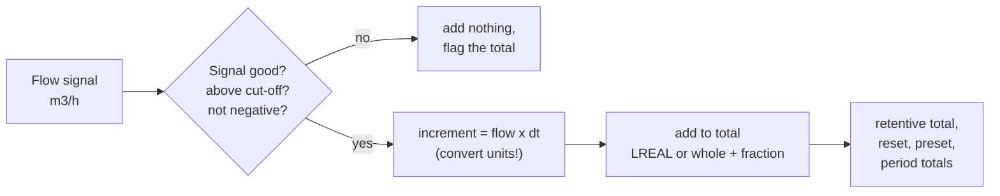

# 09 — Maths, Comparison, Data Movement and Bit Manipulation

> **Level:** 2 — Core programming · **Time:** ~10 hours · **Prerequisites:** [03 — Numbers, Data Types and Addressing](../03-data-types-and-addressing/), [08 — Counters](../08-counters/)

Relay logic switches things on and off. Most of the rest of a PLC program is arithmetic and
data handling. A level in metres is calculated from raw counts. A speed reference goes to a
drive as a number. A flow meter's reading becomes a daily total. A status word from a
compressor package is unpacked into alarms. A reject pusher fires at the right carton because
a pattern of bits moved down a conveyor with the product. None of this is hard, but every
piece has a trap. Integer division throws the answer away. A total stops counting after a few
weeks. A REAL comparison is never true. A shift goes the wrong way and a good part is rejected
twelve pitches later.

[Module 03](../03-data-types-and-addressing/) explained how numbers are stored and where the
storage runs out. This module is about **computing** with them safely: integer and REAL
arithmetic, conversions and rounding, comparisons, the selection and move functions,
bit-level work on words, shift registers, scaling and totalising. The three labs build a
general scaling function, a conveyor reject-tracking system and a flow totaliser that is still
correct after years of running.

## Learning objectives

By the end of this module you will be able to:

- Predict the result of integer and REAL arithmetic in IEC 61131-3, including integer
  division, `MOD` with negative operands, overflow in an intermediate result and division by
  zero, and order a calculation so that it keeps its precision.
- Convert between types explicitly, choose between rounding (`REAL_TO_INT`) and truncation
  (`TRUNC`), and explain why code must not depend on how exact halves are rounded.
- Write robust comparisons: REAL comparisons with a tolerance, range checks with `LIMIT`, `LE`
  and Rockwell's `LIM`, and conditions that fail safe when a value is NaN.
- Use `MOVE`, `SEL`, `MUX`, `MAX`, `MIN` and `LIMIT`, copy arrays and blocks of data, and name
  the Rockwell and Siemens equivalents.
- Test, set, clear and toggle bits in a `WORD` with masks, extract and insert bit fields, and
  use `SHL`, `SHR`, `ROL` and `ROR` correctly.
- Build bit and word shift registers that track product on a conveyor, and relate them to
  Rockwell `BSL`/`BSR` and the FIFO and LIFO instructions.
- Implement linear scaling in REAL and in integer arithmetic, with clamping and protection
  against division by zero.
- Build a totaliser that integrates a rate over the task time without losing precision, and
  calculate averages correctly.

## 1. Arithmetic in a PLC

### 1.1 The operators and functions

IEC 61131-3 gives you the arithmetic in two forms: operators for Structured Text, and standard
functions that appear as boxes in Ladder (LD) and Function Block Diagram (FBD).

| Operation | ST operator | Standard function (LD/FBD box) | Types |
|---|---|---|---|
| Add | `A + B` | `ADD` (extensible: more than two inputs) | any number, and TIME |
| Subtract | `A - B` | `SUB` | any number, and TIME |
| Multiply | `A * B` | `MUL` (extensible) | any number |
| Divide | `A / B` | `DIV` | any number |
| Remainder | `A MOD B` | `MOD` | integers only |
| Power | `A ** B` | `EXPT` | REAL base |
| Negate | `-A` | (vendors: `NEG`) | signed numbers |
| Absolute value, square root | — | `ABS`, `SQRT` | `SQRT` needs REAL |
| Logarithms, exponential | — | `LN`, `LOG` (base 10), `EXP` | REAL |
| Trigonometry | — | `SIN`, `COS`, `TAN`, `ASIN`, `ACOS`, `ATAN` | REAL, angles in radians |
| Copy a value | `:=` | `MOVE` | any |

Operator precedence (multiplication before addition, and so on) is covered in
[Module 10](../10-structured-text/). When in doubt, write the parentheses.

In ladder, a maths box has an **EN** (enable) input and an **ENO** (enable out) output. The box
only executes while EN is TRUE, and ENO tells the next box that it executed without error.
Some platforms set ENO FALSE when the result is invalid, for example on overflow (Siemens
does, see [Module 03](../03-data-types-and-addressing/)).

```text
      Weighed                  +--------ADD--------+
 |------]P[--------------------|EN              ENO|------------------|
 |                             |                   |
 |              BatchTotal ----|IN1             OUT|---- BatchTotal
 |              LastWeight ----|IN2                |
 |                             +-------------------+
```

The rising-edge contact `--]P[--` matters. **A maths instruction executes on every scan that
its rung is true.** With a plain `--] [--` contact, a batch total would add the same weight
100 times a second for as long as `Weighed` stays on. Any calculation that must happen once
per event (add a weight, count a part, step an index) needs an edge
([Module 06](../06-edges-and-one-shots/)). Calculations that must be current every scan, such
as scaling, run unconditionally.

### 1.2 Integer or REAL arithmetic?

IEC 61131-3 is **strongly typed**. Both operands of an operator must have the same type, and
the result has that type too. `INT * INT` is an `INT`, even if you assign it to a `DINT`. All of
these are compile errors in MATIEC (the compiler behind `plctest` and OpenPLC):

```text
Total_DINT := Count_INT * Count_INT;   (* INT result into a DINT: "Incompatible data types"  *)
Level_REAL := Raw_INT;                 (* INT into REAL: convert with INT_TO_REAL           *)
Flags_WORD := Flags_WORD + 1;          (* no arithmetic on bit strings: "Data type mismatch" *)
```

Write the conversions yourself (`INT_TO_DINT`, `INT_TO_REAL`, and so on). CODESYS, TIA Portal
and Logix will convert some types for you, but explicit conversions compile everywhere and
show exactly where a value changes type.

The two families behave very differently:

| | Integers (`INT`, `DINT`, `UDINT`, ...) | Floating point (`REAL`, `LREAL`) |
|---|---|---|
| Exact? | Yes, every value in range is exact | No: about 7 significant digits (`REAL`) or 15–16 (`LREAL`) |
| Division | Truncates: `7 / 2 = 3` | Keeps the fraction: `7.0 / 2.0 = 3.5` |
| Too big | Wraps round silently, or faults, depending on the platform | Loses small parts, then becomes infinity |
| Divide by zero | Platform-specific, may stop the PLC | Infinity or NaN |
| Equality test | Safe | Unreliable: use a tolerance |
| Good for | Counts, indexes, states, bit patterns, whole units | Measurements, ratios, setpoints, PID |

Where the arithmetic is done also varies. MATIEC generates C code, and C widens `INT`
arithmetic to 32 bits, so `Raw * 400 / 27648` gives the right answer for an `INT` raw value of
13824 even though 13824 × 400 does not fit in an `INT`. A platform that calculates `INT`
expressions in 16 bits wraps the product and returns nonsense. Rockwell Logix converts `SINT`
and `INT` operands to `DINT` for maths. Write code that is right on all of them: make every
intermediate result fit the type you declared (section 1.5).

### 1.3 Integer division truncates

Integer division throws away the remainder, and it truncates **toward zero**:

| Expression | Result | Note |
|---|---|---|
| `7 / 2` | 3 | the 0.5 is lost |
| `-7 / 2` | −3 | toward zero, not down to −4 |
| `2 / 3` | 0 | any smaller-over-larger division is 0 |
| `199 / 100` | 1 | 1.99 truncated, not rounded |
| `27647 / 27648` | 0 | 99.996 % of full scale gives 0 |

Two consequences come up again and again:

- **Percentages and ratios.** `Pct := Done / Target * 100;` gives 0 until `Done` reaches
  `Target`, and then 100. Multiply first, `Pct := Done * 100 / Target;`, or work in REAL.
- **Rounding.** Integer division never rounds. To round to the nearest whole number (for
  non-negative values) add half the divisor first: `(A + B / 2) / B`. So `(7 + 1) / 2 = 4`,
  and `(199 + 50) / 100 = 2`. For signed values see section 7.3.

Truncation is also what you want when you split a quantity into units, as the run-hours meter
in [Lab 07-4](../07-timers/) does: `Hours := Secs / 3600; Minutes := (Secs MOD 3600) / 60;`.

Truncating toward zero is not the same as rounding down. Grouping readings into 10 °C bands
with `Band := TempC / 10;` puts everything from −9 °C to +9 °C into band 0, so the band
around zero is twice as wide as all the others. If negative values are possible, decide what
you want and test with negative values.

### 1.4 `MOD` and its sign rules

`A MOD B` is the remainder of the truncating division: `A - (A / B) * B`. Because division
truncates toward zero, **the result takes the sign of the dividend `A`**:

| Expression | Result |
|---|---|
| `17 MOD 5` | 2 |
| `-17 MOD 5` | −2 |
| `17 MOD -5` | 2 |
| `-7 MOD 3` | −1 |
| `-7 MOD -3` | −1 |
| `7 MOD 0` | 0 in MATIEC (the generated code checks). Other platforms may fault |

(All checked with MATIEC.) `MOD` is defined for integers only.

Typical uses:

- **Every Nth event:** `IF Count MOD 10 = 0 THEN` takes a sample from every tenth carton.
- **Wrapping an index round a ring buffer** of 10 entries: `Idx := (Idx + 1) MOD 10;` goes
  0, 1, ... 9, 0 ([Module 12](../12-data-structures/)).
- **Digits:** `(Value / 10) MOD 10` is the tens digit (the BCD conversion in
  [Module 03](../03-data-types-and-addressing/)).
- **Even or odd:** `Count MOD 2 = 0`.

The sign rule bites when an index goes **down**. `(Idx - 1) MOD 10` gives −1 when `Idx` is 0,
and −1 is not a valid index. Add the divisor before taking the remainder,
`(Idx - 1 + 10) MOD 10`, or for any value `((A MOD N) + N) MOD N`, which is always between 0
and N − 1 for positive N.

### 1.5 Overflow, especially in the middle of a calculation

[Module 03](../03-data-types-and-addressing/) showed what happens when a result does not fit:
integers wrap round in MATIEC and CODESYS, and on other PLCs a status flag is set or the
controller faults. The dangerous cases are the ones you don't see, where the **final** answer
fits but an intermediate result does not:

```iecst
(* Raw is an INT, 0..27648. Level_cm should be 0..400 *)
Level_cm := Raw * 400 / 27648;                              (* 27648 * 400 = 11,059,200: does not fit an INT *)
Level_cm := DINT_TO_INT(INT_TO_DINT(Raw) * 400 / 27648);    (* widened first: always right *)
```

The first line works in MATIEC (because of C's widening) and fails on a PLC that evaluates in
16 bits. The second is right everywhere. The same goes for sums: three `INT` flows of 20,000
add up to 60,000, which does not fit, so sum into a `DINT` or a `REAL`. Averaging two `INT`s
as `(A + B) / 2` overflows in the same way. Widen them first.

**Do the worst-case sum.** For each intermediate result, multiply the largest possible
inputs:

| Calculation | Worst case | Fits in |
|---|---|---|
| `Raw * 1000`, Raw an `INT` | 32,767 × 1,000 = 32,767,000 | `DINT` (max 2,147,483,647) |
| `Raw * 100000` | 32,767 × 100,000 ≈ 3.3 × 10⁹ | not a `DINT`: rearrange it (section 1.7, rule 4) |
| Production count, 1 part/s for 20 years | ≈ 631 million | `DINT` |
| Energy in Wh, 5 MW for 1 year | ≈ 4.4 × 10¹⁰ | `LINT`, or kWh in a `DINT`, or `LREAL` |

Two more traps:

- **`ABS(-32768)` is −32,768** for an `INT` (checked in MATIEC). The most negative value of a
  signed integer has no positive partner. The same applies to `-X`.
- **Unsigned types wrap at zero.** A `UINT` holding 0 minus 1 is 65,535. A "remaining
  quantity" in an unsigned type becomes huge instead of negative.

Where overflow is possible at all, test before you add:

```iecst
IF Count < 2147483647 THEN      (* saturate at the top of DINT instead of wrapping *)
  Count := Count + 1;
END_IF;
```

### 1.6 Division by zero

**Integers.** What happens depends on the platform. The C code MATIEC generates does not check,
and integer division by zero is undefined in C. Under `plctest` on a PC it crashed the program
(`plctest` reports "test program crashed"). The OpenPLC Runtime runs the same kind of
generated code, so the result depends on the processor it runs on: the runtime may stop, or
the program may carry on with a meaningless value. Other PLCs set a status flag, log a fault
or go to STOP, depending on the model and the data type. `MOD` by zero returned 0 in MATIEC
(its library checks for it). Never let a division by zero happen: check the divisor.

**REALs** follow IEEE 754. A non-zero number divided by 0.0 is +infinity or −infinity, and
0.0 / 0.0 is NaN (not a number). Neither causes a fault in MATIEC; the program just carries on
with a nonsense value. Worse, converting them to an integer can hide them:
`REAL_TO_INT` of infinity **and** of NaN both returned **0** in MATIEC on a PC. (Converting
infinity or NaN to an integer is undefined in the generated C, so another processor can give
another value.) A missing check in a speed calculation can send a believable "0" to a drive
without any alarm.

```iecst
(* Guard every division whose divisor can be zero *)
IF Span <> 0.0 THEN
  Ratio := (Value - Zero) / Span;
  SpanFault := FALSE;
ELSE
  Ratio := 0.0;         (* a defined, safe value *)
  SpanFault := TRUE;    (* and tell someone: this is a configuration error *)
END_IF;
```

Comparing a REAL with **exactly** 0.0 is one of the few correct uses of `=` or `<>` on REALs:
the question is "will this division blow up?", and only an exact zero makes it do so (in
IEEE 754, `A - B` is exactly 0.0 only when `A = B`). A divisor that is merely tiny gives a huge
but finite answer, which a clamp (section 7.4) can deal with.

### 1.7 Ordering a calculation to keep precision

The same formula written in a different order can give a different answer.

**Integer rules**

1. **Multiply before you divide**, so that the division throws away as little as possible:
   `Raw * 1000 / 27648`, not `Raw / 27648 * 1000`.
2. **Widen before you multiply**, so the product fits: `INT_TO_DINT(Raw) * 1000`.
3. **Divide once, at the end**, and round deliberately if you need to (add half the divisor).
4. **Cancel common factors** when the product is too big. `Raw * 100000 / 27648` overflows a
   `DINT`, but 100,000 / 27,648 = 3,125 / 864 (both divided by 32), and `Raw * 3125 / 864`
   fits easily.

**REAL rules**

1. **Convert before you divide.** `INT_TO_REAL(A / B)` does an integer division and then
   converts the damage. `INT_TO_REAL(A) / INT_TO_REAL(B)` keeps the fraction.
2. **Don't add small numbers to a large one over and over.** Each addition is rounded to the
   REAL spacing of the large number. This is the totaliser problem (section 8).
3. **Beware of subtracting two large, nearly equal numbers.** Their difference keeps only the
   digits the two numbers do *not* share. Two REAL totals of 1,000,000.3 kg in and 999,999.9 kg
   out are stored as 1,000,000.3125 and 999,999.875, so the "net 0.4 kg" comes out as
   0.4375 kg, 9 % wrong (checked with MATIEC). Keep such totals in `LREAL`, or subtract
   before the values get large (for example, total the difference each scan).
4. **Keep intermediate results in the widest type you have**, and convert to a narrower type
   only for the final result.

## 2. Type conversions

### 2.1 Widening and narrowing

A **widening** conversion goes to a type that holds every value of the old one (`INT_TO_DINT`,
`INT_TO_REAL`, `REAL_TO_LREAL`). It is always safe. A **narrowing** conversion goes the other
way and can lose information:

| Conversion | What can go wrong | MATIEC result |
|---|---|---|
| `DINT_TO_INT(40000)` | Out of range: only the low 16 bits are kept | −25,536 |
| `DINT_TO_REAL(16777217)` | A REAL has 24 significant bits | 16,777,216.0 |
| `REAL_TO_INT(40000.0)` | Out of range: undefined in the standard | −25,536 |
| `REAL_TO_INT(2.5)` | A tie: rounding rule is platform-specific | 2 |
| `REAL_TO_INT(NaN)` | Not a number at all | 0 (on a PC; undefined in C) |
| `LREAL_TO_REAL(x)` | Digits beyond the 7th are rounded off | — |

The full list of conversion functions is in [Module 03](../03-data-types-and-addressing/) and
[Module 10](../10-structured-text/). Here we concentrate on the two decisions you make every
time you narrow: how to round, and what to do when the value does not fit.

### 2.2 Rounding versus truncation

- `REAL_TO_INT`, `REAL_TO_DINT` and similar **round to the nearest integer**:
  2.4 → 2, 2.6 → 3, −2.6 → −3.
- `TRUNC` **cuts off the fraction**, toward zero: `TRUNC(2.7) = 2`, `TRUNC(-2.7) = -2`.

The difference matters. An analog output value of 13,823.9 becomes 13,824 when rounded and
13,823 when truncated. A mechanical-style counter display ("7 whole cubic metres so far")
must truncate, because 7.9 m³ is not yet 8.

**Exact halves are the trouble.** MATIEC rounds a tie to the **even** neighbour ("banker's
rounding", which avoids a bias when many values are rounded):

| Value | 0.5 | 1.5 | 2.5 | 3.5 | −2.5 | −3.5 |
|---|---|---|---|---|---|---|
| `REAL_TO_INT` in MATIEC | 0 | 2 | 2 | 4 | −2 | −4 |

Platforms differ here. Rockwell Logix also rounds an exact half to the even number when a
REAL is stored in an integer tag. Schneider Electric documents the opposite rule for its
Modicon M580, halves away from zero (2.5 → 3, −2.5 → −3), while its older Quantum rounds to
even. Code that depends on a tie
behaves differently when it moves to another PLC. In practice ties are rare with measured
values, and the labs never depend on them. Where a rounding rule really matters (a value that
is billed, or reported to a regulator), write it in the functional specification and code it
explicitly. For example, halves away from zero:

```iecst
IF X >= 0.0 THEN
  N := TRUNC(X + 0.5);     (* 2.5 -> 3, 2.4999 -> 2 *)
ELSE
  N := TRUNC(X - 0.5);     (* -2.5 -> -3, -3.7 -> -4 *)
END_IF;
```

Siemens also offers `ROUND`, `CEIL` (up) and `FLOOR` (down). Rockwell Logix rounds when a REAL
is stored in an integer tag, and truncates with `TRN`.

### 2.3 Check the range before you narrow

`REAL_TO_INT(40000.0)` does not give 32,767. In MATIEC it gives −25,536, and the standard does
not define it at all. An analog output calculation that briefly produces 40,000 counts would
send a large negative value to the card. Clamp first, then convert:

```iecst
SpeedAO := REAL_TO_INT(LIMIT(0.0, SpeedCounts, 27648.0));
```

`LIMIT` also removed a NaN in a MATIEC test (`LIMIT(0.0, NaN, 100.0)` returned 0.0), but
nothing in the standard guarantees that, and other platforms can pass the NaN straight
through. Validate a signal before you use it ([Module 14](../14-analog-and-process-io/)).

### 2.4 Bit-pattern conversions are not numeric conversions

`WORD_TO_INT(16#FFFF)` is −1. The bits are copied unchanged and reinterpreted, so it is not a
number conversion at all. Use `WORD`/`DWORD` for things that are patterns of bits (status
words, masks) and `INT`/`DINT`/`UINT` for things that are numbers, and convert deliberately
at the boundary. Mixing them up is how a status word ends up displayed as a large negative
number on a SCADA screen ([Module 03](../03-data-types-and-addressing/), worked example 1).

## 3. Comparison

### 3.1 The comparison operators

| Meaning | ST operator | Function | Rockwell | Siemens LAD |
|---|---|---|---|---|
| equal | `=` | `EQ` | `EQU` | `CMP ==` |
| not equal | `<>` | `NE` | `NEQ` | `CMP <>` |
| less than | `<` | `LT` | `LES` | `CMP <` |
| less or equal | `<=` | `LE` | `LEQ` | `CMP <=` |
| greater than | `>` | `GT` | `GRT` | `CMP >` |
| greater or equal | `>=` | `GE` | `GEQ` | `CMP >=` |

A comparison produces a `BOOL`, so in ladder it behaves like a contact: the rung continues
when the comparison is true.

```text
       +-----GRT-----------+                                  HighLevel
 |-----|Greater Than (A>B) |------------------------------------( )-----|
       |Source A   Level_m |
       |Source B   3.5     |
       +-------------------+
```

The IEC comparison functions are **extensible**: `GT(A, B, C)` means `A > B AND B > C`, and
`LE(Lo, X, Hi)` means `Lo <= X AND X <= Hi`, a neat range test (both checked in MATIEC).

Both sides must have the same type. To compare a signed and an unsigned value, convert both
to a wider signed type first (`UINT_TO_DINT`, `INT_TO_DINT`). Otherwise −1 and 65,535 can look
equal, because they are the same 16 bits.

### 3.2 Never compare REALs with `=` or `<>`

A REAL is rounded to the nearest representable value after every operation, so two
calculations that "should" give the same number often differ in the last bit:

| Expression (checked in MATIEC) | Result |
|---|---|
| `1.1 * 3.0 = 3.3` in REAL | FALSE |
| `0.1 + 0.2 = 0.3` in REAL | TRUE |
| `0.1 + 0.2 = 0.3` in LREAL | FALSE |

The second line is the dangerous one. Exact equality sometimes works, by luck, and code
written that way passes a test and fails later with different numbers. Use one of these
instead:

```iecst
(* 1. Absolute tolerance, in engineering units *)
AtSetpoint := ABS(Level_m - Setpoint_m) <= 0.005;          (* within 5 mm *)

(* 2. Relative tolerance, for values that range over several decades *)
Agree := ABS(FlowA - FlowB) <= 0.01 * MAX(ABS(FlowA), ABS(FlowB));   (* within 1 % *)

(* 3. A one-sided comparison, which is what "reached" usually means *)
TankFull := Level_m >= FullLevel_m;
```

Other rules follow from the same idea:

- Use integers or enumerations for anything that is exact by nature: step numbers, recipe
  numbers, counts, modes.
- For "has it changed?", compare with a deadband, `ABS(X - XLast) >= Deadband`
  ([Module 06](../06-edges-and-one-shots/)).
- Every comparison with NaN is FALSE, even with itself, except `<>`, which is TRUE. So
  `X = X` is FALSE and `X <> X` is TRUE only when `X` is NaN
  ([Module 03](../03-data-types-and-addressing/)). Worked example 3 uses this.

### 3.3 Range checks: `LE`, `LIMIT` and `LIM`

Three different jobs, often confused:

| Job | IEC | Rockwell | Siemens |
|---|---|---|---|
| Is X inside the range? (BOOL) | `(X >= Lo) AND (X <= Hi)`, or `LE(Lo, X, Hi)` | `LIM` | `IN_RANGE` |
| Is X outside the range? (BOOL) | `(X < Lo) OR (X > Hi)` | `LIM` with Low > High | `OUT_RANGE` |
| Force X into the range (a value) | `LIMIT(Lo, X, Hi)` | two comparisons and `MOV`s | `LIMIT` |

Rockwell's `LIM` (limit test) takes *Low Limit*, *Test* and *High Limit*. When Low ≤ High it
is true while Low ≤ Test ≤ High. When Low > High it is true while Test ≥ Low **or**
Test ≤ High, which is the band *outside* the two limits. That is handy for a value that wraps
round, such as an angle: `LIM 350, Angle, 10` is true from 350° through 0° to 10°.

`LIMIT(MN, IN, MX)` expects `MN <= MX`. If they are the wrong way round the result is
nonsense, and it depends on the platform: in MATIEC `LIMIT(100.0, 50.0, 0.0)` returned 100.0
and `LIMIT(100.0, 150.0, 0.0)` returned 0.0, so the output only ever takes one of the two
limit values. This is exactly what goes wrong when you clamp a reverse-acting scaling
(Lab 09-1).

A single comparison of an analog value **chatters** when the value sits near the limit, so
alarms and on/off controllers add a deadband or hysteresis
([Module 14](../14-analog-and-process-io/)).

Finally, think about NaN. Write range checks so that the **healthy** condition has to be
proven:

```iecst
PressureOK := (Pressure_bar >= 0.5) AND (Pressure_bar <= 8.0);   (* NaN makes this FALSE *)
LowPressureTrip := NOT PressureOK;                              (* so NaN trips *)
```

## 4. Selection and data movement

### 4.1 `MOVE` and assignment

In ST you copy a value with `:=`. In ladder and FBD the same job is done by the `MOVE` box
(Rockwell `MOV`, Siemens `MOVE`). `MOVE` copies without changing the type in IEC. Rockwell's
`MOV` also converts between numeric types (a REAL moved into a `DINT` is rounded), and
Siemens' `MOVE` box can feed several outputs at once.

Rockwell's **masked move** `MVM` copies only the bits selected by a mask:
`Dest := (Dest AND NOT Mask) OR (Source AND Mask)`. That is the same "insert a bit field"
operation you will write in section 5.2.

### 4.2 `SEL`: one of two

`SEL(G, IN0, IN1)` returns `IN0` when `G` is FALSE and `IN1` when `G` is TRUE:

```iecst
Setpoint := SEL(RemoteMode, LocalSP, RemoteSP);   (* FALSE -> LocalSP, TRUE -> RemoteSP *)
```

```text
               +-----SEL-----+
  RemoteMode --|G            |
     LocalSP --|IN0       OUT|-- Setpoint
    RemoteSP --|IN1          |
               +-------------+
```

Read the order carefully. It is the opposite of `IF G THEN a ELSE b`: the FALSE case comes
first. Mixing up `IN0` and `IN1` is a common bug, and it produces a program that works, only
backwards.

### 4.3 `MUX`: one of many

`MUX(K, IN0, IN1, ..., INn)` returns input number `K`, **counting from 0**:

```iecst
(* Recipe 0, 1 or 2 selects the cooking temperature *)
IF (RecipeNo >= 0) AND (RecipeNo <= 2) THEN
  CookTemp := MUX(RecipeNo, 72.0, 85.0, 90.5);
ELSE
  RecipeFault := TRUE;          (* keep the old setpoint and raise an alarm *)
END_IF;
```

If `K` is out of range, platforms differ. MATIEC returned 0 in a test, which in the example
above would quietly set a cooking temperature of 0 °C. Always check `K` first. For more than a
handful of choices, an array indexed by the recipe number is clearer
([Module 12](../12-data-structures/)).

### 4.4 `MAX`, `MIN` and `LIMIT`

`MAX` and `MIN` return the largest and smallest of their inputs, and are extensible:
`MAX(1.5, 2.5, -3.0)` is 2.5.

```iecst
HottestBearing := MAX(TT201, TT202, TT203);     (* trip on the worst bearing *)
Level_m := LIMIT(0.0, LevelRaw_m, 4.0);         (* clamp for display *)
Output  := LIMIT(OutLo, PidOut, OutHi);         (* keep a controller output within its limits *)
```

`MAX(MIN(A, B), MIN(MAX(A, B), C))` is the **median** of three values, the basis of the "mid
value selection" of redundant transmitters (worked example 3).

### 4.5 Copying blocks of data (preview)

Arrays are covered properly in [Module 10](../10-structured-text/) and
[Module 12](../12-data-structures/). The operations you need most often:

```iecst
Backup := Recipe;                  (* whole array (or structure) of the same type: one assignment *)

FOR i := 0 TO 9 DO                 (* part of an array: copy elements 0..9 of Src ... *)
  Dest[i + 10] := Src[i];          (* ... into elements 10..19 of Dest *)
END_FOR;

FOR i := 0 TO 99 DO                (* fill: clear a buffer *)
  Buffer[i] := 0;
END_FOR;
```

Vendor instructions do the same jobs:

| Job | Rockwell Logix | Siemens S7-1200/1500 | CODESYS |
|---|---|---|---|
| Copy one value | `MOV` | `MOVE` | `:=` |
| Copy a block of elements | `COP` (copy file) | `MOVE_BLK` | `:=` for whole arrays, or a loop |
| Copy that must not be interrupted | `CPS` (synchronous copy file) | `UMOVE_BLK` | — |
| Fill a block with one value | `FLL` (file fill) | `FILL_BLK`, `UFILL_BLK` | a loop |

Things to know before you use them:

- **Length units.** Rockwell `COP` counts its length in *destination* elements and copies the
  underlying bytes without any type conversion, so it can copy a REAL into two INTs for a
  comms buffer, with the byte-order consequences of [Module 17](../17-industrial-communications/).
- **Interruption.** A higher-priority task, or an I/O update, can run in the middle of a long
  copy, so half the destination holds new data and half holds old. That is why `CPS` and
  `UMOVE_BLK` exist: use them for data another task or the I/O system can change.
- **Bounds.** A block copy with the wrong length can silently overwrite whatever follows the
  destination in memory. CODESYS memory-copy functions from the system libraries copy raw
  bytes with no type or bounds checks at all.

### 4.6 Whole expressions in ladder: `CPT` and `CALCULATE`

A formula such as the scaling equation needs four or five maths boxes in ladder. Rockwell's
`CPT` (compute) and Siemens' `CALCULATE` let you type the expression into one box instead,
with the destination as the output. Everything in this module about types, order of
operations and overflow still applies inside the box. When the calculation grows beyond a
line, move it to Structured Text or to a function such as `F_Scale` (Lab 09-1).

## 5. Bit manipulation

### 5.1 Bitwise operators on words

`AND`, `OR`, `XOR` and `NOT` work **bit by bit** on bit-string types (`BYTE`, `WORD`, `DWORD`,
`LWORD`) and logically on `BOOL`s. Each bit of the result depends only on the same bit of the
inputs:

```text
                     bit 15 ........ 8  7 ........ 0
 A          16#5A0F      0101 1010      0000 1111
 B          16#0FF0      0000 1111      1111 0000
 A AND B    16#0A00      0000 1010      0000 0000     1 only where both are 1
 A OR B     16#5FFF      0101 1111      1111 1111     1 where either is 1
 A XOR B    16#55FF      0101 0101      1111 1111     1 where they differ
 NOT A      16#A5F0      1010 0101      1111 0000     every bit inverted
```

In IEC 61131-3 these are defined for bit strings, not for signed integers. `MyInt AND 16#00FF`
and `NOT MyInt` are compile errors in MATIEC; convert with `INT_TO_WORD` first. CODESYS and
Logix allow bitwise operations on integers directly.

### 5.2 Masks: test, set, clear, toggle and fields

A **mask** is a constant with 1s in the bit positions you care about. With it you can do
everything you need to a single bit or a group of bits:

| Job | Structured Text (W is a `WORD`, n is a bit number) |
|---|---|
| Test bit n | `(W AND SHL(WORD#1, n)) <> 0` |
| Set bit n | `W := W OR SHL(WORD#1, n);` |
| Clear bit n | `W := W AND NOT SHL(WORD#1, n);` |
| Toggle bit n | `W := W XOR SHL(WORD#1, n);` |
| Any of bits 8..15 set? | `(W AND 16#FF00) <> 0` |
| All of bits 0..3 set? | `(W AND 16#000F) = 16#000F` |
| Read the 4-bit field in bits 4..7 | `F := SHR(W, 4) AND 16#000F;` |
| Write F into bits 4..7 | `W := (W AND NOT 16#00F0) OR SHL(F AND 16#000F, 4);` |

Write masks in hex, never in decimal. `W AND 10` does **not** test bit 10: decimal 10 is
`2#1010`, which tests bits 1 and 3. Bit 10 is `16#0400`. Named constants make masks
self-documenting:

```iecst
VAR CONSTANT
  STS_RUNNING  : WORD := 16#0001;   (* bit 0 *)
  STS_TRIPPED  : WORD := 16#0004;   (* bit 2 *)
  STS_ALL_ALMS : WORD := 16#03F0;   (* bits 4..9 *)
END_VAR
```

MATIEC has no direct bit access (`W.3`), so masks and shifts are the only way. Other tools
have bit access (`W.3` in CODESYS and Logix, `W.%X3` in TIA Portal SCL), which is clearer for
one bit. Masks are still the tool for testing several bits at once or moving whole fields.

Packing individual `BOOL`s into a status word, and unpacking a command word, is worked through
in [Module 03](../03-data-types-and-addressing/) (worked example 2 and Lab 03-1).

### 5.3 Shifts and rotates

`SHL(IN, N)` and `SHR(IN, N)` move every bit N places left (towards bit 15) or right. The bits
that fall off the end are lost and zeros come in. `ROL` and `ROR` rotate instead: the bits
that fall off one end come back in at the other.

```text
 SHL(W, 1):   lost <- [15][14][13] ... [2][1][0] <- 0
 SHR(W, 1):      0 -> [15][14][13] ... [2][1][0] -> lost
 ROL(W, 1):   +-- [15][14][13] ... [2][1][0] <--+    bit 15 goes round to bit 0
              +---------------------------------+
 ROR(W, 1):   +--> [15][14][13] ... [2][1][0] --+    bit 0 goes round to bit 15
              +---------------------------------+
```

Worked on `W = 16#8001` (bits 15 and 0 set), checked with MATIEC:

| Expression | Result | |
|---|---|---|
| `SHL(W, 1)` | `16#0002` | bit 15 lost, bit 0 moved to bit 1 |
| `ROL(W, 1)` | `16#0003` | bit 15 came round to bit 0 |
| `SHR(W, 1)` | `16#4000` | bit 0 lost |
| `ROR(W, 1)` | `16#C000` | bit 0 came round to bit 15 |
| `SHL(WORD#1, 3)` | `16#0008` | the usual way to build a mask for bit 3 |
| `ROL(W, 8)` | `16#0180` | rotating a WORD by 8 swaps its two bytes |

Some details:

- Keep N inside the word. MATIEC passes N straight to a C shift, and on a PC `SHL` or `SHR`
  of a `WORD` by 16 to 31 gave 0, but `SHL(W, 40)` gave the same as `SHL(W, 8)` and
  `SHR(W, 32)` returned `W` unchanged. (A shift by 32 or more, or by a negative N, is
  undefined in C, and the PC's processor uses only the low five bits of N.) Other platforms
  have their own rules. A shift count that comes from a setting can therefore move a bit to
  the wrong place instead of clearing it, so limit it first (Lab 09-2 uses `LIMIT`).
- For unsigned values, `SHL` by 1 multiplies by 2 and `SHR` by 1 divides by 2 (truncating),
  as long as nothing falls off the end. For arithmetic, write `* 2` and `/ 2`, which say what
  you mean and work for signed values too. IEC defines shifts on bit strings only (`SHL` on an
  `INT` is a compile error in MATIEC). Tools that allow shifting signed integers may or may not
  copy the sign bit when shifting right.
- Rotating when you meant to shift is a classic bug. In a shift register it brings old data
  back round as "ghost" parts (Lab 09-2 tests for it).

### 5.4 Bytes, words and double words

Protocols and older devices often split values into bytes and words. The patterns (all
checked in MATIEC):

```iecst
HiByte := WORD_TO_BYTE(SHR(W, 8));                         (* bits 15..8 *)
LoByte := WORD_TO_BYTE(W);                                 (* bits 7..0: the high byte is cut off *)
W      := SHL(BYTE_TO_WORD(HiByte), 8) OR BYTE_TO_WORD(LoByte);
Swapped := ROL(W, 8);                                      (* swap bytes: 16#A500 <-> 16#00A5 *)

(* A 32-bit signed counter received as two 16-bit Modbus registers *)
D := SHL(WORD_TO_DWORD(HiWord), 16) OR WORD_TO_DWORD(LoWord);
Count := DWORD_TO_DINT(D);                                 (* 16#FFFF, 16#FFFE -> -2 *)
```

Whether the high or the low word arrives first is a question of **word order**, which is not
standardised in Modbus ([Module 03](../03-data-types-and-addressing/),
[Module 17](../17-industrial-communications/)). Byte swapping is common enough that Rockwell
has `SWPB` and Siemens `SWAP` for it.

### 5.5 Sixteen edge detectors in one line

Bitwise operators work on all 16 bits at once, so they can compare two snapshots of a word:

```iecst
NewBits     := Alarms AND NOT LastAlarms;   (* 0 -> 1: sixteen rising edges at once *)
ClearedBits := LastAlarms AND NOT Alarms;   (* 1 -> 0: sixteen falling edges *)
ChangedBits := Alarms XOR LastAlarms;       (* anything that changed *)
LastAlarms  := Alarms;                      (* remember for the next scan *)
```

This is the "previous value" edge detector of [Module 06](../06-edges-and-one-shots/) applied
to a whole word. Worked example 1 uses it to sound a horn for each new alarm from a package
unit.

## 6. Shift registers: tracking product

### 6.1 The tracking problem

A camera inspects bottles at one point on a conveyor. The reject pusher is five bottle
spacings (five **pitches**) further on, because there is no room to reject at the camera, and
because the camera takes time to decide. The PLC has to remember which bottles failed until
they reach the pusher.

```text
  direction of travel  ----->
  +------+------+------+------+------+------+------+
  |  B0  |  B1  |  B2  |  B3  |  B4  |  B5  |  B6  |   bottles, one pitch apart
  +------+------+------+------+------+------+------+
     ^                                  ^
   camera (position 0)             reject pusher (position 5)

  TrackWord  bit:  0      1      2      3      4      5      6
```

A timer ("fire the pusher 2.3 s after a fail") only works if the belt never changes speed and
never stops. Belts do both. Tracking must follow **distance**, not time. A proximity switch
on the drive sprocket gives one pulse per pitch (or an encoder gives N pulses, and a counter
from [Module 08](../08-counters/) turns every N pulses into one pitch). Whenever the belt moves
one pitch, every bottle moves one position, so the stored pass/fail data moves one position
too. That is a **shift register**.

### 6.2 A bit shift register in a WORD

Give each position one bit: bit 0 for the camera position, bit 5 for the pusher. Then:

1. **Mark.** When the camera reports a fail, set bit 0 (the bottle at the camera).
2. **Shift.** On each rising edge of the pitch pulse, `TrackWord := SHL(TrackWord, 1);`. Every
   bit moves one place towards the pusher, and a 0 ("nothing known to be bad") comes in at
   bit 0 for the bottle arriving at the camera.
3. **Act.** The pusher fires while bit 5 is set: `(TrackWord AND 16#0020) <> 0`.

Two bad bottles, A and B, go through like this. The word is written the usual way, with bit 7
on the left and bit 0 on the right, so the bits move **left** while the bottles move right on
the diagram above:

```text
 event                          TrackWord      pusher (bit 5)
 A fails at the camera          0000 0001      off
 pulse 1                        0000 0010      off
 pulse 2                        0000 0100      off
 B fails at the camera          0000 0101      off
 pulse 3                        0000 1010      off
 pulse 4                        0001 0100      off
 pulse 5                        0010 1000      ON    A at the pusher
 pulse 6                        0101 0000      off   A has passed; the good bottle behind it is at 5
 pulse 7                        1010 0000      ON    B at the pusher
```

A 16-bit word tracks 16 positions, a `DWORD` 32. For longer conveyors use an array.

### 6.3 A shift register in a BOOL array

The same register as an array of `BOOL`s has no length limit and is easy to read. The shift
is a loop, and **the direction of the loop matters**:

```iecst
IF PitchEdge.Q THEN
  (* Copy from the top down: each element takes the value of the one behind it *)
  FOR i := 15 TO 1 BY -1 DO
    Bad[i] := Bad[i - 1];
  END_FOR;
  Bad[0] := FALSE;                  (* the bottle arriving at the camera is not yet known bad *)
END_IF;
RejectPusher := Bad[5];
```

Written the other way, `FOR i := 1 TO 15 DO Bad[i] := Bad[i - 1]; END_FOR;`, the loop copies
`Bad[0]` into `Bad[1]`, then that same value into `Bad[2]`, and so on: one bad bottle marks the
whole conveyor bad in a single scan. The loop runs only in the scan that sees the pulse, but
that scan must still fit the cycle-time budget, so a very long register is better built as a
ring buffer (section 6.4, [Module 10](../10-structured-text/) for loops and scan time).

### 6.4 Word (data) shift registers: carrying data with the product

Often a single pass/fail bit is not enough. A checkweigher measures each pack, and a labeller
eight pitches further on prints the weight on it. Now each position holds a number, and the
whole array shifts:

```iecst
IF PitchEdge.Q THEN
  FOR i := 8 TO 1 BY -1 DO
    Weight_g[i] := Weight_g[i - 1];
  END_FOR;
  Weight_g[0] := 0.0;               (* empty until the scale weighs the next pack *)
END_IF;
IF WeighDone THEN
  Weight_g[0] := ScaleReading_g;    (* the pack on the scale *)
END_IF;
LabelWeight_g := Weight_g[8];       (* the pack at the labeller *)
```

The same pattern carries a structure per position (serial number, recipe, weight, pass/fail)
using an array of structures ([Module 12](../12-data-structures/)). For very long registers,
copying every element on every pitch gets expensive, and a **ring buffer** with a moving
"head" index does the same job without moving any data.

### 6.5 Shift registers, FIFOs and LIFOs

These three are easy to confuse:

| Structure | Moves when | Order out | Example |
|---|---|---|---|
| **Shift register** | an external pulse (the conveyor moved) | fixed positions: bit n = position n | reject tracking on a fixed-pitch conveyor |
| **FIFO** (first in, first out, a queue) | something is loaded or unloaded | the oldest entry comes out first | cartons on an accumulating conveyor with no fixed spacing; a queue of batch orders |
| **LIFO** (last in, first out, a stack) | something is loaded or unloaded | the newest entry comes out first | a stack of pallets or plates, where the last one placed is the first one taken |

Vendor instructions:

- **Rockwell `BSL` / `BSR`** (bit shift left/right) shift an array of `DINT`s by one bit on each
  false-to-true transition of the rung, so the edge is built in. A `CONTROL` tag sets the
  length in bits (`.LEN`) and holds the bit shifted out of the end (`.UL`, unload). `BSL` loads
  the source bit into bit 0 and shifts towards higher bits; `BSR` loads it into the highest bit
  and shifts towards bit 0.
- **Rockwell `FFL` / `FFU`** (FIFO load/unload) and **`LFL` / `LFU`** (LIFO load/unload) work
  on an array with a `CONTROL` tag whose `.POS` is the number of entries, with `.EM` (empty)
  and `.DN` (full) flags. `FFU` takes out the entry at position 0 and moves every other entry
  one place towards the front.
- **Siemens (TIA Portal)** uses `SHL`/`ROL` on `WORD`s and `DWORD`s, or array loops in SCL.
- **CODESYS and others:** write it in ST, or use a library block; free libraries such as
  OSCAT include FIFO and stack blocks.

FIFO queues and ring buffers are built properly in [Module 12](../12-data-structures/). A LIFO
is the simpler cousin: one array and one index that goes up on a load and down on an unload.

### 6.6 Tracking in the real world

A shift register is only as good as its assumptions. Things to design for:

- **Shift on the edge, never on the level.** A belt that stops with the proximity switch
  made would otherwise shift once per scan, and every bit would run off the end within a
  fraction of a second.
- **Which part does a result belong to?** A camera result that arrives in the same scan as a
  pitch pulse must be recorded against the part that was inspected, so mark before you shift
  (or delay the result by a known number of positions if the camera is slow).
- **Parts that move relative to the belt.** If bottles slip, or an operator clears a jam by
  hand and puts bottles back in different places, the data no longer matches the product.
  Common measures: a part-present sensor at the reject
  position to confirm, clearing (or rejecting) everything on the belt after a jam is cleared,
  and not retaining tracking data through a power cut.
- **Fail towards rejecting.** On quality-critical lines the logic is often turned round: every
  part is treated as bad unless it was *positively* inspected as good, and after a tracking
  reset everything already on the belt is rejected.
- **Pusher timing.** The pusher must stroke while the part is in front of it. At high speed a
  one-pitch resolution may not be enough, and designers use several pulses per pitch and fire
  a little early.
- A reject pusher is a moving machine part. Guarding and safe stopping are safety functions
  in their own right ([Module 20](../20-functional-safety/)), never part of the tracking logic.

## 7. Scaling

### 7.1 The straight line

Almost every conversion between a raw number and an engineering value is a straight line
through two known points, (x0, y0) and (x1, y1):

```text
            (x - x0) * (y1 - y0)
  y  =  --------------------------  +  y0
                (x1 - x0)

   y
   |                                  * (x1, y1)
   |                          *
   |                  *                    slope = (y1 - y0) / (x1 - x0)
   |          *
   |  * (x0, y0)
   +---------------------------------------> x
```

This **two-point form** uses exactly the numbers on the instrument data sheet: the lower and
upper range values (LRV and URV, the values at 4 mA and 20 mA) and the raw counts the card
gives at 4 and 20 mA. You can also write the line as `y = m * x + c`, but then the parameters
are derived numbers that nobody can check against a drawing.

Worked examples, with the raw convention of [Module 14](../14-analog-and-process-io/)
(0..27648 = 4..20 mA):

| Signal | x0 → y0 | x1 → y1 | x | y |
|---|---|---|---|---|
| LT-101 level | 0 → 0.5 m | 27648 → 4.5 m | 9000 | 0.5 + 9000 × 4.0 / 27648 = **1.802 m** |
| TT-102 temperature | 0 → −50 °C | 27648 → 150 °C | 13824 | −50 + 13824 × 200 / 27648 = **50 °C** |
| Loop current to % | 4 mA → 0 % | 20 mA → 100 % | 7.2 mA | (7.2 − 4) × 100 / 16 = **20 %** |
| Speed reference | 0 Hz → 0 | 50 Hz → 27648 | 37.5 Hz | 37.5 × 27648 / 50 = **20736** |
| Reverse-acting valve | 0 % → 27648 | 100 % → 0 | 25 % | 25 × (0 − 27648) / 100 + 27648 = **20736** |
| Inverse of LT-101 | 0.5 m → 0 | 4.5 m → 27648 | 2.5 m | (2.5 − 0.5) × 27648 / 4.0 = **13824** |

The same function converts in both directions: swap the ranges and it "unscales" an
engineering value back to counts, which is how an analog output is driven and how test cases
are worked out.

### 7.2 Scaling in REAL

The REAL version of the formula is straightforward, and [Module 14](../14-analog-and-process-io/)
shows a basic scaling function. A REAL keeps about 7 significant digits, while a 16-bit input
card resolves about 1 part in 27,648 (under 5 digits), so REAL arithmetic adds no noticeable
error. Lab 09-1 turns it into a reusable function with two additions every real plant needs:
**clamping** that still works when the output range is upside down, and **protection against a
zero input span**.

### 7.3 Scaling with integers only

You still meet integer-only scaling: small controllers and older platforms without fast
floating point, fixed-point values in network registers ("tenths of a bar"), and code that
must give bit-identical results on every platform. The rules from section 1.7 all apply:

```iecst
FUNCTION F_ScaleInt : DINT
  VAR_INPUT
    In, InMin, InMax, OutMin, OutMax : DINT;
  END_VAR
  VAR
    Num, Den : DINT;
  END_VAR
  Den := InMax - InMin;
  IF Den = 0 THEN                          (* bad configuration: no division by zero *)
    F_ScaleInt := OutMin;
    RETURN;
  END_IF;
  (* Multiply first. (In - InMin) * (OutMax - OutMin) must fit in a DINT:
     keep the largest |In - InMin| (allow for over-range inputs) times
     |output span| below 2,147,483,647. *)
  Num := (In - InMin) * (OutMax - OutMin);
  (* Round to the nearest whole number, halves away from zero: add half the
     divisor when the quotient is positive, subtract it when negative. *)
  IF (Num >= 0) = (Den > 0) THEN
    F_ScaleInt := (Num + Den / 2) / Den + OutMin;
  ELSE
    F_ScaleInt := (Num - Den / 2) / Den + OutMin;
  END_IF;
END_FUNCTION
```

With `In` = 20000 on 0..27648 → 0..1000 (tenths of a percent), `Num` is 20,000,000, the true
answer is 723.38, and the function returns 723. With −1000 it returns −36 (−36.17 rounded).

Integer versus REAL scaling, side by side:

| | Integer (`DINT`) | REAL |
|---|---|---|
| Resolution | the output unit (choose tenths or hundredths if you need them) | about 7 digits |
| Rounding | you write it | `REAL_TO_INT` rounds for you |
| Overflow | real risk: check input span × output span | practically none |
| Same result on every PLC | yes | almost (last-digit differences) |
| Readability | needs comments | reads like the formula |

Prefer REAL unless one of the reasons above applies. Worked example 2 does a complete integer
conversion and shows each trap.

### 7.4 Clamping, and reversed ranges

Clamping limits the result to the output range. Decide per signal:

- **Outputs to the field: always clamp.** A drive reference or valve demand must never go
  beyond 4..20 mA because of a typing error on the HMI. Clamp in REAL, *before* converting to
  `INT` (section 2.3).
- **Displays: usually clamp.** A bar graph should not show −3 %.
- **Values used for fault detection: never clamp first.** A broken wire must stay visible as
  an under-range value ([Module 14](../14-analog-and-process-io/), "check before you clamp").

A reverse-acting output (for example a valve positioner set up so that 4 mA means fully
**open**) has `OutMin` > `OutMax`. The scaling formula handles that without change, but a clamp
written as `LIMIT(OutMin, y, OutMax)` does not: `LIMIT` needs its lower limit first. Work out
which end of the range is lower before you clamp. That is part of Lab 09-1.

### 7.5 Bad configuration

Ranges usually come from settings: a card replaced with another type, a transmitter
re-ranged, a drive's frequency limits. Protect the calculation (a zero span must not produce
infinity), give a defined output (the bottom of the output range is a common choice), and
raise a configuration alarm. Better still, check settings when they are entered, for example
by making the HMI refuse a maximum that is not above the minimum.

## 8. Totalisers and averages

### 8.1 Integrating a rate

A **totaliser** turns a rate (m³/h, kg/min, kW) into a quantity (m³, kg, kWh) by adding
`rate × Δt` every scan, where Δt is the time since the previous addition. This is numerical
integration by rectangles. At scan rates it is far more accurate than the flow measurement
itself.



**Units are where totalisers go wrong.** A rate in m³/h multiplied by Δt in seconds gives a
result 3,600 times too big. Convert Δt to the rate's time unit:

| Flow | Increment per 10 ms scan (Δt = 10 ms = 2.778 × 10⁻⁶ h) |
|---|---|
| 5 m³/h | 0.0000139 m³ |
| 50 m³/h | 0.000139 m³ |
| 3,600 m³/h | 0.01 m³ |

These increments are tiny, and that is the root of the precision problem in section 8.3.

### 8.2 Where Δt comes from

- **In a periodic (cyclic) task**, Δt is the task interval: Siemens cyclic interrupt OBs
  (OB30–OB38), Rockwell periodic tasks, CODESYS cyclic tasks, or the `TASK ... INTERVAL` in an
  IEC `CONFIGURATION` as used in this course. That is the normal home for a totaliser, a PID
  loop or anything else that integrates or differentiates.
- **In a free-running task** (Siemens OB1, a Rockwell continuous task), the cycle time varies
  from scan to scan, so a fixed Δt is wrong. Measure the time since the previous scan (from the
  system clock, or with a timer as in [Lab 07-4](../07-timers/)) and use that.
- If the task **overruns** (a scan is skipped because the previous one took too long), a fixed
  Δt undercounts. PLCs report overruns; they should be rare and alarmed.

Turning a `TIME` into a number is a portability trap. `TIME_TO_REAL(T#10ms)` returns **0.01**
(seconds) in MATIEC but 10.0 (milliseconds) in CODESYS, and `TIME_TO_DINT(T#10ms)` returns
**0** in MATIEC (whole seconds, truncated). Use a ratio, which gives the same answer on every
platform:

```iecst
Dt_h := TIME_TO_REAL(TaskCycle) / TIME_TO_REAL(T#1h);   (* the task interval in hours *)
```

### 8.3 Why a REAL total goes wrong

A REAL keeps 24 significant bits. Near 4,000 the gap between one REAL and the next is
0.000244; near 20,000 it is 0.00195. Every addition is rounded to the nearest REAL, so an
increment smaller than half the gap disappears completely, and one a little bigger than half
the gap is rounded up to a whole gap.

A 50 m³/h flow totalised in a REAL on a 10 ms task (0.000139 m³ per scan), one hour at a
time. The right answer is 50 m³ every hour:

| Total at the start of the hour | What the REAL total adds in the hour | Error |
|---|---|---|
| 0 m³ | 49.85 m³ | −0.3 % |
| 1,000 m³ | 43.95 m³ | −12 % |
| 3,000 m³ | 87.89 m³ | +76 % |
| 4,096 m³ and above | 0 | the total is frozen |

(Simulated with MATIEC and checked independently with IEEE 754 single-precision arithmetic.)
The total freezes at 4,096 m³ after about **68 hours** of running at this flow (the true
volume by then is about 3,400 m³, so it has also been over-counting), and nothing raises an
alarm. Rules of thumb:

- A REAL total stops growing at the first power of two above **2²⁴ × increment**
  (about 16.8 million increments). For 0.000139 m³ that is 2,330, so it stops at 4,096.
- **Lower flows stop sooner.** At 5 m³/h the same totaliser freezes at 256 m³.
- **Faster tasks make it worse**, because each increment is smaller. At 20 m³/h, a 100 ms
  task freezes at 16,384 m³, a 10 ms task at 1,024 m³, and a 1 ms task at 128 m³.

[Module 03](../03-data-types-and-addressing/) shows the same effect with larger increments, and
[Module 14](../14-analog-and-process-io/) with a DP flowmeter.

### 8.4 Totalising properly

1. **Use `LREAL`.** 53 significant bits instead of 24. The same 50 m³/h totaliser would not
   freeze until about 2 × 10¹² m³, and the rounding error over a year is far below anything a flow
   meter can measure. This is the simplest fix wherever `LREAL` is available (CODESYS, TIA
   Portal on S7-1500 and S7-1200, newer Logix controllers). Lab 09-3's reference solution
   does this.
2. **Keep whole units and a fraction.** Add each increment to a small REAL fraction, and carry
   every whole unit into a `DINT`:

   ```iecst
   Fraction_m3 := Fraction_m3 + Flow_m3h * Dt_h;
   WHILE Fraction_m3 >= 1.0 DO               (* a loop, in case one scan adds more than 1 m3 *)
     Whole_m3 := Whole_m3 + 1;
     Fraction_m3 := Fraction_m3 - 1.0;
   END_WHILE;
   ```

   The fraction never exceeds 1.0, so its REAL spacing stays below 0.0000001 and the
   increments are kept (about 0.005 % error in a one-hour simulation at 50 m³/h). This works on
   any PLC, and the `DINT` is exactly what a SCADA register or a counter display wants.
3. **Count integer units.** Many flow meters have a pulse output (so many pulses per m³, the
   K-factor). Count the pulses in a `DINT` or `UDINT` ([Module 08](../08-counters/)) and divide
   only for display. Counting is exact.
4. **Keep period totals.** Hourly and daily totals reset at the end of each period, so they
   never grow large. Keep a long-term total in `LREAL` alongside them.

A totaliser that people rely on also needs:

- **Retentive storage** (`VAR RETAIN`), so a power cut does not lose it. Flow during the power
  cut is not counted, of course.
- **Protected reset and preset.** A key switch or a password level, and an event log entry. A
  preset loads a known value, for example the reading of a meter being replaced.
- **Signal validation.** Stop totalising (and mark the total as uncertain) when the flow signal
  is bad. A low-flow cut-off stops noise at zero flow from being counted all night
  ([Module 14](../14-analog-and-process-io/)). Negative readings are normally not totalised
  unless the meter is bidirectional. And one NaN added to a total makes the total NaN for ever:
  write the flow test as `IF Flow > 0.0 THEN`, which is FALSE for NaN.
- For **custody transfer** (flow that is bought and sold), the legally relevant total usually
  comes from an approved flow computer or the meter itself. PLC totals are for operations.

### 8.5 Averages

- **Average of a set of values:** sum in a type that cannot overflow, then divide as a REAL.
  The array version is in [Module 10](../10-structured-text/) (array patterns).
- **Average of two integers:** `(A + B) / 2` can overflow in the sum. Widen first:
  `DINT_TO_INT((INT_TO_DINT(A) + INT_TO_DINT(B)) / 2)`.
- **Average rate over a period:** total divided by time. The average flow over the last hour
  is the hourly total divided by one hour. It is time-weighted and correct even when the scan
  time varies, which an average of per-scan samples is not.
- **Running average of the last N samples** (a moving average) and the exponential filter are
  signal filters, covered in [Module 14](../14-analog-and-process-io/).
- **Mean of a long series without a huge sum:** update it incrementally,
  `Mean := Mean + (X - Mean) / DINT_TO_REAL(N);` after incrementing `N`. The mean stays the
  size of the data instead of growing like a sum. It meets the totaliser problem in another
  form, though: after millions of samples each new sample's share, (X − Mean) / N, becomes too
  small for a REAL to register. Use `LREAL`, or restart the average every shift or day.

## Worked examples

### Worked example 1: decoding a package unit's status and alarm words

A compressor package has its own small PLC, which reports to the plant PLC over Modbus in two
registers:

| Register | Bits | Meaning |
|---|---|---|
| `PkgStatus` | 0 | running |
| | 1 | ready to start |
| | 12..15 | operating mode: 0 off, 1 loaded, 2 unloaded, 3 standby |
| `PkgAlarms` | 0..9 | individual alarms (bit 0 low oil pressure, bit 1 high discharge temperature, ...) |
| | 10..15 | spare: the vendor says "ignore" |

The plant PLC must show running, ready and mode, raise a common alarm when any real alarm bit
is set, and sound the horn for every **new** alarm, even when others are already active.

```iecst
PROGRAM PackageUnit
  VAR
    PkgStatus  : WORD;             (* from the package PLC, Modbus register *)
    PkgAlarms  : WORD;             (* from the package PLC, Modbus register *)
    SilencePB  : BOOL;             (* horn silence from the HMI *)
    Running    : BOOL;
    Ready      : BOOL;
    Mode       : INT;              (* 0 off, 1 loaded, 2 unloaded, 3 standby *)
    CommonAlarm: BOOL;
    NewAlarms  : WORD;             (* bits that came on this scan *)
    LastAlarms : WORD;
    Horn       : BOOL;
  END_VAR
  VAR CONSTANT
    STS_RUNNING : WORD := 16#0001; (* bit 0 *)
    STS_READY   : WORD := 16#0002; (* bit 1 *)
    ALARM_MASK  : WORD := 16#03FF; (* bits 0..9 are real alarms; 10..15 are spare *)
  END_VAR
  VAR
    Alarms : WORD;                 (* the alarm word with the spare bits removed *)
  END_VAR

  (* Single bits: mask and compare with zero *)
  Running := (PkgStatus AND STS_RUNNING) <> 0;
  Ready   := (PkgStatus AND STS_READY) <> 0;

  (* A 4-bit field: shift it down to bit 0, then mask it *)
  Mode := WORD_TO_INT(SHR(PkgStatus, 12) AND 16#000F);

  (* Ignore the spare bits, whatever the package PLC puts in them *)
  Alarms := PkgAlarms AND ALARM_MASK;
  CommonAlarm := Alarms <> 0;

  (* Sixteen rising-edge detectors at once *)
  NewAlarms := Alarms AND NOT LastAlarms;
  LastAlarms := Alarms;

  (* The horn sounds for each new alarm until silenced *)
  IF NewAlarms <> 0 THEN
    Horn := TRUE;
  END_IF;
  IF SilencePB THEN
    Horn := FALSE;
  END_IF;
END_PROGRAM
```

Scan by scan:

| `PkgAlarms` | `Alarms` | `LastAlarms` before | `NewAlarms` | Horn |
|---|---|---|---|---|
| `16#0000` | `16#0000` | `16#0000` | `16#0000` | off |
| `16#0004` (bit 2) | `16#0004` | `16#0000` | `16#0004` | **on**; the operator silences it |
| `16#0024` (bit 5 as well) | `16#0024` | `16#0004` | `16#0020` | **on** again: a new alarm |
| `16#0020` (bit 2 clears) | `16#0020` | `16#0024` | `16#0000` | stays as it was |
| `16#0024` (bit 2 returns) | `16#0024` | `16#0020` | `16#0004` | **on**: a returning alarm is new |
| `16#8024` (spare bit 15 set) | `16#0024` | `16#0024` | `16#0000` | no change: spare bits masked |

Two points to take away. The mask stops "spare" bits from ever raising an alarm, so a firmware
change in the package does not flood the operator. And if the Modbus link fails, these words
simply freeze at their last values: in a real system you would also monitor a heartbeat
([Module 16](../16-alarms-and-diagnostics/), [Module 17](../17-industrial-communications/)).
Alarm handling proper (acknowledgement, first-out, shelving) is the subject of
[Module 16](../16-alarms-and-diagnostics/).

### Worked example 2: integer scaling for a legacy panel

PT-301 is a 0–16 bar pressure transmitter on an input card with the raw range 0..27648. An old
operator panel can only show integers, so the PLC sends the pressure in **hundredths of a bar**
(0..1600) in an `INT`. The raw value is 20010 (the true pressure is 11.5799 bar, so the panel
should show 1158).

| Code | Result | Why |
|---|---|---|
| `Raw / 27648 * 1600` | 0 | divided first: 20010 / 27648 = 0 |
| `Raw * 1600 / 27648` in 16-bit arithmetic | platform-dependent | 20010 × 1600 = 32,016,000 does not fit an `INT` |
| `INT_TO_DINT(Raw) * 1600 / 27648` | 1157 | right, but truncated (1157.99) |
| `(INT_TO_DINT(Raw) * 1600 + 13824) / 27648` | **1158** | rounded: half the divisor (13824) added first |
| `REAL_TO_INT(INT_TO_REAL(Raw) * 1600.0 / 27648.0)` | **1158** | REAL, then rounded |

Worst case for the `DINT` version: 32,767 × 1,600 + 13,824 = 52,441,024, comfortably inside a
`DINT`. The factor 1600 / 27648 also reduces to 25 / 432 (both divided by 64), which would
keep the products even smaller. The rounded integer and the REAL versions agree, as they
should. The integer version needs the extra thought, which is why REAL is the default where it
is available.

### Worked example 3: median-of-three selection for redundant transmitters

A reactor temperature is measured by three transmitters, TT-101A/B/C. Control should use a
value that survives any one transmitter failing high or low. The **median** (the middle value)
does exactly that: a single failed transmitter becomes the highest or the lowest, and the
median ignores it. An average would be dragged towards the failed reading.

```iecst
PROGRAM MedianSelect
  VAR
    TT101A : REAL;                 (* degC, three transmitters on the same process *)
    TT101B : REAL;
    TT101C : REAL;
    TT101  : REAL;                 (* the selected (median) value used for control *)
    Spread : REAL;                 (* highest minus lowest reading *)
    AllNumbers : BOOL;             (* FALSE if any reading is NaN *)
    DiscrepancyAlm : BOOL;         (* the transmitters disagree, or a reading is not a number *)
  END_VAR
  VAR CONSTANT
    MAX_SPREAD : REAL := 2.0;      (* degC *)
  END_VAR

  (* Median of three: the larger of (the smaller of A and B) and
     (the smaller of (the larger of A and B) and C) *)
  TT101 := MAX(MIN(TT101A, TT101B), MIN(MAX(TT101A, TT101B), TT101C));

  (* MAX and MIN do not handle NaN reliably (see below), so check each
     reading: X = X is FALSE only when X is NaN *)
  AllNumbers := (TT101A = TT101A) AND (TT101B = TT101B) AND (TT101C = TT101C);

  (* Written so that the healthy state must be proven: a NaN spread
     also makes "Spread <= MAX_SPREAD" FALSE and raises the alarm *)
  Spread := MAX(TT101A, TT101B, TT101C) - MIN(TT101A, TT101B, TT101C);
  DiscrepancyAlm := NOT (AllNumbers AND (Spread <= MAX_SPREAD));
END_PROGRAM
```

| A | B | C | `MIN(A,B)` | `MAX(A,B)` | `MIN(MAX(A,B), C)` | Median | Alarm |
|---|---|---|---|---|---|---|---|
| 80.1 | 80.4 | 80.3 | 80.1 | 80.4 | 80.3 | **80.3** | no |
| 80.1 | 80.4 | 250.0 (failed high) | 80.1 | 80.4 | 80.4 | **80.4** | yes |
| 80.1 | −50.0 (failed low) | 80.3 | −50.0 | 80.1 | 80.1 | **80.1** | yes |
| 80.1 | NaN | 80.3 | — | — | — | 80.1 in MATIEC | yes, from `AllNumbers` |

Why the separate NaN check? `MAX` and `MIN` compare their inputs one after another, and every
comparison with NaN is FALSE, so the result depends on *where* the NaN is. In MATIEC, with
TT-101B = NaN the median came out as 80.1 and the spread as 0.2 °C, so without `AllNumbers`
there would have been no alarm at all. With TT-101A = NaN the median itself was NaN, and a NaN
would have gone to the controller. Never assume that a NaN will find its own way to an alarm.

In practice the discrepancy alarm gets an on-delay ([Module 07](../07-timers/)) and each
transmitter's own signal validation ([Module 14](../14-analog-and-process-io/)), so that a
known-bad transmitter can be removed from the vote. This is the analog counterpart of the
2-out-of-3 voting in [Module 05](../05-boolean-logic-and-fbd/). It is a control-system
technique: where the temperature is part of a safety function, the voting belongs in the safety
instrumented system, designed under IEC 61511 ([Module 20](../20-functional-safety/)).

## Common mistakes and how to avoid them

1. **Expecting a fraction from integer division.** `7 / 2` is 3. Convert to REAL first, or
   multiply before dividing.
2. **Dividing before multiplying.** `Done / Target * 100` is 0 until the job is finished.
3. **Overflow in an intermediate result.** The answer fits but `Raw * 1000` does not. Widen to
   `DINT` first and do the worst-case sum.
4. **Summing or averaging `INT`s in an `INT`.** Sum into `DINT` or `REAL`.
5. **Forgetting that division can be by zero.** Integer division by zero can stop the PLC;
   REAL division gives infinity or NaN, and `REAL_TO_INT` may turn those into a harmless-looking
   0. Check every divisor that comes from a setting or a measurement.
6. **`=` on REALs.** Use a tolerance or a one-sided comparison.
7. **Depending on how ties are rounded.** `REAL_TO_INT(2.5)` is 2 on one PLC and 3 on another.
8. **Converting an out-of-range REAL to `INT`.** Clamp first.
9. **`LIMIT` with the limits the wrong way round**, typically on a reverse-acting output.
10. **`SEL` inputs swapped.** `IN0` is the FALSE case.
11. **`MUX` index out of range, or counted from 1.** `K` starts at 0; check it first.
12. **Decimal masks.** `W AND 10` tests bits 1 and 3. Write masks in hex.
13. **Rotating instead of shifting**, so old data comes back round.
14. **Shifting on the level of the pulse** instead of its rising edge.
15. **A shift-register loop running the wrong way**, which copies one value along the whole
    array.
16. **A maths or move instruction on a rung that is true for many scans**, when it should run
    once per event. Use a one-shot.
17. **Totalising in REAL.** It freezes without warning. Use `LREAL` or whole + fraction.
18. **Wrong time units in a totaliser**, or assuming `TIME_TO_REAL` returns milliseconds. Use
    a ratio of two conversions.

## Vendor notes

**Rockwell Automation (Studio 5000 Logix Designer, ControlLogix/CompactLogix).** Maths:
`ADD`, `SUB`, `MUL`, `DIV`, `MOD`, `SQR` (square root), `NEG`, `ABS`, and `CPT` for a whole
expression. Integer maths is done in `DINT`, so `DINT` is the natural integer type. Arithmetic
overflow sets the `S:V` status flag and can cause a minor fault ([Module 03](../03-data-types-and-addressing/)).
Storing a REAL in an integer tag rounds; `TRN` truncates. Comparisons: `EQU`, `NEQ`, `LES`,
`LEQ`, `GRT`, `GEQ`, `LIM` (with the "outside the band" behaviour when Low > High), `MEQ`
(masked equal) and `CMP` (expression). Moves: `MOV`, `MVM` (masked move), `BTD` (bit field
distribute), `SWPB`, `CLR`, and for arrays `COP`, `CPS` and `FLL`. Bitwise `AND`, `OR`, `XOR`,
`NOT` work on integers, and single bits are addressed as `MyDint.5`. Shift registers and
stacks: `BSL`, `BSR`, `FFL`/`FFU`, `LFL`/`LFU`. Scaling: `SCP` in ladder, `SCL` in FBD/ST, and
module-level scaling ([Module 14](../14-analog-and-process-io/)). The process instruction `TOT`
is a ready-made totaliser with a time base, a low-input cut-off and reset/target functions:
read its help to see how it holds precision. Micro800 controllers (CCW) use the IEC function
names (`SHL`, `SEL`, `MUX`, `LIMIT`, ...).

**Siemens (TIA Portal, S7-1200/1500).** Maths boxes `ADD`, `SUB`, `MUL`, `DIV`, `MOD`, `NEG`,
`INC`, `DEC`, `ABS`, `MIN`, `MAX`, `LIMIT`, `SQR`, `SQRT` and more, plus `CALCULATE` for a
whole expression in LAD/FBD. Watch the names when you move between brands: Siemens `SQR`
**squares** a number, while Rockwell `SQR` takes the square root. In LAD/FBD a box sets `ENO` FALSE when its result is invalid (for
example overflow), so you can chain an error branch off it. Conversions: `CONV`, `ROUND`,
`TRUNC`, `CEIL`, `FLOOR`. `OK` and `NOT_OK` test whether a floating-point value is valid (not
NaN or infinity). Comparisons: `CMP ==` and friends as contacts, `IN_RANGE` and `OUT_RANGE`.
Moves: `MOVE` (several outputs), `MOVE_BLK`, `UMOVE_BLK`, `FILL_BLK`, `UFILL_BLK`, `SWAP`;
in SCL, whole arrays and structures of the same type can be assigned directly. Selection:
`SEL`, `MUX`, `DEMUX`. Bit logic on words: `AND`, `OR`, `XOR`, `INV`; `SHL`, `SHR`, `ROL`,
`ROR`; single bits as `MyWord.%X5` in SCL. Scaling: `NORM_X` and `SCALE_X`
([Module 14](../14-analog-and-process-io/)). Put totalisers and other integrators in a cyclic
interrupt OB (OB30–OB38) so that Δt is fixed.

**CODESYS (and TwinCAT, WAGO, Schneider Machine Expert and other CODESYS-based tools).** The
full IEC function set, 64-bit integers (`LINT`, `ULINT`), and edition-3 additions such as
`LTIME`. Implicit
conversions are allowed (with warnings where information may be lost), and `TO_INT(x)`-style
generic conversions exist. Bit access `MyWord.3` and bitwise operators on integers are allowed.
`TIME_TO_REAL` returns milliseconds. Whole arrays can be assigned; memory-copy functions in the
system libraries copy raw bytes without checks. The Util library has `LIN_TRAFO` for scaling.
Integer overflow wraps silently.

**OpenPLC and MATIEC (this course).** Strict edition-2 typing: no implicit conversions, no
arithmetic on `WORD`, no bitwise operations on `INT`, no bit access. Integers wrap when stored
(intermediate results are calculated in 32 bits by the generated C). Integer division by zero
is not checked (it crashed the program under `plctest`); `MOD` by zero returns 0.
`REAL_TO_INT` rounds ties to even and out-of-range values wrap; on a PC it returned 0 for NaN
and infinity. `TIME_TO_REAL` and `TIME_TO_LREAL` return seconds and `TIME_TO_DINT` whole
seconds. A `WORD` shifted by 16 to 31 gave 0, but larger shift counts are passed to the
processor unchecked (`SHL(W, 40)` behaved like `SHL(W, 8)` on a PC). `MUX` with an
out-of-range index returned 0. `LIMIT` with `MN > MX` returned `MN` or `MX`, never anything in
between. The MATIEC library's `INTEGRAL` block keeps its output in a `REAL`, so it has
exactly the precision problem of section 8.3: don't use it for a long-running totaliser.
[Appendix E](../appendices/E-matiec-openplc-notes.md) lists all MATIEC restrictions.

## Labs

Run each lab against its test from the `plc-course` folder, for example:

```bash
python3 tools/plctest.py 09-math-and-data-handling/labs/starter/09-1-scaling-function.st   # the starter: fails
mkdir -p my-work
cp 09-math-and-data-handling/labs/starter/09-1-scaling-function.st my-work/
python3 tools/plctest.py my-work/09-1-scaling-function.st 09-math-and-data-handling/labs/09-1-scaling-function.test
```

The tests only use the names in each interface table, so any correct design passes. The labs
use a 10 ms task.

### Lab 09-1: A general scaling function (F_Scale)

**Goal:** write one scaling function that the whole plant can use, with clamping that works
for reversed ranges and protection against a zero span.

**Story.** The program for a small tank has four straight-line conversions. The level
transmitter LT-101 is ranged 0.5 m (4 mA) to 4.5 m (20 mA): its tapping is 0.5 m above the
tank floor. The operator sees the level in metres (unclamped, so a faulty transmitter shows up
as an impossible value) and as a clamped 0–100 % bar graph. The raw range of the input card is
a setting, because the site uses two card types. The pump drive SC-103 gets a speed reference
on an analog output, scaled to the drive's configured frequency range. The control valve
FV-102 is fail-open with its positioner set up so that **4 mA means fully open**, so its output
runs backwards: 0 % open is 20 mA.

**Interface** (use these names exactly):

| Tag | Address | Type | Description |
|---|---|---|---|
| `F_Scale` | — | `FUNCTION : REAL` | inputs `In`, `InMin`, `InMax`, `OutMin`, `OutMax` : REAL and `Clamp` : BOOL |
| `LevelRaw` | `%IW0` | INT | LT-101 raw counts |
| `RawAt4mA`, `RawAt20mA` | — | REAL, initial 0.0 and 27648.0 | raw counts the input card gives at 4 mA and at 20 mA |
| `Level_m` | — | REAL | LT-101 level in m: 0.5 m at 4 mA, 4.5 m at 20 mA, **not** clamped |
| `LevelPct` | — | REAL | LT-101 level in % of range (0 % at 4 mA, 100 % at 20 mA), clamped to 0..100 |
| `SpeedRef_Hz` | — | REAL | speed setpoint from the HMI, Hz |
| `DriveMinHz`, `DriveMaxHz` | — | REAL, initial 0.0 and 50.0 | drive speed at 4 mA and at 20 mA (drive parameters) |
| `SpeedAO` | `%QW0` | INT | speed reference to the drive, 0..27648 = 4..20 mA |
| `ValveCmd_Pct` | — | REAL | valve opening demand, 0 = closed, 100 = fully open |
| `ValveAO` | `%QW1` | INT | valve output: 0 = 4 mA = fully **open**, 27648 = 20 mA = closed |

**Requirements:**

1. `F_Scale` returns the straight line through (`InMin`, `OutMin`) and (`InMax`, `OutMax`).
   With `Clamp` FALSE it extrapolates beyond the range.
2. With `Clamp` TRUE the result is limited to the output range, **whichever of `OutMin` and
   `OutMax` is the larger**.
3. When `InMax = InMin`, `F_Scale` returns `OutMin`. It must never return infinity or NaN.
4. `Level_m` and `LevelPct` are calculated from `LevelRaw` with the input range `RawAt4mA` to
   `RawAt20mA`. `Level_m` is not clamped; `LevelPct` is.
5. `SpeedAO` scales `SpeedRef_Hz` from `DriveMinHz`..`DriveMaxHz` to 0..27648, clamped. A
   setpoint of 500 Hz must give 27648, not an overflow.
6. `ValveAO` scales `ValveCmd_Pct` from 0..100 % to 27648..0 (reverse acting), clamped.
7. Use `F_Scale` for all four values: no other scaling code in the program.

The test checks the REAL values to ±0.001 m or ±0.01 %, and the raw outputs to ±1 count, so
rounding with `REAL_TO_INT` and truncating with `TRUNC` both pass.

<details>
<summary>Hint (open only if stuck)</summary>

Calculate the input span `InMax - InMin` first. If it is exactly 0.0, return `OutMin`;
otherwise apply the formula from section 7.1 in REAL. For the clamp, the lower limit is
`MIN(OutMin, OutMax)` and the upper limit is `MAX(OutMin, OutMax)`; pass those to `LIMIT`.
In the program, convert `LevelRaw` with `INT_TO_REAL`, and convert the two analog outputs with
`REAL_TO_INT` **after** `F_Scale` has clamped them. For the valve, simply give the output range
backwards: `OutMin := 27648.0, OutMax := 0.0`.
</details>

### Lab 09-2: Conveyor reject tracking with a shift register

**Goal:** track bad parts from an inspection camera to a reject pusher with a bit shift
register in a `WORD`.

**Story.** Parts travel on a conveyor, one pitch apart. A camera at position 0 checks each
part and gives a short `InspectFail` signal for a bad one. The reject pusher is `RejectPos`
pitches downstream (5 as installed, but the line is being rebuilt, so it is a setting). A
proximity switch on the drive sprocket gives one pulse per pitch. The belt stops and starts,
so tracking must follow the pulses, not time. After a jam the operator empties the belt and
presses reset.

**Interface** (use these names exactly):

| Tag | Address | Type | Description |
|---|---|---|---|
| `EncoderPulse` | `%IX0.0` | BOOL | one pulse per pitch of belt travel |
| `InspectFail` | `%IX0.1` | BOOL | camera result: TRUE = the part at position 0 is bad |
| `ResetPB` | `%IX0.2` | BOOL | clear the tracking (NO push-button) |
| `RejectGate` | `%QX0.0` | BOOL | reject pusher at position `RejectPos` |
| `RejectPos` | — | INT, initial 5 | pitches from the camera to the pusher, 1..15 |
| `TrackWord` | — | WORD | bit n TRUE = the part n pitches past the camera is bad (bit 0 = at the camera) |
| `RejectCount` | — | DINT | number of bad parts that have reached the pusher |

**Requirements:**

1. At power-up nothing is tracked: `TrackWord` = 0, the pusher is off, the count is 0.
2. While `InspectFail` is TRUE, bit 0 of `TrackWord` is set. No other bit changes. The bit
   stays set after the signal goes away. Mark on the level, not on an edge: if the fail
   signal is still on when the belt moves, the part that arrives at the camera is marked as
   well. When in doubt, reject.
3. On each **rising edge** of `EncoderPulse`, every bit moves one place towards the pusher
   (bit n to bit n + 1), bit 0 becomes 0, and the bit leaving bit 15 is discarded, never
   rotated back. A pulse that stays TRUE causes only one shift.
4. `RejectGate` is TRUE exactly while the bit at position `RejectPos` is set: it comes on when
   a bad part arrives, stays on while the belt is stopped, and goes off when the next pulse
   moves the part on (unless the next part is bad too).
5. `RejectCount` goes up by one for every bad part that arrives at the pusher. Two bad parts
   in a row keep the pusher on for two pitches and count **two**.
6. A `RejectPos` outside 1..15 is treated as the nearest limit (0 acts as 1, 40 acts as 15),
   so a bad setting cannot silently disable the pusher or move it to the wrong part.
7. While `ResetPB` is TRUE the tracking is cleared (all bits 0, pusher off), so a camera
   result or a pulse that arrives while the button is held leaves nothing behind.
   `RejectCount` is production data and is **not** cleared.

The test never changes `InspectFail` and `EncoderPulse` in the same scan, and it runs two
scans after every change, so the order of your statements does not matter.

This is a training exercise. On a real machine the pusher's guarding and safe stopping are
safety functions designed separately ([Module 20](../20-functional-safety/)).

<details>
<summary>Hint (open only if stuck)</summary>

Use an `R_TRIG` on `EncoderPulse` and shift with `SHL(TrackWord, 1)` only when its `Q` is
TRUE. Build the gate mask once per scan: `SHL(WORD#16#0001, LIMIT(1, RejectPos, 15))`. Mark
with `TrackWord := TrackWord OR WORD#16#0001;`. Count **inside** the shift, right after
shifting: if the gate bit is now set, a bad part has just arrived. Counting rising edges of
`RejectGate` gets requirement 5 wrong. Finally, `RejectGate := (TrackWord AND Mask) <> 0;`.
</details>

### Lab 09-3: Flow totaliser

**Goal:** integrate a flow rate into a total that stays accurate after years of running, and
see for yourself why a plain REAL total does not.

**Story.** FT-201 measures the treated-water flow leaving a works, in m³/h. Operations want
the total volume in m³, with a reset and a preset. The preset is used when a meter is
replaced: the new totaliser starts from the old meter's reading. The program runs in a 10 ms
periodic task. To convince a sceptical colleague, the program also keeps a naive REAL total
alongside the correct one.

**Interface** (use these names exactly):

| Tag | Address | Type | Description |
|---|---|---|---|
| `ResetPB` | `%IX0.0` | BOOL | reset the totals to zero (NO key switch) |
| `PresetPB` | `%IX0.1` | BOOL | load `PresetValue_m3` into the totals (NO) |
| `FlowRate` | — | REAL | FT-201 flow in m³/h, already scaled (the test writes it directly) |
| `PresetValue_m3` | — | DINT | whole m³ to load on a preset |
| `TaskCycle` | — | TIME, initial `T#10ms` | the task interval |
| `Total_m3` | — | LREAL | the accurate total, m³ |
| `TotalWhole_m3` | — | DINT | whole m³ of `Total_m3`, cut off (7.9 shows 7) |
| `TotalReal_m3` | — | REAL | the same total, integrated naively in REAL |

**Requirements:**

1. Every scan, add `FlowRate × Δt` to the totals, with `FlowRate` in m³/h and Δt the task
   interval (`TaskCycle`) in **hours**. (You may measure Δt instead, as long as the result is
   right.)
2. Negative flow readings are totalised as zero.
3. `Total_m3` must stay accurate at large totals: 20,000 m³ plus 1.7 m³ must read
   20,001.7 m³. Use `LREAL` arithmetic, or whole m³ in a `DINT` plus a REAL fraction (then
   `Total_m3` = whole + fraction, as an `LREAL`).
4. `TotalReal_m3` is the same integration done the naive way: a REAL to which a REAL
   increment is added every scan. Reset and preset apply to it too. The test checks that it
   **freezes** near 20,000 m³ at 10 m³/h, so don't improve it.
5. `TotalWhole_m3` is the whole number of m³ in `Total_m3`, truncated, not rounded.
6. While `ResetPB` is TRUE, all the totals (including any fraction) are zero and nothing is
   added. Counting restarts from zero when it is released.
7. Pressing `PresetPB` loads `PresetValue_m3` into all the totals (any fraction cleared), and
   counting continues from there. If `ResetPB` and `PresetPB` are both TRUE, reset wins.
8. Declare the totals `RETAIN` so that a real PLC keeps them through a power cut (`plctest`
   cannot test this: every scenario starts from a fresh PLC).

The test simulates up to an hour of flow per scenario (a second or so of real time) and checks
most totals to ±0.002 m³, and to ±0.02 m³ after a full hour. While reset is held the totals
must stay at zero to within ±0.00001 m³, less than one scan's increment.

<details>
<summary>Hint (open only if stuck)</summary>

Work out Δt in hours once per scan as the ratio
`TIME_TO_LREAL(TaskCycle) / TIME_TO_LREAL(T#1h)`, which is portable (section 8.2). Clip the
flow with `IF FlowRate > 0.0 THEN ... ELSE 0.0`. Then one `IF ResetPB ... ELSIF PresetPB ...
ELSE (add) END_IF;` handles the priorities. In the add branch,
`Total_m3 := Total_m3 + REAL_TO_LREAL(Flow) * Dt_h;` and
`TotalReal_m3 := TotalReal_m3 + Flow * LREAL_TO_REAL(Dt_h);`. For the whole m³ use
`TRUNC(Total_m3)`. Compare `Total_m3` and `TotalReal_m3` after the preset scenario with a
`print` line in your own copy of the test.
</details>

## Check your understanding

1. Give the values of `17 / 5`, `-17 / 5`, `17 MOD 5`, `-17 MOD 5` and `17 MOD -5` in
   IEC 61131-3 integer arithmetic.
2. `Pct := Filled / Target * 100;` with `DINT`s gives 0 when `Filled` = 450 and
   `Target` = 500. Why, and what are two correct ways to write it?
3. Why is `IF Level_m = 2.5 THEN` a bug, even though it sometimes works? Write two better
   versions for "the level has reached 2.5 m".
4. What does `REAL_TO_INT(2.5)` return in MATIEC, and why should your program not care?
5. `Setpoint := SEL(ManualMode, AutoSP, ManualSP);` Which setpoint is used when
   `ManualMode` is TRUE?
6. `W` is `16#00A5`. Work out `W AND 16#000F`, `SHR(W, 4) AND 16#000F`, `W OR 16#0100`,
   `W AND NOT 16#0001` and `ROL(W, 8)`.
7. A colleague tests bit 10 of a status word with `(Status AND 10) <> 0`. What does it
   actually test, and what should it be?
8. In Lab 09-2, parts pile up in a jam. The operator straightens them out by hand, pushing
   some of them back a position or two, and restarts the line without a tracking reset. What
   goes wrong, and what can the design do about it?
9. A REAL totaliser for a 20 m³/h flow runs in a 10 ms task. Roughly where does it stop
   counting? Someone "fixes" it by moving the totaliser to a 1 ms task. What happens?
10. You must scale raw counts 0..27648 to 0..100,000 in `DINT` arithmetic, multiplying first.
    Why does `Raw * 100000 / 27648` fail, and how can you rearrange it?

<details>
<summary>Answers</summary>

1. `17 / 5 = 3`, `-17 / 5 = -3` (truncated toward zero), `17 MOD 5 = 2`,
   `-17 MOD 5 = -2` and `17 MOD -5 = 2` (the remainder takes the sign of the dividend).
2. `Filled / Target` is an integer division: 450 / 500 = 0, and 0 × 100 = 0. Multiply first,
   `Filled * 100 / Target` = 90 (check the product fits), or calculate in REAL:
   `DINT_TO_REAL(Filled) * 100.0 / DINT_TO_REAL(Target)`.
3. A REAL result is rounded after every operation, so a level that "is" 2.5 may be stored as
   2.4999998 and the comparison is FALSE; whether it happens to be exact depends on how the
   value was calculated. Use a one-sided comparison, `Level_m >= 2.5`, for "has reached", or a
   tolerance, `ABS(Level_m - 2.5) <= 0.005`, for "is at".
4. 2: MATIEC rounds an exact half to the even neighbour. Some other platforms return 3
   (halves away from zero, as Schneider documents for the Modicon M580), so code that depends
   on it changes behaviour when it moves. Measured values are
   rarely exact halves; where a rounding rule matters, code it explicitly (section 2.2).
5. `ManualSP`. `SEL` returns `IN0` (here `AutoSP`) when the selector is FALSE and `IN1` when
   it is TRUE.
6. `16#0005`, `16#000A`, `16#01A5`, `16#00A4` and `16#A500` (all checked in MATIEC).
7. Decimal 10 is `2#1010`, so it tests bits 1 and 3 (TRUE if either is set). Bit 10 is
   `16#0400`: `(Status AND 16#0400) <> 0`, or `(Status AND SHL(WORD#1, 10)) <> 0`.
8. The shift register still describes where the parts *were*. A bad part that was pushed
   back one position arrives at the pusher one pitch after its bit does, so the pusher fires
   at whatever is now in the bad part's old position (a good part, or nothing) and the bad
   part goes through. Measures: force a tracking
   reset after a jam and reject everything that was on the belt, confirm with a part-present
   sensor at the pusher, and design so that uncertainty leads to rejection rather than
   shipping.
9. The increment is 20 × (0.01 / 3600) = 0.0000556 m³. 2²⁴ × 0.0000556 ≈ 932, so the total
   freezes at the next power of two, 1,024 m³ (a simulation puts that at about 47 hours, when
   the true volume is about 945 m³). In a 1 ms task the increment is ten times smaller and it
   freezes at 128 m³, after about 6 hours. The fix is `LREAL`, or whole + fraction, not a
   different task rate.
10. The worst-case product 27,648 × 100,000 = 2.76 × 10⁹ is above the `DINT` maximum of
    2,147,483,647, so the multiplication overflows. Cancel the common factor:
    100,000 / 27,648 = 3,125 / 864, so `Raw * 3125 / 864` gives the same result with a worst
    case of about 86 million. (Or use REAL or `LINT`.)
</details>

## Further reading

- IEC 61131-3, the tables of standard functions: numeric, arithmetic, bit-shift, bitwise
  Boolean, selection and comparison functions, and type conversion.
- Rockwell Automation, *Logix 5000 Controllers General Instructions* reference manual: compute
  and math, move and logical, file and miscellaneous, and file shift (`BSL`, `BSR`, `FFL`,
  `FFU`, `LFL`, `LFU`) instructions.
- Siemens TIA Portal information system: "Math functions", "Move operations", "Word logic
  operations" and "Shift and rotate" for S7-1200/1500.
- David Goldberg, "What Every Computer Scientist Should Know About Floating-Point
  Arithmetic", *ACM Computing Surveys*, 1991: the standard explanation of why REALs behave as
  they do.

---
Previous: [08 — Counters](../08-counters/) · Next: [10 — Structured Text in Depth](../10-structured-text/)
