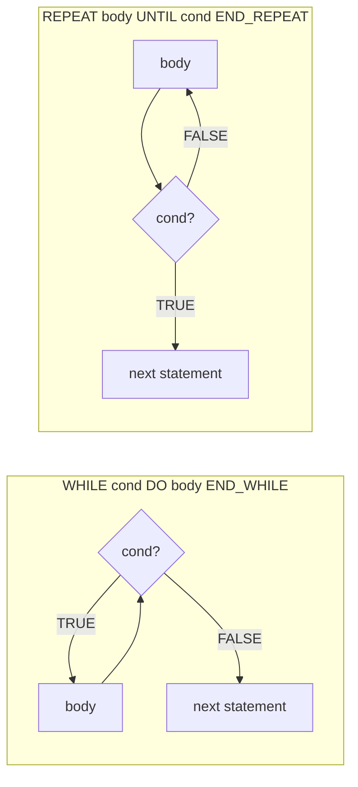
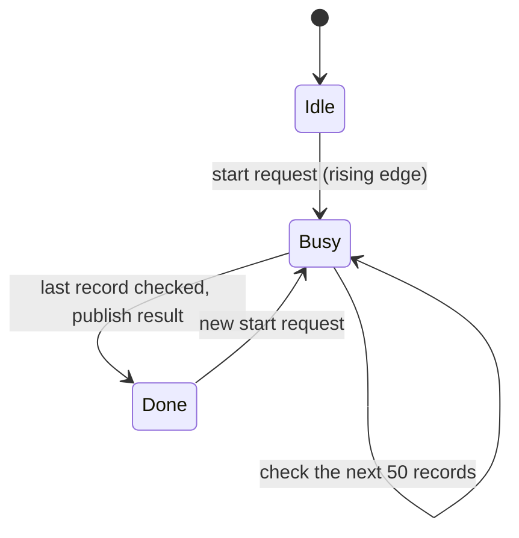

# 10 — Structured Text in Depth

> **Level:** 3 — Structured programming · **Time:** ~10 hours · **Prerequisites:** [Module 05](../05-boolean-logic-and-fbd/), [Module 07](../07-timers/), [Module 08](../08-counters/), [Module 09](../09-math-and-data-handling/)

You have already written small pieces of Structured Text (ST) in earlier modules: a seal-in
equation, a timer call, some scaling maths. This module teaches the language properly: every
statement, the rules for types and expressions, and how to call functions and function blocks.
It also covers the habits that separate PLC code that works on a test bench from code that
still works after ten years of plant modifications.

ST is the language to use when the logic is about *data* rather than *contacts*: scaling and
linearising analog signals, searching tables, filtering noisy measurements, building alarm
texts, sequencing with state machines. It is also the language where a beginner can crash a
PLC with one line: a loop that waits for an input, or an array index one past the end. By
the end of this module you will know why both happen and how to avoid them. You will also know
when ST is the *wrong* choice, because the electrician who has to fault-find at three in the
morning may not read it as easily as ladder.

## Learning objectives

After this module you should be able to:

- Write correct ST using every statement type: assignment, `IF`/`ELSIF`/`ELSE`, `CASE` with
  lists and ranges, `FOR`/`WHILE`/`REPEAT`, `EXIT`, `CONTINUE` and `RETURN`.
- Predict how an expression is evaluated from the operator precedence rules, and use
  parentheses where the rules are not obvious.
- Apply the IEC type rules: choose literals of the right type and convert explicitly with
  `INT_TO_REAL`, `REAL_TO_INT`, `TRUNC` and friends.
- Call functions (formally and non-formally) and function blocks (inputs, `=>` output binding,
  reading instance outputs), and explain why an FB called inside an `IF` misbehaves.
- Explain why a loop runs to completion inside one scan, and design loops that are bounded,
  never wait for inputs, and spread long jobs over several scans.
- Process arrays with loops (sums, minimum and maximum with index, searches, sorting small
  arrays) and protect every variable index against running out of bounds.
- Read MATIEC compiler messages and find the real cause of an error.
- Recognise the Siemens SCL, Rockwell ST and CODESYS dialects, and decide when ST or ladder
  is the better choice for a piece of logic.

## 1. Structured Text at a glance

IEC 61131-3 defines ST as a high-level textual language in the Pascal family. A program is a
list of **statements**, executed from top to bottom every time the program runs, which in a
cyclic task means once per scan.

A **program organisation unit** (POU) in ST has two parts: the *declarations* (`VAR ... END_VAR`
blocks that list the variables and their types) and the *body* (the statements). Here is a
complete program that controls a tank inlet valve between two levels:

```iecst
PROGRAM TankFill
  VAR (* I/O *)
    LevelRaw   AT %IW0   : INT;    (* level transmitter, 0..27648 counts = 0..100 % *)
    InletValve AT %QX0.0 : BOOL;   (* inlet valve solenoid *)
  END_VAR
  VAR
    Level : REAL;                  (* level, % *)
  END_VAR
  VAR CONSTANT
    START_FILL : REAL := 20.0;     (* open the valve below this level, % *)
    STOP_FILL  : REAL := 80.0;     (* close it above this level, % *)
  END_VAR

  Level := INT_TO_REAL(LevelRaw) * 100.0 / 27648.0;

  IF Level < START_FILL THEN
    InletValve := TRUE;
  ELSIF Level > STOP_FILL THEN
    InletValve := FALSE;
  END_IF;
  (* Between the two levels neither branch runs, so the valve keeps its
     last state. That gap is the hysteresis that stops the valve chattering. *)
END_PROGRAM
```

(The 0..27648 range is a common nominal range for analog input cards. Module 14 covers raw
counts and scaling for different vendors.)

Two words you will meet all the time:

- An **expression** *produces a value*: `Level < START_FILL`, `INT_TO_REAL(LevelRaw) * 100.0`,
  `TRUE`. It never changes anything by itself.
- A **statement** *does something*: assigns a value, chooses a branch, repeats a block. Every
  statement ends with a semicolon, including `END_IF;`, `END_CASE;` and the loop ends.

ST is **free-format**: line breaks and indentation mean nothing to the compiler, only to
people. The layout above is a convention (Section 12), not a rule.

## 2. Lexical elements: names, keywords, comments

**Identifiers** (the names of variables, POUs and types) start with a letter or an underscore
and continue with letters, digits and single underscores. MATIEC rejects two underscores in a
row (`Motor__Run`), a trailing underscore (`Motor_`) and a leading digit (`1Motor`), as the
standard's grammar requires. Identifiers and keywords are **not case-sensitive**: `PumpRun`,
`pumprun` and `PUMPRUN` are the same variable. Pick one spelling and use it everywhere, because
people *do* read case.

**Keywords** (`IF`, `THEN`, `END_IF`, `VAR`, `AND`, ...) are reserved, including some you
might want as names, such as `STEP`, `ACTION` and `TRANSITION` from Sequential Function
Charts, and `ON` and `TASK` from the configuration syntax. Less obviously, the
names of the **standard functions and function blocks** are taken too. A variable called `Max`,
`Min`, `Sel`, `Limit`, `Len` or `Move` collides with the function of the same name. MATIEC
then reports a baffling error at the declaration:

```text
 3      Max : REAL;

demo.st:3-5..3-14: error: invalid located variable declaration.
```

Name it `MaxLevel` or `PeakValue` instead. [Appendix E](../appendices/E-matiec-openplc-notes.md)
lists other name clashes.

**Comments** in the IEC standard are written `(* like this *)` and may span several lines.
Edition 3 of the standard added `//` comments that run to the end of the line, and CODESYS,
TIA Portal and Studio 5000 all accept them. MATIEC does **not**. It reports a misleading
"invalid variable" error that runs from the `//` to the next `:=` (see *Common mistakes*), so
all the lab files use `(* *)`. Don't nest `(* (* *) *)` comments either: MATIEC accepts
nesting only with a compiler option (`-n`) that neither OpenPLC nor `plctest` uses.

**Pragmas** are instructions to a particular compiler, written in curly braces:
`{attribute 'qualified_only'}` in CODESYS, for example. They are vendor-specific. Another
tool ignores them or rejects them.

## 3. Literals

A **literal** is a value written directly in the code. The type of a literal matters, because
ST does not convert types for you (Section 4).

| Kind | Examples | Notes |
|---|---|---|
| Integer | `42`, `-7`, `1_000_000` | Underscores are ignored and help readability |
| Integer, other bases | `2#1010_0101` (=165), `8#377` (=255), `16#FF` (=255) | Written `base#digits` |
| Typed integer | `INT#5`, `DINT#40000`, `UINT#65535` | Forces the type |
| Real | `3.14`, `-0.5`, `1.5E3` (=1500.0), `2.0E-3` | A real literal **must** have a decimal point or exponent: `5` is an integer, `5.0` is a real |
| Typed real | `REAL#2.5`, `LREAL#0.1` | |
| Boolean | `TRUE`, `FALSE`, `BOOL#1` | |
| Duration | `T#250ms`, `T#1.5s`, `T#1h2m3s`, `TIME#10s` | Units `d h m s ms`, largest first |
| Date and time of day | `D#2024-01-15`, `TOD#08:30:00`, `DT#2024-01-15-08:30:00` | Long forms `DATE#`, `TIME_OF_DAY#`, `DATE_AND_TIME#` |
| String | `'TT-104'`, `''` (empty) | Single quotes |

Special characters inside a string use the dollar sign: `$'` is a single quote, `$$` a dollar
sign, `$N` a newline, `$T` a tab, `$R` and `$L` carriage return and line feed. So `'It$'s 5$$'`
is the text *It's 5$*. Double-quoted literals are `WSTRING` (wide strings), which MATIEC's C
code generator does not handle, so the labs don't use them.

## 4. Data types and conversions

Module 03 introduced the elementary types (`BOOL`, `INT`, `DINT`, `REAL`, `TIME`, `STRING`, ...)
and Module 09 the arithmetic on them. The rule that matters when writing ST is simple:

> **ST is strongly typed.** Both sides of an assignment, and both operands of an operator,
> must have compatible types. Where they don't, *you* convert, explicitly.

MATIEC applies this strictly, as edition 2 of the standard does. None of these compile (the
explanatory comments were added to the source lines here):

```text
 5      Level := 0;                   (* Level is REAL; 0 is an integer literal *)
demo.st:5-3..5-12: error: Incompatible data types for ':=' operation.

 6      Percent := Level * 100.0 / 5.0;  (* Percent is INT; the expression is REAL *)
demo.st:6-3..6-32: error: Incompatible data types for ':=' operation.

 6      Level := Level + Offset;      (* REAL + INT *)
demo.st:6-12..6-25: error: Data type mismatch for '+' expression.
```

Even `INT` into `DINT`, which can never lose information, needs `INT_TO_DINT` in MATIEC.
Edition 3 of the standard allows a few such "widening" conversions to happen implicitly, and
vendor tools go further: Rockwell Logix converts between `SINT`, `INT`, `DINT` and `REAL`
automatically in assignments and maths, and CODESYS converts many numeric types implicitly
(with a warning where information may be lost). Siemens TIA Portal allows implicit
conversions too, and a block property called *IEC check* makes it stricter. Code that
converts explicitly compiles everywhere, and it shows the reader exactly where a value
changes type. That is why this course always converts explicitly.

The conversion functions are named `<FROM>_TO_<TO>`. The common ones:

| Function | Example | Result | Watch out |
|---|---|---|---|
| `INT_TO_REAL` | `INT_TO_REAL(13824)` | `13824.0` | Exact |
| `REAL_TO_INT` | `REAL_TO_INT(2.7)`, `REAL_TO_INT(-2.7)` | `3`, `-3` | Rounds to nearest. Exact halves differ between platforms ([Appendix E](../appendices/E-matiec-openplc-notes.md)) |
| `TRUNC` | `TRUNC(-2.7)` | `-2` | Cuts off the fraction, toward zero |
| `INT_TO_DINT` | `INT_TO_DINT(-5)` | `-5` | Widening: always safe |
| `DINT_TO_INT` | `DINT_TO_INT(40000)` | `-25536` in MATIEC | Out of range: MATIEC wraps silently. Check the range first |
| `WORD_TO_INT` | `WORD_TO_INT(16#8001)` | `-32767` | Same bits, reinterpreted as signed |
| `BOOL_TO_INT` | `BOOL_TO_INT(TRUE)` | `1` | |
| `INT_TO_STRING` | `INT_TO_STRING(-5)` | `'-5'` | |
| `REAL_TO_STRING` | `REAL_TO_STRING(87.4)` | `'87.40000153'` in MATIEC | The format is platform-specific: build display text yourself (Lab 10-4) |

Two arithmetic reminders from Module 09, because they cause most wrong answers in ST:

- **Integer division truncates.** `(5 + 6) / 2` is `5`, not `5.5`, and `17 / 5 * 5` is `15`.
  Convert to `REAL` *before* dividing when you need the fraction.
- **Integer results wrap on overflow.** Three `INT` readings of 20000 added into an `INT`
  total give `-5536` (60000 is above 32767), so their "average" comes out as `-1845`. Use `DINT` or
  `REAL` for totals.

```iecst
(* Average of three INT flow readings, done properly *)
AvgFlow := (INT_TO_REAL(Flow1) + INT_TO_REAL(Flow2) + INT_TO_REAL(Flow3)) / 3.0;
```

## 5. Expressions and operator precedence

An expression combines operands with operators. When an expression has several operators,
**precedence** decides which is applied first, just as multiplication comes before addition in
ordinary arithmetic.

| Precedence | Operation | Symbol | Example |
|---|---|---|---|
| 1 (highest) | Parentheses | `( ... )` | `(A + B) * C` |
| 2 | Function call | `Name(args)` | `SQRT(X)`, `MAX(A, B)` |
| 3 | Negation, Boolean complement | `-`, `NOT` | `-X`, `NOT Fault` |
| 4 | Exponentiation | `**` | `X ** 2.0` |
| 5 | Multiply, divide, modulo | `*`, `/`, `MOD` | `A * B / C` |
| 6 | Add, subtract | `+`, `-` | `A + B - C` |
| 7 | Comparison | `<`, `>`, `<=`, `>=` | `Level > 80.0` |
| 8 | Equality, inequality | `=`, `<>` | `State = 3` |
| 9 | Boolean AND | `AND`, `&` | `A AND B` |
| 10 | Boolean exclusive OR | `XOR` | `A XOR B` |
| 11 (lowest) | Boolean OR | `OR` | `A OR B` |

Operators of equal precedence are applied left to right: `10 - 4 - 3` is `3`, and
`2.0 ** 3.0 ** 2.0` is `(2.0 ** 3.0) ** 2.0 = 64.0` in MATIEC.

What this means in practice:

- **Comparisons bind tighter than `AND` and `OR`**, so `Level > 80.0 AND PumpRunning` needs no
  parentheses. (Pascal programmers take note: in Pascal the opposite is true.)
- **`AND` binds tighter than `OR`**, exactly as in Boolean algebra (Module 05).
  `A OR B AND C` means `A OR (B AND C)`. If you mean `(A OR B) AND C`, write the parentheses.
  Write them anyway when a line mixes `AND` and `OR`: the next reader will thank you.
- **`NOT` applies to the next operand only.** `NOT A AND B` is `(NOT A) AND B`. To invert a
  whole condition, write `NOT (A AND B)`.
- **Unary minus and `**`.** Standard documents and tools are not consistent about whether
  `-2.0 ** 2.0` is `(-2.0) ** 2.0` or `-(2.0 ** 2.0)`. The table above ranks negation first,
  which is what MATIEC does (it gives `4.0`), but several published operator tables,
  including some vendor manuals, rank `**` above negation, which gives `-4.0`. Always write
  the parentheses.

### Evaluation order and short-circuiting

In `IF i <= 10 AND Buffer[i] > 0.0 THEN`, is `Buffer[i]` read when `i` is 11? The standard
*allows* a compiler to stop evaluating a Boolean expression as soon as the result is known
("short-circuit" evaluation), but does not *require* it. MATIEC happens to short-circuit,
because it translates `AND` into C's `&&`. CODESYS provides separate operators `AND_THEN` and
`OR_ELSE` for guaranteed short-circuiting, which tells you that plain `AND` is not guaranteed
there. Portable code never relies on it:

```iecst
(* Portable: the array is only read when the index is known to be valid *)
IF i >= 1 AND i <= 10 THEN
  IF Buffer[i] > 0.0 THEN
    Count := Count + 1;
  END_IF;
END_IF;
```

## 6. Assignment

The assignment statement is `variable := expression;`. The single `=` is a *comparison*, not an
assignment. Confusing the two is the most common ST typing error, and it shows up in both
directions (see *Common mistakes* below).

Any variable can be assigned, including a whole array or structure of the same type:
`Sorted := History;` copies all five elements of one `ARRAY[1..5] OF REAL` into another.

**Boolean assignments are the ST version of a ladder coil.** Compare:

```iecst
(* 1. Equation: Lamp follows the condition every scan, like an output coil *)
Lamp := Level > 80.0 AND NOT Acknowledged;

(* 2. IF without ELSE: Lamp is set, and nothing ever resets it. This is a
      latch, like a --(S)-- coil with no --(R)-- coil. *)
IF Level > 80.0 THEN
  Lamp := TRUE;
END_IF;
```

Beginners coming from ladder often write form 2 and are surprised that the lamp never goes
out. Every variable keeps its value until something assigns it again, so an `IF` without an
`ELSE` holds its output in whatever state it was last given. Sometimes that is exactly what you
want (the tank fill hysteresis in Section 1 relies on it), but it must be a decision, not an
accident. For a plain "output follows condition", use form 1.

## 7. Selection: IF and CASE

### IF ... ELSIF ... ELSE

```iecst
IF Level >= HiHiLimit THEN
  AlarmText := 'HIGH HIGH';
ELSIF Level >= HiLimit THEN
  AlarmText := 'HIGH';
ELSIF Level <= LoLimit THEN
  AlarmText := 'LOW';
ELSE
  AlarmText := '';
END_IF;
```

- The conditions are tested **in order** and only the **first** true branch runs. Order is
  priority. If the `HiLimit` test came first, a level above the high-high limit would also be
  above the high limit, and the text would say `HIGH`: the high-high branch could never run.
- `ELSIF` and `ELSE` are optional. There can be any number of `ELSIF` branches.
- The keyword is spelt `ELSIF`. `ELSEIF` is an error (see *Common mistakes*). `ELSE IF`
  compiles, but it starts a *new, nested* `IF` that needs its own `END_IF`.
- The condition must be `BOOL`. `IF FaultCount THEN` does not compile:
  `Invalid data type for 'IF' condition (should be BOOL)`. Write `IF FaultCount > 0 THEN`.

### CASE

When one integer value selects between several actions, `CASE` is clearer than a chain of
`ELSIF`:

```iecst
CASE ValveStatus OF             (* status word from a valve positioner *)
  0:
    StatusText := 'Closed';
  1, 2:                         (* a list: either value *)
    StatusText := 'Moving';
  3:
    StatusText := 'Open';
  10..19:                       (* a range: 10 to 19 inclusive *)
    StatusText := 'Positioner fault';
ELSE
  StatusText := 'Unknown status';
END_CASE;
```

- The **selector** (`ValveStatus`) must be an integer type or an enumeration. `CASE` on a
  `REAL` or a `STRING` is rejected: `'CASE' quantity not an integer or enumerated.`
- **Labels** are constants: single values, lists separated by commas, and ranges `lo..hi`.
- `ELSE` catches every value not listed. Include it, even if it only raises a diagnostic,
  because "impossible" values arrive from bad communications and typing errors.
- Don't let labels **overlap**. MATIEC warns about an exact duplicate
  (`warning: Duplicate element found in CASE options.`) but silently accepts overlapping ranges
  such as `1..5:` followed by `4:`, and then runs only the first match. Other compilers treat
  overlaps differently.
- With an enumeration, the labels are the enumeration values:
  `CASE Mode OF E_Mode#Off: ... E_Mode#Auto: ... END_CASE;`. This is the basis of the state
  machines in [Module 13](../13-sequential-control/).

## 8. Iteration: FOR, WHILE, REPEAT, EXIT, CONTINUE, RETURN

### FOR

```iecst
(* Sum the ten hourly flow totals *)
DayTotal := 0.0;
FOR i := 1 TO 10 DO
  DayTotal := DayTotal + HourTotal[i];
END_FOR;

(* Count down in steps of 3: i = 10, 7, 4, 1 *)
FOR i := 10 TO 1 BY -3 DO
  Marks[i] := TRUE;
END_FOR;
```

Rules and behaviour:

- The **control variable** (`i`) and the start and end expressions must be of the same
  integer type. `BY` sets the step and defaults to 1.
- The end test is made **before** each pass. `FOR i := 5 TO 1 DO` (positive step, start above
  end) runs zero times.
- **Never assign the control variable inside the loop.** The standard forbids it, and MATIEC
  rejects it: `Assignment to FOR control variable is not allowed.` Use `EXIT` to leave early.
- **Don't rely on the control variable after the loop.** In MATIEC it is one step past the
  end (6 after `FOR i := 1 TO 5`), but that is an implementation detail. If you need to know
  where a search stopped, copy the index into another variable inside the loop.
- **A step of 0 is a bug waiting to happen.** It compiles without complaint, and what it does
  depends on the compiler and the values. MATIEC treats a zero step like a negative one:
  `FOR i := 1 TO 10 BY 0` runs zero times, but `FOR i := 10 TO 1 BY 0` never ends, because `i`
  stays at 10.
- **Don't loop up to the largest value of the control variable's type.**
  `FOR k := 32760 TO 32767 DO` with an `INT` counter never ends in MATIEC: after 32767, `k + 1`
  wraps to -32768, which is still less than 32767, so the loop carries on. A `DINT` counter, or
  an end value below the maximum, avoids this.

### WHILE and REPEAT

`WHILE` tests its condition **before** each pass, so the body may run zero times. `REPEAT` tests
**after** each pass, so the body always runs at least once:

```iecst
(* WHILE: find the first empty slot in a queue of 20 *)
Slot := 1;
Found := FALSE;
WHILE NOT Found AND Slot <= 20 DO
  IF QueueId[Slot] = 0 THEN
    Found := TRUE;
  ELSE
    Slot := Slot + 1;
  END_IF;
END_WHILE;

(* REPEAT: halve an adjustment until it is small enough (always at least once) *)
Adjust := 10.0;
REPEAT
  Adjust := Adjust / 2.0;
UNTIL Adjust < 0.1
END_REPEAT;
```

Note the syntax of `REPEAT`: there is no semicolon between the `UNTIL` condition and
`END_REPEAT`. (The variable is not called `Step` because `STEP` is a reserved word: it
belongs to Sequential Function Charts.)



A `FOR` loop behaves like the `WHILE` form: test, body, step, test again.

### EXIT, CONTINUE and RETURN

- **`EXIT`** leaves the **innermost** loop immediately. In nested loops it leaves only the
  inner one, and the outer loop carries on. In a 3 x 3 nested loop whose inner body starts
  with `IF j = 2 THEN EXIT; END_IF;`, the rest of the inner body runs once per outer pass,
  three times in total.
- **`CONTINUE`** (added in edition 3, accepted by MATIEC, CODESYS and TIA Portal) skips the rest
  of the current pass and goes on with the next one.
- **`RETURN`** leaves the whole POU (function, function block or program) at once. In a
  function it is the cleanest way to handle special cases early (Section 11). In a *program*
  it also skips every statement below it for this scan, including output logic. Avoid it
  there.

```iecst
(* Linear search with EXIT: position of the first batch code equal to Wanted *)
FoundAt := 0;                     (* 0 = not found *)
FOR i := 1 TO 50 DO
  IF BatchCode[i] = Wanted THEN
    FoundAt := i;
    EXIT;                         (* no need to look further *)
  END_IF;
END_FOR;

(* CONTINUE: total only the pumps that are running *)
RunningFlow := 0.0;
FOR i := 1 TO 4 DO
  IF NOT PumpRunning[i] THEN
    CONTINUE;
  END_IF;
  RunningFlow := RunningFlow + PumpFlow[i];
END_FOR;
```

## 9. Loops and the scan cycle

This is the most important section of the module for anyone coming from PC programming.

A PLC task runs the program, waits, and runs it again. Each run is one **scan**. Inputs are
copied into memory at the start of the scan (the *input image*), the program runs, and the
outputs are written at the end (Module 01). A loop is just part of the program body, so:

> **A loop runs to completion inside one scan.** While it runs, the inputs do not change and
> the outputs are not written. The scan is not finished until the loop is.

```text
 one scan of a 10 ms task
 +------------+--------------------------------------------------+---------------+
 | read       | execute the program body                         | write         |
 | inputs     |   ...  FOR i := 1 TO 1000 DO ... END_FOR;  ...   | outputs       |
 +------------+--------------------------------------------------+---------------+
               <------ all 1000 passes happen here, inputs frozen ------>
 watchdog  |-----------------------------------------------------------> trips if the
                                                                         scan runs too long
```

### Never wait for an input inside a loop

```iecst
(* WRONG: tries to wait for the valve inside one scan *)
ValveOpenCmd := TRUE;
WHILE NOT ValveOpenLS DO
  WaitLoops := WaitLoops + 1;
END_WHILE;
```

This compiles. On a PLC it can never finish: `ValveOpenLS` is read from the input image,
which is not refreshed until the scan ends, and the scan cannot end until the loop does. (Even
the output `ValveOpenCmd` is never written to the valve, so the valve does not move.) The
**watchdog**, a timer that supervises the scan time, eventually trips and the controller stops
with a fault:

- **Siemens S7-1200/1500:** the CPU has a configurable *maximum cycle time* (150 ms by default).
  Exceeding it raises a time error, which the time-error OB (OB 80) can handle. If the overrun
  continues, the CPU goes to STOP.
- **Rockwell Logix:** every task has a watchdog time. If the task does not finish within it, the
  controller takes a major fault (type 6, task watchdog) and stops running logic.
- **CODESYS:** a watchdog (time and sensitivity) can be enabled per task in the task
  configuration. When it trips, the application stops with an exception.
- **`plctest`:** gives up after 60 seconds of real time and asks whether a loop never ends.

In every case the logic stops running and the outputs go to whatever state the controller
uses when it faults, usually off. On a real plant that means a stopped process caused by one
line of code. The correct pattern keeps the waiting *between* scans. You ask once per scan,
remember where you are, and let a timer supervise:

```iecst
(* RIGHT: command the valve and supervise it across scans *)
ValveOpenCmd := TRUE;
OpenTimer(IN := ValveOpenCmd AND NOT ValveOpenLS, PT := T#10s);
ValveFault := OpenTimer.Q;        (* no open feedback within 10 s *)
```

For anything with several steps (open valve, wait, start pump, wait, ...) use a state machine
in `CASE`: one step per state, and the program leaves each state only when its condition is
met on some later scan. [Module 13](../13-sequential-control/) teaches this properly.

### Bound every loop

A loop is *bounded* if you can say, before it starts, the most passes it can make. `FOR` loops
over constant limits are bounded. `WHILE` and `REPEAT` loops are only bounded if something
inside them is guaranteed to reach the exit condition. Good habits:

- Loop over constants (`FOR i := 1 TO NUM_PUMPS`), not over values from an HMI or a
  communications link. If a count must come from outside, clamp it first:
  `n := LIMIT(0, RequestedCount, 100);`.
- Give every `WHILE`/`REPEAT` a second exit condition that counts passes, as in the queue search
  above (`Slot <= 20`).
- Never use a `BY` step computed at run time without checking that it is not zero.

### How long does a loop take?

Multiply the number of passes by the time per pass. The time per pass depends on the CPU and
on what the body does. Say a loop body takes 2 µs on a particular controller. Then 100 passes
add 0.2 ms to the scan, which is harmless. 10,000 passes add 20 ms, which may be more than the
whole scan budget of a fast machine task. Vendor documentation gives instruction execution
times, and most controllers display the current and maximum scan time online. Look at it after
you add a loop.

### Spreading work over several scans

When a job is genuinely large, for example checking 500 logged batch weights, do a fixed chunk
of it per scan and keep the position in a variable between scans:



The complete program is Worked example 2 below. The same idea applies to long searches,
recipe copies and large data transfers.

## 10. Arrays and loops

Arrays and `FOR` loops belong together. Declare an array with its bounds and element type:

```iecst
VAR
  HourTotal : ARRAY[1..24] OF REAL;                       (* 24 elements, 1..24 *)
  Setpoint  : ARRAY[0..3] OF INT := [100, 250, 400, 550]; (* initial values *)
  Flags     : ARRAY[1..16] OF BOOL := [16(FALSE)];        (* 16 copies of FALSE *)
  Grid      : ARRAY[1..3, 1..4] OF INT;                   (* two dimensions: Grid[2, 3] *)
END_VAR
```

Lower bounds can be any integer. Many people use 1-based arrays for things that are numbered
from 1 on the plant (pumps 1 to 4, probes 1 to 10) so that the index *is* the equipment number.
Rockwell Logix arrays always start at 0, while Siemens and CODESYS let you choose.
[Module 12](../12-data-structures/) covers arrays of structures, and Module 09 covers shift
registers.

Keep the size in one place. CODESYS, TwinCAT and TIA Portal let a named constant be used as an
array bound (`ARRAY[1..NUM_PROBES]`). MATIEC rejects a constant declared in the POU's own
`VAR CONSTANT` block (`Subrange upper limit is not a constant value`), and Rockwell Logix array
dimensions are plain numbers too, so the labs write the bound as a literal and use a constant
with the same value for the loop limit.

### Out-of-range indexes

An index outside the declared bounds is one of the most serious bugs in ST, because what
happens depends on the platform:

| Platform | Constant index (`Buf[11]`) | Variable index out of range at run time |
|---|---|---|
| MATIEC / OpenPLC | Compile error: `Array access out of bounds (using constant value of 11, should be <= 10).` | **No check.** The generated C writes to whatever memory is next |
| Rockwell Logix | Flagged when the routine is verified | Major fault (type 4, code 20): the controller stops unless a fault routine clears it |
| Siemens S7-1200/1500 | Flagged by the compiler | Detected at run time and reported as a programming error. Depending on the CPU and the error handling you programmed, it is logged or the CPU goes to STOP |
| CODESYS / TwinCAT | Flagged by the compiler | No check by default. Adding the implicit-check function `CheckBounds` to the project turns on run-time checking |

The MATIEC row deserves a demonstration. In this test program the index was 6 for a
five-element array, and the write landed in the next variable:

```text
 declared:   Before : INT := 111;  Buf : ARRAY[1..5] OF INT;  After : INT := 222;
 memory:     [ Before ][ Buf[1] ][ Buf[2] ][ Buf[3] ][ Buf[4] ][ Buf[5] ][ After ]
                                                                            ^
 Idx := 6;  Buf[Idx] := 999;  ------------------------------------------ writes here
 result:     After = 999, and nothing reports an error
```

A controller that faults is annoying. A controller that silently changes an unrelated
variable, perhaps a setpoint, is dangerous. Protect **every index that comes from a
calculation, an HMI, a recipe or a communications link**:

```iecst
(* The recipe number comes from the HMI: never trust it *)
IF RecipeNo >= 1 AND RecipeNo <= 20 THEN
  TempSetpoint := RecipeTemp[RecipeNo];
  RecipeValid := TRUE;
ELSE
  RecipeValid := FALSE;           (* keep the old setpoint and tell the operator *)
END_IF;
```

`Idx := LIMIT(1, RecipeNo, 20);` also prevents the out-of-range access, but it silently turns
recipe 25 into recipe 20. Decide which behaviour the process needs. Usually it is "reject and
report", not "quietly pick another recipe".

### Array patterns

**Sum and average.** Start the total from zero *every time*, and divide as `REAL`:

```iecst
Sum := 0.0;
FOR i := 1 TO 8 DO
  Sum := Sum + Weight[i];
END_FOR;
MeanWeight := Sum / 8.0;
```

**Minimum or maximum with its index.** Start from the first element, never from `0.0`: if every
value is negative, a maximum that starts at zero is never beaten. Use `>` for "first one wins"
on ties, `>=` for "last one wins":

```iecst
Peak := Weight[1];
PeakAt := 1;
FOR i := 2 TO 8 DO
  IF Weight[i] > Peak THEN
    Peak := Weight[i];
    PeakAt := i;
  END_IF;
END_FOR;
```

**Search.** Stop as soon as you find it (`EXIT`), and use a separate "found" result, because
there may be no match (Section 8).

**Count matches.** `IF Weight[i] < LowLimit THEN Rejects := Rejects + 1; END_IF;` inside the
loop, with `Rejects := 0;` before it.

**Sort a small array.** A bubble sort makes repeated passes and swaps neighbours that are in
the wrong order. After each pass the largest remaining value has "bubbled" to the end:

```iecst
(* Sort Weight[1..8] into ascending order *)
FOR Pass := 1 TO 7 DO
  FOR i := 1 TO 8 - Pass DO
    IF Weight[i] > Weight[i + 1] THEN
      Swap := Weight[i];
      Weight[i] := Weight[i + 1];
      Weight[i + 1] := Swap;
    END_IF;
  END_FOR;
END_FOR;
```

For *n* values this makes n(n-1)/2 comparisons: 10 for 5 values, 45 for 10, 4,950 for 100 and
almost half a million for 1,000. Sorting 5 or 10 values every scan is nothing. Sorting 1,000
every scan is a scan-time problem. Sort large arrays only when the data changes, or spread the
work over scans. Also think about *what* you sort: if the original order matters (a time
history, for example), sort a **copy**. Lab 10-2 shows why.

## 11. Functions and function blocks in ST

Module 11 covers POU types in depth. This section is about *calling* them from ST.

### Calling functions

A **function** takes inputs and returns a value. It has no memory, so the same inputs always
give the same result. You call it inside an expression, in one of two styles:

```iecst
(* Non-formal: values in declaration order. Short, good for well-known functions *)
Output := LIMIT(0.0, Demand, 100.0);          (* LIMIT(MN, IN, MX) *)
Largest := MAX(Flow1, Flow2, Flow3);          (* MAX takes any number of inputs *)

(* Formal: every input named. Order does not matter and the call documents itself *)
Output := LIMIT(MN := 0.0, IN := Demand, MX := 100.0);
Percent := F_PercentOfSpan(Value := Pressure, RangeLo := 0.0, RangeHi := 16.0);
```

- Don't mix the styles in one call. MATIEC rejects `LIMIT(0.0, IN := Demand, MX := 100.0)`
  with a cascade of syntax errors.
- A non-formal call must give every input, in declaration order. A formal call may leave
  inputs out (MATIEC and edition-3 tools then use the input's default value). Leaving inputs
  out hides information from the reader, so do it rarely.
- Functions with extra outputs (`VAR_OUTPUT`) bind them with `=>` in a formal call:
  `Ok := F_Split(Tenths := T, Whole => W, Frac => F);`.
- Every function and function block also has the implicit `EN` input and `ENO` output of the
  standard. They matter in LD and FBD, and are rarely used in ST.

### Writing a function, with an early RETURN

A function returns its result by assigning to its own name. `RETURN` leaves early, which is
the neat way to deal with special cases first (a "guard clause"):

```iecst
FUNCTION F_PercentOfSpan : REAL
  VAR_INPUT
    Value   : REAL;   (* engineering value, e.g. bar *)
    RangeLo : REAL;   (* transmitter range low, e.g. 0.0 bar *)
    RangeHi : REAL;   (* transmitter range high, e.g. 16.0 bar *)
  END_VAR

  (* A zero or negative span is a configuration error: return 0.0
     rather than divide by zero. *)
  IF RangeHi <= RangeLo THEN
    F_PercentOfSpan := 0.0;
    RETURN;
  END_IF;

  F_PercentOfSpan := (Value - RangeLo) / (RangeHi - RangeLo) * 100.0;
END_FUNCTION
```

Make sure **every path assigns the result**. If one path forgets, the function returns the
default value of its type (0 in MATIEC) and no compiler warns you.

MATIEC detail: it cannot pass an array to a function as a `VAR_INPUT` (the generated C does not
build). Pass arrays as `VAR_IN_OUT`, which passes them by reference, or use a function block,
whose `VAR_INPUT` arrays work. The Lab 10-3 solution uses `VAR_IN_OUT`.

### Calling function blocks

A **function block** (FB) has memory: a timer remembers when it started, a counter its count.
So you declare an **instance**, a variable of the FB type, and call the instance:

```iecst
VAR
  FillTimer   : TON;       (* one instance = one timer with its own memory *)
  FillTimeout : BOOL;
  FillElapsed : TIME;
END_VAR

(* ... then, in the body: *)

(* 1. Formal call: inputs with :=, outputs bound with => *)
FillTimer(IN := FillValve, PT := T#10m, Q => FillTimeout, ET => FillElapsed);

(* 2. Read outputs from the instance after the call *)
IF FillTimer.Q THEN
  FillValve := FALSE;
END_IF;

(* 3. Set inputs as fields, then call with no arguments *)
FillTimer.IN := FillValve;
FillTimer.PT := T#10m;
FillTimer();
```

All three forms are standard and MATIEC accepts them. Rules to remember:

- **Inputs keep their last value.** An input not mentioned in a call keeps the value from the
  previous call (or its initial value). `FillTimer(IN := FillValve);` still uses `PT := T#10m` from
  an earlier call. That is convenient, but it can surprise the reader, so set every input in one
  place.
- **Outputs are read-only from outside.** `FillTimer.Q := FALSE;` is rejected:
  `Assignment to FB output variable is not allowed.`
- **Outputs change only when the instance is called.** Reading `FillTimer.Q` *before* the call
  in a scan gives last scan's value. Call first, then use the outputs.
- **You cannot call an FB inside an expression.** `Done := FillTimer(IN := x, PT := T#5s);` is a
  syntax error. Call it as a statement, then read `FillTimer.Q`.
- **Call each instance exactly once per scan, unconditionally.** This one deserves its own
  subsection.

### Why an FB must not be called inside an IF

A timer instance measures time *only when it is called*. Put the call inside an `IF` and the
timer stops seeing the world whenever the condition is false:

```iecst
IF Enable THEN
  DelayT(IN := Run, PT := T#5s);  (* WRONG: only called while Enable is TRUE *)
END_IF;
```

Here is what `plctest` shows for this code (10 ms scan). `Run` stays TRUE the whole time, and
`Enable` goes FALSE after 3 s:

```text
 time            0 s          3 s                        7 s
                  ____________                            ________
 Enable      ____|            |__________________________|
                  _______________________________________________
 Run         ____|
                                                          ________
 DelayT.Q    ____________________________________________|
 DelayT.ET       0 -> 2.99 s  | frozen at 2.99 s         | 5.0 s at once
```

While `Enable` is FALSE the timer is not called, so its outputs freeze: `ET` sits at 2.99 s
and `Q` stays FALSE even after 7 s of `Run`. When `Enable` returns, the timer compares the
current time with the start time it stored 7 s ago and jumps straight to done. Different
implementations do different things in this situation, but none of them does what the author of
the code probably meant. The same applies to counters (a count edge is missed when the counter
is not called) and edge detectors (Module 06).

The fix is to call the instance every scan and put the condition into its input:

```iecst
DelayT(IN := Run AND Enable, PT := T#5s);   (* RIGHT: called every scan *)
```

## 12. Style and readability

Code is read far more often than it is written, and PLC code is read by people with very
different backgrounds: control engineers, instrument technicians, electricians, integrators
from another company, auditors after an incident. Good style is about making their job easy.

**Naming.** Use the course conventions from Module 00 (descriptive names in CamelCase, `_NC`
for normally-closed inputs, `FB_`, `F_`, `ST_`, `E_` prefixes for types), and write constants
in UPPER_CASE as this module does.
Name things in plant terms (`SuctionPressure`, `DutyPump`) rather than programmer terms (`Val1`,
`Tmp`). Put units in the comment on the declaration, or in the name where confusion is likely
(`FlowRate_m3h`). Loop indexes like `i`, `j` are fine for short loops.

**Layout.** One statement per line. Indent the body of every `IF`, `CASE` and loop by the same
amount (two or four spaces; never tabs mixed with spaces). Put `THEN`, `DO` and `OF` at the end
of the line, and line up `END_IF`, `END_FOR` and friends with the statement they close.
Spaces around operators: `Level := Level + Delta;` not `Level:=Level+Delta;`.

**Constants, not magic numbers.** `IF Level > HIGH_LEVEL_ALARM THEN` tells the reader what
80.0 was, and you change it in one place.

**Avoid deep nesting.** Four levels of `IF` are hard to read and, as here, often hide a bug:

```iecst
(* Hard to read, and PumpCmd is never switched off: every IF lacks an ELSE *)
IF AutoMode THEN
  IF NOT PumpFault THEN
    IF SuctionValveOpen THEN
      IF Level < 20.0 THEN
        PumpCmd := TRUE;
      END_IF;
    END_IF;
  END_IF;
END_IF;
```

Pull the conditions into well-named Boolean variables, test the "stop" case first, use
`ELSIF`, and add the stop level that the nested version forgot:

```iecst
PumpPermissive := AutoMode AND NOT PumpFault AND SuctionValveOpen;

IF NOT PumpPermissive THEN
  PumpCmd := FALSE;                 (* any lost permissive stops the pump *)
ELSIF Level < 20.0 THEN
  PumpCmd := TRUE;
ELSIF Level > 80.0 THEN
  PumpCmd := FALSE;
END_IF;
```

In functions, guard clauses with an early `RETURN` (Section 11) do the same job.

**Comments explain why, not what.** The code already says *what*:

```iecst
Count := Count + 1;       (* add one to Count *)              (* useless *)

(* The analyser needs 90 s to flush after a sample-line purge, so readings
   taken earlier are discarded (commissioning finding, see change note). *)
IF PurgeTimer.ET < T#90s THEN
  ReadingValid := FALSE;
END_IF;
```

Good comments record reasons, units, sources (datasheet, P&ID, cause-and-effect matrix row)
and warnings. Update them when the code changes: a wrong comment is worse than none.

### ST or ladder? And who maintains it?

| Consideration | Ladder (LD) | Structured Text (ST) |
|---|---|---|
| Discrete interlocks, permissives, seal-ins | Natural. Online, the highlighted rung shows *which* contact is open | Works, but reads as Boolean equations |
| Maths, scaling, tables, strings | Clumsy: one box per operation | Natural |
| Loops, searching, sorting, data handling | Impractical | Natural |
| State machines | Possible (Module 13) | `CASE` is clear and compact |
| Fault-finding online by electricians and technicians | Familiar and visual | Needs reading values beside lines of text |
| Typical maintainers | Plant electricians, instrument technicians | Control and software engineers |

There is no single right answer, but a common and sensible split is:

- **Interlocks, permissives and I/O-facing logic in LD**, where the people who troubleshoot the
  plant can see power flow and find the open contact quickly.
- **Algorithms in ST, wrapped in function blocks with a clear interface**: filters, scaling,
  table lookups, totalisers, message building. The FB is then called from ladder like any other
  block, and its inside is tested once and rarely touched.
- **Follow the site standard.** Many plants have a rule about which language is used where. A
  program that the site cannot maintain is a liability, however elegant it is.

Never hide a safety-relevant permissive deep inside an ST loop where maintenance cannot find it.
And remember that real safety functions belong in safety-rated systems anyway (Module 20).

## 13. Strings in brief

MATIEC's `STRING` holds up to 126 characters (other platforms allow a declared length, such as
`STRING(80)` in CODESYS or `String[80]` in TIA Portal). The standard string functions include:

| Function | Example | Result |
|---|---|---|
| `CONCAT` | `CONCAT('TT-', '104', ' HI')` | `'TT-104 HI'` (any number of inputs) |
| `LEN` | `LEN('TT-104')` | `6` |
| `LEFT`, `RIGHT` | `LEFT('TT-104', 2)`, `RIGHT('TT-104', 3)` | `'TT'`, `'104'` |
| `MID` | `MID('TT-104', 3, 4)` | `'104'` (3 characters from position 4) |
| `FIND` | `FIND('TT-104', '-')` | `3` (0 when not found) |
| `INT_TO_STRING` | `INT_TO_STRING(87)` | `'87'` |

Strings are compared with `=` and `<>`. For number formatting, don't trust `REAL_TO_STRING`
(Section 4). Lab 10-4 builds a one-decimal display value from integers. Module 12 covers
strings further.

## Worked examples

### Worked example 1: choosing the duty pump by lowest run hours

A pump station has four pumps. When a pump is needed, the one with the fewest run hours
among those *available* (healthy, in auto, not isolated) should start, which evens out wear.

```iecst
PROGRAM PumpSelect
  VAR
    RunHours  : ARRAY[1..4] OF DINT;   (* hour meters of P-101A..D *)
    Available : ARRAY[1..4] OF BOOL;   (* healthy, in auto, not isolated *)
    DutyPump  : INT;                   (* 1..4, or 0 when none is available *)
  END_VAR
  VAR
    i         : INT;
    BestHours : DINT;
  END_VAR

  DutyPump := 0;
  BestHours := 0;
  FOR i := 1 TO 4 DO
    IF NOT Available[i] THEN
      CONTINUE;                        (* skip pumps that cannot run *)
    END_IF;
    (* The first available pump is the best so far; after that, only a
       pump with strictly fewer hours replaces it (ties: lowest number). *)
    IF DutyPump = 0 OR RunHours[i] < BestHours THEN
      DutyPump := i;
      BestHours := RunHours[i];
    END_IF;
  END_FOR;
END_PROGRAM
```

Pass by pass: with `RunHours = [1200, 950, 980, 700]` and pump 4 isolated
(`Available = [TRUE, TRUE, TRUE, FALSE]`), pass 1 takes pump 1 (1200 h), pass 2 replaces it
with pump 2 (950 h), pass 3 keeps pump 2 (980 is not less than 950), and pass 4 is skipped.
`DutyPump = 2`.

Two design points. `DutyPump = 0` doubles as "nothing chosen yet", so no pump is ever compared
with a meaningless starting value. And in a real station you would run this selection only
when a start is requested, not every scan: otherwise the duty would jump to another pump while
the first one is running and its hours overtake the others (compare the duty/standby lab in
[Module 06](../06-edges-and-one-shots/)).

### Worked example 2: spreading a large check over several scans

The batch log holds the last 500 batch weights. On request from the HMI, count how many are
outside 995..1005 kg. Checking all 500 at once would be fine on most controllers. Here it is
spread out to show the technique for jobs that really are too large, 50 records per scan:

```iecst
PROGRAM BatchReview
  VAR
    Weights     : ARRAY[1..500] OF REAL;  (* batch weights, kg, filled by the batch log *)
    StartReview : BOOL;                   (* request from the HMI *)
    Busy        : BOOL;                   (* review in progress *)
    Done        : BOOL;                   (* result is valid *)
    OutOfTol    : INT;                    (* result: batches outside 995..1005 kg *)
  END_VAR
  VAR CONSTANT
    CHUNK       : INT := 50;              (* records checked per scan *)
    LAST_RECORD : INT := 500;
  END_VAR
  VAR
    NextIndex : INT := 1;                 (* where the next chunk starts *)
    Count     : INT;                      (* running count, private until finished *)
    ChunkEnd  : INT;
    i         : INT;
    StartEdge : R_TRIG;
  END_VAR

  StartEdge(CLK := StartReview);
  IF StartEdge.Q AND NOT Busy THEN
    Busy := TRUE;
    Done := FALSE;
    NextIndex := 1;
    Count := 0;
  END_IF;

  IF Busy THEN
    ChunkEnd := MIN(NextIndex + CHUNK - 1, LAST_RECORD);
    FOR i := NextIndex TO ChunkEnd DO
      IF Weights[i] < 995.0 OR Weights[i] > 1005.0 THEN
        Count := Count + 1;
      END_IF;
    END_FOR;
    NextIndex := ChunkEnd + 1;

    IF NextIndex > LAST_RECORD THEN
      Busy := FALSE;
      Done := TRUE;
      OutOfTol := Count;                  (* publish only a complete result *)
    END_IF;
  END_IF;
END_PROGRAM
```

The review takes 10 scans (records 1-50, 51-100, ... 451-500). Three details make it robust:

- The loop is bounded by `ChunkEnd`, which can never pass `LAST_RECORD`, so the last chunk
  cannot run off the end of the array even if the size is not a multiple of `CHUNK`.
- The partial count lives in `Count`. The public result `OutOfTol` is written only when the
  review is complete, so the HMI never shows a half-finished number, and `Done` says when it
  is valid.
- The data can change while the review runs, because the batch log may add a record between
  scans. If that matters, copy the array at the start, or block logging until the review ends.

## Common mistakes and how to avoid them

### Reading MATIEC error messages

`plctest` prints MATIEC's messages as `file:line-column..line-column: error: text`. The range is
where the parser noticed the problem, which is often *after* the real cause. Three habits:

1. **Fix the first error first**, then recompile. Later messages are often knock-on effects.
2. **Look at the line before** the reported position: a missing `;`, `THEN` or `END_IF` is
   noticed only when the next token arrives.
3. **"invalid variable before ':='"** on a line that looks fine usually means the parser lost
   track earlier: an unclosed statement, a misspelt keyword, or a `//` comment.

The examples below are real MATIEC output (the full path is shortened to `demo.st`).

**Missing semicolon.**

```text
 6      Level := Level + 0.5
 7      PumpOn := Level < 20.0;

demo.st:6-22..7-3: error: ';' missing at the end of statement in ST statement.
```

**`=` where `:=` was meant.** A statement that starts with a variable name must be an
assignment, so MATIEC expects `:=` and complains:

```text
 6      PumpOn = Level < 20.0;
 7      Level := Level + 0.5;

demo.st:6-3..7-7: error: invalid variable before ':=' in ST assignment statement.
```

The range ends at the `:=` on line 7: the parser read everything from `PumpOn` up to there as
the left-hand side of one assignment.

And the other way round, `:=` inside a condition:

```text
 7      IF Mode := 2 THEN
 8        PumpOn := TRUE;

demo.st:7-11..8-10: error: invalid variable before ':=' in ST assignment statement.
demo.st:7-11..7-12: error: expecting 'THEN' after test expression in ST 'IF' statement.
```

**Missing `END_IF`.** The parser only notices at `END_PROGRAM` (line 12 here), and then reports
a string of errors inside the `CONFIGURATION` below it. The message is nowhere near the
cause:

```text
 6      IF Level < 20.0 THEN
 7        PumpOn := TRUE;
 8      ELSIF Level > 80.0 THEN
 9        PumpOn := FALSE;
10
11      Level := Level + 0.5;
12    END_PROGRAM

demo.st:12-1..16-26: error: invalid variable before ':=' in ST assignment statement.
demo.st:16-37..16-38: error: ';' missing at the end of statement in ST statement.
... (five more) ...
Parsing failed because of too many consecutive syntax errors. Bailing out!
```

When errors appear at the end of a POU or in the configuration, count your `IF`/`END_IF`,
`FOR`/`END_FOR` and `CASE`/`END_CASE` pairs. Consistent indentation makes a missing one easy to
spot.

**`ELSEIF` instead of `ELSIF`.** `ELSEIF` is not a keyword, so MATIEC reads it as a variable
name at the start of a new statement:

```text
 8      ELSEIF Level > 80.0 THEN
 9        PumpOn := FALSE;

demo.st:8-3..9-10: error: invalid variable before ':=' in ST assignment statement.
```

**`//` comment.** MATIEC does not know `//`. After the `;` it expects a new statement, reads
the comment text up to the next `:=` as the left-hand side of an assignment, and rejects it.
The range starts at the `//`:

```text
 6      Level := Level + 0.5; // simulate filling
 7      PumpOn := Level < 20.0;

demo.st:6-25..7-8: error: invalid variable before ':=' in ST assignment statement.
```

If the `//` comment is the last line of the body, the next `:=` is in the `CONFIGURATION`,
so the error range runs on into the configuration.

**Typos and undeclared variables.**

```text
 6      PumpOn := Levle < 20.0;

demo.st:6-13..6-17: error: Ambiguous enumerate value or Variable not declared in this scope.
```

**Type errors** (Section 4): `Incompatible data types for ':=' operation.` and
`Data type mismatch for '+' expression.` The fix is a conversion function or a literal of the
right type (`0.0` instead of `0`). For a standard function called with the wrong type, for
example `SQRT` of an `INT`:

```text
error: Data type incompatibility for value passed in position 1 when invoking function 'SQRT'
error: Unable to resolve which overloaded function 'SQRT' is being invoked.
```

**Other messages you will meet**, each explained in this module:

| Message | Cause |
|---|---|
| `Invalid data type for 'IF' condition (should be BOOL).` | `IF Count THEN` instead of `IF Count > 0 THEN` |
| `expecting 'THEN' after test expression in ST 'IF' statement.` | Missing `THEN` |
| `Assignment to FOR control variable is not allowed.` | Changing `i` inside `FOR i := ...` |
| `Assignment to FB output variable is not allowed.` | Writing `Timer.Q := ...` |
| `Array access out of bounds (using constant value of 11, should be <= 10).` | Constant index outside the array |
| `'CASE' quantity not an integer or enumerated.` | `CASE` on a `REAL` or `STRING` |
| `warning: Duplicate element found in CASE options.` | The same label twice |
| `invalid located variable declaration.` | A variable named like a standard function (`Max`, `Sel`), or located and unlocated variables mixed in one `VAR` block |

### Mistakes the compiler does not catch

These compile cleanly and then do the wrong thing, which makes them worse.

1. **Integer division.** `Avg := (A + B) / 2;` with `INT`s loses the half. Convert first:
   `(INT_TO_REAL(A) + INT_TO_REAL(B)) / 2.0`.
2. **"Uninitialised" variables.** IEC variables are never random garbage: they start at 0,
   `FALSE`, `''` or their declared initial value. The real trap is that ordinary `VAR`
   variables keep their value *from the previous scan*. A total that is not reset before the
   loop keeps growing: the average is right on the first scan and wrong forever after. In Lab
   10-1 the test runs 100 scans to catch exactly this. Reset accumulators before every loop, and
   initialise a minimum or maximum from the first element (Section 10).
3. **Calling an FB inside `IF`** (Section 11). Call every instance once per scan,
   unconditionally.
4. **`IF` without `ELSE` for an output that should follow a condition** (Section 6). It
   latches.
5. **`REAL` equality.** Adding `0.1` ten times in `REAL` gives `1.00000012`, so
   `IF Total = 1.0` is FALSE. Most decimal fractions cannot be stored exactly (Module 09). Compare
   with a tolerance, `IF ABS(Total - 1.0) < 0.0001 THEN`, or use `>=` for thresholds.
6. **Array index out of range at run time** (Section 10). Check every variable index.
7. **Loops that wait, or are unbounded** (Section 9). They end in a watchdog fault.
8. **Overflow on conversion.** `DINT_TO_INT(40000)` gives `-25536` in MATIEC. Check the range
   before converting down.
9. **Relying on evaluation order.** `IF i <= 10 AND Buf[i] > 0` reads `Buf[11]` on a platform
   that does not short-circuit (Section 5).

## Vendor notes

The core language (assignments, `IF`, `CASE`, loops, expressions) is almost identical
everywhere. The differences are in how variables are declared and addressed, how function
blocks are called, and the extras each vendor adds. The snippets below are in each vendor's
own dialect and do **not** compile with MATIEC.

### Siemens TIA Portal: SCL

Siemens calls its ST dialect **SCL** (Structured Control Language). You write it in the body
of an FC or FB (Module 11). The interface (Input, Output, InOut, Static, Temp, Constant) is
edited in a table above the code rather than in `VAR` blocks.

```iecst
// Siemens SCL (TIA Portal) - not MATIEC syntax
REGION Fill control
    IF #Level < #StartLevel THEN
        "InletValve" := TRUE;          // a global PLC tag: double quotes
    ELSIF #Level > #StopLevel THEN
        "InletValve" := FALSE;
    END_IF;
END_REGION

REGION Fill timeout
    // FillTimer is a multi-instance of TON_TIME in the Static section
    #FillTimer(IN := "InletValve" AND NOT "HighLevelSwitch",
               PT := T#10M);
    #FillTimeout := #FillTimer.Q;
END_REGION
```

- **`#Name`** is a variable from the block's own interface. **`"Name"`** is a global PLC tag or a
  data block, as in `"Tank_DB".Level`. The editor adds the `#` for you.
- **`REGION name ... END_REGION`** groups code into foldable, named sections. It has no effect
  on execution.
- `//` and `(* *)` comments are both accepted.
- IEC timers and counters need **instance data**: either a single-instance data block
  (`"FillTimer_DB".TON(...)`), or a multi-instance declared in the Static section of the calling
  FB, called as `#FillTimer(...)`. Multi-instances keep a machine module's data together.
- Arrays can have any bounds (`Array[0..9] of Real`). Implicit conversions are allowed between
  many types, and the *IEC check* block property makes the compiler stricter.

### Rockwell Studio 5000: Logix ST

In Logix, ST is written in **routines**, which belong to **programs**, which are scheduled by
**tasks** (Module 11). A routine has **no declaration section**: tags are created in the tag
database, scoped to the controller or to the program.

```iecst
// Rockwell Logix ST (Studio 5000) - not MATIEC syntax
IF Level < StartLevel THEN
    InletValve := 1;
ELSIF Level > StopLevel THEN
    InletValve := 0;
END_IF;

// FillTimer is a tag of type FBD_TIMER. Set its members, then call it.
FillTimer.TimerEnable := InletValve AND NOT HighLevelSwitch;
FillTimer.PRE := 600000;               // preset in milliseconds
TONR(FillTimer);
FillTimeout := FillTimer.DN;
```

- **Function block call syntax is limited.** A built-in block such as `TONR` takes its backing
  tag as the only operand. You set inputs as members *before* the call and read outputs as
  members after it. There are no named parameters and no `=>` binding. In ST the timers are
  `TONR`, `TOFR` and `RTOR`. The familiar `TON`, `TOF` and `RTO` are ladder-only instructions.
- **No user-defined functions.** Reusable logic is written as an **Add-On Instruction (AOI)**.
  In ST an AOI is called with its backing tag first, followed by its required parameters; other
  parameters are read and written as members of the backing tag.
- Arrays are always **zero-based**, and an index out of range at run time is a major fault
  (Section 10).
- Numeric types are converted implicitly in assignments and maths. A `REAL` assigned to a
  `DINT` is rounded.
- Besides `:=`, Logix ST has a **non-retentive assignment** `[:=]`: the target is also reset to
  zero when the controller goes into Run mode.
- `//`, `(* *)` and `/* */` comments are accepted.

Connected Components Workbench (CCW, for Micro800 controllers) is closer to the standard:
function blocks are declared as instances and called with named parameters, IEC-style.

### CODESYS and TwinCAT 3

CODESYS (and Beckhoff TwinCAT 3, which is built on it) implements most of edition 3 of the
standard, with extensions. CODESYS calls the result *Extended Structured Text*. Beyond what this module
uses:

- **Object orientation**: methods, interfaces and inheritance on function blocks (edition 3),
  plus properties (a CODESYS/TwinCAT extension, not part of the standard). [Module 21](../21-architecture-and-standards/) introduces them. A taste:

  ```iecst
  // CODESYS / TwinCAT syntax - not testable here (MATIEC has no OOP)
  FUNCTION_BLOCK FB_Pump EXTENDS FB_Motor IMPLEMENTS I_Maintainable
  VAR
      RunHours : LREAL;
  END_VAR

  METHOD ResetHours : BOOL
  THIS^.RunHours := 0;
  ResetHours := TRUE;
  ```

- **Pragmas and attributes** in curly braces, such as `{attribute 'qualified_only'}` on a global
  variable list (forces `GVL.Name`), and conditional compilation.
- **Extra operators:** `AND_THEN` / `OR_ELSE` (guaranteed short-circuit), `S=` / `R=` (set and
  reset assignments), generic conversions `TO_INT(x)`, `STRING(80)` length declarations, `LTIME`.
- **Run-time checks on request:** add *POUs for implicit checks* (`CheckBounds`,
  `CheckDivReal`, ...) to catch out-of-range indexes and division by zero while testing.
- `//` comments, and constants as array bounds.

### OpenPLC and MATIEC

OpenPLC compiles ST with MATIEC, the same compiler `plctest` uses, so code that compiles here
should also build for the OpenPLC Runtime. MATIEC follows edition 2 strictly and adds a few
limits of its own. This module met these:

- no `//` comments, no nested comments, no OOP, no generic `TO_INT`, no `STRING(n)`;
- no implicit conversions at all, not even an integer literal into a `REAL`;
- no named constants from the POU's own `VAR CONSTANT` block as array bounds;
- arrays cannot be passed to a function as `VAR_INPUT` (use `VAR_IN_OUT` or an FB);
- no run-time array bounds checking;
- variables must not share a name with a standard function or FB (`Max`, `Sel`, ...).

[Appendix E](../appendices/E-matiec-openplc-notes.md) has the full list and the workarounds.

## Labs

All four labs are in `labs/`, and they follow the workflow from Module 00. Run the test against
the untouched starter and watch it fail. Then copy the starter into `my-work/`, write the logic,
and run the test until every check says `ok`. Finally, compare your code with
`labs/solutions/`. The interface tables list the names the tests use: keep them exactly.
Everything else inside your program is up to you.

### Lab 10-1: Array statistics

**Goal:** loop over an array to find the minimum, maximum, average and the position of the
maximum.

A cold store has ten air-temperature probes, TT-301 to TT-310. The I/O mapping routine copies
their scaled readings into an array every scan. The refrigeration engineer wants the coldest and
warmest readings, the average, and *which* probe is warmest, because that points to a door left
open or a failing evaporator fan.

| Tag | Address | Type | Description |
|---|---|---|---|
| `Samples` | — | ARRAY[1..10] OF REAL | Probe readings, °C. `Samples[3]` is TT-303 (written by the test) |
| `MinValue` | — | REAL | Coldest reading, °C |
| `MaxValue` | — | REAL | Warmest reading, °C |
| `Average` | — | REAL | Mean of the ten readings, °C |
| `MaxIndex` | — | INT | Probe number (1..10) of the warmest reading |

**Requirements:**

1. Recalculate all four outputs every scan from the current contents of `Samples`.
2. `MinValue` and `MaxValue` are the smallest and largest of the ten readings. They must be
   right when every reading is below zero (a working freezer) and when every reading is above
   zero (a failed one).
3. `Average` is the arithmetic mean of all ten readings.
4. `MaxIndex` is the probe number of the warmest reading. If several probes share the warmest
   value, report the lowest probe number.
5. The results must stay correct scan after scan, including after readings go up *and* down.

**Run:** `python3 tools/plctest.py my-work/10-1-array-statistics.st 10-structured-text/labs/10-1-array-statistics.test`

<details>
<summary>Hint (open only if stuck)</summary>

Before the loop, set the minimum and maximum to `Samples[1]`, the index to 1 and the sum to
`0.0`. Then loop from 1 to 10. Which comparison, `>` or `>=`, keeps the *first* of two equal
maxima? Divide the sum by `10.0`: `Sum / 10` mixes `REAL` and `INT` and does not compile in
MATIEC.
</details>

### Lab 10-2: Median filter

**Goal:** keep a short history in an array, sort a copy, and take the middle value.

A radar level transmitter on a mixing tank gives occasional spikes when the agitator blades or
splashes cross the beam. An average filter would smear every spike into the reading. A
**median filter** ignores it: the middle value of the last five samples never comes from one or
two wild samples, yet it follows a real change after three samples.

A sample clock elsewhere in the program pulses `SampleTrig` (about 10 times a second). Each
rising edge takes one sample.

| Tag | Address | Type | Description |
|---|---|---|---|
| `RawLevel` | — | REAL | Noisy level from the transmitter, % |
| `SampleTrig` | — | BOOL | Sample clock: each rising edge takes one sample |
| `FilteredLevel` | — | REAL | Median of the last five samples, % |
| `Ready` | — | BOOL | TRUE once five samples have been collected |

**Requirements:**

1. On each **rising edge** of `SampleTrig`, store `RawLevel` as the newest sample and discard
   the oldest, keeping the last five. Holding `SampleTrig` TRUE takes only one sample.
2. `Ready` is FALSE at power-up and becomes TRUE when the fifth sample is stored. It then stays
   TRUE.
3. While `Ready` is FALSE, `FilteredLevel` equals the most recent sample (0.0 before the first
   sample). It must not follow `RawLevel` between samples.
4. When `Ready` is TRUE, `FilteredLevel` is the median of the last five samples: the third
   value when they are sorted.
5. The history must stay in time order, so that the sample discarded is always the oldest. Sort
   a **copy**.

**Run:** `python3 tools/plctest.py my-work/10-2-median-filter.st 10-structured-text/labs/10-2-median-filter.test`

<details>
<summary>Hint (open only if stuck)</summary>

Use an `R_TRIG` on `SampleTrig`. On its `Q`, shift `History[1..4]` down by one
(`History[i] := History[i + 1]`), put the new sample in `History[5]` and count samples up to 5.
When five are stored, copy the array (`Sorted := History;`), bubble-sort the copy (Section 10)
and output `Sorted[3]`. Otherwise output `History[5]`. If a test about "the oldest sample"
fails, check that you sort the copy and not the history.
</details>

### Lab 10-3: Tank strapping table

**Goal:** find the right segment of a table with a loop and interpolate, and handle values off
the ends of the table.

A horizontal cylindrical tank (2.0 m diameter, 5.0 m long) holds 15.708 m³ when full. Its
volume is not proportional to level: a 0.1 m change near the bottom or top is far less volume
than near the middle. The tank's **strapping table** (calibration table) gives the volume at a
list of levels, and the PLC interpolates linearly between the breakpoints:

| Level (m) | 0.00 | 0.25 | 0.50 | 0.75 | 1.00 | 1.25 | 1.50 | 1.75 | 2.00 |
|---|---|---|---|---|---|---|---|---|---|
| Volume (m³) | 0.000 | 1.133 | 3.071 | 5.380 | 7.854 | 10.328 | 12.637 | 14.575 | 15.708 |

Worked number: at 1.10 m the level is 40 % of the way from 1.00 to 1.25 m, so the volume is
7.854 + 0.4 × (10.328 − 7.854) = 8.8436 m³.

| Tag | Address | Type | Description |
|---|---|---|---|
| `Level` | — | REAL | Measured level, m (already scaled from the 4–20 mA signal) |
| `LevelBP` | — | ARRAY[1..9] OF REAL | Breakpoint levels, m, strictly increasing (given; the test may load another table) |
| `VolumeBP` | — | ARRAY[1..9] OF REAL | Volume at each breakpoint, m³ (given; the test may load another table) |
| `Volume` | — | REAL | Interpolated volume, m³ |
| `OutOfTable` | — | BOOL | TRUE while `Level` is below the first or above the last breakpoint |

**Requirements:**

1. For a level between two breakpoints, interpolate linearly between them. On a breakpoint, the
   result is that breakpoint's volume.
2. Below `LevelBP[1]`, `Volume` is `VolumeBP[1]`. Above `LevelBP[9]`, `Volume` is `VolumeBP[9]`.
   Never extrapolate: a negative or impossible volume would upset every total and alarm that uses
   it.
3. `OutOfTable` is TRUE only while the level is outside the table. Exactly on the first or last
   breakpoint is inside. It clears by itself when the level returns.
4. Use the values in `LevelBP` and `VolumeBP`, not numbers typed into the logic: the test loads a
   different table (a vertical tank with a dished bottom, whose table starts at 0.1 m).
5. Recalculate every scan.

**Run:** `python3 tools/plctest.py my-work/10-3-strapping-table.st 10-structured-text/labs/10-3-strapping-table.test`

Something to think about: interpolating in this table gives 0.453 m³ at 0.10 m, while the true
geometric volume is about 0.294 m³. Near the bottom the volume curve starts almost flat and then
bends upwards sharply, so the straight line from 0.00 to 0.25 m lies well above it. Real
strapping tables have closer breakpoints where the curve bends most. The table is a model, and
its resolution decides its accuracy.

<details>
<summary>Hint (open only if stuck)</summary>

Handle the two out-of-table cases first. Then loop `i` from 1 to 8 over the *segments*: the
first segment whose upper end `LevelBP[i + 1]` is at or above `Level` is the one you want.
Interpolate with
`VolumeBP[i] + (VolumeBP[i + 1] - VolumeBP[i]) * (Level - LevelBP[i]) / (LevelBP[i + 1] - LevelBP[i])`
and leave the loop with `EXIT`. Without the `EXIT`, every later segment also matches and
overwrites the answer. The reference solution puts the lookup in a `FUNCTION` with guard clauses
and `RETURN`.
</details>

### Lab 10-4: Alarm message text

**Goal:** build a string for the operator from a tag name, a state and a formatted number.

The alarm banner on the HMI shows one line per instrument, for example
`TT-104 HIGH HIGH 95.5 degC`. The alarm logic (Module 16) provides the states. Your job is to
build the text.

| Tag | Address | Type | Description |
|---|---|---|---|
| `TagName` | — | STRING | Instrument tag, for example `'TT-104'` |
| `Units` | — | STRING | Engineering units, for example `'degC'` |
| `PV` | — | REAL | Process value, within -3000.0 .. 3000.0 |
| `HiHi`, `Hi`, `Lo`, `LoLo` | — | BOOL | Alarm states from the alarm logic |
| `BadPV` | — | BOOL | Signal fault: the value cannot be trusted |
| `Message` | — | STRING | Text for the banner |

**Requirements:**

1. Priority, highest first: `BadPV`, `HiHi`, `LoLo`, `Hi`, `Lo`. Only the highest active state
   is shown. The trip-level alarms (`HiHi`, `LoLo`) outrank the pre-alarms (`Hi`, `Lo`): one
   healthy PV cannot be high and low at once, but latched, unacknowledged alarms from the
   alarm logic can leave a low-low active while a high appears.
2. For `BadPV`: `'<TagName> BAD PV'`, with no value, since the value is meaningless.
3. For an alarm: `'<TagName> <STATE> <value> <Units>'` with single spaces, where `<STATE>` is
   `HIGH HIGH`, `HIGH`, `LOW LOW` or `LOW`.
4. `<value>` is `PV` rounded to one decimal place, always with exactly one digit after the
   point, and a minus sign for negative values: `87.4`, `-0.4`, `100.0`, `-12.0`. A value
   that rounds to zero is written `0.0`, never `-0.0`.
5. With no alarm and no fault, `Message` is empty (`''`), and it clears as soon as the last
   alarm clears.

**Run:** `python3 tools/plctest.py my-work/10-4-alarm-message.st 10-structured-text/labs/10-4-alarm-message.test`

<details>
<summary>Hint (open only if stuck)</summary>

Work in whole tenths: `Tenths := REAL_TO_INT(PV * 10.0);`. If `Tenths` is negative, remember
a minus sign and make `Tenths` positive **before** splitting it. Otherwise `-4 / 10` is `0`
and the sign disappears. Then the text is
`CONCAT(Sign, INT_TO_STRING(Tenths / 10), '.', INT_TO_STRING(Tenths MOD 10))`. Choose the state
text with an `IF ... ELSIF` chain in priority order (Section 7: order is priority).
</details>

## Check your understanding

1. What are the values of `17 / 5 * 5`, `-7 / 2` and `(5 + 6) / 2` when all the numbers are
   `INT`? How would you get 5.5 from the last one?
2. A programmer writes `IF StartPB THEN Motor := TRUE; END_IF;` and nothing else for `Motor`.
   What happens when the operator releases Start, and when Stop is pressed? How would you fix
   it?
3. With `A := TRUE; B := FALSE; C := FALSE;`, what is `A OR B AND C`? And is
   `Level > 50.0 AND PumpOn OR Override` evaluated as you would expect? Rewrite it so that
   nobody has to wonder.
4. Why does `WHILE NOT DoorClosedLS DO Tries := Tries + 1; END_WHILE;` stop the PLC, when it
   would be a normal wait loop on a PC? What should you write instead?
5. `Buf` is `ARRAY[1..10] OF INT`. What happens with `FOR i := 0 TO 10 DO Buf[i] := 0; END_FOR;`
   in MATIEC and in CODESYS without `CheckBounds`? What is the equivalent mistake in Rockwell
   Logix, and what does the controller do?
6. Lab 10-1's average is correct on the first scan and then drifts further off every scan. What
   is the most likely mistake?
7. A timer is called as `IF PumpRunning THEN RunTimer(IN := FlowLow, PT := T#20s); END_IF;` to
   detect "running with no flow". Describe two ways this goes wrong and give the correct line.
8. MATIEC reports `demo.st:8-3..9-10: error: invalid variable before ':=' in ST assignment
   statement.` for line 8, `ELSEIF Level > 80.0 THEN`. Why that message, and what is the fix?
9. A search over 2,000 records takes about 30 ms on your controller, and the task runs every
   20 ms with a watchdog of 100 ms. What are your options, and which would you choose?
10. For a pump station (Module 24) with pump interlocks, duty rotation, a flow totaliser and
    alarm texts, which parts would you write in ST and which in ladder, and why?

<details>
<summary>Answers</summary>

1. `17 / 5 * 5` = `3 * 5` = **15**. `-7 / 2` = **-3** (truncation toward zero). `(5 + 6) / 2`
   = `11 / 2` = **5**. For 5.5, divide as `REAL`:
   `(INT_TO_REAL(A) + INT_TO_REAL(B)) / 2.0`.
2. `Motor` stays TRUE when Start is released, which looks right. But it also stays TRUE when
   Stop is pressed, because nothing ever sets it FALSE: an `IF` without `ELSE` is a latch. Write
   the seal-in as one equation, `Motor := (StartPB OR Motor) AND StopPB_NC;`, or add an explicit
   reset branch with stop priority.
3. `AND` binds tighter than `OR`, so it is `TRUE OR (FALSE AND FALSE)` = **TRUE**. The second
   expression is `((Level > 50.0) AND PumpOn) OR Override`, because comparisons bind tighter
   than `AND`, and `AND` tighter than `OR`. If that is what was meant, write
   `(Level > 50.0 AND PumpOn) OR Override`. If the override was meant to bypass only the pump
   condition, write `Level > 50.0 AND (PumpOn OR Override)`. The parentheses make the intent
   visible either way.
4. The loop runs inside one scan. The input image is not refreshed until the scan ends, so
   `DoorClosedLS` can never change while the loop runs, and the scan never ends. The watchdog
   trips and the controller faults. Instead, test the condition once per scan and keep state
   between scans (a step in a `CASE` state machine), with a timer to detect "door did not close
   in time".
5. Index 0 is outside the array. MATIEC accepts it (the index is a variable, so there is no
   compile-time check) and writes to the memory just before `Buf`. Nothing reports an error,
   and whatever is stored there, possibly another variable, is silently overwritten. CODESYS
   without `CheckBounds` also writes outside the array without any error. Logix arrays always start at
   0, so the equivalent Logix bug is an index one past the end (10 for a `DINT[10]`), and that
   causes a major fault that stops the logic. The fix is `FOR i := 1 TO 10`.
6. The sum is not reset to `0.0` before the loop. It is an ordinary `VAR`, so it keeps last
   scan's total and keeps adding to it. Put `Sum := 0.0;` before the `FOR`.
7. First, while the pump is stopped the timer is not called, so its `ET` and `Q` freeze. A
   `Q` that was TRUE stays TRUE, and a half-run timer keeps its elapsed time. Second, when the
   pump starts again, the timer (in MATIEC and similar implementations) compares with its old
   start time and can jump straight to `Q = TRUE`, giving a false alarm. Correct:
   `RunTimer(IN := PumpRunning AND FlowLow, PT := T#20s);` called every scan.
8. `ELSEIF` is not a keyword, so MATIEC reads it as a variable name at the start of a new
   statement. A statement that starts with a variable must be an assignment, so it expects
   `:=` and finds `Level`. Fix: spell it `ELSIF`.
9. At 30 ms the search alone is longer than the 20 ms task interval, so every scan that runs
   it overruns the interval and uses up much of the watchdog margin. Options: spread the search over scans (for
   example 400 records per scan, 5 scans, about 6 ms each), move it to a slower,
   lower-priority task, keep the table sorted and use a faster search, or avoid the search by
   indexing the data differently. Spreading over scans with a Busy/Done handshake
   (Worked example 2) is the usual first choice, because it is simple and the scan time stays
   predictable.
10. There is no single right answer, but a defensible one: pump interlocks, permissives and
    start/stop logic in ladder, so that maintenance can see power flow when a pump will not
    start. The totaliser maths, duty rotation by run hours (Worked example 1) and alarm text
    building go in ST, inside function blocks with clear interfaces that the ladder calls. And
    follow the site standard where there is one.
</details>

## Further reading

- IEC 61131-3, *Programmable controllers – Part 3: Programming languages* (edition 2, 2003;
  edition 3, 2013). The ST syntax is in the textual languages part, and the grammar in an annex.
- PLCopen, *Coding Guidelines*: a vendor-neutral set of rules for readable, safe IEC 61131-3
  code.
- Siemens, *Programming Guideline* and *Programming Styleguide* for S7-1200/S7-1500 (Siemens
  Industry Online Support).
- Rockwell Automation, *Logix 5000 Controllers Structured Text* programming manual.
- CODESYS Online Help, sections on Structured Text and Extended Structured Text.
- K.-H. John and M. Tiegelkamp, *IEC 61131-3: Programming Industrial Automation Systems*,
  Springer.

---

Previous: [09 — Maths, Comparison, Data Movement and Bit Manipulation](../09-math-and-data-handling/) · Next: [11 — Program Organisation and Reusable Function Blocks](../11-program-organization/)
