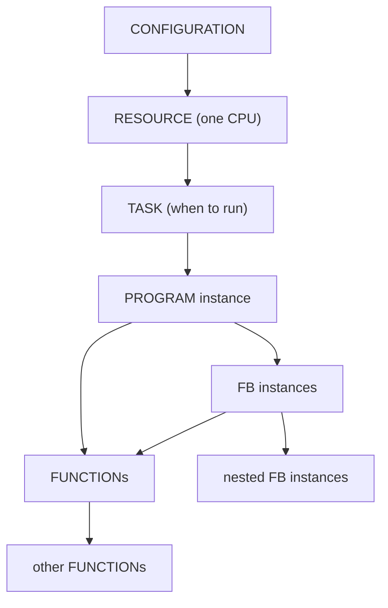
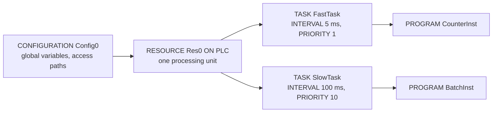
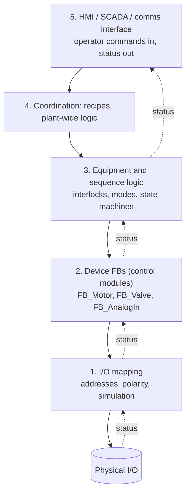
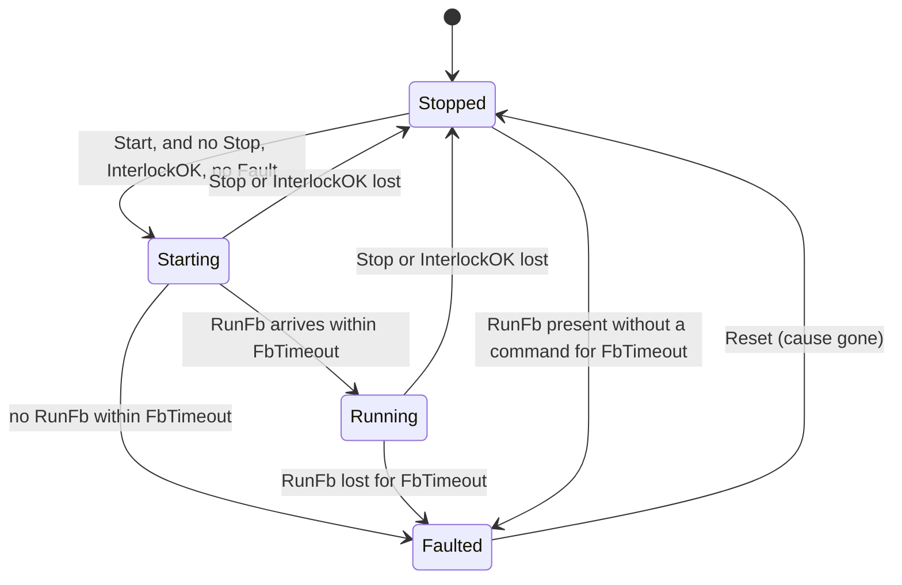

# 11 — Program Organisation and Reusable Function Blocks

> **Level:** 3 — Structured programming · **Time:** ~12 hours · **Prerequisites:** [Module 07](../07-timers/), [Module 10](../10-structured-text/) (and edges from [Module 06](../06-edges-and-one-shots/))

A small machine program can live in one long list of rungs. A water treatment works with 150
motors, 300 valves and 2,000 I/O points cannot. Real PLC projects are built the way the plant
is built: from standard parts that are designed once, tested once, and then used many times.
A motor starter circuit is drawn once as a typical drawing and then repeated for every motor
with a different tag number. In the same way, the motor *logic* is written once as a
**function block** and used for every motor, each copy with its own memory.

This module is about cutting a program into pieces that people can understand, test and
maintain. It covers the three kinds of program unit (PROGRAM, FUNCTION_BLOCK and FUNCTION), the
variable classes that define how data moves between them, the tasks that decide when each piece
runs, and the rules of thumb for laying out a whole project. The practical centre of the module
is the **reusable device function block**. You will build `FB_Motor` and `FB_Valve`, the two
blocks that turn up in nearly every plant, plus a small library of functions.

Good structure is not just tidiness. The night-shift technician who has to find out why Pump 2
will not start will find the answer in minutes if every pump behaves the same way and
all its logic sits in one obvious place. With a thousand hand-written rungs it can take hours.
A bug fixed in a shared function block is fixed in every pump. A plant built from tested blocks
is also much easier to simulate, test and commission (Modules [22](../22-software-engineering/)
and [23](../23-commissioning-and-troubleshooting/)).

## Learning objectives

By the end of this module you will be able to:

- Explain the difference between a PROGRAM, a FUNCTION_BLOCK and a FUNCTION, and choose the right
  one for a job.
- Declare and call function-block instances, and predict what each instance remembers from one
  scan to the next.
- Use each IEC variable class correctly: `VAR_INPUT`, `VAR_OUTPUT`, `VAR_IN_OUT`, `VAR`, `VAR_TEMP`,
  `VAR_GLOBAL`/`VAR_EXTERNAL`, `CONSTANT` and `RETAIN`. Say which values survive a power cycle.
- Configure cyclic, event and freewheeling tasks, choose their intervals and priorities, and
  protect data that two tasks share.
- Lay out a project in layers, with an I/O mapping layer, one writer for every output and as few
  globals as possible.
- Design, document and test a reusable device FB with commands, feedback, parameters, status
  and latched faults.
- Map the IEC model onto Siemens (OB, FC, FB, DB), Rockwell (tasks, programs, routines,
  Add-On Instructions) and CODESYS/TwinCAT (POUs, GVLs, libraries).

## 1. Why organisation matters

Here is what goes wrong in an unstructured program, and what a structured one does instead:

| Symptom in an unstructured program | What a structured program does instead |
|---|---|
| Forty motors, each with its own slightly different copy of the start/stop logic | One `FB_Motor`, forty instances. Every motor behaves the same way. |
| A fix made to Pump 7 but forgotten on Pump 12 | The fix goes into the FB once, and every instance gets it. |
| An output written in three places; the last one wins | Every output has exactly one writer, in the output mapping layer. |
| Input addresses scattered through the logic | Addresses appear in one mapping layer. Re-wiring is a one-line change. |
| Hundreds of global flags that anything can change | Data passes through FB inputs and outputs. The few globals are documented. |
| Everything in one fast task | Fast jobs in a fast task, slow jobs in a slow one, and shared data handled deliberately. |

IEC 61131-3 gives you the tools for all of this. The rest of the module shows how to use them.

## 2. The three kinds of POU

IEC 61131-3 calls a piece of code a **POU**, a *Program Organisation Unit*. There are three
kinds. The difference that matters most is **memory**: does it remember anything between calls?

| | `FUNCTION` | `FUNCTION_BLOCK` (FB) | `PROGRAM` |
|---|---|---|---|
| Memory between calls | **None.** Its variables start afresh on every call. | **Yes.** Each *instance* keeps its own. | Yes |
| Instances | None; you just call it | Declared like variables: `Pump1 : FB_Motor;` | Created by the configuration: `PROGRAM Inst0 WITH MainTask : Main;` |
| Results | One return value, plus optional outputs | Any number of outputs, read as `Pump1.Running` | Variables and physical I/O |
| May call | Functions | Functions and FBs | Functions and FBs |
| Typical jobs | Calculations, conversions, limit checks | Devices, timers, counters, anything with history | Top level of a machine or plant area |
| Standard examples | `ABS`, `SQRT`, `LIMIT`, `SEL`, `REAL_TO_INT` | `TON`, `CTU`, `R_TRIG`, `SR` | Your `Main`, `DosingRoom`, `Area100` |

Programs are started by tasks (section 4). Strict IEC does not let one program call another.
CODESYS allows it.

### 2.1 Functions: same inputs, same answer

A function works like a function on a calculator. Give it the same inputs and it always gives
the same answer, because it has nowhere to keep anything between calls. The result is returned
by assigning to the function's own name:

```iecst
FUNCTION F_Percent : REAL
  (* Value as a percentage of Span. No memory: same inputs, same answer. *)
  VAR_INPUT
    Value : REAL;
    Span  : REAL;
  END_VAR
  IF Span <> 0.0 THEN
    F_Percent := Value / Span * 100.0;
  ELSE
    F_Percent := 0.0;               (* avoid dividing by zero *)
  END_IF;
END_FUNCTION
```

Call it with named (*formal*) arguments, `F_Percent(Value := Level_m, Span := 4.0)`, or with
positional arguments in declaration order, `F_Percent(Level_m, 4.0)`. Named arguments are
easier to read and do not break if someone reorders the declarations.

Two rules follow from "no memory":

- **Any variable declared inside a function starts at its initial value on every call.** A
  counter declared inside a function never gets past 1.
- **The standard does not allow function-block instances inside a function.** A timer needs
  memory that survives until the next scan, and a function has none. MATIEC refuses such code.
  Where a tool does accept it, the timer is normally re-initialised with the function's other
  variables on every call, so it never times out. If you need a timer, you need a function
  block.

An input left out of a function call takes its declared initial value (or zero). This is
different from an FB, as you will see next.

### 2.2 Function blocks: a type and its instances

A function block is a **type**, like a datasheet. An **instance** is one real thing built
to that datasheet, with its own tag number and its own memory:

```text
  FB_Motor            the type: the code exists ONCE in the PLC
     |
     +-- Pump1 : FB_Motor   own data: Start, Stop, RunCmd, Fault, its own TON ...
     +-- Pump2 : FB_Motor   own data
     +-- Fan1  : FB_Motor   own data
```

Calling `Pump1(...)` runs the shared code on Pump1's data. Calling `Pump2(...)` runs the same
code on Pump2's data. Pump 1's fault latch, timers and seal-in have nothing to do with Pump 2's.

Here is a small FB that must be an FB, because it remembers the previous state of its input:

```iecst
FUNCTION_BLOCK FB_StartCounter
  (* Counts motor starts. Needs memory (WasRunning, Starts), so it must be an FB. *)
  VAR_INPUT
    Running : BOOL;
  END_VAR
  VAR_OUTPUT
    Starts  : DINT;
  END_VAR
  VAR
    WasRunning : BOOL;              (* Running on the previous call *)
  END_VAR
  IF Running AND NOT WasRunning THEN
    Starts := Starts + 1;
  END_IF;
  WasRunning := Running;
END_FUNCTION_BLOCK

PROGRAM Main
  VAR
    Pump1Running AT %IX0.0 : BOOL;
    Pump2Running AT %IX0.1 : BOOL;
  END_VAR
  VAR
    TankLevel_m  : REAL := 3.2;
    TankLevelPct : REAL;
    Pump1Starts  : FB_StartCounter;  (* one instance per pump: each keeps its own count *)
    Pump2Starts  : FB_StartCounter;
  END_VAR
  TankLevelPct := F_Percent(Value := TankLevel_m, Span := 4.0);
  Pump1Starts(Running := Pump1Running);
  Pump2Starts(Running := Pump2Running);
END_PROGRAM
```

Counting starts is a real job. Large motors have a limit on starts per hour, because every
direct-on-line start heats the winding.

Three facts about instances catch out almost everyone:

1. **An input you leave out of a call keeps its value from the previous call.** If
   `Pump1(Start := TRUE)` runs on one scan and `Pump1()` on the next, Pump1 still sees
   `Start = TRUE`. A function would see its default value instead. So assign every input on
   every call, or do it deliberately and write a comment saying so.
2. **An instance only does anything when it is called.** Its timers only advance, and its
   edge detectors only see changes, while the call is running. An instance that is skipped
   is frozen, not reset (see *Common mistakes*).
3. **Outputs keep their values between calls.** You can read `Pump1.Running` anywhere, at any
   time. You get the value from the most recent call, so read outputs *after* the call if you
   want this scan's result.

### 2.3 Programs

A `PROGRAM` is the top of a call tree. The configuration creates it and attaches it to a task.
Programs are where physical I/O is normally declared (`AT %IX0.0`). In the standard, fully
specified addresses belong in programs and in configuration or resource declarations, not in
reusable FBs, and MATIEC rejects them inside an FB. Most projects have one program per machine
or plant area, and that program calls the FBs and functions that do the real work.

### 2.4 FBs inside FBs (multi-instances)

An FB may declare instances of other FBs. `FB_Motor` in Lab 11-1 declares a `TON`. Every
`FB_Motor` instance then contains its own `TON` instance, stored inside the motor instance's
memory. Siemens calls this a **multi-instance**. The same idea builds bigger blocks from smaller
ones:

```iecst
FUNCTION_BLOCK FB_PumpSet             (* fragment: a duty/standby pair *)
  VAR
    DutyPump    : FB_Motor;           (* nested instances: their data lives inside   *)
    StandbyPump : FB_Motor;           (* each FB_PumpSet instance, not in globals    *)
    ChangeOver  : TON;
  END_VAR
```

Nesting is how equipment modules are built from control modules in ISA-88 designs
([Module 21](../21-architecture-and-standards/)).

### 2.5 Function or function block?

Ask one question: **does it need to remember anything from one scan to the next?** That
includes edges, timers, latches, counters, filters and previous values. If it does, write an
FB. If it does not, write a function.

| Job | POU | Reason |
|---|---|---|
| Scale raw counts to engineering units | Function | Pure arithmetic |
| Check a value against limits | Function | Pure comparison |
| Pick the middle of three transmitter readings | Function | Pure comparison |
| Debounce a switch | FB | Needs a timer |
| First-order filter on an analog value | FB | Needs the previous output |
| Count starts per hour | FB | Needs edge memory and a time base |
| Control a motor or a valve | FB | Latches, timers, faults |

This is how the parts of a project call each other:



## 3. Variable classes

The keyword in front of a declaration block decides who can see the variable, who can write it
and how long it lives.

| Keyword | Allowed in | Who reads / writes | Kept between calls? |
|---|---|---|---|
| `VAR_INPUT` | FUNCTION, FB, PROGRAM | Caller writes, POU reads | FB: yes (last value). Function: no |
| `VAR_OUTPUT` | FUNCTION, FB, PROGRAM | POU writes, caller reads | FB: yes |
| `VAR_IN_OUT` | FUNCTION, FB, PROGRAM | Both. It *is* the caller's variable | Not stored in the POU |
| `VAR` | all | POU only (private) | FB/PROGRAM: yes. Function: no |
| `VAR_TEMP` | PROGRAM, FB | POU only | **No**: fresh on every call |
| `VAR_GLOBAL` | CONFIGURATION, RESOURCE (the standard also allows PROGRAM; MATIEC does not) | Any POU that declares it `VAR_EXTERNAL` | Yes |
| `VAR_EXTERNAL` | PROGRAM, FB | As the global it refers to | (it is the global) |
| `CONSTANT` | qualifier: `VAR CONSTANT`, `VAR_GLOBAL CONSTANT` | Read only | — |
| `RETAIN` / `NON_RETAIN` | qualifier: `VAR RETAIN`, `VAR_GLOBAL RETAIN` | as the base class | Survives a warm restart |
| `AT %IX0.0` | programs, configuration/resource globals | Located on a physical address | — |
| `VAR_ACCESS` | CONFIGURATION, PROGRAM | Named access paths for communication | — |

One FB can show almost all of them. This compiles and runs as written (the configuration
declares the global `gPlantInService`):

```iecst
TYPE
  ST_Recipe :
  STRUCT
    FillVolume_L : REAL;
    MixTime      : TIME;
  END_STRUCT;
END_TYPE

FUNCTION_BLOCK FB_Demo
  VAR_INPUT
    Enable     : BOOL;           (* copied in at each call; keeps its last value if not assigned *)
    Setpoint   : REAL := 50.0;   (* initial value, used until a caller assigns one *)
  END_VAR
  VAR_OUTPUT
    Active     : BOOL;           (* read from outside as Instance.Active *)
  END_VAR
  VAR_IN_OUT
    Recipe     : ST_Recipe;      (* the caller's own variable, not a copy *)
  END_VAR
  VAR
    Calls      : DINT;           (* private, kept from call to call *)
  END_VAR
  VAR_TEMP
    Scratch    : REAL;           (* private, NOT kept: starts fresh on every call *)
  END_VAR
  VAR RETAIN
    Activations : DINT;          (* kept through a power cycle / warm restart *)
  END_VAR
  VAR CONSTANT
    MAX_VOLUME_L : REAL := 2000.0;  (* cannot be written *)
  END_VAR
  VAR_EXTERNAL
    gPlantInService : BOOL;      (* a global, declared with VAR_GLOBAL in the configuration *)
  END_VAR

  Calls := Calls + 1;
  Scratch := MIN(Recipe.FillVolume_L, MAX_VOLUME_L);
  Recipe.FillVolume_L := Scratch;              (* writes straight back to the caller's recipe *)
  IF Enable AND gPlantInService AND NOT Active THEN
    Activations := Activations + 1;
  END_IF;
  Active := Enable AND gPlantInService;
END_FUNCTION_BLOCK

PROGRAM Main
  VAR
    Batch  : ST_Recipe := (FillVolume_L := 2500.0, MixTime := T#5m);
    Mixer  : FB_Demo;
    Go     : BOOL;
  END_VAR
  Mixer(Enable := Go, Recipe := Batch);
END_PROGRAM

CONFIGURATION Config0
  VAR_GLOBAL
    gPlantInService : BOOL := TRUE;
  END_VAR
  RESOURCE Res0 ON PLC
    TASK MainTask(INTERVAL := T#10ms, PRIORITY := 0);
    PROGRAM Inst0 WITH MainTask : Main;
  END_RESOURCE
END_CONFIGURATION
```

After the first scan `Batch.FillVolume_L` reads 2000.0. The FB clamped the caller's own recipe
through `VAR_IN_OUT`.

### 3.1 Inputs and outputs: the access rules

There are three ways to call an FB, and all three are standard:

```iecst
(* 1. Formal call: name every input, then read the outputs *)
Pump1(Start := Pump1StartPB, Stop := NOT Pump1StopPB_NC, InterlockOK := TRUE,
      RunFb := Pump1RunFb, Reset := ResetPB);
Pump1Contactor := Pump1.RunCmd;

(* 2. Bind an output inside the call with => *)
Pump1(Start := Pump1StartPB, Stop := NOT Pump1StopPB_NC, InterlockOK := TRUE,
      RunFb := Pump1RunFb, Reset := ResetPB, RunCmd => Pump1Contactor);

(* 3. Write inputs as fields, then call with no arguments *)
Pump1.Start := Pump1StartPB;
Pump1();
```

These three calls are shown side by side for comparison. In a real program you call each
instance **once** per scan.

What other code may do with an instance:

| From outside the instance | Allowed? |
|---|---|
| Write an input before the call: `Pump1.Start := TRUE;` | Yes |
| Read an output: `x := Pump1.Running;` | Yes, at any time. You get the value from the last call |
| Write an output: `Pump1.Running := TRUE;` | **No.** MATIEC: "Assignment to FB output variable is not allowed" |
| Read an input: `x := Pump1.Start;` | Accepted by MATIEC, but rarely useful |
| Read an internal `VAR`: `x := Pump1.FbCheck.ET;` | The standard's model keeps `VAR` private. Some compilers (MATIEC included) let you read it anyway. Don't design with it. |

The last row matters for good design. An FB's inputs and outputs are its contract with the
rest of the program. Anything else may change in the next version of the block without warning.
If other code needs an internal value, make it an output.

### 3.2 `VAR_IN_OUT`: passing the caller's variable

A `VAR_INPUT` is a **copy**. The caller's value is copied into the instance at the start of
the call. A `VAR_IN_OUT` is the **caller's own variable**, and when the FB changes it, the
caller's variable changes. It is used:

- to let an FB or function **update data that belongs to the caller**, such as a shared
  statistics record (Lab 11-3), a queue or a recipe;
- to hand over **large structures or arrays without copying** them on every call, where the
  compiler passes them by reference (see the next list);
- to keep data **somewhere other than the instance**: in a retentive area, an HMI data block,
  or a structure several instances share.

Rules and traps:

- **Connect it to a variable, on every call.** A literal or an expression has no storage to
  write back to. MATIEC refuses `U1(N := 5)` and `U1(N := A + B)` with "Assignment to an
  expression or a literal value is not allowed". The standard also expects the connection on
  every call. MATIEC accepts a call that leaves it unconnected, and the FB then works on a
  private copy that the caller never sees. Many other compilers reject such a call. Always
  connect it.
- **Think of it as passing by reference.** The standard describes it that way. Some compilers
  copy the variable in and copy it back at the end of the call. MATIEC does this for FBs (you
  can see it in the generated C code), and Siemens does it for some parameter types. In ordinary
  single-task code you cannot tell the difference.
- **The copy trap.** If you declare a structure as `VAR_INPUT` by mistake and then write to it
  inside the FB, you change only the instance's copy. The caller never sees the update. MATIEC
  compiles this without a word, and it is one of the wrong solutions the Lab 11-3 test catches.
- An FB that changes its caller's data has a side effect. Say so in its header comment.

### 3.3 `VAR` and `VAR_TEMP`

`VAR` in an FB or program is static: it lives as long as the instance. `VAR_TEMP` is scratch
space that exists only while the call runs and starts at its initial value on every call. It
saves memory and makes it obvious that the value is not carried over. **Always write a
`VAR_TEMP` before you read it.** In Siemens, the *Temp* area of a block is not guaranteed to
hold a useful value when the block starts, so reading a Temp before writing it is a classic
Siemens bug.

### 3.4 Globals: `VAR_GLOBAL` and `VAR_EXTERNAL`

A global is declared once, normally at configuration or resource level (the standard also lets
a program declare globals for the POUs it calls). Every POU that uses it must say so with
`VAR_EXTERNAL`, repeating the name and type:

```iecst
CONFIGURATION Config0               (* fragment *)
  VAR_GLOBAL
    gAlarmTrigger : BOOL;
  END_VAR
  (* ... resources ... *)
```

```iecst
PROGRAM EvtProg                     (* fragment *)
  VAR_EXTERNAL
    gAlarmTrigger : BOOL;           (* "this POU uses the global gAlarmTrigger" *)
  END_VAR
```

That `VAR_EXTERNAL` line is a good thing. It makes every dependency on global data visible in
the declaration of the POU that has it. CODESYS and TwinCAT keep globals in *Global Variable
Lists* (GVLs) and do not require `VAR_EXTERNAL`. Adding `{attribute 'qualified_only'}` to a GVL
forces code to write `GVL_Plant.gMode` instead of `gMode`, which keeps the dependency visible
at the point of use. MATIEC does not accept `VAR_GLOBAL` inside a program. Declare it in the
configuration.

`CONSTANT` makes a variable read-only: `VAR CONSTANT MAX_STARTS : INT := 6; END_VAR`. For a
global constant, use `VAR_GLOBAL CONSTANT` and `VAR_EXTERNAL CONSTANT`. Named constants beat
magic numbers scattered through the code.

### 3.5 Retentive data: `RETAIN`, `NON_RETAIN` and `PERSISTENT`

IEC 61131-3 defines two kinds of restart. After a **cold restart** every variable goes back
to its initial value. After a **warm restart**, for example when power returns, `RETAIN`
variables keep their last values and everything else is initialised. Vendors add their own
rules on top. CODESYS and TwinCAT add `PERSISTENT`, a vendor extension. The CODESYS
documentation describes this behaviour:

| Event (CODESYS) | Plain variables | `RETAIN` | `PERSISTENT` |
|---|---|---|---|
| Controller restart / *Reset warm* | Initialised | **Kept** | **Kept** |
| *Reset cold* | Initialised | Initialised | **Kept** |
| Download of the application | Initialised | Initialised | Kept where possible |
| *Reset origin* (back to factory) | Initialised | Initialised | Initialised |

Keeping values through an *uncontrolled* power loss also needs hardware support, such as
non-volatile RAM or a UPS. Check your controller's manual. Siemens and Rockwell handle this
differently again (see *Vendor notes*).

**Which variables should be retentive?** Anything that would be wrong or costly to lose:
run-hour and start counters, production totals, operator-entered setpoints and limits, and
calibration values. **Never** make a run command, a seal-in or a sequence step retentive
without careful thought. A retentive `RunCmd` means the motor restarts on its own when the
power comes back. Machinery safety standards such as IEC 60204-1 require that a machine does
not restart by itself where that could be dangerous.

### 3.6 Initial values

Every variable has an initial value: the one you declare (`FbTimeout : TIME := T#2s`), or the
type's default (0, FALSE, 0.0, T#0s, an empty string). Structures take initialisers such as
`(FillVolume_L := 2500.0, MixTime := T#5m)`. For an FB input, the declared initial value acts
as a **default parameter**. Callers that don't care can leave it out. This is useful, but think
about which way a default fails. In Lab 11-1, `FbTimeout` defaults to 2 s, which is harmless.
`InterlockOK` deliberately has **no** `TRUE` default. If someone forgets to connect the
interlock, the motor must refuse to start, not run with no protection.

## 4. Configuration, resources and tasks

### 4.1 The IEC software model

IEC 61131-3 describes the whole PLC as a **configuration**. It contains one or more
**resources** (usually one per CPU). Each resource has **tasks**, and program instances are
attached to tasks:



Every lab file in this course ends with the smallest possible configuration: one resource,
one 10 ms task and one program instance. CODESYS, TwinCAT, TIA Portal and Studio 5000 build the
same structure in tree views and dialogs instead of text, but the ideas are the same.

### 4.2 Task types

| Type | Runs | IEC syntax | Vendor names |
|---|---|---|---|
| **Cyclic** (periodic) | Every fixed interval | `TASK T(INTERVAL := T#10ms, PRIORITY := 1);` | CODESYS *cyclic*, Rockwell *periodic*, Siemens *cyclic interrupt OB* |
| **Event** | Once, on a rising edge of a trigger | `TASK T(SINGLE := gTrigger, PRIORITY := 2);` | CODESYS *event*, Rockwell *event task*, Siemens *hardware interrupt OB* |
| **Freewheeling** (continuous) | Again and again, as fast as the CPU allows, whenever nothing more important is running | vendor feature | CODESYS *freewheeling*, Rockwell *continuous*, Siemens *OB1 program cycle* |

A cyclic task gives a **constant, known interval**. This matters for PID control, filters,
rate-of-change calculations and anything else that uses "time since last scan"
([Module 15](../15-pid-control/)). A freewheeling task's scan time wanders with the amount of
work it does. It is fine for general sequencing but poor for control loops. An event task
suits rare, urgent events: a hardware interrupt, a request from communications, or a
power-fail warning.

The configuration below compiles in MATIEC and has an event task that starts on each rising
edge of the global `gAlarmTrigger`:

```iecst
CONFIGURATION Config0
  VAR_GLOBAL gAlarmTrigger : BOOL; END_VAR
  RESOURCE Res0 ON PLC
    TASK MainTask(INTERVAL := T#10ms, PRIORITY := 0);
    TASK AlarmTask(SINGLE := gAlarmTrigger, PRIORITY := 2);
    PROGRAM Inst0 WITH MainTask : Main;
    PROGRAM EvtInst WITH AlarmTask : EvtProg;
  END_RESOURCE
END_CONFIGURATION
```

### 4.3 Priorities and pre-emption

When two tasks are due at the same time, the one with the higher priority runs first. On
most modern PLCs a higher-priority task also **pre-empts** a lower one: it interrupts the lower
task in the middle of its scan, runs to completion, and then the lower task carries on where it
stopped. Here a 10 ms fast task interrupts a slow task that needs 20 ms of CPU time (IEC
numbering, where a smaller number means a higher priority):

```text
 t (ms)     0         10        20        30        40
            |         |         |         |         |
 FastTask   ##........##........##........##........##   every 10 ms, 2 ms of work, priority 1
 SlowTask   ..########..########..####................   due at 0 ms, 20 ms of work, priority 10
```

The slow task started at 2 ms, was interrupted at 10 ms and at 20 ms, and finished at 26 ms.
Two things follow. First, the slow task's scan takes longer than its own work time. Second,
the fast task ran **in the middle of** the slow task's scan, and any variable the fast task
wrote may have changed between two lines of the slow task. Section 4.5 deals with that.

Priority numbers are **not** consistent between platforms. Check before you assume:

| Platform | Highest priority | Notes |
|---|---|---|
| IEC 61131-3 | 0 | Larger numbers are lower priority |
| CODESYS / TwinCAT | The smallest number (0 in CODESYS) | CODESYS uses 0–31. In TwinCAT, too, a smaller number is a higher priority. |
| Rockwell Logix | 1 | Periodic and event tasks 1–15. The continuous task always runs at the lowest priority. |
| Siemens S7 | the **largest** number | OB1, the main cycle, has the lowest priority, 1 |

The standard allows either pre-emptive or non-pre-emptive scheduling. MATIEC's generated code
(used by OpenPLC and by `plctest`) runs every task of a resource from one loop. On each base
tick it runs the tasks that are due, one after another. Tasks therefore never interrupt each
other there, whatever their priorities.

### 4.4 Choosing task intervals

- **Start with one cyclic task** (5–20 ms is common for machine logic). Add a task only for a
  reason you can write down.
- **Fast enough for the fastest signal you must see.** A digital input must stay in each state
  for comfortably longer than one task interval, or the whole state can fall between two scans.
  Pulses shorter than the input module's filter time are removed by the filter anyway. Worked
  numbers: bottles 60 mm in diameter on a belt at 1.5 m/s block a photo-eye for
  60 / 1500 = 40 ms, but a 12 mm gap between bottles clears the beam for only 12 / 1500 = 8 ms.
  A 10 ms task can miss that gap completely and count two bottles as one. Use a faster task, or
  better, a high-speed counter input that counts in hardware ([Module 08](../08-counters/)).
- **Slow enough to leave headroom.** Process loops such as level, pressure and temperature rarely
  need faster than 100 ms to 1 s. Running them every 5 ms wastes CPU for no benefit.
- **Match control loops to the process.** The loop interval should be small compared with the
  process response time ([Module 15](../15-pid-control/)), and constant. That means a cyclic
  task.
- **Watch the load.** Every platform has a watchdog that faults the task, or stops the CPU,
  if a scan overruns. Keep plenty of margin and check the task's execution time online during
  commissioning.
- **More tasks are not free.** Every extra task adds shared-data problems. Splitting code into
  tasks is not a cure for code that is simply too slow.

### 4.5 Data consistency between tasks

When two tasks share data, four things can go wrong:

1. **The value changes during a scan.** The slow task reads `gBottles` on line 10 and again on
   line 30. The fast task ran in between, so the two reads disagree.
2. **Torn values.** A value wider than the CPU can copy in one step (a 64-bit `LREAL` on some
   32-bit CPUs, a structure, an array) can be read half-old, half-new.
3. **Two writers.** Both tasks write the same variable. The result depends on timing and
   changes from scan to scan.
4. **I/O that changes under you.** On Rockwell Logix controllers, input data is updated
   asynchronously to the program scan, at the module's requested packet interval (RPI).
   An input tag can change between two rungs of the same routine.

The defences:

- **One writer per variable.** Decide which task owns each shared value. The other tasks only
  read it.
- **Snapshot once.** At the start of the task, copy the shared values into local variables and
  use only the copies for the rest of the scan. Rockwell programmers buffer their inputs this
  way for exactly reason 4.
- **Handshakes for multi-value data.** Write the data, then a sequence number or a "valid"
  flag. The reader copies the data and then checks that the sequence number has not changed.
- **Vendor tools for atomic copies.** Rockwell's `CPS` (synchronous copy) copies a block
  without being interrupted by other tasks. Other platforms offer interrupt-disable
  instructions, semaphores or consistent data areas. See your manual.

Worked example 7.2 puts these rules into a complete two-task program.

## 5. Structuring a project

### 5.1 By equipment, or by function?

There are two classic ways to divide a program:

- **By function:** one program for all I/O mapping, one for all motors, one for all alarms, one
  for all sequences. It is easy to find "all the alarms". It is hard to find "everything about
  Filter 3", because Filter 3 is scattered across six places, and taking one area out of service
  or copying it to a new plant is painful.
- **By equipment or area:** one program (or folder, or Rockwell program) per plant area or
  machine, such as intake, filters, dosing and pump station. Everything about Filter 3 sits
  together. You can take an area out of service or copy it for a new plant by copying its
  folder.

Most good projects are **organised by area, and by function inside each area**. They use a
shared library of device FBs that every area calls. This follows the ISA-88 physical model
(enterprise, site, area, process cell, unit, equipment module, control module), which
[Module 21](../21-architecture-and-standards/) covers properly.

### 5.2 Layers

Inside each area, arrange the code in layers. Commands go down, status comes up, and only the
bottom layer touches the physical I/O:



- A **sequence never writes an output directly**. It asks the device FB, which applies its own
  interlocks and fault handling before anything moves.
- The **HMI never writes outputs**. It writes *requests* (commands), which the logic accepts or
  refuses ([Module 18](../18-hmi-and-scada/)).
- A small machine needs fewer layers, but the same direction of flow.

### 5.3 One writer for every output

[Module 04](../04-ladder-logic/) showed the double-coil bug: two rungs drive the same coil,
and only the last one counts. In a structured project the rule becomes: **every output, and
every variable that stands for a decision, has exactly one place that writes it.** Physical
outputs are written only in the output mapping layer, from the device FB's output. If two
parts of the program want to influence a pump, both feed the pump's FB (as a start request
and an interlock), and the FB alone decides.

### 5.4 The I/O mapping layer

Raw I/O is copied into well-named internal variables at the start of the program. Internal
decisions are copied to the outputs at the end. It looks like extra typing, but it pays back
every time:

- **Re-wiring** a signal to another terminal changes one line, not every rung that uses it.
- **Polarity** is dealt with once. An NC stop button becomes `P301_LocalStop := NOT
  DI_P301_Stop_NC`, and the rest of the program never has to think about it.
- **Simulation** takes a single switch. The mapping layer feeds simulated values instead of real
  ones and holds the real outputs off, so the whole program can be tested on a desk.
- **I/O checkout** at commissioning follows the mapping layer point by point
  ([Module 23](../23-commissioning-and-troubleshooting/)).
- **Moving to other hardware** changes only this layer.
- **Rockwell's asynchronous I/O** (section 4.5) is tamed by copying inputs once per scan.

Worked example 7.1 is a complete program built this way.

### 5.5 Naming conventions

The exact convention matters less than using one consistently. A common, readable set:

| Item | Convention | Examples |
|---|---|---|
| Device instances | The plant tag, so the code matches the P&ID | `P301`, `XV101`, `Fan1` |
| FB types, functions, structures, enums | Prefixes `FB_`, `F_`, `ST_`, `E_` | `FB_Motor`, `F_InRange`, `ST_Stats` |
| Globals | Prefix `g`, or keep them in a named GVL | `gBottles`, `GVL_Plant.Mode` |
| Constants | Upper case | `MAX_STARTS`, `CLEARED_STATS` |
| Raw I/O in the mapping layer | Prefix with the signal type | `DI_LSH301`, `DO_P301_Run` |
| Normally-closed inputs | Suffix `_NC` (Module 00) | `DI_P301_Stop_NC`, `TankLowLow_NC` |
| HMI interface | Prefix by direction | `HMI_AutoMode` (in), `STS_P301_Running` (out) |
| Units | Suffix when not obvious | `Level_m`, `Flow_m3h`, `Weight_g` |

Some coding standards also prefix variables with their data type (`bRunning`, `rLevel`), and
TwinCAT examples often do. It helps in large ST projects and adds clutter in small ones. Follow
your site standard, and [Module 22](../22-software-engineering/) for the wider question of
coding standards.

### 5.6 Keeping globals under control

Globals are tempting because they are visible everywhere. That is exactly the problem: *anything*
can change them, so when one holds a wrong value, *anything* is a suspect. Keep them for:

- the I/O image, if your mapping layer uses global variables;
- the HMI and communications interface structures;
- constants and system-wide values such as a first-scan flag or a 1 s pulse.

Everything else should pass through FB inputs and outputs. An FB that reads globals directly is
no longer reusable, because it only works in a project that has those exact globals, and it
cannot be tested on its own. **The FB rule is simple: no addresses and no globals inside a
device FB.** Everything goes through its pins.

### 5.7 Execution order inside a scan

Code runs top to bottom, and calls run in the order you write them. If `Pump1` uses
`Fan1.Running`, call `Fan1` first and Pump 1 sees this scan's fan status. Call it second and
Pump 1 sees last scan's value, one scan late. One scan of delay rarely matters, but a chain
of such delays through ten blocks can. Circular dependencies, where A needs B's output and B
needs A's, always give a one-scan delay somewhere, so make them deliberate and comment them.
A sensible order is inputs, then equipment logic, then devices, then outputs, which is the
layer order.

## 6. Designing a reusable device FB

### 6.1 Groups of pins

A good device FB interface can be read like a datasheet. Group the pins by purpose:

| Group | Purpose | FB_Motor | FB_Valve |
|---|---|---|---|
| **Commands** | What is wanted | `Start`, `Stop`, `Reset` | `OpenCmd`, `Reset` |
| **Feedback** | What the field says | `RunFb` | `OpenLS`, `ClosedLS` |
| **Protection** | May it move? | `InterlockOK` | (interlocks feed `OpenCmd` in the equipment layer) |
| **Parameters** | How this instance differs | `FbTimeout` | `FailOpen`, `TravelTime` |
| **Outputs to the field** | What to drive | `RunCmd` | `Solenoid` |
| **Status** | What the rest of the program and the HMI need | `Running`, `RunSeconds` | `IsOpen`, `IsClosed` |
| **Faults** | What went wrong (latched) | `Fault` | `TravelFault`, `LimitFault`, `Fault` |

Design principles:

- **No addresses, no globals.** Everything goes through pins, so one FB fits every motor.
- **One FB, one device.** A pump set is two motor instances inside an equipment FB, not one
  FB with twice the pins.
- **Commands are requests.** The FB decides, applying stop priority, interlocks and faults.
- **Status is honest.** `Running` means *proven* running, command AND feedback, not just
  "we asked it to run".
- **Faults latch** and need a reset. Reset never starts anything.
- **Defaults fail safe.** Section 3.6 explains why `InterlockOK` has no `TRUE` default.
- **Everything timed is a parameter**, with a sensible default.
- **No surprises.** Don't write anything outside the FB, except through a documented `VAR_IN_OUT`.
- **Tested once, reused everywhere**, and released with a version number (6.7).

### 6.2 FB_Motor: the canonical motor

`FB_Motor` controls a direct-on-line motor with a run-feedback signal. That signal can be the
contactor's auxiliary contact or, better where one exists, a process signal that proves the
motor is doing its job, such as a flow switch or an airflow switch. Lab 11-1 has you build it.
Here is its behaviour as a state diagram:



The decisions behind it:

- **Stop wins.** Stop, a lost interlock and a fault are all checked before Start.
- **An interlock trip is a stop, not a pause.** When `InterlockOK` comes back, the motor stays
  off until someone gives a new Start. A motor that restarts by itself when a level switch
  resets is a classic accident. One caution: `Start` is a level input, so a request that is
  still held TRUE (typically from automatic logic) counts as a new Start the moment the
  interlock returns or a fault is reset. The automatic logic must drop its request when it
  should not restart (see 6.5 and worked example 7.1).
- **Supervise both directions.** Command without feedback is a *failure to start*, or a *loss
  of feedback* while running (an overload trip, a contactor that drops out). Feedback without
  a command is an *uncommanded run*: welded contactor contacts, or someone running the motor
  from a local panel. One timer can watch for any disagreement between command and feedback.
  Because it restarts every time the two agree, only a disagreement that lasts the whole
  `FbTimeout` counts.
- **Latch the fault** and switch off the command. Reset clears the latch but does not itself
  start the motor. If the cause is still there, the fault comes straight back.
- **Parameters per instance.** A contactor auxiliary contact proves in milliseconds. An airflow
  switch in a duct needs a few seconds. Same FB, different `FbTimeout`. The same allowance also
  covers the stop: after a stop the feedback must drop out within `FbTimeout`. A fan or pump that
  keeps its flow switch made for a long run-down needs a timeout long enough for that too, or a
  separate stop allowance.

### 6.3 FB_Valve: the canonical on/off valve

`FB_Valve` handles a single-solenoid, spring-return actuated valve with an open limit switch
(ZSO) and a closed limit switch (ZSC). Lab 11-2 has you build it.

**Fail position.** The spring decides where the valve goes when the solenoid is de-energised,
or when instrument air or power is lost. The process design chooses the safe direction: a
reactor feed valve *fails closed* (FC), a cooling-water valve *fails open* (FO). You will find
this marked on the P&ID and in the instrument datasheet. The solenoid is energised to move the
valve *away* from its fail position:

| Valve | Wanted position | Solenoid |
|---|---|---|
| Fail closed (air to open) | Open | Energised |
| Fail closed | Closed | De-energised |
| Fail open (air to close) | Open | De-energised |
| Fail open | Closed | Energised |
| Either | Any fault | **De-energised**: the valve goes to its fail position |

A double-acting actuator with two solenoids and no spring usually *fails last* (FL): it stays
where it is. That needs a different FB. Motor-operated valves need another again.

**Limit switch decoding.** Two switches give four combinations, and only two of them are normal:

| ZSO | ZSC | Meaning |
|---|---|---|
| 0 | 1 | Closed |
| 1 | 0 | Open |
| 0 | 0 | Travelling, or stuck between positions (normal only while it moves) |
| 1 | 1 | **Impossible**: a switch fault, a mis-adjusted cam or a wiring fault |

**Supervision.** A *travel fault* is raised when the valve is not in the commanded position for
longer than its travel time. This covers valves that never leave, never arrive, or drift away
later, for example on loss of instrument air. The allowance must restart when the command
changes, so a valve reversed halfway through its stroke gets a full travel time. A
*discrepancy fault* is raised when both limit switches are made at once, after a short filter
so that a momentary overlap is ignored.

### 6.4 Modes

Most device FBs in a real plant also handle **modes**:

- **Auto / Manual.** In Auto the device follows the program (a sequence or a control loop). In
  Manual it follows the operator's HMI buttons. Switching from Auto to Manual should be
  *bumpless*: the device keeps its current state until the operator acts.
- **Local / Remote.** In Local the device is worked from its local control station in the
  field, and the PLC normally only monitors it. A local stop button should work in every mode,
  and it is usually hardwired as well.
- **Out of service / Maintenance.** The device is locked off and its alarms are suppressed
  while it is being worked on (this does *not* replace lock-out/tag-out).
- **Simulation.** Feedback is generated from the command, so the logic can be tested without
  the plant.

The key rule: **interlocks apply in every mode.** Manual means "the operator chooses", not
"the protection is off". In a device FB, mode selection often looks like this fragment:

```iecst
(* Where does the run request come from? *)
IF AutoMode THEN
  Request := AutoCmd;              (* level command from the sequence or control logic *)
ELSIF ManStop THEN
  Request := FALSE;                (* operator commands from the HMI; stop first *)
ELSIF ManStart THEN
  Request := TRUE;
END_IF;                            (* manual with no button pressed: keep the last state *)
(* Interlocks apply in EVERY mode *)
IF NOT InterlockOK THEN
  Request := FALSE;
END_IF;
```

Worked example 7.1 does the same job outside the FB, which is simpler when only one program
uses the modes. Module 18 covers the HMI side: who owns the mode, and command/status
handshakes.

### 6.5 Fault latching and reset philosophy

- **Latch faults.** A fault that clears itself leaves the operator no clue. Latch it, show it,
  and make someone acknowledge it with a reset.
- **Reset never starts anything.** Starting needs a separate, deliberate command. One nuance:
  if the *program* is still requesting the device in Auto, the device will restart after the
  reset. That is a plant-philosophy decision, so document it (see worked example 7.1).
- **Reset works only when the cause has gone.** A latch that re-trips at once is honest. It
  tells the operator the problem is still there.
- **Reset scope.** A common reset button per area is normal. Per-device resets from the HMI
  are also common. Keep safety-function resets separate and hardwired according to the safety
  design ([Module 20](../20-functional-safety/)).
- **Faults, trips and alarms** are related but different. [Module 16](../16-alarms-and-diagnostics/)
  covers alarm management, first-out annunciation and diagnostics in depth.

### 6.6 Documenting an FB

A reusable FB needs a header that answers what a maintainer will ask. The labs' reference
solutions follow this pattern:

```text
(* ------------------------------------------------------------------
   FB_Name - one-line purpose.

   Behaviour     what each command does, priorities, what latches,
                 what reset does, timing
   Interface     pin groups (or a table in the design document)
   Assumptions   e.g. "RunFb from a contactor aux contact or flow switch"
   Side effects  anything written through VAR_IN_OUT
   Version       1.0  first release
                 1.1  what changed, why, who
   ------------------------------------------------------------------ *)
```

Put a one-line comment on every pin as well. Those comments are what the IDE shows when
someone hovers over a pin.

### 6.7 Testing and releasing a device FB

Device FBs live in a **library**: a CODESYS library, a TIA Portal global library with
versioned types, or a set of exported Rockwell AOIs. Treat them like the product they are:

- Test each FB on its own first, with a test file like the ones in this course
  ([Module 22](../22-software-engineering/)). Test it again in a real program.
- Release it with a version number and a change note.
- A change to a released FB changes **every instance** at once. That is a strength (one fix
  everywhere) and a risk (one bug everywhere). Review changes carefully.
- A change to an FB's *interface* often means its instance data is re-initialised on the
  next download: timers, latches and counters go back to their initial values. Some platforms
  can avoid this in some cases, but plan interface changes for a shutdown unless you are sure.

## 7. Worked examples

### 7.1 A layered sump pump station

A sump is pumped out by pump P-301. A high level switch (LSH-301) starts the pump and a low
level switch (LSL-301) stops it. The low switch also protects the pump from running dry in
every mode. The operator can switch to Manual, and a simulation mode lets the logic be tested
without the plant. The program uses `FB_Motor` from Lab 11-1, so compile it together with your
FB. The layers from 5.2 are marked in the code. A single pump station needs no coordination
layer 4.

```iecst
PROGRAM SumpPumping
  VAR (* physical inputs: the only place addresses appear *)
    DI_LSL301       AT %IX0.0 : BOOL;  (* sump low level switch: TRUE = level above it *)
    DI_LSH301       AT %IX0.1 : BOOL;  (* sump high level switch: TRUE = level above it *)
    DI_P301_Aux     AT %IX0.2 : BOOL;  (* P-301 contactor auxiliary contact *)
    DI_P301_Stop_NC AT %IX0.3 : BOOL;  (* P-301 local stop button, NC *)
  END_VAR
  VAR (* physical outputs *)
    DO_P301_Run     AT %QX0.0 : BOOL;  (* P-301 contactor coil *)
  END_VAR
  VAR (* HMI interface: commands written by the HMI *)
    HMI_Simulate    : BOOL;            (* TRUE = run the logic against simulated inputs *)
    HMI_AutoMode    : BOOL := TRUE;    (* TRUE = level control, FALSE = operator control *)
    HMI_ManStart    : BOOL;            (* one-shot commands from HMI buttons... *)
    HMI_ManStop     : BOOL;
    HMI_Reset       : BOOL;            (* ...cleared by the PLC once used *)
    SIM_LevelLow    : BOOL;            (* simulated level switches, set from the HMI *)
    SIM_LevelHigh   : BOOL;
    SIM_LocalStop   : BOOL;            (* simulated local stop: TRUE = pressed *)
  END_VAR
  VAR (* HMI interface: status read by the HMI *)
    STS_P301_Running : BOOL;
    STS_P301_Fault   : BOOL;
  END_VAR
  VAR (* internal image: everything after layer 1 uses only these names *)
    LevelLow        : BOOL;            (* TRUE = level above the low switch *)
    LevelHigh       : BOOL;            (* TRUE = level above the high switch *)
    P301_RunFb      : BOOL;
    P301_LocalStop  : BOOL;            (* TRUE = local stop pressed, or its wire broken *)
    AutoRequest     : BOOL;            (* level control wants the pump running *)
    P301_Start      : BOOL;            (* start/stop after mode selection *)
    P301_Stop       : BOOL;
    SimContactor    : TON;             (* simulated contactor: pulls in 200 ms after the command *)
    P301            : FB_Motor;        (* device FB from Lab 11-1 *)
  END_VAR

  (* ---- Layer 1: input mapping. Polarity, simulation and re-wiring are
     dealt with here and nowhere else. ---- *)
  SimContactor(IN := P301.RunCmd, PT := T#200ms);
  IF HMI_Simulate THEN
    LevelLow       := SIM_LevelLow;
    LevelHigh      := SIM_LevelHigh;
    P301_RunFb     := SimContactor.Q;
    P301_LocalStop := SIM_LocalStop;
  ELSE
    LevelLow       := DI_LSL301;
    LevelHigh      := DI_LSH301;
    P301_RunFb     := DI_P301_Aux;
    P301_LocalStop := NOT DI_P301_Stop_NC;   (* NC: pressed or wire broken = stop *)
  END_IF;

  (* ---- Layer 3: equipment logic. Pump down from the high switch to the
     low switch; the gap between the two switches is the hysteresis. ---- *)
  IF LevelHigh THEN
    AutoRequest := TRUE;
  ELSIF NOT LevelLow THEN
    AutoRequest := FALSE;
  END_IF;

  (* Mode selection: where do Start and Stop come from? *)
  IF HMI_AutoMode THEN
    P301_Start := AutoRequest;
    P301_Stop  := NOT AutoRequest;
  ELSE
    P301_Start := HMI_ManStart;
    P301_Stop  := HMI_ManStop;
  END_IF;

  (* ---- Layer 2: the device, called exactly once per scan. The local stop
     and the dry-run interlock (LevelLow) apply in every mode. ---- *)
  P301(Start       := P301_Start,
       Stop        := P301_Stop OR P301_LocalStop,
       InterlockOK := LevelLow,
       RunFb       := P301_RunFb,
       Reset       := HMI_Reset);

  (* ---- Layer 1 again: output mapping. The one place DO_P301_Run is
     written. In simulation the real contactor stays off. ---- *)
  DO_P301_Run := P301.RunCmd AND NOT HMI_Simulate;

  (* ---- Layer 5: HMI interface. Status out, and clear the one-shot HMI
     commands. ---- *)
  STS_P301_Running := P301.Running;
  STS_P301_Fault   := P301.Fault;
  HMI_ManStart := FALSE;
  HMI_ManStop  := FALSE;
  HMI_Reset    := FALSE;
END_PROGRAM
```

(Add the usual `CONFIGURATION Config0 ... END_CONFIGURATION` block to run it.)

How it behaves, scan by scan, in Auto with the plant connected:

1. The sump fills and LSH-301 makes. On that scan, layer 1 sets `LevelHigh`, layer 3 latches
   `AutoRequest`, mode selection passes it on as `P301_Start`, and `P301` sets `RunCmd`. The
   output mapping energises the contactor, all on the same scan.
2. Within the 2 s `FbTimeout` the auxiliary contact closes and `P301.Running` goes TRUE. If it
   doesn't, `P301.Fault` latches and the pump stops.
3. The level falls below LSH-301, but `AutoRequest` stays latched, so the pump keeps running.
   That is the hysteresis between the two switches.
4. The level falls below LSL-301. `AutoRequest` drops, so `P301_Stop` goes TRUE. `LevelLow`
   is also FALSE, so the interlock would have stopped the pump anyway.
5. The operator switches to Manual while the pump runs. `P301_Stop` is now `HMI_ManStop`,
   which is FALSE, so the pump keeps running: a bumpless change. It stops when the operator
   presses Stop, or when the level reaches the low switch, because the interlock still applies.

Things to notice: the physical addresses appear only in the declarations. `DO_P301_Run` has
exactly one writer. The FB instance is called once, with inputs chosen by the mode logic above
it, rather than being called twice in an IF/ELSE. The HMI never touches the output. It writes
requests that the PLC clears once they have been used. Finally, look at the Auto-restart nuance
from 6.5: if the pump faults in Auto while the level is high, pressing Reset restarts it,
because the level control still requests it. That is usually what the operator wants when they
reset in Auto, but it is a decision to make on purpose and to write in the operating
description.

### 7.2 Two tasks sharing a counter safely

A photo-eye counts bottles on a fast line, so counting runs in a 5 ms task. Grouping
bottles into cases of 24 is not urgent, so it runs every 100 ms. The global `gBottles` has
**one writer**, the fast task, and the slow task takes **one snapshot** of it per scan:

```iecst
PROGRAM BottleCounter
  (* Runs in the fast task: must not miss a bottle. The ONLY writer of gBottles. *)
  VAR
    BottlePE AT %IX0.0 : BOOL;       (* photo-eye: TRUE while a bottle blocks the beam *)
  END_VAR
  VAR_EXTERNAL
    gBottles : DINT;                 (* bottles counted since power-up *)
  END_VAR
  VAR
    PeEdge : R_TRIG;
  END_VAR
  PeEdge(CLK := BottlePE);
  IF PeEdge.Q THEN
    gBottles := gBottles + 1;
  END_IF;
END_PROGRAM

PROGRAM BatchManager
  (* Runs in the slow task: only READS gBottles, and reads it once per scan. *)
  VAR_EXTERNAL
    gBottles : DINT;
  END_VAR
  VAR
    BatchSize   : DINT := 24;        (* bottles per case *)
    Snapshot    : DINT;              (* this scan's copy of gBottles *)
    BatchStart  : DINT;              (* count at which the current case started *)
    InCase      : DINT;              (* bottles in the current case *)
    CasesFilled : DINT;
  END_VAR
  Snapshot := gBottles;              (* read the shared value ONCE; use only the copy below *)
  InCase := Snapshot - BatchStart;
  IF InCase >= BatchSize THEN
    CasesFilled := CasesFilled + 1;
    BatchStart := BatchStart + BatchSize;   (* not ":= gBottles": that second read could
                                               include bottles counted after the snapshot *)
    InCase := Snapshot - BatchStart;
  END_IF;
END_PROGRAM

CONFIGURATION Config0
  VAR_GLOBAL
    gBottles : DINT;
  END_VAR
  RESOURCE Res0 ON PLC
    TASK FastTask(INTERVAL := T#5ms, PRIORITY := 1);
    TASK SlowTask(INTERVAL := T#100ms, PRIORITY := 10);
    PROGRAM CounterInst WITH FastTask : BottleCounter;
    PROGRAM BatchInst WITH SlowTask : BatchManager;
  END_RESOURCE
END_CONFIGURATION
```

Why `BatchStart := BatchStart + BatchSize` and not `BatchStart := gBottles`? The second form
has two faults. It reads the global a second time, and on a pre-emptive PLC the fast task may
have counted more bottles since the snapshot. It also throws away any bottles beyond 24 that
arrived in the same 100 ms. With the snapshot and the arithmetic, not a bottle is lost. A
`DINT` is 32 bits, so on a 32-bit CPU a single read of it is not torn. If the shared data were a
structure (count, rate and a status word together), a single snapshot copy could still be
interrupted halfway. That is when you need a handshake or your platform's synchronous-copy
instruction (section 4.5).

## 8. Common mistakes and how to avoid them

1. **Calling an FB instance inside an IF.**
   ```iecst
   IF AutoMode THEN
     FillTimer(IN := Filling, PT := T#30s);   (* WRONG: not called in Manual *)
   END_IF;
   ```
   In Manual the timer isn't called at all, so its `Q` and `ET` freeze at their last values and
   it never sees `Filling` go FALSE. A timer that was running when Auto was left can count the
   whole time spent in Manual and finish the moment Auto returns.
   **Call every instance on every scan**, and put the condition on its *inputs*:
   `FillTimer(IN := Filling AND AutoMode, PT := T#30s);`.
2. **Calling the same instance twice per scan**, for example once in each branch of a mode IF.
   The second call overwrites the first call's inputs, and the timers and edges inside see
   confusing sequences. Choose the inputs first, then call once (worked example 7.1).
3. **One instance for two devices.** Copying `Pump1(...)`, pasting it and forgetting to rename
   it to `Pump2` makes both pumps share one memory. The symptoms are bizarre. Declare one
   instance per device, named after its tag.
4. **Expecting a function to remember.** A counter or a "previous value" inside a function
   resets on every call. If it needs memory, it is an FB. For report-by-exception, the caller
   holds the memory and passes it back in, as `F_Deadband` does in Lab 11-3.
5. **Forgetting that FB inputs keep their last value.** If an input is assigned in one call
   and left out of the next, the old value is still there. Assign every input on every call.
6. **Two writers for one output.** This is the double-coil bug at project scale. Write each
   output in exactly one place, from one device FB.
7. **Addresses or globals inside a device FB.** An FB that reads `%IX3.2` or `gTank1Level` only
   works for one device in one project. Pass everything through pins.
8. **Reading a scratch variable before writing it.** An IEC `VAR_TEMP` starts at its initial
   value on every call, and a Siemens Temp may not start at any useful value. Either way, code
   that reads a temporary before writing it usually means the author expected it to remember
   something from the last scan. It won't.
9. **Making commands retentive.** A `RETAIN` seal-in or `RunCmd` restarts equipment when the
   power returns. Retain counters and setpoints, never commands.
10. **Writing a global from two tasks,** or reading it several times in a slow task that can be
    pre-empted. Use one writer and one snapshot.
11. **Changing a released FB casually.** Every instance changes, and an interface change may
    reset the instance data on download. Version the FB, review the change, and test it again.
12. **A reset or an interlock that restarts equipment.** Many "and then it started by itself"
    incidents trace back to one of these. A reset clears faults. Only a start command starts.
13. **A default that bypasses protection.** `InterlockOK : BOOL := TRUE` makes a forgotten
    connection silently disable the interlock. Choose defaults that fail safe.
14. **Adding tasks to fix a slow program.** More tasks bring more shared-data problems. First
    find out why the scan is slow: a huge loop, string handling, or too much work in a fast
    task.

## 9. Vendor notes

### Siemens (TIA Portal, S7-1200/1500)

- **Block types.** *OBs* (organisation blocks) are the operating system's entry points, the
  equivalent of tasks. *FCs* are functions: no memory of their own, with Temp variables. *FBs*
  are function blocks, and each call needs memory. *DBs* are data blocks: global DBs for shared
  data, and *instance DBs* holding one FB instance's memory each. *PLC data types* are
  structures (UDTs).
- **Instances.** Calling an FB from an OB or an FC normally uses a **single-instance DB** for
  that call (TIA offers to create one). Calling an FB from inside another FB can declare the instance in
  the caller's *Static* section, as a **multi-instance**. Its data is then stored inside the
  caller's instance DB, which keeps the number of DBs manageable. In SCL:

  ```text
  "Pump1_DB"(Start := "Pump1_StartPB", RunFb := "Pump1_Aux");   // single instance: its own DB
  #Pump1(Start := #StartReq, RunFb := #RunFb);                   // multi-instance, inside an FB
  ```

  (TIA Portal SCL syntax: quotes mark global names, `#` marks local ones.)
- **Encapsulation.** Instance DBs are data blocks, visible to all code, so
  `"Pump1_DB".Fault` can be accessed from anywhere. HMIs often read status that way. For logic,
  use the FB's outputs.
- **OBs** (the classic S7 numbering; not every CPU family supports every OB):

  | OB | Purpose |
  |---|---|
  | OB1 | Main program cycle: runs continuously, lowest priority |
  | OB10–OB17 | Time-of-day interrupts |
  | OB20–OB23 | Time-delay interrupts |
  | OB30–OB38 | Cyclic interrupts: fixed intervals, for control loops |
  | OB40–OB47 | Hardware interrupts: events from I/O modules |
  | OB80 | Time error, for example the cycle time was exceeded |
  | OB82 | Diagnostic interrupt from a module |
  | OB83 | Module removed or inserted |
  | OB86 | Rack or station failure |
  | OB100 | Startup (warm restart): runs once on the change from STOP to RUN |
  | OB121 | Programming error |
  | OB122 | I/O access error |

  Depending on the CPU family and the error, a missing error OB can mean the CPU goes to STOP
  when that error happens. Check the manual for your CPU.
- **Retentivity** is set per variable in optimised DBs (the *Retain* column), and for an FB's
  variables in its interface or its instance DB. Retentive memory is limited, so spend it on
  counters and setpoints.
- **Libraries.** The project library and global libraries hold *types* (FBs, FCs, UDTs) with
  version numbers, and a project moves to a new version of a type when it is released. TIA
  also distinguishes a DB's *start values* from its *actual values*. Re-initialising a DB
  replaces the actual values with the start values, overwriting what the plant has learned.

### Rockwell (Studio 5000 Logix Designer, CCW)

- **Structure.** A Logix project is organised like this:

  ```text
  Controller
  ├── Controller-scoped tags        (global)
  ├── Tasks
  │   ├── MainTask     continuous   (at most one; lowest priority)
  │   │   └── Program Area100
  │   │       ├── Program-scoped tags   (local to the program)
  │   │       └── Routines: MainRoutine --JSR--> Pumps, Valves, Alarms
  │   ├── Fast_10ms    periodic, priority 5
  │   └── Comms_Evt    event
  ├── Controller fault handler, power-up handler
  ├── Add-On Instructions (AOI definitions)
  └── Data types (UDTs)
  ```

  Each task runs its programs in the order they are listed. Each program has a main routine
  that calls the others with `JSR`. Periodic and event tasks have priorities 1 (highest) to 15,
  and every task has its own watchdog time. Newer Logix versions also give programs parameters
  (input, output, in-out and public), which work much like an FB interface.
- **Tags.** Controller-scoped tags are globals. Program-scoped tags are locals. Map I/O to named
  tags by copying them in a mapping routine (or with alias tags). Because Logix I/O updates
  asynchronously to the scan, buffering inputs once per scan also keeps them consistent.
- **Retentivity.** Logix controllers keep tag values through a power cycle. There is no
  per-tag retain setting. On power-up the *prescan* resets non-retentive instructions, so an
  `OTE` output goes FALSE. A download replaces the tag values with those stored in the project
  file, so upload first if the plant's current values matter.
- **Add-On Instructions (AOIs)** are Rockwell's function blocks. They have Input, Output and
  InOut parameters (InOut is by reference), local tags, and logic in LD, FBD or ST, with
  optional prescan, postscan and EnableInFalse routines. AOIs can call other AOIs. An AOI
  definition **cannot be edited online**, so a logic change needs a download. Test AOIs well
  and version them (many sites put the version in the name or description). Micro800
  controllers in CCW use *user-defined function blocks* for the same purpose.
- **Fault handling** uses a fault routine per program for major faults in that program, plus the
  controller fault handler. The optional power-up handler runs when the controller powers up
  in Run mode, which makes it the nearest thing to a Siemens startup OB.

### CODESYS and Beckhoff TwinCAT

- **POUs**: *Program*, *Function Block* and *Function*, plus edition-3 object orientation
  (*Method*, *Interface*, `EXTENDS`, `IMPLEMENTS`), the CODESYS extension *Property*, and
  *Actions*. An OOP motor
  block might offer methods such as `Pump1.Start()`. That syntax is for CODESYS/TwinCAT and is
  not testable here. [Module 21](../21-architecture-and-standards/) shows where OOP helps.
- **Tasks** are set up in the *Task Configuration*: *cyclic*, *event* (rising edge of a
  variable), *freewheeling*, *status* (runs while a variable is TRUE) and external events.
  Priorities run 0–31, with 0 highest. Each task lists the programs it calls, in order, and
  has its own watchdog.
- **Globals** live in *GVLs*. Use `{attribute 'qualified_only'}` to force `GVL.Name` access.
  Retentive data goes in `VAR_GLOBAL RETAIN` or in a *persistent variable list* (see the
  table in 3.5).
- **Extensions to know about:** `VAR_STAT` declares a static variable that keeps its value
  between calls, even in a function. It gives a function hidden memory, which defeats the point
  of a function. Prefer an FB.
- **Libraries** are packaged with version numbers and namespaces and managed in the *Library
  Manager*. Device FBs belong in a project or company library, not copied from project to
  project.
- **TwinCAT I/O mapping.** Variables declared with incomplete addresses `AT %I*` / `AT %Q*`
  are linked to real terminals in the I/O configuration instead of being given fixed addresses.
  This works inside FBs too, so each instance can be linked to its own device's I/O. It is a
  convenient alternative to a hand-written mapping layer.

### OpenPLC and MATIEC (the `plctest` compiler)

- Supports `PROGRAM`, `FUNCTION_BLOCK`, `FUNCTION`, every variable class used in this module,
  and `CONFIGURATION`/`RESOURCE`/`TASK` with `INTERVAL` (cyclic) and `SINGLE` (event) tasks.
- **Rejects:** FB instances inside functions, located (`AT %I...`) variables inside FBs,
  writing an FB's output from outside, a literal or expression connected to `VAR_IN_OUT`, and
  `VAR_GLOBAL` inside a program.
- **Accepts but don't rely on it:** reading an FB's inputs and internal variables from outside,
  writing to your own `VAR_INPUT` inside an FB (the copy trap), and calling an FB with its
  `VAR_IN_OUT` unconnected.
- An FB's `VAR_IN_OUT` is implemented as copy-in/copy-back.
- All tasks of a resource run from one loop, with no pre-emption (4.3). `plctest` runs them
  the same way. When a configuration has several program instances, test paths need the
  instance name, as in `set CounterInst.BottlePE TRUE`.
- MATIEC accepts `RETAIN`. Whether values really survive a power cycle depends on the runtime
  and the hardware it runs on. Check the OpenPLC documentation for your platform.
- In OpenPLC Editor you create programs, function blocks and functions as separate POUs, each
  in the language you choose. Tasks and program instances are set in the project's resource.
- The full list of quirks is in [Appendix E](../appendices/E-matiec-openplc-notes.md).

## 10. Labs

All three labs follow the course workflow from [Module 00](../00-start-here/): copy the
starter, write the logic, and run the acceptance test. The starters declare the FB interfaces
and the program I/O for you, because those names are what the tests use. Internal variables,
timers and structure are up to you.

### Lab 11-1: FB_Motor, used three times

**Goal:** write one reusable motor FB and use it for three motors with different parameters
and interlocks.

**Story.** A chemical dosing room has two dosing pumps and an extract fan. Chemical fumes must
be extracted whenever dosing is happening, so the pumps may run only while the fan is
**proven** running, meaning its duct airflow switch is made, not just its contactor pulled in.
The pumps must also stop if the chemical day tank reaches low-low level. The pump contactors
have auxiliary contacts for feedback. The fan's feedback is the airflow switch, which needs a
few seconds to make after a start.

**Interface: program `DosingRoom`** (use these names exactly):

| Tag | Address | Type | Description |
|---|---|---|---|
| `Pump1StartPB` | `%IX0.0` | BOOL | Pump 1 start push-button, NO |
| `Pump1StopPB_NC` | `%IX0.1` | BOOL | Pump 1 stop push-button, **NC** |
| `Pump1RunFb` | `%IX0.2` | BOOL | Pump 1 contactor auxiliary contact (TRUE = contactor in) |
| `Pump2StartPB` | `%IX0.3` | BOOL | Pump 2 start push-button, NO |
| `Pump2StopPB_NC` | `%IX0.4` | BOOL | Pump 2 stop push-button, **NC** |
| `Pump2RunFb` | `%IX0.5` | BOOL | Pump 2 contactor auxiliary contact |
| `Fan1StartPB` | `%IX0.6` | BOOL | Extract fan start push-button, NO |
| `Fan1StopPB_NC` | `%IX0.7` | BOOL | Extract fan stop push-button, **NC** |
| `Fan1AirflowSw` | `%IX1.0` | BOOL | Duct airflow switch (TRUE = air moving) |
| `TankLowLow_NC` | `%IX1.1` | BOOL | Day-tank low-low switch, fail-safe: TRUE = level healthy |
| `ResetPB` | `%IX1.2` | BOOL | Fault reset push-button, NO (resets all three motors) |
| `Pump1Contactor` | `%QX0.0` | BOOL | Pump 1 contactor coil |
| `Pump2Contactor` | `%QX0.1` | BOOL | Pump 2 contactor coil |
| `Fan1Contactor` | `%QX0.2` | BOOL | Fan contactor coil |
| `FaultLamp` | `%QX0.3` | BOOL | ON while any motor is faulted |
| `Pump1`, `Pump2`, `Fan1` | — | `FB_Motor` | The three instances |

**Interface: `FB_Motor`** (declared in the starter; the test reads `RunCmd`, `Running`, `Fault`):

| Pin | Class | Type | Meaning |
|---|---|---|---|
| `Start` | input | BOOL | Start request, TRUE = start (pulse or held) |
| `Stop` | input | BOOL | Stop request, TRUE = stop; wins over Start |
| `InterlockOK` | input | BOOL | TRUE = allowed to run; FALSE stops the motor |
| `RunFb` | input | BOOL | Run feedback |
| `Reset` | input | BOOL | Fault reset |
| `FbTimeout` | input | TIME | Allowed disagreement time between RunCmd and RunFb (default `T#2s`) |
| `RunCmd` | output | BOOL | Command to the contactor |
| `Running` | output | BOOL | Proven running: RunCmd AND RunFb |
| `Fault` | output | BOOL | Latched feedback fault |
| `RunSeconds` | output | DINT | Extension (not tested): seconds of proven running |

**Requirements:**

1. `FB_Motor`: Start switches `RunCmd` on, and it stays on after Start is released.
2. Stop, `InterlockOK = FALSE` or a fault switch `RunCmd` off. Stop wins over Start. The motor
   never restarts by itself: not when Stop is released, not when the interlock returns, not
   after a reset.
3. `Running` is TRUE only when `RunCmd` and `RunFb` are both TRUE.
4. If `RunCmd` and `RunFb` disagree continuously for longer than `FbTimeout`, in **either**
   direction, `Fault` latches and `RunCmd` switches off. A disagreement that clears before
   the timeout restarts the allowance.
5. While `Fault` is TRUE a Start is refused. `Reset` clears `Fault` if its cause has gone,
   and does **not** start the motor. While the cause is still there (for example feedback with
   no command), `Fault` stays TRUE, even while `Reset` is held.
6. The FB contains no I/O addresses and no globals.
7. Program: the pumps' `InterlockOK` is "fan proven running (`Fan1.Running`) AND tank level
   healthy". The fan has no process interlock.
8. The pumps use a 2 s feedback timeout. The fan uses 5 s.
9. Stop buttons are NC: a pressed button or a broken wire stops that motor.
10. `ResetPB` resets all three motors. Each contactor is driven from its instance's `RunCmd`.
    `FaultLamp` is ON while any motor is faulted.
11. *(Extension, not tested.)* Accumulate `RunSeconds` while the motor is proven running.

**Run the test:**

```bash
python3 tools/plctest.py 11-program-organization/labs/starter/11-1-motor-fb.st   # fails at first
python3 tools/plctest.py my-work/11-1-motor-fb.st 11-program-organization/labs/11-1-motor-fb.test
```

<details>
<summary>Hint (open only if stuck)</summary>

Write the FB in four short steps, in this order:

1. `IF Reset THEN Fault := FALSE; END_IF;`
2. The seal-in as an `IF ... ELSIF`: first `IF Stop OR NOT InterlockOK OR Fault THEN RunCmd := FALSE;`,
   then `ELSIF Start THEN RunCmd := TRUE;`.
3. One `TON` whose `IN` is TRUE whenever command and feedback disagree: `RunCmd XOR RunFb`.
   When its `Q` is TRUE, set `Fault` and clear `RunCmd`.
4. `Running := RunCmd AND RunFb;`

In the program, call `Fan1` first, then the pumps with `InterlockOK := Fan1.Running AND TankLowLow_NC`
and `Stop := NOT Pump1StopPB_NC`.
</details>

### Lab 11-2: FB_Valve with limit switches and a fail position

**Goal:** write one reusable on/off valve FB that supervises its limit switches and knows
which way its valve fails.

**Story.** Two spring-return pneumatic valves serve a reactor. XV-101 on the feed line must
**fail closed**: on loss of air or power, stop feeding. XV-102 on the jacket cooling water
must **fail open**: on loss of air or power, keep cooling. Both are worked from selector
switches on a local panel. Each has open (ZSO) and closed (ZSC) limit switches. XV-101 strokes
in about 3 s and XV-102, a bigger valve, in about 4–6 s. *This is a training exercise: a real
reactor trip belongs in a safety instrumented system ([Module 20](../20-functional-safety/)),
not in basic control logic.*

**Interface: program `ReactorValves`:**

| Tag | Address | Type | Description |
|---|---|---|---|
| `XV101_OpenSw` | `%IX0.0` | BOOL | XV-101 selector: TRUE = OPEN, FALSE = CLOSE |
| `XV101_ZSO` | `%IX0.1` | BOOL | XV-101 open limit switch |
| `XV101_ZSC` | `%IX0.2` | BOOL | XV-101 closed limit switch |
| `XV102_OpenSw` | `%IX0.3` | BOOL | XV-102 selector: TRUE = OPEN, FALSE = CLOSE |
| `XV102_ZSO` | `%IX0.4` | BOOL | XV-102 open limit switch |
| `XV102_ZSC` | `%IX0.5` | BOOL | XV-102 closed limit switch |
| `ResetPB` | `%IX0.6` | BOOL | Fault reset push-button, NO (both valves) |
| `XV101_SOL` | `%QX0.0` | BOOL | XV-101 solenoid (energise to open) |
| `XV102_SOL` | `%QX0.1` | BOOL | XV-102 solenoid (energise to close) |
| `FaultLamp` | `%QX0.2` | BOOL | ON while either valve is faulted |
| `XV101`, `XV102` | — | `FB_Valve` | The two instances |

**Interface: `FB_Valve`** (declared in the starter; the test reads the status and fault outputs):

| Pin | Class | Type | Meaning |
|---|---|---|---|
| `OpenCmd` | input | BOOL | TRUE = open, FALSE = close |
| `OpenLS` | input | BOOL | Open limit switch (ZSO) |
| `ClosedLS` | input | BOOL | Closed limit switch (ZSC) |
| `Reset` | input | BOOL | Fault reset |
| `FailOpen` | input | BOOL | Configuration: TRUE = the spring opens the valve |
| `TravelTime` | input | TIME | Longest acceptable stroke (default `T#10s`) |
| `Solenoid` | output | BOOL | Solenoid output |
| `IsOpen` | output | BOOL | Confirmed open |
| `IsClosed` | output | BOOL | Confirmed closed |
| `TravelFault` | output | BOOL | Latched: did not reach, or did not stay in, the commanded position |
| `LimitFault` | output | BOOL | Latched: both limit switches made for 500 ms |
| `Fault` | output | BOOL | `TravelFault OR LimitFault` |

**Requirements:**

1. With no fault, the solenoid is energised to move the valve **away from** its fail position
   (see the table in 6.3).
2. `IsOpen` is TRUE only when the open switch is made and the closed switch is not.
   `IsClosed` likewise.
3. `TravelFault` latches when the valve has not been in the commanded end position for longer
   than `TravelTime`. The allowance restarts whenever `OpenCmd` changes. It also applies when a
   valve leaves its position without a command change, for example on loss of air.
4. `LimitFault` latches when both switches are made together for 500 ms. A shorter overlap is
   ignored.
5. On any fault the solenoid is de-energised, so the valve goes to its fail position, and
   stays de-energised until reset.
6. `Reset` clears both faults. A `LimitFault` whose cause is still present (both switches
   still made) stays TRUE, even while `Reset` is held. After a reset the valve follows `OpenCmd`
   again with a full `TravelTime`, so a valve that is still stuck trips again only when that
   time has run out.
7. Program: XV101 fails closed with a 5 s travel time. XV102 fails open with an 8 s travel
   time. `ResetPB` resets both. `FaultLamp` = either valve faulted.

**Run the test:**

```bash
python3 tools/plctest.py 11-program-organization/labs/starter/11-2-valve-fb.st
python3 tools/plctest.py my-work/11-2-valve-fb.st 11-program-organization/labs/11-2-valve-fb.test
```

<details>
<summary>Hint (open only if stuck)</summary>

- Look at the table in 6.3 with `OpenCmd` and `FailOpen` as inputs: the solenoid column is
  `OpenCmd XOR FailOpen`.
- "In position" depends on the command: `IsOpen` when `OpenCmd`, otherwise `IsClosed`. Run a
  `TON` on `NOT InPosition`.
- To restart a `TON`, its `IN` must be FALSE for one call. Keep `LastCmd` (the previous
  `OpenCmd`) and add `AND (OpenCmd = LastCmd)` to `IN`. Also hold the timer off while a fault
  is latched. Otherwise the timer has already expired when you reset, and the fault re-trips at
  once.
- Do the reset before the fault-setting code in the FB, so a fault whose cause is still
  present sets itself again on the same scan.
</details>

### Lab 11-3: A function library and shared statistics with VAR_IN_OUT

**Goal:** write two small library functions, and an FB that updates a *shared* statistics
record through `VAR_IN_OUT`.

**Story.** A filling line has two filling heads, each with a check-weigher. When a weigher has
weighed a container it writes the net weight (grams) to the PLC and raises its *Ready* signal.
Each head has an instance of `FB_SampleStats`. The instance judges the weight against the
limits, operates that head's reject gate, and adds the weight to **one** shift statistics
record, `LineStats`, which both heads share and the HMI displays. The mean weight is also sent
to the site SCADA over a slow telemetry link. To save bandwidth it is only re-sent when it has
moved by at least 0.5 g (report-by-exception).

**Interface: program `CheckWeigher`:**

| Tag | Address | Type | Description |
|---|---|---|---|
| `Head1Ready` | `%IX0.0` | BOOL | Weigher 1: rising edge = `Head1Weight` holds a new weight |
| `Head2Ready` | `%IX0.1` | BOOL | Weigher 2: rising edge = `Head2Weight` holds a new weight |
| `ClearPB` | `%IX0.2` | BOOL | Clear the line statistics (start of shift) |
| `Head1Reject` | `%QX0.0` | BOOL | Reject gate after head 1 |
| `Head2Reject` | `%QX0.1` | BOOL | Reject gate after head 2 |
| `Head1Weight`, `Head2Weight` | — | REAL | Net weights in g, written by the weighers |
| `LowLimit`, `HighLimit` | — | REAL | Acceptance limits in g (initially 495.0 and 505.0; the HMI may change them) |
| `MeanDeadband` | — | REAL | Reporting deadband in g (initially 0.5) |
| `LineStats` | — | `ST_Stats` | The shared record: `Count`, `InSpec`, `OutSpec` (DINT), `MinValue`, `MaxValue`, `Mean` (REAL), `Sum` (LREAL) |
| `ReportedMean` | — | REAL | Mean weight as last sent to SCADA |
| `Head1`, `Head2` | — | `FB_SampleStats` | The two instances |

**Interface: the library** (declared in the starter):

| POU | Signature | Behaviour |
|---|---|---|
| `F_InRange` | `(Value, Low, High : REAL) : BOOL` | TRUE when `Low <= Value <= High`. FALSE for any value if `Low > High` |
| `F_Deadband` | `(NewValue, OldValue, Band : REAL) : REAL` | `NewValue` if it differs from `OldValue` by `Band` or more, otherwise `OldValue` |
| `FB_SampleStats` | inputs `Sample : BOOL`, `Value`, `LowLimit`, `HighLimit : REAL`; in-out `Stats : ST_Stats`; outputs `Reject : BOOL`, `Samples : DINT` | Adds a sample to `Stats` on each rising edge of `Sample` |

**Requirements:**

1. `F_InRange` and `F_Deadband` behave as in the table, with no memory.
2. `FB_SampleStats` takes **one** sample per rising edge of `Sample`. A Ready signal held TRUE
   for many scans counts once. A new `Value` without a Ready edge changes nothing.
3. On each sample: `Count` goes up by 1, and `InSpec` or `OutSpec` goes up by 1 (use
   `F_InRange`). `MinValue` and `MaxValue` are updated, and the **first sample after a clear
   sets both**. `Sum` and `Mean = Sum / Count` are updated.
4. `Reject` is TRUE when that instance's latest sample was out of limits and FALSE when it was
   in limits. It holds until that instance's next sample.
5. `Samples` counts the samples taken by *that instance* since power-up. It lives in the
   instance and is not cleared by `ClearPB`.
6. `Stats` is a `VAR_IN_OUT`. Both instances update the same `LineStats`, and samples from
   both heads in the same scan are both counted.
7. While `ClearPB` is pressed every field of `LineStats` is zero, at the end of every scan. A
   weight that arrives while it is pressed still operates its reject gate and counts in its
   instance's `Samples`, but it is not added to `LineStats`. At power-up every field is zero too.
8. Limits changed at run time apply from the next sample.
9. Every scan: `ReportedMean := F_Deadband(LineStats.Mean, ReportedMean, MeanDeadband)`.
10. The reject gates follow their instances' `Reject` outputs.

**Run the test:**

```bash
python3 tools/plctest.py 11-program-organization/labs/starter/11-3-function-library.st
python3 tools/plctest.py my-work/11-3-function-library.st 11-program-organization/labs/11-3-function-library.test
```

<details>
<summary>Hint (open only if stuck)</summary>

- `F_InRange := (Value >= Low) AND (Value <= High);` already gives FALSE when `Low > High`.
- `F_Deadband` needs `ABS(NewValue - OldValue) >= Band`. Without `ABS`, downward changes are
  never reported.
- Inside the FB, put an `R_TRIG` on `Sample` and do all the work inside `IF Edge.Q THEN`.
- Test `Stats.Count = 0` *before* incrementing it, to know whether this is the first sample.
  Don't test `MinValue = 0.0` instead: an empty container weighs 0 g, and that is a real sample.
- Clearing a whole structure: declare a `VAR CONSTANT` of type `ST_Stats` with every field
  zero and assign it, `LineStats := CLEARED_STATS;`, or assign the fields one by one. Do the
  clear *after* the two calls, so that a weight arriving in the same scan cannot leave the
  record non-zero while the button is held.
- Why `Sum` is `LREAL`: a `REAL` holds about 7 significant digits. After about 17,000 samples
  of 500 g the total passes 8.4 million, and from there a `REAL` can only change in whole
  grams, so every weight added is rounded to a whole gram. An `LREAL` keeps 15–16 digits
  ([Module 09](../09-math-and-data-handling/)).
</details>

## Check your understanding

1. A colleague writes a switch debounce as a `FUNCTION` containing a `TON`. It never seems to
   time out. Why, and what should it be?
2. `Pump1(Start := TRUE, ...)` runs on scan 1 and `Pump1()` (no arguments) on scan 2. What
   value of `Start` does `Pump1` see on scan 2? What would a function see for an input left out
   of a call?
3. An FB processes a 200-element recipe array that it reads and updates. Should the array be a
   `VAR_INPUT` or a `VAR_IN_OUT`? Give two reasons. Why must it be connected to a variable, and
   not to an expression or a constant?
4. This code works in Auto, but after a spell in Manual the fill timer is "already done" the
   moment Auto is selected again. Explain, and fix it:
   `IF AutoMode THEN FillTimer(IN := Filling, PT := T#30s); END_IF;`
5. Which of `FB_Motor`'s variables would you make `RETAIN`, and which must certainly not be?
6. Assign each job to a task type and a rough interval: (a) a temperature PID loop on a
   heat exchanger that responds over several minutes; (b) counting bottles from a photo-eye when the
   gaps between them last only 8 ms; (c) sump level control with two level switches; (d) handling a
   "power failing" signal from the UPS.
7. A 100 ms task reads the global `gBottles` at the top of its code and again at the bottom. A
   5 ms task increments `gBottles`. On a pre-emptive PLC, what can go wrong, and what is the
   standard fix?
8. A Rockwell periodic task has priority 3 and another has priority 12. A Siemens cyclic
   interrupt OB has priority 16 and OB1 has priority 1. In each pair, which one can pre-empt
   the other?
9. `FB_Valve` controls a fail-open valve. What is `Solenoid` when `OpenCmd` is FALSE and
   there is no fault? What is it after a travel fault? Why is that the right answer for a
   cooling-water valve?
10. The HMI screen shows Pump 1 as running, but the contactor keeps chattering. You find that
    `Pump1Contactor` is written in the motor routine and again in the "manual override" routine.
    What is happening, and how should the program be structured instead?

<details>
<summary>Answers</summary>

1. A function has no memory. Its variables, including any FB instance declared inside it, are
   rebuilt on every call, so the timer never accumulates any time. Strict IEC, and MATIEC, do
   not even allow it. A debounce needs memory, so it must be a `FUNCTION_BLOCK` with its own
   `TON`, and one instance per switch.
2. `TRUE`. An FB input that is not assigned keeps its value from the previous call. A function
   input that is left out takes its declared initial value (or the type's default). This is why
   you should assign every FB input on every call.
3. `VAR_IN_OUT`. (i) The FB must update the caller's recipe, and changes to a `VAR_INPUT` copy
   are lost. (ii) Where the compiler passes it by reference, as most do for arrays, the
   200-element array is not copied on every call (MATIEC is an exception: it copies in and back). It must be connected to a
   *variable* because the FB writes back through it, and an expression has no storage to write
   to. MATIEC reports "Assignment to an expression or a literal value is not allowed".
4. In Manual the `TON` is not called, so it keeps its last state. It never sees `Filling` go
   FALSE, so it is not reset. If it was timing when Auto was left, the time spent in Manual
   counts as well, and it is "done" as soon as it is called again. Call it every scan and put
   the condition on its input: `FillTimer(IN := Filling AND AutoMode, PT := T#30s);`.
5. Make `RunSeconds` retentive (it is a maintenance counter). The latched `Fault` may be made
   retentive if your philosophy wants faults to survive a power cycle. `RunCmd` must **not** be
   retentive, because the motor would restart by itself when power returns. The same goes for
   the internal timers and any seal-in state.
6. (a) A cyclic task with a constant interval of a few hundred ms to 1 s; the interval must be
   small compared with the process response and must not vary. (b) Too fast for a normal 10 ms
   task, because a whole gap can fall between two scans: use a fast cyclic task of a few ms
   (well under 8 ms), or better a high-speed counter input. (c) The
   normal cyclic task (10–100 ms); a sump changes slowly. (d) An event task (or hardware
   interrupt) with high priority, triggered by the signal.
7. The fast task can run between the two reads, so the slow task works with two different
   values in one scan. Counts are then lost or doubled, depending on the logic. The fix: one
   writer (the fast task), and in the slow task copy `gBottles` into a local snapshot once, at
   the top, and use only the snapshot. For multi-word data use a handshake or a synchronous
   copy.
8. Rockwell: priority 3 pre-empts 12, because a lower number means a higher priority. Siemens:
   the OB with priority 16 pre-empts OB1, because a higher number means a higher priority, and
   OB1 is the lowest. (IEC and CODESYS: 0 is highest.) Always check the platform.
9. With `OpenCmd` FALSE (close) the solenoid is **energised**, because it must push the valve
   away from its open fail position. After a travel fault it is **de-energised**, and the spring
   opens the valve. For cooling water, open is the safe state: losing cooling is the hazard, so
   on any doubt the valve goes where cooling continues.
10. Two writers: the routines disagree, and the output flips depending on which one ran last
    and under what conditions. That is the double-coil bug at project scale. Give the output one
    writer. The "manual override" should be a *mode* or a *command input* to Pump 1's
    `FB_Motor` (for example Manual mode with HMI start/stop), and only the output mapping layer
    writes `Pump1Contactor := Pump1.RunCmd`.
</details>

## Further reading

- IEC 61131-3, *Programmable controllers – Part 3: Programming languages*. The software model,
  POU types and variable classes.
- K.-H. John and M. Tiegelkamp, *IEC 61131-3: Programming Industrial Automation Systems*
  (Springer). A thorough walk through the standard.
- PLCopen, *Coding Guidelines*. Naming, structure and practices that many companies adopt.
- Siemens, *Programming Guideline for S7-1200/S7-1500* (Siemens Industry Online Support).
  Block types, instances, optimised access and libraries.
- Rockwell Automation, the Logix 5000 programming manuals on *Tasks, Programs and Routines* and
  on *Add-On Instructions* (Rockwell Literature Library).
- CODESYS Online Help: *Task Configuration*, *Variable types* and *Preserving data with
  Retain and Persistent variables*.

---
Previous: [10 — Structured Text](../10-structured-text/) · Next: [12 — Data Structures](../12-data-structures/)
