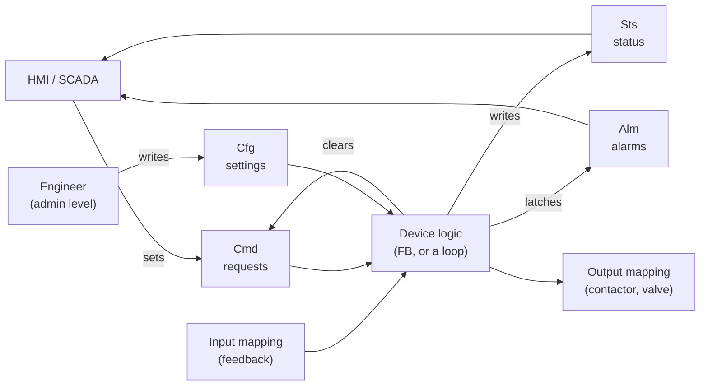
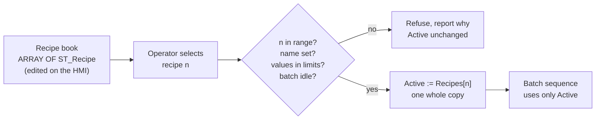

# 12 — Data Structures: Arrays, Structures and Enumerations

> **Level:** 3 — Structured programming · **Time:** ~10 hours · **Prerequisites:** [Module 10](../10-structured-text/), [Module 11](../11-program-organization/)

An instrument engineer never describes a transmitter with a loose list of numbers. Every
instrument has a **datasheet**: tag, service, range, units, alarm settings, fail action. Every
datasheet for a pressure transmitter has the same fields, and a plant has hundreds of them,
filed in the same order. PLC data should be organised the same way. A pump has commands,
status bits, settings and alarms. Forty pumps have forty copies of that same set. A recipe
book is a table of identical records. An event log is a list of entries that all look alike.

This module is about the tools IEC 61131-3 gives you for that: **arrays** (many values of one
type, reached by number), **structures** (several values of different types kept together
under one name, the PLC's version of a datasheet), **enumerations** (named states instead of
magic numbers), and **strings**. It then puts them to work in the designs you will meet on
every real project: device data models with command, status, configuration and alarm parts,
recipes, parameter and lookup tables, queues, ring buffers and event logs.

Good data design is what makes the rest of a project easy. The HMI faceplate for a pump can be
drawn once and pointed at any pump. A new pump is one more array element, not two hundred new
tags. A recipe can be checked in one place before it reaches the process. Bad data design is
the opposite: tags named `Pump3_Spd_SP_2`, recipes copied half-way when a value is out of range,
and an array index from the HMI that quietly overwrites a setpoint. You will see both sides.

## Learning objectives

After this module you should be able to:

- Declare arrays with any bounds, in one or more dimensions, with initial values, and process
  them with loops that can never run outside the bounds.
- Declare structures (`STRUCT`, called UDTs or PLC data types by vendors), nest them, give
  them default values, copy them whole, and pass them to functions and function blocks.
- Design a device data model split into `Cmd`, `Sts`, `Cfg` and `Alm` parts, and explain how
  it maps to HMI tags and communication registers.
- Use enumerations for states and modes, subranges and derived types, and say what MATIEC,
  CODESYS, TIA Portal and Studio 5000 do (and don't) enforce.
- Use the standard string functions (`LEN`, `CONCAT`, `LEFT`, `RIGHT`, `MID`, `FIND`,
  `INSERT`, `DELETE`, `REPLACE`) and conversions, and estimate the memory strings cost.
- Build data-driven logic: validated recipes, parameter tables, lookup tables, FIFO queues,
  ring buffers and event logs.
- Work around MATIEC's lack of arrays of function block instances by keeping per-device state
  in an array of structures, and explain how CODESYS and TIA Portal do it with instance arrays.
- Explain why memory layout matters for communications (Siemens optimised block access,
  Rockwell UDT padding) and design structures that survive change.

## 1. Why structure your data?

Here are four pumps described with plain, "flat" tags, and the same pumps as an array of
structures:

| Flat tags | Structured |
|---|---|
| `P1_Start`, `P1_Stop`, `P1_Running`, `P1_Fault`, `P1_Speed`, `P1_Hours` | `Pumps[1].Cmd.Start`, `Pumps[1].Sts.Running`, ... |
| `P2_Start`, `P2_Stop`, `P2_Running`, ... (and again for P3 and P4) | `Pumps[2]...` (same member names for every pump) |
| One HMI faceplate per pump, each wired by hand to its six tags | One faceplate, told "you are pump *n*" |
| Adding pump 5: another full set of tags, new logic, a new faceplate | Adding pump 5: change the array bound (and its loop constant) to 5 |
| "Total run hours" = `P1_Hours + P2_Hours + P3_Hours + P4_Hours` | A `FOR` loop over `Pumps[i].Sts.RunHours` |

The structured version has three big advantages. **Every pump is the same**, so a fix or a new
feature is made once. **Code can loop over the pumps**, so totals, searches (which pump has the
fewest hours?) and summaries take a few lines. And **the data can move as one piece**: to the
HMI, into a function, into a log, or from a recipe into the active settings.

### Types and variables

A structure or a named array is a **type**: a template, like a blank datasheet form. A
**variable** of that type is a filled-in copy, like the datasheet for PT-101. You declare types
once, in a `TYPE ... END_TYPE` block, and then declare as many variables of the type as you need:

```iecst
TYPE
  ST_Probe :                 (* the type: a template, no memory yet *)
  STRUCT
    Value   : REAL;          (* degC *)
    Healthy : BOOL;
  END_STRUCT;
END_TYPE

(* ... then, inside a POU: *)
VAR
  TT301 : ST_Probe;          (* variables: each one has its own memory *)
  TT302 : ST_Probe;
END_VAR
```

IEC 61131-3 calls every type you build yourself a **derived type** (a *data type* or DUT in
CODESYS, a *PLC data type* in TIA Portal, a *user-defined data type* or UDT in Studio 5000). There
are five kinds. You will meet all five in this module:

| Kind | Example | Section |
|---|---|---|
| Array | `ARRAY[1..10] OF REAL` | 2 |
| Structure | `STRUCT Value : REAL; Healthy : BOOL; END_STRUCT` | 3 |
| Enumeration | `(Off, Manual, Auto)` | 5 |
| Subrange | `INT(0..100)` | 5 |
| Directly derived ("alias") | `T_Level_m : REAL := 0.0` | 5 |

In a lab `.st` file the `TYPE` block sits at the top of the file, before the POUs that use it.
In CODESYS each type is its own object in the project tree, in TIA Portal types live in the
*PLC data types* folder, and in Studio 5000 in the *Data Types* folder of the controller
organiser.

## 2. Arrays

[Module 10](../10-structured-text/README.md#10-arrays-and-loops) introduced arrays with loops:
declaration, sums, minimum and maximum, searching and sorting. This section fills in the rest.

### 2.1 Bounds

An array is declared with a lower and an upper bound, and they can be any integers:

```iecst
VAR
  HourTotal : ARRAY[0..23] OF REAL;     (* one per hour of the day: 0 = midnight *)
  PumpHours : ARRAY[1..4] OF REAL;      (* one per pump: index = pump number *)
  Deviation : ARRAY[-5..5] OF INT;      (* histogram of errors from -5 to +5 *)
END_VAR
```

Choose the bounds so that **the index means something**. If the pumps are numbered 1 to 4
on the P&ID, use `[1..4]` and `PumpHours[3]` is pump 3. If the index is an hour of the day,
`[0..23]` matches the clock. If the index comes out of modulo arithmetic (a ring buffer,
section 7), `[0..N-1]` is natural, because `MOD N` gives 0 to N-1.

The number of elements is `upper - lower + 1`: `[1..4]` has 4, `[0..23]` has 24, `[-5..5]`
has 11. Getting that wrong is the classic off-by-one bug.

Keep the size in one place. In CODESYS, TIA Portal and edition 3 of the standard, a named
constant can be an array bound (`ARRAY[1..NUM_PUMPS]`). MATIEC rejects it
(`Subrange upper limit is not a constant value.`), so the labs write the bound as a literal and
declare a constant with the same value next to it for loops, with a comment saying the two
belong together.

### 2.2 Named array types, and copying arrays

An array type can be given a name in a `TYPE` block:

```iecst
TYPE
  T_Profile : ARRAY[1..10] OF REAL;      (* ten temperature steps of a heating profile *)
END_TYPE
```

Naming the type helps when the same shape is used in several places (a variable, a function
parameter, a structure member), because a later change to the size is then made once. An
array can be **copied in one assignment** when both sides have the same element type and
bounds: `ProfileBackup := Profile;` copies all ten values. MATIEC accepts this for named types
and for two variables declared with identical anonymous `ARRAY[...] OF ...` types.

Arrays cannot be **compared** in one expression. `IF Profile = ProfileBackup THEN` gives
`Data type mismatch for '=' expression.` Compare them element by element in a loop.

### 2.3 Multi-dimensional arrays

An array can have two or more dimensions, with one index per dimension:

```iecst
VAR
  Schedule : ARRAY[1..7, 0..23] OF BOOL;   (* day 1..7 x hour 0..23: 168 values *)
END_VAR

(* in the body: ventilation fan allowed this hour? Day and Hour come from the
   real-time clock, so they are checked like any other index *)
IF Day >= 1 AND Day <= 7 AND Hour >= 0 AND Hour <= 23 THEN
  FanAllowed := Schedule[Day, Hour];
ELSE
  FanAllowed := FALSE;
END_IF;
```

Multi-dimensional arrays fit anything that is naturally a grid: a weekly timetable, the
positions of a palletising pattern (layer × place), a two-input lookup table, or a
**cause-and-effect matrix**, which is Worked example 1.

Memory is one-dimensional, so the elements are laid out in a line. In MATIEC the **last index
changes fastest** (this is called row-major order), which is also the order in which an
initialiser fills the array:

```text
 Grid : ARRAY[1..2, 1..3] OF INT := [11, 12, 13, 21, 22, 23];

 memory:  Grid[1,1]  Grid[1,2]  Grid[1,3]  Grid[2,1]  Grid[2,2]  Grid[2,3]
 value:       11         12         13         21         22         23
```

Check the order in your own tool before you type in a long table. Getting it wrong transposes
the table, and nothing will warn you.

An array can also have arrays as its elements, indexed as `Grid[2][3]`. MATIEC accepts this
only through a named type (`ARRAY[1..2] OF T_Row`, where `T_Row` is a named array type), not
written out in one declaration. Use a true two-dimensional array unless the rows
really are separate things that you want to copy one at a time.

### 2.4 Initial values

An array initialiser is a list in square brackets. A number followed by a value in
parentheses repeats the value:

```iecst
VAR
  Setpoint : ARRAY[1..4] OF REAL := [45.0, 50.0, 55.0, 60.0];
  Enabled  : ARRAY[1..16] OF BOOL := [16(TRUE)];      (* 16 copies of TRUE *)
  Limits   : ARRAY[1..6] OF INT := [0, 100, 4(50)];   (* 0, 100, 50, 50, 50, 50 *)
  Partial  : ARRAY[1..5] OF INT := [1, 2];            (* 1, 2, then 0, 0, 0 *)
END_VAR
```

MATIEC fills the elements you don't list with the type's default value (0, `FALSE`, `''`),
without a warning. A short list is sometimes deliberate, but an initialiser that is one value
short is also a common typing mistake. Count the values, or repeat a value explicitly.

An initial value is applied when the PLC starts cold (and, on most platforms, after a download
that re-initialises the data). While the PLC runs, the array keeps whatever the program or the
HMI has written into it since. If a table must survive a power cut, it has to be retentive
([Module 11](../11-program-organization/README.md#35-retentive-data-retain-non_retain-and-persistent)).

### 2.5 Iterating over an array

`FOR` is the natural loop for arrays, because the number of elements is known. Loop over
exactly the declared bounds, and use a constant for the limit:

```iecst
VAR CONSTANT
  NUM_PUMPS : INT := 4;             (* keep in step with ARRAY[1..4] *)
END_VAR

TotalHours := 0.0;
FOR i := 1 TO NUM_PUMPS DO
  TotalHours := TotalHours + PumpHours[i];
END_FOR;
```

Edition 3 of the standard added `LOWER_BOUND` and `UPPER_BOUND`, which ask an array for its
own bounds, together with variable-length array parameters (`ARRAY[*]`). CODESYS and TIA
Portal (for S7-1500) support them, and Rockwell has the `SIZE` instruction. They let a function
work on arrays of any length. MATIEC has none of them, so here the size is always a literal
bound plus a constant.

Remember [Module 10's warning](../10-structured-text/README.md#9-loops-and-the-scan-cycle):
a loop runs to completion inside one scan. Looping over 4 pumps is nothing. Looping over
10,000 log entries, or copying hundreds of large structures, every scan shows up in the scan
time. Do big jobs only when something changes, or spread them over several scans.

### 2.6 Bounds checking and out-of-range faults

An index outside the declared bounds is the most dangerous array bug. Module 10 has the table
of what each platform does ([Out-of-range indexes](../10-structured-text/README.md#out-of-range-indexes)).
In short:

- A **constant** index outside the bounds is caught when the code is compiled or verified, on
  all the platforms in Module 10's table. MATIEC says
  `Array access out of bounds (using constant value of 6, should be <= 5).`
- A **variable** index outside the bounds is found only at run time, if at all. Rockwell Logix
  stops with a major fault. Siemens S7-1200/1500 reports a programming error, and depending
  on the CPU and your error handling, logs it or goes to STOP. CODESYS without its
  `CheckBounds` function, and MATIEC, do not check at all: the access lands in whatever memory
  is next to the array. A version of the Lab 12-1 solution with the index check removed
  read `Recipes[32767]` and crashed the `plctest` program outright.

The rule is simple: **every index that did not come from a `FOR` loop over the declared bounds
must be checked before it is used.** That includes indexes from the HMI, from a recipe, from a
communications link, from a calculation, and from a real-time clock. There are three ways to
make an index safe, and they do different things:

| Method | Code | Use it when |
|---|---|---|
| **Check and reject** | `IF n >= 1 AND n <= 5 THEN ... ELSE (report) END_IF;` | The index is a request (a recipe number, a pump number from the HMI). A wrong request must be refused and reported, not quietly changed |
| **Clamp** | `n := LIMIT(1, n, 5);` | Going to the nearest element is genuinely right, for example the last segment of a lookup table |
| **Wrap** | `n := (n + 1) MOD 10;` | The index walks round a ring (section 7). The arithmetic keeps it in range by design |

Clamping a recipe number is almost always wrong: the operator asked for recipe 7 and gets
recipe 5 without being told. Lab 12-1 tests exactly that.

A final trap: `IF n <= 5 AND Recipes[n].Temp > 80.0 THEN` looks safe, but IEC 61131-3 does
not promise that the right-hand side is skipped when the left-hand side is FALSE (see Module 10
on short-circuiting). Put the index check in its own `IF`, and read the array only inside it.

### 2.7 Arrays as tables and buffers

Most data-driven PLC code is one of a few array patterns. Section 7 goes through them in
detail:

| Pattern | Example | Key idea |
|---|---|---|
| **Table indexed by number** | Conveyor speed for product code 1..20 | The index *is* the key. Validate it |
| **Table searched by key** | Find the recipe whose name is 'Tomato soup' | Loop, compare, `EXIT` on a match, report "not found" |
| **Lookup table with interpolation** | Tank strapping table, sensor linearisation | Find the segment, interpolate (Module 10, Lab 10-3) |
| **Shift register** | Track rejects along a conveyor, one slot per pitch | Move everything one place per step (Module 09) |
| **FIFO queue** | Pallets waiting at a palletiser | Put at the back, take from the front, never overwrite |
| **Ring buffer** | Last 10 events, a 60-sample trend | Overwrite the oldest, move only an index |
| **Histogram** | Count weights in 11 bands | Compute the band number, check it, add 1 |

### 2.8 Passing arrays to functions and function blocks

An array can be a parameter of a function or a function block. There are two ways to pass it,
and the difference matters for large arrays:

- **By value** (`VAR_INPUT`): the POU receives a **copy**. A 1,000-element `REAL` array is
  4,000 bytes copied on every call. Changes inside the POU don't reach the caller.
- **By reference** (`VAR_IN_OUT`): the POU works on the **caller's own array**. Nothing is
  copied (on most platforms), and changes are written straight back.

MATIEC adds its own rules. It cannot pass an array to a *function* as a `VAR_INPUT` at all (the
generated C code does not build), so use `VAR_IN_OUT` there. A function block's `VAR_INPUT`
array works. A function that works on a whole array of structures looks like this:

```iecst
FUNCTION F_AddRunHours : BOOL
  (* Adds DeltaHours to every running pump. The array is passed by
     reference (VAR_IN_OUT): nothing is copied, and the caller's array
     is updated. *)
  VAR_IN_OUT
    Pumps : ARRAY[1..4] OF ST_Pump;
  END_VAR
  VAR_INPUT
    DeltaHours : REAL;
  END_VAR
  VAR
    i : INT;
  END_VAR
  FOR i := 1 TO 4 DO
    IF Pumps[i].Sts.Running THEN
      Pumps[i].Sts.RunHours := Pumps[i].Sts.RunHours + DeltaHours;
    END_IF;
  END_FOR;
  F_AddRunHours := TRUE;
END_FUNCTION
```

It is called as `Ok := F_AddRunHours(Pumps := Pumps, DeltaHours := 0.001);`, for example on a
pulse every 3.6 s (0.001 h), not on every scan. (`ST_Pump` is the structure from section 4.)

## 3. Structures

### 3.1 Declaring a structure

A structure groups variables of different types under one name. Each variable inside it is a
**member** (or *element* or *field*):

```iecst
TYPE
  ST_Recipe :
  STRUCT
    Name    : STRING;               (* product name; '' = empty slot *)
    Dose    : ARRAY[1..3] OF REAL;  (* kg of each ingredient *)
    Temp    : REAL;                 (* degC *)
    MixTime : TIME;
  END_STRUCT;
END_TYPE
```

Members can be of any type: elementary types, arrays, enumerations, and other structures.
Give every member a comment with its **units** and meaning. The structure declaration is the
datasheet form, so it is where people look to find out what `Temp` means.

You reach a member with a dot, and the dots and brackets chain as deep as the data goes:

```text
 Recipes[2].Dose[3]          array element -> member -> array element
 Pumps[i].Cfg.FbTimeoutMs    array element -> sub-structure -> member
 Line.Filler.Heads[4].Weight structure -> structure -> array element -> member
```

Deep nesting is legal, but every level is one more thing a reader has to hold in mind. Two or
three levels (device → part → member) is usually right. If a path needs five dots, the data
model probably needs rethinking.

### 3.2 Default values and initialisers

A member can have a **default value** in the type. Every variable of the type then starts
with it:

```iecst
TYPE
  ST_PumpCfg :
  STRUCT
    SpeedMin    : REAL := 30.0;     (* % *)
    SpeedMax    : REAL := 100.0;
    FbTimeoutMs : DINT := 2000;
    TagName     : STRING := 'P-000';
  END_STRUCT;
END_TYPE
```

A **variable** can override some members with a structure initialiser, a list of
`member := value` in parentheses. Members you don't mention keep the type's default. Nested
structures nest their initialisers, and arrays of structures put structure initialisers inside
the square brackets, with repetition if you like:

```iecst
VAR
  P101 : ST_PumpCfg := (TagName := 'P-101');                 (* SpeedMin stays 30.0 *)
  P104 : ST_PumpCfg := (TagName := 'P-104', SpeedMin := 40.0);

  (* four motors: three with a 2 s feedback timeout, the fourth with 5 s *)
  Motors : ARRAY[1..4] OF ST_MotorData := [3((Cfg := (FbTimeoutMs := 2000))),
                                            (Cfg := (FbTimeoutMs := 5000))];
END_VAR
```

(All three forms are used in this module's labs and were checked with MATIEC.)

### 3.3 Copying whole structures

One assignment copies **every member**, including arrays and nested structures inside:

```iecst
Active := Recipes[SelectNo];      (* every member of the recipe, in one statement *)
Pumps[3].Cmd := NO_CMD;           (* clear all command bits: NO_CMD is a constant structure *)
```

The result is a **copy**, not a link. If `Recipes[2]` changes after `Active := Recipes[2];`,
`Active` does not change. That is exactly what a recipe needs (the batch keeps the values it
started with), and exactly what you must remember when you *want* a live view.

A whole-structure copy is also **all or nothing** within the scan. Compare these two loads:

```iecst
(* WRONG: member by member, checking as it goes *)
Active.Name := Recipes[n].Name;
Active.Temp := Recipes[n].Temp;
IF Recipes[n].MixTime > T#2h THEN
  RETURN;                         (* too late: Name and Temp are already changed *)
END_IF;

(* RIGHT: check everything first, then copy once *)
IF F_RecipeValuesOk(R := Recipes[n], Lim := RECIPE_LIMITS) THEN
  Active := Recipes[n];
END_IF;
```

The first version leaves `Active` half old recipe and half new recipe when the check fails:
the name and temperature of the new product, with the doses and mixing time of the old one.
That is a batch nobody designed.

Structures **cannot be compared** with `=` in MATIEC (`Data type mismatch for '=' expression.`),
and most other platforms refuse it too. Compare the members you care about, one by one.

A **constant structure** is a tidy way to reset or clear data. Declare it once and assign it
where needed:

```iecst
VAR CONSTANT
  NO_EVENT : ST_Event := (Code := 0, Stamp := 0);
END_VAR
...
EventLog[i] := NO_EVENT;
```

### 3.4 Structures as parameters

Structures pass to POUs like any other type:

- As a `VAR_INPUT` the POU gets a copy. For a small structure that is fine and safe. MATIEC
  accepts structures as function inputs, and a function can even *return* a structure.
- As a `VAR_IN_OUT` the POU works on the caller's structure. Use it for large structures, and
  when the POU must change the data (Module 11's `FB_SampleStats` updates a shared
  `ST_Stats` this way).
- As a `VAR_OUTPUT` of an FB, a structure bundles related results.

Passing structures instead of long lists of separate inputs keeps interfaces short and stable.
When a member is added to the structure, the calls don't change.

Here is a function that takes two structures, the recipe and its limits, and is used in Lab
12-1:

```iecst
FUNCTION F_RecipeValuesOk : BOOL
  VAR_INPUT
    R   : ST_Recipe;          (* the recipe to check (a copy) *)
    Lim : ST_RecipeLimits;    (* the limits, also a structure *)
  END_VAR
  VAR
    i     : INT;
    Total : REAL;
  END_VAR
  F_RecipeValuesOk := FALSE;              (* guilty until proven innocent *)
  Total := 0.0;
  FOR i := 1 TO 3 DO
    IF R.Dose[i] < 0.0 OR R.Dose[i] > Lim.DoseMax THEN
      RETURN;
    END_IF;
    Total := Total + R.Dose[i];
  END_FOR;
  IF Total <= 0.0 OR Total > Lim.TotalMax THEN
    RETURN;
  END_IF;
  IF R.Temp < Lim.TempMin OR R.Temp > Lim.TempMax THEN
    RETURN;
  END_IF;
  IF R.MixTime < Lim.MixTimeMin OR R.MixTime > Lim.MixTimeMax THEN
    RETURN;
  END_IF;
  F_RecipeValuesOk := TRUE;
END_FUNCTION
```

The limits are data too: a structure constant today, perhaps engineer-level configuration
tomorrow, without changing the function.

## 4. Device data models: Cmd, Sts, Cfg and Alm

### 4.1 The pattern

Most plants settle on a standard way of structuring the data for each kind of device. The most
common one divides it by **who writes it** and **which way it flows**:

| Part | Direction | Written by | Examples | Rules |
|---|---|---|---|---|
| **Cmd** (commands, requests) | HMI → PLC | The HMI sets, the PLC clears or evaluates | Start, Stop, Reset, mode request, speed request | A request, not an order. The PLC decides |
| **Sts** (status) | PLC → HMI | The PLC, every scan | State, running, available, mode in force, setpoint in use, run hours | Read-only for everyone else |
| **Cfg** (configuration, parameters) | Engineer → PLC | Engineering tool or HMI at engineer level | Timeouts, limits, scaling, options, tag name | Retentive, validated, change-controlled |
| **Alm** (alarms) | PLC → HMI | The PLC; cleared by a reset | Fail to start, tripped, dry run | Latched until acknowledged and reset |

[Module 18](../18-hmi-and-scada/README.md#21-command-status-and-configuration-tags) explains the
HMI side of the same split: why every tag has a single writer, why HMI buttons need a
handshake, and why configuration has its own access level. Here is the PLC side:



### 4.2 A pump data model

```iecst
TYPE
  E_Mode : (Off, Manual, Auto);

  ST_PumpCmd :
  STRUCT                        (* HMI -> PLC: set by the HMI, cleared by the PLC *)
    Start    : BOOL;
    Stop     : BOOL;
    Reset    : BOOL;
    ModeReq  : E_Mode;          (* requested mode *)
    SpeedReq : REAL;            (* requested speed, % (validated before use) *)
  END_STRUCT;

  ST_PumpSts :
  STRUCT                        (* PLC -> HMI: written by the PLC every scan *)
    Mode      : E_Mode;         (* the mode actually in force *)
    Running   : BOOL;
    Faulted   : BOOL;
    Available : BOOL;           (* could start now: no fault, permissives OK *)
    SpeedSP   : REAL;           (* the speed setpoint in use, % *)
    RunHours  : REAL;
  END_STRUCT;

  ST_PumpCfg :
  STRUCT                        (* engineer settings: retentive, change-controlled *)
    SpeedMin    : REAL := 30.0; (* % *)
    SpeedMax    : REAL := 100.0;
    FbTimeoutMs : DINT := 2000;
    TagName     : STRING := 'P-000';
  END_STRUCT;

  ST_PumpAlm :
  STRUCT                        (* PLC -> HMI: latched until reset *)
    FailToStart : BOOL;
    Tripped     : BOOL;         (* overload or VFD trip *)
    DryRun      : BOOL;         (* low suction pressure while running *)
  END_STRUCT;

  ST_Pump :
  STRUCT
    Cmd : ST_PumpCmd;
    Sts : ST_PumpSts;
    Cfg : ST_PumpCfg;
    Alm : ST_PumpAlm;
  END_STRUCT;
END_TYPE
```

Notice the pairs: `Cmd.ModeReq` and `Sts.Mode`, `Cmd.SpeedReq` and `Sts.SpeedSP`. The request
is what the operator asked for. The status is what the PLC accepted and is using. If the PLC
refuses a speed of 120 % or a change to Auto while the pump is faulted, the two differ and the
HMI shows both. That is the single-writer rule from Module 18 built into the data type: the HMI
never writes the value the logic uses.

A good data model:

- **has one structure type per kind of device**, used for every device of that kind, so that one
  faceplate and one piece of logic serve them all;
- **states units and direction in every comment**;
- **keeps internal working data out of the HMI's parts**. If MATIEC forces you to keep timer
  state in the structure (section 8), put it in a clearly named member or sub-structure such
  as `Wrk`, and don't map it to the HMI;
- **reserves room to grow** when the structure is mapped to fixed communication registers
  (section 7.6).

### 4.3 Mapping to HMI tags and faceplates

HMI and SCADA packages can read structures in several ways, and the data model should suit
the one you use:

- **Symbolic, structured access.** OPC UA and most vendor-native drivers (for example a Siemens
  HMI on an S7-1500, or a Rockwell HMI on a Logix controller) can browse PLC structures and
  create HMI tags from them. A **faceplate** (a pop-up or symbol for one device) is built once
  against the *type*, and each instance is given a path such as `Pumps[3]` or `P101`. This is
  where arrays of structures and standard types pay back the most.
- **Address-based access (Modbus).** Modbus knows only 16-bit registers and single bits
  ([Module 17](../17-industrial-communications/)). The structure has to become a block of
  registers with a fixed, documented layout: `REAL`s split into two registers (with an agreed
  word order), `BOOL`s packed into a status `WORD`, enumerations sent as integers. A mapping
  routine copies between the structure and the register array.

Packing status bits into a `WORD` for a register looks like this. MATIEC has no bit access
(`StsWord.2`), so it is done with shifts:

```iecst
(* bit 0 running, bit 1 faulted, bit 2 available *)
StsWord := BOOL_TO_WORD(Pumps[2].Sts.Running)
        OR SHL(BOOL_TO_WORD(Pumps[2].Sts.Faulted), 1)
        OR SHL(BOOL_TO_WORD(Pumps[2].Sts.Available), 2);
```

Write the bit assignments down in the interface document. The HMI engineer needs to know them,
and they must never change silently.

### 4.4 Arrays of structures

With a data model type, a group of identical devices becomes one array:

```iecst
VAR
  Pumps : ARRAY[1..4] OF ST_Pump := [(Cfg := (TagName := 'P-101')), (Cfg := (TagName := 'P-102')),
                                     (Cfg := (TagName := 'P-103')), (Cfg := (TagName := 'P-104'))];
END_VAR
```

Now a `FOR` loop can run the logic for every pump, total their run hours, find the available
pump with the fewest hours (Module 10, Worked example 1), or count how many are running. The
HMI can show a table of all four with one row definition.

Arrays of structures are also where the **one-writer rule** needs care. If the HMI writes
`Pumps[2].Cmd.Start` and the program writes `Pumps[2].Sts...`, all is well. If the HMI writes
back a whole `Pumps[2]` element (some drivers and scripts write a whole structure when one
member changes), it overwrites the PLC's data with the stale copy it read earlier. Members
that the PLC recalculates every scan recover on the next scan, but latched alarms, counters
and run hours are simply lost, and a `Cfg` value can be silently put back. Map commands and
status as separate structures or tag groups, so that each has one writer.

### 4.5 Changing a data type in a running plant

A structure type is an interface, shared by the PLC logic, the HMI, the historian and
sometimes other PLCs. Changing it is a change to all of them:

- Adding a member changes the size and layout of every variable of that type. With
  address-based communication, **every member after the new one moves**. Add new members at the
  end, or reserve spare members in advance.
- Changing a type that is in use is not always possible as an online change. Depending on the
  platform and on the change, it may need an offline edit and a download (Studio 5000 does not
  let you add or remove members of a UDT that tags use while online), or the variables of that
  type may be re-initialised to their start values when the change is loaded. CODESYS can
  usually carry the values of unchanged members across an online change. Find out what your
  tool does before you change a type in a running plant, plan it like any other download, and
  save the current values first (recipe data especially).
- Version the type together with the FB and the HMI faceplate that use it (Module 11, section
  6.7).

## 5. Enumerations, subranges and other derived types

### 5.1 Enumerations

An **enumeration** is a type whose values are names:

```iecst
TYPE
  E_Mode  : (Off, Manual, Auto);                         (* Off is the default *)
  E_Valve : (Closed, Opening, Open, Closing, Fault);
END_TYPE

VAR
  Mode       : E_Mode := Manual;      (* start in Manual rather than the default Off *)
  ValveState : E_Valve;               (* starts as Closed, the first value *)
END_VAR
```

A variable of an enumeration type starts with the **first value in the list**, unless you
give it another initial value. So put the safe state first.

Values are written plainly (`Manual`), or **qualified** with the type name and `#`
(`E_Mode#Manual`). Qualify them. When two enumerations share a value name, as `E_Mode`
and `E_Valve` might both have `Off`, the plain name is ambiguous. MATIEC then refuses to
compile, even inside a `CASE` whose selector plainly has one type:

```text
 14      Off: N := 0;

demo.st:14-5..14-7: error: Ambiguous enumerate value or Variable not declared in this scope.
```

and a variable that happens to share a value's name (a `BOOL` called `Auto`, say) hides the
value altogether. `E_Mode#Auto` is never ambiguous.

Enumerations shine in `CASE` statements and state machines ([Module 13](../13-sequential-control/)):

```iecst
CASE Mode OF
  E_Mode#Off:    Request := FALSE;
  E_Mode#Manual: Request := ManualRequest;
  E_Mode#Auto:   Request := AutoRequest;
END_CASE;
```

Why use an enumeration instead of an `INT` with codes 0, 1 and 2?

- **Readable code, and readable online values.** `IF Mode = E_Mode#Auto` needs no comment,
  and the online view shows the name, not `2`.
- **Only legal values.** You cannot assign `7` to an `E_Mode`. MATIEC rejects `Mode := 2;` with
  `Incompatible data types for ':=' operation.`
- **Safer changes.** Add a value, and every `CASE` that should handle it is easy to find.

The cost is at the edges of the PLC. HMIs and communication links see enumerations as
integers, if they see them at all. In MATIEC an enumeration cannot even be converted to an
`INT` (there is no conversion function, and assignment is refused), and the order operators
`<` and `>` are refused on enumerations. Only `=` and `<>` work. So write the mapping yourself,
which also documents it:

```iecst
FUNCTION F_ModeCode : INT
  (* Enumeration -> number, for a Modbus register or an HMI multi-state
     indicator. MATIEC will not convert an enum to INT for you. *)
  VAR_INPUT
    Mode : E_Mode;
  END_VAR
  CASE Mode OF
    E_Mode#Off:    F_ModeCode := 0;
    E_Mode#Manual: F_ModeCode := 1;
    E_Mode#Auto:   F_ModeCode := 2;
  END_CASE;
END_FUNCTION
```

Some tools, CODESYS among them, let you give enumeration values **explicit numbers** (CODESYS
also lets you choose the underlying integer type):

```iecst
// CODESYS syntax - not accepted by MATIEC
TYPE E_Step : (Idle := 0, Filling := 10, Heating := 20, Draining := 30);
END_TYPE
```

Fixed numbers make the HMI mapping explicit, and gaps leave room for new steps. MATIEC rejects
explicit values (`')' missing at the end of enumerated specification`), so the labs use plain
enumerations. Whatever your tool, **never renumber** an enumeration that the HMI, a historian
or another PLC already uses. Inserting a value in the middle of a plain list shifts every value
after it, and the HMI's "3 = Faulted" silently becomes "3 = Stopping".

### 5.2 Subranges

A **subrange** type restricts an integer type to a range:

```iecst
TYPE
  T_Percent : INT(0..100);
END_TYPE
```

It documents intent: this value should never be outside 0..100. What enforcement you get
depends on the platform. **MATIEC does not check subranges at all**, not even for a constant:
`Pct := 150;` compiles, and 150 is stored. CODESYS checks only when you add its implicit check
functions (`CheckRangeSigned`, `CheckRangeUnsigned`). Siemens and Rockwell have no subrange
types. So treat a subrange as documentation, and still validate values that come from outside
with `IF` or `LIMIT`.

### 5.3 Directly derived types

A type can simply be another name for an existing type, optionally with its own initial value:

```iecst
TYPE
  T_Level_m : REAL := 0.0;          (* a level in metres *)
END_TYPE
```

This documents meaning, and changes the default in one place. It does **not** give unit safety:
a `T_Level_m` can be assigned from any `REAL`, including a level in millimetres. Units are
still your job (and the comment's).

### 5.4 Constants or enumerations?

Use an **enumeration** when the values are a closed set of names (modes, states, results) and
the program tests them by name. Use **named constants** (`VAR CONSTANT`) for numbers that
have a numeric meaning (limits, sizes, codes defined by someone else such as an alarm code list
or a drive's fault codes). In Lab 12-2 the event codes are plain `INT`s, because they are
defined in the plant's alarm and event list, not in the program.

## 6. Strings

### 6.1 STRING basics

A `STRING` holds text: tag names, product names, units, messages, barcodes. Literals are
written in single quotes (`'TT-104'`), and special characters use `$`, as Module 10 showed
(`$'` quote, `$$` dollar, `$N` newline). The standard also has `WSTRING` (wide characters,
double-quoted literals) for text beyond single-byte characters. MATIEC's C code generator does
not handle `WSTRING`, so the labs use `STRING`.

A string variable has a **maximum length**, fixed when it is declared, and a **current
length**, which changes as text is assigned. The memory for the maximum length is reserved
whether it is used or not:

| Platform | Declaration | Default maximum | Memory per string |
|---|---|---|---|
| MATIEC / OpenPLC | `STRING` only (a length declaration is rejected, or crashes the compiler) | 126 characters | 127 bytes: 1 length byte + 126 characters |
| CODESYS | `STRING` or `STRING(n)` | 80 characters | n + 1 bytes (the text ends with a zero byte) |
| Siemens S7-1200/1500 | `String` or `String[n]`, n up to 254 | 254 characters | n + 2 bytes (maximum length and current length) |
| Rockwell Logix | Built-in `STRING` type, or your own string types | 82 characters | The `STRING` type is a `.LEN` (DINT) plus `.DATA` (SINT[82]), about 88 bytes |

The difference adds up. A table of 200 alarm texts costs about 50 kB with the default Siemens
`String` (200 × 256 bytes), but about 8 kB as `String[40]` (200 × 42 bytes). In MATIEC it
is 25,400 bytes whatever the texts contain. Declare string lengths to suit the data wherever
your platform allows, and keep large text tables in the HMI, which is built for them.

### 6.2 String functions

The standard string functions, with results checked in MATIEC. Positions count from **1**:

| Function | Meaning | Example | Result |
|---|---|---|---|
| `LEN(IN)` | Current length | `LEN('TT-104')` | `6` |
| `CONCAT(IN1, IN2, ...)` | Join (the standard and MATIEC accept any number of inputs) | `CONCAT('TT-', '104', ' HI')` | `'TT-104 HI'` |
| `LEFT(IN, L)` | First L characters | `LEFT('TT-104', 2)` | `'TT'` |
| `RIGHT(IN, L)` | Last L characters | `RIGHT('TT-104', 3)` | `'104'` |
| `MID(IN, L, P)` | L characters starting at position P | `MID('TT-104', 3, 4)` | `'104'` |
| `FIND(IN1, IN2)` | Position of the first IN2 inside IN1, 0 if absent | `FIND('TT-104', '-')`, `FIND('TT-104', 'X')` | `3`, `0` |
| `INSERT(IN1, IN2, P)` | Insert IN2 into IN1 after position P | `INSERT('ABC', 'XY', 2)` | `'ABXYC'` |
| `DELETE(IN, L, P)` | Delete L characters starting at position P | `DELETE('ABCDEF', 2, 3)` | `'ABEF'` |
| `REPLACE(IN1, IN2, L, P)` | Replace L characters of IN1, from position P, by IN2 | `REPLACE('ABCDEF', 'XY', 3, 2)` | `'AXYEF'` |

Watch the argument order of `MID`, `DELETE` and `REPLACE`: the **length comes before the
position**. That is the order in the standard, and it is the opposite of what many programmers
expect. Use formal calls (`MID(IN := Label, L := 5, P := 5)`) when in doubt.

Not every tool implements the standard functions in exactly the same way. `CONCAT` with three
or more inputs works in MATIEC, but CODESYS and TIA Portal join two strings per call, so nest
the calls there: `CONCAT(CONCAT('TT-', '104'), ' HI')`. Logix's `CONCAT` instruction also joins
two strings, into a destination tag.

Strings compare with `=`, `<>`, `<`, `>`, `<=` and `>=`. Comparison is character by character
and **case-sensitive**: `'abc' = 'ABC'` is FALSE, `'ABC' < 'ABD'` is TRUE, and `'B' > 'ABC'` is
TRUE because `B` comes after `A`. MATIEC has no upper-case function (some vendors add one, such
as Rockwell's `UPPER`), so compare text from outside systems carefully.

**Overflow is silent.** In MATIEC, `CONCAT` of two 104-character strings gives 126 characters:
the rest is cut off without an error. `LEFT('TT-104', 20)` just returns `'TT-104'`, and
`MID` past the end returns whatever characters exist. Other platforms also truncate or clip,
with their own details. Size strings for the worst case, and check `LEN` where it matters.

### 6.3 Conversions

| Function | MATIEC result | Comment |
|---|---|---|
| `INT_TO_STRING(-42)` | `'-42'` | Also `DINT_TO_STRING`, `BOOL_TO_STRING` (`'TRUE'`) |
| `STRING_TO_INT('123')` | `123` | |
| `STRING_TO_INT('12a')` | `12` | **No error**: it stops at the first non-digit |
| `STRING_TO_INT('abc')` | `0` | **No error**: indistinguishable from a real `'0'` |
| `STRING_TO_REAL('3.25')` | `3.25` | |
| `REAL_TO_STRING(87.4)` | `'87.40000153'` | Format is platform-specific. Build display text yourself (Module 10, Lab 10-4) |
| `TIME_TO_STRING(T#1m30s)` | `'T#0d0h1m30s'` | Format is platform-specific |

The two `STRING_TO_INT` rows are the important ones. A conversion from text never tells you the
text was bad. If the text comes from outside (a barcode scanner, a weighbridge, an operator),
**check the characters before you convert**, as Worked example 2 does. Vendors have their own
conversion instructions (Siemens `S_CONV`, `STRG_VAL` and `VAL_STRG`, Rockwell `STOD`, `DTOS`,
`STOR` and `RTOS`) and their own rules for bad text, so read the manual for the one you use.

### 6.4 Strings and the scan

String functions copy characters one at a time, and a string of 254 characters is a lot of
copying compared with adding two `INT`s. A few string operations per scan are nothing, but
rebuilding fifty alarm messages every scan is a measurable part of the scan time on a small
PLC. Build text **when something changes** (a new barcode, an alarm state change), not every
scan. Leave long texts, translations and formatting to the HMI.

## 7. Data-driven design

"Data-driven" means the behaviour is set by tables of data rather than by code. Adding a
product, a recipe or a pump then changes data, not logic, and the logic stays tested.

### 7.1 Recipes

A **recipe** is the set of values that makes one product: quantities, temperatures, times,
speeds. ISA-88 ([Module 21](../21-architecture-and-standards/)) formalises recipes at several
levels (general, site, master and control recipes), each with a header, a formula, equipment
requirements and a procedure. In a single PLC, the part you program is usually the *formula*:
a structure of parameters, and a table of them.

The design rules are the same at every scale:



1. **Separate the book from the active recipe.** The sequence uses `Active`, never
   `Recipes[n]`. Operators edit the book at any time, and a running batch is not affected.
2. **Validate everything before loading**: the index, that the slot is not empty, every value
   against its limits, and cross-checks between values (three legal doses can still overfill the
   vessel).
3. **Load all or nothing**, in one assignment, after the checks pass.
4. **Never change the recipe of a running batch.** If mid-batch changes are allowed at all (a
   trim to a setpoint, for example), make them a separate, deliberate and logged function.
5. **Report the result** (loaded, bad index, empty slot, bad value, busy) so that the operator
   knows why the Load button did nothing.
6. **Store the book safely.** Recipe data is valuable. Keep it in retentive memory or in
   files the PLC can load (some CPUs can export and import recipe data blocks as files on the
   memory card), back it up, and control who can change it. Many HMI and SCADA packages also
   have recipe management that stores the records on the HMI and downloads the chosen one into
   the PLC's structure. The PLC must still validate what it receives.

Lab 12-1 builds exactly this.

### 7.2 Parameter tables

A **parameter table** holds settings indexed by something the plant already numbers: product
code, pipe size, bottle format, tank number. For example, a case packer has conveyor speeds
and glue times for 12 carton sizes:

```iecst
TYPE
  ST_Format :
  STRUCT
    ConveyorSpeed : REAL;   (* m/min *)
    GlueTime      : TIME;
    FlapsDelay    : TIME;
  END_STRUCT;
END_TYPE

VAR
  Formats : ARRAY[1..12] OF ST_Format;   (* engineer-level data, retentive *)
END_VAR
```

A format change is then `Current := Formats[FormatNo];`, with the same checks as a recipe.
A new carton size is a new row of data.

### 7.3 Lookup tables

- **Exact lookup by index** is the parameter table above.
- **Lookup by key** loops over the table comparing a key member (a name, a product number, a
  barcode) and stops at the first match. Always provide the "not found" outcome.
- **Interpolation** turns a table of breakpoints into a continuous curve: tank strapping
  tables, non-linear sensor characteristics, pump curves, valve characteristics. Module 10's
  Lab 10-3 does it with two parallel arrays. An array of structures (`Point[i].X`,
  `Point[i].Y`) keeps each pair together, which makes it harder to edit one column and forget the
  other.

### 7.4 Queues and ring buffers

A **FIFO** (first in, first out) **queue** and a **ring buffer** are built the same way: an
array plus indexes that walk round it, wrapping from the last element back to the first with
`MOD`. Nothing is ever moved, so each operation costs the same however full the buffer is. A
shift register (Module 09) moves every element on every step instead, which is fine for 16
pitches of a conveyor and wasteful for 1,000 entries.

The difference between the two is what happens when the array is full:

| | FIFO queue | Ring buffer (log, trend) |
|---|---|---|
| Purpose | Things waiting to be handled, in order | The most recent N records |
| Indexes | `Head` (oldest, next out), `Tail` (next free slot), `Count` | `Newest` (or next free slot), `Count` |
| When full | **Refuse** the new entry and raise an alarm: dropping a pallet ID loses track of a real pallet | **Overwrite** the oldest entry: old history is the least valuable |
| Reader | Takes entries out | Reads without removing |

A ten-slot ring after 12 events, with event *n* in slot (n − 1) MOD 10:

```text
 slot:      0     1     2     3     4     5     6     7     8     9
          +-----+-----+-----+-----+-----+-----+-----+-----+-----+-----+
 event:   | 11  | 12  |  3  |  4  |  5  |  6  |  7  |  8  |  9  | 10  |
          +-----+-----+-----+-----+-----+-----+-----+-----+-----+-----+
                   ^     ^
               Newest    oldest: overwritten by the next event
 Count = 10 (full). Events 1 and 2 have been overwritten.
```

Two pieces of arithmetic do all the work, for a buffer of size N with slots 0..N−1:

- **Next slot:** `(Newest + 1) MOD N`. From slot 9 this gives 0.
- **k events back from the newest:** `(Newest - k + N) MOD N`. With Newest = 1 and k = 2,
  that is (1 − 2 + 10) MOD 10 = 9: event 10, correct.

Why the `+ N`? Because `MOD` in MATIEC (as in C, and on most PLCs) keeps the sign of the
dividend: `(1 - 2) MOD 10` is **−1**, not 9 ([Module 09](../09-math-and-data-handling/)).
Without `+ N`, looking back across the wrap produces a negative index and reads outside the
array. It is a classic ring-buffer bug, and Lab 12-2 tests for it.

Worked example 3 is a complete FIFO queue for pallets.

### 7.5 Event logs

An event log is a ring buffer of structures. Designing the record:

- **Code**: a number from the plant's alarm and event list, not a string. It is compact, can be
  sorted and filtered, and the HMI translates it into text in the operator's language.
- **Time stamp**: from the PLC's real-time clock (`DT`) when the log must line up with other
  systems, or a millisecond counter since start-up when only order and intervals matter (Lab
  12-2). A PLC can stamp an event only when its scan sees it, so the resolution is one scan at
  best. True sequence-of-events recording, where the first-out of a trip needs millisecond
  resolution, uses time-stamping input cards ([Module 16](../16-alarms-and-diagnostics/)).
- **Value** (optional): the measured value at the time, such as the pressure at the trip.
- **Sequence number** (worth adding): a counter that increases with every event. A historian
  collecting the log remembers the last number it read, and a gap tells it that events were
  overwritten before it could collect them.

Log **events**, not states: one entry when a trip occurs, not one per scan while it lasts.
A chattering switch can fill a ten-slot log in a second and push out the event that mattered, so
debounce inputs and consider counting repeats instead of logging each one.

### 7.6 Memory layout: why it matters for communications

Inside the PLC program you never need to know where a member is stored. It matters as soon as
something **outside** the program reads the data by address or as a block of bytes: Modbus
register maps, some older HMI drivers, block copies between PLCs, raw data sent to a PC.
The layout is set by the platform, and they differ:

- **Siemens S7-1200/1500: optimised or standard block access.** New blocks default to
  *optimised* access: the system arranges the data for fast access and the program can only
  reach it by name. There are no fixed offsets, so absolute addresses such as `DB10.DBW4`
  don't exist, and the system may, for example, store each `BOOL` in a byte of its own. Blocks
  set to *standard* access keep the declared order at fixed offsets, shown in the block editor,
  with padding so that structures and arrays start on even byte addresses. Drivers and devices
  that read data blocks by absolute address (the PUT/GET communication used by many third-party
  drivers is the usual example) need standard access. Symbolic access (a TIA HMI, OPC UA) works
  with optimised blocks.
- **Rockwell Logix: UDT alignment and padding.** Logix stores UDT members in the declared order,
  but aligns them: a `DINT` or `REAL` must start on a 4-byte boundary, and consecutive `BOOL`
  members are packed into hidden `SINT` host members, eight to a byte. Padding fills the gaps,
  and the UDT's size is rounded up to whole 32-bit words. So **member order changes the size**:
  `BOOL, DINT, BOOL` needs two hidden bytes, each padded out to four, around the `DINT` (12
  bytes), while `BOOL, BOOL, DINT` shares one hidden byte (8 bytes). Rockwell's advice is to
  group `BOOL`s together. A copy of a UDT into a `DINT` array for messaging copies the padding
  too. The data type editor shows the size.
- **CODESYS** aligns structure members according to the target processor, and the attribute
  `{attribute 'pack_mode' := '1'}` on a structure removes the padding when an exact byte layout
  is needed.
- **MATIEC** generates C structures, so the layout is whatever the C compiler chooses for the
  target. Don't depend on it.

The portable way to talk to the outside world is an explicit **mapping routine**: copy each
member into a register array in a documented order, and back. It is some typing, but it
survives compiler changes, optimised blocks and new members, and it is where word order for
`REAL` and `DINT` values ([Module 03](../03-data-types-and-addressing/),
[Module 17](../17-industrial-communications/)) gets handled.

## 8. Arrays of devices without arrays of function blocks

### 8.1 What MATIEC refuses

In CODESYS or TIA Portal, four identical motors are naturally an **array of function block
instances**: `Pumps : ARRAY[1..4] OF FB_Motor;`, called in a `FOR` loop. MATIEC (and so
OpenPLC and `plctest`) does not allow it. Nor does it allow an FB instance as a member of a
structure. These are the messages:

```text
 3      Timers : ARRAY[1..4] OF TON;

demo.st:3-20..3-23: error: invalid item data type in array specification.

 4      FbTimer : TON;          (* inside STRUCT ... END_STRUCT *)

demo.st:4-15..4-17: error: invalid specification in structure element declaration.
```

MATIEC also refuses located arrays (`AT %IX0.0 : ARRAY[1..4] OF BOOL` gives
`Bit size of data type is incompatible with bit size of location.`), so physical inputs are
mapped into the array one line per signal.

The workaround comes from asking what an FB instance *is*: code plus memory. The code can be a
function or one FB shared by all devices. The memory can live in the array of structures. The
only thing that is lost is the ability to use `TON`, `R_TRIG` and friends per element, because
those are FB instances. You rebuild their small memories as structure members:

| FB you would use | What it remembers | Replacement in the structure |
|---|---|---|
| `TON` for a timeout | When the condition started | A millisecond counter (add the scan time while the condition holds, stop adding at the preset, clear it when the condition drops), or a start time stamp compared with a clock |
| `R_TRIG` on a command | The input's value last scan | A `BOOL` member holding last scan's value: edge = `NOT Old AND New` |
| Seal-in or latch | The latched state | A `BOOL` or an enumeration state member |
| `CTU` | The count | An integer member |

Command bits that the PLC clears after use (the Cmd pattern) need no edge detection at all.

### 8.2 Four patterns

**Pattern A: one FB instance that loops over the whole array.** The array is passed by
reference, and the FB contains the `FOR` loop. The FB is called once per scan, exactly as the
rules for FB instances require. Its own memory holds only group-level values, such as the clock
value of the last call. This is the Lab 12-3 reference solution:

```iecst
(* fragment: see labs/solutions/12-3-motor-array.st for the whole FB *)
FUNCTION_BLOCK FB_MotorGroup
  VAR_IN_OUT
    Motors : ARRAY[1..4] OF ST_MotorData;
  END_VAR
  ...
  ScanMs := NowMs - LastMs;           (* ms since the last call: one clock for all *)
  LastMs := NowMs;
  FOR i := 1 TO 4 DO
    ...
    IF NOT Disagree THEN              (* this pump's own "timer", in its element *)
      Motors[i].DisagreeMs := 0;
    ELSIF Motors[i].DisagreeMs < Motors[i].Cfg.FbTimeoutMs THEN
      Motors[i].DisagreeMs := Motors[i].DisagreeMs + ScanMs;   (* stops at the timeout *)
    END_IF;
    IF Motors[i].DisagreeMs >= Motors[i].Cfg.FbTimeoutMs THEN
      ...                             (* latch the alarm that matches the state *)
    END_IF;
  END_FOR;
```

**Pattern B: a FUNCTION that processes the whole array** by `VAR_IN_OUT`, like `F_AddRunHours`
in section 2.8. Good for stateless jobs (totals, searches, summaries) and for logic whose
state is all in the elements.

**Pattern C: a pure FUNCTION per element, in a loop in the caller.** The function takes one
element and returns the new element: `Motors[i] := F_MotorStep(M := Motors[i], ...);`. Each
call copies a structure in and out, which is fine for a handful of devices. It makes the logic
easy to test on its own, since the output depends only on the inputs.

A MATIEC quirk shapes these choices: passing a single **array element** (`Motors[i]`, or even
`Motors[2]`) to a *function's* `VAR_IN_OUT` compiles, but the generated C code does not build.
A whole array to a function's `VAR_IN_OUT`, or an element to a *function block's* `VAR_IN_OUT`,
both work. That is why pattern C passes the element by value and returns it.

**Pattern D, for completeness: separate named instances, plus arrays for the HMI.** Declare
`P101 : FB_Motor; P102 : FB_Motor; ...`, call each one explicitly, and copy their outputs into
an array of status structures for the HMI and for loops. It is more typing, but you keep real
`TON`s and the tested FB from Module 11, and each instance can be monitored online by name.
With four devices it is often the clearest choice. With forty, patterns A to C win.

### 8.3 The shared-timer trap

The most tempting shortcut is also the most common bug: one timer instance inside the loop.

```iecst
FOR i := 1 TO 4 DO
  (* WRONG: ONE timer called four times per scan, with four different inputs *)
  FbTimer(IN := Motors[i].Sts.RunCmd AND NOT Motors[i].RunFb, PT := T#2s);
  IF FbTimer.Q THEN
    Motors[i].Alm.FailToStart := TRUE;
  END_IF;
END_FOR;
```

A `TON` has one memory. Here it sees pump 1's condition, then pump 2's, then pump 3's, then
pump 4's, every scan. If pump 1 fails to start while the others are stopped normally, the timer
sees TRUE for pump 1 and FALSE for pump 2 in the same scan, so it restarts on every scan and
never times out. Run in `plctest`, this loop detected nothing with one, two or three failed
pumps. It timed out only when all four pumps disagreed at the same moment for the full 2 s, and
then it flagged all four together. One device, one memory: the timing state must live in the
element (MATIEC) or in an element of an FB array (CODESYS, TIA Portal). Lab 12-3's tests start
two pumps a second apart precisely to catch a shared timer.

### 8.4 How other tools do it

The same four pumps, as an array of FB instances. These snippets are in each vendor's dialect
and are not testable with MATIEC:

```iecst
// CODESYS / TwinCAT - not accepted by MATIEC
VAR
    aPump : ARRAY[1..4] OF FB_Motor;     // four instances, each with its own TON inside
    i     : INT;
END_VAR

FOR i := 1 TO 4 DO
    aPump[i](Start := aCmd[i].Start, Stop := aCmd[i].Stop,
             InterlockOK := SuctionOK[i], RunFb := RunFb[i]);
END_FOR
```

```iecst
// Siemens TIA Portal SCL, inside an FB - not accepted by MATIEC
// "Pumps" is declared in the Static section as Array[1..4] of "FB_Motor"
FOR #i := 1 TO 4 DO
    #Pumps[#i](Start := #Cmd[#i].Start, RunFb := #RunFb[#i]);
END_FOR;
```

In TIA Portal, arrays of multi-instances are declared in the *Static* section of an FB.
Support depends on the CPU family and firmware (they are well established on S7-1500), so
check your CPU's documentation. In Rockwell Logix, an Add-On Instruction's backing tag can be
an array of the AOI's data type, and an element (even with a variable index) is passed as the
backing tag. Watching the logic of one particular element online is less convenient than with
a named tag, which is one reason many Logix projects keep one named tag per device and an
array only for the HMI and summaries.

## Worked examples

### Worked example 1: a cause-and-effect matrix as a two-dimensional array

A cause-and-effect (C&E) matrix lists **causes** (initiating events, usually trips from
instruments) as rows and **effects** (actions, usually valves and motors) as columns. A mark
where row and column cross means "this cause drives this effect". If you work with safety
documentation, you have read many of them. A two-dimensional array is the matrix, almost
literally:

```iecst
PROGRAM CauseEffect
  VAR (* causes, TRUE = cause active (already filtered and latched upstream) *)
    Cause  : ARRAY[1..4] OF BOOL;
  END_VAR
  VAR (* effects, TRUE = take the action *)
    Effect : ARRAY[1..3] OF BOOL;
  END_VAR
  VAR CONSTANT
    (* The matrix: one row per cause, one column per effect.
       Columns:  1 close XV-101 feed valve, 2 stop P-101, 3 sound horn *)
    CE : ARRAY[1..4, 1..3] OF BOOL := [
      TRUE,  TRUE,  TRUE,      (* cause 1: LSHH-101 tank level high-high  *)
      FALSE, TRUE,  TRUE,      (* cause 2: PSLL-102 pump suction low-low  *)
      TRUE,  FALSE, TRUE,      (* cause 3: TSHH-103 temperature high-high *)
      FALSE, FALSE, TRUE];     (* cause 4: HS-104 manual alarm button     *)
    NUM_CAUSES  : INT := 4;
    NUM_EFFECTS : INT := 3;
  END_VAR
  VAR
    c, e : INT;
  END_VAR

  FOR e := 1 TO NUM_EFFECTS DO
    Effect[e] := FALSE;
    FOR c := 1 TO NUM_CAUSES DO
      IF Cause[c] AND CE[c, e] THEN
        Effect[e] := TRUE;             (* any marked cause drives the effect *)
      END_IF;
    END_FOR;
  END_FOR;
END_PROGRAM
```

How it works: for each effect (column) the inner loop runs down the causes (rows). The effect
is TRUE if any active cause has a mark in that column, which is an OR over the column. With
cause 2 active (suction low-low), effects 2 and 3 are TRUE (stop the pump, sound the horn) and
the feed valve is left alone. The initialiser is laid out row by row, and since MATIEC fills
the last index fastest, the text looks like the drawing. The program was run with `plctest`
for each cause.

Is this a good way to implement a C&E matrix? It has real strengths: the table in the code can
be checked line by line against the document, and adding a cause is one more row. It also has
costs. When an effect trips, the online view shows `Effect[2]`, not which cause drove it, so a
first-out or cause indication has to be added for the operator. Changing the matrix changes a
constant, which must go through the same review as logic. And the **real** safety trips on a
C&E matrix are safety instrumented functions: they belong in a safety-rated system designed
and verified under IEC 61511 ([Module 20](../20-functional-safety/)), not in basic process
control code. Use this structure for process interlocks and alarms in the control system, and
treat this example as a data-structure exercise, not as a safety design.

### Worked example 2: reading a barcode label

A packing line scans a label on each pallet. The scanner sends text such as
`LOT:A2291;QTY:48`, and the PLC needs the lot number (text) and the quantity (a number). Anything
that doesn't match the format must be rejected, never half-read:

```iecst
FUNCTION F_AllDigits : BOOL
  (* TRUE when Text is 1 or more characters and every one is 0..9 *)
  VAR_INPUT
    Text : STRING;
  END_VAR
  VAR
    i  : INT;
    Ch : STRING;
  END_VAR
  F_AllDigits := LEN(Text) > 0;
  FOR i := 1 TO LEN(Text) DO
    Ch := MID(Text, 1, i);             (* one character, at position i *)
    IF Ch < '0' OR Ch > '9' THEN       (* strings compare character by character *)
      F_AllDigits := FALSE;
      RETURN;
    END_IF;
  END_FOR;
END_FUNCTION

PROGRAM LabelReader
  VAR
    Label    : STRING;       (* from the scanner, e.g. 'LOT:A2291;QTY:48' *)
    NewLabel : BOOL;         (* set by the comms routine when Label is new; cleared here *)
    LabelOk  : BOOL;         (* last label was understood *)
    LotNo    : STRING;       (* e.g. 'A2291' *)
    Qty      : INT;          (* e.g. 48 *)
  END_VAR
  VAR
    PosSep   : INT;          (* position of ';' *)
    QtyText  : STRING;
  END_VAR

  IF NewLabel THEN                     (* parse once per label, not every scan *)
    NewLabel := FALSE;
    LabelOk := FALSE;
    PosSep := FIND(Label, ';');
    IF LEFT(Label, 4) = 'LOT:' AND PosSep > 5
       AND MID(Label, 4, PosSep + 1) = 'QTY:' THEN
      QtyText := RIGHT(Label, LEN(Label) - PosSep - 4);
      IF F_AllDigits(QtyText) AND LEN(QtyText) <= 4 THEN   (* 4 digits: fits an INT *)
        LotNo := MID(Label, PosSep - 5, 5);                (* between 'LOT:' and ';' *)
        Qty := STRING_TO_INT(QtyText);
        LabelOk := TRUE;
      END_IF;
    END_IF;
  END_IF;
END_PROGRAM
```

Tracing `'LOT:A2291;QTY:48'` (16 characters):

| Step | Expression | Value |
|---|---|---|
| Separator | `FIND(Label, ';')` | `10` |
| Prefix | `LEFT(Label, 4)` | `'LOT:'` |
| Second prefix | `MID(Label, 4, 11)` | `'QTY:'` |
| Quantity text | `RIGHT(Label, 16 - 10 - 4)` = `RIGHT(Label, 2)` | `'48'` |
| Lot number | `MID(Label, 10 - 5, 5)` = `MID(Label, 5, 5)` | `'A2291'` |

The program was tested with `plctest` against good labels and against `'LOT:C1;QTY:12a'`,
`'LOT:;QTY:5'`, `'LOT:X1;QTY:'`, `'LOT:X1,QTY:5'`, `'LOT:X1;QTY:99999'` and
`'LOT:X1;QTY:-5'`, all rejected. Without `F_AllDigits`, `'12a'` would have become 12 and
`'99999'` would have overflowed the `INT`. The outputs keep their last good values when a label
is rejected, and `LabelOk` tells the rest of the program whether to trust them.

### Worked example 3: a FIFO queue for pallets

Pallets queue on an accumulating conveyor in front of a stretch wrapper. A photo-eye at the
entry gives a `Put` pulse with the pallet's ID (from the label reader). The wrapper gives a
`Get` pulse when it takes the front pallet. The PLC must always know which pallet is at the
front:

```iecst
FUNCTION_BLOCK FB_PalletQueue
  (* First in, first out queue of up to 8 pallet IDs, as a ring buffer.
     Head = slot of the oldest entry (the front), Tail = slot for the next
     entry, Count = entries in use. Get is handled before Put, so that a
     pallet can leave and another arrive in the same scan even when full. *)
  VAR_INPUT
    Put   : BOOL;                    (* rising edge: add PutId at the back *)
    PutId : DINT;                    (* ID of the arriving pallet *)
    Get   : BOOL;                    (* rising edge: the front pallet has left *)
    Clear : BOOL;                    (* empty the queue (after a line clear-out) *)
  END_VAR
  VAR_OUTPUT
    FrontId : DINT;                  (* pallet at the front, 0 when empty *)
    Count   : INT;
    Full    : BOOL;
    Overrun : BOOL;                  (* latched until Clear: a pallet arrived while full *)
  END_VAR
  VAR
    Buf     : ARRAY[0..7] OF DINT;
    Head    : INT;
    Tail    : INT;
    PutEdge : R_TRIG;
    GetEdge : R_TRIG;
  END_VAR
  VAR CONSTANT
    QSIZE : INT := 8;                (* keep in step with ARRAY[0..7] *)
  END_VAR

  PutEdge(CLK := Put);
  GetEdge(CLK := Get);

  IF Clear THEN
    Head := 0;
    Tail := 0;
    Count := 0;
    Overrun := FALSE;
  END_IF;

  IF GetEdge.Q AND Count > 0 THEN
    Head := (Head + 1) MOD QSIZE;    (* the front moves on; the old slot is free *)
    Count := Count - 1;
  END_IF;

  IF PutEdge.Q THEN
    IF Count < QSIZE THEN
      Buf[Tail] := PutId;
      Tail := (Tail + 1) MOD QSIZE;
      Count := Count + 1;
    ELSE
      Overrun := TRUE;               (* never overwrite a queue: that loses a pallet *)
    END_IF;
  END_IF;

  Full := Count >= QSIZE;
  IF Count > 0 THEN
    FrontId := Buf[Head];
  ELSE
    FrontId := 0;
  END_IF;
END_FUNCTION_BLOCK
```

Scan by scan, starting empty: the first `Put` of ID 101 stores it in `Buf[0]`, moves `Tail` to
1 and makes `Count` 1, so `FrontId` is 101. Seven more puts fill slots 1 to 7, and `Tail` wraps
to 0. `Full` is now TRUE. A ninth put is refused and latches `Overrun`, because a queue that
overwrote its oldest entry would lose a real pallet. The PLC would then believe the pallet
at the front is one that is still further back. A `Get` moves `Head` to 1 (`FrontId` 102) and
frees a slot, and the next put goes into `Buf[0]`, the slot just freed. Tested with `plctest`:
nine puts, gets across the wrap, and a get from an empty queue (ignored).

This example also shows the pattern for data that belongs to *one* thing: the FB owns its array.
Each queue in the plant is an instance of `FB_PalletQueue` with its own buffer, and nothing
outside can disturb the indexes.

## Common mistakes and how to avoid them

1. **Trusting an index from outside.** HMI, recipe, comms and clock values reach arrays
   unchecked, and on MATIEC or CODESYS they silently corrupt other data. Check every index that
   does not come from a `FOR` loop over the declared bounds. Reject and report rather than clamp,
   unless clamping is genuinely right.
2. **Off-by-one bounds.** `FOR i := 0 TO 10` over `[1..10]`, or a loop limit left at 10 after the
   array shrank to 8. Keep a constant next to the literal bound, and loop over exactly the bounds.
3. **Assuming the other platform's lower bound.** Logix arrays always start at 0. Code
   translated from Logix to a `[1..N]` array (or back) is off by one everywhere unless every
   index is adjusted.
4. **Partial copies.** Copying a recipe member by member while validating leaves a mixture of
   two recipes when a check fails. Validate first, then copy the whole structure once.
5. **A live view where a snapshot was needed** (or the opposite). `Active := Recipes[ActiveNo];`
   every scan means an operator's edit changes a running batch. Copy once, on a deliberate
   command.
6. **One FB instance shared across a loop.** One `TON`, `R_TRIG` or counter called for every
   element is not one per element (section 8.3). Keep per-element state in the element.
7. **Negative `MOD` in a ring buffer.** `(Newest - k) MOD N` goes negative across the wrap. Add
   `N` first.
8. **A queue that overwrites, or a log that refuses.** Decide what "full" should do for the job
   and alarm on a queue overrun.
9. **Unqualified enumeration values.** Two types with the same value name, or a variable with
   the same name as a value, give confusing errors or wrong code. Write `E_Mode#Auto`.
10. **Renumbering an enumeration** that the HMI or a historian already uses. Add new values at
    the end, or use explicit values where your platform supports them.
11. **Trusting `STRING_TO_INT`.** It returns a number for `'12a'` and `'abc'` without complaint.
    Check the characters first.
12. **Strings too short, or too long.** A tag name cut off at 20 characters is a bug; 200 alarm
    texts at 254 characters each is 50 kB of mostly empty memory. Size strings for the data.
13. **Assuming a memory layout.** Block-copying a structure to a comms buffer or reading it by
    offset breaks when the platform pads or reorders members, or when a member is added. Map
    member by member, in a documented order.
14. **Changing a shared type casually.** Adding a member to a UDT that the HMI, a historian or
    another PLC reads by address moves everything after it. Add members at the end, version the
    type, and plan the download.
15. **Two writers for one structure.** An HMI that writes back a whole structure overwrites the
    PLC's status. Keep commands and status in separate parts with one writer each.
16. **Big loops and string work every scan.** Process tables and build text on change.

## Vendor notes

### Siemens TIA Portal (S7-1200/1500)

- **Arrays**: `Array[lo..hi] of Type`, any integer bounds, several dimensions. S7-1500 also
  accepts `Array[*]` (variable length) for block parameters, with the `LOWER_BOUND` and
  `UPPER_BOUND` instructions. A constant can be used as a bound. Out-of-range access at run
  time is a programming error: it is reported, and what happens next depends on the CPU and your
  error handling (including the `GET_ERROR` style of local error handling and OB121).
- **Structures**: *PLC data types* (UDTs) in the project tree, or anonymous `Struct` declared
  inline. Used as DB contents, in block interfaces and in other UDTs. A changed PLC data type
  updates its uses in the project, and the affected blocks must be compiled and downloaded.
- **Optimised block access** (default for new blocks) versus standard access, as in section 7.6.
  Keep optimised access unless something must address the block by offset.
- **Arrays of multi-instances** of FBs in an FB's *Static* section, as in section 8.4 (check your
  CPU and version).
- **Enumerations**: for most of its history TIA Portal had no enumeration data type, and the
  usual practice is named constants, either user constants in the PLC tag table or constants in
  the block interface. Recent versions add *named value data types* for S7-1500 (inside
  software units): names for values of an integer base type, much like a CODESYS enumeration
  with explicit values, although a variable of such a type can still hold any value of its base
  type. Check what your version and CPU offer; on S7-1200, use constants.
- **Strings**: `String[n]` (n up to 254, n + 2 bytes), `WString`, `Char`. Functions `LEN`,
  `CONCAT`, `LEFT`, `RIGHT`, `MID`, `FIND`, `INSERT`, `DELETE`, `REPLACE`, plus conversions such as
  `S_CONV`, `STRG_VAL`, `VAL_STRG`, `Strg_TO_Chars` and `Chars_TO_Strg`.

### Rockwell Studio 5000 (Logix)

- **Arrays**: always zero-based, up to three dimensions for a tag. A UDT member can be an array
  of one dimension. `BOOL` arrays come in multiples of 32. An index out of range at run time is a
  major fault (type 4, code 20). The `SIZE` instruction returns the number of elements.
- **UDTs**: members are aligned and padded as in section 7.6, so group `BOOL`s together.
  Members cannot be added to or removed from a UDT that tags already use while online, so plan
  such UDT changes as offline edits and a download.
- **No user-defined enumerations.** States and modes are `DINT`s, documented in descriptions,
  often with constant tags for the values.
- **Strings**: the built-in `STRING` type has `.LEN` and `.DATA[82]`, and you can create string
  types of other lengths. The string instructions (`CONCAT`, `DELETE`, `FIND`, `INSERT`, `MID`,
  plus conversions such as `DTOS`, `STOD`, `RTOS`, `STOR`, `UPPER`, `LOWER`) write into a
  destination operand rather than returning a value.
- **Arrays of AOIs**: an array of an AOI's data type can serve as backing tags, as in section 8.4.
- **FIFO instructions**: `FFL`/`FFU` (FIFO load and unload) and `LFL`/`LFU` (LIFO) work on arrays
  with a control structure, so on Logix you often don't write your own queue.

### CODESYS and TwinCAT 3

- **Arrays**: any bounds, constants as bounds, `ARRAY[*]` in `VAR_IN_OUT` with `LOWER_BOUND` and
  `UPPER_BOUND`, arrays of FB instances. Add `CheckBounds` (from *POUs for implicit checks*) to
  catch out-of-range indexes while testing.
- **DUTs**: structures, enumerations (with explicit values and a chosen base type), unions,
  aliases. The attributes `{attribute 'qualified_only'}` (force `E_Mode.Auto` style qualification)
  and `{attribute 'strict'}` (forbid assigning plain integers) make enumerations stricter.
  CODESYS code usually writes a qualified value with a dot: `E_Mode.Auto`.
- **Subranges** are checked only when `CheckRangeSigned`/`CheckRangeUnsigned` are added.
- **Strings**: `STRING(n)` (n + 1 bytes), `WSTRING`, and the standard functions. Extra string
  functions are in libraries.
- **Layout**: `{attribute 'pack_mode' := '1'}` for byte-exact structures.
- **Structures can extend other structures** (`EXTENDS`), in the same spirit as the
  object-oriented features of [Module 21](../21-architecture-and-standards/).

### OpenPLC and MATIEC

Everything this module's labs use was checked with MATIEC. In summary:

- **Supported**: arrays with any integer bounds, multi-dimensional arrays, named array types,
  array and structure initialisers (with repetition and nesting), whole-array and
  whole-structure assignment, arrays of structures, arrays inside structures, structures as
  function inputs and results, plain enumerations with `E_X#Value`, subranges (not checked),
  `STRING` with the standard functions.
- **Not supported**: constants as array bounds; arrays of FB instances; FB instances inside a
  structure; located arrays; enumerations with explicit values; `STRING(n)`; comparing arrays or
  structures with `=`; converting enumerations to integers; `<` and `>` on enumerations;
  `LOWER_BOUND`/`UPPER_BOUND`.
- **Traps**: no run-time bounds checking; an array element passed to a *function's*
  `VAR_IN_OUT` compiles but the generated C does not build; arrays cannot be a function's
  `VAR_INPUT`; `TIME_TO_DINT` and `TIME_TO_REAL` give **seconds**, not milliseconds
  ([Module 07](../07-timers/)); variable names must not collide with standard function names
  (`Log` collides with the logarithm function `LOG`, `Len` with `LEN`, `Find` with `FIND`).
- [Appendix E](../appendices/E-matiec-openplc-notes.md) has the full list.

## Labs

All three labs follow the course workflow from [Module 00](../00-start-here/). The starters
contain the types, the data (with initial values) and the program interface, because those
names are what the tests use. Copy the starter into `my-work/`, write the logic, run the test,
and compare with `labs/solutions/` when you pass. You may add internal variables, functions and
function blocks as you like.

### Lab 12-1: Recipe manager

**Goal:** keep a recipe book as an array of structures, validate a recipe completely, and load
it into the active recipe in one piece, or refuse it and say why.

**Story.** A jacketed mixing vessel makes soups and sauces. Each product has a recipe: a name,
three ingredient doses, a batch temperature and a mixing time. The operator selects a recipe
on the HMI and presses **Load**. The batch sequence ([Module 13](../13-sequential-control/)) then
uses the *active* recipe. The recipe book is edited on the HMI, sometimes badly: slot 4
already holds a "Trial batch" at 95 °C, above the vessel's 85 °C limit, and slot 5 is empty.

**Types** (given in the starter):

| Type | Members / values |
|---|---|
| `ST_Recipe` | `Name : STRING` ('' = empty slot), `Dose : ARRAY[1..3] OF REAL` (kg of ingredients 1..3), `Temp : REAL` (°C), `MixTime : TIME` |
| `E_LoadResult` | `NotLoaded` (initial), `Loaded`, `BadIndex`, `EmptySlot`, `BadValue`, `BatchBusy` |
| `ST_RecipeLimits` | The limits below, given as the constant `RECIPE_LIMITS` |

**Interface: program `RecipeManager`** (use these names exactly):

| Tag | Address | Type | Description |
|---|---|---|---|
| `Recipes` | — | ARRAY[1..5] OF ST_Recipe | The recipe book (initial values given; the HMI, and the test, edit it) |
| `SelectNo` | — | INT | Recipe number selected on the HMI; 0 = none (initial) |
| `LoadCmd` | — | BOOL | Load request: the HMI sets it, your program clears it after acting on it |
| `BatchRunning` | — | BOOL | TRUE while a batch is in progress (from the sequence) |
| `SelectedOk` | — | BOOL | TRUE while the selected recipe could be loaded (enables the Load button) |
| `Active` | — | ST_Recipe | The recipe the batch sequence uses |
| `ActiveNo` | — | INT | Slot that `Active` was loaded from; 0 = nothing loaded yet |
| `LoadResult` | — | E_LoadResult | Result of the last load command |

**Validation limits** (all inclusive):

| Check | Valid when |
|---|---|
| Index | `SelectNo` is 1..5 |
| Name | not empty |
| Each dose | 0.0 to 500.0 kg (0.0 means "ingredient not used") |
| Total of the three doses | more than 0.0 kg and at most 1000.0 kg (the vessel's working capacity) |
| Temperature | 20.0 to 85.0 °C |
| Mixing time | `T#1m` to `T#2h` |

**Requirements:**

1. `SelectedOk` is recalculated every scan: TRUE exactly when `SelectNo` is in range and that
   recipe passes every check. It follows HMI edits without any command.
2. When `LoadCmd` is TRUE, act on it once and clear it (in the same scan). The result is, in
   this order of priority: `BatchBusy` if a batch is running; `BadIndex` if `SelectNo` is
   outside 1..5; `EmptySlot` if the name is empty; `BadValue` if any value or the total is
   outside its limits; otherwise `Loaded`.
3. On `Loaded`, **every** member of the recipe is copied to `Active` and `ActiveNo` becomes
   `SelectNo`.
4. On any other result, `Active` and `ActiveNo` are left **completely unchanged**.
5. `Active` is a snapshot. Later edits of `Recipes`, including the loaded slot, do not change it
   until the next successful load.
6. `LoadResult` keeps its value until the next load command. At power-up it is `NotLoaded`,
   `ActiveNo` is 0 and `Active` is empty.
7. Never read `Recipes` with an index outside 1..5.

**Run the test:**

```bash
python3 tools/plctest.py 12-data-structures/labs/starter/12-1-recipe-manager.st   # fails at first
python3 tools/plctest.py my-work/12-1-recipe-manager.st 12-data-structures/labs/12-1-recipe-manager.test
```

<details>
<summary>Hint (open only if stuck)</summary>

Work out, every scan, what a load *would* give, and store it in an internal `Check` variable of
type `E_LoadResult`. Test the index first, with `IF SelectNo < 1 OR SelectNo > 5 THEN`, and
read `Recipes[SelectNo]` only in the `ELSIF` branches after it: `ELSIF LEN(Recipes[SelectNo].Name) = 0`
for the empty slot, then `ELSIF NOT F_RecipeValuesOk(...)`, a function like the one in section
3.4. Then `SelectedOk := Check = E_LoadResult#Loaded;`. When `LoadCmd` is TRUE: report
`BatchBusy` if the batch runs, otherwise report `Check` and, only if it is `Loaded`, do
`Active := Recipes[SelectNo];`. Clear `LoadCmd` at the end.
</details>

### Lab 12-2: Event log ring buffer

**Goal:** keep the last ten events in a ring buffer of structures, with the newest index, a
count, and overwriting of the oldest entry.

**Story.** A pump station PLC records its last ten events (pump trips, high-level alarms,
operator actions) so that the local HMI can show them and a historian can collect them. Other
parts of the program raise an event by writing its code (from the station's event list) into
`NewCode` and setting `LogReq`. Each entry holds the code and a time stamp in milliseconds since
start-up. The millisecond clock is given in the starter. It is built from a `TON` and stops
after 24 days, which is plenty for a lab; a real controller would use its own free-running
millisecond counter or real-time clock.

**Type** (given): `ST_Event` with `Code : INT` (1..32767, 0 = empty entry) and `Stamp : DINT`
(ms since power-up).

**Interface: program `EventLogger`:**

| Tag | Address | Type | Description |
|---|---|---|---|
| `NewCode` | — | INT | Code of the event to log |
| `LogReq` | — | BOOL | Log request: set by the caller, cleared by your logic |
| `ClearCmd` | — | BOOL | Clear the log: set by the HMI, cleared by your logic |
| `ViewAge` | — | INT | HMI selection: 0 = newest event, 1 = the one before, ... |
| `EventLog` | — | ARRAY[0..9] OF ST_Event | The ring: ten fixed slots |
| `Newest` | — | INT | Slot of the newest entry; 0 while the log is empty |
| `Count` | — | INT | Number of valid entries, 0..10 |
| `Total` | — | DINT | Events logged since power-up or the last clear |
| `View` | — | ST_Event | The event `ViewAge` events back from the newest |
| `ViewValid` | — | BOOL | TRUE when `View` holds a real event |
| `NowMs` | — | DINT | Milliseconds since power-up (given code) |

**Requirements:**

1. When `LogReq` is TRUE and `NewCode` is 1 or more, store `NewCode` and `NowMs` as a new entry
   and clear `LogReq`. One request logs one event.
2. Entries go into `EventLog[0]`, `[1]`, ... `[9]`, then `[0]` again. The first event after
   power-up or after a clear goes into `EventLog[0]`. `Newest` is the slot just written.
3. Entries **never move**. Once the log is full, each new event overwrites the oldest entry, and
   `Count` stays at 10. `Total` counts every event logged.
4. A request with a code of 0 or less logs nothing (and is still cleared).
5. `ClearCmd` sets every slot to code 0 and stamp 0, sets `Newest`, `Count` and `Total` to 0, and
   is cleared.
6. Every scan: if `ViewAge` is from 0 to `Count - 1`, `View` is the entry `ViewAge` events before
   the newest (0 = the newest itself) and `ViewValid` is TRUE. Otherwise `View` is code 0,
   stamp 0 and `ViewValid` is FALSE. This must work across the wrap from slot 0 back to slot 9.
7. Never index `EventLog` outside 0..9.

**Run the test:**

```bash
python3 tools/plctest.py 12-data-structures/labs/starter/12-2-event-log.st
python3 tools/plctest.py my-work/12-2-event-log.st 12-data-structures/labs/12-2-event-log.test
```

<details>
<summary>Hint (open only if stuck)</summary>

On a log request with a valid code: if `Count > 0`, step `Newest := (Newest + 1) MOD 10`
(when the log is empty, keep `Newest` at 0). Write `EventLog[Newest].Code` and `.Stamp`, then
`IF Count < 10 THEN Count := Count + 1; END_IF;` and add 1 to `Total`. For the view, check
`ViewAge >= 0 AND ViewAge < Count` first, then use slot `(Newest - ViewAge + 10) MOD 10`.
Without the `+ 10`, looking back across the wrap gives a negative slot (section 7.4). For the
clear, a constant `NO_EVENT` structure assigned in a `FOR` loop over 0..9 does it.
</details>

### Lab 12-3: Four pumps, one data model

**Goal:** process four identical devices from one array of structures in a `FOR` loop, with
all per-device state (including the timing) inside the structures, because MATIEC has no
arrays of FB instances.

**Story.** Four feed pumps, P-101 to P-104, deliver water to a treatment stage. Each is started
and stopped from the HMI and supervised by a feedback signal: the contactor auxiliary contact
for P-101 to P-103, and a discharge flow switch for P-104, which needs a few seconds to make
after a start. An area stop button (NC) stops all four. *This is a training exercise: the area
stop is an ordinary control stop. Emergency stops belong in a safety system
([Module 20](../20-functional-safety/)).*

**Types** (given in the starter):

| Type | Members | Written by |
|---|---|---|
| `ST_MotorCmd` | `Start`, `Stop`, `Reset` (BOOL) | HMI sets, **your logic clears every scan** |
| `ST_MotorCfg` | `FbTimeoutMs : DINT` (default 2000) | Engineer (the test sets it too) |
| `ST_MotorSts` | `State : E_MotorState`, `RunCmd : BOOL`, `Starts : DINT` | Your logic |
| `ST_MotorAlm` | `FailToStart`, `FbLost`, `Uncommanded` (BOOL, latched) | Your logic |
| `ST_MotorData` | `Cmd`, `Cfg`, `Sts`, `Alm`, plus `RunFb : BOOL` and `DisagreeMs : DINT` for your use | |
| `E_MotorState` | `Stopped` (initial), `Starting`, `Running`, `Faulted` | |

**Interface: program `FeedPumps`:**

| Tag | Address | Type | Description |
|---|---|---|---|
| `P101_RunFb` ... `P104_RunFb` | `%IX0.0` ... `%IX0.3` | BOOL | Run feedback of each pump |
| `StopAll_NC` | `%IX1.0` | BOOL | Area stop button, **NC**: TRUE = healthy |
| `P101_Contactor` ... `P104_Contactor` | `%QX0.0` ... `%QX0.3` | BOOL | Contactor of each pump |
| `FaultLamp` | `%QX0.4` | BOOL | ON while any pump is `Faulted` |
| `Motors` | — | ARRAY[1..4] OF ST_MotorData | The data model; `Motors[1]` is P-101. Initial `Cfg.FbTimeoutMs`: 2000 ms for pumps 1 to 3, 5000 ms for pump 4 |
| `RunningCount` | — | INT | Number of pumps in state `Running` |

**Requirements:**

1. **Start:** a `Start` command on a `Stopped` pump, with no `Stop` command and the area stop
   healthy, makes it `Starting` and sets `Sts.RunCmd`. `Starting` becomes `Running` when the
   feedback arrives, and `Sts.Starts` counts each such start.
2. **Stop:** a `Stop` command, or the area stop (`StopAll_NC` FALSE), makes a `Starting` or
   `Running` pump `Stopped`. Stop wins over Start. While the area stop is active, starts are
   refused. Nothing restarts by itself when it is released.
3. `Sts.RunCmd` is TRUE exactly in `Starting` and `Running`, and drives the pump's contactor.
4. **Supervision:** when `RunCmd` and the feedback disagree continuously for the pump's own
   `Cfg.FbTimeoutMs`, the pump goes to `Faulted` and latches **one** alarm according to the state
   it was in: `Starting` → `FailToStart`, `Running` → `FbLost`, `Stopped` → `Uncommanded`.
   Agreement, even briefly, restarts the allowance.
5. A `Faulted` pump has `RunCmd` FALSE and refuses `Start`. `Reset` clears the pump's alarms and
   makes it `Stopped`. It never starts the pump. If the cause is still there, the alarm returns
   after another full timeout. A `Reset` of a pump that is not faulted does not restart the
   timing of a disagreement (pressing Reset must not postpone an alarm). A `Reset` of one pump
   does not affect the others.
6. All command bits are cleared by your logic every scan, whether they were used or not.
7. The four pumps are independent: each has its own timing.
8. `RunningCount` and `FaultLamp` summarise the four pumps.
9. Use **one** `FOR` loop for the pump logic. Arrays of FB instances are not available in
   MATIEC. A `TON` shared by the loop is not four timers (section 8.3).

**Run the test:**

```bash
python3 tools/plctest.py 12-data-structures/labs/starter/12-3-motor-array.st
python3 tools/plctest.py my-work/12-3-motor-array.st 12-data-structures/labs/12-3-motor-array.test
```

<details>
<summary>Hint (open only if stuck)</summary>

Map the four feedback inputs into `Motors[i].RunFb` first, and the four `Sts.RunCmd` values to
the contactors last. In between, compute `ScanMs := NowMs - LastMs; LastMs := NowMs;` once, then
loop `FOR i := 1 TO 4`. Inside the loop, in this order: handle `Cmd.Reset`; handle Start and
Stop with a `CASE Motors[i].Sts.State OF` (qualify the values: `E_MotorState#Stopped:`);
promote `Starting` to `Running` on feedback; set `RunCmd`; then the timer:
`IF Motors[i].Sts.RunCmd XOR Motors[i].RunFb THEN` add `ScanMs` to `Motors[i].DisagreeMs`
(until it reaches the timeout, so that it can never overflow), `ELSE` set it to 0. When it
reaches `Cfg.FbTimeoutMs`, latch the alarm for the current state and go to `Faulted`. Clear
`DisagreeMs` on a Reset only when the pump was `Faulted`. Finally clear the command bits. The
reference solution puts the loop in one `FUNCTION_BLOCK` whose `VAR_IN_OUT` is the whole array
(section 8.2, pattern A).
</details>

## Check your understanding

1. Declare (a) an array for the 24 hourly flow totals of a day, indexed by the hour, (b) a
   table of 7 × 24 BOOLs for a weekly schedule, and (c) an array of 6 `INT`s whose first two
   elements are 0 and 100 and the rest 50. How many elements does `ARRAY[-5..5] OF INT` have?
2. An HMI sends `SelectNo := 7` for `Recipes : ARRAY[1..5] OF ST_Recipe`, and the code reads
   `Recipes[SelectNo].Temp` without a check. What happens on MATIEC, on CODESYS without
   `CheckBounds`, on Logix (with the array declared `[5]`) and on an S7-1500? What should the
   code do instead, and why not `LIMIT(1, SelectNo, 5)`?
3. Why is `Active := Recipes[n];` after all the checks better than copying members one by one
   while checking them? And what goes wrong if `Active := Recipes[ActiveNo];` runs every scan?
4. A ten-slot ring buffer has `Newest = 1`. Which slot holds the event three events before the
   newest? What does `(Newest - 3) MOD 10` give in MATIEC, and what would the code then do?
5. Give two advantages of `E_Mode : (Off, Manual, Auto)` over an `INT` with codes 0..2. Then
   explain what MATIEC does with `Mode := 2;`, `IF Mode > E_Mode#Manual THEN` and a Modbus
   register that must hold the mode.
6. A panel needs 200 alarm texts of at most 40 characters. Estimate the memory in TIA Portal with
   the default `String` and with `String[40]`, and in MATIEC.
7. Design a data model for a modulating control valve (4–20 mA position output, 4–20 mA
   position feedback). List the members of `Cmd`, `Sts`, `Cfg` and `Alm`, with units.
8. A colleague processes four motors with
   `FOR i := 1 TO 4 DO T1(IN := Cmd[i] AND NOT Fb[i], PT := T#2s); Fail[i] := T1.Q; END_FOR;`
   Describe what happens when motor 1 fails to start while motors 2 to 4 are stopped normally.
   How would you fix it in MATIEC, and in CODESYS?
9. MATIEC reports `invalid item data type in array specification.` on
   `Valves : ARRAY[1..8] OF FB_Valve;`. Explain the message and give two ways to get the same
   behaviour.
10. A Logix UDT is declared `BOOL, DINT, BOOL, DINT, BOOL`. Why is it larger than the same members
    ordered `BOOL, BOOL, BOOL, DINT, DINT`? And why must a Modbus map for a structure in a Siemens
    optimised data block be built by a mapping routine rather than by address?

<details>
<summary>Answers</summary>

1. (a) `HourFlow : ARRAY[0..23] OF REAL;` (b) `Schedule : ARRAY[1..7, 0..23] OF BOOL;`
   (c) `Limits : ARRAY[1..6] OF INT := [0, 100, 4(50)];`. `[-5..5]` has 5 − (−5) + 1 = **11**
   elements.
2. MATIEC and CODESYS without `CheckBounds` read whatever memory follows the array: a wrong
   value with no error, or, far enough outside, a crash of the runtime. Logix arrays are
   zero-based (`[5]` is 0..4), and an index of 7 at run time is a major fault that stops the
   controller unless a fault routine handles it. An S7-1500 reports a programming error, and
   depending on the error handling it is logged or the CPU stops. The code must check
   `SelectNo >= 1 AND SelectNo <= 5` before reading, and refuse and report a bad number.
   `LIMIT` would silently load recipe 5 when the operator asked for 7: the wrong product, with
   nobody told.
3. The single copy after the checks is all-or-nothing: either the whole new recipe is active, or
   the old one is untouched. Copying while checking leaves a mixture of two recipes when a later
   check fails. Running `Active := Recipes[ActiveNo];` every scan turns the snapshot into a live
   view: an operator's edit to the recipe book changes the batch that is running.
4. (1 − 3 + 10) MOD 10 = **8**. `(1 - 3) MOD 10` is **−2** in MATIEC, because `MOD` keeps the
   sign of the dividend. `EventLog[-2]` is outside `[0..9]`: MATIEC does not check, so the code
   reads (or writes) memory before the array. Add the buffer size before `MOD`.
5. Readable code and online values (`E_Mode#Auto`, not `2`), only legal values can be assigned,
   and `CASE` statements document themselves. MATIEC rejects `Mode := 2;`
   (`Incompatible data types`) and `Mode > E_Mode#Manual` (`Data type mismatch for '>'`): only
   `=` and `<>` work. For the register, write a `CASE`-based function such as `F_ModeCode`, and
   document the numbers in the interface list.
6. Default `String` is 254 characters + 2 = 256 bytes: 200 × 256 = 51,200 bytes, about 50 kB.
   `String[40]` is 42 bytes: 200 × 42 = 8,400 bytes, about 8 kB. MATIEC reserves 127 bytes per
   `STRING`: 200 × 127 = 25,400 bytes, about 25 kB, whatever the texts contain.
7. One reasonable answer: **Cmd**: `ModeReq` (enum Manual/Auto), `ManualOut` (% requested in
   manual), `Reset`. **Sts**: `Mode` (in force), `Output` (% actually sent), `Position` (% from
   feedback), `Deviation` (%), `InManual`, `Faulted`. **Cfg**: `OutMin`/`OutMax` (%),
   `FbDeviationLimit` (%), `FbDelayMs`, `FailPosition` (%), `TagName`. **Alm**:
   `PositionDeviation` (feedback does not follow the output), `FeedbackBad` (feedback signal in
   the NAMUR NE43 failure region, at or below 3.6 mA or at or above 21 mA, see Module 14),
   `OutputFault`. The important points are the request/status pairs (`ManualOut` vs `Output`,
   `ModeReq` vs `Mode`), units on every member, and configuration kept apart.
8. One `TON` is called four times per scan with four inputs. Motor 1's condition is TRUE, but
   motors 2 to 4 give FALSE in the same scan, so the timer's input drops every scan, it restarts
   every time, and `Q` never comes on: motor 1's failure is never detected. The loop only times
   out when all four motors disagree at once for the whole 2 s, and then it flags all four. In
   MATIEC, keep a millisecond counter or a start time stamp per motor in an array or structure
   (Lab 12-3). In CODESYS, declare `T : ARRAY[1..4] OF TON;` and call `T[i](...)`.
9. MATIEC does not support arrays of function block instances; the message means an FB type is not
   allowed as an array element type. Options: declare eight separate instances (`XV101 : FB_Valve;`
   ...) and copy their status into an array for the HMI; or put each valve's data (including what
   the FB would remember) into `ARRAY[1..8] OF ST_ValveData` and process it with one FB that
   loops over the array, or with a function per element.
10. Each `DINT` must start on a 4-byte boundary, and each separate group of `BOOL`s needs its own
    hidden `SINT` host member. `BOOL, DINT, BOOL, DINT, BOOL` needs three hidden bytes, each
    followed by padding up to the next 4-byte boundary. Grouped, the three `BOOL`s share one
    hidden byte and the two `DINT`s follow after one lot of padding: 4 + 4 + 4 + 4 + 4 = 20 bytes
    against 4 + 4 + 4 = 12 bytes. In a Siemens optimised block there are no fixed offsets at all
    (and absolute addressing is not possible), so a Modbus map must be built by a routine that
    copies each member by name into a register array in a documented order.
</details>

## Further reading

- IEC 61131-3, *Programmable controllers – Part 3: Programming languages*: the sections on
  data types (elementary and derived) and the standard string functions.
- ANSI/ISA-88 (IEC 61512), *Batch control*: the recipe model behind section 7.1 (covered in
  [Module 21](../21-architecture-and-standards/)).
- Siemens, *Programming Guideline for S7-1200/S7-1500* (Siemens Industry Online Support): PLC
  data types, optimised block access, arrays.
- Rockwell Automation, *Logix 5000 Controllers I/O and Tag Data* and *Logix 5000 Controllers
  Design Considerations* manuals: arrays, UDTs and memory use.
- CODESYS Online Help: data types (DUTs), `ARRAY[*]`, and POUs for implicit checks.
- PLCopen, *Coding Guidelines*: naming and structuring data.

---

Previous: [11 — Program Organisation](../11-program-organization/) · Next: [13 — Sequential Control](../13-sequential-control/)
