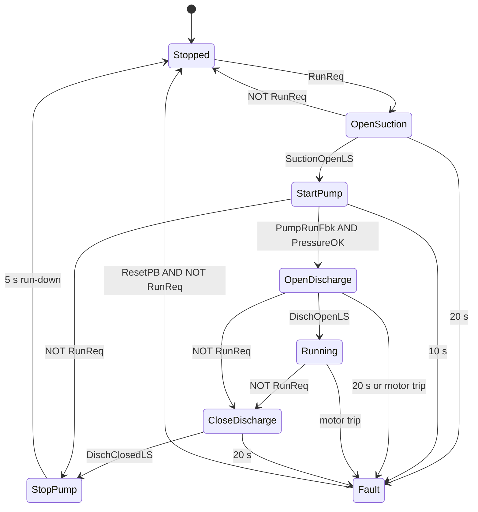
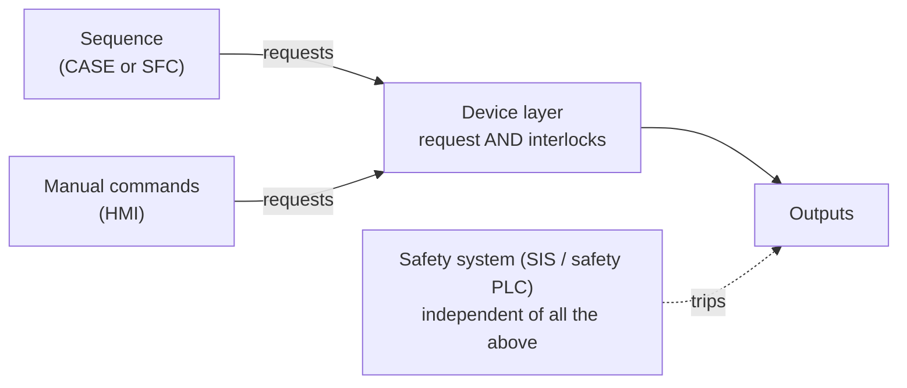
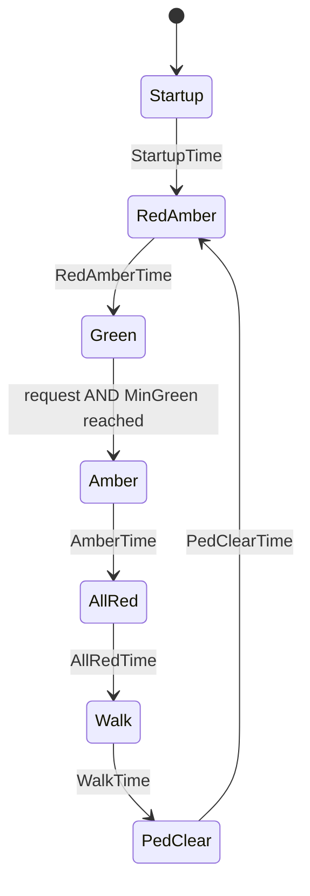
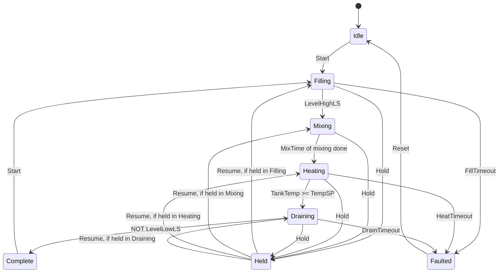

# 13 — Sequential Control: State Machines and SFC

> **Level:** 3 — Structured programming · **Time:** ~12 hours · **Prerequisites:** [07 — Timers](../07-timers/), [10 — Structured Text in Depth](../10-structured-text/), [12 — Data Structures](../12-data-structures/)

Much of what a plant does happens in **steps**. A duty pump opens its suction valve, starts
against a closed discharge valve, waits for pressure, then opens the discharge. A batch
reactor fills, heats, holds at temperature, cools and drains. A drilling station clamps the
part, starts the spindle, feeds down, dwells, retracts and unclamps. The process engineer
writes these steps in an operating description (control narrative, functional design
specification). The PLC programmer's job is to turn that text into logic that always knows
which step it is in, moves on only when the plant says so, notices when the plant does
*not* respond, and does something sensible when an operator presses Hold or Abort, or when
the power goes off halfway through.

Written as a heap of seal-in latches, such a sequence becomes very hard to read, debug or
change. This module teaches the two structured ways to write it. The first is a **state
machine in Structured Text**: an enumeration, a `CASE` statement and a few strict rules.
The second is **Sequential Function Chart (SFC)**, the IEC 61131-3 language designed for
sequences, with its steps, transitions and action qualifiers. You will also see how SFC
relates to **GRAFCET** (IEC 60848), which appears on many European machine drawings, and to
Siemens GRAPH and Rockwell SFC routines. The last part covers what makes a sequence
**robust**: step watchdogs, interlocks that live outside the sequence, a defined output in
every state, operator commands, restart strategies and race conditions inside one scan.
The three labs build a pedestrian crossing and a batch tank as ST state machines, and a
drilling station in textual SFC.

A sequence is ordinary control logic. It is **not** a safety function: emergency stops,
guard interlocks and process trips belong in safety-rated systems designed to IEC 62061,
ISO 13849 or IEC 61511 ([Module 20](../20-functional-safety/)). The labs are training
exercises, not designs for real machines.

## Learning objectives

After this module you will be able to:

- Turn an operating description into a state diagram with states, transitions, actions and
  exactly one active state, and into a state/output table.
- Write a state machine in Structured Text with an enumeration and `CASE`: a step timer
  reset on every change, an entry flag, transitions in priority order, outputs derived from
  the state, and an `ELSE` branch for impossible values.
- Add step watchdogs, a fault state, Abort, Hold and Resume, manual step mode and a safe
  restart after power loss, and decide which commands take priority.
- Read and write SFC: initial step, steps, transitions, actions, the action qualifiers
  N, S, R, P, L, D, SD, DS and SL with their timing, step flags `X` and `T`, alternative and
  simultaneous branches and jumps.
- Apply the SFC rules of evolution and explain what happens in one scan, including when two
  transitions leaving the same step are TRUE together.
- Write textual SFC that MATIEC and OpenPLC compile, and know its quirks; relate SFC to
  GRAFCET, Siemens GRAPH, Rockwell SFC routines and CODESYS.
- Design sequences that keep interlocks outside the sequence, define every output in every
  state, accept operator commands safely and have no race conditions within a scan.
- Test a sequence state by state and transition by transition with `plctest`.

## 1. Why sequences need a structure of their own

### 1.1 From an operating description to steps

Here is a typical piece of an operating description for a duty pump, the kind of text you get
from a process engineer:

> **P-101 start.** On a run request: (1) open suction valve XV-101 and wait for its open
> limit switch, maximum 20 s; (2) start P-101 against the closed discharge valve and wait for
> running feedback and discharge pressure (PSL-101), maximum 10 s; (3) open discharge valve
> XV-102, maximum 20 s; the pump is then running. If the motor trips while running, stop and
> alarm.
> **P-101 stop.** When the run request is removed: close XV-102 (maximum 20 s), stop P-101,
> and after a 5 s run-down close XV-101.
> Any timeout stops the pump, closes both valves and raises an alarm. The alarm is reset by
> the operator with the run request removed.

Read it with a pencil and mark four kinds of words:

| In the text | Becomes | Example |
|---|---|---|
| "wait for", "until", "then" | the boundary between two **states** | "wait for its open limit switch" ends *OpenSuction* |
| the thing waited for | a **transition condition** | `SuctionOpenLS` |
| "open", "start", "close" | an **action**: what the outputs do *in* a state | `SuctionOpen := TRUE` in *OpenSuction* and later states |
| "maximum 20 s", "if ... trips" | a **watchdog** or monitoring transition to a fault state | `StepTimer.ET >= T#20s` → *Fault* |

Starting a centrifugal pump against a closed discharge valve keeps the starting power and
pressure surge low, which is why the description asks for it. (A positive-displacement pump
must never run against a closed discharge.) The watchdog in that step also limits how long
the pump churns against the closed valve.

### 1.2 Why not a flowchart, and why not a pile of latches

A flowchart ("open valve; **wait until** limit switch; start pump; ...") describes a program
that sits and waits. A PLC must never wait inside its program: the scan has to finish so
that inputs are read, outputs written and the watchdog kept happy. Module 10 showed that a
loop waiting for an input hangs the controller
([Never wait for an input inside a loop](../10-structured-text/README.md#never-wait-for-an-input-inside-a-loop)).
A sequence therefore has to **remember where it is** between scans, and check once per scan
whether it may move on.

The oldest way to remember is one seal-in latch per step, each set by the previous step
plus its condition and reset by the next step:

```text
      Step1      SuctionOpenLS                  Step3        Step2
 |-----] [-----------] [-----------+-------------]/[----------( )-----|
 |                                 |
 |      Step2                      |
 |-----] [-------------------------+
```

It works for four steps. At forty, with holds, aborts and faults, it becomes painful:

- Nothing stops two step latches from being on together after a bad edit or an unexpected
  input combination, and nothing tells you which step the machine is "really" in.
- Every abort or fault needs its own reset path into every latch.
- The outputs are driven from many rungs, so "why is this valve open?" means reading them all.
- After a power cut, which latches were retentive? Some, all or none?

### 1.3 The vocabulary

| Term | Meaning | In the pump example |
|---|---|---|
| **State** (in SFC: **step**) | A situation the sequence stays in for a while, waiting for something | *StartPump* |
| **Initial state** | The state after power-up or reset | *Stopped* |
| **Transition** | A move from one state to another | *StartPump* → *OpenDischarge* |
| **Transition condition** (guard) | The Boolean expression that allows the transition | `PumpRunFbk AND PressureOK` |
| **Action** | What happens while a state is active, usually outputs switched on | pump running, suction valve open |
| **Entry action** | Something done once, on entering a state | count a batch, reset a totaliser |
| **Exit or transition action** | Something done once, on leaving a state or taking a transition | record which step failed, bank the mixing time already done |

Two styles of output are worth naming. When outputs depend only on the current state, the
machine is called a **Moore** machine. This is what you want for field devices: look up the
state and you know what every output is doing. When something happens *on* a transition, as
in a **Mealy** machine, it is a one-off: incrementing a counter, capturing a value, writing a
log entry. Good PLC state machines are mostly Moore, with a few entry and transition actions
for the one-offs.

### 1.4 State diagrams and state/output tables

A **state diagram** draws states as boxes and transitions as labelled arrows. Here is the
pump sequence (GitHub renders the Mermaid source as a diagram):



The diagram shows the *flow*. The **state/output table** shows what every output does in
every state. Write it before you write code, and have the process engineer review it,
because it is the part they can check without reading ST:

| State | `SuctionOpen` | `PumpRun` | `DischOpen` | `FaultLamp` | Leaves on | Watchdog |
|---|---|---|---|---|---|---|
| Stopped | 0 | 0 | 0 | 0 | `RunReq` | — |
| OpenSuction | 1 | 0 | 0 | 0 | `SuctionOpenLS` | 20 s |
| StartPump | 1 | 1 | 0 | 0 | `PumpRunFbk AND PressureOK` | 10 s |
| OpenDischarge | 1 | 1 | 1 | 0 | `DischOpenLS` | 20 s, motor trip |
| Running | 1 | 1 | 1 | 0 | `NOT RunReq` | motor trip |
| CloseDischarge | 1 | 1 | 0 | 0 | `DischClosedLS` | 20 s |
| StopPump | 1 | 0 | 0 | 0 | 5 s run-down | — |
| Fault | 0 | 0 | 0 | 1 | `ResetPB AND NOT RunReq` | — |

Every cell has a value. An empty cell is a question nobody has answered yet, and the
program will answer it by accident.

### 1.5 One active state

The single most useful property of a well-written sequence is that **exactly one state is
active at any time**. If the state lives in *one variable*, this is guaranteed: a variable
cannot hold two values. You can always answer "where is the sequence?" by looking at that
variable online, and every output can be computed from it.

SFC keeps the same idea with a twist: a chart with **parallel branches** deliberately has
several active steps, one per branch (section 3.8). Within each branch, the rule still holds.

## 2. State machines in Structured Text

### 2.1 The state variable: an enumeration

The state is best held in an enumeration ([Module 12, section 5.1](../12-data-structures/README.md#51-enumerations)):

```iecst
TYPE
  E_PumpSeq : (Stopped, OpenSuction, StartPump, OpenDischarge, Running,
               CloseDischarge, StopPump, Fault);
END_TYPE
```

- Put the initial, safe state **first**: an enumeration variable starts with the first value
  unless you give it another initial value.
- Write values qualified, `E_PumpSeq#Running`. Plain names become ambiguous as soon as two
  enumerations share one (Module 12).
- The online view shows `RUNNING` instead of a bare number, and the compiler refuses a number
  where a state is expected.
- Many plants and platforms use integer step numbers instead, often in steps of 10
  (10, 20, 30...) to leave room for inserting steps. Logix has no user-defined enumerations,
  and TIA Portal has traditionally had none, so there you declare named constants
  (`STEP_FILL := 20`). In CODESYS you can give enumeration values explicit numbers; MATIEC
  cannot (Module 12).
- Don't call the variable `Step`: `STEP` is a reserved word in IEC 61131-3 (it belongs to
  SFC), and MATIEC reports a flood of syntax errors. `State`, `Seq` or `Phase` are safe.

To show the state on an HMI, map it to a number with a function, as Module 12 does for
modes. Never renumber a state list that an HMI or historian already uses.

### 2.2 The skeleton

At its core, every ST state machine in this course has the same four parts, in the same
order (commands, when there are any, are decoded just before them):

```iecst
  (* 1. Step bookkeeping *)
  StepEntry := (State <> PrevState) OR FirstScan;
  FirstScan := FALSE;
  PrevState := State;
  StepTimer(IN := NOT StepEntry, PT := T#24h);

  (* 2. Entry actions: once, on the first scan in a state *)
  IF StepEntry AND (State = E_Batch#Complete) THEN
    BatchCount := BatchCount + 1;
  END_IF;

  (* 3. Transitions: one CASE branch per state *)
  CASE State OF
    E_Batch#Filling:
      IF LevelHighLS THEN
        State := E_Batch#Mixing;
      ELSIF StepTimer.ET >= FillTimeout THEN
        State := E_Batch#Faulted;
      END_IF;
    (* ... one branch per state ... *)
  ELSE
    State := E_Batch#Faulted;       (* impossible value: stop safely *)
  END_CASE;

  (* 4. Outputs: one assignment per output, derived from the state *)
  InletValve := State = E_Batch#Filling;
  Agitator   := (State = E_Batch#Mixing) OR (State = E_Batch#Heating);
```

The declarations that go with it:

```iecst
  VAR
    State     : E_Batch := E_Batch#Idle;
    PrevState : E_Batch := E_Batch#Idle;
    FirstScan : BOOL := TRUE;
    StepEntry : BOOL;          (* TRUE on the first scan in a state *)
    StepTimer : TON;           (* time spent in the current state *)
  END_VAR
```

The sections that follow explain each part. [Worked example 1](#worked-example-1-pump-start-and-stop-sequence-in-st)
shows the complete pump program.

### 2.3 The step timer

One TON measures **how long the sequence has been in the current state**. It is called on
every scan (Module 07's rule), and its `IN` is `NOT StepEntry`, so it is held reset for one
scan whenever the state changes. `StepTimer.ET` then always means "time in this state", and
every timed transition and watchdog compares against it:

```iecst
IF StepTimer.ET >= T#5s THEN
  State := E_PumpSeq#Stopped;
END_IF;
```

Here is what happens, scan by scan, when *OpenSuction* hands over to *StartPump* after
12.34 s:

| Scan | What happens | `State` at the end | `StepEntry` | `StepTimer.ET` |
|---|---|---|---|---|
| k | `SuctionOpenLS` seen; the *OpenSuction* branch sets `State := StartPump`; outputs for *StartPump* are written | StartPump | FALSE | 12.34 s (the old state's time) |
| k+1 | first scan in *StartPump*: entry actions run; timer held at 0 | StartPump | TRUE | 0 |
| k+2 | timer starts | StartPump | FALSE | 0 |
| k+3 | | StartPump | FALSE | 1 scan (10 ms here) |

Points to notice:

- On scan k the old time (12.34 s) is still in `ET`, but the *StartPump* branch does not run
  on scan k (`CASE` runs only one branch), so no *StartPump* transition can see it. On scan
  k+1, `ET` is already 0. A transition therefore never fires on the previous state's time.
- The step time starts two scans after the transition, so a 5 s step lasts 5 s plus two
  scans. For process sequences this does not matter. Where it does, give that step its own
  TON with `IN := State = E_PumpSeq#StopPump`, which starts timing one scan earlier.
- `PT` only has to be longer than any time you compare against. `ET` stops at `PT`, so with
  `T#24h` a state that lasts longer than a day reads 24 h, which is still "longer than any
  timeout".
- One timer per *state* (`FillTimer(IN := State = E_Batch#Filling, PT := FillTimeout)`)
  also works and is a common alternative. It costs more instances, and a timer shared by two
  consecutive states (`IN := (State = A) OR (State = B)`) does not reset when the sequence
  moves from A to B, which is a classic source of steps that end too early.

### 2.4 Entry actions: the first scan in a state

`StepEntry` is TRUE for exactly one scan, the first scan in each new state (and the very
first scan after power-up, thanks to `FirstScan`). Use it for things that must happen
**once**: counting a batch, capturing a value, clearing a totaliser, writing an event
record.

Two rules make entry actions reliable:

1. **Entry actions go before the transitions.** `StepEntry` belongs to the state the scan
   *started* in. Suppose you test `StepEntry AND State = X` *after* the `CASE`, and the state
   before X lasted only one scan (its transition condition was already TRUE when it was
   entered). Then the action runs twice: once on the scan where `State` becomes X, because
   `StepEntry` still refers to that one-scan state, and again on the next scan, which is X's
   own first scan. Lab 13-2 tests exactly this.
2. **Entry actions run one scan after the outputs change.** Outputs derived from `State`
   change on scan k, in the same scan as the transition. Entry actions run on scan k+1. If
   something must change in the *same* scan as the state, derive it from the state (like an
   output) or do it in the transition. Lab 13-1's WAIT lamp is an example: it must go out
   exactly when the green figure lights, so the request latch is cleared by a line computed
   from the state, not by an entry action.

**Exit actions** (things done once when leaving a state) are simplest written in the
transition itself, just before `State :=` is assigned, as Lab 13-2 does when it banks the
mixing time on Hold.

### 2.5 Transitions: order is priority

Inside one `CASE` branch, the `IF ... ELSIF` order decides which transition wins when two
conditions are TRUE in the same scan:

```iecst
    E_PumpSeq#OpenDischarge:
      IF NOT RunReq THEN                            (* 1. the operator's stop *)
        State := E_PumpSeq#CloseDischarge;
      ELSIF DischOpenLS THEN                        (* 2. normal progress *)
        State := E_PumpSeq#Running;
      ELSIF (StepTimer.ET >= T#20s) OR NOT PumpRunFbk THEN  (* 3. watchdog, trip *)
        State := E_PumpSeq#Fault;
      END_IF;
```

Decide the order deliberately. Commands that end the sequence (Abort) usually come first.
Between a success condition and its watchdog, put the success first: if the limit switch and
the timeout arrive in the same scan, the valve *did* open.

`CASE` gives you a second, very important guarantee: only one branch runs per scan, so the
sequence can advance **at most one state per scan**. Every state is active for at least one
full scan, its outputs are written at least once, and its entry actions run. Section 4.6
shows what goes wrong without this.

### 2.6 Outputs derived from the state

Compute every output **once, after the `CASE`**, from the state:

```iecst
  SuctionOpen := (State = E_PumpSeq#OpenSuction) OR (State = E_PumpSeq#StartPump)
              OR (State = E_PumpSeq#OpenDischarge) OR (State = E_PumpSeq#Running)
              OR (State = E_PumpSeq#CloseDischarge) OR (State = E_PumpSeq#StopPump);
  PumpRun     := (State = E_PumpSeq#StartPump) OR (State = E_PumpSeq#OpenDischarge)
              OR (State = E_PumpSeq#Running) OR (State = E_PumpSeq#CloseDischarge);
  DischOpen   := (State = E_PumpSeq#OpenDischarge) OR (State = E_PumpSeq#Running);
```

Each line is one column of the state/output table. Compare the tempting alternative:

```iecst
  (* DON'T: outputs switched on and off wherever the sequence happens to be *)
  CASE Seq OF
    10: IF StartPB THEN InletValve := TRUE; Seq := 20; END_IF;
    20: IF LevelHighLS THEN InletValve := FALSE; Agitator := TRUE; Seq := 30; END_IF;
    30: IF MixTimer.Q THEN Agitator := FALSE; Seq := 10; END_IF;
  END_CASE;
```

It works until someone adds an abort that jumps from step 20 to step 10: the inlet valve
stays open forever, because only the step-20 transition closes it. With outputs derived
from the state, an abort to *Idle* closes everything that *Idle* does not need, by
construction. Derived outputs also answer the commissioning engineer's question "why is
this valve open?" with one line of code.

### 2.7 Faults and Abort

Every state that waits for the plant has a **watchdog** transition to a fault state
(section 4.1). The fault state:

- sets every output to its defined fault value (usually off, but see section 4.3);
- records *which* state failed and why, for the HMI and alarm system (a `FaultStep`
  variable or a `FaultCode`);
- stays there until an operator resets it. Accept the reset only when a restart cannot
  happen by surprise, for example only while the run request is off, as in Lab 07-3.

**Abort** is an operator command that ends the sequence from any active state, now. It is
usually handled *before* the `CASE`, so that it does not have to be repeated in every
branch:

```iecst
  IF AbortCmd AND (Running OR (State = E_Batch#Held)) THEN
    State := E_Batch#Idle;
  ELSE
    CASE State OF                   (* the normal transitions *)
      E_Batch#Filling:
        IF LevelHighLS THEN
          State := E_Batch#Mixing;
        END_IF;
      (* ... one branch per state ... *)
    END_CASE;
  END_IF;
```

ISA-88 (batch control, [Module 21](../21-architecture-and-standards/)) distinguishes **Stop**,
an orderly end that runs its own stopping steps (close the discharge first, then stop the
pump), from **Abort**, the fastest safe end. Many sequences need both.

Finally, the `ELSE` branch of the `CASE` catches values that should be impossible, for
example after an online edit or a corrupted retentive value. Send them to the fault state
or the initial state, never ignore them.

### 2.8 Hold and Resume

**Hold** parks a running sequence in a safe condition so that the operator can deal with
something (a blocked outlet, a sample to take) and then carry on. It raises design
questions that only the process engineer can answer:

- **What does each device do in Held?** Usually valves close and heaters switch off. But
  some things must keep running: an agitator in a reactor that is still reacting, cooling
  water, a lube pump. Put *Held* in the state/output table like any other state.
- **Where does Resume go?** Normally back to the state the hold came from, so remember it:

  ```iecst
  ELSIF HoldCmd AND Running THEN
    HeldFrom := State;
    State := E_Batch#Held;
  (* ... and in the CASE ... *)
    E_Batch#Held:
      IF ResumeCmd THEN
        State := HeldFrom;
      END_IF;
  ```

- **What happens to the timers?** Watchdogs usually restart on resume: the step timer does
  so automatically, because re-entering the state resets it. But *process* times, such as
  "mix for 10 minutes", normally must not start again from zero. Bank the time done before
  the hold (an exit action) and add it on resume. Lab 13-2 does this.
- **Is it still valid to carry on?** A long hold changes the plant: a heated batch cools, a
  mixture settles. The resumed step must check its own conditions again, which a well-written
  transition does anyway.

ISA-88 names these states *Holding*, *Held* and *Restarting*, with the command *Restart* to
leave Held. It keeps *Pause*/*Resume* for a lighter pause at the next safe point. In this
module "Resume" is used in the everyday sense.

### 2.9 Restart after a power loss

What should a sequence do when power returns in the middle of a batch? The safe default,
used in all the labs, is:

- The state variable is **not** retentive, so the PLC starts in the initial state with
  every output off.
- Nothing moves by itself. Machinery standards such as IEC 60204-1 require that a machine
  does not restart automatically after a power failure where that could be hazardous. A
  deliberate operator command starts again.
- The next start **re-checks the plant**. The tank may still be full, a valve may be half
  open. A well-written sequence copes: in Lab 13-2 a start with a full tank goes straight
  through *Filling* to *Mixing* without opening the inlet.

Some processes cannot simply start again: a long reaction, a cook, a heat treatment. Then
the sequence must remember where it was, **and still not continue by itself**. Keep the
state and everything a resume needs in retentive memory, and on the first scan park the
batch in *Held* so that the operator decides between Resume and Abort:

```iecst
  VAR RETAIN
    SavedState    : E_Batch := E_Batch#Idle;   (* kept through a power cut *)
    SavedHeldFrom : E_Batch := E_Batch#Idle;
  END_VAR

  (* first scan after power returns: never carry on by itself *)
  IF FirstScan THEN
    CASE SavedState OF
      E_Batch#Filling, E_Batch#Mixing, E_Batch#Heating, E_Batch#Draining:
        HeldFrom := SavedState;     (* park the batch in the step it was in *)
        State := E_Batch#Held;
      E_Batch#Held:
        HeldFrom := SavedHeldFrom;
        State := E_Batch#Held;
      E_Batch#Faulted:
        State := E_Batch#Faulted;   (* a fault survives the power cut *)
    ELSE
      State := E_Batch#Idle;        (* Idle or Complete: start clean *)
    END_CASE;
  END_IF;

  (* ... the rest of the program ... *)

  SavedState := State;              (* the last lines of the scan *)
  SavedHeldFrom := HeldFrom;
```

Everything the resumed step relies on (banked mixing time, quantities already dosed) must
be retentive too, and the resumed step must check its conditions again. How retentive memory
behaves on warm and cold restarts, and after a download, is platform-specific
([Module 03](../03-data-types-and-addressing/), [Module 11](../11-program-organization/README.md#35-retentive-data-retain-non_retain-and-persistent)).
Treat "resume after power failure" as a deliberate, reviewed design, never as the default.

### 2.10 Manual and step modes

Sequences usually need more than one way of running:

| Mode | What the sequence does | Typical use |
|---|---|---|
| **Automatic** | Moves on as soon as a transition condition is TRUE | Production |
| **Step** (semi-automatic, "tip" or "inching" mode) | Moves on only when the condition is TRUE **and** the operator presses Next | Commissioning, fault finding, first batches |
| **Manual** | The sequence is held or switched off; devices are operated one by one from the HMI | Maintenance, recovery after a fault |

Step mode is easy to add if transitions only *propose* the next state and one place
decides whether to take it:

```iecst
  NextState := State;
  CASE State OF
    E_PumpSeq#OpenSuction:
      IF SuctionOpenLS THEN
        NextState := E_PumpSeq#StartPump;
      ELSIF StepTimer.ET >= T#20s THEN
        NextState := E_PumpSeq#Fault;
      END_IF;
    (* ... *)
  END_CASE;

  (* In step mode a transition also needs a press of Next, except a move to Fault. *)
  NextEdge(CLK := NextPB);
  TakeTransition := (NextState <> State)
                AND ((NOT StepMode) OR NextEdge.Q OR (NextState = E_PumpSeq#Fault));
  WaitingForNext := (NextState <> State) AND NOT TakeTransition;   (* for the HMI *)
  IF TakeTransition THEN
    State := NextState;
  END_IF;
```

Three rules keep the modes safe:

1. **Interlocks apply in every mode**, including manual (section 4.2). Manual mode means
   "the operator chooses the device", not "the interlocks are off".
2. **Fault transitions are never held back** by step mode.
3. **Jumping to an arbitrary step** (sometimes offered for recovery) is a maintenance
   function with its own permission, a check of the plant state, and a record in the event
   log. Changing modes is covered in [Module 11, section 6.4](../11-program-organization/README.md#64-modes);
   mode selection from the HMI in [Module 18](../18-hmi-and-scada/).

## 3. Sequential Function Chart (SFC)

### 3.1 What SFC is

SFC is the IEC 61131-3 language for sequences. It is not really a fifth way of writing
logic: it is a way of **organising** logic. The chart gives the structure (steps and
transitions), and the actual work is written in the other languages: transition conditions
and actions in ST, LD, FBD (or IL). It grew out of GRAFCET (section 3.12).

A chart is drawn top to bottom. In this module's ASCII drawings, the initial step has a
double border, a transition is a short horizontal bar with its condition beside it, and the
action block to the right of a step lists qualifier and action:

```text
      +=========+
      || Idle  ||------[ N | ReadyLamp ]
      +====+====+
           |
         --+--  StartPB AND PartPE AND DrillUpLS
           |
      +----+----+
      |  Clamp  |------[ S | ClampValve ]
      +----+----+
           |
         --+--  ClampedLS
           |
      +----+----+
      |  Drill  |------[ S | Spindle              ]
      +----+----+      [ D | FeedDown, SpinUpTime ]
           |
         --+--  DrillDownLS
           |
          ...
```

Chart elements at a glance:

| Element | Graphical form | Textual form (IEC 61131-3, as MATIEC compiles it) |
|---|---|---|
| Initial step | double-bordered box | `INITIAL_STEP Idle: ... END_STEP` |
| Step | box | `STEP Clamp: ... END_STEP` |
| Transition | bar with a condition | `TRANSITION FROM Idle TO Clamp := StartPB; END_TRANSITION` |
| Action association | block beside the step | `ClampValve(S);` inside the step |
| Named action | action with a body | `ACTION CountHole: HoleCount := HoleCount + 1; END_ACTION` |
| Alternative branch | one line splitting into several transitions | several `TRANSITION FROM Drill TO ...` |
| Simultaneous branch | double line | `TRANSITION FROM Split TO (A, B)` and `FROM (A, B) TO Join` |

### 3.2 Steps, step flags and step time

A **step** is active or inactive. Each chart has exactly one **initial step**, which is
active when the program starts. Every step provides two read-only variables:

- `StepName.X` (BOOL): TRUE while the step is active, the **step flag**.
- `StepName.T` (TIME): how long the step has been active. It restarts from `T#0s` each time
  the step is activated and keeps its last value after the step is deactivated.

You use them in transition conditions and actions: `Dwell.T >= DwellTime` is a timed
transition with no timer instance at all, and `Drill.X` can gate a message on the HMI.

### 3.3 Transitions

A **transition** sits between steps and carries exactly one **condition**, a Boolean
expression (or an LD rung, or an FBD network). A transition is **enabled** when every step
immediately above it is active. An enabled transition **fires** (the standard says it is
"cleared") when its condition is TRUE. Firing deactivates the steps above and activates the
steps below.

Keep conditions free of side effects: no FB calls, no assignments. Depending on the tool,
a condition may be evaluated only while its transition is enabled, so a timer called inside
it would not be updated reliably. Use the step time (`Step.T`) instead.

### 3.4 Actions and action blocks

Each step can have any number of **action associations**. Each one names an action and
gives a **qualifier** (and a time for the timed qualifiers). An action is either:

- a **Boolean variable**, which the qualifier switches on and off, `FeedUp(N);`, or
- a **named action** with a body, written in any language, which runs on each scan while
  the action is active:

  ```iecst
    ACTION CountHole:
      HoleCount := HoleCount + 1;
    END_ACTION
  ```

The same action can be associated with several steps. The standard defines how all its
associations combine through an "action control" block. In short, all the reasons for being
active are ORed, and an **R** association wins over everything else.

### 3.5 Action qualifiers

| Qualifier | Name | The action is active... | Typical use |
|---|---|---|---|
| **N** (or none) | Non-stored | exactly while the step is active | a valve open during one step |
| **S** | Set (stored) | from step activation until an **R** for the same action, even after the step has ended | a motor that runs through several steps |
| **R** | overriding Reset | not at all: R switches the action off, overriding everything else, and ends an **S**, **SD**, **DS** or **SL** action | the step where the motor stops |
| **P** | Pulse | once, when the step is activated | count, capture, log |
| **L** | time Limited | from step activation for the given time, or until the step ends if sooner | a blow-off lasting at most 1 s |
| **D** | time Delayed | from the given time after step activation until the step ends; never if the step ends first | start the feed after the spindle has run up |
| **SD** | Stored and time Delayed | from the given time after activation until **R**, even if the step ended before the time | start the cooling fan 2 min after the burner starts, whatever happens next |
| **DS** | Delayed and Stored | like **SD**, but only if the step is still active when the time is reached | start an extraction fan if a step lasts longer than 2 min, and keep it running until a later step stops it |
| **SL** | Stored and time Limited | from activation for the given time (or until **R**), even after the step ends | a lubrication pulse that must complete |

The standard also defines **P1** and **P0** (a pulse when the step is activated and when it
is deactivated). Not every tool offers them. MATIEC accepts both, but with a Boolean variable
as the action its **P0** leaves the variable TRUE after the pulse, so use P0 there only with
named actions.

The timing diagrams show all of them. Step `S1` has the action associations; a later step
`S3`, active from 7 s, holds the **R** association that ends the stored ones. The time
argument is `T#2s`. Each character is a quarter of a second, and **P** lasts one scan.

**Case 1: the step lasts longer than the time argument** (`S1` active from 0 to 5 s):

```text
            ___________________
S1.X     __|                   |_______________

            ___________________
N        __|                   |_______________

            ___________________________
S        __|                           |_______

            _______
L        __|       |___________________________

                    ___________
D        __________|           |_______________

            _
P        __| |_________________________________

                    ___________________
SD       __________|                   |_______

                    ___________________
DS       __________|                   |_______

            _______
SL       __|       |___________________________

                                        ___
S3.X     ______________________________|   |___

           |   |   |   |   |   |   |   |   |
t (s)      0   1   2   3   4   5   6   7   8   9
```

**Case 2: the step is shorter than the time argument** (`S1` active from 0 to 1 s):

```text
            ___
S1.X     __|   |_______________________________

            ___
N        __|   |_______________________________

            ___________________________
S        __|                           |_______

            ___
L        __|   |_______________________________


D        ______________________________________

            _
P        __| |_________________________________

                    ___________________
SD       __________|                   |_______


DS       ______________________________________

            _______
SL       __|       |___________________________

                                        ___
S3.X     ______________________________|   |___

           |   |   |   |   |   |   |   |   |
t (s)      0   1   2   3   4   5   6   7   8   9
```

Compare the pairs that are easy to confuse:

- **L and SL** behave the same while the step lasts. When the step ends early, **L** stops
  with it and **SL** carries on for its full time.
- **D and DS** both wait while the step is active. At the end of the time, **D** is active
  only until the step ends, while **DS** stays on until reset.
- **SD and DS** differ when the step is short: **SD** still comes on at 2 s, because the
  delay started and is stored; **DS** never comes on, because its step had already ended.

These diagrams were checked against MATIEC with `plctest`, and they follow the standard's
definitions.

### 3.6 The rules of evolution

IEC 61131-3 defines how a chart moves ("evolves"):

1. At start-up, the initial step is active and every other step is inactive.
2. A transition is **enabled** when all the steps immediately before it are active.
3. An enabled transition **fires** when its condition is TRUE.
4. Firing deactivates all the steps immediately before the transition and activates all the
   steps immediately after it, as one indivisible operation.
5. Transitions that can fire at the same time, fire at the same time.

PLC implementations evaluate this once per scan. In MATIEC, every transition condition is
evaluated first, using the step flags **as they were at the start of the scan**, and then all
the firing transitions update the steps. So a step activated in this scan can be left, at
the earliest, in the next scan: the chart advances at most one step per scan along any path,
exactly like the `CASE` state machine. Some tools can be configured to keep evaluating within
the same scan; check before relying on either behaviour.

### 3.7 Alternative (selection) branches

An **alternative branch** is a step with several outgoing transitions, only one of which
should be taken. In the drilling station, `Drill` either reaches depth or times out:

```text
                  +----+----+
                  |  Drill  |
                  +----+----+
                       |
          +------------+------------+
          |                         |
        --+--  DrillDownLS        --+--  NOT DrillDownLS AND Drill.T >= FeedTimeout
          |                         |
     +----+----+              +-----+-----+
     |  Dwell  |              | FeedFault |
     +---------+              +-----------+
```

What if both conditions are TRUE in the same scan? The standard lets a tool resolve this
by a left-to-right priority, by explicitly numbered priorities, or by leaving it to the
programmer to make the conditions **mutually exclusive**. **MATIEC fires every transition
whose condition is TRUE**, even when you give priorities in the textual form
(`TRANSITION T1 (PRIORITY := 1) FROM ...`). Both target steps become active, and from then
on the chart is broken. Always write alternative conditions so that at most one can be TRUE:
`DrillDownLS` and `NOT DrillDownLS AND ...`. That is portable to every tool and makes the
priority visible to the reader.

The branches of an alternative usually meet again later (an alternative **convergence**):
a single line that several transitions lead into, for example `FeedFault` and `Dwell` both
leading into `Retract`.

### 3.8 Simultaneous (parallel) branches

A **simultaneous branch** starts several sequences at once. It is drawn with a double line.
One transition activates all the branches (divergence); one transition after the second
double line waits for **all** of them (convergence):

```text
                 +--------+
                 |  Idle  |
                 +----+---+
                      |
                    --+--  StartPB
          ============+============
          |                       |
     +----+----+             +----+----+
     |  DoseA  |--[N|ValveA] |  DoseB  |--[N|ValveB]
     +----+----+             +----+----+
          |                       |
        --+-- AReached          --+-- BReached
          |                       |
     +----+----+             +----+----+
     |  ADone  |             |  BDone  |
     +----+----+             +----+----+
          |                       |
          ============+============
                    --+--  TRUE
                      |
                 +----+---+
                 |  Mix   |--[N|Agitator]
                 +--------+
```

Each branch ends in an empty "done" step. It gives the branch a place to wait until the
other branch has finished, while its own valve is already closed. In textual SFC the
divergence and convergence are written with a list of steps:
`TRANSITION FROM Idle TO (DoseA, DoseB)` and `TRANSITION FROM (ADone, BDone) TO Mix`
([Worked example 3](#worked-example-3-parallel-dosing-in-sfc)).

### 3.9 Jumps, loops, and charts that cannot work

A **jump** is a transition to a step higher up the chart, drawn as an arrow to the step's
name. In textual SFC it is just a transition whose target was declared earlier:
`TRANSITION FROM Unload TO Idle`. Loops (repeat a step until a counter is reached) are built
the same way, with an alternative branch that either loops back or goes on.

Some charts can be drawn but cannot work. Jumping out of *one* branch of a parallel section
leaves the other branch's steps active with nowhere to go (an **unsafe** chart). A
convergence that can never have all its steps active at once is **unreachable**. The
standard describes both kinds, and good editors refuse to build them. Leave a parallel
section only through its convergence.

### 3.10 Textual SFC, as MATIEC compiles it

IEC 61131-3 defines a textual form of SFC alongside the graphical one. MATIEC compiles it,
the OpenPLC Editor generates it from a graphical chart, and it is what Lab 13-3 uses:

```iecst
  INITIAL_STEP Idle:                       (* exactly one initial step *)
    ReadyLamp(N);                          (* action association: name(qualifier) *)
  END_STEP

  TRANSITION FROM Idle TO Clamp            (* condition as an ST expression *)
    := StartPB AND PartPE AND DrillUpLS;
  END_TRANSITION

  (* ... the Clamp step and its transition ... *)

  STEP Drill:
    Spindle(S);
    FeedDown(D, SpinUpTime);               (* timed: a TIME literal or variable *)
  END_STEP

  (* ... the transition from Drill to Dwell ... *)

  STEP Dwell:
    CountHole(P);                          (* a named action *)
  END_STEP

  TRANSITION FROM Dwell TO Retract
    := Dwell.T >= DwellTime;               (* step time *)
  END_TRANSITION

  (* ... the Retract step and the rest of the chart ... *)

  ACTION CountHole:                        (* body in ST *)
    HoleCount := HoleCount + 1;
  END_ACTION
```

Transitions may also be named, with an optional priority,
`TRANSITION T_Fault (PRIORITY := 1) FROM Drill TO FeedFault`, and may connect lists of steps
for parallel branches. Steps can be empty (`STEP Unload: END_STEP`).

**The body of a POU is either a chart or ST, not both.** You cannot write ordinary ST
statements between the steps. Logic that must run on every scan, such as interlocks, goes
either into actions, or, better, outside the chart: put the chart in a function block and
call it from an ST program ([Worked example 4](#worked-example-4-interlocks-around-a-chart)).

Behaviour of MATIEC's textual SFC, all checked with `plctest`:

| Behaviour | What to do |
|---|---|
| Every enabled transition whose condition is TRUE fires, priorities or not | Make the conditions of an alternative branch mutually exclusive |
| A step is left, at the earliest, on the scan after it was activated | Nothing: this is the one-step-per-scan behaviour you want |
| A **P** action on the *initial* step does not run at power-up (the initial step counts as already active); it runs when the step is activated again later | Don't rely on it for initialisation; use a first-scan flag |
| A Boolean variable with **N** is written TRUE while its step is active and FALSE in the scan its step is deactivated, step by step in the order the steps are written. If one variable is N-associated with two consecutive steps, and the chart moves from the later-written step to the earlier-written one, the output drops for one scan | Use **S** and **R** for an output that spans several steps, or drive it from step flags outside the chart |
| An action body runs only while the action is active; there is no extra "final" execution after it ends | Switch off in another step (R) or use qualifiers on Boolean variables |
| **P0** on a Boolean variable sets it TRUE when the step is deactivated and nothing sets it FALSE again | Use P0 only with named actions |
| Step names share the namespace with variables, and `STEP` is a keyword | Use distinct names: a step `Clamp`, a variable `ClampValve` |
| `plctest` cannot address `Drill.X` in a `.test` file | Test outputs. For debugging only, `print Drill_X` shows MATIEC's internal name for the flag |

### 3.11 Graphical SFC: OpenPLC Editor and CODESYS

In the **OpenPLC Editor** you draw the chart graphically: steps, transitions, action blocks,
divergences and jumps from the SFC toolbox, with conditions and action bodies in ST, LD or
FBD. When the program is built, the editor generates the textual form of section 3.10 for
MATIEC. You can therefore draw Lab 13-3 in the editor, save the generated `.st` file, and run
it against the lab's test as described in
[Module 00](../00-start-here/README.md#testing-ladder-you-drew-in-openplc-editor).

**CODESYS** has a full SFC editor, with some differences from the plain standard worth
knowing:

- Besides **IEC actions** with qualifiers, each step can have **step actions**: an *entry*
  action (once on activation), an *active* action (every scan while active) and an *exit*
  action (once on deactivation). Entry and exit actions are the natural home for counting
  and logging in CODESYS.
- CODESYS documents that an IEC action is executed **one more time after it is
  deactivated**, and consequently that a **P** action runs twice: once when its step is
  activated and once when it is deactivated. A counter incremented in a P action counts
  double. Use an entry action for Lab 13-3's hole counter if you rebuild it in CODESYS.
- Implicit **SFC flags** can be declared to control the chart from outside, for example
  `SFCInit` and `SFCReset` (return to the initial step), `SFCPause` (freeze the chart),
  `SFCError` with `SFCEnableLimit` (step time monitoring), and `SFCTip`/`SFCTipMode` for
  stepping through the chart one transition at a time.
- Steps can be given a minimum and a maximum active time; with monitoring enabled, a step
  that exceeds its maximum sets `SFCError`.

### 3.12 GRAFCET (IEC 60848)

**GRAFCET** was developed in France in the 1970s and is standardised internationally as
**IEC 60848**. It is a **specification** language: a way of describing the required
behaviour of a sequential control system, independent of how it is implemented. SFC was
derived from it, so the pictures look almost the same: steps (with a double square for an
initial step), transitions with **receptivities** (GRAFCET's word for transition
conditions), and actions in rectangles beside the steps.

What differs:

| | GRAFCET (IEC 60848) | SFC (IEC 61131-3) |
|---|---|---|
| Purpose | Specify behaviour, for any technology | Program a PLC |
| Actions | Continuous actions (optionally with an assignment condition), stored actions on activation, deactivation or an event | Qualifiers N, S, R, P, L, D, SD, DS, SL |
| Structuring | Macro-steps, enclosing steps, forcing orders between partial GRAFCETs | Actions, sub-charts in some tools, vendor features |
| Evolution | Five rules, plus the rule that a step activated and deactivated at once stays active; unstable ("transient") situations are passed through without executing continuous actions | Evaluated once per scan in most PLCs; each step lasts at least one scan |

In practice, a GRAFCET in a machine specification maps almost one-to-one onto an SFC or a
`CASE` state machine. Watch for the places where GRAFCET's instantaneous evolution and a
PLC's scan-by-scan evolution differ: a step that GRAFCET passes through without effect will
be active for one scan in the PLC, and its outputs will be written for that scan.

### 3.13 SFC or `CASE`?

| | SFC | `CASE` state machine in ST |
|---|---|---|
| Seeing the sequence | The chart *is* the diagram; online, the active steps are highlighted | Needs a separate diagram; online you read one variable |
| Parallel sequences | Built in | Two state machines, synchronised by hand |
| Abort, hold, "go to fault from anywhere" | Many extra transitions, or vendor features (CODESYS flags, GRAPH parameters, Rockwell SFR) | One `IF` before the `CASE` |
| Timing | `Step.T` and timed qualifiers | One step timer |
| Portability | The idea is portable; the files and many details are not | Plain text, ports to any ST dialect with small changes |
| Version control and review | Graphical files diff poorly | Text diffs cleanly ([Module 22](../22-software-engineering/)) |
| Who maintains it | Technicians used to charts and GRAFCET often prefer SFC | Programmers comfortable with ST |

Both are professional choices. Many sites use SFC (or GRAPH) for long process and batch
sequences that operators and technicians follow online, and `CASE` state machines inside
reusable function blocks (a valve, a motor, an axis). Pick one per project and use it
consistently.

## 4. Designing robust sequences

### 4.1 Step watchdogs

Every state that waits for the plant needs a **watchdog**: a maximum time after which the
sequence stops waiting and goes to a fault state. Without one, a valve that never reaches
its limit switch leaves the sequence waiting forever with no alarm, and the operator only
notices when production has stopped.

- Set each timeout from the normal time for that step, with a comfortable margin, but short
  enough to limit damage. A pump churning against a closed valve can only do so briefly.
  Commissioning is the time to tune them ([Module 23](../23-commissioning-and-troubleshooting/)).
- Record which step timed out and show it to the operator in plain words: "XV-101 did not
  open within 20 s" is worth more than "Sequence fault".
- Don't put a watchdog on states that wait for **people** (*Idle*, *Held*, "waiting for
  operator acknowledgement"). A hold can legitimately last all night.
- Watchdogs are the sequence-level cousin of the device feedback timeouts in
  [Module 07, section 7.5](../07-timers/README.md#75-feedback-timeout-discrepancy-monitoring).
  Both can exist: the valve FB raises "failed to open", and the sequence decides what the
  batch does about it.

Vendor tools have this built in: step maximum times in CODESYS, the `.AlarmHi`/`.LimitHi`
members of a Rockwell step, and supervision conditions in Siemens GRAPH (see Vendor notes).

### 4.2 Interlocks live outside the sequence

A **sequence** decides what *should* happen next. An **interlock** decides what must *never*
happen, whatever the sequence, the mode or the operator wants. Keep them in different
places:



The final output is the request **AND** the interlocks, written once:

```iecst
  Heater := (State = E_Batch#Heating) AND LevelLowLS;   (* never heat an uncovered element *)
```

Why not check the permissive in the transition *into* Heating? Because a transition is
checked **once**. If the level falls five minutes later (a leak, a valve left open), the
sequence is still in *Heating* and the heater stays on. An interlock written on the output
is checked on every scan, in every state and in every mode.

This matches the cause-and-effect matrices you may know from process safety work. A C&E
matrix lists causes (high-high level, low flow) and their effects (close XV, stop P), and
each effect must happen *whatever* the sequence is doing. Effects that are part of a Safety
Instrumented Function belong in the SIS, not in the basic control PLC at all
([Module 20](../20-functional-safety/)). The ones implemented in the PLC as process
interlocks belong in the device layer, never inside a step.

### 4.3 What the outputs do in each state

The state/output table (section 1.4) is the specification of the sequence's outputs. Some
guidelines:

- Fill in **every** cell, including *Idle*, *Held*, *Fault* and any stopping states.
- "Everything off" is the usual fault state, but not always the safe one. An exothermic
  reactor may need its agitator and cooling to keep running during a hold or a fault; a
  vessel under pressure may need its vent open. That is a process-safety decision, taken with
  the process engineer and recorded in the specification.
- Know the **fail positions** of the field devices (spring-return valves, drives' stop
  behaviour) and what the outputs do when the PLC itself stops
  ([Module 14, section 8.3](../14-analog-and-process-io/README.md#83-what-the-outputs-do-when-the-plc-stops)).
- If two states have identical outputs, that is fine (Lab 13-1 has *Startup* and *AllRed*).
  They are different states because they lead to different places.

### 4.4 Operator commands

Commands (Start, Stop, Hold, Resume, Abort, Reset) are where sequences are most often
surprised. Design them explicitly:

- **Act on the press, not the level.** Use a rising edge (`R_TRIG`,
  [Module 06](../06-edges-and-one-shots/)). A Start button held down, or a Start bit left
  TRUE by an HMI, must not start the next batch the moment this one completes. Lab 13-2 tests
  this.
- **Define where each command is accepted.** A command/state table is as useful as the
  state/output table:

  | Command | Idle | Running states | Held | Complete | Faulted |
  |---|---|---|---|---|---|
  | Start | start | ignored | ignored | start | ignored |
  | Hold | ignored | → Held | ignored | ignored | ignored |
  | Resume | ignored | ignored | → held step | ignored | ignored |
  | Abort | ignored | → Idle | → Idle | ignored | ignored |
  | Reset | ignored | ignored | ignored | ignored | → Idle |

- **Give priorities.** When two commands arrive in the same scan: Abort before Stop before
  Hold before Start. Write them in that order.
- **Tell the operator when a command is refused** ("Start refused: tank not empty"), or they
  will press it again, harder.
- **HMI commands** arrive over a network, asynchronously to the scan. Use a proper
  command/acknowledge handshake so that a command is neither lost nor executed twice
  ([Module 18](../18-hmi-and-scada/)).

### 4.5 Restart strategy

Decide in advance where the sequence goes after each kind of interruption:

| After | Typical strategy |
|---|---|
| Power-up, or PLC stop and start | Initial state, all outputs off, wait for a command. If a batch must survive, park it in *Held* (section 2.9). |
| Fault reset | Initial state; the operator restarts. Sometimes back to the failed step (a retry) or to a recovery step, always with operator confirmation. |
| Abort | Initial state. The plant may need manual cleaning or draining first. |
| Hold | Resume at the held step, with watchdogs restarted and conditions re-checked. |
| Online edit or download | Check what your platform does to the state variable and to retentive data *before* you do it ([Module 23](../23-commissioning-and-troubleshooting/)). |

Design each step so that it is **safe to enter again**. "Fill until the high level switch" is
safe to repeat: with a full tank it finishes at once. "Add 50 kg of ingredient B" is not,
unless the step remembers how much it has already added.

### 4.6 Race conditions in one scan

A PLC scan runs top to bottom, and sequences go wrong when the order of evaluation matters
more than it should. The common cases:

1. **Falling through several states in one scan.** Separate `IF`s instead of a `CASE`:

   ```iecst
   (* DON'T: with LevelHighLS already TRUE, Seq goes from 10 to 30 in one scan *)
   IF (Seq = 10) AND StartPB THEN Seq := 20; END_IF;
   IF (Seq = 20) AND LevelHighLS THEN Seq := 30; END_IF;
   ```

   State 20's outputs are never written and its entry actions never run. Use `CASE` (or
   `ELSIF`), which runs one branch per scan.
2. **Outputs computed before the transitions.** Code above the `CASE` sees the old state,
   code below sees the new one. Compute outputs after the `CASE`; if other programs read the
   state, decide which value they should see.
3. **Entry actions after the transitions** double-count (section 2.4).
4. **A one-scan pulse that arrives in the wrong state.** An edge from a push-button or
   another program, generated in a scan when the sequence was not yet in the state that
   needs it, is simply lost. **Latch requests until they are used**: Lab 13-1 latches the
   pedestrian request and clears it when the walk phase starts.
5. **Two sequences handshaking.** If sequence A waits for B's state and B waits for A's,
   the result can depend on which is called first in the scan. Use explicit request and
   acknowledge signals, each written by one side only, and make both sides tolerant of a
   one-scan delay.
6. **Data changing during the scan.** Values written by communications or another task can
   change halfway through a scan. Copy them at the start of the scan
   ([Module 11, section 4.5](../11-program-organization/README.md#45-data-consistency-between-tasks)).
7. **Two alternative transitions TRUE together in SFC** (section 3.7).

### 4.7 Testing a sequence

A sequence is tested against its diagram and its tables, not "until it seems to work":

- **State coverage:** every state is reached, and in every state every output is checked
  against the state/output table.
- **Transition coverage:** every arrow in the diagram is taken, including every watchdog and
  every Abort, Hold and Resume path.
- **Command coverage:** every command in every state, especially the ones that must be
  ignored.
- **Timing:** each timed transition is checked just before and just after its time.
- **Restart:** power-up with the plant in the condition a power cut might leave it in (a
  full tank, a valve still open). Every `plctest` scenario starts with a power-up, so set
  those inputs before the first scan, as Lab 13-2's first scenario does.

The lab tests in this module follow this plan; read them as examples.
[Module 22](../22-software-engineering/) goes further with test-driven development, and
[Module 23](../23-commissioning-and-troubleshooting/) with testing sequences on the real
plant.

## Worked examples

### Worked example 1: pump start and stop sequence in ST

The complete program for the pump description of section 1.1, following the skeleton of
section 2.2. The inputs are simulated in `plctest` just like a lab.

```iecst
TYPE
  E_PumpSeq : (Stopped, OpenSuction, StartPump, OpenDischarge, Running,
               CloseDischarge, StopPump, Fault);
END_TYPE

PROGRAM PumpSequence
  VAR (* I/O *)
    RunReq        AT %IX0.0 : BOOL;  (* run request from the process logic or HMI *)
    ResetPB       AT %IX0.1 : BOOL;  (* fault reset *)
    SuctionOpenLS AT %IX0.2 : BOOL;  (* XV-101 open limit switch *)
    DischOpenLS   AT %IX0.3 : BOOL;  (* XV-102 open limit switch *)
    DischClosedLS AT %IX0.4 : BOOL;  (* XV-102 closed limit switch *)
    PumpRunFbk    AT %IX0.5 : BOOL;  (* P-101 contactor auxiliary contact *)
    PressureOK    AT %IX0.6 : BOOL;  (* PSL-101: discharge pressure established *)
    SuctionOpen   AT %QX0.0 : BOOL;  (* XV-101 open command *)
    DischOpen     AT %QX0.1 : BOOL;  (* XV-102 open command *)
    PumpRun       AT %QX0.2 : BOOL;  (* P-101 run command *)
    FaultLamp     AT %QX0.3 : BOOL;
  END_VAR
  VAR
    State     : E_PumpSeq := E_PumpSeq#Stopped;
    PrevState : E_PumpSeq := E_PumpSeq#Stopped;
    FirstScan : BOOL := TRUE;
    StepEntry : BOOL;
    StepTimer : TON;
    FaultStep : E_PumpSeq;           (* where the fault happened, for the HMI *)
  END_VAR

  (* Step bookkeeping *)
  StepEntry := (State <> PrevState) OR FirstScan;
  FirstScan := FALSE;
  PrevState := State;
  StepTimer(IN := NOT StepEntry, PT := T#24h);

  (* Transitions *)
  CASE State OF
    E_PumpSeq#Stopped:
      IF RunReq THEN
        State := E_PumpSeq#OpenSuction;
      END_IF;

    E_PumpSeq#OpenSuction:
      IF NOT RunReq THEN
        State := E_PumpSeq#Stopped;
      ELSIF SuctionOpenLS THEN
        State := E_PumpSeq#StartPump;
      ELSIF StepTimer.ET >= T#20s THEN
        FaultStep := State;
        State := E_PumpSeq#Fault;
      END_IF;

    E_PumpSeq#StartPump:            (* start against the closed discharge valve *)
      IF NOT RunReq THEN
        State := E_PumpSeq#StopPump;
      ELSIF PumpRunFbk AND PressureOK THEN
        State := E_PumpSeq#OpenDischarge;
      ELSIF StepTimer.ET >= T#10s THEN
        FaultStep := State;
        State := E_PumpSeq#Fault;
      END_IF;

    E_PumpSeq#OpenDischarge:
      IF NOT RunReq THEN
        State := E_PumpSeq#CloseDischarge;
      ELSIF DischOpenLS THEN
        State := E_PumpSeq#Running;
      ELSIF (StepTimer.ET >= T#20s) OR NOT PumpRunFbk THEN
        FaultStep := State;
        State := E_PumpSeq#Fault;
      END_IF;

    E_PumpSeq#Running:
      IF NOT PumpRunFbk THEN          (* the motor tripped *)
        FaultStep := State;
        State := E_PumpSeq#Fault;
      ELSIF NOT RunReq THEN
        State := E_PumpSeq#CloseDischarge;
      END_IF;

    E_PumpSeq#CloseDischarge:
      IF DischClosedLS THEN
        State := E_PumpSeq#StopPump;
      ELSIF StepTimer.ET >= T#20s THEN
        FaultStep := State;
        State := E_PumpSeq#Fault;
      END_IF;

    E_PumpSeq#StopPump:             (* let the pump run down before closing suction *)
      IF StepTimer.ET >= T#5s THEN
        State := E_PumpSeq#Stopped;
      END_IF;

    E_PumpSeq#Fault:
      IF ResetPB AND NOT RunReq THEN
        State := E_PumpSeq#Stopped;
      END_IF;
  ELSE
    State := E_PumpSeq#Fault;
  END_CASE;

  (* Outputs, derived from the state *)
  SuctionOpen := (State = E_PumpSeq#OpenSuction) OR (State = E_PumpSeq#StartPump)
              OR (State = E_PumpSeq#OpenDischarge) OR (State = E_PumpSeq#Running)
              OR (State = E_PumpSeq#CloseDischarge) OR (State = E_PumpSeq#StopPump);
  PumpRun     := (State = E_PumpSeq#StartPump) OR (State = E_PumpSeq#OpenDischarge)
              OR (State = E_PumpSeq#Running) OR (State = E_PumpSeq#CloseDischarge);
  DischOpen   := (State = E_PumpSeq#OpenDischarge) OR (State = E_PumpSeq#Running);
  FaultLamp   := State = E_PumpSeq#Fault;
END_PROGRAM

CONFIGURATION Config0
  RESOURCE Res0 ON PLC
    TASK MainTask(INTERVAL := T#10ms, PRIORITY := 0);
    PROGRAM Inst0 WITH MainTask : PumpSequence;
  END_RESOURCE
END_CONFIGURATION
```

How it behaves:

- **Start.** `RunReq` goes TRUE. In that scan the *Stopped* branch sets
  `State := OpenSuction`, and the output section opens XV-101 in the same scan. When the open
  limit switch arrives, the pump starts; the discharge valve opens only when the pump is
  running *and* has made pressure.
- **Stop in any phase.** Each start-up state checks `NOT RunReq` first and leaves by the
  shortest *orderly* path: from *OpenSuction* straight to *Stopped* (the pump never ran),
  from *StartPump* to *StopPump* (the discharge is still closed), from *OpenDischarge*
  through *CloseDischarge*. That is a design decision, visible in the diagram.
- **Watchdogs.** Each waiting state has its own limit. `FaultStep` records where the fault
  happened; the HMI turns it into "XV-101 failed to open".
- **Motor trip.** In *Running*, the trip check comes before the stop check: a trip must be
  reported even if the operator happened to press Stop in the same scan.
- **Reset** is accepted only with the run request removed, so a reset cannot restart the
  pump by surprise.
- **Missing on purpose:** interlocks (low suction level, for example) belong in the device
  layer on `PumpRun` (section 4.2), and in a real plant the valves and the motor would be
  device FBs with their own feedback supervision ([Module 11](../11-program-organization/)).

### Worked example 2: the same sequence in textual SFC

Here is the pump sequence as a chart. The outputs span several steps, so they are **set**
in the step that starts them and **reset** in the step that ends them. Every alternative
branch has mutually exclusive conditions (section 3.7): that is why several conditions
repeat `RunReq AND`.

```iecst
PROGRAM PumpSequenceSfc
  VAR (* I/O *)
    RunReq        AT %IX0.0 : BOOL;
    ResetPB       AT %IX0.1 : BOOL;
    SuctionOpenLS AT %IX0.2 : BOOL;
    DischOpenLS   AT %IX0.3 : BOOL;
    DischClosedLS AT %IX0.4 : BOOL;
    PumpRunFbk    AT %IX0.5 : BOOL;
    PressureOK    AT %IX0.6 : BOOL;
    SuctionOpen   AT %QX0.0 : BOOL;
    DischOpen     AT %QX0.1 : BOOL;
    PumpRun       AT %QX0.2 : BOOL;
    FaultLamp     AT %QX0.3 : BOOL;
  END_VAR

  INITIAL_STEP Stopped:
    SuctionOpen(R);
  END_STEP

  TRANSITION FROM Stopped TO OpenSuction
    := RunReq;
  END_TRANSITION

  STEP OpenSuction:
    SuctionOpen(S);
  END_STEP

  TRANSITION FROM OpenSuction TO StartPump
    := RunReq AND SuctionOpenLS;
  END_TRANSITION

  TRANSITION FROM OpenSuction TO Stopped
    := NOT RunReq;
  END_TRANSITION

  TRANSITION FROM OpenSuction TO Fault
    := RunReq AND NOT SuctionOpenLS AND (OpenSuction.T >= T#20s);
  END_TRANSITION

  STEP StartPump:
    PumpRun(S);
  END_STEP

  TRANSITION FROM StartPump TO OpenDischarge
    := RunReq AND PumpRunFbk AND PressureOK;
  END_TRANSITION

  TRANSITION FROM StartPump TO StopPump
    := NOT RunReq;
  END_TRANSITION

  TRANSITION FROM StartPump TO Fault
    := RunReq AND NOT (PumpRunFbk AND PressureOK) AND (StartPump.T >= T#10s);
  END_TRANSITION

  STEP OpenDischarge:
    DischOpen(S);
  END_STEP

  TRANSITION FROM OpenDischarge TO Running
    := RunReq AND PumpRunFbk AND DischOpenLS;
  END_TRANSITION

  TRANSITION FROM OpenDischarge TO CloseDischarge
    := NOT RunReq;
  END_TRANSITION

  TRANSITION FROM OpenDischarge TO Fault
    := RunReq AND (NOT PumpRunFbk OR (NOT DischOpenLS AND (OpenDischarge.T >= T#20s)));
  END_TRANSITION

  STEP Running:
  END_STEP

  TRANSITION FROM Running TO Fault
    := NOT PumpRunFbk;
  END_TRANSITION

  TRANSITION FROM Running TO CloseDischarge
    := PumpRunFbk AND NOT RunReq;
  END_TRANSITION

  STEP CloseDischarge:
    DischOpen(R);
  END_STEP

  TRANSITION FROM CloseDischarge TO StopPump
    := DischClosedLS;
  END_TRANSITION

  TRANSITION FROM CloseDischarge TO Fault
    := NOT DischClosedLS AND (CloseDischarge.T >= T#20s);
  END_TRANSITION

  STEP StopPump:
    PumpRun(R);
  END_STEP

  TRANSITION FROM StopPump TO Stopped
    := StopPump.T >= T#5s;
  END_TRANSITION

  STEP Fault:
    SuctionOpen(R);
    PumpRun(R);
    DischOpen(R);
    FaultLamp(N);
  END_STEP

  TRANSITION FROM Fault TO Stopped
    := ResetPB AND NOT RunReq;
  END_TRANSITION
END_PROGRAM

CONFIGURATION Config0
  RESOURCE Res0 ON PLC
    TASK MainTask(INTERVAL := T#10ms, PRIORITY := 0);
    PROGRAM Inst0 WITH MainTask : PumpSequenceSfc;
  END_RESOURCE
END_CONFIGURATION
```

The two versions pass the same behavioural tests. Compare them:

- The chart needs no step timer, no entry flag and no `ELSE`: `Step.T`, the P qualifier and
  the chart structure do those jobs.
- The ST version states each output in one line; in the chart you must read every step to
  find all the S and R associations of `PumpRun`. The state/output table becomes essential
  documentation.
- The fault handling in the chart is five separate transitions into *Fault*. In ST, it is
  one line per state. A "fault from anywhere" or "abort from anywhere" is where charts grow
  most, and where vendors add features to help (Vendor notes).
- The mutually exclusive conditions make the chart longer, but also make the priority
  explicit, which a reviewer appreciates.

### Worked example 3: parallel dosing in SFC

Two ingredients are dosed at the same time through separate flow totalisers, then mixed.
The simultaneous branch of section 3.8, in textual form:

```iecst
PROGRAM DosingSfc
  VAR (* I/O *)
    StartPB  AT %IX0.0 : BOOL;  (* start a batch *)
    AReached AT %IX0.1 : BOOL;  (* flow totaliser A has delivered its quantity *)
    BReached AT %IX0.2 : BOOL;  (* flow totaliser B has delivered its quantity *)
    ValveA   AT %QX0.0 : BOOL;  (* dosing valve, ingredient A *)
    ValveB   AT %QX0.1 : BOOL;  (* dosing valve, ingredient B *)
    Agitator AT %QX0.2 : BOOL;
  END_VAR

  INITIAL_STEP Idle:
  END_STEP

  (* simultaneous divergence: one transition activates two steps *)
  TRANSITION FROM Idle TO (DoseA, DoseB)
    := StartPB;
  END_TRANSITION

  STEP DoseA:
    ValveA(N);
  END_STEP

  TRANSITION FROM DoseA TO ADone
    := AReached;
  END_TRANSITION

  STEP ADone:
  END_STEP

  STEP DoseB:
    ValveB(N);
  END_STEP

  TRANSITION FROM DoseB TO BDone
    := BReached;
  END_TRANSITION

  STEP BDone:
  END_STEP

  (* simultaneous convergence: fires only when BOTH branches have finished *)
  TRANSITION FROM (ADone, BDone) TO Mix
    := TRUE;
  END_TRANSITION

  STEP Mix:
    Agitator(N);
  END_STEP

  TRANSITION FROM Mix TO Idle
    := Mix.T >= T#30s;
  END_TRANSITION
END_PROGRAM

CONFIGURATION Config0
  RESOURCE Res0 ON PLC
    TASK MainTask(INTERVAL := T#10ms, PRIORITY := 0);
    PROGRAM Inst0 WITH MainTask : DosingSfc;
  END_RESOURCE
END_CONFIGURATION
```

Scan by scan: Start activates *DoseA* and *DoseB* together, and both valves open. When A's
totaliser reports, *DoseA* hands over to *ADone* and valve A closes, while B carries on. The
convergence transition is enabled only when *ADone* and *BDone* are both active; its
condition is simply `TRUE`, so it fires on the scan after the second branch finishes, and
mixing starts. The same job as a `CASE` state machine needs either two state machines and
a synchronisation step, or states for every combination ("A dosing, B done"...), which is
exactly what the chart saves you.

### Worked example 4: interlocks around a chart

Section 3.10 noted that a chart cannot contain plain ST statements. The clean structure is
to put the chart in a function block that produces **requests**, and to apply the
interlocks in ST where the requests become outputs:

```iecst
FUNCTION_BLOCK FB_FillChart
  VAR_INPUT
    StartCmd  : BOOL;
    LevelHigh : BOOL;
  END_VAR
  VAR_OUTPUT
    FillReq : BOOL;      (* the chart's REQUEST to open the inlet *)
    MixReq  : BOOL;
  END_VAR

  INITIAL_STEP Idle:
  END_STEP

  TRANSITION FROM Idle TO Fill
    := StartCmd;
  END_TRANSITION

  STEP Fill:
    FillReq(N);
  END_STEP

  TRANSITION FROM Fill TO Mix
    := LevelHigh;
  END_TRANSITION

  STEP Mix:
    MixReq(N);
  END_STEP

  TRANSITION FROM Mix TO Idle
    := Mix.T >= T#20s;
  END_TRANSITION
END_FUNCTION_BLOCK

PROGRAM TankControl
  VAR (* I/O *)
    StartPB         AT %IX0.0 : BOOL;
    LevelHighLS     AT %IX0.1 : BOOL;
    LevelHighHighOK AT %IX0.2 : BOOL;  (* independent high-high switch, TRUE while NOT high-high *)
    InletValve      AT %QX0.0 : BOOL;
    Agitator        AT %QX0.1 : BOOL;
  END_VAR
  VAR
    Chart : FB_FillChart;
  END_VAR

  Chart(StartCmd := StartPB, LevelHigh := LevelHighLS);

  (* Interlocks live outside the chart and apply whatever step it is in. *)
  InletValve := Chart.FillReq AND LevelHighHighOK;
  Agitator   := Chart.MixReq;
END_PROGRAM

CONFIGURATION Config0
  RESOURCE Res0 ON PLC
    TASK MainTask(INTERVAL := T#10ms, PRIORITY := 0);
    PROGRAM Inst0 WITH MainTask : TankControl;
  END_RESOURCE
END_CONFIGURATION
```

The high-high switch is wired normally-closed style (`_OK`, TRUE when healthy), so a broken
wire also closes the inlet. As a *basic process control* interlock this is good practice.
If the hazard analysis makes high-high level a safety function, it goes to an independent
safety system instead ([Module 20](../20-functional-safety/)).

## Common mistakes and how to avoid them

| Mistake | What happens | Avoid it by |
|---|---|---|
| Waiting in a loop (`WHILE NOT LimitSwitch DO ... END_WHILE`) | The scan never ends; the PLC watchdog faults the controller | One state per wait; check once per scan (Module 10) |
| Outputs set and reset inside the transitions | Aborts and jumps leave outputs on; "why is this on?" needs the whole program | One assignment per output, derived from the state |
| Separate `IF`s instead of `CASE`/`ELSIF` | Several states in one scan; outputs and entry actions skipped | `CASE State OF` |
| A step timer that is not reset on every change, or one timer shared by two states | Steps end early because the time carries over | `StepTimer(IN := NOT StepEntry, ...)` every scan |
| Entry actions evaluated after the transitions | Counting twice when a state lasts one scan | Entry actions before the transitions (section 2.4) |
| No `ELSE` in the `CASE` | An impossible value freezes the sequence silently | `ELSE` → fault or initial state |
| No watchdog on a step that waits for the plant | The sequence waits forever with no alarm | A timeout on every such step |
| A watchdog on a step that waits for people | Spurious faults during a legitimate hold | No watchdog in *Idle*, *Held*, "waiting for operator" |
| A permissive checked only in a transition | Lost as soon as the sequence moves on | Interlocks on the outputs, every scan (section 4.2) |
| Level-sensitive commands | A held Start begins the next batch; a stuck HMI bit repeats commands | Rising edges; handshakes for HMI commands |
| A retentive state variable with no restart logic | The plant restarts by itself after a power cut | Non-retentive state, or park in *Held* (section 2.9) |
| A variable named `Step`, or a step with the same name as a variable | Compile errors that point at the wrong place | Use `State`, `Seq`; keep step and variable names distinct |
| Alternative SFC transitions that can be TRUE together | In MATIEC, two active steps and a broken chart | Mutually exclusive conditions |
| The same output with **N** in two consecutive steps (MATIEC) | A one-scan drop-out at the transition | **S**/**R**, or derive the output outside the chart |
| Counting inside a **P** action in CODESYS | Counts twice (the final execution) | CODESYS step entry action |
| Timers or FBs called inside a transition condition or an action that stops running | The FB is no longer called, so it freezes (Module 07) | Use `Step.T`, or call FBs outside the chart |
| Jumping out of one branch of a parallel section | Steps left active in the other branch | Leave parallel sections only through their convergence |

## Vendor notes

### Siemens (TIA Portal): GRAPH and SCL

- **GRAPH** is Siemens' SFC language, available in TIA Portal for S7-300, S7-400 and
  S7-1500 controllers (not the S7-1200). A GRAPH sequence is a function block with an
  instance data block. It has steps, transitions, alternative and simultaneous branches and
  jumps, and actions with qualifiers including **N**, **S**, **R**, **D** and **L**, plus
  **CALL** to call a block and event-triggered actions (for example on step activation).
- Each GRAPH step can have an **interlock** condition, which enables the actions marked as
  interlock-dependent, and a **supervision** condition. A supervision error (typically a step
  that has been active too long) stops the sequence from moving on and raises an error that
  must be acknowledged. These are the vendor's built-in step watchdogs and interlocks.
- The GRAPH FB has parameters to initialise the sequence (`INIT_SQ`), switch it off
  (`OFF_SQ`), acknowledge errors (`ACK_EF`) and select operating modes such as automatic,
  manual and inching (step by step). Which parameters appear depends on how the block's
  interface is configured.
- **SCL** state machines look like this module's ST. TIA Portal has traditionally had no
  enumeration type, so states are `Int` (or `DInt`) step numbers, usually named constants;
  in the SCL editor local variables are shown with a `#` prefix (`#State`).

### Rockwell (Studio 5000 Logix Designer): SFC routines and ST

- A routine can be of type **SFC**. Each step has a tag of type `SFC_STEP` with members such
  as `.X` (active), `.FS` (first scan), `.LS` (last scan), `.T` (time active, in
  milliseconds), `.PRE` and `.DN` (a built-in step timer), `.Count` (number of activations)
  and `.TMax`, plus alarm members (`.AlarmEn`, `.LimitHi`, `.AlarmHi`) that serve as step
  watchdogs. Actions have `SFC_ACTION` tags and use the IEC qualifiers.
- Instructions `SFR` (SFC Reset) and `SFP` (SFC Pause) control a chart from outside, for
  example to reset it to its initial step after an abort.
- Controller properties include SFC execution options, for example whether a scan executes
  only the currently active steps or continues until a false transition, and how the last
  scan of a step is handled. Check them before porting a chart between projects.
- **ST state machines** use `CASE` on a `DINT` step number: Logix has no user-defined
  enumerations. Describe each value in the tag description.

### CODESYS (and TwinCAT 3)

- The SFC editor supports IEC actions with qualifiers **and** step entry/active/exit
  actions, simultaneous and alternative branches, jumps and macros. IEC actions get a final
  execution after deactivation, and a **P** action runs twice (section 3.11).
- Implicit SFC flags (`SFCInit`, `SFCReset`, `SFCPause`, `SFCError`, `SFCEnableLimit`,
  `SFCTip`, `SFCTipMode` and others) are declared as variables in the POU to control and
  monitor the chart.
- In ST, enumerations can have explicit values and a chosen base type, which makes the
  mapping to HMI numbers explicit (Module 12).

### OpenPLC and MATIEC (`plctest`)

- The OpenPLC Editor draws SFC graphically and generates textual SFC; `plctest` compiles the
  same textual form (section 3.10).
- MATIEC's behaviour for alternative branches, **N** associations, the initial step and final
  executions differs from other tools as listed in section 3.10. The labs are written so that
  none of these differences matters, but remember them when you port a chart.
- TIME arithmetic: use `ADD_TIME` and `SUB_TIME` rather than `+` and `-` on TIME values
  ([Module 07, section 2.3](../07-timers/README.md#23-arithmetic-and-comparisons)). Lab 13-2
  needs this for the banked mixing time.
- Enumerations: plain values only, `=` and `<>` only (Module 12).

## Labs

Run each lab against its test from the `plc-course` folder, for example:

```bash
python3 tools/plctest.py 13-sequential-control/labs/starter/13-1-pedestrian-crossing.st   # fails
mkdir -p my-work
cp 13-sequential-control/labs/starter/13-1-pedestrian-crossing.st my-work/
python3 tools/plctest.py my-work/13-1-pedestrian-crossing.st 13-sequential-control/labs/13-1-pedestrian-crossing.test
```

The tests look only at the variables in each interface table, never at your state variable
or your step flags, so any correct design passes. Timed phases are checked at about 90 % of
their time (must not have moved on) and shortly after it (must have). The labs use a 10 ms
task. Draw the state diagram and fill in the state/output table **before** you write code.

### Lab 13-1: Pedestrian crossing

**Goal:** write your first complete `CASE` state machine: an enumeration, a step timer,
timed transitions, a latched request and outputs derived from the state.

**Story.** A signal-controlled pedestrian crossing rests on green for the vehicles. A
pedestrian presses the button; the WAIT lamp lights; after the vehicles have had at least
their minimum green, the signals change through amber and all-red to the walk phase. The
green figure then flashes as a clearance warning, and the vehicles get red and amber
together before green again. At power-up the crossing starts safely with everything red.

The phases below are a training design. Real signal sequences and timings are set by
national standards (red and amber together before green is used in the UK and Germany,
for example, but not everywhere), and real controllers have independent conflict monitors
that force a safe state if conflicting greens ever appear.



| State | `CarRed` | `CarAmber` | `CarGreen` | `PedRed` | `PedGreen` | Leaves after |
|---|---|---|---|---|---|---|
| Startup | 1 | 0 | 0 | 1 | 0 | `StartupTime` |
| RedAmber | 1 | 1 | 0 | 1 | 0 | `RedAmberTime` |
| Green | 0 | 0 | 1 | 1 | 0 | a request, and at least `MinGreen` |
| Amber | 0 | 1 | 0 | 1 | 0 | `AmberTime` |
| AllRed | 1 | 0 | 0 | 1 | 0 | `AllRedTime` |
| Walk | 1 | 0 | 0 | 0 | 1 | `WalkTime` |
| PedClear | 1 | 0 | 0 | 0 | flashing | `PedClearTime` |

**Interface** (use these names exactly):

| Tag | Address | Type | Description |
|---|---|---|---|
| `PedPB` | `%IX0.0` | BOOL | Pedestrian request push-button, **NO** |
| `CarRed` | `%QX0.0` | BOOL | Vehicle signal, red |
| `CarAmber` | `%QX0.1` | BOOL | Vehicle signal, amber |
| `CarGreen` | `%QX0.2` | BOOL | Vehicle signal, green |
| `PedRed` | `%QX0.3` | BOOL | Pedestrian signal, red figure |
| `PedGreen` | `%QX0.4` | BOOL | Pedestrian signal, green figure |
| `WaitLamp` | `%QX0.5` | BOOL | WAIT lamp on the push-button box |
| `StartupTime` | — | TIME, initial `T#3s` | All red after power-up |
| `RedAmberTime` | — | TIME, initial `T#2s` | Red and amber before green |
| `MinGreen` | — | TIME, initial `T#10s` | Minimum vehicle green |
| `AmberTime` | — | TIME, initial `T#3s` | Amber after green |
| `AllRedTime` | — | TIME, initial `T#2s` | All red before the walk phase |
| `WalkTime` | — | TIME, initial `T#6s` | Steady green figure |
| `PedClearTime` | — | TIME, initial `T#4s` | Flashing green figure |

**Requirements:**

1. At power-up the crossing is in *Startup* (all red) for `StartupTime`, then *RedAmber* for
   `RedAmberTime`, then *Green*.
2. Every lamp follows the state/output table in every state.
3. Without a request, the crossing stays on vehicle green indefinitely.
4. A press of `PedPB`, however short, is remembered as a request in every state except
   *Walk*. `WaitLamp` is on exactly while a request is remembered.
5. In *Green*, a request leads to *Amber* as soon as *Green* has lasted `MinGreen`, or at
   once if it already has.
6. The walk phase starts after *Amber* and *AllRed*. The request is cleared, and `WaitLamp`
   goes out, in the same scan as the green figure lights.
7. A press during *Walk* is ignored. A press during *PedClear* (or any state other than
   *Walk*) is kept and served in the next cycle, after a new minimum green.
8. In *PedClear* the green figure flashes, about 0.5 s off and 0.5 s on, and the red figure
   is off.
9. `PedGreen` is never on together with `CarGreen` or `CarAmber`.
10. All times are taken from the settings, so they can be changed (for example from an HMI).

<details>
<summary>Hint (open only if stuck)</summary>

Use the skeleton of section 2.2. Each branch of the `CASE` needs only its transition:
`IF StepTimer.ET >= AmberTime THEN State := E_Crossing#AllRed; END_IF;`. Write the request
latch *after* the `CASE` as one line: `Request := (Request OR PedPB) AND (State <> E_Crossing#Walk);`.
Why does that make requirement 6 work without an entry action? For the flashing, a
self-resetting 500 ms TON that toggles a BOOL while in *PedClear* is enough; clear the BOOL
in every other state. Then write one assignment per lamp.
</details>

### Lab 13-2: Batch tank with watchdogs, Hold/Resume and Abort

**Goal:** build a process sequence with everything a real one needs: watchdogs, a fault
state with codes, Hold/Resume that keeps the process time, Abort, commands on edges,
entry actions, and interlocks outside the sequence.

**Story.** A small batch tank makes a heated mixture. On Start it fills through the inlet
valve until the high-level switch, mixes for a fixed time, heats (still mixing) until the
temperature reaches the set point, and drains until the low-level switch clears. The
immersion heater must never be on unless the low-level switch shows that the element is
covered. The operator can hold the batch, resume it, or abort it.



Not drawn: **Abort** leads from every running state and from *Held* to *Idle*.

| State | `InletValve` | `Agitator` | `Heater` | `OutletValve` | `RunLamp` | `HeldLamp` | `FaultLamp` | `CompleteLamp` |
|---|---|---|---|---|---|---|---|---|
| Idle | 0 | 0 | 0 | 0 | 0 | 0 | 0 | 0 |
| Filling | 1 * | 0 | 0 | 0 | 1 | 0 | 0 | 0 |
| Mixing | 0 | 1 | 0 | 0 | 1 | 0 | 0 | 0 |
| Heating | 0 | 1 | 1 ** | 0 | 1 | 0 | 0 | 0 |
| Draining | 0 | 0 | 0 | 1 | 1 | 0 | 0 | 0 |
| Complete | 0 | 0 | 0 | 0 | 0 | 0 | 0 | 1 |
| Held | 0 | 0 | 0 | 0 | 0 | 1 | 0 | 0 |
| Faulted | 0 | 0 | 0 | 0 | 0 | 0 | 1 | 0 |

\* only while `LevelHighLS` is FALSE. \*\* only while `LevelLowLS` is TRUE.

**Interface** (use these names exactly):

| Tag | Address | Type | Description |
|---|---|---|---|
| `StartPB` | `%IX0.0` | BOOL | Start a batch, **NO** |
| `HoldPB` | `%IX0.1` | BOOL | Hold the batch, **NO** |
| `ResumePB` | `%IX0.2` | BOOL | Resume a held batch, **NO** |
| `AbortPB` | `%IX0.3` | BOOL | Abort the batch, **NO** |
| `ResetPB` | `%IX0.4` | BOOL | Fault reset, **NO** |
| `LevelHighLS` | `%IX0.5` | BOOL | High-level switch: TRUE when the tank is full |
| `LevelLowLS` | `%IX0.6` | BOOL | Low-level switch: TRUE while liquid covers it (and the heater) |
| `InletValve` | `%QX0.0` | BOOL | Fill valve |
| `Agitator` | `%QX0.1` | BOOL | Mixer motor |
| `Heater` | `%QX0.2` | BOOL | Immersion heater contactor |
| `OutletValve` | `%QX0.3` | BOOL | Drain valve |
| `RunLamp` | `%QX0.4` | BOOL | Batch running (Filling to Draining) |
| `HeldLamp` | `%QX0.5` | BOOL | Batch held |
| `FaultLamp` | `%QX0.6` | BOOL | Sequence fault |
| `CompleteLamp` | `%QX0.7` | BOOL | Batch complete |
| `TankTemp` | — | REAL | Tank temperature in °C, written by the analog input layer (the test writes it directly) |
| `TempSP` | — | REAL, initial `60.0` | Heat until `TankTemp >= TempSP` |
| `MixTime` | — | TIME, initial `T#10s` | Total mixing time |
| `FillTimeout` | — | TIME, initial `T#30s` | Watchdog for *Filling* |
| `HeatTimeout` | — | TIME, initial `T#60s` | Watchdog for *Heating* |
| `DrainTimeout` | — | TIME, initial `T#30s` | Watchdog for *Draining* |
| `FaultCode` | — | INT | 0 none, 1 fill timeout, 2 heat timeout, 3 drain timeout (other values are yours) |
| `BatchCount` | — | INT | Completed batches |

**Requirements:**

1. At power-up the sequence is in *Idle* with every output off, and nothing starts by
   itself.
2. Every output follows the state/output table in every state.
3. **Commands act on the press** (rising edge). A Start button held down through a whole
   batch does not start another batch.
4. Start is accepted only in *Idle* and *Complete*. *Filling* ends when `LevelHighLS` is
   TRUE; the inlet valve closes in that same scan. The inlet valve is never open while
   `LevelHighLS` is TRUE, not even for one scan (a start with a full tank goes straight on to
   mixing).
5. *Mixing* ends when the agitator has mixed for `MixTime` in total (see requirement 9).
6. *Heating* ends when `TankTemp >= TempSP`. The heater is on only while `LevelLowLS` is
   TRUE; if the level drops below the switch during heating, the heater switches off in the
   same scan while the sequence stays in *Heating*, and back on if the level returns.
7. *Draining* ends when `LevelLowLS` goes FALSE. Entering *Complete* increments
   `BatchCount` once.
8. **Watchdogs:** *Filling*, *Heating* and *Draining* that last longer than their timeout go
   to *Faulted* with `FaultCode` 1, 2 or 3. *Faulted* holds until `ResetPB`, which clears
   `FaultCode` and returns to *Idle* without starting anything.
9. **Hold** from any running state goes to *Held* (all equipment off). **Resume** returns to
   the state the batch was held in. The mixing already done before the hold still counts;
   the watchdog of the resumed step starts again from zero; nothing times out while held.
10. **Abort** from any running state or from *Held* goes to *Idle* at once. Abort beats Hold
    when both arrive together.
11. Commands that do not apply are ignored: Hold and Resume in *Idle*, Reset while running,
    Start while held or faulted, Abort and Hold in *Faulted*.

<details>
<summary>Hint (open only if stuck)</summary>

Follow the skeleton of section 2.2 with R_TRIGs for the five buttons. Handle Abort and Hold
in an `IF ... ELSIF ... ELSE CASE ... END_CASE; END_IF;` so they take priority. Remember
the held state in `HeldFrom`. For the mixing time, keep a `MixDone : TIME` that you clear on
Start and to which you add `StepTimer.ET` when a hold interrupts *Mixing*; then *Mixing*
ends when `ADD_TIME(MixDone, StepTimer.ET) >= MixTime`. Put the `BatchCount` entry action
**before** the transitions (section 2.4). Write the heater and inlet interlocks on the
outputs, not in the transitions.
</details>

### Lab 13-3: Drilling station in SFC

**Goal:** write a sequence as a textual SFC, choosing the right action qualifier for each
job: **N**, **S**, **R**, **D**, **L** and **P**.

**Story.** A pneumatic drilling station drills one hole per part. The operator puts a part
in the fixture and presses Start. The part is clamped, the spindle starts, and after the
spindle has had time to run up to speed the drill feeds down. At full depth the feed
stops (the feed valve is a three-position valve: with neither coil energised the cylinder
holds its position) and the drill dwells with the spindle turning, to clean the bottom of
the hole. It then retracts, with a short blast of air to clear the chips, the spindle stops
and the clamp opens. The operator takes the part out before the station is ready again. If
the drill does not reach depth in time (a blunt drill, a jam), the station stops the spindle,
holds the feed and keeps the part clamped until the operator resets; it then retracts and
unclamps as usual, without counting the hole.

```text
      +=========+
      || Idle  ||----[ N | ReadyLamp ]
      +====+====+
           |
         --+--  StartPB AND PartPE AND DrillUpLS
      +----+----+
      |  Clamp  |----[ S | ClampValve ]
      +----+----+
         --+--  ClampedLS
      +----+----+
      |  Drill  |----[ S | Spindle              ]
      +----+----+    [ D | FeedDown, SpinUpTime ]
           |
     +-----+-------------------------+
   --+--  DrillDownLS              --+--  NOT DrillDownLS AND Drill.T >= FeedTimeout
+----+----+                     +----+------+
|  Dwell  |--[ P | CountHole ]  | FeedFault |--[ N | FaultLamp ]
+----+----+                     +----+------+  [ R | Spindle   ]
   --+--  Dwell.T >= DwellTime     --+--  ResetPB
     |                               |
     +--------------+----------------+
                    |
               +----+----+
               | Retract |----[ N | FeedUp            ]
               +----+----+    [ L | BlowAir, BlowTime ]
                  --+--  DrillUpLS
               +----+----+
               | Unclamp |----[ R | Spindle    ]
               +----+----+    [ R | ClampValve ]
                  --+--  NOT ClampedLS
               +----+----+
               | Unload  |
               +----+----+
                  --+--  NOT PartPE   (jump to Idle)
```

**Interface** (use these names exactly):

| Tag | Address | Type | Description |
|---|---|---|---|
| `StartPB` | `%IX0.0` | BOOL | Cycle start push-button, **NO** |
| `PartPE` | `%IX0.1` | BOOL | Part present in the fixture |
| `ClampedLS` | `%IX0.2` | BOOL | Clamp closed |
| `DrillUpLS` | `%IX0.3` | BOOL | Drill head at the top (home) |
| `DrillDownLS` | `%IX0.4` | BOOL | Drill at full depth |
| `ResetPB` | `%IX0.5` | BOOL | Fault reset push-button, **NO** |
| `ClampValve` | `%QX0.0` | BOOL | Clamp solenoid valve: TRUE = clamp |
| `Spindle` | `%QX0.1` | BOOL | Spindle motor contactor |
| `FeedDown` | `%QX0.2` | BOOL | Feed valve, down |
| `FeedUp` | `%QX0.3` | BOOL | Feed valve, up (neither = hold position) |
| `BlowAir` | `%QX0.4` | BOOL | Chip blow-off air valve |
| `ReadyLamp` | `%QX0.5` | BOOL | Ready for a new part |
| `FaultLamp` | `%QX0.6` | BOOL | Feed fault |
| `SpinUpTime` | — | TIME, initial `T#500ms` | Spindle run-up before the feed starts |
| `DwellTime` | — | TIME, initial `T#1s` | Dwell at full depth |
| `BlowTime` | — | TIME, initial `T#1s` | Longest blow-off during the retract |
| `FeedTimeout` | — | TIME, initial `T#5s` | Longest time allowed from the start of *Drill* to full depth |
| `HoleCount` | — | INT | Holes drilled to full depth |

**Requirements:**

1. At power-up only `ReadyLamp` is on.
2. Start is accepted only in *Idle*, with a part present and the drill at the top.
   `ReadyLamp` is on only in *Idle*.
3. The clamp closes and stays closed until *Unclamp*. The spindle starts only when
   `ClampedLS` confirms the clamp, and keeps turning through *Dwell* and *Retract*.
4. The feed goes down `SpinUpTime` after the spindle started, and stops at full depth.
5. The dwell lasts `DwellTime` with the feed stopped and the spindle turning. `HoleCount`
   increases by exactly one for each hole that reaches full depth.
6. During the retract, `BlowAir` is on for `BlowTime`, or until the drill reaches the top if
   that is sooner.
7. At the top, the spindle stops and the clamp opens. The station is ready again only after
   the clamp has opened and the part has been removed; Start is ignored until then.
8. If the drill has not reached full depth `FeedTimeout` after *Drill* started: the spindle
   stops, the feed stops (neither valve), the clamp stays closed and `FaultLamp` lights,
   until `ResetPB`. After the reset the drill retracts (with the spindle off) and the cycle
   ends as usual. The failed hole is not counted. `ResetPB` has no effect at other times.
9. Write the solution as a textual SFC: one program whose body is the chart.

The test checks outputs only, so a `CASE` state machine would also pass. Write the chart
anyway: the point of the lab is choosing qualifiers. If you draw it in CODESYS, count the
hole in the *Dwell* step's entry action instead of a P action (section 3.11).

<details>
<summary>Hint (open only if stuck)</summary>

The chart above is the answer's structure. Start from the starter's *Idle* step and add one
step and one transition at a time, running the test as you go. Outputs that span several
steps (`ClampValve`, `Spindle`) need **S** in one step and **R** in a later one. The feed
delay is **D** with `SpinUpTime`, the blow-off is **L** with `BlowTime`, and the counter is a
named action with **P**. The two transitions out of *Drill* must never be TRUE together.
The *Unload* step has no actions at all.
</details>

## Check your understanding

1. An operating description says: "Open the vent valve. When the pressure is below 0.1 bar,
   open the drain valve. Drain until the low-level switch clears, then close both valves.
   If the pressure is not below 0.1 bar within 60 s, alarm." List the states, the
   transitions and the actions, and fill in a state/output table.
2. In the step bookkeeping of section 2.2, what does `StepTimer.ET` show on the first scan
   in a new state, and why can the new state's transitions never fire on the old state's
   time?
3. A colleague writes the batch counter as `IF StepEntry AND (State = E_Batch#Complete) THEN
   BatchCount := BatchCount + 1; END_IF;` at the end of the program, after the `CASE`. On
   the plant, some batches are counted twice. Explain when, and fix it.
4. A sequence switches its outputs on and off inside the transitions
   (`InletValve := TRUE; State := 20;`). A new Abort command jumps to *Idle* from any state.
   What goes wrong, and what is the structural fix?
5. A step is active from 0 to 3 s. The time argument of every timed qualifier is 5 s, and
   no R arrives before 10 s. Which of the actions N, L, D, SD, DS and SL are active at
   t = 1 s, t = 4 s and t = 6 s?
6. In a MATIEC textual SFC, the step *Weigh* has two transitions: to *Accept* when
   `WeightOK`, and to *Reject* when `Weigh.T >= T#3s`. On one part, the weight becomes OK in
   the same scan as the 3 s expire. What happens, and how do you write the conditions?
7. Why does each branch of a simultaneous (parallel) section usually end in an empty step?
8. Lab 13-2's tank is in *Heating* when the power fails. Describe two acceptable
   behaviours at power-up and one unacceptable one. Which data must be retentive for the
   second acceptable behaviour?
9. A heater permissive, "level above the low switch", is checked in the transition from
   *Mixing* to *Heating*. Why is this not an interlock, and where should it be written?
10. You are porting Lab 13-3 to CODESYS, drawing the same chart with the same qualifiers.
    After a day's production the hole counter shows twice the real number. Why, and how do
    you fix it?

<details>
<summary>Answers</summary>

1. States: *Idle*, *Venting* (vent open, waiting for pressure), *Draining* (vent and drain
   open, waiting for the low-level switch to clear), *Done* (both closed), *Fault*.
   Transitions: *Idle* → *Venting* on the start command; *Venting* → *Draining* on
   `Pressure < 0.1`; *Venting* → *Fault* after 60 s; *Draining* → *Done* on
   `NOT LevelLowLS`. The description gives no timeout for draining; ask for one. Outputs:
   vent open in *Venting* and *Draining*; drain open in *Draining* only; both closed in
   *Idle*, *Done* and *Fault*. The alarm is on in *Fault*. (Whether the vent should stay open
   in *Fault* is a question for the process engineer.)
2. On the first scan in the new state, `StepEntry` is TRUE, so the timer is called with
   `IN = FALSE` and `ET` is 0 before the `CASE` runs. On the scan in which the transition
   happened, `ET` still held the old state's time, but only the *old* state's branch ran in
   that scan, so no transition of the new state could see it.
3. `StepEntry` was computed at the top of the scan for the state the scan started in. When
   the sequence enters *Complete* on scan k, the line at the end sees `State = Complete`
   together with `StepEntry` for the *previous* state. If that previous state (*Draining*)
   had itself been entered on the scan before (because the tank was already empty), its
   `StepEntry` is still TRUE and the batch is counted on scan k, and again on scan k+1 when
   *Complete*'s own `StepEntry` is TRUE. Move the entry actions before the transitions.
4. The inlet valve is switched off only by the transition out of state 20. An abort that
   jumps from 20 to *Idle* never executes that line, so the valve stays open indefinitely.
   The same happens with every output and every new jump. Fix: derive every output from the
   state, once, after the `CASE` (`InletValve := State = E_Batch#Filling;`). Then *Idle*
   closes everything it doesn't need by construction.
5. t = 1 s: N, L, SL (D, SD and DS are still waiting). t = 4 s (the step has ended): only
   SL, which is stored and runs for its 5 s; SD's delay is still running; DS was cancelled
   when the step ended before 5 s; N, L and D ended with the step. t = 6 s: only SD, which
   came on at 5 s and stays on until reset; SL ended at 5 s.
6. MATIEC fires both transitions: *Accept* and *Reject* both become active, and the chart
   now has two active steps where there should be one, which makes the result depend on
   luck. Make the conditions mutually exclusive:
   `WeightOK` and `NOT WeightOK AND (Weigh.T >= T#3s)`. The good part is then accepted, which
   is the right priority, and the chart is correct in every tool.
7. The convergence transition can only fire when all its preceding steps are active. The
   empty step gives the finished branch somewhere to wait with its own actions already
   finished (its valve closed) until the other branches have finished too.
8. Acceptable: (a) start in *Idle* with everything off, and let the operator decide what to
   do with the partly heated batch, starting a new batch that re-checks the plant; (b)
   remember the batch and park it in *Held*, so the operator can Resume heating or Abort.
   Unacceptable: carry on heating by itself as soon as power returns. For (b), the state,
   the held step, and anything the resumed step needs (for example the banked mixing time,
   or quantities already dosed) must be retentive.
9. The transition checks the level once, at the moment the sequence moves into *Heating*.
   If the level then falls (a leak, a valve left open), the heater stays on because the
   sequence is still in *Heating*. An interlock is checked on every scan, in every state and
   mode: write it on the output, `Heater := (State = E_Batch#Heating) AND LevelLowLS;`.
10. CODESYS executes an IEC action one more time after it is deactivated, so a **P** action
    runs twice, once when *Dwell* is activated and once when it is deactivated, and each run
    adds one. Count in the *Dwell* step's entry action (a CODESYS step action), or make the
    counting edge-triggered on something that happens once per hole.
</details>

## Further reading

- IEC 61131-3, the sections on Sequential Function Chart elements (steps, transitions,
  actions and action qualifiers, rules of evolution).
- IEC 60848, *GRAFCET specification language for sequential function charts*.
- ANSI/ISA-88.01 (IEC 61512-1), *Batch control*, for procedural states and commands such as
  Hold, Restart and Abort ([Module 21](../21-architecture-and-standards/)).
- Rockwell Automation, *Logix 5000 Controllers Sequential Function Charts* programming manual.
- Siemens TIA Portal information system: "Creating GRAPH programs".
- CODESYS online help: "SFC" (qualifiers, step actions, SFC flags, processing order).

---
Previous: [12 — Data Structures](../12-data-structures/) · Next: [14 — Analog Signals and Process I/O](../14-analog-and-process-io/)
