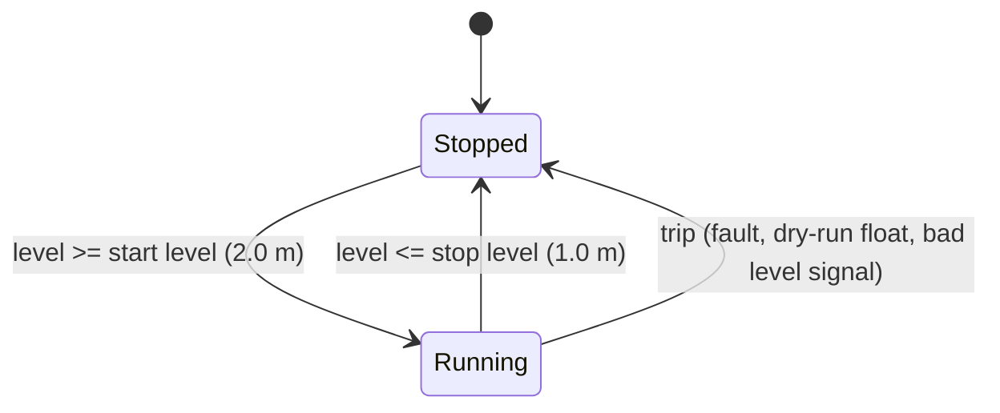

# 14 — Analog Signals and Process I/O

> **Level:** 3 — Structured programming · **Time:** ~10–12 hours · **Prerequisites:** [Module 02](../02-electrical-and-field-devices/), [Module 09](../09-math-and-data-handling/), [Module 11](../11-program-organization/)

Most signals so far have been on or off. Process plants run on measurements: level, pressure,
flow, temperature, the concentration from an analyser. They arrive at the PLC as 4–20 mA
signals from transmitters, and they leave it as 4–20 mA signals to control valves and variable
speed drives. This module follows a measurement from the transmitter on your loop drawing to
a trustworthy number in engineering units, and back out again to a valve. You will learn to
scale it, to tell a real low reading from a broken wire, to filter it without hiding what the
process is doing, to alarm on it without flooding the operator, and to use it for simple
on/off control. By the end you will have written three reusable pieces: an analog input
block, an analog alarm block and a sump pump controller that uses both ideas.

This matters because bad analog code rarely crashes. It shows a believable wrong number. A
wrong raw range, an integer division, a broken wire that reads as "tank empty", a filter that
delays a trip by ten seconds: each of these can pass a quick factory test and then cause
trouble on a running plant.

## Learning objectives

After this module you should be able to:

- Trace an analog signal from the sensor through the transmitter, the 4–20 mA loop, an IS
  barrier or burden resistor and the input card to a raw integer, and say what can go wrong
  at each stage.
- Convert between loop current, raw counts and engineering units for the common vendor raw
  ranges, and write scaling code that clamps and does not overflow.
- Use the NAMUR NE43 current levels to detect under-range, over-range and line faults, and
  choose between hold-last-value, substitute value and trip when a signal goes bad.
- Write a first-order lag filter with a time constant in seconds, a moving average and a
  spike filter, and state the lag each one adds; calculate a rate of change over a window.
- Write HH/H/L/LL alarms with a deadband and an on-delay that do not chatter.
- Design on/off level and temperature control with hysteresis, and check the pump start rate.
- Scale analog outputs for valve positioners and drive speed references, and decide what they
  do when the PLC stops.
- Apply square-root extraction and a low-flow cut-off to a DP flow signal, and totalise flow
  without losing precision.

## 1. The analog input chain

### 1.1 From the process to a number

```mermaid
flowchart LR
    P["Process<br/>level, pressure, flow"] --> S["Sensor or<br/>primary element"]
    S --> T["Transmitter<br/>4-20 mA"]
    T --> B["IS barrier or<br/>isolator (Ex areas)"]
    B --> C["Analog input card<br/>input circuit, filter, ADC"]
    C --> R["Raw integer<br/>e.g. 13824 counts"]
    R --> F["Scaling and<br/>validation block"]
    F --> E["Engineering value<br/>2.00 m, quality Good"]
    E --> U["Control, alarms,<br/>interlocks, HMI"]
```



- The **sensor** or **primary element** reacts to the process: a diaphragm that bends with
  pressure, an RTD whose resistance changes with temperature, an orifice plate that creates a
  pressure difference in a flowing pipe.
- The **transmitter** turns that into a standard signal. It has its own range, set by its
  lower and upper range values (LRV and URV, for example 0 and 4 m). Smart transmitters also
  have damping (a filter), a failure mode (Section 3) and usually HART communication
  ([Module 02](../02-electrical-and-field-devices/)).
- The **loop** carries the signal as a current. In hazardous areas it passes through an
  intrinsically-safe (IS) barrier or isolator that limits the energy that can reach the field.
- The **analog input (AI) card** converts the current into a voltage across a resistor,
  filters it, and an **ADC** (analog-to-digital converter) turns the voltage into a number.
  The card writes that number into the input process image, where your program reads it as
  a word such as `%IW0`.
- Your **program** scales the raw number to engineering units, checks it, and passes it on
  with a quality flag.

The range is defined in several places: the transmitter (LRV/URV), the card (4–20 mA) and
the PLC scaling (for example 0.0–4.0 m). They must agree. If a technician re-ranges the
transmitter to 0–6 m and nobody changes the PLC, every reading is a third too low (a true
3.0 m shows as 2.0 m) and nothing raises an alarm. The instrument data sheet or loop drawing is the single source of truth.
Check it against the code during the loop check ([Module 23](../23-commissioning-and-troubleshooting/)).

### 1.2 Why 4–20 mA

- **Current is the same everywhere in a series loop.** Cable resistance, terminals and a
  barrier all drop some voltage, but they do not change the current, so they do not change
  the reading (as long as there is enough voltage; see the loop budget below).
- **Live zero.** 0 % of range is 4 mA, not 0 mA. A dead loop (0 mA) is therefore different
  from a zero reading, so the PLC can detect a broken wire. The 4 mA also powers the
  electronics of a two-wire transmitter.
- **Noise immunity.** A current loop is a low-impedance circuit, so it picks up less
  interference than a high-impedance voltage signal on the same cable.

Other standard signals exist: 0–20 mA, 0–10 V, 1–5 V. The ones without a live zero (0–20 mA,
0–10 V) are common on drives and machines, but a broken wire then reads as 0 %.

### 1.3 Two-wire, three-wire, four-wire: who powers the loop?

| Transmitter type | Power comes from | Wires | Typical examples |
|---|---|---|---|
| 2-wire (loop-powered) | the 4–20 mA loop itself | 2 | pressure, DP, level and temperature transmitters |
| 3-wire | separate supply; common 0 V shared with the signal | 3 | some sensors on machines |
| 4-wire | its own supply, often mains | 2 power + 2 signal | magnetic flowmeters, analysers, some radar gauges |

Something in the loop must *drive* the current. A two-wire transmitter only regulates it, so
it needs a loop supply: either an **active** card input that supplies the loop voltage, or a
separate 24 V supply in the loop. A four-wire transmitter has an **active** output, so it
connects to a **passive** card input. Two active devices in one loop fight each other; two
passive devices give no current at all, which looks exactly like a broken wire. Card
configuration names show the difference, for example Siemens' "current, 2-wire transducer"
and "current, 4-wire transducer" measurement types.

### 1.4 The loop on your drawings

A typical process-plant loop: a two-wire level transmitter in the hazardous area, an IS
isolator in the marshalling cabinet, and a 250 Ω burden resistor that turns the current into
a voltage for a 1–5 V input (or, instead of the resistor, a card with a current input).

```text
      SAFE AREA (marshalling / control room)          :  HAZARDOUS AREA (field)
                                                      :
                 +--------------------------+         :       LT-101
 +24 V DC -------| IS isolator or barrier   |         :    +--------------+
                 |                          |====== (+) ---| 2-wire level |
                 | powers the field loop    |  field  :    | transmitter  |
                 | and limits its energy    |  cable  :    | 4-20 mA      |
                 |                          |====== (-) ---|              |
                 | safe-area output         |         :    +--------------+
                 +--------------------------+         :
                        |  I = 4..20 mA               :
                        |                             :
                      +---+                           :
               250 ohm|   |------------> AI channel +     V = I x 250 ohm
               burden |   |               (1-5 V range)   4 mA -> 1.0 V
                      +---+                                20 mA -> 5.0 V
                        |
 0 V -------------------+------------> AI channel -
```

With a passive (zener) barrier instead of an isolator, the loop current itself flows through
the barrier. Seen from the PLC the result is the same: 1–5 V across the burden, or 4–20 mA
into a current input. A 250 Ω resistor in the loop also gives HART communication the
minimum loop resistance it needs (typically about 230–250 Ω).

**What a line fault looks like in the PLC.** Using the raw convention of this module's labs
(0..27648 = 4..20 mA, explained in Section 1.6):

| Condition | Loop current | Across 250 Ω | Raw count (lab convention) | What the program should conclude |
|---|---|---|---|---|
| Healthy, 50 % | 12 mA | 3.0 V | 13824 | good reading, 50 % |
| Open circuit: broken wire, loose terminal, blown loop fuse, loop supply lost | 0 mA | 0 V | −6912 (a real card goes to its underflow code) | under-range: line fault |
| Transmitter detects its own failure, set to "downscale" | ≤ 3.6 mA | ≤ 0.9 V | ≤ −691 | under-range: instrument fault |
| Transmitter detects its own failure, set to "upscale" | ≥ 21 mA | ≥ 5.25 V | ≥ 29376 | over-range: instrument fault |
| Short circuit across the field cable | far above 21 mA, limited by the barrier, isolator or card | high | over-range or overflow code | over-range: line fault |
| Loop voltage too low (long cable, sagging supply) | cannot rise above some value | flattened at the top | readings stuck below the true value when high | **not detectable** by range checks: an engineering error |

The last row matters: range checks catch dead and shorted loops, but not a loop that simply
cannot reach 20 mA. That is caught by a loop budget at design time and a loop check at
commissioning.

**Worked example: loop voltage budget.** The transmitter's data sheet says it needs at least
10.5 V at its terminals. Suppose the barrier has an end-to-end resistance of 300 Ω (use the
real data sheet figure; isolators instead state the voltage available at the field
terminals). The field cable is 400 m of 1.5 mm² copper, so 800 m of conductor at about
12.1 Ω/km, which is 9.7 Ω. At 20 mA:

| Item | Voltage drop at 20 mA | at 22 mA (upscale failure signal) |
|---|---|---|
| Barrier, 300 Ω | 6.00 V | 6.60 V |
| Burden, 250 Ω | 5.00 V | 5.50 V |
| Cable, 9.7 Ω | 0.19 V | 0.21 V |
| **Total** | **11.19 V** | **12.31 V** |
| Left for the transmitter from 24.0 V | 12.81 V (OK) | 11.69 V (OK) |
| Left from a sagging 21.6 V supply | 10.41 V (**too low**) | 9.29 V (**too low**) |

With a healthy 24 V supply there is a margin. If the supply sags by 10 %, the transmitter can
no longer drive 20 mA, let alone the 22 mA it would use to signal a failure. The PLC sees a
reading that stops rising near the top of the range and a transmitter fault it can never
report. Another way to check: the maximum loop resistance is (supply voltage − minimum
transmitter voltage) ÷ maximum current = (24 − 10.5) V ÷ 0.022 A ≈ 614 Ω. This loop has
300 + 250 + 9.7 ≈ 560 Ω, so it passes at 24 V, but not at 21.6 V (limit ≈ 505 Ω).

### 1.5 Inside the analog input card

**Resolution** is the size of one ADC step. It is quoted in bits:

| ADC resolution | Steps across 4–20 mA | One step | On a 0–10 bar transmitter |
|---|---|---|---|
| 12 bits | 4096 | 3.9 µA (0.024 % of span) | 2.4 mbar |
| Siemens nominal range | 27648 | 0.58 µA (0.0036 %) | 0.36 mbar |
| 16 bits | 65536 | 0.24 µA (0.0015 %) | 0.15 mbar |

(The rows assume the whole 4–20 mA span is spread over the steps; a real card may spend some
of its range on over- and under-range.) Siemens always presents values in the same 0..27648
format; a card with fewer real bits simply moves in steps of several counts.

Resolution is not **accuracy**. A transmitter accurate to, say, ±0.1 % of span and a card
accurate to ±0.3 % limit the measurement far more than a 16-bit ADC does. Don't display
five decimal places of a signal that is only good to one.

**Update time.** Many cards have one ADC shared between channels by a multiplexer. Each
channel needs a conversion time, so the card's update time grows with the number of enabled
channels. Some cards also integrate each reading over a mains period (20 ms for 50 Hz,
about 16.7 ms for 60 Hz) to reject mains interference; this is usually a configuration
setting called interference or noise suppression. The total delay from process to program is
the sum of the transmitter damping, the card filter and update time, the PLC task interval
and any filter in your code. For a trip, that sum must fit inside the process safety time
([Module 20](../20-functional-safety/)).

**Filtering on the card.** Most cards offer a hardware or firmware filter (Siemens calls it
smoothing, with levels such as weak, medium and strong). It is convenient, but it is invisible
in the program. Record the setting in the design documents so nobody filters the same signal
three times in three places.

**Diagnostics.** Many cards detect wire break, short circuit, overflow, underflow and a
missing loop supply per channel, and report them as status bits or diagnostic events. Use
them *as well as* your range checks: the card can see things your program cannot, such as a
missing supply voltage. Cheap boards (and OpenPLC hardware) often have no diagnostics at all,
and then the range checks are all you have.

### 1.6 Raw ranges by vendor

There is no single standard for the raw number. Know your platform:

| Platform | Raw value for a 4–20 mA input | Notes |
|---|---|---|
| Siemens S7-1200/1500 (and S7-300/400) | INT: **0 = 4 mA, 27648 = 20 mA** | Over-range up to 32511 (≈ 22.8 mA), then 32767 = overflow. Under-range down to −4864 (≈ 1.19 mA), then −32768 = underflow. 27648 = 16#6C00. The same 0..27648 applies to 1–5 V and 0–10 V ranges; ±10 V is −27648..+27648. |
| Rockwell ControlLogix / CompactLogix (1756, 5069 families) | usually REAL, already in engineering units | You set the signal range and the engineering range in the module properties; the tag arrives scaled, with channel status bits (fault, under-range, over-range). |
| Rockwell Compact I/O 1769 and older families | INT, format chosen in the module configuration | Raw/proportional counts, "engineering units" (4000–20000 meaning 4.000–20.000 mA), "scaled for PID" (0–16383), or percent of range. |
| OpenPLC | 16-bit unsigned, 0–65535 | Each board's hardware layer spreads its ADC over 0–65535 (a 10-bit Arduino reading is multiplied by 64), so the real resolution can be much lower. What 0 and 65535 mean in volts or milliamps depends on the board. |
| CODESYS-based and other controllers | depends on the I/O module | Read the module manual: range, format, status bits. |

**The convention in this module's labs** follows Siemens, because the numbers are easy to
check by hand: **Raw 0..27648 = 4..20 mA**, so **1 mA = 27648 / 16 = 1728 counts**. The
simulated card is linear over the whole INT range (a real card saturates and then shows its
overflow or underflow code):

| Loop current | Raw count | % of span |
|---|---|---|
| 0 mA (open circuit) | −6912 | −25 % |
| 3.6 mA (NE43 failure limit) | −691.2 | −2.5 % |
| 3.8 mA | −345.6 | −1.25 % |
| 4 mA | 0 | 0 % |
| 8 mA | 6912 | 25 % |
| 12 mA | 13824 | 50 % |
| 16 mA | 20736 | 75 % |
| 20 mA | 27648 | 100 % |
| 20.5 mA | 28512 | 103.1 % |
| 21 mA (NE43 failure limit) | 29376 | 106.25 % |

## 2. Scaling to engineering units

### 2.1 The straight line

A linear transmitter maps its range onto the raw range in a straight line:

```text
                  (Raw - RawMin) x (EuMax - EuMin)
  Value = EuMin + --------------------------------
                          RawMax - RawMin
```

**Worked example.** PT-205 is a compound pressure transmitter ranged −1.0 to 9.0 bar. The
card reads 20000.

- Current: 4 + 20000 / 1728 = 4 + 11.574 = 15.574 mA.
- Fraction of span: 20000 / 27648 = 0.7234.
- Pressure: −1.0 + 0.7234 × (9.0 − (−1.0)) = −1.0 + 7.234 = **6.234 bar**.

Going the other way (useful for simulation and test cases): Raw = (Value − EuMin) / (EuMax −
EuMin) × 27648. For LT-101, ranged 0–4 m, 2.0 m gives 0.5 × 27648 = 13824.

A general scaling function works for any raw range and any engineering range:

```iecst
FUNCTION F_ScaleLinear : REAL
  VAR_INPUT
    X    : REAL;   (* input value, for example raw counts converted to REAL *)
    XMin : REAL;   (* input at the bottom of the range *)
    XMax : REAL;   (* input at the top of the range *)
    YMin : REAL;   (* output at the bottom of the range *)
    YMax : REAL;   (* output at the top of the range *)
  END_VAR
  IF XMax = XMin THEN
    F_ScaleLinear := YMin;          (* bad configuration: don't divide by zero *)
  ELSE
    F_ScaleLinear := YMin + (X - XMin) * (YMax - YMin) / (XMax - XMin);
  END_IF;
END_FUNCTION
```

Called as `PT205 := F_ScaleLinear(X := INT_TO_REAL(PT205_Raw), XMin := 0.0, XMax := 27648.0,
YMin := -1.0, YMax := 9.0);`, it returns 6.234 for a raw value of 20000.

### 2.2 The integer traps

Raw values are integers, and integer arithmetic has two traps
([Module 09](../09-math-and-data-handling/)):

```iecst
LevelCm := Raw / 27648 * 400;   (* WRONG: integer division first. 13824 / 27648 = 0, so 0 cm
                                   for every reading below full scale *)
LevelCm := Raw * 400 / 27648;   (* RISKY: 13824 * 400 = 5 529 600, far too big for an INT *)
```

What the second line does depends on the compiler. Some evaluate an INT expression in
16 bits and the product wraps round to nonsense. Others, including MATIEC (it generates C
code, which widens the intermediate result), work in 32 bits and give the right answer. That
is the dangerous case: the code passes on one platform and fails on another. Even when it
works, the result has whole-unit resolution: an INT level in metres could only be 0, 1, 2, 3
or 4.

Convert to REAL first, or at least to DINT:

```iecst
LevelM  := INT_TO_REAL(Raw) * 4.0 / 27648.0;                (* REAL: right everywhere *)
LevelCm := DINT_TO_INT(INT_TO_DINT(Raw) * 400 / 27648);     (* DINT: right, truncates to 1 cm *)
```

The result must also fit where you store it: `Raw * 2` stored in an INT is wrong for any raw
value above 16383 (MATIEC stores 27648 × 2 as −10240).

### 2.3 Clamping, and when to clamp

Clamping limits the scaled value to the range, for example with
`Value := LIMIT(EuMin, Value, EuMax);`. Downstream code (a PID block, a totaliser, an HMI bar
graph, a recipe comparison) then never sees −3 % or 106 %. Two rules:

1. **Check before you clamp.** Fault detection needs the unclamped current. If you clamp
   first, a broken wire becomes a perfectly believable 0 % and nobody knows.
2. **Decide what the operator sees.** Some sites show a little over- and under-range (say
   −2 to 102 %) so that a drifting transmitter is visible. Whatever you choose, write it in
   the functional specification.

### 2.4 Scaling blocks you will meet

IEC 61131-3 has no standard scaling block, so every vendor has its own: Siemens `NORM_X` and
`SCALE_X` (and the older `SCALE`/`UNSCALE` for S7-300/400), Rockwell's `SCP` instruction and
module-level scaling, CODESYS `LIN_TRAFO` in its Util library. Before you rely on one, read
its help and check what it does **outside** the range: some clamp, some extrapolate, some
set an error output. See the vendor notes.

## 3. Signal validation: is the number true?

### 3.1 NAMUR NE43

NAMUR, the user association of automation technology in the process industries, publishes
recommendation **NE43**. It standardises the current levels a transmitter uses to say "I am
measuring" or "I have failed". Most modern transmitters and many input cards support it.

```text
0         3.6   3.8   4.0                           20.0  20.5  21.0      mA
|---------|-----|-----|-----------------------------|-----|-----|---------|
 failure   gap                                             gap    failure
 signal                                                           signal
                |<------- measurement information ------->|
                      |<--- 4..20 mA = 0..100 % --->|
```

- **3.8 to 20.5 mA: measurement information.** When the process goes beyond the
  transmitter's range, the output keeps moving a little and then stops at 3.8 or 20.5 mA. A
  reading of 20.3 mA means "above the top of the range", not "broken".
- **At or below 3.6 mA, or at or above 21.0 mA: failure information.** The transmitter's
  diagnostics found a fault and drove the output to a failure level, or the loop itself is
  open or shorted.
- **The small gaps** (3.6–3.8 and 20.5–21.0 mA) belong to neither. They leave room for the
  tolerances of transmitter and card, so a saturated measurement is never mistaken for a
  failure signal. Many designs treat readings in the gaps as "uncertain".

**Upscale or downscale?** Most smart transmitters let you choose, with a jumper or a setting,
whether a detected internal failure drives the output low (≤ 3.6 mA, *downscale*) or high
(≥ 21 mA, *upscale*). For temperature transmitters this is often called the burnout
direction. Choose the direction that pushes the logic towards safety: a transmitter used for
a high-level trip should fail upscale, so that even logic that forgot to check for faults
would trip. Then detect it as a fault anyway.

NE43 cannot see every fault. A sensor stuck at a plausible value, or a transmitter with the
wrong range, still produces a valid-looking current. Those need plausibility checks:
comparing redundant transmitters, checking that the value moves when it should (stuck-signal
detection, [Module 16](../16-alarms-and-diagnostics/)), or checking the rate of change
(Section 5).

### 3.2 The confirmation delay

A signal can cross a failure limit briefly without being broken: electrical noise, a
transmitter restarting after a power dip, a changeover in the loop supply. So the fault is
usually confirmed only after the signal has stayed outside the limits for a short delay (a
few seconds is common). The delay is a compromise: long enough to ride through glitches,
short enough that a real failure is reported in time.

What should the value do *during* the delay? If you let it follow the signal, a broken wire
reads as "0 %" for a few seconds, which can start a pump, fire a low-level alarm or trip a
unit before the fault is even declared. A better design holds the last good value while the
signal is suspect. Lab 14-1 does exactly that.

### 3.3 Quality: a value is not enough

Fieldbus and OPC systems send every value with a **status** or **quality**, commonly
simplified to Good, Uncertain or Bad ([Module 17](../17-industrial-communications/)).
In a PLC you build your own: a BOOL such as `Good`, or a status word, that travels with the
value. [Module 12](../12-data-structures/) shows how to keep them together in a structure
(value, quality, fault flags). Sources of bad quality:

- the NE43 range checks,
- the card's channel diagnostics,
- communication status, for values that arrive over a network,
- plausibility checks: an impossible rate of change, a value that never moves, two
  transmitters that disagree.

### 3.4 What should the logic do when a signal goes bad?

There is no single right answer, so the choice must be made per signal in the design (in the
functional specification, or the cause-and-effect matrix for trips), not left to whoever
writes the code.

| Strategy | What happens | Suits | The danger |
|---|---|---|---|
| **Hold last good value** | the value freezes | indication, slow processes, totalisers (stop counting) | people and logic act on a stale number; the HMI must show that it is frozen |
| **Substitute value** | the value goes to a set value | forcing the safe action, for example a failed temperature reads 150 °C so the high-temperature trip acts | a substitute that looks real; a substitute in the wrong direction hides danger |
| **Trip or stop** | the equipment goes to its safe state | protective functions that are de-energise-to-trip ([Module 20](../20-functional-safety/)) | spurious trips reduce availability |
| **Switch to a backup** | use a redundant transmitter | availability | both may drift; you need a discrepancy alarm |
| **Freeze the control action** | PID goes to manual or holds its output | control loops ([Module 15](../15-pid-control/)) | the process drifts; an operator must take over |

Whatever you choose, **always** raise an instrument-fault alarm and show the bad quality on
the HMI ([Module 18](../18-hmi-and-scada/)), so that operators know the number is not live.

In a safety instrumented system a transmitter fault is normally treated as a demand (a trip)
on a single-channel function, or it changes the voting: in a 2oo3 arrangement one bad
transmitter might leave the function voting 1oo2, as the design specifies. A standard PLC
that quietly holds the last value of a signal used for protection hides the fact that the
protection has gone. This module's labs are training exercises, not safety designs.

## 4. Filtering

### 4.1 Why filter, and the price you pay

Real measurements are noisy: turbulence in a flow, waves on a tank surface, pump pulsation,
electrical pick-up. Noise makes displays jitter, alarms chatter and PID derivative action go
wild. A filter smooths it, but **every filter adds lag**: the filtered value reacts late to a
real change. In a control loop, extra lag makes the loop harder to tune. On a trip, lag adds
straight onto the response time.

You can filter in three places: the transmitter (damping), the card (smoothing) and the PLC.
Use one place deliberately and record it. You can filter a display value more heavily than
the copy used for a trip.

### 4.2 The first-order lag (exponential filter)

The most common PLC filter imitates an RC circuit. Each scan it moves the output a fixed
fraction of the way towards the input:

```text
  Y(new) = Y(old) + alpha x (X - Y(old))          alpha = Ts / (tau + Ts)
```

where `Ts` is the sample time (the task interval) and `tau` (τ) is the **time constant**. The
variant `alpha = 1 - exp(-Ts / tau)` reproduces the RC circuit's step response exactly at the
sample instants; for `tau` much larger than `Ts` the two give practically the same answer. Its name in statistics is the
exponential moving average (EMA).

After a step change at the input, the output covers a fixed share of the step every time
constant:

| Time after the step | 1 τ | 2 τ | 3 τ | 4 τ | 5 τ |
|---|---|---|---|---|---|
| Share of the step covered | 63.2 % | 86.5 % | 95.0 % | 98.2 % | 99.3 % |

**Worked example.** Lab 14-1's level filter has τ = 2 s and runs every 10 ms, so
alpha = 0.01 / (2 + 0.01) = 0.004975. The level steps from 1.0 m to 3.0 m. After 2 s (200
scans) the output is 1.0 + 0.632 × 2.0 = 2.26 m; after 6 s it is 2.90 m; after 10 s it is
2.99 m. A high-level alarm at 2.8 m (90 % of the step) is raised about 4.6 s after the step
instead of at once, because the output needs 2.3 τ to cover 90 % of a step.

```text
  3.0 m  +- - - - - - - - - - - - - - - - - - - - - - -   input after the step
         |                     ..........oooooooooooo
  2.73 m +               ...ooo'                           86 % at 2 tau
  2.26 m +         ..oo''                                  63 % at 1 tau
         |      .o'
         |    .o'                                          filter output
  1.0 m  +--o'
         +--------+--------+--------+--------+-------> t
         0       tau     2 tau    3 tau    4 tau
```

**The time constant depends on the scan time.** alpha only means "τ = 2 s" if the block
really runs every `Ts`. Run it in a cyclic (periodic) task, and give it `Ts` as an input or
constant. If the block runs in a free-running task, measure the time since the last call and
compute alpha every scan. The classic bug: alpha is hard-coded as 0.005 for a 10 ms task,
then someone moves the block to a 100 ms task and the time constant silently becomes 20 s.

```iecst
FUNCTION_BLOCK FB_FirstOrderLag
  VAR_INPUT
    X         : REAL;   (* input *)
    TimeConst : TIME;   (* time constant tau; T#0s = no filtering *)
    CycleTime : TIME;   (* how often the block is called (the task interval) *)
  END_VAR
  VAR_OUTPUT
    Y         : REAL;   (* filtered output *)
  END_VAR
  VAR
    Started   : BOOL;   (* FALSE until the first call *)
    Alpha     : REAL;   (* weight of the new sample, 0..1 *)
  END_VAR

  IF (NOT Started) OR (TimeConst <= T#0s) THEN
    Y := X;             (* first call: start at the input, no ramp up from 0 *)
    Started := TRUE;
  ELSE
    (* Alpha = Ts / (tau + Ts). A ratio of two times has no unit, so this is
       right whether TIME_TO_REAL gives seconds (MATIEC) or ms (CODESYS). *)
    Alpha := TIME_TO_REAL(CycleTime) / (TIME_TO_REAL(TimeConst) + TIME_TO_REAL(CycleTime));
    Y := Y + Alpha * (X - Y);
  END_IF;
END_FUNCTION_BLOCK
```

Three details in this block matter on a real plant:

- **Initialise on the first call.** A filter that starts at 0 ramps up after every PLC
  restart, and on the way it passes through the low and low-low alarm limits. Every power
  cut then produces a burst of false alarms, or a false trip.
- **Guard T#0s.** With the simpler weight `Ts / tau`, a time constant of T#0s divides by
  zero. The block treats T#0s explicitly as "no filtering" (`Ts / (tau + Ts)` would also give
  1, but not if `Ts` were zero too).
- **Units of TIME.** `TIME_TO_REAL` returns seconds in MATIEC/OpenPLC but milliseconds in
  CODESYS and TIA Portal. A *ratio* of two times is correct on both. When you need seconds,
  write `TIME_TO_REAL(t) / TIME_TO_REAL(T#1s)`.

**Never filter in INT.** With integer arithmetic the correction `alpha × (X − Y)` truncates
to 0 as soon as the error is small. With alpha = 0.005, any error below 200 counts gives a
correction of 0.something, which truncates to 0: the filter stops up to 199 counts (0.7 %
of span) short of the true value and stays there. Filter in REAL.

### 4.3 Moving average

A moving average outputs the mean of the last N samples. It needs a buffer (an array used as
a ring buffer, [Module 12](../12-data-structures/)):

```iecst
FUNCTION_BLOCK FB_MovingAverage
  VAR_INPUT
    X        : REAL;    (* new sample *)
    TakeNow  : BOOL;    (* TRUE on the scans when a sample should be taken *)
  END_VAR
  VAR_OUTPUT
    Y        : REAL;    (* average of the last 10 samples *)
  END_VAR
  VAR
    Buffer   : ARRAY[0..9] OF REAL;   (* ring buffer of the last 10 samples *)
    WriteIdx : INT;     (* slot for the next sample (the oldest one) *)
    Started  : BOOL;
    Sum      : REAL;
    I        : INT;
  END_VAR

  IF NOT Started THEN
    FOR I := 0 TO 9 DO
      Buffer[I] := X;   (* fill with the first reading: no ramp up from 0 *)
    END_FOR;
    Started := TRUE;
  END_IF;

  IF TakeNow THEN
    Buffer[WriteIdx] := X;          (* overwrite the oldest sample *)
    WriteIdx := (WriteIdx + 1) MOD 10;
  END_IF;

  Sum := 0.0;                       (* add all ten up again: no drift from rounding *)
  FOR I := 0 TO 9 DO
    Sum := Sum + Buffer[I];
  END_FOR;
  Y := Sum / 10.0;
END_FUNCTION_BLOCK
```

`TakeNow` sets the sample rate, for example from a timer that pulses every 100 ms (a
self-restarting `TON` adds a scan or two to each period, which does not matter for an
average). With ten samples 100 ms apart, the window is about one second.

Compared with the first-order lag: after a step the moving average ramps in a straight line
and arrives *exactly* after N samples, and for random noise it reduces the scatter by a
factor of √N (ten samples: about 3.2 times). It costs memory for the buffer and a loop each
scan. Adding the whole buffer every scan, as above, is simple and cannot drift; for long
windows, keep a running sum instead (subtract the oldest sample, add the newest) and
recalculate it now and then.

### 4.4 Spike rejection

Some signals have occasional single wild readings (a dropped bit in a serial link, an
electrical transient) rather than steady noise. A lag filter smears a spike out over several
seconds; it is better to throw the spike away.

```iecst
FUNCTION_BLOCK FB_SpikeFilter
  VAR_INPUT
    X           : REAL;   (* measurement *)
    MaxStep     : REAL;   (* largest believable change in one scan, engineering units *)
    ConfirmTime : TIME;   (* a bigger jump is accepted once it has lasted this long *)
  END_VAR
  VAR_OUTPUT
    Y           : REAL;   (* output *)
    Rejecting   : BOOL;   (* TRUE while a jump is being held back *)
  END_VAR
  VAR
    Started : BOOL;
    Confirm : TON;
  END_VAR

  IF NOT Started THEN
    Y := X;
    Started := TRUE;
  END_IF;
  Rejecting := ABS(X - Y) > MaxStep;
  Confirm(IN := Rejecting, PT := ConfirmTime);
  IF (NOT Rejecting) OR Confirm.Q THEN
    Y := X;               (* a normal change, or a jump that has lasted: accept it *)
  END_IF;
END_FUNCTION_BLOCK
```

Another classic is the **median of three**: take the middle of the last three samples (or of
three redundant transmitters). One wild value can never be the median.

```iecst
FUNCTION F_Median3 : REAL
  VAR_INPUT
    A : REAL;
    B : REAL;
    C : REAL;
  END_VAR
  F_Median3 := MAX(MIN(A, B), MIN(MAX(A, B), C));
END_FUNCTION
```

Both have the same weakness: they delay or reject a *genuine* fast change for a while. Never
put a spike filter in front of a signal whose fast changes matter, such as a pressure used
for overpressure protection.

## 5. Rate of change

The rate of change (ROC) is how fast a value moves: (PV now − PV earlier) ÷ time between.
It is useful for:

- early warning: a reactor temperature rising faster than 2 °C/min may be the start of a
  runaway, long before the high-temperature alarm;
- leak detection: a tank level falling while every outlet valve is closed;
- instrument checks: a large tank cannot go from 60 % to 0 % in one scan, so a jump like
  that is a failed transmitter, not a process event.

The difficulty is noise. Suppose a temperature reading has ±0.2 °C of noise. Two readings
taken 1 s apart can differ by 0.4 °C from noise alone, which is ±24 °C/min of false rate.
Compare with a reading 10 s old instead and the same noise gives only ±2.4 °C/min. So
calculate the rate over a **window**, not between consecutive scans:

```iecst
FUNCTION_BLOCK FB_RateOfChange
  (* Rate of change over a 10 s window, sampled once a second. *)
  VAR_INPUT
    PV         : REAL;    (* process value *)
    CycleTime  : TIME;    (* task interval *)
  END_VAR
  VAR_OUTPUT
    RatePerMin : REAL;    (* engineering units per minute *)
    Ready      : BOOL;    (* FALSE until 10 s of history exist *)
  END_VAR
  VAR
    History    : ARRAY[0..9] OF REAL;   (* one sample per second, last 10 s *)
    Oldest     : INT;     (* slot holding the sample from 10 s ago *)
    Count      : INT;     (* samples stored so far, up to 10 *)
    ScanCount  : INT;
    ScansPerSecond : INT;
  END_VAR

  (* Count scans rather than use a self-restarting TON: the TON pattern loses
     a scan or two per period, which becomes an error in the rate. *)
  ScansPerSecond := REAL_TO_INT(TIME_TO_REAL(T#1s) / TIME_TO_REAL(CycleTime));
  ScanCount := ScanCount + 1;
  IF ScanCount >= ScansPerSecond THEN
    ScanCount := 0;
    IF Count >= 10 THEN
      RatePerMin := (PV - History[Oldest]) / 10.0 * 60.0;   (* change in 10 s, per minute *)
      Ready := TRUE;
    ELSE
      Count := Count + 1;
    END_IF;
    History[Oldest] := PV;            (* the newest sample replaces the oldest *)
    Oldest := (Oldest + 1) MOD 10;
  END_IF;
END_FUNCTION_BLOCK
```

A ROC alarm is then an ordinary high alarm on `RatePerMin` (with its own deadband and delay,
Section 6), used only while `Ready` is TRUE and the PV quality is good. A wider window gives
a quieter rate but reports a real change later; choose it from the noise you measure and the
warning time you need.

## 6. Process alarms on analog values

### 6.1 HH, H, L and LL

Most analog values have up to four alarm limits: **high-high (HH)**, **high (H)**,
**low (L)** and **low-low (LL)**. H and L usually warn the operator that something needs
attention; HH and LL are more urgent and often go with an automatic action. Keep a clear line
between an *alarm* (information for the operator) and a *trip* (an automatic protective
action). An important trip should come from its own transmitter through its own logic, often
in a separate safety system ([Module 20](../20-functional-safety/)), not from the HH alarm of
a control transmitter. Alarm priorities, acknowledgement and alarm-management standards
(ISA-18.2 / IEC 62682, EEMUA 191) are in [Module 16](../16-alarms-and-diagnostics/).

### 6.2 Chattering, deadband and on-delay

A PV that hovers around a limit crosses it again and again. Without countermeasures the
alarm comes and goes every few seconds: **chattering**. Operators learn to ignore it, which
is how real alarms get missed. There are two cures:

- **Deadband (hysteresis):** the alarm is raised at the limit but only cleared when the PV
  has gone back past the limit by the deadband. For a high alarm at 80 % with a 2 % deadband,
  it clears below 78 %. For a *low* alarm the deadband is *above* the limit: L at 20 % clears
  above 22 %.
- **On-delay:** the PV must stay beyond the limit continuously for a time before the alarm is
  raised. A brief excursion then raises nothing.

A level that hovers around an H limit of 80 % for 20 seconds (`#` = TRUE, one character =
0.5 s):

```text
t (s)                    0   2   4   6   8   10  12  14  16  18  20
PV at or above 80 %      ____##__##__################__##________
PV below 78 %            __________________________________######
H, no deadband/delay     ____##__##__################__##________
H, 2 % deadband, 3 s     __________________################______
```

Without deadband or delay the operator sees four alarms. With them there is one: the 3 s
on-delay ignores the short excursions at 2 s and 4 s, the alarm is raised at 9 s (3 s after
the PV rose above 80 % at 6 s), it survives the dips to 79 % at 14 s and 16 s because 79 %
is inside the deadband, and it clears at 17 s when the PV drops below 78 %.

An **off-delay** is the mirror image: the alarm clears only after the PV has been back in
the normal band for a time. It is useful for a PV that bounces on the limit, but it keeps an
alarm on after the problem has gone, so use it sparingly.

Delays add to the response time. A 10 s on-delay on a high-level alarm means the operator
hears about it 10 s later; make sure that time is available. Alarm-management guides give
starting values for deadbands and delays by signal type; tune them from the noise you see on
the real plant (a trend of the raw signal is the best evidence).

### 6.3 Alarms and bad quality

Decide what the alarms do when the PV quality is bad, and make it consistent with the input
block. In Lab 14-1 the level input holds its last value on a fault, so the level alarms
freeze, and the instrument-fault alarm tells the operator why. The temperature input
substitutes 150 °C, so its high-temperature alarm and trip act deliberately. Both are valid
designs; the mistake is not choosing.

## 7. On/off control with hysteresis

### 7.1 Pump-down and pump-up

Many analog loops don't need PID. A sump pump, a tank fill pump, a heater or a compressor can
simply switch on at one value and off at another. The gap between the two is the
**hysteresis** or **differential**, and it is what stops the equipment from switching on and
off every scan.

| Duty | Starts when | Stops when | Example |
|---|---|---|---|
| **Pump-down** (emptying) | level ≥ high setpoint | level ≤ low setpoint | sump, drainage pit, wet well |
| **Pump-up** (filling) | level ≤ low setpoint | level ≥ high setpoint | header tank, water tower |
| **Heating** | temperature ≤ setpoint − ½ differential | temperature ≥ setpoint + ½ differential | tank heater, trace heating |
| **Cooling** | temperature ≥ setpoint + ½ differential | temperature ≤ setpoint − ½ differential | fan, chiller stage |

Between the two setpoints the controller keeps its last state. That is memory, so in ST it is
an `IF ... ELSIF` without an `ELSE`:



A sump pump-down cycle, start at 2.0 m and stop at 1.0 m:

```text
2.0 m start |------*--------------*--------------*--------------*
            |    *  *           *  *           *  *           *
            |  *     *        *     *        *     *        *
            |*        *     *        *     *        *     *
            |          *  *           *  *           *  *
1.0 m stop  |-----------*--------------*--------------*----------
            +----------------------------------------------------> t
PumpRun      ______#####__________#####__________#####__________#
```

The level rises while the pump is off, the pump starts at 2.0 m, pumps down to 1.0 m, stops,
and the cycle repeats. Nothing happens in between.

### 7.2 How wide should the band be?

A narrow band keeps the level tighter but starts the pump more often. Motors and pumps have
a maximum number of starts per hour (from the manufacturer; larger motors allow fewer), and
every start wears contactors and couplings.

For a pump-down sump the worst case is well known. With a volume V between the start and stop
levels, a pump capacity Qp and an inflow Qin, one cycle takes V/Qin to fill plus
V/(Qp − Qin) to empty. The cycle is shortest when the inflow is exactly half the pump
capacity, and then it lasts **4V / Qp**.

**Worked example.** A sump has a plan area of 2.0 m², start and stop levels 1.0 m apart, so
V = 2.0 m³. The pump delivers 36 m³/h. The shortest cycle is 4 × 2.0 / 36 = 0.222 h =
13.3 min, so at most **4.5 starts per hour**. Halve the band to 0.5 m and it becomes 9 starts
per hour. Compare this with the motor's limit before you choose the setpoints. If the band
cannot be wide enough, add a minimum run time or a minimum off time with timers
([Module 07](../07-timers/)), or alternate two pumps ([Module 06](../06-edges-and-one-shots/)).

### 7.3 Worked example: a tank heater

A tank is kept at 60 °C by an electric heater with a 4 °C differential: heat on at 58 °C,
off at 62 °C. The heater's safe state is **off**, which shapes the whole design: the heater
needs a good temperature signal *right now*, without waiting for the fault delay, while the
instrument-fault lamp waits for the delay so that a glitch doesn't bring out a technician.

```iecst
PROGRAM TankHeater
  VAR (* I/O *)
    TT401_Raw  AT %IW0   : INT;   (* TT-401 tank temperature: 4..20 mA = 0..100 degC *)
    AutoSel    AT %IX0.0 : BOOL;  (* selector switch in AUTO *)
    HeaterK    AT %QX0.0 : BOOL;  (* heater contactor *)
    TT401Fault AT %QX0.1 : BOOL;  (* transmitter fault lamp *)
  END_VAR
  VAR
    Current_mA : REAL;
    SignalOK   : BOOL;            (* inside the NE43 limits right now *)
    TempC      : REAL;
    HeatDemand : BOOL;            (* the thermostat wants heat *)
    FaultDelay : TON;
  END_VAR
  VAR CONSTANT
    SETPOINT     : REAL := 60.0;  (* degC *)
    DIFFERENTIAL : REAL := 4.0;   (* degC: heat on at 58, off at 62 *)
    HIGH_CUTOUT  : REAL := 75.0;  (* degC: software high-temperature cut-out *)
  END_VAR

  (* 1. Validate and scale *)
  Current_mA := 4.0 + INT_TO_REAL(TT401_Raw) / 1728.0;
  SignalOK := (Current_mA > 3.6) AND (Current_mA < 21.0);
  FaultDelay(IN := NOT SignalOK, PT := T#2s);
  TT401Fault := FaultDelay.Q;                      (* alarm only once confirmed *)
  TempC := LIMIT(0.0, (Current_mA - 4.0) * 100.0 / 16.0, 100.0);

  (* 2. On/off control with hysteresis: in the band, keep the last state *)
  IF TempC <= SETPOINT - DIFFERENTIAL / 2.0 THEN
    HeatDemand := TRUE;
  ELSIF TempC >= SETPOINT + DIFFERENTIAL / 2.0 THEN
    HeatDemand := FALSE;
  END_IF;

  (* 3. The safe state of a heater is OFF, so the heater needs a good
        signal RIGHT NOW (no waiting for the fault delay) and a
        temperature below the cut-out. *)
  HeaterK := AutoSel AND HeatDemand AND SignalOK AND (TempC < HIGH_CUTOUT);
END_PROGRAM
```

Scan by scan: at 35 °C `HeatDemand` is TRUE and the heater runs. At 61.5 °C it is still
TRUE (inside the band, state kept). At 62.2 °C it goes FALSE. On the way down it stays FALSE
at 59 °C and comes back on at 57.5 °C. If the wire breaks, `SignalOK` goes FALSE on the next
scan and the heater stops at once; two seconds later the fault lamp lights.

The software cut-out is a second line of defence only. A real heater needs an independent,
hard-wired over-temperature cut-out that works even if the PLC, its program or the
transmitter fails.

### 7.4 Ready-made blocks

MATIEC and OpenPLC include a `HYSTERESIS` block (so does the CODESYS Util library):
`Q` goes TRUE when `XIN1 > XIN2 + EPS` and FALSE when `XIN1 < XIN2 − EPS`. For the sump,
`PumpCtl(XIN1 := Level, XIN2 := 1.5, EPS := 0.5);` gives a `Q` that switches on above 2.0 m
and off below 1.0 m. For a fill pump, use `NOT PumpCtl.Q`. Writing the `IF ... ELSIF` yourself
is just as good and makes the start and stop levels easier to read.

## 8. Analog outputs

### 8.1 From engineering units to milliamps

An analog output (AO) runs the chain backwards: the program writes a raw value, the card's
DAC (digital-to-analog converter) turns it into a current, and the field device follows it.
Typical AOs drive **valve positioners** (0–100 % opening) and **variable speed drive (VSD or
VFD) speed references** (for example 0–50 Hz).

```iecst
FUNCTION F_EuToRaw : INT
  VAR_INPUT
    Value : REAL;   (* engineering value, for example valve opening in % *)
    EuMin : REAL;   (* engineering value that gives 4 mA *)
    EuMax : REAL;   (* engineering value that gives 20 mA *)
  END_VAR
  VAR
    Fraction : REAL;
  END_VAR
  IF EuMax = EuMin THEN
    Fraction := 0.0;
  ELSE
    Fraction := (Value - EuMin) / (EuMax - EuMin);
  END_IF;
  Fraction := LIMIT(0.0, Fraction, 1.0);     (* never drive the card out of its range *)
  F_EuToRaw := REAL_TO_INT(Fraction * 27648.0);
END_FUNCTION
```

**Worked examples.** A valve demand of 37.5 % gives 0.375 × 27648 = 10368 counts, which is
4 + 0.375 × 16 = 10.0 mA. A drive reference of 35 Hz on a 0–50 Hz range gives 0.7 × 27648 =
19353.6, written as 19354, which is 15.2 mA. Clamp the output: a PID block that asks for
−5 % must not send a negative number to the card.

### 8.2 Fail positions: 0 mA is not 4 mA

A 4 mA signal and a 0 mA signal mean very different things to a field device:

- **At 4 mA** a loop-powered positioner is alive and holds the valve at 0 % (usually closed).
- **At 0 mA** (cable cut, AO card failed, output switched off) the positioner has no power.
  On the usual spring-return actuator it vents the air and the **spring** takes the valve to
  its **fail position**: fail closed for an air-to-open valve, fail open for an air-to-close
  valve. The fail position is chosen by the process design and shown on the P&ID (often as
  FC / FO).
- A drive that loses its 4–20 mA reference can usually be configured to stop, hold the last
  speed or run at a preset speed. Choose deliberately, and make the PLC notice
  ([Module 19](../19-motion-and-drives/)).

Whether 0 % output means "closed" or means "fail position" is a site convention (the
positioner can usually be set up either way). The loop drawing must show it, and the
program's scaling must match.

### 8.3 What the outputs do when the PLC stops

When the CPU goes to STOP, or loses its connection to remote I/O, the AO card has to output
something. Cards typically offer: switch off (0 mA, so the device goes to its fail position),
keep the last value, or output a configured substitute value. The right choice depends on the
process: a cooling-water valve might need to open, a fuel valve to close. This is a design
decision; record it with the I/O list and check it during commissioning.

### 8.4 Read back

An output only says what you asked for. Where it matters, compare it with a feedback: a
valve position transmitter, a drive's actual speed, or a flow that should follow. A demand
of 80 % with a position of 5 % for more than a few seconds is a stuck valve, an air failure
or a wiring fault. This is the analog version of the run-feedback check in Lab 14-3.

## 9. Square-root extraction for DP flow

### 9.1 Why flow needs a square root

An orifice plate, venturi or averaging pitot tube creates a pressure difference (DP) that
grows with the **square** of the flow: Q = k × √ΔP. A DP transmitter with a linear output
therefore gives a signal proportional to ΔP, not to flow:

| DP (% of span) | 0.25 | 1 | 4 | 9 | 25 | 49 | 64 | 81 | 100 |
|---|---|---|---|---|---|---|---|---|---|
| Flow (% of span) = 10 × √DP% | 5 | 10 | 20 | 30 | 50 | 70 | 80 | 90 | 100 |

At half flow the DP is only a quarter of its span. The square root is taken either in the
transmitter (its output mode is set to "square root") or in the PLC. **Never both**, and
never neither. Check the transmitter configuration against the PLC code during the loop
check: with a double square root, 50 % flow shows as 70.7 %; with none, it shows as 25 %.

### 9.2 Low-flow cut-off

The square root is very steep near zero. If the DP signal has ±0.2 % of span of noise at zero
flow, the flow reading jumps around by up to 10 × √0.2 ≈ 4.5 % of flow. The totaliser counts
that phantom flow all night. A **low-flow cut-off** forces the flow to zero below a set value
(for example 6 % of flow, which corresponds to 0.36 % DP). Some transmitters instead switch
to a linear characteristic below a breakpoint.

### 9.3 Totalising

A totaliser integrates flow over time: each scan it adds flow × scan time
([Module 09](../09-math-and-data-handling/) covers totalisers in depth). With a REAL total
there is a nasty surprise. A REAL has only about seven significant digits, so once the total
is large, a small increment cannot be added correctly. At 120 m³/h and a 10 ms task each scan
adds 0.000333 m³. Simulating a REAL totaliser:

| Total so far | What 1000 increments of 0.000333 m³ actually add | Error |
|---|---|---|
| 1 000 m³ | 0.305 m³ instead of 0.333 m³ | about 8 % low |
| 3 000 m³ | 0.244 m³ | about 27 % low |
| 5 000 m³ | 0.488 m³ | about 46 % **high** |
| 9 000 m³ | 0.000 m³ | stops counting |

Above 8192 m³ the increment is smaller than half the gap between neighbouring REAL values, so
every addition rounds back to the old total. Fixes: keep the small increments in a REAL that
never grows big and move whole units into a DINT (as below), use LREAL, or totalise in a
slower task with bigger increments.

### 9.4 Putting it together

```iecst
FUNCTION_BLOCK FB_DPFlow
  VAR_INPUT
    DP_Pct     : REAL;   (* differential pressure, % of the DP transmitter span (linear) *)
    FlowMax    : REAL;   (* flow at 100 % DP, for example m3/h *)
    CutOff_Pct : REAL;   (* flow below this % of FlowMax is shown as zero *)
    CycleTime  : TIME;   (* task interval, for the totaliser *)
    ResetTotal : BOOL;   (* TRUE clears the totaliser *)
  END_VAR
  VAR_OUTPUT
    Flow       : REAL;   (* engineering units, for example m3/h *)
    Total      : DINT;   (* whole units, for example m3 *)
    Fraction   : REAL;   (* part of the next whole unit, 0..1 *)
  END_VAR
  VAR
    FlowPct    : REAL;
    Dt_h       : REAL;   (* cycle time in hours *)
  END_VAR

  (* Square root: flow % = 10 x sqrt(DP %), so 25 % DP gives 50 % flow.
     MAX(...) keeps a slightly negative DP reading out of SQRT. *)
  FlowPct := 10.0 * SQRT(MAX(DP_Pct, 0.0));
  IF FlowPct < CutOff_Pct THEN
    FlowPct := 0.0;      (* low-flow cut-off *)
  END_IF;
  Flow := FlowPct / 100.0 * FlowMax;

  (* Totaliser: add Flow x dt each scan into a small REAL that never grows
     big, and move whole units into a DINT. *)
  IF ResetTotal THEN
    Total := 0;
    Fraction := 0.0;
  ELSE
    Dt_h := TIME_TO_REAL(CycleTime) / TIME_TO_REAL(T#1h);
    Fraction := Fraction + Flow * Dt_h;
    WHILE Fraction >= 1.0 DO
      Total := Total + 1;
      Fraction := Fraction - 1.0;
    END_WHILE;
  END_IF;
END_FUNCTION_BLOCK
```

With `FlowMax := 120.0` and `CutOff_Pct := 6.0`: 25 % DP gives 60 m³/h; 0.3 % DP gives
5.5 % flow, below the cut-off, so 0; 0.4 % DP gives 6.3 % flow, 7.6 m³/h. At full flow for
60 s the total rises by 2 m³. In practice you would also stop totalising when the DP signal's
quality is bad, and keep the total in retentive memory so that a restart does not lose it.

## Worked examples

### Worked example 1: commissioning LT-101, from loop check to fault test

LT-101 is a 2-wire level transmitter, 0–4.0 m, wired through an IS isolator into a current
input. In the PLC it goes through the analog input block of Lab 14-1 (filter 2 s, fault delay
1 s, hold on fault). At the loop check a technician disconnects the transmitter and drives
the loop with a calibrator. You watch the PLC:

| Injected | Expected raw | `Current_mA` | `Value` | `Good` | `Fault` |
|---|---|---|---|---|---|
| 4.0 mA | 0 | 4.00 | 0.00 m | TRUE | FALSE |
| 8.0 mA | 6912 | 8.00 | 1.00 m (after the filter settles) | TRUE | FALSE |
| 12.0 mA | 13824 | 12.00 | 2.00 m | TRUE | FALSE |
| 16.0 mA | 20736 | 16.00 | 3.00 m | TRUE | FALSE |
| 20.0 mA | 27648 | 20.00 | 4.00 m | TRUE | FALSE |
| 20.3 mA | about 28166 | 20.30 | 4.00 m (clamped) | TRUE | FALSE |
| 3.5 mA | about −864 | 3.50 | held at the last good value | FALSE at once | TRUE after 1 s |
| 22.0 mA | 31104 | 22.00 | held at the last good value | FALSE at once | TRUE after 1 s |

Then the transmitter is reconnected and the technician opens the loop at the junction box.
Scan by scan: on the first scan `Current_mA` reads 0.0 and `Good` goes FALSE, but `Value`
stays at the last good level, so the level control and alarms don't react to a false
"empty". After 1 s `UnderRange` and `Fault` go TRUE and the instrument-fault alarm appears.
When the loop is closed again, `Fault` clears on the first good scan and `Value` restarts
from the live reading instead of ramping up from the held value.

Record each row on the loop check sheet. If the PLC shows 84 % at 20 mA, somebody scaled
with 32767 instead of 27648 (27648 / 32767 = 0.844).

### Worked example 2: the same signal, three bad-quality policies

TT-102 measures a reactor temperature that feeds three things. It fails (wire break):

| Consumer | Policy | Why |
|---|---|---|
| HMI trend and indication | hold last value, shown with a "bad quality" marker | the operator needs to see the last known state, marked as stale |
| High-temperature interlock in the PLC (not a SIF) | substitute 150 °C, which is above the trip point | a failed transmitter must not be able to hide an overheat, so the plant goes to its safe state |
| Cooling-water PID loop | switch the controller to manual, hold its output | a PID acting on a frozen or substituted value would drive the valve to an end stop |

One input block cannot serve all three with a single `Value`. Either give the block both a
held value and the quality flag and let each consumer decide, or use separate instances.
Lab 14-1 builds the first kind: `Value` plus `Good` and `Fault`.

### Worked example 3: DP flow checks

FT-110 is an orifice meter, 0–250 mbar DP = 0–120 m³/h. The DP transmitter is linear. With
62.5 mbar (25 % of the DP span):

- correct: flow = 120 × √0.25 = **60 m³/h**;
- if the PLC shows 30 m³/h, the square root is missing (25 % of 120);
- if it shows 84.9 m³/h, the square root is taken twice (the transmitter was also set to
  square-root mode, so the PLC sees 50 % and takes √0.5 = 70.7 % of 120).

## Common mistakes and how to avoid them

| Mistake | What you see | How to avoid it |
|---|---|---|
| Wrong raw range (32767 instead of 27648 on Siemens) | full scale reads 84.4 % | take the range from the card manual; check at 20 mA during the loop check |
| Integer division or INT overflow in scaling | readings of 0, stepped values, or garbage on another platform | convert to REAL first |
| Transmitter re-ranged, PLC not changed | plausible but wrong values | one data sheet as the source of truth; loop check against it |
| Clamping before fault detection | a broken wire reads as a normal 0 % | detect on the unclamped current, then clamp |
| No NE43 checks | "tank empty" when a wire breaks; pumps dry-run or tanks overflow | check ≤ 3.6 mA / ≥ 21 mA with a confirmation delay |
| Value follows the signal during the fault delay | false low-level trips for the first seconds of a wire break | hold the last good value while the signal is suspect |
| Substitute value in the unsafe direction | a failed transmitter hides the very condition it protects against | choose the substitute from the hazard, and document it |
| Filter not initialised | a ramp from 0 and a burst of low alarms after every restart | load the filter with the first good reading |
| Filter weight hard-coded for one scan time | τ changes when the task interval changes | compute alpha from the task interval |
| Filtering in INT | the filter stops short of the true value | filter in REAL |
| Heavy filtering on a trip signal | the trip acts seconds late | minimal filtering on protective signals; include every filter in the response time |
| Alarms without deadband or delay | chattering alarms, ignored by operators | deadband and on-delay; low-alarm deadband goes *above* the limit |
| Hysteresis band too narrow | pump starts every minute | calculate the start rate; add minimum run/off times |
| Double or missing square root | flow wrong by a large, fixed pattern | check the transmitter mode against the PLC code |
| No low-flow cut-off | the totaliser counts at zero flow | cut-off in the flow calculation |
| REAL totaliser | the total drifts, then stops | whole units in a DINT, or LREAL |
| AO not clamped, or no stop behaviour chosen | card faults; valves in the wrong position when the PLC stops | clamp to 0..100 %; configure the AO stop behaviour deliberately |
| OpenPLC analog input declared as INT | readings above half scale appear negative | declare `%IW` inputs as UINT or WORD there |
| A variable named `Limit`, `Min`, `Max`, `Sel` or `Ramp` | MATIEC compile errors that seem to make no sense | avoid the names of standard functions and blocks |

## Vendor notes

**Siemens (TIA Portal, S7-1200/1500).** Analog inputs arrive as INT in the process image
(`%IW` addresses, or tags on them) using the ranges in Section 1.6. `NORM_X` turns a raw
value into 0.0–1.0 and `SCALE_X` turns 0.0–1.0 into engineering units; for an output, use
`NORM_X` on the engineering value and `SCALE_X` to 0..27648. S7-300/400 projects use the
older `SCALE` (FC105) and `UNSCALE` (FC106) blocks. Each channel is configured in the
hardware configuration: measurement type (voltage, current 2-wire or 4-wire transducer, RTD,
thermocouple), range, smoothing, interference frequency suppression and diagnostics (wire
break, overflow, underflow, missing supply voltage). Enabled diagnostics produce diagnostic
interrupts and module status; many modules can also add a "value status" bit per channel to
the process image. Analog output channels have a configurable reaction to CPU STOP (switch
off, keep last value, or output a substitute value). There is no standard analog alarm block
in basic STEP 7; plants use their own library blocks, and Siemens' process libraries (such as
the PCS 7 Advanced Process Library) include ready-made analog monitoring blocks.

**Rockwell (Studio 5000 Logix Designer, CCW).** ControlLogix and CompactLogix analog modules
are usually scaled in the module properties (signal range to engineering range), with digital
filters set there too; the input tag then carries a REAL in engineering units plus channel
status bits such as fault, under-range and over-range (tag names vary by module family). Some
Logix analog modules can also raise HH/H/L/LL process alarms with a deadband, and rate
alarms, on the module itself. Compact I/O 1769 modules offer the INT formats in Section 1.6.
For scaling in logic there is `SCP` (scale with parameters) in ladder; the function block and
ST process instructions include `SCL` (scale), `LPF` (low-pass filter), `TOT` (totaliser) and
`ALMA` (analog alarm, with HH/H/L/LL limits, deadband and rate-of-change detection).
Micro800 controllers (CCW) use plug-in or expansion modules; check each module's raw range.

**CODESYS.** The raw format depends entirely on the I/O module or fieldbus device; read its
manual. The Util library has `LIN_TRAFO` (linear scaling), `HYSTERESIS` and `LIMITALARM`, and
the free OSCAT BASIC library adds many filter and scaling blocks. `TIME_TO_REAL` returns
milliseconds, so the ratio trick in Section 4.2 keeps filter code portable. With edition 3
object orientation you could build the analog input as a class with methods; see
[Module 21](../21-architecture-and-standards/).

**OpenPLC.** Analog inputs and outputs are 16-bit words, 0–65535, whatever the board's ADC
resolution. Declare them as UINT or WORD; if you declare INT, readings above 32767 appear
negative. Example: a board that maps 0–10 V to 0–65535, with a 250 Ω burden, reads about 6554
at 4 mA (1 V) and about 32768 at 20 mA (5 V), so only half the range is used. There are no
card diagnostics, so software range checks are your only line-fault detection. The MATIEC
library adds `HYSTERESIS`, `RAMP`, `INTEGRAL`, `DERIVATIVE` and `PID` blocks; all but
`HYSTERESIS` take a `CYCLE` input for the sample time. In the MATIEC build used by `plctest`, `TIME_TO_REAL`
returns seconds, and `+`/`-` between two TIME values compile but then fail in the C build;
`ADD_TIME` and `SUB_TIME` work.

## Labs

All three labs use the raw convention of Section 1.6: **0..27648 = 4..20 mA, 1728 counts per
mA**, linear beyond the range. Each `.test` file lists the raw values it uses at the top.

### Lab 14-1: Analog input block (FB_AnalogInput)

**Goal:** write the analog input block that every measurement in a plant library goes
through: scaling, clamping, NE43 fault detection with a delay, filtering, a quality flag, and
a choice between holding and substituting on a fault.

The starter contains the complete program with two instances; you write the body of the
function block. The two instances are set up differently, so nothing may be hard-coded:

| Instance | Raw input | Range (4 mA .. 20 mA) | `FilterTime` | `FaultDelay` | On a fault |
|---|---|---|---|---|---|
| `LT101` (tank level) | `LT101_Raw`, `%IW0` | 0.0 .. 4.0 m | T#2s | T#1s | hold last good value (`UseSubst` FALSE) |
| `TT102` (reactor temperature) | `TT102_Raw`, `%IW1` | −50.0 .. 150.0 °C | T#0s (none) | T#2s | substitute 150.0 °C (`UseSubst` TRUE) |

**Interface** (use these names exactly):

| Tag | Address | Type | Description |
|---|---|---|---|
| `LT101_Raw` | `%IW0` | INT | LT-101 raw count |
| `TT102_Raw` | `%IW1` | INT | TT-102 raw count |
| `LT101`, `TT102` | — | `FB_AnalogInput` | the two instances (declared and called in the starter) |
| `.Raw` | input | INT | raw count |
| `.EuMin`, `.EuMax` | inputs | REAL | engineering value at 4 mA and at 20 mA |
| `.FilterTime` | input | TIME | first-order filter time constant; T#0s = no filter |
| `.FaultDelay` | input | TIME | confirmation delay for NE43 faults |
| `.UseSubst`, `.SubstValue` | inputs | BOOL, REAL | on a fault: output `SubstValue` (TRUE) or hold (FALSE) |
| `.CycleTime` | input | TIME | task interval (T#10ms) |
| `.Current_mA` | output | REAL | loop current: not filtered, not clamped |
| `.Value` | output | REAL | engineering value |
| `.Good` | output | BOOL | TRUE while the current is inside the NE43 limits |
| `.UnderRange`, `.OverRange` | outputs | BOOL | confirmed NE43 failure, low or high |
| `.Fault` | output | BOOL | `UnderRange OR OverRange` |

**Requirements:**

1. `Current_mA = 4 + Raw / 1728`, every scan, unfiltered and unclamped.
2. `Good` is TRUE while 3.6 mA < `Current_mA` < 21.0 mA, and FALSE otherwise, with no delay.
3. `UnderRange` goes TRUE when `Current_mA` ≤ 3.6 mA continuously for `FaultDelay`;
   `OverRange` when it is ≥ 21.0 mA continuously for `FaultDelay`. If the current comes back
   inside the limits, even briefly, the delay starts again. Each flag clears on the first scan
   the current is back inside its limit. `Fault = UnderRange OR OverRange`.
4. `Value` is the linear scaling of 4..20 mA to `EuMin`..`EuMax`, clamped to that range. A
   reading between 3.6 and 4 mA shows `EuMin`, one between 20 and 21 mA shows `EuMax`; neither
   is a fault.
5. `Value` is filtered by a first-order lag with time constant `FilterTime`, using
   `CycleTime` as the sample time. After a step it covers about 63 % of the step in one time
   constant. `FilterTime = T#0s` means no filtering (and no division by zero).
6. The filter starts from the first good reading: on the very first scan after power-up
   `Value` already equals the scaled reading.
7. While `Good` is FALSE, `Value` holds the last good value and does not follow the bad
   signal. Once `Fault` is TRUE: if `UseSubst` is TRUE, `Value = SubstValue`; otherwise `Value`
   keeps holding.
8. When the fault clears, the filter restarts from the live reading, so `Value` jumps to the
   new measurement instead of ramping from the held or substituted value.

**Run the test:**

```bash
python3 tools/plctest.py 14-analog-and-process-io/labs/starter/14-1-analog-input.st   # watch it fail
mkdir -p my-work && cp 14-analog-and-process-io/labs/starter/14-1-analog-input.st my-work/
python3 tools/plctest.py my-work/14-1-analog-input.st 14-analog-and-process-io/labs/14-1-analog-input.test
```

<details>
<summary>Hint (open only if stuck)</summary>

Work in the order the requirements are listed. Two `TON`s, one per failure band, give the
delays (`IN := Current_mA <= 3.6` and `IN := Current_mA >= 21.0`). For the filter keep a REAL
state variable and a BOOL "filter ready": when `Good` and not ready, load the state with the
scaled value and set ready; when `Good` and ready, apply
`State := State + Alpha * (Scaled - State)`; when `Good` is FALSE, don't touch the state (that
*is* the hold). Clear "ready" whenever `Fault` is TRUE. Finally `Value` is `SubstValue` if
`Fault AND UseSubst`, otherwise the state. For alpha, see Section 4.2.
</details>

### Lab 14-2: Analog alarm block (FB_AnalogAlarm)

**Goal:** write an HH/H/L/LL alarm block with a deadband and an on-delay that does not chatter.

The starter contains the complete program; you write the function block. The test writes the
process values `Level` and `Pressure` directly (in a real program they would come from
`FB_AnalogInput`).

| Instance | PV | HH | H | L | LL | `Deadband` | `OnDelay` |
|---|---|---|---|---|---|---|---|
| `LevelAlm` | `Level` (%) | 90.0 | 80.0 | 20.0 | 10.0 | 2.0 | T#3s |
| `PressAlm` | `Pressure` (bar) | 8.0 | 7.0 | 2.0 | 1.0 | 0.2 | T#0s |

**Interface** (use these names exactly):

| Tag | Address | Type | Description |
|---|---|---|---|
| `Level` | — | REAL | LT-201 tank level, % |
| `Pressure` | — | REAL | PT-202 header pressure, bar |
| `LevelAlm`, `PressAlm` | — | `FB_AnalogAlarm` | the two instances (declared and called in the starter) |
| `.PV` | input | REAL | process value |
| `.HH_Limit`, `.H_Limit`, `.L_Limit`, `.LL_Limit` | inputs | REAL | alarm limits |
| `.Deadband` | input | REAL | deadband, engineering units, for all four limits |
| `.OnDelay` | input | TIME | on-delay for all four limits |
| `.HH`, `.H`, `.L`, `.LL` | outputs | BOOL | alarm outputs |

**Requirements:**

1. A high alarm (HH, H) is raised when the PV is at or above its limit continuously for
   `OnDelay`. A low alarm (L, LL) is raised when the PV is at or below its limit continuously
   for `OnDelay`.
2. If the PV goes back inside the limit before the delay has run, even by a little, the delay
   starts again from zero.
3. A high alarm clears as soon as the PV is below *limit − Deadband*; a low alarm clears as
   soon as the PV is above *limit + Deadband*. There is no delay on clearing. Between the
   limit and the deadband the alarm keeps its state.
4. Every limit has its own timer. H and HH (and L and LL) can be active at the same time: at a
   very high PV both H and HH are on.
5. With `OnDelay = T#0s` the alarm is raised at once (within a scan or two).

**Run the test:**

```bash
python3 tools/plctest.py 14-analog-and-process-io/labs/starter/14-2-analog-alarm.st   # watch it fail
mkdir -p my-work && cp 14-analog-and-process-io/labs/starter/14-2-analog-alarm.st my-work/
python3 tools/plctest.py my-work/14-2-analog-alarm.st 14-analog-and-process-io/labs/14-2-analog-alarm.test
```

<details>
<summary>Hint (open only if stuck)</summary>

Solve one high limit first:

```text
Timer runs while PV >= limit        (TON, IN := PV >= H_Limit, PT := OnDelay)
IF timer done               THEN alarm := TRUE
ELSIF PV < limit - deadband THEN alarm := FALSE
(otherwise: no change)
```

A low limit is the mirror image. Then either copy the pattern four times with four `TON`s, or
write a small `FB_LimitAlarm` for one limit (with a BOOL input that says "high" or "low") and
use four instances. Remember that `Limit` is not a legal variable name here: `LIMIT` is a
standard function.
</details>

### Lab 14-3: Sump pump level control

**Goal:** put the pieces together in a small but complete control application: pump-down
control with hysteresis, a high-level alarm, independent dry-run protection, pump fault
handling with a proper reset, and sensible behaviour when the level transmitter fails.

A drainage sump collects rain and process water. Submersible pump P-301 empties it. Level
transmitter LT-301 (0–4.0 m, so 1 m = 6912 counts) controls the pump. An independent low-low
float switch LSLL-302 protects the pump against running dry, even if the transmitter reads
wrong. The pump contactor has an auxiliary contact for run feedback and a thermal overload
relay. **Training exercise only:** dry-run protection in a standard PLC is ordinary control
logic, not a designed safety function.

**Interface** (use these names exactly):

| Tag | Address | Type | Description |
|---|---|---|---|
| `LT301_Raw` | `%IW0` | INT | LT-301 sump level: 0..27648 = 4..20 mA = 0.0..4.0 m |
| `LSLL302_NC` | `%IX0.0` | BOOL | Low-low float, **NC**: TRUE while water is above the float; FALSE at low-low level or if the wire breaks |
| `PumpRunFb` | `%IX0.1` | BOOL | Pump contactor auxiliary contact: TRUE when the contactor has pulled in |
| `PumpOL_NC` | `%IX0.2` | BOOL | Motor overload relay, **NC**: TRUE when healthy |
| `ResetPB` | `%IX0.3` | BOOL | Fault reset push-button, NO |
| `PumpRun` | `%QX0.0` | BOOL | Pump contactor coil |
| `HighLevelAlm` | `%QX0.1` | BOOL | High sump level alarm |
| `LowLowAlm` | `%QX0.2` | BOOL | Low-low float operated (latched) |
| `PumpFaultAlm` | `%QX0.3` | BOOL | Pump fault: overload or no run feedback (latched) |
| `LevelFaultAlm` | `%QX0.4` | BOOL | LT-301 signal outside the NE43 limits |
| `Level` | — | REAL | Sump level in m, for the HMI |

The design as a cause-and-effect table:

| Cause | Effect on `PumpRun` | Alarm | Latched? | Cleared by |
|---|---|---|---|---|
| `Level` ≥ 2.0 m (start level) | start | — | — | — |
| `Level` ≤ 1.0 m (stop level) | stop | — | — | — |
| `Level` ≥ 3.0 m for 5 s | — | `HighLevelAlm` | no | `Level` < 2.9 m |
| Low-low float operated (`LSLL302_NC` FALSE) | stop at once, block | `LowLowAlm` | yes | `ResetPB`, once the float is healthy |
| Overload tripped (`PumpOL_NC` FALSE) | stop at once, block | `PumpFaultAlm` | yes | `ResetPB`, once the overload is healthy |
| `PumpRun` TRUE but no `PumpRunFb` for 2 s | stop, block | `PumpFaultAlm` | yes | `ResetPB` |
| LT-301 current ≤ 3.6 mA or ≥ 21.0 mA for 1 s | stop, block | `LevelFaultAlm` | no | signal healthy again |

**Requirements:**

1. `Level` is LT-301 in metres, clamped to 0.0..4.0 m, and follows the transmitter without
   deliberate filtering.
2. Pump-down control with hysteresis: the pump demand turns on when `Level` ≥ 2.0 m and off
   when `Level` ≤ 1.0 m; in between it keeps its state.
3. `HighLevelAlm`: `Level` ≥ 3.0 m continuously for 5 s; clears when `Level` < 2.9 m.
4. `LowLowAlm` is set at once when `LSLL302_NC` is FALSE and stays set until a reset while the
   float is healthy. While it is set the pump cannot run, whatever the transmitter says.
5. `PumpFaultAlm` is set at once when `PumpOL_NC` is FALSE, or when `PumpRun` has been TRUE
   for 2 s without `PumpRunFb`. It stays set until a reset, and a reset has no effect while
   the overload is still tripped.
6. `LevelFaultAlm` is TRUE while the LT-301 current has been ≤ 3.6 mA or ≥ 21.0 mA for at
   least 1 s, and clears by itself when the signal is healthy again.
7. Any of `LowLowAlm`, `PumpFaultAlm` or `LevelFaultAlm` stops the pump at once **and cancels
   the pump demand**. After a reset or a recovery the pump is back under automatic control, so
   it starts again only when `Level` is at or above the start level (at once, if it already
   is).
8. The reset acts on the **press** of `ResetPB` (its rising edge), so a jammed button cannot
   keep clearing faults. A reset never starts the pump by itself, and a reset pressed while
   the cause is still present must not clear the alarm, not even for one scan.

**Run the test:**

```bash
python3 tools/plctest.py 14-analog-and-process-io/labs/starter/14-3-sump-pump.st   # watch it fail
mkdir -p my-work && cp 14-analog-and-process-io/labs/starter/14-3-sump-pump.st my-work/
python3 tools/plctest.py my-work/14-3-sump-pump.st 14-analog-and-process-io/labs/14-3-sump-pump.test
```

Reuse your work: paste your `FB_AnalogInput` from Lab 14-1 above the program and use an
instance of it for LT-301 (no filter, 1 s fault delay, hold on fault). MATIEC compiles one
file, so the block has to be copied in; on a real project it would live in a library.

<details>
<summary>Hint (open only if stuck)</summary>

A good order for the program body: (1) level and level fault from the input block; (2) the
high-level alarm (a `TON` plus the deadband `IF`); (3) `ResetEdge(CLK := ResetPB)`; (4) the
two latches, each written as
`IF <cause present> THEN alarm := TRUE; ELSIF ResetEdge.Q THEN alarm := FALSE; END_IF;` so
that the cause always wins over the reset; (5) `Trip := LowLowAlm OR PumpFaultAlm OR
LevelFaultAlm;` then the demand: `IF Trip THEN Demand := FALSE; ELSIF Level >= 2.0 THEN
Demand := TRUE; ELSIF Level <= 1.0 THEN Demand := FALSE; END_IF;` and finally
`PumpRun := Demand AND NOT Trip;`. The run-feedback timer watches `PumpRun AND NOT PumpRunFb`.
</details>

## Check your understanding

1. A transmitter ranged 0–6 bar sends 9.2 mA. What pressure does the PLC show, and what raw
   count does it read with the 0..27648 convention?
2. Why is a live zero useful? What does the PLC see when the wire of a 0–20 mA signal
   breaks, compared with a 4–20 mA signal?
3. A colleague writes `Flow := Raw / 27648 * 250;` with INT variables. What does it show at
   half scale, and why? How would you write it?
4. A transmitter sends 3.7 mA. Is that a failure signal under NE43? What should the program
   show, and why might a designer still want to know about it?
5. For each consumer, choose hold, substitute or trip when its transmitter fails, and say
   why: (a) a storage-tank level shown on the HMI; (b) a high-temperature interlock on a
   reactor, in a standard PLC; (c) a flow used to total deliveries for billing.
6. A first-order filter has τ = 5 s and runs in a 100 ms task. What is alpha? How long does it
   take to reach 95 % of a step? Someone moves the block into a 20 ms task but keeps the same
   hard-coded alpha: what is the new time constant?
7. A tank level sits near its H limit of 80 % for hours, with ±1 % of waves on the surface.
   The alarm chatters. Propose a deadband and an on-delay and explain your choice. Where does
   the deadband go for the L alarm at 20 %?
8. A sump has a plan area of 3.0 m² and a pump of 54 m³/h. The start and stop levels are
   1.0 m apart. What is the worst-case number of starts per hour? The motor is limited to 6
   starts per hour: is the design acceptable, and what happens if you halve the band?
9. An orifice flowmeter is ranged 0–400 mbar = 0–200 m³/h, and its DP transmitter has a
   linear output. The DP is 36 mbar. What should the flow be? The HMI shows 18 m³/h: what is
   wrong, and what would it show if the square root were taken twice?
10. After every power cut, the HMI shows the level of a tank rising from 0 to its real value
    over about 15 s, and a low-level alarm flashes up and clears. What is the cause, and how
    do you fix it in the code?

<details>
<summary>Answers</summary>

1. (9.2 − 4) / 16 = 0.325 of span, so 0.325 × 6 = **1.95 bar**. Raw = (9.2 − 4) × 1728 =
   8985.6, so the card reads about **8986**.
2. With a live zero, 0 % of range is 4 mA, so a dead loop (0 mA) is outside the valid range
   and can be detected; the 4 mA also powers a 2-wire transmitter. On a 0–20 mA signal a
   broken wire reads 0 mA, which is a valid 0 %, so the PLC cannot tell it from a real zero.
   On 4–20 mA it reads 0 mA, far below 3.6 mA: an obvious under-range fault.
3. It shows **0**. `Raw / 27648` is an integer division, and any value below 27648 gives 0;
   only full scale gives 250. Even `Raw * 250 / 27648` is risky, because the intermediate
   product does not fit an INT on platforms that calculate in 16 bits, and the result has only
   whole-unit resolution. Write `Flow := INT_TO_REAL(Raw) * 250.0 / 27648.0;` with `Flow` a
   REAL.
4. No. The failure signal is ≤ 3.6 mA; 3.7 mA lies in the gap between 3.6 and 3.8 mA, which
   is neither a valid measurement nor a failure signal. A typical program shows the bottom of
   the range (clamped) and does not raise a fault. A designer might still flag it as
   "uncertain", because a healthy transmitter at the bottom of its range saturates at 3.8 mA,
   so 3.7 mA hints at a loop or transmitter problem developing.
5. (a) Hold the last value, marked as bad quality on the HMI, and raise an instrument-fault
   alarm: it is information only. (b) Substitute a value above the trip point (or trip
   directly), so that a failed transmitter puts the plant in its safe state instead of hiding
   an overheat; a real protective function belongs in a safety system (Module 20). (c) Hold:
   stop totalising while the signal is bad, alarm, and let someone estimate the missing
   quantity; never total a substituted or frozen value as if it were real.
6. alpha = 0.1 / (5 + 0.1) = **0.0196**. 95 % takes 3 τ = **15 s**. In a 20 ms task with the
   same alpha, τ = Ts / alpha − Ts = 0.02 / 0.0196 − 0.02 ≈ **1.0 s**, five times faster, so
   the filter smooths far less than intended. Compute alpha from the actual task interval.
7. The waves are ±1 %, so a deadband a bit larger than the noise band, for example 2–3 %,
   stops the chatter once the alarm is on; an on-delay of a few seconds (longer than a wave
   period, for example 5–10 s) stops brief crests from raising it. Check the delay against how
   fast the tank can overflow from 80 %. For the L alarm at 20 % the deadband is **above** the
   limit: it clears only above 22–23 %.
8. V = 3.0 × 1.0 = 3.0 m³. The shortest cycle is 4V / Qp = 12 / 54 h = 0.222 h = 13.3 min,
   so **4.5 starts per hour**: acceptable for a limit of 6. With the band halved, V = 1.5 m³,
   the cycle is 6.7 min and the worst case is **9 starts per hour**, which exceeds the limit.
9. 36 mbar is 9 % of the DP span, so flow = 10 × √9 = 30 % of 200 = **60 m³/h**. 18 m³/h is
   9 % of 200: the PLC treats the DP as if it were flow and the square root is missing. With a
   double square root (transmitter in square-root mode *and* a root in the PLC) it would show
   √0.3 × 200 ≈ 110 m³/h.
10. The level filter (or moving average) starts at 0 after a restart and ramps towards the
    real value, passing through the low-level limit on the way. Initialise the filter with the
    first good reading on the first scan (and after a transmitter fault clears), as
    `FB_FirstOrderLag` and Lab 14-1 do. A short on-delay on the low alarm is not the fix: it
    only hides the symptom.
</details>

## Further reading

- NAMUR recommendation NE43, *Standardization of the signal level for the failure information
  of digital transmitters*, available from NAMUR (namur.net).
- Your analog card's manual: the chapter on analog value representation (raw ranges, over-
  and under-range codes) and on diagnostics. Siemens publishes an "Analog value processing"
  function manual for S7-1500 and ET 200 systems.
- ISA-18.2 / IEC 62682 and EEMUA 191 for alarm management (introduced in
  [Module 16](../16-alarms-and-diagnostics/)).
- A flow measurement handbook from a meter manufacturer for the DP flow equations, and your
  transmitter manual for its square-root and low-flow cut-off settings.

---
Previous: [13 — Sequential Control](../13-sequential-control/) · Next: [15 — PID Control](../15-pid-control/)
