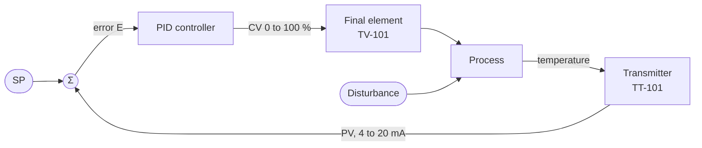
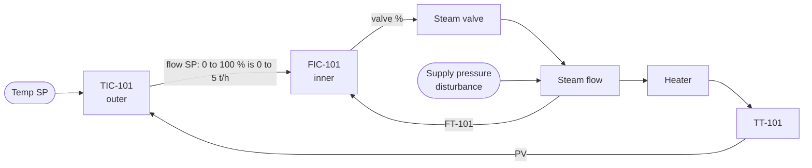
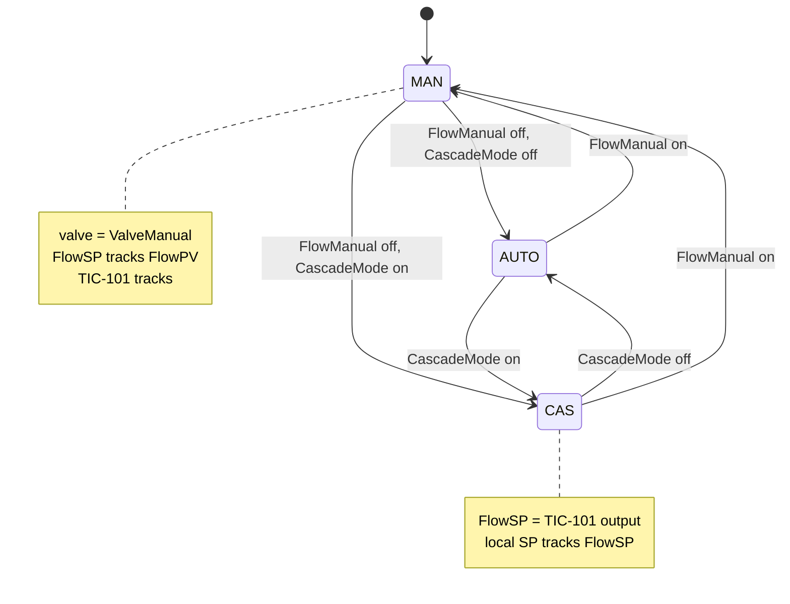
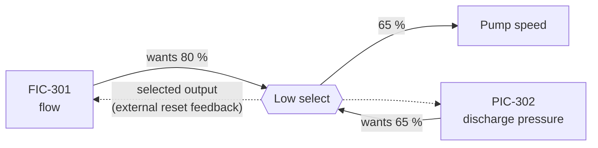

# 15 — PID and Closed-Loop Control

> **Level:** 4 — Advanced · **Time:** ~14 hours · **Prerequisites:** [Module 09](../09-math-and-data-handling/), [Module 11](../11-program-organization/), [Module 14](../14-analog-and-process-io/)

Almost every analog loop on a process plant, whether temperature, pressure, flow or level, is
held at its setpoint by a PID controller. On the P&ID it is a bubble such as **TIC-101**. On the
loop drawing it is a transmitter sending 4–20 mA to an analog input, a few lines of code in a
PLC or DCS, and an analog output driving a valve positioner. Machines use the same idea for
dancer tension, extruder barrel temperatures and hydraulic pressure.

This module explains how processes respond to a change, what the P, I and D actions each do,
and how PID is actually written in a PLC: sample time, anti-windup, bumpless transfer. It
covers how to tune a loop without upsetting the plant, and how cascade, ratio, feedforward,
split-range and override schemes are built from plain PID blocks. In the labs you write a
process simulator and your own PID function block, then test them together in closed loop. Every
PLC has a PID block, so why write one? Because once you have written one, you can read any
vendor's block, pick sensible parameters, and diagnose a loop that misbehaves.

> **Safety note.** A PID loop is part of the *basic process control system* (BPCS). It is not
> a safety function. Trips and interlocks that protect people and plant belong in a separate,
> safety-rated system designed to IEC 61511 or the machinery standards (Module 20). The labs
> here are simulations and training exercises only.

## Learning objectives

- Name the parts of a feedback loop (PV, SP, CV, error, disturbance, final element) and choose
  direct or reverse controller action for a given process and valve.
- Recognise self-regulating and integrating processes from a step test, and estimate the gain,
  time constant and dead time of a first-order-plus-dead-time (FOPDT) model.
- Explain what proportional, integral and derivative action each do, calculate the offset of a
  P-only controller, and explain integral windup and derivative kick.
- Convert tuning parameters between the ideal, parallel and series forms and between units
  (proportional band, repeats per minute, integral gain).
- Write a PID function block in Structured Text with a fixed sample time, output limits,
  anti-windup, derivative on PV with a filter, and bumpless manual-to-automatic transfer.
- Tune a loop with the lambda and SIMC rules, explain why Ziegler–Nichols settings are
  aggressive, and tell tuning oscillation apart from valve stiction.
- Build cascade, ratio, feedforward, split-range and override structures, including their mode
  handling.
- Read a vendor PID block's parameters and check its form and units before entering numbers.

## 1. The feedback loop

### 1.1 Words you need

| Term | Meaning | Other names |
|---|---|---|
| **PV** — process variable | The measured value being controlled, e.g. 62.3 °C from TT-101 | measurement, actual value (`ACTUAL` in CODESYS) |
| **SP** — setpoint | The value you want the PV to have | reference, desired value |
| **E** — error | The difference between SP and PV (the sign depends on the action, §1.3) | deviation, control deviation |
| **CV** — controller output | What the controller sends to the final element, normally 0–100 % | OP (output), MV (manipulated variable), `Y` |
| **Final control element** | The device that acts on the process: control valve, VFD speed, heater power | actuator |
| **Disturbance (load)** | Anything other than the CV that moves the PV: feed temperature, supply pressure, demand | upset |
| **Manual / automatic** | In manual the operator sets CV directly; in automatic the controller calculates it | MAN / AUTO, "open loop" / "closed loop" |

ISA-5.1 tag letters tell you the loop at a glance. **TIC-101** is a temperature (T),
indicating (I) controller (C). **TT-101** is its transmitter and **TV-101** its control valve.
Flow, pressure and level loops are FIC, PIC and LIC. On the loop drawing you will find the
chain from Module 02: transmitter, 4–20 mA through the IS barrier and the 250 Ω burden
resistor, analog input, controller, analog output, I/P converter or positioner, valve.



### 1.2 Open loop and closed loop

In **open loop** (manual) the operator chooses the output: "steam valve 35 % open". If the feed
gets colder the outlet temperature drops, and nothing corrects it until someone notices. In
**closed loop** (automatic) the controller compares PV with SP on every execution and moves
the output to remove the error. Feedback needs no model of the disturbance. It simply reacts
to the error. That is also its weakness: feedback can only act *after* the PV has already
moved. Feedforward (§8.3) acts on a measured disturbance before it reaches the PV.

### 1.3 Direct and reverse action

The loop only works if the controller pushes the PV back towards the setpoint. That is
**negative feedback**. Get the sign wrong and the controller drives the PV away from the
setpoint until the output hits a limit. By the usual ISA convention:

- **Reverse acting**: the output *increases* when the PV *decreases*. Error = SP − PV. Used when
  more output raises the PV, as with a heater, an inlet valve on a level loop, or a steam valve.
- **Direct acting**: the output *increases* when the PV *increases*. Error = PV − SP. Used when
  more output lowers the PV, as with a cooling-water valve, an outlet valve on a level loop, or a
  vent valve on a pressure loop.

| Loop | More output does... | Action |
|---|---|---|
| Heater power → temperature | raises PV | reverse |
| Cooling-water valve → temperature | lowers PV | direct |
| Inlet valve → tank level | raises PV | reverse |
| Outlet (draw-off) valve → tank level | lowers PV | direct |
| Vent valve → vessel pressure | lowers PV | direct |

The valve's fail action matters too. On an air-to-open (fail-closed) valve, a rising signal
opens it. On an air-to-close (fail-open) valve, a rising signal *closes* it, so the sign of the
whole loop flips. Many sites keep the controller output meaning "% open" so the operator is
never confused, and do the inversion once, in the analog-output scaling or the positioner.
Whatever your site does, do the inversion in **one** place and write down where. The
controller action, the output scaling and the valve action together must give negative
feedback.

## 2. How processes respond

### 2.1 The step (bump) test

Before you can tune a loop you need to know how the process responds. The standard experiment
is the **step test** or **bump test**: with the loop in manual and the process steady, step
the output by a few percent (big enough to see clearly above the noise, small enough not to
upset production) and record the PV. Record the output as well. Most PLC and DCS tools have a
trend for this, and many tuning tools do it for you.

### 2.2 Self-regulating, integrating and runaway processes

```text
 CV  ______                              CV  ______
          |______  step down                    |______
                                           
 PV  ____                               PV  ____
         \                                      \
          \___________ new steady                \
                       value                      \
                                                   \   keeps falling
   self-regulating:                       integrating:  (no new steady value)
   settles at a new value                  PV changes at a new RATE
```

- **Self-regulating** processes settle at a new steady value after a step. Temperature
  of a heated stream, flow through a valve, pressure in a line with a fixed outlet restriction.
  Most of this module uses them.
- **Integrating** processes do not settle; the PV changes at a new *rate*. A tank level with a
  pumped outlet: if inflow exceeds outflow by 2 m³/h, the level rises until something changes.
  Gas pressure in a closed vessel, and position driven by speed, behave the same way. Integrating
  loops *need* a controller to stay put, and they respond badly to too much integral action.
- **Runaway** (open-loop unstable) processes accelerate away, such as an exothermic reactor
  whose heat release rises with temperature. They need expert design and are outside this course.

### 2.3 The first-order-plus-dead-time (FOPDT) model

Most self-regulating processes can be described well enough for tuning by three numbers:

```text
   Tau * dPV/dt + PV = PV0 + K * CV(t - Theta)
```

| Symbol | Name | Meaning | Units (examples) |
|---|---|---|---|
| **K** | process gain | final change in PV ÷ change in CV | °C per %, (t/h) per %, or %/% |
| **τ** (Tau) | time constant | how fast the PV moves once it starts | s or min |
| **θ** (Theta) | dead time | how long before the PV starts to move at all | s or min |

After a step in CV, nothing happens for θ; then the PV follows an exponential curve and covers
63.2 % of its total change in one time constant:

```text
 CV (%)
   35 |           +-----------------------------------------------------
      |           |  step +10 % at t = 0
   25 |-----------+
      +-----------+----------------------------------------------------> t
 PV (degC)
   48 |                                            ....------------------  final value
      |                                    ...'''                         (+8 degC: K = 0.8 degC/%)
 45.1 |- - - - - - - - - - - - - - - - - -*   63.2 % of the change
      |                          ..''     |
      |                      .''          |
      |                   .'              |
   40 |---------------+.'                 |
      +-----------+---+-------------------+--------------------------> t (s)
                  0   3                   23
                  |<->|<----------------->|
                   θ=3s       τ=20 s
```

| Time after the dead time | 1τ | 2τ | 3τ | 4τ | 5τ |
|---|---|---|---|---|---|
| Fraction of the change covered, 1 − e^(−t/τ) | 63.2 % | 86.5 % | 95.0 % | 98.2 % | 99.3 % |

A few practical points about the three numbers:

- **Units of K.** If PV and CV are both expressed in % of span, K is dimensionless (%/%).
  A heater with K = 0.8 °C/% and a 0–150 °C transmitter has K = 0.8 × 100/150 = 0.53 %/%.
  Always check which one a formula expects.
- **Where dead time comes from.** Transport delay (product travelling down a pipe or a belt),
  slow analyzers and sample lines, and several small lags in series, which together look like
  dead time. The control system adds some too: sampling adds on average about half a sample
  time, and every input filter adds its time constant. A heavy AI filter chosen in Module 14
  "to make the trend look nice" can double a loop's dead time.
- **The ratio θ/τ** tells you how hard the loop is. With θ/τ well below 1 (lag-dominant) you can
  control tightly. As θ/τ approaches and passes 1 (dead-time-dominant) you must detune, because
  the controller cannot see the result of its action until θ has passed.
- **K, τ and θ change** with operating point, throughput and valve position. A valve with the
  wrong characteristic can make K vary several times over across its range. Test at the normal
  operating point, and in more than one place if the loop covers a wide range.

#### Worked example: reading a bump test

The heater in Lab 15-2 sits steady at 40.0 °C with 25 % output. You step the output to 35 % and
record:

| t (s) | 0 | 2 | 3 | 5 | 9.7 | 15 | 23 | 40 | 80 | 120 |
|---|---|---|---|---|---|---|---|---|---|---|
| PV (°C) | 40.0 | 40.0 | 40.0 | 40.8 | 42.3 | 43.6 | 45.1 | 46.7 | 47.8 | 48.0 |

1. **Gain.** ΔPV = 48.0 − 40.0 = 8.0 °C for ΔCV = 10 %, so K = 0.8 °C/%.
2. **The two-point method.** Find when the PV has covered 28.3 % and 63.2 % of its change:
   40 + 0.283 × 8 = 42.3 °C at t₂₈ ≈ 9.7 s, and 40 + 0.632 × 8 = 45.1 °C at t₆₃ = 23 s. Then
   τ = 1.5 × (t₆₃ − t₂₈) = 1.5 × 13.3 = 20 s and θ = t₆₃ − τ = 3 s.
   (The method works because an FOPDT curve passes 28.3 % at θ + τ/3 and 63.2 % at θ + τ.)
3. **Check** against the raw data: the PV really did start moving just after 3 s. ✔

Real data are noisy and real processes are not exactly first order, so treat the numbers as
estimates. Repeat the test in both directions and average.

### 2.4 Integrating processes

An integrating process is described by its rate gain **Kᵥ**: the rate of change of PV per unit
of CV away from the balance point, for example 0.02 %/s per %, plus a dead time. From a
bump test on a level loop, take the slope of the level before and after the step:
Kᵥ = Δslope ÷ ΔCV.

### 2.5 Simulating an FOPDT process in the PLC

For a sample time Ts the model can be solved exactly, sample by sample:

```text
   alpha    = e^(-Ts / Tau)
   PV[k]    = alpha * PV[k-1] + (1 - alpha) * (PV0 + K * CV[k - N])      N = Theta / Ts
```

Each sample, the PV moves the fraction (1 − α) of the way to where the delayed input is
pulling it. The simpler Euler form `PV := PV + Ts/Tau * (target - PV)` gives almost the same
answer when Ts is much smaller than τ. It becomes inaccurate as Ts approaches τ, overshoots
and oscillates when Ts is longer than τ, and is unstable when Ts is longer than 2τ. The dead time is a **delay line**: a ring buffer that stores the last N inputs.
Each sample you write the newest input and read the one written N samples ago:

```text
   Buf:  [ u  u  u  u  u  u  u  u  u  u ]      ring buffer of past inputs
                  ^              ^
                  |              WrIdx: newest input written here
                  RdIdx = WrIdx - N (wrapping round): the input from Theta seconds ago
```

Lab 15-1 builds this as `FB_FOPDT`. A plant model inside the PLC is useful well beyond this
course: you can test logic before the plant exists, commission a new PID offline, and train
operators. Module 22 calls this *virtual commissioning*.

## 3. On/off control

The simplest controller switches the output fully on below the setpoint and fully off above
it, with a **hysteresis** (differential) band so it does not chatter. Module 14 showed the logic.
Because of the process lag and dead time, the PV always overshoots the switching points, so an
on/off loop *cycles* forever:

```text
  PV               __            __            __
                  /  \          /  \          /  \
  SP + band  - - / - -\- - - - / - -\- - - - / - -\- - - - - -
  SP            /      \      /      \      /      \
  SP - band  - / - - - -\- - / - - - -\- - / - - - -\- - - - -
              /          \  /          \  /          \
                          __            __            __
  heater  ON  ___        ______        ______        ______
          OFF    |______|      |______|      |______|      |__
                 ^      ^
                 |      on at SP - band; the PV keeps falling for a while
                 off at SP + band; the PV keeps rising for a while (lag and dead time)
```

The cycle gets bigger as the dead time grows, and a narrow band makes the output switch more
often. On/off control is right for many heaters, refrigerators and sump pumps (Module 14), where
some cycling is acceptable. Choose the band from the minimum on and off times the contactor or
compressor can tolerate. When you need a steady PV but only have an on/off actuator (a contactor
or solid-state relay on a heater), use a PID with **time-proportioning** (PWM) output: the PID
output sets the fraction of each cycle, say 10 s, that the heater is on.

## 4. What P, I and D do

We will use the ideal form (§5) throughout: Out = Kc × (E + integral part + derivative part).

### 4.1 Proportional action and offset

```text
   Out = Kc * E + bias
```

Proportional action moves the output in proportion to the error: twice the error, twice the
correction. **Kc** is the controller gain. Older instruments and many DCSs set it as
**proportional band** instead: PB is the percentage of the PV span that drives the output
across its full range, so **PB (%) = 100 / Kc** when Kc is dimensionless. PB = 50 % means
Kc = 2. A *wide* band means a *low* gain.

A P-only controller on a self-regulating process leaves a permanent **offset**. The output can
only differ from the bias if there is an error, so to hold any load other than the one the bias
was set for, some error must remain. After a setpoint change of ΔSP from a balanced state:

```text
   remaining error = ΔSP / (1 + K * Kc)          (K * Kc = the loop gain, dimensionless)
```

**Worked example.** Heater: K = 0.8 °C/%, steady at 40 °C with bias 25 %. P-only with
Kc = 2.5 %/°C (loop gain K·Kc = 2). Raise SP to 50 °C: the remaining error is 10/(1 + 2) =
3.33 °C, so the PV settles at 46.67 °C with the output at 25 + 2.5 × 3.33 = 33.3 %. Check:
20 + 0.8 × 33.3 = 46.67 °C. ✔ Doubling Kc to 5 reduces the offset to 10/5 = 2 °C, but also
brings the loop much closer to oscillation. Before integral action existed, operators removed
the offset by adjusting the bias by hand, which is why it is still called **manual reset**.

P-only control is still the right choice for some loops, such as a surge tank level where you
*want* the level to float so the outflow stays smooth.

### 4.2 Integral action

```text
   integral part = (Kc / Ti) * (sum of E * Ts over time)
```

Integral action keeps moving the output for as long as any error remains, so at steady state
the error must be zero: **no offset**. It was historically called **reset**, because it does
automatically what the operator's manual reset did.

**Ti**, the **integral time** or **reset time**, has a precise meaning. With a constant error,
the integral part grows until, after Ti seconds, it has added as much again as the proportional
part: it has *repeated* the P action once. So Ti is measured in **seconds (or minutes) per
repeat**. Some systems use the inverse, **repeats per minute** = 1 / Ti [min]. The parallel
form uses an **integral gain** Ki = Kc / Ti instead. A *smaller* Ti means *more* integral action.

Integral action adds phase lag, so too much of it (Ti too short) causes overshoot and a slow,
rolling oscillation. On integrating processes it is especially dangerous. There the loop
already contains one integrator, and Ti must be kept long (§7.4).

**Integral windup.** If the output hits a limit (valve fully open) while the error persists,
the integral keeps growing, because nothing told it the valve cannot open further. When the
PV finally reaches the setpoint, the integral is huge. The output stays on the limit while the
integral "unwinds", and the PV overshoots, often badly. Windup happens on start-up, with an
unreachable setpoint, when a cascade inner loop is saturated or in manual, and on the
unselected controller of an override pair. Every PLC PID needs **anti-windup** (§6.4).

### 4.3 Derivative action

```text
   derivative part = Kc * Td * dE/dt
```

Derivative action responds to how fast the error is changing, so it acts early, before the
error has grown. **Td**, the **derivative time** or **rate time**, is how far ahead it looks:
for an error that is ramping, P + D gives the output that P alone would give Td seconds later.
Used well, it lets a lag-dominant loop such as a large vessel temperature run with more gain
and less overshoot.

It has three well-known problems, and a good PID block handles all of them:

1. **Derivative kick.** A setpoint step changes E by the whole step in one sample, so the
   calculated dE/dt is ΔSP ÷ Ts, a huge number, and the output jumps to a limit. The cure is **derivative on PV**: differentiate −PV instead of E. For a
   constant SP the two are the same, but setpoint changes no longer kick. Some blocks also
   apply the proportional action to the PV rather than the error (I-PD), or weight the setpoint
   in the P and D terms (Siemens `PWeighting`, `DWeighting`), for gentler setpoint responses.
2. **Noise amplification.** Differentiating a noisy signal amplifies the noise, which then
   jiggles the valve. The cure is a **derivative filter**: a first-order lag with time constant
   Tf = Td / N on the derivative part. N is usually somewhere around 5–20; 10 is a common
   default. Flow loops are fast and noisy and almost never use derivative.
3. **Dead-time-dominant processes** gain little from derivative, because there is nothing to
   anticipate during the dead time.

### 4.4 The actions together

| If you... | Response speed | Overshoot and oscillation | Other effects |
|---|---|---|---|
| Increase Kc | faster | more | smaller P-only offset; too much → sustained oscillation |
| Decrease Ti (more integral) | removes offset faster | more, slower "rolling" oscillation | dangerous on integrating processes |
| Increase Td | can reduce overshoot on lag-dominant loops | too much → fast oscillation | amplifies noise; needs a filter |

Typical starting choices, which are rules of thumb and not laws:

| Loop | Usual controller | Notes |
|---|---|---|
| Liquid flow | PI | fast and noisy; modest gain, short Ti; no D |
| Liquid pressure | PI | similar to flow |
| Gas pressure | PI (sometimes P) | often integrating (closed vessel) |
| Level | P or PI | often deliberately loose ("averaging") so outflow stays smooth |
| Temperature | PI or PID | slow, several lags; D often helps |
| Analyzer / composition | PI | usually dead-time-dominant; detune |

## 5. Forms and units of the PID equation

### 5.1 Three forms

```text
 Ideal (ISA "standard", non-interacting):
     Out = Kc * ( E  +  1/Ti * ∫E dt  +  Td * dE/dt )

 Parallel (independent gains):
     Out = Kp * E  +  Ki * ∫E dt  +  Kd * dE/dt

 Series (interacting, "classical"):        in Laplace form
     C(s) = Kc' * (1 + 1/(Ti' s)) * (1 + Td' s)
```

- In the **ideal** form, Kc multiplies everything. Doubling Kc doubles all three actions while
  Ti and Td keep their meaning in time. Most process tuning rules assume this form.
- In the **parallel** form, each gain acts alone. Kp = Kc, Ki = Kc / Ti, Kd = Kc × Td.
  Changing Kp does *not* change the integral action, which surprises people used to the ideal
  form. Many motion and embedded controllers use this form.
- The **series** form comes from pneumatic and early electronic controllers, where the
  derivative and integral sections interacted. Some DCSs still offer it. Convert it to ideal
  with:

```text
   Kc = Kc' * (1 + Td'/Ti')      Ti = Ti' + Td'      Td = Ti' * Td' / (Ti' + Td')
```

With no derivative (Td = 0), which covers most loops, all three forms are the same PI
controller with Kp = Kc and Ki = Kc / Ti.

### 5.2 Units

| Setting | Ways it is expressed | Conversions |
|---|---|---|
| Proportional | gain Kc (dimensionless or % per EU); proportional band PB % | PB = 100 / Kc (both in %) |
| Integral | Ti in seconds/repeat or minutes/repeat; repeats per minute; Ki in 1/s or 1/min | repeats/min = 1 / Ti[min]; Ki = Kc / Ti |
| Derivative | Td in seconds or minutes; Kd in seconds or minutes | Kd = Kc × Td |

A further trap is **normalisation**. Some blocks convert PV and SP to % of span before
applying the gain, so Kc is %/%. Others use engineering units directly, so Kc is % per °C or
% per bar. The same number means very different things in the two cases.

#### Worked example: moving a loop to a new controller

An old series-form controller has Kc' = 2, Ti' = 20 s, Td' = 5 s. What do you enter in an
ideal-form block, and in a parallel-form block?

- Ideal: Kc = 2 × (1 + 5/20) = **2.5**, Ti = 20 + 5 = **25 s**, Td = 20 × 5 / 25 = **4 s**.
  As proportional band: PB = 100 / 2.5 = **40 %**. As reset rate:
  Ti = 25 s = 0.417 min, so **2.4 repeats/min**.
- Parallel: Kp = **2.5**, Ki = 2.5 / 25 = **0.1 s⁻¹** (= 6 min⁻¹), Kd = 2.5 × 4 = **10 s**
  (= 0.167 min).

Entering "Ti = 25" into a block that expects minutes makes the integral action 60 times too
weak. Entering "Ki = 0.1" into a block that expects 1/min makes it 60 times too weak. Always
read the block's help for the form *and* the units (Vendor notes below).

## 6. Implementing PID in a PLC

### 6.1 A fixed sample time

A PID algorithm in a PLC is a *sampled* controller. It runs every Ts seconds and uses Ts in its
integral and derivative calculations. So the block must run at a known, steady interval:

- Put control loops in a **cyclic (periodic) task** (Module 11): a cyclic interrupt OB in TIA
  Portal, a periodic task in Studio 5000, a cyclic task in CODESYS. The free-running main
  cycle varies with the logic executed, so its scan time is not a reliable Ts.
- Pass the task interval to the block, or let the block measure the elapsed time. If you call
  a block only every Nth scan, its Ts is N × the task interval. Lab 15-1 tests exactly that.
- Keep Ts short compared with the process: a common guideline is no more than about a tenth of
  the loop's dominant time constant, and small compared with the dead time. Fast loops (flow,
  liquid pressure) typically run at a few hundred milliseconds or faster. Temperature and level
  loops can run at a second or more. The analog input must update at least as fast as the loop
  runs, or the controller works on stale data.

```iecst
CONFIGURATION Config0
  RESOURCE Res0 ON PLC
    TASK FastTask(INTERVAL := T#100ms, PRIORITY := 1);   (* flow and pressure loops *)
    TASK SlowTask(INTERVAL := T#1s, PRIORITY := 2);      (* temperature loops *)
    PROGRAM FlowLoops WITH FastTask : FlowControl;
    PROGRAM TempLoops WITH SlowTask : TempControl;
  END_RESOURCE
END_CONFIGURATION
```

Inside `FlowControl` every PID call then gets `Ts := T#100ms`, and inside `TempControl`
`Ts := T#1s`. (In IEC 61131-3 a lower priority number means higher priority, so the fast
task pre-empts the slow one.)

**Converting Ts portably.** `TIME_TO_REAL` is not portable. MATIEC (OpenPLC and this course's
`plctest`) returns seconds, while CODESYS returns milliseconds. `TIME_TO_DINT(T#10ms)` is 0 in
MATIEC (whole seconds) but 10 in CODESYS. This expression gives seconds on both:

```iecst
TsSec := TIME_TO_REAL(Ts) / TIME_TO_REAL(T#1s);
```

### 6.2 Positional form

Replace the integral with a running sum and the derivative with a difference, and you get the
**positional** form. It calculates the whole output every sample. Store the integral *part* in
output units (%), not the raw sum of errors. Then Ti = 0 simply freezes it, which turns it into
the bias of a P-only controller. Bumpless transfer can set it directly (§6.5), and changing Ti
never bumps the output. The core of a reverse-acting controller, inside a function block, looks
like this:

```iecst
E := SP - PV;                                        (* reverse acting *)
PTerm := Kc * E;                                     (* P on error *)
DTerm := (Tf * DTerm - Kc * Td * (PV - PVLast)) / (Tf + TsSec);  (* D on PV, filtered *)
PVLast := PV;
U := PTerm + ITerm + DTerm;
IF NOT ((U >= OutMax AND E > 0.0) OR (U <= OutMin AND E < 0.0)) THEN
  ITerm := ITerm + Kc * TsSec / Ti * E;              (* conditional integration *)
END_IF;
Out := LIMIT(OutMin, PTerm + ITerm + DTerm, OutMax);
```

The derivative line is the backward-Euler form of the filter
Tf × dD/dt + D = −Kc × Td × dPV/dt. With Tf = 0 it becomes the plain difference
−Kc × Td × ΔPV / Ts. A real block also guards against Ti = 0 and Ts = 0 before dividing, and
handles direct action, manual mode and the first call. Lab 15-2 adds all of these.

### 6.3 Velocity (incremental) form

The **velocity form** calculates the *change* of output each sample and adds it to the
previous output:

```iecst
E := SP - PV;                                        (* reverse acting *)
DOut := Kc * ((E - E1)                               (* change of P *)
              + TsSec / Ti * E                       (* I *)
              - Td / TsSec * (PV - 2.0 * PV1 + PV2));(* change of D, on PV *)
Out := LIMIT(OutMin, Out + DOut, OutMax);            (* the output is the only memory *)
E1 := E;
PV2 := PV1;
PV1 := PV;
```

Because the only memory is the (limited) output itself, the velocity form cannot wind up, and
switching from manual is naturally bumpless: it just carries on from wherever the output is.
It suits incremental actuators, such as a motorised valve driven by open/close pulses (Siemens
`PID_3Step`), and Rockwell's `PIDE` uses it. The cost: because only *changes* are
calculated, whatever a limit clips off is lost for good. With little or no integral action,
the output can therefore settle at a different level after it has been on a limit. Both forms
are correct. Lab 15-2's tests accept either.

> **Watch out for keywords.** Many textbook PID listings call the sample time `dt`. In IEC
> 61131-3, `DT` is the DATE_AND_TIME type and keywords are not case-sensitive, so `dt : REAL;`
> does not compile. Also avoid naming variables after standard blocks: `PID`, `RAMP`,
> `INTEGRAL` and `DERIVATIVE` are function block types in MATIEC and OpenPLC.

### 6.4 Output limits and anti-windup

The output is always limited, to 0–100 % or to tighter limits such as a minimum firing rate or
a maximum valve opening. The integral must then be told about the limit. The common methods:

| Method | How it works | Notes |
|---|---|---|
| **Conditional integration (clamping)** | Skip the integral update when the output is on a limit *and* the error would push it further in | Simple and effective; the method in the reference solution |
| **Back-calculation (tracking)** | Each sample, feed the difference between the limited and unlimited output back into the integral with a tracking time Tt | Integral is steered to just hold the limit; Tt is a tuning choice (often between Td and Ti) |
| **Limit the integral part to the output range** | ITerm := LIMIT(OutMin, ITerm, OutMax) | Stops runaway, but the integral can still sit at full scale, and it breaks bumpless transfer when the P part is large. Better than nothing |
| **Velocity form** | Only the limited output is stored | Inherent |
| **External reset feedback** | Integral driven from the output actually used (§8.1, §8.5) | Needed in cascade and override schemes |

**What windup costs.** Lab 15-2's closed-loop test (scenario B5) limits the heater to 50 %,
asks for an unreachable 75 °C for two minutes, then lowers the setpoint to 50 °C. With the
reference solution's conditional integration the output leaves the limit on the very next
sample and the PV is back at 51 °C about 8 s after the setpoint change. Without it the
output stays at 50 % for more than two minutes while the integral unwinds, and the PV stays
at 60 °C the whole time.

### 6.5 Manual mode and bumpless transfer

When the operator switches from manual to automatic, the output must not jump. There are two
standard methods:

- **Output tracking (integral initialisation).** While in manual, keep calculating P and D and
  set the integral part to *output − P − D* every sample. The first automatic sample then
  produces exactly the manual output, and the controller moves off smoothly from there. The
  operator's setpoint is untouched.
- **PV tracking (setpoint tracking).** While in manual, copy the PV into the setpoint, so the
  error is zero at the moment of transfer. Nothing bumps, but the operator's setpoint is
  overwritten and must be ramped back to the real target afterwards. Many DCS faceplates
  make PV tracking a configuration option.

Both have their uses. A block that does output tracking internally (like `FB_PID` in Lab 15-2)
lets the program decide whether to add PV tracking on top. The same ideas apply to other
transfers:

- **Tuning changes in the positional form.** Changing Kc changes the P part immediately
  (ΔKc × E). With E ≈ 0 this is harmless. If it matters, adjust the integral part by the same
  amount in the opposite direction when Kc changes. The velocity form is immune.
- **Cascade and override transfers.** §8.

### 6.6 Setpoint limits and ramping

A large setpoint step produces a large proportional kick, thermal stress on equipment and,
often, a saturated output. Put a **setpoint limiter and rate limiter** in front of the
controller. A complete, reusable block:

```iecst
FUNCTION_BLOCK FB_SPRamp
  (* Setpoint limits and rate limiting in front of a PID. *)
  VAR_INPUT
    Target     : REAL;           (* setpoint entered by the operator *)
    Rate       : REAL := 1.0;    (* maximum rate of change, units per minute; 0 = no ramp *)
    SPLo       : REAL := 0.0;    (* setpoint low limit *)
    SPHi       : REAL := 100.0;  (* setpoint high limit *)
    Track      : BOOL;           (* TRUE: follow TrackValue, e.g. the PV while in manual *)
    TrackValue : REAL;
    Ts         : TIME := T#100ms;(* call interval *)
  END_VAR
  VAR_OUTPUT
    SP      : REAL;              (* working setpoint for the PID *)
    Ramping : BOOL;              (* TRUE while SP is still moving towards Target *)
  END_VAR
  VAR
    Started : BOOL := FALSE;     (* FALSE until the first call *)
  END_VAR
  VAR_TEMP
    Goal    : REAL;
    MaxStep : REAL;
  END_VAR

  Goal := LIMIT(SPLo, Target, SPHi);
  IF Track THEN
    SP := LIMIT(SPLo, TrackValue, SPHi);
  ELSIF Rate <= 0.0 OR NOT Started THEN
    SP := Goal;                  (* no ramp; and at power-up start at the target, not at 0 *)
  ELSE
    MaxStep := Rate / 60.0 * TIME_TO_REAL(Ts) / TIME_TO_REAL(T#1s);
    IF ABS(Goal - SP) <= MaxStep THEN
      SP := Goal;
    ELSIF Goal > SP THEN
      SP := SP + MaxStep;
    ELSE
      SP := SP - MaxStep;
    END_IF;
  END_IF;
  Ramping := NOT Track AND (SP <> Goal);
  Started := TRUE;
END_FUNCTION_BLOCK
```

With `Track := Manual` and `TrackValue := PV`, the same block gives PV tracking in manual,
and after switching to automatic it ramps the working setpoint from the PV to the operator's
target.

### 6.7 Order of operations in a PID block

Every PID block, including the one you write in Lab 15-2, does the same steps each sample:

1. Convert Ts to seconds; work out the sign from direct/reverse action; calculate E.
2. On the first call, initialise the previous-PV memory, so the derivative does not kick at
   power-up.
3. Proportional part from E.
4. Derivative part from the change in PV, filtered. Keep this running in manual too, so its
   memory is up to date at the transfer.
5. **Manual:** output = manual value (limited); set the integral part for bumpless transfer.
   **Automatic:** update the integral part unless anti-windup blocks it; output = P + I + D,
   limited.

## 7. Tuning

### 7.1 Before you tune

Most "tuning problems" are not tuning problems. Check these first:

- **Measurement.** Is the PV right, steady and not too noisy? Is the AI filter sensible
  (Module 14)? Is the range right, or is the transmitter saturating?
- **Final element.** Does the valve move when asked, the full stroke, in the right direction?
  Is it sticking (§7.6)? Is it far too big, so it controls in the first 5 % of travel?
- **Action and limits.** Reverse or direct? Output limits and fail action correct?
- **Execution.** Is the block in a cyclic task, with the right Ts?
- **Operating point.** Is the process at its normal load? Are operators aware, and is there a
  plan for what to do if the PV heads towards an alarm or trip limit?

### 7.2 A practical manual procedure

When you have no model and no tuning tool, this conservative approach works on most
self-regulating loops:

1. Start with a low gain, a long Ti (about the time the PV takes to settle after a bump test,
   or longer) and Td = 0.
2. In automatic, make small setpoint steps (a few % of span) in both directions and watch PV
   *and* CV.
3. Raise Kc in steps of about 1.5 to 2 until the response becomes clearly oscillatory (large
   overshoot, several swings before it settles), then back off to roughly half that gain.
4. Shorten Ti until the PV settles without offset reasonably quickly, and stop before it starts
   rolling slowly around the setpoint.
5. Only then consider derivative, on slow multi-lag loops. Add it with a filter, and check the
   valve for jitter.
6. Finally test **disturbance rejection** as well as setpoint response: many loops never see a
   setpoint change but fight load changes all day.

Write down the values before and after. Change one thing at a time.

### 7.3 Ziegler–Nichols, and why it is aggressive

The 1942 Ziegler–Nichols rules come in two versions.

**Closed-loop (ultimate gain) method.** In automatic with P only, raise Kc until the loop
oscillates with constant amplitude. That gain is the ultimate gain **Ku** and the period is
**Pu**. Then:

| Controller | Kc | Ti | Td |
|---|---|---|---|
| P | 0.5 Ku | — | — |
| PI | 0.45 Ku | Pu / 1.2 | — |
| PID | 0.6 Ku | Pu / 2 | Pu / 8 |

**Open-loop (reaction curve) method,** from the FOPDT values K, τ, θ:

| Controller | Kc | Ti | Td |
|---|---|---|---|
| P | τ / (K θ) | — | — |
| PI | 0.9 τ / (K θ) | 3.33 θ | — |
| PID | 1.2 τ / (K θ) | 2 θ | 0.5 θ |

Ziegler and Nichols aimed for **quarter-amplitude decay**: each overshoot a quarter of the one
before. That is a fast but oscillatory response with small stability margins. For the Lab 15-2
heater (K = 0.8 °C/%, τ = 20 s, θ = 3 s), the ultimate gain is about 13.9 %/°C with
Pu ≈ 11.4 s. On a small setpoint step the ZN settings give:

| Tuning | Kc (%/°C) | Ti (s) | Gain margin | Overshoot (2 °C step) | With process gain +50 % |
|---|---|---|---|---|---|
| ZN closed-loop PI | 6.25 | 9.5 | ≈ 1.9 | ≈ 50 % | ≈ 90 % overshoot, slow decay |
| ZN open-loop PI | 7.5 | 10 | ≈ 1.6 | ≈ 60 % | > 100 % overshoot, close to unstable |
| SIMC (τc = θ) | 4.2 | 20 | ≈ 3.1 | ≈ 4 % | ≈ 25 % |
| Lambda (λ = 7 s) | 2.5 | 20 | ≈ 5.2 | none | ≈ 1 % |

(Figures from simulating the lab plant. Gain margin is the factor by which the loop gain could
rise before the loop becomes unstable. Values of about 2 and above are usually wanted.)

Process gains often change by tens of percent with throughput or valve position, so a
ZN-tuned loop that looks fine on commissioning day can oscillate the following week. Use ZN
values as a starting point that is known to be on the aggressive side, and detune. Also note
that measuring Ku means deliberately driving a live plant to the edge of instability. On
process plant that is rarely acceptable. The **relay auto-tune** method (Åström–Hägglund),
built into many PID blocks, finds Ku and Pu with a small, controlled limit cycle instead: the
output switches ±d around its operating value, and Ku ≈ 4d / (π a), where a is the resulting
PV amplitude.

### 7.4 Lambda tuning

**Lambda tuning** (an IMC-based method, widely used in the process industries) lets you choose
how fast the closed loop should respond. You pick the closed-loop time constant **λ**, and the
rules give a PI controller that makes the PV follow a setpoint step approximately like a
first-order lag of time constant λ, after the dead time, with no overshoot.

**Self-regulating process** (K, τ, θ), ideal-form PI:

```text
   Kc = τ / ( K * (λ + θ) )          Ti = τ
```

**Integrating process** (rate gain Kᵥ, dead time θ), where λ is the *arrest time*:

```text
   Kc = (2λ + θ) / ( Kᵥ * (λ + θ)² )          Ti = 2λ + θ
```

Choosing λ: larger λ is slower and more robust. Never choose λ smaller than θ. Choosing λ
between one and three open-loop time constants is common where robustness matters most, and
faster choices (λ down to a few dead times) are used on well-behaved loops. Because λ is
set in seconds, loops in series can be given deliberately different speeds, which is exactly
what a cascade needs (§8.1).

**Worked example (the Lab 15-2 heater).** K = 0.8 °C/%, τ = 20 s, θ = 3 s. Choose λ = 7 s:
Kc = 20 / (0.8 × (7 + 3)) = **2.5 %/°C**, Ti = **20 s**. These are the default values in the
Lab 15-2 test bench. A 20 °C setpoint step then reaches 59 °C in about 22 s with no overshoot.

**Worked example (integrating level loop).** Kᵥ = 0.02 %/s per %, θ = 5 s. Choose an arrest
time λ = 60 s: Kc = (120 + 5) / (0.02 × 65²) = **1.48 %/%**, Ti = **125 s**.

Watch the units. The formulas assume Kc and K use the same units (%/% throughout, or K in
°C/% and Kc in %/°C), and Ti comes out in whatever time unit you used for τ and θ.

### 7.5 SIMC

Skogestad's SIMC rules (2003) are a refinement of the same idea:

```text
   Self-regulating:   Kc = τ / ( K * (τc + θ) )       Ti = min( τ, 4 * (τc + θ) )
   Integrating:       Kc = 1 / ( Kᵥ * (τc + θ) )      Ti = 4 * (τc + θ)
```

τc plays the role of λ. The recommended choice **τc = θ** gives tight but robust control. The
`min()` in Ti gives better disturbance rejection on lag-dominant processes, where τ is much
larger than θ. That is a known weakness of plain lambda tuning, which always sets Ti = τ.

### 7.6 Is it the tuning or the valve?

When a loop oscillates, first put it in **manual** and hold the output steady.

- **Oscillation stops in manual:** the loop itself is causing it, through tuning or the valve.
- **Oscillation continues in manual:** it comes from outside, from another loop, an upstream
  process or a cycling utility. Retuning this loop will not fix it. Find the source.

Then tell tuning from the valve:

| Symptom | Tuning too aggressive | Valve **stiction** (static friction) |
|---|---|---|
| Waveform | smooth, roughly sinusoidal | PV square-ish or with sudden jumps; CV a triangular saw-tooth |
| Period | near the loop's natural period; shortens with more gain | changes with gain and Ti, but the cycle does not go away |
| Reduce Kc | oscillation decays | cycle continues, often slower |
| Valve test in manual | valve follows small steps | small steps (around 0.5–1 %) produce no movement, then a sudden jump |

Stiction produces a limit cycle. The integral winds the output slowly (the saw-tooth) until the
valve breaks free and jumps past where it should be. The cure is mechanical (packing,
positioner, actuator), not a retune. **Backlash** (hysteresis) or dead band in linkages and positioners
makes a loop sluggish and can also produce a slow cycle, especially on integrating processes
such as level. If the positioner reports actual valve position, trend it next to the CV. The
difference is the diagnosis.

### 7.7 Commissioning a loop safely

1. Check the whole chain first (§7.1): transmitter range, AI scaling and filter, action, output
   scaling, valve stroke and fail position.
2. Agree the test with operations. Know the alarm and trip limits, and how far the PV may go.
3. Start in manual, get the process steady at normal load, and do bump tests in both directions.
4. Calculate conservative settings (lambda with a generous λ), enter them, and check the units
   in the block.
5. Switch to automatic bumplessly, with the setpoint at the present PV. Watch for a few time
   constants.
6. Make small setpoint changes, then larger ones. Test a disturbance if you can. Tighten
   gradually.
7. Record the final settings and the bump-test data in the loop file, for the next person.

## 8. Advanced structures

All of these are built from ordinary PID blocks plus a little logic. Getting the **modes and
tracking** right is most of the work, and it is what Lab 15-3 practises.

### 8.1 Cascade control

One controller's output becomes another controller's setpoint. The **outer (primary, master)**
loop controls the variable you care about. The **inner (secondary, slave)** loop controls an
intermediate variable that responds faster and is exposed to a disturbance. Classic example: a
product heater where TIC-101 sets the setpoint of steam-flow controller FIC-101. A drop in
steam supply pressure reduces the steam flow. FIC-101 sees it within a second and corrects it
before the product temperature has noticeably moved.



Rules of cascade control:

- **The inner loop must be clearly faster** than the outer, often quoted as at least three to
  five times. Otherwise the two loops fight.
- **Tune the inner loop first**, with the outer in manual. Then treat the inner closed loop as
  part of the outer loop's process and tune the outer.
- **Scale the outer output** to the inner setpoint range: 0–100 % of TIC-101 → 0–5 t/h.
- **Modes.** The inner loop has three: MAN, AUTO (on its own local setpoint) and **CAS** (on
  the remote setpoint from the outer loop). Whenever the inner loop is *not* in CAS, the outer
  loop cannot control anything, so it must **track**: its output is initialised to the inner
  setpoint (or the inner PV) in its own units. Then switching to CAS is bumpless and the outer
  integral cannot wind up while it waits.
- **Inner saturation.** If the inner loop's valve is fully open, the outer loop's requests go
  unanswered and it winds up. Real systems pass a "limited" status or the actual inner
  setpoint back to the outer loop (external reset feedback). Vendor blocks have inputs for this.



**Worked example (Lab 15-3 tuning).** Inner process: valve → steam flow, K = 0.05 (t/h)/%,
τ = 1.5 s, θ = 0.5 s. Lambda with λ = 1.5 s: Kc = 1.5 / (0.05 × 2) = **15 %/(t/h)**,
Ti = **1.5 s**. The closed inner loop responds in about λ + θ = 2 s. The outer loop then sees
flow setpoint → temperature: 12 °C per t/h × 0.05 t/h per % of TIC output = 0.6 °C/%, τ = 40 s,
and an apparent dead time of about 6 + 2 = 8 s. With λ ≈ 19 s: Kc = 40 / (0.6 × 27) ≈
**2.5 %/°C**, Ti = **40 s**. In the lab's simulation a 30 % drop in steam supply pressure moves
the temperature by about 0.5 °C with cascade, against about 3.7 °C for a single TIC acting
directly on the valve with the same tuning.

### 8.2 Ratio control

Keep one flow in proportion to another. The "wild" flow is measured but not controlled, and
the controlled flow's setpoint is the wild flow times the ratio:

```iecst
AdditiveFlowSP := LIMIT(0.0, Ratio * WildFlowPV, AdditiveFlowMax);
```

Used for blending, dosing chemicals in proportion to a main flow, and fuel/air ratio on
burners. On burners the fuel/air logic has additional **cross-limiting**, so that air leads on
increase and fuel leads on decrease. That is combustion-safety territory, designed to the
applicable burner standards, not something to improvise. Filter the wild flow if it is noisy.

### 8.3 Feedforward

If a disturbance can be measured, correct for it before it moves the PV. The feedforward term
is added to the feedback controller's output:

```text
   CV = PID output + FF gain * (disturbance - its nominal value)
```

- **Static feedforward** uses a gain alone. For a heater, extra feed flow needs
  proportionally more steam.
- **Dynamic feedforward** adds a lead-lag (and sometimes a delay), so the correction arrives
  at the same time as the disturbance's effect.
- Feedforward is never perfect, so keep feedback to trim the rest. The classic example is
  **three-element boiler drum level**: steam flow (feedforward) sets the feedwater flow
  demand, level (feedback) trims it, and a feedwater flow loop (cascade) delivers it.
- Add the feedforward *inside* the PID block if it has a feedforward or bias input, not after
  it. Otherwise the block's output limits and anti-windup do not know about the total output.

### 8.4 Split-range control

One controller output drives two (or more) final elements over different parts of its range.
Examples: heating and cooling on a jacketed vessel, nitrogen in and vent out on a
tank-blanketing pressure loop, and a small and a large valve in parallel for wide rangeability.

```text
 valve opening
 100 % |*                                                 *
       |   *  cooling valve         heating valve      *
       |       * (TV-101B)          (TV-101A)       *
  50 % |          *                              *
       |             *                        *
       |                 *                 *
   0 % +--------------------*-----------*-------------------
       0                    45    50    55                100   controller output (%)
                            |<-- gap -->|  neither valve open (gap drawn wider than scale)
```

```iecst
FUNCTION F_SplitRange : REAL
  (* Opening (%) of one valve of a split-range pair. The valve goes from closed to
     fully open while the controller output CV goes from CvClosed to CvOpen.
     CvOpen < CvClosed gives a valve that closes as CV rises. *)
  VAR_INPUT
    CV       : REAL;   (* controller output, % *)
    CvClosed : REAL;   (* controller output at which this valve is closed *)
    CvOpen   : REAL;   (* controller output at which this valve is fully open *)
  END_VAR
  IF CvOpen = CvClosed THEN
    F_SplitRange := 0.0;
  ELSE
    F_SplitRange := LIMIT(0.0, (CV - CvClosed) / (CvOpen - CvClosed) * 100.0, 100.0);
  END_IF;
END_FUNCTION
```

Called as `HeatValve := F_SplitRange(CV := TIC101.Out, CvClosed := 55.0, CvOpen := 100.0);`
and `CoolValve := F_SplitRange(CV := TIC101.Out, CvClosed := 45.0, CvOpen := 0.0);`. Design
points:

- A **gap** (dead zone) between the ranges stops heating and cooling fighting each other and
  wasting energy, but the loop has no control inside it. An **overlap** gives smooth handover
  but some simultaneous use. The gap or overlap should be small.
- The process gain is usually different on each side: cooling water is not the same as steam.
  One set of tuning may not suit both halves. Some blocks (such as Siemens `PID_Temp`) have
  separate heating and cooling parameters for this reason.
- The same idea without a shared controller is **valve position control**: a small valve does
  the fine control and a slow second controller moves the large valve to keep the small one
  near mid-range.

### 8.5 Override (selector) control

Two or more controllers share one final element through a **low-select** or **high-select**,
so that a constraint takes over when it is approached. Example: a pump's speed is normally set
by a flow controller, but a discharge-pressure controller takes over through a low select if
the pressure approaches its limit. Whichever controller asks for *less* speed wins.



The unselected controller is effectively open-loop and **will wind up** unless something
stops it. The standard cure is **external reset feedback**. Each controller builds its integral
action from the *selected* output (fed back through a first-order lag with time constant Ti)
instead of from its own output. Once things settle, an unselected controller's output is
therefore the selected output plus its own proportional part. As its error shrinks towards the
constraint, its output approaches the selected value and it takes over smoothly, with nothing
to unwind. Vendor blocks provide tracking or windup-inhibit inputs to do this. Selectors on
real plants are not safety functions: a pressure override keeps the process within limits, and a separate protective
system still trips the pump if the limit is breached.

### 8.6 Beyond PID

For long dead times, a **Smith predictor** runs a model in parallel with the process so the
controller can act on the predicted undelayed response. For processes whose gain changes
predictably with load, **gain scheduling** switches tuning sets. For multivariable plants with
interactions and constraints, **model predictive control (MPC)** usually runs above the PLC or
DCS and writes setpoints to the PID loops. All of these still rely on well-tuned basic loops
underneath.

## Worked examples

### Example 1 — From bump test to a tuned loop

A product heater, TIC-101, has swung up and down after every upset since commissioning, and
at high throughput the swings hardly die away. The steps:

1. **Check the chain.** AI filter 0.5 s (fine), transmitter 0–150 °C, reverse action, output
   0–100 % to an air-to-open valve. Execution: in a 100 ms cyclic task with Ts = 100 ms. ✔
2. **Diagnose.** In manual the oscillation stops. Trend: smooth and sinusoidal, with a period
   of about 13–16 s (shorter at high throughput), and the CV is not a saw-tooth. This is
   tuning, not stiction.
3. **Bump test.** From the data in §2.3: K = 0.8 °C/%, τ = 20 s, θ = 3 s.
4. **Present settings** are in a parallel-form block: Kp = 7.5, Ki = 0.75 s⁻¹. In ideal form
   that is Kc = 7.5 and Ti = Kc/Ki = 10 s: the open-loop Ziegler–Nichols PI values. The
   table in §7.3 predicts roughly 60 % overshoot and a gain margin of only 1.6, so a 50 %
   rise in process gain at high throughput takes the loop close to instability. ✔ That
   explains it.
5. **Retune** with lambda, λ = 7 s: Kc = 2.5, Ti = 20 s. In the parallel block that is
   Kp = 2.5, **Ki = 2.5 / 20 = 0.125 s⁻¹**. Enter it, switch to auto, step the setpoint by 2 °C:
   the PV rises smoothly without overshoot.
6. **Record** the old and new settings, the bump-test trend and the reason in the loop file.

### Example 2 — What a wrong sample time does

A PID block is configured with Ts = 1 s but placed in a 100 ms task, so it runs ten times per
configured "second". The proportional part does not depend on Ts, so it is unchanged. The
integral adds Kc × Ts / Ti × E per call, which is now ten times per second instead of once,
so the effective Ti is **one tenth** of the setting. The derivative divides ΔPV by the
configured 1 s instead of the real 0.1 s, so the effective Td is **one tenth** too. The loop
has far too much integral action and almost no derivative. Expect slow, rolling oscillation.
The reverse mistake (a configured Ts shorter than the real interval) makes the integral action
sluggish and the derivative too strong. Lab 15-1's `SlowPlant`, Lab 15-2's `SlowBench` and the
`Ts` input of every lab block exist to make you think about this.

### Example 3 — Tuning values between vendors

A skid built with a Rockwell `PIDE` (dependent gains) is being moved to a Siemens
`PID_Compact`. The PIDE settings are PGain = 1.2, IGain = 0.5 (minutes per repeat, dependent
form), DGain = 0. In PID_Compact the integral time is entered in seconds: Gain = 1.2,
Ti = 0.5 × 60 = **30 s**, Td = 0. Before trusting the gain, check whether both blocks apply it
to the PV in % of span or in engineering units, and whether the ranges match. If one works in
% and the other in engineering units over a 0–200 °C span, the same "1.2" differs by a factor
of two.

## Common mistakes and how to avoid them

1. **Wrong action.** The loop runs straight to 0 % or 100 %. Check the whole chain (controller
   action × output scaling × valve fail action × process gain sign) and fix it in one place.
2. **Units and form confused.** Ti in minutes entered as seconds, Ki where Ti was expected,
   PB entered as gain. Always read the block's help. §5 has the conversions.
3. **No anti-windup,** or an integral that keeps running while the loop is in manual, or while
   a cascade inner loop is not in CAS. Result: big overshoot after start-up or mode changes.
4. **Bump on transfer.** Switching to automatic without output tracking or PV tracking, or a
   derivative whose previous-PV memory was not updated while in manual.
5. **Derivative on error** with setpoint changes, or derivative without a filter on a noisy
   signal. The valve jitters and wears out.
6. **Ts not matching the real execution interval.** The PID in the free-running main task, or
   called every Nth scan with the task interval as Ts (Example 2).
7. **Heavy PV filtering** to hide noise. Every second of filter time constant is roughly a second
   of extra dead time, so the loop must be detuned. Filter only as much as the loop needs.
8. **Tuning a valve problem.** Detuning a loop that cycles because of stiction hides the
   problem and makes disturbance rejection worse. Test the valve (§7.6).
9. **Aggressive textbook tuning** (Ziegler–Nichols) left in service. It looks fast on day one
   and oscillates when the process gain changes.
10. **Too much integral on an integrating process** (level, gas pressure): slow, large
    oscillations. Use the integrating-process rules (§7.4).
11. **Adding feedforward or a bias after the PID block,** outside its limits and anti-windup.
12. **Name clashes in ST:** `dt` (the DATE_AND_TIME keyword) or a variable called `PID`,
    `Ramp` or `Integral` (standard FB names in MATIEC/OpenPLC).
13. **Using the PID as a safety function.** A high-temperature trip must be independent of the
    temperature controller: a separate sensor, logic and final element (Module 20).

## Vendor notes

Every vendor's block has its own form, units, scaling, sign convention and mode handling, so
**never copy numbers between blocks without converting them.** Check the help for your
version: parameters and defaults change between releases.

**Siemens (TIA Portal, S7-1200/S7-1500).**
- `PID_Compact` is a universal PID with built-in pretuning and fine tuning, manual and
  automatic modes, and outputs as a REAL percentage, a raw analog value or a PWM output.
  `PID_3Step` is for valves with motorised actuators (open/close outputs, optionally with
  position feedback). `PID_Temp` handles heating and cooling with one controller.
- Siemens intends these blocks to be called from a **cyclic interrupt OB** (such as OB30), so
  they run at a constant interval.
- Tuning is held in the instance data under `Retain.CtrlParams`: `Gain`, `Ti` and `Td` (in
  seconds), `TdFiltRatio` (derivative filter), `PWeighting` and `DWeighting` (setpoint
  weighting of P and D) and `Cycle`.
- `PID_Compact` does not accept a negative gain. To make it act the other way (for example,
  for cooling), set **`Config.InvertControl`** in the configuration and keep the gain positive.
- On S7-300/400 the classic blocks are `CONT_C` (FB41, continuous), `CONT_S` (FB42, step
  controller) and `PULSEGEN` (FB43). PCS 7 has its own process-library blocks with full DCS
  faceplates.

**Rockwell (Studio 5000 Logix Designer).**
- The **`PID` instruction** (ladder and ST) uses a **positional** algorithm. With
  *independent* gains, Ki is in **1/s** and Kd in **seconds**. With *dependent* (ISA) gains, Ti
  is in **minutes per repeat** and Td in minutes. It has a loop-update-time setting that must
  match how often it really executes, normally a periodic task.
- The **`PIDE`** (enhanced PID, function block diagram and ST) uses the **velocity** form. With
  independent gains, IGain is in **1/min** and DGain in **minutes**. With dependent gains, Ti is
  in minutes per repeat and Td in minutes. It has built-in support for cascade, ratio, override
  selection (windup-inhibit inputs), program/operator control and output initialisation,
  which saves writing the mode logic of Lab 15-3 yourself. The PlantPAx process library
  wraps it with faceplates.
- Note that the two instructions from the same vendor use *different* units for the integral
  gain (1/s and 1/min). Check which instruction you are looking at.

**CODESYS (Util library).**
- `PID` measures its own cycle time. `PID_FIXCYCLE` takes the cycle time as a `CYCLE` input in
  **seconds**, and CODESYS recommends it for fast, fixed tasks. Inputs include `ACTUAL`,
  `SET_POINT`, `KP`, `TN` and `TV` (integral and derivative times in **seconds**), `Y_MANUAL`,
  `Y_OFFSET`, `Y_MIN`, `Y_MAX`, `MANUAL` and `RESET`. Outputs are `Y`, `LIMITS_ACTIVE` and
  `OVERFLOW`.
- The error is `SET_POINT − ACTUAL`, so a positive `KP` gives reverse action. The help states
  that `TN` must be greater than zero, so there is no "TN = 0 means no integral" shortcut.
- Remember that `TIME_TO_REAL` returns **milliseconds** in CODESYS (§6.1).

**OpenPLC and MATIEC.** The standard library includes `PID`, `RAMP`, `INTEGRAL`, `DERIVATIVE`
and `HYSTERESIS` blocks. Their source files say they were taken from the examples in a draft of
IEC 61131-3 edition 2. Read the `PID` source (`lib/pid_st.txt` in MATIEC) before using it. In
the version `plctest` uses:
- Inputs `AUTO`, `PV`, `SP`, `X0` (manual output), `KP`, `TR` (reset time), `TD`, `CYCLE`;
  output `XOUT`.
- The error is **PV − SP**, so a positive `KP` makes it **direct** acting. Use a negative `KP`
  for a heater.
- There are **no output limits and no anti-windup**. Clamp `XOUT` yourself and handle windup.
- The derivative acts on the **error**, so a setpoint step gives a derivative kick.
- `TR` divides the integral, so `TR = 0` is a division by zero, not "integral off".
- In manual (`AUTO = FALSE`) the output is `KP × X0`, not `X0`. This was checked in
  `plctest`: with `KP = 2` and `X0 = 30`, `XOUT` is 60, and with `KP = −2` it is −60. To get a
  manual output M, set `X0 = M / KP`. The transfer to auto is bumpless from that value.

For anything beyond a demonstration, a PID block of your own (Lab 15-2) or a well-documented
library block is a better choice.

## Labs

All three labs run entirely in simulation: the process model is part of the program. Each lab
builds on the previous one. The starters for 15-2 and 15-3 contain the reference solutions of
the earlier labs, so you can do the labs in any order, but they make most sense in sequence.

### Lab 15-1: FOPDT plant simulator

**Goal:** write `FB_FOPDT`, a first-order-plus-dead-time process model that you will use as
the "plant" in the next two labs.

A real loop is never tuned for the first time on live plant if it can be avoided. You will
build the simulated process that your PID will control: a gain, a first-order lag and a dead
time implemented with a delay line, using the sample time passed in `Ts`. The given test bench
runs two instances with identical inputs: `Plant` every scan with Ts = 10 ms, and `SlowPlant`
every 10th scan with Ts = 100 ms. If your model really uses `Ts`, both give the same response
in real time.

**Interface** (use these names exactly):

| Tag | Where | Type | Description |
|---|---|---|---|
| `FB_FOPDT` | FB type | — | The model you write |
| `CV` | FB_FOPDT input | REAL | Plant input (controller output), % |
| `Load` | FB_FOPDT input | REAL | Load disturbance in CV units, added to CV |
| `Gain` | FB_FOPDT input | REAL | Process gain K (default 1.0) |
| `Tau` | FB_FOPDT input | REAL | Time constant, s (default 10.0; ≤ 0 = no lag) |
| `DeadTime` | FB_FOPDT input | REAL | Dead time, s (default 0.0) |
| `PV0` | FB_FOPDT input | REAL | PV when CV + Load = 0 (default 0.0) |
| `Init` | FB_FOPDT input | BOOL | TRUE: hold the model at steady state for the present input |
| `Ts` | FB_FOPDT input | TIME | Sample time: interval at which the instance is called |
| `PV` | FB_FOPDT output | REAL | Simulated process variable |
| `Buf` | FB_FOPDT internal | ARRAY[0..1999] OF REAL | Delay line of 2000 samples, declared in the starter (the tests do not read it) |
| `CV`, `Load`, `Gain`, `Tau`, `DeadTime`, `PV0`, `Init` | program `PlantLab` | as above | Test-bench inputs, passed to both instances (given) |
| `PV` | program `PlantLab` | REAL | Output of `Plant` (every scan, Ts = T#10ms) (given) |
| `SlowPV` | program `PlantLab` | REAL | Output of `SlowPlant` (every 10th scan, Ts = T#100ms) (given) |

**Requirements:**

1. On the **first call**, and on every call while `Init` is TRUE, the model is at steady state
   for its present input: `PV = PV0 + Gain × (CV + Load)`, and the whole delay line holds that
   input, so there is no transient afterwards.
2. Otherwise the input `CV + Load` passes through a dead time of `DeadTime` seconds and then a
   first-order lag with time constant `Tau` seconds. After a step the PV covers 63.2 % of its
   change one `Tau` after the dead time.
3. `Tau ≤ 0` means no lag: the PV follows the delayed input exactly.
4. All timing uses `Ts`, never a fixed 10 ms.
5. A dead time needing more samples than the delay line holds is limited to the delay line's
   length (about 20 s at 10 ms). The model must never index outside the array.
6. A negative `Gain` must work (a cooling process).

**Run the test:**

```bash
python3 tools/plctest.py 15-pid-control/labs/starter/15-1-fopdt-plant.st      # fails until you write it
cp 15-pid-control/labs/starter/15-1-fopdt-plant.st my-work/
python3 tools/plctest.py my-work/15-1-fopdt-plant.st 15-pid-control/labs/15-1-fopdt-plant.test
```

<details>
<summary>Hint (open only if stuck)</summary>

- Seconds from `Ts`: `TsSec := TIME_TO_REAL(Ts) / TIME_TO_REAL(T#1s);`
- A `Started : BOOL` flag makes "first call" easy: `IF Init OR NOT Started THEN` fill the
  buffer with a `FOR` loop, set `PV`, and set `Started`.
- Ring buffer: increment a write index (wrap at 2000), store the input there, and read from
  `write index − Delay` (add 2000 if negative).
- Work out `DeadTime / TsSec` as a REAL and limit it to 0..1999 *before* `REAL_TO_INT`. A
  huge value would overflow an INT (Module 09).
- Lag: `Alpha := EXP(-TsSec / Tau); PV := Alpha * PV + (1.0 - Alpha) * (PV0 + Gain * UDelayed);`
</details>

### Lab 15-2: PID controller function block

**Goal:** write `FB_PID`, a positional PID with output limits, anti-windup, direct/reverse
action and bumpless manual-to-automatic transfer, and prove it in closed loop against the
simulated heater.

The test bench `PidLab` (given) connects your controller `Loop` to a heater modelled by
`FB_FOPDT`: K = 0.8 °C/%, τ = 20 s, θ = 3 s, 20 °C with the heater off. It is tuned with the
lambda values from §7.4 (Kc = 2.5 %/°C, Ti = 20 s). A second, unconnected instance, `Bench`,
lets the tests check the block open-loop by writing its inputs directly: "PV steps by 5, does
the output step by Kc × 5?" The test aid `BenchPVRate` ramps `Bench.PV` smoothly. On a ramp
the derivative part settles at a size of Kc × Td × rate whatever filter you use, so the tests
can check the derivative's size and sign. A third instance, `SlowBench`, is called only every 10th scan with
`Ts = T#100ms`, like `SlowPlant` in Lab 15-1, to prove that your block really uses `Ts`. The
tests check *behaviour*, not code, so a velocity-form design, back-calculation anti-windup or a
different derivative filter all pass. Only the meaning of the parameters is fixed.

**Interface** (use these names exactly):

| Tag | Where | Type | Description |
|---|---|---|---|
| `FB_PID` | FB type | — | The controller you write |
| `SP`, `PV` | FB_PID inputs | REAL | Setpoint and process variable, engineering units |
| `Kc` | FB_PID input | REAL | Gain, % output per engineering unit of error (default 1.0) |
| `Ti` | FB_PID input | REAL | Integral time, **seconds** per repeat; 0 = no integral action (default 0.0) |
| `Td` | FB_PID input | REAL | Derivative time, **seconds**; 0 = no derivative action (default 0.0) |
| `DirectAction` | FB_PID input | BOOL | FALSE = reverse acting (default), TRUE = direct acting |
| `Manual` | FB_PID input | BOOL | TRUE = manual mode (default FALSE) |
| `ManualOut` | FB_PID input | REAL | Output in manual, % (default 0.0) |
| `OutMin`, `OutMax` | FB_PID inputs | REAL | Output limits, % (defaults 0.0 and 100.0) |
| `Ts` | FB_PID input | TIME | Sample time (default T#10ms) |
| `Out` | FB_PID output | REAL | Controller output, % |
| `Loop`, `Bench` | program `PidLab` | FB_PID | Closed-loop controller; open-loop test instance, called every scan with Ts = T#10ms (given) |
| `SlowBench` | program `PidLab` | FB_PID | Open-loop test instance called every 10th scan with Ts = T#100ms (given) |
| `BenchPVRate` | program `PidLab` | REAL | Test aid: when not 0, `Bench.PV` ramps at this rate, units per second (given) |
| `SP`, `Manual`, `ManualOut`, `Kc`, `Ti`, `Td`, `OutMax` | program `PidLab` | as above | Loop tags wired to `Loop` (given; defaults 40.0, TRUE, 25.0, 2.5, 20.0, 0.0, 100.0) |
| `PV`, `CV` | program `PidLab` | REAL | Heater temperature, °C, and heater power (`Loop.Out`), % (given) |
| `Load` | program `PidLab` | REAL | Load disturbance in % of heater power (given) |
| `PlantInit` | program `PidLab` | BOOL | TRUE: hold the plant at steady state for the present CV (given) |
| `PVMax`, `PVMin` | program `PidLab` | REAL | Highest and lowest PV since a test last wrote them (given) |

**Requirements:**

1. Ideal form: Out = Kc × (E + integral part + derivative part), with Ti and Td in seconds.
   With a constant error the integral part grows at Kc × E / Ti per second.
2. E = SP − PV when `DirectAction` is FALSE, and PV − SP when it is TRUE.
3. Proportional acts on the error. Derivative acts on the **PV only**, so a setpoint step
   gives no derivative kick, and it is filtered (Tf = Td / N, N = 10 suggested; any N from
   about 5 to 20, or no filter, passes).
4. `Ti = 0` switches integral action off. The output is then Kc × E plus a constant bias, and
   the bias is what bumpless transfer adjusts. `Td = 0` switches derivative off.
5. `Out` is always within `OutMin`..`OutMax`, in automatic and in manual.
6. Anti-windup: while the output is on a limit, the integral must not keep growing in the
   direction that holds it there. When the error reverses, the output leaves the limit
   promptly.
7. Manual: `Out = ManualOut` (limited). Switching to automatic does not bump the output,
   however large the error, and even with derivative action on.
8. All timing uses `Ts`.

The closed-loop tests also check that a 20 °C setpoint step reaches 59 °C within 30 s with no
more than 0.6 °C overshoot, a load disturbance is removed without offset, and the loop
recovers at once from two minutes of saturation.

**Run the test:**

```bash
python3 tools/plctest.py 15-pid-control/labs/starter/15-2-pid-controller.st
cp 15-pid-control/labs/starter/15-2-pid-controller.st my-work/
python3 tools/plctest.py my-work/15-2-pid-controller.st 15-pid-control/labs/15-2-pid-controller.test
```

Then experiment. In a copy of the test bench, set `Kc` to 7.5 and `Ti` to 10 (the open-loop
Ziegler–Nichols values from §7.3), step the setpoint by 2 °C and `print PV` every second in a
scenario of your own. Compare the result with the lambda values.

<details>
<summary>Hint (open only if stuck)</summary>

- Follow the order in §6.7. Internal state you need: the integral part (in %), the filtered
  derivative part, the previous PV and a first-call flag.
- `Sign := -1.0` for reverse, `+1.0` for direct; `E := Sign * (PV - SP)`. The derivative
  update is then `DTerm := (Tf * DTerm + Kc * Td * Sign * (PV - PVLast)) / (Tf + TsSec);`.
- Bumpless: in manual, `ITerm := Out - PTerm - DTerm;` every scan. Do not limit `ITerm` to
  0–100 % here, because scenario A3 needs it to hold +110 %.
- Anti-windup: compute the unlimited output `U := PTerm + ITerm + DTerm` and skip the
  integral update if `(U >= OutMax AND increment > 0) OR (U <= OutMin AND increment < 0)`.
- With `Ti = 0` simply leave `ITerm` alone.
</details>

### Lab 15-3: Cascade control of a steam heater

**Goal:** write the mode logic of a cascade: TIC-101 (outer, temperature) sets the setpoint of
FIC-101 (inner, steam flow). You get working controllers (`FB_PID`) and a working plant. Your
job is the part that makes a cascade safe to operate: scaling, and output, setpoint and PV
tracking.

The plant (given): valve → steam flow, 0.05 t/h per % (so 100 % = 5 t/h), τ = 1.5 s,
θ = 0.5 s, and steam flow → outlet temperature, 12 °C per t/h, τ = 40 s, θ = 6 s, 20 °C with no
steam. `SupplyFactor` simulates the steam supply pressure: 0.7 means 30 % less flow at the same
valve position. At power-up FIC-101 is in MAN with the valve at 50 %, giving 2.5 t/h and 50 °C,
all steady. Tuning values (given) come from the worked example in §8.1.

**Interface** (use these names exactly):

| Tag | Type | Description |
|---|---|---|
| `TempSP` | REAL | Outlet temperature setpoint, °C (default 50.0). Written only by the operator |
| `CascadeMode` | BOOL | TRUE = FIC-101 takes its setpoint from TIC-101 (default FALSE) |
| `FlowManual` | BOOL | TRUE = FIC-101 in manual (default TRUE) |
| `FlowSPLocal` | REAL | Local steam-flow setpoint, t/h (default 2.5); tracks `FlowSP` in MAN and CAS |
| `ValveManual` | REAL | Valve position in manual, % (default 50.0); tracks `ValvePos` in AUTO and CAS |
| `FlowSP` | REAL | Setpoint FIC-101 is actually using, t/h (you write it) |
| `ValvePos` | REAL | Steam valve position = FIC-101 output, % (you write it) |
| `FlowPV`, `TempPV` | REAL | Steam flow, t/h, and outlet temperature, °C (given, from the plant) |
| `SupplyFactor` | REAL | Steam supply pressure effect, 1.0 normal (given) |
| `TempMax`, `TempMin` | REAL | Highest and lowest TempPV since a test last wrote them (given) |
| `FlowKc`, `FlowTi`, `TempKc`, `TempTi` | REAL | Tuning: 15 %/(t/h), 1.5 s, 2.5 %/°C, 40 s (given) |
| `FLOW_RANGE` | REAL constant | 5.0 t/h at 100 % of TIC-101's output (given) |
| `TempPID`, `FlowPID` | FB_PID | TIC-101 and FIC-101 instances (given, declared) |

**Requirements:**

1. **MAN** (`FlowManual`): `ValvePos = ValveManual`, and `FlowSP` tracks `FlowPV`
   (PV tracking), limited to 0..`FLOW_RANGE` like every setpoint (requirement 7).
2. **AUTO** (not `FlowManual`, not `CascadeMode`): FIC-101 controls the flow to
   `FlowSPLocal`, limited to 0..`FLOW_RANGE`.
3. **CAS** (not `FlowManual`, `CascadeMode`): `FlowSP` = TIC-101's output (0–100 %) scaled to
   0..`FLOW_RANGE` t/h.
4. Whenever TIC-101 is not in charge (MAN or AUTO), it is in manual with its output tracking
   `FlowSP` converted to %. Switching to CAS then causes no bump and there is no windup.
5. `FlowSPLocal` follows `FlowSP` in MAN and CAS, so switching to AUTO keeps the flow.
6. `ValveManual` follows `ValvePos` in AUTO and CAS, so switching to MAN keeps the valve.
7. `FlowSP` is always within 0..`FLOW_RANGE`. Both controllers are reverse acting.

The tests check every transition (MAN→AUTO, AUTO→MAN, AUTO→CAS, CAS→AUTO, CAS→MAN→CAS). A 30 % supply
pressure drop in CAS may move the temperature by no more than 1 °C (a single loop sags about
3.7 °C), and an unreachable setpoint must never push `FlowSP` beyond 5 t/h.

**Run the test:**

```bash
python3 tools/plctest.py 15-pid-control/labs/starter/15-3-cascade-control.st
cp 15-pid-control/labs/starter/15-3-cascade-control.st my-work/
python3 tools/plctest.py my-work/15-3-cascade-control.st 15-pid-control/labs/15-3-cascade-control.test
```

<details>
<summary>Hint (open only if stuck)</summary>

A clean order within the scan:

1. If MAN, `FlowSP := LIMIT(0.0, FlowPV, FLOW_RANGE)`; else if not CAS,
   `FlowSP := LIMIT(0.0, FlowSPLocal, FLOW_RANGE)`.
2. Call `TempPID` with `Manual := FlowManual OR NOT CascadeMode` and
   `ManualOut := FlowSP / FLOW_RANGE * 100.0`.
3. If CAS and not MAN, `FlowSP := TempPID.Out / 100.0 * FLOW_RANGE`.
4. `FlowSPLocal := FlowSP;` (it works in every mode).
5. Call `FlowPID` with `Manual := FlowManual`, `ManualOut := ValveManual`; `ValvePos := FlowPID.Out`.
6. If not MAN, `ValveManual := ValvePos`.

A real operator enters a new setpoint first and switches mode afterwards. The tests do the
same, because a setpoint change at the moment of transfer legitimately produces a
proportional step.
</details>

## Check your understanding

1. A level loop controls the level in a tank by throttling the *outlet* valve, which is
   air-to-open. Should the controller be direct or reverse acting? What changes if the valve is
   replaced by an air-to-close valve, and where would you handle it?
2. After a +5 % output step, a PV rises from 120 to 135 kPa. It reaches 124.2 kPa at 14 s and
   129.5 kPa at 26 s after the step. Estimate K, τ and θ.
3. A P-only controller with Kc = 4 %/% controls a process with K = 0.5 %/%. The setpoint is
   raised by 6 % from a balanced state. Where does the PV settle, and how could you remove
   the offset?
4. A controller is set to PB = 80 %, reset = 0.5 repeats/min, rate = 0.2 min. Give Kc, Ti and Td
   (in seconds) for an ideal-form block, and Kp, Ki (s⁻¹) and Kd (s) for a parallel block.
5. On every start-up the reactor temperature overshoots by 15 °C, although small setpoint
   changes are well damped. What is the most likely cause, and what are two ways to fix it?
6. What is "derivative kick", and how does derivative on PV avoid it? Why do flow loops rarely
   use derivative at all?
7. Your PID block's Ts is set to 50 ms, but the block runs in a 200 ms task. How does the loop
   behave compared with the tuning you intended?
8. A flow loop cycles with a period of about 40 s. The CV is a triangular saw-tooth, the PV
   jumps between two values, and halving Kc makes the cycle slower but does not stop it. What
   is the likely cause, how would you confirm it, and what is the fix?
9. In a temperature → steam-flow cascade, why must the flow loop be the faster one? What goes
   wrong if the temperature controller keeps integrating while the flow controller is in
   manual?
10. Lambda tuning of a process with K = 1.2 %/%, τ = 60 s, θ = 10 s. Calculate a PI setting for
    λ = 30 s, and the SIMC setting with τc = θ. Which one will reject load disturbances faster,
    and why?

<details>
<summary>Answers</summary>

1. Opening the outlet valve *lowers* the level, so the process gain from output to PV is
   negative. The output must rise when the level rises: **direct acting**. With an air-to-close
   valve a rising signal closes the valve, so the whole loop's sign flips and the controller
   would have to be reverse acting. Better practice is to keep the controller output meaning
   "% open", so operators are never confused, and invert once in the analog-output scaling or
   the positioner. Document where.
2. ΔPV = 15 kPa for 5 %, so **K = 3 kPa/%** (or 3 × 100/span %/%). 28.3 % of 15 = 4.25 kPa,
   so t₂₈ ≈ 14 s. 63.2 % = 9.5 kPa, so t₆₃ ≈ 26 s. τ = 1.5 × (26 − 14) = **18 s**, and
   θ = 26 − 18 = **8 s**.
3. Loop gain K·Kc = 0.5 × 4 = 2, so the remaining error is 6 / (1 + 2) = 2 %. The PV rises only
   **4 %** and stops 2 % short. Add integral action (PI), which keeps moving the output until
   the error is zero, or, historically, adjust the bias by hand (manual reset).
4. Kc = 100 / 80 = **1.25**. Ti = 1 / 0.5 = 2 min = **120 s**. Td = 0.2 min = **12 s**.
   Parallel: Kp = **1.25**, Ki = 1.25 / 120 = **0.0104 s⁻¹**, Kd = 1.25 × 12 = **15 s**.
5. **Integral windup.** During start-up the output sits on its limit for a long time and the
   integral keeps growing. Fix it with proper anti-windup (conditional integration or
   back-calculation) and, often, a setpoint ramp so the output does not saturate. Also check
   the loop is not integrating while in manual, or while a cascade inner loop is not in CAS.
6. With derivative on error, a setpoint step makes dE/dt very large for one sample, and the
   output jumps, often to a limit. Differentiating −PV instead gives the same action for load
   changes (SP is constant) but ignores setpoint steps. Flow loops are fast and noisy, and
   derivative amplifies noise and gives little benefit when there is almost no lag to
   anticipate.
7. The block adds Kc × 0.05 / Ti × E each call but is called only every 0.2 s, so integral
   action is **4 times weaker** than intended (effective Ti four times longer). The derivative
   divides a 200 ms change by 50 ms, so it is **4 times stronger** (effective Td four times
   longer). P is unaffected. Expect sluggish offset removal and a jumpy, noise-sensitive output.
8. **Valve stiction.** The integral winds the output slowly (the saw-tooth) until the valve
   breaks free and jumps. That limit cycle does not go away with lower gain. Confirm by putting
   the loop in manual (the cycle stops) and making small output steps (around 0.5–1 %): the
   valve does not move, then jumps. A trend of the positioner feedback against the CV shows it
   directly. The fix is maintenance on the valve, packing or positioner, not retuning.
9. The flow loop must correct supply disturbances before they reach the temperature, and it
   must follow the temperature controller's requests quickly, so the outer loop sees a simple,
   fast "flow on demand". If the inner loop were slower, the two would interact and oscillate.
   If TIC keeps integrating while FIC is in manual, it winds up to a limit. When the operator
   switches to cascade, the flow setpoint jumps to 0 or to full scale. The outer loop must
   track, with its output initialised to the present flow setpoint in % (output tracking).
10. Lambda: Kc = 60 / (1.2 × (30 + 10)) = **1.25 %/%**, Ti = **60 s**. SIMC: τc = 10 s,
    Kc = 60 / (1.2 × 20) = **2.5 %/%**, Ti = min(60, 4 × 20) = **60 s**. The SIMC setting has
    twice the gain, so it rejects load disturbances faster. It is also less robust to process
    changes. Here the `min()` does not shorten Ti, because 4(τc + θ) = 80 s is longer than τ.
</details>

## Further reading

- K. J. Åström and T. Hägglund, *Advanced PID Control*, ISA, 2006. The standard reference on
  PID forms, anti-windup, tuning and auto-tuning.
- S. Skogestad, "Simple analytic rules for model reduction and PID controller tuning", *Journal
  of Process Control*, 2003. The SIMC rules.
- D. E. Seborg, T. F. Edgar, D. A. Mellichamp and F. J. Doyle, *Process Dynamics and Control*,
  Wiley. Process models, feedback, cascade and feedforward in depth.
- Your vendor's PID block manual, for your firmware version, before you enter a single number.

---
Previous: [14 — Analog Signals and Process I/O](../14-analog-and-process-io/) · Next: [16 — Alarms, Diagnostics and Fault Handling](../16-alarms-and-diagnostics/)
