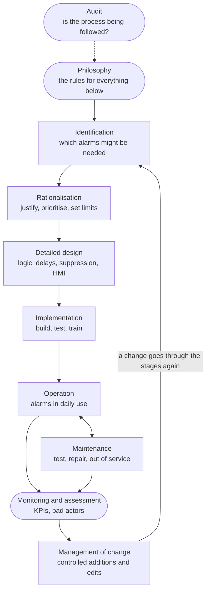
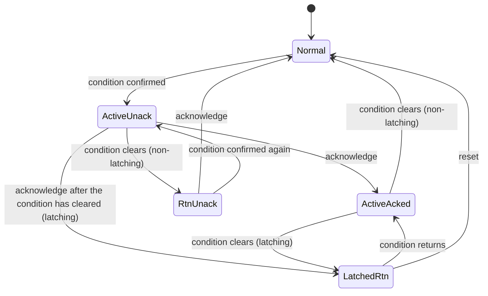
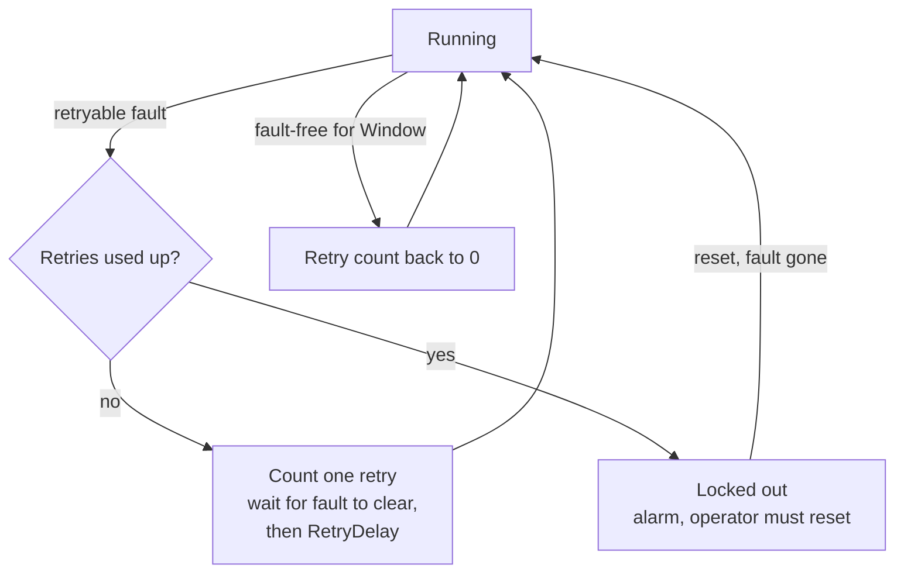

# 16 — Alarms, Diagnostics and Fault Handling

> **Level:** 4 — Advanced · **Time:** ~10–12 hours · **Prerequisites:** [Module 11](../11-program-organization/), [Module 14](../14-analog-and-process-io/)

A control system spends most of its life with nothing going wrong. What it does in the other
moments decides whether a disturbance stays a disturbance or becomes an incident. This module
is about those moments: how the PLC tells the operator that something needs attention
(**alarms**), how it finds out that its own hardware, wiring, instruments or network partners
have failed (**diagnostics**), and what it does about a fault (**fault handling**).

You already have the building blocks. [Module 14](../14-analog-and-process-io/) raised
HH/H/L/LL alarms with deadbands and delays and detected broken 4–20 mA loops.
[Module 11](../11-program-organization/) latched device faults and made resets safe. Here you
put them into a system: the alarm-management lifecycle of ISA-18.2 and EEMUA 191, alarm
states and acknowledgement, first-out annunciation, sequence-of-events recording, the
diagnostics that Siemens and Rockwell controllers provide, and the plausibility checks that
catch what no hardware diagnostic can see: a transmitter frozen at a believable value, two
transmitters that disagree, a network partner that has quietly stopped. You will build a
reusable alarm block, a first-out annunciator for a compressor shutdown panel, and
frozen-signal and heartbeat monitors.

On process plant this ties straight into documents you may already use. Alarm limits and
priorities come out of the HAZOP and are recorded in a master alarm database. Trips appear in
the cause-and-effect matrix. The loop drawing tells you whether a signal fails upscale or
downscale. This module shows how those decisions become PLC logic.

## Learning objectives

After this module you should be able to:

- Explain the difference between an alarm, an alert, an event, a message and a diagnostic,
  and apply the rule "no operator action, no alarm".
- Describe the ISA-18.2 / IEC 62682 alarm-management lifecycle, rationalise an alarm (cause,
  consequence, action, time to respond, priority), and calculate an alarm limit from the time
  the operator needs.
- Recognise chattering, fleeting and stale alarms and alarm floods, choose a remedy (deadband,
  delay, state-based suppression, shelving), and judge an alarm system against the ISA-18.2
  performance figures.
- Write an alarm function block with on-delay, latching, edge-triggered acknowledge and reset,
  and the states Normal, Unacknowledged, Acknowledged and Returned-to-normal-unacknowledged.
- Design a first-out annunciator and explain why scan time limits its resolution and when a
  sequence-of-events recorder is needed.
- Apply a fault-handling philosophy: fail-safe states, trip versus alarm, latched faults with
  resets that never restart equipment, degraded modes and limited automatic retries.
- Use controller and module diagnostics (Siemens diagnostic buffer and error OBs, Rockwell
  major and minor faults, GSV and fault routines), and write heartbeat, frozen-signal,
  deviation and discrepancy checks.

## 1. Alarms, events and messages

### 1.1 What makes something an alarm

ISA-18.2 defines an alarm as an audible and/or visible means of indicating to the operator an
equipment malfunction, process deviation or abnormal condition **requiring a timely
response** (the 2009 edition said "requiring a response"). Those last words are the whole of
alarm management in miniature. An alarm is a request for action. If there is no action for
the operator to take, it should not be an alarm.

Three consequences follow, and every good alarm system is built on them:

1. **Every alarm has a defined operator action.** "Tank T-101 level high" is an alarm if the
   operator is expected to stop the inflow. "Pump P-101 running" is not: nobody needs to do
   anything.
2. **Every alarm needs time.** The operator has to notice the alarm, work out what it means
   and act, and the action has to take effect before the consequence arrives. An alarm that
   leaves no time to respond is useless as an alarm; that job needs an automatic trip.
3. **Every alarm costs attention.** An operator can deal with only a limited number of alarms
   in a given time. Each unnecessary alarm makes the necessary ones harder to see.

### 1.2 Alarms, alerts, events, messages and diagnostics

A PLC and its HMI produce many kinds of notification. Keep them apart, because they go to
different places and need different handling:

| Kind | Needs a timely operator response? | Example | Where it usually goes |
|---|---|---|---|
| **Alarm** | Yes | LT-101 high: stop the feed within 15 min or the tank overflows | alarm banner and summary, horn, alarm log |
| **Alert** | Needs attention, but not the timely response an alarm requires | Filter DP high: plan a filter change this shift | a separate alert list, not the alarm banner |
| **Event** | No: a record of something that happened | P-101 started; mode changed to Auto; operator changed a setpoint | event log, historian, sequence-of-events record |
| **Message / prompt** | Only as part of a procedure | "Batch 1234: add catalyst, then press Continue" | operator dialogue on the HMI |
| **Diagnostic** | Usually for maintenance, not operations | card channel 3 wire break; PLC battery low | maintenance displays, diagnostic buffer; becomes an alarm only if operations must act |

The 2016 edition of ISA-18.2 defines an **alert** as a means of indicating a condition that
requires the operator's awareness but does not meet the criteria for an alarm. Whatever words
your site uses, the test is the same: *does the operator need to do something, soon?* Events
are not less important than alarms. They are the evidence you need afterwards to work out what
happened, which is why sequence-of-events recording (Section 4.7) exists.

### 1.3 Alarms, trips, interlocks and permissives

These words describe different jobs. Confusing them is a design error, not just a
terminology slip:

| Term | Who acts | What happens | Example |
|---|---|---|---|
| **Alarm** | the operator | the operator is told and decides what to do | LT-101 H: operator reduces the feed |
| **Pre-alarm** | the operator | an alarm set before a trip point, so the operator can prevent the trip | PT-202 H at 7 bar before the PSHH trip at 8 bar |
| **Trip** (shutdown) | the control or safety system, automatically | equipment goes to its safe state, usually latched until reset | PSHH-202 stops the compressor |
| **Interlock** | the control or safety system | stops or prevents an action while a condition exists | a valve cannot open while the downstream valve is closed |
| **Permissive** | the control system | a condition that must be true before an action is allowed | lube-oil pressure OK before a compressor may start |

A trip normally *also* raises an alarm, so the operator knows it happened and why. But the
alarm is not the protection: the trip is. Important trips belong in a safety instrumented
system designed to IEC 61511, with their own sensors ([Module 20](../20-functional-safety/)).
An operator responding to an alarm can be credited as a protection layer in a risk
assessment only under strict conditions (enough time, a clear procedure, training, and an
alarm independent of the failure it responds to). Module 20 covers this.

### 1.4 Why alarm systems fail

On 24 July 1994 a refinery at Milford Haven in Wales suffered an explosion after an
electrical storm had upset several units. The UK Health and Safety Executive's investigation
found that in the last eleven minutes before the explosion the two control-room operators had
to recognise, acknowledge and act on 275 alarms, about one every two to three seconds, and
that most alarms were displayed as high priority even when they were only informative.
Safety-critical alarms did not stand out, and the operators missed the information that
mattered. The investigation also found a control valve that had failed shut while the control
system showed it open: the kind of discrepancy that Section 5.9 teaches you to detect. The
incident is widely cited as one of the reasons EEMUA published its alarm-systems guide,
EEMUA 191, in 1999.

The pattern is common. Alarm systems rarely fail because a condition was not detected. They
fail because the one important alarm was buried among many unimportant ones:

- **Floods** after a trip: one cause, dozens of consequential alarms.
- **Chattering alarms** that come and go so often that operators stop looking.
- **Standing (stale) alarms** that have been active for weeks, so the banner is never clear.
- **Everything is high priority**, so priority means nothing.
- **Alarms with no action**: status messages configured as alarms because it was easy.

Much of the cure lies in the PLC. The PLC is where conditions are detected, delays and
deadbands are applied, and consequential alarms can be suppressed by design. Section 2
describes the management framework that decides what the PLC should do.

## 2. Alarm management: the ISA-18.2 lifecycle

### 2.1 The standards

| Document | What it is |
|---|---|
| **ANSI/ISA-18.2**, *Management of Alarm Systems for the Process Industries* | the US standard for alarm management: the lifecycle, the requirements, the performance figures. Supported by a series of ISA technical reports (TR18.2.x) with practical guidance |
| **IEC 62682**, *Management of alarm systems for the process industries* | the international standard, developed from the 2009 edition of ISA-18.2; the one to quote outside North America |
| **EEMUA 191**, *Alarm systems: a guide to design, management and procurement* | the UK Engineering Equipment and Materials Users' Association guide (first published 1999); practical and widely used, with benchmarks similar to ISA-18.2 |
| **ANSI/ISA-18.1**, *Annunciator Sequences and Specifications* | the older standard for hard-wired annunciator panels (Section 3.7). ISA-18.2 covers how annunciator panels fit into the alarm system, but leaves their design to ISA-18.1 |

ISA-18.2 and IEC 62682 are written for the process industries, but the ideas apply equally to
machines, water treatment and building services. On a packaging line the "operator" might be
a line technician looking at an HMI message list. The rules are the same.

### 2.2 The lifecycle

ISA-18.2 treats the alarm system as something that is designed, used, measured and improved
continuously, not configured once and forgotten. A simplified view of its lifecycle:



| Stage | Main questions | Typical outputs |
|---|---|---|
| **Philosophy** | What is an alarm here? How are priorities chosen? Who may shelve? What are the targets? | alarm philosophy document |
| **Identification** | Which conditions might need an alarm? | candidate list from the HAZOP, LOPA, P&IDs, procedures, incident reports, environmental permits |
| **Rationalisation** | Is each candidate a real alarm? What are its cause, consequence, action, time to respond, priority, limit? | master alarm database |
| **Detailed design** | How is it implemented: limit, deadband, delays, state-based suppression, HMI display? | PLC and HMI specifications |
| **Implementation** | Is it built as designed? Are operators trained? | tested configuration, training records |
| **Operation** | Shelving, response procedures, handling floods | alarm response manual, shelving log |
| **Maintenance** | Testing, repair, taking alarms out of service safely | test records, out-of-service log |
| **Monitoring and assessment** | Is it working? Which alarms are "bad actors"? | KPI reports |
| **Management of change** | Is every change to an alarm reviewed and recorded? | MOC records |
| **Audit** | Is the whole process being followed? | audit report, action plan |

An approved change is not a quick edit: it goes back through identification, rationalisation,
design and implementation like a new alarm. The standard also describes three loops that
keep the system healthy: monitoring and maintenance (problem alarms get repaired), monitoring
and management of change (an alarm whose design is wrong gets redesigned), and audit and
philosophy (the process itself gets improved).

ISA-18.2 names three entry points to the lifecycle (the rounded boxes): the philosophy,
monitoring and assessment, and audit. A new plant starts at the philosophy; an existing plant
with a noisy alarm system usually starts at monitoring (measure how bad it is) or with an
audit, fixes the worst offenders, and writes the philosophy along the way.

### 2.3 The alarm philosophy

The philosophy is the rule book, and it comes first because every later decision refers to
it. Typical contents:

- the definition of an alarm and the criteria a candidate must meet;
- priority levels, how priority is chosen (Section 2.5), and the target distribution;
- alarm classes, for example safety-related, environmental, commercial, with any extra
  requirements for testing, change control or shelving;
- rules for limits, deadbands and delays (Section 2.7) and for state-based alarming;
- shelving, suppression and out-of-service rules: who, how long, how recorded (Section 2.8);
- HMI presentation: colours, symbols, sounds, the alarm banner and summary (see
  [Module 18](../18-hmi-and-scada/));
- acknowledgement rules, including whether returned-to-normal alarms need acknowledging;
- performance targets and how they are measured (Section 2.10);
- roles and responsibilities, training, and management of change.

A philosophy that says "we follow ISA-18.2" is not a philosophy. It must make the site's
own decisions, so that two engineers rationalising alarms a year apart reach the same answer.

### 2.4 Identification and rationalisation

**Identification** produces candidates. A HAZOP row that says "high level in T-101: overflow
to bund; safeguard: LAH-101 and operator response" creates a candidate alarm. So does a
procedure step that says "if the vibration exceeds 7 mm/s, reduce load".

**Rationalisation** is a structured review, usually in a team with an operator, a process
engineer and a control engineer, that asks the same questions of every candidate:

1. What is the **cause**? What in the process makes the condition occur?
2. What is the **consequence** if the operator does nothing?
3. What is the **operator action**? If there is none, it is not an alarm.
4. How much **time** is there between the alarm and the consequence, and how much does the
   operator need? (Section 2.6)
5. What **priority** follows from the consequence and the time? (Section 2.5)
6. What **limit**, **deadband** and **delays**?
7. Is it valid in every operating state, or should it be **suppressed** in some?
8. Is it a duplicate? (A high alarm on each of three transmitters measuring the same level is
   usually one alarm too many, or two.)

The answers go into the **master alarm database**: one record per alarm, the single source of
truth that the PLC and HMI configuration must match. A record for the tank in the next
section might look like this:

| Field | Entry |
|---|---|
| Alarm | LT-101 PVHI, "T-101 level high" |
| Cause | inflow exceeds outflow: transfer pump P-102 stopped, outlet valve XV-103 closed, or level control failed |
| Consequence of no action | T-101 overflows at 9.5 m into the bund: environmental release, clean-up |
| Operator action | check P-102 and XV-103; stop the feed pump P-101 or divert the feed |
| Time available | 18 min from the alarm to overflow at maximum inflow (Section 2.6) |
| Priority | Medium (major consequence, 10–30 min available; site matrix in Section 2.5) |
| Class | environmental |
| Limit, deadband, on-delay | 8.6 m; 0.3 m; 10 s |
| Suppression | none: valid in every operating state |
| Related protection | LSHH-104 (independent switch, 9.2 m) trips P-101 through the safety system. That is a trip, not an alarm |

Rationalisation is where most bad alarms die. It is common for a rationalisation of an
existing plant to remove or demote a large share of the configured alarms, because they had
no action, duplicated another alarm or were really events.

### 2.5 Priorities

Priority tells the operator which alarm to deal with first when several are active. It is
decided from two things: **how bad the consequence is** and **how soon the operator must
act**. The philosophy defines both scales and a matrix. An example (every site sets its own):

| Consequence if the operator does not act | more than 30 min | 10–30 min | 3–10 min | less than 3 min |
|---|---|---|---|---|
| **Minor** (small loss, no injury, no release) | consider an alert instead | Low | Low | Medium |
| **Major** (equipment damage, reportable release, possible injury) | Low | Medium | Medium | High |
| **Severe** (serious injury, major release) | Medium | High | High | High, and ask whether an alarm is enough |

The last column is a warning. If there are only two minutes, even a perfect operator may not
make it, and the protection should be automatic.

Use **three or four priority levels**, not ten. ISA-18.2's example distribution for the alarms
actually annunciated is roughly 80 % low, 15 % medium and 5 % high priority (with a fourth,
"highest" level, under 1 %). If half your alarms are high priority, the priorities have not
been rationalised.

### 2.6 Setting the limit: working back from the time to respond

An alarm limit is not "a round number below the trip". It is placed so that the operator has
enough time to act. The timeline:

```text
 The level rises at the worst-case rate. The time available must hold the operator's
 response, the time for the action to work, and a margin (not to scale):

 normal max 8.0 m       alarm 8.6 m                                    overflow 9.5 m
    +-------------------+-----------------------------------------------------------+---> level
                        |<----------------- time available 18 min ----------------->|
                        |<- operator 10 min ->|<- action 2 min ->|<- margin 6 min ->|
                          notice, diagnose,     pump stops,
                          decide, act           valve closes
```

**Worked example.** Tank T-101 has a plan area of 20 m² and overflows at 9.5 m. The maximum
inflow, with the outlet stopped, is 60 m³/h. Normal operation never exceeds 8.0 m.

- Worst-case rise rate: 60 m³/h ÷ 20 m² = 3 m/h = **0.05 m/min**.
- Operator response (notice, diagnose, act), taken from the site's operator study: 10 min.
  Time for the action to take effect (stop the pump, let the valve close): 2 min. Total
  12 min.
- The philosophy requires a 50 % margin: 12 × 1.5 = **18 min**.
- Level margin: 0.05 m/min × 18 min = **0.9 m**, so the limit is 9.5 − 0.9 = **8.6 m**.
- Check against normal operation: 8.6 m is 0.6 m above the highest normal level, so waves
  and normal filling do not raise it.
- Check against the trip: the independent high-high switch trips the feed at 9.2 m. From the
  alarm at 8.6 m to the trip is 0.6 m ÷ 0.05 m/min = 12 min, so an operator who responds in
  the normal time prevents the trip.

If the calculation had given a limit *inside* the normal operating range, the alarm could not
be both early enough and quiet enough. That is a design problem to solve (a lower maximum
inflow, a rate-of-change alarm, an automatic action), not a number to fudge.

### 2.7 Nuisance alarms: chattering, fleeting, stale and floods

| Problem | What it is | Common threshold used to find it | Usual cures |
|---|---|---|---|
| **Chattering** | an alarm that repeatedly goes in and out of alarm | three or more times in one minute | deadband, on-delay and off-delay ([Module 14](../14-analog-and-process-io/)); fix the noisy instrument |
| **Fleeting** | an alarm that appears and clears within seconds, with no operator action | seconds | on-delay; ask whether it is really an event |
| **Stale** (standing) | an alarm that stays active for a long time | active for more than 24 hours | state-based suppression; re-rationalise; out-of-service procedure for equipment that is shut down |
| **Flood** | more alarms than an operator can handle | more than 10 in 10 minutes per operator (ISA-18.2's example; the flood ends when the rate falls below about 5 in 10 minutes) | state-based suppression, first-out, rationalisation; flood suppression in the alarm system |
| **Duplicate** | several alarms for one condition | review | keep the one that names the cause |

**Deadband and delay starting values.** Alarm-management guidance commonly quotes starting
deadbands of about 5 % of span for flow and level, 2 % for pressure and 1 % for temperature,
with on- and off-delays of a few seconds to about a minute depending on how fast the
measurement moves. Treat these as a first guess. Look at a trend of the real signal and set
the deadband a little wider than its noise, and the on-delay a little longer than its normal
spikes, then check that the delay still leaves the time calculated in Section 2.6.

**Off-delays** (the alarm clears only after the condition has been gone for a time) cure
chattering, but keep an alarm on after the process has recovered. **On-delays** cure fleeting
alarms but make every real alarm late by the delay. Both are tools, not defaults.

### 2.8 Shelving, suppression and out of service

There are three legitimate ways to stop an alarm from reaching the operator. They differ in
who decides, for how long and how it is controlled:

| | **Shelving** | **Suppression by design** | **Out of service** |
|---|---|---|---|
| Who | the operator, from the HMI | the control logic, automatically | maintenance, under a permit or work order |
| Why | a nuisance alarm (chattering on a failing transmitter) while a fix is arranged | the alarm is not meaningful in the current plant state | the instrument or equipment is being worked on |
| How long | limited: for example to the end of the shift, then it returns automatically | while the state lasts | until the work is finished and the alarm tested |
| Controls | access rights, a reason, logged, visible in a "shelved alarms" list | designed, reviewed in rationalisation, documented | management of change or permit; interim measures if it protects anything important |

What is **not** legitimate: disabling alarms in the HMI configuration because they are
annoying, forcing a PLC bit so an alarm never comes, or raising a limit until the alarm stops
without a review. These are the "unauthorised suppressions" that ISA-18.2 expects to be zero.

A shelved or suppressed alarm still exists: the condition is still evaluated and usually
still logged. The HMI should show at a glance how many alarms are shelved or suppressed, so a
new shift knows what it is not being told.

### 2.9 Suppression by design: state-based alarming

Many alarms are only meaningful in some plant states. A low discharge-pressure alarm on a
stopped pump is not information, it is noise, and when the pump trips it becomes one of a
flood of consequential alarms that hide the trip itself. **State-based alarming** (also
called mode-based alarming or conditional suppression) makes an alarm active only in the
states where it means something:

| Alarm | Meaningful when | Suppress when |
|---|---|---|
| P-101 discharge flow low | P-101 running and settled | P-101 stopped, or started less than 20 s ago |
| Reactor temperature low | reactor in production | during heat-up, shutdown, cleaning |
| Compressor suction pressure low | compressor running | compressor stopped (a trip alarm already covers why) |
| Tank level low | tank in service | tank isolated for maintenance |

The simplest PLC implementation gates the alarm condition with the state, using `FB_Alarm`
from Lab 16-1:

```iecst
PROGRAM P101Alarms
  VAR (* I/O *)
    P101_RunFb AT %IX0.0 : BOOL;   (* P-101 contactor auxiliary contact *)
    AckPB      AT %IX0.1 : BOOL;   (* alarm acknowledge *)
    ResetPB    AT %IX0.2 : BOOL;   (* alarm reset *)
  END_VAR
  VAR
    FT101        : REAL;           (* discharge flow, m3/h (from FB_AnalogInput) *)
    PT101        : REAL;           (* discharge pressure, bar *)
    P101_Tripped : BOOL;           (* latched trip from the pump's device FB *)
    Settled      : TON;            (* the pump has run long enough to make flow *)
    InService    : BOOL;           (* flow and pressure alarms are meaningful *)
    TripAlm      : FB_Alarm;
    LowFlowAlm   : FB_Alarm;
    LowPressAlm  : FB_Alarm;
  END_VAR

  (* The trip is the alarm the operator needs: it names the cause. *)
  TripAlm(Condition := P101_Tripped, OnDelay := T#0s, Latching := TRUE,
          Ack := AckPB, Reset := ResetPB);

  (* Low flow and low pressure are CONSEQUENCES of a stopped pump. They
     only mean something once the pump has been running for 20 s. *)
  Settled(IN := P101_RunFb, PT := T#20s);
  InService := Settled.Q;

  LowFlowAlm(Condition := InService AND (FT101 < 5.0), OnDelay := T#10s,
             Latching := FALSE, Ack := AckPB, Reset := ResetPB);
  LowPressAlm(Condition := InService AND (PT101 < 2.0), OnDelay := T#5s,
              Latching := FALSE, Ack := AckPB, Reset := ResetPB);
END_PROGRAM
```

When P-101 trips, the operator gets one alarm, the trip, instead of three. Two rules keep
suppression honest:

- **Never suppress the alarm that names the cause.** Here the pump's own failure-to-start and
  trip alarms stay active in every state. If the pump is commanded to run but never starts,
  `InService` stays FALSE and the low-flow alarm never comes, so something else *must* alarm:
  the device FB's feedback-timeout fault ([Module 11](../11-program-organization/)).
- **Review suppression logic like any other alarm design.** A suppression condition that is
  wrong can hide exactly the alarm you needed.

Gating the condition is the usual approach inside a PLC. Alarm servers in SCADA and DCS
systems offer a proper *suppressed* state, so that the alarm is still evaluated, logged and
counted, and the HMI can show that it is suppressed. Either way, document the suppression in
the master alarm database.

### 2.10 Monitoring: alarm-system KPIs

You cannot improve what you do not measure. ISA-18.2 gives target figures for an alarm system,
per operator console, based on at least 30 days of data:

| Metric | ISA-18.2 guidance (approximate) |
|---|---|
| Annunciated alarms per hour (average) | about 6 very likely acceptable; about 12 maximum manageable |
| Annunciated alarms per 10 minutes (average) | about 1 very likely acceptable; about 2 maximum manageable |
| Annunciated alarms per day | about 150 and about 300: the same rates over 24 hours (the 2009 edition listed these per-day figures; the 2016 edition gives only the hourly and 10-minute ones) |
| 10-minute periods containing more than 10 alarms | less than about 1 % |
| Maximum number of alarms in any 10 minutes | 10 or fewer |
| Time the alarm system spends in a flood | less than about 1 % |
| Share of all alarms from the 10 most frequent alarms | about 1 % to 5 % at most |
| Chattering and fleeting alarms | zero, with action plans for any found |
| Stale alarms (active more than 24 h) | fewer than 5 on any day |
| Priority distribution of annunciated alarms (3 levels) | about 80 % low, 15 % medium, 5 % high |
| Unauthorised suppression or changes of alarm settings | zero |

These figures describe what an operator can realistically handle. They are guidance, not a
certificate: a plant can meet every one and still have a badly designed alarm, and a plant
in an upset will exceed them for a while.

The single most effective analysis is the **bad-actor list**: sort a month of alarm history
by count per alarm. On most unimproved systems a handful of alarms produce a large share of
the load. Fix those first. Worked example 3 walks through one. The `Count` output of Lab 16-1
exists for exactly this: Rockwell's `ALMD` instruction keeps a similar alarm count.

### 2.11 The operator's side

An alarm is only half of a loop. The other half is a person who must:

1. **Detect** the alarm: hear the horn, see the banner. A calm, grey high-performance HMI
   ([Module 18](../18-hmi-and-scada/)) makes new alarms stand out.
2. **Diagnose**: understand what it means. A clear alarm text that names the equipment and
   the condition ("P-101 discharge flow low" rather than "FAL101"), the alarm's priority, and
   a link to the relevant display help.
3. **Respond**: take the action, and check that it worked.

Support each step:

- An **alarm response procedure** (or alarm response manual) for each alarm: probable causes,
  what to check, what to do, the consequence of doing nothing, the time available. It comes
  straight from the rationalisation record.
- **Training** on the important alarms, including simulated upsets.
- **Acknowledgement** means "I have seen this", not "this is fixed". The alarm stays active
  until the condition clears.

A useful self-test for any new alarm: *if this sounds at 3 a.m., will the night-shift
operator know what it means and what to do, without phoning anyone?*

## 3. Alarm states and acknowledgement

### 3.1 Two questions: is it active, and has anyone seen it?

An alarm has two independent properties:

- **Active or not:** is the alarm condition present (after its on-delay)?
- **Acknowledged or not:** has the operator acknowledged the latest activation?

Two yes/no questions give four combinations, and each has a name:

| Active? | Acknowledged? | State | Typical HMI presentation |
|---|---|---|---|
| no | yes | **Normal** | nothing |
| yes | no | **Unacknowledged alarm** | flashing, horn sounding |
| yes | yes | **Acknowledged alarm** | steady, horn silent |
| no | no | **Returned to normal, unacknowledged** (RTN unack) | flashing (or a distinct colour) until acknowledged; whether the horn keeps sounding depends on the system |

A **latching** alarm adds one more state: acknowledged, the condition has gone, but the alarm
stays active until someone resets it. Lab 16-1 calls it `LatchedRtn`.



ISA-18.2's alarm state-transition diagram has the first four states (normal, unacknowledged,
acknowledged, returned to normal unacknowledged) plus shelved, suppressed-by-design and
out-of-service. It treats latching as an option of the alarm: a latching alarm stays in alarm
after the process has returned to normal until an operator **resets** it. It also notes that
the step from "returned to normal, unacknowledged" to normal can require an acknowledgement or
happen automatically (Section 3.2). The names differ between vendors and standards, but the
two underlying questions never change. Keep them as **two separate
memories** in your code, `Active` and `Unacked`, and derive any state number or colour from
them. Code that tries to hold one "state" variable and update it in many places is where
alarm bugs live.

### 3.2 Why keep "returned to normal, unacknowledged"?

Suppose a compressor's discharge temperature spikes over its limit for 30 seconds while the
operator is on the phone, and then recovers. If the alarm simply disappeared when the
condition cleared, the operator would never know it had happened, and would miss the early
sign of a fouled cooler. Keeping it visible until acknowledged means that nothing that
happened goes unseen.

Some philosophies allow an alarm to be configured so that it does not need acknowledging once
it has returned to normal (the event log still records it). Rockwell's `ALMD` has an
"acknowledge required" setting for this reason. Make it a deliberate, documented choice per
alarm class, not a default.

### 3.3 Latched alarms

A **latched** alarm stays active after its condition clears, until an operator resets it.
Use it where the event matters more than the current state:

- **Trips and shutdowns**: the trip itself is latched, and so is its alarm, so the cause is
  still on show after the process has settled.
- **Transient conditions that must be investigated**: a momentary loss of seal-water flow, a
  pressure spike that lifted a relief valve, a vibration excursion.
- **First-out indications** (Section 3.8).

Don't latch ordinary process alarms: a latched "level high" that stays on after the level is
back to normal is a stale alarm in the making.

Decide, too, what happens when the condition comes back while the alarm is still latched and
already acknowledged. Lab 16-1 treats it as the same occurrence: the alarm is still on show,
the operator has seen it, and nothing new is counted. Some systems re-annunciate it as a new
alarm instead. Both are defensible; the philosophy should say which one the site uses.

### 3.4 Silence, acknowledge and reset

Three different operator commands, easily confused:

| Command | What it does | What it does not do |
|---|---|---|
| **Silence** | stops the horn | on some systems, nothing else: lamps keep flashing until acknowledged |
| **Acknowledge** | records that the operator has seen the alarm: flashing becomes steady, the horn stops | does not clear the alarm, and does not touch the cause |
| **Reset** | clears a latched alarm or a latched trip whose cause has gone | never starts equipment (Section 4.3); does nothing while the cause is still present |

Two implementation rules apply to all three:

- **Act on the edge**, the moment the button is pressed. With a level-sensitive acknowledge, a
  jammed button or a stuck HMI bit acknowledges every new alarm as it arrives, silently. With
  an edge, a jammed button acknowledges once and then nothing more.
- **Acknowledge only what existed before the press.** If the acknowledge edge and a new
  activation happen in the same scan, the new alarm must stay unacknowledged. In code, process
  the acknowledge *before* the activation (Lab 16-1 shows the order).

### 3.5 Where do the alarm states live?

There are two common designs ([Module 18](../18-hmi-and-scada/) discusses the HMI side):

- **The PLC detects, the SCADA manages.** The PLC produces clean alarm *conditions* (with
  limits, deadbands, delays and suppression), and the SCADA or DCS alarm server keeps the
  states, the acknowledgement, the time stamps and the history. This is normal on process
  plant with a proper alarm server.
- **The PLC manages the states.** Needed when the PLC drives the horn and lamps directly
  (annunciator panels, first-out, machines without SCADA), when several HMIs must share one
  acknowledgement, or when a latch must survive an HMI restart. The PLC then runs an alarm
  block like Lab 16-1's for every alarm, and acknowledge and reset become HMI *commands*,
  sent with the handshake from Module 18 so that a lost write cannot lose an acknowledgement.

Mixed designs cause trouble: if both the PLC and the SCADA latch and acknowledge the same
alarm, the operator acknowledges it twice, or the two disagree about its state.

### 3.6 Alarm states as a timing diagram

A non-latching alarm with a 3 s on-delay, as `TempAlm` in Lab 16-1 (one character = 1 s;
`#` = TRUE; states N = Normal, U = ActiveUnack, A = ActiveAcked, R = RtnUnack):

```text
t (s)        0    5    10   15   20
             |    |    |    |    |
Condition    _#__#######__#####_____
Confirmed    _______####_____##_____    TON: 3 s delay; the 1 s blip at t=1 never counts
AckPB        _________#__________#__
Active       _______####_____##_____
Unacked      _______##_______####___
Horn         _______##_______####___
State        NNNNNNNUUAANNNNNUURRNNN
```

- t = 1: the condition flickers for one second, shorter than the on-delay. Nothing happens.
- t = 7: the condition has lasted 3 s: the alarm activates, unacknowledged, and the horn sounds.
- t = 9: acknowledged. The alarm stays active (steady) while the condition lasts.
- t = 11: the condition clears. The alarm was acknowledged, so it goes straight to Normal.
- t = 16: a new activation. The operator must acknowledge again.
- t = 18: the condition clears *before* anyone acknowledged it: Returned to normal,
  unacknowledged. The horn keeps sounding until the acknowledge at t = 20.

A latching alarm with a 1 s on-delay, as `VibAlm` (L = LatchedRtn):

```text
t (s)        0    5    10
             |    |    |
Condition    __####_________
Active       ___########____
AckPB        ________#______
ResetPB      _____#_____#___
Unacked      ___#####_______
State        NNNUUUUULLLNNNN
```

The reset at t = 5 does nothing: the alarm is unacknowledged and its condition is still
present. After the condition clears at t = 6 the alarm stays active and unacknowledged. The
acknowledge at t = 8 moves it to `LatchedRtn`, and the reset at t = 11 returns it to Normal.

### 3.7 Annunciators and ISA-18.1 sequences

Before HMIs, and still today on many compressor, turbine and utility panels, alarms were
shown on an **annunciator**: a panel of back-lit windows, each engraved with an alarm
("LUBE OIL PRESS LOW"), with a horn and push-buttons for acknowledge (or silence), reset and
lamp test. Stand-alone annunciators are still chosen where alarms must work independently of
the control system, and PLCs often drive annunciator-style lamp panels.

**ANSI/ISA-18.1**, *Annunciator Sequences and Specifications*, standardises how the windows
and horn behave. It names sequences with letter codes. The three basic families are:

- **A — automatic reset.** New alarm: the window flashes and the horn sounds. Acknowledge:
  the window goes steady and the horn stops. When the condition returns to normal the window
  goes off by itself.
- **M — manual reset.** As A, but after the condition has returned to normal the window stays
  lit until the operator presses reset.
- **R — ringback.** As M, but the return to normal is itself announced with a distinctive
  flash and sound, telling the operator that the window can now be reset.

First-out sequences, whose codes begin with F (for example F3A), add a distinct indication
for the first alarm in a group (next section). Real annunciators offer many variants of each
sequence (flash rates, separate silence, whether acknowledge is needed before reset), and the
panel's data sheet names the sequence it uses. When a PLC replaces an old annunciator, match
the sequence the operators know, or train them on the new one.

The **lamp test** button lights every window while it is held. It proves that the lamps work,
so a dark window really means "no alarm". Every lamp panel needs one; on an HMI the
equivalent is a regular check that the alarm display and horn work.

### 3.8 First-out (first-up) annunciation

When a compressor trips, many shutdown inputs go into alarm within a second or two. The motor
protection relay trips, the machine runs down, lube-oil pressure falls, the discharge
temperature and vibration spike during the run-down. By the time the operator looks, six
windows are lit. Which one **caused** the trip, and which are consequences?

A **first-out** annunciator answers that. It watches a group of trip inputs, and the first
input to trip gets a different indication (typically it keeps flashing, or flashes in a
different way) from the ones that follow (subsequent alarms). The operator, and the engineer
investigating later, can see the initiating cause at a glance.

```text
Compressor K-401 trips on a motor fault.

Time        Input               First-out logic                      Window
12:04:31.2  XA-408 motor relay  panel armed (nothing latched) ->     FIRST-OUT: flashes until reset
                                latched, marked first-out
12:04:31.6  VSHH-405 vibration  panel not armed -> subsequent        flashes until acknowledged,
                                                                     then steady
12:04:33.1  PSLL-404 lube oil   panel not armed -> subsequent        flashes until acknowledged,
                                                                     then steady
```

The logic is simple, but three details decide whether it is right:

1. **Decide "armed" once per scan, before latching.** The panel is armed when no channel is
   latched at the start of the scan. If the program instead loops over the channels and
   disarms the panel as soon as it latches the first one, then of two inputs that trip in the
   same scan the lower-numbered one always "wins". That is a bias built into the code, not a
   measurement.
2. **Simultaneous means "within one scan".** Inputs are read once per scan, so the PLC cannot
   order two events that happen within one scan time (plus the input filter time) of each
   other. The honest answer is to mark them all as first-out. If the true order inside one
   scan matters, you need time-stamped inputs (Section 4.7).
3. **The first-out mark stays with its channel until that channel is reset.** It never moves
   to another channel, and the panel re-arms only when every channel has been reset.

Lab 16-2 builds this panel for eight compressor trip inputs.

## 4. Fault handling philosophy

### 4.1 Fail-safe states

Every piece of equipment has a **safe state**: the state it should go to when something is
wrong and the control system cannot be trusted to do anything cleverer. It is a process
decision, recorded in the design (the P&ID shows valve fail positions as FC, FO or FL), and
the PLC design must honour it:

| Equipment | Usual safe state | How it is reached without the PLC |
|---|---|---|
| Fuel or feed valve | closed | spring-return actuator, air-to-open (fail closed) |
| Cooling-water valve | open | air-to-close (fail open) |
| Pump or motor | stopped | contactor coil de-energised |
| Heater | off | contactor de-energised; independent over-temperature cut-out |
| Vent or depressurising valve | open | fail open |
| Conveyor brake | applied | spring-applied, released by power |

The principle is **de-energise to trip**: the safe state needs *no* energy, so loss of power,
a broken wire, a failed output card or a stopped CPU all lead to it. That is why stop buttons,
trip inputs and permissives are wired normally-closed and why the course names them `_NC`
([Module 02](../02-electrical-and-field-devices/)).

Three PLC-side questions follow from it:

- **What do the outputs do when the CPU stops?** Most digital output cards switch off, but
  many can be configured to hold their last state, and analog outputs have several options
  ([Module 14](../14-analog-and-process-io/)). Configure this deliberately, per card, to match
  the safe states.
- **What happens at power-up?** Latched trips should normally come back latched (or the
  program should start in a safe state and require a deliberate start), so that a power
  cut does not reset a trip. Retentive memory ([Module 11](../11-program-organization/))
  and the first-scan logic decide this.
- **Is the safe state always safe?** Not every trip is harmless. Stopping a cooling pump on
  an exothermic reactor can be worse than keeping it running. These cases need a process
  hazard analysis, not a programmer's guess.

### 4.2 Trip or alarm?

When a condition goes wrong, the designer chooses between telling the operator (alarm) and
acting automatically (trip). Roughly:

- **Alarm** when the operator has time to act (Section 2.6), the right action depends on
  judgement, and the consequence of a slow response is tolerable.
- **Trip** when there is not enough time for a person, the consequence is severe, or the
  correct action is always the same.
- **Both, staged**, for most important variables: a pre-alarm (H) gives the operator a chance
  to correct the process; if that fails, the trip (HH) acts. The alarm reduces how often the
  trip is needed; the trip protects when the alarm is not enough.

A spurious trip is not free: it costs production, and restarts are themselves risky moments.
That is why trip inputs often use voting (2oo3) and validated signals, and why a trip on a
bad-quality signal is a deliberate design choice ([Module 14](../14-analog-and-process-io/)).

### 4.3 Latching faults and resetting them safely

The rules from [Module 06](../06-edges-and-one-shots/) and
[Module 11](../11-program-organization/), gathered in one place:

1. **Latch the fault.** A fault that clears itself leaves no evidence. Latch it and show it.
2. **The cause wins over the reset.** While the cause is present, reset does nothing, not
   even for one scan.
3. **Reset on the edge.** A jammed reset button resets once, not forever.
4. **Reset never restarts equipment.** Clearing a trip makes a restart *possible*. Starting
   needs a separate, deliberate start command. Machinery standards require this for safety
   functions (for example, resetting an emergency stop must not by itself restart the
   machine), and good practice applies it everywhere.
5. **Know the reset scope.** A panel reset button may reset one machine or a whole area.
   Safety-function resets stay separate and follow the safety design
   ([Module 20](../20-functional-safety/)).

All five in one small program: a boiler feed pump with an overload relay and a motor-winding
thermistor relay.

```iecst
PROGRAM FeedPump
  VAR (* I/O *)
    StartPB     AT %IX0.0 : BOOL;   (* Start push-button, NO *)
    StopPB_NC   AT %IX0.1 : BOOL;   (* Stop push-button, NC *)
    ResetPB     AT %IX0.2 : BOOL;   (* Trip reset push-button, NO *)
    MotorOL_NC  AT %IX0.3 : BOOL;   (* motor overload relay, NC: TRUE = healthy *)
    WindingOK_NC AT %IX0.4 : BOOL;  (* thermistor relay, NC: TRUE = winding temperature OK *)
    PumpRun     AT %QX0.0 : BOOL;   (* pump contactor *)
    TripLamp    AT %QX0.1 : BOOL;   (* "pump tripped" lamp *)
  END_VAR
  VAR
    StartEdge : R_TRIG;
    ResetEdge : R_TRIG;
    Tripped   : BOOL;               (* latched trip, cleared only by a reset *)
  END_VAR

  StartEdge(CLK := StartPB);
  ResetEdge(CLK := ResetPB);

  (* 1. The trip latch. The cause is tested first, so it always wins:
        a reset pressed while the cause is still there does nothing. *)
  IF (NOT MotorOL_NC) OR (NOT WindingOK_NC) THEN
    Tripped := TRUE;
  ELSIF ResetEdge.Q THEN
    Tripped := FALSE;
  END_IF;

  (* 2. The run circuit. The trip breaks the seal-in, so after a reset
        the pump stays off until someone presses Start again. Start acts
        on its edge, so a jammed Start button cannot restart it either. *)
  PumpRun := (StartEdge.Q OR PumpRun) AND StopPB_NC AND NOT Tripped;
  TripLamp := Tripped;
END_PROGRAM
```

Scan by scan, starting with the pump running:

| Scan | What happens | `Tripped` | `PumpRun` |
|---|---|---|---|
| 1 | the overload relay trips (`MotorOL_NC` FALSE) | TRUE | FALSE: the seal-in is broken |
| 2 | the operator presses Reset at once | TRUE: the cause is still present | FALSE |
| 3 … | the overload relay cools down and resets itself | TRUE: nothing resets it but a reset press | FALSE |
| n | Reset pressed | FALSE | FALSE: reset does not start |
| n + 1 | Start pressed | FALSE | TRUE |

If the Start button were jammed in, `StartEdge.Q` would have been TRUE only on the scan it
was first pressed, long ago, so the pump would still not restart on the reset. With a
level-sensitive `StartPB` in the seal-in it would have restarted the moment the trip cleared.

One nuance, also noted in Module 11: if the *program* is still requesting a device in Auto
(a level controller that wants a pump), clearing the fault lets the automatic logic start it
again. That can be correct, but it is a plant-philosophy decision. Document it, and make sure
the operator knows that resetting in Auto means "allow the automatic control to restart it".

### 4.4 Degraded modes

Not every fault should stop everything. A **degraded mode** keeps the plant running with
reduced function, reduced redundancy or reduced performance while a fault is repaired:

| Fault | Degraded mode | What must go with it |
|---|---|---|
| One of two redundant transmitters fails | control on the healthy one | alarm; if it serves a trip, the voting changes (for example 2oo2 to 1oo1) as the safety design specifies, with a time limit |
| Duty pump fails | standby pump takes over ([Module 06](../06-edges-and-one-shots/)) | alarm; no standby available any more |
| Link to the central SCADA lost | local HMI or local automatic control continues on the last good setpoints | alarm at both ends; limits on what may run unattended |
| A remote I/O station lost | units fed from that station go to their safe state, the rest continue | alarm; defined and tested boundaries |
| Analyser fails | control switches to a calculated or lab-entered value | alarm; the operator is told the value is not measured |

Degraded modes must be **designed, not improvised**: which faults allow which mode, what is
automatically switched, what the operator must do, and how long the plant may stay there. On
a safety function, running degraded is a formal decision with compensating measures under
the safety management system, not a PLC setting.

### 4.5 Automatic retries

Some faults are expected to be transient: a supply dip trips an undervoltage relay, a
network connection drops for a second, a remote well pump loses power in a storm. Calling a
person out each time is expensive, so the program may retry automatically. The rules:

- **Only retry faults that are safe to retry.** Never a safety trip, an overload, an earth
  fault, a high-high level or anything that needs a person to look first.
- **Limit the number** of retries, and **lock out** when they are used up, so that a real
  fault does not cause endless restarts (and burn out a motor with repeated starts).
- **Wait** before each retry, and let a long enough fault-free run earn the retries back.
- **Alarm** on the lock-out and **log** every retry as an event.



```iecst
FUNCTION_BLOCK FB_AutoRetry
  (* Automatic restart after a RETRYABLE fault (for example a supply dip
     that tripped an undervoltage relay), with a limit. Never use this for
     a safety trip, an overload or anything that needs a person to look. *)
  VAR_INPUT
    Demand      : BOOL;   (* the process wants the device running *)
    Fault       : BOOL;   (* the retryable fault is present *)
    RetryDelay  : TIME;   (* wait after the fault clears before restarting *)
    MaxRetries  : INT;    (* automatic restarts allowed ... *)
    Window      : TIME;   (* ... until the device has run fault-free this long *)
    ResetLockout : BOOL;  (* operator reset after a lock-out: rising edge *)
  END_VAR
  VAR_OUTPUT
    RunCmd      : BOOL;   (* run command to the device *)
    Retries     : INT;    (* automatic restarts used so far *)
    LockedOut   : BOOL;   (* retries used up: an operator must reset *)
  END_VAR
  VAR
    FaultEdge   : R_TRIG;
    ResetEdge   : R_TRIG;
    Waiting     : BOOL;   (* a retry is pending *)
    DelayTimer  : TON;
    GoodRun     : TON;
  END_VAR

  FaultEdge(CLK := Fault);
  ResetEdge(CLK := ResetLockout);

  IF FaultEdge.Q THEN
    IF Retries >= MaxRetries THEN
      LockedOut := TRUE;            (* too many: stop trying, call a person *)
      Waiting := FALSE;
    ELSE
      Retries := Retries + 1;
      Waiting := TRUE;
    END_IF;
  END_IF;

  (* The delay runs only once the fault has cleared. *)
  DelayTimer(IN := Waiting AND NOT Fault, PT := RetryDelay);
  IF DelayTimer.Q THEN
    Waiting := FALSE;
  END_IF;

  (* A long enough fault-free run earns the retries back. *)
  GoodRun(IN := RunCmd AND NOT Fault, PT := Window);
  IF GoodRun.Q THEN
    Retries := 0;
  END_IF;

  IF ResetEdge.Q AND NOT Fault THEN
    LockedOut := FALSE;
    Retries := 0;
  END_IF;

  RunCmd := Demand AND NOT Fault AND NOT Waiting AND NOT LockedOut;
END_FUNCTION_BLOCK
```

With `MaxRetries := 3`, `RetryDelay := T#30s` and `Window := T#1h`, a pump that trips on a
supply dip restarts 30 s after the supply returns. A fourth trip within the hour locks it out
and needs an operator. Note that after the lock-out reset, `RunCmd` follows `Demand` again at
once: that is the Auto-mode nuance from Section 4.3, and it must be written in the
functional specification. Where many drives restart after a power cut, stagger their retry
delays so they do not all start at once.

### 4.6 Time-stamping

An alarm or event without a time is half a record. When you investigate a trip, the order of
events is the story, and the time stamps are how you read it. Three questions decide how
good the time stamps are:

**Where is the stamp applied?** The closer to the source, the better:

| Stamped by | Resolution you can expect | Typical use |
|---|---|---|
| SCADA or HMI, when it polls the PLC | the poll period: often 0.5–2 s, sometimes worse | general alarms and events |
| the PLC program, in the scan where it sees the change | the scan or task time plus the input filter: typically a few ms to tens of ms | alarm time stamps sent to SCADA, first-out |
| a time-stamping input module or SOE recorder | about a millisecond | trip and power-system analysis (Section 4.7) |

Stamping in the SCADA is the weakest: all changes between two polls get the same time, or the
time of the poll that happened to see them, and a condition that comes and goes between two
polls may never be seen at all unless the PLC latches it. If alarm times matter, stamp them in
the PLC and send the stamp with the alarm (vendor alarm instructions such as Siemens
`Program_Alarm` and Rockwell `ALMD` do this; see the vendor notes).

**Is the clock right?** A time stamp is only as good as the clock behind it:

- Synchronise every controller, HMI, SCADA server and historian to one time source. **NTP**
  (Network Time Protocol) typically keeps devices within a few milliseconds of each other on a
  local network. **PTP** (Precision Time Protocol, IEEE 1588) with hardware support can reach
  microseconds; Rockwell's CIP Sync is based on it.
- Record in **UTC** and convert to local time only for display. Local time jumps at daylight
  saving changes: in the autumn one hour happens twice, and an event log in local time then
  has two sets of entries with the same times.
- Alarm when the synchronisation is lost. A controller clock drifting by a few seconds a day
  makes cross-system event logs misleading within a week.

**Is it the event time or the reporting time?** An alarm with a 10 s on-delay becomes active
10 s after the condition started. Some systems stamp the moment the condition started, others
the moment the alarm activated. Know which, especially when comparing alarm logs with an SOE
record.

### 4.7 Sequence of events (SOE)

A **sequence-of-events recorder** logs the changes of a set of digital signals (trip inputs,
breaker positions, protection relay outputs) with a time stamp of about a millisecond, taken
at the input itself rather than in a program scan. Power stations, substations, turbines and
large compressors use SOE because their trip sequences unfold in milliseconds, and the order
tells you the cause.

**Worked example: why resolution matters.** Some weeks later K-401 trips again. The PLC
task runs every 20 ms and reads its inputs at the start of each scan (at .200, .220, .240 s
and so on), so the program stamps each change with the time of the scan that first sees it.
What really happened, and what each system records:

| Event | True time | PLC program stamp (scan that first sees it) | 1 ms SOE stamp |
|---|---|---|---|
| VSHH-405 vibration high-high | 12:04:31.203 | 12:04:31.220 | 12:04:31.203 |
| XA-408 motor protection relay | 12:04:31.210 | 12:04:31.220 | 12:04:31.210 |
| PSLL-404 lube-oil pressure low-low | 12:04:33.050 | 12:04:33.060 | 12:04:33.050 |

The PLC's first-out logic sees the vibration switch and the motor relay in the **same scan**,
so it marks both as first-out. The investigation cannot tell from the PLC whether a motor
fault shook the machine, or whether a mechanical failure (a bearing, say) overloaded the
motor. The SOE record says the vibration came 7 ms earlier, which points the investigation at
the machine rather than the motor. The lube-oil pressure, 1.8 s later, is clearly a
consequence of the run-down on either record.

A SCADA polling the PLC once a second would have given the first two events the same time
stamp too, and could not have ordered them either.

How SOE is done in practice:

- **Time-stamping input modules.** Several PLC families offer digital input modules that
  stamp each change at the module, with the module clock synchronised to the controller or
  a network time master. The program then reads a buffer of (channel, edge, time) records.
- **Dedicated SOE recorders** or the event recorders built into protection relays and
  safety systems.
- **Synchronised clocks** across all of them (Section 4.6). An SOE with 1 ms resolution on
  two systems whose clocks differ by 300 ms is worse than useless: it looks precise and is
  wrong.

Inputs for SOE also need a known and short input filter. A digital input with a 3 ms filter
reports every edge 3 ms late. That is fine if all channels have the same filter, and
misleading if they differ.

### 4.8 Logging events in the PLC

Even without SOE hardware, a PLC can keep its own record of recent events, with the
resolution of its scan. A **ring buffer** holds the last N events; when it is full, the
newest overwrites the oldest ([Module 12](../12-data-structures/)):

```iecst
TYPE
  ST_Event : STRUCT
    Code  : INT;   (* what happened: for example 100 + channel number for a trip *)
    Stamp : TOD;   (* when: time of day from the controller clock, 1 ms resolution *)
  END_STRUCT;
END_TYPE

FUNCTION_BLOCK FB_EventLog
  (* Ring buffer of the last 50 events. Call it once for each event, even
     several times in one scan; the newest event overwrites the oldest. *)
  VAR_INPUT
    Code  : INT;   (* event code to record *)
    Now   : TOD;   (* controller clock, read once at the start of the scan *)
  END_VAR
  VAR_OUTPUT
    Total : DINT;  (* events recorded since power-up *)
  END_VAR
  VAR
    Buffer : ARRAY[0..49] OF ST_Event;
    Next   : INT;  (* slot that the next event will use *)
  END_VAR

  Buffer[Next].Code := Code;
  Buffer[Next].Stamp := Now;
  Next := (Next + 1) MOD 50;
  Total := Total + 1;
END_FUNCTION_BLOCK
```

The program calls it for every new trip:

```iecst
FOR I := 1 TO 8 DO
  IF Tripped[I] AND NOT WasTripped[I] THEN
    EventLog(Code := 100 + I, Now := Clock);   (* one stamp for the whole scan *)
  END_IF;
  WasTripped[I] := Tripped[I];
END_FOR;
```

Where `Clock` comes from depends on the platform: Siemens `RD_SYS_T` (system time, UTC) or
`RD_LOC_T` (local time), a `GSV` of the `WallClockTime` object in Rockwell Logix, a
system-time function in CODESYS. A full date and time (`DT`, or the vendor's structured
date-time type) is better than a time of day, because the log then survives midnight. The
example uses `TOD` only because the `plctest` build of MATIEC cannot hold `DT` values inside
arrays or structures.

## 5. Diagnostics

### 5.1 Layers of diagnostics

A measurement or command passes through many layers between the process and your program,
and each layer can fail. Some failures announce themselves; others can only be caught by
logic you write:

| Layer | What can fail | Who can detect it | How it reaches your program |
|---|---|---|---|
| **Controller** | program error, scan overrun, memory, battery, power supply | the CPU firmware | fault records, diagnostic buffer, error OBs or fault routines, status bits |
| **I/O modules and stations** | module missing or failed, no field supply, station lost | the module and the CPU | module and connection status, diagnostic interrupts |
| **Channels** | wire break, short circuit, over- or underflow | the module's channel diagnostics, if enabled | channel status bits, value status, diagnostic events |
| **Field devices** | sensor failure, electronics fault | the transmitter itself | NE43 current levels ([Module 14](../14-analog-and-process-io/)), HART or fieldbus status |
| **Networks** | cable, switch, partner lost | the communication controller | connection status, error counters |
| **The application** | a plausible but wrong value: stuck, drifting, disagreeing, stale | **only your program** | heartbeat, frozen-signal, deviation, discrepancy and rate-of-change checks |

The last row is the one this module adds. Every layer above it can report "healthy" while the
value is wrong: a transmitter left in loop-test mode sends a perfect 12 mA, and a
communication gateway that has lost its field device may keep serving the last value it had.

### 5.2 What a controller knows about itself

Every PLC watches its own health. Typical items:

- **Operating mode** (RUN, STOP, fault) and why it last changed.
- **Scan time**: the **watchdog** (maximum cycle time) stops the CPU or faults the task if a
  scan takes too long ([Module 01](../01-what-is-a-plc/), [Module 10](../10-structured-text/)).
  Also watch the actual and maximum scan times: a scan time that creeps up after each
  software change is a warning long before the watchdog trips.
- **Programming errors** at run time: array index out of range, division by zero, invalid
  pointer. What happens depends on the platform ([Module 10](../10-structured-text/)).
- **Memory, battery and power supply** status, where the hardware has them.
- **Forced I/O**: most CPUs show a "force" indication. A forced input is a frozen signal that
  the controller has frozen itself. Alarm on it, or at least show it on the HMI.

### 5.3 Siemens: the diagnostic buffer and error OBs

**The diagnostic buffer.** Every S7 CPU keeps a diagnostic buffer: a list of the most recent
diagnostic events, newest first, each with a time stamp and an event description. Entries
include mode changes (RUN to STOP and why), module failures and returns, station failures,
programming and I/O access errors, and diagnostic interrupts from channels. It is a ring
buffer, so old entries are overwritten, and its size depends on the CPU. You can read it
online in TIA Portal, on the display of an S7-1500 CPU, through the CPU's web server, and on
an HMI with a system-diagnostics view. **After a CPU STOP, the diagnostic buffer is the first
place to look**: the top entries usually say what stopped it.

**Error OBs.** When the operating system detects an error it calls an organisation block, if
you have created one ([Module 11](../11-program-organization/) has the full list). The ones
you meet most often:

| OB | Called on | Typical use in the program |
|---|---|---|
| OB80 | time error, for example the maximum cycle time exceeded | log it; investigate the cause |
| OB82 | diagnostic interrupt from a module (wire break, short, missing supply, with diagnostics enabled) | set a per-channel fault flag, raise a maintenance alarm |
| OB83 | module removed or inserted | mark the module's signals bad |
| OB86 | rack or station failure (for example a PROFINET device lost) and its return | mark all signals from that station bad; go to the safe state for that unit |
| OB121 | programming error | log; decide whether to continue |
| OB122 | I/O access error | mark the signal bad |

Each OB receives start information that says which module, channel or block was involved.
Depending on the CPU family and the error, a *missing* error OB can mean the CPU goes to STOP
when the error occurs, so check your CPU's manual. On S7-1200/1500 a block can also handle its
own programming errors ("local error handling") with the `GET_ERROR` or `GET_ERR_ID`
instructions.

**Reading status in the program.** Instructions such as `DeviceStates` (the state of every
device in an I/O system), `ModuleStates` (the modules in one device) and `GET_DIAG` let the
program read diagnostic status and turn it into alarms or quality flags. Many S7-1500 and
ET 200 modules can also put a **value status** bit for each channel into the process image, so
the program sees "this value is valid" next to the value itself. TIA Portal's **system
diagnostics** can generate diagnostic alarms for the HMI automatically from the hardware
configuration.

### 5.4 Rockwell: major and minor faults, GSV and fault routines

**Major faults** stop the logic. A major fault (for example an array index out of range, or
a task exceeding its watchdog time) puts the controller in the faulted mode: logic stops
executing and outputs go to the fault state configured for each output module. Each fault is
recorded with a **type** and a **code**. For example, type 6 is a task watchdog fault and
type 4 covers program faults such as an array subscript out of range
([Module 10](../10-structured-text/)).

**Minor faults** are recorded but logic keeps running. An arithmetic overflow, for example,
sets a status flag and logs a minor fault. Check them during commissioning: a minor fault that
happens every scan is a bug.

**I/O faults.** A lost connection to an I/O module is reported in the module's status, and
the module-defined tags carry fault or connection-status members. By default logic keeps
running. A module can be configured to cause a major fault if its connection fails while
the controller is in Run mode; use that for modules without which the machine must not run.

**GSV and SSV** (Get System Value, Set System Value) read and write controller status
objects. Useful ones for diagnostics:

| Object | Attributes you might read | Use |
|---|---|---|
| `Program` | `MajorFaultRecord` | inspect (and, in a fault routine, clear) a major fault |
| `Task` | `LastScanTime`, `MaxScanTime` | monitor scan time |
| `Module` | `EntryStatus`, `FaultCode` | is a module connected and running? |
| `WallClockTime` | current date and time | time stamps for your own event log |

**Fault routines.** Each program can have a fault routine that runs when an instruction in
that program causes a major fault. It can read the fault record, decide, and clear the fault
(write a cleared record back with SSV), after which the controller keeps running. If the
program's fault routine does not clear the fault, or there is none, the **controller fault
handler** runs; if that does not clear it either, the controller faults. A separate
**power-up handler** runs when the controller powers up in Run mode, which is where you
decide how the machine restarts after a power cut.

Use fault routines carefully. A fault routine that clears every fault keeps the plant running
on a program that is doing something it was never designed to do. Clear only faults you
understand and have planned for, put the affected equipment in a safe state, log the fault
and raise an alarm.

### 5.5 CODESYS and OpenPLC

**CODESYS** stops the application with an exception on serious run-time errors (for example
an access violation) and records it in the device log. Its *implicit check* POUs, such as
`CheckBounds` for array indices and `CheckDivInt` for integer division, can be added to a
project to catch errors at run time, at a cost in speed. Fieldbus devices in the device tree
have diagnostic status, and the fieldbus libraries provide function blocks to read it.

**OpenPLC** hardware usually has no module or channel diagnostics at all. Range checks,
heartbeats and plausibility checks in your program are your only diagnostics, which is one
more reason to write them as reusable blocks.

### 5.6 Watchdogs and heartbeats

"Watchdog" means two different things in PLC work:

- the **CPU scan watchdog**, built into the controller, which catches a program that never
  finishes its scan;
- an **application watchdog**, which you build, to prove that *something else* is alive: a
  partner PLC, an HMI or SCADA server, a remote station, a drive.

The usual application watchdog is a **heartbeat**: the partner changes a value regularly, and
you raise a fault if it stops changing for longer than a timeout.
[Module 07](../07-timers/) built a simple one from a TOF and a toggling bit, and
[Module 18](../18-hmi-and-scada/) uses a heartbeat for an HMI hold-to-run button. The design
rules for a heartbeat you can rely on:

- **Use a counter, not a toggling bit.** A bit that toggles every second, read every two
  seconds, can look frozen because every read catches the same value. A counter that adds one
  every second changes at every read, and also tells you how many updates were missed. (The
  Module 07 bit works because the monitor reads it far more often than it toggles; over a
  network you rarely control that.)
- **Any change counts.** Compare with `<>`, never `>`: a counter wraps from 32767 to −32768,
  and a partner that restarts starts counting from 0 again. Both are signs of life.
- **Choose the timeout from the update period.** About three update periods plus the worst
  communication delay is a common choice (the same rule as in
  [Module 17](../17-industrial-communications/)): long enough to ride through one or two lost
  messages, short enough to act in time.
- **Don't trust the first value.** After power-up the first value read proves nothing; the
  partner may have stopped hours ago. The partner is "OK" only after its heartbeat has been
  seen to *change*. But don't raise a fault at once either: give it one timeout period.
  Lab 16-3 has separate `CommOK` and `CommFault` outputs for exactly this.
- **Heartbeat both ways.** Each side sends one and checks the other's.
- **A heartbeat proves more than a link status bit.** A connection can be up while the
  partner's program is stopped, and the connection status still says "OK". A heartbeat
  counter written by the partner's *program* proves that the CPU, the program, the network
  and your own communication driver are all working.
- **Decide the action on loss.** Hold the last values, go to a safe state, switch to local
  control, or just alarm: write it in the functional specification, per signal.

**External watchdog relays.** What if the PLC itself hangs with its outputs stuck on? A
classic protection is a hardware watchdog: the PLC toggles an output while its program is
running correctly, and a retriggerable timer relay stays energised only while that output
keeps changing. If the output freezes on or off (CPU stopped, program hung, output card
failed), the relay drops out after its time and opens its contact in a hardwired circuit,
for example the supply to the motor contactor coils.

```text
  PLC                        Watchdog relay WDR               Hardwired circuit
                                                                        WDR          K1
  toggles WatchdogOut        (retriggerable timer, 1 s):      +24 V ----] [--------( )---- 0 V
  every 250 ms while   --->  stays energised while its  --->  WDR NO contact in series with
  the program is healthy     input keeps changing; drops      the contactor coils: relay drops
                             out 1 s after the last change    out = contactors drop out = stop
```

```iecst
WdTimer(IN := NOT WdTimer.Q, PT := T#250ms);
IF WdTimer.Q AND AppHealthy THEN      (* AppHealthy: your own checks, e.g. all tasks running *)
  WatchdogOut := NOT WatchdogOut;
END_IF;
```

This is a diagnostic measure for a standard PLC. Where the consequence of a stuck output is a
safety hazard, the protection belongs in a safety-rated system designed for it
([Module 20](../20-functional-safety/)).

### 5.7 Stuck (frozen) signals

A frozen signal is a value that has stopped following the process but still looks normal.
Range checks cannot see it, because the value is in range. Causes:

- a transmitter left in **fixed-current (loop test) mode** after HART maintenance or a
  calibration, sending a steady 12 mA whatever the process does;
- a **plugged impulse line** on a pressure or DP transmitter, which then reads the pressure
  trapped in the line;
- a **mechanically stuck sensor**: a float or displacer jammed, a servo level gauge stuck;
- an iced or fouled sensor;
- a **communication value that stopped updating**: a gateway serving its last good value, a
  remote I/O station holding its inputs, an OPC item that no longer refreshes;
- an input card configured to hold its last value on a fault;
- a **forced** input or tag left behind after commissioning.

At Buncefield in England in December 2005, a large petrol storage tank was overfilled while
its automatic level gauge was stuck, showing an unchanging level as the tank kept filling,
and the independent high-level switch that should have stopped the filling did not operate.
The overflowing petrol formed a vapour cloud that exploded and started a very large fire.
A frozen level reading
during a transfer, when the level must be moving, is exactly what a frozen-signal check
looks for.

**Detection.** A live measurement moves: noise, pulsation, turbulence, normal process
changes. A frozen one does not. The check:

1. Remember a **reference value**.
2. If the value moves more than a **tolerance** away from the reference, it is alive: take
   the current value as the new reference and restart the timer.
3. If it stays within the tolerance for longer than a **freeze time**, raise a frozen alarm.
4. Run the check only while the process **should** make the value move (**enable**
   condition), for example while the pump runs or a transfer is in progress.

Why a reference value and not the previous scan's value? Because a slow, genuine change of
0.01 bar per scan is smaller than any sensible tolerance, yet adds up to a large change over
a minute. Comparing each scan with the last would call that signal frozen. Comparing with the
reference sees the accumulated movement. Lab 16-3 tests exactly this case.

**Choosing the numbers.** The tolerance must be larger than the smallest step the signal can
make (the ADC resolution, the transmitter's digital resolution) and smaller than the normal
movement of a live signal: look at a trend of the healthy signal. The freeze time must be
longer than the longest quiet period of a healthy signal in the enabled state. A pump
discharge pressure with pulsation is an ideal candidate; a large tank temperature that
really is steady for hours is not, and needs a different check (a comparison with a second
measurement, or an occasional deliberate process change).

### 5.8 Deviation alarms between redundant transmitters

Where a measurement matters, there are often two or three transmitters on it: for
availability, for voting in a trip ([Module 05](../05-boolean-logic-and-fbd/),
[Module 20](../20-functional-safety/)), or because two technologies (a radar and a DP level
transmitter, say) have different weaknesses. Comparing them catches faults that no single
transmitter can report: drift, a wrong range after re-ranging, a plugged line, a stuck float.

The **deviation alarm** is raised when two good-quality transmitters differ by more than an
allowed amount for longer than a delay:

- **Allowed deviation**: the sum of the two transmitters' accuracies over the operating
  range, plus any real difference between their measuring points (two level transmitters on
  opposite sides of an agitated tank never agree exactly). Too tight and it chatters; too
  loose and it misses real drift.
- **Delay**: long enough to cover different response times (a heavily damped transmitter
  lags a fast one during changes).
- **Which value to use** while they disagree: you cannot know which is right. For control,
  the operator may select one. For a trip, take the **safe** one: the higher of two level
  readings for a high-level trip, the lower for a low-level trip. With three transmitters,
  the median (`F_Median3` in [Module 14](../14-analog-and-process-io/)) ignores one wild
  value automatically.

```iecst
FUNCTION_BLOCK FB_Deviation
  (* Two redundant transmitters on one measurement: a deviation alarm, and
     one selected value that errs on the safe side when they disagree. *)
  VAR_INPUT
    PV_A     : REAL;   (* transmitter A, engineering units *)
    PV_B     : REAL;   (* transmitter B *)
    GoodA    : BOOL;   (* quality of A (NE43 range checks, card diagnostics) *)
    GoodB    : BOOL;   (* quality of B *)
    MaxDev   : REAL;   (* largest normal difference between A and B *)
    DevDelay : TIME;   (* a larger difference must last this long to alarm *)
    HighSafe : BOOL;   (* TRUE: the high reading is the safe one (high trip) *)
  END_VAR
  VAR_OUTPUT
    PV       : REAL;   (* selected value for control and trips *)
    DevAlm   : BOOL;   (* A and B disagree: one of them is wrong *)
    Degraded : BOOL;   (* only one transmitter is usable *)
    BothBad  : BOOL;   (* neither is usable: PV holds its last value *)
  END_VAR
  VAR
    Disagree : BOOL;
    DevTimer : TON;
  END_VAR

  Disagree := GoodA AND GoodB AND (ABS(PV_A - PV_B) > MaxDev);
  DevTimer(IN := Disagree, PT := DevDelay);
  DevAlm := DevTimer.Q;
  Degraded := GoodA XOR GoodB;
  BothBad := (NOT GoodA) AND (NOT GoodB);

  IF Disagree THEN
    (* We cannot know which one is right, so take the safe one at once,
       without waiting for the alarm delay. *)
    IF HighSafe THEN
      PV := MAX(PV_A, PV_B);
    ELSE
      PV := MIN(PV_A, PV_B);
    END_IF;
  ELSIF GoodA AND GoodB THEN
    PV := (PV_A + PV_B) / 2.0;
  ELSIF GoodA THEN
    PV := PV_A;
  ELSIF GoodB THEN
    PV := PV_B;
  END_IF;
END_FUNCTION_BLOCK
```

With `MaxDev := 0.2` m and `HighSafe := TRUE`, transmitters reading 3.0 m and 3.1 m give 3.05
m. If B drifts to 2.5 m, the block uses 3.0 m at once (the higher, safe for a high-level
trip), and raises `DevAlm` after `DevDelay`. If B's quality goes bad, the block uses A alone
and reports `Degraded`. When both are bad, `PV` holds its last value and `BothBad` must drive
whatever the design says for that case (often a trip, for a protective function).

Not every comparison needs two transmitters of the same kind. A **mass balance** compares
related measurements: flow into a tank minus flow out should match the rate of change of its
level. A persistent mismatch means a leak, a passing valve or a faulty instrument.

### 5.9 Discrepancy alarms for valves and motors

A **discrepancy** is a disagreement between what the program commanded and what the feedback
says happened. [Module 07](../07-timers/) built feedback timeouts and
[Module 11](../11-program-organization/) put them inside `FB_Motor` and `FB_Valve`. Milford
Haven (Section 1.4) shows why this matters: a valve that is shut while the screen says open
misleads everyone who looks at it. The full list of cases worth checking:

| Device | Discrepancy | Typical causes | Typical time allowance |
|---|---|---|---|
| Motor | commanded, no running feedback | contactor coil or fuse, overload tripped, MCC in local or off | 1–5 s |
| Motor | running feedback without a command | welded contactor, started locally, feedback wiring fault | 1–5 s |
| Motor | running, but the process does not respond | broken coupling, air-bound pump, closed discharge valve | process-dependent: tens of seconds |
| On/off valve | commanded, not in position within the travel time | no instrument air, solenoid failed, valve stuck, limit switch misadjusted | stroke time plus a margin |
| On/off valve | left its position without a command | air failure, actuator fault, manual override, switch fault | a short filter, about 1 s |
| On/off valve | both limit switches made | switch or cam fault, wiring short | a short filter, about 1 s |
| Control valve | position feedback differs from the demand | positioner fault, sticking valve, air supply | seconds, with a band of a few % |
| Drive | actual speed differs from the reference | drive in local, current limit, drive fault | seconds |

A diagnostic block can report *which* discrepancy it found as a code, so that the alarm text
and the maintenance technician get the specific cause instead of just "valve fault":

```iecst
FUNCTION_BLOCK FB_ValveDiag
  (* Discrepancy diagnostics for an on/off valve with two limit switches.
     DiagCode: 0 OK, 1 failed to open, 2 failed to close,
               3 both limit switches made, 4 left its position without a command.
     Not latched: an FB_Alarm (Lab 16-1) or the device FB latches it. *)
  VAR_INPUT
    OpenCmd    : BOOL;   (* TRUE = open commanded, FALSE = close commanded *)
    ZSO        : BOOL;   (* open limit switch *)
    ZSC        : BOOL;   (* closed limit switch *)
    TravelTime : TIME;   (* longest normal stroke time, with a margin *)
  END_VAR
  VAR_OUTPUT
    DiagCode   : INT;
    Fault      : BOOL;
  END_VAR
  VAR
    CmdPrev    : BOOL;
    CmdChanged : BOOL;
    InPosition : BOOL;   (* at the commanded end, and only that switch made *)
    Reached    : BOOL;   (* reached the commanded end since the last command change *)
    Travel     : TON;    (* on the way, too long *)
    Lost       : TON;    (* was there, and moved away *)
    BothOn     : TON;    (* impossible switch combination *)
  END_VAR

  CmdChanged := OpenCmd <> CmdPrev;
  CmdPrev := OpenCmd;
  IF CmdChanged THEN
    Reached := FALSE;               (* a new command gets a full travel time *)
  END_IF;

  InPosition := (OpenCmd AND ZSO AND NOT ZSC) OR ((NOT OpenCmd) AND ZSC AND NOT ZSO);
  IF InPosition THEN
    Reached := TRUE;
  END_IF;

  Travel(IN := (NOT InPosition) AND (NOT Reached) AND (NOT CmdChanged), PT := TravelTime);
  Lost(IN := (NOT InPosition) AND Reached, PT := T#1s);
  BothOn(IN := ZSO AND ZSC, PT := T#1s);

  IF BothOn.Q THEN
    DiagCode := 3;
  ELSIF Lost.Q THEN
    DiagCode := 4;
  ELSIF Travel.Q AND OpenCmd THEN
    DiagCode := 1;
  ELSIF Travel.Q THEN
    DiagCode := 2;
  ELSE
    DiagCode := 0;
  END_IF;
  Fault := DiagCode <> 0;
END_FUNCTION_BLOCK
```

The separate "left its position" case matters. A valve that reached its position and later
drifts away (instrument air lost, someone operating the manual override) has a different cause
and a different urgency from one that never arrived, and it is detected after 1 s instead of
after the full travel time.

### 5.10 Communication diagnostics

Values that arrive over a network need the same suspicion as values from a 4–20 mA loop
([Module 17](../17-industrial-communications/) covers the protocols). Check them at every
level you can:

- **Connection status** from the driver: Siemens device and module states and OB86 for
  PROFINET devices, Rockwell module connection status, the error and timeout counters of a
  Modbus master.
- **Application heartbeat** (Section 5.6), which proves that the partner's program is
  running and its data is fresh.
- **Per-value quality** where the protocol carries it (OPC UA status codes, PROFINET value
  status, fieldbus status bytes), turned into a `Good` flag that travels with the value
  ([Module 14](../14-analog-and-process-io/)).
- **Stale-data checks**: a value with a source time stamp that has not advanced, or a
  frozen-signal check on values that should move.
- **A defined action on loss**, per signal: hold the last value with bad quality shown, go
  to a substitute value, put the affected equipment in its safe state, or switch to local
  control. Include a short delay so that one lost message does not trip a plant, and make
  sure the delay fits the process safety time.

## Worked examples

### Worked example 1: rationalising the alarms of a pump station

A transfer pump station was configured years ago with an alarm on nearly every tag. A
rationalisation team goes through the list for pump P-101:

| Candidate as configured | Decision | Reason |
|---|---|---|
| P-101 running (alarm, high) | **event** | no operator action |
| P-101 stopped (alarm, high) | **event** | no operator action; a stop that matters appears as a trip |
| P-101 tripped | **alarm**, latching, medium | action: check the cause, start standby P-102 before the receiving tank runs low (20 min) |
| P-101 failed to start | **added** as alarm, medium | was missing; same action as the trip |
| FT-101 discharge flow low (always active) | **alarm** with state-based suppression (Section 2.9), low | only meaningful when running; action: check the discharge valve and strainer |
| PT-101 discharge pressure low (always active) | **removed** | duplicates the low-flow alarm: same cause, same action |
| PT-101 discharge pressure high | **alarm**, medium | closed discharge valve: pump damage within minutes; action: open the valve or stop the pump |
| LT-100 suction tank level low | **alarm**, medium | pre-alarm before the low-low dry-run trip; action: reduce the pump rate or top up the tank |
| LSLL-100 dry-run trip | **alarm**, latching, high | the trip has acted; the operator must restore the supply before any restart |
| MCC door open (alarm, high) | **alert** to maintenance | no process action |
| P-101 run hours above 2000 h (alarm, low) | **maintenance message** | a planning item, not an alarm |

Ten configured alarms become six alarms (one of them new), two events, an alert and a
maintenance message, and one duplicate disappears. Each remaining alarm has a cause, a
consequence, an action and a time, and the priorities spread out instead of all being high. The
PLC changes are small: the suppression condition on FT-101, the failure-to-start detection, and
moving the event bits to an event log instead of the alarm list.

### Worked example 2: which diagnostic catches which transmitter fault?

LT-201 is a DP level transmitter on a storage tank, with a radar transmitter LT-202 on the
same tank. The PLC runs the analog input block of Lab 14-1 on both, a deviation check between
them (Section 5.8), a frozen-signal check on each while a transfer is running (Lab 16-3) and a
rate-of-change check (Module 14). Which fault does each check catch?

| Fault on LT-201 | NE43 range check | Card diagnostics | Frozen check (during transfers) | Deviation LT-201 / LT-202 | Rate of change |
|---|---|---|---|---|---|
| broken wire | **yes** (0 mA) | **yes** (wire break) | — | — | — |
| transmitter electronics failure | **yes** (fails up- or downscale) | — | — | — | — |
| left in loop-test mode at 12 mA | no | no | **yes** | **yes** | no |
| impulse line plugged | no | no | **yes**, if the reading stops moving | **yes** | no |
| re-ranged, PLC scaling not changed | no | no | no | **yes** | no |
| slow drift | no | no | no | **yes** | no |
| sudden jump to a wrong value | no | no | no | **yes** (after the delay) | **yes** |
| gateway or remote I/O serving a stale value | no | no | **yes** | **yes** | no |
| input forced in the PLC | no | no | **yes** | **yes** | no |

A "no" in the rate-of-change column assumes the fault does not start with a large step: a
transmitter put into loop test, or a value forced, far from the real reading jumps to its new
value, and a rate-of-change check may catch that one step.

No single check catches everything, and the plausibility checks (frozen, deviation, rate) catch
the faults that hardware diagnostics cannot see. That is the argument for redundant
transmitters of *different* technologies on important measurements: a common cause (for
example a plugged tapping, or a wrong density setting) is less likely to affect both.

### Worked example 3: finding the bad actors

A month-long review starts with one week of alarm history for one operator console. The
log holds 12,600 annunciated alarms:

- per day: 12,600 ÷ 7 = **1,800**, against about 150 (very likely acceptable) and 300
  (maximum manageable), the ISA-18.2 hourly rates over 24 hours;
- per hour: 1,800 ÷ 24 = **75**, against about 6 and 12; per 10 minutes: 75 ÷ 6 = **12.5**,
  which is the level of a flood as an *average*.

Sorting by alarm shows that ten alarms produced 7,900 of the 12,600, which is 63 % (the
guidance is 1 % to 5 %). The top of the list:

| Alarm | Count in 7 days | Diagnosis | Fix |
|---|---|---|---|
| TT-305 high | 2,300 | chattering on a noisy signal, no deadband | 1 °C deadband and a 30 s on-delay, after checking the time available |
| C-501 air compressor "loaded" status bit, configured as an alarm | 1,500 | an event, not an alarm: the compressor loads and unloads every few minutes | move it to the event log |
| P-201 discharge flow low | 1,100 | active whenever the pump is stopped | state-based suppression |
| LSH-410 high level | 900 | a faulty switch that operates on foam | work order to replace it; shelve with a time limit meanwhile |
| six others | 2,100 | various | handled one by one |

Removing the top ten would cut the week to 12,600 − 7,900 = 4,700 alarms, about 670 per day.
That is still more than twice the maximum manageable rate, so the next step is a full
rationalisation. The first step alone removes almost two thirds of the load, which is why
alarm-improvement work usually starts with the bad-actor list.

## Common mistakes and how to avoid them

| Mistake | What you see | How to avoid it |
|---|---|---|
| Status messages and events configured as alarms | floods; operators ignore the banner | "no action, no alarm": move them to the event log |
| Every alarm high priority | priority means nothing | rationalise; aim for roughly 80/15/5 % low/medium/high |
| No deadband or on-delay | chattering alarms | deadband wider than the noise, on-delay longer than the spikes ([Module 14](../14-analog-and-process-io/)) |
| Consequential alarms not suppressed | a flood after every trip; the cause is buried | state-based suppression and first-out |
| Suppression that also hides the cause | a failed pump never alarms because "the pump is stopped" | never suppress the alarm that names the cause; review suppression logic in rationalisation |
| Acknowledge or reset on the level of the button | a jammed button or stuck HMI bit acknowledges or resets everything silently | act on the rising edge |
| Acknowledge processed after new activations in the same scan | an alarm acknowledged before anyone could see it | process the acknowledge first |
| Returned-to-normal alarms vanish unacknowledged | short excursions go unnoticed | keep RTN unacknowledged until acknowledged (or log it as a deliberate choice) |
| Reset restarts equipment | an unexpected start: equipment damage, injury | the reset clears the latch only; a separate start command is needed |
| Reset works while the cause is present | outputs blip for one scan; the fault "clears" and returns | the cause wins over the reset |
| First-out decided inside the channel loop | the lowest-numbered channel always wins a same-scan tie | decide "armed" once per scan, before latching |
| Relying on scan order or SCADA time stamps to find the first cause | a wrong root cause in the investigation | time-stamped inputs or an SOE recorder for trip analysis |
| Clocks not synchronised, or logs in local time | events out of order; duplicated hour at the change from summer time | NTP or PTP, UTC in the logs, alarm on loss of synchronisation |
| Heartbeat compared with `>` | a false communication fault at wrap-around or after a partner restart | compare with `<>` |
| Heartbeat as a slowly toggling bit | looks frozen or alive by chance | a counter |
| "OK" from the first value read after power-up | stale data trusted at start-up | OK only after the first change |
| Frozen check against the previous scan | false frozen alarms on slow, genuine changes | compare with a reference value |
| Frozen check always enabled | nuisance alarms whenever the plant is stopped | enable only while the value should move |
| Fault routine or error OB that clears everything | the program keeps running in a state nobody designed | handle only understood, recoverable faults; safe state, log and alarm |
| Shelving without a time limit | alarms forgotten for months | time-limited shelving, logged, visible on the HMI |
| Automatic retries without a limit | a real fault causes endless restarts | limit, lock out, alarm |
| Naming a variable `Log`, `Limit`, `Min` or `Max` in MATIEC | baffling compile errors | avoid the names of standard functions |

## Vendor notes

**Siemens (TIA Portal, S7-1200/1500, WinCC).** Alarms can be defined in the HMI (discrete
alarms on bits, analog alarms on values) or in the controller. On S7-1500 (the classic S7-1200
has a much smaller set of alarm instructions; check the instruction help for your CPU),
`Program_Alarm` generates a *program alarm* from a signal edge, with the CPU's time stamp and
associated values, and the alarm then appears in the HMI with that time; S7-300/400 projects
used message blocks such as `ALARM_S` and `ALARM_8P`. **Alarm classes** set how alarms are
acknowledged and shown. System diagnostics produces alarms for hardware faults automatically,
and the **ProDiag** option for S7-1500 lets you define supervisions on tags and blocks that
generate alarms with diagnostic detail for the HMI. The diagnostic buffer, error OBs and
diagnostic instructions are in Section 5.3.

**Rockwell (Studio 5000 Logix Designer, FactoryTalk).** The `ALMD` (digital) and `ALMA`
(analog) instructions are complete alarm blocks in the controller, much like Lab 16-1's
`FB_Alarm`. `ALMD` has a minimum-duration setting (an on-delay, `MinDurationPRE`), a latched
option and an "acknowledge required" option; program and operator commands for acknowledge
and reset (`ProgAck`, `OperAck`, `ProgReset`, `OperReset`), plus commands to suppress, shelve
and disable; and status outputs such as `InAlarm`, `Acked`, `InAlarmUnack` and `AlarmCount`,
with time stamps for the alarm, acknowledgement and return to normal. `ALMA` adds HH/H/L/LL
limits with deadband and rate-of-change alarms. These feed FactoryTalk Alarms and Events,
which manages the operator side; newer Logix versions also offer tag-based alarms defined on
tags without an instruction. Major and minor faults, GSV/SSV and fault routines are in
Section 5.4.

**CODESYS.** The alarm configuration (part of the visualisation) defines alarms on
variables, with **alarm classes** that set how alarms are acknowledged and displayed, **alarm
groups**, and alarm tables and banners for the visualisation. For a bespoke system, a library
block like `FB_Alarm` is common. Implicit checks and device diagnosis are in Section 5.5.

**OpenPLC.** There is no alarm manager and no hardware diagnostics. Write the alarm logic in
the PLC with blocks like `FB_Alarm` and the heartbeat and frozen-signal blocks of Lab 16-3,
expose the states over Modbus, and let the SCADA or HMI display them. If several HMIs share
the alarms, keep the states in the PLC (Section 3.5).

## Labs

All three labs are training exercises. The trip inputs, alarms and diagnostics are ordinary
control logic, not designed safety functions.

### Lab 16-1: Alarm block (FB_Alarm)

**Goal:** write the alarm block that every alarm in a plant library goes through: an on-delay,
optional latching, edge-triggered acknowledge and reset, a clear state for the HMI and an
activation count for the alarm statistics.

The starter contains the state type, the block interface and a complete program with three
instances; you write the body of `FB_Alarm`. The instances are set up differently, so nothing
may be hard-coded:

| Instance | Condition | `OnDelay` | `Latching` | Story |
|---|---|---|---|---|
| `TempAlm` | `TempHigh` | T#3s | FALSE | TT-201 compressor bearing temperature high |
| `VibAlm` | `VibHigh` | T#1s | TRUE | VT-202 vibration high-high: must be reset |
| `DoorAlm` | `DoorOpen` | T#0s | FALSE | acoustic enclosure door open |

All three share the panel buttons `AckPB` and `ResetPB`. The given program sounds `Horn` while
any alarm is unacknowledged.

**Interface** (use these names exactly):

| Tag | Address | Type | Description |
|---|---|---|---|
| `AckPB` | `%IX0.0` | BOOL | Acknowledge push-button, NO |
| `ResetPB` | `%IX0.1` | BOOL | Reset push-button, NO |
| `Horn` | `%QX0.0` | BOOL | Horn: any alarm unacknowledged (given) |
| `TempHigh`, `VibHigh`, `DoorOpen` | — | BOOL | alarm conditions (the test writes them) |
| `TempAlm`, `VibAlm`, `DoorAlm` | — | `FB_Alarm` | the three instances (declared and called in the starter) |
| `.Condition` | input | BOOL | raw alarm condition |
| `.OnDelay` | input | TIME | how long the condition must last before the alarm activates |
| `.Latching` | input | BOOL | TRUE: stays active after the condition clears, until reset |
| `.Ack` | input | BOOL | acknowledge command; acts on its rising edge |
| `.Reset` | input | BOOL | reset command for a latching alarm; acts on its rising edge |
| `.Active` | output | BOOL | the alarm is active (confirmed condition, or latched) |
| `.Unacked` | output | BOOL | the latest activation has not been acknowledged |
| `.State` | output | `E_AlarmState` | `Normal`, `ActiveUnack`, `ActiveAcked`, `RtnUnack` or `LatchedRtn` |
| `.Count` | output | DINT | number of activations since power-up |

**Requirements:**

1. **Confirmation.** The *confirmed condition* is `Condition` after it has been TRUE
   continuously for `OnDelay`. Any gap restarts the delay. It goes FALSE on the first scan
   `Condition` is FALSE. With `OnDelay = T#0s` it follows `Condition` within a scan or two.
2. **Activation.** When the confirmed condition becomes TRUE while the alarm is not active,
   `Active` and `Unacked` go TRUE and `Count` increases by 1. This applies from `Normal` and
   from `RtnUnack`, so an alarm that comes back after clearing must be acknowledged again.
3. **Acknowledge.** A rising edge of `Ack` clears `Unacked` and does nothing else. A press
   while nothing is unacknowledged has no effect later, and a held `Ack` does not acknowledge
   alarms that activate while it is held.
4. **Non-latching return to normal.** `Active` goes FALSE on the first scan the confirmed
   condition is FALSE. `Unacked` is not changed: an alarm that clears before it is
   acknowledged stays unacknowledged (`RtnUnack`) until acknowledged.
5. **Latching.** With `Latching` TRUE, `Active` stays TRUE after the confirmed condition
   clears. A rising edge of `Reset` clears it only if the alarm is acknowledged and the
   confirmed condition is FALSE; otherwise the press has no effect and is not remembered.
   While the alarm is latched, the condition coming back is not a new activation (no new
   count, no new acknowledgement needed).
6. **Reset** has no effect on a non-latching alarm, and never acknowledges.
7. **State**, derived from the above: `ActiveUnack` = active and unacknowledged;
   `ActiveAcked` = active, acknowledged and the confirmed condition present;
   `LatchedRtn` = active, acknowledged and the confirmed condition gone (latching alarms only);
   `RtnUnack` = not active and unacknowledged; `Normal` = neither.

**Run the test:**

```bash
python3 tools/plctest.py 16-alarms-and-diagnostics/labs/starter/16-1-alarm-block.st   # watch it fail
mkdir -p my-work && cp 16-alarms-and-diagnostics/labs/starter/16-1-alarm-block.st my-work/
python3 tools/plctest.py my-work/16-1-alarm-block.st 16-alarms-and-diagnostics/labs/16-1-alarm-block.test
```

<details>
<summary>Hint (open only if stuck)</summary>

Use a `TON` for the confirmation and two `R_TRIG`s for the buttons. Keep `Active` and
`Unacked` as the only memories, and work through the scan in this order: (1) acknowledge:
`IF AckEdge.Q THEN Unacked := FALSE`; (2) return to normal: if the confirmed condition is
FALSE, a non-latching alarm clears `Active`, and a latching one clears it only on a reset edge
while `NOT Unacked`; (3) activation: `IF Confirmed AND NOT Active THEN` set both and count;
(4) derive `State` with an `IF ... ELSIF` chain from `Active`, `Unacked` and the confirmed
condition. Why must (1) come before (3)? (The test can only partly check this order, because
it cannot know in which scan your on-delay finishes, so check it by reading your code.)
</details>

### Lab 16-2: First-out annunciator

**Goal:** build the annunciator for the shutdown panel of gas compressor K-401: eight trip
inputs, first-out indication, horn, acknowledge, reset, lamp test and a run permissive.

The eight trip inputs are normally-closed contacts, TRUE when healthy. A trip, or a broken
wire, reads FALSE:

| Channel | Input | Address | Instrument | Trip |
|---|---|---|---|---|
| 1 | `Trip1_NC` | `%IX0.0` | PSLL-401 | suction pressure low-low |
| 2 | `Trip2_NC` | `%IX0.1` | PSHH-402 | discharge pressure high-high |
| 3 | `Trip3_NC` | `%IX0.2` | TSHH-403 | discharge temperature high-high |
| 4 | `Trip4_NC` | `%IX0.3` | PSLL-404 | lube-oil pressure low-low |
| 5 | `Trip5_NC` | `%IX0.4` | VSHH-405 | vibration high-high |
| 6 | `Trip6_NC` | `%IX0.5` | LSHH-406 | suction scrubber level high-high |
| 7 | `Trip7_NC` | `%IX0.6` | HS-407 | local shutdown push-button (monitoring contact) |
| 8 | `Trip8_NC` | `%IX0.7` | XA-408 | main motor protection relay |

**Interface** (use these names exactly):

| Tag | Address | Type | Description |
|---|---|---|---|
| `Trip1_NC` … `Trip8_NC` | `%IX0.0` … `%IX0.7` | BOOL | trip inputs, NC: TRUE = healthy |
| `AckPB` | `%IX1.0` | BOOL | Acknowledge (silence) push-button, NO |
| `ResetPB` | `%IX1.1` | BOOL | Reset push-button, NO |
| `LampTestPB` | `%IX1.2` | BOOL | Lamp test push-button, NO |
| `Lamp1` … `Lamp8` | `%QX0.0` … `%QX0.7` | BOOL | window lamps, one per channel |
| `Horn` | `%QX1.0` | BOOL | horn |
| `RunPermit` | `%QX1.1` | BOOL | TRUE = the compressor may be started |
| `Latched` | — | ARRAY[1..8] OF BOOL | channel has tripped and has not been reset |
| `Unacked` | — | ARRAY[1..8] OF BOOL | channel trip not yet acknowledged |
| `FirstOut` | — | ARRAY[1..8] OF BOOL | channel was (one of) the first to trip |

**Requirements:**

1. **Latching.** A channel trips when its input is FALSE. On that scan it becomes latched and
   unacknowledged. It stays latched when its input returns to TRUE, until it is reset
   (requirement 6). A channel that is already latched ignores its input until it has been
   reset: tripping again does not re-alarm it.
2. **First-out.** The panel is *armed* when no channel is latched. A channel that latches
   while the panel is armed is a first-out. If several channels trip in the same scan while
   armed, **all** of them are first-outs (the PLC cannot tell their order within a scan).
   Channels that latch while any channel is latched are subsequent (`FirstOut` FALSE). A
   first-out mark stays with its channel until that channel is reset, and never moves to
   another channel.
3. **Horn**: TRUE while any channel is unacknowledged.
4. **Acknowledge**: the rising edge of `AckPB` acknowledges every channel. A held button does
   not acknowledge channels that trip later.
5. **Lamps**: off when the channel is not latched; **flashing** (about 0.5 s on, 0.5 s off)
   when it is latched and either unacknowledged or first-out; **steady** when it is latched,
   acknowledged and not first-out. So before the acknowledge every new trip flashes, and
   afterwards only the first-out keeps flashing, until it is reset (the HMI can show the
   `FirstOut` flags at once). While `LampTestPB` is held, all eight lamps are steady on; the
   lamp test changes nothing else.
6. **Reset**: the rising edge of `ResetPB` clears every channel that is acknowledged **and**
   whose input is healthy (its latch and its first-out mark). Channels still tripped or still
   unacknowledged stay as they are. A held button does not clear channels that recover
   later.
7. **Run permissive**: `RunPermit` is TRUE only while no channel is latched. It goes FALSE on
   the same scan as a trip. A reset never starts the compressor: starting is a separate
   command elsewhere.

**Run the test:**

```bash
python3 tools/plctest.py 16-alarms-and-diagnostics/labs/starter/16-2-first-out-annunciator.st   # watch it fail
mkdir -p my-work && cp 16-alarms-and-diagnostics/labs/starter/16-2-first-out-annunciator.st my-work/
python3 tools/plctest.py my-work/16-2-first-out-annunciator.st 16-alarms-and-diagnostics/labs/16-2-first-out-annunciator.test
```

<details>
<summary>Hint (open only if stuck)</summary>

Copy the eight inputs into `Healthy : ARRAY[1..8] OF BOOL` first; every rule is then a
`FOR I := 1 TO 8` loop. The order inside the scan matters: (1) acknowledge on the edge;
(2) reset on the edge, only where `Healthy[I] AND NOT Unacked[I]`; (3) `Armed := TRUE`, then
loop and set it FALSE if any `Latched[I]`: this is decided once, *before* the next step;
(4) loop: `IF NOT Healthy[I] AND NOT Latched[I] THEN` latch, set unacknowledged and
`FirstOut[I] := Armed`; (5) a flasher (a self-restarting 500 ms `TON` toggling a BOOL) and the
lamps, horn and permissive. What goes wrong in a same-scan tie if you set `Armed := FALSE`
inside step 4?
</details>

### Lab 16-3: Frozen-signal and heartbeat diagnostics

**Goal:** write two diagnostic blocks that catch faults no range check can see, and give the
PLC its own heartbeat.

Pump P-301 has a discharge pressure transmitter PT-301 and a flowmeter FT-302. A second PLC,
PLC-2, sends a heartbeat counter that it increments every second, and the SCADA server writes
a watchdog counter every few seconds. The starter contains the block interfaces and the
program that calls them; you write the bodies of `FB_FrozenSignal` and `FB_Heartbeat` and
the heartbeat logic at the end of the program.

| Instance | Watches | Settings |
|---|---|---|
| `PT301Chk` (`FB_FrozenSignal`) | `PT301`, bar | `Tolerance` 0.05, `FreezeTime` T#10s, enabled while `PumpRunFb` |
| `FT302Chk` (`FB_FrozenSignal`) | `FT302`, m³/h | `Tolerance` 0.5, `FreezeTime` T#20s, enabled while `PumpRunFb` |
| `PartnerMon` (`FB_Heartbeat`) | `PartnerHB` from PLC-2 | `Timeout` T#3s |
| `ScadaMon` (`FB_Heartbeat`) | `ScadaHB` from the SCADA server | `Timeout` T#10s |

**Interface** (use these names exactly):

| Tag | Address | Type | Description |
|---|---|---|---|
| `PumpRunFb` | `%IX0.0` | BOOL | P-301 running feedback |
| `FrozenAlm` | `%QX0.0` | BOOL | a transmitter looks frozen (given: OR of the two checks) |
| `CommAlm` | `%QX0.1` | BOOL | a heartbeat has been lost (given: OR of the two faults) |
| `PT301`, `FT302` | — | REAL | the measured values (the test writes them) |
| `PartnerHB`, `ScadaHB` | — | INT | received heartbeat counters (the test writes them) |
| `HeartbeatOut` | — | INT | this PLC's own heartbeat counter |
| `PT301Chk`, `FT302Chk` | — | `FB_FrozenSignal` | instances (declared and called in the starter) |
| `.PV`, `.Tolerance`, `.FreezeTime`, `.Enable` | inputs | REAL, REAL, TIME, BOOL | value, movement tolerance, freeze time, check enabled |
| `.Frozen` | output | BOOL | the value has not moved for `FreezeTime` |
| `PartnerMon`, `ScadaMon` | — | `FB_Heartbeat` | instances (declared and called in the starter) |
| `.Counter`, `.Timeout` | inputs | INT, TIME | received counter, time allowed without a change |
| `.CommOK` | output | BOOL | a change has been seen within the last `Timeout` |
| `.CommFault` | output | BOOL | no change for `Timeout` |

**Requirements, `FB_FrozenSignal`:**

1. While `Enable` is TRUE, `Frozen` goes TRUE when `PV` has stayed within ±`Tolerance` of a
   **reference value** continuously for `FreezeTime`.
2. The reference is the value `PV` had when the check last (re)started, not the value on the
   previous scan. When `PV` moves more than `Tolerance` away from the reference, the reference
   becomes the current `PV`, the freeze time starts again from zero and `Frozen` clears at
   once. So a slow drift that adds up to more than `Tolerance` counts as movement.
3. While `Enable` is FALSE, `Frozen` is FALSE. When `Enable` becomes TRUE, the full freeze
   time starts from zero, with the `PV` at that moment as the reference.
4. `Frozen` does not latch.

**Requirements, `FB_Heartbeat`:**

5. Any change of `Counter` from one scan to the next is a heartbeat: up, down, a wrap from
   32767 to −32768, or a jump back to 0 when the partner restarts.
6. `CommFault` is TRUE when `Counter` has not changed for `Timeout`, counted from the last
   change, or from power-up if it has not changed since. It clears on the first change.
7. `CommOK` is TRUE only while a change has been seen within the last `Timeout`. After
   power-up it stays FALSE until the first change: the value read on the first scan is not a
   change.

**Requirement, the program:**

8. `HeartbeatOut` starts at 0 and adds 1 every second. After 32767 it goes back to 0, so it
   never overflows. Count in `HeartbeatOut` itself, not in a helper variable that you copy
   into it: the test presets `HeartbeatOut` to 32766 to check the wrap.

**Run the test:**

```bash
python3 tools/plctest.py 16-alarms-and-diagnostics/labs/starter/16-3-frozen-signal-heartbeat.st   # watch it fail
mkdir -p my-work && cp 16-alarms-and-diagnostics/labs/starter/16-3-frozen-signal-heartbeat.st my-work/
python3 tools/plctest.py my-work/16-3-frozen-signal-heartbeat.st 16-alarms-and-diagnostics/labs/16-3-frozen-signal-heartbeat.test
```

<details>
<summary>Hint (open only if stuck)</summary>

`FB_FrozenSignal`: keep `RefValue : REAL`. While disabled, `RefValue := PV`. While enabled,
`Moved := ABS(PV - RefValue) > Tolerance`, and if `Moved` then `RefValue := PV`. Then one
`TON` with `IN := Enable AND NOT Moved`: a move makes `IN` FALSE for one scan, which restarts
the timer. `Frozen := timer.Q`.

`FB_Heartbeat`: on the first call copy `Counter` into `LastCounter` (a `Started` flag), so
the first value is not a change. Then `Changed := Counter <> LastCounter; LastCounter :=
Counter;`, a `TON` with `IN := NOT Changed` for the fault, and a `SeenChange` flag that
`CommOK` needs as well as `NOT` the timer.

`HeartbeatOut`: a self-restarting 1 s `TON` (`IN := NOT T.Q`), and add 1 when `T.Q` is TRUE.
</details>

## Check your understanding

1. Classify each notification as an alarm, an alert, an event or a message, and say why:
   (a) "P-101 started"; (b) "T-101 level high: 18 min to overflow at maximum inflow";
   (c) "Batch 1234 complete, 2,000 kg"; (d) "Filter F-12 differential pressure high: change
   the filter this shift".
2. A tank has a plan area of 12 m² and overflows at 7.0 m. The maximum inflow is 36 m³/h.
   The operator needs 8 minutes to respond, the action takes 2 minutes to take effect, and
   the philosophy requires a 50 % margin. Where do you set the high-level alarm?
3. One console logged 2,016 annunciated alarms in a week. Work out the average per day, per
   hour and per 10 minutes, and compare them with the ISA-18.2 guidance. Is the system
   acceptable?
4. An alarm activates and its condition clears 20 seconds later, before anyone has
   acknowledged it. What state is it in, what does the operator see, and why is it not
   simply removed from the list?
5. A latching vibration alarm is active and unacknowledged, and the vibration is still high.
   The operator presses Reset. What happens? The reset button then jams in; later the
   vibration falls and the operator acknowledges. Is the alarm reset? Why is that the right
   behaviour?
6. On a first-out panel, the lube-oil and vibration trips appear in the same PLC scan and both
   are marked first-out. A colleague says "that's a bug: only one can be first". Is it? What
   would you need in order to know which came first?
7. A pump trips on overload. Write (or describe) the logic so that the trip latches, a reset
   works only when the overload relay has reset, and the pump does not restart on the reset,
   even if the Start button is jammed in.
8. A partner PLC sends a heartbeat. Why should it be a counter rather than a toggling bit?
   Why must the monitor compare with `<>` and not `>`? The partner updates every 2 s: what
   timeout would you choose?
9. A frozen-signal check on a pump discharge pressure compares each scan with the previous
   scan's value, with a tolerance of 0.05 bar. During a slow, genuine pressure rise it raises
   a frozen alarm. Why, and how do you fix it? Name two causes of a frozen signal that the
   NE43 range checks cannot detect.
10. Two level transmitters on a tank feed a high-level trip. They disagree by 0.8 m, far more
    than their normal 0.2 m. Which value should the trip use, what alarm should the operator
    get, and what could be wrong?

<details>
<summary>Answers</summary>

1. (a) **Event**: nothing to do; it belongs in the event log. (b) **Alarm**: a defined action
   (stop or divert the feed) with a time limit. (c) **Event** (or a message to the operator
   if a procedure step follows): no timely response needed. (d) **Alert** (or a low-priority
   alarm if the site's philosophy has no alerts): it needs attention this shift, not a timely
   response.
2. Rise rate = 36 ÷ 12 = 3 m/h = 0.05 m/min. Time needed = (8 + 2) × 1.5 = 15 min. Level
   margin = 0.05 × 15 = 0.75 m, so the alarm goes at 7.0 − 0.75 = **6.25 m**. Then check
   that 6.25 m is comfortably above the normal operating range; if it is not, the design needs
   changing, not the number.
3. 2,016 ÷ 7 = **288 per day**; ÷ 24 = **12 per hour**; ÷ 6 = **2 per 10 minutes**. That is
   at the "maximum manageable" level of the guidance (about 300 per day, 12 per hour, 2 per
   10 minutes), far above the "very likely acceptable" level (about 150, 6, 1). It is
   workable on a quiet day but leaves no reserve for an upset. Look at the bad-actor list and
   the flood periods before calling it acceptable.
4. **Returned to normal, unacknowledged** (`RtnUnack`): not active, but unacknowledged. The
   operator still sees it in the alarm list (typically flashing); in Lab 16-1 the horn keeps
   sounding too, though some systems silence it on return to normal. It stays so that a short
   excursion, which may be an early warning, is not missed while the operator was busy.
   Acknowledging it returns it to Normal.
5. Nothing happens: a latched alarm can only be reset when it is acknowledged and its
   condition has gone, and a refused press is not remembered. With the button jammed, the
   press edge happened long ago, so when the vibration falls and the alarm is acknowledged it
   moves to `LatchedRtn` and stays there. A new press is needed. That is right, because a
   jammed button must never reset anything by itself, and a reset should be a deliberate act
   by someone who has seen the alarm.
6. It is not a bug. Inputs are read once per scan, so two events inside one scan (plus the
   input filter time) cannot be ordered by the PLC; marking both is the honest answer, and
   picking the lower channel number would be a bias. To know the true order you need
   time-stamped inputs or an SOE recorder with about 1 ms resolution, and synchronised clocks.
7. For example:
   `IF NOT MotorOL_NC THEN Tripped := TRUE; ELSIF ResetEdge.Q THEN Tripped := FALSE; END_IF;`
   and `PumpRun := (StartEdge.Q OR PumpRun) AND StopPB_NC AND NOT Tripped;`. The cause is
   tested before the reset, so it always wins; the reset acts on its edge; the trip breaks
   the seal-in, so the pump stays off after the reset; and Start acts on its edge, so a
   jammed button cannot restart it (Section 4.3).
8. A toggling bit read at an unlucky rate can look frozen, or alive, by aliasing; a counter
   changes at every update and shows how many were missed. With `>`, a counter that wraps
   from 32767 to −32768, or restarts from 0 after the partner restarts, looks like no change.
   At best that update is lost, which already gives a false fault if the timeout is short; a
   monitor that waits for a value above the highest one seen so far never sees a change again
   and stays faulted. For a 2 s update, a timeout of about three update periods plus the
   network delay, for example 6–7 s, rides through one or two lost updates without delaying
   the fault too long.
9. The pressure rises by less than 0.05 bar per scan, so every scan-to-scan comparison says
   "not moved", and the timer is never restarted. Compare with a **reference** value taken at
   the last significant move; the slow rise then adds up to more than 0.05 bar and counts as
   movement (Lab 16-3). Causes NE43 cannot detect: a transmitter left in fixed-current (loop
   test) mode, a plugged impulse line, a stuck float or gauge, a gateway or remote station
   serving its last value, a forced input.
10. Use the **higher** reading for a high-level trip: you cannot know which is right, and the
    higher one errs on the safe side. The operator gets a deviation alarm (one of the
    transmitters is wrong) and maintenance should check both at once. Possible causes: drift,
    a transmitter re-ranged without the PLC scaling being changed, a plugged tapping on a DP
    transmitter, a wrong density setting, a radar fooled by foam or a build-up. If the
    function is a real safety function, the response to a deviation (and how long the plant
    may run like that) is defined in the safety requirements, not improvised.
</details>

## Further reading

- ANSI/ISA-18.2, *Management of Alarm Systems for the Process Industries*, and the ISA
  TR18.2 series of technical reports (philosophy, rationalisation, basic and advanced alarm
  design, monitoring). IEC 62682 is the international equivalent.
- EEMUA Publication 191, *Alarm systems: a guide to design, management and procurement*.
- ANSI/ISA-18.1, *Annunciator Sequences and Specifications*.
- B. Hollifield and E. Habibi, *Alarm Management: A Comprehensive Guide* (ISA): a practical
  book-length treatment of rationalisation, KPIs and bad-actor work.
- UK Health and Safety Executive, the investigation report on the 1994 explosion and fires
  at the Texaco refinery, Milford Haven; and the Buncefield Major Incident Investigation
  Board reports on the 2005 Buncefield explosion.
- Your controller's diagnostics documentation: for example Siemens' *Diagnostics* function
  manual for S7-1500/ET 200 systems, and Rockwell's programming manual on major, minor and I/O
  faults for Logix 5000 controllers.

---
Previous: [15 — PID and Closed-Loop Control](../15-pid-control/) · Next: [17 — Industrial Communications and Networks](../17-industrial-communications/)
