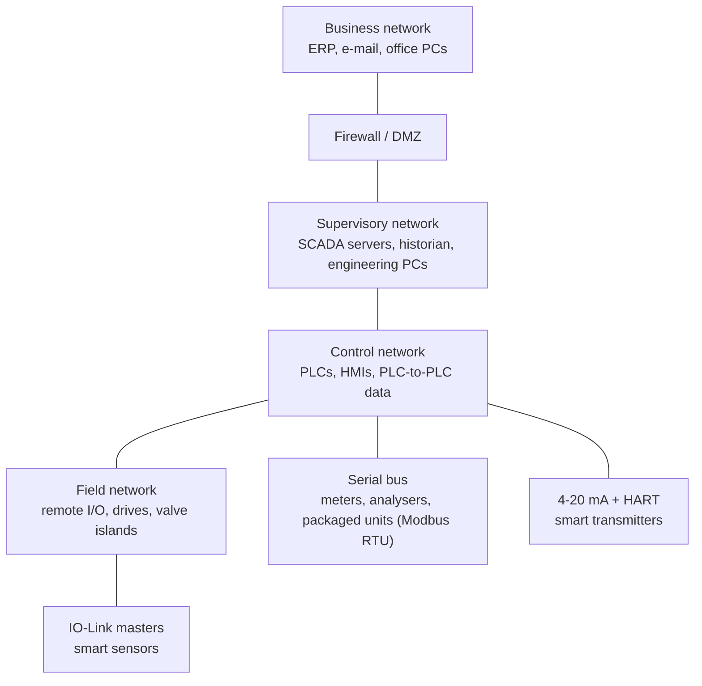
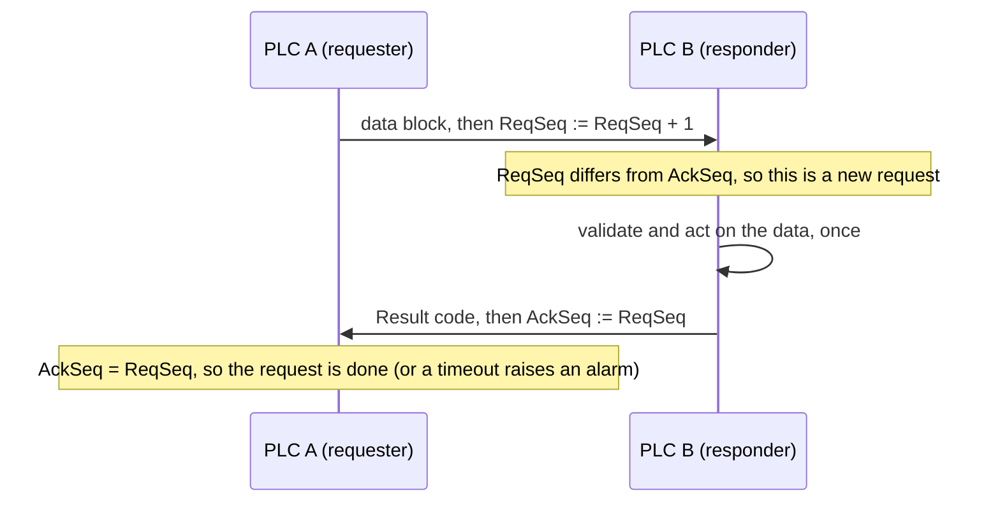
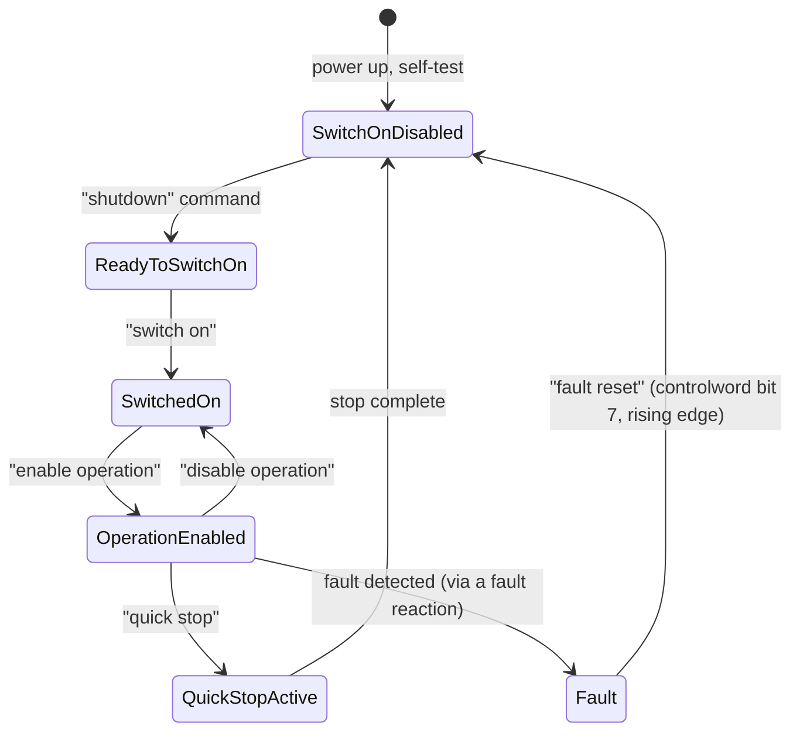

# 17 — Industrial Communications and Networks

> **Level:** 4 — Advanced · **Time:** ~12–14 hours · **Prerequisites:** [03 — Numbers, Data Types and Addressing](../03-data-types-and-addressing/), [09 — Maths, Comparison, Data Movement and Bit Manipulation](../09-math-and-data-handling/), [11 — Program Organisation and Reusable Function Blocks](../11-program-organization/)

A modern PLC is rarely alone. Its remote I/O sits on a fieldbus, its drives take their
speed references over Ethernet, a power meter answers Modbus requests on an RS-485 pair,
smart transmitters carry HART on their 4–20 mA loops, the HMI and SCADA read and write its
tags, a historian collects its values, and an MQTT or OPC UA gateway passes data up to the
business systems. Every one of those links can be slow, wrongly configured, or simply cut,
and the PLC program has to keep the plant safe when that happens.

This module covers the networks from the PLC programmer's side. It starts with the physical
basics (RS-232, RS-485, Ethernet and IP addressing), then takes Modbus apart byte by byte,
because Modbus is the protocol you will meet most often and the one where most mapping
mistakes are made. It then surveys the other families you will find on plant: PROFIBUS and
PROFINET, EtherNet/IP and CIP, EtherCAT, CANopen, IO-Link, HART, OPC UA and MQTT. The last
part is about writing PLC logic that survives real networks: heartbeats, comm-loss detection
with safe fallback values, consistent multi-word data, handshakes and rate-limited writes,
and controlling a drive through its control word and status word. The three labs build a
Modbus register map, a communication watchdog and a fieldbus drive interface.

## Learning objectives

By the end of this module you should be able to:

- Explain how RS-232, RS-485 and Ethernet carry data, and wire an RS-485 multi-drop network
  with correct termination, biasing and topology.
- Work out whether two IP addresses are on the same subnet, and choose addresses, masks and
  gateways for a small control network.
- Distinguish master/slave, client/server, producer/consumer and publish/subscribe
  communication, and cyclic I/O data from acyclic messaging.
- Decode a Modbus RTU or Modbus TCP frame by hand, including exception responses, and
  convert between documented register numbers (40001) and protocol addresses (0).
- Pack and unpack 32-bit values and scaled integers in 16-bit registers in either word
  order, and recognise the fingerprints of word-order and off-by-one mistakes.
- Estimate the cycle time of a polled network, and design polling, timeouts and retries so
  that one dead device does not stall the others.
- Describe PROFIBUS, PROFINET, EtherNet/IP, EtherCAT, CANopen, IO-Link, HART, OPC UA and
  MQTT/Sparkplug well enough to choose between them and to read their configuration.
- Write PLC logic that supervises a link with a heartbeat, falls back to safe values when it
  is lost, recovers deliberately, reads multi-word data consistently, and controls a drive
  through a control word and status word.

## 1. Why networks, and what control traffic needs

### 1.1 Where networks sit in a plant

Hard-wiring every signal back to the PLC's own I/O cards works, but it costs copper,
marshalling cabinets and labour, and a hard-wired 4–20 mA loop carries exactly one value.
Networks carry many values on one cable and let smart devices report diagnostics as well as
measurements. A typical plant has several layers of networks, each with its own job:



The layers match the ISA-95 / Purdue levels that
[Module 21](../21-architecture-and-standards/) covers. For now, notice two things. The lower
you go, the more the traffic is about *time*: a remote I/O rack must update every few
milliseconds, while a historian can take its values a second late. And the higher you go,
the more the traffic is about *security*: the business network must never be able to reach
a drive directly ([Module 22](../22-software-engineering/)).

### 1.2 What control traffic needs: time, not bandwidth

A 100 Mbit/s Ethernet link could carry the entire I/O of a large plant many times over.
Bandwidth is rarely the problem. The questions that matter are:

- **Latency:** how long a value takes to get from where it is measured to where it is used.
- **Update time (cycle time):** how often a new value arrives.
- **Jitter:** how much the latency or update time varies from one update to the next.
- **Determinism:** whether the worst case is *known and bounded*. A network that delivers
  in 1 ms on average but occasionally takes 200 ms is not deterministic.

Typical requirements (rough figures, to give a feel for the scale):

| Application | Update time usually needed | What late data does |
|---|---|---|
| Tank level, temperature, slow process loops | 100 ms – 1 s | Little: the process moves slowly |
| Pumps, valves, conveyors, general machine I/O | 5 – 50 ms | A photo-eye pulse is missed; a reject gate fires late |
| Fast packaging, high-speed sorting | 1 – 5 ms | Products are mistracked |
| Coordinated multi-axis motion | a few ms down to well under 1 ms, with very low jitter | Axes lose synchronism; the path is wrong |
| SCADA displays, historian | 1 s or slower | An operator sees an old value |

Ordinary office Ethernet gives no guarantees, so the industrial protocols add their own
methods to bound the worst case: cyclic scheduling, priorities, reserved time slots or
special hardware (section 5).

### 1.3 Who talks to whom: four communication models

| Model | How it works | Examples |
|---|---|---|
| **Master/slave** (poll/response) | One master asks each slave in turn; a slave only ever answers. The master decides all timing. | Modbus RTU, PROFIBUS DP, HART (the host polls) |
| **Client/server** (request/response) | The same idea on a network where many clients may talk to many servers, each request answered by one response. | Modbus TCP, OPC UA client/server, EtherNet/IP explicit messages, web browsers |
| **Producer/consumer** | A device *produces* its data at a set rate, without being asked each time. Any number of consumers can take it. | EtherNet/IP implicit I/O, CANopen PDOs, Logix produced/consumed tags |
| **Publish/subscribe** | Publishers send data on a named topic, usually through a **broker**; subscribers ask the broker for the topics they want. Neither side needs to know the other. | MQTT, OPC UA PubSub |

The modern Modbus specifications say *client* and *server* where older documents say
*master* and *slave*. You will meet both sets of words; this module uses client/server for
Modbus TCP and master/slave for Modbus RTU, as most device manuals still do.

The model changes how you detect failures. In a poll/response system the master *knows*
when a slave stops answering, because its request times out. In producer/consumer and
publish/subscribe systems a silent producer looks exactly like a producer with nothing new to
say, unless the data carries a heartbeat or the protocol has a timeout of its own (section
7).

### 1.4 Cyclic I/O data and acyclic messages

Industrial networks carry two kinds of traffic, and most fieldbuses treat them differently:

| | **Cyclic (I/O) data** | **Acyclic messages** |
|---|---|---|
| What | Process values and commands: inputs, outputs, control and status words, speed references | Parameters, diagnostics, recipes, identification, firmware, configuration |
| When | Every cycle, at a fixed rate, whether or not anything changed | On demand, when the program or a tool asks |
| Size | Small and fixed, defined at configuration time | Variable, often larger |
| How the PLC sees it | Usually mapped straight into the process image: the program reads and writes it like local I/O | Through a communication instruction or FB with *Execute / Busy / Done / Error* outputs |
| Names you will meet | PROFINET IO data, EtherNet/IP *implicit* messaging, CANopen PDOs, EtherCAT process data, IO-Link process data | PROFINET record data, EtherNet/IP *explicit* messaging, CANopen SDOs, EtherCAT mailbox (CoE), IO-Link ISDUs |

A drive is a good example: its control word, speed reference and status word travel as
cyclic data every few milliseconds, while "read the fault history" or "change the ramp time"
is an acyclic request that takes as long as it takes. Modbus has no such distinction: every
exchange is a request and a response, so a PLC that polls a Modbus device builds its own
"cyclic" traffic by repeating the same requests.

### 1.5 Layers, just enough to read a data sheet

Network specialists describe communication in layers (the seven-layer OSI model). You only
need the idea: each layer uses the one below it, so the same application protocol can run
over different cables.

| Layer | What it decides | Examples |
|---|---|---|
| Physical | Voltages, cables, connectors, bit rate | RS-232, RS-485, copper Ethernet, fibre, the MBP physical layer of PROFIBUS PA, radio |
| Data link | Frames, addresses on the local wire, error checking | Ethernet MAC frames, CAN frames, PROFIBUS telegrams |
| Network | Addresses across routers | IP (IPv4) |
| Transport | Connections, retransmission | TCP, UDP |
| Application | What the data means | Modbus, CIP, PROFINET IO, OPC UA, MQTT, HART commands |

So "Modbus RTU" is the Modbus application protocol over a serial physical layer (usually
RS-485), and "Modbus TCP" is the same application protocol over TCP/IP on Ethernet. PROFINET
RT, on the other hand, skips IP and TCP for its cyclic data and goes straight into Ethernet
frames, which is one reason it can be fast.

## 2. Serial communication: RS-232 and RS-485

### 2.1 How a byte travels on a serial line

Serial links send one bit at a time. The common asynchronous format (the *UART* format,
after the chip that does it) wraps each byte in a small frame:

```text
               idle  start  D0  D1  D2  D3  D4  D5  D6  D7  parity  stop  idle
 byte 16#A5:    1     0     1   0   1   0   0   1   0   1     0      1     1
                      <-------------------- 11 bits (8E1) -------------------->
```

16#A5 is 2#1010_0101. It goes out least significant bit first (1, 0, 1, 0, 0, 1, 0, 1), and
because it already contains four 1s, even parity adds a 0.

- The line idles at logic 1. A **start bit** (0) tells the receiver a character is coming.
- **Data bits**, least significant bit first: 8 for Modbus RTU (7 for Modbus ASCII).
- An optional **parity bit**: *even* parity makes the number of 1s (data + parity) even,
  *odd* makes it odd, *none* leaves it out. It detects single-bit errors.
- One or two **stop bits** (1) end the character.

The settings are written as *baud rate, data bits, parity, stop bits*: **9600 8E1** means
9600 bit/s, 8 data bits, even parity, 1 stop bit, so each character takes 1 + 8 + 1 + 1 =
**11 bits**. Both ends must use exactly the same settings. A wrong baud rate gives garbage
or nothing; a wrong parity setting usually gives nothing at all, because every character is
rejected as corrupt and the device stays silent.

**Worked example: character time.** At 9600 8E1, one character takes 11 / 9600 s =
1.146 ms, so the line carries at most 9600 / 11 ≈ 873 characters per second. A 25-byte
Modbus response takes 25 × 1.146 ms = 28.6 ms just to transmit. At 19200 baud the same
response takes half as long (14.3 ms). Serial links are slow by Ethernet standards, and
section 4.9 shows how quickly the milliseconds add up.

### 2.2 RS-232: point to point

RS-232 (now TIA-232) is the old PC "COM port": **single-ended** signals referenced to a
common ground, with a negative voltage (typically −3 to −15 V) for logic 1 and a positive
voltage for logic 0.

- **One device to one device**, no more.
- **Short distances**: about 15 m is the traditional limit, less at high baud rates, because
  a single-ended signal picks up noise and ground-potential differences.
- **Transmit and receive cross over**: one device's TX goes to the other's RX. On a 9-pin
  D-connector of a PC-type (DTE) port, pin 2 is receive, pin 3 is transmit and pin 5 is
  signal ground. Connecting two DTE devices needs a *null-modem* cable that swaps 2 and 3.

You meet RS-232 on older PLCs, barcode readers, printers, weighing indicators and
configuration ports. For anything longer than a cabinet, convert to RS-485 or Ethernet.

### 2.3 RS-485: the industrial multi-drop bus

RS-485 (TIA-485) sends each signal as the **difference** between two wires, a twisted pair.
Noise picked up along the cable appears almost equally on both wires and cancels out at the
receiver, which only looks at the difference (a few hundred millivolts is enough to be read
reliably). That makes RS-485 good for long cables in noisy plants:

- **Multi-drop:** many devices share one pair. The standard allows **32 unit loads** on a
  segment; many modern transceivers present a quarter or an eighth of a unit load, so more
  devices fit. Repeaters start new segments.
- **Distance:** up to about **1200 m** at the lower baud rates. The higher the baud rate, the
  shorter the cable can be.
- **Half duplex on two wires:** only one device may transmit at a time. Every device
  switches its driver on only while it sends. That is why RS-485 needs a master/slave
  protocol such as Modbus RTU: the master decides who speaks.
- **Four-wire** versions (separate transmit and receive pairs, similar to RS-422) exist for
  full duplex, but two-wire is by far the most common for Modbus.

A correctly built RS-485 segment looks like this:

```text
 RIGHT: a daisy chain, terminated at both ends, biased at one point

   [Rt] [B]                                                               [Rt]
    Master ======= Slave 1 ======= Slave 2 ======= Slave 3  ...  ======= Slave n
           <---- one cable: D+/D- twisted pair + common 0 V + shield ---->

   [Rt] = terminator, about 120 ohm across D+/D-, at the two physical ends only
   [B]  = bias resistors (D+ pulled up, D- pulled down), at one point only

 WRONG: a star with long branches, and a terminator in the middle

                        Slave 1
                           |
    Master ----------------+----------------- Slave 2
                           |
                        Slave 3 [Rt]
```

The rules that make it work:

1. **Daisy-chain** the cable from device to device. No star wiring, and keep any stub from
   the trunk to a device as short as possible (a few tens of centimetres, not metres).
   Every branch is a reflection point.
2. **Terminate both ends, and only the ends.** A resistor matching the cable's
   characteristic impedance (about **120 Ω** for typical RS-485 cable) across the pair at
   the two physical ends absorbs the signal instead of reflecting it back. A missing
   terminator gives reflections at high baud rates or on long cables; an extra terminator
   in the middle loads the bus and weakens the signal. Many devices have a DIP switch or
   jumper for a built-in terminator: switch it on only at the two end devices.
3. **Bias the idle line.** When nobody is transmitting, all drivers are off and the pair
   floats. Noise can then look like start bits, and receivers see garbage between frames.
   **Bias resistors** (a pull-up on one line and a pull-down on the other, typically a few
   hundred ohms; follow the device manual or the Modbus serial line specification) hold the
   idle bus firmly in the "1" state. Apply bias at **one** point on the segment, usually the
   master or a termination module. Too much bias from many devices overloads the drivers.
4. **Run a common reference conductor.** RS-485 receivers only tolerate a limited common-mode
   voltage (a few volts either way). Devices whose 0 V references differ by more than that,
   for example in different buildings, will not communicate reliably or can be damaged. A
   third conductor linking the signal commons keeps them together; isolated repeaters or
   fibre handle long runs between buildings.
5. **Shield and segregate.** Use proper twisted-pair, shielded bus cable, route it away from
   motor cables and drive outputs, and bond the shield as the manufacturer and your site
   EMC rules require (often at both ends with 360° clamps,
   [Module 02](../02-electrical-and-field-devices/)).
6. **Match the labels, then check them.** The standard calls the two lines A and B, but
   manufacturers disagree about which is which, and others label them D+/D−, D1/D0 or
   Data+/Data−. If a correctly configured device does not answer, swapping the pair at that
   device is a legitimate test.

### 2.4 Troubleshooting a serial link

Work from the bottom up. Most "the Modbus doesn't work" calls end at step 2 or 3.

1. **Physical:** continuity of both wires and the common, polarity, terminators at the two
   ends only, bias present, no star wiring, the shield intact. With a multimeter and the bus
   idle and biased, D+ should sit a little above D−.
2. **Settings:** every device on the segment at the same baud rate, data bits, parity and
   stop bits; each slave with a **unique** address; only **one** master on the bus.
3. **Addressing:** the right slave address, function code and register address (section 4.4).
4. **Timing:** the master's response timeout long enough for the slowest device; the poll
   rate not faster than the bus can carry.
5. **Tools:** a USB–RS-485 adapter and a PC Modbus master program let you talk to one device
   directly; the LEDs on the transceiver (TX/RX) show whether the device ever answers.

## 3. Ethernet and IP for control engineers

### 3.1 Ethernet, frames and switches

**Ethernet** sends data in **frames**. Each frame carries a destination and a source **MAC
address** (a 48-bit hardware address, written like `00-1B-1B-12-34-56`, burnt into each
network interface), a type field saying what is inside, the data, and a checksum.

A **switch** learns which MAC addresses live on which of its ports and forwards each frame
only to the port where its destination lives. Modern Ethernet is **full duplex** (each
direction has its own wire pair) and switched, so the collisions of early shared Ethernet no
longer happen. Frames can still *queue* inside a busy switch, which is where latency and
jitter come from.

Points that matter on a plant:

- A copper twisted-pair segment is limited to **100 m** between active devices (switch,
  PLC, drive). Longer runs, or runs between buildings, use fibre.
- **Industrial switches** are built for cabinets: 24 V DC supply, DIN rail, wide temperature
  range, alarm relay. **Managed** switches add diagnostics, VLANs, port mirroring (to capture
  traffic with a tool such as Wireshark), redundancy protocols and security settings.
  Unmanaged switches are simpler and cheaper but give you nothing to diagnose with.
- Connectors range from office RJ45 to rugged M12 connectors on machines.

### 3.2 IP addresses, subnets and gateways

An **IPv4 address** is 32 bits, written as four decimal bytes: `192.168.10.20`. The
**subnet mask** says how many of the leading bits identify the *network*; the rest identify
the *host* on that network. The mask `255.255.255.0` has 24 one-bits, written `/24` in
*prefix* notation.

Two devices can talk directly only if their network parts are equal. Otherwise the sender
hands the packet to its **default gateway** (a router or a layer-3 switch/firewall), which
forwards it towards the other network.

**Worked example 1: a /24 network.** A PLC is `192.168.10.20/24`. With a 24-bit mask the
network part is the first three bytes, `192.168.10`. The HMI at `192.168.10.50` is on the
same network. A new drive that arrives with a factory address of `192.168.0.10` is not,
because `192.168.0` ≠ `192.168.10`. The PLC cannot reach it until the drive is re-addressed
(or a router is added, which is the wrong fix for a device in the same cabinet).

**Worked example 2: a /26 network.** A plant splits its control range into smaller subnets
with the mask `255.255.255.192` (/26). The last byte is split into 2 network bits and 6 host
bits, so each subnet covers 64 addresses: .0–.63, .64–.127, .128–.191, .192–.255.

| Address | Last byte in binary | Subnet | Usable hosts in that subnet |
|---|---|---|---|
| 192.168.10.70/26 | 01 000110 | 192.168.10.64 | .65 – .126 (.64 is the network, .127 the broadcast) |
| 192.168.10.130/26 | 10 000010 | 192.168.10.128 | .129 – .190 |

A device at `.70` and one at `.130` look "nearly the same" to a person, but they are on
different subnets and need a router between them.

Rules of thumb for control networks:

- Use **private** address ranges: `10.0.0.0/8`, `172.16.0.0/12` or `192.168.0.0/16`.
- Give controllers, HMIs, drives and I/O **fixed** addresses from a documented IP plan. If
  DHCP is used at all, use reservations, so a device always gets the same address.
- **Duplicate IP addresses** are a classic commissioning fault: two devices answer
  intermittently or not at all. Many managed switches and PLCs can detect them.
- A device showing an address in `169.254.x.x` has given up waiting for DHCP and
  assigned itself a link-local address: it is not configured.
- Record every address, mask, gateway, device name and switch port in the network
  documentation. The next engineer will need it at 3 a.m.

### 3.3 TCP, UDP and ports

On top of IP, two transport protocols carry the data:

- **TCP** sets up a *connection* between two programs, numbers every byte, acknowledges
  receipt and retransmits anything lost. It is reliable but a lost packet causes a delay
  while it is resent. Modbus TCP, EtherNet/IP explicit messages, OPC UA and MQTT use TCP.
- **UDP** just sends datagrams: no connection, no acknowledgement, no retransmission. For
  cyclic I/O that is exactly right, because a lost update will be replaced by the next one
  a few milliseconds later, and a retransmitted old value would be worse than useless.
  EtherNet/IP implicit I/O uses UDP.

A **port number** identifies the program at each end. Well-known ports you will meet (and
open in firewalls):

| Port | Protocol |
|---|---|
| TCP 502 | Modbus TCP |
| TCP 802 | Modbus/TCP Security (Modbus over TLS) |
| TCP 44818 | EtherNet/IP explicit messaging |
| UDP 2222 | EtherNet/IP implicit (I/O) messaging |
| TCP 4840 | OPC UA binary protocol (`opc.tcp://`) default |
| TCP 1883 / 8883 | MQTT / MQTT over TLS |
| UDP 123 | NTP time synchronisation |

PROFINET RT and EtherCAT cyclic data normally do not use IP at all; they have their own
Ethernet frame types, so there is no port to open, and a router cannot forward them.

### 3.4 Broadcasts, multicast and VLANs

A **broadcast** frame goes to every device in the network (the *broadcast domain*). Some
protocols use broadcasts for discovery; too many of them load every device. **Multicast**
frames go to a group of receivers; EtherNet/IP can multicast I/O data so that several
consumers receive one transmission, and managed switches use *IGMP snooping* to deliver
multicast only to ports that asked for it.

A **VLAN** (virtual LAN, IEEE 802.1Q) splits one physical switch network into several
logical ones. Frames are tagged with a VLAN number, and devices in different VLANs cannot
talk to each other except through a router or firewall. Plants use VLANs to separate
control traffic from HMI, CCTV and office traffic, to contain broadcasts, and as one layer
of network segmentation for security. The same tag carries a **priority** field that
switches can use to forward urgent frames first.

### 3.5 Making Ethernet deterministic

Switched full-duplex Ethernet removes collisions, but frames can still wait behind other
traffic in a switch. The industrial protocols handle this in different ways:

- **Keep the network lightly loaded and prioritise I/O frames.** PROFINET RT and EtherNet/IP
  both work this way on standard switches, and reach update times of a few milliseconds.
- **Reserve time slots.** PROFINET IRT schedules the cyclic frames in a reserved phase of
  every cycle, which needs IRT-capable switches (usually built into the devices).
- **Process on the fly.** EtherCAT sends one frame through every device in a line; each
  device reads and writes its own part as the frame passes, in hardware (section 5.4).
- **Time-Sensitive Networking (TSN)** is a set of IEEE 802.1 standards that add time
  scheduling and bandwidth reservation to standard Ethernet switches, so that different
  protocols can share one deterministic network. Vendors and user organisations are
  building their protocols on it; expect to meet it more over the coming years.

### 3.6 Redundant rings

A single cable break in a line topology cuts off everything behind it. Industrial networks
are often built as **rings**: the ring is logically kept open at one point so frames do not
circulate for ever, and when a cable or device fails, the ring closes that point and traffic
goes round the other way.

| Protocol | Used with | Idea |
|---|---|---|
| **RSTP** (IEEE 802.1D/802.1w) | General IT and industrial networks | Switches negotiate a loop-free tree; reconfiguration can take a noticeable fraction of a second or more, depending on the network |
| **MRP** (Media Redundancy Protocol, IEC 62439-2) | PROFINET and other industrial Ethernet | A ring manager keeps the ring open and closes it on a break, within a guaranteed maximum recovery time (200 ms is the commonly used class) |
| **DLR** (Device Level Ring) | EtherNet/IP | A ring supervisor, with ring support built into the devices themselves; recovery is typically within a few milliseconds |
| **PRP / HSR** (IEC 62439-3) | Power utilities, high-availability plants | Every frame is sent twice, over two independent networks (PRP) or both ways round a ring (HSR); the receiver discards the duplicate, so a single failure loses nothing |

What this means for your program: the I/O watchdog times and your own heartbeat timeouts
must be **longer than the ring's recovery time**. Otherwise the plant trips on exactly the
cable break the ring was built to survive.

### 3.7 Time synchronisation: NTP and PTP

Every PLC has a clock, and they all drift. When an alarm list, a sequence-of-events record
or a historian trend combines events from several controllers, their clocks must agree, or
the "first out" event will appear to happen after the ones it caused
([Module 16](../16-alarms-and-diagnostics/)).

- **NTP** (Network Time Protocol) and its simpler form **SNTP** set clocks from a time server
  over an ordinary IP network. On a local network, millisecond-level agreement is typical,
  which is enough for alarm and event logs.
- **PTP** (Precision Time Protocol, IEEE 1588, also published as IEC 61588) uses hardware
  timestamps in network interfaces and switches to reach sub-microsecond agreement. It is
  used for distributed motion, sequence-of-events recording in substations, and as the time
  base for TSN. EtherCAT's *distributed clocks* and CIP Sync solve the same problem inside
  their own networks.

Good practice: timestamp events **at the source** (in the PLC or the I/O module that sees
them, not in SCADA when it next polls), keep controllers in UTC and let the HMI convert to
local time, and alarm on loss of time synchronisation.

## 4. Modbus in depth

### 4.1 One protocol, three transports

Modicon published Modbus in 1979 for its own PLCs. It is simple, openly documented (the
specifications are free from the Modbus Organization) and needs no licence, so almost
everything speaks it: power meters, drives, flowmeters, gas analysers, gas detectors,
packaged units such as compressors and chillers, gateways, PLCs and every SCADA package.
There are three variants:

| Variant | Transport | Framing | Error check |
|---|---|---|---|
| **Modbus RTU** | Serial, usually RS-485 | Binary; frames are separated by silent gaps | CRC-16 in every frame |
| **Modbus ASCII** | Serial | Each byte sent as two hex characters; `:` starts a frame, CR LF ends it | LRC; rarely used today |
| **Modbus TCP** | TCP/IP on Ethernet, port 502 | A 7-byte MBAP header in front of the message | None of its own: TCP and Ethernet check the data |

All three carry the same **PDU** (protocol data unit): a one-byte **function code** saying
what to do, followed by the data for that function. Learn the PDU once and you can read all
three.

### 4.2 The data model: four tables

A Modbus device presents its data as four tables. Each table can have up to 65,536 entries,
numbered from 0 in the protocol.

| Table | Size of an entry | Access from the network | Typical content | Read with | Write with | Traditional reference |
|---|---|---|---|---|---|---|
| **Coils** | 1 bit | read/write | Outputs, on/off commands | FC 01 | FC 05, 15 | 0xxxx |
| **Discrete inputs** | 1 bit | read only | Inputs, status bits | FC 02 | — | 1xxxx |
| **Input registers** | 16 bits | read only | Measurements | FC 04 | — | 3xxxx |
| **Holding registers** | 16 bits | read/write | Setpoints, configuration, and in practice almost everything | FC 03 | FC 06, 16 | 4xxxx |

Three things surprise newcomers:

1. **The device decides what each address means.** The **register map** in the device
   manual is the contract. Many devices put everything, even read-only measurements, in
   holding registers. Some present the same memory in two tables. Unused addresses may
   answer with an error (section 4.7) or with zeros.
2. **A register has no data type.** 16 bits are 16 bits. Whether `16#FFFF` means 65,535,
   −1, sixteen status flags or half of a floating-point number is written only in the map.
3. **There is no timestamp and no quality.** A register value does not say how old it is or
   whether the device trusts it. If you need that, the map must provide it (a status word, a
   heartbeat counter), or you add it in the PLC (section 7).

### 4.3 The function codes you will use

| FC (dec / hex) | Name | Request carries | Normal response carries | Most per request |
|---|---|---|---|---|
| 01 / 16#01 | Read Coils | start address, quantity | byte count, the bits packed 8 per byte | 2000 coils |
| 02 / 16#02 | Read Discrete Inputs | start address, quantity | byte count, packed bits | 2000 inputs |
| 03 / 16#03 | Read Holding Registers | start address, quantity | byte count, 2 bytes per register | 125 registers |
| 04 / 16#04 | Read Input Registers | start address, quantity | byte count, 2 bytes per register | 125 registers |
| 05 / 16#05 | Write Single Coil | address, value `16#FF00` = ON or `16#0000` = OFF | an echo of the request | 1 coil |
| 06 / 16#06 | Write Single Register | address, value | an echo of the request | 1 register |
| 15 / 16#0F | Write Multiple Coils | start, quantity, byte count, packed bits | start, quantity | 1968 coils |
| 16 / 16#10 | Write Multiple Registers | start, quantity, byte count, values | start, quantity | 123 registers |

Others exist and some devices support them: 23 (read/write multiple registers in one
transaction), 22 (mask write register), 08 (serial-line diagnostics), 43 with MEI type 14
(read device identification: vendor, product code, revision). Never assume support: the
manual lists which function codes a device answers.

Two practical rules:

- Write a value that spans two registers (a `DINT` or a `REAL`) with **one FC 16 request**,
  never with two FC 06 writes. Between two single writes the device holds a value that is half
  old and half new, and it may act on it.
- Some devices accept only FC 06 for writes, others only FC 16. If a write is refused with
  exception 01, try the other.

### 4.4 Addresses: the off-by-one trap

The request always carries a 16-bit **protocol address** starting at **0**. Documentation
often uses the old Modicon **reference numbers** instead: a leading digit for the table
(section 4.2) and a register number starting at **1**
([Module 03](../03-data-types-and-addressing/) introduced them):

| Documentation says | Table | Protocol address sent |
|---|---|---|
| 00001 | coil | 0 |
| 10001 | discrete input | 0 |
| 30001 | input register | 0 |
| 40001 | holding register | 0 |
| 40108 | holding register | 107 (`16#006B`) |
| 400001 (six-digit form) | holding register | 0 |
| 465536 (six-digit form) | holding register | 65535 |

That would be manageable if everyone used it, but they do not. You will find manuals that
say "holding register 108" (1-based, no prefix), others that say "register 107" or
"address 0x006B" (0-based), and client software whose address field expects one or the
other. **The same number can mean two different registers in two tools.**

A procedure that always works:

1. Find which convention the **device manual** uses. Look for a sentence about it, or an
   example request frame, which shows the real protocol address in hex.
2. Find which convention your **client** uses in its address field (the PLC communication
   block, the SCADA driver, the test tool). Its help file usually shows an example.
3. **Prove it with a value you know**: a register you can see on the device's own display, a
   setpoint you can change and watch, a fixed identifier such as a product code.

**Worked example: a shifted page.** A pump controller's manual lists:

| Reference | Content |
|---|---|
| 40001 | Status word |
| 40002 | Speed, rpm |
| 40003 | Motor current, A × 10 |
| 40004 | Running hours |

The SCADA driver expects 0-based protocol addresses, but the integrator enters `2` for the
speed ("40002, so 2"). The driver reads protocol address 2, which is reference **40003**:
the current. The operator sees a pump "running at 187 rpm" whose speed goes up and down with
the load and not with the speed setpoint. It is the motor current, 18.7 A. Every other value
on that page is shifted by one register as well: "current" shows running hours, and
"status" shows the speed. The fix is address `1` for the speed, and the lesson is the
fingerprint: **a value that behaves like its neighbour in the map is an off-by-one**. Its
cousin is exception 02 (illegal data address) when a block read runs one register past the
end of the map.

### 4.5 Modbus RTU framing

An RTU frame is at most 256 bytes:

```text
 +---------------+---------------+---------------------------+-------------------+
 | Slave address | Function code | Data (0 to 252 bytes)     | CRC-16 (2 bytes,  |
 |    1 byte     |    1 byte     |                           |  low byte first)  |
 +---------------+---------------+---------------------------+-------------------+
```

- **Slave addresses** 1–247 are for devices. Address **0** is **broadcast**: every slave
  carries out a broadcast *write*, and none of them answers. Addresses 248–255 are
  reserved.
- **Timing marks the frames.** A silence of at least **3.5 character times** ends a frame;
  a gap of more than 1.5 character times inside a frame makes it invalid. At 9600 8E1 that
  is 3.5 × 1.146 ms = 4.0 ms. Above 19200 baud the specification fixes the two values at
  1.75 ms and 0.75 ms. This is why a PC with a USB adapter sometimes fails where a PLC
  works: the USB driver can insert gaps in the middle of a frame.
- **The CRC** covers the address, the function code and the data. A slave that receives a
  frame with a bad CRC, or a frame for another address, **stays silent**. The master sees
  only a timeout.
- The **serial settings** are part of the configuration: the specification's default is
  even parity (8E1), and it asks for two stop bits when parity is not used, but many devices
  ship set to 8N1. Match whatever the devices on the segment actually use.
- Inside every register, the **high byte is sent first**. That part is standardised.

**Worked example: reading a REAL from slave 1.** A meter's manual says the L1 voltage is a
32-bit float in holding registers 40100–40101, high word first. The request reads two
registers starting at protocol address 99:

```text
 Request:   01  03  00 63  00 02  34 15
            |   |   |      |      +---- CRC-16, low byte first
            |   |   |      +----------- quantity: 2 registers
            |   |   +------------------ start address 16#0063 = 99  ->  reference 40100
            |   +---------------------- function 03: read holding registers
            +-------------------------- slave address 1

 Response:  01  03  04  43 66  80 00  6E 68
            |   |   |   |      |      +---- CRC-16
            |   |   |   |      +----------- register 40101 = 16#8000
            |   |   |   +------------------ register 40100 = 16#4366
            |   |   +---------------------- byte count: 4
            |   +-------------------------- function 03 (echoed)
            +------------------------------ slave address 1
```

The two registers, high word first, form `16#4366_8000`, which is the IEEE-754 `REAL` 230.5
(section 4.8 shows how to decode it). The classic example from the Modbus documentation,
reading three registers from 40108 on slave 17, is `11 03 00 6B 00 03 76 87`: check that you
can see the address 107 = `16#6B` in it.

### 4.6 Modbus TCP framing

Modbus TCP puts a 7-byte **MBAP header** (Modbus Application Protocol header) in front of the
same PDU and drops the CRC:

| Field | Bytes | Meaning |
|---|---|---|
| Transaction identifier | 2 | Chosen by the client and copied into the response, so the client can match responses to requests |
| Protocol identifier | 2 | Always 0 for Modbus |
| Length | 2 | Number of bytes that follow: the unit identifier plus the PDU |
| Unit identifier | 1 | The slave address behind a gateway. Devices on Ethernet often ignore it or expect one fixed value (1, 0 and 255 are all common): check the manual |
| Function code and data | n | The same PDU as in RTU |

The same read as before, sent to a device on Ethernet with transaction number `16#0015`:

```text
 Request:   00 15  00 00  00 06  01  03  00 63  00 02
            trans  proto  len=6  uid FC  addr   qty

 Response:  00 15  00 00  00 07  01  03  04  43 66  80 00
            trans  proto  len=7  uid FC  cnt data...
```

The length is 6 in the request (unit identifier, function code, two address bytes, two
quantity bytes) and 7 in the response (unit identifier, function code, byte count, four data
bytes).

Practical points:

- The server listens on **TCP port 502**. A client opens a connection and can send many
  requests over it. Small devices accept only a few simultaneous connections: three SCADA
  servers and an engineering laptop can be one too many, and the fourth client is refused.
- A **gateway** (Modbus TCP to Modbus RTU) uses the unit identifier as the serial slave
  address. When the serial device does not answer, a good gateway returns exception 0B
  (section 4.7); a poor one simply stays silent.
- A TCP connection can die without a clean close: a cable pulled, a device rebooted. The
  client needs a response timeout and reconnect logic, and the PLC program needs its own
  staleness check (section 7).

### 4.7 Exception responses

When a server receives a valid request that it cannot carry out, it answers with an
**exception response**: the function code with its top bit set (function code + `16#80`)
and a one-byte exception code.

| Code | Name | Usual cause on site |
|---|---|---|
| 01 | Illegal function | The device does not support this function code (for example FC 16 on a device that only does FC 06) |
| 02 | Illegal data address | The address, or address + quantity, is outside the device's map: an off-by-one at the end of a block, the wrong table, or a block that spans a gap in the map |
| 03 | Illegal data value | A field of the request is not allowed: quantity 0 or above the limit, an FC 05 value other than `16#FF00`/`16#0000`. Some devices also use it for an out-of-range setpoint |
| 04 | Server device failure | The device hit an error while carrying out the request |
| 05 | Acknowledge | Accepted, but it will take a long time (programming commands) |
| 06 | Server device busy | Try again later |
| 0A (10) | Gateway path unavailable | The gateway is misconfigured or overloaded |
| 0B (11) | Gateway target device failed to respond | The serial device behind the gateway did not answer |

For example, `01 83 02 C0 F1` from slave 1 is function `16#83` (03 + 80): exception 02, illegal
data address.

**An exception is not a timeout.** An exception means the device is alive, the wiring and
serial settings are right, and the request itself is wrong. A timeout means nothing came back
at all: wrong slave address, wrong baud rate or parity, CRC errors, a wiring fault, or a dead
device. They lead to different fault-finding, so the PLC's communication status should keep
them apart, and it pays to count both per device.

### 4.8 What is in a register: data representation

**16-bit integers.** A register holds either an unsigned value (`UINT`, 0 to 65,535) or a
signed one (`INT`, −32,768 to 32,767). The map says which. If the client treats a signed
register as unsigned, −1 appears as 65,535 and a small negative temperature becomes a huge
positive one.

**Bits in a register.** Status and alarm words pack 16 flags into one register (Lab 03-1).
Watch the numbering: most maps number bits 0–15, some 1–16. Check with a known state (for
example, "running" should appear and disappear as you start and stop the device).

**Scaled integers.** Many devices send values with decimals as integers with an implied
scale factor:

| Quantity | Register value | Scale in the map | Engineering value |
|---|---|---|---|
| Temperature | 655 | × 10 | 65.5 °C |
| Pressure | 457 | × 100 | 4.57 bar |
| Frequency | 4998 | × 100 | 49.98 Hz |
| Level | 7350 | 0–10000 = 0–100.00 % | 73.50 % |

When you design a map, choose the scale so that the largest value still fits: an `INT`
reaches 32,767, so × 100 allows at most 327.67. A 0–400 bar hydraulic pressure therefore
needs × 10. When you pack a value, **range-check before converting**, because converting an
out-of-range `REAL` to `INT` wraps round on some platforms (in MATIEC, 400.0 × 100 arrives
as −25,536) and faults on others. And **round, don't truncate**, or every value is biased
downwards:

```iecst
Scaled := PressureBar * 100.0;                             (* 0.01 bar resolution *)
HR_Pressure := REAL_TO_INT(LIMIT(-32768.0, Scaled, 32767.0));  (* rounds to nearest *)
PressClamped := (Scaled > 32767.0) OR (Scaled < -32768.0);  (* tell SCADA it was clipped *)
```

When you receive a scaled value, convert to `REAL` **before** dividing:
`TempC := INT_TO_REAL(HR_Temp) / 10.0;` gives 65.5, while `INT_TO_REAL(HR_Temp / 10)` does
an integer division first and gives 65.0 ([Module 09](../09-math-and-data-handling/)).

**32-bit values in two registers.** `DINT`, `UDINT` and `REAL` take two consecutive
registers. Modbus defines the byte order *inside* a register but not the order of the two
registers, so both of these are common and neither is a safe default:

| Name used in manuals | Register *n* | Register *n* + 1 |
|---|---|---|
| High word first, "big-endian", ABCD | bits 16–31 | bits 0–15 |
| Low word first, "word-swapped", "little-endian words", CDAB | bits 0–15 | bits 16–31 |

On top of that, some devices swap the bytes inside each register as well, giving the BADC and
DCBA orders shown in [Module 03](../03-data-types-and-addressing/). Good clients have a
"swap words" and a "swap bytes" setting per value. The fingerprints of a wrong order:

| Symptom | Likely cause |
|---|---|
| A `DINT` of 100,000 reads −2,036,334,591 | Words swapped: `16#0001_86A0` became `16#86A0_0001` |
| A totaliser jumps by 65,536 every time it should go up by 1 | Words swapped: the low word is being used as the high word |
| A `REAL` is absurdly tiny (10⁻⁴¹), enormous (10²³), NaN, or has the wrong sign | Wrong word or byte order |
| A value is right up to 32,767 or 65,535 and then goes wrong | Only one register read, or the low word treated as signed |

**Finding the order with a known value.** A second meter on the same panel, from a
different maker, has been configured by a colleague as "high word first", like the one in
section 4.5. It shows its L1 voltage as −2.42 × 10⁻⁴¹. The raw registers are `16#8000`,
`16#4366`. Read in the other order they form `16#4366_8000`:

```text
 16#4366_8000 = 0 | 1000 0110 | 110 0110 1000 0000 0000 0000
               sign exponent    fraction
 exponent 2#1000_0110 = 134, minus the bias of 127  ->  2^7
 value = +1.11001101 (binary) x 2^7 = 11100110.1 (binary) = 128+64+32+4+2+0.5 = 230.5
```

230.5 V is a sensible mains voltage, so this meter sends **low word first**, unlike the
first one.

In Structured Text, join two registers into a `DINT` with bit operations:

```iecst
FUNCTION F_WordsToDint : DINT
  VAR_INPUT
    HighWord : WORD;               (* register holding bits 16..31 *)
    LowWord  : WORD;               (* register holding bits 0..15 *)
  END_VAR
  (* WORD_TO_DWORD adds zeros on the left, so bit 15 of the low word cannot
     leak into the high half. SHL moves the high word into bits 16..31. *)
  F_WordsToDint := DWORD_TO_DINT(SHL(WORD_TO_DWORD(HighWord), 16)
                                 OR WORD_TO_DWORD(LowWord));
END_FUNCTION
```

Two traps: going through `INT` (`WORD_TO_INT`, then `INT_TO_DINT`) sign-extends a low word
such as `16#86A0` and corrupts the result; and `WORD`/`DWORD` are bit strings, so strict
IEC compilers (MATIEC included) reject arithmetic such as `DWORD * 65536`. Use shifts, or do
the arithmetic in `UDINT`. Splitting a `DINT` into two registers is the reverse, and Lab 17-1
asks you to write it.

**REAL values in two registers** need a bit-for-bit copy, not a numeric conversion. The
standard conversion functions are no help here, because platforms disagree about whether a
conversion such as `DWORD_TO_REAL` converts the number or copies the bits. Use the method
your platform documents:

- **CODESYS / TwinCAT:** a `UNION` that overlays a `REAL` and two `WORD`s:

  ```iecst
  (* CODESYS / TwinCAT syntax - not testable with MATIEC *)
  TYPE U_RealWords :
  UNION
    r : REAL;
    w : ARRAY[0..1] OF WORD;
  END_UNION
  END_TYPE

  (* On a little-endian CPU, w[0] is the low word. *)
  Conv.w[0] := RegLow;
  Conv.w[1] := RegHigh;
  VoltageL1 := Conv.r;
  ```

- **Siemens TIA Portal:** S7 CPUs are big-endian, so high-word-first data can be received
  straight into a `REAL` in the communication buffer. For other orders, rearrange the data
  first (rotating a `DWORD` by 16 bits with `ROL` swaps its two words; `SWAP` reverses the
  byte order), or use an `AT` overlay in a block with standard access, or the
  `Serialize`/`Deserialize` instructions.
- **Rockwell Logix:** `COP` (copy) moves raw bytes, so `COP` from an `INT[2]` array into a
  `REAL` reinterprets them. Logix controllers are little-endian, so element [0] must hold the
  low word: for a high-word-first device, exchange the two `INT`s first. `SWPB` swaps the
  bytes inside a word, for the byte-swapped orders.
- **MATIEC / OpenPLC:** there is no portable bit copy between `REAL` and `DWORD` in ST, which
  is why the labs use `DINT` values.

**Other types.** 64-bit values (`LREAL`, some energy totals) take four registers and have even
more possible orders. Strings usually pack two ASCII characters per register, high byte first,
but some devices put one character per register. As always, test with a value you know.

### 4.9 Designing the polling

In Modbus the client creates all the traffic. The server never speaks unless asked. A good
polling design:

1. **Reads contiguous blocks.** One request for 20 registers costs little more than a request
   for one. When you design a PLC's own map, keep each device's data together and leave
   spare registers between blocks ([Module 18](../18-hmi-and-scada/)).
2. **Separates fast and slow data.** Status and process values every cycle; configuration,
   counters and diagnostics every tenth cycle or on demand.
3. **Sends one request at a time on a serial bus.** On TCP some clients can have several
   requests in flight, but many PLC blocks still send one at a time per connection.
4. **Sets timeouts and retries deliberately.** The response timeout must cover the slowest
   device's answer plus the transmission time. Every retry of a dead device steals time from
   all the others (worked example 2).
5. **Handles dead devices.** After a few consecutive failures, mark the device offline,
   raise an alarm, flag its data as bad, and poll it only occasionally, with no retries,
   until it answers again:

   ```mermaid
   stateDiagram-v2
     [*] --> Online
     Online --> Suspect: request times out
     Suspect --> Online: next request answered
     Suspect --> Offline: N consecutive failures
     Offline --> Online: occasional retry answered
     note right of Offline
       alarm raised, data flagged bad,
       fallback values used (section 7)
     end note
   ```

6. **Writes on change, not on every scan**, uses FC 16 for multi-register values, and limits
   the write rate (section 7.7).
7. **Tells the program how fresh each value is.** A per-device "communication OK" flag,
   an error counter and, where the device offers one, a heartbeat (section 7).

Vendors package all of this differently. Some PLCs configure Modbus polling in a table in the
hardware configuration (CODESYS, the OpenPLC Runtime's slave devices); others give you a
communication function block with *Execute/Done/Busy/Error* outputs that your program must
sequence (Siemens `MB_CLIENT`, Rockwell Micro800 `MSG_MODBUS`). With a function block, the
state diagram above becomes a small state machine in your own code
([Module 13](../13-sequential-control/)).

### 4.10 Modbus and security

Modbus has **no authentication and no encryption**. Any device that can reach a server's
port 502 can read and write every register the server offers, including setpoints and
commands. The Modbus/TCP Security specification wraps Modbus in TLS with certificates on
port 802, but device support is still limited. Until you have it, the defences are outside
the protocol: network segmentation, a firewall that lets only the SCADA server reach the
PLC's port 502, read-only maps where writes are not needed, validation of every written value
inside the PLC, and write-rate limits. [Module 22](../22-software-engineering/) covers
IEC 62443 and secure PLC coding.

## 5. The fieldbus and industrial Ethernet families

Most fieldbuses are standardised together in IEC 61158 (the protocols) and IEC 61784 (the
profiles that say which parts a product uses), and each is looked after by a user
organisation. Every one of them solves the same problems: cyclic I/O, acyclic parameters and
diagnostics, and a **device description file** that tells the engineering tool what the
device offers. This section gives you enough of each to recognise it, configure it with the
vendor's help files, and know what to look for when it fails.

### 5.1 PROFIBUS DP and PA

**PROFIBUS**, maintained by PROFIBUS & PROFINET International (PI), comes in two forms that
share one protocol:

- **PROFIBUS DP** (Decentralised Periphery) runs on RS-485 with its own cable and plugs, at
  9.6 kbit/s up to 12 Mbit/s. The higher the rate, the shorter the segment: about 100 m at
  12 Mbit/s, up to about 1200 m at the lowest rates. A **class 1 master** (the PLC) exchanges
  cyclic data with its slaves every bus cycle; a **class 2 master** (an engineering or
  diagnostic tool) can join for acyclic access. Each station has a unique **address** from 0
  to 125, set by rotary switches or software, and a segment carries at most 32 stations;
  repeaters join segments. The extensions DP-V1 and DP-V2 add acyclic services, alarms and
  clock-synchronous operation.
- **PROFIBUS PA** (Process Automation) uses the same protocol over a different physical
  layer, **MBP** (Manchester coded, bus powered, IEC 61158-2), at 31.25 kbit/s. Two wires carry
  both power and data to the field instruments, and the physical layer can be made
  intrinsically safe for hazardous areas (the FISCO model). A **DP/PA coupler or link**
  connects PA segments to DP. Each PA value arrives with a **status** byte, so the PLC knows
  whether the transmitter trusts its own measurement.

The device description is a **GSD file**, imported into the engineering tool. The classic
PROFIBUS DP faults are physical: the terminating resistors live in the plugs and are switched
on at the two ends of a segment only; they are *active* terminators powered from the device
they are plugged into, so switching off or unplugging the end device removes the
termination and upsets the whole segment. Other favourites are a duplicate address, a spur
too long for the baud rate, and a damaged cable. A bus analyser or the diagnostics in the
master usually point to the segment.

PROFIBUS has a very large installed base, especially in Siemens-based plants. New projects
mostly choose PROFINET, often with PA instruments reached through a PROFINET-to-PA proxy.

### 5.2 PROFINET

**PROFINET** is PI's industrial Ethernet. The roles are the **IO controller** (the PLC), the
**IO devices** (remote I/O, drives, valve islands), and the **IO supervisor** (an
engineering station or HMI for commissioning and diagnostics).

- **Device names, not IP addresses, identify devices.** Each IO device gets a name such as
  `rio-mcc2-01`, stored in the device at commissioning. At start-up the controller finds each
  device by its name (with the DCP protocol) and gives it the IP address from the project.
  A replacement device must get the same name. If the network topology is configured in the
  project and the devices support it, the controller can work out the name from the
  device's neighbours (LLDP), so a technician can swap a device without an engineering tool.
- **GSDML** (an XML device description) defines the device's modules, data and parameters.
- **Communication classes:**
  - standard TCP/IP for parameters, diagnostics and HMI traffic;
  - **RT** (real time) for cyclic I/O data, sent directly in Ethernet frames without IP, with
    update times from about 1 ms upwards, chosen per device;
  - **IRT** (isochronous real time), which reserves part of every cycle for the cyclic frames
    in hardware, for sub-millisecond cycles with very low jitter. It needs IRT-capable
    devices and switches and is used mainly for motion.
- **Conformance classes** A, B and C describe what a device supports (C adds IRT). Class B and
  above add network diagnostics and topology information, which help a lot on large plants.
- **Watchdog.** Each IO device supervises the controller's cyclic data. If no valid data
  arrives for the configured number of update cycles, the device sets its outputs to their
  **substitute values** (usually off), and the controller reports the device as failed.
  That is the device-side half of comm-loss handling; section 7 covers the program side.
- Ring redundancy uses **MRP**. Profiles on top of PROFINET include **PROFIdrive** for drives
  (section 8) and **PROFIsafe** for safety data.

### 5.3 EtherNet/IP and CIP

**EtherNet/IP** (the IP stands for *Industrial Protocol*) is maintained by ODVA and is the
native network of Rockwell Logix controllers. It carries **CIP**, the Common Industrial
Protocol, which describes every device as a set of **objects**: an Identity object (vendor,
product, serial number), Assembly objects (blocks of I/O data), a Connection Manager,
parameter objects and so on. The same CIP model also runs on DeviceNet (CAN, section 5.5),
and on the older ControlNet.

- **Implicit messaging (class 1 I/O connections)** carries cyclic I/O over UDP (port 2222).
  The scanner (the PLC) opens a connection to an adapter (remote I/O, drive) and asks for a
  **requested packet interval (RPI)**, for example 10 ms. From then on each side *produces*
  its data every RPI, without being asked each time: producer/consumer. Data can be sent
  unicast or multicast.
- **Explicit messaging** carries request/response traffic over TCP (port 44818): reading and
  writing parameters, diagnostics, tags in another controller. In a Logix controller this is
  the `MSG` instruction.
- **Connection timeout.** If a consumer receives nothing for a set multiple of the RPI (the
  timeout multiplier), the connection times out. The PLC flags the connection as faulted,
  and the device puts its outputs into their configured fault state. Again: the device side
  of comm-loss handling is configuration, and the program side is your job.
- Devices are described by an **EDS** (electronic data sheet) file. Many Rockwell devices use
  an add-on profile (AOP) in Studio 5000 instead, which also creates named tags for their
  data.
- Two Logix controllers share data with **produced and consumed tags** (implicit, at an RPI)
  or with `MSG` instructions (explicit).
- Ring redundancy uses **DLR**. Extensions include **CIP Safety**, **CIP Motion** and
  **CIP Sync** (time synchronisation based on IEEE 1588).

### 5.4 EtherCAT

**EtherCAT**, developed by Beckhoff and now maintained by the EtherCAT Technology Group
(ETG), works differently from the other Ethernet protocols. The master sends one Ethernet
frame that passes **through** every slave in turn. Each slave's EtherCAT slave controller
chip reads the outputs meant for it and inserts its inputs **on the fly**, in hardware, as
the frame passes; the last slave sends the frame back. One frame can update hundreds of
devices, so cycle times well under a millisecond are routine.

- The master is software on a standard Ethernet port; slaves need the special controller
  chip. Topologies are line, tree, or ring for cable redundancy. Slaves are addressed
  automatically by their position, with an optional fixed alias.
- **Distributed clocks** synchronise the slaves' clocks to well under a microsecond, for
  coordinated motion and time-stamped I/O.
- The device description is an **ESI** file (EtherCAT Slave Information, XML).
- Acyclic *mailbox* protocols include **CoE** (CANopen over EtherCAT, which brings the
  CANopen object dictionary and the CiA 402 drive profile), **FoE** (files, for firmware),
  **EoE** (Ethernet tunnelled through the EtherCAT network) and **SoE** (a servo drive
  profile). Safety data travels as **FSoE** (Safety over EtherCAT).

You will meet EtherCAT in Beckhoff TwinCAT and CODESYS-based controllers, servo drives and
high-speed machines.

### 5.5 CAN, CANopen and DeviceNet

**CAN** (Controller Area Network, ISO 11898) came from cars. It is a two-wire differential
bus, terminated with 120 Ω at both ends like RS-485. Every message carries an **identifier**
that also sets its priority: when two nodes start to transmit at once, the one with the
lower identifier wins the *arbitration* bit by bit, and the other stops and waits, so no
time is lost to collisions. A classic CAN frame carries up to 8 data bytes. Speed and length
trade off: about 1 Mbit/s over a few tens of metres, lower bit rates over hundreds of metres.

- **CANopen** (maintained by CAN in Automation, CiA; the base specification is CiA 301)
  gives every device an **object dictionary**, a table of parameters addressed by a 16-bit
  index and 8-bit sub-index, described in an **EDS** file.
  - **PDOs** (process data objects) carry cyclic or event-driven I/O, producer/consumer
    style, up to 8 bytes each.
  - **SDOs** (service data objects) read and write any object acyclically.
  - **NMT** (network management) moves nodes between *pre-operational*, *operational* and
    *stopped*.
  - The **heartbeat** protocol has each node broadcast a small heartbeat message at a set
    period; any consumer that misses it for longer than its configured time knows the node is
    gone. That is the same idea as section 7, built into the protocol.
  - Device profiles standardise the object dictionary of a device type. **CiA 402** (drives
    and motion control) is the best known, and it is also used over EtherCAT.
- **DeviceNet** (ODVA) is CIP over CAN at 125, 250 or 500 kbit/s, with up to 64 nodes and
  24 V power in the same cable. It is common in older Rockwell installations.
- Engines, generator sets and mobile machinery often use **SAE J1939** on CAN.

### 5.6 IO-Link: digital communication down to the sensor

**IO-Link** is a **point-to-point** link, not a bus, between one port of an **IO-Link
master** and one sensor or actuator. It uses the ordinary unshielded 3-wire sensor cable
(up to 20 m) and M12 connectors, and is standardised as **SDCI** (single-drop digital
communication interface) in **IEC 61131-9**. The master itself sits on a fieldbus such as
PROFINET, EtherNet/IP or EtherCAT and passes the data on.

- Three transmission rates: COM1 (4.8 kbit/s), COM2 (38.4 kbit/s) and COM3 (230.4 kbit/s).
- **Process data** is exchanged cyclically: for example a measured distance plus two
  switching bits. **ISDUs** (indexed service data units) read and write parameters
  acyclically, and **events** report diagnostics.
- The device description is an **IODD** file (XML).
- **Data storage:** the master keeps a copy of each device's parameters and writes them into
  a replacement device automatically. A technician can swap a failed sensor with no laptop.
- **SIO mode:** an IO-Link device can also work as a plain switching sensor, and an IO-Link
  master port can read a plain sensor, so IO-Link fits into existing designs.

For a machine builder, IO-Link replaces many analog signals from smart sensors with digital
values: no scaling errors, no noise, plus diagnostics such as "lens dirty" or "internal
temperature high".

### 5.7 HART and WirelessHART

[Module 02](../02-electrical-and-field-devices/) introduced **HART**: a frequency-shift-keyed
signal (1200 Hz for a 1, 2200 Hz for a 0) superimposed on a 4–20 mA loop, at 1200 bit/s. From
the control system's side:

- HART is **master/slave**. A **primary master** (the control system's HART-capable input
  card or a HART multiplexer) and a **secondary master** (a handheld communicator) can share
  the loop.
- **Commands** come in three groups: **universal** commands that every device supports (for
  example command 0 reads the device's unique identifier, command 1 reads the primary
  variable, command 3 reads the loop current and the dynamic variables), **common practice**
  commands, and **device-specific** commands.
- A device reports up to four **dynamic variables**, PV, SV, TV and QV. A Coriolis flowmeter
  might report mass flow, density, temperature and volume flow; only the PV drives the
  4–20 mA signal.
- One request and response takes in the order of half a second, so HART is for configuration,
  diagnostics and secondary values, not fast control. In **burst mode** a device sends data
  repeatedly without being asked, which is faster.
- Every response carries **device status** bits (for example "device malfunction",
  "configuration changed", "primary variable out of limits"). Many systems map them to the
  NAMUR NE 107 categories: *failure*, *function check*, *out of specification* and
  *maintenance required*. A PLC that reads them can distrust an analog value that the
  transmitter itself says is bad ([Module 14](../14-analog-and-process-io/)).
- **Multidrop** mode puts several devices on one pair, each at a fixed 4 mA with its own
  address. It is digital only and slow, and rare today.
- The loop needs enough resistance for the HART signal (about 230 Ω or more, which the usual
  250 Ω burden provides), and every barrier and isolator in the loop must pass HART.
  **HART-IP** carries HART commands over Ethernet.
- Device descriptions are **DD** files, **DTMs** (for FDT frame applications) and **FDI**
  packages, used by asset-management software.

**WirelessHART** (IEC 62591) forms a self-organising **mesh** of battery-powered devices
using IEEE 802.15.4 radios in the 2.4 GHz band, with a **gateway** that connects to the
control system (often by Modbus TCP, OPC UA or HART-IP) and manages the network and its
security. Update periods from a few seconds upwards make it best for monitoring: tank
farms, corrosion probes, temperatures on rotating equipment, places where cable is expensive.
The other process wireless standard is ISA100.11a (IEC 62734).

### 5.8 Choosing and comparing

| Network | Physical layer | Topology | Typical cyclic update | Device description | Where you meet it |
|---|---|---|---|---|---|
| Modbus RTU | RS-485 | Bus | Hundreds of ms (polled) | None: the register map in the manual | Meters, drives, analysers, packaged units |
| Modbus TCP | Ethernet | Switched | Tens to hundreds of ms (polled) | None | Everywhere: gateways, SCADA, simple devices |
| PROFIBUS DP | RS-485 (PROFIBUS cable) | Bus | A few ms upwards | GSD | Siemens-based plants, large installed base |
| PROFIBUS PA | MBP, bus powered, intrinsic safety possible | Bus / tree | Hundreds of ms | GSD, plus DD/FDI | Process instruments |
| PROFINET | Ethernet | Star, line, ring | About 1 ms upwards (RT); below 1 ms (IRT) | GSDML | Siemens and many European vendors |
| EtherNet/IP | Ethernet | Star, line, ring (DLR) | The RPI: a few ms upwards | EDS / AOP | Rockwell, North American plants |
| EtherCAT | Ethernet | Line, tree, ring | Well under 1 ms | ESI | High-speed machines, motion, Beckhoff and CODESYS |
| CANopen | CAN | Bus | A few ms | EDS | Machine modules, drives, mobile machinery |
| IO-Link | 3-wire sensor cable | Point to point | A few ms | IODD | Smart sensors on machines |
| HART | On the 4–20 mA pair | Point to point (multidrop rare) | About 0.5 s per transaction | DD / DTM / FDI | Process transmitters, valve positioners |

In practice the choice is made by the **controller platform** (PROFINET with Siemens,
EtherNet/IP with Rockwell, EtherCAT with Beckhoff), by **what the devices support**, and by
the **site standard**. Protocol converters (gateways) join the islands, at the cost of
another box to configure, another delay, and another device that can fail.

You will also meet protocols designed for **telemetry** over slow or unreliable links, such as
DNP3 (IEEE 1815) in water and power utilities and IEC 60870-5-101/104 in European power
networks. They buffer time-stamped events at the outstation and report by exception, which
Modbus cannot do. Substations use IEC 61850, and building services use BACnet.

## 6. OPC UA and MQTT: from the plant floor to IT

### 6.1 OPC UA

The original **OPC** standards (now called *OPC Classic*: DA for live data, A&E for alarms,
HDA for history) let any Windows program read any PLC through a vendor's OPC server. They
were built on Microsoft COM/DCOM, which tied them to Windows and was notoriously hard to get
through firewalls. **OPC UA** (Unified Architecture, maintained by the OPC Foundation and
published as **IEC 62541**) replaces them with a platform-independent, secure design that
runs inside PLCs as well as on servers.

- **An information model, not a register map.** An OPC UA server exposes an *address space*
  of **nodes** linked by **references**: objects (`Pump101`), variables (`Pump101.Speed`),
  methods (`Pump101.Start`) and types (`PumpType`). Each node has a **NodeId**, made of a
  namespace index and an identifier, for example `ns=2;s=Pump101.Speed`. A client can
  **browse** the structure and find what it needs without a spreadsheet of addresses.
- **Values come with quality and time.** Every value carries a **StatusCode** (Good,
  Uncertain or Bad, with detail) and timestamps from the source and the server. That is the
  quality idea from [Module 14](../14-analog-and-process-io/), built into the protocol.
- **Companion specifications** are standard information models for a type of equipment or
  an industry, written jointly by the OPC Foundation and other organisations. A client that
  understands the model can talk to any vendor's device of that type in the same way.
- **Services** include Read, Write, Browse, Call (run a method) and, most importantly,
  **subscriptions**. The client creates *monitored items*; the server samples them at a
  *sampling interval* and sends only the changes (optionally with a deadband) at a
  *publishing interval*. That is report-by-exception, far more efficient than polling.
- **Two communication models.** **Client/server** over TCP (URLs like
  `opc.tcp://10.1.20.5:4840`) for HMIs, SCADA, MES and engineering tools; and **PubSub**,
  where publishers send data sets over UDP multicast or through a broker such as MQTT, for
  one-to-many and cloud connections.
- **Security is part of the design.** Each application (server and client) has an **X.509
  application instance certificate**, and each side must trust the other's certificate
  before they connect. The **security mode** is *None*, *Sign* or *SignAndEncrypt*, and the
  **security policy** chooses the algorithms. Users log in anonymously, with a user name and
  password, or with a certificate, and servers can restrict what each role may read, write
  or call. In production: disable *None* and anonymous access, expose only the tags that are
  needed, make as few of them writable as possible, and track certificate expiry dates. An
  expired certificate is a common reason for an OPC UA link that "suddenly stopped working".

Many controllers now include an OPC UA server (Siemens S7-1500, CODESYS-based controllers,
Beckhoff and others), usually enabled and scoped in the project. For PLC-to-SCADA and
PLC-to-MES links it has largely replaced OPC Classic.

### 6.2 MQTT

**MQTT** is a lightweight **publish/subscribe** protocol over TCP, standardised by OASIS
(versions 3.1.1 and 5 are in use). Everything goes through a **broker**:

- A client **publishes** messages to a **topic**, a hierarchical string such as
  `plantA/utilities/pump101/speed`.
- Clients **subscribe** to topics, with wildcards: `+` matches one level
  (`plantA/+/pump101/speed`), `#` matches everything below (`plantA/utilities/#`).
- **QoS 0** delivers at most once (it may be lost), **QoS 1** at least once (it may be
  duplicated), **QoS 2** exactly once (with more handshaking).
- A **retained** message is kept by the broker and handed to every new subscriber at once,
  so a new client sees the last value without waiting for a change.
- A **Last Will and Testament** is a message a client registers when it connects. If the
  client disappears without a clean disconnect (its keep-alive times out), the broker
  publishes the will, so subscribers learn that the client is offline.
- Ports 1883 (plain) and 8883 (TLS). Plant devices open **outbound** connections to the
  broker, which is easier to allow through firewalls than inbound polling.

Plain MQTT says nothing about the **payload**: every integrator invents their own JSON, topic
layout and units. That is the gap Sparkplug fills.

### 6.3 Sparkplug B

**Sparkplug** (maintained by the Eclipse Foundation) is a specification on top of MQTT for
industrial data:

- A fixed **topic namespace**:
  `spBv1.0/<group_id>/<message_type>/<edge_node_id>/<device_id>` (the last part only for
  messages about a device behind the edge node).
- Defined **message types**: `NBIRTH` and `NDEATH` (an edge node comes online or goes
  offline), `DBIRTH` and `DDEATH` (a device behind it), `NDATA` and `DDATA` (changed values),
  `NCMD` and `DCMD` (commands to a node or device), and `STATE` (whether the primary host
  application is online).
- A binary **payload** (Google Protocol Buffers) with metric names, data types, timestamps
  and a sequence number.
- **State awareness.** When an edge node connects, it publishes a **birth certificate** with
  every metric and its current value. Its **death certificate** is registered as its MQTT
  Last Will, so the broker announces it if the node drops off. The host then marks all of
  that node's values as stale instead of showing frozen numbers. Sequence numbers let the
  host detect a missed message and ask the node to publish its birth again.
- **Report by exception**: after the birth, only changed values are sent (the deadband
  idea from [Module 06](../06-edges-and-one-shots/)).

MQTT with Sparkplug is used to connect many sites and many machines to enterprise and cloud
systems, often in a "unified namespace" architecture where one broker holds the current
state of the whole business. It does not replace fieldbuses for I/O, and it should never
carry interlocks or trips.

### 6.4 Which one where?

| Job | Usual choice |
|---|---|
| I/O, drives, valve islands, anything fast | The controller's native fieldbus: PROFINET, EtherNet/IP, EtherCAT |
| Simple third-party devices: meters, analysers, packaged units | Modbus RTU or TCP |
| Smart sensors on a machine | IO-Link through a master on the fieldbus |
| Smart transmitters in a process plant | 4–20 mA + HART, PROFIBUS PA, or (for monitoring) WirelessHART |
| PLC to HMI, SCADA, MES, across vendors | OPC UA (or the HMI's native driver) |
| Many sites or machines to cloud or enterprise systems | MQTT with Sparkplug, or OPC UA PubSub |
| Remote telemetry over radio or cellular | DNP3, IEC 60870-5-104, or Modbus with careful design |

## 7. Robust communications in PLC logic

### 7.1 Assume the link will fail

Every network link fails sooner or later: a radio fades, a switch loses power, a connector
is kicked, a partner PLC is put into STOP for a download. What the program then sees depends
on the platform. Registers filled by a Modbus client usually **freeze** at their last values.
Inputs from a failed fieldbus device are frozen or set to zero, depending on the platform
and its settings. Either way, a frozen "pump running" bit or a frozen level of 42 % looks
perfectly normal. **The program has to find out for itself whether its data is fresh.** It
has three sources:

1. **Platform status.** Connection or module fault bits, the *Error* and *Status* outputs of
   communication blocks, diagnostic interrupts. Always use them.
2. **A heartbeat inside the data.** A counter that the partner's *program* changes proves,
   end to end, that the partner is running and its data is being updated. It catches the
   failures that platform status misses: a gateway that still answers while its serial side
   is dead, a partner PLC in STOP whose communication processor still serves the last
   values, an HMI whose script has hung while its connection stays open.
3. **Plausibility.** Range, rate of change, agreement with other measurements
   ([Module 14](../14-analog-and-process-io/), [Module 16](../16-alarms-and-diagnostics/)).

### 7.2 Heartbeats

A heartbeat is a value that the sender changes regularly and the receiver checks for
change. The design details matter:

- **Use a counter, not a toggling bit.** A bit that toggles every second, read by a client
  that polls every two seconds, can read the same value at every poll and look dead while
  the partner is fine; polled at the same rate it toggles, it looks alive or dead at random,
  depending on jitter. A counter that goes up every second changes between any two polls
  more than a second apart.
- **Check for change, not for increase.** An `INT` counter wraps from 32,767 to −32,768 (or to
  0 if the partner's code wraps it), and it restarts from 0 when the partner reboots. Both are
  changes, and neither means the link failed.
- **Choose the timeout** as at least about three times the longer of the heartbeat period and
  the update (poll) period, plus any network recovery time (section 3.6). A partner that
  counts every second, polled every second, gets a timeout of 3–5 s. Too short gives
  nuisance trips; too long leaves the plant running blind for longer.
- **Supervise both directions.** Each side sends its own heartbeat and checks the other's.
  In an *echo* scheme the partner copies your heartbeat back to you, which proves that the
  whole round trip, your writes and your reads, works.

The check itself is short. A TOF timer (off-delay) is a "seen within the last 3 s" detector
([Module 07](../07-timers/)):

```iecst
(* Any change makes IN TRUE for one scan and restarts the off-delay, so
   BeatSeen.Q stays TRUE while changes keep arriving within 3 s. At power-up
   nothing has been seen yet, so it starts FALSE: the link is "unproven". *)
BeatSeen(IN := RxHeartbeat <> LastBeat, PT := T#3s);    (* BeatSeen : TOF *)
LastBeat := RxHeartbeat;
LinkOK := BeatSeen.Q;
```

The other common form, a TON on "no change" (`Stale(IN := RxHeartbeat = LastBeat, PT := T#3s)`),
works once the link is running, but it reports the link as healthy for the first three
seconds after power-up, before anything has been received. Lab 17-2 tests for exactly that.

### 7.3 Comm loss: what to do with the data

For every value that arrives over a network, somebody must decide what happens when the link
is lost, and write it down in the functional specification, as you would in a
cause-and-effect matrix. The usual strategies:

| Strategy | Use it when | Example |
|---|---|---|
| **Hold the last value** (for a limited time) | The value changes slowly and a short outage is harmless | A tank temperature on a display; a running total |
| **Substitute a safe value** | The value feeds logic that must then go to its safe state | A remote reservoir level replaced by 100 % ("assume full"), so the fill pump stops |
| **Force a defined state** | The value is a command or a permissive | A remote start request is dropped; a remote permissive is treated as absent |
| **Switch to a local or backup source** | A second measurement or a local control mode exists | Use the local level switch; run the pumps on fixed local levels |
| **Hold, then substitute** | Short glitches are tolerable, long outages are not | Hold a dosing setpoint for 10 s, then go to the safe minimum |

Principles behind the table:

- **Pick the fallback that drives the logic to its safe state**, the same thinking as
  normally-closed stop buttons ([Module 02](../02-electrical-and-field-devices/)) and
  de-energise-to-trip ([Module 20](../20-functional-safety/)). "Safe" depends on the process:
  for a fill pump, *full* is safe; for a pump that must never run dry, *empty* is.
- **Mark the data as bad wherever it goes.** The HMI should show "COMMS FAIL" or a bad-quality
  indication, not a frozen number that looks live.
- **Alarm the operator**, with the heartbeat timeout as the built-in delay.
- **Configure the device side as well.** Drives, remote I/O and valve islands have their own
  watchdog and a parameter for what to do when the controller's data stops (outputs off,
  hold, go to a substitute value; a drive can fault and stop, or carry on at its last
  speed). Once the link is gone, the PLC program cannot command anything at the far end, so
  that parameter *is* the far end's comm-loss logic.
- **Standard networks are not safety functions.** Safety data travels in safety protocols
  such as PROFIsafe, CIP Safety or FSoE, which add their own sequence numbers, checksums
  and watchdogs on top of the ordinary network (the *black channel* principle) and run in
  safety-rated devices ([Module 20](../20-functional-safety/)).

### 7.4 Recovery

Getting the link back needs as much thought as losing it:

- **Don't trust a single update.** Require the heartbeat to keep changing for a set time
  (say 5 s) before the data is used again. One stray frame from a failing radio must not
  flip the plant back to live data.
- **Don't restart machinery just because the link came back.** A command that was active
  before the loss should be given again deliberately (the command handshakes of
  [Module 18](../18-hmi-and-scada/)). Automatic control that normally runs unattended, such as
  level control, may resume by itself if the specification says so; make sure it resumes
  from a sensible state, not half-way through a cycle that was interrupted.
- **Count and log losses.** A radio link that drops forty times a day is telling you it is
  about to fail completely.
- **Keep the alarm visible after recovery** until someone acknowledges it
  ([Module 16](../16-alarms-and-diagnostics/)), so short outages at night are not forgotten.

### 7.5 Data consistency

A value is **consistent** when all its parts come from the same moment. Three ways to lose
consistency:

1. **One value, two requests.** A flow totaliser in two registers rolls over from
   `16#0000_FFFF` (65,535) to `16#0001_0000` (65,536). A client that reads the high word with
   one request and the low word with another, and the device updates in between, can read the
   old high word `16#0000` and the new low word `16#0000`: **0**. In the other order it reads
   the new high word and the old low word: **131,071**. Both are wrong by about 65,536, and the
   error is rare, so it survives testing and appears in production. **Read every multi-register
   value in one request.** (Some devices latch the second register when the first is read;
   rely on that only when the manual says so.)
2. **Buffers that change during the scan.** Communication buffers may be updated by the
   communication system while your program runs (on Rockwell Logix, I/O data arrives at the
   RPI, asynchronously to the program scan). **Copy the data once at the start of the scan
   and work only on the copy** ([Module 11](../11-program-organization/)).
3. **Blocks bigger than one message.** A recipe of 300 registers needs three requests; a
   block written by another PLC may be caught half written. **Frame the block with a sequence
   number at both ends**: the sender writes the new number into the first register *before*
   any of the data, and the same number into the last register *after* all of it. The
   receiver accepts the block only when the two numbers agree and differ from the last block
   accepted (worked example 3).

Fieldbuses guarantee consistency only for a configured unit of data, for example a module's
input data or an area marked as consistent in the hardware configuration. For larger blocks
use your platform's documented method (consistent-data instructions, a synchronous copy such
as Rockwell's `CPS`, or the sequence-number framing above).

### 7.6 Handshakes between controllers

When one controller asks another to *do* something once (start a batch, accept a recipe,
acknowledge a transfer), a level bit on a network is fragile: if the link dies while the bit
is set, the bit stays set. Use **sequence numbers**:



The receiver compares *values*, not edges, so a lost message, a repeated message or a
restart of either side cannot make it act twice or miss a request. The requester supervises
the whole exchange with a timeout. This is the controller-to-controller form of the
PLC-clears-the-command pattern in [Module 18](../18-hmi-and-scada/).

### 7.7 Rate-limiting writes

Writing to a remote device on every PLC scan is a common beginner's mistake:

- On a serial network the writes crowd out the reads, and every device's data goes stale.
- Some devices store written values in non-volatile memory (EEPROM or flash) that survives a
  limited number of write cycles. Written every scan, it can wear out within weeks or months.
  Drive manuals usually say which parameters are stored and how to write them to RAM only;
  cyclic setpoints belong in the cyclic data, not in stored parameters.
- Some devices restart an action on every write, for example re-ramping to a setpoint.

The pattern: **write on change**, ignore changes smaller than a **deadband**, never write more
often than a **minimum interval**, **refresh** slowly anyway so that a device that restarted
gets its value back, and never start a write while the previous one is still **busy**.
Worked example 4 builds this as a function block.

### 7.8 Security, briefly

Every communication path into the PLC is a way to change what the plant does. Validate every
value that arrives (range, rate of change, allowed commands, allowed modes), expose only the
data that is needed and make it read-only where you can, keep control networks segmented and
firewalled, and never assume that a value came from where it claims to. Most industrial
protocols, Modbus first among them, authenticate nobody. [Module 22](../22-software-engineering/)
covers IEC 62443 and the secure PLC coding practices.

## 8. Drives over fieldbus

### 8.1 What travels

A PLC can command a drive in three ways: hard-wired digital signals, an analog speed
reference, or a fieldbus. [Module 19](../19-motion-and-drives/) compares all three; this
section is about the fieldbus. On a fieldbus the PLC and the drive exchange, every cycle:

| PLC → drive (cyclic) | Drive → PLC (cyclic) | Acyclic, on demand |
|---|---|---|
| **Control word**: run, stop, direction, fault reset, enables, as bits | **Status word**: ready, running, fault, warning, at speed, as bits | Parameters (ramp times, limits, motor data) |
| **Speed reference**, as a normalised integer | **Actual speed**, the same normalisation | Fault history, fault codes |
| Sometimes a torque limit or a second setpoint | Current, torque, DC-bus voltage, active fault code | Identification, firmware version |

One cable replaces a dozen hard-wired signals, adds diagnostics that a relay contact cannot
give, and lets the PLC read the drive's fault code instead of "drive fault".

### 8.2 Control word, status word and the drive state machine

It is tempting to think of the control word as "bit 0 = run". In the standard profiles it is
more than that: the drive is a **state machine**, the control word *requests transitions*,
and the status word *reports the state*. The PLC has to walk the drive through its states in
order. The CiA 402 profile (used on CANopen and EtherCAT) is a well-documented example;
simplified, it looks like this:



Only in *operation enabled* does the motor follow the speed or position reference. The
PROFIdrive profile uses a state machine of the same kind with its own names and bits. Two
consequences for your code: a drive that has just been reset is not simply "ready" again,
because the PLC must take it back through the states; and a drive that ignores your commands
may be waiting for a transition you have not requested, which its status word will show.

### 8.3 The standard profiles, at a high level

- **PROFIdrive** (PI, for PROFIBUS and PROFINET) defines control and status words (called
  STW1 and ZSW1), normalised speed values in which `16#4000` (16384) means 100 % of the
  drive's reference speed, and **standard telegrams** that fix what the cyclic data contains.
  Standard telegram 1, for example, carries a control word and a speed setpoint to the
  drive and a status word and actual speed back. Vendors add their own telegrams with more
  data, and drive vendors provide library function blocks that hide the details.
- **CiA 402** (CANopen, and EtherCAT through CoE) defines the controlword (object 6040h),
  the statusword (6041h), the state machine above, and *modes of operation* (object 6060h)
  such as profile velocity, profile position, homing and cyclic synchronous position.
- **The ODVA AC/DC drive profile** (EtherNet/IP and DeviceNet) defines standard assemblies
  whose bits include run forward, run reverse and fault reset in the output data, and
  faulted, running and at-reference in the input data, alongside speed reference and
  actual speed. Many drives offer richer vendor-specific assemblies as well; Rockwell's
  PowerFlex manuals, for example, call their own words the *logic command* and *logic
  status*, and the drive's add-on profile in Studio 5000 creates named tags for the bits.

The exact bit meanings differ between profiles, between telegrams or assemblies of one
profile, and sometimes between drive firmware versions. **Always take the bit layout from the
drive's own fieldbus manual**, and never copy a control-word constant from another project.

### 8.4 The course's simplified generic profile

The lab uses a deliberately simple profile invented for this course, so that you can
concentrate on the PLC logic. **It is not PROFIdrive, CiA 402 or the ODVA profile.**

| Control word bit (PLC → drive) | Name | Meaning |
|---|---|---|
| 0 | RUN | 1 = run (ramp to the speed reference), 0 = ramp down and stop |
| 1 | REV | 1 = reverse, 0 = forward |
| 2 | RESET | Fault reset; the drive acts on the 0 → 1 transition |
| 3–15 | — | Reserved, always 0 |

| Status word bit (drive → PLC) | Name | Meaning |
|---|---|---|
| 0 | READY | Powered, healthy, no fault: it will run when RUN = 1 |
| 1 | RUNNING | Output active: the motor is turning or ramping |
| 2 | FAULT | The drive has tripped |
| 3 | AT_SPEED | Actual speed equals the reference |
| 4–15 | — | Vendor-specific; ignore |

The **speed reference** is an `INT` in which 0–16384 means 0–100 % of maximum speed (the
PROFIdrive-style normalisation). Like many real drives, this one **restarts by itself after
a fault reset if RUN is still 1**. The PLC logic has to make sure that cannot happen.

### 8.5 Rules for the PLC side

1. **Build the control word from zero every scan**, bit by bit, so no bit can stay set from
   an earlier state and reserved bits stay 0.
2. **Send the fault reset as a pulse of fixed length**, long enough for the drive to see it
   whatever the bus cycle. A one-scan pulse can fall between two bus updates when the bus is
   slower than the scan (a Modbus-polled drive might see its control word only every few
   hundred milliseconds). A reset bit held permanently, by a stuck button or a stuck HMI
   bit, is just as bad: the drive acts only on the 0 → 1 edge, so every later reset is lost.
3. **Drop RUN when the drive faults, and require a new run command after the reset.** Many
   drives restart as soon as a fault is reset if RUN is still set, and some can be
   parameterised to reset and restart by themselves. An unexpected restart is exactly what
   hurts the person who went to see why the conveyor stopped ([Module 18](../18-hmi-and-scada/),
   [Module 20](../20-functional-safety/)).
4. **Supervise the feedback.** RUN without RUNNING for a few seconds means the drive did not
   start (not ready, in local control, a parameter problem): latch a fault and drop RUN.
   RUNNING without RUN means someone is running it from the keypad: alarm it.
5. **Change direction only at standstill** where the machine requires it, judged by the
   drive's own RUNNING bit, not by your RUN bit, because the motor keeps turning while it
   ramps down.
6. **Clamp and scale the speed reference**, and still set the drive's own minimum and maximum
   speed parameters.
7. **Plan for comm loss on both sides.** Set the drive's fieldbus-timeout reaction (usually
   fault and stop; "continue at last speed" needs a very good reason) and, in the PLC, treat
   the status word as invalid while the link is down. A frozen "running" bit on an HMI is a
   lie.
8. **Keep safety functions off the standard control word.** Safe torque off and other drive
   safety functions are wired to safety devices or carried by a safety protocol
   ([Module 19](../19-motion-and-drives/), [Module 20](../20-functional-safety/)).

## Worked examples

### Worked example 1: commissioning a Modbus RTU energy meter

A new energy meter is added to an existing RS-485 segment that already carries five devices
at **19200 8E1**, polled by the PLC. The meter's manual says its measurements are
**input registers**, 32-bit floats, and lists the L1–N voltage at **30001–30002** and the
imported energy (a 32-bit unsigned integer, kWh) at 30073–30074. What happened on site, and
what each symptom meant:

| Step | Symptom | Cause and fix |
|---|---|---|
| 1 | The PLC's block for the meter reports timeouts; the other five devices are fine | The meter left the factory at address 1, 9600 8N1. Address 1 was already used on the segment. Set the meter (on its keypad) to 19200 8E1 and a free address, 7 |
| 2 | Still timeouts; the meter's RX LED flickers but its TX LED never lights | The meter hears the frames but does not recognise them: the pair is reversed at the meter (its "A" is the other devices' "B"). Swap the two wires at the meter |
| 3 | The meter answers, but with exception 02 | The block was set up to read *holding* registers (FC 03). The manual's 3xxxx numbers mean *input* registers: use FC 04. An exception, not a timeout, proved that steps 1 and 2 were now right |
| 4 | The voltage reads −2.42 × 10⁻⁴¹ | Word order. The raw registers are `16#8000`, `16#4366`; low word first they form `16#4366_8000` = 230.5 V (section 4.8). Set the block's word-swap option for this meter |
| 5 | Energy reads 65,732,608 kWh; the meter's display shows 1,003 kWh | The same word order applies to the energy total: 1,003 is `16#0000_03EB`, sent low word first, and read high word first it becomes `16#03EB_0000` = 1,003 × 65,536. With the word-swap option also set for this value, it reads 1,003 kWh, matching the display |
| 6 | No symptom yet: a final check before leaving site | The meter is now the last device on the cable, so its built-in terminator is switched on and the one in the device that used to be last is switched off |

Then the effect on the polling cycle is checked: the meter adds two short reads per cycle
(one for each block), so the segment's cycle time grows by roughly what worked example 2
calculates for one device.

### Worked example 2: the polling budget of an RS-485 network

Eight conveyor drives share one RS-485 segment at **19200 8E1** (0.573 ms per character).
Each cycle the PLC reads six status registers from each drive with FC 03 and writes its
control word and speed reference with one FC 16. How long does one cycle take, and what
does one dead drive do to it?

**One drive, normal case:**

| Frame | Bytes | Time on the wire |
|---|---|---|
| FC 03 request: address, function, start (2), quantity (2), CRC (2) | 8 | 4.6 ms |
| FC 03 response: address, function, byte count, 6 × 2 data, CRC (2) | 17 | 9.7 ms |
| FC 16 request: address, function, start (2), quantity (2), byte count, 2 × 2 data, CRC (2) | 13 | 7.4 ms |
| FC 16 response: address, function, start (2), quantity (2), CRC (2) | 8 | 4.6 ms |
| **Total** | **46** | **26.4 ms** |

Add a 3.5-character silence after each of the four frames (4 × 2.0 ms = 8.0 ms) and the
drive's own reaction time before each response. The drive manual gives that; assume 5 ms
per request here, so 10 ms. One drive takes about 26.4 + 8.0 + 10 = **44 ms**, and eight
drives take about **355 ms**. Each drive gets a new control word roughly three times a
second: fine for conveyors, far too slow for coordinated motion.

**One drive dead:** the master waits for its response timeout, say 300 ms, and retries twice,
for both requests: 2 × 3 × 300 ms = 1.8 s. The cycle becomes 7 × 44 ms + 1800 ms ≈
**2.1 s**, six times slower, and every *healthy* drive now gets its stop command up to two
seconds late. The fixes are the ones in section 4.9: after a few failures mark the drive
offline, raise an alarm, and try it only occasionally with no retries; keep the timeout
realistic; and put drives that need fast updates on a faster network.

### Worked example 3: a consistent recipe block between two PLCs

A batch PLC sends recipes to a mixer PLC as a block of registers. The block is written by
the other PLC at a time the mixer PLC does not control, so the mixer might see it half
written. The sender puts a sequence number in the first and in the last register, and
increments it for every new recipe:

```iecst
TYPE ST_RecipeMsg :
  STRUCT
    SeqHead  : INT;                (* first register: sequence number *)
    TempSP   : INT;                (* degC x 10 *)
    MixTime  : INT;                (* s *)
    SpeedPct : INT;                (* % *)
    SeqTail  : INT;                (* last register: the same sequence number *)
  END_STRUCT;
END_TYPE

FUNCTION_BLOCK FB_RecipeReceiver
  VAR_INPUT
    RxBlock : ST_RecipeMsg;        (* the registers as the comm driver last left them *)
  END_VAR
  VAR_OUTPUT
    Recipe  : ST_RecipeMsg;        (* the last complete, consistent block *)
    NewData : BOOL;                (* TRUE for one scan when a new block is accepted *)
  END_VAR
  VAR
    Snapshot : ST_RecipeMsg;
    LastSeq  : INT;
  END_VAR
  Snapshot := RxBlock;             (* copy once, then work only on the copy *)
  NewData := FALSE;
  IF Snapshot.SeqHead = Snapshot.SeqTail AND Snapshot.SeqHead <> LastSeq THEN
    Recipe := Snapshot;            (* head and tail agree: the block is complete *)
    LastSeq := Snapshot.SeqHead;
    NewData := TRUE;
  END_IF;
END_FUNCTION_BLOCK
```

Scan by scan: the sender starts writing recipe 8. The mixer's scan happens to copy the
registers when the head already says 8 but the tail still says 7. Head ≠ tail, so the block
is ignored and `Recipe` keeps recipe 7. One scan later the write is complete, head = tail =
8 ≠ `LastSeq`, the block is accepted and `NewData` pulses once, which the mixer logic uses to
validate the values (ranges, allowed combinations) before it uses them. If the sender
writes recipe 8 again with the same sequence number (a repeated message after a reconnect),
nothing happens, because 8 = `LastSeq`. The sequence number must never be 0 for a real
recipe, since the receiver starts with `LastSeq` = 0.

### Worked example 4: rate-limited setpoint writes

A PLC sends a temperature setpoint to a stand-alone temperature controller over Modbus. The
setpoint comes from a PID cascade and changes a little on almost every scan, and the
controller stores every written setpoint in EEPROM. The block below writes only when it
matters:

```iecst
FUNCTION_BLOCK FB_WriteOnChange
  VAR_INPUT
    Value       : REAL;            (* the value the remote device should have *)
    Deadband    : REAL := 0.5;     (* ignore smaller changes *)
    MinInterval : TIME := T#2s;    (* never write more often than this *)
    Refresh     : TIME := T#60s;   (* write anyway this often; must be > MinInterval *)
    Busy        : BOOL;            (* from the comm block: a request is in progress *)
  END_VAR
  VAR_OUTPUT
    Execute     : BOOL;            (* TRUE for one scan: start one write *)
    ValueToSend : REAL;            (* held constant until the next write *)
  END_VAR
  VAR
    Age   : TON;                   (* time since the last write *)
    First : BOOL := TRUE;          (* nothing written since power-up *)
  END_VAR
  Execute := FALSE;
  IF NOT Busy AND (First OR Age.ET >= MinInterval) THEN
    IF First OR ABS(Value - ValueToSend) >= Deadband OR Age.Q THEN
      ValueToSend := Value;
      Execute := TRUE;
      First := FALSE;
    END_IF;
  END_IF;
  Age(IN := NOT Execute, PT := Refresh);   (* a write restarts the clock *)
END_FUNCTION_BLOCK
```

How it behaves (with the default settings):

| Time | `Value` | What happens |
|---|---|---|
| First scan | 0.0 | Writes 0.0: something must be sent after power-up |
| 0.5 s | 10.0 | Nothing yet: less than 2 s since the last write |
| 2.0 s | 10.0 | Writes 10.0: the change is at least 0.5 and 2 s have passed |
| 3 – 7 s | 10.3 | Nothing: the change from 10.0 is below the deadband |
| 7 s | 10.6 | Writes 10.6: now 0.6 away from the last value sent |
| Busy | 20.0 | Waits while the previous request is in progress, then writes 20.0 |
| No change for 60 s | 20.0 | Writes 20.0 again: the refresh restores the value if the device restarted |

`Execute` is a one-scan pulse, which suits communication blocks that start a request on the
rising edge of their *Execute* or *REQ* input; for a block that needs *Execute* held until
*Done*, latch it. With a deadband of 0.5 and a minimum interval of 2 s, the EEPROM sees at
most 1,800 writes an hour in the worst case instead of 360,000 (one every 10 ms scan), and in
normal operation far fewer.

## Common mistakes and how to avoid them

| Mistake | What happens | How to avoid it |
|---|---|---|
| Entering 40001-style reference numbers where the tool expects 0-based addresses, or the reverse | Every value on the page is its neighbour's; exception 02 at the end of a block | Prove the convention with a known value (section 4.4) |
| Assuming a word order | Tiny, huge or negative REALs; totals that jump by 65,536 | Check each device with a known value; write the order on the register map |
| Reading one 32-bit value with two requests, or writing it with two FC 06 writes | Rare, random, large errors at rollovers | One FC 03/04 read and one FC 16 write per multi-register value |
| An RS-485 terminator in the middle, none at an end, a star layout, no bias, no common | Works on the bench, fails on site; errors grow with baud rate and cable length | Daisy chain, terminate both ends only, bias at one point, run a common (section 2.3) |
| Two devices with the same slave address or IP address, or two masters on one RS-485 bus | Intermittent garbage and timeouts that move around | Keep an address list; one master per serial segment |
| Trusting data from a link that may be dead | A frozen "running" or level looks live; the plant is controlled on old data | Heartbeats, platform status bits and defined fallback values (section 7) |
| Checking a heartbeat for *increase*, or using a toggling bit | False comm-loss alarms at wrap-around; a live partner that looks dead (aliasing) | A counter, checked for any change (section 7.2) |
| Declaring the link healthy at power-up before anything has been received | The first seconds after a restart run on zeros or stale values | Start "unproven" and require a period of health (Lab 17-2) |
| Scaling that overflows the register (× 100 on a value that can exceed 327.67) | Wrap-around: 400.0 bar arrives as −25,536 | Choose the scale for the full range; clamp and flag before converting |
| Truncating instead of rounding when packing scaled values | Every value biased towards zero by up to one count | `REAL_TO_INT` (rounds), not `TRUNC` |
| Writing to a device on every scan | A saturated serial network; worn-out EEPROM in the device | Write on change, with a deadband, a minimum interval and a slow refresh (worked example 4) |
| A one-scan fault-reset bit, or a reset bit that can stay set | The drive never sees the reset, or ignores later ones | A fixed-length pulse of several bus cycles (Lab 17-3) |
| Leaving RUN set while a drive is faulted | The drive restarts the moment someone resets it | Drop RUN on a fault; require a fresh run command (Lab 17-3) |
| Heartbeat and I/O timeouts shorter than the ring recovery time | Trips on exactly the cable break the ring was built to survive | Timeouts longer than the recovery time (section 3.6) |
| Carrying a trip, interlock or e-stop over a standard network | A comm failure disables protection | Hard-wire it or use a safety protocol in safety-rated devices ([Module 20](../20-functional-safety/)) |
| Exposing every PLC tag writable to the network | Anyone on the network can change the plant | Minimal, read-only-by-default maps; validate every write ([Module 22](../22-software-engineering/)) |

## Vendor notes

**Siemens (TIA Portal, S7-1200/1500).** PROFINET is native: devices are added from their
GSDML files, and each IO device gets its name and IP address from the project. The IO
device's watchdog is set as a number of update cycles without IO data. A failed device is
reported through diagnostic organisation blocks (for example OB 86 for a rack or station
failure), the diagnostic buffer and instructions such as `DeviceStates` and `ModuleStates`,
which your program can use as its "platform status". Modbus TCP uses the `MB_CLIENT` and
`MB_SERVER` instructions; Modbus RTU uses a family of instructions for the serial
communication modules. S7 CPUs are big-endian, so high-word-first Modbus data drops
straight into `DINT`/`REAL` variables, and `SWAP` swaps bytes when needed. PLC-to-PLC
options include S7 `PUT`/`GET` (which must be explicitly permitted in the CPU's protection
settings, and is best left off where not needed), open user communication (`TSEND_C` /
`TRCV_C`), and the I-device function (a CPU acting as a PROFINET IO device for another
controller). S7-1500 CPUs offer an OPC UA server that you enable and scope in the project
(check which runtime licence it needs). SINAMICS drives use PROFIdrive telegrams, and Siemens
provides library blocks for them.

**Rockwell (Studio 5000 Logix Designer, CCW).** EtherNet/IP is native: devices are added
with an add-on profile or an EDS file, each I/O connection has an RPI, and a connection
fault shows in the module's status (and can be read with `GSV` from the Module object).
Controllers share data with produced and consumed tags or with `MSG` instructions (CIP data
table reads and writes, or CIP Generic for other devices). Input data arrives
asynchronously at the RPI, so buffer inputs at the start of a routine, and use `CPS` for
copies that must not be interrupted. Logix controllers are little-endian: `COP` from an
`INT[2]` into a `REAL` or `DINT` reinterprets the bytes, with element [0] as the low word.
ControlLogix and CompactLogix have no native Modbus; use a gateway, a communication module
or socket-based add-on instructions. Micro800 controllers (CCW) support Modbus RTU and
Modbus TCP directly with the `MSG_MODBUS` family of instructions. PowerFlex drives appear
with named command and status tags through their add-on profiles.

**CODESYS and Beckhoff TwinCAT.** Fieldbuses are configured in the device tree: Modbus TCP
and RTU client and server devices, EtherNet/IP scanner and adapter, PROFINET controller and
device, EtherCAT master (EtherCAT is native to TwinCAT), CANopen manager, IO-Link masters.
Each configured device exposes diagnostic information that the program can read, and the
bus cycle is tied to a task. Use a `UNION` (or a pointer or memory copy) to reinterpret two
`WORD`s as a `REAL`, remembering that most CODESYS targets are little-endian. OPC UA server
access is set up through the symbol configuration.

**OpenPLC and MATIEC.** The OpenPLC Runtime (v3) includes a Modbus TCP server that maps
the located variables: `%IX` to discrete inputs, `%QX` to coils, `%IW` to input registers,
`%QW` to holding registers from 0, and `%MW0`–`%MW1023` to holding registers **1024–2047**.
Data it reads from other Modbus devices ("slave devices", RTU or TCP, configured in its web
interface) appears from `%IX100.0`, `%QX100.0`, `%IW100` and `%QW100` upwards, which is
why the labs use those addresses. The runtime can also act as a DNP3 and EtherNet/IP
server. Newer OpenPLC releases lay out the Modbus areas differently, so check the
documentation for your version. MATIEC rejects arithmetic on `WORD`/`DWORD` and has no
portable way to reinterpret a `DWORD` as a `REAL` in ST; the labs therefore use bit
operations and `DINT` values.

## Labs

Every lab has a starter file (declarations done, logic missing), an acceptance test, and a
reference solution. Follow the [lab workflow](../00-start-here/README.md#the-lab-workflow):
copy the starter to your own folder, write the logic, and run the test until it passes. In
these labs the test plays the part of the network: it writes the registers as if a poll had
just returned, and reads the ones your program sends.

### Lab 17-1: Modbus register map

**Goal:** build the mapping layer between a PLC's own variables and the 16-bit registers on
the network: a `DINT` split into two registers and joined back, in either word order;
scaled integers in both directions with rounding and range checks; and a status word.

**Story:** glycol cooling skid GC-3 in a brewery. Pump P-301 circulates glycol, PT-301
measures its discharge pressure, and flowmeter FT-301 keeps a totaliser in litres, which the
PLC reads over RS-485. SCADA reads a small register map from the PLC and writes the glycol
supply-temperature setpoint. The SCADA integrator has not yet said which word order the
32-bit value should use, and the flowmeter's manual is unclear about its own, so both are
settings that can be changed on site after a check with a known value.

**Register map** (OpenPLC Runtime v3 numbering: `%MW0` is holding register 1024, which is
41025 in 5-digit Modicon numbering):

| PLC address | Holding register | Tag | Type | Direction | Content |
|---|---|---|---|---|---|
| `%MW0` | 1024 (41025) | `HR_Status` | WORD | PLC → SCADA | Status bits (below) |
| `%MW1` | 1025 (41026) | `HR_Pressure` | INT | PLC → SCADA | PT-301 pressure, bar × 100 |
| `%MW2` | 1026 (41027) | `HR_RunSecA` | WORD | PLC → SCADA | `RunSeconds`, first register |
| `%MW3` | 1027 (41028) | `HR_RunSecB` | WORD | PLC → SCADA | `RunSeconds`, second register |
| `%MW4` | 1028 (41029) | `HR_SupplySP` | INT | SCADA → PLC | Glycol supply setpoint, °C × 10 (initial value 50) |

| `HR_Status` bit | Meaning |
|---|---|
| 0 | `PumpRunning` |
| 1 | Pump fault: P-301 motor protection tripped, or its wire broken (`OverloadOK_NC` FALSE) |
| 2 | `PressOutOfRange` |
| 3 | `SPRejected` |
| 4–15 | Always 0 |

**Interface** (use these names exactly):

| Tag | Address | Type | Description |
|---|---|---|---|
| `PumpRunning` | `%IX0.0` | BOOL | P-301 running (contactor auxiliary contact) |
| `OverloadOK_NC` | `%IX0.1` | BOOL | P-301 motor protection, **NC**: TRUE while healthy, FALSE when tripped or when its wire is broken |
| `HR_Status` | `%MW0` | WORD | Status word to SCADA |
| `HR_Pressure` | `%MW1` | INT | Pressure to SCADA, bar × 100 |
| `HR_RunSecA` | `%MW2` | WORD | First register of `RunSeconds` |
| `HR_RunSecB` | `%MW3` | WORD | Second register of `RunSeconds` |
| `HR_SupplySP` | `%MW4` | INT | Setpoint from SCADA, °C × 10. Declared with initial value 50 |
| `MeterRegA` | `%IW100` | WORD | First register of FT-301's totaliser, as read by the Modbus client |
| `MeterRegB` | `%IW101` | WORD | Second register of FT-301's totaliser |
| `PressureBar` | — | REAL | PT-301 pressure in bar (from the analog scaling, set by the test) |
| `RunSeconds` | — | DINT | P-301 running time in seconds (from the hours counter, set by the test) |
| `RunSecLowFirst` | — | BOOL | Word order for `RunSeconds`: FALSE = `HR_RunSecA` holds the high word; TRUE = it holds the low word |
| `MeterLowFirst` | — | BOOL | Word order for the meter, same meaning for `MeterRegA` |
| `MeterTotal` | — | DINT | FT-301 total in litres, joined from the two registers |
| `SupplySP` | — | REAL | Setpoint in use, °C. Initial value 5.0 |
| `PressOutOfRange` | — | BOOL | TRUE while the pressure does not fit in `HR_Pressure` |
| `SPRejected` | — | BOOL | TRUE while `HR_SupplySP` holds an out-of-range value |

**Requirements:**

1. `HR_RunSecA` and `HR_RunSecB` hold `RunSeconds`: with `RunSecLowFirst` FALSE, `HR_RunSecA`
   holds bits 16–31 and `HR_RunSecB` bits 0–15; with TRUE, the other way round. This must
   work for the whole `DINT` range, negative values included, because the same code will
   be reused for signed quantities.
2. `MeterTotal` is joined from `MeterRegA` and `MeterRegB` in the order `MeterLowFirst`
   selects, for the whole `DINT` range. A low word with bit 15 set (such as `16#86A0`) must
   not corrupt the result.
3. `HR_Pressure` = `PressureBar` × 100, **rounded** to the nearest integer. If the scaled
   value is above 32,767 or below −32,768, send that limit instead and set `PressOutOfRange`;
   otherwise `PressOutOfRange` is FALSE.
4. When `HR_SupplySP` is between −100 and 150 inclusive (−10.0 to +15.0 °C), `SupplySP` =
   `HR_SupplySP` / 10 **with its decimal** (125 gives 12.5) and `SPRejected` is FALSE.
   Otherwise `SupplySP` keeps its last good value and `SPRejected` is TRUE. At power-up
   `SupplySP` is 5.0.
5. `HR_Status` carries the four flags in bits 0–3; bits 4–15 are always 0. Bit 1 is a
   *fault* bit, so it is 1 when `OverloadOK_NC` is FALSE.
6. Everything is recomputed every scan: a word-order setting takes effect at once, and a
   value written by someone else into a PLC → SCADA register is overwritten at the next scan.

**Run the test:**

```bash
python3 tools/plctest.py 17-industrial-communications/labs/starter/17-1-modbus-register-map.st    # fails
cp 17-industrial-communications/labs/starter/17-1-modbus-register-map.st my-work/
python3 tools/plctest.py my-work/17-1-modbus-register-map.st 17-industrial-communications/labs/17-1-modbus-register-map.test
```

<details>
<summary>Hint (open only if stuck)</summary>

Write three small functions above the program and the program body becomes simple:
`F_WordsToDint` from section 4.8; `F_HighWord`, which is
`DWORD_TO_WORD(SHR(DINT_TO_DWORD(Value), 16))`; and `F_LowWord`, which masks with
`16#0000_FFFF`. (`DWORD_TO_WORD` keeps the low 16 bits.) Don't split with `Value / 65536`:
try it by hand on −100,000 (`16#FFFE_7960`) to see why. For the pressure, compare the scaled
`REAL` with 32767.0 and −32768.0 *before* calling `REAL_TO_INT`. For the setpoint, convert
with `INT_TO_REAL` before dividing by 10.0, and simply don't assign `SupplySP` when the raw
value is out of range. Build the status word from `16#0000` every scan, and remember that
the pump-fault bit is the *inverse* of the NC healthy contact.
</details>

### Lab 17-2: Communication watchdog

**Goal:** supervise a telemetry link with a heartbeat, detect its loss with a delay, drive the
control logic to a safe state with fallback values, and recover deliberately.

**Story:** pump station PS-1 fills reservoir R-2, 5 km away, over a licensed radio link. The
PLC's Modbus client polls the reservoir outstation about once a second and puts the results
in `%IW100`–`%IW102`. When the radio fails, those registers simply keep their last values,
so the only way to tell fresh data from frozen data is the outstation's heartbeat counter,
which its program increments every second. The PLC also sends its own heartbeat to the
outstation, which supervises it the same way. The fill pump runs on the reservoir level:
it starts below 40 % and stops at 90 %. If the level cannot be trusted, the pump must stop,
because pumping blind could overflow the reservoir. (This is a training exercise. A real
reservoir needs overflow protection that does not depend on the radio.)

**Interface** (use these names exactly):

| Tag | Address | Type | Description |
|---|---|---|---|
| `RxHeartbeat` | `%IW100` | INT | Outstation heartbeat: +1 every second; wraps; restarts at 0 when the outstation reboots |
| `RxLevel` | `%IW101` | INT | Reservoir level, % × 10 (0–1000) |
| `RxStatus` | `%IW102` | WORD | Outstation status: bit 0 = reservoir inlet valve open; other bits are not used here |
| `TxHeartbeat` | `%QW100` | INT | Our heartbeat to the outstation |
| `FillPump` | `%QX0.0` | BOOL | Fill pump run command |
| `CommLost` | — | BOOL | TRUE while the received data cannot be trusted. Declared with initial value TRUE |
| `LossCount` | — | INT | Number of times the link went from healthy to lost |
| `LevelPct` | — | REAL | Level used by the control logic, %. Declared with initial value 100.0 |
| `InletOpen` | — | BOOL | Inlet-valve state used by the control logic |

**Requirements:**

1. `TxHeartbeat` starts at 0 and increases by 1 about once per second (every 0.9–1.1 s).
   After 32,767 the next value is 0: it must never overflow.
2. At power-up nothing has been received, so the link is **unproven**: `CommLost` is TRUE.
3. `CommLost` becomes FALSE only when `RxHeartbeat` has kept changing, with no gap of 3 s or
   more, for **5 s**. A single change is not enough.
4. Once the link is healthy, `CommLost` becomes TRUE **3 s** after the last change of
   `RxHeartbeat`. Any change counts: an increase, a decrease, a wrap-around from 32,767 to
   −32,768, or a restart at 0.
5. `LossCount` increases by 1 each time `CommLost` goes from FALSE to TRUE (once per loss,
   not once per scan). The power-up state is not a loss.
6. While `CommLost` is TRUE, the fallback values are used: `LevelPct` = 100.0 ("assume
   full") and `InletOpen` = FALSE ("assume closed"). Otherwise `LevelPct` = `RxLevel` / 10.0
   and `InletOpen` = bit 0 of `RxStatus`. While the link is only *stale* (less than 3 s since
   the last change), the last received values are used.
7. `FillPump` starts when `LevelPct` is below 40.0 (and `InletOpen` is TRUE and `CommLost`
   is FALSE). It stops when `LevelPct` reaches 90.0, when `InletOpen` is FALSE, or when
   `CommLost` is TRUE. Between 40 and 90 it keeps its state, so after any stop it runs
   again only once the level is below 40 %.

**Run the test** (the wrap-around check simulates about nine hours of PLC time in a couple
of seconds):

```bash
python3 tools/plctest.py 17-industrial-communications/labs/starter/17-2-comm-watchdog.st    # fails
cp 17-industrial-communications/labs/starter/17-2-comm-watchdog.st my-work/
python3 tools/plctest.py my-work/17-2-comm-watchdog.st 17-industrial-communications/labs/17-2-comm-watchdog.test
```

<details>
<summary>Hint (open only if stuck)</summary>

Use three timers. A self-restarting `TON` (`IN := NOT T.Q`, 1 s) for your own heartbeat. A
`TOF` fed with `RxHeartbeat <> LastBeat` (3 s), as in section 7.2: its `Q` is "seen within
3 s" and starts FALSE. And a `TON` fed with that `Q` (5 s) for the recovery delay. Then:
if the `TOF`'s `Q` is FALSE, the link is lost (count it only if `CommLost` was FALSE before);
else if the recovery `TON` is done, it is healthy. Choose the values with an
`IF CommLost THEN ... ELSE ... END_IF`, and write the pump as "stop conditions first, then the
start condition".
</details>

### Lab 17-3: Drive control word and status word

**Goal:** drive a VFD through a control word and a status word: decode the status, build the
control word, send a proper fault-reset pulse, supervise the start, and make sure a fault
reset can never restart the machine by itself.

**Story:** conveyor M-401 is driven by a VFD on a fieldbus, using the course's simplified
generic profile from section 8.4. The conveyor sequence gives the drive a run request, a
direction and a speed setpoint; an operator has a fault-reset push-button at the local
panel. The drive restarts on its own after a fault reset if its RUN bit is still 1, so the
PLC must take care of that. (This is a training exercise, not a safety function: people at
a conveyor are protected by safety-rated stopping functions, [Module 20](../20-functional-safety/).)

**Interface** (use these names exactly):

| Tag | Address | Type | Description |
|---|---|---|---|
| `ResetPB` | `%IX0.0` | BOOL | Fault-reset push-button, NO |
| `DriveSts` | `%IW100` | WORD | Status word from the drive (section 8.4) |
| `DriveCtrl` | `%QW100` | WORD | Control word to the drive (section 8.4) |
| `DriveSpeedRef` | `%QW101` | INT | Speed reference to the drive, 16384 = 100 % |
| `RunReq` | — | BOOL | From the sequence: TRUE = the conveyor should run |
| `RevReq` | — | BOOL | From the sequence: TRUE = reverse direction wanted |
| `SpeedSP` | — | REAL | From the sequence: speed setpoint, % of maximum |
| `Ready` | — | BOOL | Status bit 0 |
| `Running` | — | BOOL | Status bit 1 |
| `Faulted` | — | BOOL | Status bit 2 |
| `AtSpeed` | — | BOOL | Status bit 3 |
| `StartFail` | — | BOOL | Latched: RUN was sent for 3 s without RUNNING |

**Requirements:**

1. `Ready`, `Running`, `Faulted` and `AtSpeed` equal bits 0–3 of `DriveSts` on every scan.
   Bits 4–15 are ignored.
2. `DriveCtrl` has RUN in bit 0, REV in bit 1 and RESET in bit 2; bits 3–15 are always 0.
3. **RUN** is 1 while `RunReq` is TRUE, except that RUN is 0 while the drive reports FAULT
   or `StartFail` is latched. RUN is *not* gated by READY: a drive that is not ready (for
   example switched to local control) must still receive RUN, so that the start supervision
   in requirement 6 can detect it and raise `StartFail`. A run request that was TRUE at any
   moment while the drive was faulted or `StartFail` was latched is **spent**: RUN stays 0,
   even after the fault is reset, until `RunReq` has gone FALSE and TRUE again.
4. **REV** follows `RevReq`, but only while the drive does not report RUNNING. While it
   reports RUNNING (including while it ramps down after RUN has been removed), REV keeps its
   value.
5. **RESET**: each press of `ResetPB` (FALSE → TRUE) gives one RESET pulse of 500 ms (±50 ms),
   however long the button is held; holding the button does not repeat it. The same press
   clears `StartFail`.
6. **StartFail** latches TRUE when RUN has been 1 for 3 s while the drive does not report
   RUNNING, whether it never started or stopped by itself. RUN then goes to 0. It stays
   latched, even if the drive later reports RUNNING, until the next press of `ResetPB`.
7. `DriveSpeedRef` = `SpeedSP` limited to 0–100 %, × 163.84, **rounded**. It is sent all the
   time, whether or not RUN is set; direction is the REV bit, never a negative reference.

**Run the test:**

```bash
python3 tools/plctest.py 17-industrial-communications/labs/starter/17-3-drive-control-word.st    # fails
cp 17-industrial-communications/labs/starter/17-3-drive-control-word.st my-work/
python3 tools/plctest.py my-work/17-3-drive-control-word.st 17-industrial-communications/labs/17-3-drive-control-word.test
```

<details>
<summary>Hint (open only if stuck)</summary>

Decode each bit with a mask: `Running := (DriveSts AND 16#0002) <> 16#0000;`. For the reset,
`TP(IN := ResetPB, PT := T#500ms)` gives exactly the pulse you need, and an `R_TRIG` on the
button clears `StartFail`. For "spent" requests keep one BOOL: set it whenever `Faulted OR
StartFail`, clear it whenever `NOT RunReq`, and make RUN
`RunReq AND NOT Spent AND NOT Faulted AND NOT StartFail`. The start supervision is a `TON`
on `RunBit AND NOT Running`. For the direction: `IF NOT Running THEN RevBit := RevReq; END_IF;`.
Build the control word from `16#0000` with `OR` masks.
</details>

## Check your understanding

1. A device manual lists a value at **40250** and another at **30017**. Which function code
   and which protocol address does the PLC send for each?
2. At 19200 baud, 8E1, how long do an 8-byte request and a 45-byte response take on the wire,
   not counting silent intervals or the device's reaction time?
3. SCADA shows a flow total that jumps by exactly 65,536 every time the flowmeter's own
   display goes up by one. What is wrong, and how do you confirm the fix?
4. A read request is answered with `01 83 02 C0 F1`. Decode it. What does it tell you about
   the wiring and the serial settings, and what do you check next?
5. An RS-485 segment with five devices has worked for years. Five more devices are added at
   the far end, 300 m further on, and communication becomes unreliable, worst for the new
   devices. List the physical causes you would check, in order.
6. A partner PLC increments a heartbeat counter every 500 ms. Your PLC reads it with a Modbus
   poll every 2 s. What timeout do you choose? Would a bit that the partner toggles every
   500 ms work instead?
7. Why is a TON timer on "heartbeat unchanged" not enough on its own at power-up? What does
   Lab 17-2 do instead, and why does it also insist on 5 s of health before recovering?
8. Two devices have the addresses `10.4.12.30/22` and `10.4.14.7/22`. Can they talk without a
   router? What about `192.168.1.40/24` and `192.168.2.10/24`?
9. Explain implicit and explicit messaging on EtherNet/IP. What happens, at both ends, when
   a remote I/O adapter stops receiving the PLC's data for longer than its connection
   timeout?
10. A conveyor drive trips. An operator presses Reset on the HMI and the conveyor starts at
    once, while a fitter is at the tail pulley looking for the cause. Name two faults in the
    PLC design, the fixes, and the wider safety lesson.

<details>
<summary>Answers</summary>

1. 40250 is a holding register: FC 03 (or FC 06/16 to write) at protocol address **249**.
   30017 is an input register: FC 04 at protocol address **16**. The leading digit selects
   the table and is never sent; the rest is 1-based, the protocol address 0-based.
2. 8 + 45 = 53 characters of 11 bits: 53 × 11 / 19200 s = **30.4 ms**. With two 2.0 ms
   silent intervals and a few milliseconds of device reaction time, a single transaction
   takes around 40 ms.
3. The words are swapped: the client uses the meter's low word as the high word, so each
   step of the real low word appears as a step of 65,536. Set the word order (swap words)
   for that value in the client, then compare the SCADA value with the meter's display over
   a change, ideally across a rollover of the low word.
4. Slave 1, function `16#83` = 03 + `16#80`, exception code **02, illegal data address**
   (`C0 F1` is the CRC). The device received and understood the frame, so the wiring, baud
   rate, parity and slave address are all right. The address or quantity is wrong: check the
   0-based/1-based convention (off-by-one), the table (holding or input registers), and
   whether the block runs past the end of the map or across a gap.
5. Termination first: the terminator must move from the old last device to the new last
   device (an extra one in the middle loads the bus; a missing one at the end causes
   reflections). Then bias (present, and at one point only), the topology (daisy chain,
   no long stubs at the new devices), the common reference conductor and the earth-potential
   difference over the longer run (isolated repeater if needed), the total length against
   the baud rate, the number of unit loads (a repeater may be needed), cable type and
   routing near power cables, and A/B polarity at each new device.
6. At least three times the longer period: 3 × 2 s = **6 s** (more if there are retries or
   ring recovery times to allow for). A toggling bit would not work: in 2 s it toggles four
   times, so every poll can read the same value and the healthy partner looks dead
   (aliasing). A counter changes by about 4 between polls, so every poll sees a change.
7. At power-up the TON has not timed out yet, so the link looks healthy for the first 3 s
   although nothing has been received, and the program would use zeros or stale values. The
   lab uses a TOF, a "seen within 3 s" detector whose output starts FALSE, and treats the
   link as unproven until a change is seen. The 5 s of continuous health stops a single
   stray update from a failing link (one last frame through a fading radio) from switching
   the plant back to data that is about to freeze again.
8. /22 means a mask of 255.255.252.0, so the third byte's top six bits are network bits:
   12 = `0000 1100` and 14 = `0000 1110` share the top six bits `000011`, so both are in
   10.4.12.0/22 (10.4.12.0 – 10.4.15.255). **Yes**, they can talk directly. With /24 the
   first three bytes must match, and 192.168.1 ≠ 192.168.2, so **no**: they need a router
   (or correct addressing).
9. Implicit messaging carries cyclic I/O over UDP: after a connection is opened, each side
   produces its data every RPI without being asked. Explicit messaging is request/response
   over TCP for parameters, diagnostics and tag reads/writes (`MSG`). If the adapter stops
   receiving the PLC's data for longer than the connection timeout (a multiple of the RPI),
   the connection times out: the adapter puts its outputs into their configured fault
   state (usually off), and the PLC marks the connection as faulted, which the program
   should detect and act on.
10. (a) RUN was not dropped when the drive faulted, so the drive restarted as soon as its
    fault was reset: remove RUN on a fault and require a fresh run command after the reset
    (Lab 17-3). (b) The reset was handled as a general "reset and carry on" rather than a
    fault acknowledgement only; a reset must never start anything, and the HMI command
    should be a handshaked, one-shot command ([Module 18](../18-hmi-and-scada/)). The wider
    lesson: protection of people must not depend on standard PLC logic or a standard network
    at all. Access to the tail pulley needs safety-rated guarding, isolation or a safety
    function such as STO with a manual reset, and the fitter should have isolated the
    conveyor before approaching it ([Module 20](../20-functional-safety/)).
</details>

## Further reading

- Modbus Organization: *Modbus Application Protocol Specification*, *Modbus Messaging on
  TCP/IP Implementation Guide*, *Modbus over Serial Line Specification and Implementation
  Guide*, and *Modbus/TCP Security* (free from modbus.org).
- PROFIBUS & PROFINET International (PI): installation and commissioning guidelines for
  PROFIBUS and PROFINET, and the PROFIdrive profile.
- ODVA: EtherNet/IP and CIP overviews and the network infrastructure guides.
- EtherCAT Technology Group (ETG); CAN in Automation (CiA) for CANopen and CiA 402.
- IEC 61131-9 and the IO-Link Community's system description.
- FieldComm Group: HART and WirelessHART technical overviews.
- OPC Foundation and IEC 62541 (OPC UA); OASIS MQTT; Eclipse Sparkplug specification.
- IEC 62439 (high-availability networks: MRP, PRP, HSR); IEEE 1588 (PTP).
- IEC 62443 series, covered in [Module 22](../22-software-engineering/).
- Wireshark, the free network analyser, decodes Modbus, PROFINET, EtherNet/IP, EtherCAT and
  many other industrial protocols; capturing traffic on a mirrored switch port is one of the
  fastest ways to settle a communication argument.

---

Previous: [16 — Alarms, Diagnostics and Fault Handling](../16-alarms-and-diagnostics/) · Next: [18 — HMI and SCADA Integration](../18-hmi-and-scada/)
