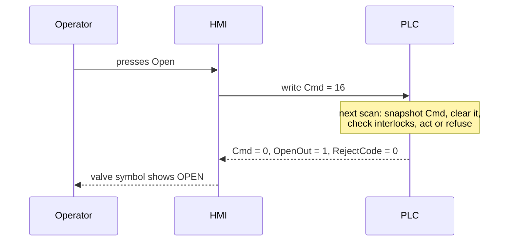
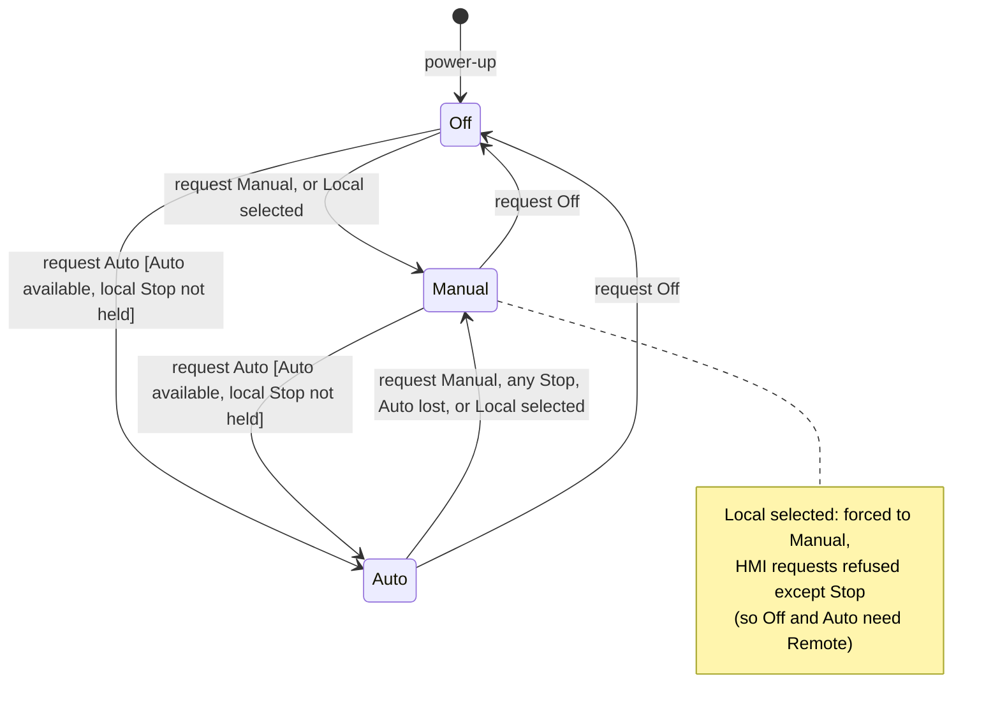

# 18 — HMI and SCADA Integration

> **Level:** 4 — Advanced · **Time:** ~10 hours · **Prerequisites:** [11 — Program Organisation](../11-program-organization/), [12 — Data Structures](../12-data-structures/), [16 — Alarms and Diagnostics](../16-alarms-and-diagnostics/), [17 — Industrial Communications](../17-industrial-communications/)

Operators rarely touch a PLC. They work through a screen: a touch panel on the machine, a
SCADA client in a control room, or a DCS operator station. Whatever they do (start a
pump, change a setpoint, switch a loop to Manual) reaches the PLC as a write to a tag. A
lot of trouble in real plants starts right there: a Start bit that stays on after the
network drops, a setpoint typed with one zero too many, two operators fighting over the same
pump from two screens, or a colourful screen where nobody notices the one value that
matters.

This module is about the PLC side of that boundary. You will learn where HMI, SCADA, DCS,
historian and MES sit in a plant, how to design command, status and configuration tags so
that the PLC stays in charge, how to build a command handshake that survives lost
communications, how to structure Off/Manual/Auto and Local/Remote modes with bumpless
changes, what makes a *high-performance* HMI (ISA-101), what historians and OEE reports
need from the PLC, and the basic security measures for these systems. The two labs build
the PLC half of a robust HMI interface: a command-word handshake with reject codes, and a
mode manager.

## Learning objectives

By the end of this module you should be able to:

- Explain what an HMI, SCADA, DCS, historian and MES each do, and place them in the
  ISA-95/Purdue levels.
- Estimate the communication load that an HMI or SCADA system puts on a PLC, and lay out
  the PLC's HMI data so that it can be read efficiently.
- Design an HMI interface with separate command, status and configuration tags, and
  apply the single-writer rule.
- Write a command handshake in which the PLC acts on each command exactly once, clears it,
  and reports acceptance or a reject code.
- Validate operator setpoints in the PLC, including NaN-safe range checks, and publish
  permissives so that the HMI can show why a device will not start.
- Design Off/Manual/Auto and Local/Remote mode logic with bumpless transfer, mode shedding
  and clear rules for who may change what.
- Apply ISA-101 high-performance HMI principles: muted backgrounds, colour for abnormal
  states only, analog indicators with normal bands, trends, and a display hierarchy.
- Describe what historians, OEE calculations and reports need from the PLC, and the basic
  security measures for HMI and SCADA systems.

## 1. The supervisory layer: HMI, SCADA, DCS, historian and MES

### 1.1 Who does what

The PLC does the control. Everything in this module sits *above* it and supervises it.

| System | What it is | Typical scope | Typical jobs |
|---|---|---|---|
| **HMI** (human-machine interface) | A screen and software for seeing and operating a machine or unit. Often a touch panel mounted in the machine's control cabinet door. | One machine, skid or small unit; one or a few PLCs | Start/stop, setpoints, mode selection, alarm list, simple trends, recipe selection |
| **SCADA** (supervisory control and data acquisition) | PC/server software that collects data from many PLCs and RTUs (remote terminal units) and lets operators supervise them | A whole site, or many sites spread over a wide area (water networks, pipelines, power distribution) | Overview displays, alarms, trends, history, reports, remote commands, often over slow or unreliable telemetry links |
| **DCS** (distributed control system) | Controllers, I/O, engineering tools, operator stations and historian from one vendor, sharing one database | Large continuous and batch process plants: refineries, chemicals, power stations | Everything SCADA does, plus tightly integrated control configuration, alarm management and change management |
| **Historian** | A time-series database for process values, states and events | From one unit to the whole enterprise | Long-term trends, reports, analysis, compliance records |
| **MES** (manufacturing execution system) | Software that manages production: orders, materials, genealogy, quality, performance | A site | Work orders, batch records, tracking and tracing, OEE, downtime analysis |

The boundaries blur. A PLC with a good SCADA package can look like a DCS, DCS vendors sell
PLC-like controllers, and many SCADA packages include a historian. What does not change
is the principle behind the word *supervisory*: **control and protection stay in the
controller**. SCADA servers get rebooted, networks fail and operator PCs freeze. The plant
must stay in a safe, controlled state when that happens. So:

- Never put logic that the process depends on into HMI scripts. If a pump must stop at
  low-low level, the PLC stops it (and a hardwired or safety-rated trip may stop it too,
  see [Module 20](../20-functional-safety/)).
- Anything that has to happen in less than about a second belongs in the PLC. A typical
  HMI update period is around a second, and a round trip through SCADA can take longer.
- Design every HMI interaction so that a lost connection leaves the plant as it was, or
  moves it to a safe state. Never leave it half-way through an operator action.

### 1.2 Where they sit

The ISA-95 standard ([Module 21](../21-architecture-and-standards/)) and the older Purdue
reference model describe a plant as functional levels. The version below is the one most people draw. ISA-95 itself groups
Levels 1 and 2 slightly differently, and Module 21 covers the details.

```text
 Level 4  Business planning & logistics   ERP: orders, stock, finance, planning
 ================================================================== DMZ (Module 22)
 Level 3  Manufacturing operations        MES, site historian, reporting,
                                          batch/recipe management
 ------------------------------------------------------------------
 Level 2  Supervisory control             HMI panels, SCADA servers and clients,
                                          DCS operator stations, engineering PCs
 Level 1  Basic control                   PLCs, DCS controllers, RTUs
                                          (safety controllers sit alongside)
 Level 0  The physical process            sensors, actuators, drives, valves
```

Data flows up: values, states, alarms and counts. Requests flow down: commands, setpoints,
recipes and production orders. The higher the level, the slower and less critical the data
becomes, and the less it should be trusted to act on the plant directly. The
firewall-protected zone between Levels 3 and 4 (the "demilitarised zone", DMZ), which
separates the plant networks from the business network, is a security topic covered in
[Module 22](../22-software-engineering/).

### 1.3 Panel HMIs and PC-based SCADA

| | Panel HMI | PC/server SCADA |
|---|---|---|
| Hardware | Touch panel with an embedded operating system, rated for the cabinet door | Industrial PCs or servers; clients on desks, in control rooms, in browsers |
| Architecture | Usually stand-alone: the panel talks straight to one or a few PLCs | Client/server: I/O servers poll the PLCs once; alarm, history and display servers share the data with many clients; often redundant servers |
| Configuration | Vendor tool, often in the same package as the PLC (TIA Portal, CODESYS) | Separate SCADA development environment; shared tag database; templates |
| Data storage | Small alarm and data logs, often on a memory card | Alarm journal, historian, SQL databases, reports |
| Licensing | Per panel, sometimes by tag count | Often by tag count, number of clients, and options such as history |
| Typical use | Machine operation, local skid control, a local HMI next to a process unit | Control rooms, multi-site supervision, anything that needs history and reporting |

Web-based HMIs (HTML5 clients that run in a browser) are now common in both groups. They
make remote viewing easy, which is also exactly why section 6 matters.

### 1.4 Tag-based communication

An HMI **tag** is a named reference to one data item in a controller: a name, a data type,
an address or symbol, an update rate, and often scaling, limits and alarm settings. There
are two ways to point a tag at PLC data:

- **By address**: Modbus holding register 40101, `%MW100`, `DB10.DBW4`. This works with
  any PLC, but the HMI breaks silently if someone moves the data in the PLC. Keep the
  register map as a controlled document and design the PLC data so that it never moves
  ([Module 17](../17-industrial-communications/) covers register maps and word order).
- **By symbol**: `P101.Sts.Running` in a Logix controller, a symbolic tag in an S7-1500,
  an OPC UA node. The HMI asks for the data by name, so the PLC program can be
  reorganised without breaking the HMI, as long as the names stay the same.

How the data moves:

- **Reads are polled.** The HMI groups tags into requests and repeats them at the update
  rate. Some protocols can report by exception instead (OPC UA subscriptions, for
  example), but polling is still the norm between HMI and PLC. Many HMIs poll only the
  tags on the displays that are open, plus the tags needed for alarms, logging and
  scripts, all the time.
- **Writes are events.** A write happens when the operator does something: presses a
  button, types a value. There is normally no retry that the PLC can see, and no
  guarantee about *when* in the PLC scan the new value lands. Section 2 builds on this.

### 1.5 Polling rates and PLC load

Each HMI request costs the PLC communication processing time. Depending on the platform,
that time is taken out of the scan, given a fixed share of the CPU, or handled by a
separate processor. Either way, the number of *requests* matters more than the number of
*tags*.

**Worked example: a pump station on Modbus TCP.** SCADA monitors 40 pumps. For each pump
the PLC publishes a status word, an alarm word, the active mode, a reject code (one
register each), plus speed and motor current as REAL values (two registers each): 8
registers per pump, 320 registers in total.

- **Scattered layout.** The six items of each pump sit wherever the programmer happened
  to put them. In the worst case every item needs its own request: 6 × 40 = 240 requests
  per update. If one request/response takes, say, 5 ms end to end (an assumption: it
  depends on the PLC, the network and whether the driver can have several requests in
  flight), one full update takes 240 × 5 ms = 1.2 s. With a 1 s update rate the SCADA
  can never keep up, and operators look at values that are older than they think.
- **Contiguous layout.** The PLC keeps all 320 registers in one block, pump after pump.
  A Modbus read (function 03) returns at most 125 registers, so one update needs three
  requests (125 + 125 + 70): about 15 ms of communication per second.
- **Many clients.** If three SCADA clients polled the PLC directly, the load would triple.
  With a client/server architecture, one I/O server polls the PLC once and shares the data.

Practical update rates (typical figures, not rules):

| Data | Typical update |
|---|---|
| Process displays (levels, flows, temperatures) | about 1 s |
| Machine HMIs where operators watch motion or fast counts | 250–500 ms |
| Alarm conditions | as fast as the displays, or faster if the alarm system polls separately |
| Historian collection | per tag, from about 1 s for fast loops to a minute or more for slow values such as tank temperatures |
| Sequence-of-events timestamps | never from HMI polling: timestamp in the PLC or I/O ([Module 16](../16-alarms-and-diagnostics/)) |

Design rules that follow:

1. Group HMI data per device in contiguous blocks, and put status and alarm bits into
   words rather than scattering hundreds of BOOLs.
2. Separate what the HMI reads often (status) from what it rarely reads (configuration).
3. Don't poll faster than people can use. A screen value that changes 10 times a second
   is not easier to read than one that changes once.
4. Check the controller's limits: the number of simultaneous connections, and any setting
   for how much CPU time communication may take.

## 2. Designing the PLC side of the HMI interface

### 2.1 Command, status and configuration tags

Split every device's HMI data by **direction** and by **who writes it**:

| Class | Direction | Written by | Examples | Rules |
|---|---|---|---|---|
| **Command** | HMI → PLC | HMI sets; PLC only clears | Start, Stop, Reset, Acknowledge, mode request | A request, not an order: the PLC decides. Acted on once, then cleared (section 2.3) |
| **Setpoint / request** | HMI → PLC | HMI | Requested speed, level setpoint, manual output | Validated by the PLC before use (section 2.6) |
| **Configuration** | HMI → PLC | HMI, at engineer level only | Alarm limits, timer presets, setpoint limits, enable/disable options | Retentive, change-controlled, validated, rarely written |
| **Status** | PLC → HMI | PLC only, every scan | Running, Faulted, Ready, active mode, active setpoint, reject code, process values | Read-only for the HMI |

The most important rule is the **single-writer rule**: every tag has exactly one writer. If the
HMI and the PLC both write the same tag, the result depends on timing. A typical bug: an
HMI numeric field shows the pump's mode and lets the operator type a new one straight
into the same tag. The PLC then changes the mode itself (say, it drops to Manual on a
fault). The HMI may already hold the old value in a pending write, and puts it back.

Command tags are the one deliberate exception, and only in a strictly limited form: the
HMI only ever sets a command and the PLC only ever clears it, so the two writers never
compete to hold a value. Section 2.3 shows how to make that safe, and the sequence-number
pattern in section 2.4 removes even this shared write.

The same rule protects the PLC's state. Keep the real state (the mode, the active setpoint,
the latched fault) in internal variables, and *copy* it to the HMI status tags every scan.
Then a faulty HMI, a script or a mistyped engineering write into a status tag is simply
overwritten on the next scan. It can never change what the PLC is doing. Both labs in this
module test for this.

In code, this is the device data model from [Module 12](../12-data-structures/)
(Cmd/Sts/Cfg/Alm) with the direction written on every member:

```iecst
TYPE
  ST_PumpHmi : STRUCT
    (* HMI -> PLC *)
    Cmd        : WORD;   (* command bits: the HMI sets them, the PLC clears them *)
    SpeedReq   : REAL;   (* requested speed, % - validated before use *)
    (* PLC -> HMI (written by the PLC every scan) *)
    Sts        : WORD;   (* status bits: running, faulted, ready, ... *)
    RejectCode : INT;    (* 0 = last command accepted, otherwise why not *)
    SpeedSP    : REAL;   (* the speed setpoint actually in use, % *)
    PermWord   : WORD;   (* one bit per start permissive, 1 = OK *)
  END_STRUCT;

  ST_PumpCfg : STRUCT    (* engineer level, retentive, change-controlled *)
    SpeedMin   : REAL;   (* lowest speed an operator may enter, % *)
    SpeedMax   : REAL;   (* highest speed an operator may enter, % *)
    FbkTimeout : TIME;   (* run feedback must arrive within this time *)
  END_STRUCT;
END_TYPE
```

Keeping configuration in its own structure lets you give it its own access level on the
HMI, poll it rarely, and put it under change control.

### 2.2 Why HMI buttons need a handshake

The obvious way to make an HMI Start button is a *momentary* button: the HMI writes TRUE
to a BOOL tag while the button is pressed and FALSE when it is released. The PLC then
treats the tag like a physical push-button:

```iecst
(* DON'T: the HMI buttons are used as level signals *)
PumpRun := (HmiStartPB OR PumpRun) AND NOT HmiStopPB AND OverloadOK_NC;
```

A hardwired push-button is a closed circuit that the PLC reads every scan. An HMI button is
two separate network messages, and either of them can go missing.

**Stuck bit.** The link drops (cable pulled, HMI crashed, tablet walked out of Wi-Fi range)
after the "pressed" write and before the "released" write. The FALSE never arrives:

```text
                      press                release
Finger on button   ___|--------------------|______________
HMI-PLC link OK    ------------|__________________________   link lost here
PLC tag HmiStartPB ___|-----------------------------------   stuck TRUE
```

With the seal-in rung above, a stuck Start bit means that any stop condition that clears
by itself restarts the pump: the overload relay is reset, or the stop condition goes away,
and the pump starts with nobody at the HMI. For a jog or hold-to-run button it is worse:
the motion simply does not stop.

**Lost press.** Both writes of a short tap can land between two reads of the tag: during a
long scan, or when communication is serviced in parallel with the program. The PLC never
sees TRUE, and the operator sees a button that "sometimes doesn't work".

**Level instead of event.** Anything the PLC does *while* the bit is TRUE happens once per
scan: with a 10 ms scan, a "+1" button adds 50 in half a second, and a Reset held down keeps
resetting.

**Two writers.** A second HMI or a SCADA client writes the same tag, and each writer
overwrites the other's value.

The fix is to stop treating the HMI as a switch. A command is a **message**. The PLC
receives it, acts on it once, confirms it and forgets it.

### 2.3 The PLC-clears-the-command pattern

A widely used handshake is simple:

1. The HMI **sets** a command bit (or writes a command value). It never clears it.
2. The PLC takes a **snapshot** of the command tag and **clears** the tag immediately. All
   later logic uses the snapshot, so each command is acted on exactly once.
3. The PLC checks whether the command is allowed, acts or refuses, and reports the result
   in status tags: the new state, or a **reject code**.
4. The HMI knows that the command has been received when the bit goes back to 0. If it is
   still set after a few seconds, the HMI can show "PLC not responding".



Here is the pattern for an on/off valve with Open and Close commands in one command word:

```iecst
FUNCTION_BLOCK FB_ValveCmd
  VAR_INPUT
    InterlockOK : BOOL;          (* TRUE = the valve may be opened *)
  END_VAR
  VAR_IN_OUT
    Cmd : WORD;                  (* the HMI's command word: this FB clears it *)
  END_VAR
  VAR_OUTPUT
    OpenOut    : BOOL;           (* solenoid: TRUE = open *)
    RejectCode : INT;            (* 0 accepted, 1 undefined bit, 2 interlocked *)
  END_VAR
  VAR
    Snap : WORD;
  END_VAR

  Snap := Cmd;                   (* 1. take a snapshot...           *)
  Cmd := 16#0000;                (*    ...and clear the tag at once *)

  IF Snap <> 16#0000 THEN        (* 2. act once, on the snapshot    *)
    RejectCode := 0;
    IF (Snap AND 16#0002) <> 16#0000 THEN        (* bit 1 Close: never refused *)
      OpenOut := FALSE;
    ELSIF (Snap AND 16#FFFC) <> 16#0000 THEN     (* a bit nobody defined *)
      RejectCode := 1;
    ELSIF NOT InterlockOK THEN                   (* bit 0 Open *)
      RejectCode := 2;
    ELSE
      OpenOut := TRUE;
    END_IF;
  END_IF;

  IF NOT InterlockOK THEN        (* 3. the interlock also closes an open valve *)
    OpenOut := FALSE;
  END_IF;
END_FUNCTION_BLOCK
```

It is called with the HMI's command register, for example
`XV101(InterlockOK := TankNotHigh, Cmd := XV101_HmiCmd);`. Details worth copying:

- **Bits are tested with masks.** `(Snap AND 16#0002) <> 16#0000` tests bit 1. CODESYS and
  Rockwell also let you write `Snap.1`, and TIA Portal `Snap.%X1`. MATIEC supports neither,
  so the course uses masks, which work everywhere.
- **The "safe" command wins and is never refused.** If a word contains both Open and
  Close, the valve closes. A Stop or Close from any source should always be obeyed.
- **Undefined bits are refused, not ignored.** A word with a bit nobody defined means the
  HMI and PLC disagree about the interface (wrong version, wrong register, corrupted
  value). Doing nothing and reporting it is safer than guessing.
- **The snapshot and the clear are next to each other.** On many controllers
  communication is serviced asynchronously to the logic, so an HMI write can land between
  any two instructions. The fewer instructions between reading and clearing, the smaller
  the window in which a new write could be wiped out before it is seen. (Rockwell
  provides a synchronous copy instruction, `CPS`, for the related problem of data that
  I/O updates or other tasks might change part-way through a copy.) Section 2.4 shows a
  pattern that has no such window.

Two more rules complete the pattern:

- **Discard stale commands at power-up.** A command that is already waiting on the first
  scan was written before a power cut or a download, or survived in retentive memory.
  Executing it now could start equipment unexpectedly. Clear it without acting.
- **Beware of read-modify-write on shared command words.** Some HMIs "set bit 2" by
  reading the whole word, OR-ing in the bit and writing the word back. If the HMI reads
  while an earlier command is still pending, and the PLC clears the word before the write
  arrives, the old command comes back and is executed twice. Fixes: configure the HMI to
  write the whole command *value* (write 16#0004, don't OR it in), use one register or
  one coil per command, or use the sequence-number pattern below. Modbus also defines a
  "mask write register" function (function code 22) that changes selected bits inside the
  server without a separate read, but many devices do not support it.

### 2.4 Other handshake styles

**One coil per command.** Each command gets its own BOOL (a Modbus coil, written with
function 05). The HMI sets it and the PLC clears it. There is no shared word, so no
read-modify-write problem. This costs more tags but is easy to understand.

**Command code plus sequence number.** The HMI writes a command code and then increments a
sequence number, ideally in the same multi-register write with the sequence number last.
The PLC acts whenever the sequence number differs from the last one it handled, then echoes
that number back with a result. The PLC never writes the HMI's tags, so nothing can be
wiped out by a clear. And the HMI knows exactly which command a result belongs to, which
helps when several clients share a device or when commands travel over slow telemetry.

```iecst
FUNCTION_BLOCK FB_SeqCommand
  VAR_INPUT
    CmdCode : INT;               (* HMI -> PLC: 1 = Start, 2 = Stop *)
    CmdSeq  : INT;               (* HMI -> PLC: the HMI adds 1 for every new command *)
    Permit  : BOOL;
  END_VAR
  VAR_OUTPUT
    AckSeq    : INT;             (* PLC -> HMI: CmdSeq of the last command handled *)
    AckResult : INT;             (* PLC -> HMI: 0 done, 1 unknown code, 2 not permitted *)
    Run       : BOOL;
  END_VAR
  VAR
    Started : BOOL;
  END_VAR

  IF NOT Started THEN            (* first call after power-up: anything *)
    AckSeq := CmdSeq;            (* already waiting is old news          *)
    Started := TRUE;
  END_IF;

  IF CmdSeq <> AckSeq THEN       (* a new command has arrived *)
    IF CmdCode = 2 THEN
      Run := FALSE;
      AckResult := 0;
    ELSIF CmdCode = 1 THEN
      IF Permit THEN
        Run := TRUE;
        AckResult := 0;
      ELSE
        AckResult := 2;
      END_IF;
    ELSE
      AckResult := 1;
    END_IF;
    AckSeq := CmdSeq;            (* the echo: "command number CmdSeq is done" *)
  END_IF;
  IF NOT Permit THEN
    Run := FALSE;
  END_IF;
END_FUNCTION_BLOCK
```

**Hold-to-run with a heartbeat.** Some functions really do need "only while the button is
held": jogging a conveyor to line up a product, or inching a mixer blade into position.
The PLC cannot trust a held bit alone, so the HMI also sends a **heartbeat** (a counter it
changes every couple of hundred milliseconds while the button is held). The PLC stops as
soon as the heartbeat stops changing. The worked examples show a complete block. An HMI
jog is an operating convenience, not a safety function: where a person can reach the
moving parts, hold-to-run needs a hardwired or safety-rated enabling device
([Module 20](../20-functional-safety/)).

| Pattern | Good for | Watch out for |
|---|---|---|
| Momentary BOOL (HMI writes 1, then 0) | Nothing that matters | Stuck bits, lost taps, level-triggered actions |
| Command word or coil, PLC clears | Most device commands | Read-modify-write on shared words; asynchronous comms |
| Code + sequence number, PLC echoes | Several clients, telemetry, audit | The HMI must write the code before (or with) the number |
| Held bit + heartbeat | Jog / inch from an HMI | Never a safety function; add a maximum run time |

### 2.5 Acknowledge and reject: telling the operator what happened

A command that silently does nothing is the most common complaint about HMIs ("I pressed
Start and nothing happened"). Every command must produce visible feedback:

- **Accepted:** the status changes (the pump shows Running), and the reject code is 0.
- **Refused:** the reject code says why, in terms the operator can act on. The HMI turns
  the number into text with a text list or multi-state indicator: *"Start refused: suction
  level low (LSL-101)"* is useful, *"Command error 3"* is not.
- **Not received:** the command bit has not cleared after a timeout, so the HMI shows a
  communication problem.

Good practice:

- Keep the reject codes in the interface specification, next to the command bits, and
  never reuse a number for a different meaning.
- Show the **actual state** on the graphic (the pump symbol follows `Sts.Running`), never
  the command. If the contactor did not pull in, the operator must see that. The
  commanded-versus-actual discrepancy is a feedback-timeout alarm in
  [Module 16](../16-alarms-and-diagnostics/).
- Log refused commands in the event journal. Repeated refusals are often the first sign
  of a wrong interlock or a confused operator.
- A reject code stays until the next command, so a slow HMI still sees it. If the HMI
  must tell two identical refusals apart, use the sequence-number pattern.

### 2.6 Setpoint validation and limits

HMI entry fields have minimum and maximum settings, and you should use them: they give the
operator immediate feedback. But they are a convenience, not a protection:

- Other clients can write the same tag: a second HMI, SCADA, a script, a historian's
  write-back, an engineering tool, or someone on the network with a Modbus utility.
- The HMI limit may be configured wrongly, or not at all, or left over from an old
  version.
- A REAL tag can receive values no entry field would produce, such as NaN
  ("not a number") or infinity.

**So the PLC validates every setpoint before it uses it.** The usual structure is a
request/active pair: the HMI writes `SpeedReq`, the PLC checks it and copies it to its
internal active setpoint, and the HMI *displays* the active value (`SpeedSP`), so the
operator always sees what is really in use. Choices to make:

- **Reject or clamp?** For operator entries, reject and say so. The operator meant
  something, and silently changing 150 % into 100 % hides a mistake. For values from
  other systems (a remote setpoint from SCADA or an optimiser), clamping to the limits and
  raising an indication is often better than refusing them.
- **Rate of change.** For setpoints that could upset the process, move the working
  setpoint towards the new value at a limited rate (the setpoint rate limiter from
  [Module 15](../15-pid-control/)), or refuse steps larger than a configured size.
- **Limits are configuration.** Store `SpeedMin`/`SpeedMax` in the configuration
  structure, restrict who may change them, and validate them too (`Min < Max`, inside the
  instrument range).
- **Units.** Agree who scales (PLC or HMI) and write the unit in the tag description. A
  PLC that expects raw counts 0–27648 and an HMI that writes percent is a classic
  commissioning fault.

The NaN trap deserves a closer look. Every ordered comparison (`<`, `<=`, `>`, `>=`) with
NaN is FALSE, and so is `=`. This check looks reasonable, but it **accepts NaN**, because
both comparisons are FALSE:

```text
IF Sp < SpMin OR Sp > SpMax THEN   (* reject *)   ... NaN is NOT rejected
```

Write the test the other way round, as "accept only if inside the range":

```iecst
FUNCTION F_InRange : BOOL
  VAR_INPUT
    Value : REAL;
    Lo    : REAL;
    Hi    : REAL;
  END_VAR
  (* Written as "inside the range" on purpose. A NaN makes each of these
     comparisons FALSE, so a NaN value, or a NaN limit, gives FALSE. *)
  F_InRange := (Value >= Lo) AND (Value <= Hi) AND (Lo < Hi);
END_FUNCTION
```

The course's test harness confirms the difference: with a NaN setpoint the first check
lets it through and `F_InRange` refuses it. Some platforms offer an explicit test for
invalid floating-point values as well, and it is worth using where it exists.

A real case shows why the PLC needs its own limits. In February 2021, at a water treatment
plant in Oldsmar, Florida, the sodium hydroxide setpoint on the HMI was changed through
remote-access software from 100 ppm to 11,100 ppm. An operator saw it happen and set it
back, and officials said other safeguards would have caught the change. Later reporting
questioned whether an outside attacker was involved at all. Either way, the lesson for
PLC programmers is the same: the controller should refuse a dosing setpoint far outside
its engineered range, whoever or whatever typed it.

### 2.7 Showing permissives and interlocks

"Why won't it start?" is the question an HMI should answer without a phone call to the
control engineer. Recall the difference from [Module 05](../05-boolean-logic-and-fbd/): a
**permissive** must be true before a start is allowed, and an **interlock** stops running
equipment when it is lost. The PLC should publish:

- one summary bit, such as `Ready` (a start would be accepted now), which lets the HMI grey
  out or highlight the Start button;
- **each individual condition**, so that a permissive pop-up on the faceplate can list
  them and point to the one that is missing;
- for trips, which condition tripped first (first-out, [Module 16](../16-alarms-and-diagnostics/)).

A permissive word is the compact way to publish the conditions, one bit each:

```iecst
(* Start permissives for P-101, one bit each, 1 = OK *)
Perm := 16#0000;
IF SuctionValveOpen     THEN Perm := Perm OR 16#0001; END_IF;
IF NOT DischValveClosed THEN Perm := Perm OR 16#0002; END_IF;
IF TankLevelOK          THEN Perm := Perm OR 16#0004; END_IF;
IF NOT Faulted          THEN Perm := Perm OR 16#0008; END_IF;
IF MccReady             THEN Perm := Perm OR 16#0010; END_IF;
StartPermitted := (Perm = PERM_ALL);   (* PERM_ALL = 16#001F *)
P101.PermWord := Perm;
```

The HMI shows one line per bit ("Suction valve open ✔", "Discharge valve not closed ✘"),
with the text list kept in the same document as the bit assignments. Using the same logic
for the start decision and for the display means the display cannot disagree with the PLC.

### 2.8 Faceplates backed by device structures

A **faceplate** is a reusable pop-up window for one type of device: motor, valve, PID loop,
analog input. It shows the device's state, mode, alarms, permissives and values, and offers
its commands. Each faceplate *instance* is connected to one instance of the device's data
structure in the PLC.

```text
 ----------------------------- PLC -----------------------------   -- HMI / SCADA --
 +-------------------+              +--------------------+         +----------------+
 | P101 : FB_Motor   |  writes .Sts | P101_Hmi           |  tags   | faceplate      |
 | (device logic,    |  .SpeedSP... |   : ST_MotorHmi    |<------->| "Motor",       |
 |  Module 11)       |------------->| .Cmd   .SpeedReq   |         | opened for P101|
 |                   |<-------------| .Sts   .SpeedSP    |         +----------------+
 |                   |  reads .Cmd, | .RejectCode ...    |
 +-------------------+  .SpeedReq   +--------------------+
 +-------------------+              +--------------------+         +----------------+
 | P102 : FB_Motor   |<------------>| P102_Hmi           |<------->| the same       |
 +-------------------+              +--------------------+         | faceplate, P102|
                                                                   +----------------+
```

The device FB and its HMI structure both live in the PLC. The faceplate on the HMI is
bound to one structure instance (by symbol, or by the address of its register block).

One design serves every motor in the plant, so:

- **Every device of a type behaves and looks the same.** Operators learn it once.
- **Adding a device is configuration, not programming.** Create the FB instance and the
  structure, then point a faceplate at it.
- **Testing is done once**, on the library object, and then trusted everywhere.
- **The interface is a versioned unit.** When you add a member to `ST_MotorHmi`, the
  faceplate changes with it. Keep both in the same library, under the same version number.

This combination of PLC function block, HMI data structure and faceplate is what vendors
sell as a *process library* (see the vendor notes), and what most system integrators
build for themselves. The PLC side is the device FB from
[Module 11](../11-program-organization/) and the data model from
[Module 12](../12-data-structures/). If the HMI reaches the PLC by address (Modbus), make
the structure a contiguous block of registers with a fixed layout, as in section 1.5.

## 3. Modes: who is in control?

A **mode** answers one question: *who may command this device right now?* The mode belongs to
the device (or loop, or unit) and lives in the PLC. It is not a property of a screen.

### 3.1 Off, Manual and Auto

| Mode | Who commands the device | Typical behaviour |
|---|---|---|
| **Off** (or *Out of service*) | Nobody | Output off, start commands refused. Used for equipment that is isolated, broken or not needed |
| **Manual** (or *Operator*) | The operator, one command at a time | Start/stop, open/close or a manual output value, from the HMI or a local station |
| **Auto** (or *Program*) | The control program: a sequence, a level controller, a PID | The device follows the program's demand. Operator start commands are refused, but a stop is still obeyed |

Control loops use the same idea with more steps ([Module 15](../15-pid-control/)): *Manual*
(the operator sets the valve output), *Auto* (the PID works to its local setpoint) and
*Cascade* or *Remote setpoint* (the setpoint comes from another controller or system). The
names vary between vendors, and ISA-88 has its own formal model for batch equipment
([Module 21](../21-architecture-and-standards/)). Some rules hold whatever the names:

- **Interlocks and permissives apply in every mode.** Manual means "the operator decides
  when", not "anything goes".
- **A stop is obeyed in every mode**, and specifications commonly require it from every
  location that can command the device. Starts come only from whoever owns the device.
- **Decide the power-up mode deliberately.** Off, or Manual with everything stopped, is the
  usual choice. Some unattended plants (a remote pumping station, for example) must return
  to Auto after a power cut. That is a legitimate design, but it needs to be agreed, and
  it is often combined with staggered restarts.

### 3.2 Local and Remote: the control location

The mode says *who* commands. The **control location** says *from where*:

| Location | Typical hardware | Who is there |
|---|---|---|
| Field (local) | Local control station next to the motor: Local/Remote selector, Start and Stop buttons | Field operator, maintenance technician |
| Motor control centre | Hand/Off/Auto (HOA) switch on the starter | Electrician |
| Local HMI | Panel HMI in the plant area | Area operator |
| Central SCADA / DCS | Control-room clients | Board operator |

There are two very different ways to build "Local":

- **Hardwired Hand (HOA at the starter).** In Hand the contactor is energised through the
  switch, bypassing the PLC completely. Only hardwired protections remain (the overload
  relay, perhaps a hardwired level switch). The PLC cannot stop the motor. It should read
  the switch position, raise a "not in Auto" indication, and never assume that a motor is
  stopped just because the PLC is not commanding it.
- **Software Local/Remote (Lab 18-2).** The selector and the local buttons are PLC inputs.
  The PLC gives control to the local station, and every PLC interlock still applies.

Rules for a software Local/Remote design:

- **One location has control at a time.** The others can watch. HMI start commands in Local
  are refused with a reason code ("Local control selected").
- **Stop from anywhere** is obeyed.
- **Transfers are bumpless** (section 3.4). The pump does not stop because someone turned a
  key.
- **Think about wiring faults.** A single contact that is TRUE for Local reads as Remote when
  its wire breaks, so the control room could start a pump that a technician believes is
  under local control. A selector with two contacts (one for Local, one for Remote) lets the
  PLC detect "neither" or "both" and treat it as a fault. And local control never replaces
  isolation: anyone working *on* the equipment uses lock-out/tag-out.

The same conflict appears between screens: two operators on two HMIs commanding the same
unit. Common solutions are **area responsibility** (each station may operate only its own
area) and a **control token**. With a token, a station requests control of a unit, the
PLC or SCADA grants it to one station at a time, and it is released on request, on timeout
or when the station disconnects. Telemetry outstations often have their own Local/Remote
switch so that site staff can take over from the central SCADA.

### 3.3 Maintenance and simulation modes

**Maintenance mode** lets a technician do things that normal operation forbids: stroke a
valve while the unit is shut down, jog a conveyor out of sequence, bump a motor to check its
direction of rotation. Typical rules:

- only authorised users (a higher user level, or a physical key switch that proves someone
  is at the machine);
- clearly visible: a banner on the area's displays and a distinct marker on the device;
- logged: who entered it, when, and what was done;
- limited: a time-out, or automatic cancellation at shift change or when the unit starts;
- it may bypass *process* permissives only where the design says so, and **never** a
  safety function. Safety-function bypasses have their own authorisation, indication,
  time limits and records ([Module 20](../20-functional-safety/)).

**Simulation mode** makes a device answer with simulated feedback instead of field signals:
a valve "reaches" its open limit switch after a simulated travel time, a motor "runs"
without a contactor. It is used to test sequences and HMIs without the plant (virtual
commissioning, [Module 22](../22-software-engineering/)) and to train operators. In
production it is dangerous, because the PLC believes something that is not true. So:
force the simulated device's real outputs off, allow simulation only in a test
configuration or with a physical key, show it on every affected display, and keep a
"simulation active" alarm on while any device is simulated.

Neither of these is **forcing**, which overrides I/O underneath the program from the
programming tool. Forcing and its dangers are covered in
[Module 23](../23-commissioning-and-troubleshooting/).

### 3.4 Bumpless mode changes

A mode change should not by itself make the plant jump. **Bumpless transfer** means the
device or loop continues from where it is, and moves only if the new owner wants it to. The
technique is **tracking**: while one owner is in charge, the other owner's value follows the
actual output, so it is already right at the moment of transfer.

For a discrete device, as in Lab 18-2:

- **Auto → Manual:** the manual run state tracks the actual state while in Auto. After the
  change, a running pump keeps running and a stopped pump stays stopped. The operator then
  decides.
- **Manual → Auto:** the device goes to whatever Auto demands. If Auto wants it running, it
  keeps running without dropping out for even one scan. If Auto wants it stopped, it
  stops. Whether that stop is acceptable is a process decision: some specifications allow
  the change only when demand and state already match.
- **Local ↔ Remote:** the state is kept, and the new location starts from whatever the
  device is doing.

For an analog output, such as a PID loop driving a control valve ([Module 15](../15-pid-control/)):

- **Auto → Manual:** the manual output tracks the PID output while in Auto, so the valve
  stays where it was.
- **Manual → Auto:** the PID must start from the present output, not from stale internal
  values. Most PID blocks have a tracking (or manual) input: while it is active, the PID
  output follows the actual output and the integral term is adjusted to match. Many loops
  also track the setpoint to the measured value while in Manual, so there is no error to
  react to at the moment of switching.

The worked examples include a complete Auto/Manual block for an analog output.

### 3.5 Write the mode rules down first

Mode logic collects edge cases quickly: what happens if Auto is requested while the local
Stop is held? If the transmitter fails while in Auto? Draw the states and write a rules
table *before* coding, and get operations to agree to it. For the pump in Lab 18-2:



"Auto lost" covers **mode shedding**: when Auto can no longer work (for example the level
transmitter the controller depends on has failed), the device drops to Manual and keeps its
state, and the operator is told. DCS function blocks commonly shed to a lower mode in the
same way when their input goes bad. The alternative, carrying on in Auto with a bad
measurement, is how tanks overflow.

### 3.6 User levels: who may change what

| Role | Typical rights |
|---|---|
| Viewer | Look at displays and trends; no commands |
| Operator | Commands and setpoints (within limits) for their own area; alarm acknowledgement; Auto/Manual |
| Shift supervisor | As operator, plus alarm shelving, recipe or campaign selection |
| Maintenance technician | Maintenance mode, device diagnostics, run-hour resets |
| Control or process engineer | Configuration: limits, alarm settings, tuning, simulation |
| Administrator | User accounts and security settings; normally no operating rights |

Principles:

- **Least privilege.** Each person gets the rights their job needs, and no more. The
  administrator account is not used to operate the plant.
- **Individual accounts.** A shared "operator/operator" login makes every audit trail
  meaningless.
- **Area responsibility.** An Area 1 operator may view Area 2 but not operate it.
- **Enforcement belongs in the HMI/SCADA and the network** ([Module 22](../22-software-engineering/)).
  A PLC cannot see who is logged in. Some designs send the user's level to the PLC with
  each command, which is useful for logging, but it is not security: anyone who can write
  the command tag can also write any user level. Where the PLC must *know*, use something
  the network cannot fake, such as a key switch.
- **Don't lock out the control room.** Automatic log-off protects unattended screens, but a
  control-room display that locks itself in the middle of an upset is a hazard. A common
  compromise is to drop to view-only rather than blank the screen.

### 3.7 Audit trails

An audit trail records who changed what, when, from where, from which value to which value,
and ideally why. SCADA and DCS systems keep an event journal of operator actions: commands,
setpoint and mode changes, alarm acknowledgements and shelving, log-ins. The PLC design
must support it:

- Changes that arrive by another route (a second HMI, an engineering tool, a script) never
  pass through the SCADA journal. The PLC can detect changes to critical configuration
  itself and report them, for example by recording old value, new value and time in a
  ring buffer ([Module 12](../12-data-structures/)) that the historian collects.
- Refused commands belong in the journal too.
- In regulated industries audit trails are a legal requirement. Pharmaceutical production
  is the usual example: in the US, electronic records and signatures fall under FDA
  21 CFR Part 11.
- For process safety, changing an alarm limit or a trip setting is a change to the plant.
  It goes through management of change (MOC), not just into a log.

## 4. High-performance HMI (ISA-101)

### 4.1 Why the traditional style fails

Many older process displays copy the P&ID: every pipe and vessel drawn in bright colour on
a black background, 3D pumps, animated flames, running pumps green and stopped pumps red,
and numbers with no context. It looks impressive and works badly when something goes
wrong:

- When everything is colourful, an alarm colour does not stand out.
- A number such as "62.4" means nothing until the operator remembers what is normal for
  that tag, for each of hundreds of tags.
- A picture of the plant's structure is not a picture of the plant's *condition*.

Research into abnormal situation management (for example by the Abnormal Situation
Management Consortium, an industry and university research group) and practitioner guidance
such as *The High Performance HMI Handbook* led to a different approach.
**ANSI/ISA-101.01**, first published in 2015, sets out a lifecycle for designing, building
and maintaining HMIs for process automation. The international standard **IEC 63303**
(2024) is based on it. ISA-101 is mainly a *work-process* standard:
it requires you to define an HMI philosophy and a style guide and to apply them
consistently. It does not say "make it grey". The grey, low-colour look is the widely
adopted practice that follows from its principles.

### 4.2 Core principles

| Principle | In practice |
|---|---|
| **Normal looks calm** | Light grey or muted background, equipment in shades of grey, values in dark text, no animation while things are normal |
| **Colour means abnormal** | Saturated colours are reserved for alarms and abnormal states. An alarm colour is never used for anything else, so it always means "look here" |
| **Redundant coding** | Alarm priority is shown by colour *and* shape *and* text, because a noticeable fraction of men (often quoted as about 1 in 12) have some colour-vision deficiency, and screens and lighting vary |
| **Information, not data** | Values are shown with context: normal range, alarm limits, target, trend |
| **Consistency** | One style guide: the same symbols, positions and navigation on every display |
| **Minimal decoration** | No 3D, photos or gradients; thin grey lines for pipes; flow shown with arrows |
| **Legibility** | Text size and contrast chosen for the operator's real viewing distance |

**Equipment state without colour.** Show a running pump as a filled symbol and a stopped
pump as an outline, with the state as text ("RUN", "STOP"). This also avoids the clash
between colour conventions: in electrical power practice red usually means *energised* or
*closed* and green *de-energised* or *open*, while many process plants used green for
running and red for stopped. Two meanings for red on one site guarantee confusion.

Physical pilot lights and push-buttons on machines follow their own convention: IEC 60204-1
gives meanings for indicator colours (red: emergency, yellow: abnormal, blue: mandatory
action, green: normal, white: neutral). Panel lamps and screen graphics are separate
decisions, but check them against each other for conflicts.

Here is an example of an alarm style guide (one plant's choice, not a standard):

| Priority | Colour | Symbol | Unacknowledged | Acknowledged | Shelved |
|---|---|---|---|---|---|
| 1 (highest) | red | square with "1" | symbol flashes | symbol steady | grey outline with "S" |
| 2 | yellow | triangle with "2" | symbol flashes | symbol steady | grey outline with "S" |
| 3 | magenta | diamond with "3" | symbol flashes | symbol steady | grey outline with "S" |

Only the alarm symbol flashes, never the value or the whole equipment picture, and it stops
flashing when the alarm is acknowledged.

### 4.3 Values in context: analog indicators

The high-performance way to show a value is an **analog indicator**: a bar or scale with the
normal band, the alarm limits and a pointer. The operator sees "inside the normal band" at
a glance, without reading the number.

```text
 LT-201  WET-WELL LEVEL                                  62.4 %
 +-------+-------+=============================+-------+-------+
 |  LL   |   L   |        normal range         |   H   |  HH   |
 +-------+-------+=============================+-------+-------+
 0       10      20                  ^         80      90    100 %
                                    62.4
```

Line several indicators up so that all pointers sit in the middle when everything is normal.
Then the one value that is drifting jumps out as a broken pattern:

```text
 P-201   Flow        [------|=====^======|------]
         Current     [------|======^=====|------]
         Bearing T   [------|=====^======|------]
         Vibration   [------|============|--^---]   <-- this one
```

For this, the PLC or the tag database must supply the normal band and alarm limits, not just
the value. Put them in the device's configuration structure so the indicator, the alarm and
the logic all use the same numbers.

### 4.4 Trends

- Put small trends of the key values on the operating displays (Level 2), not only on a
  separate trend screen.
- Show the setpoint and the alarm limits on the trend.
- Use fixed, sensible scales and time spans. Auto-scaling makes noise look like an upset.
- Trends show *direction and rate*. An operator who sees a level rising 2 % per minute
  towards its high alarm can act before the alarm comes.

### 4.5 Display hierarchy and navigation

ISA-101 and the high-performance HMI literature describe a display hierarchy, usually drawn
as four levels:

| Level | Purpose | Typical content |
|---|---|---|
| **1 — Overview** | The whole area of responsibility at a glance: "is everything all right, and where should I look?" | Key performance indicators, key analog indicators, alarm counts per area, state of major equipment. Often a large wall screen, with little or no control |
| **2 — Unit operation** | Operating one process unit or area: where operators spend most of their time | Main equipment, loops, controls, embedded trends |
| **3 — Unit detail** | One piece of equipment or subsystem in detail | All devices, interlock and permissive details, detailed status |
| **4 — Support and diagnostics** | Information not needed for moment-to-moment operation | Device diagnostics, alarm details, help, procedures, point detail |

Navigation should be as consistent as the graphics: the same navigation bar on every
display, drill-down from Level 1 to 2 to 3 by clicking the area or equipment, one action
from any alarm to the display that shows it, and "back" and "home" in the same place. Fewer,
well-designed displays beat hundreds of rarely used ones.

### 4.6 Alarm banner and alarm summary

Alarm management itself (ISA-18.2, EEMUA 191, priorities, rationalisation, states) is
[Module 16](../16-alarms-and-diagnostics/). On the HMI, alarms appear in three places:

- **The alarm banner**: a strip visible on every display, showing the newest or
  highest-priority unacknowledged alarms and the count per priority, with one-click access
  to the summary. The operator must never miss a new alarm because of which display is open.
- **The alarm summary**: the full list of active alarms with time, tag, description,
  priority, state and value; sortable and filterable by priority, area and time; with
  acknowledge, shelve (with reason and time limit, for users allowed to shelve) and "go to
  display".
- **On the graphics**: an alarm symbol next to the affected value or equipment, coded by
  priority as in the style guide.

A PLC design decision hides here: **where do alarm states live?** Usually the PLC detects the
condition (with deadband and delays, [Module 14](../14-analog-and-process-io/)) and the
SCADA alarm server manages the states: unacknowledged, acknowledged, returned to normal.
If the states live in the PLC instead (first-out annunciators, or several HMIs that must
share acknowledgement), then acknowledge is an HMI *command*, and it needs the handshake
from section 2.3 like any other command.

### 4.7 Situational awareness

A widely used model (Endsley's) splits situational awareness into three levels, and a good
HMI supports each one:

| Level | Question | HMI support |
|---|---|---|
| Perception | What is happening? | Alarm colour and symbols that stand out against a calm background; analog indicators |
| Comprehension | What does it mean? | Values in context (normal bands, limits), grouping by process function, overview displays |
| Projection | What will happen next? | Trends, rates of change, predicted times ("tank full in 25 min") |

### 4.8 Philosophy, style guide and toolkit

ISA-101 organises the work into an **HMI philosophy** (the principles and why), a **style
guide** (how displays look and behave) and a **toolkit** (the library of symbols,
faceplates and templates), followed by design, build, testing with real operators,
operation and managed change. The PLC programmer's part is concrete: device objects and data
structures that the toolkit binds to, status and alarm data that the style guide needs
(states, reject codes, normal bands and limits), and a stable, documented interface.

## 5. Data: logging, historians, OEE and reports

### 5.1 Historians

A **historian** is a time-series database: it stores tag values with a timestamp and a
quality flag, for years if needed. Things to know when you feed one from a PLC:

- **It doesn't store every sample.** Historians store a new point only when the value moves
  more than a deadband ("exception"), and then compress the stored points further (the
  *swinging-door* algorithm is a well-known method): they keep just the points needed to
  redraw the trend within a tolerance. Settings that are too wide lose real events; too
  narrow wastes storage. Choose them per type of tag.
- **Where the timestamp is made matters.** A value can be timestamped when the historian
  polls it, when the SCADA server receives it, or at the source (the PLC or I/O module).
  For anything where order matters, timestamp at the source ([Module 16](../16-alarms-and-diagnostics/)).
  Keep controller clocks synchronised (NTP, or PTP where precision matters), store time as
  UTC, and convert to local time only for display. Daylight-saving changes otherwise give
  you a missing hour in spring and a duplicate hour in autumn.
- **Quality travels with the value.** A value from a failed transmitter or a lost
  connection is marked bad or uncertain. Reports must not average bad values in as if they
  were real.
- **Store and forward.** Collectors near the PLCs buffer data when the link to the
  historian is down and send it later, so network outages do not leave holes.
- **A historian is not part of the control system.** Its data can be late or incomplete.
  Never close a control loop or a trip through it.

Larger sites often have a local historian at Level 2 or 3 and an enterprise historian at
Level 4, with data replicated outwards through the DMZ.

### 5.2 What the PLC should provide

- **Totals calculated in the PLC.** Integrate flow into a totaliser at the scan rate
  ([Module 09](../09-math-and-data-handling/)) rather than integrating the historian's
  compressed trend afterwards. The PLC sees every scan; the historian sees a
  reconstruction.
- **Free-running counters.** Publish production and reject counts as counters that only
  ever increase (and wrap around at their maximum), and let the historian or MES compute
  the difference between two readings. A counter that the HMI resets at the end of each
  shift loses counts whenever the reset and a reading cross, or the connection drops at the
  wrong moment.
- **A machine state code.** One integer that says Running, Idle/Starved, Blocked, Faulted
  (with a fault code) or Planned stop is the basis for downtime and OEE reporting. PackML
  ([Module 21](../21-architecture-and-standards/)) standardises such states for packaging
  machines.
- **Maintenance counters**: run hours, number of starts, valve strokes.
- **Batch data**: batch ID, recipe, start and end times, quantities, handed to the MES
  with a handshake like any other data exchange.

Some PLCs can also log data to a memory card themselves (Siemens S7-1200/1500 have data-log
instructions, for example). That is useful on small machines without SCADA, but it is not a
historian.

### 5.3 OEE

**Overall equipment effectiveness** (OEE) measures how much of the planned production time
turned into good product at the ideal speed. It is the product of three factors:

```text
Availability = run time / planned production time
Performance  = (ideal cycle time x total count) / run time
Quality      = good count / total count

OEE = Availability x Performance x Quality
    = (good count x ideal cycle time) / planned production time
```

**Worked example.** A bottling line has a planned production time of 450 min in a shift.
It was stopped for 45 min, so it ran for 405 min (24,300 s). The ideal cycle time is 1.5 s
per bottle. It made 14,580 bottles, of which 729 were rejected.

- Availability = 405 / 450 = **0.90**
- Ideal count in the run time = 24,300 s / 1.5 s = 16,200 bottles, so
  Performance = 14,580 / 16,200 = **0.90**
- Good count = 14,580 − 729 = 13,851, so Quality = 13,851 / 14,580 = **0.95**
- OEE = 0.90 × 0.90 × 0.95 = **0.7695, about 77 %**

Check with the short formula: 13,851 × 1.5 s = 20,776.5 s of good production in
450 × 60 = 27,000 s planned, and 20,776.5 / 27,000 = 0.7695. Three factors that each look
fine multiply into a number that clearly does not.

The PLC supplies the raw material: the state code (for run time and downtime reasons),
the free-running total and reject counters, and the ideal cycle time for the running
product. The definitions (what counts as planned time, which stops are "planned", which
ideal cycle time to use) must be agreed before anyone builds the report. OEE is most useful
for comparing a line with itself over time.

### 5.4 Reports

Typical reports are shift and daily production reports, batch reports, energy and
utilities reports, and regulatory reports such as environmental discharge records. They are
generated from the historian or a relational database, so everything said above applies:
totals and counts should come from the PLC, bad-quality data must be visible, and times must
be unambiguous. Regulated reports also need versioning, signatures and retention rules.

## 6. Security for HMI and SCADA

HMI and SCADA systems are where industrial control meets ordinary IT, which makes them a
common way in for attackers. The full framework, IEC 62443 (zones and conduits, security levels,
secure development), is covered in [Module 22](../22-software-engineering/). The points
specific to HMI and SCADA:

- **Accounts.** Individual accounts with role-based rights (section 3.6); no shared or
  default passwords on panels, SCADA servers, web interfaces or remote-access tools;
  accounts removed when people leave.
- **Least privilege** also applies to software: HMI runtimes should not run as
  administrator, and service accounts get only what they need.
- **HMI and SCADA computers are part of the control system.** Harden them (no e-mail or web
  browsing, restricted USB ports, application allowlisting where possible), patch them in a
  planned and tested way, and back them up.
- **Remote access is the biggest risk.** Remote-desktop tools installed on HMI PCs, left
  running all the time with a shared password, have featured in publicly reported
  incidents at water utilities, and internet search engines index HMIs and PLCs that are
  reachable from the internet. Safer practice: no direct internet exposure; remote access
  only through a DMZ with a jump server, multi-factor authentication and individual
  accounts; vendor access enabled on request, time-limited, logged and supervised; view-only
  unless control is really needed.
- **Many industrial protocols have no authentication.** Modbus TCP, for example, has no
  concept of a user or a password: any device that can reach the PLC's port can write any
  register the PLC exposes. Network segmentation is the first defence. Newer protocols add
  security (OPC UA has signing, encryption and user authentication, for example), but they
  only help if they are configured.
- **The PLC is the last line of defence.** Validate every write (allowed commands, setpoint
  limits, allowed mode changes), as in both labs. Expose only the tags that the HMI needs,
  and make status tags read-only where the platform allows it. Protect the controller with
  its own access protection or key switch so that nobody can download a new program over
  the network without authorisation.
- **Safety never depends on the HMI.** An emergency stop drawn on a touch screen is not an
  emergency stop. Safety functions are hardwired or safety-rated and work with every screen
  switched off ([Module 20](../20-functional-safety/)).

## Worked examples

### Worked example 1: a Start command through a communication failure

Compare the momentary-button rung from section 2.2 with the PLC-clears handshake of
Lab 18-1, step by step, when the HMI's network link fails at the wrong moment.

| Step | What happens | Momentary button: `HmiStartPB` | Momentary: pump | Handshake: `HmiCmd` | Handshake: pump |
|---|---|---|---|---|---|
| 1 | Operator presses Start; the HMI writes | TRUE | off (not scanned yet) | 16#0001 | off |
| 2 | Next PLC scan | TRUE | **runs** | 16#0000 (snapshot taken, cleared) | **runs** |
| 3 | The HMI's link fails while the finger is still on the button | TRUE | runs | 16#0000 | runs |
| 4 | The operator lifts the finger; the "released" write cannot be sent | TRUE (stuck) | runs | 16#0000 | runs |
| 5 | The motor overloads; the overload relay opens | TRUE | stops | 16#0000 | stops, fault latched |
| 6 | An electrician resets the overload relay at the starter | TRUE | **restarts at once**, with nobody at the HMI | 16#0000 | stays stopped |

In the momentary design, the stuck Start bit is still sealing the rung in, so the pump
restarts the moment its protection resets. That is an unexpected start, dangerous for
anyone who has gone to the pump to find out why it tripped. In the handshake design the
command was consumed
at step 2 and the fault is latched, so nothing moves until someone deliberately resets the
fault and then presses Start.

### Worked example 2: hold-to-run jog with a heartbeat

A conveyor can be jogged from the HMI to line up a product. The HMI sets `JogReq` while the
button is held and changes `Heartbeat` every 200 ms while it is held (typically with a
small HMI script). The PLC stops the jog if the
heartbeat stops changing for 600 ms, and limits a single jog to 5 s. After either limit, the
button must be released before it works again.

```iecst
FUNCTION_BLOCK FB_HmiJog
  VAR_INPUT
    JogReq     : BOOL;           (* HMI: TRUE while the Jog button is held *)
    Heartbeat  : INT;            (* HMI: changes at least every 200 ms while held *)
    Permissive : BOOL;
  END_VAR
  VAR_OUTPUT
    JogOut    : BOOL;            (* drive jog command *)
    CommsLost : BOOL;            (* heartbeat stopped while the button looked held *)
  END_VAR
  VAR
    LastBeat : INT;
    BeatAge  : TON;              (* time since the heartbeat last changed *)
    MaxJog   : TON;              (* upper limit for one jog *)
    Blocked  : BOOL;             (* stays TRUE until the request is released *)
  END_VAR

  BeatAge(IN := JogReq AND (Heartbeat = LastBeat), PT := T#600ms);
  LastBeat := Heartbeat;
  MaxJog(IN := JogReq, PT := T#5s);

  CommsLost := BeatAge.Q;
  IF BeatAge.Q OR MaxJog.Q THEN
    Blocked := TRUE;             (* a stale or endless request never jogs again... *)
  END_IF;
  IF NOT JogReq THEN
    Blocked := FALSE;            (* ...until it has been released *)
  END_IF;

  JogOut := JogReq AND Permissive AND NOT Blocked;
END_FUNCTION_BLOCK
```

How it behaves:

- While the heartbeat keeps changing, `BeatAge` sees `IN` go FALSE for a scan at every
  change, so the timer keeps restarting and never reaches 600 ms.
- The link fails with the button held. `JogReq` stays TRUE (stuck), but the heartbeat stops.
  If it last changed at t = 400 ms, `BeatAge.Q` comes on at about t = 1000 ms and the jog
  stops. With a 200 ms heartbeat, 600 ms allows two lost updates before stopping.
- The link comes back while the button still looks held: `Blocked` keeps the conveyor still
  until the HMI has written `JogReq` FALSE once.
- An operator who leans on the button for more than 5 s gets the same treatment.

This is a training example. It makes an HMI jog behave sensibly, but it is not a safety
function. Where people can reach the moving parts, use a hardwired or safety-rated
hold-to-run or enabling device ([Module 20](../20-functional-safety/)).

### Worked example 3: bumpless Auto/Manual for an analog output

A flow loop drives a control valve. The block below owns the valve output and decides
whether it comes from the PID (Auto) or from the operator (Manual). `AutoReq`, `ManReq` and
`ManApply` are one-scan pulses from the command handshake.

```iecst
FUNCTION_BLOCK FB_OutputMode
  VAR_INPUT
    AutoReq  : BOOL;             (* one-scan request: go to Auto   *)
    ManReq   : BOOL;             (* one-scan request: go to Manual *)
    PidOut   : REAL;             (* what the controller wants, %  *)
    ManApply : BOOL;             (* one-scan: operator entered a new manual output *)
    ManEntry : REAL;             (* the value the operator entered, % *)
  END_VAR
  VAR_OUTPUT
    InAuto : BOOL;
    Out    : REAL;               (* to the control valve, % *)
    Track  : BOOL;               (* TRUE: the PID must track Out *)
  END_VAR
  VAR
    ManOut : REAL;
  END_VAR

  IF AutoReq THEN InAuto := TRUE; END_IF;
  IF ManReq THEN InAuto := FALSE; END_IF;

  IF InAuto THEN
    Out := PidOut;
    ManOut := Out;               (* manual value tracks: Auto -> Manual is bumpless *)
  ELSE
    IF ManApply AND F_InRange(ManEntry, 0.0, 100.0) THEN
      ManOut := ManEntry;
    END_IF;
    Out := ManOut;
  END_IF;

  Track := NOT InAuto;           (* PID output follows Out: Manual -> Auto is bumpless *)
END_FUNCTION_BLOCK
```

`Track` is wired to the PID block's tracking input, whatever it is called on your platform.
It keeps the PID's output equal to `Out` while in Manual. A trace, assuming the PID tracks
as it should:

| Event | `InAuto` | PID output | `ManOut` | `Out` (valve) |
|---|---|---|---|---|
| Power-up (Manual) | FALSE | 0.0 (tracking) | 0.0 | 0.0 % |
| Operator enters 25 % | FALSE | 25.0 (tracking) | 25.0 | 25.0 % |
| Operator enters 150 %: refused by `F_InRange` | FALSE | 25.0 | 25.0 | 25.0 % |
| Operator selects Auto | TRUE | 25.0 (starts from the tracked value) | 25.0 | 25.0 %: no bump |
| PID corrects the flow over the next minutes | TRUE | 31.2 | 31.2 (tracking) | 31.2 % |
| Operator selects Manual | FALSE | 31.2 (tracking again) | 31.2 | 31.2 %: no bump |

Without `ManOut := Out` in Auto, the change to Manual would slam the valve back to 25 %.
Without `Track`, the change to Auto would jump to whatever stale value the PID last
calculated.

### Worked example 4: an HMI interface specification

The HMI engineer and the PLC engineer need a written contract. For a Modbus-connected pump
it can be one table per device type. Status (read often) and commands (written on events)
go in separate blocks, so the SCADA can read all the status data in a few large requests
and never writes into it.

**Status block, 8 registers per pump, PLC → HMI (read-only for the HMI):**

| Offset | Name | Type | Description |
|---|---|---|---|
| +0 | `Sts` | WORD | bit 0 Running, bit 1 Faulted, bit 2 Ready, bit 3 Remote, bit 4 Auto, bit 5 Last command rejected, bits 6–15 spare (0) |
| +1 | `Alm` | WORD | bit 0 Overload, bit 1 Failed to start, bit 2 Failed to stop, bits 3–15 spare (0) |
| +2 | `Mode` | INT | 1 Off, 2 Manual, 3 Auto |
| +3 | `RejectCode` | INT | 0 accepted; codes listed in the reject table |
| +4 | `SpeedSP` | REAL | Speed setpoint in use, % (two registers; word order as in the register map, Module 17) |
| +6 | `Current` | REAL | Motor current, A (two registers) |

**Command block, 3 registers per pump, HMI → PLC:**

| Offset | Name | Type | Description |
|---|---|---|---|
| +0 | `Cmd` | WORD | bit 0 Start, bit 1 Stop, bit 2 Reset, bit 3 Apply speed. HMI writes the whole value; the PLC clears it |
| +1 | `SpeedReq` | REAL | Requested speed, %. Valid 30.0–100.0; refused otherwise (reject code 5) |

Pump *n* (from 1) starts at *base + 8 × (n − 1)* in the status block and
*base + 3 × (n − 1)* in the command block. The document also lists the reject codes and
their operator texts, the update rates, the word order for REAL values, and a version
number. It changes only through change control, together with the PLC library and the
faceplate.

## Common mistakes and how to avoid them

| Mistake | What goes wrong | Do this instead |
|---|---|---|
| HMI push-buttons used as level signals | Stuck bits after a comms drop, lost taps, actions repeated every scan | Command handshake: HMI sets, PLC acts once and clears (section 2.3) |
| Two writers for one tag | HMI and PLC overwrite each other; behaviour depends on timing | Single-writer rule; separate request and status tags |
| PLC state kept in HMI-writable registers | A stray write changes the mode or setpoint in use without validation | Keep state internal and publish it every scan |
| Trusting the HMI's entry limits | Out-of-range values from other clients, scripts or old HMI versions | Validate in the PLC; write range checks as "inside", so NaN is refused |
| Commands that silently do nothing | Operators retry, phone for help, or work around the logic | Reject codes with operator texts; status shows the result |
| Graphics that show the command, not the feedback | The screen says Running while the contactor never pulled in | Animate from status and feedback; alarm the discrepancy |
| Mode changes that bump the plant | Valve slams or pump stops when an operator changes mode | Tracking in both directions; test every transition |
| Stale commands executed after power-up | Unexpected start after a power cut or download | Discard waiting commands on the first scan; decide the power-up mode |
| Control or protection in HMI scripts | Nothing protects the plant when the HMI is off or frozen | Logic in the PLC; the HMI only requests and displays |
| Scattered HMI data, everything polled fast | Slow screens, stale values, PLC comms overload | Contiguous blocks per device, BOOLs packed into words, sensible update rates |
| Colour everywhere, alarm colours for normal states | Alarms don't stand out; red means two things | A style guide: grey for normal, colour reserved for abnormal |
| Counters reset from the HMI | Counts lost when resets and readings cross or comms drop | Free-running counters; the consumer calculates differences |
| Remote-access tools left open on HMI PCs | Anyone with the password can operate the plant | DMZ, jump host, multi-factor authentication, access on request only |
| A variable named `Word`, `Time` or `Real` | Identifiers are not case-sensitive, so it clashes with the data type keyword | Use descriptive names: `CmdWord`, `RunTime`, `SpeedValue` |

## Vendor notes

**Siemens (TIA Portal, WinCC).**
Panels and PC runtimes are configured in TIA Portal with WinCC. With an integrated
connection, HMI tags point at PLC tags by symbol, and each HMI tag has an acquisition
cycle. In S7-1200/1500 data blocks, each element has settings for whether it is accessible
from HMI/OPC UA and whether it is writable from HMI/OPC UA: clear "writable" for status
data. Third-party HMIs that use S7 communication with absolute addresses need
non-optimised data blocks and the CPU option that permits PUT/GET communication from remote
partners, which is a security decision in itself. In SCL a bit of a WORD is written
`#Cmd.%X1`. HMI faceplates are built on PLC data types so that one faceplate serves every
instance. In the process-control world, SIMATIC PCS 7 provides the Advanced Process
Library (APL), whose device and loop blocks have standard modes (such as Automatic, Manual,
Local and Out of service) and matching faceplates. S7-1200/1500 CPUs have
access-protection levels with passwords, and data-log instructions that write CSV files to
the memory card.

**Rockwell (Studio 5000, FactoryTalk).**
FactoryTalk View Machine Edition runs on PanelView Plus terminals, and FactoryTalk View
Site Edition is the distributed SCADA; PanelView 5000 terminals are configured in Studio
5000 View Designer, and FactoryTalk Optix is a newer HMI platform (line-ups change, so
check the current offer). HMIs read Logix tags by name over EtherNet/IP, so symbolic
addressing is the norm. Every tag has an **External Access** attribute (Read/Write, Read
Only, None): make status tags Read Only. Logix controllers service communication
asynchronously to the logic scan, so take one snapshot of HMI data at a single point in the
routine, and use `CPS` (synchronous copy) where block consistency matters. Bits of an
integer are addressed as `Cmd.1`. Device objects are usually Add-On Instructions with
matching faceplates; the PlantPAx process library formalises command sources, with
Operator, Program, External, Override, Maintenance, Out of Service and Hand. FactoryTalk
Security manages users and rights, FactoryTalk AssetCentre offers change detection and
audit, and FactoryTalk Historian is the historian. With the controller's key switch in RUN,
programs cannot be downloaded or edited online.

**CODESYS.**
The built-in visualisation runs on a display attached to the controller (TargetVisu) or in
a browser (WebVisu), with its own user management and per-element access rights.
Visualisations can take parameters through an interface (for example a reference to a
structure instance), which is how faceplates are built: one visualisation, placed in frames
for many devices. The **symbol configuration** decides which variables OPC UA and other
clients can see, and whether they can write them; the `{attribute 'symbol' := 'read'}`
pragma sets this in the declaration. Bit access is written `wCmd.1`.

**OpenPLC.**
The OpenPLC Runtime is a Modbus TCP server. In the Runtime v3, `%IX` variables are discrete
inputs, `%QX` are coils, `%IW` are input registers, `%QW0` onwards are holding registers
0–1023 and `%MW0`–`%MW1023` are holding registers 1024–2047, which is why the labs put the
HMI interface in `%MW` words. Newer OpenPLC releases let you size these blocks, so check the
address table for your version. There is no per-variable access control: any Modbus client
that can reach the Runtime can write every coil and holding register. The PLC-side
validation in the labs is therefore the only protection inside the controller, and the
Runtime belongs on an isolated network with its default web password changed. Open-source
HMI/SCADA packages such as ScadaBR and FUXA can connect over Modbus TCP. MATIEC, the
compiler behind OpenPLC and `plctest`, supports neither `Cmd.1` bit access nor named
constants as `CASE` labels (it accepts literals, ranges and enumeration values), so the lab
solutions use masks and `IF ... ELSIF`.

## Labs

Both labs put the HMI interface in `%MW` memory words, as a PLC exposed to an HMI over
Modbus TCP would. In the tests, a line such as `set HmiCmd 16#0001` plays the part of the
HMI writing the register, and nothing clears it except your program. HMI-only details
(button colours, texts) are not part of the labs. The logic is.

### Lab 18-1: HMI command handshake

**Goal:** build the PLC side of a robust HMI command interface: a command word that the PLC
acts on once and clears, a status word, reject codes, and a validated setpoint.

**Story:** transfer pump P-101 empties a feed tank. Operators run it from an HMI over Modbus
TCP. The HMI's Start, Stop, Reset and Apply buttons each write a fixed value into the
command register (Start writes 16#0001, Stop 16#0002, and so on), and the speed entry field
writes the requested speed into `SpeedReq`. The HMI never clears the command register: that
is the PLC's job. A pop-up on the HMI turns `RejectCode` into text.

**Interface** (use these names exactly):

| Tag | Address | Type | Direction | Description |
|---|---|---|---|---|
| `OverloadOK_NC` | `%IX0.0` | BOOL | field → PLC | Overload relay contact, **NC**: TRUE when healthy, FALSE when tripped (or wire broken) |
| `SuctionOK` | `%IX0.1` | BOOL | field → PLC | Start permissive from LSL-101: TRUE while the feed-tank level is above low |
| `PumpRun` | `%QX0.0` | BOOL | PLC → field | Pump contactor |
| `HmiCmd` | `%MW0` | WORD | HMI → PLC | Command bits (below). The HMI sets them; the PLC clears them |
| `HmiSts` | `%MW1` | WORD | PLC → HMI | Status bits (below) |
| `RejectCode` | `%MW2` | INT | PLC → HMI | Result of the most recent command word: 0 = accepted, otherwise a reject code |
| `SpeedReq` | `%MW3` | INT | HMI → PLC | Requested speed, % |
| `SpeedSP` | `%MW4` | INT | PLC → HMI | Speed setpoint in use, %. 50 at power-up |

| `HmiCmd` bit | Mask | Command |
|---|---|---|
| 0 | `16#0001` | Start |
| 1 | `16#0002` | Stop |
| 2 | `16#0004` | Reset fault |
| 3 | `16#0008` | Apply speed setpoint (use `SpeedReq`) |
| 4–15 | `16#FFF0` | not defined |

| `HmiSts` bit | Mask | Status |
|---|---|---|
| 0 | `16#0001` | Running (`PumpRun` is on) |
| 1 | `16#0002` | Faulted (overload fault latched) |
| 2 | `16#0004` | Ready: not running, not faulted, and `SuctionOK`, so a Start would be accepted |
| 3 | `16#0008` | Start permissive OK (`SuctionOK`) |
| 4 | `16#0010` | Last command rejected (`RejectCode` is not 0) |
| 5–15 | | always 0 |

| `RejectCode` | Meaning |
|---|---|
| 0 | The last command word was accepted |
| 1 | Undefined command bit: nothing in the word was executed |
| 2 | Start refused: pump faulted (reset first) |
| 3 | Start refused: start permissive missing (suction level low) |
| 4 | Reset refused: the overload is still tripped |
| 5 | Setpoint refused: `SpeedReq` outside 30–100 % |

**Requirements:**

1. At power-up the pump is off, `SpeedSP` is 50 and `RejectCode` is 0. With a healthy
   overload relay the pump is not faulted.
2. A command already waiting in `HmiCmd` on the first scan after power-up is cleared and
   **not** executed. `RejectCode` stays 0.
3. Whenever `HmiCmd` is not zero, the PLC handles the word once and clears `HmiCmd` to 0 in
   the same scan, whether the commands in it are accepted or refused.
4. **Stop wins.** If the Stop bit is set, the pump stops, every other bit in that word is
   ignored, and `RejectCode` becomes 0. Stop is never refused.
5. Otherwise, if any undefined bit (4–15) is set, nothing in the word is executed and
   `RejectCode` becomes 1.
6. Otherwise the commands in the word are handled in the order **Reset, Start, Apply**, and
   `RejectCode` becomes the code of the first one refused, or 0 if none is:
   - *Reset* clears the fault if the overload is healthy, otherwise it is refused with 4.
     A Reset without a fault is accepted and does nothing. A Reset never starts the pump.
   - *Start* is refused with 2 if the pump is faulted, otherwise with 3 if `SuctionOK` is
     FALSE. Otherwise the pump runs. A Start while running is accepted.
   - *Apply* copies `SpeedReq` into the setpoint in use if it is within 30–100 (both
     limits included). Otherwise it is refused with 5 and the setpoint does not change.
     Apply works whether the pump is running, stopped or faulted.

   A refused command does not stop the later commands in the same word from being
   handled: Start (refused) + Apply (valid) still applies the new setpoint and reports 3.
7. `RejectCode` keeps its value until the next command word is handled.
8. Whenever `OverloadOK_NC` is FALSE (at any time, including at power-up), the pump stops at
   once and the fault latches. The fault stays latched after the overload recovers, until
   an accepted Reset.
9. If `SuctionOK` goes FALSE while the pump runs, the pump stops (no fault is latched). It
   does not restart by itself when `SuctionOK` returns.
10. `HmiSts`, `RejectCode` and `SpeedSP` are written by the PLC every scan from its own
    internal state, so a value written into them from outside is overwritten at the next
    scan.

**Run the test:**

```bash
python3 tools/plctest.py 18-hmi-and-scada/labs/starter/18-1-command-handshake.st    # fails
cp 18-hmi-and-scada/labs/starter/18-1-command-handshake.st my-work/
python3 tools/plctest.py my-work/18-1-command-handshake.st 18-hmi-and-scada/labs/18-1-command-handshake.test
```

<details>
<summary>Hint (open only if stuck)</summary>

Structure the program in five steps, each a few lines:

1. `Cmd := HmiCmd; HmiCmd := 16#0000;` and, on the first scan, `Cmd := 16#0000;` too.
2. Latch the fault: `IF NOT OverloadOK_NC THEN Faulted := TRUE; END_IF;`
3. `IF Cmd <> 16#0000 THEN ... END_IF;` with an `IF / ELSIF / ELSE` for Stop, undefined bits
   (`(Cmd AND 16#FFF0) <> 16#0000`) and the rest. For "first refusal wins", start with
   `Result := 0;` and write each refusal as `IF Result = 0 THEN Result := 4; END_IF;`.
4. Interlocks: `IF Faulted OR NOT SuctionOK THEN Running := FALSE; END_IF;`
5. Build the status word from `16#0000` every scan with `Sts := Sts OR 16#0001;` and so on,
   then copy your internal values to `HmiSts`, `RejectCode` and `SpeedSP`.
</details>

### Lab 18-2: Mode manager

**Goal:** write the mode logic for a pump: Off/Manual/Auto from the HMI, Local/Remote from a
key selector in the field, permissive checks, bumpless transfers, mode shedding and
refused requests.

**Story:** wet-well pump P-201 in a pumping station empties a sump. A level controller
elsewhere in the PLC (not part of this lab) calculates `AutoDemand` from level transmitter
LT-201, and sets `AutoAvailable` FALSE when LT-201 has failed. A separate low-low level
switch LSLL-201 protects the pump from running dry. Next to the pump is a local control
station LCS-201 with a Local/Remote key selector and Start and Stop buttons. Operators in
the control room use the HMI, which writes a mode request and a motor command into two
registers and reads back the active mode and a reject code.

This is a training exercise, not a design for real protection. On a real plant the dry-run
protection and the local Stop would usually also be hardwired, independently of the PLC.

**Interface** (use these names exactly):

| Tag | Address | Type | Direction | Description |
|---|---|---|---|---|
| `LocalSel` | `%IX0.0` | BOOL | field → PLC | Local/Remote selector at LCS-201: TRUE = Local, FALSE = Remote |
| `LocalStartPB` | `%IX0.1` | BOOL | field → PLC | Local Start button, NO |
| `LocalStopPB_NC` | `%IX0.2` | BOOL | field → PLC | Local Stop button, **NC**: TRUE while not pressed |
| `RunPermit` | `%IX0.3` | BOOL | field → PLC | LSLL-201: TRUE while the level is above low-low (fail-safe: FALSE on low-low or broken wire) |
| `MotorRun` | `%QX0.0` | BOOL | PLC → field | Pump contactor |
| `ModeReq` | `%MW0` | INT | HMI → PLC | Mode request: 0 none, 1 Off, 2 Manual, 3 Auto. The PLC clears it to 0 |
| `MotorCmd` | `%MW1` | INT | HMI → PLC | Motor command: 0 none, 1 Start, 2 Stop. The PLC clears it to 0 |
| `ActiveMode` | `%MW2` | INT | PLC → HMI | 1 Off, 2 Manual, 3 Auto |
| `RejectCode` | `%MW3` | INT | PLC → HMI | Result of the most recent HMI request (codes below) |
| `AutoDemand` | — | BOOL | level controller → | TRUE = the level controller wants the pump to run |
| `AutoAvailable` | — | BOOL | level controller → | TRUE = LT-201 is healthy, so Auto can work |

| `RejectCode` | Meaning |
|---|---|
| 0 | The last request was accepted |
| 1 | Refused: Local is selected, so the HMI has no control |
| 2 | Refused: undefined request value |
| 3 | Refused: Auto not possible now (`AutoAvailable` FALSE, or the local Stop is held) |
| 4 | Refused: Start is only allowed in Manual |
| 5 | Refused: start permissive missing (`RunPermit` FALSE, or the local Stop is held) |

**Requirements:**

*Power-up and requests*

1. At power-up the pump is off, `RejectCode` is 0 and the mode is Off (1), or Manual (2) if
   the selector is already at Local (requirement 3). `AutoDemand` does not start the pump
   until Auto has been selected.
2. `ModeReq` and `MotorCmd` are each handled once and cleared to 0 in the scan in which the
   PLC sees them. If both are written in the same scan, `ModeReq` is handled first.
   `RejectCode` becomes the code of the first refusal, or 0 if everything was accepted, and
   keeps that value until the next request. A request already waiting on the first scan
   after power-up is cleared and **not** executed, as in Lab 18-1.

*Control source*

3. With `LocalSel` TRUE (Local), the mode is Manual whatever it was before. The local
   Start button starts the pump (if permitted) and the local Stop button stops it. Every
   HMI request is refused with code 1, **except** `MotorCmd` = 2 (Stop), which is obeyed.
4. With `LocalSel` FALSE (Remote), the local Start button is ignored and HMI requests are
   handled as below.
5. Changing between Local and Remote is bumpless: the pump keeps its state. After Local →
   Remote the mode stays Manual.

*Stop and permissives*

6. The local Stop button works in every mode and from both sources: while it is held, the
   pump cannot run.
7. While `RunPermit` is FALSE the pump cannot run, in any mode. In Manual (local or remote)
   it stays stopped when `RunPermit` returns. In Auto it runs again if `AutoDemand` is TRUE.

*Mode requests (Remote only)*

8. `ModeReq` = 1: mode Off, pump stops. In Off nothing starts the pump.
9. `ModeReq` = 2: mode Manual. The pump keeps its present state (bumpless).
10. `ModeReq` = 3: refused with code 3 if `AutoAvailable` is FALSE or the local Stop is
    held, and the mode does not change. Otherwise mode Auto: from that scan on, the pump
    runs exactly when `AutoDemand` is TRUE (and the permissives allow it). A running pump
    therefore keeps running only if Auto wants it, without dropping out for a scan. A
    missing `RunPermit` does not block the request: the pump simply waits for it.
11. Requesting the mode that is already active is accepted and changes nothing. Any other
    value is refused with code 2.

*Motor commands*

12. `MotorCmd` = 2 (Stop) is always accepted: the pump stops, and if the mode was Auto it
    becomes Manual (whether or not the pump was running at that moment), so the demand
    cannot restart it.
13. `MotorCmd` = 1 (Start) is refused with 4 unless the mode is Manual, and then with 5 if
    `RunPermit` is FALSE or the local Stop is held. Otherwise the pump starts. Any other
    value is refused with code 2 (in Local: code 1).

*Leaving Auto*

14. If the mode is Auto and `AutoAvailable` goes FALSE, the mode drops to Manual and the
    pump keeps its present state (mode shedding). It does not return to Auto by itself.
15. If the mode is Auto and the local Stop is pressed, the pump stops and the mode drops to
    Manual (again whether or not the pump was running), so releasing the button does not
    restart the pump.

*Publishing*

16. `ActiveMode` and `RejectCode` are written by the PLC every scan from its own internal
    state. Writing a value into them from outside changes nothing.

**Run the test:**

```bash
python3 tools/plctest.py 18-hmi-and-scada/labs/starter/18-2-mode-manager.st    # fails
cp 18-hmi-and-scada/labs/starter/18-2-mode-manager.st my-work/
python3 tools/plctest.py my-work/18-2-mode-manager.st 18-hmi-and-scada/labs/18-2-mode-manager.test
```

<details>
<summary>Hint (open only if stuck)</summary>

Keep one BOOL `Running` as the pump's run state in *every* mode, and one INT `Mode` as the
real mode. Then the order of the scan does most of the work:

1. Snapshot and clear `ModeReq` and `MotorCmd`; on the first scan, discard the snapshots.
2. `IF LocalSel THEN Mode := 2; END_IF;`
3. Handle the requests (mode first, then command), changing `Mode` and `Running`.
4. Local Start (only in Local).
5. Auto drops to Manual on `NOT AutoAvailable` or a held local Stop.
6. `IF Mode = 1 THEN Running := FALSE; ELSIF Mode = 3 THEN Running := AutoDemand; END_IF;`
   Because `Running` is overwritten with the demand in Auto, it always holds the pump's real
   state, and that is exactly what makes Auto → Manual bumpless.
7. `IF NOT (RunPermit AND LocalStopPB_NC) THEN Running := FALSE; END_IF;`, then
   `MotorRun := Running;`, `ActiveMode := Mode;` and `RejectCode := ...;`.

MATIEC does not accept named constants as `CASE` labels, so use `IF ... ELSIF` (or an
enumeration) for the mode.
</details>

## Check your understanding

1. At which ISA-95/Purdue level do you normally find a PLC, a panel HMI, a SCADA server, an
   MES and a site historian? Why must a pump's low-level trip never depend on SCADA?
2. A panel HMI's Start button is a momentary button bound to a BOOL used in a seal-in rung.
   Describe three different ways this can go wrong.
3. A SCADA system sets single bits in a shared command word by reading the word, OR-ing in
   the bit and writing the word back. Once in a while a command is executed twice. Explain
   the mechanism and give two fixes.
4. Rewrite this check so that it is safe for REAL values, and explain what was wrong:
   `IF SpReq < SpMin OR SpReq > SpMax THEN Reject := 5; ELSE Sp := SpReq; END_IF;`
5. Why should the HMI display `SpeedSP` from the PLC rather than the value the operator
   typed into `SpeedReq`? And why does the PLC keep its active setpoint in an internal
   variable instead of directly in `SpeedSP`?
6. In the Lab 18-2 design the pump is running in Auto. What happens, and why, when:
   (a) the operator selects Manual and later `AutoDemand` goes FALSE; (b) LT-201 fails;
   (c) someone presses and releases the local Stop; (d) the key selector is turned to Local?
7. Give four differences between a traditional P&ID-style display and a high-performance
   display. Why must an alarm colour never be used for anything else?
8. Why should a flow total be calculated in the PLC rather than from historian data? Why
   are free-running counters better than counters that the HMI resets every shift?
9. A filling line has 420 min of planned production time and was stopped for 42 min. The
   ideal cycle time is 2.4 s per bottle. It filled 7,560 bottles, of which 378 were
   rejected. Calculate availability, performance, quality and OEE.
10. A vendor asks for permanent remote-desktop access to the SCADA server "for support".
    What do you propose instead, and which PLC-side measures limit the damage if an HMI is
    ever compromised?

<details>
<summary>Answers</summary>

1. PLC: Level 1 (basic control). Panel HMI and SCADA server: Level 2 (supervisory). MES and
   site historian: Level 3 (a historian may also sit at Level 2). The supervisory layer can
   be unavailable (reboots, network failures, frozen PCs) and is slower than the
   controller. Protection must work when every screen is off, so it belongs in the PLC, and
   for safety functions in hardwired or safety-rated systems.
2. (a) Stuck bit: the link drops between the "pressed" and "released" writes, the bit stays
   TRUE, and the pump restarts as soon as a stop condition clears by itself (worked
   example 1). (b) Lost tap: both writes land between two reads of the tag and the PLC
   never sees TRUE. (c) Level-triggered: anything done while the bit is TRUE repeats every
   scan. (d) Two HMIs writing the same tag overwrite each other.
3. The HMI reads the word while an earlier command bit is still pending. The PLC then
   handles that command and clears the word. The HMI writes back the old value with the new
   bit OR-ed in, so the old command reappears and is executed again. Fixes: have the HMI
   write the whole command value without reading first; use one register or coil per
   command; use a command code with a sequence number that the PLC echoes; or use Modbus
   "mask write register" if both ends support it.
4. `IF SpReq >= SpMin AND SpReq <= SpMax THEN Sp := SpReq; ELSE Reject := 5; END_IF;`
   Every ordered comparison with NaN is FALSE, so in the original both tests are FALSE for
   a NaN, the ELSE branch runs, and NaN becomes the setpoint. Written as "accept only if
   inside", NaN fails the test and is refused.
5. `SpeedSP` shows what is really in use. If a request is refused, the typed value is not
   the setpoint, and an HMI showing the typed value would mislead the operator. Keeping the
   active value internal and copying it out every scan follows the single-writer rule: a
   stray write into `SpeedSP` (another HMI, a script) is overwritten on the next scan and
   can never bypass the validation.
6. (a) Manual is bumpless: the pump keeps running because its run state tracked the actual
   state in Auto. Once in Manual, `AutoDemand` no longer matters. (b) Mode shedding: Auto
   drops to Manual and the pump keeps running, so nothing jumps; the operator sees the mode
   change and takes over (LSLL-201 still protects against running dry). (c) The pump stops
   and the mode drops to Manual, so releasing the button does not let the demand restart
   it. (d) The mode becomes Manual under local control and the pump keeps running
   (bumpless). The local buttons now control it, and HMI requests are refused except Stop.
7. For example: muted grey background instead of bright colours; colour only for abnormal
   states and alarms; analog indicators with normal bands instead of bare numbers; embedded
   trends; a clear display hierarchy; no 3D or decorative animation. If the alarm colour
   also meant something normal (say, red for "stopped"), operators would learn to ignore
   it, and a real alarm would no longer stand out.
8. The historian stores exception-based, compressed data and may have gaps, so integrating
   its trend gives only an approximation. The PLC integrates every scan. A reset written by
   the HMI can cross with a reading, or be lost when communication drops, and counts
   disappear. A free-running counter lets any consumer calculate the difference between
   two readings (handling the wrap-around), and several consumers can use the same counter
   independently.
9. Run time = 420 − 42 = 378 min = 22,680 s, so availability = 378 / 420 = 0.90. Ideal count
   in the run time = 22,680 / 2.4 = 9,450, so performance = 7,560 / 9,450 = 0.80. Good
   count = 7,560 − 378 = 7,182, so quality = 7,182 / 7,560 = 0.95. OEE = 0.90 × 0.80 × 0.95
   = 0.684, or 68.4 %. Check: 7,182 × 2.4 s = 17,236.8 s of good output in 25,200 s
   planned, and 17,236.8 / 25,200 = 0.684.
10. Remote access through a DMZ and a jump server, never directly to the SCADA server; with
    multi-factor authentication and individual accounts; enabled on request and for a
    limited time; logged and preferably supervised; view-only unless control is needed.
    In the PLC: validate every write (commands, setpoint limits, allowed modes), expose only
    the tags the HMI needs and make status read-only where possible, protect the controller
    against unauthorised downloads (key switch, access levels), and keep safety functions
    independent of every HMI.
</details>

## Further reading

- ANSI/ISA-101.01, *Human Machine Interfaces for Process Automation Systems*, and IEC 63303,
  the international standard based on it.
- B. Hollifield, D. Oliver, I. Nimmo, E. Habibi, *The High Performance HMI Handbook*, PAS.
- ANSI/ISA-18.2 and IEC 62682 (alarm management), and EEMUA Publication 191, all covered in
  [Module 16](../16-alarms-and-diagnostics/).
- ANSI/ISA-95 / IEC 62264 (enterprise-control integration), covered in
  [Module 21](../21-architecture-and-standards/).
- IEC 62443 series (security for industrial automation and control systems), covered in
  [Module 22](../22-software-engineering/).
- M. R. Endsley, "Toward a theory of situation awareness in dynamic systems", *Human
  Factors*, 1995.

---

Previous: [17 — Industrial Communications](../17-industrial-communications/) · Next: [19 — Motion and Drives](../19-motion-and-drives/)
