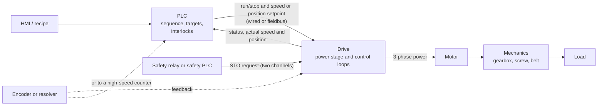
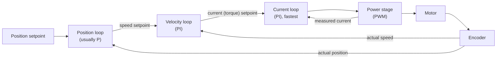
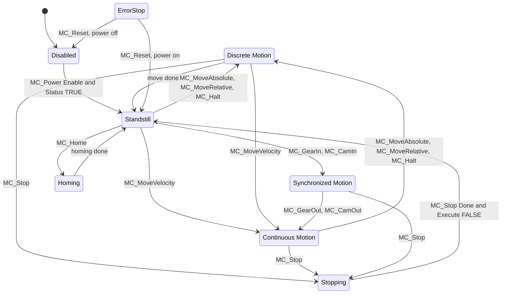
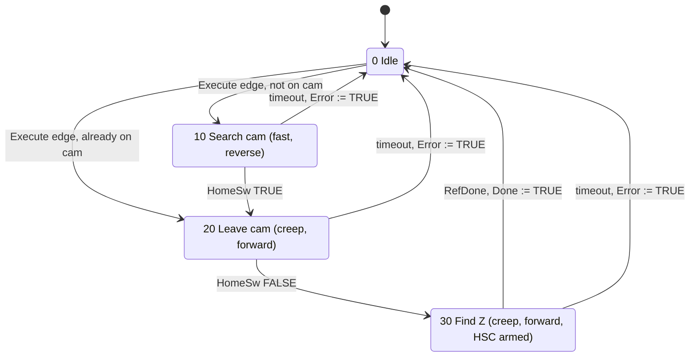

# 19 — Motion Control, Drives and Positioning

> **Level:** 4 — Advanced · **Time:** ~10–12 hours · **Prerequisites:** [08 — Counters](../08-counters/), [13 — Sequential Control: State Machines and SFC](../13-sequential-control/), [17 — Industrial Communications and Networks](../17-industrial-communications/)

Almost everything that moves in a plant is driven by an electric motor: pumps, fans, conveyors,
mixers, cranes, packaging machines, robots. A PLC can simply switch a motor on and off, but more
and more motors are fed from a **drive** that controls their speed, torque and position. Then the
PLC's job changes. It no longer closes a contactor; it sends a speed or position setpoint, reads
the drive's status, and decides what the axis should do next.

This module covers the whole chain from the PLC's point of view: induction motors and variable
frequency drives (VFDs), servo and stepper systems, the encoders that measure position, why you
cannot count fast pulses with ordinary inputs, homing, the PLCopen motion function blocks that
most vendors now follow, and the safety functions built into modern drives. In process plant
you meet drives mostly on pumps and fans, where speed control replaces throttling valves. On
machines you meet them everywhere, and positioning is a daily task. The two labs build a
quadrature decoder and a two-speed positioning routine, the two classic "first motion programs".

## Learning objectives

After this module you should be able to:

- Calculate an induction motor's synchronous speed and slip, and choose between direct-on-line,
  star-delta, soft-starter and VFD starting.
- Explain V/f and vector control, set up the key VFD parameters (motor data, ramps, speed limits,
  control and reference sources) and decide when a braking resistor is needed.
- Describe the current, velocity and position loops of a servo drive, and compare servo, VFD and
  stepper solutions for a positioning task.
- Decode incremental quadrature signals (x1, x2, x4), calculate resolution and pulse frequency,
  and prove with numbers when a high-speed counter is required.
- Choose a homing method and scale positions between encoder counts and engineering units
  without overflow or rounding traps.
- Use the PLCopen axis state machine and the MC_ function blocks, including the
  Execute/Done/Busy/Error/CommandAborted handshake.
- Write a two-speed positioning routine with an in-position window, stop handling and a travel
  timeout (Lab 19-2).
- Explain STO, SS1, SS2, SOS and SLS and relate them to stop categories 0, 1 and 2.

## 1. The motion control chain

Every motion system has the same parts, whatever the brand:



The applications form a ladder of increasing difficulty:

| Application | Example | Typical actuator | Feedback | Who closes the position loop |
|---|---|---|---|---|
| On/off | transfer pump, extract fan | DOL starter or soft starter | none | nobody |
| Variable speed | pump on pressure control, conveyor speed | VFD + induction motor | often none (speed estimated by the drive) | nobody (a PID loop may set the speed, Module 15) |
| Simple positioning | stop a carriage at a station, index a table | VFD + encoder, or stepper | encoder into PLC or drive | PLC logic (Lab 19-2) or the drive |
| Servo positioning | pick-and-place, cut-to-length | servo drive + servo motor | motor encoder | drive or motion controller |
| Synchronised motion | flying shear, labeller, rotary knife | several servo axes | encoders on every axis | motion controller, cyclic fieldbus |
| Coordinated motion | robot, CNC machine | 3–6+ servo axes | encoders | robot or CNC controller |

This module takes you to the middle of that table in depth and gives you the vocabulary for the
rest.

## 2. AC induction motors

The three-phase squirrel-cage induction motor is the workhorse of industry: simple, robust and
cheap. Three-phase current in the stator windings creates a magnetic field that rotates at the
**synchronous speed**:

```text
  n_s = 120 x f / p        n_s in rpm, f = supply frequency in Hz, p = number of poles
```

| Poles | 50 Hz | 60 Hz |
|---|---|---|
| 2 | 3000 rpm | 3600 rpm |
| 4 | 1500 rpm | 1800 rpm |
| 6 | 1000 rpm | 1200 rpm |

The rotor always turns slightly slower than the field. That difference, the **slip**, is what
induces current in the rotor bars and produces torque. A 4-pole, 50 Hz motor with 1460 rpm on
its nameplate has a slip at full load of (1500 − 1460) / 1500 = 2.7 %. Slip rises with load,
so an induction motor's speed drops a little as the load increases.

**Worked example: torque from the nameplate.** A 7.5 kW motor at 1460 rpm:
ω = 1460 × 2π / 60 = 152.9 rad/s, so rated torque T = P / ω = 7500 / 152.9 ≈ 49 N·m.
You need this number when you check whether a drive can accelerate a load in the time you want.

The nameplate data (rated voltage, current, power, frequency, speed, power factor and the
star/delta connection) is exactly what a VFD asks for during commissioning.

### Starting methods recap

[Module 02](../02-electrical-and-field-devices/) covered the hardware and
[Module 07](../07-timers/) the star-delta timer logic. In summary:

| Method | Starting current | Starting torque | Speed control | Notes |
|---|---|---|---|---|
| Direct-on-line (DOL) | high, typically 6–8 × full-load current | full | none | simplest; stresses the supply and the mechanics |
| Star-delta | about 1/3 of DOL | about 1/3 of DOL | none | motor must be delta-rated at supply voltage; current and torque transient at changeover |
| Soft starter | reduced, set by the voltage ramp or current limit | reduced (torque falls with voltage squared) | none (ramps only) | often bypassed by a contactor once up to speed |
| VFD | close to rated current | high, from standstill | full | also saves energy on pumps and fans |

## 3. Variable-frequency drives

A VFD (also called an inverter, variable-speed drive or AC drive) makes a new three-phase supply
of any frequency and voltage:

```text
             rectifier            DC bus                  inverter
  L1 ---+   +---------+    +---------------------+    +-------------+
  L2 ---+-->| diodes  |--->| capacitors          |--->| 6 x IGBT    |---> U, V, W ---> motor
  L3 ---+   +---------+    | about 540-565 V DC  |    | switched by |
                           | on a 400 V supply   |    | PWM         |
                           | brake chopper + R   |    +-------------+
                           +---------------------+
```

The rectifier charges the DC bus to roughly 1.35–1.41 times the supply voltage. The inverter
switches the bus onto the motor terminals thousands of times a second with **pulse-width
modulation (PWM)**, so that the motor current is close to a sine wave at the frequency the drive
chooses.

### V/f and vector control

- **V/f (scalar) control** keeps the ratio of voltage to frequency constant, which keeps the
  magnetic flux in the motor constant. A 400 V, 50 Hz motor gets 8 V/Hz, so at 25 Hz the drive
  applies about 200 V. At low speed the drive adds some **voltage boost** to make up for the
  stator resistance. V/f is simple, robust, needs no motor model and can feed several motors in
  parallel from one drive. It is the usual choice for pumps and fans.
- **Vector control** (field-oriented control) uses a mathematical model of the motor to control
  the flux-producing and torque-producing parts of the current separately, much like a DC motor.
  It gives high torque at low speed and a fast response to load changes. **Sensorless vector**
  estimates the speed from the currents. **Closed-loop vector** uses an encoder and can hold full
  torque at zero speed (hoists, winders). Some vendors use other schemes, such as direct torque
  control, for the same purpose.
- **Above base speed** (above the rated frequency) the drive cannot raise the voltage any
  further, so the flux falls. This is **field weakening**: power stays roughly constant, so the
  available torque falls roughly in inverse proportion to speed (T ≈ P / ω). At twice base
  speed the motor can give only about half its rated torque.

### Key parameters

| Parameter group | What it does | Typical mistakes |
|---|---|---|
| Motor data | rated voltage, current, frequency, speed, power, cos φ from the nameplate; used by the motor model and the electronic overload | typing the star values for a delta-connected motor |
| Motor identification (auto-tune) | the drive measures the motor's resistance and inductances | skipping it, then wondering why vector control is poor |
| Minimum / maximum speed | limits on the speed reference | minimum 0 Hz on a self-cooled motor that runs slowly for hours and overheats |
| Acceleration / deceleration time | the ramp, usually defined as the time from zero to maximum (or rated) frequency | not checking which one the drive uses; deceleration too short for the inertia |
| Stop mode | ramp to stop or coast to stop | coast on a conveyor that must stop at a station |
| Current limit | protects drive and mechanics | set so low that the drive cannot accelerate the load |
| Command (control) source | where Run/Stop comes from: terminals, keypad or fieldbus | commissioning from the keypad, then forgetting to switch back |
| Reference (setpoint) source | where the speed comes from: analog input, preset speeds or fieldbus | 0–10 V selected while the PLC sends 4–20 mA |
| Preset speeds, skip frequencies | fixed speeds selected by digital inputs; frequency bands to avoid (mechanical resonance) | |

**Worked example: ramp times.** A drive has an acceleration time of 5 s, defined from 0 to
50 Hz. The ramp rate is 50 / 5 = 10 Hz/s. Changing the reference from 20 Hz to 45 Hz therefore
takes (45 − 20) / 10 = 2.5 s. If the drive defines its ramp to *maximum* frequency and maximum
is set to 60 Hz, the same 5 s setting gives 12 Hz/s instead. Read the manual.

**Worked example: why pumps and fans save energy.** For a centrifugal pump or fan the affinity
laws say, approximately: flow ∝ speed, head ∝ speed², power ∝ speed³. At 80 % speed a pump
delivers about 80 % flow at 0.8² = 64 % head for 0.8³ ≈ 51 % power. Throttling a valve to get
the same flow saves far less. (With a high static head, such as lifting water to a tank, the
savings are smaller because the pump must still overcome that head.)

### How the PLC controls a drive

There are three ways to command a drive, and many installations mix them:

1. **Hard-wired digital signals.** PLC outputs drive the drive's digital inputs, and the
   drive's relay or transistor outputs return status.

   | Signal | Direction | Purpose |
   |---|---|---|
   | Run forward / Run reverse | PLC → drive | start, stop and direction |
   | Preset speed select 1, 2 | PLC → drive | choose one of several parameterised speeds |
   | Fault reset | PLC → drive | pulse to acknowledge a drive fault |
   | Ready / Running / At speed | drive → PLC | status for the sequence and HMI |
   | Fault (healthy) | drive → PLC | where the drive allows it, configure this relay to be energised when healthy, so a broken wire reads as a fault (the `_NC` idea from Module 02) |
   | STO, two channels | safety relay → drive | safety function, see section 7; never from a standard PLC output alone |

2. **Analog reference.** A PLC analog output sends 0–10 V or 4–20 mA to the drive's analog
   input. 4–20 mA is less sensitive to noise over long cables and allows wire-break detection
   (Module 14). The drive's own analog output can return actual speed or current.

3. **Fieldbus.** The PLC exchanges a **control word** and a **speed setpoint** with the drive
   every cycle, and reads back a **status word**, actual speed, current, fault codes and any
   parameter it needs. Examples are the PROFIdrive profile on PROFINET/PROFIBUS, the CIP drive
   profiles on EtherNet/IP and the CiA 402 profile on CANopen and EtherCAT. In PROFIdrive the
   speed setpoint is normalised: 16#4000 (16384) means 100 % of the drive's reference speed.
   [Module 17](../17-industrial-communications/) covers control and status words in detail.

**Worked example: analog speed reference.** A Siemens analog output uses 0–27648 for 0–10 V
([Module 14](../14-analog-and-process-io/)). The drive is set so that 10 V = 50 Hz. For 35 Hz the PLC must write
27648 × 35 / 50 = 19353.6, which rounds to 19354. As a function:

```iecst
FUNCTION F_HzToRaw : INT
  VAR_INPUT
    Hz    : REAL;              (* wanted drive output frequency *)
    MaxHz : REAL;              (* drive parameter: frequency at 10 V, e.g. 50.0 *)
  END_VAR
  IF MaxHz <= 0.0 THEN         (* bad parameter: ask for zero speed *)
    F_HzToRaw := 0;
    RETURN;
  END_IF;
  (* 0..MaxHz -> 0..27648 (Siemens nominal range for 0-10 V), clamped *)
  F_HzToRaw := REAL_TO_INT(LIMIT(0.0, Hz / MaxHz * 27648.0, 27648.0));
END_FUNCTION
```

A typical hard-wired rung also watches the drive: if Run is commanded but the drive does not
report Running within 2 s, raise an alarm (the feedback-timeout pattern from Module 07). The
alarm stays set until the operator acknowledges it ([Module 16](../16-alarms-and-diagnostics/)):

```text
      DriveRunFwd     DriveRunning        FailTmr                        StartFailAlm
 |-------] [-----------]/[----------+-------------+
 |                                  |     TON     |
 |                                  |IN          Q|--------------------------(S)-----|
 |                           T#2s --|PT         ET|--
 |                                  +-------------+
```

### Braking and regeneration

When a drive decelerates a load faster than friction alone would stop it, the motor works as a
**generator**. The energy flows back into the DC bus, the bus voltage rises, and without
somewhere to put that energy the drive trips on **DC bus overvoltage**. Your options:

- **Longer deceleration time**, if the process allows it. The drive's overvoltage controller can
  also stretch the ramp automatically, which is fine for a fan and wrong for a positioning axis.
- **Brake chopper and braking resistor** (dynamic braking): a transistor switches a resistor
  across the DC bus when the voltage rises, and the energy becomes heat. The resistor must be
  rated for the energy and the duty cycle, and needs its own thermal protection.
- **Regenerative (active front end) drive** or a shared DC bus between several drives, which
  returns the energy to the supply or to motoring axes. Common on cranes, test rigs and
  large machines.
- **DC injection braking** stops or holds the motor at low speed by feeding DC into it. The
  energy heats the motor, so use it only for short periods.
- A **mechanical holding brake** holds a stopped axis (essential on vertical axes). It is not
  meant to stop a moving load except in an emergency.

**Worked example: braking energy.** A fan with J = 2 kg·m² runs at 1500 rpm
(ω = 157.1 rad/s). Its kinetic energy is ½ J ω² = 0.5 × 2 × 157.1² ≈ 24.7 kJ. Stopping it in 5 s
with a linear ramp needs an average braking power of about 24.7 / 5 ≈ 4.9 kW, less what the
fan's air load, friction and losses take, and the peak at the start of the ramp is twice the average (≈ 9.9 kW), because
braking power = torque × speed and the speed is highest at the start.

## 4. Servo and stepper systems

### Servo motors and drives

A **servo motor** is usually a permanent-magnet synchronous motor with a built-in feedback
device (an encoder or a resolver). Its low rotor inertia and high short-term overload let it
accelerate hard and position precisely. The **servo drive** runs three nested control loops, a
**cascade**:



The drive measures the motor current itself; the encoder supplies the actual speed and
position. Each inner loop must be much faster than the loop around it. The current loop is the fastest, typically updated every few tens of microseconds;
the outer loops run more slowly. The PID theory is in [Module 15](../15-pid-control/). You tune
from the inside out: current loop (often automatic), then velocity, then position.

Two ideas you need when reading servo diagnostics:

- **Following error (lag):** the difference between where the axis should be now and where it
  is. With a proportional position loop of gain Kv and no feedforward, the following error at
  constant speed is v / Kv. At 100 mm/s and Kv = 50 s⁻¹ that is 2 mm. **Velocity feedforward**
  sends the expected speed straight to the velocity loop, which removes most of the lag. Every
  motion system has a **following error limit**; exceeding it (a jam, a crash, a wrong
  direction) faults the axis.
- **Where the position loop runs.** Either the drive does the positioning (the PLC sends a target
  and gets "done", common with simple indexing drives and position tables) or a **motion
  controller** in the PLC generates the profile and sends position or speed setpoints to the
  drive every cycle over a deterministic network: EtherCAT, PROFINET IRT, EtherNet/IP with CIP
  Motion, SERCOS. The second is needed for synchronised and coordinated motion.

### Stepper motors

A **stepper** moves one step per pulse, typically 1.8° (200 full steps per revolution).
**Microstepping** drives divide each step electrically, for example into 16, giving 3200 steps
per revolution. The PLC sends **pulse and direction** signals from a pulse-train output (PTO).
To turn at 600 rpm (10 rev/s) at 3200 steps/rev it needs a 32 kHz pulse train, which only a
hardware pulse output can generate, for the same reason that only hardware can count fast
pulses (section 5.2).

Steppers are cheap and hold position well at standstill, but a standard stepper is **open loop**:
if the load demands more torque than the motor has, it **loses steps** and the controller never
knows. Torque also falls quickly with speed. Closed-loop steppers add an encoder to detect lost
steps.

| | VFD + induction motor | Servo | Stepper |
|---|---|---|---|
| Cost | low | high | low |
| Dynamics | moderate | very high | moderate, falls with speed |
| Positioning accuracy | fair, with encoder and creep speed | excellent | good, while no steps are lost |
| Feedback | optional | always | usually none |
| Typical uses | pumps, fans, conveyors, simple indexing | packaging, pick-and-place, cut-to-length | small adjustments, format changes, light indexing |

## 5. Position feedback

### 5.1 Incremental encoders

An incremental encoder produces two square waves, **A** and **B**, a quarter of a cycle (90°)
apart: they are **in quadrature**. Many also produce a **Z** (index, marker, reference) pulse
once per revolution. The resolution is given in **pulses per revolution (PPR)**, also called
lines: a 1000 PPR encoder gives 1000 cycles of A per revolution.

Common output types: **TTL / RS-422 line driver** (5 V differential pairs A, /A, B, /B, Z, /Z,
good for long cables and high frequencies), **HTL push-pull** (10–30 V, suits 24 V PLC inputs)
and **open collector** (NPN or PNP, Module 02). Use shielded twisted-pair cable and keep it away
from VFD motor cables.

Rotating forward, A leads B; together they step through four states, a 2-bit Gray code in which
only one signal changes at a time:

```text
  AB       00   10   11   01   00   10   11   01   00
                 _________           _________
  A        _____|         |_________|         |_________
                      _________           _________
  B        __________|         |_________|         |____
                      ____
  Z        __________|    |_____________________________   (once per revolution)
```

Rotating in reverse, B leads A and the states run the other way:

```text
  AB       00   01   11   10   00   01   11   10   00
                      _________           _________
  A        __________|         |_________|         |____
                 _________           _________
  B        _____|         |_________|         |_________
```

Which way is "forward" depends on how the encoder is mounted, so HSCs and drives have a
parameter to invert the direction.

**Decoding.** A decoder compares the old A/B state with the new one:

| old \ new | 00 | 10 | 11 | 01 |
|---|---|---|---|---|
| **00** | 0 | +1 | illegal | −1 |
| **10** | −1 | 0 | +1 | illegal |
| **11** | illegal | −1 | 0 | +1 |
| **01** | +1 | illegal | −1 | 0 |

"Illegal" means both channels changed at once. Because the two edges are a quarter cycle apart,
that cannot happen on a healthy encoder that is sampled fast enough, so it means lost pulses:
noise, a faulty channel, or sampling too slowly.

How many edges you count sets the resolution:

| Mode | Counts on | Counts per encoder cycle | 1000 PPR encoder gives |
|---|---|---|---|
| x1 | one edge of A | 1 | 1000 counts/rev |
| x2 | both edges of A | 2 | 2000 counts/rev |
| x4 | every edge of A and B | 4 | 4000 counts/rev |

x4 decoding also copes cleanly with **vibration**: if a stopped shaft wobbles across one edge,
the decoder counts +1, −1, +1, −1 and the position stays correct. A naive counter that counts
only rising edges of A and takes the direction from B counts +1 on every wobble and drifts.
(A well-designed x1 decoder avoids this by also counting down on the matching falling edge of
A when the shaft turns back.)

A useful diagnostic: with x4 decoding the count between two successive Z pulses in the same
direction must be exactly 4 × PPR. Any other number means lost or extra counts.

### 5.2 Why scanned inputs cannot count fast pulses

An ordinary PLC input is read once per scan, after an input filter that suppresses pulses
shorter than a few milliseconds on typical DC input cards. A decoder written in the PLC program,
like the one in Lab 19-1, sees the encoder only at those sample instants. To decode correctly it
must see **every state**, so the encoder may move **at most one state per scan**.

This is the same idea as the Nyquist sampling theorem, which says that you must sample a signal
more than twice per cycle of its highest frequency or it **aliases**: it looks like a
different, slower signal (the wagon wheel that seems to turn backwards on film). A quadrature
decoder is stricter: each cycle of A contains four states and it must sample every one of
them, so it needs at least four samples per cycle, and in practice a good margin more, because
real encoders don't have perfectly equal states and the scan time jitters. Watch what happens as the steps per scan increase:

| Real forward steps between two scans | What the decoder sees | Result |
|---|---|---|
| 0 | no change | 0, correct |
| 1 | one step forward | +1, correct |
| 2 | both channels changed | illegal, flagged: the counts are lost but you know it |
| 3 | one step **backwards** | −1: wrong by 4 counts and in the wrong direction, with no error |
| 4 | no change | 0: four counts lost silently |

Three steps per scan is the dangerous case: aliasing makes forward motion look like slow reverse
motion, and nothing flags it.

**Worked example: can the PLC program count this encoder?** A 1024 PPR encoder on a motor
shaft, decoded x4 (4096 counts/rev), PLC scan 10 ms.

- The scanned decoder can follow at most 100 states per second: 100 / 4096 = 0.024 rev/s,
  which is **about 1.5 rpm**.
- At the motor's 1500 rpm (25 rev/s), channel A runs at 25 × 1024 = 25.6 kHz and the x4 count
  rate is 102,400 counts per second, a thousand times too fast.

Even for simple part counting with a photo-eye (Module 08), each pulse and each gap must last
longer than the input filter time plus one scan.

**High-speed counters (HSC)** solve this. An HSC is a hardware counter, built into many compact
PLCs or supplied as a technology module, that counts independently of the scan. The program
reads its current value each scan. Typical HSC features:

- counting modes: A/B quadrature with x1/x2/x4, pulse + direction, up/down inputs;
- preset or reset by a reference input or by the Z pulse (for homing);
- **compare outputs** that switch a physical output in hardware when the count passes a value.
  Program logic cannot do this precisely: at 1 m/s a 10 ms scan means the output can switch
  anywhere within a 10 mm window, plus the scan jitter;
- **latch (capture)** of the count on an input edge, for registration marks and touch probes;
- frequency or period measurement, for speed;
- a counting range and overflow behaviour you must know (Module 08).

Alternatively the encoder goes to the drive, which counts it and sends the position to the PLC
over the fieldbus. That is the normal arrangement with servos.

### 5.3 Absolute encoders and resolvers

An **absolute encoder** outputs a unique code for every position, so the position is known
immediately at power-up and no homing run is needed. It only needs a one-time adjustment (an
offset) during commissioning.

- **Single-turn** encoders code one revolution, for example 13 bits = 8192 positions per
  revolution.
- **Multi-turn** encoders also count whole revolutions, for example 12 bits = 4096 revolutions,
  using a gear train or an electronic counter that keeps counting while the supply is off
  (backed by a battery, or powered by energy harvested from the shaft's own rotation).
- Interfaces: **SSI** (synchronous serial interface: the controller sends a clock burst and the
  encoder shifts out its position bit by bit), fieldbus encoders (PROFINET, EtherNet/IP,
  EtherCAT, CANopen), IO-Link for lower speeds, and drive-specific digital interfaces such as
  EnDat (Heidenhain) or HIPERFACE DSL (SICK).
- Many absolute encoders output **Gray code**, in which only one bit changes between neighbouring
  positions, so a reading taken just as the position changes is out by at most one step. A plain
  binary reading taken during a change from 0111 to 1000 could be anything.

| Decimal | Binary | Gray |
|---|---|---|
| 0 | 000 | 000 |
| 1 | 001 | 001 |
| 2 | 010 | 011 |
| 3 | 011 | 010 |
| 4 | 100 | 110 |
| 5 | 101 | 111 |
| 6 | 110 | 101 |
| 7 | 111 | 100 |

If the encoder or the interface module doesn't convert Gray to binary for you, the PLC can: each
binary bit is the XOR of all the Gray bits at and above it.

```iecst
FUNCTION F_GrayToBin : DWORD
  VAR_INPUT
    Gray : DWORD;              (* raw Gray-code value from an absolute encoder *)
  END_VAR
  VAR
    Bin     : DWORD;
    Shifted : DWORD;
  END_VAR
  (* Each binary bit is the XOR of all Gray bits at and above it. *)
  Bin := Gray;
  Shifted := SHR(Gray, 1);
  WHILE Shifted <> 0 DO
    Bin := Bin XOR Shifted;
    Shifted := SHR(Shifted, 1);
  END_WHILE;
  F_GrayToBin := Bin;
END_FUNCTION
```

Check it with 110 (Gray for 4): 110 XOR 011 = 101, then XOR 001 = 100 = 4.

A **resolver** is a rotary transformer: the drive excites the rotor winding with an AC signal,
and two stator windings return sine- and cosine-modulated signals from which the drive computes
the angle. It has no electronics in the motor, so it tolerates heat, shock and vibration well,
and it is absolute within one revolution. Servo motors for harsh duty often use resolvers.
**Sin/cos encoders** (analog 1 Vpp signals) are interpolated by the drive to a very high
resolution, and **linear scales** measure the position of the load directly instead of the
motor shaft.

### 5.4 Position units and scaling

The PLC counts in encoder counts. People think in millimetres or degrees. The conversion is:

```text
  mm per count = lead (mm per screw rev) / (counts per motor rev x gear ratio)
```

where the gear ratio is motor revolutions per screw revolution.

**Worked example: ball screw.** Motor encoder 2500 PPR, x4 = 10,000 counts per motor revolution.
Gearbox 5:1 and screw lead 10 mm. One screw revolution = 5 × 10,000 = 50,000 counts = 10 mm,
so 5000 counts/mm, or 0.0002 mm (0.2 µm) per count.

```iecst
FUNCTION F_CountsToMm : REAL
  VAR_INPUT
    Counts       : DINT;       (* from the HSC or the drive *)
    CountsPerRev : DINT;       (* encoder PPR x 4 *)
    GearRatio    : REAL;       (* motor revolutions per screw revolution *)
    LeadMm       : REAL;       (* screw lead, mm per screw revolution *)
  END_VAR
  F_CountsToMm := DINT_TO_REAL(Counts) * LeadMm
                  / (DINT_TO_REAL(CountsPerRev) * GearRatio);
END_FUNCTION
```

**Worked example: a conveyor and the range of your data types.** A conveyor pulley of 100 mm
diameter (314.16 mm per revolution) carries a 1000 PPR encoder: 4000 counts per revolution =
12.73 counts/mm. At 1 m/s that is 12,732 counts per second.

- A **DINT** count (maximum 2,147,483,647) overflows after 2,147,483,647 / 12,732 ≈ 168,700 s,
  about **47 hours**. A conveyor that runs all week will wrap. Plan for it: work with the
  difference between two readings taken a scan apart (on PLCs whose integer arithmetic wraps
  around, that difference stays correct across the wrap; check yours), use a modulo axis, or
  reset the count at a known point, and look up what your HSC does at overflow (Module 08).
- A **REAL** has a 24-bit mantissa and represents every whole number only up to 16,777,216. That
  is about 1.3 km of belt, 22 minutes at 1 m/s. Keep the master count in an integer and convert
  to REAL (or LREAL) for display and calculation, as [Module 09](../09-math-and-data-handling/)
  explains. Motion libraries work in user units, and many use LREAL internally for this reason.

For a rotary table or a knife drum the position is naturally **modulo**: 0 to 360° then back to
0. Motion systems support modulo axes directly; in your own code, wrap with care and keep the
count in an integer.

### 5.5 Homing (referencing)

An incremental encoder only measures changes of position. At power-up, or after the encoder or
the HSC loses counts, the PLC does not know where the axis is. **Homing** (referencing) finds a
known physical point and sets the position there. Common methods:

| Method | How it works | Repeatability | Notes |
|---|---|---|---|
| Home switch | move to a switch (a cam), set the position at its edge | limited by the switch's repeatability and the approach speed | approach the edge in the same direction and at the same low speed every time |
| Home switch + Z pulse | find the switch, then take the first Z pulse after its edge | one encoder count | the classic method for incremental encoders |
| Limit switch as home | use the end-of-travel switch as the home switch | as a switch | saves a sensor; the axis must be allowed to reach it |
| Hard stop (torque or current) | move slowly at reduced torque into a mechanical stop and detect the stall | depends on the mechanics | no sensor; only for mechanics designed for it |
| Direct / set position | declare the present position to be a given value | whatever you set | for axes aligned by eye or by a fixture |
| Absolute encoder adjustment | store an offset once so the encoder reads the right value | encoder resolution | no homing run after power-up |

Drive profiles standardise homing too: CiA 402 (for CANopen and EtherCAT drives) defines a
numbered list of homing methods, so drive manuals often refer to "homing method *n*".

The switch + Z method, step by step:

```text
                negative <------------------------------------------------> positive

HomeSw          ______________________________[#########]_____________________
                                                home cam

Z pulse         ____|_______|_______|_______|_______|_______|_______|_______|_

1 search                                          <=========================    start: fast, reverse
2 leave cam                                       =======>  creep, forward, until HomeSw FALSE
3 find Z                                                 ==>|  first Z after the cam: count := 0
```

1. Search for the cam at fast speed. The axis overruns onto the cam while it decelerates, so
   the cam must be longer than the stopping distance.
2. Reverse at creep speed until the axis leaves the cam. Always detect the *same* edge in the
   *same* direction at the *same* speed, so that the switch's hysteresis and any backlash are
   the same every time.
3. Keep creeping and let the HSC or drive preset the count at the next Z pulse. The Z pulse is
   typically between a quarter and one cycle of A wide, far too short for a scanned input, so
   this must be done in hardware.

Commissioning tip: set the cam so that its edge is roughly **half a revolution** away from the
nearest Z pulse, as in the drawing. If the edge lies close to a Z pulse, small variations in the
switch point can make the axis pick up the Z pulse one revolution earlier or later, and the home
position jumps by a whole revolution.

After homing, **software limits** become valid: the motion system refuses targets outside the
permitted range. Before homing they mean nothing, so an unhomed axis should only be allowed to
jog slowly. **Hardware limit switches** (normally-closed, at each end of travel) stay active
all the time and are usually wired to the drive or the stop circuit, not just to a PLC input.

A real homing routine also handles starting on the wrong side of the cam (it reverses when it
reaches a limit switch). The drive's built-in homing methods do this for you.

## 6. PLCopen Motion Control

In the past every vendor had its own motion instructions. **PLCopen**, an organisation that
promotes IEC 61131-3, published a specification of motion control **function blocks**
("Function Blocks for Motion Control", Part 1), later extended with further parts covering, for
example, coordinated multi-axis motion and homing procedures. CODESYS SoftMotion, Beckhoff
TwinCAT, Siemens and many others implement these blocks with the same names and very similar
behaviour. Learn them once and you can read motion code on most platforms.

Every block works on an **axis**, passed as a reference (`VAR_IN_OUT Axis : AXIS_REF`). The
axis type is vendor-specific: `AXIS_REF_SM3` in CODESYS SoftMotion, `AXIS_REF` in TwinCAT's
Tc2_MC2 library, a technology object in TIA Portal.

### 6.1 The axis state machine

Each axis is always in exactly one state, and each block is only allowed in certain states:



The diagram shows the main arrows only. The full diagram in the PLCopen specification has more
(for example further ways into and out of Synchronized Motion, and blocks such as
MC_MoveAdditive), so check your vendor's version when you need the details. It also leaves out
the arrows that apply **from every state**, to keep it readable:

| From | Event | To |
|---|---|---|
| any state | an axis error (drive fault, following error, limit switch...) | **ErrorStop**: the axis stops and ignores motion commands |
| any state without an error | MC_Power.Enable = FALSE | **Disabled** |
| most states, including Standstill and Homing | MC_Stop | **Stopping** |

| State | Meaning |
|---|---|
| Disabled | power stage off; the axis may be moved by hand or by gravity if nothing holds it |
| Standstill | powered, no error, not moving; ready for a command |
| Homing | executing MC_Home |
| Discrete Motion | moving to a target that ends in a stop (absolute, relative, halt) |
| Continuous Motion | moving without a target end, such as at a constant velocity |
| Synchronized Motion | following a master axis (gearing or camming) |
| Stopping | executing MC_Stop; all other motion commands are rejected until MC_Stop is Done and its Execute is FALSE |
| ErrorStop | stopped because of an error; needs MC_Reset |

A command issued in a state where it is not allowed is not executed, and the block reports
Error (a move during Stopping, for example). Some illegal commands also stop the axis: the
specification says that MC_Home issued in any state other than Standstill sends the axis to
ErrorStop, even when it is issued during Homing. So start homing only from Standstill.

### 6.2 The main function blocks

| Block | Purpose | Key inputs | Key outputs |
|---|---|---|---|
| MC_Power | switch the power stage on/off | Enable (level) | Status (power on), Error |
| MC_Home | run the homing procedure; the method itself is an axis parameter | Execute, Position (value set at the reference point) | Done, Busy, CommandAborted, Error |
| MC_MoveAbsolute | move to an absolute position | Execute, Position, Velocity, Acceleration, Deceleration, Jerk, Direction (rotary axes), BufferMode | Done, Busy, Active, CommandAborted, Error |
| MC_MoveRelative | move a distance from the present position | Execute, Distance, Velocity, ... | as above |
| MC_MoveVelocity | run continuously at a velocity | Execute, Velocity, Acceleration, Deceleration, Direction | **InVelocity** (instead of Done), Busy, CommandAborted, Error |
| MC_Halt | normal controlled stop; can be overridden by a new motion command | Execute, Deceleration | Done, Busy, CommandAborted, Error |
| MC_Stop | exceptional stop that locks the axis in Stopping until released | Execute, Deceleration | Done, Busy, CommandAborted, Error |
| MC_Reset | clear axis errors: ErrorStop → Standstill (or Disabled) | Execute | Done, Busy, Error |

Other common blocks: `MC_ReadActualPosition`, `MC_ReadStatus`, `MC_ReadAxisError`,
`MC_SetPosition`, `MC_MoveAdditive`, `MC_Jog` (vendor variants), `MC_GearIn`/`MC_GearOut`,
`MC_CamTableSelect`/`MC_CamIn`/`MC_CamOut`, `MC_TouchProbe`.

**MC_Stop versus MC_Halt.** Use MC_Halt for normal stops (end of a jog, an operator "hold"): the
axis decelerates and any later motion command may take over. Use MC_Stop when the axis must not
move again until someone deliberately releases it (for example after a machine fault, until the
operator has acknowledged it): as long as MC_Stop's Execute is TRUE the axis stays in Stopping
and rejects every move. Neither is a safety function; stopping to protect people is done by the
drive's safety functions (section 7).

### 6.3 The Execute / Done / Busy / Error / CommandAborted pattern

Execute-type blocks follow the same rules, and learning them saves hours of debugging:

- **Execute** is **edge-triggered**. The block reads its inputs (Position, Velocity...) at the
  rising edge. Changing Position while the move is running does nothing unless you trigger the
  block again. (Some implementations offer an option to update inputs continuously; don't rely
  on it without checking.)
- **Busy** is TRUE from the rising edge until the command finishes (Done, Error or
  CommandAborted), even if Execute has gone FALSE.
- **Active** (on blocks that can queue commands) means this block currently controls the axis.
- **Done** means completed successfully. **Error** means it failed (see ErrorID).
  **CommandAborted** means another command took the axis over. At most one of the three is TRUE.
- These outputs stay TRUE while Execute is TRUE and reset when Execute goes FALSE. If Execute
  is already FALSE when the command finishes, the output is still set for **one cycle**, so
  your code must catch it in that cycle or keep Execute TRUE until it sees the result.
- **Enable-type** blocks (MC_Power, MC_ReadActualPosition) are **level-triggered**: they work
  while Enable is TRUE and report Valid or Status.

Normal completion:

```text
                     ___________________________________
Execute         ____|                                   |_______________
                     _____________________
Busy            ____|                     |_____________________________
                                           _____________
Done            __________________________|             |_______________
```

Execute pulsed for one scan only: the move still completes, but Done lasts a single cycle.

```text
                     ___
Execute         ____|   |_______________________________________________
                     _____________________
Busy            ____|                     |_____________________________
                                           _
Done            __________________________| |___________________________
```

A second command aborts the first (BufferMode = aborting, the default):

```text
                           _______________________________________
MoveA.Execute         ____|                                       |___________
                           _______________
MoveA.Busy            ____|               |___________________________________
                                           _______________________
MoveA.CommandAborted  ____________________|                       |___________
                                           _______________________________
MoveB.Execute         ____________________|                               |___
                                           _________________
MoveB.Busy            ____________________|                 |_________________
                                                             _____________
MoveB.Done            ______________________________________|             |___
```

With **BufferMode** you can instead queue a move to start when the previous one finishes
(buffered) or blend two moves together without stopping in between (the blending modes).

Two practical rules follow:

1. **Call every motion block on every scan**, unconditionally, and drive its Execute from your
   sequence. A block called only inside an `IF` stops updating its outputs when the `IF` is
   false, and its Done may never be seen.
2. **Give each move a fresh rising edge.** Either use one block instance per move (as in the
   worked example below) or make sure Execute goes FALSE for at least one call between moves.

### 6.4 Camming and gearing

Mechanical line shafts, gears and cams used to link the motions of a machine. Motion control
replaces them with software:

- **Electronic gearing** (`MC_GearIn` with a ratio numerator and denominator) makes a slave axis
  follow a master axis at a fixed ratio; `InGear` reports when it has synchronised. Examples:
  a feed roller that follows a line speed, two ends of a gantry.
- **Electronic camming** (`MC_CamTableSelect`, `MC_CamIn`) makes the slave position a function
  of the master position, defined in a **cam table** (a list of points or polynomial segments).
  Examples: a **rotary knife** that must match the web speed during the cut and then speed up or
  slow down to suit the cut length, a **flying shear**, a labeller that places a label on each
  product.
- The master can be a real axis, an external encoder on a line, or a **virtual axis** (a pure
  software axis that you run with MC_MoveVelocity to pace the whole machine).
- **Registration**: a sensor sees a mark on the product and a **touch probe** (hardware latch
  of the axis position) records exactly where it was, so the controller can correct the cam
  phase. Again the capture must happen in hardware, not in the scan.

## 7. Drive safety functions (IEC 61800-5-2)

Modern drives contain **safety functions** defined by IEC 61800-5-2 ("Adjustable speed
electrical power drive systems — Safety requirements — Functional"). They are implemented in
safety-rated hardware and firmware inside the drive, requested by a safety relay or safety PLC
over two-channel wiring or a safety fieldbus (PROFIsafe, CIP Safety, Safety over EtherCAT).
The standard PLC program may **request** them and read their status, but it must never be the
thing that implements them.

| Function | Name | What the drive does | Relation to IEC 60204-1 stop categories |
|---|---|---|---|
| **STO** | Safe Torque Off | stops supplying energy that can produce torque; the motor coasts to a stop | stop category 0 (uncontrolled stop) |
| **SS1** | Safe Stop 1 | decelerates the motor, then applies STO when it has stopped or after a set time | stop category 1 |
| **SS2** | Safe Stop 2 | decelerates the motor, then keeps it at standstill under power (SOS) | stop category 2 |
| **SOS** | Safe Operating Stop | holds the motor at standstill with power applied and monitors that it does not move; if it does, the configured fault reaction (typically STO) follows | the monitored standstill that SS2 ends in |
| **SLS** | Safely-Limited Speed | monitors that the speed stays below a set limit; if exceeded, the configured fault reaction (for example STO or SS1) follows | not a stop function; used, for example, for set-up at reduced speed with a guard open |

The **stop categories** come from IEC 60204-1 (electrical equipment of machines):
**0** = stop by immediate removal of power to the actuators; **1** = controlled stop with power
available to achieve it, then removal of power; **2** = controlled stop with power left available.
An emergency stop must be category 0 or 1. SS1 exists in several variants: STO can follow a
fixed time delay, or the drive can monitor the deceleration ramp and apply STO at standstill.
The names of the variants differ between editions of the standard and between vendors, so check
the drive's safety manual.

Other functions in the standard include SBC (safe brake control), SDI (safe direction), SLP
(safely-limited position), SSM (safe speed monitor) and SLT (safely-limited torque).

Points to remember:

- **STO is not electrical isolation.** The motor terminals and DC bus stay live. Electrical
  work still needs isolation and lock-out (Module 02).
- **STO alone does not hold a vertical axis.** When torque is removed, a suspended load falls.
  Vertical axes need a mechanical brake with safe brake control and a regular brake test.
- The whole safety function (sensor → logic → drive → motor → mechanics) is designed and
  verified as a unit under ISO 13849-1 or IEC 62061 (machinery) or IEC 61511 (process). The
  drive's SIL or PL rating is only one part. [Module 20](../20-functional-safety/) covers this.
- In a cause-and-effect matrix for a machine, an effect cell might read "M-101: SS1". In process
  plant a pump drive's STO can be a way to stop a motor in a trip, but whether it is acceptable
  as the final element of a SIF is a Module 20 design decision, not a programming one.

## Worked examples

### Worked example 1: homing a VFD axis with a home switch and Z pulse

A carriage is driven by a VFD with two preset speeds (fast and creep) selected by a digital
input. Its encoder goes to an HSC, which can be **armed** to preset its count to zero at the
next Z pulse and reports `RefDone` when it has. This function block runs the switch + Z
sequence from section 5.5, with a watchdog. It uses numbered steps (10, 20, 30), a common
industrial style; an enumeration (Module 13) works just as well.



```iecst
FUNCTION_BLOCK FB_HomeToSwitch
  (* Homing for a VFD-driven axis whose encoder is counted by an HSC:
     10 search for the home cam at fast speed, in the negative direction
     20 leave the cam at creep speed, in the positive direction
     30 keep creeping; the HSC presets its count at the next Z pulse *)
  VAR_INPUT
    Execute : BOOL;             (* rising edge starts homing *)
    HomeSw  : BOOL;             (* home cam switch: TRUE while on the cam *)
    RefDone : BOOL;             (* from the HSC: count preset at the Z pulse; the HSC
                                   clears it while ArmRef is FALSE *)
    Timeout : TIME := T#60s;    (* homing must finish within this time *)
  END_VAR
  VAR_OUTPUT
    RunFwd   : BOOL;            (* to the drive: run forward *)
    RunRev   : BOOL;            (* to the drive: run reverse *)
    CreepSel : BOOL;            (* to the drive: TRUE = creep preset speed *)
    ArmRef   : BOOL;            (* to the HSC: preset the count at the next Z pulse *)
    Busy     : BOOL;
    Done     : BOOL;            (* stays TRUE until the next start *)
    Error    : BOOL;            (* timeout; stays TRUE until the next start *)
  END_VAR
  VAR
    HomeStep : INT;             (* 0 = idle; STEP is a reserved word in ST *)
    ExecEdge : R_TRIG;
    Watchdog : TON;
  END_VAR

  ExecEdge(CLK := Execute);
  IF ExecEdge.Q AND NOT Busy THEN
    Done := FALSE;
    Error := FALSE;
    IF HomeSw THEN
      HomeStep := 20;           (* already on the cam: just leave it *)
    ELSE
      HomeStep := 10;
    END_IF;
  END_IF;

  CASE HomeStep OF
    10: IF HomeSw THEN HomeStep := 20; END_IF;
    20: IF NOT HomeSw THEN HomeStep := 30; END_IF;
    30: IF RefDone THEN
          HomeStep := 0;
          Done := TRUE;
        END_IF;
  END_CASE;

  Busy := HomeStep <> 0;
  Watchdog(IN := Busy, PT := Timeout);
  IF Watchdog.Q THEN
    HomeStep := 0;
    Busy := FALSE;
    Error := TRUE;
  END_IF;

  RunRev   := HomeStep = 10;
  RunFwd   := (HomeStep = 20) OR (HomeStep = 30);
  CreepSel := (HomeStep = 20) OR (HomeStep = 30);
  ArmRef   := HomeStep = 30;
END_FUNCTION_BLOCK
```

Notice the Execute/Done/Busy/Error interface: it deliberately borrows the PLCopen names and
the edge-triggered Execute, so the rest of the program can treat this home-made block much like
a library one. One simplification: here Done and Error stay TRUE until the next start, whereas
a PLCopen block resets them when Execute goes FALSE (section 6.3). The block also relies on
the HSC clearing `RefDone` while it is not armed; otherwise a `RefDone` left over from the last
homing run would end step 30 at once. In a real machine you would add an abort input (stop,
e-stop, guard open) and the limit-switch reversal.

### Worked example 2: a pick-and-place axis with PLCopen blocks

A servo axis shuttles between a pick position (0 mm) and a place position (450 mm), with a
500 ms dwell at each end. It must power up, home, and on any axis error wait for an operator
reset. This is written with the PLCopen block names. It needs a vendor motion library, so it
cannot run under plain MATIEC/OpenPLC. (It was checked with `plctest` against simple stand-in
blocks with the same interfaces.) In CODESYS SoftMotion the axis would be an `AXIS_REF_SM3`;
in TwinCAT an `AXIS_REF` from Tc2_MC2. Siemens and Rockwell differ more (see Vendor notes).

```iecst
PROGRAM PickPlaceAxis
  VAR
    Axis1       : AXIS_REF;          (* the axis: the type name is vendor-specific *)
    Power       : MC_Power;
    Home        : MC_Home;
    MoveToPick  : MC_MoveAbsolute;
    MoveToPlace : MC_MoveAbsolute;
    ResetAxis   : MC_Reset;
    Dwell       : TON;
    Seq         : INT;               (* 0 wait for power, 10 home, 20 to pick, 30 dwell,
                                        40 to place, 50 dwell, 90 error *)
    MachineOn   : BOOL;              (* from the machine: the axis may be powered *)
    ResetPB     : BOOL;              (* operator fault reset *)
    PickPos     : REAL := 0.0;       (* mm *)
    PlacePos    : REAL := 450.0;     (* mm *)
    Speed       : REAL := 500.0;     (* mm/s *)
    Accel       : REAL := 2000.0;    (* mm/s^2 *)
  END_VAR

  Power(Axis := Axis1, Enable := MachineOn);

  (* Any motion error, or losing power, sends the sequence to the error step. *)
  IF (Seq > 0) AND (Seq < 90) AND (NOT Power.Status OR Power.Error OR Home.Error
                                   OR MoveToPick.Error OR MoveToPlace.Error) THEN
    Seq := 90;
  END_IF;

  CASE Seq OF
    0:  IF Power.Status THEN Seq := 10; END_IF;
    10: IF Home.Done THEN Seq := 20; END_IF;
    20: IF MoveToPick.Done THEN Seq := 30; END_IF;
    30: IF Dwell.Q THEN Seq := 40; END_IF;
    40: IF MoveToPlace.Done THEN Seq := 50; END_IF;
    50: IF Dwell.Q THEN Seq := 20; END_IF;
    90: IF ResetAxis.Done THEN Seq := 0; END_IF;
  END_CASE;

  (* Call every motion FB on every scan. The step decides Execute, so each move
     gets a clean rising edge when its step becomes active. *)
  Home(Axis := Axis1, Execute := (Seq = 10), Position := 0.0);
  MoveToPick(Axis := Axis1, Execute := (Seq = 20), Position := PickPos,
             Velocity := Speed, Acceleration := Accel, Deceleration := Accel);
  MoveToPlace(Axis := Axis1, Execute := (Seq = 40), Position := PlacePos,
              Velocity := Speed, Acceleration := Accel, Deceleration := Accel);
  ResetAxis(Axis := Axis1, Execute := (Seq = 90) AND ResetPB);
  Dwell(IN := (Seq = 30) OR (Seq = 50), PT := T#500ms);
END_PROGRAM
```

How it behaves scan by scan:

- `Execute := (Seq = 10)` is TRUE exactly while the step is active. When the step changes, the
  old block's Execute falls and the new block's Execute rises in the same scan, so every move
  gets its rising edge, even when the sequence loops back from 50 to 20.
- The error check runs *before* the CASE, so an error found in any step wins over that step's
  normal transition. `Power` has already been called in this scan, but the other blocks'
  outputs it reads are from the previous scan, a one-scan delay that does not matter here.
- In step 90 all motion Executes are FALSE, which also clears the old Error outputs. The reset
  goes back to step 0, which waits for power and homes again. Re-homing after every error is
  the cautious choice for an incremental encoder; with an absolute encoder you would skip it.
- A real machine adds manual modes (jog, individual moves), a cycle-stop request that finishes
  the cycle before stopping (MC_Halt or simply not starting the next move), and HMI status
  (Module 18).

### Worked example 3: planning a two-speed positioning move

This is the calculation behind Lab 19-2. A carriage driven by a speed-controlled drive, with
an encoder, must stop at a target within ±0.5 mm. The drive ramps at 500 mm/s². The plan: run
at a fast speed of 100 mm/s, change to a creep speed of 10 mm/s near the target, and stop when
inside the window.

- **Accelerating** from 0 to 100 mm/s takes 100 / 500 = 0.2 s and covers v² / 2a =
  100² / (2 × 500) = 10 mm.
- **Stopping directly from fast speed** would also take 10 mm. Cutting the speed only when the
  target is reached would overshoot by about 10 mm, twenty times the window.
- **Decelerating from fast to creep** covers (100² − 10²) / (2 × 500) = 9.9 mm. So the change
  to creep must happen more than 9.9 mm before the target. The lab uses a slow-down distance of
  20 mm, which leaves about 10 mm of creep for the speed to settle.
- **Stopping from creep** takes 10² / (2 × 500) = 0.1 mm, and the PLC only looks once per 10 ms
  scan, during which the carriage creeps a further 0.1 mm. Both are well inside the 0.5 mm
  window.
- **Where does it stop?** If the PLC commands zero speed as soon as the axis is inside the window
  (0.5 mm before the target), the carriage stops only a fraction of a millimetre past the
  window edge; in the lab's simulation it rests about 0.35–0.45 mm short of the target. That is
  inside the window, but near its edge. A real design adds a **stop lead**: it commands the stop
  when the remaining distance equals the expected overrun, so that the axis coasts to rest near
  the target, in the middle of the window. The creep speed sets the repeatability: the overrun
  grows with the square of the speed (v² / 2a) plus the distance travelled during one scan, so
  a lower creep speed gives a smaller and more consistent overrun, at the cost of a longer
  creep phase.
- **An honest in-position signal.** If `SlowDist` were too short (say 5 mm), the axis would
  still be doing about 74 mm/s when it entered the window, and would stop some 5 mm past the
  target. A program that simply *remembers* "the move finished" would show InPosition while the
  carriage sits 5 mm out. Servo drives and motion libraries therefore *monitor* in-position:
  the signal is TRUE only while the actual position is inside the window. Lab 19-2 asks for the
  same.
- **Move time** for 300 mm: 0.2 s accelerating + 2.7 s at fast speed (from 10 mm to 280 mm) +
  0.18 s decelerating + about 0.96 s creeping (from about 289.9 to 299.5 mm) ≈ 4.0 s. The creep
  phase is a quarter of the move time, which is why real systems use a proper deceleration
  profile or a servo instead of creep speed when cycle time matters.
- **Travel timeout.** The longest normal move in the lab takes about 6 s, so a 10 s timeout
  catches a jammed or unpowered axis without false trips. Set timeouts from calculated move
  times plus a margin, never by guessing.

This is also a lesson in why **the drive's ramp is part of your control loop**: the PLC changes
the reference in one scan, but the axis follows only at the ramp rate.

## Common mistakes and how to avoid them

1. **Counting encoder pulses with ordinary inputs.** A scanned decoder works only at a crawl
   (section 5.2). Calculate the pulse frequency at maximum speed and use an HSC, a drive or an
   encoder interface module whenever it is more than a small fraction of the scan rate.
2. **Accumulating position in a REAL.** Beyond 16,777,216 counts a REAL cannot represent every
   count, and a total that keeps adding small increments eventually stops changing. Keep counts
   in DINT (or LINT) and convert for display.
3. **Ignoring counter overflow.** A DINT position on a continuously running conveyor wraps in
   days. Plan for it (differences, modulo, reset) and know what your HSC does at its limits.
4. **Trusting software limits before homing.** Until the axis is homed its position is
   meaningless. Allow only slow jogging, and keep hardware limit switches in the drive or stop
   circuit.
5. **Homing on the wrong edge or at inconsistent speed.** Always approach the reference edge
   from the same side at the same creep speed, and set the cam edge about half a revolution from
   the Z pulse.
6. **Treating a Rockwell MAM `.DN` bit as "move finished".** On Logix motion instructions `.DN`
   means the command was accepted; the move is finished when `.PC` (process complete) is set.
7. **Expecting a running MC_MoveAbsolute to follow a new Position.** Inputs are read at the
   rising edge of Execute. Trigger the block again (or use a second instance) to change the
   target.
8. **Calling motion blocks conditionally** (`IF Start THEN Move(Execute := TRUE, ...); END_IF`).
   The block stops updating, Done is never seen and the sequence hangs. Call every block every
   scan.
9. **Holding MC_Stop's Execute TRUE** as a permanent "not running" condition. The axis stays in
   Stopping and rejects every move. Use MC_Halt for normal stops.
10. **Deceleration too short for the inertia.** The drive trips on DC bus overvoltage, or
    stretches the ramp and the axis overshoots. Calculate the energy and fit a braking resistor
    or lengthen the ramp.
11. **A reversed encoder on a closed position loop.** Wrong encoder direction turns negative
    feedback into positive feedback: the axis runs away until the following-error or
    overspeed monitoring trips it. At first power-up, jog slowly and check that the position
    counts the right way before closing the loop.
12. **Switching a contactor between the drive and the motor while the drive is running.** Most
    drive manuals forbid it. If an output contactor is needed, interlock it so it only opens or
    closes with the drive stopped.
13. **Running a self-cooled motor slowly for long periods.** Its fan turns slowly too. Set a
    minimum speed or fit a separately powered cooling fan.
14. **Poor cabling.** Unshielded encoder cables run next to VFD output cables give phantom
    counts. Use shielded twisted pairs, keep them separate from power cables, and terminate
    shields as the drive manual says.
15. **Using STO as isolation, or the standard PLC as the safety function.** STO leaves the drive
    and motor terminals live, and a stop that protects people needs safety-rated components
    designed under Module 20. The labs in this module are ordinary control functions.

## Vendor notes

**Siemens (TIA Portal).**
- Drives: the SINAMICS family, for example G120 (general-purpose VFDs), S210 and V90 (servo)
  and S120 (a modular system for servo and vector control). They talk to the PLC with **PROFIdrive telegrams** over PROFINET or PROFIBUS.
  Standard telegram 1 carries the control word STW1 and speed setpoint NSOLL_A (16#4000 = 100 %
  of the reference speed), and returns status word ZSW1 and actual speed; telegrams that also
  carry encoder position (such as standard telegram 3) are used when the PLC closes the position
  loop.
- Motion control uses **technology objects**. On the S7-1500 these include `TO_SpeedAxis`,
  `TO_PositioningAxis`, `TO_SynchronousAxis` and `TO_ExternalEncoder`, commanded with
  PLCopen-style instructions: `MC_Power`, `MC_Home`, `MC_MoveAbsolute`, `MC_MoveRelative`,
  `MC_MoveVelocity`, `MC_MoveJog`, `MC_Halt`, `MC_Reset`, `MC_GearIn` and others. Some advanced
  functions, such as electronic camming, are offered on the technology CPUs (S7-1500T). The
  S7-1200 supports a smaller set and can drive axes with pulse-train outputs as well as
  PROFIdrive.
- The instruction details differ from PLCopen in places: for example `MC_Power` has StartMode
  and StopMode inputs and `MC_Home` has a Mode input that selects active, passive or direct
  homing.
- HSCs are built into S7-1200 CPUs; for S7-1500 and ET 200SP there are technology modules such
  as TM Count and TM PosInput. Drive safety functions are called **Safety Integrated** and are
  requested via terminals or PROFIsafe.

**Rockwell (Studio 5000 Logix Designer, CCW).**
- Drives: PowerFlex VFDs and Kinetix servo drives. On EtherNet/IP a drive added to the I/O tree
  gets its tags (logic command and status, speed reference and feedback) from its Add-On
  Profile. **Integrated motion** (CIP Motion) runs servo axes (`AXIS_CIP_DRIVE`) and virtual
  axes (`AXIS_VIRTUAL`) in a motion group with a fixed update period.
- Motion instructions: `MSO`/`MSF` (servo on/off), `MAH` (home), `MAJ` (jog), `MAM` (move,
  absolute or incremental by its Move Type), `MAS` (stop), `MAFR` (fault reset), `MAG` (gear),
  `MAPC`/`MATC` (position and time cams), `MCD` (change dynamics), `MRP` (redefine position).
  Each uses a `MOTION_INSTRUCTION` tag with bits `.EN`, `.DN` (initiated), `.ER`, `.IP` (in
  process) and `.PC` (process complete). They behave like PLCopen blocks in spirit, with
  different names and handshake bits. Micro800 controllers (programmed in CCW) use
  PLCopen-style `MC_` function blocks for their pulse-train axes instead.
- HSCs: built into many Micro800 controllers; the 1756-HSC module for ControlLogix.
  Safety: hard-wired STO, or integrated safety over CIP Safety from a GuardLogix controller.

**CODESYS.** **SoftMotion** is an add-on (check its licensing) that provides the PLCopen blocks
in the `SM3_Basic` library, the `AXIS_REF_SM3` axis type, drivers for CiA 402 drives on EtherCAT
and CANopen, virtual axes, a graphical CAM editor and, in its CNC/robotics variant, coordinated
motion. Beckhoff **TwinCAT** (a CODESYS relative) runs axes in its NC with the same PLCopen
block names from the `Tc2_MC2` library.

**OpenPLC / MATIEC.** There is no motion library, and the inputs are scanned, so the limits of
section 5.2 apply. OpenPLC is fine for sequencing a drive that positions itself, and for
practising the logic, as in the labs. The labs simulate the axis inside the program; on real
hardware the drive and an HSC would do that work.

## Labs

### Lab 19-1: Quadrature decoder (x4)

**Goal:** decode an incremental encoder in software, and see for yourself why this only works
slowly.

**Story.** A slow rotary indexer (well under 1 rpm at the encoder) has a small encoder wired to
two ordinary 24 V inputs, and the machine builder wants a position count without buying an
HSC. Write a scanned x4 decoder that counts position, reports direction, and flags any
transition it cannot trust.

**Interface** (use these names exactly):

| Tag | Address | Type | Description |
|---|---|---|---|
| `EncA` | `%IX0.0` | BOOL | Encoder channel A |
| `EncB` | `%IX0.1` | BOOL | Encoder channel B |
| `ResetPB` | `%IX0.2` | BOOL | Reset push-button, NO |
| `EncError` | `%QX0.0` | BOOL | Latched: illegal transition seen |
| `Position` | — | DINT | Position in counts, x4 decoding |
| `Direction` | — | INT | +1 after a forward count, −1 after a reverse count, 0 at power-up and after reset |

**Requirements:**

1. Every change of A or B counts one step (x4 decoding). Forward (A leads B:
   00 → 10 → 11 → 01 → 00) counts **up**; reverse (B leads A) counts **down**, below zero if
   necessary.
2. `Direction` is +1 after a forward count and −1 after a reverse count, and keeps its value
   while the encoder stands still.
3. If both channels change between two scans, that is an **illegal transition**: set
   `EncError`, do not change `Position`, and keep decoding from the new state (the next single
   step counts normally).
4. `EncError` stays TRUE until reset.
5. While `ResetPB` is TRUE, `Position` and `Direction` are 0 and `EncError` is FALSE. When it
   is released, counting continues from wherever the encoder then is, with no false count or
   error, even if the encoder moved while Reset was held.
6. The first scan after power-up must not count or flag an error, whatever state A and B are in.

**Run the test:**

```bash
python3 tools/plctest.py 19-motion-and-drives/labs/starter/19-1-quadrature-decoder.st   # fails
cp 19-motion-and-drives/labs/starter/19-1-quadrature-decoder.st my-work/
python3 tools/plctest.py my-work/19-1-quadrature-decoder.st 19-motion-and-drives/labs/19-1-quadrature-decoder.test
```

The test moves the encoder slowly: each state lasts 30 ms, three scans. Once your solution
passes, answer for yourself: what would your decoder report if the test held each state for
only 10 ms? For 5 ms?

<details>
<summary>Hint (open only if stuck)</summary>

Store A and B from the previous scan yourself; don't use R_TRIG/F_TRIG, because you need both
channels' old and new values together. Two approaches work:

- Turn AB into a number 0..3 along the forward sequence (00 = 0, 10 = 1, 11 = 2, 01 = 3). Then
  `(new − old + 4) MOD 4` is 1 for a forward step, 3 for a reverse step and 2 for an illegal one.
- Or: if exactly one channel changed, the step is forward when `EncA XOR PrevB` is TRUE
  (check this against the transition table in section 5.1), otherwise reverse.

Capture A and B on the first scan (a first-scan flag, Module 06), and update the stored values
on *every* scan, including after an illegal transition and while Reset is held.
</details>

### Lab 19-2: Simple two-speed positioning

**Goal:** position an axis with a speed-controlled drive: fast, creep, stop in the window, with
proper stop and fault handling.

**Story.** A carriage on a screw is driven by a VFD with an encoder, and the PLC must bring it
to a target position entered on the HMI. The starter contains `FB_AxisSim`, a simulated drive
and carriage: it ramps its actual speed towards your speed command at 500 mm/s² and integrates
it into a position in millimetres. The program calls it at the top of each scan, like reading
inputs; don't change that part. Write the positioning logic below it.

**Interface** (use these names exactly):

| Tag | Address | Type | Description |
|---|---|---|---|
| `StartPB` | `%IX0.0` | BOOL | Start push-button, NO: a rising edge starts a move to `TargetPos` |
| `StopPB_NC` | `%IX0.1` | BOOL | Stop push-button, **NC**: TRUE while not pressed |
| `ResetPB` | `%IX0.2` | BOOL | Fault reset push-button, NO |
| `Busy` | `%QX0.0` | BOOL | A move is in progress |
| `InPosition` | `%QX0.1` | BOOL | The last move finished and the axis is inside the in-position window now |
| `Fault` | `%QX0.2` | BOOL | Travel timeout, latched until reset |
| `TargetPos` | — | REAL | Target position from the HMI, mm |
| `ActPos` | — | REAL | Actual position, mm (copied from `Axis` by the provided code) |
| `SpeedCmd` | — | REAL | Speed reference to the drive, mm/s; positive = forward, negative = reverse |
| `Axis` | — | FB_AxisSim | The provided simulated axis. The tests set `Axis.Jam` to jam the carriage, write `Axis.ActPos` to push it, and read `Axis.ActSpeed` |

**Parameters** (constants in the starter; don't change them): `FastSpeed` = 100.0 mm/s,
`CreepSpeed` = 10.0 mm/s, `SlowDist` = 20.0 mm, `InPosWindow` = 0.5 mm, `MoveTimeout` = T#10s.

**Requirements:**

1. At power-up nothing moves: `SpeedCmd` = 0, and `Busy`, `InPosition` and `Fault` are FALSE.
2. A rising edge of `StartPB`, with Stop not pressed and no fault, starts a move to
   `TargetPos`: `Busy` TRUE, `InPosition` FALSE. Holding Start does not start another move. A
   Start while Stop is pressed is ignored and not remembered.
3. The direction follows the sign of `TargetPos − ActPos`. The speed is `FastSpeed` while the
   remaining distance is more than `SlowDist`, and `CreepSpeed` when it is `SlowDist` or less
   (so a short move creeps all the way).
4. When the axis is within `InPosWindow` of the target, command zero speed and finish the
   move: `Busy` FALSE, `InPosition` TRUE. The carriage must come to rest inside the window.
   `InPosition` means "the last move finished **and** the axis is inside the window now": if
   the carriage is later pushed out of the window, `InPosition` goes FALSE, and nothing moves
   until the next Start.
5. If the axis is already within the window when Start is pressed, the move finishes at once
   without any motion.
6. Stop (`StopPB_NC` FALSE) during a move, at fast or creep speed, commands zero speed and
   abandons the move (`Busy` FALSE, `InPosition` FALSE). Releasing Stop does not restart; a
   new Start is needed.
7. If a move is still running `MoveTimeout` after its Start (fast and creep phases together),
   set `Fault`, command zero speed and end the move. The fault stays until `ResetPB`. Start is ignored while `Fault` is TRUE, and Reset
   never restarts the motion by itself. The timeout restarts from zero for every move.

**Run the test:**

```bash
python3 tools/plctest.py 19-motion-and-drives/labs/starter/19-2-simple-positioning.st   # fails
cp 19-motion-and-drives/labs/starter/19-2-simple-positioning.st my-work/
python3 tools/plctest.py my-work/19-2-simple-positioning.st 19-motion-and-drives/labs/19-2-simple-positioning.test
```

Once it passes, try this experiment: set `SlowDist` to 5.0 and run the test again. Which
checks fail, how far does the carriage overshoot, and does your `InPosition` stay honest?
(Worked example 3 has the numbers.)

<details>
<summary>Hint (open only if stuck)</summary>

Use a state machine (Module 13) with states such as Idle, Fast, Creep and Fault. Work out
`Remaining := TargetPos − ActPos` every scan; its absolute value (`ABS`) chooses the speed and
its sign chooses the direction. In each moving state, test Stop first, then the timeout
(`TON` with `IN` TRUE only while moving), then normal progress. Call the timer once per scan,
unconditionally, and make sure it sees `IN` FALSE for at least one scan between two moves.
A Start on the scan right after a move ends must not inherit the old elapsed time. That goes
wrong if the timer call sits *after* the code that starts a move but *before* the code that
ends one; calling it before the CASE, as the reference solution does, or after all of it is
safe. Set the outputs from the state
at the end of the program, including `InPosition := MoveDone AND (distance <= InPosWindow)`
with your own `MoveDone` flag. Check the "already in position" case when Start is pressed,
before any speed is commanded.
</details>

## Check your understanding

1. A 4-pole motor is fed at 60 Hz. What is its synchronous speed, and roughly what speed will
   it run at if a VFD feeds it at 45 Hz?
2. A VFD on a large fan trips on DC bus overvoltage every time the operator stops the fan.
   Explain why, and give three possible fixes.
3. A measuring wheel of 40 mm diameter carries a 500 PPR encoder decoded x4. How many counts per
   millimetre is that, and what is the highest surface speed a scanned decoder with a 10 ms scan
   could follow?
4. A scanned decoder reads AB = 01, then 11, then 10 on three successive scans. How many counts
   does it add, and in which direction?
5. Why is a scanned decoder that misses *three* states between two scans more dangerous than one
   that misses two?
6. Why should a homing routine approach the home switch edge from the same direction and at the
   same low speed every time, and what does the Z pulse add?
7. A programmer pulses MC_MoveAbsolute's Execute for one scan. Does the axis complete the move?
   The sequence waits for `Done` while Execute is FALSE and occasionally hangs. Why?
8. On a Rockwell system the sequence moves on to "open gripper" before the axis has arrived,
   although it waits for the MAM's `.DN` bit. What is wrong?
9. An axis refuses all move commands (each move block reports Error) although it has no fault.
   The code contains `StopAxis(Axis := Axis1, Execute := NOT AutoMode);`. Explain.
10. A packaging machine must stop its servo axes when a guard is opened, and an operator will
    then reach in. Which drive safety function would you expect the design to use, STO, SS1 or
    SS2, and why? Could the standard PLC program just set the speed to zero instead?

<details>
<summary>Answers</summary>

1. n_s = 120 × 60 / 4 = 1800 rpm. At 45 Hz the synchronous speed is 1350 rpm, and the motor
   runs a little below that because of slip (with V/f control the slip speed in rpm stays
   roughly the same for the same load, so perhaps 1300–1330 rpm).
2. While the drive decelerates faster than the fan would coast down, the motor regenerates and
   pushes energy into the DC bus, whose voltage rises until the drive trips. Fixes: a longer
   deceleration time (or coast to stop, which is acceptable for most fans), a brake chopper and
   resistor sized for the energy, a regenerative or shared-DC-bus drive, or enabling the drive's
   overvoltage controller that stretches the ramp automatically.
3. Circumference = π × 40 = 125.66 mm; 500 × 4 = 2000 counts per revolution, so
   2000 / 125.66 ≈ 15.9 counts/mm. A scanned decoder can follow at most one state per scan,
   100 counts/s, so 100 / 15.9 ≈ 6.3 mm/s. Anything faster needs an HSC.
4. 01 → 11 is one step reverse (B leads A: 00 → 01 → 11 → 10) and 11 → 10 is another. Total
   −2, reverse.
5. Two missed states produce "both channels changed", which a decoder can detect and flag.
   Three forward steps look exactly like one step backwards: the count goes the wrong way by 4
   and nothing flags it. This is aliasing, the same effect that makes a wagon wheel appear to
   turn backwards on film.
6. A switch has hysteresis and the mechanics have backlash, so the switching point depends on
   the direction and speed of approach. The same approach every time gives the same point. The
   Z pulse comes from the encoder disc itself and is far more repeatable, so homing to the
   first Z pulse after the switch edge repeats to about one encoder count. The switch only
   chooses *which* Z pulse.
7. Yes: Execute is edge-triggered, so the move runs to completion. But if Execute is already
   FALSE when the move finishes, Done is TRUE for only one cycle. If the sequence code that
   checks Done does not run in exactly that cycle, or the block is not called every scan, the
   pulse is missed. Keep Execute TRUE until Done/Error/CommandAborted, or latch the result, and
   call the block every scan.
8. On Logix motion instructions `.DN` means the instruction was initiated (the command was
   accepted), not that the move has finished. Wait for `.PC` (process complete), and check
   `.ER` too.
9. MC_Stop's Execute is TRUE whenever the machine is not in automatic mode, so the axis sits in
   the Stopping state. In Stopping every other motion command is rejected. MC_Stop is for
   exceptional stops and must be released (Execute FALSE) before the axis will accept commands.
   Use MC_Halt for normal stops.
10. Stopping the axes quickly under control and then removing torque suits people reaching in:
    typically SS1 (controlled stop, then STO: stop category 1), or STO directly if a coast
    to stop is acceptable. SS2 leaves the motor powered (holding position under SOS), which is
    used where the axis must not lose its position, but the design must then justify that
    powered standstill is safe with a person inside. A standard PLC setting the speed to zero
    is **not** acceptable as the protective measure: the stop must be performed by
    safety-rated components designed and verified under ISO 13849-1 or IEC 62061 (Module 20).
    The PLC can still request a normal stop first and report the status.
</details>

## Further reading

- PLCopen, *Function Blocks for Motion Control* (Part 1) and the later parts, available from
  the PLCopen website (plcopen.org).
- IEC 61800-5-2, safety functions of adjustable-speed drives; IEC 60204-1, electrical equipment
  of machines (stop categories); ISO 13849-1 and IEC 62061 for machinery safety.
- Your drive's manuals, especially the parameter list, the fieldbus manual (control and status
  words) and the safety manual. For encoders, the manufacturers' technical handbooks explain
  output types, cabling and interfaces clearly.

---

Previous: [18 — HMI and SCADA Integration](../18-hmi-and-scada/) · Next: [20 — Functional Safety, Safety PLCs and Cause-and-Effect](../20-functional-safety/)
