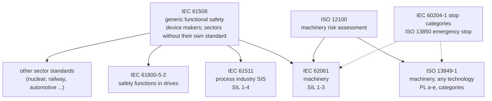
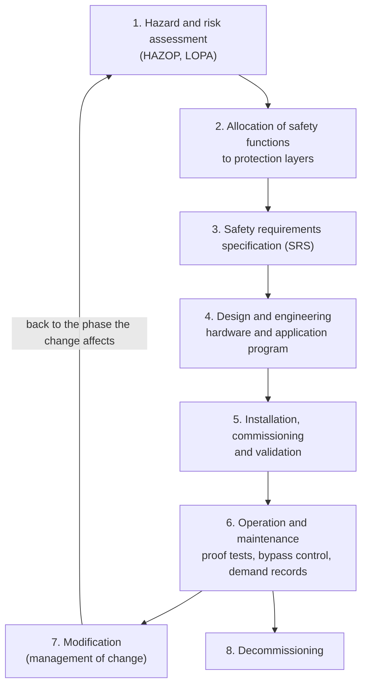
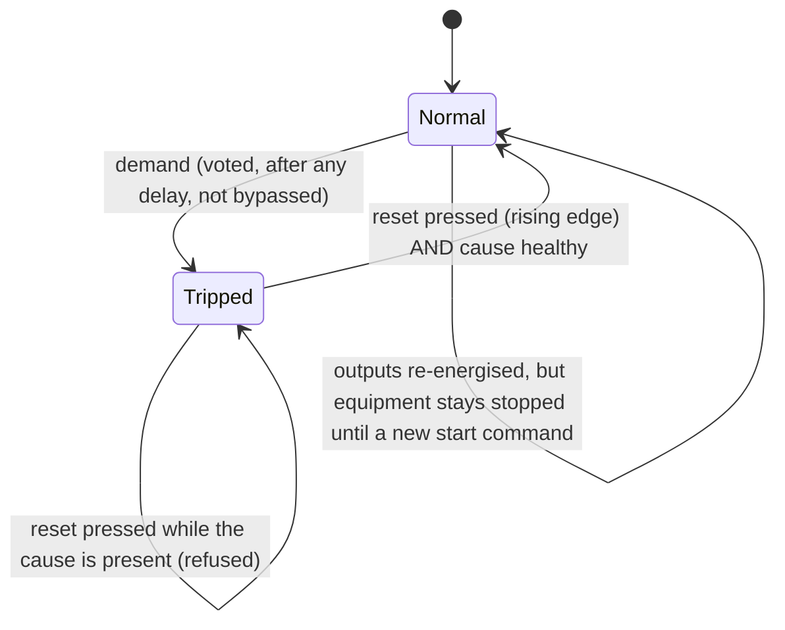
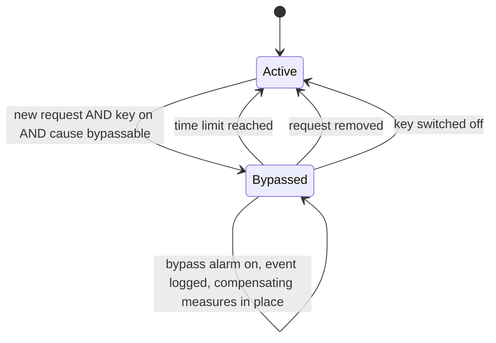
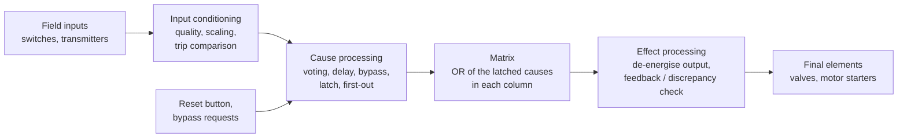

# 20 — Functional Safety, Safety PLCs and Cause-and-Effect

> **Level:** 5 — Professional practice · **Time:** ~12–14 hours · **Prerequisites:** [05 — Boolean Logic, Truth Tables and Function Block Diagram](../05-boolean-logic-and-fbd/), [07 — Timers](../07-timers/), [14 — Analog Signals and Process I/O](../14-analog-and-process-io/), [16 — Alarms, Diagnostics and Fault Handling](../16-alarms-and-diagnostics/)

> **Read this first: what this module is, and what it is not.**
> This module teaches the *concepts* of functional safety. It will help you read safety
> documents, work with safety engineers, program the standard PLC side of a plant sensibly, and
> understand why safety systems are built the way they are. It does **not** qualify you to
> design a safety function. Real safety functions must be specified, designed, verified and
> validated by competent people, under the standards that apply to the plant (for example
> IEC 61511, ISO 13849-1 or IEC 62061), using safety-certified hardware and software, within a
> functional safety management system that includes independent assessment.
> The labs run on a standard, uncertified toolchain. They are **training exercises only**.
> Never copy them into a real safety system, and never use a standard PLC or OpenPLC to carry
> out a safety function. All trip points, failure rates, test intervals and bypass times in
> this module are illustrative.

Every plant you have worked on has two kinds of automation. The control system makes the
product: it opens valves, runs pumps and holds temperatures. The protection systems stand
guard and do nothing, sometimes for years, until something goes wrong. Then they must act
correctly the first time. Functional safety is the discipline of making that second kind of
system dependable enough, and of proving that it is.

If you work with cause-and-effect matrices, SIL verification reports or trip test sheets, you
already live next door to this world. This module connects it to PLC programming. It covers
why a normal PLC is not trusted with a safety function, the standards and their numbers (SIL,
PFD, PL), and what safety PLCs do differently. Then it works through the design patterns found
in every safety program: de-energise to trip, voting, discrepancy monitoring, latching and
reset, and bypasses. Finally it shows how a cause-and-effect matrix becomes logic, and then a
signed test record. The two labs implement a 2oo3 voted pressure trip and a small
cause-and-effect matrix. Their tests walk the matrix cell by cell, the way a site acceptance
test does.

## Learning objectives

- Explain why a standard PLC is not relied on for a safety function, and name the failure
  modes and the common-cause problem behind that rule.
- Describe the layers of protection on a process plant, and the part HAZOP and LOPA play in
  deciding how much risk reduction a safety instrumented function (SIF) must provide.
- Map the main standards (IEC 61508, IEC 61511, ISO 13849-1, IEC 62061, IEC 60204-1,
  ISO 13850) to the plants and machines they cover, and read SIL, PFDavg, RRF, PL and category
  values correctly.
- Explain what safety relays, safety PLCs and black-channel safety protocols add to standard
  equipment.
- Choose a voting architecture (1oo1, 1oo2, 2oo2, 2oo3), balancing dangerous failures against
  spurious trips, and define what happens when a channel fails.
- Apply the core design patterns: de-energise to trip, fail-safe inputs, discrepancy
  monitoring, trip latching with a reset that never restarts anything, and controlled,
  time-limited bypasses and start-up overrides.
- Read a cause-and-effect matrix, implement it systematically, and test every cell (every mark
  *and* every blank) against a written test sheet.
- Calculate a simplified PFDavg for a SIF, and explain what proof testing does to it.

## 20.1 Why a standard PLC is not a safety system

### Control and protection are different jobs

The **basic process control system (BPCS)** is the everyday control system, the PLC or DCS that
runs the plant. The term comes from IEC 61511 and the process industries; on machines people
usually just say "the machine control". It acts all the time. If it misbehaves, somebody
usually notices quickly, because the process drifts.

A **protection function** is the opposite. It sits idle and is **demanded** only when something
has already gone wrong: the level control valve has stuck open, an operator has made a mistake,
an outlet has been blocked. At that moment the protection must work, even though nobody has
seen it work for months. Its failures are **hidden** until a demand, or a test, reveals them.
That is the central problem of functional safety: making a mostly idle system dependable, and
knowing *how* dependable it is.

### How a standard PLC can fail dangerously

A standard PLC is very reliable. The rule against using it for safety is not about reliability
in general. It is about *how* the PLC fails, and whether anyone would notice.

| Failure | What happens | Why it matters for protection |
|---|---|---|
| An output transistor or relay fails short (stuck on) | The output stays energised whatever the program says | The trip command never reaches the valve or motor, and nothing tells you until the demand |
| An input channel sticks at "healthy" | The PLC sees a normal value while the real one changes | A real overpressure is invisible |
| A CPU, memory or firmware fault freezes the outputs | Outputs hold their last state; not every fault is caught by the watchdog | The trip logic is no longer running |
| The program or data is changed (online edit, forced I/O, wrong download) | The logic does something other than what was designed | One keystroke can disable a protection, often without a record |
| An analog card drifts | Values are slowly wrong | The trip comes late, or never |
| The PLC itself causes the demand | The fault that upsets the process also disables the trip | **Common cause**: the protection fails exactly when it is needed |

The last row matters most. If the level controller and the high-level trip run in the same
PLC, one CPU fault can drive the level valve open *and* stop the trip logic. The initiating
event and the failure of the protection then share a single cause. The safety standards
therefore insist on **independence** between whatever can cause a demand and whatever responds
to it.

### Random and systematic failures

The standards distinguish two kinds of failure:

- **Random hardware failures** happen at a statistically predictable rate, because components
  wear out or break: a transmitter's electronics, a solenoid coil, a relay contact. They are
  quantified with failure rates (λ, "lambda", in failures per hour). Redundancy, diagnostics
  and testing reduce their effect.
- **Systematic failures** are built in: a wrong requirement, a design error, a software bug, a
  wrong trip setting, a procedure that leaves a bypass on. Redundancy does not help, because
  every copy contains the same error. They are controlled by *process*: a safety lifecycle,
  reviews, verification, validation, competent people and change control.

A safety PLC is designed and certified against both. Its hardware has redundancy and
diagnostics that detect random failures, and its firmware and tools were developed with the
techniques IEC 61508 requires to limit systematic failures. The *application* program you
write is still yours, and the standards put requirements on how you specify, write, review
and test it.

### What the BPCS is still allowed to do

The BPCS does contribute to safety. Good control keeps the process away from the trip points,
and a BPCS alarm with a trained operator response is a real layer of protection. IEC 61511 lets
you take credit for a BPCS function as a protection layer, but only a limited amount. A BPCS
protection layer that is not designed and managed to IEC 61511 may claim a risk reduction
factor of no more than 10, and it must be independent of the initiating cause. Anything beyond
that needs a safety instrumented system.

## 20.2 Hazards, risk and layers of protection

### The vocabulary

| Term | Meaning |
|---|---|
| **Hazard** | A potential source of harm: a pressurised vessel, a flammable inventory, a moving blade |
| **Harm** | Injury or damage to health. Company criteria often extend it to the environment and to assets. |
| **Risk** | The combination of how often harm could occur (frequency or probability) and how severe it would be |
| **Tolerable risk** | The risk the owner accepts in the given context, based on law, company criteria and society's values. Many companies set a target frequency for each consequence category. In the UK, risk must also be reduced "as low as reasonably practicable" (ALARP). |
| **Demand** | An event or condition that requires the safety function to act |
| **Safety function** | A function that achieves or maintains a safe state of the process or machine, in response to a specific hazardous event |
| **Safe state** | The state that is safe for this hazard, written down: valve closed, motor stopped, blowdown valve open. It is not always "everything off". |
| **Functional safety** | The part of overall safety that depends on a system or equipment operating correctly in response to its inputs |

### Risk reduction

Every protection layer reduces risk. The **probability of failure on demand (PFD)** of a layer
is the chance that it does not work when it is demanded. Its **risk reduction factor (RRF)** is
how many times it cuts the frequency of the hazardous event: **RRF = 1 / PFD**. A layer that
fails on one demand in a hundred has a PFD of 0.01 and an RRF of 100.

```text
  increasing risk  ------------------------------------------------------------------------>

  residual       tolerable                      risk with the other          process risk
  risk           risk                           layers in place              (unprotected)
    |              |                                   |                           |
    |              |<-- risk reduction the SIF must -->|<-- reduction by BPCS, --->|
    |              |    provide (this sets its SIL)    |    alarms, relief ...     |
    |<-- margin -->|                                                               |
    |<------------------------- total risk reduction actually achieved ----------->|
```

The job of the risk assessment is to find the process risk, compare it with the tolerable risk,
and share the necessary reduction between the protection layers. What is left for the SIF sets
its **safety integrity level (SIL)**.

### Layers of protection

Process plants are protected in layers, often drawn as an onion around the process:

```text
            +--------------------------------------------------------+
   outer    | Emergency response (plant and community)               |   MITIGATE:
            | Mitigation: bunds, fire and gas detection, deluge,     |   the event has
            |   blast walls                                          |   happened
            +--------------------------------------------------------+
            | Physical protection: relief valves, rupture discs      |   PREVENT:
            | Safety instrumented system (SIS): automatic trips      |   stop the
            | Alarms and operator response                           |   escalation
            | Basic process control system (BPCS)                    |
            +--------------------------------------------------------+
   inner    | Inherently safer design of the process itself          |
            +--------------------------------------------------------+
                                 THE PROCESS HAZARD
```

- The inner layers **prevent** the hazardous event. The outer layers **mitigate** its
  consequences once it has happened.
- **Inherently safer design** comes first: a smaller inventory, a lower pressure, a vessel
  rated for the maximum pump head. A hazard that has been designed out needs no trip.
- The SIS is usually the last automatic *preventive* layer before physical protection. It does
  not replace good design or relief. It is added when the other layers are not enough.
- In a layer of protection analysis (LOPA, below), a layer can only be counted as an
  **independent protection layer (IPL)** if it is *specific* (designed to prevent this
  consequence), *independent* (of the initiating event and of the other credited layers),
  *dependable* (its PFD can be justified) and *auditable* (it can be inspected and tested).

### HAZOP: finding the hazards

A **hazard and operability study (HAZOP)**, described in IEC 61882, is a structured team review
of the P&IDs. The team splits the plant into **nodes** (a vessel, a line, a pump), then applies
**guide words** to process **parameters** to generate **deviations**: *no* flow, *more*
pressure, *less* level, *reverse* flow, *as well as* (contamination), *part of*, *other than*.
For each credible deviation the team records the causes, the consequences, the existing
safeguards and any recommendations.

| Node | Deviation | Cause | Consequence | Existing safeguards | Recommendation |
|---|---|---|---|---|---|
| V-201 separator | More pressure | PV-201 (outlet pressure control valve) fails closed while the feed continues | Pressure above design, possible vessel rupture, release, fire, fatality | PAH-205 high-pressure alarm on an independent transmitter; PSV-201 (sized for the fire case only) | Carry out a LOPA to decide whether a high-pressure SIF is needed (PT-201A/B/C → close XV-201) |

Other hazard identification methods include What-If reviews and FMEA (failure modes and effects
analysis). Machines use the risk assessment process of ISO 12100. A HAZOP finds out what can go
wrong. It does not, on its own, decide how much protection is enough.

### LOPA: deciding how much protection is enough

**Layer of protection analysis (LOPA)** is a semi-quantitative method that works in orders of
magnitude. It takes one HAZOP scenario (one cause–consequence pair) at a time:

```text
  mitigated event      initiating event      PFD of       PFD of               conditional
  frequency        =   frequency         x   IPL 1    x   IPL 2   x  ...   x   modifiers
  (per year)           (per year)                                              (occupancy, ignition ...)
```

If the mitigated frequency is higher than the tolerable frequency, the gap must be closed. If a
SIF is chosen to close it, the size of the gap is the SIF's required RRF, and that sets its SIL.
[Worked example 1](#worked-example-1-from-lopa-to-a-sil-target) runs these numbers for V-201.
LOPA is not the only method. IEC 61511-3 describes several, including risk graphs, and each
company chooses its methods and calibrates them against its own risk criteria.

## 20.3 The standards map

### Which standard applies where



| Standard | Covers | Typical users | Integrity measure |
|---|---|---|---|
| **IEC 61508** (7 parts) | Functional safety of electrical, electronic and programmable electronic (E/E/PE) safety-related systems in general. The "umbrella" standard. | Makers of safety devices (transmitters, safety PLCs, valves); sectors with no standard of their own | SIL 1–4 |
| **IEC 61511** (3 parts); in the USA ANSI/ISA-61511 (earlier ANSI/ISA-84.00.01) | Safety instrumented systems for the process industry | Plant owners, engineering contractors, SIS integrators | SIL 1–4 (SIL 4 very rare) |
| **ISO 13849-1** (with ISO 13849-2 for validation) | Safety-related parts of machine control systems, in any technology: electrical, hydraulic, pneumatic, mechanical | Machine builders | PL a–e, categories B, 1, 2, 3, 4 |
| **IEC 62061** | Functional safety of safety-related control systems for machinery | Machine builders, especially for complex programmable systems | SIL 1–3 |
| **IEC 60204-1** | Electrical equipment of machines | Machine and panel builders | Stop categories 0, 1, 2 |
| **ISO 13850** | Emergency stop function: principles for design | Machine builders | Sets a minimum of PL c (or SIL 1) |
| **ISO 12100** | Risk assessment and risk reduction for machinery | Machine builders | — |

Standards sit under law. In the European Union, machines must meet the essential health and
safety requirements of the Machinery Directive 2006/42/EC, which the Machinery Regulation
(EU) 2023/1230 replaces from 20 January 2027. Applying harmonised standards such as
ISO 13849-1 is the usual way to show conformity. In the USA, process plants covered by OSHA's
process safety management rule (29 CFR 1910.119) must follow recognised and generally accepted
good engineering practice, and ANSI/ISA-61511 is widely treated as such. Other countries have
their own rules. The point for a programmer: which standard applies is decided at project
level, and it is written in the project documents. Ask for it.

### IEC 61508: the umbrella

IEC 61508 has seven parts: 1 general requirements (including the safety lifecycle), 2 hardware,
3 software, 4 definitions, 5 examples of methods for determining the SIL, 6 guidelines for
parts 2 and 3 (including methods for calculating PFD), and 7 an overview of techniques and
measures. Device manufacturers use it to develop and certify products. A transmitter certified
"SIL 2 capable" or a safety PLC certified "SIL 3" has been shown to be *suitable* for use in a
function of that level, within the limits of its safety manual.

> **The SIL belongs to the function, not to a device.** There is no such thing as a "SIL 3
> transmitter" on its own. A SIF made of a SIL-3-capable logic solver, one ordinary transmitter
> and a single valve that is never tested may not even reach SIL 1. The whole loop, from sensor
> to final element, must be designed and verified together.

### IEC 61511: safety instrumented systems in the process industry

IEC 61511 applies IEC 61508 to the process industries. It is written for plant owners and the
people who design and integrate SIS, not for device makers. Its key terms:

- **Safety instrumented system (SIS):** the sensors, logic solver(s) and final elements that
  carry out one or more safety instrumented functions.
- **Safety instrumented function (SIF):** one specific function with its own SIL, for example
  "on high pressure in V-201 (2oo3 of PT-201A/B/C at 8.0 bar), close XV-201 within 3 s".
- **Safety integrity level (SIL):** one of four discrete levels for the integrity required of a
  SIF. SIL 4 is the highest.
- **Demand mode:** in **low-demand mode** the SIF is demanded no more than once a year. Its
  target is an average probability of failure on demand, **PFDavg**. In **high-demand** or
  **continuous mode** the target is an average frequency of dangerous failure per hour, **PFH**.
  Most process trips are low demand. Most machine safety functions are high demand, because a
  guard may be opened many times per shift.

The target bands come from IEC 61508 and are used by IEC 61511:

| SIL | Low demand: PFDavg | Low demand: RRF | High demand or continuous: PFH (per hour) |
|---|---|---|---|
| 4 | ≥ 10⁻⁵ to < 10⁻⁴ | > 10 000 to ≤ 100 000 | ≥ 10⁻⁹ to < 10⁻⁸ |
| 3 | ≥ 10⁻⁴ to < 10⁻³ | > 1 000 to ≤ 10 000 | ≥ 10⁻⁸ to < 10⁻⁷ |
| 2 | ≥ 10⁻³ to < 10⁻² | > 100 to ≤ 1 000 | ≥ 10⁻⁷ to < 10⁻⁶ |
| 1 | ≥ 10⁻² to < 10⁻¹ | > 10 to ≤ 100 | ≥ 10⁻⁶ to < 10⁻⁵ |

Three things to notice:

1. The SIL is a *band*. If a LOPA says the SIF needs an RRF of 500, the requirement is
   "SIL 2 **and** RRF ≥ 500", not just "SIL 2". A SIL 2 design with an RRF of 150 would fall
   short. A good SRS records the number as well as the SIL.
2. Meeting the PFDavg is necessary but not sufficient. The standard also sets **architectural
   constraints**, a minimum **hardware fault tolerance** (HFT: how many dangerous faults the
   subsystem can have and still perform the function) that rises with the SIL. It also
   requires the devices to have enough **systematic capability** for the SIL, shown by an
   IEC 61508 certificate or, under IEC 61511, by a justification based on documented
   *prior use* in similar service.
3. SIL 4 is almost never used in the process industry. If a LOPA asks for it, the usual answer
   is to change the process design.

#### The safety lifecycle

IEC 61511 organises the work into a **safety lifecycle**. Every phase has defined inputs,
outputs and verification:



Running alongside every phase: **management of functional safety** (who is responsible, and
how competence is ensured), lifecycle planning, **verification** (did each phase produce what
it should?) and **functional safety assessment** (FSA: an independent judgement that the
required safety has been achieved, at defined stages). The second edition of IEC 61511 also
requires a security risk assessment of the SIS. [Module 22](../22-software-engineering/) covers
IEC 62443.

#### The safety requirements specification (SRS)

The SRS is the contract for the SIS: everything the designers and programmers build, and
everything the validation tests, comes from it. For each SIF it typically states:

- the hazard and the SIF's purpose, and the **safe state**
- the sensors, trip points, units, **voting**, and any trip delay
- the final elements and their action (close, stop, open), and the **response time** needed
  compared with the **process safety time**
- the required **SIL and RRF**, and the demand mode
- the **proof-test interval** and how the SIF is to be tested
- whether it is **de-energise-to-trip or energise-to-trip**
- **reset** requirements: manual or automatic, and from where
- **bypass and override** requirements, including start-up overrides
- what happens on a **detected fault** (trip, or degraded operation for a limited repair time)
- the maximum acceptable **spurious trip** rate
- interfaces with the BPCS and the operator (alarms, first-out, HMI)
- manual shutdown means, and dangerous combinations of outputs to be avoided

A cause-and-effect matrix is often the most compact, readable view of much of this. Section
[20.6](#206-cause-and-effect-matrices) shows how.

IEC 61511 also sets requirements for the **application program**: its own specification,
design, review, testing and change control. Much of [Module 22](../22-software-engineering/)
applies, with more formality and independence as the SIL rises.

### ISO 13849-1: machinery, performance levels and categories

ISO 13849-1 deals with the **safety-related parts of control systems (SRP/CS)** of machines, in
any technology. Its integrity measure is the **performance level (PL)**, from **a** (lowest)
to **e** (highest). The required level, **PLr**, comes from the risk assessment. The classic
risk graph in the standard's annex uses three parameters:

| S: severity of injury | F: frequency and/or duration of exposure | P: possibility of avoiding the hazard | PLr |
|---|---|---|---|
| S1 slight (normally reversible) | F1 seldom to less often, and/or short exposure | P1 possible under specific conditions | a |
| S1 | F1 | P2 scarcely possible | b |
| S1 | F2 frequent to continuous, and/or long exposure | P1 | b |
| S1 | F2 | P2 | c |
| S2 serious (normally irreversible, including death) | F1 | P1 | c |
| S2 | F1 | P2 | d |
| S2 | F2 | P1 | d |
| S2 | F2 | P2 | e |

The PL that a design actually achieves depends on four things:

- **Category** (B, 1, 2, 3, 4): the structure of the system and how it behaves when faults occur.
- **MTTFd**: the mean time to dangerous failure of each channel, grouped into *low*
  (3 to 10 years), *medium* (10 to 30 years) and *high* (30 to 100 years).
- **DCavg**: the average diagnostic coverage, meaning the fraction of dangerous failures that
  are detected: *none* (below 60 %), *low* (60 % to below 90 %), *medium* (90 % to below 99 %)
  and *high* (99 % and above).
- **CCF**: measures against common cause failure, scored with a checklist in the standard.
  Categories 2, 3 and 4 need at least 65 points out of 100.

| Category | Requirement in short | Behaviour when a fault occurs |
|---|---|---|
| **B** | Basic safety principles; the components suit the expected conditions | A fault can lead to loss of the safety function |
| **1** | As B, plus well-tried components and well-tried safety principles | A fault can still lead to loss of the function, but is less likely |
| **2** | As B with well-tried principles, plus the safety function is checked at suitable intervals by the machine control | A fault between checks can lead to loss of the function; the next check detects it |
| **3** | A single fault does not lead to loss of the function, and is detected where reasonably practicable | An accumulation of undetected faults can lead to loss of the function |
| **4** | A single fault does not lead to loss of the function, and is detected at or before the next demand; otherwise, an accumulation of faults must not lead to loss | The function is always performed when the faults considered occur |

A typical two-channel emergency stop wired to a safety relay with monitored contactors is a
category 3 or category 4 design. The standard's charts combine category, MTTFd and DCavg into a
PL. For example, category B can reach at most PL b and category 1 at most PL c, while PL e
normally needs category 3 or 4. The PL also corresponds to a band of average probability of
dangerous failure per hour (PFHD), and so maps onto the SILs of IEC 61508/62061:

| PL | PFHD (per hour) | Roughly corresponds to |
|---|---|---|
| a | ≥ 10⁻⁵ to < 10⁻⁴ | — |
| b | ≥ 3 × 10⁻⁶ to < 10⁻⁵ | SIL 1 |
| c | ≥ 10⁻⁶ to < 3 × 10⁻⁶ | SIL 1 |
| d | ≥ 10⁻⁷ to < 10⁻⁶ | SIL 2 |
| e | ≥ 10⁻⁸ to < 10⁻⁷ | SIL 3 |

As with SIL, the PL belongs to the whole function: input device, logic and output device
together. A PL e safety relay wired to one contactor that is never monitored does not give a
PL e function. ISO 13849-1 has been revised several times and details change between
editions, so work to the edition named in your project.

### IEC 62061: SIL for machinery

IEC 62061 does the same job as ISO 13849-1 using the IEC 61508 approach. It expresses the
result as SIL 1 to 3, with the same PFH bands as the high-demand column above; SIL 4 is not
used for machinery. The two standards give comparable answers. Many machine builders use
ISO 13849-1 for simpler functions and IEC 62061 for complex programmable systems, and
safety-device data sheets usually give both a PL and a SIL.

### Stop categories (IEC 60204-1) and the emergency stop (ISO 13850)

IEC 60204-1 defines three **stop categories**:

| Stop category | What happens | Example |
|---|---|---|
| **0** | Stop by immediate removal of power to the machine actuators (an uncontrolled stop) | Contactors drop out; a drive's STO (Module 19) |
| **1** | A controlled stop, with power available to the actuators to achieve the stop, then removal of power once stopped | The drive ramps down, then STO is applied (SS1) |
| **2** | A controlled stop, with power left available to the actuators | The drive holds the axis at standstill under power |

An **emergency stop** must be stop category 0 or 1. The choice follows from the risk
assessment: a large flywheel that coasts for a minute may be safer braked by its drive
(category 1) than left to coast (category 0).

The principles of ISO 13850 (and the matching parts of IEC 60204-1):

- The emergency stop is a **complementary** protective measure. It does not replace guards,
  interlocks or other safeguards.
- It overrides every other function and operating mode, and it acts as a single human action.
- The device is red, on a yellow background where there is one. It **latches** in the
  actuated position, and its contacts have **direct (positive) opening action**, so a welded
  contact is forced apart mechanically.
- Releasing (resetting) the device must **not** restart anything. It only allows a restart,
  which needs a separate, deliberate start command.
- The function must be designed to ISO 13849-1 or IEC 62061. ISO 13850 sets a minimum of
  **PL c** (or SIL 1), and the risk assessment may demand more.

Do not confuse the emergency stop with **emergency switching off**. That removes the electrical
supply to protect against electrical risks such as shock (IEC 60204-1 treats them separately).
And neither is isolation for maintenance: that is lock-out/tag-out with an isolator
(Module 02).

## 20.4 Safety hardware

### Safety relays

A **safety relay** (safety relay module) is the simplest safety logic solver. It is a
certified, pre-engineered module for one function type: emergency stop, guard door, light
curtain or two-hand control. Inside there are usually two relays with **forcibly guided
(mechanically linked) contacts** (IEC 61810-3, formerly EN 50205). Their NO and NC contacts
cannot both be closed at once, even if one contact welds, so each relay can check the other.

```text
   +24 V                                      SAFETY RELAY MODULE
    |                                        +-------------------------------+
    |   E-stop S1, two NC contacts           |  two monitored relays with    |
    |   (direct opening action)              |  forcibly guided contacts,    |
    +-----]/[----- channel 1 --------------->| IN1   cross-checking each     |
    +-----]/[----- channel 2 --------------->| IN2   other on every cycle    |
    |                                        |                               |
    |   KM1 aux NC   KM2 aux NC   Reset (NO) |                               |
    +-----]/[----------]/[----------] [----->| FEEDBACK / RESET input        |
                                             |                               |
                                             | safety output 1 ------------> KM1 coil
                                             | safety output 2 ------------> KM2 coil
                                             +-------------------------------+
           KM1 and KM2 main contacts in series feed the motor: either one can stop it.
           (Terminal names differ between makers; read the module's manual.)
```

What the module adds over a pair of ordinary relays:

- **Redundancy:** two channels. One failed channel does not stop the function working.
- **Cross-monitoring and cross-fault detection:** a short between the two input channels, or a
  channel stuck closed, is detected (many modules use test pulses or different potentials on
  the two channels) and prevents the next start.
- **External device monitoring (EDM):** the NC auxiliary contacts of the output contactors are
  wired in series into the reset loop. If a contactor has welded, its auxiliary contact stays
  open and the relay refuses to start. Contactors used this way have **mirror contacts**: an NC
  auxiliary contact that cannot be closed while a main contact is closed.
- **Monitored manual reset:** many modules act on the *release* of the reset button (the
  falling edge) rather than on the press, and some also reject a press that lasts too long. A
  reset button that is stuck, bridged or held down then cannot reset the circuit on its own.
- **Stop category 1 variants:** delayed outputs that switch off after a set time, so a drive
  can ramp down first.

Safety relays suit small machines with a few functions. Once there are many functions, zones
or muting sequences, the wiring gets complex, and configurable safety relays or safety PLCs
take over.

### Safety PLCs

A **safety PLC** is a programmable logic solver certified to IEC 61508, typically for SIL 3 and
PL e. From the outside it looks like a normal PLC. Inside it is built so that its own failures
are detected and lead to the safe state:

```text
      SAFETY INPUT MODULE              SAFETY CPU                    SAFETY OUTPUT MODULE
  +-------------------------+   +-----------------------------+   +--------------------------+
  | test-pulse outputs T1,T2|   |  processor A <-- compare -->|   | high-side     low-side   |
  | IN1 (sensor ch 1, T1)   |   |  processor B     results    |   | switch --load-- switch   |
  | IN2 (sensor ch 2, T2)   |==>|  self-tests: RAM, CPU, clock|==>| (P)            (M)       |
  | discrepancy check       |   |  watchdog, safety program   |   | read-back of both        |
  +-------------------------+   |  with signature (CRC)       |   | switches, test pulses    |
                                +-----------------------------+   +--------------------------+
            safety data travels in a safety protocol over the "black channel" (below)
```

- **Redundant or diverse processing:** two processors (sometimes of different types) run the
  safety program and compare results; a mismatch drives the outputs to the safe state. Some
  process safety systems use **triple modular redundancy (TMR)** with 2oo3 voting between three
  processors, so that one failed processor neither causes a trip nor stops the protection.
- **Extensive self-diagnostics:** memory tests, CPU instruction tests, clock and power-supply
  monitoring, and program checksums, run continuously in the background.
- **Safe inputs:** two-channel inputs with discrepancy monitoring; **test pulses** (short
  OFF pulses on the sensor supply) that detect shorts to 24 V and cross-connections; line
  monitoring for energise-to-trip circuits.
- **Safe outputs:** two switching elements in series (for example one in the 24 V line and one
  in the 0 V line), with read-back, so one failed switch can still remove power. Brief OFF test
  pulses prove the switches can open.
- **Fault reaction:** when a channel fails, the module sets a safe substitute value (usually 0,
  the tripped state) until the fault is repaired and the channel is deliberately reintegrated.
  Siemens calls this *passivation* and *reintegration*.
- **A protected safety program:** a separate program, compiled by a certified tool, with a
  **signature** (a CRC over the program and its settings) that changes whenever the program
  changes, and password or lock protection.
- **Known worst-case reaction time,** calculated from the input filter, bus watchdog times,
  task time and output switching time.

### Safety-rated field devices

The logic solver is only one of three subsystems in a SIF, and it is rarely the weakest.

- **Sensors:** SIL-capable transmitters with an IEC 61508 certificate or a prior-use
  justification, with internal diagnostics and NAMUR NE43 failure currents (Module 14). For
  machines: safety limit switches with direct opening action; guard interlocking devices
  designed to resist defeat (ISO 14119); light curtains and laser scanners (electro-sensitive
  protective equipment, IEC 61496), whose **OSSD** (output signal switching device) outputs
  are two tested semiconductor outputs.
- **Final elements:** shutdown valves, actuators and solenoids with failure data from the
  manufacturer, often with **partial-stroke testing**; contactors with mirror contacts; drives
  with STO and SS1 (Module 19). Final elements usually contribute most of a SIF's PFDavg
  ([worked example 2](#worked-example-2-pfdavg-of-the-v-201-sif)).

### Black-channel safety protocols

Safety data often travels over the same Ethernet or fieldbus as standard data, through
ordinary switches and cables. The safety protocols treat that network as a **black channel**:
something that cannot be trusted and does not need to be certified. The safety layer at each
end detects every way the network could corrupt a message:

| What can go wrong on the network | How the safety layer detects it |
|---|---|
| Corrupted data | A safety CRC over the data (separate from the network's own checksum) |
| Lost, repeated, inserted or out-of-order messages | A consecutive number or time stamp in every message |
| Delayed messages, or a dead connection | A watchdog: a fresh valid message must arrive within a set time, otherwise the receiver goes to the safe state |
| A message reaching the wrong device | A unique connection or device identifier, included in the CRC |
| Standard data mistaken for safety data | The safety-specific CRC and identifiers never match standard traffic |

The main protocols are **PROFIsafe** (over PROFINET or PROFIBUS), **CIP Safety** (over
EtherNet/IP, and DeviceNet on older systems), **FSoE** (Fail Safe over EtherCAT, also called
Safety over EtherCAT) and **openSAFETY**. They are collected in IEC 61784-3. The watchdog time
is part of the reaction-time calculation. Set it too short and communication hiccups cause
spurious trips; set it too long and the function responds too slowly.

### Keeping safety and standard code apart

In a safety PLC, the **safety program** is separate from the **standard program**, even when
both run in the same CPU:

- The safety program runs in its own task, or its own runtime group, and only it can write
  safety outputs and safety variables.
- The standard program can *read* safety data, for display, alarms and sequencing. Standard
  data can only get into the safety program through defined, validated interfaces, and the
  safety logic must stay safe whatever value arrives. A reset request from the HMI, for
  example, must not be able to reset a trip that is still present.
- The safety program's signature is recorded at validation. A changed signature means a
  change that must go through management of change and be re-verified.

IEC 61511 classifies programming languages by how much freedom they give:

| Class | Meaning | Examples |
|---|---|---|
| **FPL**, fixed program language | The user can only set parameters | Setting a smart transmitter's range, damping and failure direction |
| **LVL**, limited variability language | The user combines pre-defined, certified functions | The restricted ladder or FBD of a safety PLC, with its certified library blocks |
| **FVL**, full variability language | General-purpose programming | C, C++, assembler |

Safety application programs are normally written in an LVL, and the more variability, the more
rigour the standards demand. IEC 61511 gives ladder diagram, function block diagram and
sequential function chart as typical LVLs, and does not count Structured Text or Instruction
List as LVLs. That is one more reason why the ST in this module is for understanding the
behaviour, not a pattern for a safety PLC. Most safety tools restrict the instruction set (no pointers, no
indirect addressing, limited loops) and supply **certified function blocks** for common jobs.
The **PLCopen** organisation has specified a set of standard safety function blocks, such as
`SF_EmergencyStop`, `SF_GuardMonitoring`, `SF_Equivalent` and `SF_Antivalent` (two-channel
inputs), `SF_EDM` (external device monitoring) and two-hand control blocks, with a common
interface (`Activate`, `Ready`, `Error`, diagnostic codes) and an `S_` prefix for
safety-related signals. Several vendors provide these or equivalent blocks. Using a certified
block is far better than writing your own equivalent, and it is exactly why the labs in this
module are exercises and not templates.

## 20.5 Design principles for safety logic

This section uses ST examples to show the *behaviour* of each pattern. In a safety PLC you
would build the same behaviour from the certified blocks of an LVL.

### De-energise to trip and energise to trip

| | De-energise to trip (DTT) | Energise to trip (ETT) |
|---|---|---|
| Normal state | Outputs and inputs energised (NC contacts closed, solenoids powered) | De-energised |
| On a trip | Energy is **removed** | Energy is **applied** |
| Power failure, broken wire, blown fuse | Trips: fails safe | Cannot trip unless the failure is detected |
| Spurious trips | Power dips and loose wiring cause trips | Fewer spurious trips |
| Needs | No special monitoring; a reliable power supply avoids spurious trips | Line monitoring (end-of-line resistors, test currents), power-supply monitoring, backup supplies |
| Typical use | Almost all process shutdown and machine stop functions | Where an unwanted trip is itself dangerous or very costly, for example fire suppression release or deluge |

De-energise to trip is the default. Choose energise to trip only when the SRS justifies it,
and then the loss of energy or the wiring must be monitored and alarmed, because an undetected
broken wire now means a function that cannot act.

### Fail-safe inputs

- **Discrete trip contacts are NC:** closed and TRUE when healthy, open on a trip, so a broken
  wire looks like a trip (Module 02, and every `_NC` input in this course).
- **4–20 mA has a live zero:** 0 mA is not a valid reading, so a broken wire is detectable.
  With NAMUR NE43, a current at or below 3.6 mA or at or above 21.0 mA is a failure signal, not
  a measurement (Module 14).
- **Choose the transmitter's failure direction deliberately.** A smart transmitter can be
  configured to drive its output upscale (≥ 21 mA) or downscale (≤ 3.6 mA) when it detects an
  internal fault. For a single transmitter on a high-pressure trip, upscale makes the fault
  look like a trip. In a voted group the logic should use the **bad-quality** flag instead, as
  Lab 20-1 does, so that the degraded mode is chosen on purpose.
- **Prefer transmitters to switches** in a SIS. A pressure switch that has stuck gives no sign
  until it is tested. A transmitter gives a live value that you can compare with its neighbours
  and with the control transmitter, so a stuck or drifting sensor shows up.
- **Look for common causes in the field:** three transmitters on one plugged impulse line, or
  one shared tapping point, read the same wrong value. So do three transmitters of the same
  type with the same calibration error. The SIS and the BPCS should not share a sensor, because
  a sensor failure could then both cause the demand and blind the trip.

### Voting architectures

An **MooN** ("M out of N") architecture has N channels, and trips when M of them vote to trip.
For three channels, 2oo3 is the Boolean majority function from Module 05:

```text
   A  B  C | 2oo3 trip          2oo3 = (A AND B) OR (B AND C) OR (A AND C)
   0  0  0 |    0
   0  0  1 |    0               A channel "votes" (1) when it is at or beyond the trip point.
   0  1  1 |    1
   1  1  1 |    1               (and the other rows by symmetry)
```

| Architecture | Trips when | Dangerous faults tolerated (HFT) | Effect of one safe failure | Typical use |
|---|---|---|---|---|
| **1oo1** | the only channel votes | 0 | a spurious trip | Simple functions, lower SIL |
| **1oo2** | either channel votes | 1 | a spurious trip (roughly twice the spurious-trip rate of 1oo1) | High integrity where spurious trips are acceptable |
| **2oo2** | both channels vote | 0 | no trip: tolerated | Availability, where a spurious trip is costly or itself hazardous. Weaker for safety than 1oo1 in PFD terms. |
| **2oo3** | any two of three vote | 1 | no trip: tolerated | Safety *and* availability: large process trips, turbine and compressor protection |

The trade-off is between two kinds of failure. A **dangerous failure** stops the function
working (a transmitter stuck at a normal reading). A **safe failure** makes it act when it
should not (a transmitter failing high on a high trip), causing a **spurious trip**. Spurious
trips are not harmless: shutdowns and restarts are among the most hazardous phases of plant
operation, and a trip that keeps "crying wolf" invites people to bypass it. 1oo2 is best
against dangerous failures, 2oo2 best against spurious trips, and 2oo3 gives good protection
against both at the cost of a third channel.

Diagnostics change the picture again. An architecture written **1oo2D** is a 1oo2 whose
channels have diagnostics that can switch out a channel detected as faulty. Many safety PLCs
use this idea internally.

#### Degraded modes: what happens when a channel fails

When a channel's failure is **detected** (bad quality, a failed self-test), the SRS must say
what the voting becomes. For a 2oo3 group the usual choices are:

| Healthy channels | Safety-oriented choice | Availability-oriented choice |
|---|---|---|
| 3 | 2oo3 | 2oo3 |
| 2 | **1oo2** on the two left | **2oo2** on the two left |
| 1 | trip (or 1oo1 for a limited time) | 1oo1 |
| 0 | trip | trip |

A neat way to get the safety-oriented column is to count a bad channel **as a vote to trip**.
2oo3 with one channel already voting becomes 1oo2 on the other two, and two bad channels trip
at once. Lab 20-1 uses this degradation, and you can implement it either way. What you must
never do is let a bad channel count as a **healthy "no trip" vote**. A transmitter reading
0 mA is not saying "the pressure is fine", and treating it that way silently turns 2oo3 into
2oo2 without anybody knowing.

The SRS also limits **how long** the plant may run degraded (the mean time to restoration
assumed in the PFD calculation), and says which compensating measures apply in the meantime.
Degraded operation is always alarmed.

### Comparing channels: median selection and deviation alarms

With three transmitters on one measurement you get diagnostics almost for free:

- **Median (mid-value) selection.** The middle of three readings ignores one failed channel,
  whichever way it fails. It is used for the value shown to the operator, and sometimes for
  control.
- **Deviation alarm.** Each channel is compared with the median. A channel that differs by more
  than a limit for longer than a delay raises an alarm, so a drifting or stuck transmitter is
  found *before* a second failure makes the voting unsafe.

```iecst
FUNCTION F_Median3 : REAL
  VAR_INPUT
    A, B, C : REAL;
  END_VAR
  (* The middle value of three: the larger of (the smaller of A and B) and
     (the smaller of the larger of A and B, and C). No sorting needed. *)
  F_Median3 := MAX(MIN(A, B), MIN(MAX(A, B), C));
END_FUNCTION
```

Why not the average? Take readings of 5.0, 5.0 and 7.0 bar. The median is 5.0, so only the
third channel is 2.0 bar out. The average is 5.67, so the two *good* channels appear 0.67 bar
out and would raise alarms with a 0.5 bar limit, while the bad one looks only 1.33 bar out.
One wild value drags the average towards itself. The median stays with the majority.

Deviation alarms are ordinary alarms and follow the alarm philosophy of
[Module 16](../16-alarms-and-diagnostics/). They do not trip anything.

### Discrepancy monitoring for two-channel inputs

A two-channel input (an e-stop with two NC contacts, a guard switch with two contacts) is read
as two separate inputs. The contacts never open at exactly the same instant, so the logic
allows a short **discrepancy time**, typically tens to hundreds of milliseconds, during which
the channels may disagree. If they disagree for longer, one contact has failed (welded,
bridged or broken), and a **discrepancy fault** is latched.

- **Equivalent** inputs (NC/NC) should always be equal. **Antivalent** inputs (NC/NO) should
  always be opposite, which also detects a short between the two channels.
- The **safety reaction does not wait** for the discrepancy time. Either channel opening is a
  demand, at once. The discrepancy time only decides when a *fault* is declared.
- After a discrepancy fault, both channels must be seen open together, then closed, before a
  reset is accepted. That proves neither contact is stuck.

```text
   one character = 10 ms; discrepancy time 200 ms

   normal press: channel 2 opens 30 ms after channel 1
                 ______                                           ____________________
   Ch1                 |_________________________________________|
                 _________                                        ____________________
   Ch2                    |______________________________________|
                 ______                                                      _________
   Ok                  |____________________________________________________|
                                                                 ^          ^
                                                          released          reset (no restart)

   welded channel 2: only channel 1 opens
                 ______                                 ______________________________
   Ch1                 |_______________________________|
                 _____________________________________________________________________
   Ch2           (never opens)
                 ______
   Ok                  |______________________________________________________________
                                            __________________________________________
   DiscFault     __________________________|
                                            200 ms after Ch1 opened: latched;
                                            a reset is refused because Ch2 never opened
```

[Worked example 3](#worked-example-3-a-two-channel-emergency-stop-input) implements this
behaviour.

### Trip latching and reset

A safety function that has tripped must **stay tripped** until someone deliberately resets it,
even if the cause goes away a second later. If the trip cleared itself, a pressure hovering
around the trip point would cycle the shutdown valve, and the plant could restart after a
transient with nobody having looked at what happened. IEC 61511 requires the SRS to state the
reset requirements of every SIF, and the normal, conservative practice is that a SIF that has
put the process in its safe state keeps it there until a deliberate reset. On machines, the
same principle applies to emergency stops and protective stops: the reset is a separate,
deliberate act, and it must not start anything.



The rules, all of which appear in the labs:

1. **The trip wins.** If the trip condition and the reset are present on the same scan, the
   trip stays: the latch is set-dominant ([Module 04](../04-ladder-logic/)). A reset must not
   even blip the output for one scan.
2. **Reset only when healthy.** A reset while the cause is still present is refused. The
   operator has to fix or confirm the cause first.
3. **Reset is a deliberate act.** It acts on the *press* (a rising edge), not on the button
   level. A reset button held down, stuck or taped down must not reset the trip the moment the
   cause clears. Many safety relays go further and act on the *release* of the button.
4. **Reset is not restart.** Resetting the SIS gives the permission back. Starting the pump or
   opening the valve needs a new, separate command from the BPCS or the operator. Lab 20-1
   implements this by cancelling the operator's open request when the trip happens.
5. **Reset from where you can see.** For machines, the reset device must be placed where the
   person resetting can see that nobody is inside the danger zone.
6. **Power-up is a case too.** Many SIS start with every function tripped after a power cycle
   and need a reset, so that a power dip cannot restart a plant. Whatever the design, write it
   down and test it.

In ladder, the latch and a reset that only works when the cause is clear look like this. The
reset rung comes *after* the set rung, but it is conditioned on `VotedTrip` being FALSE, so
the trip always wins:

```text
      VotedTrip                                                   Tripped
 |-------] [-------------------------------------------------------(S)-----|
 |
      ResetPB        VotedTrip                                    Tripped
 |-------]P[-----------]/[-----------------------------------------(R)-----|
```

### Bypasses, overrides and inhibits

Sometimes a trip input must be ignored deliberately:

- A **maintenance bypass** lets a technician test, calibrate or replace an instrument without
  shutting the plant down.
- A **start-up (operational) override** suppresses a trip whose cause is *expected* to be
  present during start-up: a low-flow or low-pressure trip on a pump that is not yet running,
  for example.

Every bypass is a period in which a SIF is not protecting the plant. That is why bypasses are
among the most tightly controlled things in a SIS, and why a bypass left on is a recurring cause
of serious incidents. Good practice, which the SRS and site procedures make specific:

| Control | Why |
|---|---|
| **Authorisation**: a key switch, permit or password level, plus a work permit | Only authorised people, for a planned reason |
| **Per-cause, not per-SIF, and never for manual shutdown** | Bypass the one instrument being worked on. The ESD push-button and other manual shutdowns are never bypassable. |
| **One channel of a voted group, not the group** | Bypassing one transmitter of a 2oo3 group leaves the other two protecting. Whether they vote 1oo2 or 2oo2 depends on the logic: if the bypass reconfigures the vote (like a bad channel in Lab 20-1) it is 1oo2; if it simply forces the channel to "healthy" it is 2oo2. The SRS must say which. |
| **Time limit with automatic expiry** | A forgotten bypass removes itself. The limit comes from the SRS: often hours, sometimes a shift. |
| **A new request needed after expiry** | Holding the request on must not restart the bypass |
| **Bypass-active alarm and indication** | The operator can always see which protections are not active |
| **Logging** | Who, when, which cause, for how long, and why: for audits and incident investigation |
| **Compensating measures** | An operator watching a local gauge, a reduced throughput, a second instrument |
| **A limit on the number of simultaneous bypasses** | Two bypasses on one SIF may leave nothing |
| **Never by forcing I/O** | A force is invisible to the operator, is not time-limited, and bypasses the logic entirely |



**Start-up overrides** should remove themselves automatically: when the process reaches its
normal condition (the flow is established), or when a maximum time runs out, whichever comes
first. If the flow is still low when the time runs out, the pump trips. That is the point.
[Worked example 4](#worked-example-4-a-start-up-override-for-a-low-flow-trip) shows one.

### Response time and process safety time

The **process safety time (PST)** is the time between the process starting to go wrong (a
failure in the process or the BPCS) and the hazardous event, if the SIF does not act. The SIF
has to complete its action well inside it. Its response time is the sum of:

- the sensor's response and any input filtering or damping,
- the logic solver: input module, scan time, communication watchdogs, and **any trip delay you
  add in the logic**,
- the output module, the solenoid venting, and the valve stroke or motor stop time, which is
  often the biggest part.

A 5 s confirmation delay that seemed harmless at a design review can eat half of a 10 s process
safety time. Every delay in a C&E matrix needs a reason, and it must be checked against the PST
in the SRS.

### Proof testing

Diagnostics find some dangerous failures at once. The rest are **dangerous undetected (DU)**
failures: a valve stuck open, a switch welded, a transmitter frozen at a normal reading. Only a
**proof test** finds them, by making the SIF act (or checking each part of it) and inspecting
the result. Between tests, the chance that a DU failure is sitting there unnoticed keeps
growing. Each proof test resets it. The PFD therefore follows a saw-tooth, and PFDavg is its
average:

```text
  PFD(t)
    ^            /|            /|            /|
    |          /  |          /  |          /  |       for 1oo1:
    |        /    |        /    |        /    |       PFD rises about linearly to λDU x TI
    | - - -/- - - | - - -/- - - | - - -/- - - |- -    PFDavg = λDU x TI / 2
    |    /        |    /        |    /        |
    |  /          |  /          |  /          |
    +-------------+-------------+-------------+---->  time
    0     proof test (TI)     2 TI          3 TI
```

For one channel (1oo1), with a DU failure rate λDU per hour and a proof-test interval TI in
hours, the simplified result is **PFDavg ≈ λDU × TI / 2**. For redundant channels, commonly used
simplified equations (found, for example, in IEC 61508-6 and ISA-TR84.00.02) are
**1oo2 ≈ (λDU × TI)² / 3** and **2oo3 ≈ (λDU × TI)²**, each **plus a common-cause term**
β × λDU × TI / 2. Here β (beta) is the fraction of failures that hit all channels together.
They ignore diagnostics, repair times and imperfect tests, which real SIL verification must
include.

Practical points:

- **Halving the test interval halves PFDavg** for a 1oo1 element. Testing more often is one way
  to meet a target, but every test has a cost and a risk of its own.
- **Proof-test coverage** is the fraction of DU failures that the test really finds. A test that
  only checks the logic, and not the valve, has poor coverage. Undetected failures then
  accumulate over the whole life of the plant.
- **Partial-stroke testing** moves a shutdown valve a few percent while the plant is running.
  That finds a stuck valve between full tests without a shutdown.
- **Record everything:** as-found and as-left condition, failures found, who tested. Failures
  found at proof tests are real-world data that show whether the assumed failure rates hold.
- Testing one channel of a 2oo3 group online needs a **bypass of that channel** under the
  bypass controls above. During the test the other two channels protect alone, as 1oo2 or
  2oo2 depending on how the bypass is implemented (see the bypass table). [Module 23](../23-commissioning-and-troubleshooting/)
  covers the test procedures.

## 20.6 Cause-and-effect matrices

### What a C&E matrix is for

A **cause-and-effect (C&E) matrix** (also called a cause-and-effect chart, or a safety
function matrix) shows the shutdown logic of a plant area as a table. **Causes** are the rows:
trip initiators such as transmitter trips, switches, push-buttons and signals from other
systems. **Effects** are the columns: the actions such as closing a valve, stopping a pump or
opening a blowdown valve. A mark where a row meets a column means "this cause produces this
effect". It is compact, a process engineer and a programmer can both read it, and it is easy
to check line by line. That is why it is used as the reference for the logic, for the FAT and
SAT, and for proof testing.

### Anatomy of a matrix

This is the matrix for Lab 20-2: feed drum V-301 and its feed pump P-301.

```text
 Document: C&E-301  Rev B  Area 300 feed drum  (TRAINING EXAMPLE)          EFFECTS ->  E1       E2       E3       E4
                                                                                       XV-301   P-301    XV-302   XV-303
                                                                                       inlet    feed     outlet   blowdown
 No. Tag        Description                   Trip at     Delay  Voting  Bypass  Reset  CLOSE    STOP     CLOSE    OPEN
 C1  HS-300     Unit ESD push-button          pressed     -      1oo1    No      Man    X        X        X        X
 C2  LSHH-301   V-301 level high-high         85 %        -      1oo1    Yes     Man    X
 C3  LSLL-301   V-301 level low-low           10 %        2 s    1oo1    Yes     Man             X        X
 C4  PSHH-301   V-301 pressure high-high      9.0 barg    -      1oo1    Yes     Man    X                          X
 C5  PSHH-302   P-301 discharge press. HH     16.0 barg   -      1oo1    Yes     Man             X
 C6  TSHH-303   P-301 bearing temp. HH        95 degC     5 s    1oo1    Yes     Man             X

 Notes: all causes latch and need a manual reset; reset is refused while the cause is present.
        All outputs are de-energise to trip. XV-303 is fail-open: de-energised = open.
        Maintenance bypasses need the bypass key; they expire automatically (see SRS).
```

The details vary from company to company, but most matrices carry the same information:

- **Header:** document number and revision, plant area, and a legend explaining every mark and
  abbreviation. Always read the legend first.
- **Cause columns:** tag, description, trip setpoint and units, direction (high or low), any
  trip delay, voting (for example "2oo3 PT-201A/B/C"), SIF number and SIL, alarm priority, and
  whether the cause can be bypassed.
- **Effect columns:** tag, action (open, close, stop, start), sometimes the fail position and
  the reset type.
- **Marks:** most often `X` for "trip this effect". Some projects use extra symbols or letters
  in the cell for things like a delayed action, a permissive, or a note reference. The legend
  defines them, and they differ between companies. Never assume.
- **Notes:** latching and reset, start-up overrides, sequencing ("stop P-301, then close
  XV-302 after 5 s"), and references to the SRS.

### Reading it both ways

- **Read a row** to answer "what happens when this cause trips?" — for example, "What happens
  when V-301 pressure goes high-high?" C4: XV-301 closes and XV-303 opens. The pump keeps
  running.
- **Read a column** to answer "why did this effect happen?" — for example, "Why is P-301
  stopped?" Column E2 lists C1, C3, C5 and C6. The first-out indication tells you which of those
  four came first.
- **Look for the blanks** too. A blank cell is also a requirement: C2 must **not** stop the
  pump. A trip that stops more than the matrix says costs production, and it hides wiring and
  logic errors.

### From matrix to logic

A well-structured implementation mirrors the matrix, so that anyone can trace a cell to the
code and back:



1. **Cause processing** is written once and used for every cause: a function block per cause
   (confirmation delay, bypass with its timer, latch, reset). In a safety PLC this would be a
   certified library block or a small validated user block.
2. **The matrix** is a set of OR functions, one per effect column: an effect trips if any
   latched cause with a mark in its column is active.
3. **Effect processing** drives the output (de-energise to trip) and often checks feedback: a
   valve limit switch that does not confirm "closed" within its travel time raises an alarm.

There are two common ways to write the matrix step:

| Style | What it looks like | Strengths | Weaknesses |
|---|---|---|---|
| **Explicit, one rung per effect** | `XV301_Sol := NOT (C1 OR C2 OR C4);` | Reviewers compare each rung with a column directly; it works in any LVL; online monitoring shows exactly why an output is off | Easy to mistype one term in a large matrix; each change touches code |
| **Table-driven** | A constant `BOOL` array laid out like the drawing, and a loop that ORs each column | The table *is* the drawing, cell for cell; a change edits data, not logic | Loops and indexing are harder to validate, and many safety tools restrict or discourage them |

The Lab 20-2 reference solution uses the table-driven style to show the idea. In a safety PLC
you are more likely to see explicit logic, or logic generated automatically from a matrix
configuration tool. Some process SIS platforms offer such tools, Siemens Safety Matrix for
PCS 7 among them, in which the engineer fills in the matrix and the tool generates and
documents the logic.

### Testing a matrix systematically

A C&E test proves that **each cause produces exactly its effects**: every mark acts, and every
blank does not. The test sheet follows the matrix, one row at a time:

| Step | Action | Expected result | Result | Initials |
|---|---|---|---|---|
| C4.1 | Plant state: all causes healthy, all effects reset and energised | E1–E4 energised, no trip alarm | | |
| C4.2 | Inject PSHH-301 trip at the field device (or its simulated input for a FAT) | CauseLatched C4; **E1 XV-301 closes; E4 XV-303 opens**; E2 and E3 unchanged; trip alarm; first-out = C4 | | |
| C4.3 | Restore PSHH-301 to healthy | All effects stay tripped (latched) | | |
| C4.4 | Press reset with the cause still active (repeat C4.2 first) | Reset refused; effects stay tripped | | |
| C4.5 | Restore the cause, press reset | C4 cleared; E1 and E4 re-energised; first-out cleared; nothing restarts without a separate BPCS or operator command | | |
| C4.6 | Check the SOE / event log | Trip, restore and reset recorded with correct time stamps | | |

Then add the tests that cut across rows: delays at just under and just over the set time;
two causes together (first-out, and a reset that clears only the healthy cause); every bypass
(with and without the key, expiry, the alarm, bypassing one cause while another trips the
same effect); a non-bypassable cause; power loss; a broken wire on each input. The Lab 20-2
`.test` file follows the same plan (apart from power and wiring tests, which need real
hardware), so you can read it as a model test sheet. It has one scenario per row, and each
checks every X and every blank.

At site, C&E tests should inject the cause as close to the field as possible: at the
transmitter with a calibrator, or by operating the switch, rather than by forcing a PLC tag.
[Module 23](../23-commissioning-and-troubleshooting/) describes the method.
[Module 22](../22-software-engineering/) shows how to derive automated tests from the matrix.

### Your own C&E documents

If you already review or test C&E matrices at work, carry these questions to each one. They
are the ambiguities that become bugs:

- Does every cause say whether it **latches**, and how and where it is **reset**?
- Are **delays** given for every cause that needs one, and has each been checked against the
  process safety time?
- Is the **voting** explicit, and is the behaviour with a **failed channel** defined?
- Which causes can be **bypassed**, and under what controls? Are manual shutdowns clearly
  excluded?
- Are **sequenced effects** ("then", "after 5 s") shown clearly, and are they in the SRS?
- Does each effect say what "trip" means for that device (**open or close**, energise or
  de-energise), and does that match the valve's fail position?
- Is there a **first-out** requirement, and for which group of causes?
- Can every row be traced to a **SIF in the SRS** (or marked as non-SIS), and to a **test
  record**?

## Worked examples

### Worked example 1: from LOPA to a SIL target

The HAZOP row for V-201 (section 20.2) goes to LOPA. The numbers below are **assumed**, of the
kind a company's LOPA procedure would supply. They are not generic data to reuse.

| Item | Value | Reasoning |
|---|---|---|
| Consequence | Vessel rupture with possible fatality | From the HAZOP |
| Tolerable frequency for that category | 1 × 10⁻⁵ per year | Company risk criterion (assumed) |
| Initiating event: PV-201 control loop fails, closing the outlet | 0.1 per year | Company table value for a BPCS loop failure (assumed) |
| IPL 1: PAH-205 alarm from an independent transmitter and controller, with enough time for the operator to stop the feed | PFD 0.1 | Meets the IPL criteria (assumed) |
| PIC-201 | not credited | It is the initiating loop |
| PSV-201 | not credited | Sized for the fire case only, not for full feed against a blocked outlet |
| Conditional modifier: someone is in the area | 0.5 | Occupancy (assumed) |

Mitigated frequency without a SIF:

```text
   0.1 /yr  x  0.1  x  0.5  =  5 x 10^-3 per year
```

That is 500 times the tolerable 1 × 10⁻⁵ per year. The SIF must close the gap:

```text
   required PFDavg  <=  1 x 10^-5 / 5 x 10^-3  =  2 x 10^-3        required RRF  >=  500
```

A PFDavg of 2 × 10⁻³ lies in the SIL 2 band (10⁻³ to 10⁻²), so the SRS states:
**SIF-201, SIL 2, RRF ≥ 500 (PFDavg ≤ 2 × 10⁻³)**. Before accepting a SIL 2 function, a good
team asks whether the need can be designed out. Re-sizing PSV-201 for the blocked-outlet case,
or rating the vessel for the maximum feed pressure, might remove the need for a SIF altogether.

### Worked example 2: PFDavg of the V-201 SIF

The proposed SIF-201: three transmitters PT-201A/B/C in 2oo3, a certified safety PLC, and one
shutdown valve XV-201 with its solenoid. The proof-test interval is one year (8 760 h). The
failure data is illustrative, not from any datasheet:

- transmitter λDU = 1 × 10⁻⁷ per hour, β = 5 %, so λDU × TI = 8.76 × 10⁻⁴
- valve assembly λDU = 2 × 10⁻⁶ per hour, so λDU × TI = 1.752 × 10⁻²
- logic solver PFDavg = 1 × 10⁻⁵, taken from its safety manual (assumed)

| Subsystem | Architecture | Independent part | Common-cause part | PFDavg |
|---|---|---|---|---|
| Transmitters | 2oo3 | (8.76 × 10⁻⁴)² = 7.7 × 10⁻⁷ | 0.05 × 8.76 × 10⁻⁴ / 2 = 2.19 × 10⁻⁵ | 2.27 × 10⁻⁵ |
| Logic solver | certified | — | — | 1.0 × 10⁻⁵ |
| One valve | 1oo1 | 1.752 × 10⁻² / 2 = 8.76 × 10⁻³ | — | 8.76 × 10⁻³ |
| **SIF with one valve** | | | | **8.79 × 10⁻³ (RRF ≈ 114)** |

That fails the target of 2 × 10⁻³. Two lessons stand out:

1. **The final element dominates.** The valve contributes about 99.6 % of the total. Better
   transmitters or a better PLC would not help at all.
2. **Common cause dominates redundancy.** Without the β term, the 2oo3 transmitters would give
   7.7 × 10⁻⁷. The common-cause term is almost 30 times larger. Diversity, separate impulse
   lines and separate tapping points are what reduce it.

Halving the valve's test interval to six months brings the valve to 4.38 × 10⁻³ and the SIF to
about 4.4 × 10⁻³ (RRF ≈ 227), still not enough. Adding a
second shutdown valve in series (1oo2, either valve closing stops the flow), with β = 10 % for
two similar valves:

```text
   independent part   (1.752 x 10^-2)^2 / 3        = 1.02 x 10^-4
   common cause       0.10 x 1.752 x 10^-2 / 2     = 8.76 x 10^-4
   two valves                                        9.78 x 10^-4

   SIF total   2.27 x 10^-5 + 1.0 x 10^-5 + 9.78 x 10^-4  =  1.01 x 10^-3   (RRF ~ 990)
```

That meets RRF ≥ 500 with some margin. A real SIL verification would go on to include
diagnostics, repair times, proof-test coverage, the architectural constraints and the
systematic capability of each device, and would be checked independently.

### Worked example 3: a two-channel emergency stop input

This block gives the behaviour of an equivalent (NC/NC) two-channel input with discrepancy
monitoring, as described in section 20.5. A safety PLC provides a certified block for this
(for example PLCopen `SF_Equivalent` followed by `SF_EmergencyStop`, or a vendor equivalent).
This ST version is for understanding only.

```iecst
FUNCTION_BLOCK FB_DualChannel
  VAR_INPUT
    Ch1      : BOOL;   (* channel 1, NC contact: TRUE = healthy *)
    Ch2      : BOOL;   (* channel 2, NC contact: TRUE = healthy *)
    DiscTime : TIME;   (* how long the two channels may disagree *)
    Reset    : BOOL;   (* reset push-button (acts on the rising edge) *)
  END_VAR
  VAR_OUTPUT
    Ok        : BOOL;  (* both channels healthy, no fault, and reset since the last demand *)
    DiscFault : BOOL;  (* latched: the channels disagreed for longer than DiscTime *)
  END_VAR
  VAR
    DiscTimer  : TON;
    ResetEdge  : R_TRIG;
    BothOpened : BOOL; (* both channels have been seen open since the fault *)
    Released   : BOOL; (* reset given since the last demand *)
  END_VAR

  (* Diagnostics: the channels may disagree briefly (contacts never open at
     exactly the same instant), but not for longer than DiscTime. *)
  DiscTimer(IN := Ch1 XOR Ch2, PT := DiscTime);
  IF DiscTimer.Q THEN
    DiscFault := TRUE;
    BothOpened := FALSE;
  END_IF;
  IF NOT Ch1 AND NOT Ch2 THEN
    BothOpened := TRUE;
  END_IF;

  (* Safety reaction: EITHER channel open is a demand, at once, without
     waiting for the discrepancy time. After a demand a reset is needed. *)
  ResetEdge(CLK := Reset);
  IF NOT (Ch1 AND Ch2) THEN
    Released := FALSE;
  ELSIF ResetEdge.Q THEN
    (* A discrepancy fault clears only after both channels have been open
       together, which proves neither contact is welded or bridged. *)
    IF DiscFault AND BothOpened THEN
      DiscFault := FALSE;
    END_IF;
    IF NOT DiscFault THEN
      Released := TRUE;
    END_IF;
  END_IF;

  Ok := Ch1 AND Ch2 AND Released AND NOT DiscFault;
END_FUNCTION_BLOCK
```

Called as `EStopIn(Ch1 := EStop_Ch1_NC, Ch2 := EStop_Ch2_NC, DiscTime := T#200ms, Reset := ResetPB);`,
it behaves like this, scan by scan:

- **Power-up:** `Released` is FALSE, so `Ok` is FALSE until the first reset. The machine
  cannot start just because the power came back.
- **Normal press:** channel 1 opens; on that same scan `Ok` goes FALSE. Channel 2 opens 30 ms
  later; the discrepancy timer ran for 30 ms and stopped, so there is no fault. Releasing the
  button closes both channels, but `Ok` stays FALSE until a reset press.
- **Welded channel 2:** channel 1 opens and `Ok` goes FALSE at once. After 200 ms of
  disagreement, `DiscFault` latches. When the button is released and reset is pressed,
  `BothOpened` is still FALSE, so the fault stays and `Ok` stays FALSE. The welded contact has
  been found at this demand instead of at the next one, when channel 1 might also have failed.
  After the repair, a press that opens both channels, then a reset, clears it.

### Worked example 4: a start-up override for a low-flow trip

A pump has a low-flow trip. At start-up the flow is zero for a few seconds, so the trip would
stop the pump before it could establish flow. The SRS allows a start-up override of at most
30 s, which ends as soon as the flow is healthy.

```iecst
FUNCTION_BLOCK FB_StartupOverride
  VAR_INPUT
    StartCmd      : BOOL;  (* pump start command: its rising edge arms the override *)
    TripCondition : BOOL;  (* TRUE = the low-flow trip condition is present *)
    MaxTime       : TIME;  (* the override is removed after this time at the latest *)
  END_VAR
  VAR_OUTPUT
    OverrideActive : BOOL; (* show on the HMI and log it *)
    TripDemand     : BOOL; (* the trip condition, with the override applied *)
  END_VAR
  VAR
    StartEdge : R_TRIG;
    OvrTimer  : TON;
  END_VAR

  StartEdge(CLK := StartCmd);
  IF StartEdge.Q THEN
    OverrideActive := TRUE;
  END_IF;
  OvrTimer(IN := OverrideActive, PT := MaxTime);
  (* The override ends when the time is up, or as soon as the process is
     healthy: once the flow is established the protection is live again. *)
  IF OvrTimer.Q OR NOT TripCondition THEN
    OverrideActive := FALSE;
  END_IF;
  TripDemand := TripCondition AND NOT OverrideActive;
END_FUNCTION_BLOCK
```

Three details make this safe rather than merely convenient:

- The override is armed only by the **start command's rising edge**. It cannot be applied while
  the pump is running, and holding the start button does not re-arm it.
- It ends **by itself**, at the latest after `MaxTime`. If the pump never establishes flow
  (a closed suction valve, a dry sump), it trips after 30 s instead of running dry.
- It ends **early** as soon as the flow is healthy. If the flow then drops again, the trip acts
  normally: the override does not stay armed for the rest of its 30 s.

`OverrideActive` goes to the HMI and the event log, exactly like a maintenance bypass.

## Common mistakes and how to avoid them

1. **Putting a safety function in the BPCS PLC "because the signals are already there".** Of
   everything on this list, this does the most damage. It creates the common cause described
   in 20.1, and a PLC function with no SRS, no validation and no change control is not a
   protection layer, whatever the logic looks like. Protection above an RRF of 10 belongs in
   a SIS designed to the standards.
2. **Auto-reset.** `Tripped := VotedTrip;` is not a latched trip. It follows the cause, so a
   value hovering at the trip point cycles the plant. Latch every trip and reset it deliberately.
3. **A reset that restarts.** Resetting the SIS must not start the pump or open the valve.
   Cancel the running or open request when the trip happens, and require a new start.
4. **Resetting on the button level instead of its edge.** A stuck or held reset button then
   resets the trip the moment the cause clears. Use a rising edge (or the release, with a
   monitored reset).
5. **Letting the reset win.** If the reset branch comes first, or is not conditioned on the cause
   being healthy, the output can energise for one scan while the cause is present. For a
   solenoid valve, one scan can be enough to move it.
6. **Treating a bad channel as a healthy vote.** A transmitter at 0 mA reads as a very low
   value, which never votes for a high trip, so 2oo3 silently becomes 2oo2. Use the quality
   flag and define the degraded mode.
7. **Comparing channels with the average.** One wild channel drags the average and flags the
   good channels. Compare with the median.
8. **Uncontrolled bypasses:** no time limit, no alarm, no log, bypassing a whole voted group, or
   bypassing with a force. Build time-limited, alarmed, per-cause bypasses, and never force
   safety I/O.
9. **Testing only the Xs.** A C&E test that checks every mark but no blanks misses cross-wired
   outputs and copy-paste errors. Test every cell, the latch, and the reset.
10. **Believing a certificate makes a SIL.** A SIL 3 logic solver in a loop with an untested
    valve can be a SIL 1 function or worse. Verify the whole SIF.
11. **Energise to trip without monitoring.** An undetected broken wire means a function that
    cannot act. Monitor the lines and the supply, or use de-energise to trip.
12. **Ignoring common causes:** one impulse line for three transmitters, one power supply for
    both channels, a sensor shared by the BPCS and the SIS, the same wrong calibration on every
    channel.
13. **Adding delays without checking the process safety time.** Every delay in the logic adds to
    the response time. Justify it in the SRS.
14. **Stopping a vertical axis with STO alone.** Removing torque drops a suspended load. It needs
    a brake with safe brake control (Module 19).
15. **Changing safety logic online or outside management of change.** Every change to a SIS goes
    through MOC: impact analysis, review, re-verification and re-validation, and a new signature
    recorded.

## Vendor notes

**Siemens (TIA Portal with STEP 7 Safety).** Safety-capable CPUs are the F-CPUs (for example
S7-1500F and S7-1200 FC variants, and ET 200SP F-CPUs), with fail-safe F-I/O modules
communicating over PROFIsafe. The safety program lives in an F-runtime group and is programmed
in F-LAD or F-FBD, with a restricted instruction set, F-data types and F-blocks (F-FB, F-FC,
F-DB). Siemens supplies certified instructions such as `ESTOP1` (emergency stop), `FDBACK`
(contactor feedback monitoring), `SFDOOR` (guard door monitoring) and `ACK_GL` (global
acknowledgement for reintegration). The Safety Administration Editor shows the collective
F-signature and manages safety passwords. A faulty F-I/O channel is *passivated* (substitute
value 0) and must be *reintegrated*, either automatically or after an operator
acknowledgement, as configured. For process plants, SIMATIC PCS 7 uses F-CPUs, and the Safety
Matrix add-on configures shutdown logic in cause-and-effect form.

**Rockwell (Studio 5000 Logix Designer).** GuardLogix and Compact GuardLogix controllers run a
**safety task** alongside the standard tasks. Safety tags can be written only by the safety
task. Standard data reaches the safety task through **safety tag mapping**. The safety program
is protected by a **safety signature**, and the controller can be **safety-locked** to prevent
edits. Safety I/O (Guard I/O and others) communicates using **CIP Safety** over EtherNet/IP.
The safety instruction set includes certified application instructions for common functions,
such as the dual-channel input instructions (the DCS family) and `CROUT` (configurable redundant
output). For process safety, Rockwell also offers separate, dedicated safety system families.

**CODESYS-based and other machine-safety platforms.** CODESYS offers safety add-ons that device
makers certify together with their own safety hardware. The safety application uses a
restricted language profile and certified libraries, often including the PLCopen safety blocks.
Beckhoff TwinSAFE uses Safety over EtherCAT (FSoE). Configurable safety controllers such as
Pilz PNOZmulti and SICK Flexi Soft are programmed graphically from certified function blocks,
and sit between safety relays and full safety PLCs.

**Process SIS platforms.** Dedicated SIS logic solvers include Schneider Electric Triconex
(triple modular redundant), HIMA, Yokogawa ProSafe-RS, Honeywell Safety Manager, Emerson DeltaV
SIS and ABB's high-integrity controllers. They share the ideas in this module: certified
hardware, restricted programming with certified function blocks, SOE recording for first-out
analysis, bypass management with logging, and tools that document the logic against the C&E.

**OpenPLC and MATIEC (this course's toolchain).** Neither is certified for safety, and neither
must ever be used to carry out a safety function. They are excellent for learning how safety
*logic* behaves, which is exactly what the labs use them for.

## Labs

> **Both labs are training exercises.** They teach how voting, latching, reset, first-out and
> bypass logic behave, and how to test it systematically. They are not designs for real safety
> functions, the tools are not certified, and the numbers are chosen for testing, not taken from
> a real SRS.

### Lab 20-1: 2oo3 pressure trip with degraded voting

**Goal:** implement a voted trip that handles bad transmitters, compares channels, latches, and
resets correctly without restarting anything.

**Story.** Separator V-201 is protected against overpressure by SIF-201 (worked examples 1 and
2): three pressure transmitters PT-201A/B/C, range 0–10 bar, trip at 8.0 bar, closing the inlet
shutdown valve XV-201. The SRS extract for this exercise:

- A transmitter has **bad quality** when its loop current is at or below 3.6 mA, or at or above
  21.0 mA (NAMUR NE43). The given function `F_RawGood` does this check, and `F_RawToBar`
  converts raw counts to bar.
- **Voting:** with three healthy channels, 2oo3. With one bad channel, 1oo2 on the two healthy
  ones. With two or three bad channels, trip.
- **Deviation alarm:** while all three channels are healthy, a channel more than 0.5 bar from the
  median for 3 s is flagged. It does not trip.
- **Latched trip, manual reset** only when the voted trip has cleared. **Reset must not reopen
  the valve**: the operator must press Open again.

**Interface** (use these names exactly):

| Tag | Address | Type | Description |
|---|---|---|---|
| `PT201A_Raw` | `%IW0` | INT | PT-201A raw count: 0 = 4 mA = 0 bar, 27648 = 20 mA = 10 bar (1 mA = 1728 counts) |
| `PT201B_Raw` | `%IW1` | INT | PT-201B, same scaling |
| `PT201C_Raw` | `%IW2` | INT | PT-201C, same scaling |
| `ResetPB` | `%IX0.0` | BOOL | Trip reset push-button, NO |
| `OpenPB` | `%IX0.1` | BOOL | Operator "open XV-201" push-button, NO |
| `XV201_Sol` | `%QX0.0` | BOOL | XV-201 solenoid: TRUE = energised = valve open |
| `TripLamp` | `%QX0.1` | BOOL | TRUE while the trip is latched |
| `DevAlarm` | `%QX0.2` | BOOL | Common deviation alarm: `DevA OR DevB OR DevC` |
| `ChanFaultAlm` | `%QX0.3` | BOOL | TRUE while any channel has bad quality |
| `A_Bad`, `B_Bad`, `C_Bad` | — | BOOL | The channel has bad quality |
| `HealthyCount` | — | INT | Number of channels with good quality, 0–3 |
| `VotedTrip` | — | BOOL | The live (unlatched) result of the voting |
| `Tripped` | — | BOOL | The latched trip |
| `DevA`, `DevB`, `DevC` | — | BOOL | The channel deviates from the median |

The starter also gives you the functions `F_RawToBar(Raw)` and `F_RawGood(Raw)`, and the
constants `TRIP_BAR` (8.0), `DEV_LIMIT_BAR` (0.5) and `DEV_DELAY` (T#3s).

**Requirements:**

1. Each channel's `X_Bad` flag is `NOT F_RawGood(raw)`. `HealthyCount` counts the good
   channels. `ChanFaultAlm` is TRUE while any channel is bad, and clears when all are good again.
2. A **healthy** channel votes to trip when its pressure is at or above 8.0 bar.
3. `VotedTrip` follows the voting in the SRS extract: 3 healthy → at least 2 votes; 2 healthy →
   at least 1 vote; 0 or 1 healthy → TRUE. There is no trip delay.
4. `Tripped` becomes TRUE whenever `VotedTrip` is TRUE, and stays TRUE until reset.
   `TripLamp` shows `Tripped`.
5. A reset happens on the **rising edge** of `ResetPB`, and only if `VotedTrip` is FALSE at that
   moment. A press while the trip is present is ignored, is not remembered, and a button held
   down does not act when the cause later clears. The trip wins on every scan: `Tripped` must
   not go FALSE even for one scan while `VotedTrip` is TRUE.
6. XV-201 opens only on a **press** (rising edge) of `OpenPB` while not tripped, and then stays
   open. A trip closes it and cancels the open request. After a reset the valve stays closed
   until `OpenPB` is pressed again. A press at any time while `Tripped` is TRUE is ignored and
   not remembered, even after the cause has cleared, and a button held down through the reset
   must not reopen the valve.
7. At power-up with healthy readings, nothing is tripped and the valve is closed.
8. `DevA`/`DevB`/`DevC`: only while all three channels are healthy, a channel whose pressure
   differs from the median of the three by **more than** 0.5 bar, continuously for 3 s, is
   flagged. The flag clears as soon as the difference is back within the limit, or as soon as
   any channel goes bad. Deviation never trips.

**Run the test:**

```bash
python3 tools/plctest.py 20-functional-safety/labs/starter/20-1-2oo3-pressure-trip.st   # fails
cp 20-functional-safety/labs/starter/20-1-2oo3-pressure-trip.st my-work/
python3 tools/plctest.py my-work/20-1-2oo3-pressure-trip.st 20-functional-safety/labs/20-1-2oo3-pressure-trip.test
```

The test file lists the raw counts it uses (5.0 bar = 13824, 8.5 bar = 23501, a wire break =
−6912 and so on). When you pass, try two design questions. Why does requirement 8 suspend the
deviation check when a channel is bad? And what would change if the SRS asked for 2oo2 as the
degraded mode instead?

<details>
<summary>Hint (open only if stuck)</summary>

- Work in stages, each a few lines: pressures and quality, counts, voting, deviation, latch,
  valve.
- Count `HealthyCount` and "healthy and high" votes with three `IF` blocks, then use
  `CASE HealthyCount OF 3: ... 2: ... ELSE ... END_CASE`. Alternatively, count a bad channel as
  a vote and use "votes >= 2". Check for yourself that the two give the same answers.
- Median of three: `MAX(MIN(A, B), MIN(MAX(A, B), C))`. Use three separate `TON` instances for
  the deviation delays.
- Latch with trip priority: `IF VotedTrip THEN Tripped := TRUE; ELSIF ResetEdge.Q THEN Tripped := FALSE; END_IF;`
  (`ResetEdge` is an `R_TRIG` on `ResetPB`).
- Keep an `OpenReq` flag: cleared while tripped, set by the rising edge of `OpenPB`.
  `XV201_Sol := OpenReq AND NOT Tripped;`
</details>

### Lab 20-2: Cause-and-effect matrix with first-out and bypasses

**Goal:** implement a small C&E matrix the way it is done in real shutdown systems, and read its
test file as a model C&E test sheet.

**Story.** Feed drum V-301 receives feed through inlet valve XV-301. Pump P-301 draws from it
through outlet valve XV-302. Blowdown valve XV-303 (fail-open) depressurises the drum. The C&E
matrix (section 20.6) is:

| Cause | Tag | Description | Input | Delay | Bypassable | E1 XV-301 close | E2 P-301 stop | E3 XV-302 close | E4 XV-303 open |
|---|---|---|---|---|---|---|---|---|---|
| C1 | HS-300 | Unit ESD push-button | `HS300_NC` | — | **No** | X | X | X | X |
| C2 | LSHH-301 | V-301 level high-high | `LSHH301_NC` | — | Yes | X | | | |
| C3 | LSLL-301 | V-301 level low-low | `LSLL301_NC` | 2 s | Yes | | X | X | |
| C4 | PSHH-301 | V-301 pressure high-high | `PSHH301_NC` | — | Yes | X | | | X |
| C5 | PSHH-302 | P-301 discharge pressure high-high | `PSHH302_NC` | — | Yes | | X | | |
| C6 | TSHH-303 | P-301 bearing temperature high-high | `TSHH303_NC` | 5 s | Yes | | X | | |

Every cause latches and needs a manual reset. Every output is de-energise to trip. The trip
amplifiers or switches are upstream: each cause arrives as an NC contact that reads TRUE when
healthy.

**Interface** (use these names exactly):

| Tag | Address | Type | Description |
|---|---|---|---|
| `HS300_NC` | `%IX0.0` | BOOL | C1 ESD push-button, NC: TRUE = healthy |
| `LSHH301_NC` | `%IX0.1` | BOOL | C2 level high-high switch, NC |
| `LSLL301_NC` | `%IX0.2` | BOOL | C3 level low-low switch, NC |
| `PSHH301_NC` | `%IX0.3` | BOOL | C4 V-301 pressure high-high switch, NC |
| `PSHH302_NC` | `%IX0.4` | BOOL | C5 P-301 discharge pressure high-high switch, NC |
| `TSHH303_NC` | `%IX0.5` | BOOL | C6 P-301 bearing temperature high-high switch, NC |
| `ResetPB` | `%IX0.6` | BOOL | Reset push-button, NO |
| `BypassKey` | `%IX0.7` | BOOL | Bypass key switch: TRUE = bypassing permitted |
| `XV301_Sol` | `%QX0.0` | BOOL | E1: FALSE closes XV-301 |
| `P301_Permit` | `%QX0.1` | BOOL | E2: FALSE stops P-301 |
| `XV302_Sol` | `%QX0.2` | BOOL | E3: FALSE closes XV-302 |
| `XV303_Sol` | `%QX0.3` | BOOL | E4: FALSE opens blowdown valve XV-303 |
| `TripAlm` | `%QX0.4` | BOOL | Common trip alarm: TRUE while any cause is latched |
| `BypassAlm` | `%QX0.5` | BOOL | TRUE while any bypass is active |
| `BypReq` | — | ARRAY[1..6] OF BOOL | Bypass request per cause, from the HMI (maintained) |
| `Bypassed` | — | ARRAY[1..6] OF BOOL | Bypass active per cause |
| `CauseLatched` | — | ARRAY[1..6] OF BOOL | Latched trip per cause |
| `FirstOut` | — | INT | First cause since the last full reset, 1–6; 0 = none |

The starter declares these and the constant `BYPASS_TIME` (T#60s: shortened so the test runs
quickly; real limits come from the SRS and are often hours).

**Requirements:**

1. **Trip condition:** a cause's contact reads FALSE continuously for its delay (none, 2 s or
   5 s). A contact that opens for less than the delay does not trip, and the delay starts again
   the next time it opens.
2. **Latch:** `CauseLatched[i]` becomes TRUE when the trip condition is confirmed and the cause
   is not bypassed, and stays TRUE until reset.
3. **Effects:** each output is FALSE while any latched cause has an X in its column, and TRUE
   otherwise.
4. **Reset:** on the rising edge of `ResetPB`, every latched cause whose contact is healthy
   (TRUE), or which is bypassed, is cleared. Causes whose contact is still open stay latched,
   even if their delay has not run out again yet. A held button does not act later. The trip
   wins: an output must not re-energise even for one scan while one of its causes is present
   and not bypassed.
5. `TripAlm` is TRUE while any cause is latched.
6. **First-out:** when a cause latches while no cause is latched, `FirstOut` becomes its number.
   If several latch on the same scan, the lowest number is shown. Later causes do not change
   it. It returns to 0 when a reset leaves no cause latched.
7. **Bypass start:** a bypass of cause *i* starts on the **rising edge** of `BypReq[i]` while
   `BypassKey` is TRUE, for causes 2–6 only. C1 (ESD) can never be bypassed. Turning the key on
   while a request is already set does not start a bypass: the request must be made again.
8. **Bypass end:** a bypass ends `BYPASS_TIME` after it started (each cause has its own timer),
   when `BypReq[i]` goes FALSE, or when `BypassKey` goes FALSE, whichever comes first. After it
   ends, it does not restart until the request is removed and made again with the key on.
9. **While bypassed** a cause cannot latch, and it counts as healthy for the reset. Applying a
   bypass does not clear an existing latch; a reset is still needed. The confirmation delay
   keeps timing during a bypass, so when a bypass ends with the contact still in the trip
   state, the cause trips at once if the contact has already been open for its delay, and
   otherwise when the delay runs out.
10. `Bypassed[i]` shows each active bypass, and `BypassAlm` is TRUE while any bypass is active.

**Run the test:**

```bash
python3 tools/plctest.py 20-functional-safety/labs/starter/20-2-cause-and-effect.st   # fails
cp 20-functional-safety/labs/starter/20-2-cause-and-effect.st my-work/
python3 tools/plctest.py my-work/20-2-cause-and-effect.st 20-functional-safety/labs/20-2-cause-and-effect.test
```

Read the `.test` file side by side with the matrix. Part 1 is a row-by-row C&E test sheet:
each scenario trips one cause and checks every X and every blank, then the latch, the reset
and the first-out. Parts 2 to 4 are the cross-row tests from section 20.6.

**Extensions** (not tested): allow only one bypass at a time; add a "bypass expires in 10 s"
warning; count bypass activations per cause for the log; add a feedback check that raises an
alarm if a valve's closed limit switch has not confirmed within 10 s of its effect tripping.

<details>
<summary>Hint (open only if stuck)</summary>

- Write one function block, `FB_TripCause`, with inputs `Healthy`, `TripDelay`, `Bypassable`,
  `BypassKey`, `BypassReq`, `BypassTime` and `ResetCmd` (a one-scan pulse made once in the
  program from `ResetPB`), and outputs `Latched` and `Bypassed`. Declare six instances, one
  per line: MATIEC cannot make an array of FB instances, and a list such as
  `Cause1, Cause2 : FB_TripCause;` crashed OpenPLC's compiler
  ([Appendix E](../appendices/E-matiec-openplc-notes.md)).
- Inside it: an `R_TRIG` on `BypassReq` starts the bypass. A `TON` running while `Bypassed` is
  TRUE ends it, as do `NOT BypassReq` and `NOT BypassKey`. Because the start needs a new edge,
  an expired bypass cannot restart.
- Latch with trip priority: `IF Present AND NOT Bypassed THEN Latched := TRUE; ELSIF ResetCmd AND (Healthy OR Bypassed) THEN Latched := FALSE; END_IF;`
- For the matrix, either write one line per column
  (`XV301_Sol := NOT (CauseLatched[1] OR CauseLatched[2] OR CauseLatched[4]);`) or put the
  matrix in a constant `ARRAY[1..6, 1..4] OF BOOL` and loop. Compare the two for readability.
- First-out: clear it when nothing is latched; otherwise, if it is still 0, search 1 to 6 for
  the first latched cause.
</details>

## Check your understanding

1. The level controller LIC-101 and the high-level trip LSHH-101 are both in the same standard
   PLC, and LIC-101's valve failing open is the initiating event. Give two reasons this trip
   cannot be credited as a SIL 1 function.
2. A SIF has a calculated PFDavg of 4 × 10⁻³. What is its RRF, and which SIL band is it in? A
   LOPA requires an RRF of 300. Is the requirement met?
3. Compare 1oo2 and 2oo2 for a shutdown function. Which one is better at making sure the plant
   trips when it should, which is better at avoiding spurious trips, and why?
4. In a 2oo3 group, PT-201B fails and its output goes to 0 mA. The program ignores quality and
   uses the reading (−2.5 bar) as a normal vote. What has the voting silently become, and what
   should it be according to the Lab 20-1 SRS?
5. Three transmitters read 6.0, 6.1 and 9.0 bar. With a 0.5 bar deviation limit, which channels
   are flagged using the median, and which using the average?
6. An operator holds the reset button down while a trip cause is still present. Ten seconds later
   the cause clears. What must happen, and why?
7. Which IEC 60204-1 stop categories may an emergency stop use? Which category does a drive's
   STO give, and which does SS1 give?
8. List at least five controls you would expect on a maintenance bypass of one transmitter in a
   SIS.
9. After a trip on the Lab 20-2 unit, XV-301 is closed, XV-303 is open, the pump is still running
   and `FirstOut` = 4. Which cause started the trip? Using the matrix, which other causes could
   also be latched now, and which certainly are not?
10. The proof-test interval of a 1oo1 valve is extended from one year to two. What happens to its
    PFDavg? For a 1oo2 pair, what happens to the independent part and to the common-cause part?

<details>
<summary>Answers</summary>

1. First, common cause: a PLC fault can both open the valve (the initiating event) and stop the
   trip logic, so the layer is not independent of the initiating event. Second, the standard PLC
   and its program were not designed, verified and managed to IEC 61511. At most, a BPCS layer
   that is independent of the initiating cause can claim an RRF of 10, which is below SIL 1
   (RRF above 10). Further reasons: no SRS, no validation, no proof testing, no protection
   against online changes and forcing.
2. RRF = 1 / 4 × 10⁻³ = 250. That is in the SIL 2 band (PFDavg from 10⁻³ to below 10⁻²). The
   requirement of RRF 300 is **not** met, even though the function is "SIL 2". The number
   matters, not just the band.
3. 1oo2 trips if either channel votes, so it still works with one channel failed dangerously:
   it is better for safety. It also trips on either channel's safe failure, so it has about
   twice the spurious trips of 1oo1. 2oo2 needs both channels, so a single safe failure does not
   trip it (better availability), but a single dangerous failure defeats it (worse for safety
   than 1oo2). 2oo3 combines the strengths of both.
4. B can never vote for a high trip, so the group trips only if A and C both vote: it has become
   2oo2 on A and C, with nobody told. Under the Lab 20-1 SRS, B is flagged bad, the channel fault
   alarm comes on, and the voting becomes 1oo2 on A and C: a trip if *either* reaches 8.0 bar.
5. Median = 6.1. Deviations: 0.1, 0.0 and 2.9, so only the 9.0 bar channel is flagged. Average =
   7.03. Deviations: 1.03, 0.93 and 1.97, so all three are flagged, including the two good ones.
6. Nothing: the trip must stay latched. The reset acts on a press (rising edge) and only when the
   cause is healthy. A press made while the cause was present is not remembered, and a held or
   stuck button must not reset the trip when the cause clears. The operator must release the
   button and press it again with the cause clear, which is the deliberate check that the
   standards intend. Even then, nothing restarts until a separate start or open command is
   given.
7. Category 0 or 1 (category 2 is not allowed for an emergency stop). STO gives a stop category
   0; SS1 gives a stop category 1 (a controlled stop, then STO).
8. Authorisation (key switch or password, plus a permit); bypass per instrument, never a manual
   shutdown and never a whole voted group; an automatic time limit; a new request needed after
   expiry; a bypass-active alarm and indication; logging of who, when, why and for how long;
   compensating measures; a limit on simultaneous bypasses; no forcing. (Any five.)
9. C4 (PSHH-301, V-301 pressure high-high) came first: its row is XV-301 close and XV-303 open,
   which matches. C2 could also be latched (it closes XV-301, which is closed anyway, and its
   effect cannot be seen separately). C1, C3, C5 and C6 are certainly **not** latched, because
   each of them would stop the pump. Check `CauseLatched[2]` to be sure. First-out tells you
   the initiator, not the full list.
10. For 1oo1, PFDavg ≈ λDU × TI / 2 doubles. For 1oo2, the independent part (λDU × TI)² / 3
    becomes four times larger, and the common-cause part β × λDU × TI / 2 doubles. The
    common-cause part is usually the larger one already, so the pair's total roughly doubles
    too.
</details>

## Further reading

- IEC 61511 (all three parts), especially Part 2 for guidance on applying Part 1, and Part 3
  for methods of determining the required SIL.
- IEC 61508, Parts 1 and 6, for the lifecycle and PFD calculation methods.
- CCPS (Center for Chemical Process Safety), *Layer of Protection Analysis: Simplified Process
  Risk Assessment*: the standard text on LOPA.
- ISA-TR84.00.02 for SIF PFD calculation, and the ISA technical reports on applying
  ANSI/ISA-61511.
- ISO 12100, ISO 13849-1 and -2, IEC 62061, IEC 60204-1 and ISO 13850 for machinery.
- The PLCopen *Safety* specifications (technical committee TC5), for the standard safety
  function blocks.
- The safety manual of any safety PLC you work with. It lists what the certificate covers and
  the rules the application must follow, and it is required reading before programming one.
- Courses leading to functional safety certifications (for example TÜV-based programmes for
  engineers and technicians, or the ISA 84 certificate programme). See
  [Appendix D](../appendices/D-resources-and-certifications.md).

---

Previous: [19 — Motion Control, Drives and Positioning](../19-motion-and-drives/) · Next: [21 — Architecture, Industry Standards and Design Patterns](../21-architecture-and-standards/)
