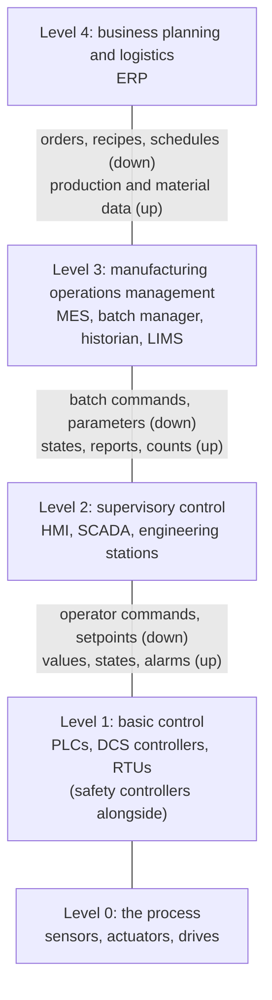
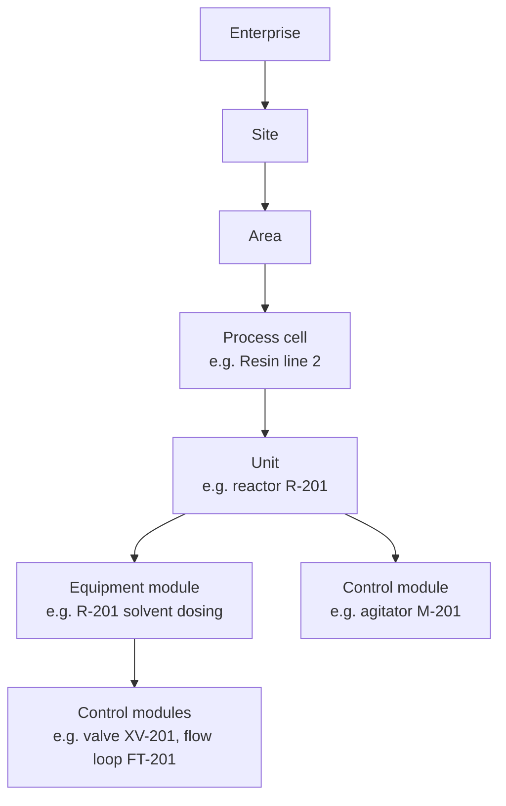
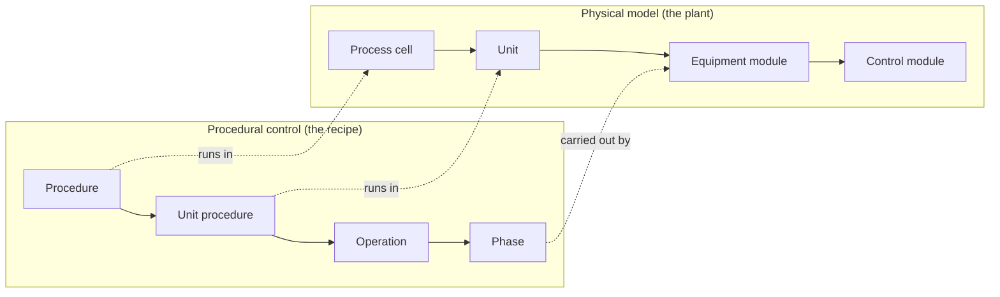
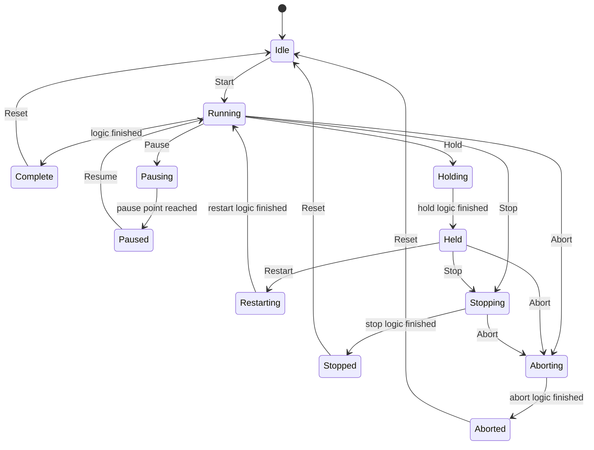
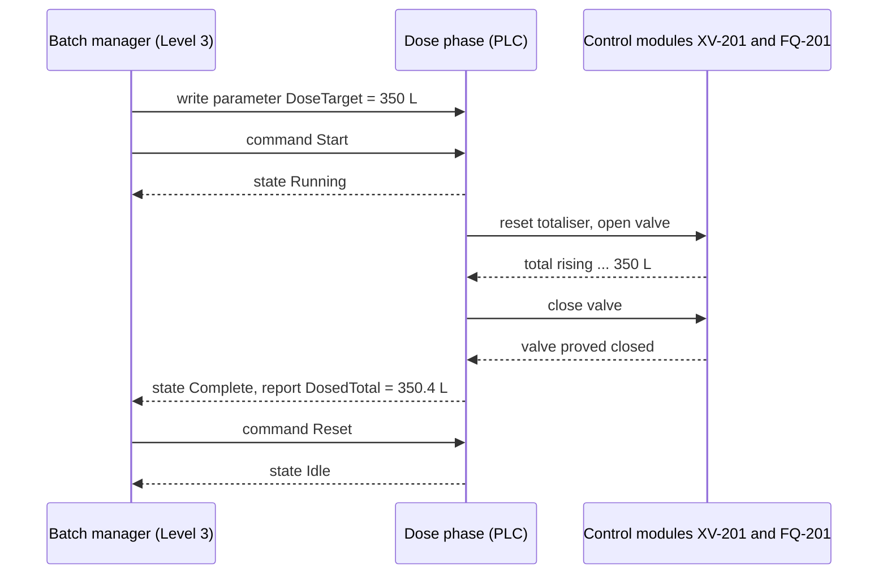
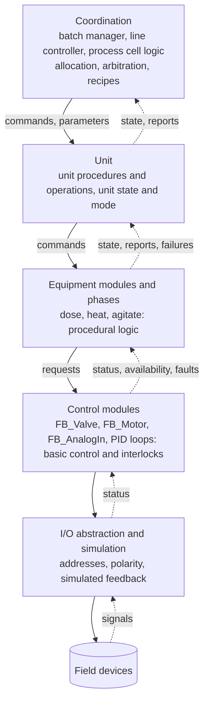
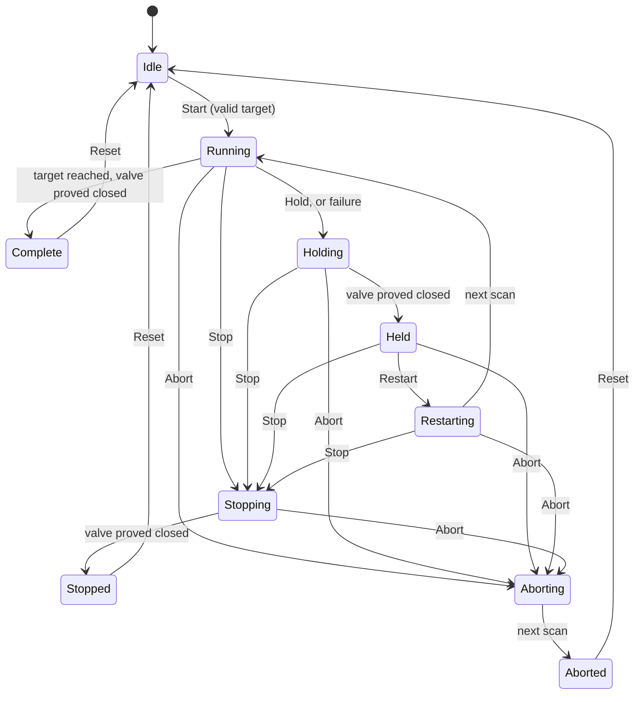

# 21 — Architecture, Industry Standards and Design Patterns

> **Level:** 5 — Professional practice · **Time:** ~14 hours · **Prerequisites:** [Module 11](../11-program-organization/), [Module 12](../12-data-structures/), [Module 13](../13-sequential-control/), [Module 18](../18-hmi-and-scada/)

So far you have written programs for one machine or one pump station. On a real site your PLC
is one of dozens. SCADA, a batch manager, an MES and the company's ERP system sit above it. It
runs equipment built by different machine builders (OEMs) and programmed by different people
over twenty years. When the batch manager tells your PLC to *hold* the dosing phase, both sides
must mean the same thing by "hold". When the packaging line controller asks a case packer
whether it is *suspended* or *held*, the answer must mean the same on every machine in the
line, or the downtime report is worthless.

This module covers the standards that give the industry that shared vocabulary and structure:

- **ISA-95**, which says where the PLC sits between the sensors and the business;
- **ISA-88**, which says how batch plants, recipes and their control are structured;
- **PackML**, which gives every machine the same states and commands.

Next come the design patterns that turn those models into maintainable PLC code: layered
control modules, equipment modules and units, with command and status interfaces between
them. Last comes the object-oriented part of IEC 61131-3 edition 3: what it offers, and when it
helps or hurts the technician who has to fault-find your code at 3 a.m.

None of these is a safety standard. They structure *control*. Safety functions stay separate
and independent, designed under IEC 61511, IEC 62061 or ISO 13849
([Module 20](../20-functional-safety/)). Where the labs touch trips and interlocks, they are
training exercises, not designs for real safety functions.

## Learning objectives

By the end of this module you will be able to:

- Place PLCs, HMIs, SCADA, historians, batch managers, MES and ERP on the ISA-95 levels, and
  explain what ISA-95 standardises and what it leaves to other standards.
- Break a batch plant into the ISA-88 physical model and a product's recipe into the
  procedural model, and explain why recipes are kept apart from equipment control.
- Describe the ISA-88 procedural states and commands, and write an equipment phase in
  Structured Text with a command/state interface to a batch manager.
- Describe the PackML state model, its commands, state complete (SC), unit modes and PackTags,
  and implement a reusable PackML base state machine.
- Design a layered control architecture (control modules, equipment modules, units,
  coordination) with command/status interfaces and correct propagation of modes, holds and
  failures.
- Apply the device, state machine, command, supervisor and I/O abstraction patterns.
- Read IEC 61131-3 edition 3 object-oriented code (`METHOD`, `INTERFACE`, `EXTENDS`,
  `IMPLEMENTS`), and judge when object orientation helps a plant and when it hurts.

## 1. Why standards for architecture?

Picture a food factory with three filling lines. The fillers come from one OEM, the cappers
from a second, the case packers from a third. Every OEM has its own idea of what "stopped"
means, its own start sequence and its own list of fault bits. To build a line controller,
someone must learn three machines' interfaces and write three sets of glue logic. To build a
downtime report, someone must map three sets of states onto one. When a machine is replaced,
the glue is written again.

Architecture standards remove most of that cost by agreeing the **models** in advance: the
names of the levels, the names of the equipment layers, the states a machine or a phase can be
in, the commands it accepts, and the data it publishes. They are not code. You can follow them
on any PLC, in any language, and the labs in this module do exactly that on MATIEC.

| Standard | Usual short name | The question it answers | Section |
|---|---|---|---|
| ANSI/ISA-95, IEC 62264 | ISA-95, "S95" | How does the plant floor connect to the business systems? | 2 |
| ANSI/ISA-88, IEC 61512 | ISA-88, "S88" | How are batch plants, their recipes and their control structured? | 3 |
| ISA-TR88.00.02 | PackML | How does a machine behave, and how is it commanded? | 4 |
| IEC 61131-3 edition 3 | — | How can PLC code use objects? | 6 |

Related standards appear in other modules: ISA-101 for HMIs ([Module 18](../18-hmi-and-scada/)),
ISA-18.2 for alarm management ([Module 16](../16-alarms-and-diagnostics/)), IEC 62443 for
security ([Module 22](../22-software-engineering/)), and IEC 61511 and ISO 13849 for safety
([Module 20](../20-functional-safety/)).

## 2. ISA-95 / IEC 62264: from the sensor to the business

ANSI/ISA-95, *Enterprise-Control System Integration*, is published internationally as the
IEC 62264 series. Its main subject is the boundary between the business and the plant: what a
company's planning systems and its manufacturing operations must exchange, and what happens
inside manufacturing operations management. It grew out of the **Purdue reference model**, an
earlier hierarchy for computer-integrated manufacturing developed at Purdue University.

### 2.1 The functional levels

ISA-95 describes a hierarchy of *activities*, numbered from the physical process upwards. The
table paraphrases the levels. The time frames are typical, not rules.

| Level | Activity | Typical time frame | Typical systems |
|---|---|---|---|
| **4** Business planning and logistics | Plant production scheduling, orders, material purchasing, stock, shipping, finance | Months, weeks, days | ERP (enterprise resource planning) |
| **3** Manufacturing operations management | Turning a plan into production: dispatching work, detailed scheduling, recipes, quality, maintenance, inventory, production records | Days, shifts, hours, minutes | MES, batch management, LIMS (laboratory systems), maintenance systems, site historian |
| **2** Monitoring, supervisory and automated control | Keeping the process where it should be | Hours down to fractions of a second | HMI, SCADA, DCS operator stations, and the control functions of PLCs and DCS controllers |
| **1** Sensing and manipulating the process | Measuring and acting on the process | Seconds and faster | Sensors, transmitters, actuators, drives, I/O |
| **0** The physical process | Material being made and moved | — | The reactor, the conveyor, the product |

ISA-95 itself goes into detail about Levels 3 and 4. It treats Levels 0 to 2 as the domain of
process control, where other standards such as ISA-88 take over.

### 2.2 Where does the PLC sit?

Ask five engineers which level a PLC is on and you may get two answers.

- In ISA-95's *activity* wording, a PLC does Level 1 work (reading sensors, driving
  actuators through its I/O) **and** Level 2 work (automated control).
- In the drawing most people use, which comes from the Purdue model and from network
  security practice ([Module 18](../18-hmi-and-scada/) shows it), PLCs and DCS controllers are
  "Level 1: basic control", HMIs and SCADA are "Level 2: supervisory control", and the field
  devices are Level 0.



Don't spend long arguing about numbers. What matters is the **boundaries** and what crosses
them:

- **Level 4 / Level 3.** Slow, transactional data: a production order for 20,000 cases of
  product X, a material consumption report, a finished batch record. This is the boundary that
  ISA-95 standardises.
- **Level 3 / Level 2.** Batch commands and recipe parameters going down; states, counts,
  batch reports and events coming up. ISA-88 and PackML define much of what crosses here.
- **Level 2 / Level 1.** Operator commands and setpoints going down; values, states and alarms
  coming up. Module 18's handshakes live here.

### 2.3 What ISA-95 standardises

- **Object models.** Standard definitions of the things business and plant talk about:
  equipment, material (definitions, lots and sublots), personnel, physical assets, process
  segments, product definitions, production schedules and production performance.
- **An equipment hierarchy** that continues the ISA-88 physical model upwards and sideways:
  enterprise, site, area, then *work centres* (a process cell for batch, a production unit
  for continuous, a production line for discrete, a storage zone) and *work units* (a unit, a
  work cell, a storage unit).
- **An activity model for Level 3**, in four areas: production, maintenance, quality and
  inventory operations. Each area has the same generic activities: definition management,
  resource management, detailed scheduling, dispatching, execution management, data
  collection, tracking and performance analysis.
- **Transactions** between Levels 4 and 3 (in later parts of the standard). MESA
  International's **B2MML** is a widely used XML implementation of the ISA-95 models.

### 2.4 What it means for the PLC programmer

You will rarely read ISA-95 cover to cover, but it shapes your work:

1. **Name things by the equipment hierarchy.** If the MES knows reactor R-201 as
   `Site1/Resins/Cell2/R201`, your instance names, tag structure and alarm texts should follow
   the same hierarchy. Mapping two naming schemes forever is expensive.
2. **Publish what Level 3 needs**, and publish it in a form that survives a lost connection:
   machine and phase states, free-running production and reject counters (never counters that
   the MES resets), batch and lot identifiers, material consumed, and stop reasons.
3. **Treat everything from above as a request.** An order, a recipe parameter or a command
   from the MES passes through a validated handshake exactly like an HMI command
   ([Module 18](../18-hmi-and-scada/)). Level 3 never writes to outputs.
4. **Expect the upper levels to be absent.** MES and ERP servers are patched, rebooted and
   disconnected. The plant must finish or safely hold what it is doing, and keep the production
   data (buffered in the PLC or at Level 2) until it can be delivered.
5. **Levels are not network zones, but they are close.** Security zoning under IEC 62443 is
   usually drawn along the same boundaries, with a demilitarised zone (DMZ) between Levels 3
   and 4 ([Module 22](../22-software-engineering/)).

### 2.5 The pyramid is flattening: IIoT and edge

In the classic "automation pyramid", data climbs one level at a time: each system polls the one
below it and passes a summary upwards. That design is slow to change and loses detail at every
step. Three trends are flattening it:

- **Publish once, consume many times.** PLCs, drives and edge devices publish their data
  directly with **OPC UA** (which carries typed, self-describing information models) or with
  **MQTT** (a lightweight publish/subscribe protocol, often with the Eclipse Sparkplug
  specification for the topic structure, payloads and connection state). Historians, MES,
  maintenance systems and cloud analytics subscribe to what they need. A popular pattern, often called a **unified namespace**, gives
  every system one broker whose topic tree follows the ISA-95 hierarchy
  (enterprise/site/area/line/cell), with the current state of everything in it.
- **Edge computing.** An industrial PC next to the PLC collects high-rate data, runs
  analytics or a model, and forwards results, without loading the PLC or the network.
- **Modular plants.** Process skids are delivered with a machine-readable description of their
  services and HMI, so that a supervisory orchestration layer can integrate them quickly. The
  Module Type Package (**MTP**, VDI/VDE/NAMUR 2658) standardises this for the process
  industries, with a service state model in the same family as ISA-88 and PackML.

What does *not* flatten is **control authority**. Data may flow anywhere it is useful, but
commands still come from one defined owner through a validated handshake, the real-time
control and the interlocks stay in the controller, and safety functions stay in the safety
system. A flatter data path is also a bigger attack surface. Publishing outwards through a DMZ,
with no inbound connections from the business network to the controllers, is a common way to
get the data without giving up the zoning.

## 3. ISA-88 / IEC 61512: batch control

### 3.1 Batch, continuous and discrete

Manufacturing runs in three ways:

- **Continuous:** material flows in and product flows out without a break, for weeks or months.
  A refinery column, a water treatment works, a paper machine.
- **Discrete:** individual items are made or handled: bottles, cases, car bodies.
- **Batch:** a finite quantity of material is made by carrying out a set of processing
  activities in order, over a finite time, in one or more pieces of equipment. Paints, resins,
  pharmaceuticals, food, beer, speciality chemicals.

Batch plants are hard to automate well. The same reactor makes twenty products with different
quantities, temperatures and times. Recipes change every month. Every batch needs a record of
what was actually done, for quality and often for regulators. Before ISA-88, each plant solved
this in its own way, usually by writing product data into the PLC code, so a new product meant
a software change.

ANSI/ISA-88.01 (Part 1, *Models and terminology*) was first published in 1995, and IEC adopted
it as IEC 61512-1. Later parts cover data structures, general and site recipes, and batch
production records, and Part 1 has since been revised. Its models are so useful that they are
used well beyond batch plants: PackML (section 4) is ISA-88 applied to packaging machines.

### 3.2 The physical model

ISA-88 describes the equipment as a hierarchy. The upper three levels are decided by the
business: the **enterprise** (the company), a **site** (one factory or location) and an
**area** (a part of a site, such as the resin plant). The lower four are the ones engineers
design, and your PLC code should mirror them.



| Level | What it is | Example (paint-resin plant) |
|---|---|---|
| **Process cell** | A logical grouping of equipment that makes one or more batches: the units, and the equipment they share | Resin line 2: two reactors, a thinning tank and their shared solvent header |
| **Unit** | Equipment in which one or more major processing activities happen, such as react, crystallise or blend. A unit usually works on one batch at a time. | Reactor R-201 with its jacket, agitator, dosing and instruments |
| **Equipment module** (EM) | A functional group of equipment that carries out a finite number of minor processing activities, such as dose, weigh, heat or scrub. It may belong to one unit or be shared. | R-201 solvent dosing: XV-201, FT-201 and the totaliser. R-201 heating: steam valve, condensate valve, jacket temperature loop. |
| **Control module** (CM) | The lowest level: a device or a small group of devices with **basic control**. It knows nothing about batches. | On/off valve XV-201, agitator motor M-201, temperature loop TIC-202 |

Two rules follow. First, control modules can belong directly to a unit, and control modules
can contain other control modules (a valve with its limit switches, or a PID loop with its
transmitter and valve). Second, an equipment module or a unit is defined by what it *does*,
not by where its pipes are. Drawing the boundaries is a design decision, and a good one makes
the procedural logic simple.

### 3.3 The procedural control model

The recipe's instructions are also a hierarchy:

| Level | What it does | Example |
|---|---|---|
| **Procedure** | The strategy for making a whole batch | Make resin AR-45 |
| **Unit procedure** | The part of the procedure carried out in one unit | React in R-201 |
| **Operation** | A major processing activity, usually taking the material from one state to another | Charge; React; Cool and transfer |
| **Phase** | The smallest element of procedural control that can accomplish a process-oriented task | Dose solvent; Agitate; Heat to temperature; Soak at temperature |

It maps onto the physical model like this: a procedure runs in a process cell, a unit procedure
and its operations run in a unit, and a phase is carried out by an equipment module (or by the
unit directly).



ISA-88 names three kinds of control in the equipment: **basic control** (devices and loops,
interlocks: the control modules), **procedural control** (the phases and everything above them)
and **coordination control** (allocating units to batches, arbitrating shared equipment,
propagating modes). A separate **process model** (process, process stage, process operation,
process action) describes the chemistry without any equipment. It is what a chemist writes in
a general recipe.

### 3.4 Recipes

ISA-88 defines four recipe types, from the most general to the most specific:

| Recipe type | Scope | Contains |
|---|---|---|
| **General** | Enterprise-wide, independent of equipment | The process, the materials and their ratios |
| **Site** | One site | The general recipe adapted to local materials, language and units of measure |
| **Master** | One process cell | Everything needed to make a batch in that cell: the formula, the equipment requirements and the procedure |
| **Control** | One batch | A copy of the master recipe for a specific batch, with batch-specific values, and a record of what was actually done |

A recipe contains a **header** (product, version, author, approval), a **formula** (inputs,
process parameters such as temperatures and times, and outputs), **equipment requirements**,
the **procedure**, and **other information** such as safety or regulatory notes.

The big idea for the PLC programmer is this separation:

- The **recipe** says *what*: dose 350 L of solvent, heat to 140 °C, hold for 90 min.
- The **equipment phase** in the PLC knows *how*: which valves to open, which interlocks apply,
  how to stop dosing accurately, what to do on a hold.

A new product is then a new recipe, written and approved by the process engineers, with no
change to the PLC program. That only works if the phase logic takes every product-specific
number as a **parameter** and reports what happened as **report parameters**, and never has a
quantity, temperature or time for a particular product written into its code.

### 3.5 The procedural state model

ISA-88 Part 1 gives an **example** state model for procedural elements (phases, operations,
unit procedures and procedures). The standard presents it as an example, not a rule, but most
batch software and PLC implementations are built on it, often with small changes.

| State | Kind | Meaning |
|---|---|---|
| **Idle** | Waiting | Waiting for Start |
| **Running** | Active | Normal operation |
| **Complete** | Final | Finished normally; waiting for Reset |
| **Pausing** | Active | Continuing normally until the next defined pause point |
| **Paused** | Waiting | Stopped at that point; Resume continues from it |
| **Holding** | Active | Running the hold logic that brings the process to a safe, resumable condition |
| **Held** | Waiting | Safely held; Restart continues |
| **Restarting** | Active | Running the logic that returns to normal operation |
| **Stopping** | Active | Running the logic for a controlled, orderly end |
| **Stopped** | Final | Ended by Stop; waiting for Reset |
| **Aborting** | Active | Running the logic for the quickest safe end |
| **Aborted** | Final | Ended by Abort; waiting for Reset |

The commands are **Start, Stop, Hold, Restart, Abort, Reset, Pause** and **Resume**.



To keep the diagram readable, only some Stop and Abort arrows are drawn. They are also accepted
in the other active states, as your batch package's documentation will show. Details such as
whether Hold is accepted while Pausing vary between implementations, so check the one you work
with.

Hold, Pause, Stop and Abort are easy to confuse. The difference is what happens *afterwards*:

| Command | Use it when | The process ends up | Can the batch continue? |
|---|---|---|---|
| **Pause** | The operator wants the phase to wait at the next convenient point, for example to take a sample | Stopped at a defined point in the normal logic | Yes, Resume continues from that point |
| **Hold** | Something abnormal needs attention: a failure, a missing utility, a deviation | In a safe *hold* condition, defined for this phase | Yes, Restart continues where it left off |
| **Stop** | The batch must end at this phase, in an orderly way | Safe, with the equipment in a clean state | Not in this phase. The material may still be usable. |
| **Abort** | Something is badly wrong and the phase must end as fast as possible | Safe, as quickly as possible | No. The material is often lost. |

**Abort is not an emergency stop.** An emergency stop, a burner trip or a reactor high-pressure
trip is a safety function. It acts directly on the final elements through an independent,
safety-rated system ([Module 20](../20-functional-safety/)), whatever the phase is doing. The
phase logic *notices* the trip (a valve that will not open, a permissive that has gone) and
holds or aborts itself so that the batch record and the sequence stay consistent.

### 3.6 Modes and ownership

ISA-88 separates **states** (where the procedural element is in its life) from **modes** (how
it progresses). The standard's example modes for procedural elements are:

- **Automatic:** transitions happen without interruption when their conditions are met.
- **Semi-automatic:** each transition waits for the operator to confirm it.
- **Manual:** the operator directs the steps.

Equipment entities (units, EMs, CMs) have modes as well, typically Automatic and Manual. Module
18 showed the same idea on a single device: Auto, Manual, Local and Remote.

Closely related is **ownership**: who may command this element now? A phase is normally owned
by the batch manager ("program" or "external" control) while a batch runs, and can be taken
over by an operator for manual work. Only the owner sends commands; everyone else may read.
Section 5.3 covers how modes and ownership propagate between layers.

### 3.7 How phases map to PLC code

In a typical ISA-88 system the batch manager (at Level 3) runs the procedure, unit procedures
and operations from the recipe. When the recipe reaches a phase, the batch manager commands the
matching **equipment phase** in the PLC through a **phase interface**. The PLC does the work,
because only the controller can act in real time and keep acting when the batch server is
unavailable.



A phase interface usually has these parts. The names differ between batch packages and site
standards, and ISA-88 does not fix the numeric codes: your batch package or site standard
does.

| Part | Direction | Content |
|---|---|---|
| **Command** | down | Start, Hold, Restart, Stop, Abort, Reset (and Pause/Resume where used) |
| **State** | up | The current state, as a fixed code |
| **Parameters** | down | Recipe values for this execution, written before Start |
| **Report parameters** | up | What actually happened: quantities, temperatures, times |
| **Owner** | both | Who commands the phase now: the batch manager or an operator |
| **Failure** | up | Why the phase held or aborted itself |
| **Requests** | up | Messages from the phase to the batch manager, for example "please download parameters" or "operator prompt" (package-specific) |
| **Step** | up | Where in its logic the phase is, for diagnostics |

**Structure of the phase logic.** The state model is the same for every phase, so it belongs in
one reusable block. What differs between phases is the **handler** for each active state: a
small sequence of its own (often a step number in a `CASE`, or an SFC,
[Module 13](../13-sequential-control/)) with a clear "done" condition. For a *Heat to
temperature* phase:

| State | The handler | Done when |
|---|---|---|
| Running | Opens the steam control module, ramps the temperature setpoint, then counts the soak time | Temperature reached **and** soak time complete |
| Holding | Closes steam; keeps the agitator running so the batch does not stratify | Steam valve proved closed |
| Restarting | Checks the steam supply and re-opens the steam control module | Steam available |
| Stopping | Closes steam, leaves the agitator to the next phase | Steam valve proved closed |
| Aborting | Closes steam immediately | Outputs de-energised |

The rules that make phases trustworthy:

1. **Latch the parameters at Start.** A parameter written while the phase runs must not change
   the running batch. Batch packages that allow mid-run changes do it through an explicit
   handshake.
2. **Restart continues; it does not start again.** A dosing phase held after 200 L of a
   350 L dose must dose 150 L after Restart, not 350 L. A soak timer must continue from where it
   stopped, not start from zero. Getting this wrong overdoses and overcooks batches.
3. **Define "safe hold" per phase.** Holding closes feeds and heating, but often keeps
   agitation and cooling running. Stopping everything is not always safe: an exothermic
   reaction without cooling or agitation can run away.
4. **Report what really happened.** The quantity that arrived after the valve was told to close
   is still in the vessel. Count it.
5. **Never bypass the control modules.** The phase asks a CM to open a valve. The CM applies its
   interlocks, in every state and mode.
6. **Hold yourself on failure, and say why.** A phase that detects no flow, a lost permissive or
   a timeout goes to Holding and sets a failure code. It does not stay in Running pretending.
7. **Consume every command, and refuse the ones that make no sense.** A Start while Running
   changes nothing. A command left in the register from before a power failure is discarded,
   not executed.
8. **After a PLC restart, never resume a phase silently.** Most designs bring the phase up in
   Idle or Aborted and let the batch manager and the operator decide what to do with the batch.

Lab 21-2 puts all eight rules into one dosing phase.

### 3.8 Allocation and arbitration

When two reactors share one solvent header, only one of them may dose at a time. ISA-88 calls
the decision **arbitration**: a shared resource is **acquired** by one user, used, and
**released**, and other requests wait. The batch manager usually arbitrates units and shared
EMs, but the PLC should still protect itself. The shared EM keeps an owner identifier, grants
it only when free, and refuses commands from anyone else. A PLC that trusts the batch server to
never make a mistake will one day open two dosing valves onto one header.

## 4. PackML: ISA-88 for machines

### 4.1 Where it comes from

Packaging lines are built from machines by many OEMs: fillers, cappers, labellers, case
packers, palletisers. **OMAC** (the Organization for Machine Automation and Control) developed
**PackML**, the Packaging Machine Language, so that every machine could present the same
behaviour and the same interface to the line and to the plant systems. ISA published it as the
technical report **ISA-TR88.00.02**, *Machine and Unit States* (first in 2008, since revised).
The title says what it is: an implementation example of ISA-88 for machines. A machine is an
ISA-88 **unit**, and a packaging line is a **process cell**.

A technical report is guidance, not a mandatory standard. In practice many large consumer-goods
companies write "PackML state model and PackTags" into their machine specifications, which makes
it compulsory for their OEMs.

### 4.2 The state model

PackML defines 17 states of three kinds:

- **Wait states** (Stopped, Idle, Held, Suspended, Complete, Aborted): the machine waits in a
  defined condition until it receives a command.
- **Acting states** (Resetting, Starting, Completing, Holding, Unholding, Suspending,
  Unsuspending, Stopping, Aborting, Clearing): the machine is doing something. When it has
  finished, its own logic signals **state complete (SC)** and the state machine moves on.
- **Execute**, the productive state. It acts like an acting state (its SC means "production
  finished", for example the order quantity has been packed), but it can also be left by Hold,
  Suspend, Stop or Abort. Some descriptions call it a *dual* state.

```text
 ( )  wait state: leaves only on a command      [ ]  acting state: leaves on SC
 { }  Execute: the productive state (leaves on SC, Hold, Suspend, Stop or Abort)

                                 [SUSPENDING] --SC--> (SUSPENDED)
                                      ^                    |
                                   Suspend             Unsuspend
                                      |                    v
                                      |              [UNSUSPENDING]
                                      |                    |
                                      |        +----SC-----+
                                      |        v
 (IDLE) --Start--> [STARTING] --SC--> { EXECUTE } --SC--> [COMPLETING] --SC--> (COMPLETE)
   ^                                  |        ^                                  |
   |                                Hold       SC                                 |
   SC                                 v        |                                  |
   |                             [HOLDING]  [UNHOLDING]                           |
 [RESETTING] <----+                   |        ^                                  |
   ^              |                  SC     Unhold                                |
   |              |                   v        |                                  |
 Reset            |                 (HELD) ----+                                  |
   |              +------------------------ Reset --------------------------------+
 (STOPPED) <--SC-- [STOPPING] <==== Stop  (from every state above this line)

 (STOPPED) <--SC-- [CLEARING] <--Clear-- (ABORTED) <--SC-- [ABORTING] <==== Abort
                                                        (from every state except
                                                         Aborting and Aborted)
```

(STOPPED) appears twice in the drawing, but it is one state. The PackTags state codes, which
section 4.7 uses, are:

| Code | State | Kind | | Code | State | Kind |
|---|---|---|---|---|---|---|
| 1 | Clearing | acting | | 10 | Holding | acting |
| 2 | Stopped | wait | | 11 | Held | wait |
| 3 | Starting | acting | | 12 | Unholding | acting |
| 4 | Idle | wait | | 13 | Suspending | acting |
| 5 | Suspended | wait | | 14 | Unsuspending | acting |
| 6 | Execute | Execute | | 15 | Resetting | acting |
| 7 | Stopping | acting | | 16 | Completing | acting |
| 8 | Aborting | acting | | 17 | Complete | wait |
| 9 | Aborted | wait | | | | |

### 4.3 Commands and legal transitions

There are nine commands, with these PackTags codes: **1 Reset, 2 Start, 3 Stop, 4 Hold,
5 Unhold, 6 Suspend, 7 Unsuspend, 8 Abort, 9 Clear**. Each is accepted only in certain states.

| Command | Accepted in | Goes to |
|---|---|---|
| Reset | Stopped, Complete | Resetting |
| Start | Idle | Starting |
| Hold | Execute | Holding |
| Unhold | Held | Unholding |
| Suspend | Execute | Suspending |
| Unsuspend | Suspended | Unsuspending |
| Stop | every state except Stopping, Stopped, Clearing, Aborting and Aborted | Stopping |
| Abort | every state except Aborting and Aborted | Aborting |
| Clear | Aborted | Clearing |
| *(SC)* | each acting state, and Execute | the next state in the diagram |

A command in any other state is ignored, and a good implementation tells the sender that it was
refused. Note the asymmetry between the two ways out. **Stop** is the normal, controlled way to
end, and it is *not* accepted while the machine recovers from an abort (Clearing). **Abort** is
accepted almost everywhere, including in Stopped and Clearing.

Some implementations extend the model, for example by also accepting Hold in Starting,
Suspending, Suspended, Unsuspending or Unholding. The OPC UA companion specification for PackML
lists such transitions as prepared extensions beyond the 2015 edition of the report. If you use
an extension, write it into the machine specification. Lab 21-1 implements the base model in
the table above.

### 4.4 State complete: who decides a state is finished?

The base state machine is generic: it knows the states and the rules, but nothing about case
packers. The machine's own logic, one handler per acting state, decides when each state's work
is done and raises SC. For a case packer:

| State | What the machine does | SC when |
|---|---|---|
| Resetting | Clears faults, enables the servo drives, checks the air pressure | Drives ready, no faults |
| Starting | Homes the axes if needed, runs the conveyors up to speed | Axes homed, conveyors at speed |
| Execute | Packs cases | The order quantity is packed (a machine that runs continuously may never raise SC here) |
| Completing | Runs the last cases out | Discharge clear |
| Holding / Suspending | Stops at the end of the current cycle, not in the middle of a case | Machine at rest in a known position |
| Unholding / Unsuspending | Prepares to restart | Ready to run |
| Stopping | Controlled stop | All axes stopped |
| Aborting | Fastest possible stop (the safety system has usually cut the drive power already) | Everything stopped |
| Clearing | Waits for the e-stop and safety circuit to be reset and the fault to be cleared | Safety healthy, faults cleared |

Two practical points:

- **SC belongs to the current state.** If one Boolean carries SC for every state and it stays
  TRUE too long, a machine can run straight through Starting, Execute and Completing in three
  scans. Compute SC from the current state on every scan (worked example 7.2 shows how), and
  make sure the base state machine evaluates it only for the state that is active.
- **Keep safety out of SC.** An e-stop is a safety function in hardware or a safety PLC. The
  PackML logic *follows* it: the safety relay's status input triggers Abort, and Clearing waits
  for the safety system to be reset. The PLC's state machine never decides whether it is safe
  to re-energise.

### 4.5 Held, Suspended, Stopped, Aborted: why the difference matters

The four "not producing" wait states say **why** the machine is not producing:

| State | Cause | Typical example | Who must act? |
|---|---|---|---|
| **Held** | Internal to the machine, or the operator | Jam, empty label reel, operator opens a door to clear a case | Someone at *this* machine |
| **Suspended** | External: the line upstream or downstream | No product arriving (starved), outfeed full (blocked) | Nobody at this machine; it restarts itself when the line recovers |
| **Stopped** | Deliberate: a Stop command | End of shift, changeover, a stop for a quality check | Whoever decides when production resumes: the operator or the line controller |
| **Aborted** | Abnormal: e-stop or serious fault | E-stop pressed, drive fault | The operator or maintenance: find the cause, reset the safety circuit, then Clear |

This is where PackML pays for itself. If every machine on the line reports the same states,
the MES can split downtime correctly: time in Suspended belongs to the line (starved or
blocked), time in Held to the machine itself. That is the difference between improving the
right machine and the wrong one when calculating OEE ([Module 18](../18-hmi-and-scada/)).

### 4.6 Unit modes

A **unit mode** says what kind of work the machine is doing. PackML defines three:

| Code | Mode | Typical use |
|---|---|---|
| 1 | **Production** | Normal production, all states in use |
| 2 | **Maintenance** | Authorised people run the machine for maintenance, for example dry-cycling or at reduced speed |
| 3 | **Manual** | Direct control of individual mechanisms, for example jogging an axis |

Further codes are free for **user-defined modes** such as cleaning or changeover. Each mode can
use its own subset of the state model: a Manual mode may not use Execute, Suspended or
Completing at all. A mode change is accepted only in states that the machine builder chooses,
usually wait states such as Stopped, Idle or Aborted, never in the middle of an acting state.
Mode and state are independent: "Maintenance, Execute" and "Production, Execute" are different
situations.

### 4.7 PackTags

**PackTags** are the standard names and data types for the machine's data, in three groups:

| Group | Direction | Examples |
|---|---|---|
| **Command** | line controller, HMI or MES → machine | `CntrlCmd` (command code), `CmdChangeRequest` (execute it), `UnitMode`, `UnitModeChangeRequest`, `MachSpeed` (speed setpoint), recipe parameters |
| **Status** | machine → others | `StateCurrent`, `UnitModeCurrent`, `StateRequested`, `StateChangeInProcess`, `CurMachSpeed` (actual speed), blocked and starved flags |
| **Admin** | machine → MES, historian | Production counters such as `ProdProcessedCount` and `ProdDefectiveCount`, alarms and warnings, stop reasons, cumulative time in each state and mode |

The codes in sections 4.2 and 4.3 are the PackTags values of `StateCurrent` and `CntrlCmd`.
Because they are plain integers with fixed meanings, any SCADA, MES or line controller can
read the state of any compliant machine without knowing who built it. There is also an OPC UA
companion specification for PackML, which presents the same model to OPC UA clients.

Names are case-sensitive in some systems. Copy them exactly from the specification you are
given rather than from memory.

### 4.8 What PackML is worth

| For the OEM | For the end user |
|---|---|
| One tested base state machine and interface in every machine they build | Every machine on the line is commanded the same way |
| Less custom integration work on each project | Line control (starved/blocked) and upstream/downstream handshakes are simple |
| Operators and service engineers recognise the behaviour | One HMI and training approach for all machines |
| Machine-specific work goes into the state handlers, where the value is | Comparable OEE and downtime data across OEMs, straight from `StateCurrent` and the Admin tags |

PackML is not the only interface standard for machines. In European food and beverage plants
you will also meet the Weihenstephan Standards, which define machine data interfaces for
production data acquisition. The principle is the same: agree the model once.

## 5. Layered control architecture

### 5.1 The layers

ISA-88's physical model is also the best general-purpose way to organise PLC code, batch plant
or not. [Module 11](../11-program-organization/) introduced layers: I/O mapping, devices,
equipment logic, coordination. Here they are with their ISA-88 names and duties:



| Layer | Is responsible for | Knows about | Must never |
|---|---|---|---|
| **Coordination** | Which unit makes which batch; shared equipment; recipes | Units and their interfaces | Command a control module directly |
| **Unit** | Running its operations; its own state and mode | Its EMs and CMs | Write outputs; bypass an EM's phase logic |
| **Equipment module / phase** | One minor processing activity, start to finish | Its own CMs | Write outputs; ignore a CM's refusal |
| **Control module** | One device or loop: commands, feedback, interlocks, faults | Its own I/O signals | Know anything about batches, products or recipes |
| **I/O abstraction** | Addresses, polarity, scaling, simulation | Physical I/O | Contain decisions |

The rule running through the whole table: **commands go down one layer at a time, and status
comes up one layer at a time.** A phase that writes a solenoid output directly has bypassed the
valve's interlocks, its fault handling, its HMI faceplate and its simulation, all at once.

### 5.2 Command and status interfaces

Every object in the hierarchy has the same four kinds of interface data, which
[Module 12](../12-data-structures/) builds into structures:

| Part | Direction | Examples for a valve CM |
|---|---|---|
| **Cmd** | in: requests from the owner and the HMI | open request, operator open/close, take manual, reset |
| **Sts** | out: what is true now | open, closed, owner, available, travelling |
| **Cfg** | in: how this instance differs (set at commissioning) | travel time, fail position, has open limit switch |
| **Alm** | out: what went wrong | travel fault, limit-switch discrepancy |

Three design decisions shape a command interface:

- **Level or one-shot?** A *level* command ("run while TRUE") suits requests from the layer above
  that are re-evaluated every scan. A *one-shot* command ("start now") suits HMI buttons and
  batch commands. The receiver consumes one-shots and clears them, so a command is executed
  once and a stale one cannot fire later ([Module 18](../18-hmi-and-scada/)).
- **Accept or refuse, and say so.** The receiver checks state, mode, owner and permissives.
  If it refuses, it reports why. A command that silently does nothing is a fault-finding
  nightmare.
- **Who owns it?** One owner at a time: the equipment module above, or an operator. The others
  may read status but not command.

The control module below follows all three. The equipment module above it sends a *level*
request (`ProgRun`). The HMI faceplate sends *one-shot* commands that the CM clears. An
operator Stop always works: it takes the motor into operator ownership, stopped, so that the
program cannot restart it behind the operator's back. The CM tells the layer above whether it
can be used (`Available`).

```iecst
TYPE
  E_Owner : (OwnerProgram, OwnerOperator);
  ST_MotorCmd :
  STRUCT
    ProgRun    : BOOL;   (* level request from the owning equipment module *)
    OperStart  : BOOL;   (* HMI faceplate buttons: one-shots, cleared by the CM *)
    OperStop   : BOOL;
    TakeManual : BOOL;
    GiveAuto   : BOOL;
    Reset      : BOOL;
  END_STRUCT;
  ST_MotorSts :
  STRUCT
    Running   : BOOL;    (* commanded AND feedback present *)
    Fault     : BOOL;    (* latched feedback fault *)
    Owner     : E_Owner;
    Available : BOOL;    (* program-owned, healthy, permitted: the EM may use it *)
  END_STRUCT;
  ST_MotorCfg :
  STRUCT
    FbTimeout : TIME;    (* allowed disagreement between command and feedback *)
  END_STRUCT;
END_TYPE

FUNCTION_BLOCK FB_MotorCM
  (* Control module for a DOL motor: ownership, interlock, feedback check.
     Commands arrive in Cmd (from the EM and the HMI), status leaves in Sts. *)
  VAR_IN_OUT
    Cmd : ST_MotorCmd;
  END_VAR
  VAR_INPUT
    Cfg    : ST_MotorCfg;
    Permit : BOOL;       (* interlocks: FALSE stops the motor whoever owns it *)
    RunFb  : BOOL;       (* contactor auxiliary contact *)
  END_VAR
  VAR_OUTPUT
    Sts    : ST_MotorSts;
    RunOut : BOOL;       (* to the contactor, through the output mapping *)
  END_VAR
  VAR
    Owner   : E_Owner := OwnerProgram;
    ManRun  : BOOL;      (* operator's run state while the operator owns the motor *)
    FbCheck : TON;
  END_VAR

  (* 1. Ownership. An operator Stop always works: it takes the motor over,
        stopped, so the program cannot restart it behind the operator's back. *)
  IF Cmd.OperStop THEN
    Owner := OwnerOperator;
    ManRun := FALSE;
  ELSIF Cmd.TakeManual THEN
    Owner := OwnerOperator;
    ManRun := RunOut;                  (* bumpless: keep what it is doing now *)
  ELSIF Cmd.GiveAuto THEN
    Owner := OwnerProgram;
  ELSIF Cmd.OperStart AND Owner = OwnerOperator THEN
    ManRun := TRUE;
  END_IF;
  IF Cmd.Reset THEN
    Sts.Fault := FALSE;
  END_IF;

  (* 2. The owner's request, then the protections that apply to every owner *)
  IF Owner = OwnerProgram THEN
    RunOut := Cmd.ProgRun;
  ELSE
    RunOut := ManRun;
  END_IF;
  IF NOT Permit OR Sts.Fault THEN
    RunOut := FALSE;
    ManRun := FALSE;
  END_IF;
  FbCheck(IN := RunOut XOR RunFb, PT := Cfg.FbTimeout);
  IF FbCheck.Q THEN
    Sts.Fault := TRUE;
    RunOut := FALSE;
  END_IF;

  (* 3. Status for the layer above and for the HMI *)
  Sts.Running := RunOut AND RunFb;
  Sts.Owner := Owner;
  Sts.Available := (Owner = OwnerProgram) AND NOT Sts.Fault AND Permit;

  (* 4. One-shot commands are cleared by the block that receives them *)
  Cmd.OperStart := FALSE;
  Cmd.OperStop := FALSE;
  Cmd.TakeManual := FALSE;
  Cmd.GiveAuto := FALSE;
  Cmd.Reset := FALSE;
END_FUNCTION_BLOCK

PROGRAM MixingEM
  VAR
    M201_Aux       AT %IX0.0 : BOOL;   (* agitator contactor auxiliary contact *)
    R201_LevelOK   AT %IX0.1 : BOOL;   (* level above the agitator blades *)
  END_VAR
  VAR
    M201_Contactor AT %QX0.0 : BOOL;
  END_VAR
  VAR
    MixRequest : BOOL;                 (* from the phase above: agitate *)
    MixReady   : BOOL;                 (* to the phase above: the agitator is usable *)
    M201Cmd    : ST_MotorCmd;          (* EM writes ProgRun; the HMI faceplate the rest *)
    M201Cfg    : ST_MotorCfg := (FbTimeout := T#2s);
    M201       : FB_MotorCM;
  END_VAR
  M201Cmd.ProgRun := MixRequest;
  M201(Cmd := M201Cmd, Cfg := M201Cfg, Permit := R201_LevelOK, RunFb := M201_Aux);
  M201_Contactor := M201.RunOut;
  MixReady := M201.Sts.Available;
END_PROGRAM

CONFIGURATION Config0
  RESOURCE Res0 ON PLC
    TASK MainTask(INTERVAL := T#10ms, PRIORITY := 0);
    PROGRAM Inst0 WITH MainTask : MixingEM;
  END_RESOURCE
END_CONFIGURATION
```

The equipment module does not check owners, permits or faults itself. It reads one bit,
`M201.Sts.Available`, and passes it upwards (`MixReady`). The next section shows what the layers
above do with it.

One consequence to decide deliberately: `Cmd.Reset` clears the fault, and if the program still
owns the motor and `ProgRun` is still TRUE, the motor starts again at once. That is the
plant-philosophy point from [Module 11](../11-program-organization/) (section 6.5). In an ISA-88
design the phase above has already held itself when `Available` went FALSE, so the batch is
waiting for a person. Whether its hold logic keeps requesting the motor, so that a Reset
restarts it, or requests it again only after Restart, is a rule to write down and test.

### 5.3 Mode, state and failure propagation

Layers must tell each other about changes that matter, in both directions.

**Downwards: the parent's state constrains the children.**

| When the unit or phase goes to | The layer below |
|---|---|
| Holding | Each EM runs its own hold logic (close feeds, keep agitating), then reports Held |
| Stopping / Aborting | Each EM stops or aborts, and the CMs are released to their safe states |
| Manual (operator takes the unit) | EMs and CMs keep their present state (bumpless); nothing moves until the operator acts |

**Upwards: a child's problem becomes the parent's decision.**

| When a control module | The phase or EM above | The unit and the batch manager |
|---|---|---|
| Faults (valve did not move, motor tripped) | Holds itself, with a failure code naming the CM | Show "held by equipment"; the batch waits for the operator |
| Is taken into manual by an operator | Sees `Available = FALSE`; holds itself or refuses to start | Show why |
| Is refused by its interlock | Holds itself with the interlock as the reason | As above |

Some principles:

- **Protect locally, decide centrally.** A CM applies its interlock at once, without asking
  anyone. Whether the batch holds, stops or carries on is decided higher up, where the context
  is.
- **Propagate facts, not commands, upwards.** A CM reports "I am faulted". It does not command
  the phase to hold. Only the owner commands.
- **Say who did it.** "Held by operator", "held by equipment: XV-201 travel fault" and "held by
  batch manager" need different responses.
- **Beware loops.** A phase that holds because the CM is in manual, while the operator put the
  CM in manual because the phase was holding, is deadlocked. Write the mode rules down first,
  as Module 18 advised, and test them.

### 5.4 Design patterns

A *design pattern* is a proven solution to a recurring design problem, with a name that a team
can use. Five cover most of PLC architecture:

| Pattern | Problem | Solution | Where in this course |
|---|---|---|---|
| **Device** | Many similar devices, each with commands, feedback, interlocks, faults and an HMI faceplate | One FB type per device class, with a Cmd/Sts/Cfg/Alm interface, one instance per device, from a tested library | FB_Motor, FB_Valve ([Module 11](../11-program-organization/)); FB_MotorCM above |
| **State machine** | Behaviour that depends on history: sequences, phases, modes | An enumerated state variable with one writer, a `CASE` with one branch per state, explicit transitions, entry actions and a step timer or watchdog | [Module 13](../13-sequential-control/); Labs 21-1 and 21-2 |
| **Command** | Requests arriving from HMIs, batch managers and other controllers, possibly stale, possibly invalid | A command register decoded once per scan, validated against state, owner and limits, then accepted or refused, and consumed | [Module 18](../18-hmi-and-scada/); Labs 21-1 and 21-2 |
| **Supervisor** | Several children that must be coordinated: duty/standby pumps, a line of machines | A parent FB that commands its children through their interfaces, aggregates their status and health, and sequences start-ups and shut-downs | The PackML line controller; the unit over its EMs |
| **I/O abstraction and simulation** | Code tied to addresses; testing needs the plant | A mapping layer between physical I/O and named signals, with a switch that substitutes simulated feedback | [Module 11](../11-program-organization/) worked example 7.1; [Module 22](../22-software-engineering/) |

Two more patterns turn up often:

- **Template and instance.** Design one "standard pump set" or "standard dosing EM", test it
  once, and instantiate it many times with different configuration. It is the device pattern
  one layer up.
- **Base state machine plus handlers.** The state model is generic, and each machine or phase
  supplies only its state handlers and SC conditions. That is exactly how PackML
  implementations and ISA-88 phase templates are built, and how Lab 21-1 is structured.

### 5.5 How much architecture is enough?

Architecture costs effort, so match it to the job:

- **A single machine** (a conveyor, a small skid): an I/O mapping layer, device FBs and one state
  machine. A PackML state model if the customer asks for it.
- **A packaging line:** PackML in every machine, a line controller as the supervisor,
  blocked/starved handshakes between neighbours.
- **A batch plant:** the full ISA-88 layering, with equipment phases in the PLC and a batch
  manager above.
- **A continuous process plant:** control modules and equipment modules still work well. Units
  and phases are used for start-up, shut-down and grade changes.

A seven-level class hierarchy for a pump and two valves is not good engineering. It makes the
next person's job harder.

## 6. Object orientation in IEC 61131-3 edition 3

### 6.1 What edition 3 added

Edition 2 of IEC 61131-3 (2003), which MATIEC implements, already had encapsulation of a sort:
a function block hides its internal variables and is reused through instances. Edition 3
(2013) added object-oriented programming (OOP) on top of function blocks, plus a `CLASS`
construct:

| Keyword | Meaning |
|---|---|
| `METHOD` | A named operation belonging to an FB (or class), with its own inputs and an optional return value. It runs **only when it is called**, not every scan. |
| `INTERFACE` | A named set of method prototypes with no code: a contract. |
| `IMPLEMENTS` | "This FB fulfils that interface." Code can then work with any FB through the interface. |
| `EXTENDS` | Inheritance: the new FB gets everything from the base FB and can add to it or override its methods. |
| `THIS`, `SUPER` | "This instance" and "the base FB's version". CODESYS and TwinCAT implement them as pointers: `THIS^`, `SUPER^`, and `SUPER^()` runs the base FB's body. |
| `ABSTRACT` | An FB that cannot be instantiated, or a method with no body that every derived FB must implement. |
| `FINAL` | An FB that cannot be extended, or a method that cannot be overridden. |
| `OVERRIDE` | Marks a method that replaces the base FB's version. |
| `PUBLIC`, `PROTECTED`, `PRIVATE`, `INTERNAL` | Access specifiers: who may call a method (everyone; derived FBs; only this FB; only this namespace). |
| `CLASS` | Like an FB, but used only through its methods: it has no cyclic body. |

`PROPERTY` is often listed with these, but it is a **CODESYS extension** (also in TwinCAT),
not part of edition 3. The CODESYS documentation describes properties as an extension of the
standard. A property looks like a variable from outside but is implemented by `Get` and `Set`
accessor methods, so a Get-only property is read-only. Support for `CLASS`, `FINAL` and
`OVERRIDE` differs between tools and versions. Check your tool's help before relying on them.

MATIEC implements none of this, so nothing in this section can be tested with `plctest`.

### 6.2 An example in CODESYS / TwinCAT syntax

A small device library: an interface that every device fulfils, an abstract base FB that holds
the shared behaviour (interlock, request, fault latch), and a motor that extends it.

```iecst
// CODESYS / TwinCAT 3 syntax. NOT accepted by MATIEC, not testable with plctest.
// Shown as flat text: in the IDE each METHOD and PROPERTY is a separate object
// under its function block, with its own declaration and implementation parts.

INTERFACE I_Device                       // the contract every device fulfils
    METHOD Start : BOOL                  // TRUE = request accepted
    METHOD Stop
    PROPERTY Faulted : BOOL              // Get accessor only, so read-only
END_INTERFACE

FUNCTION_BLOCK ABSTRACT FB_DeviceBase IMPLEMENTS I_Device
VAR_INPUT
    Permit    : BOOL;                    // interlocks: honoured by every device
END_VAR
VAR
    _Request  : BOOL;                    // the owner wants the device on/open
    _Faulted  : BOOL;
END_VAR
// FB body: runs whenever the instance is called, normally every scan
IF NOT Permit THEN
    THIS^.Stop();
END_IF

METHOD PUBLIC Start : BOOL
    Start := Permit AND NOT _Faulted;
    IF Start THEN
        _Request := TRUE;
    END_IF

METHOD PUBLIC Stop
    _Request := FALSE;

METHOD PUBLIC Reset
    _Faulted := FALSE;

METHOD PROTECTED ABSTRACT FeedbackMismatch : BOOL   // each device type supplies its own

PROPERTY PUBLIC Faulted : BOOL
    // Get accessor:
    Faulted := _Faulted;

FUNCTION_BLOCK FB_Motor EXTENDS FB_DeviceBase
VAR_INPUT
    RunFb     : BOOL;
    FbTimeout : TIME := T#2S;
END_VAR
VAR_OUTPUT
    Contactor : BOOL;
END_VAR
VAR
    FbTimer   : TON;                     // FB instances belong in the FB, not in a method
END_VAR
SUPER^();                                // run the base body (the interlock) first
IF FeedbackMismatch() THEN
    _Faulted := TRUE;
    _Request := FALSE;
END_IF
Contactor := _Request AND NOT _Faulted;

METHOD PROTECTED FeedbackMismatch : BOOL
    FbTimer(IN := Contactor XOR RunFb, PT := FbTimeout);
    FeedbackMismatch := FbTimer.Q;
```

Using it (a fragment, same syntax). Methods handle *events* such as commands. The FB body still
has to be called every scan, because that is where the cyclic behaviour and the timers live.
Code that only needs the `I_Device` contract works with motors and valves alike:

```iecst
// CODESYS / TwinCAT 3 syntax - fragment
VAR
    P101, P102 : FB_Motor;
    XV101      : FB_Valve;                     // another FB that EXTENDS FB_DeviceBase
    Devices    : ARRAY[1..3] OF I_Device;      // interface references
    StartEdge  : R_TRIG;
    i          : INT;
    AnyFault   : BOOL;
END_VAR

Devices[1] := P101;  Devices[2] := P102;  Devices[3] := XV101;

StartEdge(CLK := HMI_P101_Start);
IF StartEdge.Q THEN
    P101.Start();                              // an event: call the method once
END_IF
P101(Permit := LSL101_OK, RunFb := DI_P101_Aux);   // cyclic body, every scan
DO_P101_Run := P101.Contactor;

AnyFault := FALSE;
FOR i := 1 TO 3 DO
    AnyFault := AnyFault OR Devices[i].Faulted;    // polymorphism: any I_Device
END_FOR
```

### 6.3 The same ideas without OOP

Everything above can be built from edition-2 features, and most PLC code in the world is.
The labs in this course and [Module 11](../11-program-organization/) do it this way:

- **Methods become command inputs.** `Start`, `Stop` and `Reset` are `BOOL` inputs (or fields of
  a `Cmd` structure) that the FB reads every scan, as in `FB_MotorCM` above.
- **Properties become outputs.** `Faulted` is a `VAR_OUTPUT` or a field of `Sts`.
- **Interfaces become a common status structure.** If every device FB publishes the same
  `ST_DeviceSts`, one function can process any device. This is plain edition-2 code and
  compiles in MATIEC:

```iecst
TYPE
  ST_DeviceSts :                (* every device FB publishes the same status structure *)
  STRUCT
    Running : BOOL;             (* running / open *)
    Faulted : BOOL;
    Manual  : BOOL;             (* owned by an operator, not by the program *)
  END_STRUCT;
END_TYPE

FUNCTION F_CountFaulted : INT
  VAR_IN_OUT
    Devices : ARRAY[1..3] OF ST_DeviceSts;
  END_VAR
  VAR
    i : INT;
  END_VAR
  F_CountFaulted := 0;
  FOR i := 1 TO 3 DO
    IF Devices[i].Faulted THEN
      F_CountFaulted := F_CountFaulted + 1;
    END_IF;
  END_FOR;
END_FUNCTION
```

- **Inheritance becomes composition.** Shared behaviour goes into a small FB (an interlock and
  fault-latch block, say) that each device FB contains as an instance.

### 6.4 When OOP helps, and when it hurts

| OOP helps when… | OOP hurts when… |
|---|---|
| A software-literate team maintains a large library, such as an OEM building many machine variants | The people fault-finding at night are electricians and technicians who read ladder and simple ST |
| Many device types need the same services (diagnostics, HMI faceplates, simulation, logging), and interfaces let one piece of code serve them all | Logic for one output is spread over a base FB, two derived FBs and five methods, and nobody can find "the rung that turns the pump on" |
| Unit testing needs a real device replaced by a simulated one: both implement the same interface ([Module 22](../22-software-engineering/)) | Inheritance hierarchies are deep: a change to the base FB changes every derived FB, including ones nobody remembered |
| Encapsulation (`PRIVATE`, `PROTECTED`) stops other code from writing internals | The code has to move to a platform without OOP, such as a Logix controller, and must be redesigned |
| | Methods hide timing: a method's local variables exist only during the call, and a timer or edge detector called from a method only runs when the method does |

Guidelines that keep OOP maintainable in a plant:

1. **Shallow hierarchies.** One or two levels of `EXTENDS`. Prefer interfaces and composition.
2. **Cyclic behaviour in the FB body, called every scan.** Use methods for events (commands) and
   queries, not for things that must run every scan.
3. **FB instances (timers, edge detectors) in the FB's own variables**, never in a method's
   local variables, which are temporary. (CODESYS has a `VAR_INST` section for method variables
   that must persist. Use it knowingly.)
4. **Keep the HMI and diagnostics view flat.** Publish Sts/Alm structures that a technician can
   watch online, even if the internals are object-oriented.
5. **Write it down.** A site standard that says which OOP features are allowed, with examples,
   prevents every programmer from inventing their own style.

### 6.5 Where the big vendors stand

This moves quickly, so check the current documentation of your version:

- **CODESYS and Beckhoff TwinCAT 3** support methods, interfaces, inheritance, properties and
  access specifiers, and their libraries use them widely. Other CODESYS-based platforms (for
  example Schneider Electric's EcoStruxure Machine Expert and many others) inherit the same
  features.
- **Siemens.** TIA Portal's SCL for S7-1200/1500 is built on FBs, FCs, multi-instances and PLC
  data types, and has no classes or inheritance in the edition-3 sense. Siemens has added
  structuring features in recent TIA Portal versions, and its newer SIMATIC AX engineering
  environment uses an object-oriented Structured Text dialect. What you can use depends on the
  tool and version.
- **Rockwell.** Studio 5000 Logix Designer has no classes, methods or inheritance. Reuse is
  through Add-On Instructions, user-defined data types and parameterised programs
  ([Module 11](../11-program-organization/)). Large libraries such as Rockwell's own process
  object library (PlantPAx) show how far a disciplined, non-OOP device pattern can go.

The design ideas in section 5 matter more than the syntax. A well-layered edition-2 program
beats a badly designed object-oriented one.

## 7. Worked examples

### 7.1 Mapping a small resin plant onto ISA-95 and ISA-88

A coatings company has a resin plant. Resin line 2 has two reactors (R-201, R-202) sharing a
solvent header, and a thinning tank (T-203). One PLC controls line 2, a batch manager on a
Level 3 server runs the recipes, and the MES and ERP sit above that.

**ISA-95 view.** ERP (Level 4) releases a production order: 12 t of resin AR-45 by Friday. MES
(Level 3) schedules three batches on line 2 and sends them to the batch manager, which builds a
control recipe for each from the master recipe. Operators watch and act through SCADA (Level 2).
The PLC controls the plant (Levels 1–2). The batch record (control recipe plus actual values)
goes back up to the MES, and the material consumption to the ERP.

**ISA-88 physical model**, with the instance names used in the PLC:

| Level | Equipment | PLC object |
|---|---|---|
| Process cell | Resin line 2 | Program `Line2`, with the arbitration of the shared solvent header |
| Unit | Reactor R-201 | `R201`: unit state, mode, owner, the unit's EMs and CMs |
| Equipment module | R-201 solvent dosing | `R201_Dose`: phase *Dose* (Lab 21-2) |
| Equipment module | R-201 heating/cooling | `R201_Temp`: phases *Heat*, *Soak*, *Cool* |
| Equipment module | Shared solvent header | `Line2_Solvent`: acquire/release, used by R-201 and R-202 dosing |
| Control module | Dosing valve XV-201 | `XV201 : FB_OnOffValve` |
| Control module | Flowmeter FT-201 and totaliser FQ-201 | `FT201 : FB_AnalogIn`, `FQ201 : FB_Totaliser` |
| Control module | Agitator M-201 | `M201 : FB_MotorCM` (belongs directly to the unit) |
| Control module | Jacket temperature loop TIC-202 | `TIC202 : FB_PidLoop` |

**ISA-88 procedural model** for AR-45 in R-201:

| Procedure | Unit procedure | Operations | Phases (equipment phase in the PLC) |
|---|---|---|---|
| Make AR-45 | React in R-201 | Charge | Dose (solvent, 350 L); Agitate; Charge monomer (1,200 kg) |
| | | React | Heat (to 140 °C); Soak (90 min); Sample |
| | | Cool and transfer | Cool (to 60 °C); Transfer (to T-203) |

The numbers in brackets are **recipe parameters**. Next month's grade AR-50 uses 420 L and
150 °C: a new master recipe, and not a single change to the PLC program.

### 7.2 The machine layer of a PackML case packer

Lab 21-1 builds the generic base state machine `FB_PackMLStateModel` and a program that feeds it
commands. On a real machine the program also contains the **state handlers**: the logic that
does the work of each acting state and decides when it is complete. Here is that part for the
case packer in the table in section 4.4. It goes in the program *before* the call to the state
machine, so that SC always belongs to the state that is current on this scan.

```iecst
(* fragment: add to the program of Lab 21-1, before Unit(...) is called *)
StateComplete := FALSE;
InfeedRun := FALSE;                             (* per-state requests: off unless a *)
HomeReq := FALSE;                               (* handler below asks for them       *)
CASE Unit.State OF
  Resetting:
    DrivesEnable := TRUE;                       (* power up the servo drives *)
    StateComplete := DrivesReady AND NOT MachineFault;
  Starting:
    HomeReq := NOT AxesHomed;                   (* home the axes if needed *)
    StateComplete := AxesHomed;
  Execute:
    InfeedRun := TRUE;
    StateComplete := CasesPacked >= OrderQuantity;   (* the order is finished *)
  Completing:
    StateComplete := DischargeClear;            (* last case has left the machine *)
  Holding, Suspending:
    StateComplete := CycleAtRest;               (* stop at the end of the cycle *)
  Unholding, Unsuspending:
    StateComplete := TRUE;                      (* nothing to prepare on this machine *)
  Stopping:
    StateComplete := CycleAtRest;
  Aborting:
    DrivesEnable := FALSE;                      (* the safety system has already cut power *)
    StateComplete := NOT DrivesReady;
  Clearing:
    StateComplete := NOT MachineFault;
  Idle, Stopped, Complete, Held, Suspended, Aborted:
    StateComplete := FALSE;                     (* wait states: nothing to complete *)
END_CASE;
```

How it behaves, scan by scan, around a Start:

| Scan | `Unit.State` at the top of the scan | Handler | Command | `Unit.State` after the call |
|---|---|---|---|---|
| n | Idle | SC := FALSE | Start (from the line controller) | Starting |
| n+1 | Starting | `HomeReq` TRUE, SC := `AxesHomed` (FALSE) | — | Starting |
| … | Starting | homing … | — | Starting |
| n+k | Starting | `AxesHomed` now TRUE, so SC := TRUE | — | Execute |
| n+k+1 | Execute | SC := `CasesPacked >= OrderQuantity` (FALSE) | — | Execute |

On scan n+k the handler raised SC for *Starting*. On the next scan the `CASE` selects the
*Execute* handler, which computes its own SC from its own condition. That is why the machine
cannot ripple through several states: every state's SC is recalculated from that state's
condition on every scan.

The handler writes requests (`DrivesEnable`, `HomeReq`, `InfeedRun`) to the machine's control
modules. It never writes a drive's enable output directly. The drive's own FB applies the safety
and permissive checks. `HomeReq` and `InfeedRun` are cleared at the top of every scan, so a
request lasts only while its state is active: without that line, a Stop during homing would
leave `HomeReq` TRUE in Stopping and Stopped. `DrivesEnable` is different on purpose: it is
set in Resetting and stays set until Aborting clears it.

### 7.3 A Hold, traced through the layers

Reactor R-201 is part-way through the *Dose* phase of Lab 21-2: 200 L of a 350 L dose. The
board operator sees the solvent tank level falling faster than expected and presses **Hold** on
the batch client.

| Step | Layer | What happens |
|---|---|---|
| 1 | Batch manager (Level 3) | Sends Hold to unit procedure *React in R-201*, which passes it to the running phase *Dose*: it writes the Hold command code into the phase's command register |
| 2 | Equipment phase (PLC) | Next scan: reads and clears the command. Hold is valid in Running, so the state becomes **Holding** and the state code goes to the batch manager |
| 3 | Equipment phase | The Holding handler stops requesting the valve open. The totaliser keeps counting |
| 4 | Control module XV-201 | Its request is gone, so it de-energises the solenoid in the same scan. The spring closes the valve in about a second |
| 5 | Control module FQ-201 | Solvent still flowing while the valve closes: +4 L. The total is 204 L |
| 6 | Control module XV-201 | The closed limit switch makes: `Closed` becomes TRUE |
| 7 | Equipment phase | The Holding handler sees `Closed` and moves to **Held** |
| 8 | Batch manager | Shows *Dose: Held*; the batch record logs who held it and when |
| 9 | Operator | Finds a passing drain valve on the solvent tank, closes it, presses **Restart** |
| 10 | Equipment phase | Held → **Restarting** → **Running**. The target is still the 350 L latched at Start, and the total is still 204 L, so it asks the valve to open and doses the remaining 146 L |
| 11 | Equipment phase | At 350 L it requests the valve closed. As in step 5, about 4 L more arrives while the valve closes. It waits for `Closed`, goes to **Complete** and reports about 354 L: the overshoot is in the vessel, so it is counted and reported |

A 4 L overshoot on a 350 L dose is about 1 %. Real dosing phases make it smaller: they close
the valve early by the amount that arrived in flight on earlier doses (an *in-flight* or
*pre-act* correction), or they change to a slow "dribble" flow for the last few litres. Lab 21-2
keeps it simple and closes at the target.

Now the same event caused by the plant instead of an operator: the reactor's high-level switch
LSH-201 trips at 200 L. Step 1 disappears. Instead, the valve CM's interlock closes the valve
**in the same scan** (the interlock is local and does not ask anyone), the CM reports
`Interlocked`, and the phase holds *itself* with failure code 2. The batch manager shows why.
Nothing restarts when the level falls again: a person must decide, and press Restart.

## 8. Common mistakes and how to avoid them

1. **Writing product data into phase logic.** `IF Product = 7 THEN Target := 420.0;` turns every
   new product into a software change. Phases take parameters. Recipes hold the numbers.
2. **Phases and sequences that write outputs directly.** They bypass the control module's
   interlocks, fault handling, manual mode and simulation. Request through the CM, always.
3. **Restart that starts again.** Resetting the totaliser or the soak timer on Restart overdoses
   or overcooks the batch. Restart continues towards the target latched at Start.
4. **Parameters read live instead of latched.** A new target written mid-run silently changes
   the running batch. Copy parameters at Start and use the copy.
5. **Holding that is not a safe hold.** Stopping everything, including the cooling and the
   agitator of an exothermic reaction, can be the most dangerous thing to do. Define the hold
   condition for each phase with the process engineers.
6. **Treating Abort (or PackML Aborting) as the emergency stop.** Emergency stops and trips
   are safety functions in their own safety-rated system. The state machine follows them, it
   does not implement them.
7. **One SC bit that ripples.** A state-complete bit that stays TRUE after its state has ended
   carries the machine through several states in consecutive scans. Compute SC per state, from
   the current state, on every scan (worked example 7.2).
8. **Held and Suspended mixed up.** Putting a starved machine in Held, or a jammed one in
   Suspended, sends the downtime to the wrong machine in every OEE report. Suspended means
   "waiting for the line", Held means "waiting for someone at this machine".
9. **Commands that are not consumed, or not refused.** A Start left in the register restarts a
   phase after a later Reset, or after a power failure. Consume every command on the scan it is
   seen, refuse invalid ones visibly, and discard commands found at power-up.
10. **Exposing an enumeration's ordinal on the interface.** The number behind an enumeration
    value is up to the compiler unless you give explicit values, and MATIEC cannot. Interface
    codes must be fixed integers. Convert between codes and enumerations at the boundary, as
    the labs do.
11. **Skipping layers "just this once".** The HMI writing into a CM's internal variables, the MES
    writing a PLC output, a phase reading a raw input. Each shortcut is a place where the rules
    of the layer it skipped do not apply.
12. **Deep inheritance and clever OOP.** Five levels of `EXTENDS` and logic hidden in methods
    make a program that only its author can fault-find. Keep hierarchies shallow and the
    cyclic logic in the FB body.
13. **Over-engineering.** A full ISA-88 hierarchy for a single conveyor adds cost and confusion.
    Match the architecture to the job (section 5.5).

## 9. Vendor notes

### Siemens (TIA Portal, S7-1200/1500; PCS 7 and PCS neo)

- **Batch.** SIMATIC BATCH is Siemens' ISA-88 batch manager for the PCS 7 process control
  system, and PCS neo has its own batch option. The equipment phases run in the controllers
  and are linked to the batch system through Siemens' own interface blocks. In S7-1500 projects without a DCS, phase and
  sequence logic is commonly written in S7-GRAPH (Siemens' SFC language) or in SCL, following a
  site template like the one in section 3.7.
- **PackML.** Siemens publishes PackML libraries and application examples for S7-1500 on its
  support portal. They follow the base-state-machine-plus-handlers pattern of Lab 21-1.
- **Structure.** PLC data types (UDTs) carry the Cmd/Sts/Cfg structures. Control modules become
  multi-instances inside equipment-module FBs, which keeps the number of instance DBs down.
  Versioned library types keep CMs identical across a project ([Module 11](../11-program-organization/)).
- **OOP.** See section 6.5.

### Rockwell (Studio 5000 Logix Designer)

- **PhaseManager.** Logix controllers can contain *equipment phases*: a program type with a
  built-in ISA-88-based state model. You write one routine per state handler, and instructions
  such as `PSC` (phase state complete) tell the controller that a state's work is done, which is
  the same idea as PackML's SC. PhaseManager works with Rockwell's FactoryTalk Batch or with
  sequencing written in the controller.
- **PackML.** Rockwell publishes PackML-based machine templates and Add-On Instructions for
  Logix. The same patterns apply: a generic state model, and machine-specific handlers.
- **Device objects.** Rockwell's PlantPAx process library is a large, mature example of the
  device pattern: AOIs for motors, valves and analog inputs, each with standard command and
  status members and a matching HMI faceplate.
- **Enumerations.** Logix has traditionally had no native enumerated data type, so state
  machines use `DINT` state numbers, documented in tag descriptions (check the release notes
  of your version). That makes the "fixed integer codes on the interface" rule
  easy to follow, and readable code harder.

### CODESYS and Beckhoff TwinCAT 3

- **OOP** as in section 6, including properties. Libraries and templates use it heavily.
- **Enumerations with explicit values** are allowed, for example
  `(Clearing := 1, Stopped := 2, …)`. With explicit values the PackTags codes can be the
  enumeration values themselves. The attributes `{attribute 'qualified_only'}` and
  `{attribute 'strict'}` make enumerations safer to use.
- **Named constants as `CASE` labels** are accepted, so `CASE State OF STATE_IDLE: …` works.
- **PackML.** Beckhoff supplies a PackML library for TwinCAT 3 (`Tc3_PackML_V2`), and other
  CODESYS-based vendors, for example Schneider Electric in EcoStruxure Machine Expert, supply
  their own. Read how each one expects SC to be signalled before you use it.
- **SFC** is a natural choice for the step sequences inside phase handlers
  ([Module 13](../13-sequential-control/)).

### OpenPLC and MATIEC (the `plctest` compiler)

- **No OOP.** `METHOD`, `INTERFACE`, `EXTENDS`, `PROPERTY` and the rest are rejected. Use the
  patterns in section 6.3.
- **Enumerations without explicit values only**, and **`CASE` labels must be literals, ranges or
  enumeration values**. MATIEC rejects a `VAR CONSTANT` name used as a `CASE` label. That is why
  the labs use enumerations inside the logic and small conversion functions
  (`F_PMLStateCode`, `F_PhaseCmdFromCode`) at the interface boundary, where the fixed integer
  codes live.
- **Keywords are case-insensitive**, so enumeration values called `Program`, `Step`,
  `Transition` or `Action` collide with the keywords `PROGRAM`, `STEP`, `TRANSITION` and
  `ACTION` and are rejected. Use `OwnerProgram` rather than `Program`.
- **Textual SFC** (`INITIAL_STEP`, `STEP`, `TRANSITION`, `ACTION`) is supported if you want to
  write phase handlers as SFC.
- The full list of quirks is in [Appendix E](../appendices/E-matiec-openplc-notes.md).

## 10. Labs

Both labs follow the course workflow from [Module 00](../00-start-here/): copy the starter,
write the logic, run the acceptance test. The starters contain the types, the conversion
functions between the integer codes on the interface and the enumerations inside, any given
function blocks, and all the declarations. The tests use only the interface tags listed in each
lab, so your internal structure is up to you.

### Lab 21-1: PackML base state machine

**Goal:** implement the PackML base state model, with all 17 states, the nine commands and state
complete, behind a PackTags-style command interface. Test it for legal *and* illegal
transitions.

**Story.** An OEM builds case packers. Every machine it ships must present the PackML state
model and PackTags to the customer's line controller, so the OEM writes the base state machine
once, as a reusable FB, and every machine adds only its own state handlers. For this lab the
machine's state handlers are simulated: the test raises `StateComplete` when an acting state's
work is done. The machine also has three signals of its own: the safety relay's status, and
starved and blocked signals from the conveyors either side of it.

*Training exercise: the e-stop itself is a safety function in the safety relay. The PLC only
follows its status.*

**Interface** (program `CasePacker`; use these names exactly):

| Tag | Address | Type | Direction | Description |
|---|---|---|---|---|
| `SafetyOK` | `%IX0.0` | BOOL | field → PLC | Safety relay monitoring contact: TRUE = e-stops and guards healthy |
| `Starved` | `%IX0.1` | BOOL | field → PLC | TRUE = no product arriving at the infeed (upstream cannot supply) |
| `Blocked` | `%IX0.2` | BOOL | field → PLC | TRUE = outfeed backed up (downstream cannot accept) |
| `CntrlCmd` | — | DINT | line controller → PLC | PackTags command code: 1 Reset, 2 Start, 3 Stop, 4 Hold, 5 Unhold, 6 Suspend, 7 Unsuspend, 8 Abort, 9 Clear |
| `CmdChangeRequest` | — | BOOL | line controller → PLC | TRUE = execute `CntrlCmd` now. The PLC clears it |
| `StateComplete` | — | BOOL | machine logic → state machine | SC: the work of the current acting state (or of Execute) is done |
| `StateCurrent` | — | DINT | PLC → line controller | PackTags state code (table in section 4.2) |
| `CmdRejected` | — | BOOL | PLC → line controller | TRUE = the most recent request was refused |

**Requirements:**

1. At power-up the machine is in **Stopped** (`StateCurrent` = 2). No state changes without a
   command or SC.
2. A request is `CntrlCmd` written, then `CmdChangeRequest` set TRUE. The PLC handles each
   request once and clears `CmdChangeRequest` on the same scan, whether the command is accepted
   or refused. A value in `CntrlCmd` without a request does nothing.
3. Commands follow the table in section 4.3 exactly. A command that is not valid in the
   current state, or a code other than 1–9, is refused: the state does not change and
   `CmdRejected` becomes TRUE. An accepted request sets `CmdRejected` FALSE. `CmdRejected` keeps
   its value until the next request.
4. When `StateComplete` is TRUE in an acting state or in Execute, the machine moves to the next
   state shown in the diagram in section 4.2. In a wait state SC is ignored. If a command is
   accepted on the same scan, the command wins. (The tests raise SC for one scan at a time,
   with a scan in between, so treating it as a level or as a rising edge both work.)
5. **Safety.** When `SafetyOK` is FALSE the machine goes to **Aborting** at once, from any state
   except Aborting and Aborted, without a command. It completes Aborting with SC as usual.
   While `SafetyOK` is FALSE every request is refused (and consumed), including Clear. Once
   `SafetyOK` is TRUE again, Clear works normally. Nothing restarts by itself.
6. **Line conditions.** In Execute, if `Starved` or `Blocked` is TRUE, the machine suspends
   itself (as if Suspend had been commanded). When a machine that suspended itself is in
   Suspended and both signals are FALSE again, it unsuspends itself. A machine suspended by a
   *remote* Suspend command waits for a remote Unsuspend. `Starved` and `Blocked` have no effect
   in any other state.
7. *(Extension, not tested.)* Add unit modes: `UnitMode`, `UnitModeChangeRequest` and
   `UnitModeCurrent` (1 Production, 2 Maintenance, 3 Manual), with mode changes accepted only in
   Stopped, Idle and Aborted. Then add a cumulative timer for each state, for OEE.

**Run the test:**

```bash
python3 tools/plctest.py 21-architecture-and-standards/labs/starter/21-1-packml-state-machine.st   # fails
cp 21-architecture-and-standards/labs/starter/21-1-packml-state-machine.st my-work/
python3 tools/plctest.py my-work/21-1-packml-state-machine.st 21-architecture-and-standards/labs/21-1-packml-state-machine.test
```

<details>
<summary>Hint (open only if stuck)</summary>

- In `FB_PackMLStateModel`, start with `NextState := State;`. Then write a `CASE Cmd OF` with
  one branch per command, each one checking the states that accept it (straight from the
  table in 4.3). For Stop and Abort it is shorter to list the states that do *not* accept them.
- `CmdAccepted := NextState <> State;` works, because every valid command changes the state.
  Then `CmdRejected := (Cmd <> CmdNone) AND NOT CmdAccepted;`.
- Only if no command was accepted: `IF StateComplete THEN CASE State OF Resetting: NextState := Idle; ...`.
  Leave the wait states out of this `CASE`.
- In the program: consume the request first (`IF CmdChangeRequest THEN ... CmdChangeRequest := FALSE; END_IF;`),
  then let `NOT SafetyOK` override everything with `CmdAbort`.
- For requirement 6, keep a flag `AutoSuspended`, set when *your* Suspend is accepted and cleared
  whenever the machine is neither Suspending nor Suspended.
</details>

### Lab 21-2: ISA-88 dosing phase

**Goal:** write an ISA-88-style equipment phase with Hold/Restart and Stop/Abort that drives two
control modules through their interfaces, and talks to a batch manager through a command/state
interface.

**Story.** The *Dose* phase of reactor R-201's solvent dosing equipment module (worked example
7.1) adds a quantity of solvent set by the recipe. It owns two control modules, given in the
starter: `FB_OnOffValve` for the fail-closed dosing valve XV-201 (with a closed limit switch and
the reactor's high-level interlock), and `FB_Totaliser` for flow totaliser FQ-201, which
integrates the flow from FT-201. The batch manager writes a command code and the target; the
phase reports its state, the quantity dosed and why it held itself.

*Training exercise: on a real reactor, overfill protection is a safety function in an
independent system ([Module 20](../20-functional-safety/)). The high-level interlock here is
basic process control.*

**Interface** (program `ReactorDosing`; use these names exactly):

| Tag | Address | Type | Direction | Description |
|---|---|---|---|---|
| `XV201_ZSC` | `%IX0.0` | BOOL | field → PLC | XV-201 closed limit switch: TRUE = valve closed |
| `LSH201_NC` | `%IX0.1` | BOOL | field → PLC | R-201 high level switch, fail-safe: TRUE = level below high |
| `XV201_SOL` | `%QX0.0` | BOOL | PLC → field | XV-201 solenoid: TRUE = open (the spring closes the valve) |
| `FT201_Flow_Lpm` | — | REAL | analog layer → phase | FT-201 dosing flow in L/min, already scaled ([Module 14](../14-analog-and-process-io/)) |
| `PhaseCmd` | — | INT | batch manager → PLC | 1 Start, 2 Hold, 3 Restart, 4 Stop, 5 Abort, 6 Reset. The PLC clears it to 0 |
| `DoseTarget_L` | — | REAL | batch manager → PLC | Parameter: litres to dose. Valid if 0 < target ≤ 500 |
| `PhaseState` | — | INT | PLC → batch manager | 1 Idle, 2 Running, 3 Complete, 4 Holding, 5 Held, 6 Restarting, 7 Stopping, 8 Stopped, 9 Aborting, 10 Aborted |
| `DosedTotal_L` | — | REAL | PLC → batch manager | Report: litres dosed in this run |
| `FailureCode` | — | INT | PLC → batch manager | Why the phase held itself: 0 none, 1 no flow, 2 high-level interlock |

The phase uses the ISA-88 example states without Pausing and Paused:



**Requirements:**

1. At power-up the phase is **Idle**, the solenoid is off and `FailureCode` is 0.
2. **Commands.** `PhaseCmd` is read and cleared to 0 on every scan, whether the command is
   accepted or not. A command found in `PhaseCmd` on the first scan after power-up is discarded,
   not executed. Codes other than 1–6 are ignored.
3. Commands are accepted only as shown in the diagram. **Start** is accepted in Idle only if
   0 < `DoseTarget_L` ≤ 500. It **latches** the target (a later change to `DoseTarget_L` does not
   affect this run), resets the total to 0 and clears `FailureCode`. **Restart** and **Reset**
   also clear `FailureCode`. Nothing else does, so the reason stays visible in Held and, after a
   Stop or Abort, in Stopped or Aborted. Every other command in every other state changes
   nothing. **Restart** is accepted only in Held, not while the phase is still Holding.
4. **Running.** The valve is requested open while the total is below the latched target. When
   the total reaches the target the valve is requested closed. When the valve is **proved
   closed** (the valve CM's `Closed` output), the phase goes to **Complete**.
5. **Holding** requests the valve closed and goes to **Held** when it is proved closed. Held
   keeps it closed and waits for Restart. **Restarting** goes to Running on the next scan and
   dosing **continues towards the same target**: the total is not reset.
6. **Stopping** requests the valve closed and goes to **Stopped** when it is proved closed.
   **Aborting** requests the valve closed and goes to **Aborted** on the next scan, without
   waiting for the limit switch.
7. **Totaliser.** It integrates in Running, Holding, Held, Restarting, Stopping and Aborting,
   so material that arrives while the valve closes is counted. It is frozen in Idle, Complete,
   Stopped and Aborted. `DosedTotal_L` shows the total. (The given FB applies a 0.5 L/min
   low-flow cut-off.)
8. **Interlock.** The valve CM's `Permit` is `LSH201_NC`, so a high level closes the valve in
   every state, in the same scan. If the valve is refused while Running (the CM's `Interlocked`
   output), the phase holds itself with `FailureCode` = 2. The phase reads the CM's output, not
   the level switch: if the switch trips after the target has been reached and the valve is
   already requested closed, nothing has been refused and the phase completes normally.
9. **No flow.** If, in Running, the solenoid is on but there has been no flow (below the
   cut-off) for 5 s continuously, the phase holds itself with `FailureCode` = 1. The 5 s start
   again whenever flow returns and after every Restart: time without flow before a Hold does
   not count.
10. **Nothing restarts by itself.** After holding itself, the phase stays Held until a Restart,
    even when the cause has gone. If the cause is still there after a Restart, it holds again.
11. `XV201_SOL` comes from the valve CM, and `PhaseState` shows the state code every scan.
    Every state lasts at least one scan, so that the batch manager sees it (Restarting and
    Aborting included).

**Run the test:**

```bash
python3 tools/plctest.py 21-architecture-and-standards/labs/starter/21-2-dosing-phase.st   # fails
cp 21-architecture-and-standards/labs/starter/21-2-dosing-phase.st my-work/
python3 tools/plctest.py my-work/21-2-dosing-phase.st 21-architecture-and-standards/labs/21-2-dosing-phase.test
```

<details>
<summary>Hint (open only if stuck)</summary>

- Follow the order suggested in the starter: commands, failure monitoring, measure, decide, act,
  outputs. Call each control module and the no-flow `TON` exactly once per scan, outside any
  `IF` or `CASE`.
- Calling the totaliser *before* the state logic means the state logic sees this scan's total.
  That matters on the Start scan: the old total from the last batch has already been reset, so
  a new run cannot "complete" at once.
- The command section is a `CASE Cmd OF` in which each branch checks the state. Start does
  three extra things: `Target_L := DoseTarget_L;`, `TotReset := TRUE;` (for one scan) and
  `FailureCode := 0;`.
- Keep `ScanStartState := State;` as the first line of the program. Make the "work done"
  transitions only `IF State = ScanStartState THEN ...`, so that a state entered on this scan
  lasts at least one scan. Running is done when `FQ201.Total >= Target_L AND XV201.Closed`.
- After those transitions, one line gives the valve request for every state:
  `OpenReq := State = Running AND FQ201.Total < Target_L;`.
- The no-flow timer: `NoFlowTimer(IN := State = Running AND XV201.Solenoid AND NOT FQ201.FlowPresent, PT := NO_FLOW_TIME);`
  and, in the failure monitoring section, `IF NoFlowTimer.Q THEN FailureCode := 1; State := Holding; END_IF;`.
- Never write `XV201_SOL` from the phase logic. Write `XV201_SOL := XV201.Solenoid;` once, at the end.
</details>

## Check your understanding

1. Where would you place (a) the control logic running in a PLC, (b) a batch manager, (c) an
   ERP system, first by ISA-95's activity levels and then on the common Purdue drawing? Which
   boundary is ISA-95's main subject?
2. A brewery's brewhouse contains a mash tun, a lauter tun and a wort kettle. The kettle is
   heated by a steam jacket and emptied through an outlet valve. Using the ISA-88 physical
   model, what are the brewhouse, the kettle, the kettle's steam heating and the outlet valve?
3. Why should the solvent quantity for resin AR-45 not appear anywhere in the PLC code? What
   does the dosing phase receive instead, and what does it give back?
4. Choose Pause, Hold, Stop or Abort, and explain: (a) the operator wants to take a sample once
   the current addition has finished; (b) cooling water pressure is lost during an exothermic
   reaction; (c) the batch must end at this point but the material can be reworked; (d) a
   serious leak means the batch cannot be saved and must be ended as quickly as possible.
5. A PackML machine is in Held and the line controller sends Start. What happens? Which
   commands and SCs take the machine from Aborted back to Execute?
6. A case packer runs out of cases because the filler upstream has stopped. Should the packer
   report Held or Suspended? Why does the choice matter to the plant manager?
7. After homing finishes, a PackML machine goes from Starting to Complete in three scans, and no
   cases are packed. What is the likely fault, and how do you fix it?
8. A dosing phase is held at 200 L of a 350 L dose. After Restart it doses a further 350 L.
   Suggest two different bugs that would cause this, and the rule each one breaks.
9. During a batch, an operator takes the agitator's control module into manual from its
   faceplate. What should the control module, the phase that needs agitation, and the batch
   manager each do?
10. In a CODESYS project, a colleague moves a motor's feedback-timeout `TON` into a method
    `CheckFeedback()`, which is called only when a start is requested. What goes wrong, and
    where should the timer live and be called?

<details>
<summary>Answers</summary>

1. (a) ISA-95 activity levels: the PLC does Level 1 work (sensing and manipulating through its
   I/O) and Level 2 work (automated control). On the Purdue drawing it is "Level 1, basic
   control". (b) The batch manager is Level 3 (manufacturing operations management) in both.
   (c) ERP is Level 4 in both. ISA-95's main subject is the Level 3/Level 4 boundary, plus the
   activities inside Level 3.
2. The brewhouse is a **process cell**. The kettle is a **unit** (it carries out a major
   processing activity, boiling, on one batch at a time). The steam heating (steam valve,
   condensate, temperature loop) is an **equipment module**. The outlet valve is a **control
   module**. The mash tun and lauter tun are also units.
3. The quantity is product data. It belongs in the recipe, so that a new grade or a changed
   quantity needs a recipe change approved by the process engineers, not a PLC change. The phase
   receives it as a **parameter** before Start and latches it, and it returns the actual
   quantity as a **report parameter** (with its state and any failure code).
4. (a) **Pause**: stop at the next defined point in the normal logic, then Resume. (b) **Hold**:
   an abnormal situation that needs attention, and the batch may continue once cooling is
   restored. The hold logic must leave the reaction safe (feeds and heating off, agitation
   kept on). The loss of cooling may also be a trip in the safety system, which acts on its own.
   (c) **Stop**: an orderly end, the material is kept. (d) **Abort**: the quickest safe end, the
   batch is lost. Any emergency action on the leak itself is for the safety systems and the
   emergency procedures, not the phase.
5. Start is not valid in Held, so it is refused. The state does not change and the machine
   reports the refusal (`CmdRejected` in Lab 21-1). From Aborted: **Clear** → Clearing → **SC** →
   Stopped → **Reset** → Resetting → **SC** → Idle → **Start** → Starting → **SC** → Execute.
6. **Suspended.** The cause is external (starved), the machine is healthy, and it should resume
   by itself when cases arrive. Reporting Held would put the lost time against the packer,
   and the OEE analysis would send the maintenance team to the wrong machine. The upstream
   filler is the one to improve.
7. A state-complete signal that stays TRUE after its state ends. The SC for Starting is still
   TRUE on the next scans, so Execute and then Completing see it too and the machine ripples
   through. Compute SC from the current state on every scan (one handler per state, as in worked
   example 7.2) so that each state's SC depends only on that state's own condition, and make sure
   the state machine evaluates SC only for the state that is active.
8. (a) The totaliser is **reset on Restart** (or on entry to Running, which Restart passes
   through). This breaks "Restart continues; it does not start again". (b) Restart takes the
   phase through Idle and Start again, which **re-latches the target and resets the total**.
   This breaks the state model: Restart goes Held → Restarting → Running. (A third
   possibility: the totaliser is frozen during Holding and Held and the in-flight material is
   lost from the count, which gives a smaller overdose. That breaks "report what really
   happened".)
9. The **control module** obeys the operator (ownership: Operator). It keeps applying its
   interlocks and reports `Available = FALSE` and its owner. The **phase** sees that the CM it
   needs is not available, holds itself (or refuses to start) and reports a failure code that
   names the agitator. The **batch manager** shows "held by equipment: agitator in manual" and
   waits for the operator to return the agitator to program control and Restart. Nobody
   silently takes the agitator back.
10. A method's code runs only when the method is called. The `TON` is called only while a start
    is being requested, so it does not see the feedback being lost while the motor runs, and it
    is not reset when command and feedback agree. It can "remember" elapsed time from an earlier
    call and trip wrongly later. If it was declared as a local variable of the method, it is
    also re-initialised on every call and never times out. The timer belongs in the FB's own
    variables, called every scan from the FB **body**, with its condition on its `IN` input.
</details>

## Further reading

- ANSI/ISA-95.00.01 / IEC 62264-1, *Enterprise-control system integration, Part 1: Models and
  terminology*, and the later parts of the series.
- ANSI/ISA-88.00.01 / IEC 61512-1, *Batch control, Part 1: Models and terminology*.
- ISA-TR88.00.02, *Machine and Unit States: An Implementation Example of ISA-88*, the PackML
  technical report. OMAC's website has PackML background and implementation guidance.
- OPC Foundation, *OPC UA for PackML* companion specification (OPC 30050).
- J. Parshall and L. Lamb, *Applying S88: Batch Control from a User's Perspective* (ISA). A
  practical introduction by engineers who used it.
- VDI/VDE/NAMUR 2658, *Module Type Package* (MTP), for modular process plants.
- IEC 61131-3:2013, and the CODESYS Online Help on object-oriented programming (methods,
  interfaces, properties, extending function blocks).
- Rockwell Automation, the Logix 5000 *PhaseManager* user manual; Siemens, the SIMATIC BATCH
  documentation.

---
Previous: [20 — Functional Safety, Safety PLCs and Cause-and-Effect](../20-functional-safety/) · Next: [22 — Software Engineering for PLCs](../22-software-engineering/)
