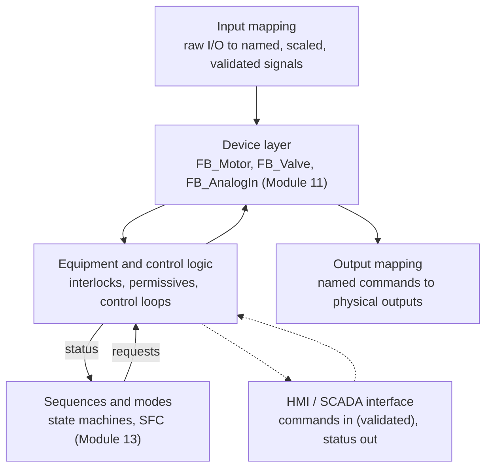
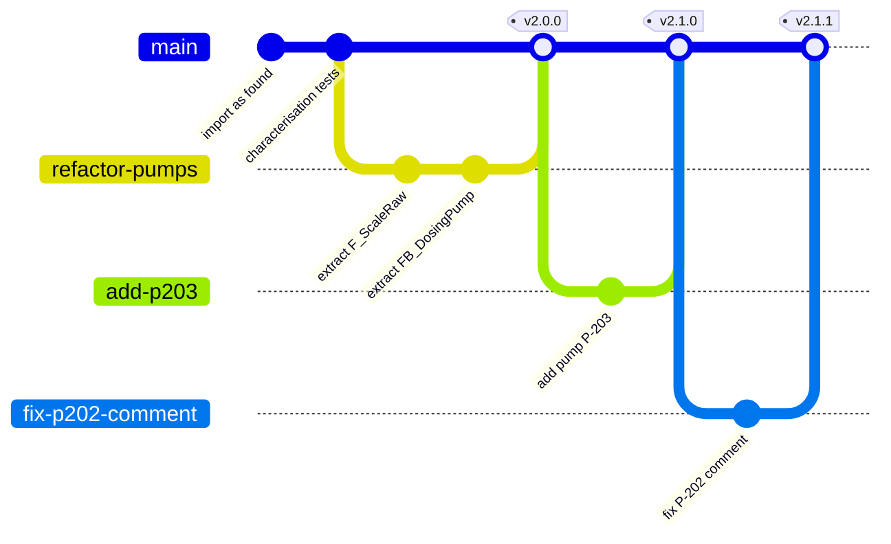
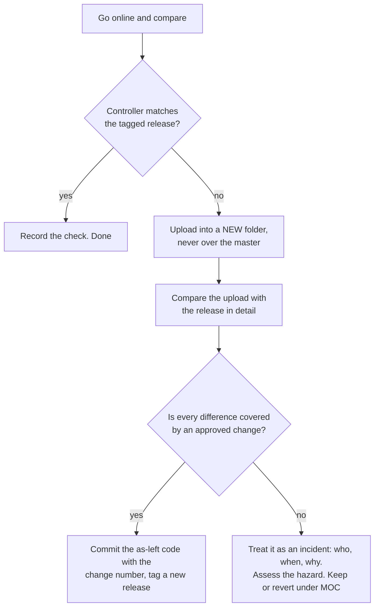
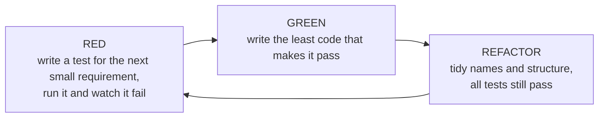
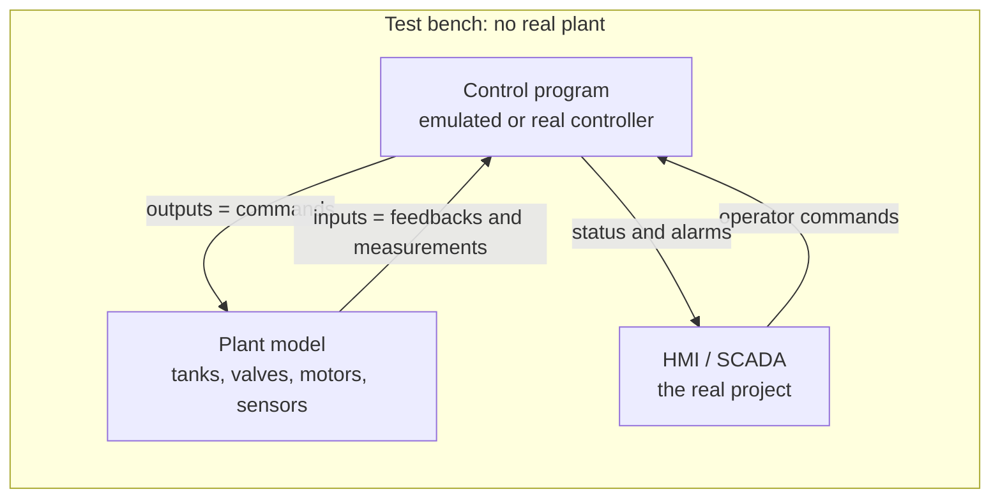
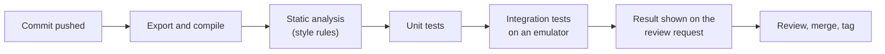
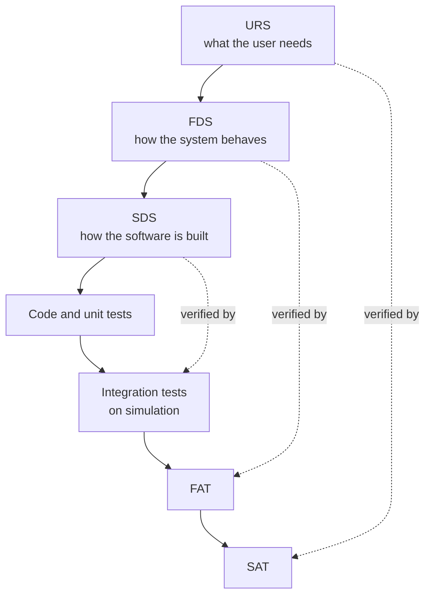
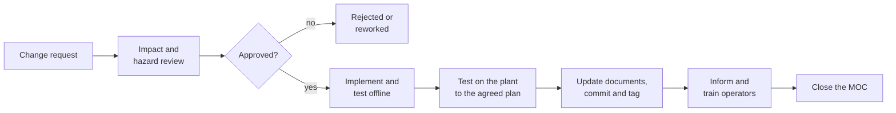
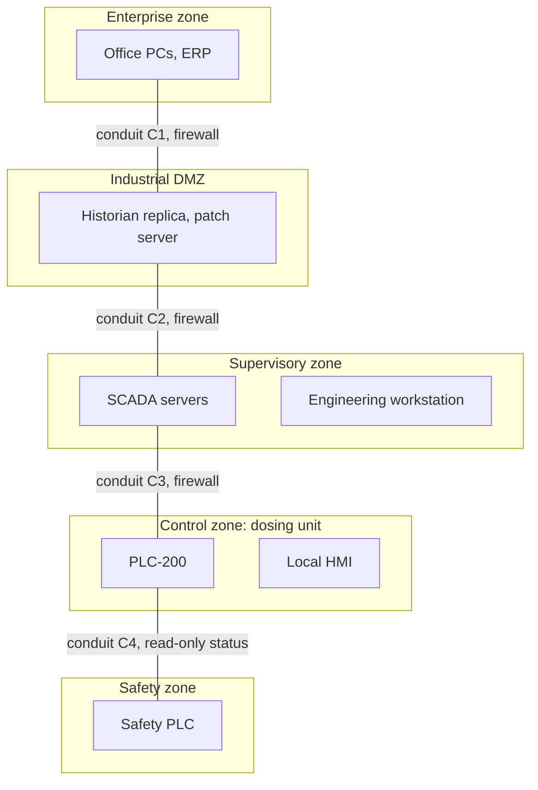

# 22 — Software Engineering for PLCs

> **Level:** 5 — Professional practice · **Time:** ~12 hours · **Prerequisites:** [Module 11](../11-program-organization/), [Module 12](../12-data-structures/), [Module 13](../13-sequential-control/)

A PLC program on a process plant usually outlives the job of the engineer who wrote it. It is
written against a functional specification, changed during the factory acceptance test,
patched during commissioning, edited online in the middle of the night to rescue a batch,
copied to a second line, and then maintained for twenty years by people who never met the
author. Any one of those changes can stop production. A careless one can quietly defeat a
protection that the hazard study relied on. *Software engineering* is the set of habits that
keeps the code understandable, traceable and correct through all of that.

This module adapts mainstream software practice to PLC reality: projects stored in binary
files, code changed while the plant runs, tests that seem to need a plant, and controllers on
networks that attackers know how to reach. It covers coding standards and code review;
version control, backup and release management; unit testing, test-driven development and
mutation testing; the document chain from user requirements to site acceptance, with
management of change; and the security practices now expected of every PLC programmer. In the
two labs you write the tests yourself and prove they are strong by running them against
deliberately broken programs, and you refactor a messy legacy program without changing what
it does.

## Learning objectives

After this module you should be able to:

- **Apply** a coding standard (naming, comments, structure, complexity limits) and **review**
  PLC code against a checklist.
- **Set up** version control for a PLC project: choose text exports, decide what to commit,
  use branches, and tag released versions.
- **Plan** backups, releases and online/offline comparisons so that you always know which
  version is running in the controller.
- **Write** unit tests for function blocks, **use** test-driven development, and **judge** the
  strength of a test suite with coverage thinking and mutation testing.
- **Choose** a suitable level of simulation, from forced I/O to virtual commissioning.
- **Trace** a requirement from URS through FDS, SDS and code to its FAT and SAT tests, and
  **derive** test cases from an I/O list and a cause-and-effect matrix.
- **Follow** a management-of-change process, including the extra risks of online edits.
- **Explain** IEC 62443 zones, conduits and security levels, and **apply** secure PLC coding
  practices such as validating HMI inputs in the PLC.

## Why PLC code needs engineering discipline

Almost everything in this module comes from ordinary software engineering. What makes PLC
work different is the setting:

| PLC reality | What it means for how you work |
|---|---|
| Code runs for 15–30 years and passes through many hands | Readability and documentation matter more than cleverness |
| A bug moves steel, opens valves or heats vessels | Tests must cover abnormal and "must not happen" cases, not only the happy path |
| Projects are stored in binary vendor files | Version control needs text exports or specialised tools |
| Code can be changed while the machine runs | Every change needs control, a record and an agreed test plan |
| Teams mix software engineers, electricians and instrument technicians | A plain, consistent structure beats personal style |
| Some plants are regulated (pharmaceuticals, safety instrumented systems) | Traceability and audit trails are mandatory |

The cost of a defect grows with every stage it survives. A mistake found by a unit test at
your desk costs minutes. At the factory acceptance test it costs a re-test with the client
watching. At site it costs a commissioning crew standing idle. In production it costs lost
product, damaged equipment or an incident investigation. Most of this module is about finding
defects earlier.

## Coding standards

A **coding standard** is a short, agreed set of rules for how code is written in a team or a
company. It does not make code correct by itself. It makes code *predictable*: anyone can open
any program and find things where they expect them, and reviewers can spend their attention
on the logic instead of on layout and naming.

### The PLCopen coding guidelines

PLCopen, the vendor-neutral organisation that promotes IEC 61131-3, published a free
*Coding Guidelines* document in 2016. It holds roughly sixty short rules in groups: naming,
comments, coding practice, use of the languages, and vendor-specific extensions to the
standard. Each rule has a rationale and examples, and the authors drew on established
coding standards from other fields, such as MISRA C. A standard of this kind typically deals
with topics such as:

- choosing, documenting and consistently applying names and prefixes;
- commenting the purpose and interface of every POU, and keeping comments current;
- initialising variables, avoiding physical addresses inside the logic, and avoiding writes
  to the same variable from several places;
- limiting the size and complexity of POUs;
- avoiding risky constructs such as exact equality tests on REAL values;
- how to lay out and use each IEC language.

Treat it as a catalogue to choose from, not as a law. A company standard usually adopts the
rules that matter to it, adds its own (tag naming, alarm handling, library use), and states
which rules a tool checks automatically. Several IDEs and third-party checkers can test code
against rule sets of this kind (static analysis).

### Naming conventions

Names are the cheapest documentation you will ever write. These are the decisions a naming
convention has to make:

| Decision | Options you will meet | Advice |
|---|---|---|
| Letter case | `PumpRunning`, `pumpRunning`, `pump_running`, `PUMP_RUNNING` | One style per kind of thing, for example PascalCase for variables and UPPER_CASE for constants |
| Type prefixes | `bRunning` (BOOL), `iCount` (INT), `rLevel` (REAL), `tDelay` (TIME) | See the debate below |
| Scope prefixes | `in`/`out`/`io` for FB interface variables, `g` for globals, `c` for constants | Useful: they tell you who is allowed to write a variable |
| POU and type prefixes | `FB_`, `F_` or `FC_`, `ST_` or `UDT_`, `E_` | Almost universal, and used throughout this course |
| Plant tags | `P101`, `XV101`, `LT200`, or a hierarchy such as `Area1_Unit2_P101` | Use the P&ID and instrument tags so code, drawings and HMI agree |
| Units | `LevelPct`, `TempDegC`, `Flow_m3h`, `DelayMs` | Every analog value carries its unit in its name or its declaration comment |
| Signal sense | `StopPB_NC`, `OverloadOK`, `ValveClosedLS` | Name the TRUE state: `DoorClosed`, not `DoorSwitch` |

**The prefix debate.** Type prefixes ("Hungarian notation") are common in CODESYS and TwinCAT
code and in many vendor libraries. Their supporters say that a prefix shows the type wherever
the name appears, including in printouts, diffs and HMI tag lists. Their critics point out
that modern editors show the type on hover, that a prefix goes stale when the type changes
(`iCount` quietly becomes a `DINT`), and that prefixes make names harder to read aloud. A
common compromise is: prefixes for POUs and data types (`FB_`, `E_`, `ST_`), scope prefixes
where they prevent mistakes, and no prefixes for elementary types. The decision matters much
less than applying it consistently. Switching conventions halfway through a plant is worse
than either choice.

A before-and-after from the legacy code in Lab 22-2 shows how much names carry:

```iecst
(* before *)
T2(IN := P2_Run AND NOT P2_RunFb, PT := T#5s);  (* 4 sec *)
IF T2.Q THEN
  F2 := TRUE;

(* after *)
Pump2FbTimer(IN := P2_Run AND NOT P2_RunFb, PT := P2_FB_TIMEOUT);
IF Pump2FbTimer.Q THEN
  Pump2Fault := TRUE;
```

### Comments that help

- **Say why, not what.** `Count := Count + 1; (* add one *)` is noise.
  `(* P-202 has a slower contactor, so its timeout is 5 s: see MOC-0142 *)` saves someone a
  day.
- **Give every POU a header**: purpose, a summary of the interface, assumptions (units,
  ranges, which inputs are wired NC) and the design-document section it implements. Don't
  keep a long change history in the header when the code is under version control. A line
  such as `Last change: MOC-0431` is enough, and the history lives in the commit log.
- **Keep comments true.** A wrong comment is worse than none, because readers trust it. The
  legacy program in Lab 22-2 has one.
- **Document units and signal sense at the declaration**, where everyone looks first.
- **Don't leave commented-out code.** Version control remembers old code, so delete it.
- **Mark temporary code** (`TODO`, `SIM ONLY`) with a name and a reason, and search for the
  markers before every release.

A POU header in practice:

```iecst
(* FB_DosingPump - one chemical dosing pump with run-feedback supervision.
   Implements FDS section 4.3. Used by DosingSkid for P-201 and P-202.
   StopOK and RunFb are TRUE in the healthy state (NC stop button, contactor aux).
   Behaviour:
     - seal-in start; stop, a missing permissive or a fault drops the seal-in
     - no run feedback within FbTimeout -> Fault (latched), pump off
     - Fault resets on the rising edge of ResetCmd; reset never restarts the pump
   Last change: MOC-0431 (extracted from legacy code, behaviour unchanged) *)
```

### Structure

The most useful structural rule is to build the program in **layers**, each with one job:



Rules that follow from it:

1. **Touch physical I/O in one place only**, the mapping layers. The rest of the program works
   with named signals. That makes simulation, I/O re-allocation and testing easy (see
   *Simulation and emulation* below).
2. **One writer per variable.** Every output and every state variable is assigned in exactly
   one place. This is the double-coil rule from [Module 04](../04-ladder-logic/) in its
   general form.
3. **Build from reusable, tested function blocks** (device FBs from
   [Module 11](../11-program-organization/), data models from
   [Module 12](../12-data-structures/)).
4. **Sequences request, equipment decides.** A sequence asks for "pump on". The equipment
   logic checks its interlocks and permissives, which always win.
   [Module 21](../21-architecture-and-standards/) formalises this layering with ISA-88.
5. **Limit global variables.** Pass data through FB interfaces. Where globals are needed (I/O
   images, HMI tags), give each one a clear owner.
6. **Call every FB instance, including every timer, exactly once per scan and
   unconditionally.** Worked example 3 shows what goes wrong otherwise.

### Complexity limits

Complexity is where bugs hide. There is no universal number, but teams commonly adopt limits
like these:

| Metric | What it measures | A typical team limit |
|---|---|---|
| POU length | Lines of ST or rungs per POU | One or two screens; split anything longer |
| Nesting depth | `IF` inside `IF` inside `CASE` … | Three levels |
| Cyclomatic complexity | Independent paths through the code: decisions + 1 | About 10 per POU, the limit McCabe originally suggested |
| FB interface size | Number of inputs and outputs | Beyond about 15, group them in a structure or split the FB |
| Rung size (LD) | Branches and contacts per rung | Fits on one screen without scrolling |

**Cyclomatic complexity** counts decisions: each `IF`, `ELSIF`, `CASE` branch and loop adds
one, and some tools also count each `AND`/`OR` in a condition. The legacy pump logic in
Lab 22-2 uses four nested `IF`s to say something that fits in one readable line:

```iecst
Run := (StartPB OR Run) AND StopOK AND Permit AND NOT Fault;
```

A high number does not prove the code is wrong. It tells you where to look first in a review
and where tests are most likely to be missing.

### Consistency across a team

- Write the standard down. Keep it to a few pages with examples, or nobody will read it.
- Provide templates: a project template with the layer structure, and POU templates with the
  header already in place.
- Keep device FBs in one shared, versioned library. Don't let every project fork its own
  `FB_Motor`.
- Automate what can be automated: static analysis in the IDE, style checks in the build.
- Review every change (next section). Reviews spread knowledge as well as catching defects.
- Revisit the standard once a year. Drop rules nobody follows or that a tool now enforces.

### Code review

A code review is a second engineer reading a change before it goes to the plant. For PLC
code it works best like this:

1. The **author** prepares: tests pass, the change is small and focused, and a short
   description says what changed, why, and which change request (MOC or work order) it
   belongs to. Refactoring and behaviour changes go in separate reviews.
2. The **reviewer** reads the diff *and* the code around it, runs the tests, and works
   through the checklist below. Findings are written down, not just spoken.
3. The author fixes or answers every finding. The approval is recorded.

For safety-related code, the functional-safety standards require reviews and verification
by someone independent of the author, at a degree of independence that depends on the
integrity level ([Module 20](../20-functional-safety/)).

**Code review checklist for PLC code**

| Area | Check |
|---|---|
| Scope | The change does what the change request asks, and nothing else |
| Fail-safe | NC inputs are treated as TRUE = healthy; a broken wire leads to the safe state; stop and trip have priority over start |
| Interlocks | Interlocks and permissives act in every mode (auto, manual, maintenance) unless a documented, alarmed bypass exists |
| Restart | Behaviour after power-up, warm restart and CPU stop/run is defined: no equipment restarts on its own, and retentive data is deliberate |
| Timers and edges | Every timer and FB instance is called once per scan, unconditionally; edges are used where "once per event" is meant |
| Maths | Division by zero, integer overflow, REAL equality tests, array bounds, units and scaling |
| Single writer | Each output and state variable is written in exactly one place |
| External data | HMI, SCADA and network values are validated in the PLC; communication loss is handled |
| Alarms | Alarms latch and reset as the alarm philosophy requires ([Module 16](../16-alarms-and-diagnostics/)) |
| Scan time | Loops are bounded; nothing heavy runs every scan without need |
| Readability | Names follow the standard; comments are true; no dead code; no magic numbers |
| Evidence | Tests added or updated and passing; I/O list, FDS and C&E updated |
| Deployment | Online-edit impact considered; version number updated |

## Version control, backup and release management

### Why PLC projects are hard to diff

A **version control system** such as Git stores every version of a set of files and shows
exactly what changed between them (a *diff*), who changed it, when, and why. It was built for
text files, and most PLC projects are not text:

- The main project file is binary: a Studio 5000 `.ACD` file, a TIA Portal project, a CODESYS
  `.project`. Git can store it, but a diff only says "binary files differ".
- Ladder, FBD and SFC are graphical. Even exported as XML, moving one contact can change dozens
  of lines of coordinates and internal IDs, which buries the real change.
- One project mixes several things: code, hardware configuration, network settings, HMI
  screens, drive parameters, sometimes a safety program. Each has its own format.
- The truth is split between the offline project on a laptop and the program running in the
  controller, and online edits let the two drift apart.

Without a readable diff you cannot review a change properly, you cannot see who changed a
timer preset, and you cannot merge work done in parallel. So the first job is to get a
meaningful text form of the code.

### Getting text out of the vendor tools

| Platform | Native storage | Routes to text and version control |
|---|---|---|
| CODESYS | Binary `.project` file | PLCopen XML export and import of POUs and data types; a Git integration add-on that stores the project as text files |
| Beckhoff TwinCAT 3 | A folder of XML files, one per POU, data type or global variable list (`.TcPOU`, `.TcDUT`, `.TcGVL`), inside a Visual Studio solution | Git works directly on the project folder, and diffs of ST code are readable |
| Siemens TIA Portal | Binary project | *TIA Portal Openness* (a .NET programming interface) exports blocks as XML (SimaticML) and SCL/DB sources as text; the *Version Control Interface* links a project to a folder of exported files managed by an external tool; Multiuser Engineering for several engineers on one project |
| Siemens SIMATIC AX | Text files (ST) | A separate, VS Code-based engineering environment built around Git, packages and unit tests, for S7-1500 |
| Rockwell Studio 5000 Logix Designer | Binary `.ACD` file | Whole-project export as `.L5K` (text) or `.L5X` (XML); export of single routines, Add-On Instructions and data types as `.L5X`; the *Logix Designer Compare Tool* |
| OpenPLC and this course | Plain `.st` text | Everything is text, and Git works directly |

Automation-specific change-management products fill the gaps: FactoryTalk AssetCentre for
Rockwell systems, and multi-vendor tools such as octoplant (the successor to versiondog and
AutoSave) and Copia. Typical features are visual diffs of ladder and hardware configuration,
scheduled backups straight from the controllers, and automatic comparison against the master
version. Product names and features change, so check what your site already uses.

The practical rule: commit **both** the native project or archive (so you can restore and open
it) **and** a text export (so you can diff and review it). Automate the export if the tool
allows, for example with a script, because manual exports get forgotten.

### Git basics for PLC work

The handful of Git ideas you need:

| Term | Meaning |
|---|---|
| Repository ("repo") | The project folder plus its complete history |
| Commit | A saved snapshot with author, date and message. One logical change per commit |
| Branch | A parallel line of work. `main` holds what is released or ready to release |
| Merge | Bring the commits of one branch into another, usually after review |
| Tag | A permanent name for one commit, used for releases: `v2.1.0` |
| Remote | The shared copy on a server (a company Git server or a hosted service) |

A typical change looks like this:

```text
$ git clone https://git.example.com/site-a/dosing-skid.git
$ cd dosing-skid
$ git switch -c fix-p202-comment          # a branch for this change
  ... edit, export the code, run the tests ...
$ git diff                                # review your own change first
$ git add src/DosingSkid.st
$ git commit -m "P-202: correct misleading timeout comment (MOC-0452)"
$ git push -u origin fix-p202-comment     # a colleague reviews and merges it
$ git switch main
$ git pull
$ git tag -a v2.1.1 -m "Downloaded to PLC-200 on 2026-03-14"
$ git push origin v2.1.1
```

The diff is where text pays off. Suppose that commit, labelled as a comment fix, contained
this:

```diff
-  T2(IN := P2_Run AND NOT P2_RunFb, PT := T#5s);  (* 4 sec *)
+  T2(IN := P2_Run AND NOT P2_RunFb, PT := T#4s);  (* 4 sec *)
```

The message says "comment", but the code says the protection timeout changed. A reviewer
reading text sees that in seconds. In a binary project nobody would ever notice.

**Branches and tags** for a plant project are best kept simple:



- `main` always matches a released, tested state.
- Each change gets a short-lived branch that is reviewed, tested and merged.
- Every version that is downloaded to a controller gets a tag. The tag is how you answer
  "what exactly is running in PLC-200?" years later.
- An urgent fix to an old release starts from that release's tag, not from whatever happens to
  be on `main`.

**Commit messages** are part of the audit trail. The first line says what changed, in under
about 60 characters, and names the change request. The body, if needed, says why. Refactoring
and behaviour changes go in separate commits so that each can be reviewed and, if necessary,
reverted on its own.

### What belongs in the repository

| Put in the repository | Keep out of it |
|---|---|
| Text exports of all code: ST, L5X, PLCopen XML, SimaticML | Passwords, keys, licence files: use a password vault |
| The native project archive for each release | Personal IDE settings and caches |
| Tests (`.test` files, test FBs) and simulation models | Build output that the tool regenerates |
| HMI and SCADA projects | Very large binaries such as videos (or use Git LFS) |
| Drive parameter files and managed-switch configurations | Anything the site's security policy forbids off site |
| I/O list, FDS, C&E, test records and release notes | |
| Scripts used to export, build and test | |

Most vendors or their user communities publish a recommended `.gitignore` file for their
tool. Start from one of those rather than guessing.

### Backup and restore

Version control holds the *engineered* source. A backup must also capture the *state* of the
running system, which operators and the process change every day.

What to back up:

- the offline project and its archive (the master);
- an upload from each controller, kept separately as evidence for comparison;
- data held in the controller: recipes, setpoints, alarm limits, PID tuning, counters and other
  retentive values, many of which operators change on the HMI;
- HMI and SCADA projects and their runtime databases;
- drive and servo parameters, and managed-switch and firewall configurations;
- safety PLC projects together with their checksums or signatures;
- a record of firmware versions and licences, and the passwords (in a password vault).

On many platforms an upload from the controller does not contain everything that the
offline project holds: comments, symbol names, documentation or HMI links may be missing. So
the offline project is the master and the upload is evidence.

Keep at least three copies on two different kinds of media, with one copy off site, and
preferably one offline where ransomware cannot reach it (the "3-2-1" rule). Most important
of all, **test the restore**. A backup that has never been restored is only a hope. Once a
year, restore a controller's backup onto a spare CPU or an emulator and compare it with the
running system.

### Release management

A **release** is a version that is allowed to go into a controller. Version numbers in the
common MAJOR.MINOR.PATCH form work well for PLC code if the team agrees what each part means,
for example:

| Part | Increase it when… | Example |
|---|---|---|
| PATCH | A fix that does not change documented behaviour or interfaces | Corrected alarm text, fixed comment |
| MINOR | Behaviour is added or changed, and interfaces to other systems still fit | New alarm, changed interlock, extra pump |
| MAJOR | Interfaces change (HMI tag list, communication map) or the structure changes, so connected systems must be re-tested | Restructured program, new SCADA mapping |

Make the controller report its own version so that nobody has to guess:

```iecst
PROGRAM Main
  VAR CONSTANT
    SW_VERSION : STRING := '2.1.1';     (* must match the Git tag v2.1.1 *)
    SW_CHANGE  : STRING := 'MOC-0452';  (* change record behind this release *)
  END_VAR
  VAR
    HmiVersion : STRING;                (* shown on the HMI "About" screen *)
  END_VAR
  HmiVersion := CONCAT(SW_VERSION, CONCAT(' / ', SW_CHANGE));
END_PROGRAM
```

A release checklist:

1. Change request approved; code reviewed; all tests pass.
2. Version constant updated, and visible on the HMI.
3. Release notes written: what changed, why, change-request numbers, test evidence, known
   issues.
4. Git tag created; the native archive stored with the release.
5. Download carried out under the agreed test plan; who, when and which controller recorded.
6. Online/offline comparison after the download shows that the controller matches the release.
7. Any changes made on site during commissioning are committed as the "as-left" version and
   tagged before the team leaves site.

### Online versus offline: which version is running?

Every major IDE can compare the offline project with the controller. TIA Portal marks each
block in the project tree with a comparison status when you are online and has a detailed
compare editor. Studio 5000 notices a mismatch when you go online and offers to upload or
download, and the Compare Tool shows the differences. CODESYS reports at login that the
application has changed and offers an online change, a full download, or login without
change. Many controllers also compute a checksum or signature of their program. Record it at
each release so you can check it quickly later.

When the controller and the release differ, don't simply pick one. Blindly uploading over the
master can wipe out a needed change that exists only in the project; blindly downloading can
throw away a fix someone made online, or bring back an old bug. Work it through:



## Testing PLC software

### Levels of testing

Testing happens at several levels, each checking a different document:

| Level | What is tested | Where | Typical tools |
|---|---|---|---|
| Unit | One function or function block in isolation | At your desk | `plctest`, TcUnit, CfUnit, SIMATIC AX unit tests |
| Integration | FBs working together: an equipment module or a whole program, against simulated I/O | Desk or office test bench | Emulators, simulation logic, plant models |
| System / FAT | The complete system including HMI, against the FDS | Supplier's workshop, client witnessing | Test specification, I/O simulators, plant models |
| SAT and commissioning | The installed system on the real plant, against the URS | Site | Test specification, I/O checkout, loop checks ([Module 23](../23-commissioning-and-troubleshooting/)) |

The lower levels are cheap and fast, so they should catch most defects. The higher levels
catch what only the real system can reveal: wiring, instruments, timing and people.

### Unit testing a function block

A **unit test** checks the smallest testable piece of code on its own. In PLC code that is a
function or a function block, and the FB is ideal for it: its inputs and outputs define
exactly what to drive and what to observe.

A **test harness** is a small program that owns an instance of the FB under test and calls it
every scan. The test drives the harness's inputs and checks outputs as PLC time passes. In
Lab 22-1, for example, the program `DryRunTrip` is only a thin harness around
`FB_DryRunTrip`. (With `plctest` you can also drive an instance's inputs directly, such as
`set Guard.Request 55.0`, if the harness calls the instance without passing that input. An FB
input that is not assigned in a call keeps its previous value.)

Good tests follow the **arrange, act, assert** pattern:

```text
scenario R6 reset clears the alarm but does not restart the pump
# arrange: a healthy pump that has tripped
set StopPB_NC TRUE
set FlowSw FALSE
set StartPB TRUE
scan
set StartPB FALSE
until DryRunAlarm = TRUE within 16s
wait 1s
# act: the operator presses Reset
set ResetPB TRUE
wait 200ms
set ResetPB FALSE
# assert: alarm gone, pump still off
wait 100ms
expect DryRunAlarm FALSE
expect PumpRun FALSE
```

Rules for good PLC unit tests:

1. **Test behaviour through the interface**, never internal variables. Then the implementation
   can be restructured without rewriting the tests (Lab 22-2 depends on this).
2. **One behaviour per scenario**, with a name that states the requirement as a sentence.
3. **Start from a known state.** Set healthy inputs first: NC inputs TRUE, permissives OK.
4. **Use time, not scan counts**, and check just before and just after each time limit.
5. **Test the negatives**: what must *not* happen, such as a restart after a reset or a trip
   during a normal stop.
6. **Test boundaries**: exactly on a limit, just below and just above.
7. **Test history**: the second cycle, the restart after a reset, the start after a stop.
8. **Test competing inputs**: start with stop pressed, reset while the fault is still present.
9. **Keep tests fast and deterministic.** A test that sometimes fails is soon ignored.
10. **When a bug is found, first write a test that reproduces it**, watch it fail, then fix
    the code. The bug can never come back unnoticed.

### Test-driven development

**Test-driven development** (TDD) turns the order round: you write the test for the next small
piece of behaviour *before* the code. The cycle is short, often a few minutes:



Why it suits PLC work:

- It forces you to decide the behaviour, including the abnormal cases, before you are deep in
  code. Those are exactly the questions the FDS should answer, and TDD often exposes gaps in
  the FDS early.
- Watching each new test fail proves that the test can fail. A test that has never failed
  may be checking nothing.
- The finished FB arrives with its tests, so the next person can change it safely.

Don't be dogmatic about it: exploratory work and HMI layouts don't need it. For device FBs,
interlocks, trips and sequences it pays for itself. Worked example 1 below goes through a
complete TDD session with `plctest`.

### Test frameworks in the vendor world

`plctest` is this course's tool. In industry you will meet these:

- **TcUnit**, an open-source unit-testing framework for Beckhoff TwinCAT 3 in the xUnit style.
  Tests are written in ST: a test suite is a function block that extends
  `TcUnit.FB_TestSuite`; each test calls `TEST('name')`, drives the unit under test, checks
  results with assertion methods of the `AssertEquals` family and ends with `TEST_FINISHED()`,
  so a test can run over several PLC cycles. The main program calls `TcUnit.RUN()`. Results
  appear in the TwinCAT error list and can be written as xUnit XML files for build servers.
- **CfUnit**, a community port of TcUnit to CODESYS, published on the CODESYS Forge.
- **SIMATIC AX** includes a unit-testing framework that runs tests on the PC as part of its
  text-based, Git-centred workflow.
- **TIA Portal Test Suite**, a Siemens add-on for TIA Portal with a style-guide checker and
  automated application tests that run against S7-PLCSIM Advanced.
- **CODESYS** offers add-ons for static analysis and for managing and automating tests.

Licensing and features of the commercial add-ons change, so check the vendor's current
offer. A TcUnit test looks roughly like this:

```iecst
(* TwinCAT 3 + TcUnit syntax: a sketch, not testable here.
   See the TcUnit documentation for the exact assertion names. *)
FUNCTION_BLOCK FB_SetpointGuard_Test EXTENDS TcUnit.FB_TestSuite
VAR
  Guard : FB_SetpointGuard;          (* the unit under test *)
END_VAR
AcceptsValueInsideLimits();          (* the suite's body calls each test method *)

METHOD PRIVATE AcceptsValueInsideLimits
TEST('AcceptsValueInsideLimits');
Guard(Request := 55.0, Write := TRUE, MinValue := 20.0, MaxValue := 80.0, SafeDefault := 40.0);
AssertEquals_REAL(Expected := 55.0, Actual := Guard.Value, Delta := 0.001,
                  Message := 'value inside the limits was not accepted');
TEST_FINISHED();
```

The idea is the same as a `plctest` scenario: arrange, act, assert, one behaviour per test.

### Simulation and emulation

You rarely have a plant to test against, so you simulate one. There are several levels, and
each suits different jobs:

| Level | What it is | Examples | Good for |
|---|---|---|---|
| Forcing and watch tables | Setting inputs by hand in the online PLC | Every IDE | Quick checks. Dangerous on a live plant ([Module 23](../23-commissioning-and-troubleshooting/)) |
| Simulation logic in the PLC | Small models in the program: a valve's limit switches follow its command after a delay | `FB_SimValve` below | FAT without a plant, operator training |
| Emulated controller | The control program runs on a PC in a process that behaves like the CPU | S7-PLCSIM and PLCSIM Advanced, FactoryTalk Logix Echo, CODESYS simulation mode and CODESYS Control Win, TwinCAT on a PC, the OpenPLC runtime, `plctest` | Unit and integration tests, HMI development |
| Plant simulation | A separate model of the process or machine, connected to the (emulated) controller | Factory I/O 3D scenes, Siemens SIMIT, Emulate3D, process simulators, a Python or MATLAB model | Virtual commissioning, sequence and control-loop tests |
| Hardware in the loop | The real controller wired or networked to a real-time plant model | I/O simulators, HIL rigs | Final FAT, timing-critical tests |

**Simulation logic in the PLC** is easy to add if you followed the layering rule and touch
physical I/O only in the mapping sections. Here a crude valve model stands in for the field
when `SimMode` is on:

```iecst
FUNCTION_BLOCK FB_SimValve
  VAR_INPUT
    OpenCmd    : BOOL;           (* the real output command *)
    TravelTime : TIME := T#4s;   (* stroke time from the valve datasheet *)
  END_VAR
  VAR_OUTPUT
    OpenLS   : BOOL;             (* simulated open limit switch *)
    ClosedLS : BOOL;             (* simulated closed limit switch *)
  END_VAR
  VAR
    Opening : TON;
    Closing : TON;
  END_VAR
  (* Crude model: the valve leaves one end at once and reaches the other
     after TravelTime. A reversal mid-stroke takes a full stroke here, which
     is pessimistic but good enough to exercise the control logic. *)
  Opening(IN := OpenCmd, PT := TravelTime);
  Closing(IN := NOT OpenCmd, PT := TravelTime);
  OpenLS := Opening.Q;
  ClosedLS := Closing.Q;
END_FUNCTION_BLOCK

PROGRAM Plant
  VAR (* physical I/O: touched ONLY in the mapping sections below *)
    XV101_OpenLS_In   AT %IX0.4 : BOOL;
    XV101_ClosedLS_In AT %IX0.5 : BOOL;
    XV101_Sol_Out     AT %QX0.0 : BOOL;
    SimActiveLamp     AT %QX0.7 : BOOL;
  END_VAR
  VAR
    SimMode        : BOOL := FALSE;  (* TRUE only on the test bench *)
    XV101_OpenLS   : BOOL;           (* mapped signals: the logic uses these *)
    XV101_ClosedLS : BOOL;
    XV101_OpenCmd  : BOOL;
    SimXV101       : FB_SimValve;
  END_VAR

  (* ---- input mapping: real field signals or the simulation model ---- *)
  SimXV101(OpenCmd := XV101_OpenCmd);
  IF SimMode THEN
    XV101_OpenLS := SimXV101.OpenLS;
    XV101_ClosedLS := SimXV101.ClosedLS;
  ELSE
    XV101_OpenLS := XV101_OpenLS_In;
    XV101_ClosedLS := XV101_ClosedLS_In;
  END_IF;

  (* ---- control logic: reads and writes mapped signals only ---- *)
  XV101_OpenCmd := TRUE;             (* stands in for the real valve logic *)

  (* ---- output mapping: while simulating, real outputs stay OFF ---- *)
  XV101_Sol_Out := XV101_OpenCmd AND NOT SimMode;
  SimActiveLamp := SimMode;
END_PROGRAM
```

Simulation code in a production program needs guard rails. The real outputs must stay off
while simulating; a lamp and an HMI banner must show that simulation is active; and simulation
must be impossible to switch on by accident on the running plant, for example by making it a
constant that is only TRUE in test builds, or by removing it before the SAT under the release
checklist. Many teams prefer to keep simulation models entirely outside the controller, in an
emulator or plant model, for exactly this reason.

### Virtual commissioning and digital twins

**Virtual commissioning** means running the real control software, on an emulated or a real
controller, against a simulated plant, so that sequences, interlocks, HMI screens and alarms
are tested before the equipment exists or before anyone travels to site. The model supplies
feedbacks and measurements; the control program supplies commands.



When the control program runs in an emulator this is often called *software in the loop*
(SiL); with the real controller and real or fieldbus I/O it is *hardware in the loop* (HiL).
The benefits are large: sequence errors, missing interlocks and wrong HMI links are found
weeks earlier and far more cheaply; operators can train before start-up; and site
commissioning gets shorter. The limits are just as real: the model is only as good as its
assumptions, and it has no wrong wiring, noisy instruments, sticking valves or mis-set
transmitters. Virtual commissioning never replaces I/O checkout and loop checks.

A **digital twin** is a model of the plant that is kept in step with the real plant over its
life, updated with every modification and often fed with live data, and used to test changes,
train staff and optimise the process. The term is used loosely in marketing. When someone
offers one, ask what the model contains and how it is kept up to date.

### How much testing is enough? Coverage thinking

In mainstream software, tools measure *code coverage*: which lines and branches the tests
executed. A few PLC tools can do this, but most cannot, and full code coverage does not prove
the tests check the right things anyway. Think instead about what your tests cover:

| Coverage of… | Question to ask | Example from this module |
|---|---|---|
| Requirements | Does every requirement have at least one test? | Lab 22-1: scenario names start with R1…R7 |
| States and transitions | Is every state entered and every transition taken, including abnormal ones? | Tripped → Stopped only through a reset |
| Boundaries | Just below, on, and just above every limit and time? | 14.7 s: still running; 15 s: tripped |
| Negatives | Is every "must not" tested? | No restart after reset; no trip on a normal stop |
| History | Does the second cycle behave like the first? | A restart gets the full priming time again |
| Competing inputs | Are priorities tested? | Start and stop pressed together |
| C&E cells | Every X *and* every blank? | Worked example 2 |

A simple **traceability matrix**, one row per requirement with the tests that cover it,
shows the gaps at a glance and is expected evidence in regulated projects.

### Regression tests and continuous integration

A **regression** is a working feature that breaks because of a change somewhere else, or an
old bug that comes back. The defence is a suite of automated tests that is kept for ever and
run in full on every change. Tests written for bugs found in the field are especially
valuable, because they record lessons the plant paid for.

**Continuous integration** (CI) automates this: on every commit, a build server exports and
compiles the project, runs static analysis and the test suite, and reports the result on the
change before anyone merges it.



With text-based tools (TwinCAT with TcUnit and its command-line runner, SIMATIC AX, `plctest`)
CI is straightforward. With binary projects it needs vendor scripting interfaces or add-ons.
This course has a small CI suite of its own: `python3 tools/plctest.py --all .` checks every
solution, starter and mutant in every module.

### Mutation testing: testing the tests

Passing tests prove little if they would also pass on wrong code. **Mutation testing** measures
how strong a test suite is:

1. Make many slightly wrong copies of the program, called **mutants**, each with one small
   change of the kind programmers really make: `>=` becomes `>`, `AND` becomes `OR`, a `NOT`
   disappears, a preset changes, an edge becomes a level.
2. Run the whole test suite against each mutant.
3. If at least one check fails, the mutant is **killed**: your tests can see that kind of
   fault. If every check passes, the mutant **survives**: there is behaviour your tests do not
   pin down.

The **mutation score** is killed ÷ (total − equivalent). The method rests on two observations:
programmers mostly make small mistakes, and tests that catch small mistakes tend to catch
larger ones too.

Typical mutations of PLC code, and the kind of test that kills each:

| Mutation | Example | Test that kills it |
|---|---|---|
| Relational operator | `Level >= Limit` → `Level > Limit` | A value exactly on the limit |
| Logical operator | `A AND B` → `A OR B`; a `NOT` removed | Each input on its own, and combinations |
| Constant | `T#5s` → `T#4s`; `10.0` → `12.0` | Checks just before and just after the limit |
| Edge → level | `ResetEdge.Q` → `ResetCmd` | Hold the input TRUE for a long time |
| Latch removed | `IF Trip THEN Alarm := TRUE` → `Alarm := Trip` | Check again after the cause has cleared |
| Reset of state removed | a flag is never cleared on stop | Run a second cycle |
| Contact inverted (LD) | NO ↔ NC | Healthy and faulted state of that input |

**Equivalent mutants** change the code but not its behaviour, so no test can kill them. In
Lab 22-1, changing `LossTimer(IN := PrimeTimer.Q AND NOT FlowOK, …)` to
`LossTimer(IN := Run AND PrimeTimer.Q AND NOT FlowOK, …)` is equivalent: the prime timer's
output can only be TRUE while its input `Run` is TRUE, so the extra `Run AND` changes nothing.
Recognise such mutants and leave them out of the score.

Mutation testing is well established in mainstream software, with tools for many languages,
but it is still rare in PLC practice. You can do it by hand: copy an FB, make five or ten
mutants, and run your tests against them. It is also an excellent way to review someone
else's tests. Lab 22-1 is built entirely around this idea.

## Documentation and the project lifecycle

### The document chain: URS, FDS, SDS

Documents are how a project agrees what the software must do before anyone argues about
whether it does it. On most industrial projects the chain looks like this:

| Document | Usually written by | Answers | Verified by |
|---|---|---|---|
| **URS**: User Requirements Specification | The plant owner (the "user") | *What* must the system do? Process duties, capacities, modes, standards, constraints | SAT and performance tests |
| **FDS**: Functional Design Specification (or FS) | The supplier or integrator | *How will it behave* to meet the URS? Sequences, modes, interlocks, alarms, HMI, behaviour on failures | FAT |
| **SDS**: Software Design Specification | The software team | *How is the software built*? Structure, POUs and interfaces, data, naming, tasks | Code review, unit and integration tests |
| Hardware design documents | Electrical and instrument engineers | Panels, I/O cards, networks, power, loop drawings | Inspection, I/O checkout, loop checks |

Laid out as the classic "V", each document on the left is checked by a test phase on the
right:



In pharmaceutical projects that follow ISPE's GAMP 5 guidance, the same V appears with
installation, operational and performance qualification (IQ, OQ, PQ) on the right-hand side.

**Traceability** ties the chain together: every URS requirement maps to FDS clauses, every
FDS clause to code and to at least one test. Referencing requirement or clause numbers in
test names, POU headers and commit messages makes the matrix much easier to maintain.

For the programmer, the FDS is the most important document. If it doesn't say what happens
after a power dip, whether a pump restarts on its own, or which alarm resets which trip, the
FDS is incomplete. Ask, and get the answer written into the FDS, rather than inventing the
behaviour in code.

### The I/O list

The **I/O list** is the table of every signal between the PLC and the field. For the
programmer it is the source of the input and output mapping, the tag database and much of the
testing. A few rows from the dosing skid in Lab 22-2:

| Tag | Description | Signal | Range / sense | Address | Notes |
|---|---|---|---|---|---|
| LT-200 | Day tank T-200 level | AI 4–20 mA, loop-powered | 0–100 % | `%IW0` | Low alarm below 10 %, clears above 15 % |
| P-201 STOP | Local stop, pump P-201 | DI 24 V DC, NC contact | TRUE = not pressed | `%IX0.1` | Wire break = stop |
| P-201 RUN FB | Contactor auxiliary, P-201 | DI 24 V DC | TRUE = running | `%IX0.4` | Fault if missing 3 s after start |
| P-201 RUN | Contactor coil, P-201 | DO 24 V DC | TRUE = run | `%QX0.0` | De-energise to stop |
| P-201 FLT | Fault lamp, P-201 | DO 24 V DC | TRUE = lamp on | `%QX0.2` | |

Every row gives you at least two test cases (the healthy state and the faulted or wire-break
state) and one I/O checkout step at site. Because the I/O list is a structured table, many
teams generate the I/O mapping code and the HMI tags from it with a script, which removes
a whole class of typing errors.

### Cause-and-effect matrices

A **cause-and-effect matrix** (C&E) lists initiating events as rows (causes) and actions as
columns (effects). An X in a cell means "this cause triggers this effect". You will know C&Es
from safety instrumented systems, where the C&E is part of the safety requirements
([Module 20](../20-functional-safety/)). For basic process control interlocks they are just as
useful. For the programmer, a C&E maps directly to code and tests:

- each **column** becomes one permissive or trip expression;
- each **row** becomes one test scenario;
- each **cell** becomes one check, and the blanks matter as much as the Xs: a cause that
  trips an effect it shouldn't is also a bug, and spurious trips cost production and teach
  operators to bypass protections.

Worked example 2 takes a small C&E all the way to code and tests.

### Test specifications, FAT and SAT

A **test specification** turns the FDS into steps that someone can execute and sign. Each test
case has an ID, the requirement or FDS clause it proves, preconditions, numbered steps with
expected results, and space for the actual result, pass or fail, signature and date. A
deviation becomes an entry on the **punch list**, which is tracked until it is fixed and
retested.

| Step | Action | Expected result | Result |
|---|---|---|---|
| 1 | Level at 50 %. Start P-201 with its run feedback held off | P-201 runs, no fault | |
| 2 | Wait 2.7 s | P-201 still running, fault lamp off | |
| 3 | Wait until 3.3 s | P-201 stopped, fault lamp on, alarm on the HMI | |
| 4 | Press reset | Fault lamp off, P-201 stays stopped | |

That is the same structure as a `plctest` scenario, which is no accident: an automated test is
an executable test specification.

- The **FAT** (factory acceptance test) takes place at the supplier's premises, usually with
  simulated I/O or I/O simulators and with the client witnessing. It proves the system
  against the FDS before shipping. A passed FAT is often a contractual milestone.
- The **SAT** (site acceptance test) takes place after installation, I/O checkout and loop
  checks, with the real plant. It proves the system against the URS.

Automated tests do not replace witnessed tests, but they strengthen them: running the whole
automated suite in front of the client at the FAT is convincing evidence, and it can be
repeated after every change made during commissioning. [Module 23](../23-commissioning-and-troubleshooting/)
covers the site side.

### Management of change (MOC)

**Management of change** is the formal process that every change to plant, process,
procedures or control software must pass through. Process-safety regulations require it in
many countries (in the USA, OSHA's Process Safety Management standard, 29 CFR 1910.119,
includes management-of-change requirements), and IEC 61511 requires modifications to a
safety instrumented system to be planned, reviewed for their safety impact and approved before
they are carried out.



For a PLC programmer, a change includes much more than logic: setpoints and alarm limits,
timer presets, interlock bypasses, firmware updates, network changes and HMI changes that
affect operation. Sites differ in what they treat as a "like-for-like" replacement that needs
no MOC, so learn your site's rules. Many sites allow an emergency MOC with paperwork completed
shortly afterwards, but the change is still reviewed, tested and recorded.

A refactor that "changes nothing" is still a change. It needs review and evidence that the
behaviour is unchanged, which is exactly what the characterisation test in Lab 22-2 provides.

### Online edits

An **online edit** (online change, download without stop) modifies the program while the
controller keeps running. Rockwell Logix controllers handle online edits in stages that let
you test an edit and still back it out before it is made permanent; S7-1500 CPUs can download
many changes without stopping and, within limits, without reinitialising data; CODESYS and
TwinCAT support online change. On a continuous process, where a stop costs hours of
production, this is extremely valuable. It is also one of the riskiest things a PLC programmer
does, because the running plant becomes the test bench.

Risks to think through before every online edit:

1. **Initial values.** New variables start at their initial values. A new permissive that
   starts FALSE can stop running equipment; a new state variable can start a sequence in the
   wrong step.
2. **Instance data.** Changing an FB's variables can force the tool to move or reinitialise
   instance data: timers restart, counters reset, and references or pointers to moved data may
   become invalid. Read the tool's warnings before accepting.
3. **Partial changes.** An edit spread over several POUs may not take effect in the same scan
   unless the tool applies it as one step.
4. **Immediate consequences.** A mistake acts on real equipment at once.
5. **Drift.** If the edited project isn't saved, committed and released, the offline master
   is now wrong.
6. **Scan time.** A heavier program can stretch the scan and upset time-critical logic.

Safeguards: an approved MOC and a written plan (what changes, expected effect, how to verify,
how to back out); the edit tested offline first, ideally on an emulator; equipment in a safe
state and the operators informed; one small change at a time, verified before the next; and
afterwards save, compare online and offline, commit, update the documents and close the MOC.
Safety-related logic follows the rules of the safety system, which often forbid online edits
altogether ([Module 20](../20-functional-safety/)).

### Audit trails

An **audit trail** answers four questions about every change: who, what, when and why, plus
who approved it. It is built from several sources: the Git history, the MOC records,
download logs, the change logs that some controllers and asset-management tools keep, and
individual user accounts. A shared "engineer" login destroys the audit trail, because nobody
can tell who made a change.

Regulated industries make this mandatory: pharmaceutical manufacturers in the USA must meet
FDA 21 CFR Part 11 for electronic records and signatures, which includes audit trails, and EU
GMP Annex 11 covers computerised systems in Europe. Audit trails also matter for security:
an unexplained change to a controller is exactly what the next section is about.

## Security for PLC programmers

### Why it is your problem

For a long time control systems were assumed to be safe because they were isolated. That
assumption is gone:

- **Stuxnet**, discovered in 2010, reached Siemens S7-300 controllers that ran the frequency
  converters driving centrifuges at an Iranian uranium-enrichment plant. It changed their
  programs to damage the machines, and hid the modified code from the engineering software
  while operators saw normal values.
- **TRITON** (also called TRISIS), found in 2017 at a petrochemical plant, targeted Triconex
  safety instrumented system controllers and tried to change their programs. It was
  discovered because the safety system tripped the plant.

Both attacks worked by changing controller logic, the thing PLC programmers own. Most real
incidents are less dramatic: ransomware on an engineering workstation, an unmanaged remote
access route, an infected USB stick, a default password. The practices in this section make
such events less likely and easier to detect.

### IEC 62443 in one page

The **IEC 62443** series (developed with ISA and often written ISA/IEC 62443) is the main
international family of standards for the security of industrial automation and control
systems (IACS). It is organised in four groups:

| Group | Covers | Examples | Main audience |
|---|---|---|---|
| 1 General | Concepts, terms and models | | Everyone |
| 2 Policies and procedures | The asset owner's security programme, requirements for service providers, patch management | 62443-2-1, 62443-2-4 | Asset owners, service providers |
| 3 System | Security risk assessment, zones and conduits, system security requirements and security levels | 62443-3-2, 62443-3-3 | System integrators, asset owners |
| 4 Component | Secure product development lifecycle; technical requirements for components such as PLCs, HMIs and switches | 62443-4-1, 62443-4-2 | Product suppliers |

It assigns responsibilities to **roles**: the **asset owner**, who operates the plant and owns
the risk; **service providers**, such as the system integrator who designs and builds the
automation system and the maintenance provider who supports it; and **product suppliers**, who
make the controllers, HMIs and network devices. As a PLC programmer you usually work for the
integrator or the asset owner.

**Zones and conduits.** A **zone** groups assets that share the same security requirements:
the control network of one process unit, the safety system, the DMZ. A **conduit** is the
controlled communication path between zones, such as a firewall with rules that allow only
the traffic that is needed.



There is no direct path from the office to the PLCs, and the safety system sits in its own
zone with the most restricted conduit.

**Security levels.** Each zone gets a target **security level** (SL) from the risk assessment,
defined by the kind of attacker it must resist:

| SL | Protection against |
|---|---|
| 0 | No specific requirement |
| 1 | Casual or coincidental violation, such as a mistake or an accidental infection |
| 2 | Intentional violation using simple means, with low resources, generic skills and low motivation |
| 3 | Intentional violation using sophisticated means, with moderate resources, IACS-specific skills and moderate motivation |
| 4 | Intentional violation using sophisticated means, with extended resources, IACS-specific skills and high motivation |

The standard distinguishes the *target* level a zone needs, the *capability* level its
components can reach, and the level the finished system actually *achieves*. The requirements
are grouped under seven **foundational requirements**: identification and authentication
control, use control, system integrity, data confidentiality, restricted data flow, timely
response to events, and resource availability.

What this means day to day: use your own account; keep the engineering workstation in its
proper zone; never bridge networks with a laptop or a mobile-data router "just for a
minute"; and write code that behaves well when someone sends it bad data.

### The Top 20 Secure PLC Coding Practices

Many security measures live outside the PLC: firewalls, accounts, patching. The **Top 20
Secure PLC Coding Practices**, a community project first published in 2021 (plc-security.com),
collects things the PLC program itself can do to be harder to misuse and quicker to reveal
an attack. Most of them also make the plant more reliable and easier to diagnose, which is
why they are worth doing even where nobody talks about security. In brief:

| # | Practice | In your code |
|---|---|---|
| 1 | Modularise PLC code | Separate, tested FBs make unexpected changes easier to spot |
| 2 | Track operating modes | Alarm when the CPU leaves RUN or its mode switch is moved |
| 3 | Leave operational logic in the PLC wherever feasible | Interlocks live in the PLC, not in HMI or SCADA scripts |
| 4 | Use PLC flags as integrity checks | Count the controller's error flags (division by zero, overflow) and investigate unexpected ones |
| 5 | Use cryptographic and/or checksum integrity checks for PLC code | Compare the program checksum or signature with the released one |
| 6 | Validate timers and counters | Presets written from outside are range-checked; counters are checked for impossible values |
| 7 | Validate and alert for paired inputs/outputs | Open and closed limit switches both TRUE, or forward and reverse both on, raise an alarm |
| 8 | Validate HMI input variables at the PLC level, not only at the HMI | See the next section |
| 9 | Validate indirections | Check an array index from outside before using it |
| 10 | Assign designated register blocks by function (read/write/validate) | Separate the data outside systems may write from the data they may only read |
| 11 | Instrument for plausibility checks | Cross-check measurements, such as flow without a running pump |
| 12 | Validate inputs based on physical plausibility | A tank cannot fill faster than its pumps can deliver |
| 13 | Disable unneeded or unused communication ports and protocols | See *Harden the controller* |
| 14 | Restrict third-party data interfaces | Only the connections needed, read-only where possible |
| 15 | Define a safe process state in case of a PLC restart | No automatic restarts; safe default setpoints |
| 16 | Summarise PLC cycle times and trend them on the HMI | A changed scan time can reveal changed code |
| 17 | Log PLC uptime and trend it on the HMI | Unexpected restarts become visible |
| 18 | Log PLC hard stops and trend them on the HMI | |
| 19 | Monitor PLC memory usage and trend it on the HMI | |
| 20 | Trap false negatives and false positives for critical alerts | Make sure critical alarms can be trusted: neither missed nor false |

Practice 7 costs one line and catches failed limit switches as well as manipulated inputs:

```iecst
XV101_LSDiscrepancy := XV101_OpenLS AND XV101_ClosedLS;   (* both ends at once: impossible *)
```

### Validate every value that comes from outside the PLC

The HMI can restrict what an operator types, but the PLC cannot tell whether a value came
from that HMI, from a faulty SCADA script, from a comms error, or from someone with a
Modbus tool on the network. So **the PLC validates every value it receives**:

- **Range**: only accept values proven to be inside the limits, otherwise keep the last good
  value (or use a safe default) and raise an event.
- **NaN**: a REAL can hold "not a number". Every comparison with NaN is FALSE, so the check
  `IF (V >= Min) AND (V <= Max) THEN accept` rejects NaN, while the tempting
  `IF (V < Min) OR (V > Max) THEN reject` lets it through. Always write range checks in the
  "accept only if inside" form.
- **Rate**: some values must not jump. Limit the change per write or the rate of change.
- **Mode and authority**: accept a command only in the mode where it makes sense, for example
  a manual valve command only in manual mode, and only from the control location that
  currently has authority ([Module 18](../18-hmi-and-scada/)).
- **Indices**: check array indices and recipe numbers before use.
- **One request, one action**: act on the edge of a write command, so that a stuck bit cannot
  keep pushing values through.
- **Record rejections**: count or log refused writes; a burst of them is worth investigating.

Worked example 1 develops `FB_SetpointGuard`, which does the first, second, sixth and seventh
of these, test-first.

### Passwords, access levels and know-how protection

- **Controller access levels.** Most modern controllers can require a password for writing
  or for reading the program: S7-1200/1500 CPUs have graded access levels (from full access
  down to no access), and Rockwell Logix controllers add a physical mode switch that can hold
  the CPU in RUN so that no program changes are possible. Use them.
- **Know-how and source protection** hides or locks the code of selected blocks (Siemens
  know-how protection, Rockwell source protection, and similar features in CODESYS-based
  tools). It protects intellectual property; it is not a strong security barrier. The risks
  are practical: if the password or key is lost, nobody can maintain the code, and a
  protected block is hard to review or troubleshoot at 3 a.m. Keep the unprotected source
  and the passwords under the asset owner's control, and agree in the contract who holds them.
- **Accounts.** Individual accounts, not shared ones; remove leavers; least privilege
  (operators can't download programs).
- **Passwords belong in a password vault**, never in the repository, the project comments
  or a sticker on the panel door.

### Harden the controller

Every service a controller offers is a door. Close the ones you don't use:

- web server, FTP, Telnet, SNMP (or use a secure version), unused protocol servers such as a
  Modbus TCP server or an OPC UA server nobody connects to;
- legacy access paths, such as the PUT/GET access of S7 CPUs, which newer S7-1200/1500 CPUs
  only allow when it is explicitly enabled;
- unused Ethernet ports, USB ports and memory-card slots, where the hardware allows;
- default passwords on controllers, HMIs, switches and the OpenPLC runtime's web interface.

Then keep firmware up to date through a tested, MOC-controlled process; route remote access
through a managed, logged gateway rather than a modem in the panel; and trend the
controller's cycle time, uptime, stops and memory use (practices 16–19) so that changes stand
out.

## Worked examples

### Worked example 1: test-driven development of `FB_SetpointGuard`

**Task.** An operator enters the temperature setpoint for a jacketed vessel on the HMI. The
HMI already limits the entry to 20–80 °C, but the PLC must not trust that (Top 20 practice 8).
Build an FB that passes on only validated values. Requirements, straight from the FDS:

1. A value inside the limits, entered with the HMI's Enter command, becomes the setpoint.
2. A value outside the limits is refused and counted, the last good value is kept, and
   `Rejected` is set until the next accepted value.
3. The limits themselves are valid values.
4. One press of Enter is one write: a Write bit stuck at TRUE must not let later values through.
5. After a PLC restart the setpoint is a safe default, never 0.0 (Top 20 practice 15).

**Step 0: interface and harness.** Declare the FB with an almost empty body, and a harness
program that calls it every scan:

```iecst
FUNCTION_BLOCK FB_SetpointGuard
  VAR_INPUT
    Request     : REAL;   (* value entered on the HMI *)
    Write       : BOOL;   (* HMI "Enter" command *)
    MinValue    : REAL;   (* lowest acceptable value *)
    MaxValue    : REAL;   (* highest acceptable value *)
    SafeDefault : REAL;   (* value to use after a PLC restart *)
  END_VAR
  VAR_OUTPUT
    Value       : REAL;   (* validated setpoint: the only one the control logic uses *)
    Rejected    : BOOL;   (* TRUE after a refused request, until the next accepted one *)
    RejectCount : UDINT;  (* refused requests since restart, for the event log *)
  END_VAR
  Rejected := FALSE;   (* placeholder: MATIEC needs one statement *)
END_FUNCTION_BLOCK

PROGRAM SetpointHarness
  VAR
    HmiValue   : REAL;              (* what the operator typed *)
    HmiWrite   : BOOL;              (* the HMI "Enter" button *)
    Setpoint   : REAL;              (* the value the control loop will use *)
    SpRejected : BOOL;
    Guard      : FB_SetpointGuard;  (* the unit under test *)
  END_VAR
  Guard(Request := HmiValue, Write := HmiWrite,
        MinValue := 20.0, MaxValue := 80.0, SafeDefault := 40.0);
  Setpoint := Guard.Value;
  SpRejected := Guard.Rejected;
END_PROGRAM
```

**Step 1: red, then green.** Write the first scenario (requirement 1) and run it. It fails
because `Setpoint` stays at 0.0. That failure is useful: it proves the test can fail. The
least code that passes is:

```iecst
  IF Write THEN
    Value := Request;
  END_IF;
```

**Step 2: red, then green.** Add the scenario for requirement 2 (95.0 must be refused). It
fails on all three checks: the value is accepted, `Rejected` stays FALSE and nothing is
counted. Add the range check:

```iecst
  IF Write THEN
    IF (Request >= MinValue) AND (Request <= MaxValue) THEN
      Value := Request;
      Rejected := FALSE;
    ELSE
      Rejected := TRUE;
      RejectCount := RejectCount + 1;
    END_IF;
  END_IF;
```

**Step 3: a test that passes at once.** The scenario for requirement 3 (20.0 and 80.0 are
accepted) passes straight away, because the code already uses `>=` and `<=`. A test that has
never failed deserves suspicion, so prove it can fail: change `>=` to `>` for a moment, and the
scenario fails at 20.0. Undo the change. You have just done mutation testing by hand.

**Step 4: red, then green.** Requirement 4: hold Write TRUE, then change the request from
30.0 to 70.0. The level-triggered code copies 70.0 across, so the scenario fails. Declare
`WriteEdge : R_TRIG;` in a `VAR` block of the FB and replace `IF Write THEN` with an edge:

```iecst
  WriteEdge(CLK := Write);
  IF WriteEdge.Q THEN
```

**Step 5: red, then green.** Requirement 5: after the first scan `Setpoint` must be 40.0. It
is 0.0, so the test fails. Add an `Initialised : BOOL` flag and the initialisation shown in
the finished FB below. Two more scenarios, a value below the minimum and a refusal cleared by
the next good value, pass at once, so give each the same quick mutation check as in step 3.

**Refactor.** Tidy comments and names, rerun everything, and the FB is finished:

```iecst
FUNCTION_BLOCK FB_SetpointGuard
  VAR_INPUT
    Request     : REAL;   (* value entered on the HMI *)
    Write       : BOOL;   (* HMI "Enter" command *)
    MinValue    : REAL;   (* lowest acceptable value *)
    MaxValue    : REAL;   (* highest acceptable value *)
    SafeDefault : REAL;   (* value to use after a PLC restart *)
  END_VAR
  VAR_OUTPUT
    Value       : REAL;   (* validated setpoint: the only one the control logic uses *)
    Rejected    : BOOL;   (* TRUE after a refused request, until the next accepted one *)
    RejectCount : UDINT;  (* refused requests since restart, for the event log *)
  END_VAR
  VAR
    WriteEdge   : R_TRIG;
    Initialised : BOOL;
  END_VAR

  (* After a restart, start from the safe default, never from 0.0. *)
  IF NOT Initialised THEN
    Value := SafeDefault;
    Initialised := TRUE;
  END_IF;

  (* One press of Enter = one write request. *)
  WriteEdge(CLK := Write);
  IF WriteEdge.Q THEN
    (* Accept only a value PROVEN to be inside the limits. Written this way
       round, NaN (not-a-number) is refused too, because every comparison
       with NaN is FALSE. *)
    IF (Request >= MinValue) AND (Request <= MaxValue) THEN
      Value := Request;
      Rejected := FALSE;
    ELSE
      Rejected := TRUE;                 (* keep the last good value *)
      RejectCount := RejectCount + 1;
    END_IF;
  END_IF;
END_FUNCTION_BLOCK
```

And the complete test file, which now documents the FB better than any comment could:

```text
# Unit tests for FB_SetpointGuard, through SetpointHarness:
# limits 20.0 .. 80.0, safe default 40.0. One requirement per scenario.

scenario a value inside the limits is accepted
scan
set HmiValue 55.0
set HmiWrite TRUE
scan
set HmiWrite FALSE
scan
expect Setpoint ~ 55.0 0.001
expect SpRejected FALSE

scenario a value above the maximum is refused, counted, and the last good value kept
scan
set HmiValue 55.0
set HmiWrite TRUE
scan
set HmiWrite FALSE
scan
set HmiValue 95.0
set HmiWrite TRUE
scan
set HmiWrite FALSE
scan
expect Setpoint ~ 55.0 0.001
expect SpRejected TRUE
expect Guard.RejectCount 1

scenario a value below the minimum is refused
scan
set HmiValue 19.9
set HmiWrite TRUE
scan
set HmiWrite FALSE
scan
expect Setpoint ~ 40.0 0.001
expect SpRejected TRUE

scenario values exactly on the limits are accepted
scan
set HmiValue 20.0
set HmiWrite TRUE
scan
set HmiWrite FALSE
scan
expect Setpoint ~ 20.0 0.001
expect SpRejected FALSE
set HmiValue 80.0
set HmiWrite TRUE
scan
set HmiWrite FALSE
scan
expect Setpoint ~ 80.0 0.001
expect SpRejected FALSE

scenario the next accepted value clears the refusal
scan
set HmiValue 95.0
set HmiWrite TRUE
scan
set HmiWrite FALSE
scan
expect SpRejected TRUE
set HmiValue 60.0
set HmiWrite TRUE
scan
set HmiWrite FALSE
scan
expect Setpoint ~ 60.0 0.001
expect SpRejected FALSE

scenario a Write bit stuck at TRUE lets only one value through
scan
set HmiValue 30.0
set HmiWrite TRUE
scan
expect Setpoint ~ 30.0 0.001
set HmiValue 70.0
wait 1s
expect Setpoint ~ 30.0 0.001

scenario after a restart the setpoint is the safe default
scan
expect Setpoint ~ 40.0 0.001
expect SpRejected FALSE
```

Running it:

```text
$ python3 tools/plctest.py guard.st guard.test
...
18 check(s), 0 failure(s)
```

Notice how the TDD order drove the design: the edge detector, the counter and the safe
default exist because a test demanded them. The FB also rejects NaN without any extra code,
thanks to the "accept only if inside" form of the range check.

### Worked example 2: from a C&E matrix to code and tests

**Task.** Tank T-100 is filled through inlet valve XV-101 and emptied by transfer pump P-101.
The process interlocks are specified as a cause-and-effect matrix. Every trip switch is wired
normally closed, so TRUE means healthy. (This is basic process control, not a safety
instrumented function: a real high-high trip that protects against overfilling may need to be
a SIF in a separate safety system, [Module 20](../20-functional-safety/). Real trips usually
also latch and need a reset, [Module 16](../16-alarms-and-diagnostics/). Both are left out to
keep the example short.)

| Cause \ Effect | Close XV-101 | Stop P-101 | Horn |
|---|:---:|:---:|:---:|
| 1. LSHH-101 tank level high-high | X | | X |
| 2. LSLL-101 tank level low-low | | X | X |
| 3. PSHH-102 pump discharge pressure high-high | | X | X |
| 4. HS-100 plant stop (operator) | X | X | |

**Code: one expression per column.** Reading down each column gives the causes that act on
that effect:

```iecst
PROGRAM TankInterlocks
  VAR (* I/O: every trip switch is wired NC, so TRUE = healthy *)
    LSHH101_NC    AT %IX0.0 : BOOL;  (* T-100 level switch high-high *)
    LSLL101_NC    AT %IX0.1 : BOOL;  (* T-100 level switch low-low *)
    PSHH102_NC    AT %IX0.2 : BOOL;  (* P-101 discharge pressure switch high-high *)
    HS100_NC      AT %IX0.3 : BOOL;  (* plant stop push-button *)
    XV101_Open    AT %QX0.0 : BOOL;  (* inlet valve solenoid: TRUE = open *)
    P101_Run      AT %QX0.1 : BOOL;  (* transfer pump contactor *)
    Horn          AT %QX0.2 : BOOL;
  END_VAR
  VAR (* commands from the sequence / operator *)
    XV101_OpenCmd : BOOL;
    P101_RunCmd   : BOOL;
  END_VAR
  VAR (* one permissive per effect column of the C&E *)
    XV101_Permit : BOOL;
    P101_Permit  : BOOL;
  END_VAR

  (* Column "close XV-101": causes 1 and 4 *)
  XV101_Permit := LSHH101_NC AND HS100_NC;
  (* Column "stop P-101": causes 2, 3 and 4 *)
  P101_Permit := LSLL101_NC AND PSHH102_NC AND HS100_NC;
  (* Column "horn": causes 1, 2 and 3 *)
  Horn := NOT LSHH101_NC OR NOT LSLL101_NC OR NOT PSHH102_NC;

  XV101_Open := XV101_OpenCmd AND XV101_Permit;
  P101_Run := P101_RunCmd AND P101_Permit;
END_PROGRAM
```

**Tests: one scenario per row, one check per cell.** Each scenario sets every cause healthy
except one, and then checks *every* effect: the Xs must act and the blanks must not. Rows 1
and 4 look like this. The full file has one scenario for each row plus one for the
all-healthy state: 15 checks, 12 for the 4 × 3 cells of the matrix and 3 for the healthy
state:

```text
# One scenario per C&E row. Each checks EVERY column: the X cells must act,
# and the blank cells must NOT act (a spurious trip is a bug too).

scenario row 1 LSHH-101: close XV-101, horn; P-101 keeps running
set LSHH101_NC FALSE
set LSLL101_NC TRUE
set PSHH102_NC TRUE
set HS100_NC TRUE
set XV101_OpenCmd TRUE
set P101_RunCmd TRUE
scan
expect XV101_Open FALSE
expect P101_Run TRUE
expect Horn TRUE

scenario row 4 HS-100: close XV-101 and stop P-101, no horn
set LSHH101_NC TRUE
set LSLL101_NC TRUE
set PSHH102_NC TRUE
set HS100_NC FALSE
set XV101_OpenCmd TRUE
set P101_RunCmd TRUE
scan
expect XV101_Open FALSE
expect P101_Run FALSE
expect Horn FALSE
```

The blank cells earn their place. If someone "improves" the horn column by adding the plant
stop (`OR NOT HS100_NC`), the row 4 scenario fails at `expect Horn FALSE`. The same C&E is
also the FAT test sheet: each row is one witnessed test step.

### Worked example 3: reviewing a legacy fragment

**Task.** A colleague asks you to review this tank-filling program before it goes to site.
Find as many problems as you can before you open the answer. There are at least eight.

```iecst
PROGRAM TankFill
  VAR
    LevelHH_NC AT %IX0.0 : BOOL;   (* high-high level switch, NC *)
    ManualMode AT %IX0.1 : BOOL;
    ManualOpen AT %IX0.2 : BOOL;
    InletValve AT %QX0.0 : BOOL;
  END_VAR
  VAR
    Level     : REAL;              (* tank level, from the analog section *)
    HmiSp     : REAL;              (* fill target written by the HMI *)
    FillTimer : TON;
    Batches   : INT;
    TotalL    : INT;
    AvgL      : INT;
    Filling   : BOOL;
  END_VAR

  IF ManualMode THEN
    InletValve := ManualOpen;
  ELSE
    IF Level < HmiSp THEN
      FillTimer(IN := TRUE, PT := T#600s);
      InletValve := LevelHH_NC AND NOT FillTimer.Q;
      Filling := TRUE;
    END_IF;
  END_IF;

  IF Level >= 95.0 THEN
    InletValve := FALSE;
  END_IF;

  IF Filling AND Level >= HmiSp THEN
    Batches := Batches + 1;
  END_IF;

  AvgL := TotalL / Batches;
END_PROGRAM
```

<details>
<summary>Review findings</summary>

| # | Problem | Why it matters | Fix |
|---|---|---|---|
| 1 | In manual mode, `ManualOpen` drives the valve directly | The high-high interlock is bypassed in manual, exactly when an operator is most likely to overfill | Interlocks act in every mode: `InletValve := Request AND LevelHH_NC` in one place |
| 2 | `HmiSp` is used without any check | A typo or a bad write of 150 % or NaN goes straight into control | Validate it in the PLC (`FB_SetpointGuard`) |
| 3 | `FillTimer` is called only inside the `IF` | When the condition goes FALSE the timer is no longer called, so it never resets: its `ET` and `Q` freeze at their last values | Call every timer once per scan, unconditionally, with the condition as `IN` |
| 4 | The valve is written in three places | Hard to reason about; the last writer wins | One writer: compute a request and permissives, assign once |
| 5 | When `Level` reaches `HmiSp` in auto, nothing closes the valve | The `IF` is skipped and the valve keeps its last value, TRUE, so the tank fills on to 95 % | Close the valve explicitly when the target is reached |
| 6 | Magic number `95.0` | What is it? How does it relate to the high-high switch? | Named constant with a comment and an FDS reference |
| 7 | `Batches := Batches + 1` runs every scan while the condition is TRUE, and `Filling` is never reset | Counts about 100 per second instead of one per batch | Count on an edge, and reset `Filling` at the end of a batch |
| 8 | `AvgL := TotalL / Batches` with `Batches = 0` | Integer division by zero: depending on the platform, a runtime fault that can stop the CPU, or a meaningless result. Under `plctest` the simulated PLC crashes on the first scan | Guard the division; and `TotalL` is never updated anyway |
| 9 | Names such as `HmiSp`, `TotalL`, `AvgL`; no units | The reader has to guess | Descriptive names with units |
| 10 | The fill timeout (600 s) has no alarm | A timeout that silently closes the valve leaves the operator guessing | Raise an alarm, per the alarm philosophy |

Findings 1, 3, 5, 7 and 8 are functional bugs; running the fragment under `plctest` shows
3, 5, 7 and 8 directly. The rest are maintainability problems that cause bugs later.
</details>

## Common mistakes and how to avoid them

| Mistake | Why it hurts | Do this instead |
|---|---|---|
| "The PLC always has the latest version, so that is our backup" | Uploads can lack comments and symbols; a failed CPU takes the only copy with it; nobody knows what changed | Keep an offline master under version control; treat uploads as evidence |
| Online edits that never reach the offline project | The next download silently removes the fix, or brings back an old bug | After every online edit: save, compare, commit, tag |
| Committing only the binary project | No diff, no review, no way to see who changed a preset | Commit a text export as well, automatically if possible |
| Committing only text exports | You may not be able to rebuild or restore the project | Keep the native archive of every release too |
| No tag for what was downloaded | Years later nobody can say which version is running | Tag every release; show the version on the HMI |
| Tests that only check the happy path | The bugs that hurt live in timing, faults, resets and restarts | Test boundaries, negatives, history and competing inputs |
| Tests that read internal variables or count scans | They break on every refactor or task-time change, so people stop running them | Test through the interface, with time-based checks |
| Mixing refactoring and behaviour changes in one change | Neither can be reviewed or reverted cleanly | Separate commits, separate reviews |
| "Fixing" a quirk during a refactor | An undocumented behaviour change reaches the plant unreviewed | Keep the quirk, record it, change it later under its own MOC |
| Simulation code left active or enabled on site | Outputs driven by a model instead of the plant | Guard rails: outputs off in simulation, a visible indicator, removal in the release checklist |
| Validating setpoints only on the HMI | Any other writer (SCADA, script, attacker) bypasses the check | Validate in the PLC; accept only values proven inside the limits |
| Lost know-how protection passwords | Code nobody can maintain | Asset owner holds the unprotected source and the passwords in a vault |
| Default passwords and every service left enabled | An easy door into the controller | Harden: disable unused services, change defaults, use access levels |
| MOC paperwork completed after the change | The hazard review happens too late to prevent anything | Review and approve before implementing, even for "small" changes |
| A style guide that nobody enforces | Inconsistency returns within months | Templates, static analysis and reviews against a checklist |

## Vendor notes

**Siemens TIA Portal.** Siemens publishes a programming guideline and a programming style
guide for S7-1200/S7-1500, a good basis for a company standard. The *TIA Portal Test Suite*
add-on checks code against style rules and runs automated application tests on S7-PLCSIM
Advanced. For version control, use TIA Portal Openness scripts or the Version Control
Interface to export blocks as text or XML, Multiuser Engineering for team work, or SIMATIC AX
for fully text-based, Git-centred development with unit tests. S7-PLCSIM simulates a CPU on the
PC; PLCSIM Advanced adds a virtual controller with an interface for co-simulation, and SIMIT
provides plant models for virtual commissioning. Security features include CPU access levels,
know-how and copy protection for blocks, and a PUT/GET access setting that must be explicitly
enabled on current S7-1200/1500 CPUs.

**Rockwell Studio 5000.** Logix projects (`.ACD`) are binary; export `.L5X` or `.L5K`
for diffs, and use the Logix Designer Compare Tool to compare projects. FactoryTalk AssetCentre
adds central version control, scheduled controller backups, comparison and an audit trail.
FactoryTalk Logix Echo emulates ControlLogix controllers for testing (older projects used
Studio 5000 Logix Emulate). Online edits are staged, so an edit can be tested and still
backed out before it is made permanent. Source protection locks routines and Add-On
Instructions, and the controller's mode switch can hold the CPU in RUN to block program
changes.

**CODESYS and Beckhoff TwinCAT.** A CODESYS `.project` is binary; PLCopen XML export and the
CODESYS Git add-on give text. CODESYS offers static-analysis and test-management add-ons, and
CfUnit is a free unit-test framework. Simulation mode and CODESYS Control Win let you test
without hardware. TwinCAT 3 stores each POU as an XML file inside a Visual Studio solution,
so Git works out of the box; TcUnit is the established open-source unit-test framework. Both
support online change: read the warnings about moved instance data before accepting one.

**OpenPLC and this course.** Everything is plain `.st` text, so Git, diffs and reviews work
without any special tools, and `plctest` is both a unit-test runner and, with `--all`, a
regression suite. If you run the OpenPLC Runtime on a network, change its default web-interface
password and keep it off networks it doesn't need to be on.

## Labs

### Lab 22-1: Write the tests (dry-run trip)

**Goal:** write an acceptance test that is strong enough to catch realistic bugs, and measure
its strength with mutation testing. This time the program is given and correct: you write
the tests.

**Story.** Transfer pump P-101 draws product from a tank. If it runs without flow (the tank
has emptied, a valve is shut, the pump has lost its prime), the mechanical seal overheats
within minutes. Flow switch FS-101 on the discharge proves flow. The protection logic is
finished, reviewed and correct. Your job is the test that will protect it from every future
change. To prove your test is strong, the lab gives you six **mutants**: copies of the
program, each with one realistic bug.

**Files** (in `22-software-engineering/labs/`):

| File | What it is |
|---|---|
| `22-1-dry-run-trip.st` | The correct program: `FB_DryRunTrip` plus a thin harness program. Read it |
| `mutants/22-1-mutant-a.st` … `22-1-mutant-f.st` | Six mutants. Don't read them until your tests have run against them |
| `starter/22-1-dry-run-trip.test` | Your starting point: one example scenario that kills no mutant |
| `solutions/22-1-dry-run-trip.test` | A reference test. Try the lab first |

**Interface** (your test may use only these names):

| Tag | Address | Type | Description |
|---|---|---|---|
| `StartPB` | `%IX0.0` | BOOL | Start push-button, NO: TRUE while pressed |
| `StopPB_NC` | `%IX0.1` | BOOL | Stop push-button, NC: TRUE while **not** pressed |
| `FlowSw` | `%IX0.2` | BOOL | Flow switch FS-101: TRUE while there is flow |
| `ResetPB` | `%IX0.3` | BOOL | Alarm reset push-button, NO |
| `PumpRun` | `%QX0.0` | BOOL | Pump P-101 contactor |
| `DryRunAlarm` | `%QX0.1` | BOOL | Dry-run alarm lamp |

**Requirements** (the specification your test must pin down):

1. **R1** Start runs the pump, and it keeps running after Start is released. Stop (the NC input
   going FALSE, which includes a broken wire) stops it. If Start and Stop are pressed together,
   Stop wins.
2. **R2** Priming: after *every* start the pump gets 10 s before the flow check is armed. Loss
   of flow during those 10 s is ignored.
3. **R3** Once armed, the pump trips if `FlowSw` has been FALSE *continuously* for 5 s. Only
   time while armed counts, so a pump that never makes flow trips 15 s after its start. Any
   return of flow restarts the 5 s count.
4. **R4** A trip switches the pump off and turns `DryRunAlarm` on. The alarm stays on (latched)
   after flow returns.
5. **R5** While `DryRunAlarm` is on, Start is ignored.
6. **R6** `ResetPB` clears the alarm when it is pressed (on the rising edge). Reset never starts
   the pump; a new Start is needed. A held or jammed reset button must not keep the protection
   switched off.
7. **R7** A normal stop never raises the alarm, even though flow stops with the pump.

**Steps**

1. Read the requirements and the correct program.
2. Copy the starter test to your working folder:
   `cp 22-software-engineering/labs/starter/22-1-dry-run-trip.test my-work/`
3. Add scenarios. After each one, run the test against the **correct** program:
   ```bash
   python3 tools/plctest.py 22-software-engineering/labs/22-1-dry-run-trip.st my-work/22-1-dry-run-trip.test
   ```
   It must show `0 failure(s)`. If a check fails here, your *test* is wrong, because the program
   is correct.
4. Run your test against every mutant:
   ```bash
   for m in 22-software-engineering/labs/mutants/*.st; do
     echo "== $m"
     python3 tools/plctest.py "$m" my-work/22-1-dry-run-trip.test | tail -n 1
   done
   ```
   A mutant is **killed** when its last line shows one or more failures. `0 failure(s)` means
   it **survived**: some requirement is not pinned down yet. Work out which, and add a
   scenario. Only if you are stuck, open the surviving mutant and look for the line marked
   `MUTATION`. (If every mutant shows an `error:` line instead, your test file has a syntax
   error: step 3 would have shown it.)
5. You are done when your test passes the correct program and kills all six mutants
   (mutation score 6/6). Compare it with `solutions/22-1-dry-run-trip.test`.

The course's own check, `python3 tools/plctest.py --all 22-software-engineering`, runs the
reference test against the correct program (must pass) and against every mutant (must fail).

<details>
<summary>Hint: the test-design question behind each mutant</summary>

- **Timing:** does your test check *when* a dry pump trips, just before and just after the
  limit, measured from the start press? "It trips eventually" is not enough.
- **"Almost" conditions:** what should a 4.5 s dip in flow do? And two such dips in a row?
- **Memory:** what should the alarm do after the flow switch returns to normal?
- **Held inputs:** what if the reset button is jammed in?
- **Must not:** what should Start do while the alarm is on?
- **Second cycle:** does the second start of the day get the same priming time as the first?
</details>

<details>
<summary>Answers: what each mutant does and which test kills it</summary>

| Mutant | Bug | Requirement | A scenario that kills it |
|---|---|---|---|
| A | No-flow time is counted during priming, so a dry pump trips after 10 s instead of 15 s | R2/R3 | Start dry; still running at 14.7 s; tripped by 15.3 s |
| B | The loss timer is not reset when flow returns; once it is done, any dip trips at once | R3 | Two 4.5 s dips while armed must not trip |
| C | The alarm follows the timer instead of latching | R4 | After the trip, restore flow: the alarm must stay on |
| D | Reset acts on the level instead of the edge | R6 | Hold reset from the start, run dry: the alarm must stay on after the trip |
| E | An active alarm doesn't block a new start | R5 | After the trip, press Start: the pump must stay off |
| F | The "armed" state is never cleared, so a second start gets no priming time | R2 | Run with flow, stop, restart dry: still running at 14.7 s |

**Bonus: equivalent or not?** Delete the line `Run := FALSE;` in the trip block of the
correct program. The reference test still passes. Is this an equivalent mutant? Almost, but
not quite. Without that line the pump stops one scan later, through `NOT Alarm` in the seal-in
equation. The only visible difference arises if, in the very next scan after the trip, a reset
arrives *and* flow has returned: then the seal-in is still set and the pump restarts without a
Start command. A person cannot press reset within 10 ms, but an automatic or remote reset
could. A test for it would depend on single-scan timing, which this course avoids, so this is
a case for code review: the explicit `Run := FALSE;` makes the trip independent of evaluation
order, and it should stay.
</details>

### Lab 22-2: Refactor safely (dosing skid)

**Goal:** restructure a messy but working legacy program into functions and function blocks
without changing its behaviour, using a characterisation test as your safety net.

**Story.** A chemical dosing skid has two dosing pumps, P-201 and P-202, drawing from day tank
T-200, whose level is measured by LT-200. The program has run for years and nobody likes
touching it. Before a planned extension (a third pump), you have been asked to clean it up.
A colleague has written a **characterisation test**: a test that records what the program
*does* today, whether or not that is what anyone intended. The legacy program passes it.
Your refactored program must pass it too.

**Files:** `starter/22-2-dosing-skid-refactor.st` is the legacy program (it *passes* the test,
so it carries an `expect=pass` directive), `22-2-dosing-skid-refactor.test` is the
characterisation test, and `solutions/22-2-dosing-skid-refactor.st` is one clean version.

**Interface** (keep every name, address and type):

| Tag | Address | Type | Description |
|---|---|---|---|
| `P1_StartPB` | `%IX0.0` | BOOL | P-201 start push-button, NO |
| `P1_StopPB_NC` | `%IX0.1` | BOOL | P-201 stop push-button, NC: TRUE while not pressed |
| `P2_StartPB` | `%IX0.2` | BOOL | P-202 start push-button, NO |
| `P2_StopPB_NC` | `%IX0.3` | BOOL | P-202 stop push-button, NC |
| `P1_RunFb` | `%IX0.4` | BOOL | P-201 contactor auxiliary: TRUE = running |
| `P2_RunFb` | `%IX0.5` | BOOL | P-202 contactor auxiliary: TRUE = running |
| `ResetPB` | `%IX0.6` | BOOL | Fault reset push-button, NO |
| `LevelRaw` | `%IW0` | INT | LT-200 level, raw counts 0–27648 = 4–20 mA = 0–100 % |
| `P1_Run` | `%QX0.0` | BOOL | P-201 contactor |
| `P2_Run` | `%QX0.1` | BOOL | P-202 contactor |
| `P1_FaultLamp` | `%QX0.2` | BOOL | P-201 fault lamp |
| `P2_FaultLamp` | `%QX0.3` | BOOL | P-202 fault lamp |
| `LowLevelLamp` | `%QX0.4` | BOOL | Tank low-level lamp |
| `LevelPct` | — | REAL | HMI tag: tank level in % |
| `P1_Starts` | — | INT | HMI tag: number of P-201 starts |
| `P2_Starts` | — | INT | HMI tag: number of P-202 starts |

**What the legacy program does** (as recorded by the test):

- `LevelPct` = `LevelRaw` × 100 / 27648, without clamping.
- The low-level alarm comes on below 10 % and clears above 15 %; in between it holds.
  Low level stops both pumps and blocks starting, and the pumps do not restart by themselves
  when the level recovers.
- Each pump starts with its start button and seals in; its NC stop button has priority. A run
  command without run feedback for 3 s (P-201) or 5 s (P-202) is a fault: the pump stops and
  its fault lamp latches on.
- `ResetPB` clears both pumps' faults when pressed (rising edge). Reset never restarts a pump.
- `P1_Starts` and `P2_Starts` count each time the pump's output switches on.

**Requirements for your refactor**

1. Run the test against the untouched starter first and see it pass. A safety net you haven't
   checked isn't one.
2. Keep every interface name, address and type in the table.
3. Structure: at least a FUNCTION for the scaling, one FUNCTION_BLOCK for a dosing pump used
   for *both* pumps, and an FB or function for the low-level hysteresis. Named constants for
   every magic number, meaningful names, true comments, no dead code, and a body that reads in
   plant order (level, pumps, outputs).
4. Don't fix anything, however tempting. Write each quirk you find on a list of proposed
   changes for separate MOCs.
5. Work in small steps and run the test after each one:
   ```bash
   python3 tools/plctest.py my-work/22-2-dosing-skid-refactor.st 22-software-engineering/labs/22-2-dosing-skid-refactor.test
   ```
   If you use Git, commit after each green step, so any red step can be undone in seconds.

A suggested order: rename variables → introduce constants → extract the scaling function →
extract the hysteresis → extract the pump FB and use it for P-201 only → switch P-202 to the
FB → delete dead code and fix comments → tidy the layout.

The test can check behaviour but not structure. Review your own result against the code
review checklist, or better, swap with a colleague.

<details>
<summary>Hint: traps in this program</summary>

- The two pump blocks are *nearly* identical. Compare them line by line before you merge them
  into one FB. The difference must become a parameter.
- One comment in the legacy code is wrong. The code, not the comment, is what the plant has
  been running.
- Each pump needs its **own** FB instance. Calling one instance twice per scan with different
  inputs mixes up their timers.
- If you scale with integer arithmetic, `LevelRaw * 100` overflows an INT for any raw value
  above 327.
- An `F_ScaleRaw` that clamps to 0–100 % "because that's better" changes behaviour, and the
  test says so.
</details>

<details>
<summary>Quirks worth a separate change request</summary>

The reference solution keeps these, and lists them in its header: P-202's feedback timeout is
5 s while the old comment said 4 s (the comment was wrong); `LevelPct` is not clamped, and
there is no detection of an under-range or broken 4–20 mA signal ([Module 14](../14-analog-and-process-io/));
the start counters are INT (they wrap after 32767) and not retentive; and nothing detects a
pump running without a run command (a welded contactor). Each is a reasonable improvement.
Each changes behaviour, so each needs its own MOC, its own test changes and its own review.

**Extension.** Find a behaviour of the legacy program that the characterisation test does
*not* pin down, and write a scenario for it before refactoring. One example: what happens if
the start button is still held at the moment a fault is reset?
</details>

## Check your understanding

1. A colleague says: "We don't need version control; the PLC always has the latest program."
   Give three reasons why that is wrong.
2. Why should a repository hold both the native project archive and a text export of the code?
3. In Lab 22-1, your test passes the correct program and kills mutants A to E, but F survives.
   What kind of test is missing?
4. You change `IF Level >= HighLimit THEN` to `IF Level > HighLimit THEN` and every test still
   passes. What does that tell you, and what do you add?
5. Which document should say whether a pump restarts by itself after a power dip, and in which
   acceptance test is that behaviour first demonstrated to the client?
6. A C&E matrix has 5 causes, 3 effects and 7 Xs. How many checks does a complete set of row
   tests contain, and why test the blank cells at all?
7. The HMI limits a temperature setpoint to 20–80 °C. Give two reasons to validate it again
   in the PLC, and write a condition that also rejects NaN.
8. Explain *zone* and *conduit* with an example from a water treatment works. Where should
   the safety PLC go?
9. You plan an online edit that adds a new permissive variable to an equipment module while
   its sequence is running. Name three risks and a safeguard for each.
10. During a refactor you find that pump 2's timer is 5 s while its comment says 4 s. What do
    you do?

<details>
<summary>Answers</summary>

1. Any three of: an upload may lack comments, symbols and documentation; if the CPU fails,
   the only copy goes with it; there is no history, so nobody can see who changed what, when
   or why; changes cannot be reviewed before they reach the plant; there is no way back to a
   known-good version; and online edits by different people cannot be told apart.
2. The native archive lets you open, rebuild and restore the project in the vendor tool. The
   text export lets you diff, review and trace changes line by line. You need both.
3. A history test: a second cycle. Mutant F only misbehaves after the pump has been stopped
   and restarted. Run with flow, stop, restart dry, and check that the pump still runs at
   14.7 s.
4. There is no test with `Level` exactly equal to `HighLimit`, so the boundary is not pinned
   down. Add a scenario with the value exactly on the limit (and ideally just below it).
5. The FDS, which describes behaviour on failures and restarts. It is first demonstrated at
   the FAT, and again at the SAT on the real plant. Once the FDS says what should happen, a
   unit test can check it much earlier, at your desk.
6. 5 × 3 = 15 checks: one per cell. The 8 blank cells matter because a cause that trips the
   wrong effect is a bug too. It causes spurious trips and lost production, and it teaches
   operators to bypass protections.
7. Anything can write to the PLC: another HMI, a SCADA script, a comms fault, an attacker with
   a Modbus tool. The PLC cannot know the value came through the HMI's check, and the HMI's
   limits can be wrong or changed independently. The condition
   `(Sp >= 20.0) AND (Sp <= 80.0)` accepts only proven-good values, and NaN fails both
   comparisons.
8. A zone is a group of assets with the same security requirements, for example the PLCs and
   HMIs of the filtration unit. A conduit is the controlled path between zones, for example the
   firewall between the SCADA servers and the filtration control zone, which allows only the
   protocols needed. The safety PLC goes in its own zone with the most restricted conduit.
9. The new permissive starts at its initial value (FALSE), which could stop running equipment
   if it is read before it is first computed: make sure it is computed before it is used, or
   add it in two edits, first computed and monitored, and only then used.
   Instance data may be reinitialised, restarting timers or resetting the sequence: check the
   tool's warnings and do it with the equipment in a safe state. A mistake acts on the plant at
   once: test the edit on an emulator first, keep it small and have a back-out plan. And the
   offline master drifts: save, compare, commit and close the MOC afterwards.
10. Keep 5 s, because that is what the plant has been running and what the characterisation
    test pins. Correct the comment (it was wrong), and raise the question separately: if 4 s
    was really intended, that is a behaviour change for its own MOC, test and review.
</details>

## Further reading

- PLCopen, *Coding Guidelines* (free download from plcopen.org).
- *Top 20 Secure PLC Coding Practices* (plc-security.com).
- The IEC 62443 series; ISA publishes introductory material on ISA/IEC 62443.
- TcUnit documentation (tcunit.org), and CfUnit on the CODESYS Forge.
- Kent Beck, *Test-Driven Development: By Example*.
- Michael Feathers, *Working Effectively with Legacy Code*, the classic book on
  characterisation tests and safe refactoring.
- ISPE, *GAMP 5*, for computerised systems in regulated industries.

---
Previous: [21 — Architecture and Standards](../21-architecture-and-standards/) · Next: [23 — Commissioning and Troubleshooting](../23-commissioning-and-troubleshooting/)
