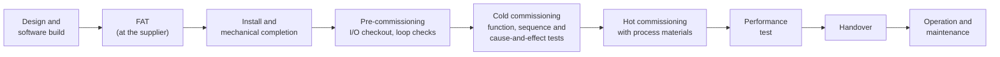
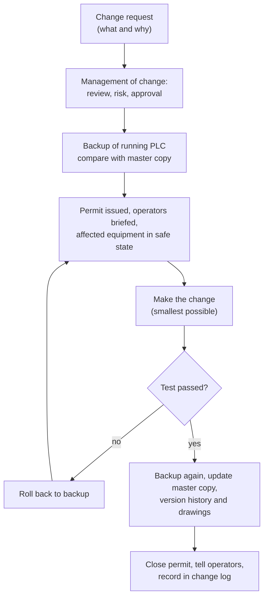
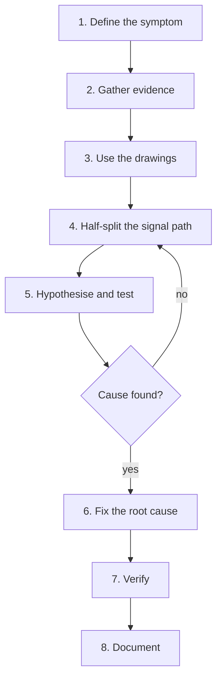

# 23 — Commissioning, Troubleshooting and Maintenance

> **Level:** 5 — Professional practice · **Time:** ~12 hours · **Prerequisites:** [Module 14](../14-analog-and-process-io/), [Module 16](../16-alarms-and-diagnostics/), [Module 22](../22-software-engineering/)

Commissioning is where a program meets the plant. Up to now your code has run against tests
and simulations. On site it meets cables that were terminated in the wrong place, sensors that
are NPN when the drawing says PNP, a transmitter ranged 0–6 m when the PLC scales 0–5 m, and
operators who need the plant back by Monday. This module covers the professional side of that
work: how a system is proven before handover (FAT, SAT, I/O checkout, loop checks, sequence
and cause-and-effect tests), how to work on a *running* PLC without hurting anyone or tripping
the plant, and how to find faults quickly and methodically.

Most of a control engineer's career is spent here, not writing new code: checking, fixing,
changing and maintaining systems that other people built. If you work with loop drawings, IS
barriers and cause-and-effect matrices, much of this will feel familiar. What this module
adds is the PLC side: what the program, the I/O card and the programming software tell you,
and the ways PLC changes go wrong on a live plant.

## Learning objectives

By the end of this module you will be able to:

- Describe the commissioning phases from mechanical completion to handover, and explain what a
  FAT, SAT and SIT each prove and what they cannot prove.
- Plan and record a point-to-point I/O checkout and a five-point loop check, and choose the
  right loop-calibrator mode (source, simulate or measure) for a given loop.
- Test sequences and cause-and-effect matrices systematically, including the negative cases,
  and manage punch lists, red-line drawings and handover documents.
- Work online safely: monitor, write, force and remove forces, and make online edits and
  downloads with backups, permits and operator communication.
- Apply a structured troubleshooting method, half-splitting the signal path from field device
  to logic and back, using cross-references, trends and diagnostic buffers.
- Recognise common field and program faults from their symptoms: wrong sensor type, loop
  voltage budget, noise, double coils, timers inside `IF`, overflow, scan order and retentive
  state.
- Find and fix bugs in an existing program using failing acceptance tests, and write an I/O
  simulation layer for checkout.
- Plan maintenance: backups, firmware, spares, batteries and memory cards, preventive checks,
  documentation and obsolescence.

## 23.1 The commissioning life cycle

**Commissioning** is the set of activities that takes an installed system from "built" to
"proven and handed over to operations". The names and the order vary between industries,
companies and contracts, so always read your project's commissioning plan. The overall shape
is nearly always the same:



| Term | What it means | Typical evidence |
|---|---|---|
| **Mechanical completion (MC)** | Everything is installed as per the drawings: cables pulled and terminated, continuity and insulation-resistance tests done by the electrical contractor. Construction hands over to the commissioning team. | MC certificate, cable test records, punch list |
| **Pre-commissioning** | Checks without process materials: I/O checkout, loop checks, device configuration, motor rotation checks (often uncoupled), valve stroking. | I/O checkout sheets, loop check sheets |
| **Cold (dry) commissioning** | The plant is energised and the control system runs, but with no process materials, or with water or air instead. Function tests, sequences, interlocks, cause-and-effect tests. | Signed test procedures |
| **Hot (wet) commissioning, start-up** | Real process materials for the first time. Loop tuning, sequence timing under real conditions. | Start-up log, tuning records |
| **Performance test** | Proves the contract guarantees: throughput, quality, consumption, availability over a defined run. | Performance test report |
| **Handover** | Responsibility passes to operations and maintenance, with the documents they need. | Handover certificate, as-built dossier |

### FAT, SAT and SIT

Three tests appear in almost every contract. **IEC 62381** (automation systems in the process
industry) defines the factory acceptance test, site acceptance test and site integration test
and gives checklists for them. Its companion **IEC 62382** covers electrical and
instrumentation loop checks. ANSI/ISA publishes versions of both.

| | **FAT** Factory Acceptance Test | **SAT** Site Acceptance Test | **SIT** Site Integration Test |
|---|---|---|---|
| Where | At the supplier's workshop | On site, after installation | On site |
| What is tested | The control system against its specification: hardware, I/O count, software functions, HMI, alarms, sequences, using simulated I/O | The system installed on site: nothing damaged in transport, correct power and earthing, communications, and (depending on the contract) the functions again | The system working together with the other systems it connects to: other PLCs, DCS, SIS, package units, MES, via real networks |
| Who witnesses | Client, often with the end user's engineers | Client, operations | Everyone who owns an interface |
| What it **cannot** prove | Field wiring, real devices, real process behaviour, real network load | Anything outside the delivered system | Behaviour with real process conditions |

Be careful with the word "SAT". In process automation it usually means the test of the
automation system on site, as above. In machine building, "SAT" often means the final
acceptance of the whole machine at the customer's plant, running real product. Agree what it
means before anyone signs anything.

The FAT is the cheapest place to find software faults. A fault found at the FAT typically
costs an engineer an hour at a desk. The same fault found during hot commissioning can cost a day of
lost production, or worse. That is why the FAT uses an **I/O simulation layer** (Lab 23-3) or
a separate plant simulation, so that every sequence path, alarm and interlock can be exercised
before any cable exists.

### Test specifications

A **test specification** (test procedure) says exactly what will be tested, how, and what
result counts as a pass. A good one is written from the functional design specification (FDS)
and the cause-and-effect (C&E) matrices, so every requirement has at least one test. Each test
step has:

- a unique ID and a reference to the requirement it proves,
- prerequisites (plant state, modes, which points are simulated),
- the action (what the tester does),
- the expected result (what must happen, **and what must not**),
- the actual result, pass/fail, initials, date and, for witnessed tests, the witness.

| Step | Requirement | Action | Expected result | Actual | P/F |
|---|---|---|---|---|---|
| P101-07 | FDS 4.3.2 dry-run protection | P-101 running in Auto. Simulate LSL-101 = low. | P-101 stops within 1 s. Alarm "LSL-101 low level" appears. P-101 does **not** restart when LSL-101 returns to normal. | | |
| P101-08 | FDS 4.3.3 start failure | Simulate no run feedback, start P-101. | After 2 s: P-101 command drops, alarm "P-101 failed to start", fault latched until reset. | | |

Look at the "expected result" column. It says what must happen *and* what must not happen
(the pump must not restart by itself). A test that only proves the pump stops proves half the
requirement.

### Punch lists

A **punch list** records everything found that does not meet the specification, from a
missing cable label to a wrong interlock. Every item gets an ID, a description, who raised it
and when, an owner, and a **category**. Many projects use categories like these (the exact
definitions come from the contract):

| Category | Meaning | Example |
|---|---|---|
| A | Must be cleared before the next phase (for example before introducing process materials). Safety, or stops the plant working. | High-level trip closes the wrong valve |
| B | Can be cleared later without affecting safe operation | HMI alarm text has a spelling mistake |
| C (if used) | Documentation or cosmetic | Drawing title block wrong |

A punch item is closed only when the fix has been *re-tested* and the person who raised it
(or the client) agrees. "Fixed" in the engineer's notebook is not "closed".

## 23.2 I/O checkout (point-to-point)

An **I/O checkout** proves every single I/O point, one by one, from the real field device to
the PLC tag and on to the HMI. It is also called a point-to-point check. It finds the wiring
faults, the swapped cores and the wrong addresses before they are buried under sequence
problems.

```text
 FIELD         JUNCTION BOX     MARSHALLING / IS BARRIER    PLC I/O CARD        CPU            HMI
 device  ----  terminals  ----  terminals -- barrier  ----  channel + LED  ---  tag, logic --- symbol, alarm
 LSL-101       JB-12 T5/T6      TB-3 T21/T22                DI slot 2 ch 5      LSL101_NC      "LSL-101 low"
    ^                                                            ^                  ^              ^
    |                                                            |                  |              |
 operate the                                            LED follows?        online value     display and
 real device                                                                 follows?         alarm correct?
```

### Digital inputs

1. Check the loop drawing and I/O list: device tag, terminal numbers, card, channel, PLC tag,
   HMI text, normal state (NO or NC).
2. **Operate the real device**: lift the float, block the photo-eye, press the button, trip
   the overload relay with its test button. Only if that is impossible, simulate it at the
   device end, with a jumper at the field terminals, never at the marshalling. A jumper at the
   marshalling proves only half the loop.
3. Watch the card LED, the online PLC tag and the HMI symbol and alarm. All must change
   together, and change back.
4. For NC (fail-safe) devices, check that the input is TRUE in the healthy state and goes
   FALSE when operated. Where it is safe and permitted, check that lifting a wire gives the
   same result as operating the device.
5. Record the result on the checkout sheet and raise a punch item for anything wrong.

### Digital outputs

Outputs move things, so they need more care:

- Agree the test with operations and the mechanical team. Make sure nobody is at the machine
  and that the equipment can safely move. Motors are often **bumped** (started for a moment)
  to check rotation, and uncoupled from the load if running backwards could do damage.
- Drive the output from the PLC in a controlled way: from the HMI in manual mode if the device
  logic is ready, or with a force under a permit (Section 23.5).
- Check the whole chain: card LED, relay or contactor, the device itself (valve moves, motor
  turns the right way), and the feedback (limit switches, run feedback) back into the PLC.
- For valves, record the stroke time in both directions. It is needed later to set the travel
  alarm timers.

### Analog inputs and outputs

Analog inputs get a **loop check** (next section). Analog outputs are checked by setting the
output to 0, 50 and 100 % from the PLC and confirming the current at the device (4, 12,
20 mA) and the actual response, for example the valve travel shown on its positioner.

| Tag | Type | Card / ch | Terminals | Field action | LED | PLC tag | HMI | Result | Sign / date |
|---|---|---|---|---|---|---|---|---|---|
| LSL101_NC | DI, NC | 2 / 5 | JB-12 T5/T6 | Float lowered by hand | Off | FALSE | "LSL-101 low" alarm | Pass | |
| P101RunFB | DI | 2 / 6 | MCC-1 T14 | Contactor pulled in (bump) | On | TRUE | P-101 green | Pass | |
| XV101Open | DO | 4 / 0 | JB-12 T20/T21 | Output ON from HMI manual | On | TRUE | XV-101 moving, then open | Fail: ZSO-101 not made. Punch B-017 | |

## 23.3 Loop checks with a loop calibrator

A **loop check** proves that every component of an analog loop works together: transmitter,
cable, junction boxes, IS barrier or isolator, burden resistor, input card, PLC scaling, HMI
display, alarms and trips. It is not the same as calibrating the transmitter. The instrument
itself is calibrated before (on the bench or in place), and the loop check proves that
everything after it reports that signal correctly.

### The five-point check

The standard check injects 0, 25, 50, 75 and 100 % of range and compares what the PLC and the
HMI show. For a 4–20 mA loop, the current is `mA = 4 + 16 × % / 100`. For level transmitter
LT-101, range 0–5000 mm, with a 250 Ω burden resistor and a card that maps 4–20 mA to raw
counts 0–27648 (the Siemens nominal range):

| % of range | Current | Volts across 250 Ω | Raw counts | HMI must show |
|---|---|---|---|---|
| 0 | 4.00 mA | 1.00 V | 0 | 0 mm |
| 25 | 8.00 mA | 2.00 V | 6912 | 1250 mm |
| 50 | 12.00 mA | 3.00 V | 13824 | 2500 mm |
| 75 | 16.00 mA | 4.00 V | 20736 | 3750 mm |
| 100 | 20.00 mA | 5.00 V | 27648 | 5000 mm |

Good practice is to go up *and* down (0-25-50-75-100-75-50-25-0) so that hysteresis and
sticking readings show up, and to record the **as-found** readings before adjusting anything.
The project sets the tolerance, usually as a percentage of span. While the calibrator is
connected, also check:

- **Alarms and trips at their set points.** Ramp slowly to the high-high set point, for
  example 90 % = 4 + 16 × 0.9 = 18.4 mA, and check the alarm, its text, the trip action and
  the first-out indication. Ramp back down and check the reset happens only after the deadband
  (Module 16).
- **Failure signalling.** Under NAMUR NE 43 a signal at or below 3.6 mA or at or above 21 mA
  means a failed instrument. Inject 3.5 mA and 21.5 mA and check that the PLC raises a fault
  and treats the value as bad (Module 14).
- **HART** transmitters: with a HART communicator, confirm the tag, the range (lower and upper
  range values), the units and the damping. Most HART transmitters also have a *loop test*
  (fixed-current) mode that makes the transmitter itself output a chosen current, so you can
  check the loop from the field end without disconnecting anything.

### The three calibrator modes

A handheld loop calibrator can play three roles. The names differ between makes, but the
ideas are the same:

| Mode | What the calibrator does | Use it when |
|---|---|---|
| **Simulate** (2-wire transmitter simulation) | Regulates the loop current to the value you set, but takes its energy from the loop's own supply, exactly like a 2-wire transmitter | The loop is powered by the input card or a loop power supply. Disconnect the transmitter and put the calibrator in its place. |
| **Source** | Supplies the energy *and* sets the current, like a 4-wire (active) transmitter | The input is passive (expects an active transmitter) and nothing else powers the loop |
| **Measure** (read) | Measures the loop current in series. Many calibrators can also supply 24 V loop power while measuring. | Checking what a transmitter is really sending, or powering a transmitter on the bench |

```text
 SIMULATE: 2-wire loop, the card supplies the loop power, transmitter disconnected

   PLC ANALOG INPUT                                  FIELD END
  +-----------------------+
  |  +24 V o--------------+----------- cable -----------o (+)  +------------------+
  |                       |                                    | CALIBRATOR       |
  |  IN    o--------------+----------- cable -----------o (-)  | SIMULATE 12.00mA |
  |        |              |                                    +------------------+
  |      [250 R]  ADC     |       The calibrator only regulates the current;
  |        |      reads V |       the 24 V comes from the card.
  |  0 V   o              |
  +-----------------------+

 MEASURE: loop left working, calibrator in series (or across a test diode)

   +24 V o----[ calibrator, MEASURE mA ]----o (+) TRANSMITTER (-) o---- IN ... 250 R ... 0 V
```

Rules that keep you out of trouble:

- **Never connect a milliammeter in parallel** with anything in the loop, except test
  terminals or a test diode designed for it (below). A current meter is almost a short
  circuit: across the transmitter it removes the transmitter from the loop, and across the
  burden resistor it steals the current the PLC should be reading.
- **Source mode is for a loop with no other supply.** In a loop that the card already powers,
  use simulate mode.
- Many loops have **test terminals**, sometimes with a diode across them, so that a meter can
  be connected without breaking the loop: the meter's low resistance takes the whole loop
  current away from the diode, and the loop keeps working when the meter is removed. A
  clamp-on milliamp meter also reads without breaking the loop.
- In a **hazardous area**, use only test equipment certified for that area and follow the
  permit. An ordinary calibrator is not certified for use in the zone: taking it in, or
  connecting it to an intrinsically safe loop there, can create an ignition risk.

### Worked example 1: reading the error pattern

A five-point check on LT-101 (0–5000 mm) gives these as-found readings:

| Injected | 4 mA | 8 mA | 12 mA | 16 mA | 20 mA |
|---|---|---|---|---|---|
| HMI shows | 1000 mm | 2000 mm | 3000 mm | 4000 mm | 5000 mm |
| Error | +1000 | +750 | +500 | +250 | 0 |

The calibrator injected exact currents, so the transmitter is not involved: the fault is in
the input card or the scaling. The error is largest at the bottom and zero at the top. That
pattern fits an input channel configured for **0–20 mA** instead of 4–20 mA. The card then
maps 0–20 mA to 0–27648, so the reading is `mA / 20 × 5000 mm = 250 mm per mA`: 4 mA gives
1000 mm and 20 mA gives 5000 mm, exactly as measured. The fix is the channel configuration,
not the scaling code.

This also shows why the fault matters. With a 0–20 mA range, a broken wire (0 mA) reads as
0 mm, an empty tank, instead of raising a fault. These error signatures are worth learning.
The transmitter can only be the cause when it is part of the test, for example when you apply
a real pressure or level to it, or use its HART loop-test mode:

| Pattern | Likely cause |
|---|---|
| Same error at every point | Zero (offset) error: a constant offset or bias added in the scaling, or a transmitter zero shift |
| Error grows in proportion to the reading | Span error: wrong maximum in the scaling, or a transmitter ranged differently from the PLC (0–6 m against 0–5 m) |
| Large error at 0 %, shrinking to zero at 100 % | Input configured for 0–20 mA with a 4–20 mA signal, or a wrong minimum (low range value) in the scaling, which pivots the line about the 100 % point |
| Correct up to a point, then flat | Loop voltage budget exceeded (worked example 3), or a signal saturating at the top of its range |

## 23.4 Function, sequence, C&E and performance tests

### Function tests

Once the I/O is proven, test each **device** as a unit, using its function block's features
(Module 11): start and stop from the HMI, local/remote and auto/manual modes, every interlock
and permissive, feedback timeouts, alarm texts and resets. Typical function tests for a motor:
start and stop in each mode, start refused by each interlock, running feedback lost while
running, feedback present without a command, overload trip, reset behaviour, and restart
after a comms loss or power cut.

### Sequence tests

A sequence (Module 13) is tested step by step: every transition, every hold, stop and abort
path, and every restart. Do not stop at the happy path. The faults that hurt on site are in
the other paths:

- What happens if Stop is pressed in *each* step?
- What happens if a transition condition is already true when the step is entered?
- What happens after a power cut in the middle of a step? (Lab 23-2 is about this.)
- What happens if communication with the HMI or a drive is lost?
- What happens if a feedback never arrives? Is there a step watchdog?

### Cause-and-effect testing

A **cause-and-effect (C&E) matrix** lists causes (rows: trips, alarms, push-buttons) against
effects (columns: valves, motors, horns). An `X` means "this cause must produce this effect".

```text
                             EFFECTS ->   XV-101    P-101    XV-102    Horn
 CAUSES                                   close     stop     open      on
 LT-101 HH  (>= 90 %)                       X         X                  X
 PT-102 HH  (>= 8.0 bar)                              X         X        X
 ESD push-button                            X         X         X        X
```

C&E testing works through the matrix **row by row**:

1. Put the plant in the state the cause applies to (for example P-101 running).
2. Create the cause as close to the field as possible: inject the trip value with the loop
   calibrator at the transmitter terminals rather than forcing a PLC tag, so the test also
   proves the input and the trip comparison.
3. Check that **every** `X` in the row happens, and that effects **without** an `X` do not.
4. Check the alarm, the first-out indication and the event time stamps.
5. Clear the cause and check the reset philosophy: effects must not return by themselves,
   and the reset must be refused while the cause is still present.
6. Record the result for each cell, signed and witnessed.

Safety instrumented functions are a special case. Under IEC 61511 the safety instrumented
system must be validated against its safety requirements specification before the hazards it
protects against are present, by competent people, following the SIS validation plan.
Testing the basic process control PLC does not count towards that (Module 20).

### Performance tests and negative tests

A **performance test** proves the numbers in the contract: throughput, cycle time, product
quality, energy use, control loop performance, often over a continuous run of hours or days.

**Negative tests** prove that the system fails safely. Pull an input connector, break an
analog loop, disconnect the network cable to a remote I/O rack, remove power from the PLC and
restore it, shut off the instrument air. For each one, check what the program does, what the
operator sees and what the equipment does. A valve that fails to its safe position with an
alarm is a pass. A value that freezes at its last reading with no alarm is a punch item.

### Documentation and handover

During commissioning the drawings change. A core is moved, a terminal renumbered, a device
swapped. Every change is marked by hand on a controlled master set of drawings, the
**red-lines** (red is conventional for additions and changes; follow the site convention for
deletions). After commissioning the design office turns the red-lines into **as-built**
drawings. A plant whose drawings don't match its wiring is dangerous to maintain.

The handover dossier typically contains:

- as-built drawings, I/O list, loop diagrams and cable schedules,
- the final PLC and HMI programs, **compared** with what is actually running, with their
  version identifiers and backups on controlled storage,
- signed test records: FAT, SAT, I/O checkout, loop checks, C&E and performance tests,
- the punch list with every A item closed and a plan for the rest,
- instrument data sheets and configuration files (drive parameters, HART configurations,
  network switch settings),
- operating and maintenance manuals, a spare parts list, and training records.

Before signing the handover, check that **no forces are active, no points are in simulation,
no test or debug code is running, and every temporary bypass has been removed**.

## 23.5 Working online safely

**Going online** means connecting the programming software to a running PLC, so you can see
live values in the logic and change things. It is powerful, and it is where many software-related
commissioning incidents start. The five things you can do online carry very different
levels of risk:

| Action | What it does | Lasts | Main risk |
|---|---|---|---|
| **Monitor** | Shows live values in the logic, watch tables, trends | While you watch | Almost none, but a busy connection can load the CPU or network |
| **Write / modify** a value | Writes a value once. The logic can overwrite it on the next scan. | Until the logic changes it | Moves equipment if the value is a command |
| **Force** | Overrides an input or output in the I/O image on every scan, whatever the field or the logic says | Until someone removes it. On some platforms this includes after you disconnect, and even after a power cycle or download. | Defeats interlocks. Hides the real state. Gets forgotten. |
| **Online edit** | Changes logic while the CPU keeps running | Permanent | New logic acts immediately on a running process |
| **Download** | Replaces the program; often needs the CPU in STOP | Permanent | Outputs drop to their STOP state and the plant trips. Data may be re-initialised. |

### Before you connect

- Make sure your offline project is the **same version** as the one in the PLC. Every tool has
  a compare function. If they differ, find out why before you change anything. Someone may
  have made an online change that was never saved. The usual terms: **upload** copies the PLC
  program to your computer, **download** sends your program to the PLC.
- Some platforms keep comments and symbol names only in the offline project, so a program
  uploaded from the PLC can come back without them. Always work from the controlled master
  copy of the project.
- Take a **backup** of the running PLC (program and current data values) before any change.

### Monitoring

Live logic display, **watch tables**, **trends** and **cross-reference** lists are your main
tools. A trend recording several signals at once is often the only way to understand a fault
that lasts a fraction of a second. Cross-reference answers the most important question in
troubleshooting: *where is this tag written?*

### Forcing

A **force** tells the PLC to ignore the real value of an input, or what the logic wants for an
output, and use a fixed value instead. Forcing an input makes the *logic* believe something
that is not true. Forcing an output drives the *field device* regardless of the logic,
including all its interlocks.

Why forces are dangerous:

- A forced input can defeat a protection. Force a low-level switch to "healthy" to get a
  pump started and the dry-run protection is gone until the force is removed.
- The HMI and the logic show the *forced* value, so the operator sees a state that is not
  real.
- Forces are easy to forget. It is not unusual to find forces on a plant that were installed
  during commissioning and never removed.
- A force on an output can start a machine while someone is working on it.

Most controllers show active forces with a front-panel LED, and the programming software
shows a force indicator. A good plant also reads the PLC's force status and shows it on the
HMI, so operators can see it too. A good site procedure treats every force like a bypass of a
protection:

1. **Permit first.** The force is authorised by the responsible person, the reason is
   recorded, and operators are told what will be forced and what it affects.
2. **Record it in the force register**: tag, forced value, reason, who, when, expected
   removal, and any extra precautions while it is in place.
3. **Apply and verify**: check that the force did what you expected, and nothing else.
4. **Remove as soon as the reason has gone.** Before removal, check what will happen when the
   real value returns. Removing a force on a stop input may stop a running machine. Removing a
   force on an output drops it to whatever the logic says.
5. **Verify and close out**: the force list in the PLC is empty (or matches the register), the
   force LED is off, and the register entry is signed off. Check at every shift handover and
   before handover of the plant.

### Online edits

Most modern PLCs can change logic while running. Rockwell Logix ladder edits go through
pending, test and assemble stages. Siemens downloads changed blocks while the CPU stays in
RUN. CODESYS offers "login with online change". Useful as that is, an online edit is a change
to a running process:

- The new logic acts on the **next scan**, in the middle of whatever the plant is doing. A
  changed step condition can make a sequence jump. A changed interlock takes effect at once.
- **New variables start at their initial values.** A new latch starts FALSE, a new timer
  starts from zero, a new edge detector may fire or miss an edge on its first scan (Module 06).
- Some changes, such as changing the structure of a data block or function block, can
  re-initialise existing data. The tool usually warns you. Read the warning.
- A mistake in an online edit is live immediately. Keep the edit small, have the reverse edit
  ready, and watch the result.

### Downloads that stop the CPU

A full download, a change to the hardware configuration or a firmware update normally puts
the CPU into STOP. In STOP, outputs go to their configured STOP or fault state: usually
de-energised, and on some modules a hold-last-value or substitute value that you can
configure. The plant trips, or stays wherever it was. After the download, the CPU starts with
new initial values for non-retentive data, so a sequence whose step is not retained goes back
to its first step, while retained data may keep values that no longer fit the new program.
Plan a download like a planned shutdown: the plant in a safe state, operations informed and
agreed, and a rollback plan (the backup you took) ready.

### Permits, change management and operator communication

A change to a running control system is a **change to the plant**. Treat it that way:



Operators must know when you are online and what you are about to do. "I'm going to download
the conveyor PLC in five minutes, it will stop Line 2 for about a minute" is a sentence that
prevents incidents. Engineers on site are often not operators, and the operator in the control
room is responsible for the plant. Never change a running process behind their back.

## 23.6 A troubleshooting method

Good troubleshooters are not faster at guessing. They follow a method that narrows the
possibilities quickly and stops them from fixing the wrong thing.



1. **Define the symptom.** "P-101 won't start from the HMI in Auto, since this morning" is a
   symptom. "The pump's broken" is not. Ask: what exactly happens, and what should happen?
   When did it start? Always, or sometimes? What changed recently (maintenance, a program
   change, the weather, a new product)? Did anything else misbehave at the same time?
2. **Gather evidence before you touch anything.** Alarm and event history, first-out
   indications, trends, the PLC diagnostic buffer, module status LEDs, the change log.
   Resetting a fault or cycling power destroys evidence.
3. **Use the drawings.** Follow the signal on the loop and schematic drawings from the field
   device to the PLC and back. Use the program cross-reference to find every place the
   relevant tags are written and read.
4. **Half-split the signal path.** Test at the middle of the path, not at one end. Each test
   halves the part of the chain where the fault can be.
5. **Hypothesise and test.** Form a specific explanation ("the LSL-101 signal wire is open
   between the switch and JB-12") and a test that could prove it wrong. Change one thing at a
   time.
6. **Fix the root cause**, not the symptom. A blown fuse is a symptom. The crushed cable that
   blew it is the cause.
7. **Verify.** Prove the original symptom has gone *and* that nothing else broke. Put the
   plant back to normal: remove temporary jumpers, forces and simulations.
8. **Document.** What was found, what was done, the root cause, and any follow-up (drawings
   to update, spares used, a design weakness to fix). Next time it could save someone hours.

### Half-splitting the signal path

Every I/O signal follows a chain. For an input and the output it controls:

```text
 INPUT SIDE
 [1] field device --> [2] cable, terminals, fuse --> [3] input card LED --> [4] PLC input tag
                                                                                  |
                                                                   [5] logic: cross-reference,
                                                                       live values, interlocks
                                                                                  |
 [9] actuator <-- [8] cable, terminals, fuse, relay <-- [7] output card LED <-- [6] PLC output tag
 OUTPUT SIDE
```

Start in the middle, at the PLC: points 3–4 for an input, 6–7 for an output. Then:

| What you see | Where the fault is |
|---|---|
| Field device operates, card LED stays off | Between the device and the card: wiring, terminal, fuse, sensor type (2) |
| Card LED on, PLC tag stays FALSE | Card or configuration: wrong address or tag mapping, module fault, the tag is **forced**, I/O not updating (comms to a remote rack) |
| PLC input tag correct, output tag not set | Logic: a permissive or interlock is missing, a fault is latched, a mode is wrong, the output is written in two places |
| Output tag TRUE, output card LED off | Card or configuration: module fault, wrong address, output forced OFF, output module power missing |
| Output card LED on, actuator does nothing | Between the card and the device: fuse, wiring, interposing relay, contactor, the actuator itself, its power or air supply |

### Tools

- **Cross-reference**: every place a tag is read or written. The first tool for any logic
  question, and the fastest way to find a double coil.
- **Trends and traces**: capture fast events and show the order in which things happened.
- **Diagnostic buffer / fault log**: the CPU's own record of mode changes, module failures,
  communication losses and program errors, with time stamps. Read it before you reset
  anything.
- **Module and network status**: LEDs, module diagnostic pages, communication error counters,
  switch port statistics.
- **Alarm, event and sequence-of-events (SOE) records**: what tripped first (Module 16).
- **Meters**: multimeter, loop calibrator, clamp meter. Insulation testing and live
  electrical work are for authorised electricians under the site's electrical safety rules
  (for example EN 50110 in Europe, NFPA 70E in North America, and local regulations).

### Most faults are in the field

Experienced technicians will tell you that the great majority of faults are in field devices,
cables, terminals, fuses, air supplies and mechanics, not in the CPU or the program. A program
that ran correctly for five years does not change by itself. So when a long-running plant
misbehaves, suspect the field first, and **compare the running program with the last
backup**. If the program did change, that is your lead. The exception is a *new* or
*recently changed* program: then the logic is a prime suspect, which is exactly the situation
in commissioning.

### Worked example 2: "P-101 won't start"

**Symptom.** Night shift reports that transfer pump P-101 won't start from the HMI in Auto.
It ran fine yesterday. The operator saw a low-level alarm and assumed the tank was empty.

**Evidence.** The HMI faceplate shows "Start permissive: LSL-101 not OK". But the level
transmitter LT-101 reads 72 %, well above the low-level switch, and the sight glass agrees:
two instruments disagree, so one of them is wrong. The alarm history shows the LSL-101 low
alarm flickered on and off a few times yesterday afternoon and has been on steadily since
02:10. No program changes are in the change log.

**Drawings.** LSL-101 is an NC float switch. Its two cores land in junction box JB-12 on
terminals T5 (+24 V out to the switch) and T6 (signal back from the switch), travel in a
multicore to TB-3 T21/T22 in the marshalling cabinet, and end at DI card 2 channel 5, tag
`LSL101_NC`. The cross-reference shows `LSL101_NC` read in the P-101 permissive and the alarm
logic and written nowhere, so no logic overwrites it. Forces do not show in a
cross-reference, so check the force list too: it is empty.

**Half-split.** Online, `LSL101_NC` is FALSE and the card 2 channel 5 LED is off, so the
fault is on the field side of the card. At TB-3 T22, the signal terminal in the marshalling
cabinet, there is no 24 V. In JB-12 there is 24 V on the core arriving from the switch at T6,
but none on the multicore leaving the other side of the same terminal. The fault is at
JB-12 T6.

**Hypothesis and test.** The terminal screw at JB-12 T6 is loose: it turns half a turn, the
core has no ferrule and some strands are broken. The flickering alarm yesterday fits a loose
connection in a box on a vibrating skid.

**Fix, verify, document.** The electrician isolates the circuit, re-terminates the core with a
ferrule and checks the tightness of every terminal in JB-12. The LED comes on, the tag is
TRUE, the permissive is OK and P-101 starts in Auto. Then prove the switch itself still
works: with the pump stopped and the operators informed, move the float to its low position
by hand and watch the tag and the alarm. Record the root cause (an unferruled core loosened by
vibration), raise a punch item to check the other junction boxes on the skid, and note the
lesson: the flickering alarm was an early warning that nobody followed up.

## 23.7 Common faults: case studies

Each case lists the symptom, the evidence that points to the cause, the cause, the fix and
the lesson. Field faults come first because they are the most common.

### Field faults

**Sensor misalignment.** *Symptom:* a carton counter misses a few percent of cartons; the
sorter occasionally diverts the wrong item. *Evidence:* the photo-eye's own LED flickers as
cartons pass instead of switching cleanly; the fault is worse on one product size. *Cause:*
vibration has turned the bracket so the beam only just catches the edge of the reflector, or
an inductive proximity switch has been knocked back towards its sensing limit. (The rated
sensing distance of an inductive sensor is specified for a mild-steel target; for most
sensors the real distance to a non-ferrous target such as aluminium is much shorter, so a
switch that was marginal on a steel bracket fails first on an aluminium part.) *Fix:*
realign, lock and mark the bracket, check the sensing margin. *Lesson:* use the sensor's LED
as a test point, and mount sensors so they cannot drift.

**Blown fuse.** *Symptom:* several unrelated inputs all go FALSE at once, or a whole group of
outputs stops working. *Evidence:* every LED on one card group is off; the fused terminal's
blown-fuse indicator is lit. *Cause:* a short circuit, for example a sensor cable crushed by a
guard. *Fix:* find and fix the short **before** replacing the fuse; a fuse that blows twice is
telling you something. *Lesson:* a design that fuses small groups of field devices separately
limits how much of the machine one short can take out.

**Loose terminals.** *Symptom:* intermittent faults that come and go with vibration or
temperature (worked example 2). *Evidence:* the signal drops out briefly on a trend, or
changes when the cable is gently moved while you watch it online (a "wiggle test").
*Cause:* no ferrule, wrong torque, a core trapped on its insulation. *Fix:* re-terminate
properly with the power isolated; check the neighbours too. *Lesson:* on power terminals, a
loose connection also gets hot, which a thermal imaging survey can find before it fails.

**Wrong sensor type (NPN or PNP).** *Symptom:* a new sensor's own LED lights when the target
is present, but the PLC input never turns on. *Evidence:* measured from the signal wire to 0 V
the voltage stays near 0 V. *Cause:* the input card is **sinking** (current flows *into*
the input and out through 0 V), which needs a **sourcing (PNP)** sensor that switches
+24 V onto the signal wire. An NPN sensor switches the signal wire to 0 V, so no current ever
flows into the input. *Fix:* fit the correct sensor type, or a card of the matching type.
*Lesson:* check the sensor part number against the card type during the I/O checkout
(Module 02).

**Analog polarity and loop type.** *Symptom:* an analog input reads a fault, or zero, from the
moment it is connected. *Evidence:* no current in the loop. *Cause:* a 2-wire transmitter
wired with its polarity reversed normally passes no current, because of its reverse-polarity
protection, so the PLC sees 0 mA, which is below 3.6 mA and should raise a wire-break fault.
The other classic is a mismatch between loop types: a 2-wire (loop-powered) transmitter
connected to a card channel configured as passive gets no power, and a 4-wire (self-powered)
transmitter connected to a channel that also supplies loop power puts two supplies in one
loop. *Fix:* correct the wiring or the channel configuration. *Lesson:* the loop drawing must
say who powers the loop, and the checkout must confirm it.

### Worked example 3: the loop voltage budget

A 2-wire transmitter needs a minimum voltage across its own terminals to work. The datasheet
states it; say **12.0 V** for this example. Everything else in the loop drops voltage in
proportion to the current (Ohm's law, `V = I × R`), so the supply must cover the transmitter's
minimum plus all those drops at the **highest current the loop must carry**.

LT-201 runs through an IS barrier into a PLC input, supplied from 24.0 V:

| Item | Resistance |
|---|---|
| Barrier (end-to-end, from its data sheet) | 300 Ω |
| Field cable, both cores | 40 Ω |
| PLC input burden | 250 Ω |
| **Total** | **590 Ω** |

At 20 mA the loop drops `0.020 A × 590 Ω = 11.8 V`, leaving `24.0 − 11.8 = 12.2 V` for the
transmitter. That works, with only 0.2 V to spare. (If the transmitter's upscale failure
signal of about 21 mA must also get through, repeat the check at that current: here it
would not quite make it.)

Later, a modification adds a 250 Ω chart-recorder input in series. Now the total is 840 Ω.
The highest current the loop can drive while still leaving 12 V for the transmitter is:

```text
 I_max = (24.0 V - 12.0 V) / 840 ohm = 0.01429 A = 14.29 mA
 Reading at I_max = (14.29 - 4) / 16 = 64.3 % of range
```

**Symptom:** the level reads normally up to about 64 %, then stays flat while the sight glass
shows the tank still filling. There is **no fault alarm**, because 14.3 mA is a perfectly
valid signal. A high-level alarm at 80 % will never trip. This is why the loop check must go
to 100 % and why every added load must be checked against the loop budget. *Fix:* remove the
extra load, or give it its own signal via an isolator or repeater. Don't just raise the supply
voltage on an IS loop: the barrier and the IS certification set the limits (Module 02).

**Ground loops and noise.** *Symptom:* an analog value wanders or carries a ripple, and steps
when a large motor or variable-speed drive starts. *Evidence:* a fast trend shows periodic
noise; the reading changes when a screen connection is lifted. *Cause:* the cable screen, or
the signal 0 V, is earthed at two points with different earth potentials, so a current flows
through the screen or the signal circuit (a **ground loop**); or the signal cable runs
alongside drive motor cables. *Fix:* follow the project's earthing philosophy. For analog
instrument cables that usually means earthing the screen at one end only, normally the
control-panel end. Use signal isolators where two earthed systems must connect, and separate
signal and power cable routes. Drive motor cables are different: their screens are normally
bonded at both ends for high-frequency EMC, as the drive manufacturer specifies. *Lesson:*
filter in the PLC only after fixing the cause. A filter hides noise; it also slows down a real
change.

**Intermittent faults.** *Symptom:* "it trips every few days and it's fine when we get
there". *Evidence:* the hard part is getting any. Capture it: set a trend with a fast sample
rate on the signals involved, add temporary capture logic that counts and times dropouts
(worked example 5), and write down time, temperature, weather, product and shift for each
event. Patterns appear: only in the afternoon sun, only when it rains, only when the press
next door runs. *Cause:* usually a loose connection, a failing sensor, a damaged cable that
opens when it moves, or water getting in. *Lesson:* never "fix" an intermittent fault by
adding a delay timer in the program until you know the cause.

**Communication faults.** *Symptom:* comms-loss alarms, values frozen on the HMI, remote I/O
or drives dropping off. *Evidence:* network diagnostics: error counters, module LEDs, switch
port statistics, the diagnostic buffer. *Causes:* two devices with the same IP address or
node address, a wrong baud rate or parity on a serial link, a missing or extra terminating
resistor on an RS-485 or PROFIBUS segment (termination belongs at both ends of the segment
and nowhere else), stubs or over-length cables, damaged connectors, noise, an overloaded
network, a firmware mismatch after a device was replaced. *Lesson:* design for comms loss
with heartbeats and defined fallback states (Module 17). A value that silently freezes is
worse than one clearly marked as bad.

### Program faults

Program faults appear mostly in new or recently changed programs, which is why commissioning
finds so many of them. Labs 23-1 and 23-2 contain most of the ones below.

**Scan-order bugs.** The PLC executes statements top to bottom (Module 01). When a value is
used before it is calculated in the same scan, or cleared before it is read, the logic can
look right line by line and still be wrong. The classic example is an edge memory updated
*before* it is used:

```iecst
(* WRONG: the memory is updated first, so the edge is never seen *)
PE_Old := CartonPE;
IF CartonPE AND NOT PE_Old THEN
  CartonCount := CartonCount + 1;
END_IF;

(* RIGHT: use the old value, then update it *)
IF CartonPE AND NOT PE_Old THEN
  CartonCount := CartonCount + 1;
END_IF;
PE_Old := CartonPE;
```

Another is an HMI command bit that the PLC clears *before* the logic that reads it. On many
controllers (OpenPLC, and `plctest`) the HMI's write lands between scans, so a clear at the
top of the program wipes every command before the logic below can see it. On controllers
where communication can update a tag part-way through a scan, such as Rockwell Logix, the
command works only when the write happens to land between the clear and the logic, which
turns the bug into an intermittent one. The robust pattern is to copy the command into an
internal bit and clear it in two adjacent statements, then use only the copy; the smallest
fix is to clear the command at the end of the program, after the logic that reads it
(Lab 23-2).

**Double coils.** An output written in two places: the last write in the scan wins. The
symptom is typically "it works in manual but not in auto", or the reverse. The cross-reference
shows two writes to the same tag. The fix is to write each output in exactly one place and
combine the conditions there (Module 04).

```iecst
(* WRONG: two writes. The manual line always wins, so Auto never opens the valve. *)
InletValve := AutoMode AND LevelLow;
InletValve := ManualMode AND HmiOpenCmd;

(* RIGHT: one write, all the conditions in one place *)
InletValve := (AutoMode AND LevelLow) OR (ManualMode AND HmiOpenCmd);
```

**NC inputs and missing reset paths.** Two related logic mistakes cause some of the most
dangerous commissioning surprises. The first is an NC field contact programmed with the wrong
contact type. A stop button wired NC gives an input that is TRUE while healthy, so the rung
needs a normally-*open* contact (`--] [--`) on it (Module 04). Programmed with an NC contact
(`--]/[--`), Start does nothing in normal conditions, and with the stop wire broken the motor
starts and cannot be stopped from that button. The second is a fault that switches the output
off but does not reset the run latch or the sequence behind it. Everything looks fine until
someone resets the fault, and then the machine restarts by itself. The test for
both is the same: press Stop, break the wire, trip and reset each fault, and check that nothing
starts without a new Start command.

**Timers inside IF.** A timer function block updates only when it is called. Put the call
inside an `IF` and, while the condition is FALSE, the timer is frozen: it neither times nor
resets. Worked example 4 goes through it scan by scan.

**Integer overflow.** An `INT` holds −32768 to 32767. In MATIEC and many PLCs, adding one to
32767 gives −32768: the value wraps around silently. Some PLCs also set an overflow status
flag, and some can raise a fault (Modules 03 and 09). The subtle version is converting **too late**:

```iecst
(* WRONG: RunMinutes * 60 is calculated as an INT. It overflows at 547 minutes
   (about 9 hours), before INT_TO_DINT ever sees it: 547 * 60 = 32820 > 32767 *)
RunSeconds := INT_TO_DINT(RunMinutes * 60);

(* RIGHT: convert first, then calculate in the bigger type *)
RunSeconds := INT_TO_DINT(RunMinutes) * 60;
```

How intermediate results are handled differs between platforms. Some compute the middle of an
expression in a wider type, some do not; in MATIEC the overflow shows up when the `INT` result
is stored or passed to a function, as above. Don't depend on either behaviour: choose types
where the whole calculation fits. A shift counter that runs for years needs a `DINT`, and
anything counting milliseconds in a `DINT` wraps after about 24.8 days (2^31 ms).

**Retentive-state surprises after a power cycle.** Some data survives a power cut
(**retentive**), some returns to its initial value. Surprises come from both directions:

- A **retained sequence step** makes a sequence resume mid-step when power returns, and
  outputs driven from that step switch on by themselves (worked example 6).
- A **retained latch** (a `SET` coil, an `OTL` bit in Rockwell) restarts a motor when power
  returns. IEC 60204-1 requires that restoring the supply must not restart a machine by itself
  where that could cause danger.
- A **non-retained total or counter** loses a shift's production data at a power dip.
- A **memory card** set to load its program at power-up can restore an *old* program if the
  card was not updated after the last change.

The fix is a deliberate design: decide which data must survive (counters, totals, recipes,
configuration) and which must not (steps, commands, run latches), and write **explicit
start-up code** that puts the machine into a known safe state on the first scan. Then test it:
a power-cycle test belongs in every commissioning plan.

## 23.8 Maintenance and lifecycle

A PLC system often stays in service for well over a decade, and many run for much longer.
What keeps it maintainable is unglamorous routine.

**Backups and versioning.** Keep a controlled master copy of every program (PLC, HMI, safety
PLC, drive parameters, network switch configurations) in version control or a change-managed
archive (Module 22), with at least one copy away from the plant. Back up after every change,
and compare the running PLC with the master copy regularly. Some sites use automated tools
that do this every night and report differences. A backup that has never been restored is a
hope, not a backup: test restoring it to a spare CPU or a simulator.

**Firmware management.** Record the firmware version of every CPU, communication module and
drive. Don't update firmware just because a new version exists. Update when it fixes a problem
you have, or a security vulnerability that affects you (IEC 62443, Module 22), and treat the
update as a change under management of change, tested first. Keep the firmware files, the
matching software versions and the compatibility information in the archive: a replacement
module may arrive with newer firmware than the rest of the system.

**Spares.** Hold spares for parts whose failure would stop the plant and whose delivery time
is long: CPUs, I/O cards, power supplies, communication modules, critical sensors. Check that
the spares are the same part number and a compatible firmware version, store them properly,
and test them now and then. A spare that fails when you need it is worse than none, because
you stopped looking for another one.

**Batteries and memory cards.** Controllers that keep program or data in battery-backed memory
raise a battery-low warning; act on it. The usual advice is to change such a battery with the
controller powered, so the memory stays supplied, but follow the vendor's procedure exactly.
Many newer controllers use non-volatile memory or a memory card instead. Know what your memory
card does at power-up: if it is set to load its program into the CPU, the card must always
hold the current version.

**Preventive checks.** The intervals below are examples. Use the manufacturer's
recommendations and the site maintenance plan.

| Check | Example interval | Look for |
|---|---|---|
| Diagnostic buffer, controller and module faults | Monthly | Repeated minor faults, comms errors, unexplained restarts |
| Running program vs master copy | Monthly or after any work | Undocumented online changes, active forces |
| Battery status, LEDs, cabinet temperature, fans and filters | Quarterly | Blocked filters, overheating, battery warnings |
| Network error counters and switch port statistics | Quarterly | Rising error counts on one device or cable |
| Thermal imaging of power and supply terminals | Yearly | Hot connections |
| Terminal tightness (power isolated), cable glands, water ingress | Yearly or per site plan | Loose cores, corrosion, damaged cables |
| UPS and power supply tests | Per manufacturer | Battery capacity, output voltage under load |
| Backup restore test | Yearly | A backup that won't load |
| Safety function proof tests | As set by the safety requirements specification | See Module 20 |

**Documentation upkeep.** Every change updates the drawings, the I/O list, the program
comments, the alarm list and the change log. Out-of-date documentation turns every future
fault into a longer one.

**Lifecycle and obsolescence.** Vendors publish a lifecycle status for each product (such as
active, mature, end-of-life announced, discontinued). Survey the installed base once a year:
list every product, its status, the spares held and the risk if it fails. When a product
nears end of life, choose between buying enough spares to reach the next planned outage and
migrating. Plan migrations early, in phases, during planned shutdowns, with the same testing
discipline as a new project (FAT, I/O checkout, loop checks) because a migration is a new
control system on an old plant.

## Worked examples

### Worked example 4: a timer inside IF, scan by scan

A transfer pump has a low-flow protection: if the flow switch shows no flow for 10 s while
the pump runs, the pump trips. The programmer wrote it like this:

```iecst
IF PumpRun THEN
  LowFlowTimer(IN := NOT FlowSW, PT := T#10s);   (* only called while running *)
END_IF;
IF LowFlowTimer.Q THEN
  PumpFault := TRUE;                              (* latched, stops the pump *)
END_IF;
```

It passed its commissioning test. Months later the operators report that the pump
"sometimes trips on low flow the instant it is started". Here is one of those times. The pump
is running when the flow is lost at t = 0 (a strainer blocking). At t = 6 s, before the trip,
the operator stops the pump to clear the strainer. At t = 66 s the pump is restarted.

```text
 time (s)     0       6                              66
              |       |                              |
 PumpRun    """"""""""\______________________________/\___________  trips at once
 NoFlow     __/"""""""""""""""""""""""""""""""""""""""""""""""""""
 timer call?  yes     no: frozen, IN = TRUE,         yes: IN TRUE,
              timing  ET stays at 6 s                66 s since start
 LowFlow.Q  _________________________________________/""""""""""""
 PumpFault  _________________________________________/""""""""""""
```

While the timer is not called, it keeps its last state: IN TRUE and timing since t = 0. It
never saw IN go FALSE, so it never reset. When it is called again at t = 66 s (the flow has
not had time to build up yet, so IN is still TRUE), the MATIEC timer used by `plctest` and
the OpenPLC Runtime v3 compares the clock with the time it started, finds 66 s have passed, and sets `Q`
at once: the pump trips on "low flow" the moment it restarts. Other platforms may behave
differently in detail, for example continuing from the frozen 6 s, which is itself a reason
never to rely on it. The fault only appears when the pump was stopped *during* a low-flow
period, which is why it looked intermittent. There is a second symptom: after a genuine
low-flow trip the pump stops, so the timer is no longer called, `Q` stays TRUE, and a latch
set from `Q` can never be reset.

The fix is to call the timer on **every** scan and move the condition into `IN`:

```iecst
LowFlowTimer(IN := PumpRun AND NOT FlowSW, PT := T#10s);   (* called every scan *)
```

Now, when the pump stops, `IN` goes FALSE and the timer resets. On each start it times a
fresh 10 s, which also gives the flow time to build up. The same rule applies to counters,
edge detectors and every other function block with memory: call them unconditionally and
control them through their inputs.

### Worked example 5: capturing an intermittent fault in code

A flow switch on a cooling-water line occasionally drops out for a moment and trips a
compressor, a few times a week. Nobody has seen it happen. Temporary capture logic counts the
dropouts and records how long they last, which tells you a lot: dropouts of 20–50 ms suggest
a contact or terminal problem; dropouts of several seconds suggest a real loss of flow.

```iecst
FUNCTION_BLOCK FB_DropoutMonitor
  VAR_INPUT
    Signal : BOOL;  (* the signal that should stay TRUE, e.g. a flow switch *)
    Watch  : BOOL;  (* only watch while it SHOULD be TRUE, e.g. pump running *)
    Reset  : BOOL;  (* clear the record *)
  END_VAR
  VAR_OUTPUT
    Count      : DINT;  (* number of dropouts seen *)
    LastLength : TIME;  (* length of the most recent dropout *)
    Longest    : TIME;  (* longest dropout since the last reset *)
  END_VAR
  VAR
    Dropped    : BOOL;
    WasDropped : BOOL;
    Stopwatch  : TON;   (* used only for its ET *)
    HeldET     : TIME;
  END_VAR

  Dropped := Watch AND NOT Signal;

  IF Dropped AND NOT WasDropped THEN        (* a dropout starts *)
    Count := Count + 1;
  END_IF;
  IF WasDropped AND NOT Dropped THEN        (* a dropout ends: record its length *)
    LastLength := HeldET;
    IF LastLength > Longest THEN
      Longest := LastLength;
    END_IF;
  END_IF;

  Stopwatch(IN := Dropped, PT := T#24h);    (* called every scan, never inside an IF *)
  HeldET := Stopwatch.ET;
  WasDropped := Dropped;

  IF Reset THEN
    Count := 0;
    LastLength := T#0s;
    Longest := T#0s;
  END_IF;
END_FUNCTION_BLOCK
```

Two details matter. The length is recorded from `HeldET`, the elapsed time saved on the
previous scan, because on the scan where the dropout ends the timer's `IN` goes FALSE and its
`ET` resets to zero. And the resolution is one scan: the recorded length is the time from the
first to the last scan that saw the signal missing, so it reads short by up to one scan. In
`plctest`, a 30 ms dropout on a 10 ms task (seen by three scans) records as 20 ms, and on a
real PLC a dropout shorter than one scan may not be seen at all. For faster
events you need an input with a latching or high-speed function, or an SOE module
(Module 16). Remove the capture logic, or leave it documented, when the fault is fixed.

### Worked example 6: a safe start-up after a power cut

A batch reactor sequence keeps its step in a variable `BatchStep`. On this platform the
variable survives a power cut, so after a dip the sequence would resume in `Heating` with the
steam valve open, although nobody knows what happened to the batch. The start-up section runs
on the first scan after every PLC start, before any logic that drives an output:

```iecst
IF NOT Initialised THEN          (* Initialised is NOT retentive *)
  BatchStep := Idle;             (* never resume a batch automatically *)
  Initialised := TRUE;
END_IF;
(* ... the sequence and the output logic follow ... *)
SteamValve := (BatchStep = Heating);
```

Three things make it work. It runs **before** the sequence and the outputs, so the steam
valve is never switched on, even for one scan. The flag is **non-retentive**, so it is FALSE
after every start; on a platform where every value survives a power cycle, use the platform's
own first-scan indication instead of a flag of your own. And it touches only what must be
reset: batch records, totals and recipe data that must survive are left alone, and the
operator decides how to continue the interrupted batch. Vendor equivalents: the `S:FS`
first-scan bit in Rockwell Logix, the Startup OB (OB100) in Siemens S7-1200/1500, and in
CODESYS a non-retentive flag like the one above or a system first-cycle indication.

## Common mistakes and how to avoid them

1. **Testing only the happy path.** Most site faults are in stop, abort, restart, power-cut
   and comms-loss paths. Put them in the test specification.
2. **Jumpering at the marshalling and calling the point checked.** Operate the real device, or
   simulate at the field terminals.
3. **Connecting a milliammeter in parallel**, or using source mode in a loop that is already
   powered. Measure in series; simulate in powered loops.
4. **Forces without a register.** Every force gets a permit, a register entry and a removal
   check. Check the PLC's force list at every shift handover.
5. **Online changes without a backup, or a download that stops the plant without warning.**
   Back up first, tell the operators, have the rollback ready.
6. **Changing several things at once.** If the fault goes away you don't know which change
   fixed it; if it gets worse you don't know which change caused it.
7. **"Shotgun" troubleshooting**: swapping parts until the fault disappears. It wastes spares,
   hides the root cause and often introduces new faults.
8. **Blaming the program first on a plant that has run for years.** Look at the field, and
   compare the program with the backup.
9. **Fixing the symptom in code**: a delay timer on a noisy signal, a force on a failing
   sensor, a bypass left in "temporarily". Fix the cause.
10. **Resetting faults or cycling power before reading the evidence.** The diagnostic buffer,
    the first-out and the alarm history are gone once you do.
11. **Red-lines that never reach the as-built drawings.** Keep one controlled master set and
    transfer every change.
12. **Not considering retentive data.** Decide what survives a power cut, write start-up code,
    and include a power-cycle test in commissioning.
13. **Backups that exist only on the commissioning laptop**, or have never been restored.
14. **Leaving test aids behind**: simulated points, debug code, temporary bypasses, disabled
    alarms. Check them all before handover.

## Vendor notes

**Siemens TIA Portal (S7-1200/1500).** *Online & diagnostics* shows the CPU's **diagnostic
buffer**, a time-stamped list of events such as mode changes, module failures and program
errors; read it first after any unexplained stop. **Watch tables** monitor and modify
values; **force tables** force I/O. On the S7-1200, forcing applies to peripheral inputs and
outputs, and the forces stay active in the CPU after you close the software until someone
removes them. The CPU and TIA Portal indicate when forcing is active. The **cross-reference**
list shows every use of a tag, **Trace** records fast signals, and the **compare** function
shows differences between the offline project and the CPU. Changed blocks can be downloaded
while the CPU stays in RUN; hardware configuration changes normally need STOP. Data is
non-retentive unless marked *Retain*; at a warm restart non-retentive data takes its start
values and the Startup OB (OB100) runs once before cyclic operation. S7-1500 CPUs need a
SIMATIC Memory Card to run.

**Rockwell Studio 5000 (ControlLogix/CompactLogix).** **Cross Reference** lists every use of
a tag, and **trends** record fast signals. Controller faults appear in the controller
properties (major and minor faults), and module faults in the I/O configuration tree.
**I/O forces** are installed on tags and must then be enabled for the controller; the
controller has a FORCE status indicator. Ladder **online edits** go through pending, test
and assemble stages, and you can go back to the original logic until the edits are
assembled. Tag values are held through a power cycle. When the controller goes to Run it
performs a **prescan**, which clears outputs of `OTE` instructions and resets `TON` timers, but
values written with `MOV` or `ADD` and bits latched with `OTL` keep what they held. Use the
first-scan bit `S:FS` for start-up code. Controllers with an SD card can be set to load their
image from the card at power-up, on corrupt memory, or only when a user asks: know which one
your plant uses.

**CODESYS (and CODESYS-based platforms).** *Login* offers online change or a full download.
In online mode you can prepare values and then **write** them once or **force** them; forced
values are marked in the editor and must be released. `VAR RETAIN` variables survive a warm
reset and a power cut; `VAR PERSISTENT` variables also survive a download. *Reset warm*,
*Reset cold* and *Reset origin* re-initialise progressively more data. **Breakpoints** and
single-stepping halt the task at that point, so the outputs it drives are no longer updated:
never use them on a running machine. Trace, cross-reference and the device log are the main
diagnostic tools.

**OpenPLC and this course.** The OpenPLC Editor's built-in simulator shows live variable
values in its debugger panel, where you can also change them to simulate field inputs, so you
can practise monitoring without any hardware. With the Runtime on real hardware, the
monitoring and forcing features depend on the Runtime and Editor versions, so check the
documentation for yours. In this course, `plctest` gives you the commissioning
engineer's best friend: a repeatable acceptance test. Every scenario starts from a cold start
([Appendix E](../appendices/E-matiec-openplc-notes.md)), so a power cut with retained memory is simulated by writing the retained values
before the first scan, as Lab 23-2 does.

## Labs

Labs 23-1 and 23-2 are different from earlier labs. The starter is **not** an empty
template: it is a complete program that compiles and runs but contains three bugs. This is
what commissioning and maintenance work looks like. Treat each failing check as a symptom
report: read the scenario that failed, form a hypothesis, prove it (use `print` lines in a
copy of the test), fix the root cause with the smallest change, and rerun. Then fill in a
short fault record for each bug:

| Bug | Symptom (which test lines) | Root cause | Fix | How verified |
|---|---|---|---|---|
| 1 | | | | |

Fixing one bug can reveal another that it was hiding. That happens on real plants too.

### Lab 23-1: Find the bugs

**Goal:** use the failing tests to find and fix three classic bugs in a working program.

**The machine.** A transfer conveyor carries cartons to a palletiser. It has Start, Stop, Jog
and Reset push-buttons, a jam photo-eye at the discharge and a motor overload relay. Three
fault reports came in during the first week:

- "Start lights the green lamp but the belt doesn't move. It only moves while someone holds
  Jog."
- "We stopped the line with a carton under the jam eye. When we pressed Start again, the red
  jam lamp came on at once."
- "After an overload trip, the electrician reset the overload relay and the operator pressed
  Reset. The green Run lamp came back on by itself."

**Interface** (use these names exactly):

| Tag | Address | Type | Description |
|---|---|---|---|
| `StartPB` | `%IX0.0` | BOOL | Start push-button, NO |
| `StopPB_NC` | `%IX0.1` | BOOL | Stop push-button, **NC**: TRUE while not pressed |
| `JogPB` | `%IX0.2` | BOOL | Jog push-button, NO |
| `JamPE` | `%IX0.3` | BOOL | Jam photo-eye: TRUE while the beam is blocked |
| `ResetPB` | `%IX0.4` | BOOL | Fault reset push-button, NO |
| `OverloadOK_NC` | `%IX0.5` | BOOL | Overload relay contact, **NC**: TRUE while healthy |
| `ConveyorMotor` | `%QX0.0` | BOOL | Conveyor motor contactor |
| `RunLamp` | `%QX0.1` | BOOL | Green lamp: running in **automatic** (off during jog) |
| `FaultLamp` | `%QX0.2` | BOOL | Red lamp: a fault is latched |

**Specification** (what the program is supposed to do):

1. At power-up everything is off. A carton under the eye at power-up, or while the conveyor
   is stopped, does not cause a fault.
2. Start runs the conveyor in automatic and it seals in; the run lamp is on. Stop, or a broken
   stop-button wire, stops it. Stop wins over Start.
3. Jog runs the conveyor only while held, only when it is not running in automatic and no
   fault is latched. Jog never seals in and never lights the run lamp. Stop wins over Jog.
   Pressing Jog while running in automatic changes nothing.
4. In automatic, if the eye is blocked continuously for 3 s, that is a jam fault. Cartons that
   pass normally (blocked for less than 3 s) never trip it, however many there are. The 3 s
   is measured while running: a carton already under the eye when the conveyor starts gets a
   fresh 3 s.
5. An overload trip (`OverloadOK_NC` FALSE) is a fault at once.
6. A fault stops the conveyor, lights the fault lamp and stays latched. Start and Jog do
   nothing while a fault is latched.
7. Reset clears the fault only when its cause has gone (eye clear, overload healthy). Reset
   never starts the conveyor: a new Start is needed. Reset has no effect when there is no
   fault.

**Steps:**

1. Run the test against the starter and read the failures:
   `python3 tools/plctest.py 23-commissioning-and-troubleshooting/labs/starter/23-1-find-the-bugs.st`
2. Copy the starter to `my-work/`, find the bugs, fix them, and rerun:
   `python3 tools/plctest.py my-work/23-1-find-the-bugs.st 23-commissioning-and-troubleshooting/labs/23-1-find-the-bugs.test`
3. Fill in your fault record, then compare with `labs/solutions/23-1-find-the-bugs.st`, where
   each fix is marked.

<details>
<summary>Hint (open only if stuck)</summary>

Match each report to a symptom in the test output. For the first report, find every line that
writes `ConveyorMotor` (a cross-reference by eye). For the second, ask what a timer does while
its call is not executed. For the third, ask what happens to `RunLatch` when a fault occurs,
and what the motor would do after Reset once the first bug is fixed.
</details>

### Lab 23-2: Subtle faults

**Goal:** find faults that only appear under particular conditions, the kind that pass a bench
test and appear weeks later on site.

**The machine.** A drum-filling station on a scale. The operator puts an empty drum on the
scale and presses Start (on the panel or the HMI). The program captures the empty-drum weight
(tare) and opens the fill valve until 200 kg of product is in the drum, then lights the Done
lamp and counts the drum. The operator takes the full drum away. The HMI shows the weight, the
drum count for the shift and the nominal kilograms filled. The program passed its bench test
and has run for a month. Then three reports arrived:

- "The Start button on the new HMI screen does nothing, and neither does Reset shift count.
  The push-button on the panel works fine."
- "Late in Friday's double shift the 'kg filled this shift' display went negative. The drum
  count looked right."
- "After last night's power cut, the fill valve opened by itself as soon as power came back,
  with a part-filled drum on the scale. Nobody had pressed Start."

**Interface** (use these names exactly):

| Tag | Address | Type | Description |
|---|---|---|---|
| `StartPB` | `%IX0.0` | BOOL | Start push-button, NO |
| `StopPB_NC` | `%IX0.1` | BOOL | Stop push-button, **NC** |
| `DrumPresentPX` | `%IX0.2` | BOOL | Proximity switch: a drum is in position |
| `WeightRaw` | `%IW0` | INT | Scale transmitter: 0..27648 = 0..300 kg |
| `FillValve` | `%QX0.0` | BOOL | Fill valve solenoid (de-energised = closed) |
| `DoneLamp` | `%QX0.1` | BOOL | Drum full, remove it |
| `HmiStartCmd` | — | BOOL | HMI Start button: the HMI writes TRUE, the PLC clears it |
| `HmiResetCountCmd` | — | BOOL | HMI Reset shift count: the HMI writes TRUE, the PLC clears it |
| `Weight_kg` | — | REAL | Gross weight on the scale |
| `DrumCount` | — | INT, `RETAIN` | Drums filled this shift |
| `TotalKg` | — | DINT | Nominal kg this shift = `DrumCount` × 200 |
| `FillStep` | — | `E_FillStep` = `(Idle, Filling, Done)` | Sequence step. The power-cut tests write it before the first scan to act as retained memory. |

**Specification:**

1. `Weight_kg = WeightRaw × 300 / 27648`.
2. Start (panel or HMI) is accepted only in `Idle`, with the stop circuit healthy, a drum
   present and `Weight_kg` below 50 kg (an empty drum). Starting captures the tare and opens
   the valve.
3. The valve stays open until the net weight (gross − tare) reaches 200 kg. Then it closes,
   the step becomes `Done`, the Done lamp lights and `DrumCount` goes up by one.
4. Stop, or the drum leaving the scale, during filling closes the valve at once and returns to
   `Idle` without counting the drum. Releasing Stop does not reopen the valve.
5. In `Done`, Start is ignored. When the drum is removed, the step returns to `Idle` and the
   lamp goes out.
6. HMI commands are momentary. An HMI command must work the first time it is written, and
   the PLC clears `HmiStartCmd` and `HmiResetCountCmd` within one scan, whether it acted on
   them or not. A command that could not be accepted is forgotten, not remembered for later.
7. `HmiResetCountCmd` sets `DrumCount` to 0.
8. `TotalKg` is correct for every count an `INT` can hold.
9. After **every** PLC start the station starts in `Idle` with the valve closed, even if the
   memory says `Filling` or `Done`, because on some platforms every value survives a power
   cut. Use start-up code that runs on the first scan, not just the declarations. `DrumCount`
   keeps its retained value. A drum interrupted by a power cut is never resumed or counted
   automatically: only a new Start begins a fill.

**Steps:** as in Lab 23-1, with `23-2-subtle-faults`. The test file's header lists the raw
counts it uses, which is handy for your own `print` experiments.

<details>
<summary>Hint (open only if stuck)</summary>

Report 1: when does the HMI write its bit, and where in the scan is it cleared? Report 2: what
type is `DrumCount * DrumNominal_kg`, and when does the conversion happen? Report 3: which
block is `FillStep` declared in, and what runs on the first scan? Remember that the
start-up code must come *before* the sequence and the logic that drives the valve: if the
sequence runs first with a stale `Filling` step and a lost tare, it can count a drum that
nobody filled.
</details>

### Lab 23-3: I/O simulation layer

**Goal:** write the simulation layer that makes a FAT and an I/O checkout possible without a
running plant, with the safeguards a real site would insist on.

**The story.** Transfer pump P-101 empties tank T-101. The application logic is finished and
given to you: the pump starts at 60 % level and stops at 20 %, stops at once if the low-level
switch LSL-101 opens (dry-run protection), and latches a start-failure fault if its running
feedback does not arrive within 2 s. For the FAT there is no tank, no pump and no switch, so
the testers need to simulate the three inputs from the HMI. Between the field and the logic
you will add a simulation layer: every input goes through it, and the logic uses only the
**processed** values it produces.

```text
 field input ---> [ simulation layer ] ---> processed value ---> application logic
                    ^         ^
      key switch ---+         +--- HMI: Sim.Enable, Sim.Value (one structure per point)
```

**Interface** (use these names exactly):

| Tag | Address | Type | Description |
|---|---|---|---|
| `LSL101_NC` | `%IX0.0` | BOOL | Low-level switch, **NC**: TRUE while the level is above it |
| `P101RunFB` | `%IX0.1` | BOOL | P-101 running feedback (contactor auxiliary) |
| `SimKeySW` | `%IX0.2` | BOOL | Key switch "simulation permitted" |
| `ResetPB` | `%IX0.3` | BOOL | Fault reset push-button |
| `LT101Raw` | `%IW0` | INT | Tank level: 0..27648 = 0..100 % |
| `P101Run` | `%QX0.0` | BOOL | P-101 contactor (from the given logic) |
| `SimLamp` | `%QX0.1` | BOOL | Amber lamp: simulation active |
| `P101Fault` | `%QX0.2` | BOOL | P-101 start failure (from the given logic) |
| `SimLSL101`, `SimP101FB` | — | `ST_SimDI` (`Enable`, `Value : BOOL`) | HMI simulation tags for the two digital inputs |
| `SimLT101` | — | `ST_SimAI` (`Enable`, `Value : REAL` in %) | HMI simulation tags for the level |
| `LSL101_OK`, `P101Running` | — | BOOL | Processed digital values used by the logic |
| `LT101_Pct` | — | REAL | Processed level in % used by the logic |
| `SimActive` | — | BOOL | At least one point is being simulated |
| `SimCount` | — | INT | Number of points being simulated (0–3) |

**Requirements:**

1. With no simulation, the processed values follow the field: `LSL101_OK = LSL101_NC`,
   `P101Running = P101RunFB`, `LT101_Pct = LT101Raw × 100 / 27648`.
2. Simulation needs the key switch. While `SimKeySW` is FALSE, the PLC clears every `Enable`
   flag on every scan, so a request from the HMI is refused.
3. While a point's `Enable` is TRUE, its processed value is its `Value`, and the field value
   is ignored.
4. **Bumpless start:** on the scan a point's simulation starts, the PLC first copies the live
   field value into its `Value`, so the logic sees no jump. The HMI changes `Value`
   afterwards. (The tests write `Enable`, wait a scan, then write `Value`.)
5. Turning the key off ends every simulation at once and clears every `Enable`. Nothing comes
   back when the key is turned on again.
6. `SimCount` is the number of simulated points, `SimActive` is TRUE when it is above zero,
   and `SimLamp` follows `SimActive`.
7. Don't change the application logic. The simulation layer runs **before** it in the scan.

**Steps:** run the starter, write the layer, run
`python3 tools/plctest.py my-work/23-3-io-simulation.st 23-commissioning-and-troubleshooting/labs/23-3-io-simulation.test`,
then compare with the solution.

This lab is a training exercise. On a real plant, simulation must never bypass a safety
function, and the site's rules decide who may simulate what. Think about why the bumpless
start matters: without it, putting LSL-101 into simulation would present FALSE (the default
value) to the logic for a moment and trip a running pump, and you would have "tested" the
dry-run protection by accident, on a live plant.

<details>
<summary>Hint (open only if stuck)</summary>

Write one function block per point type, `FB_SimDI` and `FB_SimAI`, with `Live` and `Permit`
inputs, the simulation structure as a `VAR_IN_OUT`, and `Value` and `Active` outputs. Inside:
clear `Enable` if not permitted; detect the start of simulation by remembering last scan's
`Enable`; copy `Live` into `Sim.Value` on that scan; then choose between `Sim.Value` and
`Live`. Count the `Active` outputs for `SimCount`.
</details>

## Check your understanding

1. What does a FAT prove that a SAT cannot, and what can neither of them prove?
2. LT-101 is ranged 0–5000 mm on a 4–20 mA loop with a 250 Ω burden, into a card that maps
   4–20 mA to 0–27648. At 75 % of range, what current, voltage, raw count and HMI value do
   you expect?
3. A 2-wire transmitter is powered by the PLC's analog input card. You want to inject 12 mA
   in its place to check the loop. Which calibrator mode do you use, and why not the other
   one?
4. What is the difference between writing a value and forcing it? Give two reasons why a
   forgotten force is dangerous.
5. A proximity switch's own LED lights when the target is present, and the input card's LED
   also lights, but the PLC tag stays FALSE. List three places the fault could be.
6. A new sensor's LED lights, but the input card LED stays off. With the target present, the
   signal wire measures about 0 V against the 0 V rail. The card is a sinking type. What is
   the most likely cause?
7. After a modification, a level reading is correct up to about 64 % and then stays flat,
   with no fault alarm. What do you suspect, and why is there no alarm?
8. An operator reports that a mixer "works in manual but does nothing in auto". Which program
   fault do you suspect first, and which tool confirms it in a minute?
9. After a power cut, a conveyor started by itself when power returned. Give two different
   programming causes, and the fix.
10. A Logix controller's SD card is set to load its image at power-up. An engineer made
    online changes last month but only saved them to the laptop. What happens at the next
    power cut, and how do you prevent it?

<details>
<summary>Answers</summary>

1. With simulated I/O, a FAT can exercise the whole control system against its
   specification, including every abnormal path, trip, alarm and restart, many of which
   are impossible or unsafe to create on a real plant; it is also the cheapest place to find
   software faults. A SAT proves the installed system on site (transport damage, power,
   earthing, communications), which a FAT can't. Neither proves the field wiring, the real
   devices or the real process behaviour: that is for the I/O checkout, loop checks and
   commissioning.
2. 16.00 mA (4 + 16 × 0.75), 4.00 V across 250 Ω, raw 20736 (0.75 × 27648), and 3750 mm on
   the HMI.
3. **Simulate** mode: the calibrator regulates the current like a 2-wire transmitter and takes
   its energy from the card's loop supply. Source mode supplies its own energy and is meant for
   loops with no other supply; in a loop the card already powers it would put two supplies in
   one loop.
4. Writing sets the value once and the logic can overwrite it on the next scan. A force holds
   the value every scan whatever the field or the logic says, until someone removes it. A
   forgotten force can defeat a protection (a forced "healthy" low-level switch removes the
   dry-run trip), shows the operator a state that is not real, and can start or stop equipment
   unexpectedly when it is finally removed.
5. The card or its configuration (wrong channel-to-tag mapping, wrong address, module fault),
   an active **force** on the tag, or the I/O not updating (for example lost communication to a
   remote I/O rack). A glance at the force list and the module diagnostics comes first.
6. An NPN sensor on a sinking input. A sinking input needs a PNP (sourcing) sensor that switches
   +24 V onto the signal wire; an NPN sensor switches the wire to 0 V, so no current flows into
   the input. Fit the correct sensor type.
7. The loop voltage budget is exceeded: the modification added resistance, so above a certain
   current the transmitter no longer gets its minimum voltage and the current cannot rise.
   There is no alarm because the stuck value (about 14 mA here) is a valid in-range signal. It
   is dangerous because high-level alarms above that point can never trip.
8. A double coil: the output is written in two places and the manual logic, written later in
   the scan, wins. The cross-reference list for that output tag shows both writes.
9. A run latch or step held in retentive memory (or a `SET`/`OTL` bit that keeps its state),
   so the logic resumes where it left off; or no start-up code, so nothing forces the machine
   into a safe state on the first scan. Fix: keep commands, latches and steps non-retentive by
   design, and add explicit start-up code that runs before the output logic on the first scan
   (using the platform's first-scan indication), then prove it with a power-cycle test. Where
   restart would be dangerous, IEC 60204-1 requires it not to happen by itself.
10. The controller loads the old image from the card at power-up and the month's changes
    disappear from the running plant, possibly undoing fixes that operators now rely on.
    Prevent it by storing every accepted change to the card as well as to the master copy (or
    changing the load option deliberately), and by comparing the running controller with the
    master copy after work and at regular intervals.
</details>

## Further reading

- IEC 62381, *Automation systems in the process industry – Factory acceptance test (FAT),
  site acceptance test (SAT) and site integration test (SIT)*, and IEC 62382, *Control
  systems in the process industry – Electrical and instrumentation loop check*. Both are also
  published as ANSI/ISA standards.
- IEC 61511 (process safety) for SIS validation and proof testing; see Module 20.
- The loop calibrator manufacturers' application notes on loop checking and 4–20 mA
  troubleshooting are practical and free.
- Your vendor's diagnostics documentation: the diagnostic buffer and force functions
  (Siemens), controller fault codes and online editing (Rockwell), online change and
  retentive variables (CODESYS).

---
Previous: [22 — Software Engineering for PLCs](../22-software-engineering/) · Next: [24 — Capstone Projects](../24-capstone-projects/)
