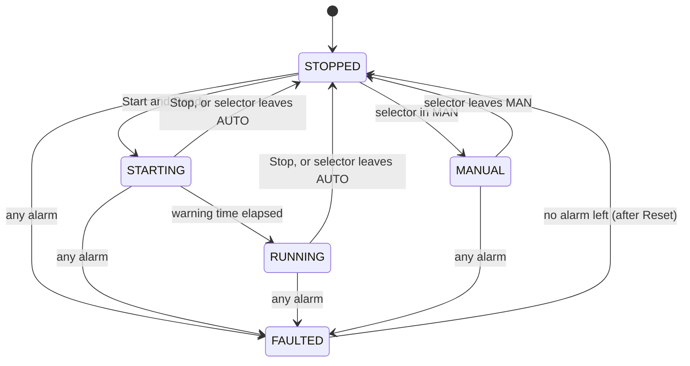
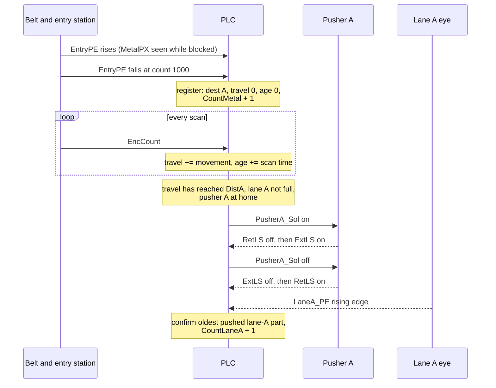
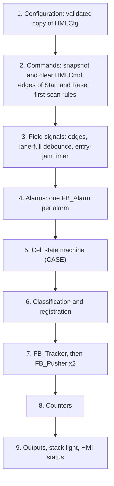
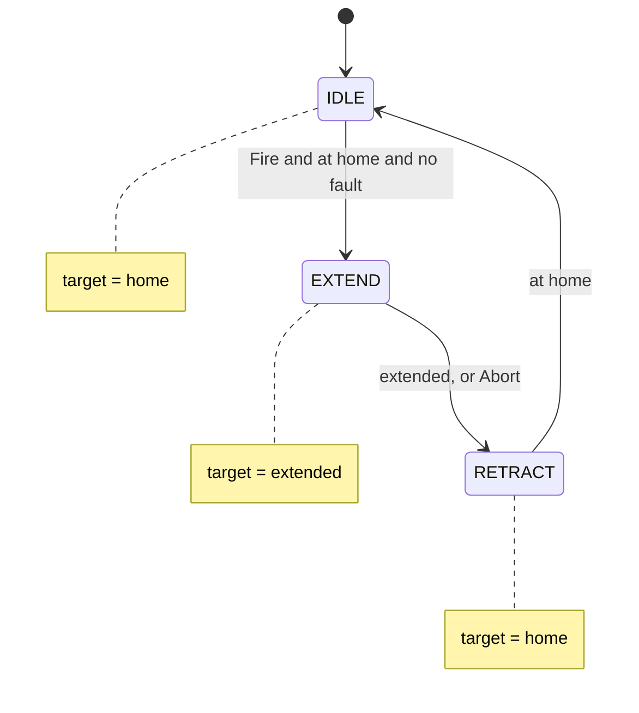

# 24-1 — Capstone: Conveyor Sorting Cell

> **Level:** Capstone · **Time:** ~25–35 hours · **Prerequisites:** Levels 1–4 (Modules 01–19),
> especially [06 Edges](../06-edges-and-one-shots/), [07 Timers](../07-timers/),
> [09 Maths and data handling](../09-math-and-data-handling/),
> [11 Program organisation](../11-program-organization/),
> [12 Data structures](../12-data-structures/), [13 Sequential control](../13-sequential-control/),
> [16 Alarms and diagnostics](../16-alarms-and-diagnostics/),
> [18 HMI and SCADA](../18-hmi-and-scada/) and [19 Motion and drives](../19-motion-and-drives/)

A drum reconditioning plant cleans used steel drums and sends them back to its customers. The
closures that come out of the drums (the screw-in bungs) go through their own washer and then
drop, one at a time, onto a short belt conveyor. Some bungs are steel, some are plastic. They
must be sorted: steel bungs to one packing station, plastic bungs to another. Now and then two
bungs come out of the washer stuck together, or one arrives standing on its edge. Those must
not reach either packing station. They go to a reject bin for someone to sort out by hand.

Today an operator does the sorting by hand. Your job is to write the control program for the
automatic sorting cell that takes over that job: a belt conveyor, a classification station, two
pneumatic pushers, two outfeed lanes, a reject bin, a stack light, a warning horn and a small
HMI. It is a *discrete manufacturing* problem, the kind found on packaging lines, in
warehouses and in machine building, and it pulls together most of what you have learned: edges,
timers, counters, 16-bit arithmetic, arrays of structures, reusable function blocks, a state
machine, alarm handling, an HMI interface and the safety thinking around all of them.

This brief is the only document you need. It is written the way a real functional
specification is written, with numbered requirements (FS-01 to FS-35) that the factory
acceptance test (FAT) checks. Read it once from end to end before you write any code.

## What you will demonstrate

By the end of this project you will be able to:

- Turn a written functional specification into a structured, testable IEC 61131-3 program.
- Track discrete parts along a conveyor with an encoder and a table of part records, including
  16-bit counter wrap-around, and act on each part at the right position.
- Write a reusable pneumatic actuator block with extend/retract supervision, and explain its
  fault and reset rules.
- Build a cell state machine with Auto, Manual and Off modes, a start-up warning, normal stops
  and fault stops, and make every stop and restart behave predictably.
- Detect jams by *time* while tracking parts by *position*, and explain why the two
  measurements check each other.
- Build an alarm system with latching and non-latching alarms, acknowledgement and reset
  rules, and a stack light that follows the usual conventions.
- Define an HMI interface as command, status, alarm and configuration structures, with the
  PLC-clears command handshake from Module 18.
- Prove the program against a 40-scenario FAT and explain how your design behaves when
  things fail.

## 1. The cell

### 1.1 Layout

```text
 PLAN VIEW: the belt runs left to right at 0.5 m/s. Each pusher shoves a part across the
 belt into the lane on the far side.

                                LANE A (steel)      LANE B (plastic)
                               | LaneA_FullPE |    | LaneB_FullPE |
                               | LaneA_PE     |    | LaneB_PE     |
                               +-------^------+    +-------^------+
            +--------------------------|-------------------|--------------------+
from        | [bung]=>                 |                   |                    |=> end of belt
washer =>   |      :EntryPE            |                   |                    |     |
            |      :MetalPX            |                   |                    |     v RejectPE
            |      :TallPE             |                   |                    |   REJECT BIN
            +--------------------------|-------------------|--------------------+
                                  [PUSHER A]          [PUSHER B]
                                Sol ExtLS RetLS     Sol ExtLS RetLS
                   |<---- 500 mm ----->|
                   |<-------------- 1000 mm -------------->|
                   |<------------------------ 1500 mm ------------------------->|

 A measuring wheel riding on the belt turns the encoder -> high-speed counter -> EncCount
```

A part rides along the belt past the **entry station**. There, a photo-eye (`EntryPE`) sees
the part, an inductive proximity sensor (`MetalPX`) says whether it is metal, and a second
photo-eye mounted above the normal part height (`TallPE`) sees anything too tall. The PLC
decides where the part must go and remembers it.

Downstream are two **gates**. At each one a pneumatic cylinder (a *pusher*) can shove the
part sideways off the belt into a chute that leads to a packing station (a *lane*). A part
that is not pushed at either gate runs off the end of the belt into the **reject bin**.

Every exit has a photo-eye that sees parts arriving (`LaneA_PE`, `LaneB_PE`, `RejectPE`),
and each lane has a second eye further down the chute that is blocked for good when the lane
has backed up (`LaneA_FullPE`, `LaneB_FullPE`).

The PLC knows where each part is from a **measuring wheel** that rides on the belt and turns
an incremental encoder. The encoder gives one pulse per millimetre of belt travel. At 0.5 m/s
that is 500 pulses a second, one every 2 ms, which is far too fast for an ordinary input read
once per 10 ms scan (Module 19). The pulses go to a **high-speed counter** (HSC) that counts
in hardware. The program only reads the counter's value, `EncCount`, a 16-bit unsigned number
that counts up to 65 535 and then wraps to 0. At 0.5 m/s it wraps about every 131 s.

### 1.2 Equipment

| Item | Description |
|---|---|
| Belt conveyor | 1.5 m from the entry eye to the end of the belt. Fixed speed, 0.5 m/s. Driven by a small three-phase motor started direct-on-line by contactor, with a thermal overload relay whose NC auxiliary contact goes to the PLC |
| Measuring wheel and encoder | On the belt's return side. 1 pulse = 1 mm of belt travel. Wired to a high-speed counter channel. The belt only runs forwards |
| Entry station | Through-beam photo-eye `EntryPE`, inductive sensor `MetalPX` (set up to detect the weakest metal it must see: inductive sensors detect aluminium and brass at a shorter distance than steel), and a high-mounted photo-eye `TallPE` |
| Pushers A and B | Pneumatic cylinders, each with a single-solenoid, spring-return 5/2 valve (energise = extend, de-energise = the spring returns the valve and the cylinder retracts) and two magnetic reed switches on the cylinder body: extended and retracted |
| Lanes A and B | Gravity chutes to the packing stations, each with a delivery eye near the top and a lane-full eye further down |
| Reject bin | Under the end of the belt, with a reject chute eye |
| Operator panel | Start (green), Stop (red, NC), Reset (blue), Jog (black), a three-position MAN–OFF–AUTO selector, and an emergency stop |
| Stack light and horn | Green, amber and red lamps and a horn on top of the cell |
| HMI | A small touch panel on the cell frame, in sight of the whole conveyor |

**Parts.** Bungs up to 120 mm long along the belt (the tests use 100 mm). The washer releases
them with a gap of at least 300 mm between one part and the next (0.6 s at 0.5 m/s), so a
pusher, whose stroke takes about 0.2 s, is always home again before the next part reaches it.

### 1.3 How a part travels: a worked example

Take one steel bung and follow the numbers.

1. The belt runs. The bung's leading edge breaks the entry beam at `EncCount` = 900. While it
   is in the beam, `MetalPX` is TRUE and `TallPE` stays FALSE.
2. At `EncCount` = 1000 the trailing edge clears the beam. The PLC **registers** the part: it
   takes a free record in its tracking table and writes *destination lane A, travel 0 mm, age
   0 s*. `CountMetal` goes up by one.
3. Every scan, the PLC reads `EncCount`, works out how far the belt moved since the previous
   scan (about 5 mm at 0.5 m/s and 10 ms) and adds that to every record's travel. It also adds
   the scan time to every record's age while the belt runs.
4. When the record's travel reaches `DistA` = 500 mm (at `EncCount` = 1500), the part is in
   front of pusher A. Lane A is not full and the pusher is at home, so the PLC energises
   `PusherA_Sol`. The cylinder leaves its retracted switch, reaches its extended switch about
   0.1 s later, and the PLC releases the solenoid. The spring pulls it home.
5. The bung slides down chute A past `LaneA_PE`. That edge **confirms** the delivery: the PLC
   removes the record from the table and `CountLaneA` goes up by one. The part's age was about
   1.3 s, well inside the 3 s allowed for lane A.

A plastic bung does the same, but pusher A leaves it alone and pusher B acts at 1000 mm. A tall
part passes both gates and drops into the reject bin, where `RejectPE` confirms it.

Now the same steel bung later in the day, when the counter is near the top of its range. It
registers at `EncCount` = 65 300. It must be pushed at 65 300 + 500 = 65 800, but a 16-bit
counter cannot show 65 800: after 65 535 it wraps to 0, so the push must happen at
65 800 − 65 536 = **264**. A program that compares raw counts (`EncCount >= RegCount + 500`)
fails here. A program that adds up *movement per scan* and folds the difference back into
range does not care about the wrap:

| Scan | `EncCount` | Raw difference | Folded movement | Travel |
|---|---|---|---|---|
| n | 65 530 | — | — | 230 mm |
| n+1 | 65 535 | 5 | 5 | 235 mm |
| n+2 | 4 | 4 − 65 535 = −65 531 | −65 531 + 65 536 = 5 | 240 mm |
| n+3 | 9 | 5 | 5 | 245 mm |

Section 8.3 shows the few lines of code that do the folding.

### 1.4 Position for acting, time for checking

The cell uses two independent measurements on purpose:

- **Position (encoder)** decides *where* to act. A pusher must fire when the part is in front
  of it, whatever the belt speed was on the way.
- **Time (belt running time)** decides *whether something has gone wrong*. Each part must
  reach its exit within a fixed running time after registration: 3 s for lane A, 4 s for
  lane B and 5 s for the reject bin. At 0.5 m/s the real journeys take about 1.3 s, 2.3 s and
  3.1 s, so each limit leaves 1.7 to 1.9 s of margin.

Why not use the encoder for both? Consider two faults. A bung jams against the side guide
and the belt slides underneath it: the encoder keeps counting, the pusher fires at empty
belt, and the part never arrives. Or the belt slips on its drive drum and stops while the
motor turns: the measuring wheel stops too, so tracking freezes and no pusher ever fires. A
check based only on position would miss the second fault. The time check catches both,
because in both cases a part is late. This is the same idea as the feedback timeout in
Module 07: the command says one thing, and an independent measurement confirms it.

"Running time" means time with the conveyor motor on. A part that waits on a stopped belt
for ten minutes during a break has not become late.

## 2. Scope

**In scope (you write it):**

- Modes (Auto, Manual, Off) and the cell state machine: start-up warning, normal stop, fault
  stop, restart rules.
- Classification, part tracking, pusher control and supervision, lane-full handling,
  delivery confirmation and counting.
- Jam detection, the alarm system (acknowledge and reset), the stack light and horn.
- The HMI interface: commands, status, alarms and configuration, all in the structure `HMI`.

**Given (in the starter file, do not change):** the I/O declarations, the HMI structure types
and their defaults, and the configuration (`Config0`, `Res0`, `MainTask` at 10 ms, `Inst0`).

**Out of scope:**

- The safety functions. The emergency stop in this project is read as an ordinary input so
  that your program can react to it. On a real machine the emergency stop is a safety function
  designed under ISO 13850 and ISO 13849-1 (or IEC 62061): a safety relay or safety PLC removes
  power from the motor contactor and dumps or blocks the air to the pushers directly, and the
  standard PLC only *monitors* what happened (Module 20). The same applies to guards and any
  other protective device. Nothing in this project is a design for a real safety function.
- The HMI screens themselves (section 4 gives the data they would use), the washer upstream,
  and the packing stations downstream.

## 3. I/O list

The addresses follow the OpenPLC convention used throughout the course. Keep every name
exactly as written: the FAT uses them.

**Digital inputs**

| Tag | Address | Device | TRUE means | Notes |
|---|---|---|---|---|
| `StartPB` | `%IX0.0` | Start push-button, NO | pressed | Acts on the press (rising edge) |
| `StopPB_NC` | `%IX0.1` | Stop push-button, **NC** | *not* pressed | A broken wire reads as Stop |
| `EStop_NC` | `%IX0.2` | E-stop circuit monitoring contact, **NC** | healthy (released) | Monitoring only, see section 2 |
| `ResetPB` | `%IX0.3` | Reset push-button, NO | pressed | Acts on the press |
| `ModeAuto` | `%IX0.4` | Selector contact | selector in AUTO | |
| `ModeManual` | `%IX0.5` | Selector contact | selector in MAN | Neither = OFF. Both = wiring fault, treated as OFF |
| `JogPB` | `%IX0.6` | Jog push-button, NO | pressed | Hold-to-run in Manual |
| `MotorOL_NC` | `%IX0.7` | Overload relay auxiliary, **NC** | healthy | FALSE = tripped (or broken wire) |
| `EntryPE` | `%IX1.0` | Entry photo-eye | beam blocked by a part | |
| `MetalPX` | `%IX1.1` | Inductive sensor at the entry | metal in front of it | |
| `TallPE` | `%IX1.2` | High-mounted photo-eye at the entry | part too tall | |
| `LaneA_PE` | `%IX1.3` | Lane A delivery eye | part passing | |
| `LaneB_PE` | `%IX1.4` | Lane B delivery eye | part passing | |
| `RejectPE` | `%IX1.5` | Reject chute eye | part falling past | |
| `LaneA_FullPE` | `%IX1.6` | Lane A full eye | blocked | Parts sliding past also block it briefly |
| `LaneB_FullPE` | `%IX1.7` | Lane B full eye | blocked | |
| `PusherA_ExtLS` | `%IX2.0` | Pusher A extended reed switch | at the extended end | |
| `PusherA_RetLS` | `%IX2.1` | Pusher A retracted reed switch | at home | |
| `PusherB_ExtLS` | `%IX2.2` | Pusher B extended reed switch | at the extended end | |
| `PusherB_RetLS` | `%IX2.3` | Pusher B retracted reed switch | at home | |

**Word input**

| Tag | Address | Type | Description |
|---|---|---|---|
| `EncCount` | `%IW0` | UINT | High-speed counter value. 1 count = 1 mm of belt travel. Counts up only, 0..65 535, then wraps to 0 |

**Digital outputs**

| Tag | Address | Device | TRUE means |
|---|---|---|---|
| `ConveyorRun` | `%QX0.0` | Conveyor motor contactor | motor on |
| `PusherA_Sol` | `%QX0.1` | Pusher A solenoid valve | extend |
| `PusherB_Sol` | `%QX0.2` | Pusher B solenoid valve | extend |
| `Horn` | `%QX0.3` | Start-up warning horn | sounding |
| `GreenLamp` | `%QX0.4` | Stack light, green | running in Auto |
| `AmberLamp` | `%QX0.5` | Stack light, amber | a lane is full |
| `RedLamp` | `%QX0.6` | Stack light, red | alarm (flashing = unacknowledged) |

A note on sensor sense: the Stop, e-stop and overload inputs are normally-closed so that a
broken wire has the same effect as the device operating (Module 02). The photo-eyes are
"dark-operate" (TRUE when blocked) because that is what the sorting logic needs. On a real
machine you would also think about what a failed eye does. A lane-full eye that has failed
FALSE, for example, would let parts pile up in the chute. Extension 8 in section 12 picks this up.

## 4. HMI interface

The HMI reads and writes one structure, `HMI : ST_CellHmi`, declared in the program. It has
four parts, split by direction and by who writes them, exactly as in Module 18.

```text
HMI
 +-- Cmd : ST_CellCmd   HMI -> PLC   the HMI sets a bit; the PLC acts once and clears it
 +-- Sts : ST_CellSts   PLC -> HMI   rewritten by the PLC every scan
 +-- Alm : ST_CellAlm   PLC -> HMI   rewritten by the PLC every scan
 +-- Cfg : ST_CellCfg   HMI -> PLC   engineer settings, checked by the PLC before use
```

### 4.1 Commands: `HMI.Cmd`

| Member | Type | Meaning | Accepted when |
|---|---|---|---|
| `Start` | BOOL | Start the cell | `Sts.Ready` is TRUE |
| `Stop` | BOOL | Normal stop | Always |
| `Ack` | BOOL | Acknowledge all alarms | Always |
| `Reset` | BOOL | Acknowledge, and reset every alarm whose cause has gone | Always |
| `CyclePusherA` | BOOL | One supervised stroke of pusher A | State MANUAL and the belt stopped |
| `CyclePusherB` | BOOL | One supervised stroke of pusher B | State MANUAL and the belt stopped |
| `ClearCounts` | BOOL | Zero all six production counters | Always |

A command that is not accepted is simply cleared and forgotten. (Extension 1 adds reject codes
so that the operator can see *why*.)

### 4.2 Status: `HMI.Sts`

| Member | Type | Meaning |
|---|---|---|
| `State` | INT | Cell state: **1** STOPPED, **2** STARTING, **3** RUNNING, **4** FAULTED, **5** MANUAL |
| `Ready` | BOOL | TRUE when a Start would be accepted now (FS-04) |
| `LaneAFull`, `LaneBFull` | BOOL | Debounced lane-full status (FS-23) |
| `PartsInTransit` | INT | Registered parts not yet confirmed at an exit (FS-17) |
| `CountMetal`, `CountPlastic`, `CountOversize` | DINT | Parts *classified* at the entry station |
| `CountLaneA`, `CountLaneB`, `CountReject` | DINT | Parts *delivered*, counted by the exit eyes |

The two groups of counters answer different questions. The classification counters say what
came in; the delivery counters say where it went. On a healthy cell, after the belt has
emptied, `CountMetal + CountPlastic + CountOversize` equals
`CountLaneA + CountLaneB + CountReject`. When a lane is full the numbers per class and per exit
differ (steel bungs go to reject), but the totals still match. A mismatch in the totals means
parts were lost, added by hand, or jogged through in Manual (where nothing is registered), which
is exactly what a production supervisor wants to know.

### 4.3 Alarms: `HMI.Alm`

| Member | Raised when | Cause still present (reset refused) while |
|---|---|---|
| `EStop` | `EStop_NC` is FALSE | `EStop_NC` is FALSE |
| `MotorOverload` | `MotorOL_NC` is FALSE | `MotorOL_NC` is FALSE |
| `EntryJam` | `EntryPE` blocked for `EntryJamTime` while RUNNING (FS-25) | `EntryPE` is TRUE |
| `Jam` | A tracked part is overdue at its exit (FS-26) | — (reset always accepted) |
| `PusherA`, `PusherB` | Pusher supervision fault (FS-19) | The pusher is not at home |
| `TrackOverflow` | A part arrived and the tracking table was full (FS-16) | — |
| `Unacked` | *Summary:* at least one alarm is not yet acknowledged | |

Each alarm member is TRUE from the moment the alarm is raised until a *successful* reset.

### 4.4 Configuration: `HMI.Cfg`

| Member | Type | Default | Accepted range | Meaning |
|---|---|---|---|---|
| `StartWarnTime` | TIME | 3 s | 2–30 s | Horn time before the belt moves |
| `DistA` | INT | 500 | 100–3000 | mm from registration to pusher A |
| `DistB` | INT | 1000 | 100–3000 | mm from registration to pusher B |
| `JamTimeA` | TIME | 3 s | 1–60 s | Running time allowed from registration to `LaneA_PE` |
| `JamTimeB` | TIME | 4 s | 1–60 s | … to `LaneB_PE` |
| `JamTimeR` | TIME | 5 s | 1–60 s | … to `RejectPE` |
| `EntryJamTime` | TIME | 2 s | 0.5–30 s | Entry eye blocked while running |
| `PusherTimeout` | TIME | 1 s | 0.2–5 s | Each pusher movement must finish within this |
| `LaneFullTime` | TIME | 1 s | 0.2–10 s | Lane-full eye debounce, on and off |

The defaults are the commissioning values. `DistA` and `DistB` are the numbers a commissioning
engineer adjusts with a tape measure and a few test parts until every bung lands in the middle
of its chute.

### 4.5 What the HMI screens would show

You do not build the screens, but a design is easier to judge when you know how it will be
used. A high-performance (ISA-101 style, Module 18) overview for this cell would have: a
simple belt graphic in grey with the parts in transit as small markers, the cell state as text
("RUNNING"), the six counters, the two lane-full indications, the Start/Stop/Reset/Ack buttons
with Start greyed out when `Ready` is FALSE, and an alarm banner. A maintenance page, protected
by a user level, would hold the pusher test buttons and the configuration values.

## 5. Functional specification

The requirement numbers are used in the FAT scenario comments, in the reference solution and
in the rubric. Quote them in your own comments.

### 5.1 Power-up and commands

**FS-01 Power-up.** At power-up all outputs are off and the cell is STOPPED (or FAULTED if an
alarm condition is present). Nothing starts by itself: not a Start button that is already held
(or stuck) at power-up, and not an HMI command written before the restart. Restoring power must
never start the conveyor. That is a general principle of machinery safety, and ISO 14118
(prevention of unexpected start-up) deals with it.

**FS-02 HMI commands.** Each `HMI.Cmd` member is acted on at most once and is cleared by the
PLC in the scan in which it is seen, whether it is accepted or not. Commands found on the first
scan after power-up are discarded (cleared without action).

### 5.2 Modes and the cell state machine

**FS-03 Mode selector.** `ModeAuto` alone = Auto; `ModeManual` alone = Manual; neither, or
both, = Off.

The cell has five states:



A selector in OFF simply leaves the cell in STOPPED with `Ready` FALSE. After a fault is reset
with the selector in MAN, the cell passes through STOPPED to MANUAL.

**FS-04 Ready.** `HMI.Sts.Ready` is TRUE only when all of these hold: the state is STOPPED,
Auto is selected, no alarm is active, Stop is not pressed, and both pushers are at home and
idle (retracted switch made, extended switch not made, no stroke in progress).

**FS-05 Start.** A Start is the *press* of `StartPB` (its rising edge) or `HMI.Cmd.Start`. It
is accepted only while `Ready` is TRUE. A Start that is refused is forgotten: it does not wait
and act later when the cell becomes ready.

### 5.3 Starting and stopping

**FS-06 Start-up warning.** An accepted Start puts the cell in STARTING: the horn sounds for
`StartWarnTime` (default 3 s) with the belt stopped. Then the cell goes to RUNNING: the belt
starts and the horn stops. Every start in Auto gets the full warning. The warning is never
shorter than 2 s, whatever `Cfg.StartWarnTime` says.

**FS-07 Normal stop.** In STARTING or RUNNING, pressing Stop, `HMI.Cmd.Stop`, or moving the
selector out of AUTO puts the cell in STOPPED at once: belt and horn off. While Stop is held,
the cell cannot start (Stop wins over Start).

**FS-08 What a normal stop keeps.** A normal stop keeps the tracking data, so the parts on
the belt are sorted correctly after the restart. A pusher stroke already in progress is
completed (the part in front of the pusher still goes into its lane).

### 5.4 Manual mode

**FS-09 Manual and Jog.** With the selector in MAN and no alarm active, the state is MANUAL.
The belt runs only while `JogPB` is held, Stop is not pressed and both pushers are at home and
idle. There is no start-up warning for jogging: the button is hold-to-run and the panel is in
sight of the whole conveyor. (On a real machine the risk assessment decides whether this is
acceptable.) Start does nothing in Manual, and Jog does nothing outside Manual.

**FS-10 Manual pusher strokes.** In MANUAL with the belt stopped, `HMI.Cmd.CyclePusherA` (or
`B`) makes one stroke of that pusher, supervised exactly as in Auto. The command is refused
in every other state.

**FS-11 Tracking and Manual.** Entering MANUAL, and entering FAULTED, clears the tracking
data. Someone may be about to reach in and move parts, so the PLC no longer knows where they
are. Parts still on the belt are then not pushed and end up in the reject bin, which is the
safe outcome.

### 5.5 Classification and registration

**FS-12 Classification.** While `EntryPE` is blocked, the PLC remembers whether `MetalPX` or
`TallPE` was TRUE at *any* moment (the sensors are not exactly in line with the eye, so
sampling them at one instant is not good enough). Then:

| Seen while the part blocked the entry eye | Class | Destination |
|---|---|---|
| `TallPE` at any time | Oversize | Reject bin (even if it is metal) |
| `MetalPX` at any time, never `TallPE` | Metal | Lane A |
| neither | Plastic | Lane B |

**FS-13 Registration.** When `EntryPE` clears (its falling edge) while the cell is RUNNING,
the part is registered: its class counter goes up by one and a tracking record is created at
travel 0 mm and age 0 s. Nothing is registered in any other state.

### 5.6 Tracking and diverting

**FS-14 Tracking.** Every tracked part's travel follows the belt movement measured by
`EncCount` (1 count = 1 mm), including when the count wraps from 65 535 to 0.

**FS-15 Gate decisions.** When a part bound for lane A has travelled `DistA` or further (the
count may jump past the exact value between two scans), the PLC decides once:

- if lane A is not full and pusher A is at home, idle and healthy, pusher A makes one stroke;
- otherwise the part stays on the belt and its destination becomes the reject bin.

The same applies to lane B at `DistB`. A pusher never acts for a part bound for another exit.
The decision uses the lane status *at the gate*, not at registration: a lane that fills up
while the part is on its way still counts.

**FS-16 Capacity.** The tracking table holds at least 10 parts. If a part must be registered
and there is no free record, the `TrackOverflow` alarm is raised.

**FS-17 Parts in transit.** `HMI.Sts.PartsInTransit` is the number of tracked parts that have
not yet been confirmed at an exit.

### 5.7 Pushers

**FS-18 Stroke.** A stroke energises the solenoid until the pusher is *extended* (extended
switch made **and** retracted switch not made), then releases it so that the spring retracts
the cylinder. The pusher is *at home* when the retracted switch is made and the extended switch
is not. A position with both switches made, or neither for too long, is a fault.

**FS-19 Supervision.** Each pusher raises its alarm (`PusherA` / `PusherB`) if:

- it has not reached *extended* within `PusherTimeout` (1 s) of the solenoid being energised;
- it has not reached *home* within `PusherTimeout` of the solenoid being released;
- it is idle and not at home for longer than `PusherTimeout` (it has left home without a
  command, for example because of a sticking valve or a stuck switch).

On a pusher fault its solenoid is released at once.

**FS-20 Pusher reset.** A pusher fault can only be reset while that pusher is at home.

A normal stroke looks like this:

```text
                   fire                      extended              home
PusherA_Sol    ____|-------------------------|_______________________________
PusherA_RetLS  ------|_____________________________________________|---------
PusherA_ExtLS  ______________________________|--|____________________________
                   |<---- PusherTimeout ---->|<-- PusherTimeout -->|
                      (at most, to extended)    (at most, to home)
```

### 5.8 Lanes, deliveries and counters

**FS-21 Delivery counting.** `CountLaneA`, `CountLaneB` and `CountReject` count the rising
edges of `LaneA_PE`, `LaneB_PE` and `RejectPE`: every part that arrives, tracked or not, in
every state.

**FS-22 Delivery confirmation.** Each such edge also confirms the *oldest* tracked part bound
for that exit, which is then removed from the table. A lane eye can only confirm a part whose
pusher has fired, because nothing else can arrive in a lane. An edge with no matching part
confirms nothing (it is still counted).

**FS-23 Lane full.** A lane is *full* when its full eye has been blocked continuously for
`LaneFullTime` (1 s), and *not full* again when the eye has been clear continuously for
`LaneFullTime`. The debounce ignores parts sliding past the eye. `HMI.Sts.LaneAFull` /
`LaneBFull` show the debounced status. The amber lamp is on while either lane is full. A full
lane is a warning, not a fault: the cell keeps running and sends that lane's parts to the
reject bin (FS-15).

**FS-24 Clearing counters.** `HMI.Cmd.ClearCounts` sets all six counters to zero. It does
not touch the tracking data.

### 5.9 Jam detection

**FS-25 Entry jam.** If `EntryPE` stays blocked for `EntryJamTime` (2 s) while the cell is
RUNNING, the `EntryJam` alarm is raised. (A 100 mm bung blocks the eye for 0.2 s at 0.5 m/s.)
A part sitting in the eye while the belt is stopped is not a jam. The alarm cannot be reset
while the eye is still blocked: someone must remove the part first.

**FS-26 Delivery jam.** If a tracked part has not been confirmed at its exit within
`JamTimeA`, `JamTimeB` or `JamTimeR` (3 s, 4 s, 5 s) of **conveyor running time** since its
registration, the `Jam` alarm is raised. Only time with the conveyor motor on counts. Time
stopped, time in STARTING and time in FAULTED do not count. The limit that applies is the one
for the part's destination *at that moment* (a steel bung sent to reject because lane A was
full gets the reject time).

### 5.10 Faults, alarms, acknowledgement and reset

**FS-27 Alarms.** The alarms are listed in section 4.3. Each is TRUE from detection until a
successful reset.

**FS-28 Fault stop.** Any active alarm puts the cell in FAULTED from any state at once (the FAT
allows 30 ms): belt, horn and both solenoids off, and the tracking data cleared (FS-11).

**FS-29 Acknowledge.** `HMI.Cmd.Ack` acknowledges all alarms. Acknowledging does not reset
anything. `HMI.Alm.Unacked` is TRUE while any alarm is unacknowledged. A new alarm is
unacknowledged even if older alarms have already been acknowledged.

**FS-30 Reset.** A Reset is the *press* of `ResetPB` (rising edge) or `HMI.Cmd.Reset`. It
acknowledges all alarms and clears every alarm whose cause has gone (section 4.3). An alarm
whose cause is still present stays active. A Reset button that is held down (or stuck) does
not keep resetting: an alarm raised while it is held needs a new press.

**FS-31 After a reset.** When no alarm remains, FAULTED changes to STOPPED (and then MANUAL if
the selector is in MAN). A reset never starts the belt. A new Start is needed, with the full
warning, and a Start pressed or commanded while the cell was faulted is not remembered.

### 5.11 Stack light and horn

**FS-32 Signals.**

| Output | On when |
|---|---|
| `GreenLamp` | State is RUNNING |
| `AmberLamp` | A lane is full |
| `RedLamp` | Flashing (about 1 Hz) while any alarm is unacknowledged; steady while alarms are active and all acknowledged; off when no alarm is active |
| `Horn` | State is STARTING |

### 5.12 HMI data

**FS-33 Single writer.** Every member of `HMI.Sts` and `HMI.Alm` is written by the PLC every
scan from its own internal state. A value written into them from outside is overwritten on the
next scan and changes nothing.

**FS-34 State codes.** `HMI.Sts.State` uses the codes in section 4.2.

**FS-35 Configuration.** The PLC never uses a `HMI.Cfg` value outside its accepted range
(section 4.4). A value outside the range is clamped to the nearest limit. The FAT checks this
for `StartWarnTime`, because a warning of 0 s would remove a protective measure with one typo.

## 6. Sequence descriptions

A functional specification is easier to review when the main situations are also written as
stories. These are the ones an operator, a maintenance technician and a commissioning engineer
will recognise.

### 6.1 Morning start-up

The operator turns the selector to AUTO. `Ready` comes on (the Start button on the HMI is no
longer greyed out). The operator presses Start. The horn sounds for 3 s. Anyone near the
conveyor hears it and steps back. The horn stops and the belt starts at the same moment, and
the green lamp comes on. The washer starts releasing bungs.

### 6.2 A part's journey



### 6.3 Normal stop and restart

At break time the operator presses Stop. The belt stops at once; a stroke already in progress
finishes. The parts on the belt stay where they are, and so does the PLC's record of them.
After the break the operator presses Start: 3 s of horn, then the belt runs and each part is
pushed at the right place. The ten minutes of the break do not count towards any part's jam
time.

### 6.4 A lane backs up

The packing station for steel bungs stops for a label change. Chute A fills up to its full
eye. One second later the amber lamp comes on and the HMI shows "Lane A full". Steel bungs now
pass pusher A and drop into the reject bin. The cell does not stop, because stopping would
back up the washer as well. When the packer takes bungs again and the full eye has been clear
for a second, the amber lamp goes out and steel bungs go to lane A again. At the end of the
shift the supervisor can see how many steel bungs went to reject (`CountMetal` minus
`CountLaneA`, once the belt is empty).

### 6.5 Jam and recovery

A bung wedges against the side guide just after the entry station. The belt slides under it.
Pusher A fires at empty belt when the tracking says the part should be there. Three seconds
after registration there is still no delivery confirmation: `Jam` is raised, the belt stops,
the red lamp flashes and the tracking is forgotten. The operator acknowledges on the HMI (the
red lamp goes steady), makes the conveyor safe to work on according to site procedure
(isolation and lock-out), frees the bung, and presses Reset. The cell is STOPPED, not running.
The operator presses Start, the horn sounds, and the belt starts. Any bungs that were on the
belt now go to the reject bin, because the PLC no longer knows what they are.

### 6.6 Pusher failure

Pusher B's valve sticks. After a stroke the cylinder does not come home within 1 s:
`PusherB` is raised and the cell stops. Maintenance frees the valve and the spring pulls the
cylinder home. Only then does Reset clear the alarm. Before restarting in Auto, the technician
turns the selector to MAN and uses the HMI's "Cycle pusher B" button a few times to check that
the pusher now strokes cleanly.

### 6.7 Emergency stop

Someone hits the emergency stop. The safety circuit removes power from the motor and the
valves; the PLC sees `EStop_NC` go FALSE, raises `EStop`, switches every output off and
forgets the tracking. Releasing the e-stop does not clear the alarm or start anything. After
the area is checked, the operator presses Reset and then Start. The horn sounds and the belt
restarts. Parts left on the belt run to the reject bin.

### 6.8 Shift change

The outgoing shift reads the six counters from the HMI (or the SCADA system logs them), then
presses Clear counts. Parts on the belt keep their tracking.

## 7. Timing assumptions (what the FAT relies on)

Your program must work with any scan time a real PLC might have, but the FAT is written
around these numbers. If you change a default in `ST_CellCfg`, the FAT will fail.

| Quantity | Value in the FAT | Why it matters |
|---|---|---|
| Task interval | 10 ms | `plctest` runs one scan per 10 ms of simulated time |
| Belt speed | 500 mm/s: `EncCount` rises 100 counts every 200 ms while the belt runs | Parts reach gate A about 1.0 s, gate B 2.0 s and the reject bin about 3.1 s after registration |
| Registration point | The count at which `EntryPE` falls. The FAT holds the count still for a scan either side of that edge | So "travel 500 mm" means the same thing in every design |
| Part length | 100 mm (the eye is blocked while the belt moves 100 mm) | |
| Classification sensors | TRUE from the moment the part blocks `EntryPE` until one scan after it clears it, except in one scenario where `MetalPX` is TRUE only for a moment in the middle | FS-12 |
| Gate positions | Registration count + 500 (A) and + 1000 (B). Some scenarios move the count exactly onto the gate, others jump 7 mm past it in one scan | FS-15 |
| Pusher stroke | Retracted switch opens as soon as the solenoid is on; extended switch made 100 ms later; after release, extended switch opens at once and retracted switch made 100 ms later. One scenario extends slowly (0.6 s), one has a stuck retracted switch | FS-18, FS-19 |
| Delivery | The lane eye is blocked for 100 ms, starting 100 ms after the pusher is home. The reject eye is blocked for 100 ms at about count registration + 1550. One scenario has a sticky chute: two lane A parts reach the eye about 1.5 to 2.5 s late, with `JamTimeA` raised to 5 s | FS-21, FS-22 |
| Part spacing | 400 mm between registrations in the production scenario | Up to three parts on the belt at once |
| While a pusher strokes | The FAT usually holds the belt count still for about 0.4 s (the stroke and the delivery). With the default jam times, the tightest part in the FAT (a reject part in the production run) is delivered at about 4.3 s of its 5 s | FS-26 |
| Belt slip | One scenario freezes `EncCount` while `ConveyorRun` is on | FS-26 |
| Configuration | The defaults of `ST_CellCfg`, except in the scenarios that set `HMI.Cfg` values to prove your program uses them | FS-35 |

## 8. Suggested architecture

You may structure the program any way you like, as long as the interface is kept. This
section describes a structure that works well and that a reviewer would expect. The reference
solution follows it.

### 8.1 Layers and scan order



Three principles from Module 11 do most of the work:

- **One writer for every output.** `ConveyorRun` is written in exactly one line, from the
  state; the solenoids are written from the pusher FBs, and nowhere else.
- **Alarms before the state machine, outputs after it.** An e-stop seen at the top of the scan
  has already changed the state before the outputs are written, so everything stops in the
  same scan.
- **Device logic in FBs, cell logic in the program.** The two pushers are two instances of one
  block, not two copies of the same code.

### 8.2 FB_Pusher

| Pin | Direction | Type | Meaning |
|---|---|---|---|
| `Fire` | in | BOOL | One-shot: make one stroke (ignored unless available) |
| `Abort` | in | BOOL | Level: release the solenoid at once (fault stop) |
| `ExtLS`, `RetLS` | in | BOOL | Reed switches |
| `Reset` | in | BOOL | One-shot fault reset (accepted only at home) |
| `Timeout` | in | TIME | `Cfg.PusherTimeout` |
| `Sol` | out | BOOL | Solenoid |
| `Available` | out | BOOL | Idle, at home, healthy: a `Fire` now would be accepted |
| `Fault` | out | BOOL | Latched supervision fault |

Inside, a three-step state machine and **one** supervision timer that is restarted on every
step change:



In every step the timer runs while the pusher is *not* at that step's target. If it reaches
`Timeout`, the block latches `Fault`. One timer and one rule cover all three faults in FS-19.
Module 11's `FB_Valve` used the same idea.

### 8.3 FB_Tracker and the part table

The part record and the table (MATIEC cannot build arrays of FB instances, but arrays of
structures are fine):

| Member of `ST_TrackedPart` | Type | Meaning |
|---|---|---|
| `Active` | BOOL | The slot holds a part |
| `Dest` | enum | Lane A, lane B or reject; changes to reject if the gate is not free |
| `Travel` | DINT | mm travelled since registration |
| `Age` | TIME | Conveyor running time since registration |
| `Pushed` | BOOL | Its pusher has fired |

The block is called once per scan with the encoder count, "belt running", "clear", "register
now + destination", "gate A free", "gate B free" and the three delivery edges. It returns
`FireA`, `FireB`, `Jam`, `Overflow` and `InTransit`. Each scan it does five things, in this order:

1. **Movement.** Work out the belt movement since the previous scan and add it to every
   record's `Travel`. If the belt runs, add the scan time to every `Age`.
2. **Deliveries.** For each delivery edge, remove the oldest matching record (the one with the
   largest `Travel`).
3. **Gates.** For each record bound for a lane that has reached its gate and has not been
   pushed: fire the pusher, or change the destination to reject.
4. **Jams.** Set `Jam` if any record is older than the limit for its destination.
5. **Registration.** Put a new part into the first free slot, at travel 0.

The movement is the only part that needs care. The counter is a 16-bit unsigned number, so
convert both values to `DINT`, subtract, and fold the result back into the range −32 768 to
32 767. The belt moves about 5 mm per scan, far inside that range, so the folded value is
always the true movement, whatever happened at the wrap:

```iecst
Delta := UINT_TO_DINT(EncCount) - UINT_TO_DINT(LastCount);
IF Delta < -32768 THEN
  Delta := Delta + 65536;        (* wrapped forwards: 65 535 -> 0 (this cell)       *)
ELSIF Delta > 32767 THEN
  Delta := Delta - 65536;        (* wrapped backwards: 0 -> 65 535 (a count-down)   *)
END_IF;
LastCount := EncCount;
```

Check it against the table in section 1.3: 65 535 → 4 gives a raw difference of −65 531, which
is below −32 768, so the first branch adds 65 536 and the movement is 5 mm.

(On the first call, set `LastCount := EncCount` so that the counter's power-up value does not
look like a huge movement.)

For the running time, the trick from the run-hours lab in Module 07 works: a free-running
`TON` used as a stopwatch, and the growth of its `ET` since the previous scan:

```iecst
Stopwatch(IN := NOT Stopwatch.Q, PT := T#1h);    (* free-running, restarts once an hour *)
IF Stopwatch.ET > LastET THEN
  ScanTime := Stopwatch.ET - LastET;
ELSE
  ScanTime := T#0s;                              (* the hourly restart *)
END_IF;
LastET := Stopwatch.ET;
IF BeltRunning THEN
  Age := Age + ScanTime;                         (* for every tracked part *)
END_IF;
```

The hourly restart costs two scans: on the scan after `Q`, `IN` is FALSE and `ET` drops to
0, and on the next scan the timer starts again from 0. That is about 20 ms of running time an
hour, which is nothing next to a 3 s jam time (Module 07, section 5.6, traces the same
two-scan loss). Older code writes `SUB_TIME(a, b)` and `ADD_TIME(a, b)` instead of the infix
operators; both forms work here.

**Alternatives.** Other good designs exist, and the FAT accepts them. You could store the
count *at registration* in each record and compute the travel as a modular difference each
scan. You could keep one global "belt running clock" and store the clock value at
registration instead of an age per part. Or, closest to what many Rockwell programmers
would do, you could use a *bit shift register* with one bit per 10 mm of belt, shifted by the
encoder (Module 09). Each has trade-offs in memory, precision and how easily it handles
parts that change destination. Write down why you chose yours.

### 8.4 FB_Alarm

One small block per alarm keeps the reset rules in one place:

| Pin | Direction | Meaning |
|---|---|---|
| `Condition` | in | The abnormal condition |
| `Latching` | in | TRUE: stays active until reset. FALSE: follows `Condition` |
| `Hold` | in | TRUE while the cause is still present: a reset is refused |
| `Ack`, `Reset` | in | One-shots. Reset also acknowledges |
| `Active`, `Unacked` | out | Alarm state and acknowledgement state (ISA-18.2 keeps these separate) |

Most alarms latch in the block. The pusher alarms are different: `FB_Pusher` already latches
its own fault (and refuses a reset until the pusher is at home), so their `FB_Alarm` instances
are *non-latching* and simply mirror `PusherA.Fault`. Latching the same fault in two places is
a classic source of "I pressed Reset twice and it cleared" bugs.

### 8.5 The cell state machine

An enumeration for the internal state, a `CASE` for the transitions, and an `INT` copy for
the HMI (MATIEC does not accept named constants as `CASE` labels, but enumeration values are
fine). The skeleton, with the tracking-clear rule of FS-11 written where the transitions
happen:

```iecst
ClearTracking := FALSE;
CASE State OF
  CS_STOPPED:
    IF AnyAlarm THEN
      State := CS_FAULTED;
      ClearTracking := TRUE;
    ELSIF StartReq AND Ready THEN
      State := CS_STARTING;
    END_IF;
  CS_STARTING:
    IF AnyAlarm THEN
      State := CS_FAULTED;
      ClearTracking := TRUE;
    ELSIF StopReq OR NOT AutoSel THEN
      State := CS_STOPPED;
    ELSIF WarnTmr.Q THEN
      State := CS_RUNNING;
    END_IF;
  CS_RUNNING:
    IF AnyAlarm THEN
      State := CS_FAULTED;
      ClearTracking := TRUE;
    ELSIF StopReq OR NOT AutoSel THEN
      State := CS_STOPPED;
    END_IF;
  CS_FAULTED:
    IF NOT AnyAlarm THEN
      State := CS_STOPPED;
    END_IF;
  CS_MANUAL:
    IF AnyAlarm THEN
      State := CS_FAULTED;
      ClearTracking := TRUE;
    END_IF;
END_CASE;
WarnTmr(IN := State = CS_STARTING, PT := T#3s);
```

The skeleton leaves out the STOPPED ↔ MANUAL transitions and uses a fixed warning time.
Completing it is part of M1 and M2. Note the order in each state: the fault test comes first,
so a fault always wins.

### 8.6 Small things that save hours

- **Commands:** snapshot and clear in two adjacent lines (`Cmd := HMI.Cmd; HMI.Cmd := NoCmd;`
  where `NoCmd` is an all-FALSE `ST_CellCmd`), then use only `Cmd` for the rest of the scan.
- **First scan:** a `BOOL` that is FALSE only on the first scan lets you discard stale
  commands and ignore buttons that were already held (FS-01, FS-02).
- **Classification memory:** `IF EntryPE THEN SawMetal := SawMetal OR MetalPX; ... END_IF;`
  and clear the memories on the falling edge after using them.
- **Falling edges at power-up:** `F_TRIG` can give a pulse on its very first call when its
  input is FALSE. The standard's reference implementation does, and so does the MATIEC
  library that `plctest` uses (`Q := NOT CLK AND NOT M`, with `M` starting FALSE); other
  implementations may not. Gating registration with "state is RUNNING" makes it harmless
  either way. Never let a first-scan edge trigger anything that matters
  ([Appendix E](../appendices/E-matiec-openplc-notes.md), section E.3).
- **Names MATIEC rejects:** `Step` (a keyword of the SFC language), `Dt` (the `DT` data type)
  and `Limit` (the `LIMIT` function) all look like good variable names and all fail with
  confusing errors. So does any variable named after a function or FB (`Max`, `Ton` …), and
  any POU you name after a variable or parameter, including the standard library's (`P`, `Q`,
  `IN` …). [Appendix E](../appendices/E-matiec-openplc-notes.md) (section E.4) explains why.

## 9. Milestones

Build the cell in this order. Each milestone matches the scenario names in the test file
(`M1 ...` to `M7 ...`), so you can watch the failures fall milestone by milestone.

| Milestone | Build | Requirements | FAT scenarios |
|---|---|---|---|
| **M1** | Command handling, first-scan rules, mode selector, cell state machine (STOPPED, STARTING, RUNNING), warning timer, green lamp, `Ready`, `HMI.Sts.State` | FS-01 to FS-07, FS-33 to FS-35 | 8 |
| **M2** | `FB_Pusher` with supervision; MANUAL state, jog, manual strokes; a first alarm path: pusher fault → FAULTED → reset | FS-09, FS-10, FS-18 to FS-20 | 6 |
| **M3** | Classification, registration, `FB_Tracker` for single parts, gate decisions, delivery confirmation, all six counters | FS-12 to FS-15, FS-17, FS-21, FS-22 | 4 |
| **M4** | Several parts at once, counter wrap-around, lane-full debounce and re-routing, amber lamp, gate distances from `Cfg`, confirming the oldest part | FS-14, FS-15, FS-22, FS-23 | 6 |
| **M5** | Entry jam, belt running time, delivery jam, supervision times from `Cfg` | FS-25, FS-26, FS-35 | 4 |
| **M6** | The full alarm system: e-stop, overload, `FB_Alarm`, acknowledge, reset rules, red lamp | FS-27 to FS-32 | 8 |
| **M7** | What stops keep and what they forget; manual and tracking; counter clearing; the single-writer rule | FS-08, FS-11, FS-24, FS-33 | 4 |

Many scenarios also check alarms and status tags, so expect a few failures from later
milestones until the end. Look at the *first* failure in each scenario.

A realistic plan: M1 in one sitting; M2 and M3 in one sitting each; M4 to M7 one per session.
Write your design notes as you go (see the rubric). They are much harder to write afterwards.

## 10. Running the acceptance test (FAT)

The test has 40 scenarios and 629 checks. It simulates about five and a half minutes of cell
operation in a second or two.

Run these from the `plc-course` folder:

```bash
# the untouched starter compiles and fails (that proves the test checks something)
python3 tools/plctest.py 24-capstone-projects/labs/starter/24-1-conveyor-sorting-cell.st

# your work
mkdir -p my-work
cp 24-capstone-projects/labs/starter/24-1-conveyor-sorting-cell.st my-work/
python3 tools/plctest.py my-work/24-1-conveyor-sorting-cell.st 24-capstone-projects/labs/24-1-conveyor-sorting-cell.test

# only the failures, with their scenario names
python3 tools/plctest.py my-work/24-1-conveyor-sorting-cell.st 24-capstone-projects/labs/24-1-conveyor-sorting-cell.test \
  | grep -E "^scenario|FAIL"
```

**How it tests.** The test *is* the plant. Each scenario starts from a freshly powered-up PLC
with a healthy panel, the selector in AUTO and both pushers home. It then presses buttons, moves
the encoder count, blocks and clears photo-eyes, moves the pushers' reed switches, and checks
outputs and HMI tags. It uses only the names in sections 3 and 4, and judges by criteria rather
than by your internals:

| What | How the FAT checks it |
|---|---|
| Start-up warning | Horn on and belt off 2.7 s after Start; belt on and horn off at 3.3 s |
| Stops (Stop, e-stop, overload, selector, fault) | Belt (and horn, solenoids) off within 30 ms |
| Registration | Counted and tracked within 50 ms of the falling edge while RUNNING; a part that passes the entry eye while the cell is stopped, or in Manual, is not registered |
| Pusher position | Not fired 10 mm before the gate; fired within 50 ms of the count reaching the gate, or jumping past it |
| Pusher stroke | Solenoid still on 100 ms after firing, and while both switches are made; off within 50 ms of the extended switch |
| Pusher supervision | No alarm at 0.8 s; alarm by 1.2 s. Each movement is timed on its own: a 0.6 s extend followed by a failed retract must not alarm until about 1 s after the release |
| Manual interlocks | Jog does not run the belt while a pusher is out; a pusher command is refused while jogging |
| Lane full | Not full after 0.8 s blocked; full by 1.2 s. Still full through a 0.5 s gap in the blocking and 0.8 s after the eye clears; not full by 1.2 s. A brief blocking at the moment a part reaches its gate does not stop the push |
| Oldest part | Two pushed parts wait in one chute; the first lane-eye edge must confirm the older one, which is checked through the jam time |
| `Cfg` values | Lane-full time, pusher timeout, entry-jam time and reject jam time changed from the defaults; the checks use the new values |
| Entry jam | No alarm after 1.8 s of running with the eye blocked; alarm by 2.2 s |
| Delivery jam | Lane A: no alarm at 2.7 s, alarm at 3.3 s after registration. Reject: 4.7 s and 5.3 s |
| Counters, `PartsInTransit`, `Ready`, state | Within 50 ms of the event (a few scans) |
| HMI commands | Cleared after one scan |
| Red lamp | Flashing = changes state at least every 1.1 s, and each flash lasts more than 0.3 s; steady = on at five checks over 1.2 s |

**Debugging a failure.** Open the test file at the line number. The lines above it tell you
the situation. Copy the scenario into your own small `.test` file, add `print` lines (for
example `print HMI.Sts.PartsInTransit`, `print PusherA_Sol`, or your own internals such as
`print Tracker.InTransit` if that is what you called your instance), and run only that.
Writing your own scenarios for things the FAT doesn't cover is part of the rubric.

**What the FAT does not prove.** It cannot check the belt's real speed, the real sensor
positions, or how the cell behaves with parts touching end to end. It does not test the
tracking-table overflow (FS-16). And it certainly does not prove anything about safety. On a
real project, a FAT is followed by a site acceptance test (SAT) on the installed machine, and
the safety functions are validated separately (Modules 20 and 23).

## 11. Marking rubric

The FAT is necessary, not sufficient. A program that passes by accident, or that nobody else
can maintain, would not be accepted on a real project. Mark your own work (or ask a colleague
to) against this table.

| Area | Points | Full marks when |
|---|---|---|
| FAT | 40 | All 40 scenarios pass (pro rata) |
| Structure | 15 | One pusher FB used twice; tracking in its own FB (or a clearly separated section); an explicit state machine; alarms handled in one place; every output written exactly once |
| Readability | 10 | Meaningful names, no magic numbers (use `Cfg` and named constants), comments that explain *why*, FS numbers in comments |
| Robustness beyond the FAT | 10 | Sensible behaviour in cases the FAT does not test: tracking overflow, two parts reaching a gate in the same scan, a pusher busy when the next part arrives, silly `Cfg` values (DistB smaller than DistA?), a failed-off lane-full eye. Explain each in your notes |
| Documentation | 10 | A one-page control narrative in your own words, the completed I/O list with your device tags, and a table of every alarm with its cause, effect and reset condition |
| Your own tests | 10 | At least five extra scenarios for behaviour the FAT does not cover (for example FS-16 overflow, two parts reaching the same gate in one scan, a power-up with the e-stop pressed, `JamTimeA`/`JamTimeB` taken from `Cfg`, a Start from the HMI in Manual), all passing |
| Design review | 5 | You can explain every requirement's *why* and answer the questions in section 15 |
| **Total** | **100** | 85+ excellent, 70–84 good, 55–69 pass, below 55 not yet |

## 12. Extension ideas

1. **Reject codes.** Add `HMI.Sts.RejectCode` (0 accepted, 1 not in Auto, 2 alarm active,
   3 Stop pressed, 4 pusher not home, …) so that a refused command explains itself (Module 18).
2. **PackML.** Map the cell onto the PackML state model (Module 21). Which of your states are
   Stopped, Idle, Starting, Execute, Aborted? Lane full then becomes a candidate for
   *Suspended*: see the next idea.
3. **Hold instead of reject.** Instead of sending steel bungs to reject when lane A is full,
   stop the belt when the next lane-A part reaches gate A, wait for the lane to clear, push,
   and resume automatically. Decide whether an automatic restart after a pause needs another
   warning, and justify it.
4. **Belt stall detection.** With the motor on, the encoder must count. Raise a "belt not
   moving" alarm if `EncCount` has not changed for 0.5 s while `ConveyorRun` is TRUE. Then
   change the tests' plant model so that the belt only moves while the motor is on.
5. **Contactor feedback.** Add the motor contactor's auxiliary contact as an input and
   supervise it with a feedback timeout (Module 07).
6. **Gate eyes and tracking checks.** Add a photo-eye at each gate. Fire only if the eye sees
   a part within ±30 mm of the expected position, and raise a "tracking error" if the part is
   not there. This is how larger sorters keep tracking honest.
7. **First-out and sequence of events.** Record which alarm came first after a fault stop, and
   time-stamp each alarm (Module 16).
8. **Fail-safe lane-full eyes.** Change the lane-full eyes to "light-operate" (TRUE = clear),
   so that a broken wire looks like a full lane, and update the logic. Discuss what that does
   to production when an eye fails.
9. **Reject bin full.** Add a level sensor on the reject bin. What should the cell do when
   it is full: stop, or keep going and send an alarm?
10. **Safety redesign (paper exercise).** Draw the real emergency-stop circuit with a safety
    relay, a safety-rated dump valve for the pushers and a guard around the gates. Decide the
    stop category (IEC 60204-1: 0, 1 or 2) for each stop, remembering that an emergency stop
    must be category 0 or 1, and list what changes in the PLC program (Module 20).
11. **Unit tests per FB.** Write separate `.test` files that exercise `FB_Pusher` and
    `FB_Tracker` on their own through a small test program (Module 22).
12. **Other languages.** Redraw `FB_Pusher` as an SFC (Module 13), or the cell's start/stop
    logic as Ladder in OpenPLC Editor, and run the same FAT against the generated code.

## 13. Common mistakes and how to avoid them

1. **Testing the gate position with `=`.** `IF Travel = DistA` works in a simulator that moves
   1 mm at a time and fails on a real belt that moves 5 mm per scan. Always test `>=` and make
   sure each part is decided only once.
2. **Registering on the leading edge, or sampling the sensors once.** The leading edge moves
   every pusher position by one part length. Sampling `MetalPX` on one scan misses a sensor
   that is slightly offset from the eye. Remember what was seen for the whole time the part is
   in the eye.
3. **Forgetting the wrap-around.** Comparing raw counts works until the counter first wraps,
   which happens every 131 s at 0.5 m/s. Copying `EncCount` into an `INT` fails sooner: a
   count above 32 767 becomes a negative number (or a conversion error, depending on the
   platform), and the counter spends about 65 s of every 131 s in that range. Both mistakes
   pass a short test and fail in production. The FAT's wrap scenario starts near 65 000 for
   that reason.
4. **Jam timers on the wall clock.** A plain `TON` started at registration keeps running while
   the belt is stopped. After a coffee break every part on the belt is "jammed".
5. **Forgetting too much, or too little.** Clearing the tracking on every stop wastes good
   parts; keeping it after an e-stop pushes parts that someone may have moved. Decide
   deliberately, as FS-08 and FS-11 do.
6. **Timed solenoid pulses.** Energising a pusher for "300 ms" instead of until its extended
   switch is made hides worn cylinders and low air pressure until parts start to miss their
   lane. Let the switches end each movement and let the timer only supervise.
7. **Level-triggered buttons.** A Start or Reset read as a level restarts the cell or clears a
   new fault when a button is stuck or held. Use edges, and ignore buttons already held at
   power-up.
8. **Ack that resets.** Acknowledging means "I have seen it". Resetting means "the cause is
   gone, clear it". Keep them apart, and make Reset check the cause.
9. **Resetting a pusher that is still out.** The next part would hit it. The pusher fault must
   stay until the pusher is home.
10. **Two writers for one output.** Writing `ConveyorRun := TRUE` in the start logic and
    `ConveyorRun := FALSE` in three fault branches works until someone adds a fourth branch
    in the wrong place. Derive each output in one line from the state.
11. **Treating HMI tags as buttons.** HMI commands are messages, not switches: act once and
    clear them (Module 18). Status tags are PLC-owned: never read back a status tag as if it
    were your state.
12. **Confirming the first record you find.** A `FOR` loop that stops at the first matching
    record works while slots fill up in order. Once a freed slot is reused, the first record
    found can be the *youngest* part for that exit. The old part stays in the table and trips
    the jam check later. Pick the oldest on purpose: largest travel, or a sequence number.
13. **Debouncing in one direction only.** An on-delay alone makes "full" reliable, but the
    lane then reads "not full" the moment a gap opens between the backed-up bungs, and the
    next steel bung is pushed into a chute that is still full. FS-23 asks for the same filter
    in both directions.
14. **One timer for the whole stroke.** If the supervision timer is not restarted when the
    pusher changes from extending to retracting, a slow but healthy extend eats into the
    retract time and the pusher faults for no reason. Time each movement on its own.
15. **Fighting MATIEC.** Arrays of FB instances, `CASE` labels that are named constants, and
    variables called `Step`, `Dt` or `Limit` all fail here even though other tools accept
    some of them. [Appendix E](../appendices/E-matiec-openplc-notes.md) lists the
    workarounds.

## 14. Vendor notes

**Siemens (TIA Portal, S7-1200/1500).** The HMI structures become PLC data types (UDTs) in a
global data block that the HMI accesses symbolically. `FB_Pusher` becomes an FB with its
`TON` as a multi-instance in its static data. Recent TIA Portal versions also accept an
`Array` of an FB type as a multi-instance (check what your CPU family and version support),
which MATIEC does not. The S7-1200 CPUs have built-in high-speed counters that you configure
in the device configuration, and the program reads the current count. Check the size and wrap
behaviour of the value you read: the folding trick in section 8.3 works for any counter width
if you change the constants. Bit access in SCL is `Word.%X3`. The part table becomes an
`Array[1..16] of "ST_TrackedPart"` in the FB's static area.

**Rockwell (Studio 5000 Logix Designer, CCW).** The HMI structures become user-defined
data types (UDTs), and the pusher becomes an Add-On Instruction (AOI) with its own timer
members. Logix has dedicated instructions for classic conveyor tracking: `BSL`/`BSR` (bit
shift left/right, typically clocked by an encoder or a pulse from a sprocket) and `FFL`/`FFU`
(FIFO load/unload). A bit shift register with one bit per increment of belt, loaded with a 1
at the entry station, is the textbook ladder solution to this cell. You need one register per
destination (a 1 in the lane A register means "lane A part here"), and a part that is re-routed
has its bit moved from one register to another at the gate. Edges are `ONS`, `OSR` and `OSF`.
ControlLogix and CompactLogix systems normally count encoders with a high-speed counter
module; Micro830 and Micro850 controllers have high-speed counter inputs built in.

**CODESYS and Beckhoff TwinCAT.** Everything in the reference solution ports directly. You
can declare `aPusher : ARRAY[1..2] OF FB_Pusher;` and, with edition 3 features, give
`FB_Pusher` methods such as `Fire()` and properties such as `Available` (CODESYS/TwinCAT
syntax, not testable here). Encoder inputs often come from EtherCAT or other fieldbus
counter terminals that deliver the count as a process-data word; its width (often 16 or 32
bits) depends on the terminal and how it is configured.

**OpenPLC.** The same compiler family as `plctest`, so the files run unchanged. Two practical
points. First, the Modbus server of the OpenPLC Runtime (version 3) exposes *located*
variables, not structures: `%IX` as discrete inputs, `%QX` as coils, `%IW` as input registers, and `%QW`,
`%MW`, `%MD` and `%ML` as holding registers (there are no `%MX` memory bits). To connect a real
HMI you would add an I/O-mapping section that unpacks the command bits from a `%MW` word the
HMI writes into `HMI.Cmd`, and packs `HMI.Sts` and `HMI.Alm` into `%MW` words the HMI reads.
That section is also a good place to apply the single-writer rule. Second, check whether
your hardware target provides a high-speed counter input at all, and how its value appears in
the program. Without one, a 500 Hz encoder cannot be counted by a scanned input.

## 15. Check your understanding

1. Why does the cell track parts by encoder position but detect jams by running time? Give one
   fault that only the time check catches.
2. The counter reads 65 530 on one scan and 4 on the next. How far did the belt move, and why
   does the code fold the difference into −32 768..32 767 rather than just adding 65 536 when
   the difference is negative?
3. A colleague's program compares `IF Travel = DistA THEN`. It passed their own tests. Why,
   and what will happen on the real belt?
4. Why are parts registered on the *falling* edge of `EntryPE`? What would change in the
   configuration if you registered on the rising edge instead?
5. A normal Stop keeps the tracking, but an e-stop clears it. Justify both decisions. Where do
   the parts that were on the belt during an e-stop end up?
6. `LaneA_FullPE` is blocked for 0.6 s while a steel bung is 50 mm from gate A. What happens
   to the bung, and why?
7. An operator puts a brick on the Reset button "to save time". What does FS-30 do about that,
   and why does it matter?
8. After a pusher fault the pusher is still out and the operator presses Reset. What happens,
   and what would happen to the next part if the reset were accepted?
9. The FAT passes. Is the program ready to be loaded onto the real cell? What still has to
   happen?

<details>
<summary>Answers</summary>

1. Position tells the PLC *where* to act, whatever the speed was on the way, so it is the right
   reference for the pushers. Time tells it whether a part is *late*, which catches faults
   that the encoder cannot see. If the belt slips on its drive drum, the belt and the measuring
   wheel stop while the motor runs: tracking freezes, no pusher fires, and nothing position-based
   notices. The time check does, because the part never arrives. It also catches a part stuck
   on a moving belt, and a part pushed but stuck in its chute.
2. 4 − 65 530 = −65 526; −65 526 + 65 536 = 10 mm. Folding into the signed range keeps the
   result right in both directions. This cell's counter only counts up, but with a
   quadrature encoder (Module 19) that counts down when the belt rolls back a few millimetres
   as it stops, the same code gives a small *negative* movement (−3 mm) instead of a huge
   positive one (65 533 mm), where "add 65 536 if negative" would get the roll-back wrong.
   It works as long as the belt moves less than 32 767 mm between two scans, which it always
   does.
3. Their simulation moved the count in steps that landed exactly on the gate. A real belt moves
   about 5 mm per scan at 0.5 m/s, so the count almost never equals `RegCount + 500` on a scan
   when the PLC is looking: the pusher never fires and every part goes to reject (or, with a
   jam check, the cell trips). Use `>=` plus a "decided" flag (`Pushed`, or a change of
   destination) so that each part is decided exactly once.
4. The classification sensors are only complete once the whole part has passed the station,
   and the trailing edge is the moment the part is fully known. If you registered on the
   rising edge, every gate distance would have to be one part length longer, which only works
   if all parts have the same length. And you would need to update the class after
   registration.
5. After a normal Stop nobody has touched the parts, the belt has not moved, so the records are
   still true, and forgetting them would send good parts to reject. After an e-stop people may
   reach in, remove or move parts, so the records can no longer be trusted. Pushing a part the
   PLC thinks is steel into the steel lane when someone has swapped it would contaminate a
   customer's order. Parts on the belt at an e-stop are not pushed and run into the reject bin,
   where they are counted but not tracked.
6. Nothing changes: the lane is only *full* after the eye has been blocked for 1 s
   continuously, so 0.6 s is treated as a part sliding past. The bung is pushed into lane A as
   normal. Without the debounce, every bung sliding past the full eye would briefly make the
   lane look full and send the next steel bung to reject.
7. A Reset acts only on the press (rising edge). With the button held down, the first press
   is used once. Any alarm raised afterwards stays until the button is released and pressed
   again. This matters because a reset that works continuously would clear faults the moment
   their cause disappears, with nobody having looked at them, and the operator would lose the
   only sign that something went wrong.
8. The pusher alarm stays, because FS-20 accepts a pusher reset only at home, and the cell
   stays FAULTED. If the reset were accepted, the cell could restart with the cylinder across
   the belt: the next part would hit it, jam, or be pushed at the wrong moment. The "cause
   present" rule means an alarm can only be cleared when the plant is back in a state where
   running is possible.
9. No. The FAT proves the logic against a simulated plant. On site you still need the I/O
   checkout (every sensor and output checked from the field to the HMI), the real encoder
   scaling and gate distances, tests with real parts at real speed, the site acceptance test,
   and, separately, validation of the safety functions (e-stop, guards) on the real hardware
   by competent people (Modules 20 and 23). The PLC program is only one part of a machine
   that is safe to hand over.
</details>

---

Previous: [24 — Capstone projects overview](README.md) ·
Next: [24-2 — Capstone: Batch Mixing Plant](24-2-batch-mixing-plant.md)
