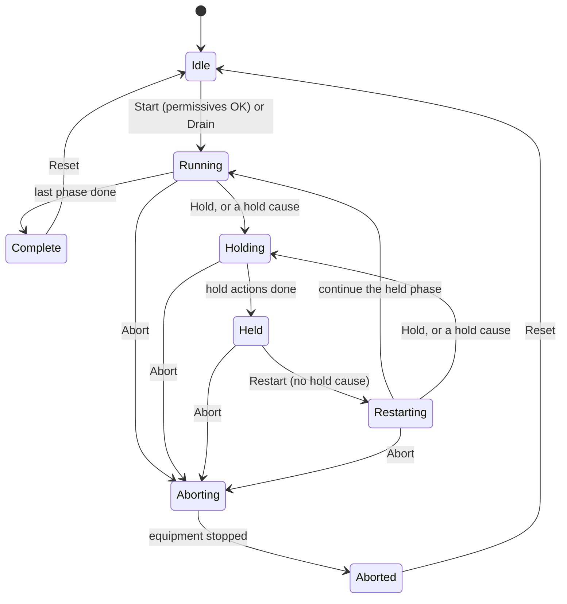
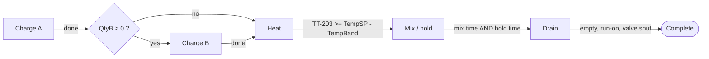
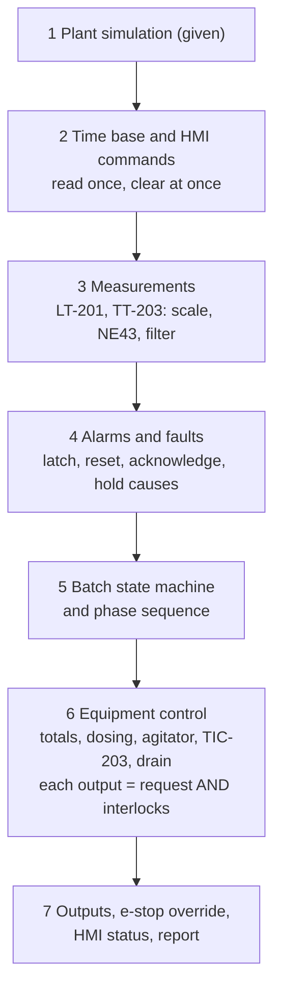

# 24-2 — Capstone: Batch Mixing Plant

> **Level:** Capstone · **Time:** ~25–35 hours · **Prerequisites:** Levels 1–4, especially
> [Module 08](../08-counters/) (pulse counting), [Module 11](../11-program-organization/)
> (function blocks), [Module 12](../12-data-structures/) (recipes and structures),
> [Module 13](../13-sequential-control/) (state machines), [Module 14](../14-analog-and-process-io/)
> (analog inputs), [Module 15](../15-pid-control/) (PID), [Module 16](../16-alarms-and-diagnostics/)
> (alarms) and [Module 18](../18-hmi-and-scada/) (HMI handshakes).
> [Module 21](../21-architecture-and-standards/) (ISA-88) helps a lot.

This capstone is a complete batch process: a jacketed mixing vessel that charges two
ingredients by flow-meter totals, heats the blend under PID control, holds it at temperature
while it is agitated, then pumps it out. Recipes drive every batch, a state machine in the
style of ISA-88 runs the procedure, and the operator can hold, restart or abort it at any
point. There are interlocks, alarms and a batch report. You receive the interface and a plant
simulation. You write the control program, and a 41-scenario factory acceptance test (FAT)
checks it.

Batch plants make paints, resins, food, beverages, pharmaceuticals and cleaning products.
The work you do here is what a controls engineer does on such a plant: turning a functional
specification into structured, testable code that doses accurately, keeps its interlocks
whatever the sequence is doing, recovers properly from a hold, and records what really
happened. It draws on almost every module in the course.

> **Safety note.** This is a training exercise on a simulated plant. The high-high level trip,
> the e-stop and the high-temperature cut-out here are basic process control functions in a
> standard PLC. On a real plant, the hazard and risk assessment decides which of them must be
> safety instrumented functions in an independent, safety-rated system
> ([Module 20](../20-functional-safety/)). A steam-jacketed vessel also needs pressure relief
> and other mechanical protection that no PLC program replaces.

## What you will practise

By the end of this project you will be able to:

- Turn a written functional specification, an I/O list and a cause-and-effect matrix into a
  working PLC program, and show that it meets the specification with an acceptance test.
- Structure a batch program in layers: a procedural state machine (Idle, Running, Held,
  Aborted...), a phase sequence, and equipment control with interlocks written once, on the
  outputs.
- Dose liquids accurately from flow-meter pulses, with in-flight (preact) compensation,
  settling, and no-flow and timeout supervision.
- Run a temperature loop that starts properly at the beginning of a phase, freezes during a
  hold, and meets stated performance requirements.
- Implement Hold, Restart and Abort so that a held batch continues exactly where it stopped:
  no double dosing, and timers that pause rather than restart.
- Handle alarms the ISA-18.2 way (active, unacknowledged, latched faults, reset), and make sure
  that a reset never starts equipment by itself.
- Keep recipes as data, copy the recipe at the start of each batch, and produce a batch report.

## 1. The story

A small contract manufacturer blends water-based cleaning products for supermarket own
brands. Its mixing vessel T-201 has been run by hand: an operator opens the water valve,
watches a sight glass, adds surfactant concentrate from a drum pump, opens the steam valve
"a couple of turns", and writes the batch sheet at the end of the shift. Last year the vessel overflowed twice, and
a customer audit found batch records that could not be trusted.

The vessel has now been fitted with actuated valves, two flow meters, a level transmitter,
a high-high level switch, a temperature transmitter and a steam control valve. The electrical
contractor has wired everything to a new PLC. You are the controls engineer. The process
engineer has written the functional specification below, and the plant manager wants the FAT
passed before the shutdown in six weeks.

Before any hardware is connected, you will build and test the program against a simulation
of the vessel. That is how most projects do it now ([Module 22](../22-software-engineering/),
virtual commissioning).

## 2. Scope

**In scope:**

- One unit (T-201) with its dosing, agitation, heating and drain equipment.
- Five recipes held in the PLC and edited from the HMI.
- The batch procedure: charge A, charge B, heat, mix and hold, drain.
- Operator commands from the HMI: Start, Hold, Restart, Abort, Reset, Acknowledge, Drain.
- Interlocks, alarms and fault handling as in the cause-and-effect matrix (section 7.11).
- The batch report for each completed batch.

**Out of scope** (see *Extension ideas*): manual control of individual devices from the HMI,
cleaning-in-place, weighing, several units sharing equipment, a batch server or historian,
PackML, and any safety system. The e-stop circuit is hardwired through a safety relay. The
PLC only *monitors* it.

## 3. The process

```text
   Ingredient A (softened water)          Ingredient B (surfactant concentrate)
   header, 4 L/s at full flow             header, 1 L/s at full flow
          |                                        |
       [FT-201]-> pulses FQ-201                 [FT-202]-> pulses FQ-202
          |                                        |
        XV-201 (on/off, fail closed)             XV-202 (on/off, fail closed)
          |                                        |
          +----------------+     +-----------------+
                           |     |           M-201 agitator
                           v     v              |
                 +---------------------------------+
   LSHH-201 ---->|  -  -  -  -  -  -  -  -  -  -   |<---- LT-201 (level, 4-20 mA)
   (NC, 90 %)    |          T-201                  |
                 |      2000 L = 100 %      ||     |
   steam ------->|====== jacket ============||=====|<---- TT-203 in a thermowell
   via TV-203    |                          ||     |      (temperature, 4-20 mA)
   (TIC-203)     +---------------------------------+
                                 |
                              XV-204 (on/off, fail closed)
                                 |
                              P-204 drain pump (6 L/s) ---> to the filling line
```

| Tag | Device | What the letters mean |
|---|---|---|
| T-201 | Mixing vessel, 2000 L, steam jacket | T = tank |
| XV-201, XV-202, XV-204 | Actuated on/off valves, spring return (they close on loss of air or power) | XV = on/off valve |
| FT-201 / FQ-201, FT-202 / FQ-202 | Flow meters with a pulse output, and the totals the PLC keeps from those pulses | F = flow, T = transmitter, Q = totalise |
| LT-201 | Level transmitter, 4–20 mA = 0–100 % | L = level |
| LSHH-201 | High-high level switch, normally closed contact | S = switch, HH = high-high |
| TT-203 | Temperature transmitter (an RTD in a thermowell), 4–20 mA = 0–150 °C | |
| TIC-203 / TV-203 | The temperature controller in the PLC and its steam control valve | I = indicate, C = control, V = valve |
| M-201 | Agitator motor | |
| P-204 | Drain (transfer) pump | |

## 4. I/O list

These names, addresses and types are the project interface. Keep them exactly: the acceptance
test uses them.

| Tag | Address | Type | Device and signal |
|---|---|---|---|
| `FlowPulseA` | `%IX0.0` | BOOL | FT-201 pulse output: **one pulse per 0.5 L** (up to 8 pulses/s) |
| `FlowPulseB` | `%IX0.1` | BOOL | FT-202 pulse output: **one pulse per 0.1 L** (up to 10 pulses/s) |
| `AgitatorRunning` | `%IX0.2` | BOOL | M-201 running feedback (contactor auxiliary contact) |
| `PumpRunning` | `%IX0.3` | BOOL | P-204 running feedback |
| `LevelHH_NC` | `%IX0.4` | BOOL | LSHH-201, **NC**: FALSE = high-high level *or* broken wire |
| `EStopOK_NC` | `%IX0.5` | BOOL | Safety relay monitoring contact, **NC**: FALSE = e-stop operated, relay not reset |
| `LevelRaw` | `%IW0` | INT | LT-201, 0–100 % (0–2000 L); 4 mA = 0, 20 mA = 27648 counts |
| `TempRaw` | `%IW1` | INT | TT-203, 0–150 °C; same card range |
| `InletAValve` | `%QX0.0` | BOOL | XV-201 solenoid: TRUE = open |
| `InletBValve` | `%QX0.1` | BOOL | XV-202 solenoid: TRUE = open |
| `OutletValve` | `%QX0.2` | BOOL | XV-204 solenoid: TRUE = open |
| `AgitatorRun` | `%QX0.3` | BOOL | M-201 contactor |
| `PumpRun` | `%QX0.4` | BOOL | P-204 contactor |
| `AlarmHorn` | `%QX0.5` | BOOL | ON while any alarm is unacknowledged |
| `AlarmLamp` | `%QX0.6` | BOOL | ON while any alarm is active |
| `HeatValveRaw` | `%QW0` | INT | TV-203 positioner: 0 = closed (4 mA) … 27648 = fully open (20 mA) |

The analog card is the Siemens-style range from [Module 14](../14-analog-and-process-io/):
4 mA = 0 counts, 20 mA = 27648, so 1 mA = 1728 counts, and `mA = 4 + Raw / 1728`.

The pulse inputs are ordinary digital inputs. At 8 pulses per second each pulse is high for
about 62 ms and low for 62 ms, six scans each at 10 ms, which a scanned input counts safely.
A scanned input can never count more than one pulse every two scans, and it needs a good
margin below that, so a faster meter needs a high-speed counter input
([Module 08](../08-counters/), section 14).

## 5. The plant simulation (`FB_PlantSim`)

The starter file contains a function block `FB_PlantSim` and an instance `Sim` of it. It
stands in for the plant: valves, pipes, the vessel, motors, the steam jacket and the
instruments. **Do not change it.** Section 1 of the program calls it once per scan:

```text
   last scan's outputs                                      this scan's inputs
   InletAValve, InletBValve, OutletValve,   +-----------+   FlowPulseA, FlowPulseB,
   AgitatorRun, PumpRun, HeatValveRaw  ---->|    Sim    |-->AgitatorRunning, PumpRunning,
   EStopOK_NC (as PowerOK)             ---->|FB_PlantSim|   LevelHH_NC, LevelRaw, TempRaw
                                            +-----------+
```

So the simulation plays the part of the I/O system: it reads what your program wrote last
scan and fills in the input image before your logic runs. `EStopOK_NC` stays a real input
that the test sets, like a real push-button. The simulation only uses it to cut the power to
every field output, just as the safety relay would. On a real PLC you delete section 1 (or set
`SimEnable := FALSE`) and nothing else in your program changes. Keep that property: never
read `Sim.` anything in your own logic.

### 5.1 What the model does

| Item | Model |
|---|---|
| Vessel | 2000 L = 100 % level, flat bottom, so 1 % = 20 L |
| XV-201, XV-202, XV-204 | 2 s full stroke, flow proportional to position, spring-return closed |
| Ingredient A | 4.0 L/s with XV-201 fully open; FT-201 pulses once per 0.5 L |
| Ingredient B | 1.0 L/s with XV-202 fully open; FT-202 pulses once per 0.1 L |
| Pulses | Square wave: high for half a pulse volume, low for the other half |
| P-204 | 6.0 L/s through a fully open XV-204; the flow falls away below 10 L in the vessel |
| Motors | M-201 feedback 1.0 s after its command, P-204 0.5 s; both drop at once when the command drops or the motor fails |
| Heating | At 100 % valve the steam delivers enough heat to warm 450 L of cold product by about 0.33 °C/s. The heat reaches the contents through a 10 s jacket lag, falls as the contents approach the 130 °C steam temperature, and drops to 30 % with the agitator stopped. |
| Heat loss | Slow loss to the 20 °C room: a 450 L batch at 60 °C cools by about 0.04 °C/s |
| TT-203 | In a thermowell: it follows the contents with a 3 s lag |
| Ingredients | Arrive at 20 °C and cool the contents as they mix in |
| Transmitters | NE43 behaviour: the signal saturates at 3.8 and 20.5 mA; the card clips at −4864 and 32511 counts |
| LSHH-201 | Opens at 1800 L (90 %), closes again at 1780 L |
| Power | `PowerOK` FALSE closes every valve, including the steam valve, and stops both motors |
| Integration | Fixed 10 ms steps, independent of your task interval |

These numbers make the dynamics realistic in shape but faster than a real vessel of this size,
so that a full batch takes minutes of simulated time instead of hours.

### 5.2 Fault injection and test hooks (inputs the test writes)

| `Sim.` input | Default | Effect |
|---|---|---|
| `FlowFactorA`, `FlowFactorB` | 1.0 | Supply strength: 0.0 = no flow (supply failed), 0.3 = partly blocked strainer |
| `AgitatorFail` | FALSE | M-201 will not run, or trips if running (no feedback) |
| `PumpFail` | FALSE | P-204 will not run, or trips |
| `HeatFail` | FALSE | No steam: the jacket gives no heat |
| `HHWireBreak` | FALSE | LSHH-201 circuit open |
| `TtForce`, `TtForcemA` | FALSE, 12.0 | TT-203 loop current replaced by `TtForcemA`: a loop calibrator, or a failed loop (0.0 = wire break) |
| `LtForce`, `LtForcemA` | FALSE, 12.0 | The same for LT-201 |
| `VolumeL`, `TempC` | 0.0, 20.0 | Process state; a test may set them to jump to a new condition |

### 5.3 Observer outputs (the referee)

| `Sim.` output | Meaning |
|---|---|
| `DeliveredA`, `DeliveredB` | True litres through each inlet since power-up (LREAL) |
| `DrainedL`, `VolumeL` | True litres pumped out; litres in the vessel now |
| `MaxVolumeL`, `MaxTempC` | Highest volume and true temperature seen (the test may reset `MaxTempC`) |
| `HeatValvePct` | Steam valve position the plant sees, % |
| `AgitatorDryS` | Seconds the agitator ran with less than 150 L in the vessel |
| `HeatNoAgitS` | Seconds of steam with the agitator stopped or less than 200 L in the vessel |
| `DeadheadS` | Seconds P-204 ran without XV-204 fully open |

The observers let the test judge what *really* happened. Your program might believe it dosed
400 L. `Sim.DeliveredA` knows.

## 6. Data interface

All these types are given in the starter. Do not change them: the test and the HMI depend on
them.

### 6.1 States and phases

```iecst
E_BatchState : (Idle, Running, Holding, Held, Restarting, Aborting, Aborted, Complete);
E_BatchPhase : (PhaseNone, PhaseChargeA, PhaseChargeB, PhaseHeat, PhaseMix, PhaseDrain);
```

The **state** says where the batch is in its life. The **phase** says which part of the
procedure is active, or was active when the batch was held or aborted. They are separate on
purpose. Holding during charge A and holding during mixing are the same *state* with different
*phases*, and the phase tells Restart what to continue. This is the ISA-88 separation of the
state model from the procedure ([Module 21](../21-architecture-and-standards/), section 3.5).

The phase is called *phase*, not *step*, for a second reason: `STEP` is a keyword of the SFC
language, and MATIEC rejects it as a name.

### 6.2 Recipes

```iecst
ST_Recipe : STRUCT
  Name     : STRING;    (* shown on the HMI and in the batch report *)
  QtyA     : REAL;      (* ingredient A to charge, litres *)
  QtyB     : REAL;      (* ingredient B to charge, litres; 0.0 = none *)
  TempSP   : REAL;      (* process temperature setpoint, degC *)
  MixTime  : TIME;      (* minimum agitation time in the mix/hold phase *)
  HoldTime : TIME;      (* time the contents must spend at temperature *)
END_STRUCT;
```

`Recipes : ARRAY[1..5] OF ST_Recipe` is declared `RETAIN`, so edits survive a power cycle.
Three recipes are loaded as initial values, and recipes 4 and 5 are empty:

| No. | Name | QtyA (L) | QtyB (L) | TempSP (°C) | MixTime | HoldTime |
|---|---|---|---|---|---|---|
| 1 | Floor cleaner | 400 | 50 | 60 | 60 s | 90 s |
| 2 | Degreaser | 250 | 120 | 45 | 120 s | 30 s |
| 3 | Cold blend | 260 | 40 | 20 | 30 s | 0 s |

Recipe 3 is set to the room temperature of 20 °C, so it needs no heating: the heat phase
finishes at once.

In ISA-88 terms, `Recipes[]` holds the **master recipes**, and each one is only the
*formula* part (the parameters). The procedure itself is fixed in your code. When a batch
starts, your program copies the selected master recipe into its own **control recipe**, and
the batch uses only that copy. An operator who edits `Recipes[1]` while recipe 1 is running
changes the *next* batch, not this one.

### 6.3 Engineering configuration (`Cfg : ST_BatchCfg`, RETAIN)

| Field | Default | Meaning |
|---|---|---|
| `LitresPerPulseA` | 0.5 | FT-201 K-factor, litres per pulse |
| `LitresPerPulseB` | 0.1 | FT-202 K-factor |
| `PreactA` | 4.0 | In-flight volume of XV-201, L: close this much before the target |
| `PreactB` | 1.0 | In-flight volume of XV-202, L |
| `SettleTime` | T#3s | After an inlet closes, wait this long before the charge counts as complete |
| `NoFlowTime` | T#10s | Inlet open and no meter pulse for this long = dosing fault |
| `MaxChargeTime` | T#5m | Longest a charge phase may run = dosing fault |
| `MaxHeatTime` | T#15m | Longest the heat phase may run = heating timeout |
| `TempBand` | 2.0 | "At temperature" means within ± this of `TempSP`, °C |
| `TempHighLimit` | 85.0 | High temperature alarm; it clears 2 °C below |
| `TempKc`, `TempTi`, `TempTd` | 8.0, 200.0, 0.0 | TIC-203 tuning: gain in % per °C, integral and derivative time in s (ideal form) |
| `AgitStartLevel` | 10.0 | Agitator may start at or above this level, % |
| `AgitStopLevel` | 8.0 | Agitator stops below this level, % |
| `HeatMinLevel` | 12.0 | Steam allowed at or above this level, % (jacket covered) |
| `EmptyLevel` | 1.0 | Vessel counts as empty at or below this level, % |
| `DrainRunOn` | T#5s | Pump keeps running this long after the vessel reads empty |
| `ValveLeadTime` | T#2s | XV-204 opens this long before P-204 starts, and closes this long after it stops |
| `FeedbackTime` | T#3s | Motor command and running feedback may disagree for this long before a fault |
| `XmtrFaultDelay` | T#2s | An NE43 failure signal must last this long to be a transmitter fault |
| `MinBatchL`, `MaxBatchL` | 300.0, 1500.0 | Valid total batch size, QtyA + QtyB, L |
| `MinTempSP`, `MaxTempSP` | 20.0, 80.0 | Valid recipe setpoint range, °C (there is no cooling) |

Use these fields, not literal numbers in your code. The test changes some of them and expects
your program to follow.

### 6.4 HMI interface (`Hmi : ST_BatchHmi`)

**Commands** follow the handshake from [Module 18](../18-hmi-and-scada/): the HMI sets a
command bit TRUE, and the PLC acts on it **once** and clears it **in the same scan**, whether
the command was accepted or not.

| Field | Type | Meaning |
|---|---|---|
| `CmdStart` | BOOL | Start a batch with recipe `RecipeNo` |
| `CmdHold`, `CmdRestart`, `CmdAbort` | BOOL | ISA-88 commands for the running batch |
| `CmdReset` | BOOL | Reset latched faults whose cause has gone; Complete or Aborted → Idle |
| `CmdAck` | BOOL | Acknowledge all alarms |
| `CmdDrain` | BOOL | Empty the vessel (from Idle only, section 7.10) |
| `RecipeNo` | INT | Operator's recipe selection, 1..5 (default 1) |

**Status**, written by the PLC every scan:

| Field | Type | Meaning |
|---|---|---|
| `State` | E_BatchState | Procedural state |
| `Phase` | E_BatchPhase | Active (or held) phase; `PhaseNone` in Idle and Complete |
| `ActiveRecipe` | INT | Recipe of the batch in progress or just completed; 0 in Idle and during a drain |
| `RejectCode` | INT | Result of the last Start command (table below) |
| `LevelPct`, `TempC` | REAL | LT-201 in %, TT-203 in °C |
| `TotalA`, `TotalB` | REAL | Litres counted by FQ-201 and FQ-202 in this batch |
| `AlmActive`, `AlmUnack` | WORD | One bit per alarm (section 7.11) |

**Start reject codes.** Check them in this order and report the first that applies:

| `RejectCode` | Reason |
|---|---|
| 0 | Accepted |
| 5 | Not in Idle (a batch is in progress, or Complete/Aborted waiting for Reset) |
| 1 | `RecipeNo` outside 1..5 |
| 2 | Recipe invalid: QtyA ≤ 0, QtyB < 0, QtyA + QtyB outside `MinBatchL`..`MaxBatchL`, `TempSP` outside `MinTempSP`..`MaxTempSP`, or a negative time |
| 3 | Vessel not empty: `LevelPct` > `EmptyLevel` |
| 4 | An alarm is active (any bit of `AlmActive`) |

### 6.5 Batch report (`Report : ST_BatchReport`)

Written once, at the moment a batch reaches Complete, and kept until the next batch completes.
Aborted batches and drain runs do not write a report.

| Field | Type | Content |
|---|---|---|
| `BatchCount` | DINT | Batches completed since power-up |
| `RecipeNo`, `RecipeName` | INT, STRING | The recipe that was run |
| `ActualA`, `ActualB` | REAL | Litres counted by FQ-201 and FQ-202, **in-flight liquid included** |
| `BatchTime` | TIME | From the accepted Start to Complete, **time held included** |
| `MaxTemp` | REAL | Highest TT-203 reading during the batch, °C |

This is the batch record the auditor asked for: what was actually charged, how hot the product
got and how long the batch took.

## 7. Functional specification

### 7.1 States and commands

The batch follows a subset of the ISA-88 example state model: no Pause and no Stop.



Not drawn: from any of Running, Holding, Held, Restarting and Aborting, the e-stop sends the
batch straight to **Aborted** (section 7.9).

| State | What the equipment does | Leaves when |
|---|---|---|
| **Idle** | Everything off | Start accepted → Running (phase ChargeA); Drain accepted → Running (phase Drain) |
| **Running** | The active phase runs (sections 7.2–7.7) | Last phase done → Complete; Hold command or a hold cause → Holding; Abort → Aborting |
| **Holding** | Inlets shut, steam off, P-204 stops and XV-204 shuts after `ValveLeadTime`; the agitator keeps running if it is running | Pump stopped and outlet valve shut → Held |
| **Held** | As Holding; totals keep counting; phase timers are paused | Restart, only if no hold cause is active → Restarting |
| **Restarting** | Nothing extra is needed in this plant | → Running, in the same phase |
| **Aborting** | Inlets shut, steam off, agitator off, P-204 stops and XV-204 shuts after `ValveLeadTime` | All stopped → Aborted |
| **Aborted** | Everything off; the batch cannot continue | Reset → Idle |
| **Complete** | Everything off; the report is written | Reset → Idle |

Holding, Restarting and Aborting are transient: the batch passes through them while their
actions complete. The test allows up to 5 s for Holding → Held. A design that reaches Held on
the next scan is fine.

**Command acceptance.** A command that does not apply in the present state does nothing, and it
is still cleared. Start while not Idle gives reject code 5. Restart in Held while a hold cause
is still active is **refused**: the batch stays in Held. It must not pass through Restarting
and bounce back.

**Hold causes** are all the alarms except the e-stop: any active bit in `AlmActive` except bit 9
(section 7.11). A hold cause in Running or Restarting takes the batch to Holding.

### 7.2 The procedure



| Phase | Actions while Running | Complete when | Watchdog |
|---|---|---|---|
| **ChargeA** | XV-201 open until the A total reaches `QtyA − PreactA` | XV-201 has been shut for `SettleTime` | No pulse for `NoFlowTime` with XV-201 open, or the phase has run for `MaxChargeTime` → dosing fault A |
| **ChargeB** | The same with XV-202 and `QtyB`. Skipped when `QtyB` = 0 | As charge A | As charge A → dosing fault B |
| **Heat** | TIC-203 in automatic with SP = `TempSP` | TT-203 ≥ `TempSP − TempBand` | Phase has run for `MaxHeatTime` → heating timeout |
| **Mix** | TIC-203 in automatic; agitation continues | Agitated for `MixTime` **and** at temperature for `HoldTime` (section 7.6) | — |
| **Drain** | Steam off; XV-204 then P-204 (section 7.7) | Vessel empty, run-on done, P-204 stopped and XV-204 shut | P-204 feedback (section 7.4) |

The agitator (section 7.4) runs in every phase whenever the level allows it. Watchdog times
count only while the batch is Running in that phase. A hold restarts them, so a batch that
held for a while does not time out the moment it restarts.

### 7.3 Charging by flow-meter totals

**Counting.** Count the rising edges of each pulse input and keep the count in a **DINT**. The
total in litres is `count × LitresPerPulse`. Do not add 0.1 L to a REAL on every pulse: after
thousands of pulses the rounding errors of a 32-bit REAL add up ([Module 09](../09-math-and-data-handling/)).
Reset both totals when a batch starts, and nowhere else. Keep counting while the batch is held,
so the liquid that arrives after a valve closes is still counted.

**In-flight compensation (preact).** A valve does not stop the flow the instant the PLC drops
its output. XV-201 takes 2 s to stroke shut, and the flow falls roughly linearly while it
closes, so on average half the full flow still passes for those 2 s:

```text
 in-flight volume ≈ ½ × 4.0 L/s × 2 s = 4.0 L       (XV-201, ingredient A)
 in-flight volume ≈ ½ × 1.0 L/s × 2 s = 1.0 L       (XV-202, ingredient B)
```

On a real plant the liquid in the pipe between the valve and the vessel adds to it. If the
valve is told to close when the total reaches the target, every batch of A is about 4 L over.
That is only 1 % on a 400 L charge, but 1 L on a 50 L charge of B is 2 %, and for an expensive
or active ingredient that matters. So the valve closes **early**, when

```text
   Total >= Target - Preact            e.g. 400 - 4.0 = 396 L for recipe 1
```

and the in-flight 4 L brings the batch to about 400 L. Batching controllers call this the
*preact* or *in-flight* setting. It is usually found from the last few batches, which is an
extension idea at the end.

**Settle.** After the valve closes, wait `SettleTime` (3 s) before the charge counts as
complete. The in-flight liquid is still passing through the meter. Report it, don't ignore
it: the batch record must say what is really in the vessel ([Module 21](../21-architecture-and-standards/),
section 3.7, rule 4).

**Accuracy you should get:** within about ±1 L on A and ±0.4 L on B. The meters themselves
resolve 0.5 L and 0.1 L.

**Supervision.** Two different failures, both raising the dosing fault for that ingredient and
holding the batch:

- **No flow:** the valve is open but no pulse has arrived for `NoFlowTime`. The supply pump is
  off, a manual valve is shut, or the meter has failed. Restart the timer on every pulse. The
  2 s valve stroke is well inside the 10 s.
- **Timeout:** the phase has run for `MaxChargeTime`. This catches a *slow* flow, such as a
  partly blocked strainer, where pulses still arrive so the no-flow check never fires.

**High-high level.** LSHH-201 open closes both inlet valves **directly**, in every state, as an
interlock on the outputs, not only through the Hold. [Module 13](../13-sequential-control/),
section 4.2, explains why interlocks live outside the sequence.

**After a hold.** The total is kept. On Restart the valve re-opens only if the total is still
below `Target − Preact`, so the charge continues with the remainder. A 400 L charge held at
100 L doses the other 300 L, not another 400.

### 7.4 Agitator M-201

- The agitator may run only with the impeller covered: start at a level of at least
  `AgitStartLevel` (10 %), stop below `AgitStopLevel` (8 %). The 2 % gap is hysteresis, so
  that ripples on the surface do not start and stop the motor.
- It runs in Running and Restarting whenever the level allows it, from part way through charge
  A until the vessel has drained below 8 %.
- In Holding and Held it **keeps running if it is running**, so the product stays mixed and the
  jacket does not scorch a stagnant layer. It is **never started** in Holding or Held. A fault
  reset must not start equipment by itself. The agitator restarts when the operator restarts
  the batch.
- Feedback supervision, as in `FB_Motor` ([Module 11](../11-program-organization/)): if the
  command and `AgitatorRunning` disagree for `FeedbackTime` (3 s), latch an agitator fault,
  drop the command and hold the batch. This covers "failed to start" and "stopped while
  running". The fault can be reset only when the feedback is off.
- Off in Idle, Aborting, Aborted and Complete, and at once on e-stop.

P-204 has the same feedback supervision (pump fault).

### 7.5 Temperature control TIC-203

**The loop.** TT-203 → PID in the PLC → TV-203. Heating is **reverse acting**: when the
temperature is below the setpoint, the output goes up. Scale the controller output of
0–100 % to 0–27648 counts for `HeatValveRaw`.

**Permissive.** Steam is allowed only while *all* of these are true, checked every scan on the
output:

- the batch is Running in the Heat or Mix phase;
- the agitator is **proven** running: commanded *and* its feedback present. A tripped agitator
  shuts the steam at once, not 3 s later when its fault latches;
- the level is at least `HeatMinLevel` (the jacket is covered);
- no high-temperature alarm, and TT-203 is healthy;
- the e-stop circuit is healthy.

Otherwise `HeatValveRaw` = 0.

**Starting the loop at the beginning of the heat phase.** [Module 15](../15-pid-control/) taught
bumpless transfer: when a loop goes from manual to automatic, the output continues smoothly
from the manual value. That is right when an operator switches a running loop to automatic. At
the start of a heat-up it is wrong. The "manual value" is 0 %, so a bumpless start makes the
output creep up at the integral rate. With the default tuning, recipe 1 then takes about
9 minutes to heat instead of about 3. At
the start of the heat phase, clear the integral part instead (a *cold start*). The output then
begins at Kc × error, which saturates at 100 %, the full-steam heat-up you want. The
conditional-integration anti-windup of Module 15 then brings the temperature in without a big
overshoot.

**During a hold.** Force the output to 0 % and **freeze** the integral part (neither reset nor
track it). After Restart the controller carries on from roughly where it was.

**Performance requirements** (tested with recipe 1: 450 L to 60 °C):

1. The heat phase reaches `TempSP − TempBand` (58 °C) within **4 minutes**. Full steam alone
   takes about 160 s.
2. The true temperature never overshoots the setpoint by more than **3 °C**.
3. During the mix phase the temperature stays inside ±`TempBand`, so the hold time
   accumulates.

**Tuning.** The defaults Kc = 8 %/°C, Ti = 200 s, Td = 0 suit an ideal-form, positional PI
with conditional-integration anti-windup and a cold start, as in Lab 15-2. With them, recipe 1
heats in about 190 s and overshoots by less than 0.1 °C. If you use another algorithm, you
may need other settings. A **velocity-form** controller, for example, loses whatever the 100 %
limit clips off during the heat-up, so with these settings it crawls through the last few
degrees. Velocity-form designs usually add an *approach* strategy: full steam until about
10 °C below the setpoint, then hand over to the controller. Either way, retune until the three
requirements are met, and record your final settings in `Cfg`.

**Heating timeout.** If the heat phase has run for `MaxHeatTime` (15 min), latch the heating
timeout and hold the batch. Typical causes: no steam, a stuck valve, a failed trap.

**Measurement.** TT-203 goes through the NE43 checks of [Module 14](../14-analog-and-process-io/):
a current ≤ 3.6 mA or ≥ 21.0 mA for `XmtrFaultDelay` (2 s) is a transmitter fault, latched
until the signal is good again *and* the operator resets it. While the signal is outside the
limits, hold the last good value. You may filter TT-203 and LT-201 with a first-order filter
of time constant **up to 1 s**. The tests allow for that.

### 7.6 Mix and hold timers

The Mix phase has two timers, and both must be satisfied:

- **Mix time:** agitated time in the phase, measured from its start;
- **Hold time:** time with `|TT-203 − TempSP|` ≤ `TempBand`. It counts only while the contents
  are at temperature. If a process upset takes the temperature out of the band, the hold time
  stops, and it continues when the temperature is back. This is how a *time at temperature*
  requirement is normally specified.

Both are **retentive** across a hold. They pause while the batch is not Running and continue
after Restart. A TON restarts from zero when its input drops, so it is the wrong tool here.
Build the accumulating timer yourself, as in [Module 07](../07-timers/): add the scan's
elapsed time while the condition is true.

**Worked example.** Recipe 1 has MixTime 60 s and HoldTime 90 s. The heat phase ends at 58 °C,
inside the band, so both timers start together. With no upset the phase lasts 90 s. Suppose
that 10 s into the phase a cold addition drops the temperature to 50 °C, and the loop brings
it back above 58 °C 60 s later. The mix timer reaches 60 s at 60 s. The hold timer has 10 s at
70 s, and still needs another 80 s after that, so the phase ends at about 150 s.

### 7.7 Draining

The pump must never run against a shut valve. That is a *deadhead*, which heats the pump and
can damage its seal. The sequence is:

```text
             drain phase starts                    level reads empty
             |<----lead--->|                       |<-DrainRunOn->|<----lag---->|
              __________________________________________________________________
OutletValve  _|                                                                 |_____
                            ______________________________________
PumpRun      _______________|                                     |___________________
                                                    __________________________________
Level <= 1 % _______________________________________|
                                                                          phase complete
```

Both the lead and the lag are `ValveLeadTime`.

1. Open XV-204.
2. After `ValveLeadTime` (2 s, the valve's stroke time) start P-204.
3. When the level reads `EmptyLevel` (1 %) or less with the pump running, keep pumping for
   `DrainRunOn` (5 s) to get the last litres out.
4. Stop P-204. Shut XV-204 `ValveLeadTime` later.
5. The phase is complete when the valve has been told to shut.

The agitator stops when the level falls below 8 %, as in section 7.4. A pump fault stops the
pump, shuts the valve `ValveLeadTime` later and holds the batch. On Restart the drain sequence
starts again from step 1.

### 7.8 Hold, Restart and Abort in each phase

| Phase | Holding / Held | After Restart |
|---|---|---|
| ChargeA / ChargeB | Inlet shut at once; the total keeps counting the in-flight liquid; the watchdogs restart | The inlet re-opens only if the total is below `Target − Preact`; the charge completes with the remainder |
| Heat | Steam off; agitator keeps running; integral frozen | Heating continues; the heat watchdog restarts |
| Mix | Steam off; agitator keeps running; mix and hold timers paused | Timers continue from where they stopped |
| Drain | P-204 stops, then XV-204 shuts after `ValveLeadTime`; Held when the valve is shut | The drain sequence starts again from "open XV-204" |

**Abort** ends the batch as fast as is safe: inlets shut, steam off, agitator off, P-204 stops
and XV-204 shuts after its lag time. The product stays in the vessel. The batch cannot be
restarted. The operator resets to Idle, decides what to do with the product (rework, dispose)
and empties the vessel with the Drain command (section 7.10).

### 7.9 E-stop

The e-stop is a hardwired safety function: the safety relay removes the power from the field
outputs whatever the PLC does. The PLC monitors the relay through `EStopOK_NC` and must agree
with it:

- **In the same scan** that `EStopOK_NC` goes FALSE, every output goes off: valves shut,
  motors off, `HeatValveRaw` = 0.
- A batch in any active state goes straight to **Aborted**.
- Alarm bit 9 is active while the circuit is open. **No consequential alarms**: the stopped
  agitator must not also raise an agitator fault. That is the alarm flood
  [Module 16](../16-alarms-and-diagnostics/) warns about.
- When the e-stop is released and the relay reset, **nothing restarts**. The batch stays
  Aborted until the operator resets it. Machinery safety standards require that resetting an
  e-stop does not by itself restart the machine, and the PLC logic must respect that too.

### 7.10 Emptying the vessel (the Drain command)

After an abort the vessel still holds product, and Start is refused (code 3) until it is
empty. `CmdDrain` in **Idle**, with no alarm active and the level above `EmptyLevel`, runs the
drain phase on its own: State = Running, Phase = PhaseDrain, `ActiveRecipe` = 0. It follows
section 7.7, can be held, restarted and aborted, and returns to **Idle** (not Complete) when
done. It writes no report and adds no batch time. In any other situation, or with the vessel
already empty, `CmdDrain` does nothing.

### 7.11 Alarms, faults and the cause-and-effect matrix

| Bit | Mask | Alarm | Detected when | Latched? |
|---|---|---|---|---|
| 0 | `16#0001` | High-high level | `LevelHH_NC` FALSE | No: active while the switch is open |
| 1 | `16#0002` | High temperature | TT-203 ≥ `TempHighLimit`; clears below `TempHighLimit − 2` | No, with 2 °C deadband |
| 2 | `16#0004` | Dosing fault A | No flow or timeout in charge A (section 7.3) | Yes, until Reset |
| 3 | `16#0008` | Dosing fault B | The same for charge B | Yes, until Reset |
| 4 | `16#0010` | Heating timeout | Heat phase ran for `MaxHeatTime` | Yes, until Reset |
| 5 | `16#0020` | Agitator fault | Command/feedback disagree for `FeedbackTime` | Yes, until Reset with feedback off |
| 6 | `16#0040` | Pump fault | The same for P-204 | Yes, until Reset with feedback off |
| 7 | `16#0080` | TT-203 fault | NE43 failure signal for `XmtrFaultDelay` | Yes, until Reset with the signal good |
| 8 | `16#0100` | LT-201 fault | The same for LT-201 | Yes, until Reset with the signal good |
| 9 | `16#0200` | E-stop | `EStopOK_NC` FALSE | No |

**Cause-and-effect matrix.** "Direct" effects act on the outputs at once, in every state,
whatever the sequence is doing. "Hold" means the batch goes to Holding, with the hold actions
of section 7.8.

| Cause ↓ / Effect → | XV-201/202 shut | Steam off | M-201 off | P-204 off, XV-204 shut | Batch |
|---|---|---|---|---|---|
| LSHH-201 high-high (bit 0) | **Direct** | via Hold | — | via Hold | Hold |
| High temperature (bit 1) | via Hold | **Direct** | — | via Hold | Hold |
| Dosing fault A or B (bits 2, 3) | via Hold | via Hold | — | via Hold | Hold |
| Heating timeout (bit 4) | via Hold | via Hold | — | via Hold | Hold |
| Agitator fault (bit 5) | via Hold | **Direct** (not proven running) | **Direct** | via Hold | Hold |
| Pump fault (bit 6) | via Hold | via Hold | — | **Direct** (valve after its lag) | Hold |
| TT-203 fault (bit 7) | via Hold | **Direct** | — | via Hold | Hold |
| LT-201 fault (bit 8) | via Hold | via Hold | — | via Hold | Hold (level held at the last good value) |
| E-stop (bit 9) | **Direct** | **Direct** | **Direct** | **Direct** (valve at once) | Abort |

This is the same C&E format used for process safety work, applied here to basic process
control. On a real plant, the high-high level and high temperature rows would first go through
the risk assessment to decide whether they need a safety instrumented function as well.

**Acknowledge and annunciation** ([Module 16](../16-alarms-and-diagnostics/), section 3):

- A bit is set in `AlmUnack` when its alarm becomes active. `CmdAck` clears all of `AlmUnack`.
- An alarm that clears *before* anyone acknowledges it stays in `AlmUnack` until it is
  acknowledged. The operator must see that something happened.
- An alarm that becomes active **in the same scan** as an acknowledgement stays unacknowledged.
  Nobody has seen it yet. Process the Ack first, then add the new alarms.
- `AlarmHorn` = any bit in `AlmUnack`. `AlarmLamp` = any bit in `AlmActive`.

**Reset** (`CmdReset`) clears each latched fault whose cause has gone (see the table). It
never starts equipment. In Complete or Aborted it also returns the batch to Idle.

### 7.12 Starting a batch

When `CmdStart` is accepted (section 6.4):

1. Copy `Recipes[RecipeNo]` into the control recipe, and set `ActiveRecipe`.
2. Reset both flow totals, the batch time and the maximum temperature.
3. State = Running, Phase = PhaseChargeA. XV-201 opens on the same or the next scan.

### 7.13 Completing a batch

When the drain phase completes: write the report (section 6.5), set Phase = PhaseNone and
State = Complete. `ActiveRecipe` keeps the recipe number until Reset. Reset → Idle, and
`ActiveRecipe` = 0.

## 8. Suggested architecture

You may structure your program as you like. The test only looks at the interface. Here is an
architecture that works well and that a reviewer will recognise. It is the one the reference
solution uses.



**Layering.** The state machine (section 5) decides **what** should happen: which phase,
running or held. It never writes a physical output. The equipment section (6) decides **how**: it turns
"Running in ChargeA" into "open XV-201 until 396 L", and it applies the interlocks. Section 7
writes each physical output in **exactly one place**. When the question is "why is XV-201 shut?",
there is one line to read.

**Reusable blocks.** The same job twice means one function block used twice:

| Block | Job | Used for |
|---|---|---|
| `FB_AnalogIn` | 4–20 mA → engineering units, NE43 check with delay, filter, hold last good value | LT-201, TT-203 (Lab 14-1) |
| `FB_FlowTotal` | Rising edges → DINT count → litres; reset | FQ-201, FQ-202 |
| `FB_Charge` | One dosing phase: preact, settle, no-flow and time watchdogs | Charge A, charge B |
| `FB_Motor` | Command with feedback supervision and fault latch | M-201, P-204 (Lab 11-1) |
| `FB_PID` | Ideal-form PID, anti-windup, enable with frozen integral, integral reset | TIC-203 (Lab 15-2) |
| `F_RecipeValid` | Range checks on one recipe | Start permissive |

A complete dosing block, as in the reference solution:

```iecst
FUNCTION_BLOCK FB_Charge
  (* One dosing phase: close at Target - Preact, settle, supervise. *)
  VAR_INPUT
    Run        : BOOL;             (* phase running (FALSE while held) *)
    Permit     : BOOL;             (* interlocks healthy *)
    Target     : REAL;             (* L *)
    Preact     : REAL;             (* L *)
    Total      : REAL;             (* L counted so far this batch *)
    NewPulse   : BOOL;             (* TRUE for one scan per meter pulse *)
    SettleTime : TIME;
    NoFlowTime : TIME;
    MaxTime    : TIME;
  END_VAR
  VAR_OUTPUT
    Valve : BOOL;
    Done  : BOOL;
    Fault : BOOL;                  (* no flow, or phase timeout; not latched *)
  END_VAR
  VAR
    Reached   : BOOL;
    SettleTmr : TON;
    NoFlowTmr : TON;
    PhaseTmr  : TON;
  END_VAR
  Reached := Total >= Target - Preact;
  Valve := Run AND Permit AND NOT Reached;
  SettleTmr(IN := Run AND Reached, PT := SettleTime);
  Done := SettleTmr.Q;
  (* each pulse drops IN for one scan, which restarts the no-flow timer *)
  NoFlowTmr(IN := Valve AND NOT NewPulse, PT := NoFlowTime);
  PhaseTmr(IN := Run, PT := MaxTime);
  Fault := NoFlowTmr.Q OR (PhaseTmr.Q AND NOT Done);
END_FUNCTION_BLOCK
```

Look at what it does *not* do. It does not latch the fault or decide to hold the batch. The
alarm section latches, and the state machine holds. It does not know about ingredient A or B.
The program calls it twice with different parameters.

**The state machine** is one `CASE` on the state, with the phase sequence nested inside Running.
A fragment:

```iecst
  CASE State OF
    Running:
      IF DoAbort THEN
        State := Aborting;
      ELSIF DoHold OR HoldCause THEN
        State := Holding;
      ELSE
        CASE Phase OF
          PhaseChargeA:
            IF ChargeA.Done THEN
              IF Active.QtyB > 0.0 THEN
                Phase := PhaseChargeB;
              ELSE
                Phase := PhaseHeat;
                PidReset := TRUE;          (* cold start of TIC-203 *)
              END_IF;
            END_IF;
          (* ... the other phases ... *)
        END_CASE;
      END_IF;
    Held:
      IF DoAbort THEN
        State := Aborting;
      ELSIF DoRestart AND NOT HoldCause THEN
        State := Restarting;
      END_IF;
    (* ... the other states ... *)
  END_CASE;
```

The order of the tests is the priority: Abort beats Hold, and Hold beats the phase moving on
([Module 13](../13-sequential-control/), section 2.5).

**Alarms as words.** With the alarm conditions in a WORD, acknowledgement takes three lines of
bitwise logic ([Module 09](../09-math-and-data-handling/), section 5):

```iecst
  IF DoAck THEN
    AlmUnack := 16#0000;                              (* acknowledge first ... *)
  END_IF;
  AlmUnack := AlmUnack OR (AlmActive AND NOT AlmPrev);  (* ... then add new alarms *)
  AlmPrev := AlmActive;
  HoldCause := (AlmActive AND 16#01FF) <> 16#0000;    (* all but the e-stop *)
```

**A retentive phase timer** is a TIME that grows only while its condition is true:

```iecst
  IF (State = Running) AND (Phase = PhaseMix) THEN
    MixAcc := ADD_TIME(MixAcc, Cycle.DeltaT);
    IF ABS(TempC - Active.TempSP) <= Cfg.TempBand THEN
      HoldAcc := ADD_TIME(HoldAcc, Cycle.DeltaT);
    END_IF;
  END_IF;
```

`Cycle.DeltaT` is the time since the previous scan, measured with a free-running TON, the same
technique `FB_PlantSim` uses. You could use the task interval instead, but measuring it keeps
the timers right if someone changes the task. `ADD_TIME(MixAcc, Cycle.DeltaT)` is the
standard function form of `MixAcc + Cycle.DeltaT`; either works (see
[Appendix E](../appendices/E-matiec-openplc-notes.md) for a note on upstream MATIEC). One
naming trap: don't call the variable `Dt`, because `DT` is the DATE_AND_TIME type and names are
not case-sensitive.

## 9. Milestones

Build the project in this order. Each milestone has its own group of scenarios in the test
(their names start with M1…M8), so you can see your progress. Scenarios for later milestones
fail until you get there, and that is expected. A few earlier scenarios also run a batch to
the end (M3 "skips charge B", for example), so they pass only once the later phases work.

| Milestone | Build | Suggested time |
|---|---|---|
| **M1** Measurements and the handshake | Time base; clear the HMI commands; LT-201 and TT-203 scaling with NE43 and hold-last-good; status fields | 2–3 h |
| **M2** Recipes and Start | Recipe validation, reject codes, the control-recipe copy, the state machine skeleton (Idle → Running) | 3–4 h |
| **M3** Dosing | Pulse totals, `FB_Charge` for A and B, preact, settle, skipping B | 3–4 h |
| **M4** Agitator and temperature | Agitator with level hysteresis and feedback; TIC-203 with the permissive, cold start, tuning; mix and hold timers | 5–7 h |
| **M5** Drain and report | Valve/pump sequence, run-on, Complete, report, Reset, batch time | 2–3 h |
| **M6** Hold, Restart, Abort, e-stop | Holding/Held/Restarting/Aborting for every phase, e-stop, the Drain command | 4–5 h |
| **M7** Alarms and faults | All ten alarms, latches and reset, dosing and heating watchdogs, acknowledge rules | 4–5 h |
| **M8** The full FAT | Two batches back to back; tidy up; your own tests; the design note | 2–4 h |

Two tips. Commit your work to version control after each milestone
([Module 22](../22-software-engineering/)). And before you start M6, reread
[Module 21](../21-architecture-and-standards/) section 3.7: its eight rules for phases are the
specification for Hold and Restart in a sentence each.

## 10. Running the acceptance test

```bash
cd plc-course
# the untouched starter compiles and fails (about 270 of the 461 checks)
python3 tools/plctest.py 24-capstone-projects/labs/starter/24-2-batch-mixing-plant.st

# your copy
mkdir -p my-work
cp 24-capstone-projects/labs/starter/24-2-batch-mixing-plant.st my-work/
python3 tools/plctest.py my-work/24-2-batch-mixing-plant.st 24-capstone-projects/labs/24-2-batch-mixing-plant.test
```

The whole test simulates about two hours of plant time and runs in a few seconds.

**What the test checks.** It plays the operator (HMI commands, recipe selection and edits),
the engineer (a few `Cfg` changes) and the plant (fault injection through `Sim`). It checks
your outputs, the `Hmi` status, the `Report`, and the simulation's observers. It never looks
inside your program. Timing checks allow for sensible differences between designs. For
example, the settle check only asks that the next phase does not start within 1.5 s of the
valve closing. The control-performance checks are the three requirements of section 7.5.

**Reading a failure.** Here is part of the output for a design that starts its heat phase
bumplessly from 0 % (section 7.5):

```text
  FAIL    line 378  until Sim.HeatValvePct > 50.0 within 30s   (actual: 40.0101, at t=185930 ms)
  FAIL    line 379  until Hmi.Phase = PhaseMix within 4m   (actual: PHASEHEAT, at t=425930 ms)
```

The steam valve had reached only 40 % after 30 s, and the heat phase was still running
4 minutes after it began. Open the test file at those lines and read the scenario from the
top. Then add `print` lines to a copy of the scenario to watch your variables:

```text
scenario debug heat-up
set EStopOK_NC TRUE
scan
set Hmi.CmdStart TRUE
scan
until Hmi.Phase = PhaseHeat within 4m
wait 30s
print Hmi.TempC
print Sim.HeatValvePct
print Sim.TempC
```

**Write your own tests too.** At least three scenarios of your own, in a separate `.test` file,
are part of the rubric. Good candidates: a hold during charge B, an abort during draining, a
recipe edited between two batches, the LT-201 fault while draining.

## 11. Marking rubric

Use this to assess your own work, or to have a colleague review it. It is written the way a
FAT sign-off and a code review would judge a real project.

| Area | What earns the marks | Points |
|---|---|---|
| **Acceptance test** | Pro rata to the scenarios that pass: all 41 scenarios = 40 points | 40 |
| **Structure** | Clear layers (commands, measurements, alarms, state machine, equipment, outputs); FBs for repeated equipment; each output written in one place; interlocks on the outputs, not in the sequence | 15 |
| **Readability** | Meaningful names; comments that explain *why*; no magic numbers (Cfg, constants); consistent style ([Module 22](../22-software-engineering/)) | 10 |
| **Robustness and safety** | Fail-safe handling of NC inputs and bad signals; resets never start equipment; e-stop agreement; no division by zero; counters that cannot overflow in a realistic batch | 10 |
| **Operability** | Every state, phase, total and alarm visible on the HMI; no nuisance or consequential alarms; reject codes that tell the operator what to fix | 5 |
| **Your own tests** | At least three extra scenarios of your own that pass, each with a comment saying what it proves | 10 |
| **Design note** | One or two pages: your architecture, any interpretation of the specification, your tuning and how you found it, known limitations | 10 |
| **Total** | | **100** |
| **Extension** (bonus) | One extension from the list below, specified, implemented and tested | +10 |

A total of 85 or more is a strong project, one you could show and explain in a job interview.
Below 65 means some parts need more work before the project is complete.

## 12. Common pitfalls

- **No preact.** Every batch of A is about 4 L over, and B about 1 L. The test tolerances are
  tighter than that.
- **Stopping the count when the valve closes**, or moving on as soon as it closes. The
  in-flight liquid is missed and the report is wrong. Keep counting, and settle.
- **Counting both edges**, or counting in a REAL. Count rising edges into a DINT.
- **A bumpless start of the heat phase.** The output creeps up from 0 % and the heat-up takes
  far too long (section 7.5).
- **TON timers for mix and hold.** They restart at zero after a hold. Accumulate instead.
- **Counting hold time whatever the temperature.** Hold time means *at temperature*.
- **Interlocks inside the sequence.** "Close XV-201 on high-high level" written only in the
  charge phase's transition misses the case where the level switch trips at any other moment.
  Put interlocks on the outputs.
- **Command bits left TRUE.** A Hold that is never cleared holds the batch again after every
  Restart. Read each command once and clear it in the same scan.
- **Reset that restarts equipment.** Resetting an agitator fault while Held must not start the
  agitator. Only Restart does that.
- **Restart that bounces.** Going Held → Restarting → Holding when the fault is still there
  can briefly energise equipment, and it clutters the event log. Refuse the command instead.
- **Live recipe values.** Reading `Recipes[RecipeNo]` during the batch lets an HMI edit, or a
  new selection, change a batch half way through.
- **Batch time from power-up**, or only while Running. It is Start to Complete, time held
  included.
- **Consequential alarms on e-stop.** Gate motor supervision with the e-stop status.
- **Names MATIEC rejects:** `Step` (an SFC keyword), `Dt` (the DATE_AND_TIME type), `Sub` (the
  SUB function), and any name of a standard function or block. See
  [Appendix E](../appendices/E-matiec-openplc-notes.md).

## 13. Vendor notes

- **ISA-88 in products.** Large batch plants use a batch management package that runs the
  recipe procedure at Level 3 and commands equipment phases in the controllers. Examples are
  Rockwell's FactoryTalk Batch with Logix *PhaseManager* (equipment phases built into the
  controller with the ISA-88 state model) and Siemens' SIMATIC BATCH in its process control
  system. Small single-unit plants like this one often run the whole procedure in the PLC, as
  you do here. The state and phase structure is the same, so the code moves to a batch package
  later with little change.
- **PID blocks.** Siemens S7-1200/1500 `PID_Compact`, Rockwell Logix `PID` and `PIDE` (a
  velocity-form block), and the CODESYS utility library PID. Each has its own form, units and
  mode handling ([Module 15](../15-pid-control/), vendor notes). Check what it does when it is
  switched to automatic, and whether you can set or reset its integral for a cold start.
- **Flow totals.** Many flow meters also totalise internally and can report the total over a
  fieldbus (HART, PROFIBUS PA, EtherNet/IP), which removes the pulse-counting limits. For fast
  pulse outputs, use the controller's high-speed counter inputs. Mass-flow (Coriolis) meters
  and load cells are common where the recipe is by mass.
- **Recipes.** HMI and SCADA packages have recipe managers that download a recipe into a PLC
  data block or UDT array like `Recipes[]`. Keep the PLC in charge of validation: never trust a
  downloaded value without range checks.
- **CODESYS and TwinCAT** users can use enumerations with explicit values, and edition-3
  object orientation, for example methods for Hold, Restart and Abort on a phase function
  block. The structure of this project carries over unchanged.

## 14. Extension ideas

1. **Adaptive preact.** After each charge, compare the total with the target and correct the
   preact by a fraction of the error, within limits. Test it with a sim whose in-flight differs
   from the configured preact.
2. **Two-speed dosing.** Many plants dose most of the quantity at full flow, then the last few
   litres through a small "dribble" valve for accuracy.
3. **Weighing instead of meters.** Replace the flow meters with a load cell on the vessel:
   gross, net and tare weights, and dosing "loss in weight" or "gain in weight".
4. **Cooling.** Add a cooling-water valve and split-range control ([Module 15](../15-pid-control/)),
   so that recipes can be cooled before draining.
5. **Gain scheduling.** Scale Kc and Ti with the batch volume, so that 300 L and 1500 L batches
   are tuned equally well.
6. **SFC.** Rewrite the phase sequence as an SFC ([Module 13](../13-sequential-control/)) and
   compare it with the `CASE` version.
7. **Two vessels.** Add T-202 with its own procedure and let them share P-204. Arbitration:
   acquire, use, release ([Module 21](../21-architecture-and-standards/), section 3.8).
8. **Meter cross-check.** Compare each charge's metered total with the change in LT-201 level.
   A disagreement reveals a failed meter or a passing valve.
9. **Batch records with timestamps.** Use the `RTC` block to stamp Start and Complete, keep the
   last 20 reports in a ring buffer ([Module 12](../12-data-structures/)), and map them to Modbus
   registers for SCADA ([Module 17](../17-industrial-communications/)).
10. **Operator prompts.** Hold before Drain until the operator confirms that the QA sample
    passed. This is a semi-automatic transition in ISA-88 terms.

## 15. Design review questions

Try these before you open the answers. They are the questions a senior engineer would ask in
the code review.

1. Why must the batch keep counting pulses while it is held, and what goes wrong if the
   totals reset on Restart?
2. The steam valve closes if the agitator is not *proven* running. Why not simply close it when
   the agitator fault latches?
3. Why does the heat phase clear the PID integral when it starts, when Module 15 recommends
   bumpless transfer?
4. A colleague suggests using a `TON` for the mix time "because it is simpler". Describe a
   test that would fail.
5. Why is the recipe copied at Start rather than read from `Recipes[]` as the batch runs?
6. LSHH-201 is wired normally closed. What does the PLC see if its cable is cut, and what
   happens to the batch?
7. After an agitator fault the operator presses Reset. Why must the agitator not start, when
   the batch "needs" it running?
8. The e-stop removes power from the outputs through a safety relay. Why does the PLC still
   switch its own outputs off, and why must it abort rather than hold?

<details>
<summary>Answers</summary>

1. The liquid that arrives after a valve closes (the in-flight volume) is really in the
   vessel. If counting stops, the report is wrong, and on Restart the charge would dose that
   volume again. If the totals reset on Restart, the charge starts from zero and the vessel
   gets a second full charge: 400 L held at 100 L would end at about 500 L.
2. The fault latches only after the 3 s feedback time. For those 3 s the jacket would be heating
   a vessel with no agitation, which gives a hot layer at the wall, scorching, and a
   temperature reading that no longer represents the batch. The permissive "commanded and
   feedback present" acts on the very scan the feedback drops.
3. Bumpless transfer protects a *running* process from a bump when an operator changes mode.
   At the start of a heat-up there is nothing to protect. The "manual value" is 0 %, and
   continuing smoothly from it means the output rises only at the integral rate, so the heat-up
   is slow. Clearing the integral lets the proportional action start at full output, and the
   anti-windup prevents the overshoot that would otherwise follow.
4. Hold the batch 60 s into a 120 s mix, wait, then restart. A TON restarts from zero when its
   input drops, so the phase runs another 120 s instead of 60 s. The M6 "hold while mixing"
   scenario does exactly this.
5. The batch must run the recipe that was approved and selected when it started. If the
   operator edits the recipe or selects another while it runs, a live read would change the
   quantities half way through, for example by closing an inlet early, and the batch record would
   no longer match what was done. ISA-88 calls the copy the control recipe.
6. A cut cable opens the circuit, so the input reads FALSE, exactly like a real high-high
   level. The inlets close and the batch holds with the high-high alarm. The failure is
   *safe*. With a normally open switch a cut cable would silently disable the protection.
7. A reset only says "I have seen the fault and the cause is fixed". Starting a motor is a
   separate decision that belongs to the person in charge of the process. That operator may be
   standing next to the agitator, investigating. The Restart command is that decision. This is
   the same principle that makes machinery safety standards forbid a reset from restarting a
   machine.
8. The PLC must agree with the plant. If its outputs stay on, they re-energise the moment the
   relay is reset, which is an unexpected restart. The e-stop is also an uncontrolled stop: the
   product may be half charged, heating was cut without the hold logic, and nobody knows what
   state the batch is in. A hold implies the batch can simply continue, which cannot be
   guaranteed after an e-stop. So the batch is aborted, and people decide what to do with it.
</details>

---

Previous: [24-1 — Conveyor Sorting Cell](24-1-conveyor-sorting-cell.md) ·
Next: [24-3 — Wastewater Pump Station](24-3-pump-station.md) ·
Up: [Module 24 — Capstone projects](README.md)
