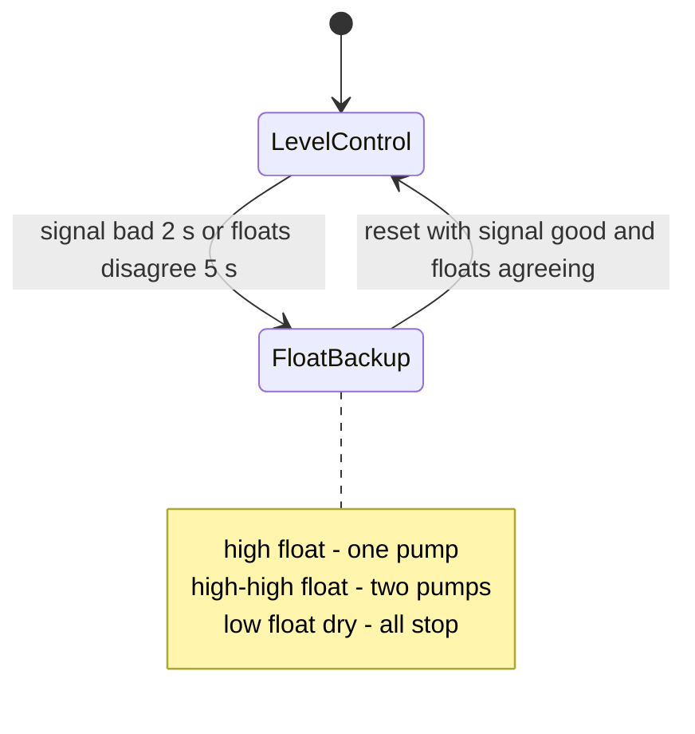
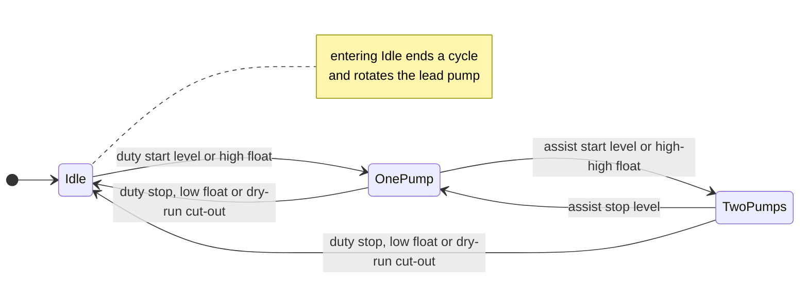
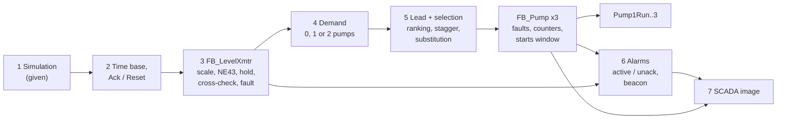

# 24-3 — Capstone: Wastewater Pump Station

> **Level:** Capstone · **Time:** ~30–40 hours · **Prerequisites:** Levels 1–4 (Modules 01–19),
> especially [07 Timers](../07-timers/), [11 Program organisation](../11-program-organization/),
> [12 Data structures](../12-data-structures/),
> [14 Analog and process I/O](../14-analog-and-process-io/),
> [16 Alarms and diagnostics](../16-alarms-and-diagnostics/),
> [17 Industrial communications](../17-industrial-communications/) and
> [18 HMI and SCADA](../18-hmi-and-scada/)

Somewhere under a grass verge on the edge of town there is a concrete chamber, a steel kiosk and
a small antenna. Sewage from a few hundred homes flows downhill into the chamber, and three
submersible pumps lift it up a pipe to the next gravity sewer. Nobody works there. The station
runs day and night on its own and reports to a control room miles away. When it goes wrong,
raw sewage spills into a stream, and the operator has some explaining to do to the environmental
regulator.

In this capstone you write the complete control program for that station: level measurement with
fault detection, duty/assist/standby pump control with alternation, fault handling with automatic
substitution, float backup when the level transmitter fails, dry-run protection, a starts-per-hour
limit, alarms with acknowledgement, and a SCADA interface with a documented register map. The
plant is simulated, so you can test everything, including failures you would never be allowed
to cause on a real station, against a full factory acceptance test (FAT).

This brief is the only document you need. It is written the way a real functional specification
is written. Read it once end to end before you write any code.

## What you will demonstrate

By the end of this project you will be able to:

- Turn a written functional specification into a structured, testable IEC 61131-3 program.
- Process a 4–20 mA level signal: scaling, NAMUR NE43 fault limits, hold-last-good, and
  cross-checking against discrete float switches.
- Design duty/assist/standby control with alternation, run-time balancing and automatic
  substitution of failed pumps.
- Supervise motors with feedback timeouts and latched faults, and apply a sound reset philosophy.
- Implement a rolling starts-per-hour limit and drift-free run-time counters.
- Build an alarm system with active/unacknowledged states, acknowledgement and a beacon.
- Define a SCADA interface as status words, counters and a Modbus-style register map, including
  command handshakes and 32-bit word order.
- Prove the program against a FAT, and explain how your design behaves when things fail.

## 1. The station

The station is a **wet-well pumping station** (North America: *lift station*).
Sewage arrives by gravity from the incoming sewer and collects in the **wet well**, a concrete
chamber. When enough has collected, a pump lifts it through a non-return (check) valve into the
**rising main** (North America: *force main*), a pressure pipe that runs up to a manhole on a
higher gravity sewer.

Three identical submersible pumps, P-101, P-102 and P-103, stand on the floor of the well. Each
is started by its own starter in the control kiosk: a direct-on-line (DOL) contactor with a motor
overload relay, or a variable-speed drive (VFD) run at fixed speed. The PLC sees the same signals
either way: a run command out, a *running* feedback in, and a *protection healthy* contact in.
(With a VFD the "running" and "fault" signals come from the drive's relay outputs.)

The station is designed for **duty/assist/standby** operation (lead/lag/standby in North
American terms):

- **Duty (lead):** one pump handles normal flows.
- **Assist (lag):** a second pump joins in wet weather when one pump cannot keep up.
- **Standby:** the third pump is installed spare. It runs only when one of the others is
  unavailable. It is *not* extra capacity: the rising main is sized for two pumps, and a third
  pump would add little flow while pushing every pump to an inefficient point on its curve.

Here is the wet well in cross-section, with every level that matters. All levels in this brief
are in metres above the well floor.

```text
                      kiosk: PLC, starters/VFDs, telemetry outstation
                                          |
  incoming sewer                          |                  rising main
 ================>+-----------------------+-----------------+=================> to gravity sewer
                  |                                         |
      3.20 m      |~~~~~~~~~~ emergency overflow ~~~~~~~~~~~|=====> spill (reportable)
      2.80 m      |  (o) high-high float   LSHH-101         |
      2.50 m      |  (o) high float        LSH-101          |
      2.20 m      |  - - high-level alarm (transmitter)     |
      1.90 m      |  - - assist start                       |
      1.50 m      |  - - duty start                         |
      0.90 m      |  - - assist stop                        |
      0.60 m      |  - - duty stop                          |
      0.45 m      |  - - low-level alarm, dry-run cut-out   |
      0.35 m      |  (o) low float         LSL-101          |
      0.25 m      |  - - minimum pump submergence           |
      0.00 m      |_[P-101]__[P-102]__[P-103]____[LT-101]___|
                    submersible pumps         level transmitter
```

Levels marked `- -` are **setpoints** in the PLC (most can be changed from SCADA). Levels marked
`(o)` are **float switches**, physical devices hung at fixed heights. The level transmitter LT-101
is the primary measurement, and the floats are the independent backup. Why both? A transmitter
can fail in ways that look perfectly healthy (a frozen reading, for example), and a lift station
must never rely on a single instrument to prevent an overflow.

The device tags follow ISA-5.1 letter codes: **LT** level transmitter, **LSL/LSH/LSHH** level
switch low/high/high-high. On a loop drawing you would see LT-101 as a two-wire 4–20 mA loop,
often through a 250 Ω burden (1–5 V) or straight into a current input card. A wet well is often a
classified hazardous area because sewer gas can contain methane, so the transmitter and floats
are commonly intrinsically-safe devices wired through IS barriers or isolators
([Module 02](../02-electrical-and-field-devices/)). None of that changes the PLC logic, but you
would see it on the drawings.

### Storage, pump capacity and cycle time: a worked example

The wet well has a plan area of **4.0 m²**, so **1 m of level holds 4,000 L** and 1 cm holds 40 L.
Between the duty start (1.50 m) and duty stop (0.60 m) the storage volume is

```text
V = A x (start - stop) = 4.0 m2 x 0.90 m = 3.6 m3 = 3,600 L
```

One pump delivers **Q = 25 L/s**. With an inflow of *q* L/s, one pumping cycle takes the time to
fill *V* plus the time to pump it down:

```text
T = V/q + V/(Q - q)
```

At very low inflow the well fills slowly (long cycles). At inflow close to Q the pump takes a long
time to empty the well (also long cycles). The shortest cycle is at **q = Q/2**, and it is a
classic result for lift stations:

```text
T_min = 4V/Q = 4 x 3,600 / 25 = 576 s = 9.6 min      (fill 288 s + pump down 288 s)
```

So with these setpoints a single pump can be asked to start at most about **6.25 times per hour**.
With three pumps alternating, each pump starts about 2 times per hour at worst. Motor
manufacturers state a maximum number of starts per hour, usually fewer for larger motors. That is
why the storage between start and stop levels is sized the way it is, and why this station has a
starts-per-hour limit (section 5.7) as a last line of defence.

### A wet-weather cycle: a worked example

Two pumps together deliver **40 L/s**, not 50. Friction in the rising main rises with flow, so
two pumps in parallel each work against a higher head and each delivers less. Suppose the
inflow rises to 30 L/s:

| Time | Level | What happens |
|---|---|---|
| 0 s | 1.50 m | Duty start: the lead pump starts. 30 in, 25 out: the level still rises at 5 L/s = 1.25 mm/s. |
| 320 s | 1.90 m | Assist start: the second pump starts. 30 in, 40 out: the level falls at 10 L/s. |
| 720 s | 0.90 m | Assist stop: the assist stops. The lead runs on, and the level rises again. |
| 1,520 s | 1.90 m | The assist starts again, and so on. |

The lead never stops while the inflow is above 25 L/s, and the assist cycles about every 20
minutes. Alternation (section 5.4) happens only when the station goes idle, so in a long wet spell
the lead does most of the running. Run-time balancing (also section 5.4) is one answer, and a
maximum continuous run time is another (see the extension ideas).

## 2. Scope

**In scope** (you write this):

- All PLC control logic in Structured Text, in the given starter file.
- Level measurement, transmitter fault detection and float backup control.
- Pump selection, alternation, run-time balancing, stagger, substitution, fault supervision.
- Dry-run protection, starts-per-hour limit, counters.
- Alarms, acknowledge, reset, beacon.
- The SCADA interface image (the `Scada` structure) and its documented register map.

**Out of scope** (assumed to exist, or left for the extension ideas):

- Hard-wired circuits: Hand mode on the Hand-Off-Auto (HOA) switches, the overload relays
  opening the contactors, emergency stops, and any hard-wired float backup relays. On a real
  station these work even when the PLC is dead.
- Configuring a real Modbus server, telemetry radio or SCADA screens. The register map is
  documentation of the interface you build.
- VFD speed control, setpoint validation, float-switch fault detection, power-failure restart
  sequencing, event logging. These are extension ideas in section 12.

> **Safety note.** This is a training exercise on a simulated plant. A real pumping station is a
> confined space with toxic and potentially explosive gases, and it is designed, installed and
> maintained under the owner's standards and the electrical and functional-safety rules that
> apply. The PLC here is a standard control system, not a safety system. Overflow risk is managed
> by layers: the PLC, independent floats, alarms to a staffed control room, and emergency storage.
> An HOA switch in Off is not an isolation. Never treat these labs as a design for real
> equipment.

## 3. The plant simulation (given)

The starter already contains a function block **`FB_WetWellSim`**, instance **`Sim`**, that models
the wet well, the pumps and the instruments. Your program calls it at the top of every scan
(section 1 of the starter, already written), and the test drives it by writing its inputs.

```iecst
  (* ===== 1. PLANT SIMULATION (given - do not change) ==================== *)
  IF SimEnable THEN
    Sim(Run1 := Pump1Run, Run2 := Pump2Run, Run3 := Pump3Run);
    LevelRaw := Sim.LevelRaw;
    LowFloatWet := Sim.LowFloatWet;
    HighFloat_NC := Sim.HighFloat_NC;
    HHFloat_NC := Sim.HHFloat_NC;
    Pump1Running := Sim.Running1;
    Pump2Running := Sim.Running2;
    Pump3Running := Sim.Running3;
    Pump1OverloadOK_NC := Sim.OverloadOK1_NC;
    Pump2OverloadOK_NC := Sim.OverloadOK2_NC;
    Pump3OverloadOK_NC := Sim.OverloadOK3_NC;
  END_IF;
```

The simulation takes last scan's outputs and writes this scan's **input image**, just as the I/O
system of a real PLC does between scans. Everything after section 1 reads the same input
variables it would read on a real PLC. On the real station you set `SimEnable := FALSE` (or delete
section 1) and nothing else changes. This is the everyday form of *virtual commissioning*
([Module 22](../22-software-engineering/)). Note that the HOA switches and the push-buttons are
**not** simulated: the test sets them directly, playing the operator.

### The model

| Item | Model |
|---|---|
| Wet well | Plan area 4.0 m² (1 m = 4,000 L). Starts at 1.00 m with no inflow. Spills to the emergency overflow above 3.20 m. |
| Pumps | Station outflow: 1 pump 25 L/s, 2 pumps 40 L/s, 3 pumps 48 L/s. Flow falls to zero as the level drops from 0.25 m (minimum submergence) to 0.10 m. |
| Pump feedback | `RunningN` comes on 0.5 s after the run command, unless the pump is tripped or will not run. It drops as soon as the command drops or the pump trips. |
| Overload | While `Sim.TripN` is TRUE, `OverloadOKN_NC` is FALSE and the pump cannot run. Setting it FALSE again is the electrician resetting the overload relay. |
| Transmitter | 0–4.00 m = 4–20 mA. A healthy transmitter saturates within 3.8–20.5 mA (NE43). |
| Analog card | 4 mA = 0 counts, 20 mA = 27648 counts, so 1 mA = 1728 counts and 1 m = 6912 counts. Clips at −4864 and 32511 counts. |
| Low float LSL | `LowFloatWet` TRUE (wet) at ≥ 0.40 m, FALSE (dry) at ≤ 0.35 m. |
| High float LSH | `HighFloat_NC` FALSE (tripped) at ≥ 2.50 m, TRUE again at ≤ 2.45 m. |
| High-high float LSHH | `HHFloat_NC` FALSE (tripped) at ≥ 2.80 m, TRUE again at ≤ 2.75 m. |
| Time step | The level is integrated in fixed 0.1 s steps, independent of your task interval. |

The floats have a 5 cm switching differential, like a real tethered float. The card's clipping
limits are the ends of the overrange and underrange bands that Siemens S7-1200/1500 analog
inputs use for 4–20 mA (32511 ≈ 22.8 mA, −4864 ≈ 1.19 mA). Real cards differ, and many report
a wire break as a diagnostic value instead (Module 14).

| Condition | Current | Counts | Level reading |
|---|---|---|---|
| Empty well | 4.0 mA | 0 | 0.00 m |
| 1.00 m | 8.0 mA | 6912 | 1.00 m |
| High float | 14.0 mA | 17280 | 2.50 m |
| Top of range | 20.0 mA | 27648 | 4.00 m |
| NE43 saturation (healthy) | 3.8 / 20.5 mA | −346 / 28512 | −0.05 / 4.125 m |
| NE43 failure limits | 3.6 / 21.0 mA | −691 / 29376 | below / above these: not valid (FS-02) |
| `XmtrLow` fault | 3.5 mA | −864 | not valid |
| `XmtrHigh` fault | 21.5 mA | 30240 | not valid |
| `XmtrWireBreak` fault | 0 mA | −4864 (clipped) | not valid |

### `Sim` inputs (the test writes these)

| Input | Type | Default | Meaning |
|---|---|---|---|
| `Run1`, `Run2`, `Run3` | BOOL | | Run commands. Wired to `Pump1Run`..`Pump3Run` in section 1; don't set them from a test. |
| `InflowLps` | REAL | 0.0 | Sewage inflow, L/s |
| `Trip1`, `Trip2`, `Trip3` | BOOL | FALSE | Fault injection: overload relay tripped |
| `NoRun1`, `NoRun2`, `NoRun3` | BOOL | FALSE | Fault injection: the pump will not run and gives no feedback (for example an open-circuit contactor coil). Setting it while the pump runs makes the pump stop by itself. |
| `XmtrFault` | `E_XmtrFault` | `XmtrOK` | Fault injection: `XmtrOK`, `XmtrWireBreak` (0 mA), `XmtrLow` (3.5 mA), `XmtrHigh` (21.5 mA), `XmtrFrozen` (output stuck at its present value) |
| `Level` | REAL | 1.0 | The **true** level, m. A test may set it to jump to a new level. |

### `Sim` outputs

| Output | Type | Meaning |
|---|---|---|
| `LevelRaw`, `LowFloatWet`, `HighFloat_NC`, `HHFloat_NC`, `Running1..3`, `OverloadOK1_NC..3` | | Field signals. Section 1 copies them to the inputs. |
| `Level` | REAL | True level, m (whatever the transmitter says) |
| `OutflowLps` | REAL | Pumped flow, L/s |
| `PumpsRunning` | INT | Pumps running now |
| `MaxPumpsRunning` | INT | Most pumps ever running at the same time |
| `Starts1`, `Starts2`, `Starts3` | DINT | Starts seen by the simulation, per pump |
| `MaxStartsInHour` | INT | Most starts of any one pump within any 60 minutes |
| `DryRunS` | REAL | Seconds that any pump ran with the level below 0.25 m |
| `SpillL` | REAL | Litres spilled to the overflow |
| `MinLevel`, `MaxLevel` | REAL | Lowest and highest true level seen, m |

The observer outputs make the simulation an **independent referee**. Your program may *believe*
it protected the pumps; `Sim.DryRunS` says whether it did. When you debug, `print Sim.Level`
next to `print Scada.LevelMm` is often the fastest way to see a measurement problem.

## 4. I/O list

Keep these names, types and addresses exactly. The acceptance test uses the names.

**Digital inputs**

| Tag | Address | Device | Description |
|---|---|---|---|
| `LowFloatWet` | `%IX0.0` | LSL-101 | Low float. TRUE = submerged (wet). A broken wire reads "dry", which stops the pumps: the safe side for the pumps. |
| `HighFloat_NC` | `%IX0.1` | LSH-101 | High float, NC contact. TRUE = level below the float. FALSE = level ≥ 2.50 m **or wire broken**, so a fault looks like high level. |
| `HHFloat_NC` | `%IX0.2` | LSHH-101 | High-high float, NC. FALSE = level ≥ 2.80 m or wire broken. |
| `AckPB` | `%IX0.3` | HS-101 | Panel push-button: acknowledge alarms (NO) |
| `ResetPB` | `%IX0.4` | HS-102 | Panel push-button: reset faults (NO) |
| `Pump1Auto` | `%IX1.0` | HS-111 | P-101 Hand-Off-Auto switch in **Auto** |
| `Pump1Running` | `%IX1.1` | | P-101 running feedback (contactor auxiliary or VFD "running" relay) |
| `Pump1OverloadOK_NC` | `%IX1.2` | | P-101 motor protection healthy (overload relay or VFD fault relay, NC). FALSE = tripped. |
| `Pump2Auto`, `Pump2Running`, `Pump2OverloadOK_NC` | `%IX2.0`–`%IX2.2` | | Same for P-102 |
| `Pump3Auto`, `Pump3Running`, `Pump3OverloadOK_NC` | `%IX3.0`–`%IX3.2` | | Same for P-103 |

**Analog input**

| Tag | Address | Type | Description |
|---|---|---|---|
| `LevelRaw` | `%IW0` | INT | LT-101, 0–4.00 m = 4–20 mA = 0–27648 counts |

**Digital outputs**

| Tag | Address | Description |
|---|---|---|
| `Pump1Run` | `%QX0.0` | P-101 run command (contactor coil or VFD run) |
| `Pump2Run` | `%QX0.1` | P-102 run command |
| `Pump3Run` | `%QX0.2` | P-103 run command |
| `AlarmBeacon` | `%QX0.3` | Alarm beacon on the kiosk: flashing = unacknowledged alarm, steady = active alarm |

**Given variables** (declared in the starter; keep the names):

| Name | Type | Description |
|---|---|---|
| `Cfg` | `ST_Config` (RETAIN) | Setpoints written by SCADA (section 6.4) |
| `Scada` | `ST_Scada` | The SCADA interface image (section 6) |
| `Sim` | `FB_WetWellSim` | Plant simulation (section 3) |
| `SimEnable` | BOOL | TRUE: run the simulation |

Everything else (your function blocks, instances, internal variables) is your design. One
practical warning: the test finds the lower bound of `Scada.Pump[...]` by searching the source
for the array called `Pump`. Don't declare another array called `Pump` with different bounds.

## 5. Functional specification

Each requirement has a number so that your design notes, your code comments and the FAT can
refer to it. "At once" means within one scan, and the FAT allows up to 0.5 s.

### 5.1 Level measurement

- **FS-01 Scaling.** Level in metres = `LevelRaw` × 4.0 / 27648. `Scada.LevelMm` shows it in
  millimetres, limited to 0–4000, to within ±20 mm. You may filter the level (first-order, time
  constant ≤ 2 s) if you initialise the filter from the first good reading.
- **FS-02 Signal check (NAMUR NE43).** The signal is **bad** while `LevelRaw` < −691 (3.6 mA) or
  `LevelRaw` > 29376 (21.0 mA). Check the raw value, not a filtered one.
- **FS-03 Hold last good.** While the signal is bad, keep using the last good level. A bad value
  must never be used for control or alarms, not even for one scan.
- **FS-04 Out-of-range fault.** If the signal is bad continuously for **2 s**, declare a
  **transmitter fault**. A shorter glitch is ignored: no fault, no alarm, no pump action.
- **FS-05 Float cross-check.** Declare a transmitter fault if, continuously for **5 s**, either
  - the high float is tripped while the measured level is below 2.20 m (2.50 m − 0.30 m), or
  - the low float is dry while the measured level is above 0.65 m (0.35 m + 0.30 m).
  Within this project the floats are trusted: when they disagree with the transmitter, the
  transmitter is wrong. This is what catches a **frozen** transmitter.
- **FS-06 Latching.** The transmitter fault is latched. It clears only on a reset command
  (FS-39) given while the signal is good and there is no float disagreement.

### 5.2 Control modes

- **FS-07 Level control** is the normal mode, used while there is no transmitter fault.
  **Float backup** is used while the transmitter fault is latched. The change between modes is
  automatic (to float backup) and needs a reset to go back (FS-06).
- **FS-08 Hand-Off-Auto.** The PLC may only command a pump whose HOA switch is in Auto. A pump
  not in Auto is simply unavailable. It is not a fault and raises no alarm.



### 5.3 Pump demand

The station first decides **how many** pumps it wants (0, 1 or 2), then **which** pumps (5.4, 5.5).

- **FS-09 Lead demand (level control).** On when the level is ≥ `Cfg.DutyStartMm`; off when the
  level is ≤ `Cfg.DutyStopMm`.
- **FS-10 Assist demand (level control).** On at ≥ `Cfg.AssistStartMm`; off at ≤ `Cfg.AssistStopMm`.
- **FS-11 Float override (level control).** A tripped high float turns lead demand on; a
  tripped high-high float turns assist demand on. Once on, they go off by the normal stop levels
  (FS-09, FS-10). A tripped float always wins over a stop level.
- **FS-12 Float backup demand.** The high float turns lead demand on; the high-high float turns
  assist demand on; **both stay on until the low float goes dry**. Demand that already exists
  when the station changes to float backup carries on, so a running pump keeps running down to
  the low float.
- **FS-13 Dry-run cut-out** (both modes, highest priority). The low float dry turns all demand
  off at once. In level control a level at or below `Cfg.LowAlarmMm` also turns all demand off at
  once, whatever the stop setpoints say.
- **FS-14 Two pumps maximum.** Never more than two pumps at once, in any mode.

### 5.4 The lead pump, alternation and balancing

- **FS-15** After a cold start (no retained data) pump 1 is the lead.
- **FS-16 Rotation** (`Cfg.BalanceByHours` = FALSE). At the end of every pumping cycle (the moment
  all demand goes off), the lead moves to the next **available** pump after the current lead, in
  the order 1 → 2 → 3 → 1.
- **FS-17 Balancing** (`Cfg.BalanceByHours` = TRUE). While the station is idle, the lead is the
  available pump with the least run time (`RunSeconds`). On a tie, the lower pump number wins.
- **FS-18 Lead out of service.** If the lead pump becomes unavailable (fault, or HOA not in Auto)
  at any time, the lead passes at once to the next available pump in the order 1 → 2 → 3 → 1.
  Apart from this, the lead never changes during a cycle.
- **FS-19** `Scada.LeadPump` shows the current lead (1–3).

### 5.5 Pump selection and substitution

- **FS-20 Priority order.** The pumps are ranked: the lead first, then the following pump
  numbers in rotation (lead 2 gives the order 2, 3, 1). The first available pump is the duty,
  the next is the assist, and the third is the standby.
- **FS-21 Keep running pumps.** A pump that is running and still needed and available keeps
  running. Pumps are never swapped just to follow the ranking.
- **FS-22 Start the next pump.** When fewer pumps run than are wanted, start the
  highest-ranked pump that is available and not start-limited (FS-30). This is the automatic
  substitution: a failed or unavailable pump is simply skipped, and the standby takes its place.
- **FS-23 Start stagger.** At least **5 s** between any two pump starts (rising edges of the run
  commands), to limit inrush current and pressure surges. A start delay of up to 5 s after
  power-up is allowed but not required.
- **FS-24 Stop order.** When demand falls from two pumps to one, the lower-ranked running pump
  (normally the assist) stops.

### 5.6 Pump supervision and faults

A pump is **available** when its HOA switch is in Auto and it has no latched fault.

- **FS-25 Overload fault.** When `PumpNOverloadOK_NC` goes FALSE, latch the overload fault and
  remove the run command at once.
- **FS-26 Feedback fault.** If the pump is commanded and the running feedback is missing for
  **5 s**, latch the feedback fault and remove the command. This one rule covers both *fail to
  start* and *stopped by itself while running*.
- **FS-27 No self-restart.** A faulted pump never restarts by itself, even when the overload
  relay is reset in the field. It needs a fault reset first.
- **FS-28 Reset.** A reset command (FS-39) clears a pump's latched faults only if the cause has
  gone (the overload input is healthy again). A reset never starts a pump by itself. It just makes
  the pump available, and the normal level control then decides.

### 5.7 Starts per hour

- **FS-29** A start is counted on each rising edge of the running feedback.
- **FS-30 Limit.** `StartsLastHour` is the number of starts in the **last 60 minutes**, a rolling
  window rather than clock hours. A start must count for the full 60 minutes; counting it for up
  to one minute longer is acceptable (for example if you keep starts in one-minute buckets). A
  pump with `StartsLastHour` ≥ `Cfg.MaxStartsPerHour` is **start-limited**: it may keep running,
  but it may not be started. Values 1–30 must work; 0 (or less) disables the limit.
- **FS-31 Override.** While the high float or the high-high float is tripped, the limit is
  ignored. An overflow is worse than an extra motor start.

### 5.8 Counters

- **FS-32** `Scada.Pump[n].Starts`: total starts (FS-29).
- **FS-33** `Scada.Pump[n].RunSeconds`: total time with the running feedback on, in whole
  seconds, accurate to better than 1 %, with no drift however long it runs.
- **FS-34** `Scada.Pump[n].StartsLastHour` (FS-30).
- **FS-35** On a real PLC the counters, the lead pump and the setpoints must be **retentive**
  ([Module 03](../03-data-types-and-addressing/)). The test starts every scenario from a fresh PLC,
  so it cannot check this, but your design review will.

### 5.9 Alarms

- **FS-36 Alarm list.** One bit per alarm, in `Scada.AlmActive` (condition present now) and
  `Scada.AlmUnack` (not yet acknowledged):

| Bit | Mask | Alarm | Active when | Delay and clearing |
|---|---|---|---|---|
| 0 | `16#0001` | High level | level control and level ≥ `Cfg.HighAlarmMm` | on after 2 s; clears below the setpoint − 0.05 m |
| 1 | `16#0002` | High float | high float tripped | none (a debounce of up to 1 s is allowed) |
| 2 | `16#0004` | High-high float | high-high float tripped | none (up to 1 s allowed) |
| 3 | `16#0008` | Low level | level control and level ≤ `Cfg.LowAlarmMm` | on after 2 s; clears above the setpoint + 0.05 m |
| 4 | `16#0010` | Level transmitter fault | fault latched (FS-04..FS-06) | clears with the fault |
| 5 | `16#0020` | Pump 1 fault | overload or feedback fault latched | clears with the fault |
| 6 | `16#0040` | Pump 2 fault | same, pump 2 | |
| 7 | `16#0080` | Pump 3 fault | same, pump 3 | |
| 8 | `16#0100` | No pump available | none of the three pumps is available | none |
| 9 | `16#0200` | Starts limit | any pump is start-limited | none |
| 10–15 | | spare, always 0 | | |

  The level alarms are suppressed in float backup: the measurement is not valid, and the
  transmitter fault alarm already tells the operator.
- **FS-37 Alarm states.** When an alarm becomes active, its unacknowledged bit is set. It is
  cleared only by an acknowledge, and it stays set if the alarm clears before anyone acknowledges
  it. This is the ISA-18.2 "returned to normal, unacknowledged" state, so a fleeting alarm is
  never missed ([Module 16](../16-alarms-and-diagnostics/)).
- **FS-38 Acknowledge.** A press of `AckPB` (rising edge) or `Scada.CmdAck` acknowledges all
  alarms. A button that is held down, or stuck, must not acknowledge alarms that arrive later.
- **FS-39 Reset.** A press of `ResetPB` (rising edge) or `Scada.CmdReset` resets latched pump
  faults (FS-28) and the transmitter fault (FS-06). Acknowledge and reset are separate on
  purpose: acknowledging says "I have seen it", and resetting says "the cause is fixed, use the
  equipment again".
- **FS-40 Beacon.** `AlarmBeacon` flashes (on and off in turn, each for 0.25–1 s) while any
  alarm is unacknowledged, is steady while alarms are active and all are acknowledged, and is
  off otherwise.
- **FS-41** A healthy station raises no alarm at power-up.

### 5.10 SCADA interface

- **FS-42** The `Scada` image (section 6) is refreshed every scan.
- **FS-43 Command handshake.** `Scada.CmdAck` and `Scada.CmdReset` are pulse commands. SCADA
  writes TRUE, and the PLC acts once and writes FALSE back (within 0.5 s), so SCADA can see that
  the command was taken.
- **FS-44** Setpoints in `Cfg` are live: a change from SCADA takes effect at once.

## 6. SCADA interface

### 6.1 The interface image

The given types (in the starter) define the image:

```iecst
TYPE
  ST_PumpScada : STRUCT
    Status         : WORD;  (* see 6.2 *)
    Starts         : DINT;
    RunSeconds     : DINT;
    StartsLastHour : INT;
  END_STRUCT;

  ST_Scada : STRUCT
    StationStatus : WORD;
    AlmActive     : WORD;
    AlmUnack      : WORD;
    LevelMm       : INT;
    LeadPump      : INT;
    PumpsRunning  : INT;   (* number of running feedbacks *)
    Pump          : ARRAY[1..3] OF ST_PumpScada;
    CmdAck        : BOOL;  (* SCADA -> PLC pulse *)
    CmdReset      : BOOL;  (* SCADA -> PLC pulse *)
  END_STRUCT;
END_TYPE
```

The image is register-shaped on purpose: integers in engineering units (mm, s), bit-packed
words, 32-bit counters. The conversion from the PLC's internal REALs and BOOLs happens once, at
the boundary. Keep your **internal** data (counters, fault latches) outside this structure and
copy it in every scan. If a SCADA master then writes nonsense into a status register, the next
scan overwrites it and your real counters are untouched. Treating everything that comes in over
the network as untrusted is also basic IEC 62443 thinking ([Module 22](../22-software-engineering/)).

### 6.2 Status words

**Station status** (`Scada.StationStatus`):

| Bit | Mask | Meaning |
|---|---|---|
| 0 | `16#0001` | Level control mode |
| 1 | `16#0002` | Float backup mode |
| 2 | `16#0004` | Pumping (any running feedback on) |
| 3 | `16#0008` | Any alarm active |
| 4 | `16#0010` | Any alarm unacknowledged |

For example: healthy and idle = `16#0001`; pumping = `16#0005`; float backup with the transmitter
alarm active and unacknowledged = `16#001A`.

**Pump status** (`Scada.Pump[n].Status`):

| Bit | Mask | Meaning |
|---|---|---|
| 0 | `16#0001` | HOA in Auto |
| 1 | `16#0002` | Available (Auto and no latched fault) |
| 2 | `16#0004` | Run command on |
| 3 | `16#0008` | Running feedback on |
| 4 | `16#0010` | Overload fault (latched) |
| 5 | `16#0020` | Feedback fault (latched: failed to start or stopped by itself) |
| 6 | `16#0040` | Start-limited |

For example: ready = `16#0003`; running = `16#000F`; overload tripped = `16#0011`; failed to start =
`16#0021`; ready but start-limited = `16#0043`; HOA not in Auto = `16#0000`.

### 6.3 Register map (Modbus-style)

The SCADA outstation reads and writes the station over Modbus ([Module 17](../17-industrial-communications/)).
The map below uses the traditional 4xxxx/0xxxx reference numbers. Register 40001 is protocol
address 0 (offset 0). The 32-bit values take two registers, **high word first**. Word order is
not standardised, so confirm it with the SCADA integrator and write it on the map.

| Register | Offset | Source | Type | Units / notes |
|---|---|---|---|---|
| 40001 | 0 | `Scada.StationStatus` | WORD | 6.2 |
| 40002 | 1 | `Scada.AlmActive` | WORD | 5.9 |
| 40003 | 2 | `Scada.AlmUnack` | WORD | 5.9 |
| 40004 | 3 | `Scada.LevelMm` | INT | mm; not valid while bit 4 of 40002 is set |
| 40005 | 4 | `Scada.LeadPump` | INT | 1–3 |
| 40006 | 5 | `Scada.PumpsRunning` | INT | 0–3 |
| 40011 | 10 | `Scada.Pump[1].Status` | WORD | 6.2 |
| 40012–40013 | 11–12 | `Scada.Pump[1].Starts` | DINT | high word first |
| 40014–40015 | 13–14 | `Scada.Pump[1].RunSeconds` | DINT | s, high word first |
| 40016 | 15 | `Scada.Pump[1].StartsLastHour` | INT | |
| 40021–40026 | 20–25 | `Scada.Pump[2]` | | same layout as pump 1 |
| 40031–40036 | 30–35 | `Scada.Pump[3]` | | same layout as pump 1 |

The blocks leave spare registers, so each pump can grow without moving anything else. Pump 1 at
40011, pump 2 at 40021 and pump 3 at 40031 is a pattern a SCADA engineer can check at a glance.

**Commands (coils)**

| Coil | Offset | Target | Notes |
|---|---|---|---|
| 00001 | 0 | `Scada.CmdAck` | write 1; the PLC resets it to 0 when done (FS-43) |
| 00002 | 1 | `Scada.CmdReset` | write 1; the PLC resets it to 0 when done |

### 6.4 Setpoints

| Register | Offset | `Cfg` field | Default | Units | Notes |
|---|---|---|---|---|---|
| 40101 | 100 | `DutyStartMm` | 1500 | mm | lead pump start |
| 40102 | 101 | `DutyStopMm` | 600 | mm | lead pump stop |
| 40103 | 102 | `AssistStartMm` | 1900 | mm | assist start |
| 40104 | 103 | `AssistStopMm` | 900 | mm | assist stop |
| 40105 | 104 | `HighAlarmMm` | 2200 | mm | high-level alarm |
| 40106 | 105 | `LowAlarmMm` | 450 | mm | low-level alarm and dry-run cut-out |
| 40107 | 106 | `MaxStartsPerHour` | 6 | starts | per pump; 0 = no limit |
| 40108 | 107 | `BalanceByHours` | 0 | 0/1 | 0 = rotate each cycle, 1 = balance run time |

`Cfg` is declared `VAR RETAIN` so the setpoints survive a power cycle.

**Worked example: a 32-bit counter on the wire.** Pump 1 has made 70,000 starts. In hex,
70,000 = `16#0001_1170`. High word first: register 40012 = `16#0001` = 1 and register 40013 =
`16#1170` = 4464. The SCADA rebuilds it as 1 × 65,536 + 4,464 = 70,000. If SCADA shows
292,552,705 instead, it has the word order the other way round: `16#1170_0001`.

## 7. Control philosophy

This section explains *why* the specification says what it says. You will need these arguments
in your design review, and on a real project in the HAZOP and the commissioning meetings.

**Measure, then doubt the measurement.** The transmitter is the best instrument on site. It is
continuous and accurate, and it lets SCADA adjust setpoints. But a 4–20 mA loop can fail low (a
broken wire, 0 mA), fail high, or drift, and a well-designed transmitter signals its own
failures with NE43 currents. The PLC must treat those values as *no information*, not as a
level. That is why FS-03 holds the last good value: a pump that is running keeps running, and a
pump that is off stays off, until the fault is confirmed and float backup takes over. Using the
failed value for even one scan could stop a running pump (0 mA reads as an empty well) or start
two pumps for no reason (21.5 mA reads as more than 4 m).

**Some failures only another instrument can see.** A transmitter that freezes at 1.00 m sends a
perfectly healthy 8.0 mA. No signal check will catch it. The floats are a *different
technology*, mounted at fixed heights, and FS-05 uses them as a referee. A tripped high float
with the transmitter reading 1.00 m means the transmitter is lying. Here is a frozen transmitter,
second by second, with an inflow of 20 L/s:

| Time | True level | Transmitter reads | What the PLC does |
|---|---|---|---|
| 0 s | 1.00 m | 1.00 m (freezes) | nothing to do |
| 100 s | 1.50 m | 1.00 m | would start the lead pump, but cannot know |
| 300 s | 2.50 m | 1.00 m | high float trips: float override starts the lead (FS-11); high float alarm |
| 305 s | 2.49 m | 1.00 m | 5 s of disagreement: transmitter fault latched, float backup (FS-05, FS-07) |
| ~2,000 s | 0.35 m | 1.00 m | low float dry: the pump stops (FS-12, FS-13) |

Without the float override the pump would have waited 5 s more for the fault. Without the
floats the station would have spilled at 3.20 m after 440 s, with the SCADA screen showing a
calm 1.00 m.

**Dry running.** A submersible pump that runs with its intake exposed draws air, loses its
cooling and wrecks its seals. There are two layers of protection: the low-level setpoint in
level control, and the low float in every mode. The low float's contact is closed when wet, so a
broken wire reads *dry* and stops the pumps. That is the safe side for the pumps, but not for
overflow. It is also the weak point of this design: with a broken low-float wire the station
cannot pump at all, and because FS-05 trusts the floats it even blames the transmitter. The
high-level alarms bring someone to site, and on a real station a hard-wired float circuit
would keep pumping in the meantime. Extension 3 asks you to do better.

**The high floats are wired fail-to-alarm.** They are NC contacts that open on high level, so a
broken wire raises the alarm and calls for a pump. A float that can never trip would be silent
until the well spilled, which is far worse. The price is paid elsewhere. In this design a high
float that looks permanently tripped also makes FS-05 blame the transmitter, and the station
then cycles the pumps between the low float's switching points (0.35 and 0.40 m, only 200 L
apart) with the starts limit overridden. At a moderate inflow the simulation shows around a
hundred starts an hour. There is no spill and no dry running, but it is hard on the motors until
someone repairs the wire. That is extension 3
again.

**Faults latch, and resets are deliberate.** An overload trip means something is wrong: a rag
wrapped round the impeller, a failing bearing, a phase loss. If the pump restarted by itself when
the relay cooled, it would cycle trip-restart-trip until the motor burned out, and nobody would
know. So the fault latches (FS-25 to FS-28), the standby takes over, and a human decides when the
pump may run again. The same goes for the transmitter: an intermittent transmitter is not to be
trusted until someone has looked at it.

**Stagger, and never three.** Starting two motors in the same instant doubles the inrush
current. On a weak rural supply that can pull the voltage down far enough to upset other
equipment, and it can overload a standby generator. Two pumps starting together also send a
larger pressure surge up the rising main. Five seconds between starts costs nothing. Three
pumps are never needed, because the rising main limits the flow.

**Starts per hour, in a rolling window.** Motor starting heats the windings. The manufacturer's
limit is about heat, and heat does not reset on the hour. A clock-hour counter with a limit of
six would allow six starts just before 10:00 and six more just after it: twelve in a few
minutes. The limit is a last resort, so when the high float trips it gives way (FS-31). Losing a
little motor life is better than a pollution incident.

**Alternation and balancing.** Rotating the lead spreads wear and exercises every pump, and a
pump that never runs is a pump that won't start when it is needed. Balancing by run time evens
out the hours after one pump has been replaced or has been out of service for months.

**The operator's view.** The beacon flashes for anything new, and the unacknowledged word keeps
fleeting alarms visible. Acknowledge and reset are separate actions. Every command from SCADA
gets a visible response (the handshake). These are small things, and they are what make a station
trustworthy to the people who run it.



In level control the stop is the duty stop level; in float backup it is the low float. The
dry-run cut-out works in both.

## 8. Suggested architecture

You are free to structure the program your own way. The FAT only looks at the interface. The
layout below works well and is the one the reference solution uses.



**The program in sections.** Keep the body in the numbered sections of the starter: simulation,
time base and commands, level, demand, lead and selection, alarms, SCADA image. Each section reads
what the earlier ones produced, so the scan reads top to bottom like the specification.

**One function block per pump.** `FB_Pump` owns everything about *one* pump: whether it *can*
run, and what it is doing. The station logic owns the decision about *which* pumps should run.
A suggested interface:

| Pin | Direction | Type | Meaning |
|---|---|---|---|
| `Request` | in | BOOL | the station wants this pump to run |
| `AutoSel`, `RunningFb`, `OverloadOK` | in | BOOL | the pump's three inputs |
| `Reset` | in | BOOL | one-scan reset pulse |
| `NowS`, `DeltaT` | in | DINT, TIME | station clock (s) and time since the last scan |
| `MaxStartsPerHour` | in | INT | from `Cfg` |
| `Cnt` | in-out | your counter STRUCT | starts and run time, kept in a RETAIN array in the program |
| `RunCmd`, `Available`, `StartLimited` | out | BOOL | |
| `FaultOverload`, `FaultFeedback` | out | BOOL | latched faults |
| `StartsLastHour`, `Status` | out | INT, WORD | for SCADA |

MATIEC does not allow arrays of function block instances, so declare `Pump1`, `Pump2` and
`Pump3` separately, and copy their outputs into small BOOL arrays when you want to loop over
pumps. CODESYS lets you write `ARRAY[1..3] OF FB_Pump` and loop over the instances.

**Pump selection in pseudo-code.** Run this every scan, after the demand:

```text
if the station is idle:
    if it has just become idle: lead := next available pump after lead      (FS-16)
    if balancing:               lead := available pump with least run time  (FS-17)
if the lead is not available:   lead := next available pump after lead      (FS-18)

rank := lead, lead+1, lead+2 (wrapping 3 -> 1)

kept := 0
for each pump in rank order:                                                (FS-21, FS-24)
    if it is selected AND available AND kept < wanted: kept := kept + 1
    else: deselect it

if kept < wanted AND at least 5 s since the last start:                     (FS-22, FS-23)
    select the first pump in rank order that is not selected,
    is available, and is not start-limited (or a float is tripped)
```

**Time base.** IEC 61131-3 (edition 2, which MATIEC implements) has no standard function to read
the clock. Controllers provide their own (for example `TIME_TCK` in TIA Portal, or a `GSV` read of
the controller clock in Logix). A portable way is to measure the time between scans with a
free-running TON and add it up:

```iecst
FUNCTION_BLOCK FB_ScanDelta
  VAR_OUTPUT
    DeltaT : TIME;    (* time since the previous call *)
  END_VAR
  VAR
    Tick : TON;
    LastET : TIME;
  END_VAR
  Tick(IN := TRUE, PT := T#24h);
  DeltaT := SUB_TIME(Tick.ET, LastET);
  LastET := Tick.ET;
  IF Tick.Q THEN              (* re-arm once a day *)
    Tick(IN := FALSE);
    LastET := T#0s;
  END_IF;
END_FUNCTION_BLOCK
```

**Drift-free run time.** Add the time up in TIME and carry the part-second over. Never add each
scan's 0.01 s to a REAL total: a REAL has only about seven significant digits, so the total is
visibly wrong within a day and stops growing altogether after about three days (Module 09):

```iecst
FUNCTION_BLOCK FB_RunTime
  VAR_INPUT
    Running : BOOL;   (* running feedback *)
    DeltaT : TIME;    (* time since the previous scan *)
  END_VAR
  VAR_OUTPUT
    Seconds : DINT;   (* total running time, whole seconds *)
  END_VAR
  VAR
    Part : TIME;      (* part-second carried over to the next scan *)
  END_VAR
  IF Running THEN
    Part := ADD_TIME(Part, DeltaT);
    WHILE Part >= T#1s DO
      Part := SUB_TIME(Part, T#1s);
      Seconds := Seconds + 1;
    END_WHILE;
  END_IF;
END_FUNCTION_BLOCK
```

**Starts window.** Keep a small ring buffer of start times per pump (32 entries covers any
sensible limit). Each scan, count the entries newer than 3,600 s. Store the times as whole
seconds from your station clock, not as REALs.

**Alarms as words.** Build a WORD of alarm conditions (one bit per alarm, already delayed), then
process all sixteen at once: new alarms are `Active AND NOT Previous`, and
`Unacked := Unacked OR NewAlarms`. The bitwise operators from Module 09 make this a
four-line function block.

**MATIEC hints** (all verified with the course compiler):

- Use `ADD_TIME(a, b)` and `SUB_TIME(a, b)` for TIME arithmetic. The `+` and `-` operators on
  TIME values compile to C code that does not build with this MATIEC version.
- `TIME_TO_DINT` returns **seconds** in MATIEC, but milliseconds in CODESYS. Don't rely on it.
- A function cannot take a bare array input. Wrap the array in a STRUCT, or use a function block.
- Avoid identifiers that are keywords or standard names: `DT` (a data type), `STEP` (an SFC
  keyword), `Limit` (the `LIMIT` function; names are not case-sensitive). Avoid one-letter POU
  names: a program called `P` clashes with a parameter name of the standard string functions.
- A `VAR` block cannot mix located (`AT %IX...`) and unlocated variables.

## 9. Milestones

Build the station in this order. Each milestone matches the scenario names in the test file
(`M1 ...` to `M7 ...`), so you can watch the failures fall milestone by milestone.

| Milestone | Build | Requirements | FAT scenarios |
|---|---|---|---|
| **M1** | Time base, level scaling, `Scada.LevelMm`, status words for an idle station | FS-01, FS-19, FS-41, FS-42 | 2 |
| **M2** | Demand latches, lead + assist from a fixed pump 1/2/3 ranking, stagger, two-pump maximum, HOA | FS-08–FS-11, FS-14, FS-20–FS-24, FS-44 | 5 |
| **M3** | Rotation, lead out of service, run-time counter, balancing | FS-15–FS-18, FS-33 | 4 |
| **M4** | `FB_Pump`: overload, feedback timeout, latching, reset, substitution, no-pump-available | FS-21, FS-25–FS-28 | 8 |
| **M5** | NE43 check, hold-last-good, cross-check, latched fault, float backup, dry-run cut-outs, level-alarm suppression | FS-01–FS-07, FS-11–FS-13 | 11 |
| **M6** | Start history, rolling window, start-limited status, float override of the limit | FS-29–FS-32, FS-34 | 3 |
| **M7** | Alarm words, acknowledge on the edge, beacon, SCADA command handshake | FS-36–FS-40, FS-43 | 3 |

Many scenarios check alarms and status words as well, so expect a few failures from later
milestones until the end. That's normal. Look at the *first* failure of each scenario. The line
under each scenario in the test file lists the requirements it verifies, so you can trace every
check back to this brief. FS-35 (retentive data) is the only requirement the FAT cannot check at
all.

<details>
<summary>Hints (open only if stuck)</summary>

- **Nothing starts at all.** Did your scenario (or your own test) switch the HOA inputs to
  Auto? Are you comparing metres with millimetres somewhere? Print `Scada.LevelMm` and your
  demand flags.
- **A status word is off by 4 or 8.** Bit 2 is the *command* and bit 3 the *feedback*, which
  follows 0.5 s later. The station's "pumping" bit also follows the feedback.
- **`LeadPump` is one step out after a cycle.** Advance it once, on the transition from "some
  demand" to "no demand", and not on every idle scan.
- **The frozen-transmitter scenarios fail.** The high float must call for a pump in level control
  *before* the transmitter fault is confirmed (FS-11), even when the frozen reading is below a
  stop level: test the stop levels first, then the starts and the floats, so the float wins,
  and apply the dry-run cut-out last of all. The low float must stop pumps in level control too
  (FS-13). In float backup the demand
  runs on to the low float, whatever the (frozen) level says (FS-12).
- **The NE43 scenario fails.** Compare the raw counts with −691 and 29376 (3.6 and 21.0 mA), not
  with 0 and 27648: readings between 3.6 and 4 mA, or 20 and 21 mA, are valid. Limit
  `Scada.LevelMm` to 0–4000. In that scenario the simulation is switched off, so your logic must
  read the I/O variables, never `Sim` directly.
- **The wire-break-while-pumping scenario fails.** The demand logic must see the held level, not
  the failed one, and changing to float backup must not clear the demand (FS-03, FS-12).
- **The starts-limit scenarios fail.** Count starts on the rising edge of the *feedback*, keep
  the start times, and count the ones in the last 3,600 s. A pump that is running can be
  start-limited too. Remember the float override (FS-31).
- **The repaired-pump scenario fails.** Your selection is re-ranking running pumps. Keep the
  pumps that already run first, then add (FS-21).

</details>

A realistic plan: M1–M2 in one sitting, then one milestone per session. Write your design notes
as you go (see the rubric). They are much harder to write afterwards.

## 10. Running the acceptance test (FAT)

The test has 36 scenarios and about 410 checks. It simulates nearly four hours of plant
operation in a few seconds.

```bash
# the untouched starter compiles and fails (that proves the test checks something)
python3 tools/plctest.py 24-capstone-projects/labs/starter/24-3-pump-station.st

# your work
mkdir -p my-work
cp 24-capstone-projects/labs/starter/24-3-pump-station.st my-work/
python3 tools/plctest.py my-work/24-3-pump-station.st 24-capstone-projects/labs/24-3-pump-station.test

# only the failures, with their scenario names
python3 tools/plctest.py my-work/24-3-pump-station.st 24-capstone-projects/labs/24-3-pump-station.test \
  | grep -E "^scenario|FAIL"
```

**How it tests.** Each scenario starts from a freshly powered-up PLC: level 1.00 m, no inflow,
every HOA switch *off* (so almost every scenario first switches them to Auto). The test then
sets the inflow, moves the level, injects faults, presses buttons (for 200 ms, like a hand, so
a debounced input works too), waits, and checks. One scenario, *M5 NE43 limits*, needs currents
the simulated transmitter never produces, so it sets `SimEnable` FALSE and writes the input
image itself, like a loop calibrator on the input terminals. A program that reads only its I/O
variables handles that without any change. The FAT judges by criteria, not by your internals,
and it leaves room for different good designs:

| What | How the FAT checks it |
|---|---|
| Start and stop levels | the pump is off 2 cm before a start level, on within a few cm after it; the level where a pump stops is checked to ±0.02 m (±0.03 m for the floats) |
| Stagger | the second pump is still off 4.5 s after the first starts, and on by 6.5 s |
| Feedback fault | the pump is still commanded 4.5 s after its start command and is faulted at 5.5 s |
| Signal fault | no fault 1.5 s after the signal goes bad; fault by 3 s |
| Float cross-check | pump running and no fault 3 s after the float trips; fault within the next 8 s |
| Level alarms | not active 1 s after the level passes the setpoint; active by 4 s; the high-level alarm clears only below the setpoint − 0.05 m |
| Commands and trips | acted on within 0.5 s |
| Substitution | the replacement pump is running within 8–13 s |
| Run time | 600 s of running reads 600 ± 6 s (1 %) |
| Starts window | a start still counts 59.5 min later, and has dropped out by 61.5 min |
| Beacon | flashing = on and off in turn, each phase longer than 0.15 s and shorter than 1.1 s; steady = on at five checks over 1.2 s |
| Referee | `Sim.DryRunS` stays 0; `Sim.MaxPumpsRunning` never exceeds 2 |

**Debugging a failure.** Open the test file at the line number. The lines above it tell you
the situation. Copy the scenario into your own small `.test` file, add `print` lines
(`print Sim.Level`, `print Scada.LevelMm`, `print Scada.Pump[1].Status`), and run only that. Writing
your own scenarios for things the FAT doesn't cover is part of the rubric.

## 11. Marking rubric

The FAT is necessary, not sufficient. A program that passes by accident, or that nobody else
can maintain, would not be accepted on a real project. Mark your own work (or ask a colleague to)
against this table.

| Area | Points | Full marks when |
|---|---|---|
| FAT | 40 | All 36 scenarios pass (pro rata for fewer) |
| Structure | 15 | Clear sections; one pump FB used three times; no copy-paste logic per pump except the three FB calls and the I/O mapping; station logic separate from pump logic |
| Readability | 10 | Meaningful names, constants instead of magic numbers, comments that explain *why*, requirement numbers (FS-xx) in the comments |
| Robustness beyond the FAT | 10 | Sensible behaviour for cases the FAT does not test (for example silly setpoints, a pump in Hand, all pumps faulted), explained in your notes |
| Documentation | 10 | A one-page control narrative in your own words, a completed I/O list, and the register map with word order stated |
| Your own tests | 10 | At least five extra scenarios of your own, each for a behaviour not already covered, which pass |
| Design review | 5 | You can explain every requirement's *why* (section 7) to a reviewer, and answer the questions in section 14 |
| **Total** | **100** | 85+ excellent, 70–84 good, 55–69 pass, below 55 not yet |

## 12. Extension ideas

1. **VFD speed control.** Add a speed reference output per pump (`%QW0`–`%QW2`, 0–27648 =
   0–100 %) and run the lead pump at a speed that rises with the level between the stop and
   assist levels, with a minimum speed (below its minimum speed a pump may not lift against the
   static head). Extend the simulation so the flow depends on speed.
2. **Setpoint validation.** Accept a new set of setpoints only if
   `LowAlarm < DutyStop ≤ AssistStop < AssistStart`, `DutyStop < DutyStart ≤ AssistStart` and
   `AssistStart < HighAlarm`. Otherwise keep the last valid set and raise a "configuration
   error" alarm on a spare bit. Think about how SCADA should
   write several related registers without passing through an invalid combination.
3. **Float fault detection.** Remove the "floats are trusted" assumption. How can the PLC tell
   a stuck low float from a frozen transmitter? Which one should it trust, and what should it
   do when it cannot tell?
4. **Pump performance monitoring.** When one pump runs, the pump's flow is
   `Q = q_in + A × (fall rate)`, and the inflow `q_in` can be estimated from the rise rate just
   before the pump started. Compute each pump's flow every cycle and alarm when it drops by
   20 %: an early warning of a blocked impeller or worn pump. This "drawdown test" is widely used
   on real stations.
5. **Maximum continuous run time.** In a long wet spell the lead never stops. Hand the lead to
   the next pump after, say, 60 minutes of continuous running.
6. **Well washing.** Once a day, pump down to the low float to scour grease and silt from the
   well floor, with dry-run protection still active.
7. **Minimum off time.** Enforce a restart delay after a pump stops (backspin through a leaking
   non-return valve can damage a pump that restarts while spinning backwards).
8. **Uncommanded running alarm.** Running feedback without a command (a welded contactor, or the
   HOA in Hand) should raise an alarm on a spare bit. Add a fault injection to the simulation to
   test it.
9. **Power-failure recovery.** After power returns, wait a settling time, then start pumps one
   at a time, and never faster than the stagger allows.
10. **Event log.** A ring buffer of the last 50 events (alarm in, alarm out, pump start/stop)
    with timestamps, readable by SCADA ([Module 12](../12-data-structures/)).
11. **Modbus for real.** In the OpenPLC Runtime, copy the SCADA image into located `%MW` memory
    words and read it with a free Modbus client. The OpenPLC documentation lists which Modbus
    addresses its located variables use.
12. **SFC.** Rewrite the demand logic as a Sequential Function Chart (Module 13) and compare
    readability.

## 13. Common mistakes and how to avoid them

| Mistake | What happens | Fix |
|---|---|---|
| Using the level while the signal is bad | 0 mA reads as an empty well and stops the pump; 21.5 mA starts two pumps for no reason | Check NE43 limits on the raw value; update the level only while it is good (FS-03) |
| Checking the range on a filtered value | The filter hides a glitch but also delays the fault | Range-check the raw counts |
| Filter starting from 0 | A low-level alarm at every power-up | Initialise the filter from the first good reading |
| Leaving the run command on after a trip | The pump restarts on its own when the overload relay is reset | Drop the command whenever the pump is not available (FS-25, FS-27) |
| Level-sensitive reset or acknowledge | A held or stuck button resets every new fault, or silently acknowledges every new alarm | Act on the rising edge (FS-38, FS-39) |
| Resetting the fault while the cause is present | The fault clears, the pump starts, trips again | Test the set condition first: set-dominant latch (FS-28) |
| Stopping the pumps when float backup starts | A pump stops half way down and the well refills to the high float | Keep the demand when the mode changes (FS-12) |
| Starting the next pump in the ranking even if a running pump is fine | Pumps swap mid-cycle: extra starts, surges | Keep running pumps first, then add (FS-21) |
| Counting starts per clock hour | Twice the allowed starts across the hour boundary | Rolling window of start times (FS-30) |
| Self-resetting 1 s TON for run time | Loses one or two scans every second while the timer resets: about 1–2 % slow with a 10 ms scan, and worse with longer scans | Accumulate `DeltaT` and carry the remainder (section 8) |
| Adding each scan's time to a REAL total | The small increments are rounded: with a 10 ms scan the total is visibly wrong within a day and stops growing after about three days (Module 09) | Integer seconds plus a TIME remainder |
| Forgetting to clear `Scada.CmdAck` | SCADA cannot tell the command was taken, and the PLC acknowledges every scan | Clear the command bit after acting on it (FS-43) |
| Unacknowledged bit cleared when the alarm clears | A fleeting alarm is never seen | Only acknowledge clears it (FS-37) |
| Three pumps at high-high level | Little extra flow, worse efficiency and more wear, no spare left, and it breaks the spec | Two-pump maximum in every mode (FS-14) |

## 14. Check your understanding

1. The transmitter output drops to 0 mA while pump 1 is running at 1.2 m. Describe, second by
   second, what the reference design does for the next 10 s, and why it does not stop the pump.
2. `Scada.LevelMm` reads a steady 1,200 mm, pump 2 has just stopped on its own, and the low
   float reads dry. What has happened, which alarms do you expect, and which mode is the station in?
3. Why does the station need both a low-level setpoint cut-out and a low float? What does each
   one protect against that the other does not?
4. With `DutyStart` 1.30 m, `DutyStop` 0.70 m and one pump of 25 L/s in the 4.0 m² well, what is
   the shortest possible cycle time, at what inflow does it happen, and how many starts per hour
   is that?
5. A colleague suggests running all three pumps at the high-high float "to be safe". Give two
   reasons why the specification forbids it.
6. Pump 3 fails to start. List everything that changes on the SCADA interface (words and bits),
   and what the station does about the level.
7. The operator presses Reset while pump 1's overload relay is still tripped. What happens, and
   why is that the right behaviour?
8. Why is the starts limit ignored while a high float is tripped? Could that ever be the wrong
   decision?
9. SCADA shows pump 2's run time as 1,179,648,000 s, but the pump is only a year old. What is the
   most likely cause? (Hint: 1,179,648,000 = `16#4650_0000`.)
10. The FAT passes, but on site the high-level alarm chatters on and off during storms. Which
    requirement stops that in the reference design, and what would you look at first on site?

<details>
<summary>Answers</summary>

1. At t = 0 the raw value drops to the card's minimum (−4864 counts), below the NE43 limit, so
   the signal is bad. The level stays at the last good value (1.2 m), and the running pump stays
   on because its demand is unchanged. No low-level alarm appears, because the level used for
   alarms is still 1.2 m. At t = 2 s the transmitter fault latches (alarm bit 4, beacon flashing),
   and the station changes to float backup. The existing lead demand carries on (FS-12), so the
   pump runs down to the low float (0.35 m) instead of the duty stop. Stopping it would waste
   the pump-down already under way: the well would refill all the way to the high float before
   any pump started again.
2. The transmitter has frozen, or drifted high, at 1.2 m while the level fell. The low float went
   dry and cut the pump out (FS-13). That is why it stopped "on its own", and it is not a pump
   fault. After 5 s of disagreement (low float dry, reading above 0.65 m) the transmitter fault
   latches: alarm bit 4, and `StationStatus` bit 1 (float backup) with bit 3 (alarm active) and,
   until someone acknowledges, bit 4. There is no low-level alarm, because the frozen reading
   is 1.2 m and level alarms are suppressed in float backup anyway. The next pump starts when
   the high float trips.
3. The setpoint cut-out (0.45 m) is adjustable and uses the continuous measurement, so it
   protects against a bad stop setpoint and stops the pumps with some margin above the float. The
   low float is an independent device that still works when the transmitter reads wrongly
   (frozen, drifted) or has failed. Each covers a failure of the other.
4. V = 4.0 × (1.30 − 0.70) = 2.4 m³ = 2,400 L. T_min = 4V/Q = 4 × 2,400 / 25 = 384 s = 6.4 min,
   at an inflow of Q/2 = 12.5 L/s. That is 3,600 / 384 ≈ 9.4 starts per hour for one pump, above the
   default limit of 6. With one pump in service the limit would act, and the level would rise
   higher before the next start.
5. The rising main limits the flow, so a third pump adds little (40 → 48 L/s here) while every
   pump is pushed further back on its curve, away from its best efficiency point, where
   efficiency falls and vibration and wear increase. And the standby is there to *replace* a
   failed pump: if it is already running, the station has no spare. (More inrush current and
   bigger surges are a third reason.)
6. `Scada.Pump[3].Status` goes from `16#0007` (commanded, not running) to `16#0021` (Auto +
   feedback fault). `AlmActive` and `AlmUnack` get bit 7 (`16#0080`), and `StationStatus` gets
   bits 3 and 4. The beacon flashes. If pump 3 was needed, the next available pump in the ranking
   starts (after the stagger), so the level control carries on.
7. Nothing is reset. The fault latch is set-dominant: while `OverloadOK_NC` is FALSE the fault
   stays set whatever the reset does. That is right, because the cause is still present, and a
   reset that "worked" would either restart a tripped pump or show it as available when it
   isn't.
8. At the high float the choice is between a spill (environmental harm, a regulatory breach) and
   extra thermal stress on a motor. The spill is worse. It could be the wrong decision if the
   motor is already overheating: then the thermal protection in the motor trips anyway, and the
   station falls back to the other pumps. That is why motor protection must never be handled
   only in the PLC.
9. 1,179,648,000 = `16#4650_0000`. The PLC sent `16#0000` in 40024 and `16#4650` in 40025
   (high word first), and SCADA treated the second register as the high word. The real value
   is `16#0000_4650` = 18,000 s (5 hours). Fix the word order in the SCADA driver, not in the PLC.
10. FS-36's 2 s on-delay and 0.05 m deadband on the high-level alarm. On site, look first at the
    signal itself (turbulence at the transmitter, the inflow jet hitting the sensor, a missing
    stilling tube), then consider a small filter, and only then a larger deadband or delay.
    Tuning the alarm to hide a bad measurement is the wrong fix.

</details>

## 15. Vendor notes

- **Siemens TIA Portal.** Make `FB_Pump` an FB with a multi-instance for each pump inside a
  station FB (or one instance DB per pump). `ST_Config` and `ST_Scada` become PLC data types
  (UDTs) in a global DB, with the tags that hold the setpoints and counters marked *Retain*. A 4–20 mA input
  arrives as 0–27648 counts, exactly as simulated here. The `MB_SERVER` instruction makes an
  S7-1200/1500 a Modbus TCP server, and you point it at the DB that holds the image. For elapsed
  time use `TIME_TCK` or the IEC timers.
- **Rockwell Studio 5000.** `FB_Pump` becomes an Add-On Instruction (AOI) with a UDT for its
  data, and one AOI tag per pump. Logix timers count in milliseconds in a DINT (`.ACC`, `.PRE`),
  and `RTO` gives a retentive timer. A FIFO (`FFL`/`FFU`) of start times is a natural way to
  implement the starts window. ControlLogix and CompactLogix controllers usually reach Modbus
  through a gateway, a third-party module, or socket-based sample code. Most Micro800
  controllers support Modbus directly (RTU on a serial port, TCP on models with Ethernet).
- **CODESYS.** Everything here works as written, and you can also declare
  `ARRAY[1..3] OF FB_Pump` and call the pumps in a `FOR` loop. `VAR RETAIN` and `VAR PERSISTENT`
  cover the retentive data. A Modbus TCP server (slave) device in the device tree maps registers
  to your variables without extra code.
- **OpenPLC.** The lab file runs as it is. The runtime has a built-in Modbus TCP server that
  exposes located variables, so the SCADA image must be copied to located memory words (`%MW`)
  to be visible, as in extension 11.

---
Previous: [24 — Capstone projects overview](README.md) ·
Next: [Appendix C — Study plan and self-assessment](../appendices/C-study-plan-and-self-assessment.md)
